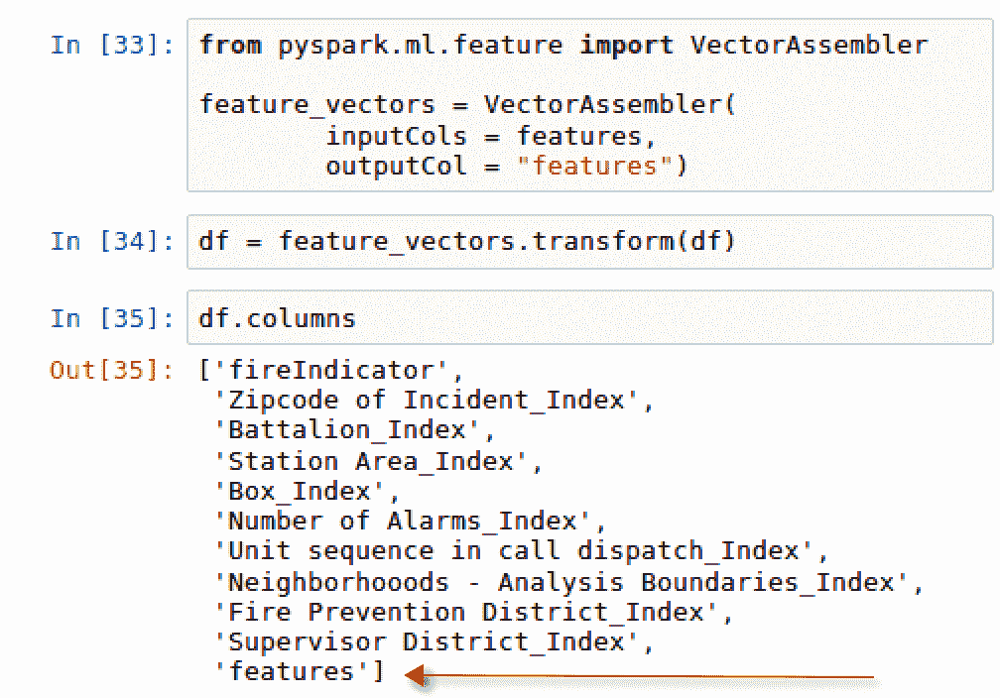

# 第五章：使用 Spark ML 预测消防部门呼叫

本章将涵盖以下内容：

+   下载旧金山消防部门呼叫数据集

+   确定逻辑回归模型的目标变量

+   为逻辑回归模型准备特征变量

+   应用逻辑回归模型

+   评估逻辑回归模型的准确性

# 介绍

分类模型是预测定义的类别结果的常用方法。我们经常使用分类模型的输出。每当我们去电影院看电影时，我们都关心电影是否符合预期？数据科学领域中最常用的分类模型之一是逻辑回归。逻辑回归模型产生一个由 sigmoid 函数激活的响应。sigmoid 函数使用模型的输入，并产生一个介于 0 和 1 之间的输出。这个输出通常是一个概率分数。许多深度学习模型也用于分类目的。常见的是，逻辑回归模型与深度学习模型一起使用，以帮助建立基准，以此为基础来评估深度学习模型。sigmoid 激活函数是深度神经网络中使用的多种激活函数之一，在深度学习中用于产生概率输出。我们将利用 Spark 中的内置机器学习库来构建一个逻辑回归模型，预测旧金山消防部门的来电是否与火灾有关，而不是其他事件。

# 下载旧金山消防部门呼叫数据集

旧金山市在收集辖区内消防部门的呼叫服务方面做得非常好。正如他们网站上所述，每条记录都包含呼叫号、事件号、地址、单位标识符、呼叫类型和处置方式。包含旧金山消防部门呼叫数据的官方网站可以通过以下链接访问：

[`data.sfgov.org/Public-Safety/Fire-Department-Calls-for-Service/nuek-vuh3`](https://data.sfgov.org/Public-Safety/Fire-Department-Calls-for-Service/nuek-vuh3)

有关数据集的一些常规信息，包含列和行的数量，如下图所示：


该数据集最后更新于 2018 年 3 月 26 日，包含大约 460 万个数据行和 34 个列。

# 准备工作

数据集以`.csv`格式提供，可以下载到本地计算机上，然后导入 Spark 中。

# 如何实现...

本节将介绍如何下载并导入`.csv`文件到我们的 Jupyter notebook 中。

1.  从网站下载数据集，通过选择“导出”然后选择 CSV，如下图所示：


1.  如果尚未这样做，请将下载的数据集命名为 `Fire_Department_Calls_for_Service.csv`

1.  将数据集保存到任何本地目录中，理想情况下，它应该保存在与本章中使用的 Spark 笔记本相同的文件夹中，如下图所示：


1.  一旦数据集保存到与笔记本相同的目录中，执行以下 `pyspark` 脚本，将数据集导入到 Spark 中，并创建一个名为 `df` 的数据框：

```py
from pyspark.sql import SparkSession
spark = SparkSession.builder \
                    .master("local") \
                    .appName("Predicting Fire Dept Calls") \
                    .config("spark.executor.memory", "6gb") \
                    .getOrCreate()

df = spark.read.format('com.databricks.spark.csv')\
                    .options(header='true', inferschema='true')\
                    .load('Fire_Department_Calls_for_Service.csv')
df.show(2)
```

# 它是如何工作的……

数据集被保存到与 Jupyter 笔记本相同的目录中，便于导入到 Spark 会话中。

1.  通过从 `pyspark.sql` 导入 `SparkSession`，初始化本地 `pyspark` 会话。

1.  通过读取 CSV 文件并使用 `header = 'true'` 和 `inferschema = 'true'` 选项，创建一个名为 `df` 的数据框。

1.  最后，理想情况下，始终运行一个脚本，显示已通过数据框导入 Spark 的数据，以确认数据已成功加载。脚本的结果，显示了旧金山消防部门来电数据集的前两行，如下图所示：


请注意，当我们将文件读取到 Spark 时，我们使用 `.load()` 将 `.csv` 文件导入到 Jupyter 笔记本中。对于我们的目的，这种方式是可以的，因为我们使用的是本地集群，但如果我们使用 Hadoop 的集群，这种方法将不可行。

# 还有更多……

数据集附带一个数据字典，定义了 34 列中每一列的标题。可以通过以下链接从同一网站访问该数据字典：

[`data.sfgov.org/api/views/nuek-vuh3/files/ddb7f3a9-0160-4f07-bb1e-2af744909294?download=true&filename=FIR-0002_DataDictionary_fire-calls-for-service.xlsx`](https://data.sfgov.org/api/views/nuek-vuh3/files/ddb7f3a9-0160-4f07-bb1e-2af744909294?download=true&filename=FIR-0002_DataDictionary_fire-calls-for-service.xlsx)

# 另见

旧金山政府网站允许在线可视化数据，可以用来快速进行数据分析。通过选择网站上的“可视化”下拉菜单，可以访问该可视化应用程序，如下图所示：


# 确定逻辑回归模型的目标变量

逻辑回归模型作为一种分类算法，旨在预测二元结果。在本节中，我们将指定数据集中最合适的列，用于预测接收到的来电是否与火灾或非火灾事件有关。

# 准备工作

本节中我们将可视化许多数据点，这将需要以下内容：

1.  通过在命令行执行 `pip install matplotlib`，确保已安装 `matplotlib`。

1.  运行`import matplotlib.pyplot as plt`，并通过运行`%matplotlib inline`确保图表能够在单元格中显示。

此外，`pyspark.sql`中的一些函数也需要进行操作，这需要`importing functions as F`。

# 如何操作...

本节将演示如何可视化来自旧金山消防部门的数据。

1.  执行以下脚本，以获取`Call Type Group`列中唯一值的初步识别：

```py
df.select('Call Type Group').distinct().show()
```

1.  有五个主要类别：

    1.  `报警`。

    1.  `潜在生命威胁`。

    1.  `非生命威胁`。

    1.  `火灾`。

    1.  `null`。

1.  不幸的是，其中一个类别是`null`值。获取每个唯一值的行计数，将有助于确定数据集中的`null`值数量。执行以下脚本生成`Call Type Group`列中每个唯一值的行计数：

```py
df.groupBy('Call Type Group').count().show()
```

1.  不幸的是，超过 280 万行数据没有与`Call Type Group`关联的值。这占总可用数据（460 万行）的 60%以上。执行以下脚本，以查看空值不平衡的条形图：

```py
df2 = df.groupBy('Call Type Group').count()
graphDF = df2.toPandas()
graphDF = graphDF.sort_values('count', ascending=False)

import matplotlib.pyplot as plt
%matplotlib inline

graphDF.plot(x='Call Type Group', y = 'count', kind='bar')
plt.title('Call Type Group by Count')
plt.show()
```

1.  可能需要选择另一个指标来确定目标变量。相反，我们可以分析`Call Type`，以识别与火灾相关的呼叫与其他所有呼叫的区别。执行以下脚本来分析`Call Type`：

```py
df.groupBy('Call Type').count().orderBy('count', ascending=False).show(100)
```

1.  与`Call Type Group`不同，似乎没有任何`null`值。`Call Type`共有 32 个独特类别；因此，它将作为火灾事件的目标变量。执行以下脚本，标记`Call Type`中包含`Fire`的列：

```py
from pyspark.sql import functions as F
fireIndicator = df.select(df["Call Type"],F.when(df["Call Type"].like("%Fire%"),1)\
                          .otherwise(0).alias('Fire Indicator'))
fireIndicator.show()
```

1.  执行以下脚本，以检索`Fire Indicator`的不同计数：

```py
fireIndicator.groupBy('Fire Indicator').count().show()
```

1.  执行以下脚本，将`Fire Indicator`列添加到原始数据框`df`中：

```py
df = df.withColumn("fireIndicator",\ 
F.when(df["Call Type"].like("%Fire%"),1).otherwise(0))
```

1.  最后，将`fireIndicator`列添加到数据框`df`中，并通过执行以下脚本确认：

```py
df.printSchema()
```

# 它是如何工作的...

构建成功的逻辑回归模型的关键步骤之一是确定一个二元目标变量，该变量将用于预测结果。本节将讲解如何选择我们的目标变量：

1.  通过识别`Call Type Group`列的唯一值，进行潜在目标列的数据分析。我们可以查看`Call Type Group`列中的唯一值，如以下截图所示：


1.  目标是识别`Call Type Group`列中是否存在缺失值，以及如何处理这些缺失值。有时，列中的缺失值可以直接删除，而其他时候则需要进行处理以填充这些值。

1.  以下截图显示了有多少`null`值：


1.  此外，我们还可以绘制`null`值的数量，以更直观地了解值的分布情况，如以下截图所示：


1.  由于在`Call Type Group`中有超过 280 万行缺失数据，如`df.groupBy`脚本和条形图所示，删除这些值没有意义，因为它们占数据集中总行数的 60%以上。因此，需要选择另一个列作为目标指标。

1.  在分析`Call Type`列时，我们发现 32 个唯一的可能值中没有空值。这使得`Call Type`成为逻辑回归模型的一个更好的目标变量。以下是`Call Type`列分析的截图：


1.  由于逻辑回归在二元结果下效果最佳，因此在`df`数据框中使用`withColumn()`操作符创建了一个新列，用于表示某个呼叫是否与火灾相关事件有关（0 或 1）。这个新列名为`fireIndicator`，可以在以下截图中看到：


1.  我们可以通过执行`groupBy().count()`来识别火灾呼叫与其他呼叫的普遍程度，如下图所示：


1.  最佳实践是在执行新修改数据框的`printSchema()`脚本后确认新列已经附加到现有数据框中。新架构的输出可以在以下截图中看到：


# 还有更多内容...

在这一部分中，使用了`pyspark.sql`模块进行了一些列操作。`withColumn()`操作符通过添加一个新列或修改现有的同名列来返回一个新的数据框或修改现有的数据框。这个操作符不应与`withColumnRenamed()`操作符混淆，后者同样返回一个新的数据框，但通过修改现有列的名称来更改为新列。最后，我们需要执行一些逻辑操作，将与`Fire`相关的值转换为 0，而没有`Fire`的转换为 1。这需要使用`pyspark.sql.functions`模块，并结合`where`函数，相当于 SQL 中的`case`语句。这个函数通过以下语法创建了一个`case`语句公式：

```py
CASE WHEN Call Type LIKE %Fire% THEN 1 ELSE 0 END
```

新数据集的结果中，`Call Type`和`fireIndicator`两列的内容如下所示：


# 另请参见

若要了解有关 Spark 中`pyspark.sql`模块的更多信息，请访问以下网站：

[`spark.apache.org/docs/2.2.0/api/python/pyspark.sql.html`](http://spark.apache.org/docs/2.2.0/api/python/pyspark.sql.html)

# 准备逻辑回归模型的特征变量

在前一节中，我们确定了将用于预测火灾报警的目标变量，并将其用于逻辑回归模型。本节将重点介绍如何识别所有有助于模型确定目标变量的特征。这就是所谓的**特征选择**。

# 准备就绪

本节将需要从`pyspark.ml.feature`导入`StringIndexer`。为了确保正确的特征选择，我们需要将字符串类型的列映射为索引列。这将帮助为分类变量生成不同的数字值，便于机器学习模型处理独立变量，从而预测目标结果。

# 如何操作...

本节将介绍如何为我们的模型准备特征变量的步骤。

1.  执行以下脚本，以仅选择与任何火灾指标无关的字段，从而更新数据框`df`：

```py
df = df.select('fireIndicator', 
    'Zipcode of Incident',
    'Battalion',
    'Station Area',
    'Box', 
    'Number of Alarms',
    'Unit sequence in call dispatch',
    'Neighborhooods - Analysis Boundaries',
    'Fire Prevention District',
    'Supervisor District')
df.show(5)
```

1.  下一步是识别数据框中是否有空值，如果存在则将其删除。执行以下脚本以识别包含空值的行数：

```py
print('Total Rows')
df.count()
print('Rows without Null values')
df.dropna().count()
print('Row with Null Values')
df.count()-df.dropna().count()
```

1.  有 16,551 行包含缺失值。执行以下脚本以更新数据框，删除所有包含空值的行：

```py
df = df.dropna()
```

1.  执行以下脚本以检索更新后的`fireIndicator`目标计数：

```py
df.groupBy('fireIndicator').count().orderBy('count', ascending = False).show()
```

1.  从`pyspark.ml.feature`导入`StringIndexer`类，为每个分类变量分配数值，如下脚本所示：

```py
from pyspark.ml.feature import StringIndexer
```

1.  使用以下脚本创建一个包含所有将用于模型的特征变量的 Python 列表：

```py
column_names = df.columns[1:]
```

1.  执行以下脚本以指定输出列格式`outputcol`，该列将通过从输入列`inputcol`中的特征列表进行`stringIndexed`来生成：

```py
categoricalColumns = column_names
indexers = []
for categoricalCol in categoricalColumns:
    stringIndexer = StringIndexer(inputCol=categoricalCol, outputCol=categoricalCol+"_Index")
    indexers += [stringIndexer]
```

1.  执行以下脚本以创建一个`model`，该模型将用于`拟合`输入列，并将新定义的输出列添加到现有的数据框`df`：

```py
models = []
for model in indexers:
    indexer_model = model.fit(df)
    models+=[indexer_model]

for i in models:
    df = i.transform(df)
```

1.  执行以下脚本以定义数据框`df`中最终选择的特征，这些特征将用于模型：

```py
df = df.select(
          'fireIndicator',
          'Zipcode of Incident_Index',
          'Battalion_Index',
          'Station Area_Index',
          'Box_Index',
          'Number of Alarms_Index',
          'Unit sequence in call dispatch_Index',
          'Neighborhooods - Analysis Boundaries_Index',
          'Fire Prevention District_Index',
          'Supervisor District_Index')
```

# 它是如何工作的...

本节将解释准备特征变量步骤背后的逻辑。

1.  只有数据框中真正与火灾指示无关的指标才会被选择用来构建预测结果的逻辑回归模型。这样做的原因是为了去除数据集中的潜在偏差，这些偏差可能已经揭示了预测的结果。这样可以最大限度地减少人为干预对最终结果的影响。更新后的数据框输出可以在以下截图中查看：


请注意，`Neighborhooods - Analysis of Boundaries` 列最初是在我们提取的数据中拼写错误的。为了保持一致性，我们将继续使用错误拼写，直到本章结束。然而，可以通过 Spark 中的 `withColumnRenamed()` 函数将列名重命名。

1.  最终选择的列如下所示：

    +   `火警指示器`

    +   `事件的邮政编码`

    +   `营`

    +   `站点区域`

    +   `箱`

    +   `警报次数`

    +   `呼叫调度中的单元序列`

    +   `Neighborhooods - Analysis Boundaries`

    +   `消防预防区`

    +   `监管区`

1.  这些列被选择是为了避免在建模中出现数据泄漏。数据泄漏在建模中很常见，它可能导致无效的预测模型，因为它可能包括那些直接影响我们要预测的结果的特征。理想情况下，我们希望使用与结果真正独立的特征。有几个列看起来存在泄漏，因此它们被从我们的数据框和模型中移除。

1.  所有缺失或为空的行都会被识别并移除，以便从模型中获得最佳性能，而不夸大或低估关键特征。可以计算并显示缺失值的行数，结果为 16,551，如以下脚本所示：


1.  我们可以查看火灾相关的呼叫频率与非火灾呼叫的比较，以下截图展示了这一情况：


1.  `StringIndexer` 被导入以帮助将多个类别或字符串特征转换为数值，以便在逻辑回归模型中进行计算。特征的输入需要是向量或数组格式，这对数值型数据是理想的。以下截图显示了将用于模型的所有特征列表：


1.  为每个类别变量构建一个索引器，指定模型中将使用的输入列（`inputCol`）和输出列（`outputCol`）。数据框中的每一列都经过调整或转换，重建一个新的输出，并使用更新后的索引，范围从 0 到该列的唯一值的最大计数。新的列在末尾添加了 `_Index`。在创建更新后的列时，原始列仍然保留在数据框中，如以下截图所示：


1.  我们可以查看其中一个新创建的列，并将其与原始列进行比较，看看字符串是如何被转换为数值类别的。以下截图展示了 `Neighborhooods - Analysis Boundaries` 和 `Neighborhooods - Analysis Boundaries_Index` 的比较：


1.  然后，数据框被裁剪，只保留数值型数据，并去除已经转换的原始类别变量。从建模的角度来看，非数值型数据不再起作用，因此被从数据框中删除。

1.  新列已打印出来，以确认数据框中每个值的类型是双精度或整数，如下图所示：


# 还有更多...

最后查看经过修改的数据框，您会发现它只包含数值型数据，如下图所示：


# 另请参见

要了解更多关于`StringIndexer`的信息，请访问以下网站：[`spark.apache.org/docs/2.2.0/ml-features.html#stringindexer`](https://spark.apache.org/docs/2.2.0/ml-features.html#stringindexer)。

# 应用逻辑回归模型

现在已经为将模型应用到数据框做好准备。

# 准备工作

本节将重点介绍应用一种非常常见的分类模型——**逻辑回归**，这将涉及从 Spark 中导入以下一些内容：

```py
from pyspark.ml.feature import VectorAssembler
from pyspark.ml.evaluation import BinaryClassificationEvaluator
from pyspark.ml.classification import LogisticRegression
```

# 如何操作...

本节将逐步介绍应用模型和评估结果的过程。

1.  执行以下脚本，将数据框中的所有特征变量放入一个名为`features`的列表中：

```py
features = df.columns[1:]
```

1.  执行以下操作以导入`VectorAssembler`并配置将分配给特征向量的字段，通过指定`inputCols`和`outputCol`：

```py
from pyspark.ml.feature import VectorAssembler
feature_vectors = VectorAssembler(
    inputCols = features,
    outputCol = "features")
```

1.  执行以下脚本，使用`transform`函数将`VectorAssembler`应用到数据框中：

```py
df = feature_vectors.transform(df)
```

1.  修改数据框，移除除`fireIndicator`和`features`之外的所有列，如下脚本所示：

```py
df = df.drop( 'Zipcode of Incident_Index',
              'Battalion_Index',
              'Station Area_Index',
              'Box_Index',
              'Number of Alarms_Index',
              'Unit sequence in call dispatch_Index',
              'Neighborhooods - Analysis Boundaries_Index',
              'Fire Prevention District_Index',
              'Supervisor District_Index')
```

1.  修改数据框，将`fireIndicator`重命名为`label`，如下脚本所示：

```py
df = df.withColumnRenamed('fireIndicator', 'label')
```

1.  将整个数据框`df`按 75:25 的比例拆分为训练集和测试集，并设置随机种子为`12345`，如下脚本所示：

```py
(trainDF, testDF) = df.randomSplit([0.75, 0.25], seed = 12345)
```

1.  从`pyspark.ml.classification`导入`LogisticRegression`库，并配置以从数据框中引入`label`和`features`，然后在训练数据集`trainDF`上进行拟合，如下脚本所示：

```py
from pyspark.ml.classification import LogisticRegression
logreg = LogisticRegression(labelCol="label", featuresCol="features", maxIter=10)
LogisticRegressionModel = logreg.fit(trainDF)
```

1.  转换测试数据框`testDF`，应用逻辑回归模型。新的数据框包含预测结果的分数，命名为`df_predicted`，如下脚本所示：

```py
df_predicted = LogisticRegressionModel.transform(testDF)
```

# 它是如何工作的...

本节将解释应用模型和评估结果步骤背后的逻辑。

1.  分类模型在将所有特征合并为一个单一向量进行训练时效果最佳。因此，我们通过将所有特征收集到一个名为`features`的单一列表中，开始向量化过程。由于我们的标签是数据框的第一列，因此我们将其排除，并将之后的每一列作为特征列或特征变量。

1.  向量化过程继续进行，将`features`列表中的所有变量转换为一个输出到`features`列的单一向量。这个过程需要从`pyspark.ml.feature`导入`VectorAssembler`。

1.  应用`VectorAssembler`会通过创建一个名为`features`的新列来转换数据框，具体见下图：



1.  在这一点上，模型中唯一需要使用的列是标签列`fireIndicator`和`features`列。其他所有列可以从数据框中删除，因为它们在建模过程中不再需要。

1.  此外，为了帮助逻辑回归模型，我们将把名为`fireIndicator`的列更名为`label`。`df.show()`脚本的输出可以在以下截图中看到，其中包括新重命名的列：


1.  为了减少过拟合，数据框将被拆分为测试数据集和训练数据集，以便在训练数据集`trainDF`上训练模型，并在测试数据集`testDF`上进行测试。设置了一个随机种子`12345`，以确保每次执行该单元时随机性的一致性。我们可以在以下截图中看到数据拆分的行数：


1.  然后，从`pyspark.ml.classification`导入逻辑回归模型`LogisticRegression`，并配置以输入数据框中与特征和标签相关的列名。此外，逻辑回归模型会被分配给一个名为`logreg`的变量，接着对我们的数据集`trainDF`进行训练。

1.  创建了一个新的数据框`predicted_df`，基于对测试数据框`testDF`的变换，逻辑回归模型对其评分后，该模型为`predicted_df`创建了三个额外的列。根据评分，额外的三个列是`rawPrediction`、`probability`和`prediction`，具体见下图：


1.  最后，可以对`df_predicted`中的新列进行分析，具体见下图：


# 还有更多...

有一件重要的事情需要记住，因为它最初可能看起来有些直觉不合常理，那就是我们的概率阈值在数据框中设置为 50%。任何概率大于或等于 0.500 的调用都会被预测为 0.0，而任何概率小于 0.500 的调用则会被预测为 1.0。这个设置是在管道开发过程中完成的，只要我们知道阈值是什么，并且了解预测是如何分配的，我们就能很好地应对。

# 另请参阅

要了解更多关于`VectorAssembler`的信息，请访问以下网站：

[`spark.apache.org/docs/latest/ml-features.html#vectorassembler`](https://spark.apache.org/docs/latest/ml-features.html#vectorassembler)

# 评估逻辑回归模型的准确性

现在我们准备好评估预测是否正确分类为火灾事件的性能。

# 准备开始

我们将进行模型分析，这需要导入以下内容：

+   `from sklearn import metrics`

# 如何操作...

本节讲解了评估模型性能的步骤。

1.  使用`.crosstab()`函数创建混淆矩阵，如以下脚本所示：

```py
df_predicted.crosstab('label', 'prediction').show()
```

1.  从`sklearn`导入`metrics`模块来帮助使用以下脚本测量准确性：

```py
from sklearn import metrics
```

1.  创建两个变量，分别代表数据框中的`actual`和`predicted`列，这些列将用于衡量准确性，使用以下脚本：

```py
actual = df_predicted.select('label').toPandas()
predicted = df_predicted.select('prediction').toPandas()
```

1.  使用以下脚本计算准确率预测分数：

```py
metrics.accuracy_score(actual, predicted)
```

# 它是如何工作的...

本节解释了如何评估模型的性能。

1.  为了计算模型的准确率，重要的是能够识别我们的预测有多准确。通常，使用混淆矩阵交叉表来可视化这一点，它展示了正确和错误的预测分数。我们使用`df_predicted`数据框中的`crosstab()`函数创建了一个混淆矩阵，显示我们有 964,980 个负类正确预测（标签为 0），以及 48,034 个正类正确预测（标签为 1），如下图所示：


1.  从本节前面的内容我们知道，`testDF`数据框总共有 1,145,589 行；因此，我们可以使用以下公式计算模型的准确性：*(TP + TN) / 总数*。准确率为 88.4%。

1.  需要注意，并非所有的假分数都具有相同的意义。例如，从火灾安全的角度来看，将一次通话错误地归类为与火灾无关，而实际上它与火灾有关，比将其错误地归类为火灾事件要更为严重。这种情况称为假阴性。为了衡量假阴性（**FN**），有一个叫做**召回率**的指标。

1.  虽然我们可以像最后一步那样手动计算准确率，但最好能够自动计算准确率。这可以通过导入`sklearn.metrics`模块轻松实现，它是一个常用于评分和模型评估的模块。

1.  `sklearn.metrics`接受两个参数：我们用于标签的实际结果和从逻辑回归模型中得出的预测值。因此，创建了两个变量，`actual`和`predicted`，并使用`accuracy_score()`函数计算准确率，如下图所示：


1.  准确率与我们手动计算的结果相同，为 88.4%。

# 还有更多…

我们现在知道我们的模型能够以 88.4%的准确率准确预测来电是否与火灾相关。乍一听，这似乎是一个强有力的预测；然而，始终需要将其与基准得分进行比较，其中每个电话都被预测为非火灾电话。预测的数据框架`df_predicted`中标签`1`和`0`的分布情况如下图所示：


我们可以在同一个数据框架上运行一些统计信息，使用`df_predicted.describe('label').show()`脚本来计算标签值`1`的均值。该脚本的输出可以在下面的截图中看到：


一个基础模型在预测值为`1`时的预测率为 14.94%，换句话说，它的预测率为*100 - 14.94*%，即为 0 时的预测率为 85.06%。因此，由于 85.06%小于模型预测率 88.4%，该模型相比于盲目猜测（是否为火灾相关的电话）提供了更好的改进。

# 另请参见

要了解更多关于准确度与精确度的知识，请访问以下网站：

[`www.mathsisfun.com/accuracy-precision.html`](https://www.mathsisfun.com/accuracy-precision.html)
