# 第六章：在生成网络中使用 LSTMs

阅读完本章后，您将能够完成以下任务：

+   下载将作为输入文本使用的小说/书籍

+   准备和清理数据

+   句子标记化

+   训练并保存 LSTM 模型

+   使用模型生成相似的文本

# 简介

由于**循环神经网络**（**RNNs**）在反向传播方面的缺点，**长短期记忆单元**（**LSTMs**）和**门控循环单元**（**GRUs**）近年来在学习序列输入数据时越来越受欢迎，因为它们更适合解决梯度消失和梯度爆炸的问题。

# 下载将作为输入文本使用的小说/书籍

在本食谱中，我们将按步骤进行操作，下载我们将作为输入文本使用的小说/书籍，以执行本食谱。

# 准备工作

+   将输入数据以`.txt`文件的形式放入工作目录。

+   输入可以是任何类型的文本，如歌词、小说、杂志文章或源代码。

+   大多数经典文本不再受版权保护，可以免费下载安装并用于实验。获取免费书籍的最佳地方是[古腾堡计划](http://www.gutenberg.org/)。

+   在本章中，我们将使用**鲁德亚德·吉卜林**的《丛林之书》作为输入，训练我们的模型并生成统计上相似的文本作为输出。以下截图显示了如何下载必要的`.txt`格式文件：

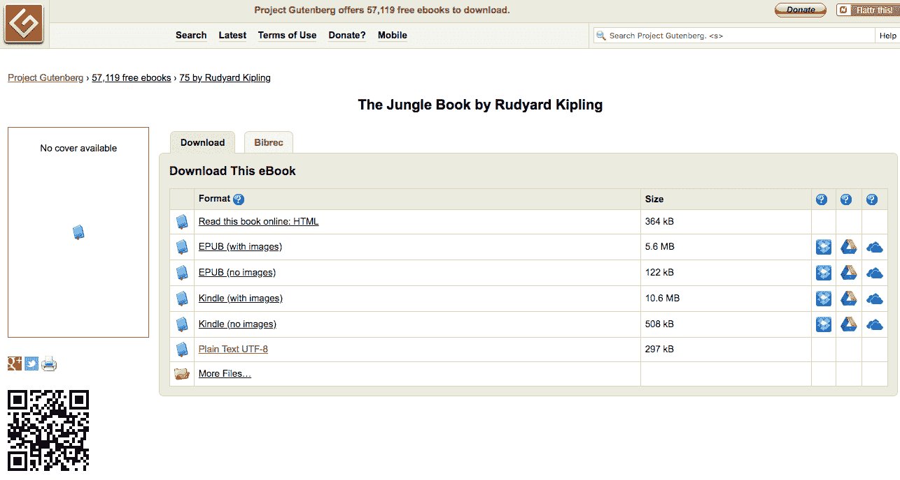

+   访问网站并搜索所需的书籍后，点击 Plain Text UTF-8 并下载。UTF-8 基本上指定了编码类型。文本可以复制粘贴或直接保存到工作目录，方法是点击链接。

# 如何实现...

在开始之前，查看并分析数据总是有帮助的。通过查看数据，我们可以看到数据中有很多标点符号、空格、引号、大写字母和小写字母。在对数据进行任何分析或将其输入 LSTM 网络之前，我们需要先准备数据。我们需要一些库来简化数据的处理：

1.  通过执行以下命令导入必要的库：

```py
from keras.preprocessing.text import Tokenizer
from keras.utils import to_categorical
from keras.models import Sequential
from keras.layers import Dense, lSTM, Dropout, Embedding
import numpy as np
from pickle import dump
import string
```

1.  上述命令的输出如下截图所示：

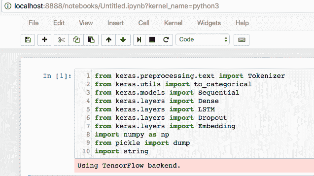

1.  总是检查当前工作目录并选择所需的文件夹作为工作目录是个好主意。在我们的例子中，`.txt`文件名为`junglebook.txt`，它位于名为`Chapter 8`的文件夹中。因此，我们将选择该文件夹作为整个章节的工作目录。这可以通过以下截图所示的方式完成：

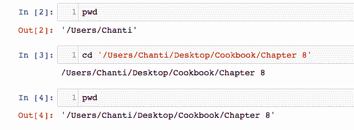

1.  接下来，通过定义名为`load_document`的函数将文件加载到程序内存中，可以通过执行以下命令完成此操作：

```py
def load_document(name):
    file = open(name, 'r')
    text = file.read()
    file.close()
    return text
```

1.  使用先前定义的函数将文档加载到内存中，并使用以下脚本打印文本文件的前`2000`个字符：

```py
input_filename = 'junglebook.txt'
doc = load_document(input_filename)
print(doc[:2000])
```

1.  运行前述函数以及命令会产生以下截图所示的输出：

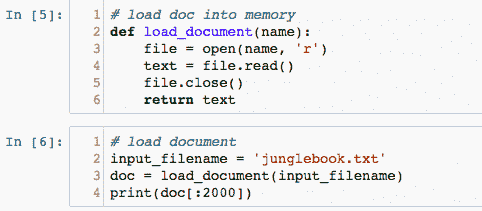

上述代码的输出显示在这里的截图中：

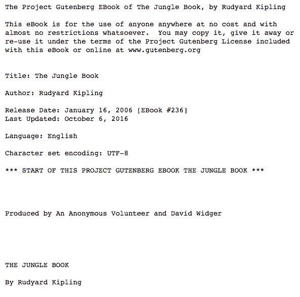

以下截图是之前输出的继续：

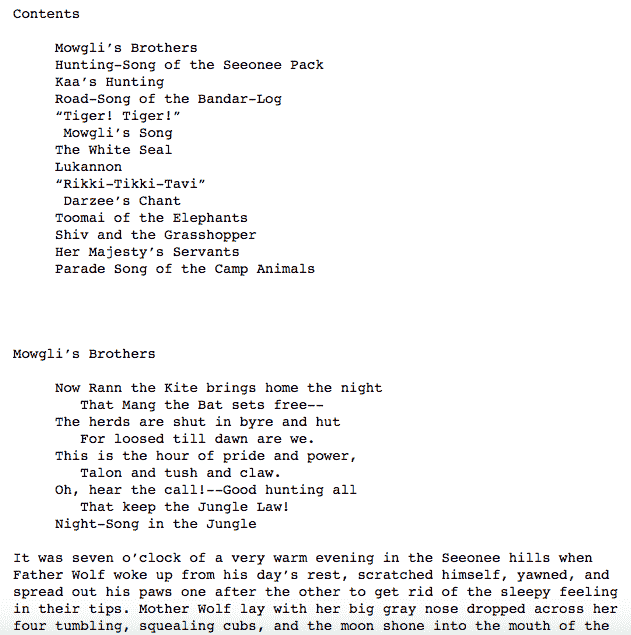

1.  如前面截图所示，`.txt`文件中的前`2000`个字符被打印出来。通常，分析数据时先查看它的内容是一个好主意，这样可以更好地了解如何进行后续的预处理步骤。

# 它的工作原理...

1.  `array`函数将用于处理以数组形式表示的数据。`numpy`库提供了这个函数。

1.  由于我们的数据仅为文本数据，我们将需要字符串库来处理所有输入数据为字符串形式，然后将单词编码为整数，便于输入。

1.  `tokenizer`函数将用于将所有句子拆分为标记，其中每个标记表示一个单词。

1.  为了将字典保存到 pickle 文件中，需要使用`dump`函数，因此需要 pickle 库。

1.  `keras`库中的`to_categorical`函数将类向量（整数）转换为二进制类矩阵，例如，用于`categorical_crossentropy`，我们在后面的步骤中将需要它，以便将标记映射到唯一的整数，并反向操作。

1.  本章中所需的其他 Keras 层包括 LSTM 层、全连接层、丢弃层和嵌入层。模型将按顺序定义，因此我们需要从`keras`库中导入顺序模型。

# 还有更多...

+   你还可以使用相同的模型处理不同类型的文本，如网站上的客户评价、推文、结构化文本（如源代码）、数学理论等。

+   本章的目的是理解 LSTM 如何学习长期依赖性，以及与循环神经网络相比，它们在处理顺序数据时如何表现得更好。

+   另一个好主意是将*宝可梦*的名称输入模型，并尝试生成你自己的宝可梦名称。

# 另见

有关使用的不同库的更多信息，请访问以下链接：

+   [`www.scipy-lectures.org/intro/numpy/array_object.html`](https://www.scipy-lectures.org/intro/numpy/array_object.html)

+   [`docs.python.org/2/library/string.html`](https://docs.python.org/2/library/string.html)

+   [`wiki.python.org/moin/UsingPickle`](https://wiki.python.org/moin/UsingPickle)

+   [`keras.io/preprocessing/text/`](https://keras.io/preprocessing/text/)

+   [`keras.io/layers/core/`](https://keras.io/layers/core/)

+   [`keras.io/layers/recurrent/`](https://keras.io/layers/recurrent/)

# 数据的准备和清理

本章节的这一部分将讨论在将数据输入模型之前的各种数据准备和文本预处理步骤。我们如何准备数据，实际上取决于我们打算如何建模，进而决定了我们如何使用它。

# 准备中

语言模型将基于统计数据，预测给定输入文本序列的每个单词的概率。预测出的单词将作为输入反馈给模型，从而生成下一个单词。

一个关键决策是输入序列的长度应该是多少。它们需要足够长，以便模型能够学习单词预测的上下文。这个输入长度还将决定在我们使用模型时，用于生成新序列的种子文本的长度。

为了简化起见，我们将随意选择一个 50 个单词的长度作为输入序列的长度。

# 如何操作...

基于对文本的回顾（我们之前已进行过），以下是可以对输入文件中的文本进行清理和预处理的一些操作。我们已呈现了一些关于文本预处理的选项。然而，作为练习，你可能想要探索更多清理操作：

+   将破折号 `–` 替换为空格，以便更好地拆分单词

+   根据空格拆分单词

+   删除输入文本中的所有标点符号，以减少输入模型的文本中唯一字符的数量（例如，Why? 变为 Why）

+   删除所有非字母单词，以去除独立的标点符号标记和表情符号

+   将所有单词从大写转换为小写，以进一步减少标记总数的大小，并消除任何不一致和数据冗余

词汇表的大小是语言建模中的决定性因素，并且会影响模型的训练时间。较小的词汇表能使模型更高效，训练更快。虽然在某些情况下较小的词汇表更好，但在其他情况下，为了防止过拟合，较大的词汇表有其作用。为了预处理数据，我们需要一个函数，它接受整个输入文本，基于空格将其拆分，删除所有标点符号，规范化所有字母大小写，并返回一个标记序列。为此，定义 `clean_document` 函数，执行以下命令：

```py
 import string
 def clean_document(doc):
     doc = doc.replace('--', ' ')
     tokens = doc.split()
     table = str.maketrans('', '', string.punctuation)
     tokens = [w.translate(table) for w in tokens]
     tokens = [word for word in tokens if word.isalpha()]
     tokens = [word.lower() for word in tokens]
     return tokens
```

1.  之前定义的函数基本上会将加载的文档/文件作为参数，并返回一个干净的标记数组，如以下截图所示：

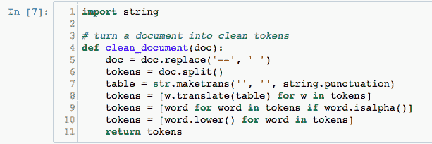

1.  接下来，打印出一些标记和统计数据，以便更好地理解 `clean_document` 函数的作用。此步骤通过执行以下命令完成：

```py
tokens = clean_document(doc)
print(tokens[:200])
print('Total Tokens: %d' % len(tokens))
print('Total Unique Tokens: %d' % len(set(tokens)))
```

1.  上述命令组的输出会打印前两百个标记，具体内容如以下截图所示：

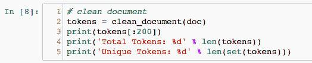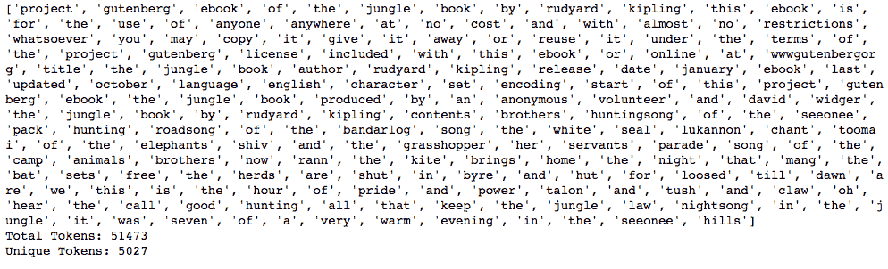

1.  接下来，使用以下命令将所有这些标记组织成序列，每个序列包含 50 个单词（随意选择）。

```py
 length = 50 + 1
 sequences = list()
 for i in range(length, len(tokens)):
     seq = tokens[i-sequence_length:i]
     line = ' '.join(seq)
     sequences.append(line)
 print('Total Sequences: %d' % len(sequences))
```

可以通过打印文档生成的所有序列来查看总数，如下图所示：

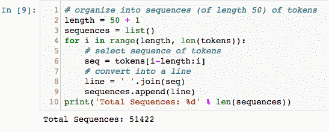

1.  使用以下命令，定义`save_doc`函数，将所有生成的标记以及序列保存到工作目录中的文件：

```py
def save_document(lines, name):
    data = '\n'.join(lines)
    file = open(name, 'w')
    file.write(data)
    file.close()
```

要保存序列，请使用以下两个命令：

```py
 output_filename = 'junglebook_sequences.txt'
 save_document(sequences, output_filename)
```

1.  该过程在下图中有所示例：

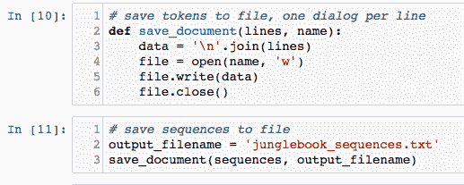

1.  接下来，使用`load_document`函数将保存的文档（包含所有保存的标记和序列）加载到内存中，`load_document`函数定义如下：

```py
def load_document(name):
    file = open(name, 'r')
    text = file.read()
    file.close()
    return text

# function to load document and split based on lines
input_filename = 'junglebook_sequences.txt'
doc = load_document(input_filename)
lines = doc.split('\n')
```

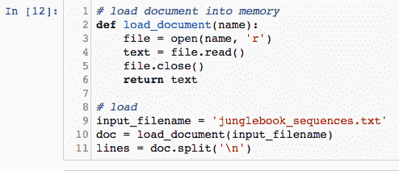

# 它的工作原理...

1.  `clean_document`函数删除所有空格、标点符号、大写字母和引号，并将整个文档分割成标记，每个标记是一个单词。

1.  通过打印文档中标记的总数和唯一标记的总数，我们会发现`clean_document`函数生成了 51,473 个标记，其中 5,027 个标记（或单词）是唯一的。

1.  `save_document`函数将所有这些标记以及生成每个包含 50 个单词的序列所需的唯一标记进行保存。请注意，通过循环遍历所有生成的标记，我们能够生成一个包含 51,422 个序列的长列表。这些序列将作为输入用于训练语言模型。

1.  在训练所有 51,422 个序列之前，最好先将标记和序列保存到文件中。保存后，可以使用定义的`load_document`函数将文件重新加载到内存中。

1.  序列被组织为 50 个输入标记和一个输出标记（这意味着每个序列有 51 个标记）。为了预测每个输出标记，前 50 个标记将作为模型的输入。我们可以通过从第 51 个标记开始遍历标记列表，并将前 50 个标记作为一个序列来实现这一点，然后重复这个过程，直到所有标记的列表结束。

# 另见

访问以下链接，了解使用各种函数进行数据准备的更好方法：

+   [`docs.python.org/3/library/tokenize.html`](https://docs.python.org/3/library/tokenize.html)

+   [`keras.io/utils/`](https://keras.io/utils/)

+   [`www.pythonforbeginners.com/dictionary/python-split`](http://www.pythonforbeginners.com/dictionary/python-split)

+   [`www.tutorialspoint.com/python/string_join.htm`](https://www.tutorialspoint.com/python/string_join.htm)

+   [`www.tutorialspoint.com/python/string_lower.htm`](https://www.tutorialspoint.com/python/string_lower.htm)

# 对句子进行标记化

在定义并将数据输入到 LSTM 网络之前，重要的是将数据转换为神经网络能够理解的形式。计算机理解所有内容都是二进制代码（0 和 1），因此文本或字符串格式的数据需要转换为一热编码变量。

# 准备就绪

要了解一热编码如何工作，请访问以下链接：

+   [`machinelearningmastery.com/how-to-one-hot-encode-sequence-data-in-python/`](https://machinelearningmastery.com/how-to-one-hot-encode-sequence-data-in-python/)

+   [`scikit-learn.org/stable/modules/generated/sklearn.preprocessing.OneHotEncoder.html`](http://scikit-learn.org/stable/modules/generated/sklearn.preprocessing.OneHotEncoder.html)

+   [`stackoverflow.com/questions/37292872/how-can-i-one-hot-encode-in-python`](https://stackoverflow.com/questions/37292872/how-can-i-one-hot-encode-in-python)

+   [`www.ritchieng.com/machinelearning-one-hot-encoding/`](https://www.ritchieng.com/machinelearning-one-hot-encoding/)

+   [`hackernoon.com/what-is-one-hot-encoding-why-and-when-do-you-have-to-use-it-e3c6186d008f`](https://hackernoon.com/what-is-one-hot-encoding-why-and-when-do-you-have-to-use-it-e3c6186d008f)

# 如何操作...

完成前面的部分后，你应该能够清理整个语料库并分割句子。接下来的步骤，涉及一热编码和句子标记化，可以按照以下方式进行：

1.  一旦标记和序列被保存到文件并加载到内存中，它们必须被编码为整数，因为模型中的词嵌入层期望输入序列由整数而非字符串组成。

1.  这是通过将词汇表中的每个单词映射到一个唯一的整数并对输入序列进行编码来实现的。稍后，在进行预测时，可以将预测结果转换（或映射）回数字，以便在相同的映射中查找相关单词，并将其从整数反向映射回单词。

1.  要执行这种编码，利用 Keras API 中的`Tokenizer`类。在编码之前，必须先对整个数据集进行训练，以便它能找到所有独特的标记，并为每个标记分配一个独特的整数。执行这些命令的方法如下：

```py
tokenizer = Tokenizer()
tokenizer.fit_on_texts(lines)
sequences = tokenizer.texts_to_sequences(lines)
```

1.  你还需要在稍后定义嵌入层之前计算词汇表的大小。这是通过计算映射字典的大小来确定的。

1.  因此，在指定嵌入层的词汇表大小时，应该将其指定为比实际词汇表大 1。词汇表大小因此定义如下：

```py
vocab_size = len(tokenizer.word_index) + 1
print('Vocabulary size : %d' % vocab_size)
```

1.  一旦输入序列被编码，它们需要被分成输入和输出元素，这可以通过数组切片来实现。

1.  分离后，将输出单词进行独热编码。这意味着将其从整数转换为一个 n 维向量，其中每个维度对应词汇表中的一个单词，并且用 1 表示该单词在词汇表中整数值对应的索引。Keras 提供了`to_categorical()`函数，可以用来为每个输入-输出序列对对输出单词进行独热编码。

1.  最后，指定给嵌入层输入序列的长度。我们知道有 50 个单词，因为模型是通过指定序列长度为 50 来设计的，但一种好的通用方式是使用输入数据形状的第二维（列数）来指定序列长度。

1.  这可以通过执行以下命令来完成：

```py
sequences = array(sequences)
Input, Output = sequences[:,:-1], sequences[:,-1]
Output = to_categorical(Output, num_classes=vocab_size)
sequence_length = Input.shape[1]
```

# 它是如何工作的...

本节将描述您在执行前一节命令时必须看到的输出：

1.  在运行分词命令并计算词汇表长度后，您必须看到如下所示的输出：

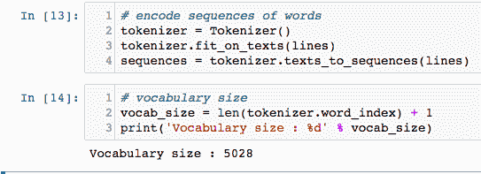

1.  单词从 1 开始分配值，直到总词数（例如，本例中为 5,027）。嵌入层需要为词汇表中从索引 1 到最大索引的每个单词分配一个向量表示。词汇表末尾的单词的索引将是 5,027；这意味着数组的长度必须是 5,027 + 1。

1.  数组切片和将句子分割成每个序列 50 个单词的输出应如下所示：


1.  `to_categorical()`函数用于让模型学习预测下一个单词的概率分布。

# 还有更多...

有关在 Python 中重塑数组的更多信息，请参阅以下链接：

+   [`docs.scipy.org/doc/numpy/reference/generated/numpy.reshape.html`](https://docs.scipy.org/doc/numpy/reference/generated/numpy.reshape.html)

+   [`machinelearningmastery.com/index-slice-reshape-numpy-arrays-machine-learning-python/`](https://machinelearningmastery.com/index-slice-reshape-numpy-arrays-machine-learning-python/)

# 训练并保存 LSTM 模型

现在，您可以从准备好的数据中训练一个统计语言模型。

将要训练的模型是一个神经语言模型。它有一些独特的特点：

+   它使用分布式表示法来表示单词，这样具有相似含义的不同单词将具有相似的表示。

+   它在学习模型的同时学习表示

+   它学会使用前 50 个单词的上下文来预测下一个单词的概率

具体而言，您将使用一个嵌入层来学习单词的表示，并使用**长短期记忆**（**LSTM**）递归神经网络来学习基于上下文预测单词。

# 正在准备

学到的嵌入需要知道词汇表的大小和输入序列的长度，如前面所述。它还有一个参数，用来指定将使用多少维度来表示每个词。即嵌入向量空间的大小。

常见的值为 50、100 和 300。我们这里使用 100，但可以考虑测试更小或更大的值，并评估这些值的指标。

网络将包含以下内容：

+   两个 LSTM 隐藏层，每个隐藏层有 200 个记忆单元。更多的记忆单元和更深的网络可能会获得更好的结果。

+   一个丢弃层（dropout），丢弃率为 0.3 或 30%，有助于网络减少对每个神经元/单元的依赖，减少过拟合数据。

+   一个包含 200 个神经元的密集全连接层连接到 LSTM 隐藏层，用于解释从序列中提取的特征。

+   输出层，它预测下一个词作为一个大小为词汇表的向量，并为词汇表中的每个词分配一个概率。

+   第二个密集或全连接层使用 softmax 分类器，以确保输出具有归一化概率的特征（例如在 0 和 1 之间）。

# 如何做...

1.  模型通过以下命令定义，并在下方截图中进行说明：

```py
model = Sequential()
model.add(Embedding(vocab_size, 100, input_length=sequence_length))
model.add(LSTM(200, return_sequences=True))
model.add(LSTM(200))
model.add(Dropout(0.3))
model.add(Dense(200, activation='relu'))
model.add(Dense(vocab_size, activation='softmax'))
print(model.summary())
```

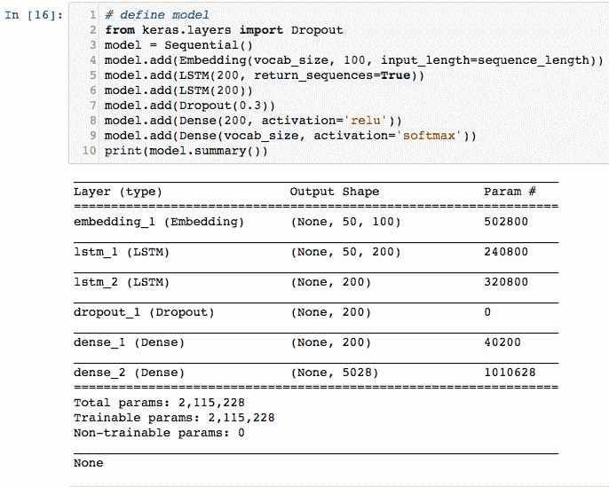

1.  打印模型摘要，仅确保模型按照预期构建。

1.  编译模型，指定需要的类别交叉熵损失以适配模型。将训练的周期数设为 75，并且使用批量大小为 250 的小批量训练。这是通过以下命令实现的：

```py
 model.compile(loss='categorical_crossentropy', optimizer='adam', 
        metrics=['accuracy'])

 model.fit(Input, Output, batch_size=250, epochs=75)
```

1.  前面命令的输出结果如以下截图所示：

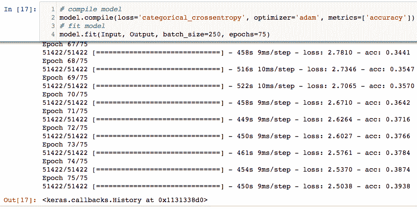

1.  一旦模型编译完成，使用以下命令将其保存：

```py
model.save('junglebook_trained.h5')

dump(tokenizer, open('tokenizer.pkl', 'wb'))
```

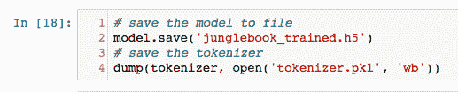

# 它是如何工作的...

1.  模型是在 Keras 框架中使用`Sequential()`函数构建的。模型中的第一层是一个嵌入层，它将词汇表的大小、向量维度和输入序列长度作为参数。

1.  接下来的两层是 LSTM 层，每层有 200 个记忆单元。可以尝试更多的记忆单元和更深的网络，检查是否能够提高准确性。

1.  下一个层是一个丢弃层，丢弃概率为 30%，这意味着在训练过程中有 30%的机会某个记忆单元不被使用。这样可以防止数据过拟合。同样，丢弃概率可以进行调整和优化。

1.  最后的两层是两个全连接层。第一层具有`relu`激活函数，第二层是 softmax 分类器。打印模型摘要以检查模型是否按照要求构建。

1.  注意，在这种情况下，总的可训练参数数量为 2,115,228。模型摘要还显示了每一层将在模型中训练的参数数量。

1.  模型以 250 的迷你批次，在 75 个周期内进行训练，以最小化训练时间。在我们的案例中，将周期数增加到 100 以上，并在训练时使用较小的批次，能显著提高模型的准确度，同时减少损失。

1.  在训练过程中，你将看到性能摘要，包括每个批次更新结束时根据训练数据评估的损失和准确度。在我们的案例中，经过 75 个周期后，我们获得了接近 40%的准确率。

1.  模型的目标不是以 100%的准确率记住文本，而是捕捉输入文本的特性，比如在自然语言和句子中存在的长期依赖关系和结构。

1.  训练完成后，模型会保存在名为`junglebook_trained.h5`的工作目录中。

1.  我们还需要在以后将模型加载到内存中进行预测时，将单词映射到整数。这些信息存储在`Tokenizer`对象中，并通过`Pickle`库中的`dump()`函数进行保存。

# 还有更多...

Jason Brownlee 在 Machine Learning Mastery 网站上的博客包含了大量有关开发、训练和调整用于自然语言处理的机器学习模型的有用信息。你可以通过以下链接访问它们：

[`machinelearningmastery.com/deep-learning-for-nlp/`](https://machinelearningmastery.com/deep-learning-for-nlp/)

[`machinelearningmastery.com/lstms-with-python/`](https://machinelearningmastery.com/lstms-with-python/)

[`machinelearningmastery.com/blog/`](https://machinelearningmastery.com/deep-learning-for-nlp/)

# 另见

进一步的信息，关于不同的 keras 层和本节中使用的其他函数，可以通过以下链接找到：

+   [`keras.io/models/sequential/`](https://keras.io/models/sequential/)

+   [`docs.python.org/2/library/pickle.html`](https://docs.python.org/2/library/pickle.html)

+   [`keras.io/optimizers/`](https://keras.io/optimizers/)

+   [`keras.io/models/model/`](https://keras.io/models/model/)

# 使用模型生成相似文本

现在你已经有了一个训练好的语言模型，可以开始使用它。在这个例子中，你可以用它生成具有与源文本相同统计特性的全新文本序列。虽然这在实际应用中并不实用（至少对于这个示例而言），但它提供了一个具体的例子，展示了语言模型学到的内容。

# 准备工作

1.  重新加载训练序列。你可以通过使用我们最初开发的`load_document()`函数来实现。代码如下：

```py
def load_document(name):
    file = open(name, 'r')
    text = file.read()
    file.close()
    return text

# load sequences of cleaned text
input_filename = 'junglebook_sequences.txt'
doc = load_document(input_filename)
lines = doc.split('\n')
```

上述代码的输出如下截图所示：

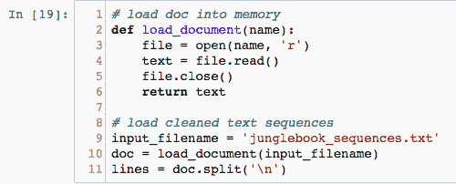

1.  请注意，输入文件名现在是`'junglebook_sequences.txt'`，它将把保存的训练序列加载到内存中。我们需要这些文本，以便选择一个源序列作为输入，供模型生成新的文本序列。

1.  模型将需要 50 个单词作为输入。

    后续，需要指定期望的输入长度。这可以通过计算加载数据的一行的长度来确定，并减去 1 作为期望的输出单词（该单词也位于同一行），如下面所示：

    `sequence_length = len(lines[0].split()) - 1`

1.  接下来，通过执行以下命令将训练好的模型加载到内存中：

```py
 from keras.models import load_model
 model = load_model('junglebook.h5')
```

1.  生成文本的第一步是准备一个种子输入。为此，从输入文本中选择一行随机文本。选择后，打印它，以便你了解所使用的内容。此操作如下所示：

```py
from random import randint
seed_text = lines[randint(0,len(lines))]
print(seed_text + '\n')
```

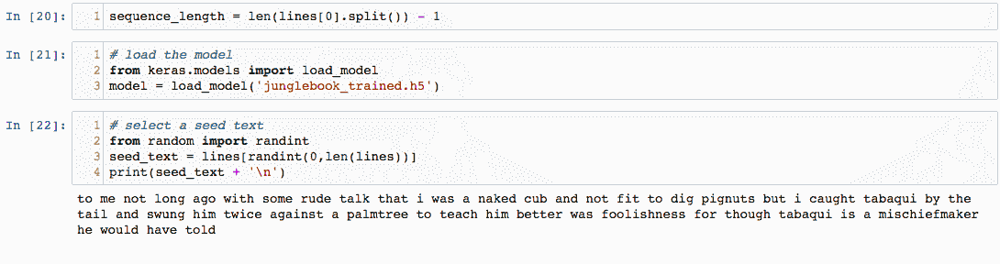

# 如何做……

1.  现在，你已经准备好逐个生成新单词。首先，使用训练模型时所用的相同分词器将种子文本编码为整数，可以通过以下代码完成：

    `encoded = tokenizer.texts_to_sequences([seed_text])[0]`

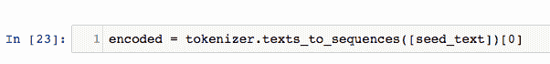

1.  模型可以通过调用`model.predict_classes()`直接预测下一个单词，该方法将返回具有最高概率的单词索引：

```py
 prediction = model.predict_classes(encoded, verbose=0)

```

1.  查找 Tokenizers 映射中的索引，以获取相关的单词，如下面的代码所示：

```py
 out_word = ''
 for word, index in tokenizer.word_index.items():
         if index == prediction:
                 out_word = word
                 break
```

1.  将此单词附加到种子文本并重复此过程。重要的是，输入序列将变得太长。我们可以在输入序列被编码为整数后，对其进行截断至所需长度。Keras 提供了`pad_sequences()`函数，可以用来执行此截断，如下所示：

```py
 encoded = pad_sequences([encoded], maxlen=seq_length, truncating='pre')

```

1.  将所有这些内容封装成一个名为`generate_sequence()`的函数，该函数接受模型、分词器、输入序列长度、种子文本和要生成的单词数作为输入。然后，它返回由模型生成的单词序列。你可以使用以下代码来实现：

```py
 from random import randint
 from pickle import load
 from keras.models import load_model
 from keras.preprocessing.sequence import pad_sequences

 def load_document(filename):
     file = open(filename, 'r')
     text = file.read()
     file.close()
     return text

 def generate_sequence(model, tokenizer, sequence_length, seed_text, n_words):
     result = list()
     input_text = seed_text
     for _ in range(n_words):
         encoded = tokenizer.texts_to_sequences([input_text])[0]
         encoded = pad_sequences([encoded], maxlen=seq_length,                 truncating='pre')
         prediction = model.predict_classes(encoded, verbose=0)
         out_word = ''
             for word, index in tokenizer.word_index.items():
                 if index == prediction:
                     out_word = word
                     break
      input_text += ' ' + out_word
      result.append(out_word)
    return ' '.join(result)

 input_filename = 'junglebook_sequences.txt'
 doc = load_document(input_filename)
 lines = doc.split('\n')
 seq_length = len(lines[0].split()) - 1
```

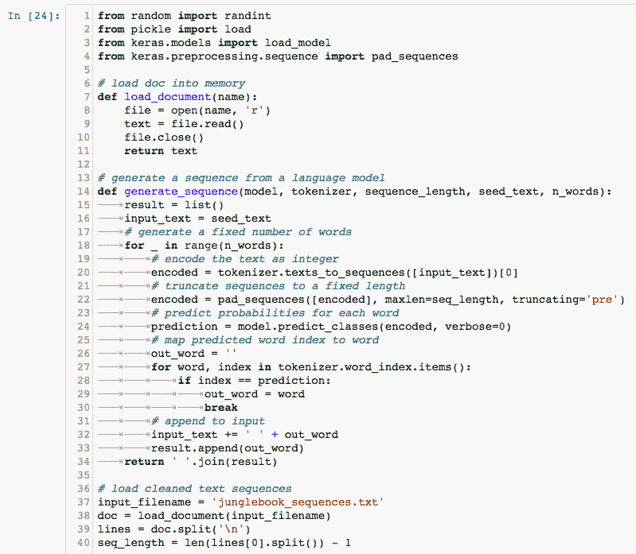

# 它是如何工作的……

现在，我们已经准备好生成新的单词序列，前提是我们有一些种子文本：

1.  首先，使用以下命令再次将模型加载到内存中：

```py
 model = load_model('junglebook.h5')
```

1.  接下来，通过输入以下命令加载分词器：

```py
 tokenizer = load(open('tokenizer.pkl', 'rb'))
```

1.  使用以下命令随机选择一段种子文本：

```py
 seed_text = lines[randint(0,len(lines))]
 print(seed_text + '\n')
```

1.  最后，通过以下命令生成新的序列：

```py
 generated = generate_sequence(model, tokenizer, sequence_length,             seed_text, 50)
 print(generated)
```

1.  打印生成的序列时，你将看到类似于以下截图的输出：

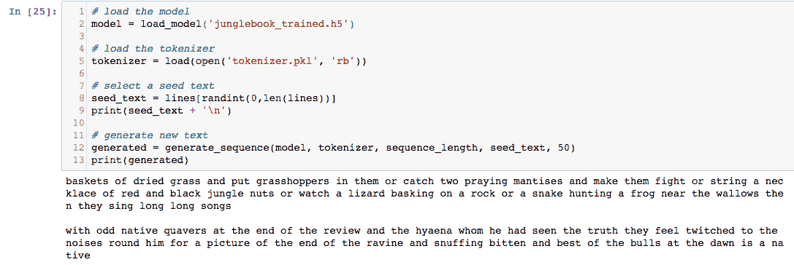

1.  模型首先打印出 50 个随机种子文本单词，然后是 50 个生成的文本单词。在这种情况下，随机种子文本如下所示：

    *篮子里装满了干草，并将蚂蚱放进去，或者抓住两只螳螂让它们打斗，或者串起一条红黑相间的丛林坚果项链，或者看着蜥蜴在岩石上晒太阳，或者看蛇在泥坑附近捕捉青蛙，然后他们唱着长长的歌。*

    模型生成的 50 个单词的文本如下：

    *在评论的结尾带有奇怪的本地音调，以及他曾见证过真相的鬣狗，它们因周围的噪音而感到不安，仿佛看到峡谷尽头的画面，闻着被咬伤的味道，最好的公牛在黎明时分是本地的。*

1.  注意模型输出了它根据从输入文本中学到的内容生成的随机单词序列。你还会注意到，模型在模仿输入文本和生成自己的故事方面做得相当不错。尽管文本并不完全有意义，但它为我们提供了有价值的见解，说明了模型如何学习将统计上相似的单词排列在一起。

# 还有更多...

+   更改设置的随机种子后，网络生成的输出也会发生变化。你可能不会得到与前面示例完全相同的输出文本，但它会与用于训练模型的输入非常相似。

+   以下是通过多次运行生成文本片段获得的不同结果的一些截图：

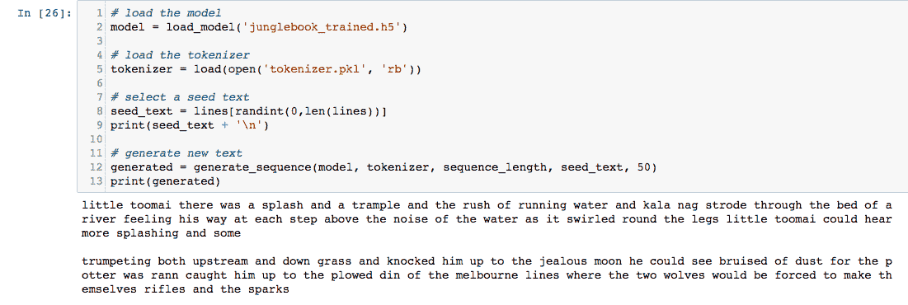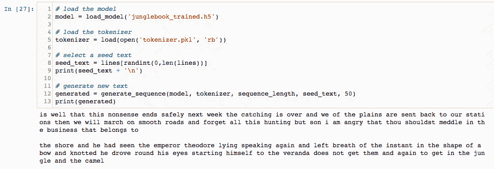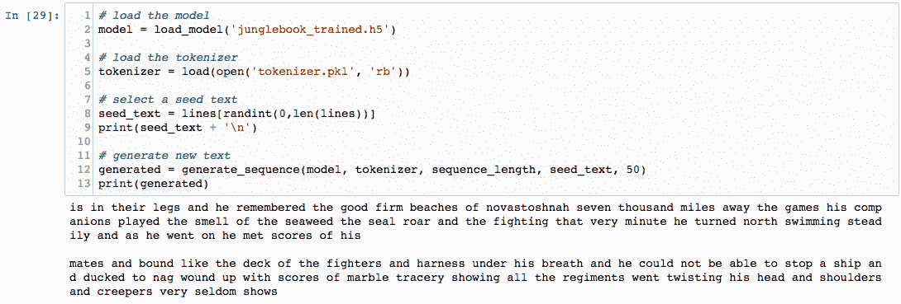

+   模型甚至生成了它自己版本的《古腾堡计划许可证》，如下所示的截图：

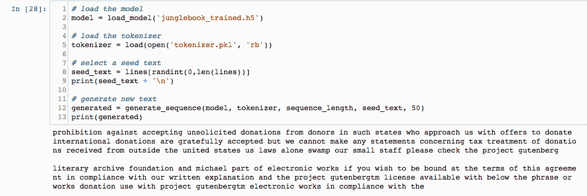

+   通过将训练周期从大约 100 次增加到 200 次，模型的准确性可以提高到大约 60%。另一种提高学习效果的方法是通过以大约 50 到 100 的迷你批次进行训练。尝试调整不同的超参数和激活函数，看看哪些对结果的影响最好。

+   通过在定义模型时包含更多的 LSTM 层和丢弃层，模型也可以变得更密集。然而，要知道，如果模型更复杂并且训练周期更长，它将只会增加训练时间。

+   经过多次实验，理想的批量大小被确定为 50 到 100 之间，训练模型的理想周期次数被确定为 100 到 200 之间。

+   执行上述任务没有确定的方式。你还可以尝试不同的文本输入，如推文、客户评论或 HTML 代码。

+   其他可以执行的任务包括使用简化的词汇表（例如去除所有停用词）来进一步增强字典中的独特词汇；调节嵌入层的大小和隐藏层中记忆单元的数量；并扩展模型以使用预训练模型，如 Google 的 Word2Vec（预训练词汇模型），以查看它是否能产生更好的模型。

# 另见

有关本章最后部分使用的各种函数和库的更多信息，可以通过访问以下链接找到：

+   [`keras.io/preprocessing/sequence/`](https://keras.io/preprocessing/sequence/)

+   [`wiki.python.org/moin/UsingPickle`](https://wiki.python.org/moin/UsingPickle)

+   [`docs.python.org/2/library/random.html`](https://docs.python.org/2/library/random.html)

+   [`www.tensorflow.org/api_docs/python/tf/keras/models/load_model`](https://www.tensorflow.org/api_docs/python/tf/keras/models/load_model)
