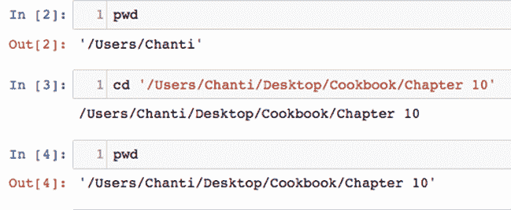
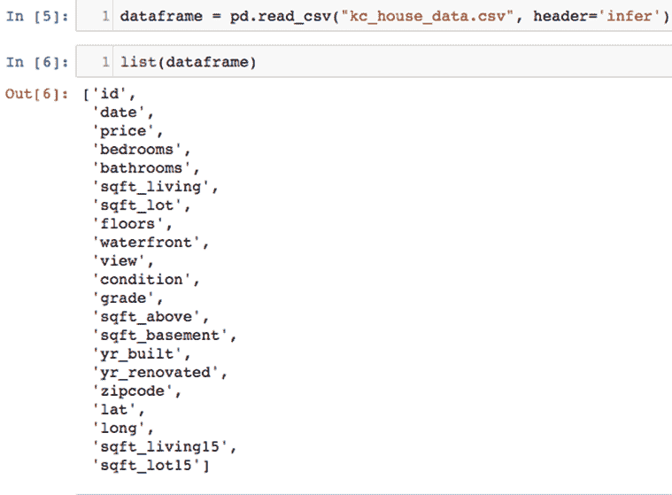
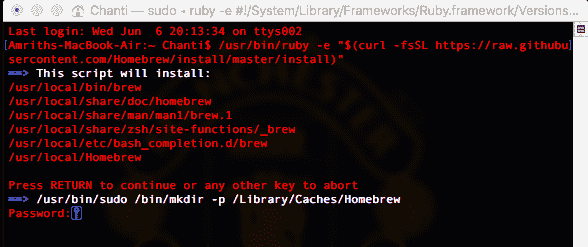

# 第八章：使用 XGBoost 进行房地产价值预测

房地产市场是定价竞争最激烈的市场之一。价格会因多种因素而大幅波动，例如位置、房产年龄、大小等。因此，准确预测房产（尤其是住房市场）的价格，已成为现代社会的一项挑战，目的是做出更好的投资决策。本章将专门讨论这一问题。

完成本章后，你将能够：

+   下载 King County 房屋销售数据集

+   执行探索性分析与可视化

+   绘制价格与其他特征之间的相关性

+   预测房屋价格

# 下载 King County 房屋销售数据集

我们无法在没有数据集的情况下建立模型。我们将在本节中下载数据。

# 准备工作

Kaggle ([`www.kaggle.com/`](https://www.kaggle.com/)) 是一个用于预测建模和分析竞赛的平台，统计学家和数据挖掘人员在其中竞争，旨在为公司和用户上传的数据集生成最优模型进行预测和描述。King County 房屋销售数据集包含了 1900 年至 2015 年间，在纽约 King County 销售的 21,613 套房屋的记录。数据集还包含了 21 个不同的变量，如位置、邮政编码、卧室数量、居住空间面积等，每个房屋都有这些信息。

# 如何操作...

1.  可以从以下网址访问数据集：[`www.kaggle.com/harlfoxem/housesalesprediction`](https://www.kaggle.com/harlfoxem/housesalesprediction)。该数据集来自 King County 的公共记录，免费下载并可用于任何分析。

1.  一旦进入网站，你可以点击下载按钮，如下图所示：


King County 房屋销售数据集

1.  从压缩的下载文件 `housesalesprediction.zip` 中会出现一个名为`kc_house_data.csv`的文件。

1.  将名为`kc_house_data.csv`的文件保存在当前工作目录中，因为这将是我们的数据集。该文件将被加载到 IPython 笔记本中进行分析和预测。

# 它是如何工作的...

1.  使用以下代码安装本章所需的库：

```py
import numpy as np
import pandas as pd
import matplotlib.pyplot as plt
import seaborn as sns
import mpl_toolkits
from sklearn import preprocessing
from sklearn.preprocessing import LabelEncoder, OneHotEncoder
from sklearn.feature_selection import RFE
from sklearn import linear_model
from sklearn.cross_validation import train_test_split %matplotlib inline
```

1.  上一步应产生一个输出，示例如下图所示：


1.  始终建议检查当前工作目录，并将其设置为存储数据集的目录。示例如下图所示：



在我们的案例中，名为 `Chapter 10` 的文件夹被设为当前工作目录。

1.  文件中的数据通过 `read_csv()` 函数读取到名为 `dataframe` 的 Pandas 数据框中，并使用 `list(dataframe)` 命令列出特征/头部信息，示例如下图所示：



正如您可能已经注意到的那样，数据集包含 21 个不同的变量，如 id、日期、价格、卧室、浴室等。

# 更多内容...

本章使用的库及其函数如下：

+   `Numpy`，用于整理数组形式的数据以及以数组形式存储名称列表

+   `Pandas`，用于所有数据整理和以数据帧形式管理数据

+   `Seaborn`，这是一个用于探索性分析和绘图所需的可视化库

+   `MPL_Toolkits`，其中包含 `Matplotlib` 所需的多个函数和依赖项

+   本章需要的科学和统计库 `Scikit Learn` 的函数

+   我们还需要一些其他库，如 `XGBoost`，但在构建模型时会根据需要导入

# 另请参阅

可以通过访问以下链接找到有关不同库的进一步文档：

+   [`scikit-learn.org/stable/modules/preprocessing.html`](http://scikit-learn.org/stable/modules/preprocessing.html)

+   [`scikit-learn.org/stable/modules/generated/sklearn.feature_selection.RFE.html`](http://scikit-learn.org/stable/modules/generated/sklearn.feature_selection.RFE.html)

+   [`seaborn.pydata.org/`](https://seaborn.pydata.org/)

+   [`matplotlib.org/mpl_toolkits/index.html`](https://matplotlib.org/mpl_toolkits/index.html)

# 执行探索性分析和可视化

在预测诸如 `price` 这样的变量时，通过可视化数据并查明依赖变量如何受其他变量影响，可以帮助分析。探索性分析提供了许多通过查看数据无法立即获得的见解。本章节将描述如何从大数据中可视化并得出见解。

# 准备工作

+   可以使用 `dataframe.head()` 函数打印 `dataframe` 的头部，该函数产生一个输出，如下截图所示：


+   同样地，可以使用 `dataframe.tail()` 函数打印 `dataframe` 的尾部，该函数产生一个输出，如下截图所示：


+   `dataframe.describe()` 函数用于获取每列的最大、最小和平均值等一些基本统计数据。如下截图所示：


`dataframe.describe()` 函数的输出

+   正如您所见，数据集包含 21,613 条记录，这些记录是在 1900 年至 2015 年之间售出的房屋。

+   仔细查看统计数据后，我们意识到大多数售出的房屋平均有约三个卧室。我们还可以看到，房屋中卧室数量最少的是 0，而最大的房屋有 33 间卧室和 13,540 平方英尺的生活空间。

# 如何做...

1.  让我们绘制整个数据集中卧室数量的分布，看看三卧室房屋与二卧室或一卧室房屋相比如何。这可以通过以下代码完成：

```py
dataframe['bedrooms'].value_counts().plot(kind='bar') plt.title('No. of bedrooms')
plt.xlabel('Bedrooms')
plt.ylabel('Count')
sns.despine
```

1.  我们还可以使用以下命令绘制相同数据的饼图：

```py
 dataframe['bedrooms'].value_counts().plot(kind='pie')
plt.title('No. of bedrooms')
```

1.  接下来，让我们尝试查看在金县最常售出的房屋的楼层数。这可以通过绘制柱状图来完成，命令如下：

```py
dataframe['floors'].value_counts().plot(kind='bar') plt.title('Number of floors')
plt.xlabel('No. of floors')
plt.ylabel('Count')
sns.despine
```

1.  接下来，我们需要了解哪些位置的房屋销售数量最多。我们可以通过使用数据集中的`latitude`和`longitude`变量来实现，代码如下：

```py
plt.figure(figsize=(20,20))
sns.jointplot(x=dataframe.lat.values, y=dataframe.long.values, size=9)
plt.xlabel('Longitude', fontsize=10)
plt.ylabel('Latitude', fontsize=10)
plt.show()
sns.despine()
```

1.  让我们通过执行以下命令，看看不同卧室数量的房屋价格如何比较：

```py
 plt.figure(figsize=(20,20))
sns.jointplot(x=dataframe.lat.values, y=dataframe.long.values, size=9)
plt.xlabel('Longitude', fontsize=10)
plt.ylabel('Latitude', fontsize=10)
plt.show()
sns.despine()
```

1.  使用以下命令，我们可以得到房价与卧室数量之间的图表：

```py
plt.figure(figsize=(20,20))
sns.jointplot(x=dataframe.lat.values, y=dataframe.long.values, size=9)
plt.xlabel('Longitude', fontsize=10)
plt.ylabel('Latitude', fontsize=10)
plt.show()
sns.despine()
```

1.  同样，让我们看看价格与所有已售房屋的居住面积之间的关系。这可以通过使用以下命令来实现：

```py
plt.figure(figsize=(8,8))
plt.scatter(dataframe.price, dataframe.sqft_living)
plt.xlabel('Price')
plt.ylabel('Square feet')
plt.show()
```

1.  售出房屋的状况也为我们提供了一些重要信息。让我们将其与价格进行对比，来更好地了解一般的趋势。这可以通过以下命令实现：

```py
plt.figure(figsize=(5,5))
plt.bar(dataframe.condition, dataframe.price)
plt.xlabel('Condition')
plt.ylabel('Price')
plt.show()
```

1.  我们可以使用以下命令查看金县哪些邮政编码区域的房屋销售最多：

```py
plt.figure(figsize=(8,8))
plt.scatter(dataframe.zipcode, dataframe.price)
plt.xlabel('Zipcode')
plt.ylabel('Price')
plt.show()
```

1.  最后，绘制每套房屋的等级与价格的关系，以便通过使用以下命令找出基于房屋等级的销售趋势：

```py
plt.figure(figsize=(10,10))
plt.scatter(dataframe.grade, dataframe.price)
plt.xlabel('Grade')
plt.ylabel('Price')
plt.show()
```

# 它是如何工作的...

1.  卧室数量的图表应该生成如下输出：


1.  很明显，三卧室房屋是销售最多的，其次是四卧室房屋，然后是二卧室房屋，出乎意料的是，五卧室和六卧室房屋的销售量也不低。

1.  卧室数量的饼图生成的输出如下所示：


1.  你会注意到，三卧室房屋大约占金县所有已售房屋的 50%。看起来大约 25%是四卧室房屋，剩下的 25%则由二卧室、五卧室、六卧室房屋等组成。

1.  运行脚本以根据楼层数对大多数出售的房屋进行分类时，我们会看到以下输出：


1.  很明显，单层房屋销售最多，其次是二层房屋。三层以上的房屋数量相对较少，这或许反映了金县居民的家庭规模和收入水平。

1.  检查不同位置售出房屋的密度后，我们得到如下输出。从中可以明显看出，一些位置的房屋销售密度高于其他位置：


1.  从前面图表观察到的趋势来看，很容易注意到，在经度 -122.2 到 -122.4 之间销售的房屋更多。同样，经度 47.5 到 47.8 之间销售的房屋密度比其他经度更高。这可能是对比其他社区更安全和居住质量更好的指示。

1.  当绘制房屋价格与房屋卧室数量的关系时，我们意识到关于房屋卧室数量的趋势与房价成正比，直到六个卧室，然后成为反比，如下面的截图所示：


1.  绘制每个房屋的生活区域与价格的关系图表明，随着房屋面积的增加，价格也在增加。最昂贵的房屋似乎有 12,000 平方英尺的生活面积，如下面的截图所示：


# 更多内容...

1.  当绘制房屋条件与价格的关系时，我们再次注意到一个预期的趋势：随着条件评级的提高，房价也在增加，如下面的截图所示。有趣的是，五卧房的价格比四卧房略低，这可能是因为对这么大的房子的购买者较少：


1.  房屋的邮政编码与价格的关系图显示了不同邮政编码地区房价的趋势。你可能已经注意到，像 98100 到 98125 这样的一些邮政编码区域，销售的房屋密度比其他地区高，而像 98040 这样的邮政编码地区的房价高于平均价格，可能表明这是一个更富裕的社区，如下面的截图所示：


1.  房屋等级与价格的关系图显示了随着等级的增加，价格稳步增长的趋势。两者之间似乎存在明确的线性关系，正如下面截图中的结果所观察到的： 


# 另请参阅

下面的链接很好地解释了为什么在对数据运行任何模型之前，数据可视化如此重要：

+   [`www.slideshare.net/Centerline_Digital/the-importance-of-data-visualization`](https://www.slideshare.net/Centerline_Digital/the-importance-of-data-visualization)

+   [`data-visualization.cioreview.com/cxoinsight/what-is-data-visualization-and-why-is-it-important-nid-11806-cid-163.html`](https://data-visualization.cioreview.com/cxoinsight/what-is-data-visualization-and-why-is-it-important-nid-11806-cid-163.html)

+   [`www.techchange.org/2015/05/19/data-visualization-analysis-international-development/`](https://www.techchange.org/2015/05/19/data-visualization-analysis-international-development/)

# 绘制价格与其他特征之间的相关性

现在，初步的探索性分析已经完成，我们对不同变量如何影响每栋房子的价格有了更好的了解。然而，我们并不知道每个变量在预测价格时的重要性。由于我们有 21 个变量，单纯将所有变量放入一个模型中构建会变得困难。因此，可能需要丢弃或忽略某些变量，特别是那些在预测中比其他变量重要性较低的变量。

# 准备工作

相关系数在统计学中用于衡量两个变量之间关系的强度。特别是，在执行线性回归时，Pearson 相关系数是最常用的系数。相关系数通常在 -1 到 +1 之间取值：

+   相关系数为 1 表示当一个变量增加时，另一个变量也会按照固定比例增加。例如，鞋码几乎与脚长呈完全正相关。

+   相关系数为 -1 表示当一个变量增加时，另一个变量会按照固定比例减少。例如，油箱中的油量与加速或换档机制几乎呈完全负相关（与第四档相比，在第一档行驶更长时间会消耗更多的油）。

+   零表示对于每一个增加，既没有正向增加也没有负向增加。这两个变量之间没有关系。

# 如何进行...

1.  首先使用以下命令删除数据集中的 `id` 和 `date` 特征。我们在预测中不会使用它们，因为 ID 变量都是唯一的，且在我们的分析中没有值，而日期需要用不同的函数来正确处理。这个任务留给读者完成：

```py
 x_df = dataframe.drop(['id','date',], axis = 1)
 x_df
```

1.  使用以下命令将因变量（本例中的房价）复制到一个新的 `dataframe` 中：

```py
 y = dataframe[['price']].copy()
 y_df = pd.DataFrame(y)
 y_df
```

1.  可以使用以下脚本手动找到价格与其他变量之间的相关性：

```py
 print('Price Vs Bedrooms: %s' % x_df['price'].corr(x_df['bedrooms']))
 print('Price Vs Bathrooms: %s' % x_df['price'].corr(x_df['bathrooms']))
 print('Price Vs Living Area: %s' % x_df['price'].corr(x_df['sqft_living']))
 print('Price Vs Plot Area: %s' % x_df['price'].corr(x_df['sqft_lot']))
 print('Price Vs No. of floors: %s' % x_df['price'].corr(x_df['floors']))
 print('Price Vs Waterfront property: %s' % x_df['price'].corr(x_df['waterfront']))
 print('Price Vs View: %s' % x_df['price'].corr(x_df['view']))
 print('Price Vs Grade: %s' % x_df['price'].corr(x_df['grade']))
 print('Price Vs Condition: %s' % x_df['price'].corr(x_df['condition']))
 print('Price Vs Sqft Above: %s' % x_df['price'].corr(x_df['sqft_above']))
 print('Price Vs Basement Area: %s' % x_df['price'].corr(x_df['sqft_basement']))
 print('Price Vs Year Built: %s' % x_df['price'].corr(x_df['yr_built']))
 print('Price Vs Year Renovated: %s' % x_df['price'].corr(x_df['yr_renovated']))
 print('Price Vs Zipcode: %s' % x_df['price'].corr(x_df['zipcode']))
 print('Price Vs Latitude: %s' % x_df['price'].corr(x_df['lat']))
 print('Price Vs Longitude: %s' % x_df['price'].corr(x_df['long']))
```

1.  除了前面的方法，还有一种更简单的方法可以通过以下一行代码来查找一个变量与所有其他变量（或列）之间的相关性：

    `x_df.corr().iloc[:,-19]`

1.  可以使用 `seaborn` 库和以下脚本绘制相关变量：

```py
 sns.pairplot(data=x_df,
 x_vars=['price'],
 y_vars=['bedrooms', 'bathrooms', 'sqft_living',
 'sqft_lot', 'floors', 'waterfront','view',
 'grade','condition','sqft_above','sqft_basement',
 'yr_built','yr_renovated','zipcode','lat','long'],
 size = 5)
```

# 它是如何工作的...

1.  在删除了 `id` 和 `date` 变量后，新的 `dataframe`（命名为 `x_df`）包含 19 个变量或列，如以下截图所示。为了本书的目的，只打印出前十个条目：


输出的前 10 个条目


1.  创建一个只包含因变量（价格）的新`dataframe`时，您将看到如下输出。这个新`dataframe`命名为`y_df`。再次说明，这里只打印了价格列的前十条记录，供参考：


1.  价格与其他变量的相关性如下图所示：


1.  你可能已经注意到，`sqft_living`变量与价格的相关性最高，其相关系数为 0.702035。下一个最相关的变量是`grade`，其相关系数为 0.667434，其次是`sqft_above`，其相关系数为 0.605567。`Zipcode`是与价格最不相关的变量，相关系数为-0.053202。

# 更多内容…

+   使用简化代码找到的相关系数给出了完全相同的值，但也给出了价格与其自身的相关系数，结果是 1.0000，正如预期的那样。以下截图展示了这一点：


+   使用`seaborn`库绘制的相关系数如下图所示。请注意，每个图的 x 轴上是价格：


相关系数的绘制


# 另见

以下链接对 Pearson 相关系数及其手动计算方法提供了很好的解释：

[`en.wikipedia.org/wiki/Pearson_correlation_coefficient`](https://en.wikipedia.org/wiki/Pearson_correlation_coefficient)

[`www.statisticshowto.com/probability-and-statistics/correlation-coefficient-formula/`](http://www.statisticshowto.com/probability-and-statistics/correlation-coefficient-formula/)

# 预测房价

本节将介绍如何使用当前`dataframe`中的所有特征来构建一个简单的线性模型以预测房价。然后，我们将评估该模型，并尝试在本节后半部分通过使用更复杂的模型来提高准确性。

# 准备工作

访问以下链接，了解线性回归是如何工作的以及如何在 Scikit Learn 库中使用线性回归模型：

[`en.wikipedia.org/wiki/Linear_regression`](https://en.wikipedia.org/wiki/Linear_regression)

[`www.stat.yale.edu/Courses/1997-98/101/linreg.htm`](http://www.stat.yale.edu/Courses/1997-98/101/linreg.htm)

[`newonlinecourses.science.psu.edu/stat501/node/251/`](https://newonlinecourses.science.psu.edu/stat501/node/251/)

[`scikit-learn.org/stable/modules/generated/sklearn.linear_model.LinearRegression.html`](http://scikit-learn.org/stable/modules/generated/sklearn.linear_model.LinearRegression.html)

[`scikit-learn.org/stable/modules/linear_model.html`](http://scikit-learn.org/stable/modules/linear_model.html)

# 如何做到...

1.  从`x_df`数据框中删除`Price`列，并使用以下脚本将其保存到一个名为`x_df2`的新数据框中：

```py
 x_df2 = x_df.drop(['price'], axis = 1)
```

1.  声明一个名为`reg`的变量，并将其等式赋值给 Scikit Learn 库中的`LinearRegression()`函数，使用以下脚本：

```py
 reg=linear_model.LinearRegression()
```

1.  使用以下脚本将数据集拆分为测试集和训练集：

```py
 x_train,x_test,y_train,y_test = train_test_split(x_df2,y_df,test_size=0.4,random_state=4)
```

1.  使用以下脚本在训练集上拟合模型：

```py
 reg.fit(x_train,y_train)
```

1.  使用`reg.coef_`命令打印应用线性回归到训练集和测试集后生成的系数。

1.  使用以下脚本查看模型生成的预测列：

```py
 predictions=reg.predict(x_test)
 predictions
```

1.  使用以下命令打印模型的准确性：

```py
 reg.score(x_test,y_test)
```

# 它是如何工作的...

1.  在将回归模型拟合到训练集后，输出应如下所示：


1.  `reg.coeff_`命令生成 18 个系数，每个变量对应一个系数，如下截图所示：


1.  特征/变量的系数中，值最正的那些对价格预测的影响更大，相比之下，值为负的特征/变量系数对价格预测的影响较小。这就是回归系数的重要性所在。

1.  打印预测结果时，您必须看到一个输出，这是一个从 1 到 21,612 的值数组，每一行代表数据集中的一个值，截图如下所示：


1.  最后，在打印模型的准确性时，我们得到了 70.37%的准确率，对于一个线性模型来说，这个结果还不错。以下是该截图：


# 还有更多...

线性模型在第一次尝试时表现尚可，但如果我们希望模型更准确，我们需要使用一个更复杂的模型，带有一些非线性部分，以便更好地拟合所有数据点。XGBoost 是我们在本节中将使用的模型，目的是通过线性回归提高准确性。方法如下：

1.  使用`import xgboost`命令导入`XGBoost`库。

1.  如果出现错误，您需要通过终端使用 `pip install` 安装该库。可以通过打开一个新的终端窗口并执行以下命令来完成此操作：

```py
/usr/bin/ruby -e "$(curl -fsSL https://raw.githubusercontent.com/Homebrew/install/master/install)"
```

1.  在此阶段，您应该会看到类似以下截图的输出：



1.  在此阶段，系统会提示您输入密码。安装 homebrew 后，您将看到类似以下截图的输出：


1.  接下来，使用以下命令安装 Python：

    `brew install python`

1.  使用 `brew doctor` 命令检查您的安装，并根据 homebrew 的建议进行操作。

1.  一旦 `Homebrew` 安装完成，使用以下命令进行 XGBoost 的 pip 安装：

    `pip install xgboost`

1.  安装完成后，您应该能够将 XGBoost 导入到 IPython 环境中。

一旦 XGBoost 成功导入到 Jupyter 环境中，您将能够使用库中的函数来声明并存储模型。可以按照以下步骤进行：

1.  声明一个名为 `new_model` 的变量来存储模型，并使用以下命令声明所有超参数：

```py
new_model = xgboost.XGBRegressor(n_estimators=750, learning_rate=0.09,         gamma=0, subsample=0.65, colsample_bytree=1, max_depth=7)
```

1.  前述命令的输出必须看起来像以下截图所示：


1.  将数据拆分为测试集和训练集，并使用以下命令将新模型拟合到拆分的数据上：

```py
 from sklearn.model_selection import train_test_split
 traindf, testdf = train_test_split(x_train, test_size = 0.2)
 new_model.fit(x_train,y_train)
```

1.  此时，您将看到类似以下截图的输出：


1.  最后，使用新训练的模型来预测房价，并使用以下命令评估新模型：

```py
 from sklearn.metrics import explained_variance_score
 predictions = new_model.predict(x_test)
 print(explained_variance_score(predictions,y_test))
```

1.  执行前述命令后，您应该会看到类似以下截图的输出：


1.  请注意，新模型的准确率现在是 87.79%，大约为 88%。这被认为是最优的。

1.  在这种情况下，`number of estimators` 设置为 750。经过在 100 到 1,000 之间的实验后，确定 750 个估算器能够提供最佳的准确率。`learning rate` 设置为 0.09。`Subsample rate` 设置为 65%。`Max_depth` 设置为 7。似乎 `max_depth` 对模型准确性的影响不大。然而，使用较慢的学习率时，准确率有所提高。通过调整各种超参数，我们进一步将准确率提高到 89%。

1.  接下来的步骤包括对卧室、浴室、楼层、邮政编码等变量进行独热编码，并在模型拟合之前对所有变量进行标准化。尝试调优超参数，如 XGBoost 模型中的学习率、估算器数量、子采样率等，观察它们如何影响模型的准确性。这部分留给读者作为练习。

1.  此外，您可能希望尝试在 XGBoost 中使用交叉验证，以找出模型中树的最佳数量，这将进一步提高准确性。

1.  另一个可以尝试的练习是在训练过程中使用不同大小的测试和训练数据集，并在训练中加入`date`变量。在我们的案例中，我们已将其拆分为 80%的训练数据和 20%的测试数据。尝试将测试集增加到 40%，并查看模型准确度的变化。

# 另请参阅

访问以下链接了解如何调整 XGBoost 模型中的超参数以及如何在 XGBoost 中实施交叉验证：

[`xgboost.readthedocs.io/en/latest/python/index.html`](https://xgboost.readthedocs.io/en/latest/python/index.html)

[`xgboost.readthedocs.io/en/latest/get_started/`](http://xgboost.readthedocs.io/en/latest/get_started/)

[`www.kaggle.com/cast42/xg-cv`](https://www.kaggle.com/cast42/xg-cv)
