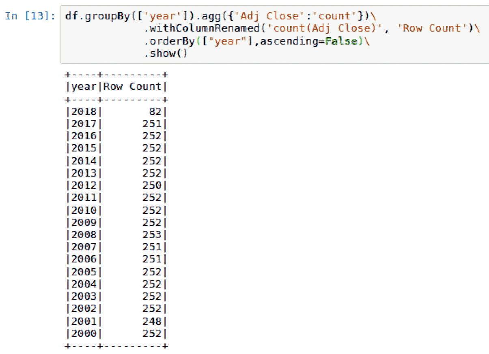
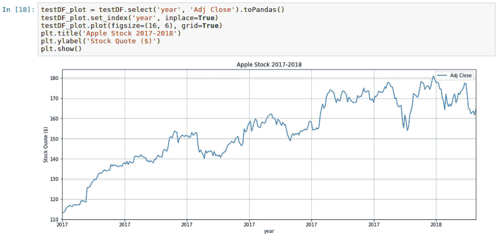

# 第九章：使用 LSTM 预测苹果股票市场成本

股票市场预测已经进行多年，并且催生了一个完整的预测行业。考虑到如果预测准确，它可以带来可观的利润，这一点不应令人惊讶。理解何时是买入或卖出股票的最佳时机是掌握华尔街的关键。本章将重点介绍如何使用 Keras 上的 LSTM 创建深度学习模型，以预测苹果公司（AAPL）的股市报价。

本章将介绍以下食谱：

+   下载苹果公司的股市数据

+   探索并可视化苹果公司的股市数据

+   准备股票数据以供模型性能评估

+   构建 LSTM 模型

+   评估 LSTM 模型

# 下载苹果公司的股市数据

有许多资源可以下载苹果公司的股市数据。为了我们的目的，我们将使用 Yahoo! Finance 网站。

# 准备开始

本部分需要初始化一个 Spark 集群，供本章所有食谱使用。可以通过终端使用`sparknotebook`来初始化 Spark 笔记本，如下图所示：


可以通过以下脚本在 Jupyter 笔记本中初始化`SparkSession`：

```py
spark = SparkSession.builder \
    .master("local") \
    .appName("StockMarket") \
    .config("spark.executor.memory", "6gb") \
    .getOrCreate()
```

# 如何操作...

以下部分将介绍如何下载苹果公司历史股市数据的步骤。

1.  访问以下网站，以追踪苹果公司（股票代码：AAPL）的每日历史调整收盘股价：[`finance.yahoo.com/quote/AAPL/history`](https://finance.yahoo.com/quote/AAPL/history)

1.  在“历史数据”标签中设置并应用以下参数：

    1.  时间范围：2000 年 1 月 1 日 - 2018 年 4 月 30 日。

    1.  显示：历史价格。

    1.  频率：每日。

1.  点击下载数据链接，将数据集下载为`.csv`文件，如下图所示：


1.  下载文件`AAPL.csv`，然后使用以下脚本将相同的数据集上传到 Spark 数据框：

```py
df =spark.read.format('com.databricks.spark.csv')\
   .options(header='true', inferschema='true')\
   .load('AAPL.csv')
```

# 如何操作...

以下部分将解释如何将股市数据整合到 Jupyter 笔记本中。

1.  Yahoo! Finance 是一个提供上市公司股市报价的好来源。苹果公司的股市报价（AAPL）在纳斯达克交易，历史报价可以用于模型开发和分析。Yahoo! Finance 提供了按日、周或月捕捉股市报价的选项。

1.  本章的目的是按日预测股票，因为这将拉入最多的数据来训练我们的模型。我们可以通过追溯数据从 2000 年 1 月 1 日到 2018 年 4 月 30 日来实现这一点。

1.  一旦我们设置好下载的参数，我们就可以从 Yahoo! Finance 获取格式良好的 CSV 文件，该文件可以轻松地转换为 Spark 数据框，几乎没有问题。

1.  数据框将允许我们查看股票的日期、开盘价、最高价、最低价、收盘价、调整后收盘价和成交量。数据框中的列跟踪当天的开盘和收盘股价，以及当天交易的最高和最低股价。当天交易的股票数量也会被记录下来。执行`df.show()`可以显示 Spark 数据框`df`的输出，具体如以下截图所示：


# 还有更多...

Python 曾经有股票市场 API，允许你自动连接并获取像苹果公司这样的上市公司股票报价。你需要输入参数并检索可以存储在数据框中的数据。然而，从 2018 年 4 月起，*Yahoo! Finance* API 已不再运行，因此不再是提取本章数据的可靠解决方案。

# 另见

`Pandas_datareader`是一个非常强大的库，用于从 Yahoo! Finance 等网站提取数据。要了解更多关于该库的信息，以及它如何在 Yahoo! Finance 重新上线后连接到该网站，请访问以下网站：

[`github.com/pydata/pandas-datareader`](https://github.com/pydata/pandas-datareader)

# 探索和可视化苹果公司股票市场数据

在对数据进行任何建模和预测之前，首先探索并可视化手头的数据，以发现任何潜在的亮点是非常重要的。

# 准备就绪

本节将对数据框进行转换和可视化操作。这将需要在 Python 中导入以下库：

+   `pyspark.sql.functions`

+   `matplotlib`

# 如何操作...

以下部分介绍了探索和可视化股票市场数据的步骤。

1.  使用以下脚本转换数据框中的`Date`列，通过去除时间戳：

```py
import pyspark.sql.functions as f
df = df.withColumn('date', f.to_date('Date'))
```

1.  创建一个 for 循环，向数据框中添加三个额外的列。该循环将`date`字段拆分为`year`、`month`和`day`，如下脚本所示：

```py
date_breakdown = ['year', 'month', 'day']
for i in enumerate(date_breakdown):
    index = i[0]
    name = i[1]
    df = df.withColumn(name, f.split('date', '-')[index])
```

1.  使用以下脚本将 Spark 数据框的子集保存到名为`df_plot`的`pandas`数据框中：`df_plot = df.select('year', 'Adj Close').toPandas()`。

1.  使用以下脚本在笔记本中绘制并可视化`pandas`数据框`df_plot`：

```py
from matplotlib import pyplot as plt
%matplotlib inline

df_plot.set_index('year', inplace=True)
df_plot.plot(figsize=(16, 6), grid=True)
plt.title('Apple stock')
plt.ylabel('Stock Quote ($)')
plt.show()
```

1.  使用以下脚本计算我们的 Spark 数据框的行数和列数：`df.toPandas().shape`。

1.  执行以下脚本来确定数据框中的空值：`df.dropna().count()`。

1.  执行以下脚本以提取`Open`、`High`、`Low`、`Close`和`Adj Close`的统计数据：

```py
df.select('Open', 'High', 'Low', 'Close', 'Adj Close').describe().show()
```

# 它是如何工作的...

以下部分解释了探索性数据分析中使用的技术和获得的洞察。

1.  数据框中的`date`列更像是一个日期时间列，所有时间值都以`00:00:00`结尾。对于我们在建模过程中所需的内容，这是不必要的，因此可以从数据集中删除。幸运的是，PySpark 有一个`to_date`函数，可以轻松地完成这项操作。数据框`df`使用`withColumn()`函数进行转换，现在只显示没有时间戳的日期列，如以下截图所示：


1.  为了分析目的，我们希望从`date`列中提取`day`、`month`和`year`。我们可以通过遍历自定义列表`date_breakdown`，以`-`分隔日期，然后使用`withColumn()`函数为年份、月份和日期添加新列。添加新列后的更新数据框可以在以下截图中看到：


一个重要的结论是，`PySpark`也有一个 SQL 函数用于日期，可以从日期时间戳中提取天、月或年。例如，如果我们要向数据框添加一个月份列，可以使用以下脚本：`df.withColumn("month",f.month("date")).show()`。这突出了在 Spark 中转换数据的多种方法。

1.  Spark 数据框在可视化功能上不如`pandas`数据框。因此，我们将从 Spark 数据框`df`中提取两列，并将它们转换为`pandas`数据框，用于绘制线性图或时间序列图。y 轴将是股票的调整后收盘价，x 轴将是日期的年份。

1.  pandas 数据框`df_plot`准备好用于绘制图表，一旦设置了一些格式化功能，如网格可见性、图表大小和标题及坐标轴标签。此外，我们明确指定数据框的索引需要指向年份列。否则，默认的索引会出现在 x 轴上，而不是年份。最终的时间序列图可以在以下截图中看到：


1.  苹果在过去 18 年经历了广泛的增长。虽然有几年出现了下滑，但总体趋势是稳定向上的，近几年股价徘徊在$150 到$175 之间。

1.  到目前为止，我们已经对数据框做了一些更改，因此重要的是要获取行和列的总数，这会影响数据集稍后如何分割用于测试和训练。如以下截图所示，我们总共有 10 列和 4,610 行：


1.  执行`df.dropna().count()`时，我们可以看到行数仍为 4,610，这与上一步的行数相同，表明没有任何行包含空值。

1.  最后，我们可以对每个将用于模型的列进行行数、均值、标准差、最小值和最大值的统计。这有助于识别数据中是否存在异常。需要注意的一点是，所有五个将在模型中使用的字段的标准差都高于均值，这表明数据分布较广，并非都集中在均值附近。以下截图显示了 Open、High、Low、Close 和 Adj Close 的统计数据：


# 还有更多内容…

虽然 Spark 中的数据框没有`pandas`数据框那样的本地可视化功能，但有些公司提供企业级 Spark 管理服务，允许通过笔记本进行高级可视化，而无需使用`matplotlib`等库。Databricks 就是其中一家提供此功能的公司。

以下是使用 Databricks 笔记本内置功能进行可视化的示例：


# 另见

要了解更多关于 Databricks 的信息，请访问以下网站：[`databricks.com/`](https://databricks.com/)。

要了解更多关于 Databricks 笔记本中可视化的信息，请访问以下网站：[`docs.databricks.com/user-guide/visualizations/index.html`](https://docs.databricks.com/user-guide/visualizations/index.html)。

要了解如何通过 Microsoft Azure 订阅访问 Databricks，请访问以下网站：

[`azure.microsoft.com/en-us/services/databricks/`](https://azure.microsoft.com/en-us/services/databricks/)

# 为模型性能准备股票数据

我们几乎准备好为苹果股票的价值表现构建预测算法了。剩下的任务是以确保最佳预测结果的方式准备数据。

# 准备就绪

在本节中，我们将对数据框执行转换和可视化操作。这需要导入以下 Python 库：

+   `numpy`

+   `MinMaxScaler()`

# 如何操作…

本节将介绍为我们的模型准备股票市场数据的步骤。

1.  执行以下脚本，通过`Adj Close`计数对年份列进行分组：

```py
df.groupBy(['year']).agg({'Adj Close':'count'})\
     .withColumnRenamed('count(Adj Close)', 'Row Count')\
     .orderBy(["year"],ascending=False)\
     .show()
```

1.  执行以下脚本以创建两个新的数据框，用于训练和测试：

```py
trainDF = df[df.year < 2017]
testDF = df[df.year > 2016]
```

1.  使用以下脚本将两个新的数据框转换为`pandas`数据框，以便使用`toPandas()`获取行列计数：

```py
trainDF.toPandas().shape
testDF.toPandas().shape
```

1.  正如我们之前对`df`做的那样，我们使用以下脚本对`trainDF`和`testDF`进行可视化：

```py
trainDF_plot = trainDF.select('year', 'Adj Close').toPandas()
trainDF_plot.set_index('year', inplace=True)
trainDF_plot.plot(figsize=(16, 6), grid=True)
plt.title('Apple Stock 2000-2016')
plt.ylabel('Stock Quote ($)')
plt.show()

testDF_plot = testDF.select('year', 'Adj Close').toPandas()
testDF_plot.set_index('year', inplace=True)
testDF_plot.plot(figsize=(16, 6), grid=True)
plt.title('Apple Stock 2017-2018')
plt.ylabel('Stock Quote ($)')
plt.show()
```

1.  我们根据数据框（日期列除外）创建两个新数组，`trainArray`和`testArray`，使用以下脚本：

```py
import numpy as np
trainArray = np.array(trainDF.select('Open', 'High', 'Low',                     'Close','Volume', 'Adj Close' ).collect())
testArray = np.array(testDF.select('Open', 'High', 'Low', 'Close','Volume',     'Adj Close' ).collect())
```

1.  为了将数组缩放到 0 和 1 之间，导入`sklearn`中的`MinMaxScaler`，并使用以下脚本创建一个名为`MinMaxScale`的函数：

```py
from sklearn.preprocessing import MinMaxScaler
minMaxScale = MinMaxScaler()
```

1.  然后，将 `MinMaxScaler` 应用于 `trainArray`，并使用以下脚本创建两个经过缩放的新数组：

```py
minMaxScale.fit(trainArray)

testingArray = minMaxScale.transform(testArray)
trainingArray = minMaxScale.transform(trainArray)
```

1.  使用以下脚本将 `testingArray` 和 `trainingArray` 都拆分为特征 `x` 和标签 `y`：

```py
xtrain = trainingArray[:, 0:-1]
xtest = testingArray[:, 0:-1]
ytrain = trainingArray[:, -1:]
ytest = testingArray[:, -1:]
```

1.  执行以下脚本来检索所有四个数组形状的最终清单：

```py
print('xtrain shape = {}'.format(xtrain.shape))
print('xtest shape = {}'.format(xtest.shape))
print('ytrain shape = {}'.format(ytrain.shape))
print('ytest shape = {}'.format(ytest.shape))
```

1.  执行以下脚本绘制报价 `open`、`high`、`low` 和 `close` 的训练数组：

```py
plt.figure(figsize=(16,6))
plt.plot(xtrain[:,0],color='red', label='open')
plt.plot(xtrain[:,1],color='blue', label='high')
plt.plot(xtrain[:,2],color='green', label='low')
plt.plot(xtrain[:,3],color='purple', label='close')
plt.legend(loc = 'upper left')
plt.title('Open, High, Low, and Close by Day')
plt.xlabel('Days')
plt.ylabel('Scaled Quotes')
plt.show()
```

1.  此外，我们使用以下脚本绘制 `volume` 的训练数组：

```py
plt.figure(figsize=(16,6))
plt.plot(xtrain[:,4],color='black', label='volume')
plt.legend(loc = 'upper right')
plt.title('Volume by Day')
plt.xlabel('Days')
plt.ylabel('Scaled Volume')
plt.show()
```

# 它是如何工作的...

本节解释了模型中所需的数据转换。

1.  构建模型的第一步是将数据分割成训练数据集和测试数据集，以进行模型评估。我们的目标是使用 2000 年到 2016 年的所有股票报价来预测 2017-2018 年的股票趋势。我们从之前的部分得知，我们总共有 4,610 天的股票报价，但我们并不确切知道每年有多少数据。我们可以在数据框中使用 `groupBy()` 函数来获取每年股票报价的唯一计数，详情请参见以下截图：



1.  2016 年和 2017 年的合并数据大约占总数据的 7%，这个测试数据集的比例稍显较小。然而，出于此模型的目的，这应该足够。剩余的 93% 数据集将用于 2000 到 2016 年之间的训练。因此，通过过滤器创建了两个数据框，以确定是否包含或排除 2016 年之前或之后的行。

1.  我们现在可以看到，测试数据集 `testDF` 包含 333 行，而训练数据集 `trainDF` 包含 4,277 行。当两者合并时，我们得到了来自原始数据框 `df` 的总行数 4,610。最后，我们看到 `testDF` 仅由 2017 年和 2018 年的数据组成，其中 2017 年有 251 行，2018 年有 82 行，总共 333 行，详情请参见以下截图：


请注意，每当我们将 Spark 数据框转换为 `pandas` 数据框时，它可能并不总是适合大数据。虽然在我们使用相对较小的数据集时它可以正常工作，但转换为 `pandas` 数据框意味着所有数据都将加载到主驱动程序的内存中。一旦发生此转换，数据不会存储在 Spark 工作节点中，而是传输到主驱动节点。这并不是最优的，可能会导致内存溢出错误。如果你发现需要从 Spark 转换为 `pandas` 数据框来可视化数据，建议从 Spark 中抽取一个随机样本，或将 Spark 数据聚合成一个更易处理的数据集，然后在 `pandas` 中进行可视化。

1.  一旦数据的子集通过`toPandas()`转换，我们就可以使用`matplotlib`来可视化测试和训练数据框，利用`pandas`内建的图形功能。将数据框并排显示可以展示出，在未缩放的情况下，调整后的收盘价的 y 轴看起来相似。实际上，我们可以看到`trainDF_plot`接近于 0 开始，而`testDF_plot`则从接近 110 的位置开始，如下两张截图所示：




1.  目前我们的股票值并不适合深度学习建模，因为没有用于归一化或标准化的基准。在使用神经网络时，最好将值保持在 0 和 1 之间，以匹配在用于激活的 sigmoid 或 step 函数中找到的结果。为了实现这一点，我们必须首先将`pyspark`数据框`trainDF`和`testDF`转换为`numpy`数组，即`trainArray`和`testArray`。由于它们现在是数组而不是数据框，我们将不使用日期列，因为神经网络只对数值感兴趣。每个数组的第一个值可以在以下截图中看到：


1.  缩放数组值到 0 和 1 之间有很多种方法。它涉及使用以下公式：`scaled array value = (array value - min array value) / (max array value - min array value)`。幸运的是，我们无需手动进行这个计算。我们可以利用`sklearn`中的`MinMaxScaler()`函数来缩放这两个数组。

1.  `MinMaxScaler()`函数会在训练数组`trainArray`上进行拟合，然后应用于创建两个新的数组，`trainingArray`和`testingArray`，它们的值会被缩放到 0 到 1 之间。每个数组的第一行可以在以下截图中看到：


1.  现在，我们准备通过将数组切分成 x 和 y 来设置标签和特征变量，供训练和测试使用。数组中的前五个元素是特征或 x 值，最后一个元素是标签或 y 值。特征包括 Open、High、Low、Close 和 Volume 的值。标签由 Adj Close 组成。`trainingArray`的第一行分解可以在以下截图中看到：


1.  查看我们将在模型中使用的四个数组的形状，可以确认我们有 4,227 行训练数据、333 行测试数据、5 个特征元素（`x`）和 1 个标签元素（`y`），如以下截图所示：


1.  `xtrain`训练数组的值，包括开盘价、最低价、最高价和收盘价，可以使用新的调整后的 0 到 1 之间的比例绘制，如下图所示：


1.  此外，体积也可以使用归一化后的体积得分（在 0 和 1 之间）进行绘制，如下图所示：


# 还有更多内容...

尽管我们确实使用了来自`sklearn`的`MinMaxScaler`，但同样重要的是要理解，`pyspark.ml.feature`中也有一个`MinMaxScaler`函数。它的功能完全相同，都是将每个特征重新缩放到 0 到 1 之间。如果我们在本章中通过 PySpark 原生的机器学习库进行预测，我们将使用来自`pyspark.ml.feature`的`MinMaxScaler`。

# 另见

要了解更多关于`sklearn`中`MinMaxScaler`的信息，请访问以下网站：

[`scikit-learn.org/stable/modules/generated/sklearn.preprocessing.MinMaxScaler.html.`](http://scikit-learn.org/stable/modules/generated/sklearn.preprocessing.MinMaxScaler.html)

要了解更多关于`pyspark`中`MinMaxScaler`的信息，请访问以下网站：

[`spark.apache.org/docs/2.2.0/ml-features.html#minmaxscaler.`](https://spark.apache.org/docs/2.2.0/ml-features.html#minmaxscaler)

# 构建 LSTM 模型

数据现在已转换为与 Keras 中的 LSTM 模型开发兼容的格式。因此，我们将在本节中设置并配置深度学习模型，以预测 2017 年和 2018 年苹果公司的股票报价。

# 准备工作

我们将在本节中对模型进行管理和超参数调优。这将需要在 Python 中导入以下库：

```py
from keras import models
from keras import layers
```

# 如何操作...

本节将引导您完成设置和调优 LSTM 模型的步骤。

1.  使用以下脚本从`keras`导入以下库：

```py
from keras import models, layers
```

1.  使用以下脚本构建一个`Sequential`模型：

```py
model = models.Sequential()
model.add(layers.LSTM(1, input_shape=(1,5)))
model.add(layers.Dense(1))
model.compile(loss='mean_squared_error', optimizer='adam')
```

1.  使用以下脚本将测试集和训练集转换为三维数组：

```py
xtrain = xtrain.reshape((xtrain.shape[0], 1, xtrain.shape[1]))
xtest = xtest.reshape((xtest.shape[0], 1, xtest.shape[1]))
```

1.  使用一个名为`loss`的变量通过以下脚本拟合`model`：

```py
loss = model.fit(xtrain, ytrain, batch_size=10, epochs=100)
```

1.  使用以下脚本创建一个新的数组`predicted`：

```py
predicted = model.predict(xtest)
```

1.  使用以下脚本将`predicted`和`ytest`数组合并为一个统一的数组`combined_array`：

```py
combined_array = np.concatenate((ytest, predicted), axis = 1)
```

# 它是如何工作的...

本节解释了如何配置 LSTM 神经网络模型以在我们的数据集上进行训练。

1.  构建 LSTM 模型时，大部分功能来自于`keras`的`models`和`layers`模块。

1.  已构建的`LSTM`模型将使用`Sequential`类进行定义，这种类非常适合处理具有序列依赖的时间序列数据。LSTM 模型的`input_shape = (1,5)`表示我们的训练数据集中有一个因变量和五个自变量。由于我们希望保持模型简单，因此只会使用一个`Dense`层来定义神经网络。编译 keras 模型时需要指定损失函数，因为我们正在处理一个循环神经网络，使用`mean_squared_error`（均方误差）计算最能反映预测值与实际值之间的差距。最后，模型编译时还需要定义优化器，以调整神经网络中的权重。`adam`优化器给出了很好的结果，尤其是在与循环神经网络配合使用时。

1.  我们当前的数组`xtrain`和`xtest`是二维数组；然而，为了将它们整合进 LSTM 模型，它们需要使用`reshape()`转换为三维数组，具体如以下截图所示：


1.  LSTM 模型使用`xtrain`和`ytrain`进行拟合，批量大小设定为 10，训练 100 个 epochs。批量大小是定义一起训练的对象数量的设置。我们可以根据需要设置较低或较高的批量大小，但需要注意的是，批量数越少，所需的内存越多。此外，epoch 是衡量模型通过整个数据集的次数。最终，这些参数可以根据时间和内存分配进行调整。

每个 epoch 中的均方误差损失都被捕获并可视化。经过第五或第六个 epoch 后，我们可以看到损失逐渐减小，如以下截图所示：


1.  我们现在可以创建一个新的数组`predicted`，它基于应用于`xtest`的拟合模型，然后将其与`ytest`合并，进行并排比较，以便进行准确性验证。

# 另请参见

要了解更多关于 keras 中参数调整模型的内容，请访问以下网站：[`keras.io/models/model/`](https://keras.io/models/model/)

# 评估模型

现在到了关键时刻：我们将看看我们的模型是否能够为 2017 年和 2018 年的 AAPL 股票提供准确的预测。

# 准备工作

我们将使用均方误差进行模型评估。因此，我们需要导入以下库：

```py
import sklearn.metrics as metrics
```

# 如何操作...

本节演示了如何可视化并计算 2017 年和 2018 年苹果股票的实际与预测股价。

1.  使用以下脚本绘制`实际`与`预测`股票的并排比较图，以便比较趋势：

```py
plt.figure(figsize=(16,6))
plt.plot(combined_array[:,0],color='red', label='actual')
plt.plot(combined_array[:,1],color='blue', label='predicted')
plt.legend(loc = 'lower right')
plt.title('2017 Actual vs. Predicted APPL Stock')
plt.xlabel('Days')
plt.ylabel('Scaled Quotes')
plt.show()
```

1.  使用以下脚本计算实际`ytest`与`predicted`（预测的）股票之间的均方误差：

```py
import sklearn.metrics as metrics
np.sqrt(metrics.mean_squared_error(ytest,predicted))
```

# 它是如何工作的...

本节解释了 LSTM 模型评估的结果。

1.  从图形的角度来看，我们可以看到我们的预测与 2017 年至 2018 年的实际股票报价非常接近，如下面的屏幕截图所示：


1.  我们的模型显示，预测值与 2017 年和 2018 年较早的实际值更接近。总体而言，虽然我们预测的分数与实际分数非常接近，但最好还是进行均方误差计算，以了解两者之间的偏差。正如我们所看到的，我们的均方误差为 0.05841，或约为 5.8%：


# 另请参阅

为了更好地了解在 sklearn 中如何计算均方误差，请访问以下网站：

[`scikit-learn.org/stable/modules/generated/sklearn.metrics.mean_squared_error.html`](http://scikit-learn.org/stable/modules/generated/sklearn.metrics.mean_squared_error.html).
