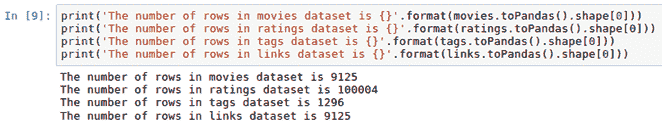
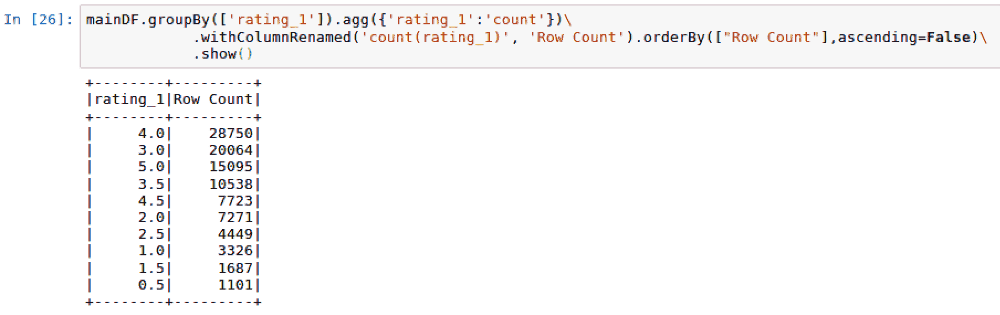

# 第十二章：使用 Keras 创建电影推荐引擎

本章将涵盖以下内容：

+   下载 MovieLens 数据集

+   操作和合并 MovieLens 数据集

+   探索 MovieLens 数据集

+   为深度学习管道准备数据集

+   使用 Keras 应用深度学习管道

+   评估推荐引擎的准确性

# 介绍

2006 年，一家小型 DVD 租赁公司开始致力于让他们的推荐引擎提升 10%。这家公司就是 Netflix，而 Netflix 奖的奖金为 100 万美元。这个竞赛吸引了来自全球一些最大科技公司的工程师和科学家。获胜者的推荐引擎是用机器学习构建的。如今，Netflix 已经成为流媒体数据和向客户推荐下一部观看内容的科技巨头之一。

现在，评分无处不在，不管你在做什么。如果你正在寻找推荐去新餐馆吃饭、在线购买衣物、在当地影院观看新电影，或者在电视或网络上观看新剧集，极有可能会有一个网站或移动应用提供一些评分以及你所要购买的产品或服务的反馈。正是因为这种即时反馈的增加，推荐算法在过去几年变得更加受欢迎。本章将重点讲解如何使用深度学习库 Keras 为用户构建一个电影推荐引擎。

# 下载 MovieLens 数据集

有一个很棒的研究实验室，成立于 1992 年，位于美国明尼阿波利斯市，名为**GroupLens**，专注于推荐引擎，并慷慨地从 MovieLens 网站收集了数百万行数据。我们将使用它的数据集作为训练我们推荐引擎模型的数据源。

# 准备工作

MovieLens 数据集由 GroupLens 托管和维护，网址如下：

[`grouplens.org/datasets/movielens/`](https://grouplens.org/datasets/movielens/)。

需要注意的是，我们将使用的数据集将直接来自他们的网站，而不是来自第三方中介或仓库。此外，有两个不同的数据集供我们查询：

+   推荐用于新研究

+   推荐用于教育和开发

使用这个数据集的目的是纯粹为了教育目的，因此我们将从网站的教育和开发部分下载数据。教育数据仍包含足够多的行供我们的模型使用，因为它包含了 100,000 条评分，如下图所示：


此外，该数据集包含了超过 600 个匿名用户的信息，这些信息是从 1995 年 1 月 9 日到 2015 年 3 月 31 日这段时间内收集的。数据集最后一次更新是在 2017 年 10 月。

F Maxwell Harper 和 Joseph A Konstan, 2015\. *The MovieLens 数据集：历史与背景*。ACM **交互智能系统期刊** (**TiiS**) 5, 4, 文章 19（2015 年 12 月），第 19 页。DOI：[`dx.doi.org/10.1145/2827872`](http://dx.doi.org/10.1145/2827872)

# 如何操作...

本节将介绍如何下载并解压 MovieLens 数据集：

1.  下载 MovieLens 数据集的研究版本，该版本可从以下网址公开下载：[`grouplens.org/datasets/movielens/latest/`](https://grouplens.org/datasets/movielens/latest/)。

1.  将名为 `ml-latest-small.zip` 的 `ZIP` 文件下载到我们本地的某个文件夹中，如以下截图所示：


1.  当 `ml-latest-small.zip` 被下载并解压时，应该提取以下四个文件：

    1.  `links.csv`

    1.  `movies.csv`

    1.  `ratings.csv`

    1.  `` `tags.csv` ``

1.  执行以下脚本来启动我们的 `SparkSession`：

```py
spark = SparkSession.builder \
         .master("local") \
         .appName("RecommendationEngine") \
         .config("spark.executor.memory", "6gb") \
         .getOrCreate()
```

1.  通过执行以下脚本，确认以下六个文件可以访问：

```py
import os
os.listdir('ml-latest-small/')
```

1.  使用以下脚本将每个数据集加载到 Spark 数据框中：

```py
movies = spark.read.format('com.databricks.spark.csv')\
            .options(header='true', inferschema='true')\
            .load('ml-latest-small/movies.csv')
tags = spark.read.format('com.databricks.spark.csv')\
            .options(header='true', inferschema='true')\
            .load('ml-latest-small/tags.csv')
links = spark.read.format('com.databricks.spark.csv')\
            .options(header='true', inferschema='true')\
            .load('ml-latest-small/links.csv')
ratings = spark.read.format('com.databricks.spark.csv')\
            .options(header='true', inferschema='true')\
            .load('ml-latest-small/ratings.csv')
```

1.  通过执行以下脚本，确认每个数据集的行数：

```py
print('The number of rows in movies dataset is {}'.format(movies.toPandas().shape[0]))
print('The number of rows in ratings dataset is {}'.format(ratings.toPandas().shape[0]))
print('The number of rows in tags dataset is {}'.format(tags.toPandas().shape[0]))
print('The number of rows in links dataset is {}'.format(links.toPandas().shape[0]))
```

# 它是如何工作的...

本节将重点解释 MovieLens 100K 数据集中每个数据集中的字段。请查看以下步骤：

1.  数据集都可以在压缩文件 `ml-latest-small.zip` 中找到，其中 `ratings.csv` 数据集将作为我们数据的伪事实表，因为它包含每个评分电影的交易记录。数据集 `ratings` 有以下四个列名，见下图：


1.  数据集展示了每个 userId 在其使用期间的评分，从最早的评分到最新的评分。评分范围从 0.5 到 5.0 星，以下截图显示了 `userId = 1` 的评分：


1.  `tags` 数据集包含一个标签列，其中包含用户用来描述特定 movieId 在特定时间戳下的特定单词或短语。如下图所示，userId 15 对 Sandra Bullock 在其一部电影中的表现并不特别喜爱：


1.  `movies` 数据集主要是一个查找表，用于电影类型与评分之间的关联。电影可以关联 19 种独特的类型；然而，需要注意的是，一部电影可以同时关联多种类型，如以下截图所示：


1.  最终的数据集是`links`数据集，它也充当一个查找表。它将 MovieLens 中的电影与这些电影在流行电影数据库网站上的相关数据连接起来，比如[`www.imdb.com`](http://www.imdb.com)，以及[`www.themoviedb.org`](https://www.themoviedb.org)。IMDB 的链接位于名为 imdbId 的列下，MovieDB 的链接位于名为 tmdbId 的列下，如下图所示：


1.  在我们完成之前，确认我们确实得到了期望的行数总是一个好主意，这有助于确保我们在上传文件到笔记本时没有遇到任何问题。我们应该期望看到约 10 万行的评分数据集，如下图所示：



# 还有更多……

虽然我们在本章中不会使用 MovieLens 的 2000 万行数据集版本，但你可以选择在此推荐引擎中使用它。你仍然会有相同的四个数据集，只是数据量更大，尤其是`ratings`数据集。如果你选择这种方法，可以从以下网站下载完整的压缩数据集：

[`files.grouplens.org/datasets/movielens/ml-latest.zip`](http://files.grouplens.org/datasets/movielens/ml-latest.zip)

# 另请参见

要了解更多关于本章使用的 MovieLens 数据集背后的元数据，请访问以下网站：

[`files.grouplens.org/datasets/movielens/ml-latest-small-README.html`](http://files.grouplens.org/datasets/movielens/ml-latest-small-README.html)

要了解更多关于本章使用的 MovieLens 数据集的历史和背景，请访问以下网站：

[`www.slideshare.net/maxharp3r/the-movielens-datasets-history-and-context`](https://www.slideshare.net/maxharp3r/the-movielens-datasets-history-and-context)

要了解更多关于*Netflix 大奖*的信息，请访问以下网站：

[`www.netflixprize.com/`](https://www.netflixprize.com/)

# 操作和合并 MovieLens 数据集

目前我们有四个独立的数据集，但最终我们希望将它们整合成一个数据集。本章将专注于将数据集缩减为一个。

# 准备工作

本节不需要导入 PySpark 库，但了解 SQL 连接的背景知识会非常有帮助，因为我们将探索多种连接数据框的方法。

# 如何做到……

本节将介绍以下步骤来连接 PySpark 中的数据框：

1.  执行以下脚本将`ratings`中的所有字段名称重命名，在名称末尾附加一个`_1`：

```py
for i in ratings.columns:
     ratings = ratings.withColumnRenamed(i, i+'_1') 
```

1.  执行以下脚本将`movies`数据集与`ratings`数据集进行`inner join`，创建一个新的表格，名为`temp1`：

```py
temp1 = ratings.join(movies, ratings.movieId_1 == movies.movieId, how = 'inner')
```

1.  执行以下脚本将`temp1`数据集与`links`数据集进行内连接，创建一个新的表格，名为`temp2`：

```py
temp2 = temp1.join(links, temp1.movieId_1 == links.movieId, how = 'inner')
```

1.  通过以下脚本，将`temp2`与`tags`左连接，创建我们的最终合并数据集`mainDF`：

```py
mainDF = temp2.join(tags, (temp2.userId_1 == tags.userId) & (temp2.movieId_1 == tags.movieId), how = 'left')
```

1.  通过执行以下脚本，仅选择我们最终`mainDF`数据集所需的列：

```py
mainDF = mainDF.select('userId_1',
                       'movieId_1',
                       'rating_1',
                       'title', 
                       'genres', 
                       'imdbId',
                       'tmdbId', 
                       'timestamp_1').distinct()
```

# 它是如何工作的…

本节将介绍我们将表格连接在一起的设计过程，以及哪些最终列会被保留：

1.  正如前一节中提到的，`ratings`数据框将作为我们的事实表，因为它包含每个用户随着时间推移的所有主要评分交易。`ratings`中的列将用于与其他三个表的每次后续连接，为了保持列的唯一性，我们将给每个列名后加上`_1`，如以下截图所示：


1.  我们现在可以将三个查找表与评分表连接。前两个与评分表的连接是内连接，因为`temp1`和`temp2`的行数仍为 100,004 行。从`tags`表连接的第三个连接需要是外连接，以避免丢失行。此外，连接需要应用于`movieId`和`userId`，因为一个标签在任何给定时间都是特定用户和特定电影唯一的。三个表`temp1`、`temp2`和`mainDF`的行数可以在下图中看到：


在处理数据集之间的连接时，我们经常会遇到三种类型的连接：内连接（inner）、左连接（left）和右连接（right）。内连接只有在数据集 1 和数据集 2 的连接键都可用时，才会生成结果集。左连接将生成数据集 1 中的所有行，以及仅包含与数据集 2 中的匹配键的行。右连接将生成数据集 2 中的所有行，以及仅包含与数据集 1 中的匹配键的行。稍后在本节中，我们将探索 Spark 中的 SQL 连接。

1.  有趣的是，我们新创建的数据集`mainDF`有 100,441 行，而不是原始`ratings`数据集中的 100,004 行，以及`temp1`和`temp2`。其中有 437 个评分与多个标签相关联。此外，我们还可以看到，大多数`ratings_1`的`tag`值为 null，如下图所示：


1.  我们积累了不再需要的重复列。共有 14 列，如下图所示：


1.  此外，我们已经确定，`tags`字段相对没有用，因为它有超过 99k 的空值。因此，我们将使用`select()`函数从数据框中仅提取我们将用于推荐引擎的八列。然后，我们可以确认我们的最终新数据框`mainDF`具有正确的行数 100,004，如下图所示：


# 还有更多…

尽管我们通过在 Spark dataframe 中使用 PySpark 的函数进行了连接，但我们也可以通过将数据框注册为临时表，然后使用`sqlContext.sql()`进行连接：

1.  首先，我们将使用`creatorReplaceTempView()`将每个数据集注册为临时视图，如下脚本所示：

```py
movies.createOrReplaceTempView('movies_')
links.createOrReplaceTempView('links_')
ratings.createOrReplaceTempView('ratings_')
```

1.  接下来，我们将像操作任何其他关系数据库一样，使用`sqlContext.sql()`函数编写 SQL 脚本，如下脚本所示：

```py
mainDF_SQL = \
sqlContext.sql(
"""
    select
    r.userId_1
    ,r.movieId_1
    ,r.rating_1
    ,m.title
    ,m.genres
    ,l.imdbId
    ,l.tmdbId
    ,r.timestamp_1
    from ratings_ r

    inner join movies_ m on 
    r.movieId_1 = m.movieId
    inner join links_ l on 
    r.movieId_1 = l.movieId
"""
)
```

1.  最后，我们可以对新的数据框`mainDF_SQL`进行分析，观察其与另一个数据框`mainDF`相同，且行数保持一致，如下截图所示：


# 另见

要了解更多关于 Spark 中 SQL 编程的信息，请访问以下网站：

[`spark.apache.org/docs/latest/sql-programming-guide.html`](https://spark.apache.org/docs/latest/sql-programming-guide.html)

# 探索 MovieLens 数据集

在进行任何建模之前，熟悉源数据集并进行一些探索性数据分析是非常重要的。

# 准备工作

我们将导入以下库来帮助可视化和探索 MovieLens 数据集：`matplotlib`。

# 如何操作……

本节将逐步讲解如何分析 MovieLens 数据库中的电影评分：

1.  通过执行以下脚本，获取`rating_1`列的一些汇总统计数据：

```py
mainDF.describe('rating_1').show
```

1.  通过执行以下脚本，构建评分分布的直方图：

```py
import matplotlib.pyplot as plt
%matplotlib inline

mainDF.select('rating_1').toPandas().hist(figsize=(16, 6), grid=True)
plt.title('Histogram of Ratings')
plt.show()
```

1.  执行以下脚本，以在电子表格数据框中查看直方图的值：

```py
mainDF.groupBy(['rating_1']).agg({'rating_1':'count'})\
 .withColumnRenamed('count(rating_1)', 'Row Count').orderBy(["Row Count"],ascending=False)\
 .show()
```

1.  用户对评分选择的唯一计数可以通过执行以下脚本存储为数据框`userId_frequency`：

```py
userId_frequency = mainDF.groupBy(['userId_1']).agg({'rating_1':'count'})\
         .withColumnRenamed('count(rating_1)', '# of Reviews').orderBy(["# of             Reviews"],ascending=False)
```

1.  使用以下脚本绘制`userID_frequency`的直方图：

```py
userId_frequency.select('# of Reviews').toPandas().hist(figsize=(16, 6), grid=True)
plt.title('Histogram of User Ratings')
plt.show()
```

# 它是如何工作的……

本节将讨论 MovieLens 数据库中评分和用户活动的分布。请查看以下步骤：

1.  我们可以看到，用户对电影的平均评分约为 3.5，如下截图所示：


1.  尽管平均评分为 3.54，但我们可以看到直方图显示中位数评分为 4，这表明用户评分明显偏向较高的评分，如下截图所示：


1.  通过对直方图背后的数据进行进一步分析，我们可以看到用户最常选择 4.0 评分，其次是 3.0，再然后是 5.0。此外，有趣的是，用户更倾向于给出 0.0 评分，而非 0.5 评分，如下图所示：



1.  我们可以查看用户评分选择的分布，看到一些用户在表达他们对电影的看法时非常活跃。例如，匿名用户 547 就发布了 2391 条评分，以下截图为证：


1.  然而，当我们查看用户评分选择的分布时，我们确实发现，尽管有些用户自己做出了超过一千个选择，但绝大多数用户的选择次数少于 250 次，以下截图可见一斑：


1.  上一张截图中直方图的分布呈长尾格式，表明大多数数据点位于直方图中心的两侧。这表明绝大多数评分是由少数用户定义的。

# 还有更多…

`pyspark` 数据框架具有与 `pandas` 数据框架类似的特性，可以对特定列执行一些汇总统计。

在 `pandas` 中，我们使用以下脚本执行汇总统计：`dataframe['column'].describe()`。

在 `pyspark` 中，我们使用以下脚本执行汇总统计：`dataframe.describe('column').show()`。

# 另见

要了解有关 PySpark 中 `describe()` 函数的更多信息，请访问以下网站：

[`spark.apache.org/docs/2.1.0/api/python/pyspark.sql.html#pyspark.sql.DataFrame.describe`](http://spark.apache.org/docs/2.1.0/api/python/pyspark.sql.html#pyspark.sql.DataFrame.describe)

# 为深度学习管道准备数据集

我们现在准备将数据集准备好，以便输入到我们将在 Keras 中构建的深度学习模型中。

# 准备工作

在为 `Keras` 准备数据集时，我们将导入以下库到我们的笔记本中：

+   `import pyspark.sql.functions as F`

+   `import numpy as np`

+   `from pyspark.ml.feature import StringIndexer`

+   `import keras.utils`

# 如何操作...

本节通过以下步骤讲解如何为深度学习管道准备数据集：

1.  执行以下脚本来清理列名：

```py
mainDF = mainDF.withColumnRenamed('userId_1', 'userid')
mainDF = mainDF.withColumnRenamed('movieId_1', 'movieid')
mainDF = mainDF.withColumnRenamed('rating_1', 'rating')
mainDF = mainDF.withColumnRenamed('timestamp_1', 'timestamp')
mainDF = mainDF.withColumnRenamed('imdbId', 'imdbid')
mainDF = mainDF.withColumnRenamed('tmdbId', 'tmdbid')
```

1.  `rating` 列目前按 0.5 的增量进行划分。使用以下脚本将评分调整为四舍五入到整数：

```py
import pyspark.sql.functions as F
mainDF = mainDF.withColumn("rating", F.round(mainDF["rating"], 0))
```

1.  使用以下脚本将 `genres` 列从字符串转换为基于 `genres` 标签频率的索引，并命名为 `genreCount`：

```py
from pyspark.ml.feature import StringIndexer
string_indexer = StringIndexer(inputCol="genres", outputCol="genreCount")
mainDF = string_indexer.fit(mainDF).transform(mainDF)
```

1.  使用以下脚本对我们的数据框进行精简：

```py
mainDF = mainDF.select('rating', 'userid', 'movieid', 'imdbid', 'tmdbid', 'timestamp', 'genreCount')
```

1.  使用以下脚本将 `mainDF` 分割为训练集和测试集，以便用于模型训练：

```py
trainDF, testDF = mainDF.randomSplit([0.8, 0.2], seed=1234)
```

1.  使用以下脚本将我们的两个 Spark 数据框 `trainDF` 和 `testDF` 转换为四个 `numpy` 数组，以供深度学习模型使用：

```py
import numpy as np

xtrain_array = np.array(trainDF.select('userid','movieid', 'genreCount').collect())
xtest_array = np.array(testDF.select('userid','movieid', 'genreCount').collect())

ytrain_array = np.array(trainDF.select('rating').collect())
ytest_array = np.array(testDF.select('rating').collect()
```

1.  使用以下脚本将 `ytrain_array` 和 `ytest_array` 转换为独热编码标签 `ytrain_OHE` 和 `ytest_OHE`：

```py
import keras.utils as u
ytrain_OHE = u.to_categorical(ytrain_array)
ytest_OHE = u.to_categorical(ytest_array)
```

# 它是如何工作的...

本节说明了如何为深度学习管道准备数据集：

1.  为了在深度学习管道中更方便地使用，最好在数据传入管道之前清理列名和列的顺序。重命名列标题后，我们可以查看更新后的列，如以下脚本所示：


1.  对 `ratings` 列进行了一些操作，将 0.5 的增量值向上舍入到下一个整数。这将有助于在 Keras 中进行多分类时，将 `ratings` 分为六个类别，而不是 11 个类别。

1.  为了将电影类型传入深度学习模型，我们需要将 `genres` 的字符串值转换为数值标签。最常见的电影类型将被赋值为 0，其他类型依次增加值。在下图中，我们可以看到《心灵捕手》有两个关联的类型（剧情 | 爱情），这两种类型是第四常见的电影类型，`genreCount` 的值为 3.0：


1.  对于深度模型来说，`genres` 列不再需要，因为它将被 `genreCount` 列替代，如下图所示：


1.  我们的主要数据框 `mainDF` 被分割为 `trainDF` 和 `testDF`，用于建模、训练和评估，采用 80/20 的比例划分。三个数据框的行数可以从下图看到：


1.  数据被传入 Keras 深度学习模型，使用矩阵而非数据框。因此，我们的训练和测试数据框被转换为 numpy 数组，并被拆分为 *x* 和 *y*。`xtrain_array` 和 `xtest_array` 选取的特征为 userid、movieid 和 genreCount。这些是我们用来预测用户可能评分的唯一特征。我们会丢弃 `imdbid` 和 `tmdbid`，因为它们直接与 `movieid` 相关，因此不会提供额外的价值。`timestamp` 会被移除，以过滤与投票频率相关的偏差。最后，`ytest_array` 和 `ytrain_array` 将包含评分的标签值。所有四个数组的 `shape` 如下图所示：


# 还有更多内容...

虽然 `ytrain_array` 和 `ytest_array` 都是矩阵格式的标签，但它们并未针对深度学习进行理想的编码。由于我们正在构建的是一个分类模型，因此我们需要将标签编码为模型可以理解的方式。这意味着我们将 0 到 5 的评分编码为 0 或 1 的值，基于其值元素。因此，如果某个评分获得了最高值 5，则应将其编码为 [0,0,0,0,0,1]。第一个位置保留为 0，第六个位置保留为 1，表示值为 5。我们可以使用 `keras.utils` 进行这种转换，并将分类变量转换为独热编码变量。这样，我们的训练标签的形状将从 (80146,1) 转换为 (80146,6)，如下图所示：


# 另见

要了解更多关于 `keras.utils` 的信息，请访问以下网站：[`keras.io/utils/`](https://keras.io/utils/)

# 使用 Keras 应用深度学习模型

此时，我们已经准备好将 Keras 应用于我们的数据。

# 准备工作

我们将使用以下来自 Keras 的功能：

+   `from keras.models import Sequential`

+   `from keras.layers import Dense, Activation`

# 如何操作...

本节介绍了使用 Keras 在数据集上应用深度学习模型的步骤：

1.  导入以下库，以从 `keras` 构建一个 `Sequential` 模型，使用以下脚本：

```py
from keras.models import Sequential
from keras.layers import Dense, Activation
```

1.  使用以下脚本从 `keras` 配置 `Sequential` 模型：

```py
model = Sequential()
model.add(Dense(32, activation='relu', input_dim=xtrain_array.shape[1]))
model.add(Dense(10, activation='relu'))
model.add(Dense(ytrain_OHE.shape[1], activation='softmax'))
model.compile(optimizer='adam', loss='categorical_crossentropy', metrics=['accuracy'])
```

1.  我们使用以下脚本 `fit` 并训练模型，并将结果存储到一个名为 `accuracy_history` 的变量中：

```py
accuracy_history = model.fit(xtrain_array, ytrain_OHE, epochs=20, batch_size=32)
```

# 工作原理...

本节解释了将 Keras 模型应用于数据集的配置，目的是根据选定的特征预测评分。

1.  在 Keras 中，`Sequential` 模型只是各层的线性组合，具体如下：`Dense` 用于定义深度神经网络中的全连接层。最后，`Activation` 用于将输入的特征转换为可以作为预测结果的输出。神经网络中可以使用许多类型的激活函数；然而，在本章中，我们将使用 `relu` 和 `softmax`。

1.  `Sequential` 模型被配置为包括三个 `Dense` 层：

    1.  第一个层的 `input_dim` 设置为来自 `xtrain_array` 的特征数量。`shape` 特性使用 `xtrain_array.shape[1]` 拉取值 3。此外，第一层设置为在神经网络的第一层中有 `32` 个神经元。最后，三个输入参数使用 `relu` 激活函数进行激活。只有第一层需要显式定义输入维度。后续层不需要，因为它们可以从前一层推断维度的数量。

    1.  `Sequential`模型的第二层在神经网络中有`10`个神经元，并且激活函数设置为`relu`。修正线性单元（ReLU）通常在神经网络的早期阶段使用，因为它们在训练过程中非常有效。这是因为该函数的方程简单，任何小于 0 的值都会被抛弃，而其他激活函数并非如此。

    1.  `Sequential`模型的第三层和最后一层需要基于从 0 到 5 的评分所有可能的情况输出六个结果。这需要将输出设置为`ytrain_OHE.shape[1]`的值。输出通过`softmax`函数生成，这通常是在神经网络的最后一层，因为它在分类任务中非常有用。此时，我们的目标是对 0 到 5 之间的值进行分类。

    1.  一旦指定了各层，我们就必须`compile`模型。

    1.  我们使用`adam`优化模型，`adam`代表**自适应矩估计**。优化器对于配置模型使用的梯度下降学习率非常有效，梯度下降用来调整和更新神经网络的权重。`adam`是一种流行的优化器，据说它结合了其他常见优化器的一些最佳特性。

    1.  我们的损失函数设置为`categorical_crossentropy`，该损失函数通常用于多类分类预测。损失函数评估模型在训练过程中的表现。

1.  我们使用训练特征`xtrain_array`和训练标签`ytrain_OHE`训练模型。模型在 20 个训练周期内进行训练，每次批次大小(batch_size)设为 32。每个训练周期的`accuracy`和`loss`输出被捕获在一个名为`accuracy_history`的变量中，可以在下图中看到：


# 还有更多...

虽然我们可以在每个训练周期输出损失和准确率分数，但将这两个输出可视化展示在每个 20 个训练周期中会更好。我们可以使用以下脚本来绘制这两个图：

```py
plt.plot(accuracy_history.history['acc'])
plt.title('Accuracy vs. Epoch')
plt.xlabel('Epoch')
plt.ylabel('Accuracy')
plt.show()

plt.plot(accuracy_history.history['loss'])
plt.title('Loss vs. Epoch')
plt.xlabel('Epoch')
plt.ylabel('Loss')
plt.show()
```

脚本的输出可以在以下截图中看到：


看起来在第二个训练周期（epoch）之后，模型的损失和准确率都已经稳定下来。

# 另见

要了解更多关于如何开始使用 Keras 中的`Sequential`模型，请访问以下网站：[`keras.io/getting-started/sequential-model-guide/`](https://keras.io/getting-started/sequential-model-guide/)。

# 评估推荐引擎的准确性

现在我们可以计算基于 Keras 构建的深度学习模型的准确率。

# 准备就绪

评估`Sequential`模型的准确性需要使用 Keras 中的`model.evaluate()`函数。

# 如何操作...

我们只需执行以下脚本即可计算准确率分数`accuracy_rate`：

```py
score = model.evaluate(xtest_array, ytest_OHE, batch_size=128)
accuracy_rate = score[1]*100
print('accuracy is {}%'.format(round(accuracy_rate,2)))
```

# 工作原理...

我们的模型性能基于使用测试特征`xtest_array`和测试标签`ytest_OHE`进行评估。我们可以使用`model.evaluate()`并将`batch_size`设置为`128`元素进行评估。我们可以看到准确率大约为 39%，如以下截图所示：


这意味着我们能够以约 39% 的准确率确定用户的评分，评分范围是 0 到 5。

# 另请参见

要了解有关使用 Keras 指标评估模型性能的更多信息，请访问以下网站：

[`keras.io/metrics/`](https://keras.io/metrics/)
