# 第十三章：使用 TensorFlow 和 Spark 进行图像分类

本章将涵盖以下内容：

+   下载梅西和 C 罗各 30 张图片

+   配置带深度学习包的 PySpark 安装

+   将图片加载到 PySpark 数据框中

+   理解迁移学习

+   创建图像分类训练的流水线

+   评估模型性能

+   微调模型参数

# 介绍

在过去几年中，图像识别软件的需求日益增长。这种需求的增加与大数据存储的进展不无关系。Google Photos、Facebook 和 Apple 都使用图像分类软件来为用户标记照片。这些公司使用的大部分图像识别软件都是基于流行的库，如 TensorFlow，使用深度学习模型构建的。本章通过利用一组图像的训练来学习或识别另一组图像，拓展了深度学习的技术。这个概念被称为迁移学习。在本章中，我们将重点介绍如何利用迁移学习来识别世界上排名前两的足球运动员：

1.  利昂内尔·梅西

1.  克里斯蒂亚诺·罗纳尔多

看一下这张照片：

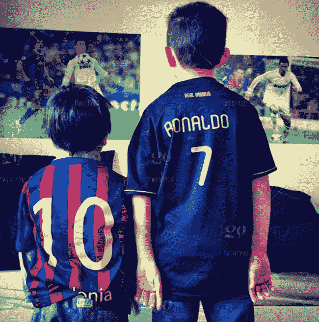

# 下载梅西和 C 罗各 30 张图片

在进行任何图片分类之前，我们必须先从网上下载我们足球运动员的图片。

# 准备就绪

有几个浏览器插件可以批量下载图片。由于 Ubuntu 预装了 Mozilla Firefox 浏览器，我们将使用它作为首选浏览器来安装批量图片下载扩展。

# 如何操作...

以下部分解释了如何批量下载图片。请参考这些步骤：

1.  访问以下网站以下载和安装 Firefox 插件：

[`addons.mozilla.org/en-US/firefox/`](https://addons.mozilla.org/en-US/firefox/)

1.  搜索并选择“下载所有图片”插件，如下面的截图所示：


1.  这将带我们到安装页面。此时，选择“添加到 Firefox”，如下面的截图所示：

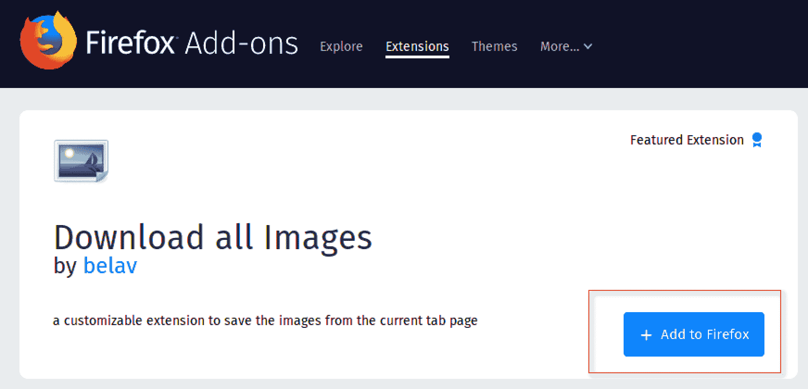

1.  确认你的安装，因为这个插件将需要权限访问你的浏览器下载历史，访问所有网站的数据，并发送通知。

1.  一旦完成，你应该会在浏览器右上角看到一个小的图片图标，表示“下载所有图片”，如下面的截图所示：


1.  我们现在准备好开始下载我们的足球运动员的图片了，使用的是新安装的 Firefox 扩展。我们可以访问许多不同的网站来下载图片，例如[`www.google.com`](https://www.google.com)。为了本章节的目的，搜索克里斯蒂亚诺·罗纳尔多，并通过[`www.pexels.com`](https://www.pexels.com)下载他的图片，如下图所示：

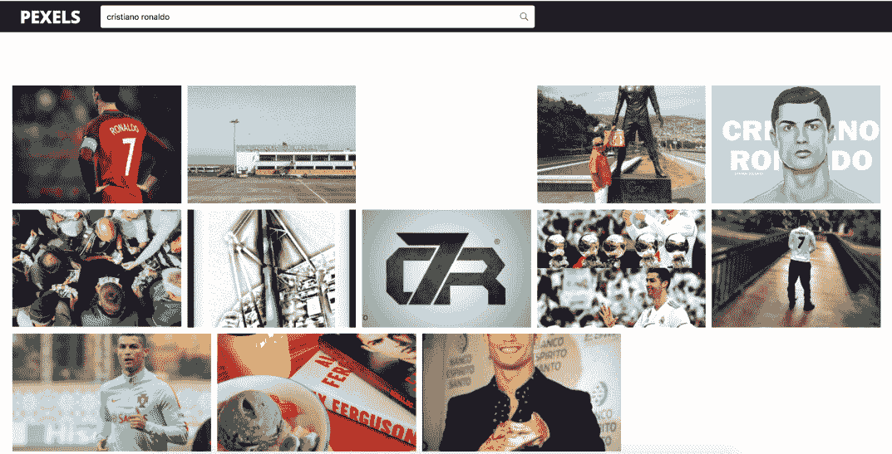

1.  接下来，点击“下载所有图片”图标，并按照下图所示指定图片的下载设置：

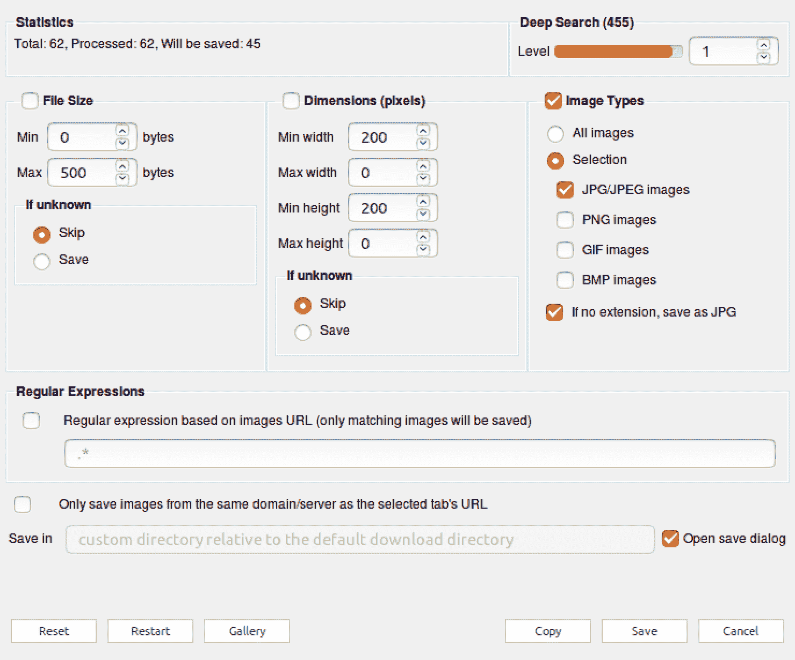

1.  点击“保存”，这样你将能够选择将所有图片下载为一个`.zip`文件并保存到本地目录。然后，你可以将该文件解压到一个文件夹，并浏览所有图片。在我们的示例中，所有图片已经被提取到`/Home/sparkNotebooks/Ch13/football/ronaldo/`，如下图所示：

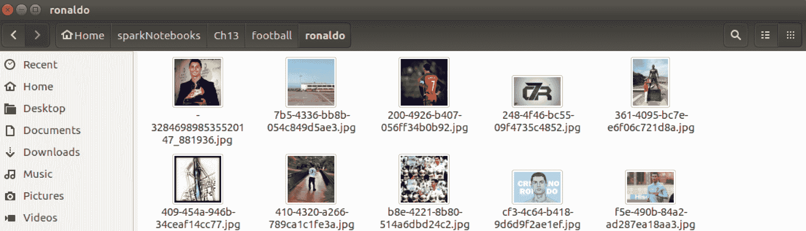

1.  在文件夹中所有可用的图片中，选择 30 张罗纳尔多的图片，并将其命名为`ronaldo1.jpg`、`ronaldo2.jpg`…`ronaldo30.jpg`，如下图所示：

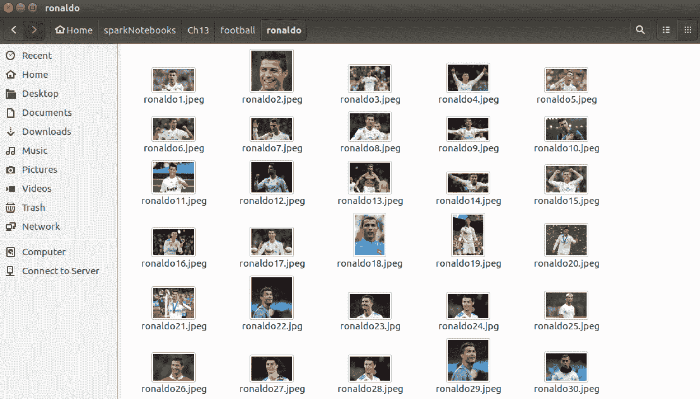

1.  再次重复步骤，这次为梅西获取 30 张图片。最终的文件夹结构应该如下所示：

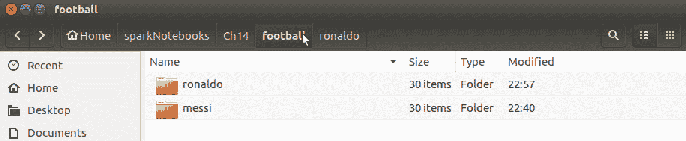

# 其工作原理...

本节解释了插件如何将图片批量下载到我们所需位置的过程：

1.  目前有很多批量图片下载软件，并且已经集成到浏览器中。我们将使用 Firefox 的“下载所有图片”插件，快速下载梅西和罗纳尔多的图片。

1.  我们想要在应用中设置下载低质量的图片，因此我们设置了最小阈值为 0 字节，最大阈值为 500 字节，并将图片类型设置为`jpg`或`jpeg`。

1.  最后，我们希望精心挑选出最能代表每位球员的 30 张图片，其中 20 张将作为训练数据集，剩余的 10 张将作为测试数据集。其他所有图片都可以删除。

1.  所有的图片将按姓氏和 1 到 30 之间的数字进行标记或标签，以便于训练使用。例如，`Messi1.jpg`、`Messi2.jpg`、`Ronaldo1.jpg`、`Ronaldo2.jpg`，依此类推。

# 还有更多内容...

尽管你可以使用你自己下载的图片，也可以通过访问以下网站下载梅西和罗纳尔多的图片，这些图片将用于本章节的训练目的：

对于梅西：

[`github.com/asherif844/ApacheSparkDeepLearningCookbook/tree/master/CH13/football/messi`](https://github.com/asherif844/ApacheSparkDeepLearningCookbook/tree/master/CH13/football/messi)

对于罗纳尔多：

[`github.com/asherif844/ApacheSparkDeepLearningCookbook/tree/master/CH13/football/ronaldo`](https://github.com/asherif844/ApacheSparkDeepLearningCookbook/tree/master/CH13/football/ronaldo)

# 另请参阅

其他浏览器也有类似的插件和扩展。如果你使用的是 Google Chrome，可以从以下网站下载名为*D*ownload'em All 的类似插件：

[`chrome.google.com/webstore/detail/downloadem-all/ccdfjnniglfbpaplecpifdiglfmcebce?hl=en-US`](https://chrome.google.com/webstore/detail/downloadem-all/ccdfjnniglfbpaplecpifdiglfmcebce?hl=en-US)

# 配置 PySpark 安装与深度学习包

还有一些额外的配置需要在 PySpark 中完成，以实现来自 Databricks 的`spark-deep-learning`深度学习包。这些配置是在第一章中进行的，*为深度学习设置您的 Spark 环境*。

# 准备工作

这个配置需要在终端中进行更改，使用**bash**。

# 如何做到……

下面的部分详细介绍了如何配置 PySpark 与深度学习包：

1.  打开终端应用程序，并输入以下命令：

```py
nano .bashrc.
```

1.  滚动到文档底部，并查找我们在第一章中创建的`sparknotebook()`函数，*为深度学习设置您的 Spark 环境*。

1.  更新函数的最后一行。当前应如下所示：

```py
$SPARK_HOME/bin/pyspark.
```

将其更改为以下内容：

```py
$SPARK_HOME/bin/pyspark --packages databricks:spark-deep-learning:0.1.0-spark2.1-s_2.11.
```

1.  一旦配置更改完成，退出文档并执行以下脚本以确认所有必要的更改已保存：

```py
source .bashrc.
```

# 工作原理……

下面的部分解释了如何修改 PySpark 以整合深度学习包，请看这些步骤：

1.  访问 bash 允许我们在命令行上进行配置，就像下面的屏幕截图所示：

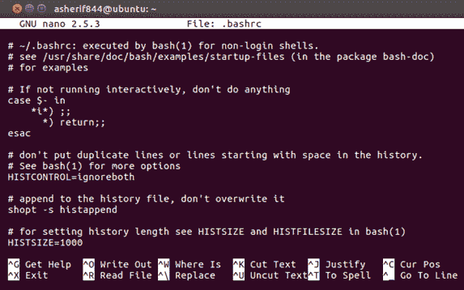

1.  在我们的文档末尾，我们可以看到我们原始的函数`sparknotebook()`仍然完好无损；然而，我们需要修改它以整合`spark-deep-learning`包。

1.  由于这次修改直接针对 PySpark，而不是 Python 库，我们无法通过典型的`pip`安装将其整合到我们的框架中。相反，我们将修改我们的 PySpark 配置，使其显示如下屏幕截图所示：

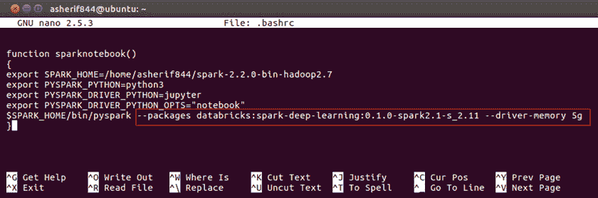

1.  我们现在已经配置了 PySpark 安装，以整合包含各种解决方案模型构建 API 的深度学习库，如图像分类。

# 还有更多……

这个包，`spark-deep-learning`，由`Databricks`管理。Databricks 是由 Spark 的共同创始人之一 Ali Ghodsi 创立的，用于通过统一平台提供托管的 Spark 解决方案。

# 另请参阅

若想了解更多为 Spark 开发的其他第三方包，请访问以下网站：

[`spark-packages.org/`](https://spark-packages.org/)。

# 加载图像到 PySpark 数据框中

我们现在已经准备好将我们的图像导入笔记本进行分类。

# 准备工作

在这一部分，我们将使用几个库及其依赖项，这将要求我们在 Ubuntu 桌面中的终端通过`pip install`安装以下包：

```py
pip install tensorflow==1.4.1
pip install keras==2.1.5
pip install sparkdl
pip install tensorframes
pip install kafka
pip install py4j
pip install tensorflowonspark
pip install jieba
```

# 如何操作...

以下步骤将展示如何将图像解码为 Spark 数据框：

1.  启动一个`spark`会话，使用以下脚本：

```py
spark = SparkSession.builder \
      .master("local") \
      .appName("ImageClassification") \
      .config("spark.executor.memory", "6gb") \
      .getOrCreate()
```

1.  从 PySpark 中导入以下库以创建数据框，使用以下脚本：

```py
import pyspark.sql.functions as f
import sparkdl as dl
```

1.  执行以下脚本，创建两个数据框，分别用于梅西和罗纳尔多，并使用每个球员的主文件夹位置：

```py
dfMessi = dl.readImages('football/messi/').withColumn('label', f.lit(0))
dfRonaldo = dl.readImages('football/ronaldo/').withColumn('label',             f.lit(1))
```

1.  将每个数据框按照`66.7/33.3`的比例拆分为训练和测试集，并设置随机种子为`12`，使用以下脚本：

```py
trainDFmessi, testDFmessi = dfMessi.randomSplit([66.7, 33.3], seed = 12)
trainDFronaldo, testDFronaldo = dfRonaldo.randomSplit([66.7, 33.3], seed =     12)
```

1.  最后，使用以下脚本将训练数据框和测试数据框合并为两个新的数据框，`trainDF`和`testDF`：

```py
trainDF = trainDFmessi.unionAll(trainDFronaldo)
testDF = testDFmessi.unionAll(testDFronaldo)
```

# 它是如何工作的...

以下部分解释了如何将图像加载并读取到 Jupyter 笔记本中。请查看这些步骤：

1.  我们总是通过启动 Spark 会话来开始一个 Spark 项目，以设置应用程序名称并设置 Spark 执行内存。

1.  我们导入了`pyspark.sql.functions`和`sparkdl`，以帮助基于编码图像构建数据框。当导入`sparkdl`时，我们看到它在后端使用了 TensorFlow，如下图所示：

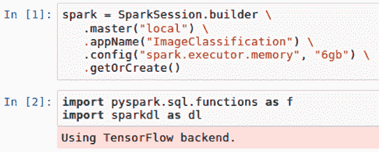

1.  数据框使用`sparkdl`创建，包含三列：文件路径、图像和标签。Sparkdl 用于导入每个图像，并通过颜色和形状对其进行编码。此外，`lit`函数用于为训练目的，在标签列下为每个数据框添加一个字面值（0 或 1），如下图所示：

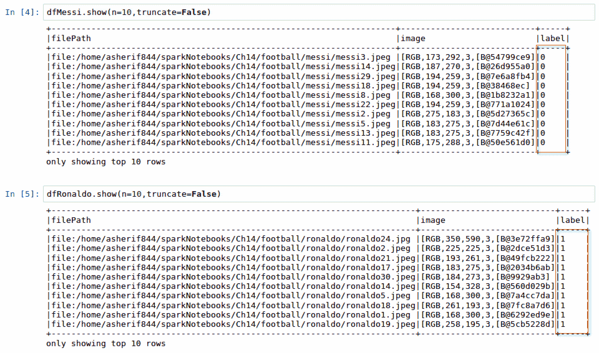

1.  由于每位足球运动员有 30 张图片，采用 66.7/33.3 的比例来创建 18 张训练图像和 12 张测试图像，如下图所示：

请注意，在深度学习中，使用更多的图像进行训练会更好。然而，我们在本章中要证明的是，随着迁移学习作为深度学习的扩展的实施，我们可以使用更少的训练样本来分类图像，正如本章中梅西和罗纳尔多每人只有 30 张图片的情况。

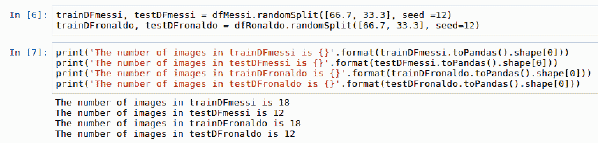

1.  为了构建我们的模型，我们只关心创建一个包含 36 张图片的训练数据框，以及一个包含其余 24 张图片的测试数据框。一旦我们合并了数据框，可以确认它们的大小是正确的，如下图所示：

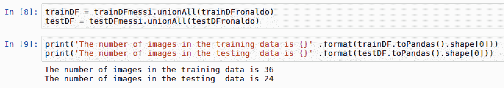

# 还有更多…

这可能在过程中丢失，但重要的是要注意，将图像加载到数据框架中非常简单，只需要几行代码，使用` sparkdl.readImages`。这展示了 Spark 提供的机器学习管道的强大功能。

# 另请参见

要了解更多关于` sparkdl`包的信息，请访问以下仓库：

[`databricks.github.io/spark-deep-learning/site/api/python/sparkdl.html`](https://databricks.github.io/spark-deep-learning/site/api/python/sparkdl.html)

# 理解迁移学习

本章剩余部分将涉及迁移学习技术；因此，我们将在本节中解释迁移学习如何在我们的架构中工作。

# 准备工作

本节不需要任何依赖项。

# 如何做到这一点…

本节介绍了迁移学习的工作步骤：

1.  确定一个预训练模型，将其作为迁移到我们选择任务的训练方法。在我们的例子中，任务将是识别梅西和罗纳尔多的图像。

1.  有多个可用的预训练模型可以使用。最流行的几个如下：

    1.  Xception

    1.  InceptionV3

    1.  ResNet50

    1.  VGG16

    1.  VGG19

1.  从预训练的卷积神经网络中提取特征，并在多个过滤和池化层中保存这些特征，应用于特定的图像集。

1.  预训练卷积神经网络的最终层被替换为我们基于数据集要分类的特定特征。

# 它是如何工作的…

本节解释了迁移学习的方法论：

1.  在前几章中，我们讨论了机器学习模型，尤其是深度学习模型，如何在较大样本的训练中表现最佳。事实上，深度学习的一般格言是：越多越好。

1.  然而，有些情况下可能没有足够的高量数据或图像来训练一个模型。正是在这种情况下，我们希望将一个领域的学习迁移到预测另一个领域的结果。提取特征并通过卷积神经网络中的多个层进行过滤的繁重工作已经由一些开发了许多预训练模型的机构（如 InceptionV3 和 ResNet50）完成。

    1.  InceptionV3 是在谷歌开发的，权重比 ResNet50 和 VGG 小。

    1.  ResNet50 使用 50 个权重层

    1.  VGG16 和 VGG19 分别具有 16 个和 19 个权重层

1.  一些高级深度学习库，如 Keras，现在预先构建了这些预训练网络，简化了应用，只需要指定模型名称。

# 还有更多…

确定哪种预训练模型最适合特定数据或图像集，取决于所使用的图像类型。最好尝试不同的预训练模型，确定哪个模型能提供最佳的准确度。

# 另请参见

要了解更多关于 Inception V3 预训练模型的信息，请阅读以下论文：

[`arxiv.org/abs/1409.4842`](https://arxiv.org/abs/1409.4842)

要了解更多关于 VGG 预训练模型的信息，请阅读以下论文：

[`arxiv.org/abs/1409.1556`](https://arxiv.org/abs/1409.1556)

# 创建图像分类训练管道

我们现在准备好为我们的数据集构建深度学习管道。

# 准备工作

以下库将被导入，以协助管道开发：

+   `LogisticRegression`

+   `Pipeline`

# 如何操作…

以下部分将讲解创建图像分类管道的步骤：

1.  执行以下脚本以开始深度学习管道并配置分类参数：

```py
from pyspark.ml.classification import LogisticRegression
from pyspark.ml import Pipeline

vectorizer = dl.DeepImageFeaturizer(inputCol="image", 
                           outputCol="features", 
                           modelName="InceptionV3")
logreg = LogisticRegression(maxIter=30, 
         labelCol="label")
pipeline = Pipeline(stages=[vectorizer, logreg])
pipeline_model = pipeline.fit(trainDF)
```

1.  创建一个新的数据框`predictDF`，其中包含原始测试标签以及新的预测分数，使用以下脚本：

```py
predictDF = pipeline_model.transform(testDF)
predictDF.select('prediction', 'label').show(n = testDF.toPandas().shape[0], truncate=False)
```

# 它是如何工作的…

以下部分解释了如何为图像分类配置管道，以实现最佳性能：

1.  `LogisticRegression`已被导入，因为它将是区分梅西和罗纳尔多图像的主要分类算法。`DeepImageFeaturizer`从`sparkdl`导入，用于基于图像创建特征，这些特征将作为逻辑回归算法的最终输入。

需要注意的是，通过`DeepImageFeaturizer`创建的特征将使用基于`InceptionV3`的预训练模型，并分配一个名为`vectorizer`的变量。

逻辑回归模型的调优次数最多为 30 次迭代。最后，管道将`vectorizer`和`LogisticRegression`变量输入并拟合到训练数据框`trainDF`中。`vectorizer`用于将图像转化为数值。`DeepImageFeaturizer`的输出可见于以下截图：

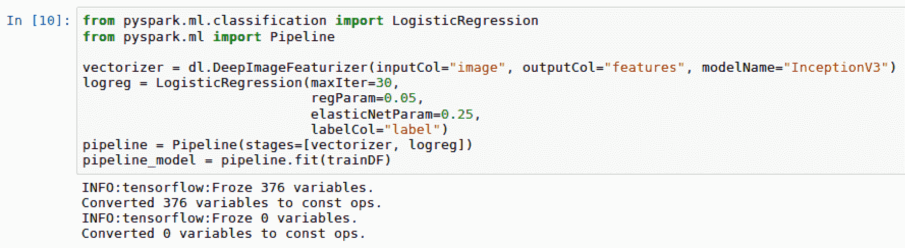

1.  测试数据框`testDF`通过应用拟合后的管道模型`pipeline_model`，转换成新的数据框`predictDF`，并创建一个名为“prediction”的新列。我们可以将标签列与预测列进行比较，如下截图所示：

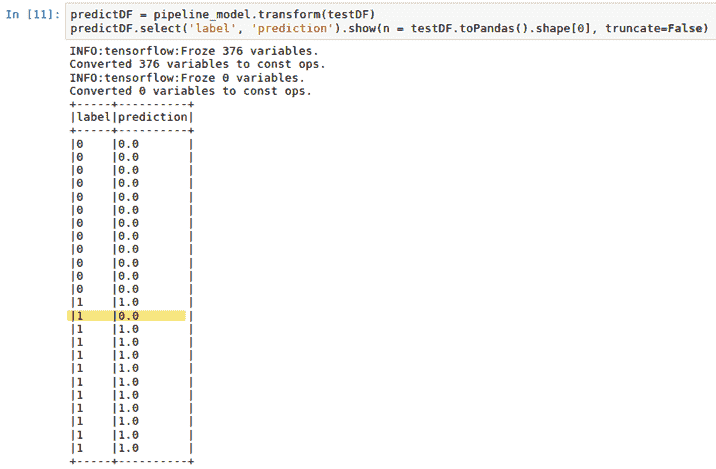

# 还有更多…

`InceptionV3`是我们用于图像分类的图像分类模型；然而，我们完全可以选择其他预训练模型，并在管道中比较准确性。

# 另请参阅

要了解更多关于迁移学习的信息，请阅读威斯康星大学的以下文章：

[`ftp.cs.wisc.edu/machine-learning/shavlik-group/torrey.handbook09.pdf`](http://ftp.cs.wisc.edu/machine-learning/shavlik-group/torrey.handbook09.pdf)

# 评估模型性能

我们已经准备好评估我们的模型，看看我们能多好地区分梅西和罗纳尔多。

# 准备工作

由于我们将进行一些模型评估，因此需要导入以下库：

+   `MulticlassClassificationEvaluator`

# 如何操作...

以下部分介绍了评估模型性能的步骤：

1.  执行以下脚本，从`predictDF`数据框创建混淆矩阵：

```py
predictDF.crosstab('prediction', 'label').show().
```

1.  通过执行以下脚本，基于我们的 24 张罗纳尔多和梅西的测试图像计算准确度分数：

```py
from pyspark.ml.evaluation import MulticlassClassificationEvaluator

scoring = predictDF.select("prediction", "label")
accuracy_score = MulticlassClassificationEvaluator(metricName="accuracy")
rate = accuracy_score.evaluate(scoring)*100
print("accuracy: {}%" .format(round(rate,2))).
```

# 工作原理...

以下部分解释了如何评估模型性能。请查看这些图像：

1.  我们可以将数据框`predictDF`转换为交叉表，创建混淆矩阵。这让我们能够理解模型中有多少真正例、假正例、真反例和假反例，如下图所示：

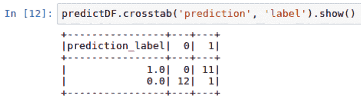

1.  此时，我们准备好计算使用 36 张训练图像准确分类 24 张剩余的罗纳尔多和梅西测试图像的模型效果。从上一张截图来看，我们在 24 张测试图像中有 21 张正确分类。我们有 2 张梅西的图像被误分类为罗纳尔多，还有一张罗纳尔多的图像被误分类为梅西。这应该会得出 88%的准确率。我们可以看到，来自`MulticlassClassificationEvaluator`的准确率得分也显示我们的准确率为 87.5%，如下截图所示：

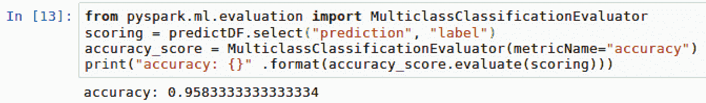

# 还有更多内容...

尽管我们最终使用了准确率作为评估模型性能的基准指标，但我们也可以同样使用精度或召回率。此外，我们使用了`MulticlassClassificationEvaluator`来评估模型的准确性。由于在此特定情况下，我们处理的是二分类问题，只有罗纳尔多和梅西两种类型的图像，因此我们也可以使用`BinaryClassificationEvaluator`，如下图所示：

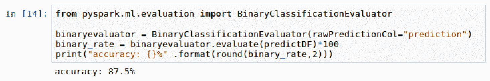

我们最终得到了相同的 87.5%的准确率。

# 另见

要了解更多关于 PySpark 逻辑回归函数中的`MulticlassClassificationEvaluator`，请访问以下网站：

[`spark.apache.org/docs/2.2.0/ml-classification-regression.html`](https://spark.apache.org/docs/2.2.0/ml-classification-regression.html)

# 微调模型参数

任何模型的准确率总是有提升空间。在本节中，我们将讨论一些可以调整的参数，以提高我们从上一节得到的 87.5%的模型准确率。

# 准备工作

本节不需要任何新的前提条件。

# 如何操作...

本节介绍了如何微调模型的步骤。

1.  定义一个新的逻辑回归模型，添加`regParam`和`elasticNetParam`参数，如下脚本所示：

```py
logregFT = LogisticRegression(
 regParam=0.05, 
 elasticNetParam=0.3,
 maxIter=15,labelCol = "label", featuresCol="features")
```

1.  使用以下脚本为新创建的模型配置一个新的管道：

```py
pipelineFT = Pipeline(stages=[vectorizer, logregFT])
```

1.  使用以下脚本将管道拟合到训练数据集`trainDF`：

```py
pipeline_model_FT = pipelineFT.fit(trainDF)
```

1.  应用模型转换到测试数据集`testDF`，以便使用以下脚本比较实际与预测的得分：

```py
predictDF_FT = pipeline_model_FT.transform(testDF)
predictDF_FT.crosstab('prediction', 'label').show()
```

1.  最后，使用以下脚本评估新模型的准确率`binary_rate_FT`：

```py
binary_rate_FT = binaryevaluator.evaluate(predictDF_FT)*100
print("accuracy: {}%" .format(round(binary_rate_FT,2)))
```

# 它是如何工作的…

本节解释了如何微调模型：

1.  逻辑回归模型`logregFT`通过调整`regParam`和`elasticNetParam`参数进行微调。两个参数分别对应逻辑回归模型的 γ 和 α 参数。正则化参数`regParam`用于在最小化损失函数和减少模型过拟合之间找到平衡。我们越是让模型复杂化，它就越容易过拟合而无法泛化，但也可能会得到较低的训练误差。此外，我们越简化模型，它过拟合的可能性就越小，但训练误差可能会更高。

1.  弹性网络参数`elasticNetParam`是另一种正则化技术，用于结合多个正则化器（L1 和 L2），以减少模型的过拟合。此外，我们还将迭代次数从 20 次减少到 15 次，以查看通过同时包含正则化和减少迭代次数是否能够提高准确度。

1.  如同本章前面所做的，我们创建了一个流水线，融合了从图像生成的数值特征、`vectorizer`，以及我们的逻辑回归模型`logregFT`。

1.  然后，模型在训练数据`trainDF`上进行拟合，并将模型的转换应用到测试数据`testDF`上。

1.  我们可以再次通过交叉表对比模型的实际结果和预测结果，如下图所示：

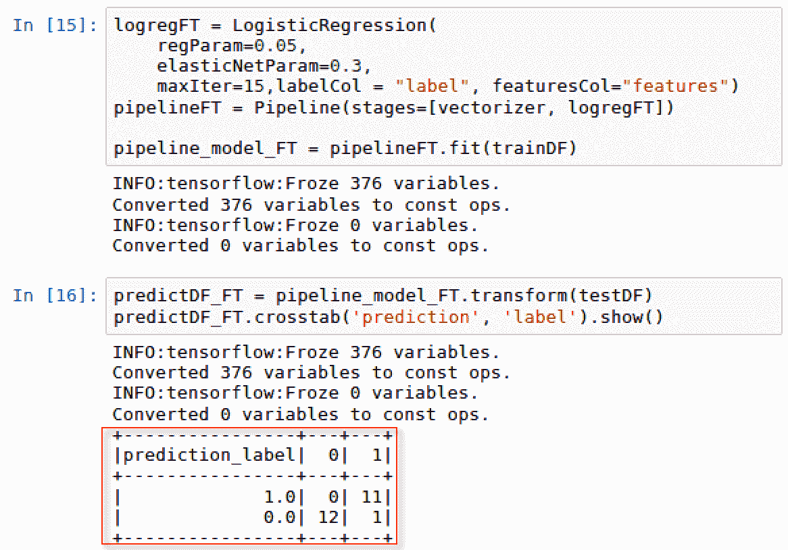

1.  现在，我们只有 1 张被错误分类的图像，而上一节中有 3 张。我们通过将`maxIter`降低到`15`轮次，并将`regParam`设置为`0.05`，`elasticNetParam`设置为`0.3`来实现这一点。

1.  我们的新准确率已经达到了`95.83%`，如下图所示：

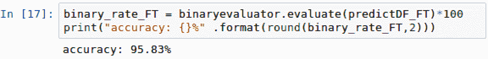

# 还有更多…

当然，我们的准确率从 87.5%提升到了 95.83%，仅仅通过将特定参数融入我们的模型。进一步的微调和调整参数可能会帮助我们确定是否能够达到 100%的准确率，用于图像分类模型。

# 参见

想了解更多关于逻辑回归中的正则化和弹性网络参数，请访问以下网站：

[`spark.apache.org/docs/2.2.0/mllib-linear-methods.html#logistic-regression`](https://spark.apache.org/docs/2.2.0/mllib-linear-methods.html#logistic-regression)
