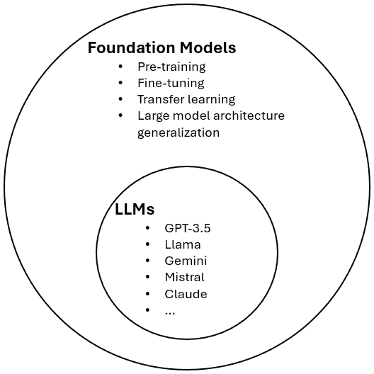
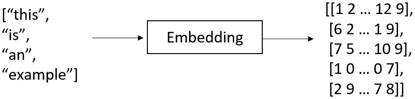
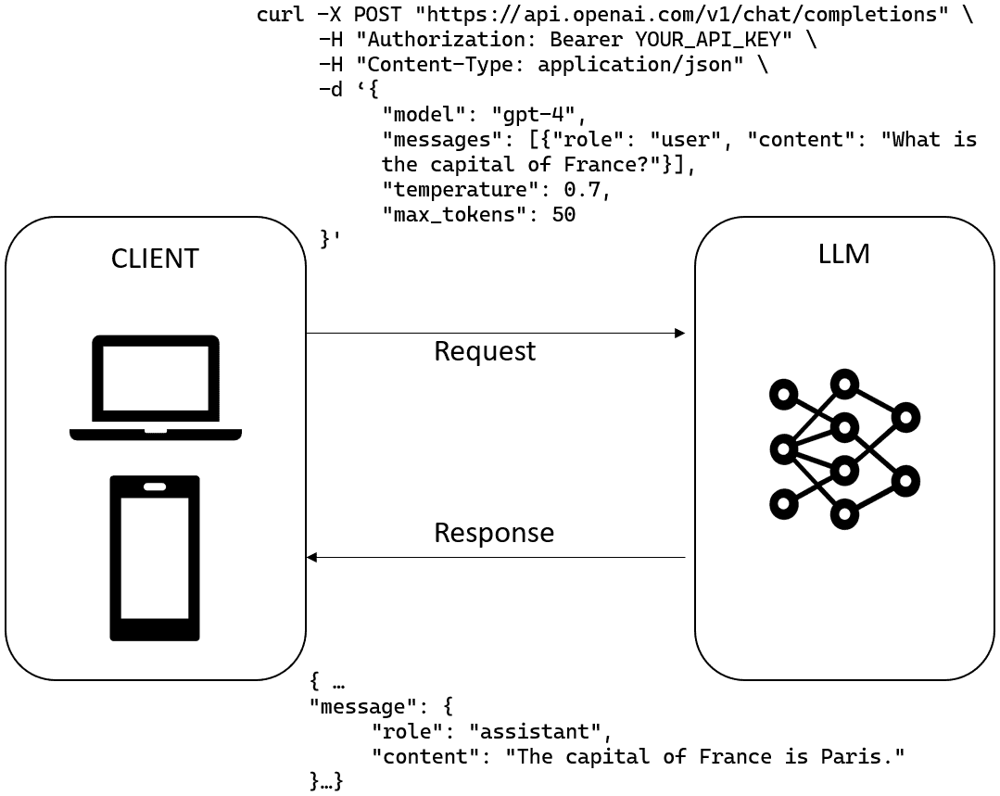
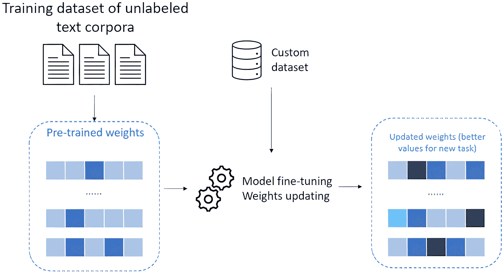
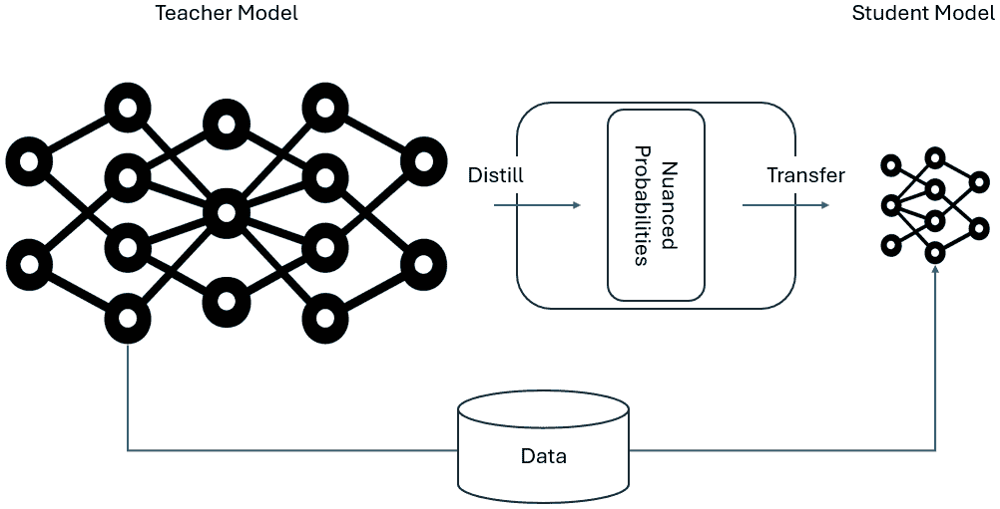
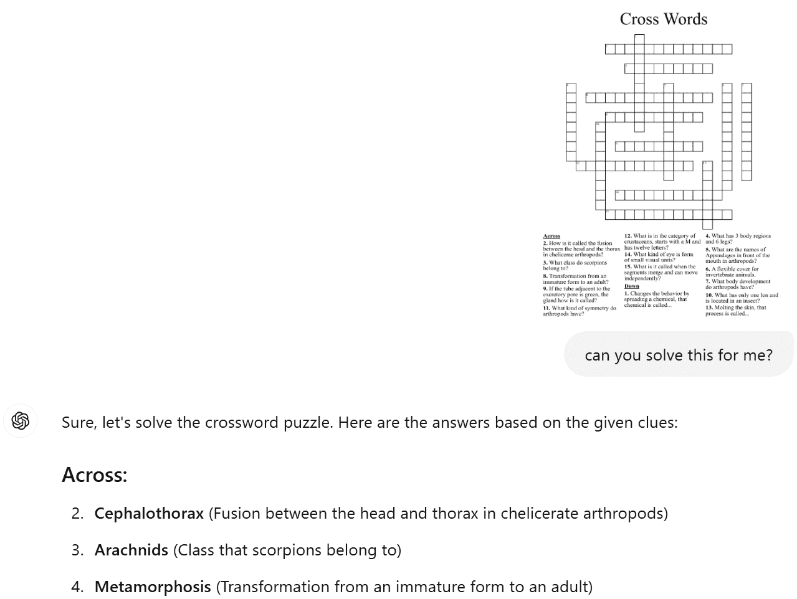

# 第一章：通用人工智能（GenAI）工作流程的演变

在过去的两年里，**大型语言模型**（LLMs）重塑了人工智能的格局。从简单的基于提示的交互到跨行业的复杂应用，LLMs 迅速发展，得益于架构、训练技术和微调策略的突破。随着它们能力的提升，从 ChatGPT 到截至 2025 年 4 月的当前代理系统的发展，标志着自然的发展进程，其中推理、规划和采取行动的能力的添加代表了一次重大的技术飞跃。

本章探讨了 LLMs 的基础，它们是如何构建和使用的，以及预训练模型和微调模型之间的差异。最重要的是，它为下一次飞跃奠定了基础：人工智能代理的出现。

在本章中，我们将涵盖以下主题：

+   理解基础模型和大型语言模型（LLMs）的兴起

+   最新重大突破

+   人工智能代理之路

+   需要额外一层智能：介绍人工智能代理

在本章结束时，你将清楚地了解 LLMs 是如何演化的，它们是如何被训练和部署的，以及为什么通往真正智能系统的道路不可避免地会导致人工智能代理的出现。

# 技术要求

你可以在本书附带的 GitHub 仓库中找到本章的完整代码：[`github.com/PacktPublishing/AI-Agents-in-Practice`](https://github.com/PacktPublishing/AI-Agents-in-Practice)。

# 理解基础模型和大型语言模型（LLMs）的兴起

人工智能得益于基础模型的出现而经历了根本性的转变——这些模型是通用的、多功能的，可以适应广泛的任务。其中，LLMs 占据了中心舞台，重新定义了我们通过自然语言与机器互动的方式。

## 从窄 AI 到基础模型

在基础模型兴起之前，人工智能领域由**窄 AI**主导——这些系统被构建来执行一个特定的任务，没有其他功能。每个用例都需要一个定制的流程：一个独特的数据集、一个专用的模型架构和专门的训练程序。如果你想将电子邮件分类为垃圾邮件或非垃圾邮件，你会构建一个垃圾邮件过滤器。如果你需要从文档中提取名称和地点，你会创建一个命名实体识别器。想要总结一篇新闻文章？那就意味着又要创建一个定制的模型。

这种碎片化的方法有几个缺点。模型很脆弱——只有在它们被训练的狭窄领域内才能表现良好——并且维护成本高昂。任务或数据分布的任何变化通常意味着从头开始重新训练。

基础模型的引入标志着我们在构建和思考人工智能系统方面的根本转变。这些模型在涵盖多个领域和任务的大量且多样化的数据集上进行训练。其理念是在大规模的**预训练**阶段教会单个模型对世界的普遍理解——它的语言、结构和模式。一旦这种普遍知识被嵌入，模型就可以通过最小量的额外数据和计算来**适应**特定任务。

例如，我们不再需要为从法语翻译成英语构建一个单独的模型，现在我们可以使用一个预训练的基础模型，并在一个较小的翻译数据集上进行微调。预训练模型已经理解了语言语法、语法和意义。微调只是将这种理解与特定目标对齐。

基础模型背后的关键创新是**迁移学习**。这些模型不是从头开始学习，而是将通用训练中获得的知识迁移到特定问题上。这大大提高了效率，减少了所需标记数据量，并导致更稳健和灵活的人工智能系统。

此外，基础模型不仅仅是关于语言。它们适用于多种模态：一些模型不仅可以处理和生成文本，还可以处理图像、音频或代码。

从本质上讲，基础模型充当人工智能的“基础大脑”——一旦训练，就可以多次重新部署。这种可扩展性和适应性为我们构建智能系统开辟了全新的可能性，为更自主和交互式的应用，如人工智能代理，奠定了基础。

现在，我们提到基础模型能够管理各种数据格式。在基础模型集群中，我们可以找到专注于单一数据类型的特定模型，这就是 LLMs 的情况。



图 1.1：LLMs 的特征

LLMs 本质上是大模型的语言专用版本。它们建立在深度神经网络架构——特别是变换器——之上，并训练以预测序列中的下一个单词。但这个看似简单的目标解锁了令人惊讶的演化行为。LLMs 可以进行对话，回答复杂的问题，编写代码，甚至模拟推理。

**定义**

演化行为是在系统达到一定规模时意外出现的复杂能力，即使那些能力并没有被明确编程或预期。在 LLMs 的背景下，这些行为在模型在数据、参数和训练时间上扩展时出现——解锁了较小版本中不存在的新能力。

随着模型规模的扩大，它们开始表现出演化特性，包括以下内容：

+   **上下文学习**：大型语言模型（LLMs）可以通过在提示中展示几个示例来学习执行任务，而无需任何微调。这在较小的模型中是看不到的。

+   **思维链推理**：通过生成中间推理步骤，LLM 可以解决多步问题，如数学文字题或逻辑谜题——这是它们之前难以解决的问题。

+   **类比推理**：它们可以以类似于人类认知处理的方式解决类比问题（例如，“猫对幼猫就像狗对...”）。

+   **算术和逻辑**：在规模上，LLM 具备处理多位数算术或逻辑谜题等任务的能力，即使这些任务并非其训练目标的一部分。

+   **理解隐喻和幽默**：高级 LLM 可以解释新的隐喻，甚至尝试讲笑话——显示出对语言和细微差别的抽象理解。

+   **多任务泛化**：它们不是为单一特定任务训练的，可以同时处理翻译、摘要、问答等更多任务——无需针对特定任务进行训练。

这些能力不仅仅代表更好的性能——它们是质的变化，仅在规模上“出现”，赋予 LLM 意想不到的广泛技能，并在各个领域产生实际影响。

## LLM 的内部机制

每个 LLM 的核心都是一个强大的神经网络架构——最常见的是**变换器**。这些网络旨在通过学习数十亿文本示例中的统计关系来处理和理解数据中的模式，尤其是人类语言。虽然灵感来源于人脑的结构，但 LLM 完全通过数学运行，通过相互连接的层传递信息，这些层在模型训练过程中会进行适应。

要使语言可计算，第一步是将其转换为数字，因为神经网络无法处理原始文本。这通过两个关键步骤——**分词**和**嵌入**——来完成：

+   **分词**将句子分解成更小的块，称为**标记**。这些可以是完整的单词或单词的一部分，具体取决于模型。例如，“The cat sat on the mat”可能会根据使用的分词器被拆分成单个单词或更小的子词单元。

+   **嵌入**将这些标记映射到高维向量——一串编码其意义和与其他词语关系的数字。这些嵌入在训练过程中学习，以便相似的词语最终出现在模型“语义空间”的相似区域。这有助于模型理解上下文和词语用法，例如“巴黎”和“伦敦”作为城市之间的关系。



图 1.2：嵌入示例

一旦输入被分词并嵌入，它就会通过**transformer 网络**本身。与只有几个隐藏层的传统神经网络不同，LLMs 使用数十甚至数百个堆叠的层，每个层都包含称为**注意力头**的机制。这些注意力层帮助模型决定哪些输入部分与给定的预测最相关。例如，当完成一个句子时，模型会学会更多地关注那些影响接下来应该出现的内容的特定先前单词。

训练 LLM 意味着教会它在一段时间内做出更好的预测。这是通过一种称为**反向传播**的方法来完成的，其中模型将其预测的单词与正确的单词进行比较，计算其偏离程度，然后更新其内部参数以减少未来的错误。

**定义**

反向传播是训练神经网络的核心学习算法。它通过比较模型的预测与正确答案，计算误差（称为损失），然后调整网络的内部参数（权重）以减少该误差来工作。这种调整是通过“传播”误差反向通过网络的层来实现的——因此得名。随着时间的推移，这个过程有助于模型做出越来越准确的预测。

假设你输入`The cat is on the...`。模型通过为可能的延续，如`mat`、`roof`或`sofa`分配概率来预测下一个单词。它不是随机猜测——它依赖于训练期间看到的模式。

这个过程在大量的数据上重复进行——数百万或数十亿个句子——使模型能够逐渐捕捉到语言的结构和节奏。结果是，一个能够不仅完成句子，还能进行对话、解决问题，并以具有上下文感知的、通常非常流畅的语言进行响应的系统。

## 我们如何消费 LLMs？

一旦 LLM 的训练阶段完成，我们需要了解如何使用这个模型预测下一个标记，这个过程被称为推理。

在机器学习和人工智能的背景下，**推理**指的是在新的输入数据上运行训练好的模型以生成预测或响应的过程。在 LLMs 中，推理涉及处理提示并产生基于文本的输出，通常需要大量的计算资源，特别是对于大型模型。

大型语言模型（LLMs）通常可以通过 API 访问，允许开发者使用它们而无需管理复杂的基础设施。这种方法简化了集成，使 AI 驱动的应用更具可扩展性和成本效益。

**OpenAI**、**Azure AI**和**Hugging Face**等 LLM 提供商提供 API，可以实时处理请求并返回响应。该过程通常涉及以下步骤：

1.  **认证**：开发者使用 API 密钥或 OAuth 令牌进行安全访问。

    **定义**

    **身份验证**是开发者证明他们的应用程序有权访问外部服务的方式。这通常是通过 API 密钥或 OAuth 令牌来完成的。**API 密钥**是由服务提供的一个唯一字符串——类似于密码——用于标识应用程序。另一方面，**OAuth**是一个更灵活的系统，允许用户授予应用程序特定的权限，作为回报发行临时访问令牌。两种方法都确保只有授权的用户或系统才能发出请求，有助于保护敏感数据和资源。

1.  **发送请求**：结构化的 JSON 请求包括模型名称、提示和参数，如温度（用于随机性）。

1.  **接收响应**：API 返回生成的文本输出以及元数据，如令牌使用情况。



图 1.3：LLM API 的 HTTP 请求示例

**注意**

一些 LLM API 支持流式响应，其中模型逐步输出令牌，而不是在发送完整响应之前等待。这种方法有助于减轻大型模型通常伴随的高延迟。通过快速交付第一块文本，流式传输减少了感知延迟——用户在看到任何输出之前等待的时间——从而带来更流畅、更响应式的体验。

现在，一个可能的问题可能是：如果我想在我的本地计算机上运行我的模型怎么办？为了回答这个问题，我们首先需要区分以下内容：

+   **私有 LLM**：这些是由 OpenAI、Anthropic 或 Google 等公司开发的专有模型。它们是封闭源代码的，这意味着您无法查看或修改其底层代码。这些模型通常只能通过 API 访问，并且带有按使用付费、基于令牌的成本。

+   **开源 LLM（大型语言模型）**：开源模型，例如 Meta 的 LlaMA、Mistral 和 Falcon，任何人都可以免费下载、修改和部署。这意味着开发者可以访问底层训练参数，在私有基础设施上运行它们，甚至可以使用底层架构从头开始重新训练模型。

然而，即使是开源 LLM，许多开发者也倾向于通过 Azure AI Foundry 和 Hugging Face Hub 等平台提供的 API 访问这些模型。

这种方法提供了几个优点：

+   **降低基础设施成本**：独立运行 LLM 需要大量的计算资源，这可能成本高昂。利用 API 将这一负担转移到服务提供商，使开发者能够利用强大的模型，而无需投资昂贵的硬件。

+   **可扩展性**：API 服务可以动态扩展以处理不同的工作负载，确保无需手动干预即可保持一致的性能。

+   **安全和合规性**：Azure AI Foundry 等平台提供企业级安全功能，帮助组织满足合规性要求并保护敏感数据。

在人工智能代理和更广泛的人工智能应用背景下，最常用的路径是通过 API 消费大型语言模型（LLMs）。例外情况可能涉及断开连接的场景（例如，在海外站点或远程位置运行 LLMs）或数据居住地的监管限制（LLM 必须位于没有公共云的特定国家）。

# 最新显著的突破

人工智能生成领域在过去几年中经历了快速的发展，其突破推动了效率、适应性和推理能力的边界。在接下来的章节中，我们将探讨一些最新的技术，这些技术显著提高了人工智能模型的表现，同时降低了计算需求。

## 小型语言模型和微调

**小型语言模型**（**SLMs**）随着组织寻求高效、成本效益的替代方案，对大型人工智能系统越来越相关。

**SLMs**是一种精简的人工智能生成模型类别，旨在高效处理和生成自然语言，同时使用的计算资源比其更大的对应物更少。与可以拥有数百亿个参数的 LLMs 不同，SLMs 通常只包含几百万到几十亿个参数。

SLMs 的减小尺寸允许它们在硬件能力有限的环境中部署，例如移动设备、边缘计算系统和离线应用。通过专注于特定领域的任务，SLMs 可以在其专业领域内提供与 LLMs 相当的性能，同时更具成本效益和节能。 

SLMs 可以从其预训练阶段设计为特定领域的模型，或者在其首次训练后进行调整和定制（这仍然将是通用的，因为 LLMs）。在特定领域进一步专业化的模型的过程称为**微调**。

微调过程涉及使用较小的、特定任务的数据库来定制特定应用的基座模型。

这种方法与第一种方法不同，因为微调时，预训练模型的参数被改变并优化以适应特定任务。这是通过在新的特定任务的小型标记数据集上训练模型来完成的。微调背后的关键思想是利用从预训练模型中学到的知识，并将其微调到新任务，而不是从头开始训练模型。



图 1.4：微调过程的示意图

在前面的图中，你可以看到如何在对 OpenAI 预建模型进行微调的方案。其思路是，你有一个带有通用权重或参数的预训练模型可用。然后，你用自定义数据（通常是“键值”提示和完成）来喂养你的模型。在实践中，你正在向模型提供一组示例，说明它应该如何回答（完成）特定问题（提示）。

这里，你可以看到这些键值对可能看起来是什么样的示例：

```py
{"prompt": "<prompt text>", "completion": "<ideal generated text>"}
{"prompt": "<prompt text>", "completion": "<ideal generated text>"}
{"prompt": "<prompt text>", "completion": "<ideal generated text>"}
... 
```

一旦完成训练，你将拥有一个针对特定任务特别适合的定制模型，例如，你公司文档的分类。

微调的主要好处是，你可以根据你的用例定制预建模型，而无需从头开始重新训练它们，同时利用较小的训练数据集，从而减少训练时间和计算量。同时，模型保留了通过原始训练学习到的生成能力和准确性，这是在大量数据集上发生的。

微调对于 SLMs 特别有价值，因为它使它们能够在保持效率的同时实现高性能。

已经开发了几种高级微调技术来优化这个过程，特别是对于 SLMs：

+   **低秩调整**（**LoRA**）：这种方法在模型的层中插入可训练的低秩矩阵，允许以最小的计算开销适应新的任务。LoRA 在内存使用方面非常高效，并且广泛用于在有限的硬件上微调大型模型。

+   **适配器调整**：不是修改整个模型，而是在每一层添加称为**适配器**的小型神经网络模块。在微调过程中，仅更新这些适配器，显著减少了可训练参数的数量，同时保留了模型的预训练知识。

+   **前缀调整和提示调整**：这些技术通过将可学习的任务特定向量或标记附加到输入上来引导模型的输出。前缀调整在输入序列的开始引入可训练向量，而提示调整优化一组提示标记以引导模型的行为。两种方法都允许在不改变模型内部参数的情况下进行有效的调整。

通过利用 SLMs 与高效的微调方法的结合，AI 应用可以实现高性能，同时避免了大规模模型的计算和财务负担。这使得 AI 对广泛的行业和用例更加可访问、可持续和可扩展。

## 模型蒸馏

**模型蒸馏**，也称为**知识蒸馏**（**KD**），是一个过程，其中*重型* LLM（通过*重型*，我们指的是它们的高参数数量）将它们的知识转移到较轻的 LLM 或 SLM，而不会在性能上造成重大损失。

如果我们考虑到最强大的 LLM 通常由数十亿——如果不是数千亿——个参数组成，这使得它们在训练和推理过程中都计算成本高昂，那么这是一个至关重要的技术。实际上，在蒸馏的主要好处中，我们可以提到以下几点：

+   在保持准确性的同时减少模型大小

+   提高推理速度和降低延迟

+   降低计算和能源成本

+   使其在边缘设备和移动平台上部署成为可能

蒸馏通常遵循一个结构化的训练流程：

1.  **教师模型训练**：一个大型、强大的 LLM 在庞大的数据集上预训练，并针对特定任务进行微调。

1.  **软标签提取**：当 LLM 返回其输出（称为硬标签）时，我们知道每个标记都是概率计算的结果——与最高概率相关联的那个。然而，对于每个预测，我们都有一个与之相关的概率向量，实际上，它提供了对教师预测和思维过程的细微视角。这些概率，被称为软标签，被提取出来，因为它们将非常有助于训练学生模型。

1.  **学生模型训练**：使用软标签和真实标签训练一个较小的模型，这些真实标签作为信息丰富和细微预测的来源。

1.  **优化和微调**：学生模型经过额外的优化，以进一步提高其准确性和效率。



图 1.5：模型蒸馏的通用框架（来源：https://arxiv.org/pdf/2006.05525）

随着 LLM 的规模和计算需求不断增长，蒸馏技术使得更实用的部署成为可能，同时保持高质量的输出。

## **推理模型**

到 2024 年底，一类新的 AI 模型出现，称为**推理语言模型**（RLMs），旨在增强超越传统 LLM 的复杂问题解决能力。这些模型代表了 GenAI 发展的重大转变，专注于内部深思熟虑和逐步推理来解决复杂任务。

RLM 的例子如下：

+   **OpenAI 的 o1 模型**：于 2024 年 9 月发布，o1 模型引入了“私有思维链”机制，允许模型在响应之前内部处理和推理问题。这种方法在数学和科学等领域带来了显著的改进，o1 解决了美国邀请数学考试([`en.wikipedia.org/wiki/OpenAI_o1?utm_source=chatgpt.com`](https://en.wikipedia.org/wiki/OpenAI_o1?utm_source=chatgpt.com))上的 83%的问题，与之前的模型相比，性能有了显著提升。

+   **OpenAI 的 o3 模型**：在 o1 的基础上，o3 模型于 2024 年 12 月发布，通过分配更多时间进行内部思考，进一步增强了推理能力。这导致了在包括编码和高级科学查询在内的复杂任务上的更高准确性。值得注意的是，o3 在 ARC-AGI 基准测试中取得了 75.7% 的分数（[`arcprize.org/blog/oai-o3-pub-breakthrough`](https://arcprize.org/blog/oai-o3-pub-breakthrough)），反映了其卓越的问题解决能力。

    **定义**

    **用于人工智能通用智能的抽象和推理语料库**（**ARC-AGI**）是一个用于评估 AI 系统能够泛化和适应新任务的能力的基准，紧密地模仿人类智能。由 François Chollet 于 2019 年引入，ARC-AGI 强调了需要抽象推理而无需依赖大量先前数据或特定领域训练的问题解决技能。

+   **DeepSeek 的 R1 模型**：2025 年 1 月，中国初创公司 DeepSeek 推出了 R1，这是一个开源推理模型，其性能与 o1 等领先模型相当，而开发成本却低得多。R1 的开源性质促进了广泛的研究和适应，有助于其快速采用和影响。

推理模型的显著区别在于它们在回答之前会“深思熟虑”；与传统 LLMs 一次性生成响应不同，RLMs 会进行内部思考，在得出结论之前处理多个推理步骤。这种方法增强了它们处理复杂、多步骤问题的能力，这在讨论 AI 代理时至关重要，正如我们在整本书中将会看到的那样。

此外，RLMs 特别训练以在需要高级推理的任务上表现出色，例如复杂数学、科学研究以及复杂的编码挑战。这种专业化使它们在这些领域优于传统的 LLMs。

前述特点的自然结果是，RLMs 的内部处理和扩展推理路径需要比传统 LLMs 更多的计算能力和每个查询的时间。这种权衡在需要深度推理的任务上带来了更优的性能，但代价是资源消耗的增加。

## DeepSeek

2025 年 1 月，所有人的注意力都转向了一个名为 DeepSeek R1 的新突破性模型。

DeepSeek 是一家成立于 2023 年的中国 AI 公司，它开发了一系列先进的 LLMs，最终 culminating in its R1 系列，通过展示高性能模型可以高效且经济地开发，从而颠覆了 AI 行业。作为锦上添花的举措，DeepSeek 还开源了这种训练方法以及模型本身，这样每个人都可以下载并本地使用它们。

这些是使 DeepSeek LLMs 在 GenAI 领域取得飞跃的主要特点：

+   **训练方法**：DeepSeek 与众不同的地方在于其独特的训练方法。它不是依赖于大量手动标注的数据集，而是仅使用强化学习（RL）来训练 DeepSeek 的 R1-Zero 模型。在 RL 中，模型通过试错来学习——对于产生期望输出的行为给予奖励。在这种情况下，LLM 因生成连贯且准确的语言而获得奖励，这鼓励它独立发展推理能力。

这种纯 RL 方法使 DeepSeek 能够突破边界，但最初也伴随着权衡：模型有时会产生不太易读或不一致的语言。为了解决这个问题，团队为后续的 R1 模型采用了多阶段训练过程，结合不同的技术逐步提高模型的表现。

该过程始于在小型、高质量数据集上的监督微调——通常被称为冷启动数据，以建立强大的语言基础。然后，再次引入 RL 来提高推理和决策能力。模型还生成了合成数据，这些数据通过拒绝采样过滤，以去除低质量输出。这些过滤后的数据被用于进一步的监督训练。最后的 RL 阶段有助于提高模型在多样化任务中的一致性和适应性。

结果？一个在质量上与顶级替代品（如 OpenAI 的 o1）相媲美的模型——尽管训练资源较少，且没有大规模人工标注的数据集。

+   **硬件利用**：在一个往往硬件访问是限制因素的行业中，DeepSeek 展示了创新可以克服硬件限制。该公司成功地在 55 天内使用大约 2,000 块 NVIDIA H800 GPU 训练了其旗舰模型 DeepSeek-R1，成本约为 560 万美元，这得益于之前解释的训练策略。鉴于美国对中国先进人工智能芯片的出口限制，这一成就尤其值得注意，凸显了 DeepSeek 有效优化可用资源的能力。

+   **开源**：DeepSeek 对开源原则的承诺营造了一个促进创新的协作环境。通过使其模型和训练方法公开可用，DeepSeek 邀请全球的研究人员和开发者为其工作做出贡献并在此基础上进行构建。

DeepSeek 的进步在全球人工智能社区中引起了涟漪，挑战了既定玩家，并促使对现有实践进行重新评估。

# 通往人工智能代理之路

通用人工智能（GenAI）的快速发展，使我们从简单的自动化走向了越来越智能的系统，这些系统能够进行推理、学习和决策。近年来，大型语言模型（LLMs）彻底改变了我们与周围生态系统互动的方式，使得对话更加自然，问题解决更加复杂。

让我们探索那些最终推动人工智能代理崛起的最重要的里程碑。

## 文本生成

自从 2022 年 11 月 ChatGPT 发布以来，用户最初采用的第一个用例就是对话式文本生成，如下所示：

+   *“生成一个关于核裂变的入门级描述”*

+   “草拟一封电子邮件发送给我的客户 C 级董事会，邀请他们参加我们的活动”

+   “列出关于人工智能文章的 10 个想法”

+   “生成一篇关于法国大革命的论文，我必须明天交上去”

你是否觉得上述任何场景都很熟悉？

LLMs 的文本生成能力具有颠覆性，因为它从根本上改变了人类与技术互动的方式，使 AI 能够以前所未有的流畅性和上下文理解生成类似人类的文本。

**注意**

在这个背景下，*文本*也包括代码，因为 LLMs 从一开始就展示了在生成和辅助编程任务方面的显著能力。当时，常见的代码相关任务包括代码生成、调试、优化、翻译和解释。

LLMs 在传统 AI 和自然语言处理领域引起了前所未有的转变，因为它们可以按需生成连贯、创造性和上下文相关的文本。突然之间，这样一项令人难以置信的技术对每个有互联网连接的用户都变得可用，民主化了高质量写作的获取，加速了营销和客户服务等行业的自动化，甚至通过辅助讲故事、诗歌和剧本写作来重塑创意领域。

然而，在拥有这个免费、会话式助手并似乎对世界上任何事物都了如指掌的初期热潮之后，我们很快开始意识到存在一个*巨大的*局限性。ChatGPT 和更广泛地说，大型语言模型的知识仅限于它们训练的数据（这是*参数化知识*）。现在，即使这些数据代表了整个网络，用户仍然需要处理**动态**、**专有**或**利基**数据集，而这些数据集并未包含在模型的训练数据中。

与你的数据聊天实际上是我们 GenAI 路线图上的下一个里程碑。

## 与你的数据聊天

*“我想和我数据聊天。”* 这句话引出了一种特定的技术，称为**检索增强生成**（**RAG**）。这种方法允许大型语言模型不仅生成文本，而且在生成响应之前从外部来源检索相关信息，确保准确性、上下文相关性和降低幻觉风险。

**定义**

在语言模型的背景下，**幻觉**指的是生成听起来合理但实际上是虚假或缺乏事实数据支持的情报。这可能会损害信任，尤其是在需要准确性的场景中。

将 LLM（大型语言模型）的范围“缩小”到预定义的知识库的过程被称为**归一化**。RAG（检索增强生成）的一个关键部分是**向量数据库**（向量 DB），它使用称为**嵌入**的向量表示有效地存储和检索信息。这使得 LLM 能够搜索语义相关的信息，而不仅仅是精确的关键词匹配。

让我们分解这个技术的每一步：

1.  **检索或查找相关信息**：RAG 不是仅仅依赖于预训练的知识，而是首先从已经适当向量化的外部知识库中检索相关数据。这可能包括 PDF 文件、Word 文档、报告、研究论文、结构化记录、表格、内部档案等等。

当你提问时，RAG 管道将其本身转换为向量，并通过计算用户向量化的查询与知识库向量化的片段之间的距离函数，在数据集中搜索最相关的信息。由于嵌入的计算方式，数学距离越低，语义相似度越高。这一步骤确保 AI 不仅仅是根据记忆生成响应，而是积极从您的数据中检索最相关和最新的信息。

1.  **增强—增强 AI 理解**：一旦系统检索到相关文档，它们就会与原始查询一起输入模型。这一步骤通过提供上下文丰富的输入来增强 AI 的理解。

与猜测或依赖一般知识不同，AI 现在有了基于具体上下文的、有根据的信息来作为其回答的基础。这个过程确保了模型的输出如下：

+   更精确，因为它直接引用相关数据

+   更可解释，因为响应有可检索的来源作为支持

+   更不容易产生幻觉，因为 AI 在经过精心策划和有根据的上下文中生成文本

1.  **生成—创建上下文感知的响应**：有了增强的上下文，AI 随后生成一个更信息丰富、更准确且与检索到的数据一致的响应。最终输出如下：

    +   实事求是，因为它结合了检索到的知识

    +   上下文感知，针对您的特定数据集定制

    +   可引用的，意味着在需要时可以提供引用或源链接

这一步骤确保响应不仅仅是 AI 生成的答案，而是基于从您的数据中检索和增强的知识专门定制的。

在接下来的章节中，我们将更详细地介绍 RAG 及其在代理系统中的作用。

到目前为止，我们只谈论了文本数据，但如果我们想用图像、视频或音频与我们的模型交互呢？

## 多模态

在 GenAI（生成式人工智能）中，多模态指的是模型能够处理和生成多种类型的数据内容的能力，如文本、图像、音频和视频。**多模态 LLMs（MLLMs**）通过结合多种模态扩展了传统 LLMs 的功能，允许更全面的理解和更丰富的交互。

最近的发展，如 OpenAI 的 GPT-4V 和 Google 的 Gemini，展示了 MLLMs 如何在一个工作流程中分析图像、生成字幕、处理语音输入，甚至在不同格式中进行推理。

LMMs（语言模型）的关键特征是它们与仅文本的 LLMs 共享泛化和适应的能力。然而，LMMs 能够通过模仿人类与周围生态系统互动的方式——即通过所有我们的感官——处理异构数据。

多模态模型的绝佳例子是 OpenAI 的 GPT-4o，它能够通过文本、图像和音频与用户进行交互。让我们看看几个使用图像的例子：


图 1.6：ChatGPT 对图像进行推理的示例

如您所见，该模型能够分析图像并对它进行推理。现在让我们要求模型生成一幅插图：


图 1.7：ChatGPT 改变图像风格的示例

关于 LMMs 最有趣的事实是它们保留了它们的推理能力，这使得它们适合在异构数据环境中进行复杂的推理。让我们考虑这个最后的例子（只显示响应的第一行）：



图 1.8：ChatGPT 对谜题进行推理并解决问题的示例

如您所想象，这为各个行业打开了应用前景，我们将在接下来的章节中看到一些具体的例子。

# 需要额外的智能层：引入 AI 代理

LLMs（大型语言模型）在生成连贯文本、回答问题和甚至进行有限的问题解决方面展示了令人印象深刻的性能。然而，当涉及到实际应用时，它们的基本设计存在一些限制：

+   **缺乏长期记忆**：大多数 LLMs 在固定的上下文窗口内运行，这意味着一旦上下文限制被超过，它们就会忘记之前的交互。这使得它们无法从过去的经验中学习或随着时间的推移保持连续性。

+   **没有持久的目标或自主性**：LLMs 对单个提示做出反应，但它们没有以持久的目标导向心态运行。它们不能主动做出决定、自我纠正或随着时间的推移改进其方法。

+   **有限的推理和多步执行**：虽然 LLMs 可以在单个提示中遵循指令，但它们在执行多步工作流程、处理复杂决策以及在整个交互中保持逻辑一致性方面存在困难。

+   **无法与外部系统交互**：没有额外的集成，大型语言模型（LLMs）无法检索实时信息，调用 API，操作数据库，或执行超出基于文本输出的动作。

为了解决这些挑战，AI 代理引入了一个额外的智能层，使模型能够自主行动、通过任务进行推理、与外部环境交互并从过去的交互中学习。

在下一章中，我们将定义人工智能代理的结构。然而，你可以将其视为一个系统，它结合了 LLM 以及额外的能力，如记忆、计划和多步推理，以最小的人为干预执行任务，从而实现高度自主。与仅生成静态响应的标准 LLMs 不同，AI 代理可以执行以下操作：

+   **通过保持记忆和随时间调整其行为来跨交互持久化**

+   **将复杂任务分解为更小的步骤并按顺序执行**

+   **与工具和 API 交互**以检索实时数据、自动化工作流程并采取有意义的行动

+   **基于学习到的知识、目标和约束自主做出决策**

在其核心，AI 代理作为智能助手，能够处理超越简单问答的复杂任务。我们将在接下来的章节中详细探讨它们。

# 摘要

在过去两年中，人工智能经历了深刻的变革，从简单的 LLM API 调用转变为更复杂、交互式和自主的系统。LLMs 的快速进化以 RAG、微调进步和以推理为重点的架构等创新为标志，所有这些创新都旨在提高效率、适应性和成本效益。

尽管取得了这些进展，但仅凭 LLMs 本身不足以满足对能够自主运行、做出决策并与环境有意义交互的人工智能系统的日益增长的需求。

这种转变标志着人工智能发展的一个关键时刻，其重点不再仅仅是使模型**更大**，而是使它们**更智能**。我们不再将 AI 视为一个被动工具，它对孤立的提示做出反应，我们现在正在设计**智能体系统**，这些系统能够行动、学习和适应复杂的现实世界任务。

在下一章中，我们将探讨人工智能代理的出现、它们的主要组件以及它们可能采取的各种形式。

# 参考文献

+   *《知识蒸馏：综述》*：[`arxiv.org/pdf/2006.05525`](https://arxiv.org/pdf/2006.05525)

+   OpenAI o1：[`en.wikipedia.org/wiki/OpenAI_o1?utm_source=chatgpt.com`](https://en.wikipedia.org/wiki/OpenAI_o1?utm_source=chatgpt.com)

+   *推理语言模型：蓝图*：[`arxiv.org/abs/2501.11223`](https://arxiv.org/abs/2501.11223)

+   LoRA: [`arxiv.org/abs/2106.09685`](https://arxiv.org/abs/2106.09685)

+   *适配器调整*：[`arxiv.org/abs/2304.01933`](https://arxiv.org/abs/2304.01933)

+   前缀调整和提示调整：[`ericwiener.github.io/ai-notes/AI-Notes/Large-Language-Models/Prompt-Tuning-and-Prefix-Tuning`](https://ericwiener.github.io/ai-notes/AI-Notes/Large-Language-Models/Prompt-Tuning-and-Prefix-Tuning)

|

#### 现在解锁此书的独家优惠

扫描此二维码或访问 [packtpub.com/unlock](http://packtpub.com/unlock)，然后通过书名搜索此书 |  |

| *注意：请在开始之前准备好您的购买发票。* |
| --- |
