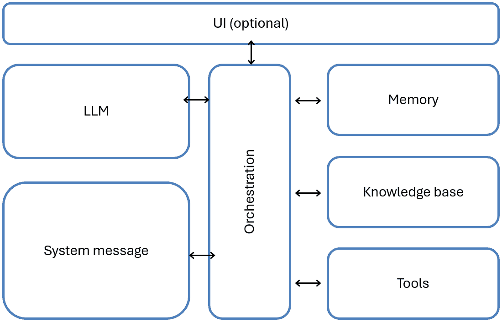
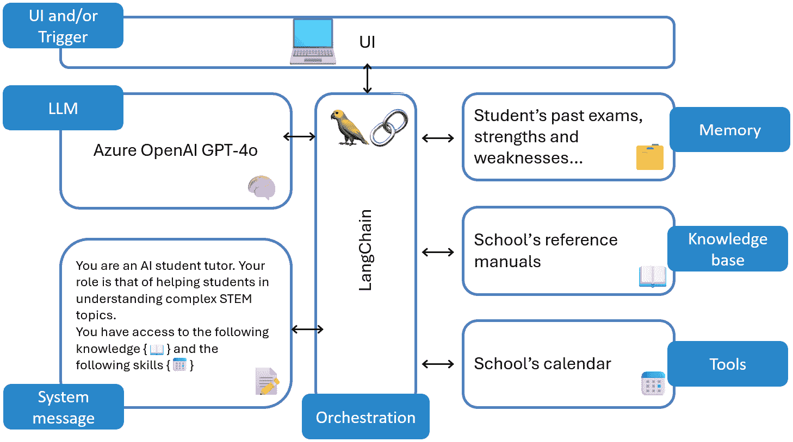
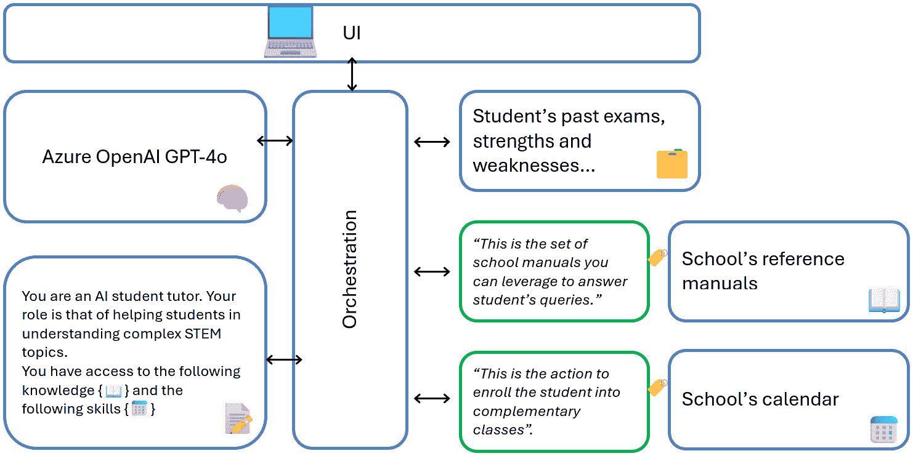
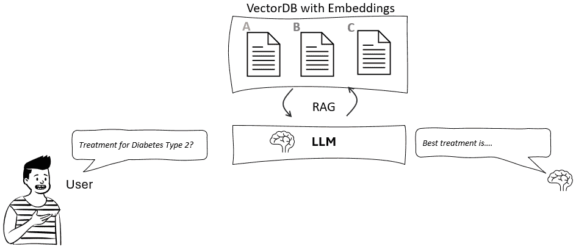
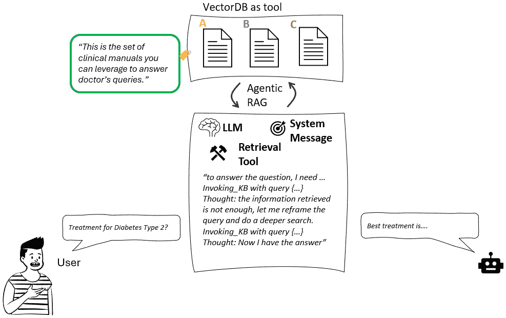
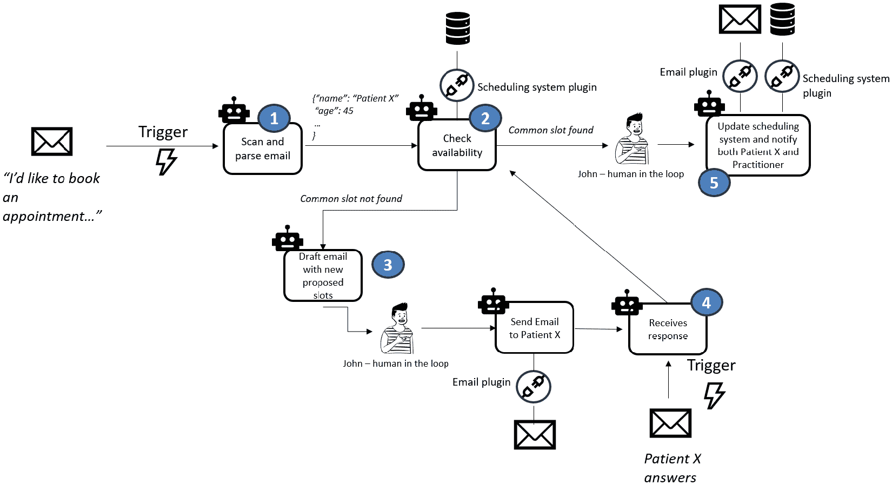
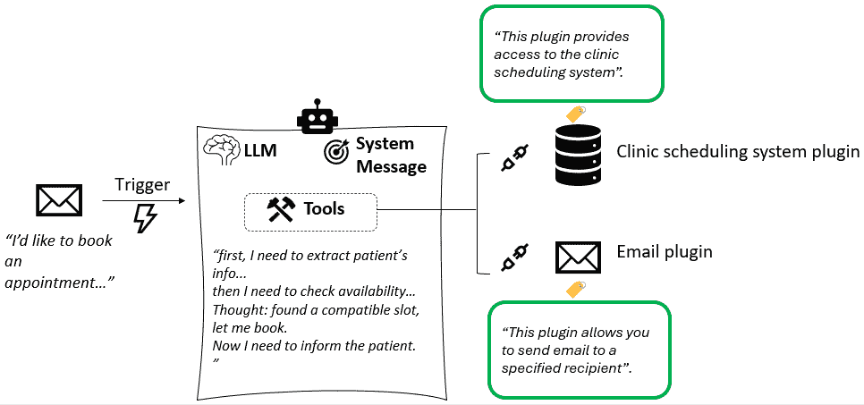

# 第二章：人工智能代理的兴起

本章将探讨人工智能代理的演变，追溯其从早期的机器人流程自动化（RPA）系统到今天复杂的多代理架构的根源。我们将定义什么是人工智能代理，分解其基本组件，并检查正在塑造全球行业的不同类型的 AI 代理。

在本章中，我们将涵盖以下主题：

+   从 RPA 到人工智能代理的演变

+   人工智能代理的定义

+   不同类型的 AI 代理

+   人工智能代理的组件

到本章结束时，你将清楚地了解人工智能代理的演变、它们的关键组件以及它们如何改变行业。

# 技术要求

你可以在本书附带的 GitHub 仓库中找到本章的完整代码：[`github.com/PacktPublishing/AI-Agents-in-Practice`](https://github.com/PacktPublishing/AI-Agents-in-Practice)。

# 从 RPA 到人工智能代理的演变

从传统的基于规则的自动化到复杂的 AI 驱动代理的转变，标志着重大的技术进步。最初，自动化仅限于僵化的、预定义的工作流程，但随着机器学习、强化学习和**大型语言模型（LLMs**）的兴起，AI 代理已经发展到更加自主、智能，并且能够做出复杂的决策。让我们看看近几十年来代理的不同风味。

+   **机器人流程自动化（RPA**）：这代表了自动化最早的阶段，专注于基于规则的系统，旨在执行预定义的任务。这些系统遵循严格的逻辑流程，根据明确的条件和结构化输入执行操作。虽然对于重复性流程有效，但 RPA 缺乏灵活性、适应性和处理非结构化数据的能力。以一个基于规则的聊天机器人为例，它遵循严格的决策树，但不从交互中学习；然而，它无法处理动态环境或意外输入。

+   **基于传统机器学习/强化学习的代理**：随着人工智能的发展，传统的机器学习（ML）和强化学习（RL）代理开始出现。这些代理可以从数据中学习，根据概率模型做出决策，并通过试错来优化其行为。让我们双击查看这两个方面：

    +   **基于规则的代理**：这些代理从静态规则集过渡到基于机器学习的模型，可以根据训练数据对结果进行分类和预测。

    以一个早期的客户支持聊天机器人为例，它遵循严格的决策树来响应用户查询，并通过命名实体识别机制进行路由。

**定义**

**命名实体识别 (NER**) 是一种自然语言处理 (NLP) 任务，它能够识别和分类文本中的关键信息，例如人名、组织机构、地点、日期以及其他预定义实体。

+   **强化学习 (RL) 智能体**：这些智能体通过与环境的交互学习，优化长期奖励的行动。强化学习智能体在游戏、机器人和复杂问题解决领域得到了广泛应用。

例如，DeepMind 的 AlphaGo 通过模拟数百万次游戏并通过试错优化策略来学习玩围棋。

然而，这些早期智能体有一个主要缺陷：泛化能力有限。以 AlphaGo 为例——虽然它通过数百万次模拟比赛掌握了围棋，但其智能是狭窄且特定领域的。AlphaGo 无法将其知识应用于其他棋类游戏，如国际象棋，或处理与客户服务或调度无关的任务。这种人工智能在严格限定的环境中可能表现出色，但规则、上下文或输入模式发生变化时无法适应。

这种缺乏灵活性揭示了人工智能领域的一个更广泛挑战：需要能够跨领域推理、理解模糊指令并实时适应动态环境的智能体。

正是在这里，基于 LLM 的智能体发挥了作用。

+   **基于大型语言模型 (LLM) 的智能体**：随着 LLM 的出现，人工智能智能体在推理、规划和动态交互方面变得更加有能力。生成式人工智能使这些智能体不仅能够回答查询，还能综合信息、自动化工作流程并集成各种外部系统——正如我们将在本章中详细看到的那样。

从高层次来看，基于 LLM 的智能体的力量在于它们可以利用 GPT-4o 等模型不仅理解上下文和检索相关信息，还可以协调一组组件，使智能体能够与周围环境交互。这是区分现代人工智能智能体与先前 RPA 系统以及 LLM 本身的“额外智能层”。

此外，当我们利用大型多模态模型时，人工智能智能体可以整合不同的模态，如文本、语音、视觉和结构化数据，以更人性化的方式进行交互。

例如，您可以将基于 LLM 的智能体想象成一个零售助理，它可以实时处理口头问题、分析产品图像并查询库存数据库。

+   **多智能体系统和自我复制智能体**：人工智能智能体进化中的一个重大突破是引入了多智能体系统，其中多个智能体协作解决复杂任务。这些系统允许任务委派、专业化和并行执行，从而提高效率和自主性。例如，一个多智能体研究系统中，一个智能体检索论文，另一个总结它们，第三个为团队生成可操作的见解。

此外，我们还可以为这些代理提供“自我复制”的能力，这意味着它们可以生成额外的代理来处理子任务，有效地扩展自身以满足需求。以一个 AI 项目经理为例，它可以生成专门的子代理来处理软件开发工作流程中的设计、编码和测试。

+   **AGI 代理——下一个前沿**：人工智能进化的最终目标是开发**通用人工智能**（AGI）代理——能够执行人类可以执行的任何智力任务的系统。AGI 代理将整合推理、规划、记忆和自我改进，以在广泛的应用中自主运行。

在撰写本书时，这仍然是一种尚未完全被普遍认可的理解，但见证人工智能代理不断演变的边界是一个令人兴奋的时刻。

在本书中，我们将主要关注基于单个、LLM 的代理，并在*第七章*中涉及多代理框架。让我们先定义一下什么是人工智能代理。

# 人工智能代理的组成部分

**AI 代理**是一个基于软件的实体，能够感知其环境，推理其目标，做出决策，并通过与外部系统的交互执行行动——通常是自主地。与遵循预编程规则的传统自动化不同，AI 代理可以根据上下文动态适应，利用外部工具，并整合记忆以随着时间的推移改进决策。

在技术层面上，人工智能代理由几个核心组件组成：

+   **LLM**：代理的推理引擎，提供自然语言理解、响应生成和任务规划。像 GPT-4、Claude 和 Gemini 这样的 LLM 使代理能够处理用户输入、生成响应，甚至进行多步推理。

+   **系统消息**：将系统消息视为代理的“使命”，因为它提供了塑造代理行为的底层**指令**。除了主要目标外，系统消息还定义了语气、角色和约束（例如，“你是一位客户支持助理；简洁而富有同情心地回应”）。

+   **记忆**：使代理能够在时间上保持上下文，提高连续性和个性化。从高层次来看，记忆可以分为短期（基于会话的）和长期（存储过去交互的数据库）。然而，代理记忆有许多细微差别，包括短期、情景和程序性，我们将在*第四章*中探讨。

+   **工具**：扩展代理的能力，使其超越 LLM。代理与外部工具（如 API、数据库、搜索引擎和自动化脚本）交互，以获取实时数据、执行计算或触发外部过程。

+   **知识库**：存储代理可以参考的结构化和非结构化领域知识。这包括**检索增强生成**（RAG）系统、专有公司数据或用于增强决策的专业知识库。

图 2.1：AI 代理的主要组件

此外，我们还有一个编排层，旨在管理代理内部的任务流程，确保组件之间的协调。

**备注**

人工智能代理可能具有用户界面，也可能不具有。一方面，代理可以是面向用户的对话应用，根据用户的输入做出反应（例如，客户服务 AI 代理针对用户关于特定产品的查询）。另一方面，它们也可能在自动化工作流程中“幕后”操作；如果是这种情况，它们可能根本不需要用户界面，因为它们是由事件触发的（例如，每当在记录系统中提交工单时，提供问题解决方案的 AI 代理）。

让我们考虑以下示例。想象一个学术机构开发了一个 AI 代理，旨在帮助高中生掌握复杂的 STEM 主题。通过利用大型语言模型、记忆和编排，这个代理提供个性化辅导，引用权威来源，并适应每个学生的学习需求。

图 2.2：AI 辅导助手的示例

让我们逐一关注每个组件：

+   **LLM**：这作为核心推理引擎，是代理的“大脑”，以对话方式提供解释、解决问题和回答学生问题——所有这些都归功于代理组件提供的附加信息。

**备注**

记住这一点很重要，即大型语言模型（LLMs）通常是在公共或通用数据集上训练的。这意味着除非明确地基于此类信息进行训练，否则它们往往缺乏对特定行业、专有数据或组织流程的深入上下文理解。这就是为什么提供与特定用例相关的外部知识库可以使代理具备特定领域的知识，从而提高其在现实场景中的准确性、可靠性和实用性。

+   **系统消息**：这定义了代理的性格，确保它与其教育目的保持一致（毕竟，我们不希望 AI 辅导代替学生做作业，而是一个在学习过程中支持他们的助手，强化他们的弱点，专注于特定的学习领域）。

+   **编排**：这确保了 UI、LLM 和各个组件之间的顺畅交互。它智能地路由请求，决定何时检索外部数据、参考存储的学生表现历史，或直接从 LLM 生成内容。

+   **记忆**：这跟踪学生的聊天会话以保持对话的相关性（短期）。此外，它存储以前学生的互动，以便了解他们的学术背景。这种知识允许代理使用优势和劣势数据来强化有挑战性的主题并优化课程计划。

+   **知识**：代理需要检索以回答特定问题的相关知识被存储。如果我们需要将模型建立在特定的文档集上（例如，学校的手册），这尤其有用。

+   **工具和 API 集成**：这是我们为代理提供工具以执行操作的地方。一个例子可能是学生和学校的日历。这将允许代理代表学生预订课程，根据可用性和与学术课程的兼容性。

+   **UI（学生界面）**：这提供了一个基于聊天的交互式学习体验，整合了文本、图表和逐步解决问题的过程。

这里是如何在实际中工作的：

1.  学生提出了一个关于牛顿力学的复杂物理问题。

1.  **LLM**处理查询，使用先前的交互和上下文记忆。

1.  **协调器**确定答案是否需要参考材料、过去学生的表现数据或外部网络搜索。

1.  如果需要，代理会从**学校的参考手册**中检索相关信息。

1.  LLM 会根据学生的水平**定制解释**，强化他们在过去考试中遇到的困难区域。

1.  学生会收到一个交互式响应，包括逐步解释、视觉辅助工具和实践问题。

1.  最终，代理会根据其日历为学生提供在可用时间段内预订一些额外课程的选项。

1.  如果学生接受，代理将代表他们预订课程。

现在，问题是：代理如何知道何时调用特定的知识或特定的工具？

使这一机制如此强大的原因是语言模型理解自然语言的能力。每次初始化工具或组件——比如“安排会议”动作——它不仅仅由其底层逻辑（例如，向日历添加事件的 API 调用和 POST 请求）定义。它还伴随着一个自然语言描述。这个描述用简单明了的语言解释了工具的功能和它返回的输出类型。LLM 读取这个描述，并据此决定在任务中何时以及如何调用工具。本质上，模型不仅仅是执行代码——它是根据其人类可读的描述在可用的动作中进行推理。

图 2.3：用自然语言描述代理组件的示例

现在，当用户向代理提出问题时，代理——由 LLM 的头脑驱动——将去阅读所有组件的描述，并理解应该调用哪个组件来解决用户的查询。

正如我们将看到的，我们可以为代理定义不同的策略来调用适当的工具。例如，我们可能希望工具始终作为第一个调用，然后让代理决定是否需要调用其他工具。解决这种规定顺序的一种策略是简单地将其写入系统消息。例如：

您是一个有用的 AI 助手。您有权访问以下工具：

+   工具 A

+   工具 B

当您收到用户的查询时，始终调用工具 A。如果您无法使用工具 A 完成任务，则调用工具 B。确保在尝试工具 A 之前不要调用工具 B。

这些策略在编排器级别定义，正如我们将在*第三章*中看到的。

# 不同类型的 AI 代理

AI 代理具有不同层次的结构和功能，从基于检索的简单代理到完全自主的系统。了解这些不同类型有助于组织和个人选择适合特定用例的正确类型的 AI 代理。在本节中，我们将 AI 代理分为三种主要类型：检索代理、任务代理和自主代理。

## 检索代理

在*第一章*中，我们介绍了 RAG 的概念，作为 GenAI 应用中的一种技术，其中 LLM 在生成响应之前从知识库（正确嵌入并存储在 VectorDB 中）检索相关文档或片段。

**检索 AI 代理**建立在 RAG 的基础上，但融合了先进的代理行为，使它们更加自主和适应。事实上，我们正在向标准的 RAG 管道中添加一个额外的智能层和规划层，允许代理“策略化”如何检索最相关的信息片段。

**注意**

检索 AI 代理通常被称为代理 RAG。这种方法将知识来源视为“工具”，这意味着它们将附带自然语言描述，以便代理可以根据用户的查询决定调用哪个来源。一旦调用来源，检索机制将遵循与传统的 RAG 相同的模式，但我们还将拥有这一额外的智能层，可以决定是否足够回答，并在必要时调用更多来源。

让我们考虑以下示例。假设我们想要为医生构建一个 AI 助手，以便快速检索有关治疗的信息。假设医生问道：“*2 型糖尿病的最新治疗方法是什么？*”，让我们看看两种方法如何进行比较：

+   **传统 RAG 方法**：

    +   RAG 系统从数据库中检索前三个相关文章。

    +   模型从这些文章中提取相关文本，并生成一个总结关键治疗的响应。

    +   如果检索到的文档没有完全回答医生的问题；除非医生手动提交新的查询，否则模型无法优化搜索。

图 2.4：传统 RAG 流程

+   **检索 AI 代理方法**

    +   代理检索一组初始文档并分析它们。

    +   它检测到一些检索到的研究已经过时，因此它优化其搜索标准并检索更多近期出版物。

    +   它识别出有关特定药物的信息差距，并检索该药物的专门研究。

    +   最后，它将所有检索到的来源综合成一个全面的答案，确保相关性和完整性。

图 2.5：代理 RAG 流程

总之，代理 RAG 可以在传统 RAG 之上带来几个改进：

+   **多步和递归检索**：而不是单次检索，AI 代理会迭代地优化其搜索，将复杂查询分解成多个步骤。

+   **情境意识**：它们保持对先前交互的记忆，允许它们提出澄清问题或动态调整检索策略。

+   **工具驱动查询执行**：检索 AI 代理可以与 API、数据库或向量搜索引擎交互，使它们能够获取实时和结构化数据。

+   **自适应知识增强**：与 RAG 中的静态检索不同，AI 代理可以通过从不同来源获取信息并上下文合成来丰富响应。

+   **自主决策**：这些代理可以确定何时检索更多信息，查询哪些来源，以及如何优化其结果以获得最佳相关性。

检索代理是 AI 代理的最简单形式，但额外的智能层已经显示出对整体用户体验的巨大改进。然而，当它们能够将检索技能与可执行的任务相结合时，AI 代理的真正力量才得以显现。

## 任务代理

**任务代理**不仅限于信息检索，它们通过执行特定动作来超越信息检索。这些代理旨在自动化工作流程并替换用户的重复性任务。与检索代理不同，它们根据用户命令或外部触发执行预定义的动作。

**注意**

当谈论 AI 代理时，你经常会听到任务、工具、技能、插件、功能和动作等术语，这些术语是互换的，用来指代代理“做事”的能力。你也会看到不同的 AI 编排器带有不同的术语。让我们尝试获得一些清晰度：

**任务**定义了需要完成的事情，可以从简单的动作，如发送电子邮件，到涉及多个动作的复杂过程。

**工具**提供执行任务的外部手段，例如数据可视化工具创建图表或语言翻译服务翻译不同语言中的文本。

**插件**通过与其他平台的集成扩展功能，并且通常附带可以针对该平台执行的操作或函数（列出行、追加新记录等）。

**功能**概述了内部操作方法——例如，一个正确定义的 get_weather 函数将能够返回给定位置的当前天气。

**技能**代表代理学习到的熟练程度，通常以声明性方式（自然语言）定义。您可以将技能视为仅在需要该特定技能的情况下调用的“迷你提示”。

**动作**是 AI 代理针对给定情况或输入采取的切实步骤或操作。它们是代理功能和技能的实时体现，导致可观察的结果。

让我们再次考虑一个医疗保健领域的例子，这次是从普通开业医生的接待员约翰的角度来看。

约翰管理大量的预约请求。患者通过各种渠道预约访问：电话、电子邮件和在线预订系统。管理最后一刻的取消和重新安排请求既耗时又常常导致日程安排出现空缺。

约翰一天中的典型流程可能如下所示：

1.  约翰收到患者 X 的电子邮件，要求预约并分享了一些关于日期和时间的偏好

1.  约翰检查所需专家医生的可用性，并尝试与患者 X 的偏好匹配最早的可能时段

1.  约翰没有找到任何匹配项，因此返回到患者 X 那里寻找替代方案

1.  最后，约翰和患者 X 商定了一个时段，并安排了预约

如果您考虑上述步骤，它们不过是约翰为了实现目标——为医生和患者安排一个优化的预约时段——而需要执行的任务。

每当我们想要使用 AI 代理（更具体地说，是任务代理）映射和增强一个业务流程时，一个良好的实践是将人类任务转换为代理任务。让我们看看，例如，一个任务代理如何帮助约翰：

图 2.6：任务代理如何执行任务

**快速提示**：需要查看此图像的高分辨率版本吗？在下一代 Packt Reader 中打开此书或在其 PDF/ePub 副本中查看。

**下一代 Packt Reader**随本书免费赠送。扫描二维码或访问 packtpub.com/unlock，然后使用搜索栏通过书名查找此书。仔细核对显示的版本，以确保您获得正确的版本。

1.  AI 代理自动扫描从患者 X 收到的电子邮件。它提取关键细节，如患者的姓名和联系方式、首选日期和时间以及所需的专家。

1.  AI 代理检查可用性，调用插件（我们为代理配备的工具）到诊所的预约系统。它将患者 X 的偏好与专家的最早可用插槽相匹配。如果匹配，它将进入步骤 5。

1.  AI 代理未找到匹配项。由于没有找到匹配项，AI 代理根据专家的日程表生成下一最佳可用插槽的列表。它还草拟了一封回复患者 X 的电子邮件，利用写作技巧，提供了建议的替代方案，但在发送之前由 John 审查和批准。

1.  患者 X 回应一个新的偏好，然后：

    1.  接受其中之一（进入步骤 5）

    1.  请求新的选项，然后 AI 代理重复步骤 3。

1.  一旦 John 和患者 X 就插槽达成一致，AI 代理将自动在系统中安排预约，利用上述相同的插件。此外，它还向患者 X 发送包含详细信息的确认电子邮件，利用电子邮件插件。最后，它更新专家的日历并通知他们预约情况。

图 2.7：实践者办公室中 AI 代理解剖结构示例

如您所见，AI 代理充当 John 的助手，处理重复的预约任务，同时他专注于面对面的患者互动。

## 自主代理

**自主代理**代表了 AI 代理中最先进的类别。与在预定义边界内操作的检索和任务代理不同，自主代理**战略性地协调多个任务和检索过程**，通过实时决策优化工作流程。这些代理表现出高度的自独立性、适应性和情境意识，使它们能够在最小的人为干预下执行复杂操作。

自主代理的关键区别在于它们能够：

1.  结合检索和行动：它们既可以找到信息（如检索代理）并对其采取行动（如任务代理）。

1.  规划和自我调整：它们根据新信息或变化的约束动态调整。

1.  执行多步骤工作流程：它们将复杂任务分解为子任务，迭代执行并根据结果进行调整。让我们继续以 John 的诊所为例。随着诊所变得越来越繁忙，管理预约、取消和重新安排变得令人难以承受。一个任务代理帮助简化了单个操作，但现在一个自主代理接管了端到端预约过程，需要最少的监督。以下是它是如何一步一步工作的： 

    1.  接收和优先级排序：代理监控所有渠道（电子邮件、门户、电话记录），提取患者偏好、紧迫性和专家需求，并根据优先级对请求进行排序。例如，取消的预约会腾出一个空位，代理会立即将其与等待类似时间的患者 X 匹配。

    1.  规划和优化：它审查完整的每日日程，识别冲突或空闲时段，并构建一个优化的计划——通过调整低优先级访问来为紧急访问腾出空间。

    1.  带反馈的执行：代理向患者发送选项，更新日历，预订预约并发送确认，所有这些都是自动完成的。如果偏好发生变化，它会回溯，完善其行动。

    1.  实时适应：一位医生因病请假。代理暂停新的预订，重新安排受影响的患者的预约，并通知员工——除非需要人工输入，否则所有步骤都是自主完成的。

    1.  持续学习：在一天结束时，它分析结果，更新患者偏好，并调整未来的优先级逻辑。

自主代理可以规划、检索、决策、行动、适应和学习——所有这些都不依赖于预定义的工作流程。约翰现在专注于边缘情况，而代理智能地处理其余部分。

自主代理代表了**AI 驱动流程自动化的下一步**。通过将**检索 AI 能力**（情境意识、实时查询优化）与**任务执行技能**（预约安排、自动通知）相结合，自主代理可以**从根本上重塑**业务流程和日常运营。

**注意**

即使自主代理与业务流程自动化的概念非常契合，请记住，它们也可以代表客户体验的新增强。例如，在上面的场景中，患者 X 可以借助 AI 代理提供的对话式用户界面（这可能通过诊所网站或 WhatsApp 渠道实现）。通过这样做，患者 X 将体验到一种新颖且更流畅的与诊所互动的方式，而 AI 代理则捕捉意图，如果需要更多信息，会提出更多问题，并协调后端执行其任务。

我们可以为我们的代理提供不同程度的自主性，而决策是基于业务场景以及我们对解决方案准确性的信心水平。

# 摘要

人工智能代理已经从基本的自动化工具发展到复杂的自主系统，从而改变了商业运营和专业工作流程。本章探讨了三种主要类型：检索代理，通过 Agentic RAG 增强知识访问；任务代理，自动化特定操作如日程安排和电子邮件管理；以及自主代理，结合检索和执行与战略决策以优化复杂工作流程。为每个用例部署正确类型的人工智能代理是实现有影响力的自动化并提升用户体验的关键。

从下一章开始，我们将更深入地探讨人工智能代理的每个组成部分，从人工智能编排开始。

# 参考文献

+   DeepMind 的 AlphaGo: [`en.wikipedia.org/wiki/AlphaGo#:~:text=AlphaGo%20is%20a%20computer%20program%20that%20plays%20the,version%20that%20competed%20under%20the%20name%20Master.%20%5B3%5D`](https://en.wikipedia.org/wiki/AlphaGo#:~:text=AlphaGo%20is%20a%20computer%20program%20that%20plays%20the,version%20that%20competed%20under%20the%20name%20Master.%20%5B3%5D)

+   自主代理: [`www.techtarget.com/searchenterpriseai/definition/autonomous-AI-agents`](https://www.techtarget.com/searchenterpriseai/definition/autonomous-AI-agents)

+   强化学习: [`www.tensorflow.org/agents/tutorials/0_intro_rl`](https://www.tensorflow.org/agents/tutorials/0_intro_rl)

+   AGI: [`www.ibm.com/think/topics/artificial-general-intelligence`](https://www.ibm.com/think/topics/artificial-general-intelligence)

# 免费订阅电子书

新框架、演进的架构、研究更新、生产分解——AI_Distilled 将噪音过滤成每周简报，供直接与 LLMs 和 GenAI 系统打交道的工程师和研究人员阅读。现在订阅，即可获得免费电子书，以及每周的洞察力，帮助您保持专注并获取信息。

在[`packt.link/TRO5B`](https://packt.link/TRO5B)订阅或扫描下面的二维码。

