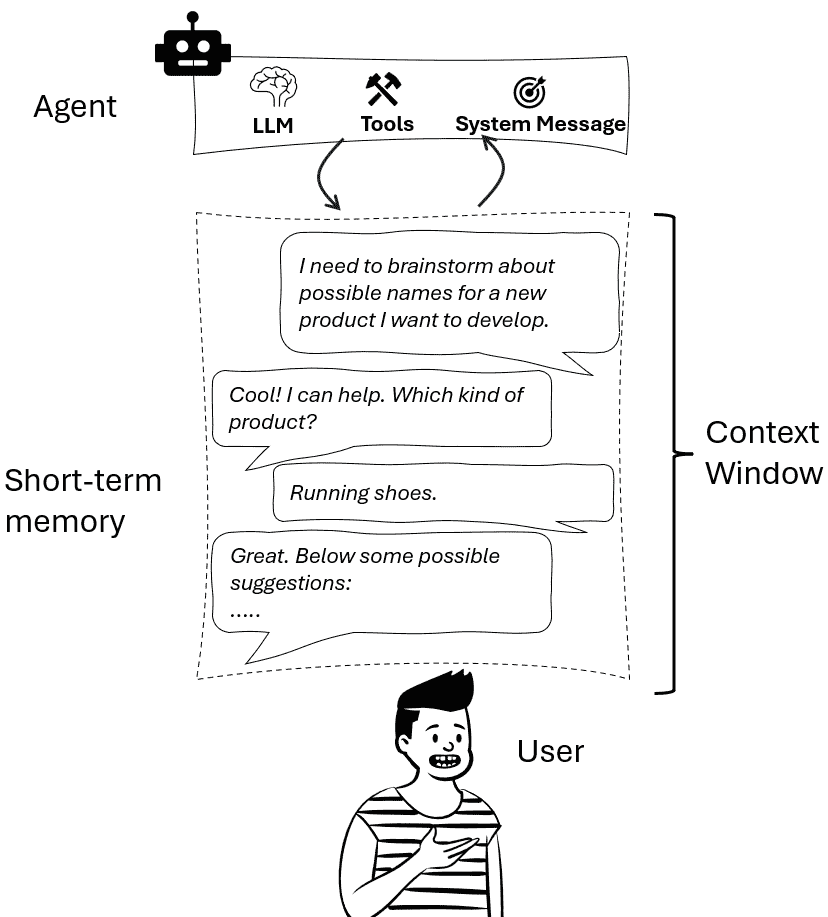
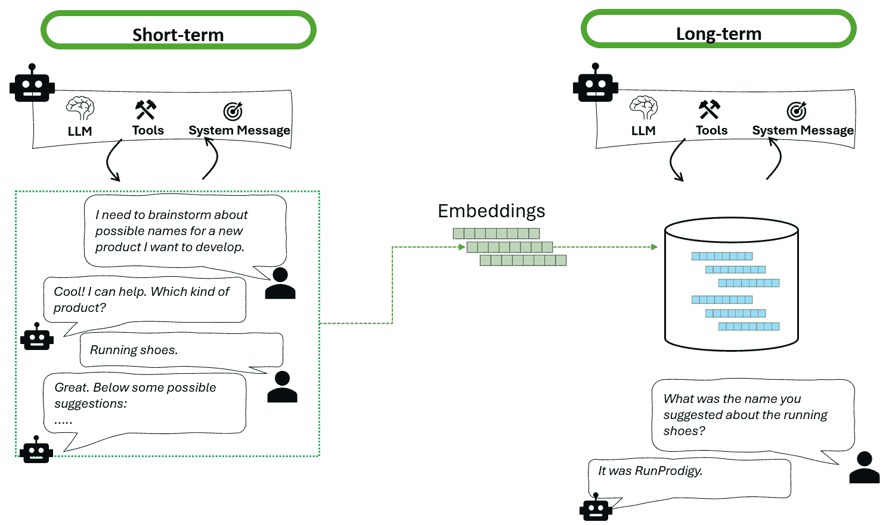
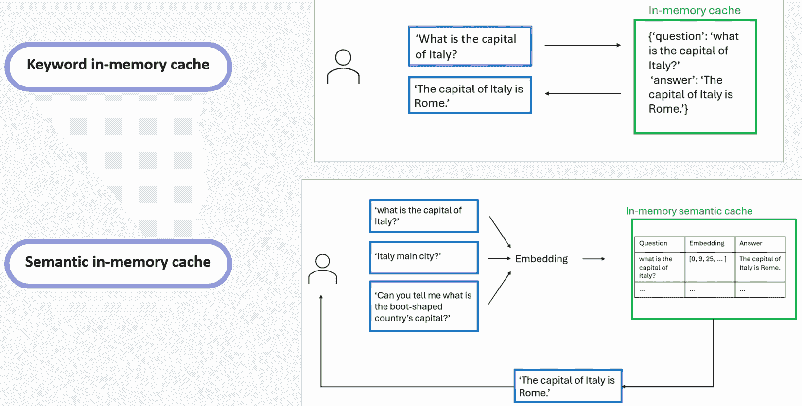
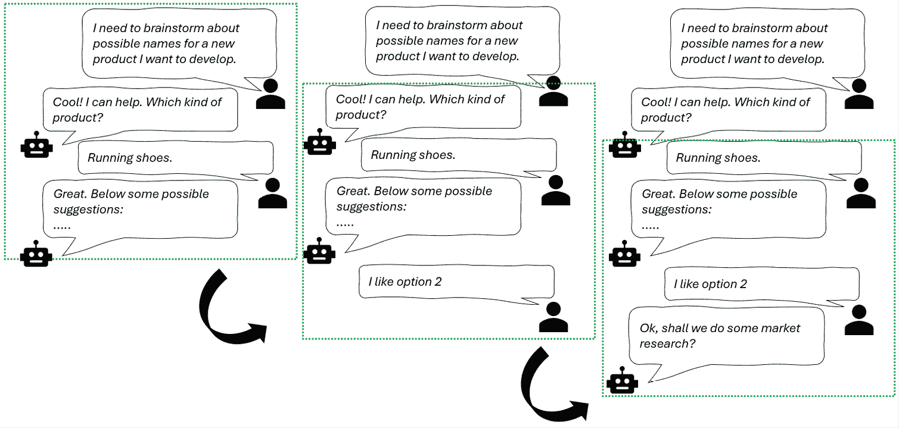
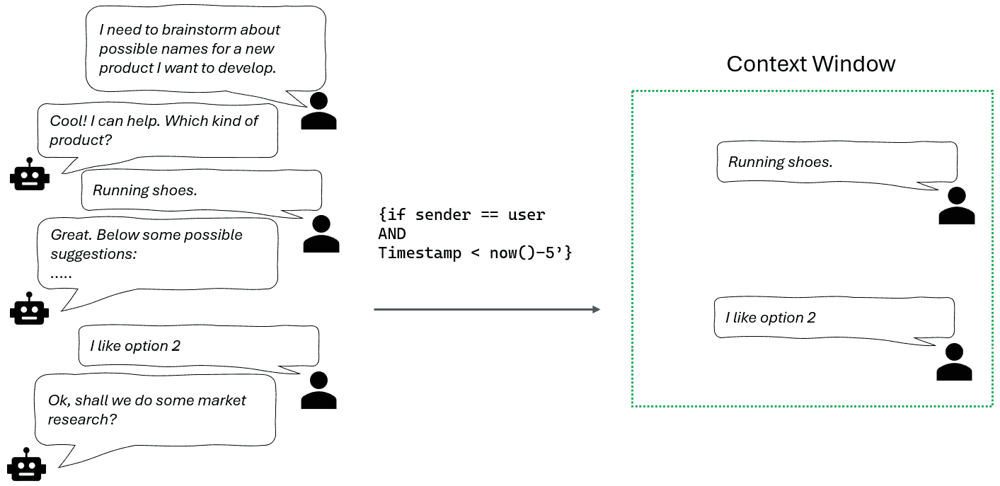
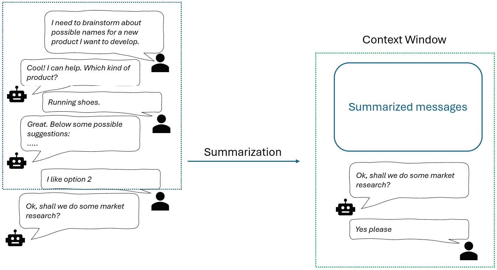
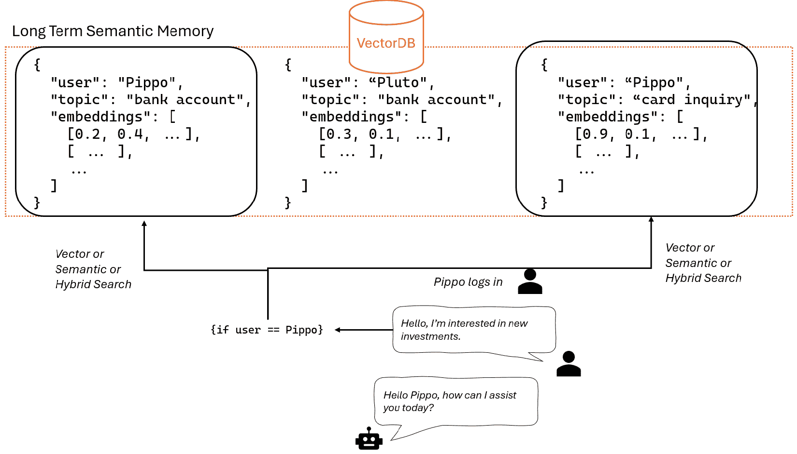
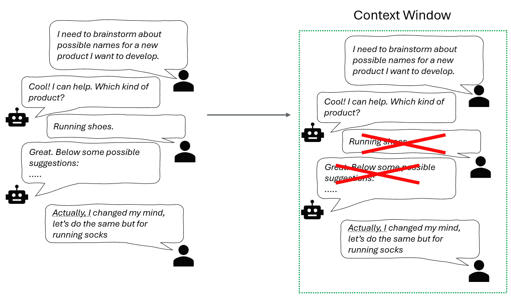
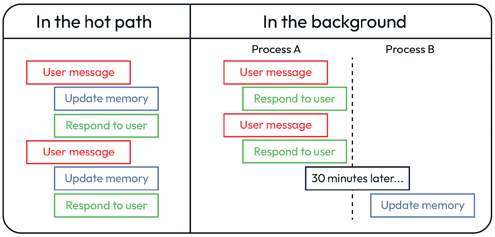

# 第四章：需要记忆和上下文管理

**大型语言模型**（**LLMs**）在本质上是无状态的，尽管它们看起来很连贯、对话性强。它们只知道你在当前提示中告诉它们的内容。除非你明确构建，否则没有持久的环境或历史记录。做得好的话，记忆可以让代理保持一致性、上下文感知，甚至随着时间的推移实现个性化。

在本章中，我们将涵盖以下主题：

+   不同类型的记忆

+   管理上下文窗口

+   存储记忆、检索和刷新记忆

+   管理记忆的流行工具

到本章结束时，你将深入了解记忆在人工智能代理中的功能，以及使你的代理更智能、更可靠和上下文感知所需的工具和模式。

# 不同类型的记忆

正如人类依赖记忆来理解世界一样，人工智能代理需要记忆来在时间上智能地操作。记忆使代理能够在交互中保留信息、记住过去的事件、存储有用的知识，并构建一致的行为。没有记忆，即使是最强大的语言模型也是无状态的——只对当前输入做出反应，而对之前的内容毫无意识。

随着人工智能代理变得更加复杂，对其记忆系统的要求也越来越高。仅仅生成响应已经不再足够，代理必须能够记住、适应并在时间上不断改进。有趣的是，研究人员为代理设计记忆架构的方式在很大程度上借鉴了心理学家对人类记忆的理解。这种平行关系导致了人工智能中记忆类型分类法的不断增长，每种类型都有其独特的用途，从处理近期交互到构建长期知识和技能。

在本节中，我们将根据 Theodore R. Sumers 等人在其论文《语言代理的认知架构》（https://arxiv.org/pdf/2309.02427）中提出的相同框架，分解现代人工智能代理所使用的不同类型的记忆系统。

## 短期记忆

**短期记忆**（**STM**）是代理的即时工作空间——一个临时存放最近输入以供快速参考的草稿本。这就是为什么 STM 通常被称为 **工作记忆**（根据上述论文中使用的术语）。

在对话系统中，这对于在多轮交互中保持连贯性至关重要。如果用户说，“给我预订一个 7 点的 4 人桌”，然后补充说，“再加一个座位”，STM 帮助代理连接这些点。



图 4.1：短期记忆上下文窗口示例

技术上，STM 通常使用滚动上下文窗口或缓冲区来实现，它保存最近的对话或数据块。

**定义**

上下文窗口指的是模型一次可以处理的最大信息量（标记），通常包括提示、对话历史以及任何检索或注入的知识。它是内存管理中的一个关键约束，因为超过窗口会迫使代理忘记或总结过去的数据以保持在限制内。

当新的输入到来时，旧的数据会被推出去。这保持了交互的响应性和轻量级，但也意味着短期记忆（STM）本质上是不持久的。一旦缓冲区满了或者会话结束，那些信息就消失了。

因此，虽然 STM 非常适合快速问答式交互，但在记住偏好或从过去的会话中学习时却显得不足。这提出了一个关键问题：AI 代理如何在与用户的交互中保持长期上下文和连续性？

## 长期记忆

当 STM 处理当前情况时，**长期记忆**（**LTM**）则是关于时间上的连续性。它允许代理在不同会话中回忆信息，从而实现个性化、持久知识和更好的决策。

LTM 通常由持久存储系统支持——向量数据库、知识图谱或结构化存储库。这里最有效的技术之一是**检索增强生成**（**RAG**），其中代理从存储库中拉入相关的知识来告知其回答。这使得 LTM 对于客户支持助手、推荐引擎或个性化导师等代理至关重要。

注意，STM 和 LTM 是相关的，因为 STM 一旦对用户的会话不再相关，就可以被冲入 LTM（我们将在下一节中探讨类似的技术）。



图 4.2：短期记忆推入长期记忆的示例

在长期记忆中，我们可以进一步分解出三种不同的亚型，这些亚型反映了人类的认知。

### 语义记忆

语义记忆存储一般知识——事实、概念、规则和定义。它是系统中“知道事情”的部分，使代理能够推理、解释并提供有根据的答案。

注意，按照设计，大型语言模型（LLM）已经包含了参数化知识，这些知识已经提供了对世界的广泛了解：它们知道物理学、数学、一般文化以及任何形式上公开在互联网上可用的文档中编码的一切。然而，这种知识可能对我们的特定用例来说可能不够或相关：如果我们想让我们的 AI 代理记住我们在医疗中心所做的所有过去诊断呢？当然，这可能是训练集的一部分，因此它不是我们代理所使用的 LLM 参数化知识的一部分。

正因如此，语义记忆对于在复杂领域（如法律、医学或金融）中运行的代理特别有用，在这些领域中，事实正确性和领域理解至关重要。

在实践中，语义记忆可能通过存储在向量存储中的向量编码嵌入来实现，其检索原理与在*第一章*中探讨的 RAG 概念类似。

**注意**

语义记忆也可以是 STM（短期记忆）的最终目的地到一定程度。事实上，STM 上下文窗口中的某些组件或对话可能值得保留，如果这样，它们可以被矢量化并存储在语义记忆的向量数据库中。

### 情景记忆

在人类大脑的背景下，情景记忆指的是回忆个人参与过的特定过去事件的能力。当涉及到人工智能时，情景记忆将使人工智能代理能够从其与环境交互中存储和检索特定经历或事件，而不仅仅是普遍的事实知识。

例如，一个人工智能导师可能会回忆起学生上周如何回答数学问题，并利用这一点来调整今天的课程。这种记忆通常以结构化日志或事件历史的形式存储，代理可以参考这些内容来做出基于案例的决定或调整其行为。

在实践中，情景记忆可以被视为**少样本提示技术**的扩展。

**定义**

少样本提示是一种在大规模语言模型中使用的技术，其中模型在提示本身中提供了少量（通常是 2-5 个）示例。这些示例有助于引导模型的响应，以更好地与所需任务对齐，而无需进行广泛的微调或训练数据。

这里有一个例子：

`任务：情感分析`

`示例 1：`

`文本："我喜欢这部电影！"`

`情感：积极`

`示例 2：`

`文本："这部电影太糟糕了。"`

`情感：负面`

`现在对以下文本进行分类：`

`文本："这部电影总体上很令人愉快，尽管有一些缺点。"`

`情感：`

以这种方式，少样本提示利用模型从少量示例中快速学习模式的能力，在不进行显式重新训练的情况下提高其在特定任务上的性能。

事实上，通过存储一组（“用户问题”，“给定答案”）或（“用户问题”，“执行任务”）的配对，人工智能代理可以被引导通过执行特定动作的正确方式。

根据 Chad DeChant 的论文《人工智能代理中的情景记忆风险应进行研究并减轻》，在人工智能代理中实现情景记忆将允许以下显著的增强：

+   **规划和决策**：通过回忆类似的前期经验和结果，记忆提供构建新策略或计划的基本块

+   **改进学习**：人工智能代理可以通过反思过去的事件及其结果，识别模式并从错误中学习，更好地适应新场景

+   **问题解决**：情景记忆通过类比或组合过去的解决方案提供过去场景的例子，帮助通过类比或重组过去的解决方案来解决当前问题

+   **预测和想象**：正如人类根据过去的事件在心理上模拟未来场景一样，人工智能代理可以使用情景记忆来预测可能的后果。

然而，作者也指出了与情景记忆相关的潜在风险：

+   **欺骗**：智能体可以利用情景记忆来执行复杂的欺骗行为，通过回忆过去的交互并策略性地操纵未来的交互。

+   **不希望保留的知识**：智能体可能会保留和回忆用户希望保持私密的个人信息，这可能导致重大的隐私风险。

+   **不可预测的行为**：随着代理重复使用过去经验来形成未来行为，可能难以预测某些存储的记忆如何影响未来的行为，这可能导致意外的后果。

+   **增强情境意识**：改进的记忆能力可能使人工智能更好地理解和适应其操作环境，可能逃避旨在确保安全性的控制或审计。

尽管将情景记忆集成到人工智能代理中存在潜在风险，但整体能力仍然非常有前景。论文强调，这些风险可以通过精心设计的遏制策略和安全原则得到显著缓解，例如确保记忆的可解释性、提供用户控制以添加或删除记忆、隔离记忆存储以及限制人工智能代理编辑自己的记忆。

**注意**

在人类认知和人工智能系统中，情景记忆和语义记忆有不同的用途：

情景记忆就像个人日记。它存储“发生了什么”——与特定时间、地点相关联的具体事件、交互和经历。对于人工智能来说，这可能意味着记住某个用户的投诉或失败过程中采取的步骤。

语义记忆更像是一部百科全书。它存储“已知的内容”——独立于上下文的一般事实、概念和规则。对于人工智能代理来说，这可能包括产品规格、政策规则或领域知识。

保持这两种记忆类型区分开来，使代理能够更有效地推理：当需要时，他们可以借鉴过去的事件，同时依靠既定的知识来保持一致性和准确性。

通常，人工智能代理通过记录交互来捕捉情景记忆，这些交互通常包括以下内容：

+   **用户输入**：用户提供的查询或命令。

+   **代理响应**：人工智能生成的动作或回复。

+   **上下文元数据**：如时间戳、用户标识符和环境上下文等附加信息。

这些交互存储在数据库中的结构化格式中。常见的存储解决方案包括以下几种：

+   **关系数据库**：如 SQLite 和 PostgreSQL 等系统用于存储交互的结构化日志。

+   **向量数据库**：如 Pinecone、Weaviate 和 Chroma 等工具存储交互的嵌入（数值表示），从而促进基于相似性的高效检索。

当一个 AI 代理需要回忆过去的经验来指导当前决策时，它会执行以下步骤：

+   **查询嵌入**：当前用户输入被转换为嵌入

+   **相似性搜索**：此嵌入与向量数据库中存储的嵌入进行比较，以找到最相关的过去交互

+   **上下文注入**：检索到的记忆被纳入代理的当前上下文中，通常通过提示工程来实现，以影响响应生成

这个过程使代理能够根据以往的经验调整其行为，从而增强交互中的个性化和连续性。

### 程序记忆

我们需要提到的最后一个记忆是程序记忆。对我们来说，这种长期记忆负责存储*如何*做事情，例如记住如何骑自行车或系鞋带——一旦学会，就可以在没有意识思考的情况下执行。在 AI 代理的背景下，程序记忆发挥着类似的作用：它编码了控制代理行为的“知道如何”的基础知识。例如，在自动驾驶汽车中，程序记忆使导航程序和障碍物避让得以执行，而无需从头开始重新评估每个决策。

根据在《*认知架构语言代理*》论文中提出的 CoALA 框架，代理的程序记忆由两个主要组件组成：

+   **LLM 权重**，它隐式地编码了大量的程序知识，例如语言使用、推理模式和世界模型

+   **代理代码**，它明确定义了诸如提示构造、检索机制、地面化程序和决策逻辑等程序

从本质上讲，程序记忆编码在模型的架构中。因此，大多数当前的 AI 代理将这种记忆视为静态的（与人类程序记忆不同，人类程序记忆可以通过经验随着时间的推移进行适应）。LLM 的权重在部署期间保持不变，代理代码很少被代理本身重写。

**注意**

从理论上讲，可以创建能够自动更新其*自身*源代码的代理——特别是更新其技能集（例如通过编码新技能）或决策逻辑。另一方面，由于成本高、复杂性和安全问题，野外的 LLM 微调（即修改权重）仍然不常见。

一个更实际且观察到的行为是代理修改他们的**系统消息**——本质上是在更新他们给予自己的指令以引导行为。这种方法提供了一种轻量级的程序适应性，尽管它在范围和当前系统中的利用率仍然有限。

我们所涵盖的每种类型的记忆都在塑造代理智能方面发挥着独特的作用，从使行动成为可能到提供决策信息和从过去学习（参见表 4.1 以下）：

| **记忆类型** | **目的** | **内容** | **存储机制** | **使用示例** | **更新机制** |
| --- | --- | --- | --- | --- | --- |
| 语义 | 存储一般世界知识和事实 | 抽象概念、定义和关系（例如，“巴黎是法国的首都”） | 知识库、向量数据库或嵌入在模型参数中 | 获取事实信息或特定领域的知识 | 通过在结构化数据上训练或手动输入进行更新 |
| 事件性 | 记录特定的事件和经验 | 过去交互的上下文细节（例如，用户的先前查询） | 日志、数据库或结构化内存存储 | 根据用户历史记录个性化响应 | 在交互过程中捕获；可能涉及用户反馈 |
| 程序性 | 编码如何知识和技能 | 行动序列或常规（例如，处理用户请求的步骤） | 内置于代码、模型权重或定义的工作流程中 | 执行如身份验证或数据处理等任务 | 通过训练、强化学习或手动更新进行优化 |

表 4.1：内存类型及其用法示例

它们共同构成了代理持久能力及其累积知识的骨架。

我们已经讨论了长期和短期记忆；然而，还有一个第三类值得提及：语义内存缓存。

## 在短期记忆和长期记忆之间——语义缓存的作用

在 STM（短期记忆）的即时性和 LTM（长期记忆）的持久性之间，**语义缓存**提供了一个灵活、高速的层，用于根据意义检索最近的信息。这些缓存通过将最近交互作为向量嵌入存储，允许在当前会话内进行**语义相似度搜索**，而无需查询或持久化长期存储中的数据。

**注意**

在传统的应用程序开发中，内存缓存是一种临时存储层，它将频繁访问的数据存储在内存中（通常是 RAM），以减少延迟并提高性能。应用程序不是反复查询数据库或外部 API 以获取相同的数据，而是从缓存中检索它——从而实现更快的访问。Redis、Memcached 以及应用程序框架中的内存层等工具通常用于此目的。

这些缓存通常基于键值对操作——您使用一个唯一的键存储结果，稍后通过引用该键检索它。这在存储用户会话、API 响应或不太频繁更改的计算值等场景中非常高效。

在 AI 代理和更广泛的 LLM（大型语言模型）驱动应用程序的背景下，概念类似，但键值对基于嵌入，以便检索可以通过向量搜索而不是关键字匹配来实现。

在*图 4.3*中，您可以看到一个关键字和语义内存缓存之间区别的示例：



图 4.3：关键字和语义内存缓存的区别

**快速提示**：需要查看此图像的高分辨率版本？在下一代 Packt Reader 中打开此书或在其 PDF/ePub 副本中查看。

**新一代 Packt Reader**随本书免费赠送。扫描二维码或访问 packtpub.com/unlock，然后使用搜索栏通过名称查找此书。仔细检查显示的版本，以确保您获得正确的版本。


与依赖于模型标记上下文窗口的 STM 不同，与为跨会话持久记忆设计的 LTM 不同，语义缓存是会话范围的、短暂的、快速的。它不是为了保留知识或事件随时间推移，而是为了帮助代理在持续交互中动态地呈现相关上下文——即使表达方式与最初不同。

这种实时召回是由专门为语义检索设计的向量数据库实现的。例如，具有集成向量索引的 Cosmos DB、Pinecone、Weaviate 和 Qdrant 等工具允许开发者以低延迟存储和查询嵌入。这些系统支持内存搜索、按元数据过滤和基于相关性和最近性评分等功能——使它们非常适合实现语义缓存。

例如，在患者排程流程中，如果用户之前说“下午最适合”，后来询问“你有 3 点之后的安排吗？”，语义缓存可以检索并匹配之前的声明——即使它已不在上下文窗口中。这使得代理能够保持连贯性和上下文意识，而无需承担额外的标记成本。

在实践中，语义缓存充当智能短期召回层，使代理能够保持响应、语义流畅和高效——而无需长期承诺。它们不取代 STM 或 LTM，而是通过在对话流程中实现低延迟、相关性驱动的记忆来补充它们。

在下一节中，我们将关注 STM——代理在决策过程中如何保持和操作活动信息。这是感知、推理和上下文实时结合的地方。

# 管理上下文窗口

当谈到 STM（或工作记忆）时，**上下文窗口**的概念至关重要。它定义了模型可以同时处理的文本最大跨度——以标记为单位。这个窗口允许模型在生成响应时“记住”并利用特定信息段，这样用户就不必重复上下文信息。

尽管最新的大型语言模型（LLM）可以处理的最大令牌数量有所增加（例如 GPT-4o 模型可达 128K 个令牌），但管理上下文窗口仍然存在挑战。当输入超过模型的上下文窗口时，模型可能难以保持连贯性和相关性，因为它无法访问文本的早期部分。这种限制可能导致输出缺乏上下文或连续性，尤其是在需要处理大量文档或长时间对话的任务中。

因此，我们需要正确设计上下文窗口的处理。在这个领域有许多技术，在本节中，我们将探讨其中一些最受欢迎的：

+   **滑动窗口**：滑动窗口技术通过维护一个固定大小的近期消息窗口并动态更新它来管理短期记忆。首先，确定窗口大小至关重要，可以通过固定近期消息的数量或根据系统约束和期望的响应质量设置基于令牌的限制。然后，随着新消息的到来，通过丢弃最旧的消息来动态更新窗口，以保持其大小。例如，如果我们设置滑动窗口以同时保留 4 条消息（这通常以我们想要保留的令牌数量来设定），我们将有类似以下的内容：



图 4.4：短期记忆滑动窗口示例

此过程将窗口向前移动，仅保留当前的相关信息。

+   **编辑消息列表**：编辑消息列表是滑动窗口方法的扩展，可以更细致地决定保留哪些消息。它涉及在 LLM 处理之前有选择地修剪或过滤消息。例如，想象一个 AI 客户支持代理帮助用户解决软件问题。在 20 条消息的来回中，只有最后几条消息与用户的最新请求直接相关。而不是将所有 20 条消息都输入到 LLM（这可能会超过令牌限制），系统有选择地保留以下内容：

    +   用户最近提出的问题

    +   助手的最后 1-2 个回复

    +   一条包含关键上下文的信息（例如，用户的操作系统版本）

所有其他闲聊或冗余问题都被修剪掉。这确保模型只关注上下文窗口中最相关的细节。

在实践中，您需要建立明确的规则或指南来确定哪些消息应该保留或丢弃。常见的标准包括以下内容：

+   **近期性（这是一种滑动窗口的形式）**：优先考虑近期消息以保持相关上下文

+   **相关性**：保留与当前查询或任务直接相关的消息（这种“评估”可能由另一个 LLM 通过特定的系统提示进行）

+   **发送者**：仅保留来自特定发送者的消息（无论是用户还是某个代理）

你的过滤器详细程度将取决于你聊天窗口中每条消息关联的元数据。

例如，我们可能决定只保留用户在最后 5 分钟内发送的消息：



图 4.5：编辑短期记忆消息列表的示例

正如我们在实践章节中将要看到的，LangGraph 等框架提供了一种现成的、非常详细的与你的消息相关的元数据结构，这样你可以非常细致地对其应用过滤器。

例如，在前面的例子中，一个潜在的元数据集可能如下所示：

```py
{"sender": "user",
 "timestamp": dd-mm-hh-mm,
 "content": "I like option 2",
 …
} 
```

+   **摘要**：摘要是将广泛的对话历史或长篇文档压缩成简洁、集中的概述的过程。这项技术捕捉了关键点和关键信息，显著减少了所需的标记数量，同时保留了关键上下文。



图 4.6：总结短期记忆消息的示例

在实践中，摘要是由 LLM 本身生成的，并作为系统消息的一部分参数传递，告诉代理如何处理短期记忆。

**注意**

除了我们将要采用的具体技术外，了解我们何时想要应用这项技术也很重要——例如，当 STM 的标记数达到一定的数量（我们可以将其设置为我们使用的 LLM 可以处理的标记数的最大值附近）。通过执行标记检查，我们确保当标记计数接近限制时，选定的策略（如摘要或消息编辑）得到执行。

之前的技术是处理 STM 上下文窗口的关键；然而，它们可能并不足够。实际上，根据你正在开发的 AI 代理类型，你可能需要保留和存储工作记忆更长的时间，超出用户的会话时间。

在下一节中，我们将看到如何处理类似的场景。

# 存储和检索记忆

在 AI 代理中，将信息从 STM 移动到 LTM 对于在会话间保留上下文并允许随时间学习至关重要。这个过程通常涉及识别相关事实、用户偏好或从最近交互中获得的见解，并将它们存储在结构化、可检索的格式中。

长期记忆可以根据用例以各种方式实现。一种常见的方法是使用向量数据库进行语义存储——其中信息块被嵌入到向量中并存储，以便基于相似性检索，通常与 RAG 结合使用。这允许系统回忆与上下文相关的数据，即使它不是即时提示的一部分。

存储的信息也可以组织为结构化元数据（如用户资料或偏好）或作为事实条目附加到更广泛的知识库中。

注意，这种方法可以与向量存储方法相结合。这种混合方法允许系统首先使用显式、结构化的字段（如用户 ID、主题标签或时间戳）过滤相关信息，然后在过滤后的子集中应用语义向量搜索。例如，在多用户应用程序中，代理可以首先仅检索与特定用户关联的文档，确保上下文正确。



图 4.7：混合记忆检索示例，结合过滤与向量搜索

一旦隔离了相关的记忆片段，基于当前查询，向量相似度搜索可以展示最符合上下文的信息片段。这种分层方法提高了精确度和相关性，使得响应更加准确和个性化。它还通过在调用更计算密集的向量相似度操作之前缩小搜索空间来提高性能。

最终，我们需要考虑如何长期管理我们的记忆。在人工智能代理中刷新和更新记忆涉及定期审查和修改存储的知识，以确保其保持相关性、准确性和有用性。这个过程可以是反应性的，由特定的交互或变化触发，也可以是主动的，作为后台任务安排。

记忆更新可以在工作记忆层实时实现，也可以异步地在后台为长期记忆实现。例如，如果用户更改偏好或纠正代理，这些数据可以立即覆盖或修改内存中相应的条目。



图 4.8：用户会话上下文中编辑记忆的示例

另一方面，代理也可以定期回顾累积的交互，以完善摘要、重构个人资料或删除过时的信息。

刷新语义记忆的常见技术是重新生成更新文档的嵌入，并替换数据库中的旧向量。对于结构化元数据，更新可能涉及覆盖用户资料中的字段或调整反映用户随时间行为得分的分数和计数器。通过结合实时和后台刷新策略，并允许语义和结构化更新，人工智能代理可以维护一个与用户需求和应用程序动态同步演变的记忆系统——确保他们依赖的信息既保持最新又符合上下文。

## 人工智能代理中的时空推理

为了使 AI 代理在动态环境中有效运作，它们必须具备理解和推理时间序列和空间环境的能力。这不仅包括回忆过去的事件，还包括根据学习到的模式预测未来的发生。让我们看看一些例子：

+   **利用时间序列事件**：时间推理使智能体能够按时间顺序处理事件，从而让他们能够理解因果关系并预测后续行为。例如，在一个客户服务聊天机器人中，识别到用户之前曾询问过产品可用性，可以告知代理在未来的交互中主动提供更新或相关信息。

在强化学习场景中，代理通过回忆导致成功结果的行为序列，从而随着时间的推移改进他们的策略，从而受益于时间推理。

+   **引用过去交互**：通过维护交互历史，代理可以个性化响应并保持对话的连贯性。这种情景记忆允许更自然和上下文感知的参与，因为代理可以引用先前交换中的具体细节，从而提升用户体验和信任。

+   **管理时间衰减**：正如人类倾向于忘记未被加强的信息一样，AI 代理也必须随着时间的推移管理存储信息的相关性。实施时间衰减机制确保过时或不那么相关的数据不会使代理的记忆杂乱无章，从而允许更有效地处理和检索相关信息。

这里是管理时间衰减的策略：

+   **时间感知检索**：在决策过程中优先考虑最近和频繁访问的信息。例如，代理可以为每个记忆附加时间戳并在检索期间使用最近度评分。向量存储可能会随着时间的推移衰减嵌入，或应用过滤器以仅检索最近条目。

+   **强化机制**：加强重复访问或被认为重要的信息的保留，同时允许不那么关键的数据逐渐消失。例如，您可以实施一种机制来跟踪访问频率并应用强化信号（例如，提升向量相似度分数或将其标记为“固定”）。这些可以通过自定义检索逻辑或混合 RAG 管道进行管理。

+   **记忆修剪**：定期评估和删除过时信息以优化内存使用并维持系统性能。例如，您可以让 LLM 或内存管理器定期使用诸如年龄、访问频率和相关性等标准评估内存条目。低价值项要么存档要么删除，以优化内存使用和延迟。

通过有效地管理时间衰减，AI 代理可以在保留有用信息和丢弃无关数据之间保持平衡，从而产生更准确和上下文相关的响应。

# 管理记忆的流行工具

正如我们在本章中看到的，为 AI 智能体配备复杂的记忆系统对于提供个性化的连贯用户体验至关重要，尤其是在长时间或重复的交互中。

流行的 AI 编排器，如 LangChain、LangGraph、Semantic Kernel 等，提供了预构建的库，以简化 STM 和 LTM 的管理。然而，某些应用程序可能需要复杂的内存管理，仅依靠上述框架可能会变得繁琐。

因此，最近已经发布了许多针对特定内存的轻量级框架，为开发者提供了一套强大的工具集，用于复杂的应用程序。

让我们探索其中最受欢迎的三种：LangMem、Mem0 和 MemGPT——每种都提供了增强智能体记忆的独特方法。

## LangMem

LangMem 是 LangChain 生态系统中开发的一个专门用于内存管理的工具，它使开发者能够对 AI 智能体如何记住和回忆信息拥有细粒度和有意的控制。LangMem 允许将记忆视为智能体工作流程中的一个活跃的、可编程的部分——尤其是在与 LangGraph 一起使用时。这种集成使开发者能够精确指定智能体何时应该写入或读取内存，例如在决策点、外部 API 调用或用户输入之后。

LangMem 引入了一种内存架构，它区分了两种互补的内存处理模式：**热路径**和**背景记忆**。这些模式定义了 AI 智能体存储和处理信息的时间和方式，使开发者能够精确控制内存行为。



图 4.9：Langmem 中的热路径和背景记忆。来源：https://langchain-ai.github.io/langmem/hot_path_quickstart/

**热路径**指的是在智能体活跃推理过程中写入的记忆。换句话说，当智能体与用户互动——回答问题、解决问题或引导工作流程时，它可以有意识地决定要记住哪些信息。这是通过一个名为 *manage_memory* 的工具来完成的，智能体可以通过自然语言输入调用该工具，以存储有意义的事实、决策或偏好。例如，如果用户说，“我更喜欢早上预约”，智能体可以选择立即将这个偏好保存到记忆中。这些记忆被组织成 **命名空间**——一种文件夹系统——以便它们可以针对特定用户、主题或线程进行范围限定。这使开发者能够精确控制存储的内容、位置和原因。

另一方面，**背景内存**被动且异步地工作。不是在对话中被代理触发，而是在对话结束后在后台运行——通常在交互结束后。它可以处理整个对话历史，提取摘要、重复主题或有用的元数据，而不会干扰用户的体验。这对于构建长期用户档案或将长时间交互压缩为几个可消化的见解特别有用。将其视为对话后的反思，系统在无需明确告知要记住什么的情况下从对话中学习。

LangMem 与 **LangGraph** 框架紧密集成，这使得开发者能够构建具有结构化工作流程和状态管理的 AI 代理。由于 LangMem 中的内存是线程感知的，它随着对话流程跟踪，因此代理不仅能够回忆起孤立的事实，还能理解这些事实是**何时**和**为什么**被存储的。

LangMem 还支持不同的存储后端。开发者可以从内存设置开始——适用于测试和快速开发——然后在构建生产环境时切换到更持久的存储，如数据库。这种灵活性确保了内存策略可以与代理的复杂性和生命周期一起扩展。

通过结合热点路径和背景内存，LangMem 使代理既**反应迅速**又**深思熟虑**：能够在实时做出明智的决定，同时随着时间的推移学习和适应。它将短期意识与长期学习联系起来，成为智能、具有记忆意识的代理的强大基础。

## Mem0

Mem0 是一个专门设计的内存层，旨在为 AI 代理提供保留、适应和个性化其行为在不同用户和会话中的能力。

根据 Mem0 官方文档，此框架具有以下特性：

+   **内存处理**：Mem0 利用大型语言模型（LLMs）自动从对话中提取和提炼有意义的见解。它捕捉实体、事件和关系，同时保留完整上下文，使代理能够在无需手动标记或输入格式化的情况下记住相关事实。

+   **双存储架构**：Mem0 结合了两个互补的存储系统：

    +   一个用于存储记忆语义表示的 **向量数据库**，针对基于相似性的检索进行了优化。

    +   一个用于捕捉和查询实体之间关系的 **图数据库**，为记忆网络提供结构和可追溯性。

**定义**

图数据库是一种以图结构存储数据的数据库类型——由节点（实体）和边（实体之间的关系）组成。与传统使用表的传统关系数据库不同，图数据库针对导航和查询关系进行了优化，使其非常适合表示复杂、相互关联的数据，例如社交网络、推荐引擎或知识图谱。

+   **智能检索系统**：Mem0 的混合检索引擎同时使用向量搜索和基于图的查询来检索最相关的记忆。它根据重要性、最近性和上下文优先级排序信息，确保代理从其记忆中响应精确且具有意义的引用。

+   **简单的 API 集成**：开发者可以通过轻量级的 API 轻松集成 Mem0。它提供了直观的端点来添加新的记忆（添加）和检索上下文相关的记忆（搜索），这使得构建具有记忆功能的代理而无需深入的基础设施工作变得容易。

+   **内存管理**：随着新信息的出现，Mem0 更新存储的内存，同时解决不一致性和矛盾。这确保了代理的记忆保持一致和可信，即使随着时间的推移，用户偏好或事实发生变化。

注意，此后的功能——内存管理——是自适应学习的例子。随着代理与用户的交互，Mem0 赋予它们动态优化和扩展其记忆的能力——有效地允许它们“学习”而无需正式重新训练。这种能力在长期部署中特别有益，因为代理需要提供随着用户发展而演变的个性化体验。

总结来说，Mem0 作为人工智能代理的认知骨干，连接短期交互和长期记忆。它对个性化、适应性和灵活部署的重视，使其成为开发者构建能够做到不仅仅是反应的代理的理想选择——它们能够记住、进化并深入参与。

## LeTTA（以前称为 MemGPT）

Letta——以前称为 MemGPT——是一个用于构建具有状态、记忆感知的人工智能代理的开源框架。其核心创新在于它如何通过为代理配备长期记忆、多步推理和自适应上下文管理，将传统的无状态 LLM 交互转换为动态的、持续的关系。这意味着基于 Letta 的代理可以在会话之间记住关键事实、用户偏好和先前决策——随着时间的推移，实现真正一致和个性化的对话。

Letta 被设计成模型无关，这允许开发者根据他们的用例选择最佳模型，而无需绑定到特定提供商。Letta 最独特的组件之一是**代理开发环境**（**ADE**），这是一个图形界面，它为开发者提供了深入了解代理状态的深度可见性。

通过 ADE，您可以观察代理的推理过程，它访问哪些记忆，使用哪些工具，以及如何响应——提供在其他框架中很少见到的透明和交互式调试体验。

从工程角度来看，Letta 是为了鲁棒性和集成而构建的。它包括完整的 API 和 SDK 支持（通过 REST、Python 和 TypeScript），这使得它很容易集成到新的和现有的应用程序中。其自动持久化层确保每次交互、内存更新和内部状态转换都安全地存储在 PostgreSQL 数据库中。这不仅保证了会话之间的连续性，还支持可审计性和分析。

Letta 还支持 **模型上下文协议**（**MCP**），它允许代理动态访问和编排外部工具——例如网络搜索、日历或自定义 API。

**定义**

MCP 是一个标准化的接口，允许 AI 代理在其推理过程中动态访问、调用和协调外部工具、API 或数据源。它作为语言模型和可用能力库之间的通信层，使代理能够扩展其核心功能，超越文本生成。

在多代理或工具丰富的环境中，MCP 尤其强大，因为灵活性、模块化和协调对于构建智能、自主系统至关重要。

通过结合深度内存集成、灵活的工具、持久状态跟踪和透明可观察性，Letta 成为一个全面的平台，用于开发真正自主、上下文感知的 AI 代理——这些代理在与每个交互中变得更聪明、更有能力。

# 摘要

内存是智能 AI 代理的基础组件，使它们能够维持上下文、个性化交互并随时间适应。本章探讨了内存类型的范围——短期和长期——及其子类别，包括语义、情景和程序性记忆。

我们探讨了管理 LLM 有限上下文窗口的策略，以及使用结构和语义方法存储、检索和刷新内存的技术。一种混合模型，结合元数据过滤和向量搜索，成为了一种强大的可扩展和相关的内存访问方法。

最后，我们介绍了关键的工具——**LangMem**、**Mem0** 和 **MemGPT**——它们以不同的方式实现内存操作，从工作流感知存储到操作系统启发的上下文管理。

在下一章中，我们将看到如何通过正确定义工具和集成层与周围生态系统，将内存与 AI 代理的“做事”实际能力相结合。

# 参考文献

+   语言代理的认知架构：[`arxiv.org/pdf/2309.02427`](https://arxiv.org/pdf/2309.02427)

+   什么是人工智能代理记忆？[`www.ibm.com/think/topics/ai-agent-memory#:~:text=AI%20agent%20memory%20refers%20to%20an%20artificial%20intelligence,experiences%20to%20improve%20decision-making%2C%20perception%20and%20overall%20performance`](https://www.ibm.com/think/topics/ai-agent-memory#:~:text=AI%20agent%20memory%20refers%20to%20an%20artificial%20intelligence,experiences%20to%20improve%20decision-making%2C%20perception%20and%20overall%20performance)

+   记忆类型：[`www.psychologytoday.com/us/basics/memory/types-of-memory?ref=blog.langchain.dev`](https://www.psychologytoday.com/us/basics/memory/types-of-memory?ref=blog.langchain.dev)

+   在人工智能代理中的情景记忆提出了应该被研究和缓解的风险：[`arxiv.org/pdf/2501.11739`](https://arxiv.org/pdf/2501.11739)

+   使用 LangGraph 掌握长期代理记忆：[`saptak.in/writing/2025/03/23/mastering-long-term-agentic-memory-with-langgraph#:~:text=This%20is%20precisely%20the%20challenge%20that%20long-term%20memory,primary%20types%20of%20memory%3A%20semantic%2C%20episodic%2C%20and%20procedural`](https://saptak.in/writing/2025/03/23/mastering-long-term-agentic-memory-with-langgraph#:~:text=This%20is%20precisely%20the%20challenge%20that%20long-term%20memory,primary%20types%20of%20memory%3A%20semantic%2C%20episodic%2C%20and%20procedural)

+   从基本机制到转化机会：记忆持久性：[`pmc.ncbi.nlm.nih.gov/articles/PMC10867010/`](https://pmc.ncbi.nlm.nih.gov/articles/PMC10867010/)

+   人工智能能否像人类一样遗忘？探索大型语言模型中的记忆动态：[`ai.gopubby.com/can-ai-forget-like-humans-exploring-memory-dynamics-in-llms-c7a49678c469`](https://ai.gopubby.com/can-ai-forget-like-humans-exploring-memory-dynamics-in-llms-c7a49678c469)

+   回到未来：向大型语言模型的可解释时间推理迈进：[`arxiv.org/abs/2310.01074`](https://arxiv.org/abs/2310.01074)

+   LangMem: [`github.com/langchain-ai/langmem`](https://github.com/langchain-ai/langmem)

+   Mem0: [`github.com/mem0ai/mem0`](https://github.com/mem0ai/mem0)

+   Letta: [`github.com/letta-ai/letta`](https://github.com/letta-ai/letta)

# 免费订阅电子书

新框架、演进的架构、研究动态、生产分解——AI_Distilled 将噪音过滤成每周简报，供实际操作大型语言模型和生成人工智能系统的工程师和研究人员阅读。现在订阅，即可获得免费电子书，以及每周的洞察力，帮助您保持专注并获取信息。

在`packt.link/TRO5B`订阅或扫描下面的二维码。


