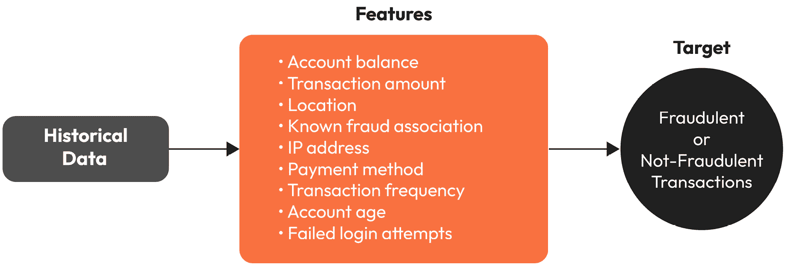
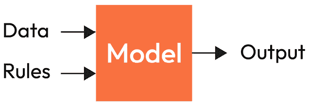
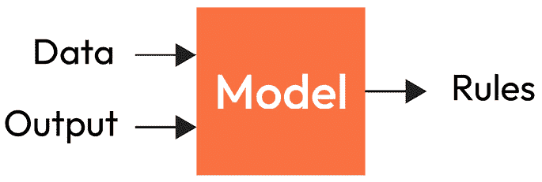
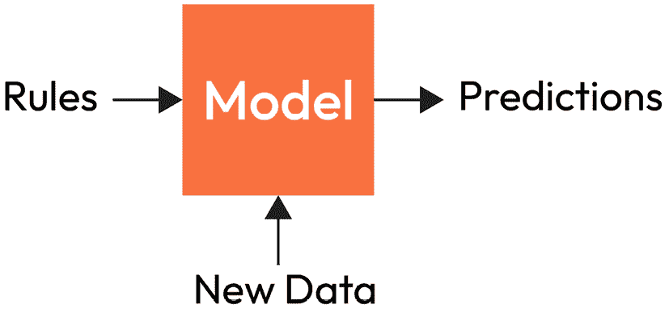
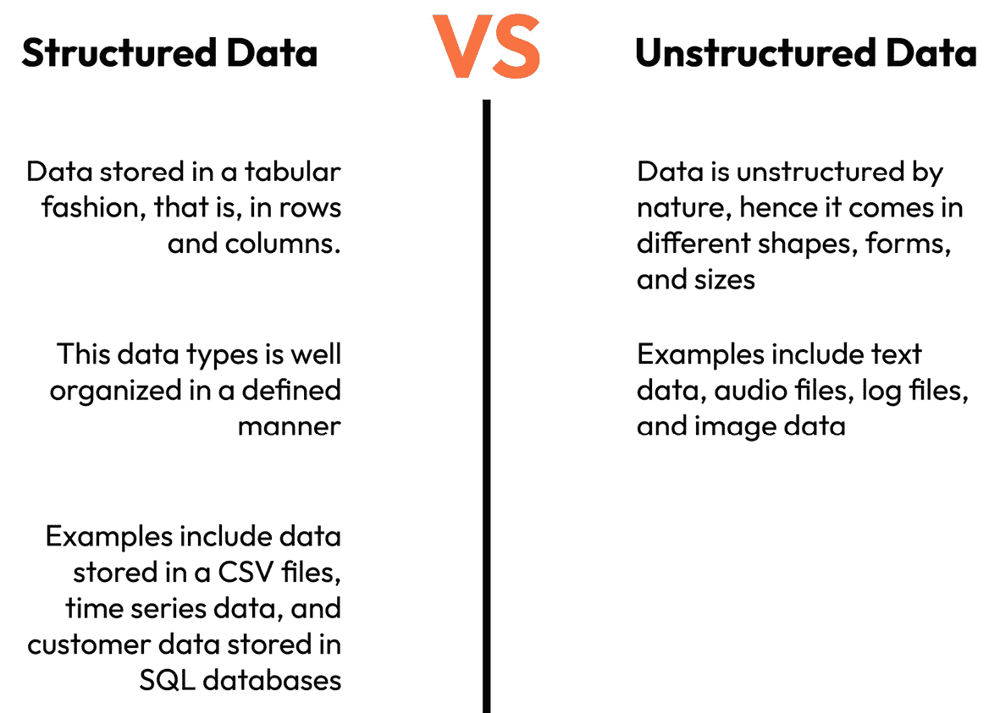
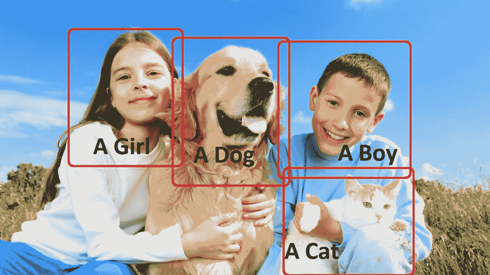
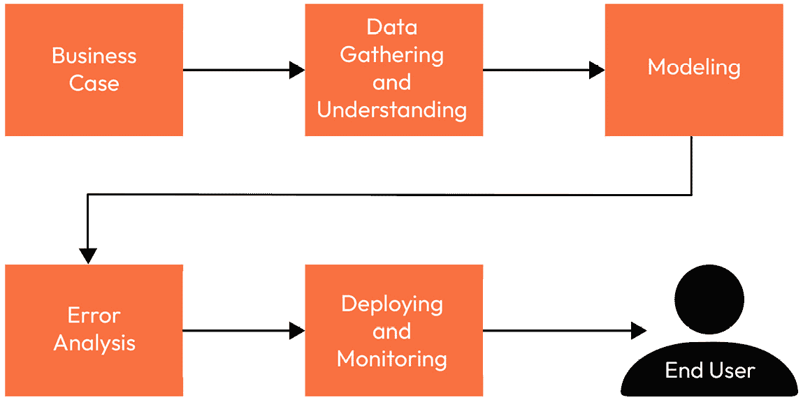
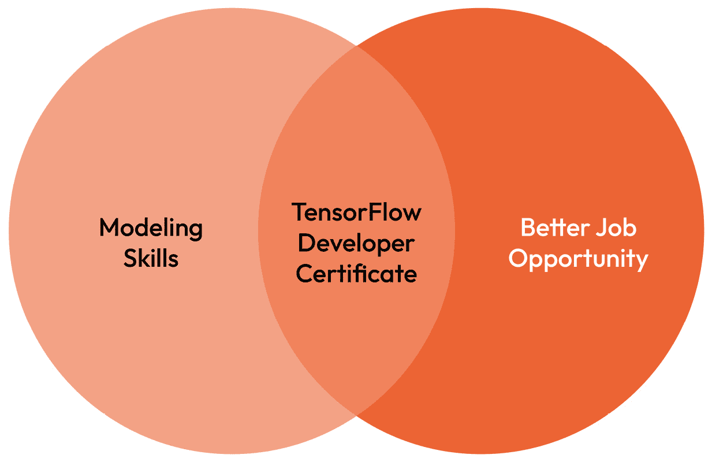
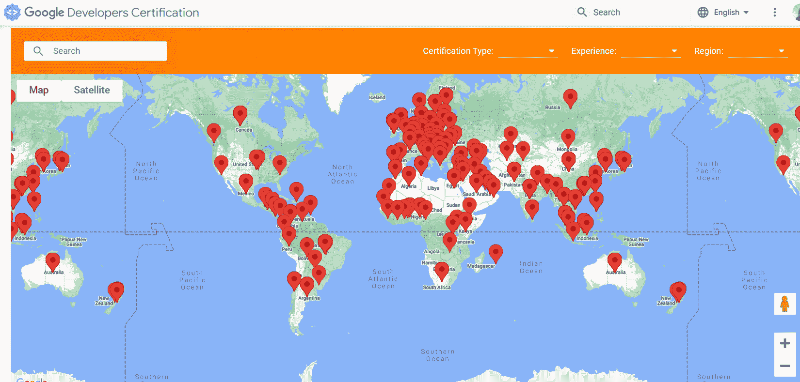
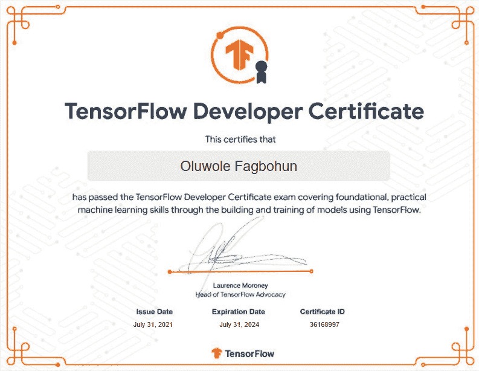

# 第一章：机器学习简介

现在是成为深度学习专家最令人激动的时刻。随着超高速计算机、开源算法、精心策划的数据集和负担得起的云服务的出现，深度学习专家已经具备了在各个领域构建惊人且具有影响力的应用的必要技能。计算机视觉、自然语言处理和时间序列分析只是深度学习专家可以产生实际影响的几个领域。任何具备正确技能的人都可以构建出具有突破性的应用，或许还能成为下一个 Elon Musk。为了实现这一点，需要具备足够的深度学习框架知识，例如 TensorFlow。

TensorFlow 开发者证书旨在培养新一代深度学习专家，这些专家在各个领域的需求量都很大。因此，加入这个俱乐部可以让你具备成为深度学习专家所需的专业知识，并且为你几周、几个月或几年的努力工作提供一个证书作为证明。

本章将首先对**机器学习**（**ML**）进行高层次的介绍，然后我们将探讨不同类型的机器学习方法。接下来，我们将深入了解机器学习生命周期和应用场景（在后续章节中，我们将涵盖一些实际操作的实现）。最后，我们将通过介绍 TensorFlow 开发者证书，分析通过考试所需的核心组件。通过本章的学习，您应该能够清楚地解释什么是机器学习，并对机器学习生命周期有一个基础的理解。同时，本章结束后，您将能够区分不同类型的机器学习方法，并清晰了解 TensorFlow 开发者证书考试的内容。

在本章中，我们将涵盖以下主题：

+   什么是机器学习？

+   机器学习算法类型

+   机器学习生命周期

+   探索机器学习应用场景

+   介绍学习旅程

# 什么是机器学习（ML）？

机器学习是**人工智能**（**AI**）的一个子领域，其中计算机系统从数据中学习模式，以执行特定任务或对未见过的数据进行预测，而无需明确编程。在 1959 年，Arthur Samuel 将机器学习定义为“*一种使计算机能够在没有明确编程的情况下进行学习的研究领域*”。为了更清晰地理解 Arthur Samuel 给出的定义，让我们通过银行业中一个广为人知的机器学习应用案例来进行拆解。

假设我们在伦敦市中心的一个财富 500 强银行的机器学习团队工作。我们肩负着自动化欺诈检测过程的责任，因为当前的手动流程太慢，且由于交易处理时间的延迟，每年让银行损失数百万英镑。根据前述定义，我们请求包含欺诈和非欺诈交易的历史交易数据，之后我们将通过机器学习生命周期（我们稍后会讲解）并部署我们的解决方案来防止欺诈行为的发生。

在这个例子中，我们使用了历史数据，这些数据提供了我们需要的特征（自变量），用以确定模型的结果，这通常被称为目标（因变量）。在这个场景中，目标是欺诈性或非欺诈性的交易，如*图 1.1*所示。

图 1.1 – 显示我们数据中的特征和目标的流程图

在前述的场景中，我们能够使用由特征和目标组成的历史数据来训练一个模型，从而生成用于对未见数据进行预测的规则。这正是机器学习的核心——使计算机在没有显式编程的情况下做出决策。在经典编程中，如*图 1.2*所示，我们输入数据和一些硬编码的规则——例如，交易的日交易量来判断是否是欺诈交易。如果客户超过了这个每日限额，客户的账户会被标记，人工审核员会介入，决定该交易是否为欺诈交易。

图 1.2 – 一种传统的编程方法

这种方法很快就会让银行不堪重负，客户因交易延迟而不断抱怨，而诈骗犯和洗钱者通过简单地将交易限制在银行定义的每日允许限额内，逃避系统的检测。随着每增加一个新特征，我们就需要更新规则。这种方法很快变得不切实际，因为总会有新的东西需要更新，才能让系统正常运行。就像一座纸牌屋一样，系统最终会崩溃，因为如此复杂的问题涉及数百万次每天变化的特征，可能几乎不可能通过显式编程来实现。

幸运的是，我们不需要手动编写代码。我们可以使用机器学习来构建一个模型，该模型能够根据历史数据中的一组输入特征，学习识别欺诈交易的模式。我们使用带标签的历史交易数据来训练我们的模型，这些数据包含欺诈和非欺诈交易。这样，我们的模型可以基于数据开发规则，如*图 1.3*所示，这些规则可以在未来用于检测欺诈交易。

图 1.3 – 一种 ML 方法

通过检查数据生成的规则被模型用于进行新的预测，以遏制欺诈交易。这种范式转变与传统编程不同，传统编程中应用程序是通过使用明确定义的规则构建的。在基于机器学习（ML）的应用程序中，例如我们的欺诈检测系统，模型通过学习识别模式并从训练数据中创建规则；然后，它使用这些规则对新数据进行预测，以高效地标记欺诈交易，如*图 1.4*所示：

图 1.4 – 一个 ML 模型使用规则对未见数据进行预测

在我们刚才分析的示例中，我们可以从*图 1.1*中看到，我们的训练数据通常以表格形式组织，由数值型数据（如交易金额和交易频率）以及类别型变量（如位置和支付类型）组成。在这种数据表示方式中，我们可以轻松地识别特征和目标。然而，像社交媒体中的文本数据、智能手机中的图像、流媒体电影中的视频等数据该如何处理呢，如*图 1.5*所示？当数据是非结构化的时，我们如何处理这些问题呢？幸运的是，我们有一个解决方案，那就是**深度学习**。

图 1.5 – 结构化与非结构化数据类型的示意图

深度学习是机器学习（ML）的一个子集，通过使用复杂的层次模型来模拟人脑，这些模型由多个处理层组成。深度学习的热潮源于深度学习算法在过去几年在许多现实应用中所记录的最先进的表现，如物体检测、图像分类和语音识别，因为深度学习算法能够建模数据中的复杂关系。在*第 2*和*第 3*节中，我们将更详细地讨论深度学习，并分别看到它在图像和文本应用中的实际应用。现在，让我们进一步探索机器学习的世界，看看机器学习算法的类型。

# ML 算法的类型

在上一节中，我们了解了什么是机器学习，并且审视了一个使用标签数据的案例。在这一节中，我们将了解四种主要的机器学习方法，以帮助我们对每种方法的作用、适用范围和应用场景有一个基础的理解。机器学习算法的四种类型如下：

+   监督学习

+   无监督学习

+   半监督学习

+   强化学习

让我们看看这四种机器学习方法，它们将作为后续章节的基础知识。

## 监督学习

在**监督学习**中，机器学习模型通过使用由特征和目标构成的数据进行训练。这使得模型能够学习数据中的潜在关系。训练完成后，模型可以利用其新学到的知识对未见过的数据进行预测。例如，假设你想买一套房子。你会考虑房子的位置、房间数量、浴室数量、是否有花园以及房产类型等因素；这些因素可以视为特征，而房子的价格则是目标。或许在完成 TensorFlow 考试后，你可以卷起袖子，抓取一些房屋数据，训练一个模型，基于这些特征来预测房价。你可以使用你的房价预测模型，与房地产网站上的价格进行对比，为自己争取到一个好交易。

监督学习有两种类型——回归和分类。在回归任务中，标签是一个数值，就像我们之前给出的示例，其中目标是预测房子的价格。相反，在分类任务中，标签是一个类别，就像我们之前讨论的欺诈例子，目标是检测一笔交易是否为欺诈交易。在分类任务中，模型会学习将目标分类为不同的类别。

在处理由两个类别组成的分类任务时（例如，欺诈交易和非欺诈交易），称为二分类。当类别数超过两个时（例如，不同汽车品牌的分类），称为多分类。

图 1.6：多标签分类的示例，模型在图像中识别多个对象

多标签分类是另一种分类类型，常用于社交媒体应用（如 Facebook 和 Instagram）中的图像标记。与二分类和多分类任务中每个实例只有一个目标不同，在多标签分类中，我们的模型会为每个实例识别多个目标，如*图 1.6*所示，在给定的照片中，我们的模型识别出了一个女孩、一只狗、一名男孩和一只猫。

## **无监督学习**

**无监督学习**是监督学习的对立面。在这种情况下，数据没有标签。模型必须自行弄清楚。这里，给定的无监督学习算法通过提供数据，并期望它从无标签数据中提取有意义的洞察，通过识别数据中的模式，而不依赖于预定义的目标——例如，一个大零售商店的图像，旨在为营销目的对其客户进行细分。你获得了包含商店客户人口统计和消费习惯的数据。通过采用无监督机器学习模型，你成功地将具有相似特征的客户聚类到不同的客户群体中。营销团队现在可以为每个通过模型识别的客户群体定制营销活动，这可能会提高活动的转化率。

## 半监督学习

**半监督学习**是监督学习和无监督学习的结合。在这种情况下，部分数据是有标签的（即它有特征和目标），其余的数据没有标签。在这种情况下，未标记的数据通常占主导地位。在这种情况下，我们可以应用无监督和监督学习方法的组合，以生成最佳结果，特别是在手动标记数据的成本和所需时间可能不切实际的情况下。在这里，模型利用可用的标签数据学习潜在的关系，然后将其应用于未标记的数据。

假设你为一家大型公司工作，公司收集了大量需要分类并发送到适当部门（如财务、市场营销和销售）的文档，以实现有效的文档管理，并且只有少数文档有标签。在这种情况下，我们应用半监督学习，在已标记的文档上训练模型，并将学习到的模式应用于其余未标记的文档进行分类。

## 强化学习

在**强化学习**中，与监督学习不同，模型不是通过训练数据来学习，而是通过与环境的互动来学习；它因做出正确决策而获得奖励，做出错误选择则受到惩罚。这是一种试错学习方法，模型通过过去的经验来学习，以便在未来做出更好的决策。模型的目标是最大化奖励。强化学习应用于自动驾驶汽车、机器人技术、交易与金融、问答系统和文本摘要等许多激动人心的应用场景。

现在我们可以清楚地区分不同类型的机器学习方法，我们可以看看机器学习生命周期的核心组成部分是什么，以及从项目的诞生到最终用户应用，我们应该采取哪些步骤。让我们来看看机器学习生命周期。

# 机器学习生命周期

在开始任何机器学习项目之前，我们必须考虑一些关键组成部分，这些组成部分可以决定我们的项目是否成功。这一点很重要，因为作为数据专业人员，我们希望构建并实施成功的机器学习项目，因此我们需要了解机器学习生命周期的运作方式。机器学习生命周期是实施机器学习项目的合理框架，如*图 1.7*所示：

图 1.7 – 机器学习生命周期

让我们详细看一下这些内容。

## 商业案例

在将最先进的模型应用于任何问题之前，务必花时间与利益相关者坐下来，明确了解商业目标或需要解决的痛点，因为没有清晰的目标，整个过程几乎肯定会失败。始终记住，整个过程的目标不是测试你迫不及待想尝试的新突破性模型，而是解决一个痛点或为公司创造价值。

一旦我们理解了问题，就可以将问题归类为监督学习或非监督学习任务。机器学习生命周期的这一阶段完全是关于提出正确的问题。我们需要与相关团队一起确定哪些关键指标能够定义项目的成功。需要哪些资源，预算、人力、计算能力和项目时间表如何？我们是否具备领域知识，还是需要专家的意见来定义和理解那些将决定项目成功的潜在因素和目标？这些都是我们作为数据专业人员在开始项目之前需要问的问题。

在考试中，我们需要理解每个问题的要求，然后才能解决它们。在本章结束前，我们会更多地讨论关于考试的内容。

## 数据收集与理解

当所有要求都已详细列出后，下一步是收集项目所需的数据。在这个阶段，我们首先确定收集什么类型的数据，以及从哪里收集。在开始之前，我们需要问自己，数据是否相关——例如，如果我们收集 1980 年的历史汽车数据，我们能否预测 2022 年汽车的价格？数据是由利益相关者提供，还是我们需要从数据库、**物联网**（**IoT**）设备或通过网页抓取来收集？任务是否需要收集二手数据？此外，我们还需要确定数据是一次性收集，还是会是一个持续的数据收集过程。一旦我们收集了项目所需的数据，我们接下来将对数据进行检查，以便理解它。

接下来，我们将检查数据，查看收集的数据是否符合正确的格式。例如，如果你从多个来源收集汽车销售数据，其中一个来源可能使用每小时公里数来计算汽车的里程，而另一个来源可能使用每小时英里数。此外，某些特征可能缺少值，我们也可能遇到重复值、异常值和无关特征。在这个阶段，我们将进行数据探索，获取数据的洞察，并进行数据预处理，以解决格式问题、缺失值、重复值、移除无关特征、处理异常值、不平衡数据和分类特征等问题。

## 建模

现在我们已经对业务需求有了充分的了解，并且决定了我们将要解决的机器学习问题类型，在完成预处理步骤后，我们也得到了高质量的数据。我们将把数据分成训练集，并保留一小部分作为测试集来评估模型的性能。我们将训练我们的模型，让它理解特征与目标变量之间的关系，使用我们的训练集。例如，我们可以使用银行提供的历史数据来训练我们的欺诈检测模型，然后用留出的测试集来测试它，评估模型的性能，再决定是否部署使用。我们会经历一个反复调整模型超参数的过程，直到得到最佳模型。

定义建模过程是否成功与业务目标密切相关，因为即使我们达到了 90%的高准确率，仍然会有 10%的错误率，这在医疗等高风险领域可能至关重要。假设你部署了一个 90%准确率的早期癌症检测模型，这意味着每 10 个人中就有可能失败一次；在 100 次尝试中，模型可能会失败约 10 次，而且有可能将患癌症的人误判为健康。这不仅可能导致该个体没有及时寻求医疗建议，还可能导致错过治疗时机，甚至死亡。你的公司可能会因此被起诉，责任会落到你的头上。为了避免这种情况，我们需要了解哪些指标对我们的项目至关重要，哪些可以相对宽松。还需要关注诸如类别不平衡、模型可解释性以及伦理问题等因素。

评估模型的指标有很多种，评估的类型取决于我们将处理的问题类型。我们将在*第三章**，《TensorFlow 中的线性回归》*中讨论回归指标，并在*第四章**，《TensorFlow 中的分类》*中讨论分类指标。

## 错误分析

我们还没有准备好部署。记得之前提到的那 10%的数据可能会影响我们的项目吗？我们将在这里解决这个问题。我们进行错误分析，识别错误分类的标签，以找出模型未能识别的原因。我们在训练数据中是否有足够具有代表性的错误分类标签样本？我们需要决定是否收集更多数据来捕获模型失败的案例。我们能否生成合成数据来捕获错误分类的标签？还是这些错误分类的数据源自错误的标签？

错误标记的数据会影响模型的表现，因为它会让模型学习到特征和目标之间错误的关系，从而导致模型在处理未见过的数据时表现不佳，使得模型变得不可靠，整个过程也变得浪费资源和时间。一旦我们解决了这些问题并确保标签准确，我们需要重新训练并重新评估我们的模型。这些步骤是持续进行的，直到达到业务目标，然后我们才能继续部署我们的模型。

## 模型部署与监控

在解决了错误分析步骤中发现的问题后，我们现在可以将模型部署到生产环境中。部署方法有很多种。我们可以将模型部署为网络服务、云端服务或边缘设备上的服务。模型部署既充满挑战也令人兴奋，因为构建和训练模型的核心目的就是让最终用户能够应用它解决实际问题。一旦我们部署了模型，我们还需要监控模型，确保业务的整体目标持续达成，即便是表现最好的模型，也可能随着时间的推移因为概念漂移和数据漂移而开始表现不佳。因此，在部署模型之后，我们不能就此“退休”在某个岛上。我们需要不断监控我们的模型，并在必要时重新训练模型，以确保它继续表现最佳。

我们现在已经概览了整个机器学习生命周期。当然，实际上我们可以进一步深入讨论许多细节，但这些超出了本次考试的范围。因此，我们现在将重点转向一些机器学习可以应用的令人兴奋的用例。

# 探索机器学习用例

除了汽车价格预测和欺诈检测的应用案例之外，让我们再看看机器学习的其他一些令人兴奋的应用。也许这会让你既为考试振奋，也能激励你在机器学习的旅程中创造出一些精彩的作品。

## 医疗健康

HearAngel 使用人工智能自动防止耳机用户听力损失，通过追踪用户暴露于耳机中不健康的声音水平。Insitro 利用机器学习和生物学知识进行药物发现和开发。机器学习在医疗保健中的其他应用包括智能记录保存、数据收集、疾病爆发预测、个性化医学和疾病识别。

## 零售行业

ML 工程师正在通过部署模型来革新零售行业，提升客户体验并提高盈利能力。这是通过优化商品规划、预测客户行为、提供虚拟助手、库存优化、追踪客户情感、价格优化、产品推荐和客户细分等方式实现的。在零售行业中，ML 工程师通过自动化繁琐的人工流程为企业创造价值。

## 娱乐行业

娱乐行业目前在自动剧本和歌词生成中应用了机器学习（ML）/人工智能（AI）。是的，现在确实有电影剧本写作的 ML 模型。比如有一部短篇科幻电影叫做 *Sunspring* ([`arstechnica.com/gaming/2021/05/an-ai-wrote-this-movie-and-its-strangely-moving/`](https://arstechnica.com/gaming/2021/05/an-ai-wrote-this-movie-and-its-strangely-moving/))。此外，ML/AI 还被用于自动字幕生成、增强现实、游戏开发、目标营销、情感分析、电影推荐、销售预测等众多领域。因此，如果你计划作为 ML 工程师在这个行业中占有一席之地，你将能做很多事情，并且你肯定能提出一些新的创意。

## 教育

Readrly 利用深度学习技术创作个性化儿童故事，提升年轻读者的学习体验。通过根据每个孩子的兴趣和技能水平定制故事，Readrly 以一种有趣且富有吸引力的方式支持儿童的阅读发展。

## 农业

机器学习在农业中的应用案例不胜枚举。ML/AI 可以用于价格预测、疾病检测、天气预测、产量映射、土壤和作物健康监测以及精准农业等。

在这里，我们介绍了一些机器学习的应用案例。然而，更令人兴奋的是，作为一名 ML/DL 工程师，你将能够将你的知识应用于任何行业，只要有数据可用。这就是作为 ML 工程师的魅力所在——没有限制。我们已经在本章中介绍了很多内容，但还有一部分内容非常重要，因为它集中在考试本身。让我们深入了解一下。

# 介绍学习旅程

TensorFlow 开发者证书考试由 Google 设计和开发，旨在评估数据专业人员在模型构建和使用 TensorFlow 训练深度学习模型方面的专业技能。该考试使数据专业人员能够展示他们在解决实际问题时使用 ML/DL 技术的能力，如 *图 1.8* 所示。

图 1.8 – 考试目标

让我们深入探讨一下为什么你应该参加这次考试。

## 为什么要参加考试？

你应该参加 TensorFlow 开发者证书考试的一个最有力的理由是，它可以帮助你找到一份工作。根据 Statista 的报告，全球 AI 市场预计将呈指数级增长，到 2030 年将达到 2 万亿美元（[`www.statista.com/statistics/1365145/artificial-intelligence-market-size/#:~:text=The%20market%20for%20artificial%20intelligence,nearly%20two%20trillion%20U.S.%20dollars`](https://www.statista.com/statistics/1365145/artificial-intelligence-market-size/#:~:text=The%20market%20for%20artificial%20intelligence,nearly%20two%20trillion%20U.S.%20dollars)）。

这种快速增长是由自动驾驶汽车、图像识别和自然语言处理等领域的持续进展推动的，带动了各行各业一波新的应用浪潮。预计这种增长将导致对能够构建前沿机器学习解决方案的深度学习专家的需求增加。

鉴于这一发展，招聘人员和人力资源经理正寻找能够使用 TensorFlow 构建深度学习模型的熟练候选人，这个证书可以帮助你从人群中脱颖而出。为了进一步加速你的求职进程，谷歌建立了*TensorFlow 证书网络*，这是一个全球 TensorFlow 认证开发者的在线数据库，如*图 1.9*所示。招聘经理可以通过位置、工作经验年数等多种筛选条件轻松找到合适的候选人，以便为他们的机器学习和深度学习解决方案提供支持，同时也可以根据候选人的名字验证其身份。

图 1.9 – TensorFlow 认证开发者的地图展示

除了帮助你找到第一份工作，TensorFlow 开发者证书还可以帮助你提升职业生涯。如果你已经在使用 TensorFlow，这个证书可以帮助你向雇主展示你的专业技能。这可能会带来晋升和加薪。

现在我们已经了解了一些你应该参加考试的理由，接下来的逻辑步骤是看看考试的内容是什么。让我们来看看。

## 这次考试是关于什么的？

如果你打算成为一名认证的 TensorFlow 开发者，有一些你需要了解的事项。下面是一些你需要知道的要点，帮助你顺利通过 TensorFlow 开发者证书考试：

+   TensorFlow 开发者技能

+   使用 TensorFlow 2.x 构建和训练神经网络模型

+   图像分类

+   **自然语言** **处理**（**NLP**）

+   时间序列、序列和预测

你可以在这里找到完整的考试详情：[`www.tensorflow.org/static/extras/cert/TF_Certificate_Candidate_Handbook.pdf`](https://www.tensorflow.org/static/extras/cert/TF_Certificate_Candidate_Handbook.pdf)。然而，本书详细介绍了考试的每个部分，帮助确保成功。考试费用为 100 美元，但可以申请助学金，如果获得批准，你只需支付一半的考试费用。助学金必须在收到后的 90 天内使用，并且仅对一次尝试有效。申请助学金时，你需要提供有关自己的信息、为什么需要助学金，以及你的 TensorFlow 项目组合（如果有的话）。你可以通过以下链接获取更多关于如何申请 TensorFlow 教育助学金的信息：[`www.tensorflow.org/static/extras/cert/TF_Education_Stipend.pdf`](https://www.tensorflow.org/static/extras/cert/TF_Education_Stipend.pdf)。

我们现在已经讨论了“什么”和“为什么”。现在，让我们看看你如何能够通过考试。

## 如何通过考试

如果你希望成为一名认证的 TensorFlow 开发者，应该知道一些事情。首先，你需要熟练掌握 Python。其次，你需要对机器学习概念有深入理解，并能够使用 TensorFlow 构建和训练深度学习模型。如果你还不熟悉 Python 编程，那么 Steven F Lott 的 *Modern Python Cookbook – Second Edition* 是一个很好的起点。

这里有一些提示可以帮助你通过 TensorFlow 开发者证书考试：

+   **复习课程材料**：在参加考试之前，务必详细复习 TensorFlow 考生手册中每个主题的材料。特别要注意构建和训练模型，因为考试是实践性的。

+   **模型构建**：除了复习课程材料外，获得一些 TensorFlow 实践经验也非常重要。尝试构建模型，涵盖考试要求的每个部分。本书将帮助你掌握机器学习的核心基础，并通过实践方式带你逐步完成每个考试部分，确保你能够轻松地使用 TensorFlow 构建和训练各种模型——从简单的线性模型到复杂的神经网络。

+   **理解考试形式**：这次考试与许多其他考试不同。它是一个五小时的编程考试，问题涵盖我们之前概述的每个部分。你将会得到一个任务，并被要求在 PyCharm 中编写代码来解决它。因此，你需要花一些时间在考试前掌握如何在 PyCharm 中构建、训练和保存模型。考试是开卷的，所以你可以在考试期间使用任何资源。

+   **练习，练习，再练习**：为考试做准备的最佳方法之一就是通过练习解决问题。你会在本书的每一章中找到大量的实操练习题，并且书中的 GitHub 仓库也提供了代码文件。此外，你还可以在 TensorFlow 网站和 Kaggle 上找到大量数据集。

完成本书后，你应该准备好参加 TensorFlow 开发者证书考试。

## 何时参加考试

根据你的经验，你可能需要更多或更少的时间来准备考试。如果你已经熟悉 TensorFlow，具备动手构建模型的能力，你可能需要 3 周到 2 个月来准备考试。然而，如果你完全是 TensorFlow 新手，根据考试官网的要求，建议花费大约 6 个月来充分准备考试。但这些规则并不是一成不变的，每个人的情况不同，所以请按照自己的节奏来准备。

## 考试技巧

注册考试后，你可以在六个月内参加考试。提前为考试设定一个目标日期是完全可以的。考试将在 PyCharm 中进行，因此，如果你不熟悉 PyCharm，你需要提前几天或几周来适应它。以下是 Jeff Henton 的一段优秀视频教程，帮助你设置 PyCharm 环境：[`www.youtube.com/watch?v=zRY5lx-So-c`](https://www.youtube.com/watch?v=zRY5lx-So-c)。确保安装指定版本的 PyCharm。你还可以通过以下链接了解更多关于设置考试环境的信息：[`www.tensorflow.org/static/extras/cert/Setting_Up_TF_Developer_Certificate_Exam.pdf`](https://www.tensorflow.org/static/extras/cert/Setting_Up_TF_Developer_Certificate_Exam.pdf)。

在考试之前，制定一个清晰的学习计划，覆盖考试大纲中的内容，这对你非常有帮助。本书将帮助你在这条学习路上，因此你应该关注接下来的章节，因为我们将开始编写代码并解决考试中涉及的核心组件。从此以后，这些内容构成了考试的基础。考试当天，我建议你找一个安静、舒适的地方来参加考试。确保你已经休息好，而不是带着疲惫的身体去应考，因为考试时长为五小时。同时，检查一下你的 PyCharm 和网络连接。不要惊慌，仔细阅读题目，确保你清楚了解每个问题的要求。从第 1 到第 5 道题开始。由于后面的题目会越来越难，因此最好先快速完成简单的题目，再解决较难的题目。

然而，你应该正确地控制自己的进度。每次提交时，你保存的模型都会被评分，在规定的 5 小时时间框架内，你可以提交任意次数，直到达到最佳结果。如果你能更快地工作，特别是当你的模型在 PyCharm 中运行时，你也可以在 Colab 中运行你的模型。Colab 提供了免费的 GPU 访问权限来训练你的模型。考试只会在 PyCharm 中评分，因此请牢记这一点。确保你保存了在 Colab 中训练的模型，并将其移动到指定的目录中，以便提交考试。

如果你需要帮助，你可以使用 Stack Overflow。你也可以查看本书中使用的代码，或者任何你用来准备考试的其他材料。不过，如果某个问题太难，继续做其他问题。当你完成后，你可以回到那个难题，逐步解决它，以避免将所有时间浪费在一个难题上。另外，你可以提交多次，因此请继续优化你的模型，直到达到最佳性能。

## 考试后会发生什么

考试在五小时后准时结束，但你可以提前提交。提交后，如果你通过考试，你将收到一封祝贺邮件。通过考试后，你将成为 Google TensorFlow 开发者社区的一员，为自己打开更多的机会之门。假设你通过了考试（我希望你能通过），大约一周后你将获得证书，证书将类似于*图 1.10*，并且大约两周后你将加入 Google TensorFlow 社区。证书有效期为三年。

图 1.10 – TensorFlow 开发者证书

现在，你已经知道了主题、时间框架、费用、如何准备、考试当天需要做什么，以及考试后会发生什么。至此，本章已结束。我们在本章中涵盖了大量的理论内容，这些内容将为我们在接下来的章节中共同完成的工作打下基础。

# 总结

本章概述了机器学习（ML）、深度学习以及各种机器学习方法。还介绍了机器学习生命周期以及在不同领域中的应用案例。我们概述了 TensorFlow 开发者证书的高层内容，并提供了考试组成部分和准备方法的信息。在本章结束时，你应该对机器学习的概念及其类型有一个扎实的基础理解。你现在应该能够判断哪些问题是机器学习问题，哪些问题需要经典编程。你还应该能够将机器学习问题拆解为不同的类型，并熟悉准备 Google TensorFlow 开发者证书考试所需的步骤。

在下一章中，我们将了解什么是 TensorFlow，设置我们的环境，并开始编码，直到本书结束。

# 问题

让我们测试一下在本章中学到的内容：

1.  什么是机器学习？

1.  什么是深度学习？

1.  机器学习有哪些类型？

1.  机器学习生命周期的步骤有哪些？

1.  TensorFlow 开发者证书是什么？

1.  考试的核心领域有哪些？

# 进一步阅读

若想了解更多，您可以查看以下资源：

+   *TensorFlow 开发者证书* *概述*：[`www.tensorflow.org/certificate`](https://www.tensorflow.org/certificate)

+   *动手学机器学习：使用 scikit-learn 和科学 Python 工具包* 由 Amr T.编著，Packt 出版

+   *深度学习：方法与应用* 由李登和董宇编著：[`doi.org/10.1561/2000000039`](https://doi.org/10.1561/2000000039)

+   *由算法编写的电影结果既搞笑又* *紧张刺激*：[`arstechnica.com/gaming/2021/05/an-ai-wrote-this-movie-and-its-strangely-moving/`](https://arstechnica.com/gaming/2021/05/an-ai-wrote-this-movie-and-its-strangely-moving/)

+   *Python 机器学习——第三版* 由 Sebastian Raschka 和 Vahid Mirjalili 编著
