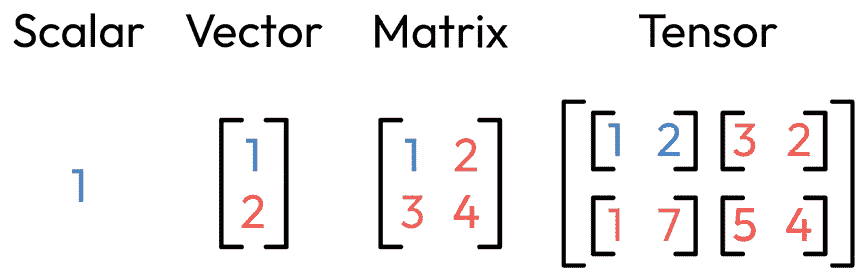

# 第二章：TensorFlow 简介

在 TensorFlow 时代之前，深度学习的格局与今天截然不同。数据专业人士没有那么多全面的工具来帮助开发、训练和部署神经网络。这给实验不同的架构以及调整模型设置以解决复杂任务带来了挑战，因为数据专家通常需要从零开始构建自己的模型。这一过程非常耗时，一些专家可能花费数天甚至数周的时间来开发有效的模型。另一个瓶颈是部署训练好的模型的难度，这使得神经网络的实际应用在早期阶段非常具有挑战性。

但如今，一切都发生了变化；有了 TensorFlow，你可以做许多令人惊叹的事情。在本章中，我们将从审视 TensorFlow 生态系统开始，从高层次讨论与使用 TensorFlow 构建最先进应用相关的各个组件。我们将通过设置工作环境来开始这段旅程，确保满足考试和即将进行的实验的要求。我们还将了解 TensorFlow 的基本概念，理解张量的概念，探索 TensorFlow 中的基本数据表示和操作，并使用这个强大的工具构建我们的第一个模型。我们将通过学习如何调试和解决 TensorFlow 中的错误信息来结束本章。

到本章结束时，你将理解 TensorFlow 的基础知识，包括什么是张量以及如何使用它们执行基本的数据操作。你将具备信心，能够使用 TensorFlow 构建你的第一个模型，并调试和解决在此过程中可能出现的任何错误信息。

本章将涵盖以下主题：

+   什么是 TensorFlow？

+   设置我们的环境

+   数据表示

+   TensorFlow 中的 Hello World

+   调试和解决错误信息

# 技术要求

我们将使用 `python >= 3.8.0`，并配合以下包，它们可以通过 `pip install` 命令安装：

+   `tensorflow>=2.7.0`

+   `tensorflow-datasets==4.4.0`

+   `pillow==8.4.0`

+   `pandas==1.3.4`

+   `numpy==1.21.4`

+   `scipy==1.7.3`

本书的代码包可在以下 GitHub 链接中找到：[`github.com/PacktPublishing/TensorFlow-Developer-Certificate`](https://github.com/PacktPublishing/TensorFlow-Developer-Certificate)。此外，所有习题的解决方案也可以在 GitHub 仓库中找到。如果你是 Google Colab 的新手，这里有一个很棒的资源，可以帮助你快速入门：[`www.youtube.com/watch?v=inN8seMm7UI&list=PLQY2H8rRoyvyK5aEDAI3wUUqC_F0oEroL`](https://www.youtube.com/watch?v=inN8seMm7UI&list=PLQY2H8rRoyvyK5aEDAI3wUUqC_F0oEroL)。

# 什么是 TensorFlow？

在上一章中，我们探讨了可以利用我们对**机器学习**（**ML**）的知识构建的不同类型的应用，从聊天机器人到人脸识别系统，从房价预测到银行业的欺诈检测——这些都是我们可以使用深度学习框架（如 TensorFlow）构建的一些令人兴奋的应用。我们逻辑上会问，TensorFlow 究竟是什么？我们为什么要学习它呢？

**TensorFlow**是一个开源的端到端框架，用于构建深度学习应用。它由 Google 的一组数据专业人员于 2011 年开发，并在 2015 年公开发布。TensorFlow 是一个灵活且可扩展的解决方案，使我们能够通过 Keras API 轻松构建模型。它允许我们访问大量的预训练深度学习模型，这使得它成为行业和学术界许多数据专业人员首选的框架。目前，TensorFlow 被 Google、DeepMind、Airbnb、Intel 等众多大公司使用。

今天，使用 TensorFlow，你可以轻松地在单台 PC 上训练深度学习模型，或者通过 AWS 等云服务，或者使用集群计算进行分布式训练。构建模型只是数据专业人员工作的一部分，那么可视化、部署和监控模型呢？TensorFlow 提供了广泛的工具来满足这些需求，例如 TensorBoard、TensorFlow lite、TensorFlow.js、TensorFlow Hub，以及**TensorFlow Extended**（**TFX**）。这些工具使得数据专业人员能够构建和部署可扩展、低延迟、由机器学习驱动的应用程序，涵盖多个领域——无论是在 Web、移动端，还是边缘设备上。为了支持 TensorFlow 开发者，TensorFlow 提供了全面的文档支持，并且有一个庞大的开发者社区，他们报告 bug 并为这个框架的进一步发展和改进做出贡献。

TensorFlow 生态系统的另一个核心特性是其能够访问各种各样的数据集，这些数据集跨越了不同的机器学习问题类型，如图像数据、文本数据和时间序列数据。这些数据集通过 TensorFlow Datasets 提供，是掌握如何使用 TensorFlow 解决实际问题的绝佳途径。在接下来的章节中，我们将探索如何使用 TensorFlow 生态系统内提供的各种数据集构建模型，以解决计算机视觉、自然语言处理和时间序列预测问题。

我们已经探索了一些在 TensorFlow 生态系统中不可或缺的工具。浏览这些功能（以及将来会添加的新功能）并了解它们总是一个好主意，可以访问官方网页：[`www.tensorflow.org/`](https://www.tensorflow.org/)。不过，在考试中不会涉及这些内容。这里的目的是让你熟悉生态系统中已有的工具。考试的重点是使用 TensorFlow 进行建模，因此我们将只使用生态系统中的工具，例如 TensorFlow 数据集、Keras API 和 TensorFlow Hub 来实现这一目标。

# 设置我们的工作环境

在我们研究 TensorFlow 中的数据表示之前，先让我们设置工作环境。我们将从导入 TensorFlow 并检查其版本开始：

```py
import tensorflow as tf
#To check the version of TensorFlow
print(tf.__version__)
```

当我们运行这段代码时，得到如下输出：

```py
2.8.0
```

好极了！我们已经成功导入了 TensorFlow。接下来，让我们导入 NumPy 和几个数据类型，因为我们将在本章中很快用到它们：

```py
import numpy as np
from numpy import *
```

我们已经顺利完成了所有导入步骤，没有遇到任何错误。接下来，我们将探讨 TensorFlow 中的数据表示方法，因为我们的工作环境已经完全设置好。

# 数据表示

在我们利用机器学习解决复杂任务的过程中，我们会遇到各种类型的原始数据。我们的主要任务是将这些原始数据（可能是文本、图像、音频或视频）转化为数值表示。这些表示使得我们的机器学习模型能够轻松地消化数据并高效地学习其中的潜在模式。为此，TensorFlow 及其基础数据结构——张量，发挥了重要作用。虽然数值数据通常用于训练模型，但我们的模型同样能够高效处理二进制和分类数据。对于这类数据，我们采用诸如独热编码（one-hot encoding）等技术将其转换为适合模型使用的格式。

**张量**是为数值数据表示设计的多维数组；尽管它们与 NumPy 数组有一些相似之处，但它们具有一些独特的特点，使得它们在深度学习任务中具有优势。这些关键优势之一是它们能够利用 GPU 和 TPU 的硬件加速，显著提高计算操作的速度，这在处理图像、文本和视频等输入数据时尤其有用，正如我们将在本书后面的章节中看到的那样。

让我们快速看一个实际应用示例。假设我们正在构建一个汽车识别系统，如 *图 2.1* 所示。我们将从收集各种尺寸、形状和颜色的汽车图像开始。为了训练我们的模型识别这些不同的汽车，我们会将每张图像转换为输入张量，包含高度、宽度和颜色通道。当我们用这些输入张量训练模型时，它会根据训练集中汽车的像素值表示学习模式。训练完成后，我们可以使用训练好的模型识别不同形状、颜色和尺寸的汽车。如果我们现在将一张汽车的图像输入已训练的模型，它会返回一个输出张量，经过解码后转换成可供人类理解的格式，从而帮助我们识别出这是什么类型的汽车。


图 2.1 – TensorFlow 中的数据表示

现在我们已经有了直觉，接下来让我们进一步探讨张量的更多细节。我们将从学习几种生成张量的方法开始。

## 创建张量

在 TensorFlow 中，我们可以通过几种方式生成张量。然而，我们将重点介绍使用 `tf.constant`、`tf.Variable` 和 `tf.range` 创建张量对象。回想一下，我们已经在设置工作环境的部分导入了 TensorFlow、NumPy 和数据类型。接下来，让我们运行以下代码，使用 `tf.constant` 生成我们的第一个张量：

```py
#Creating a tensor object using tf.constant
a_constant = tf.constant([1, 2, 3, 4 ,5, 6])
a_constant
```

当我们运行这段代码时，我们生成了第一个张量。如果一切顺利，输出应该如下所示：

```py
<tf.Tensor: shape=(6,), dtype=int32,
    numpy=array([1, 2, 3, 4, 5, 6], dtype=int32)>
```

很棒！别担心，随着我们继续深入，我们会讨论输出并形成更清晰的认识。但现在，让我们使用 `tf.Variable` 函数生成一个类似的张量对象：

```py
#Creating a tensor object using tf.Variable
a_variable = tf.Variable([1, 2, 3, 4 ,5, 6])
a_variable
```

`a_variable` 变量返回以下输出：

```py
<tf.Variable 'Variable:0' shape=(6,) dtype=int32,
    numpy=array([1, 2, 3, 4, 5, 6], dtype=int32)>
```

虽然两种情况的输入是相同的，但 `tf.constant` 和 `tf.Variable` 是不同的。使用 `tf.constant` 生成的张量是不可变的，而 `tf.Variable` 生成的张量可以在未来重新赋值。随着我们进一步探索张量，我们会更详细地讨论这一点。与此同时，让我们看看另一种使用 `tf.range` 生成张量的方法：

```py
# Creating tensors using the range function
a_range = tf.range(start=1, limit=7)
a_range
```

`a_range` 返回以下输出：

```py
<tf.Tensor: shape=(6,), dtype=int32,
    numpy=array([1, 2, 3, 4, 5, 6], dtype=int32)>
```

很好！从输出结果来看，如果我们直观地比较三种生成张量的方法，我们可以很容易得出结论：`a_constant` 和 `a_range` 的输出相同，但与 `a_variable` 的输出略有不同。当执行张量操作时，这种差异变得更加明显。为了展示这一点，让我们从张量秩开始，继续探索张量操作。

## 张量秩

如果你不是数学背景的，不要担心。我们会一起覆盖所有内容，我们这里不会讨论火箭科学——这是一个承诺。张量的秩标识张量的维度数。秩为`0`的张量称为标量，因为它没有维度。向量是秩为`1`的张量，它只有一个维度，而一个二维张量的矩阵秩为`2`。



图 2.2 – 张量秩

我们已经练习了如何使用三种不同的函数来生成张量。为了说明，我们可以安全地定义标量为只有大小没有方向的量。标量量的例子有时间、质量、能量和速度；这些量有一个单一的数值，例如`1`、`23.4`或`50`。让我们回到笔记本，使用`tf.constant`函数生成一个标量：

```py
#scalar
a = tf.constant(1)
a
```

我们首先创建一个标量，它是一个单一的值，返回如下输出：

```py
<tf.Tensor: shape=(), dtype=int32, numpy=1>
```

从返回的输出可以看出，形状没有值，因为输出是一个标量量，只有一个数值。如果我们尝试使用`4`，`numpy`的输出将是`4`，而其他输出属性将保持不变，因为`4`仍然是一个标量量。

现在我们已经了解了标量（秩为`0`的张量），让我们更进一步，来看一下向量。为了更好理解，向量是既有大小又有方向的量。向量的例子有加速度、速度和力。让我们回到笔记本，尝试生成一个包含四个数字的向量。为了改变一下，这次我们将使用浮点数，因为我们可以使用浮点数生成张量。另外，如果你注意到的话，返回的默认数据类型是`int32`，这是我们之前用来生成整数张量的数据类型：

```py
#vector
b= tf.constant([1.2,2.3,3.4,4.5])
b
```

从我们的结果中可以看出，返回的数据类型是`float32`，形状为`4`：

```py
<tf.Tensor: shape=(4,), dtype=float32,
    numpy=array([1.2, 2.3, 3.4, 4.5], dtype=float32)>
```

接下来，让我们生成一个矩阵。矩阵是一个按行和列排列的数字数组。让我们在笔记本中尝试一个矩阵：

```py
#matrix
c =tf.constant([[1,2],[3,4]])
c
<tf.Tensor: shape=(2, 2), dtype=int32,
    numpy= array([[1, 2], [3, 4]], dtype=int32)>
```

上面的矩阵是一个 2 x 2 矩阵，我们可以通过检查`shape`输出推断出这一点。我们还看到数据类型是`int32`。让我们生成一个更高维度的张量：

```py
#3-dimensional tensor
d=tf.constant([[[1,2],[3,4],[5,6]],[[7,8],[9,10],[11,12]]])
d
```

输出是一个 2 x 3 x 2 的张量，数据类型为`int32`：

```py
<tf.Tensor: shape=(2, 3, 2), dtype=int32,
    numpy= array([[[ 1,  2],[ 3,  4],[ 5,  6]],
       [[ 7,  8], [ 9, 10], [11, 12]]], dtype=int32)>
```

你应该试着操作一些张量。尝试用`tf.Variable`创建一些张量，看看你是否能重现到目前为止的结果。接下来，让我们看看如何解释张量的属性。

## 张量的属性

现在我们已经建立了对标量、向量和张量的理解，让我们详细探讨如何解释张量输出。之前，我们以零碎的方式检查了张量。现在，我们将学习如何从张量的打印表示中识别其关键属性——秩、形状和数据类型。当我们打印张量时，它会显示变量名、形状和数据类型。到目前为止，我们在创建张量时使用的是默认参数。让我们进行一些调整，看看这如何改变输出。

我们将使用`tf.``V``ariable`来生成一个标量张量，选择`float16`作为数据类型，并将其命名为`TDC`。（如果你想知道**TDC**是什么意思，那是**TensorFlow 开发者证书**的缩写。）接下来，我们将运行代码：

```py
#scalar
a = tf.Variable(1.1, name="TDC", dtype=float16)
a
<tf.Variable 'TDC:0' shape=() dtype=float16, numpy=1.1>
```

当我们检查输出时，我们可以看到张量的名称现在是`TDC: 0`，张量的形状是`0`，因为该张量的秩为`0`。我们选择的数据类型是`float16`。最后，张量还具有`numpy`值`1.1`。这个例子展示了我们如何在构建 TensorFlow 张量时配置诸如数据类型和名称等属性。

接下来，让我们看看一个向量，看看我们能从它的属性中学到什么信息：

```py
#vector
b= tf.Variable([1.2,2.3,3.4,4.5], name="Vector", dtype=float16)
b
```

这里，我们再次包含了参数和张量的名称，并且改变了默认的数据类型。从输出中我们可以看到，结果与我们得到的标量量类似：

```py
<tf.Variable ''Vector:0' shape=(4,) dtype=float16,
    numpy=array([1.2, 2.3, 3.4, 4.5])>
```

这里，张量的名称是`'Vector:0`，形状的值为`4`（这对应于条目数量），并且张量的数据类型为`float16`。为了有点乐趣，你可以尝试不同的配置，看看你所做的更改对返回输出的影响；这是一个非常好的学习和理解事物是如何运作的方式。当我们打印张量输出的结果时，我们可以看到张量的不同属性，就像我们检查标量和向量量时那样。然而，通过利用 TensorFlow 函数，我们可以获得更多关于张量的信息。让我们从使用`tf.rank()`函数来检查标量、向量和矩阵的秩开始：

```py
#scalar
a = tf.constant(1.1)
#vector
b= tf.constant([1.2,2.3,3.4,4.5])
#matrix
c =tf.constant([[1,2],[3,4]])
#Generating tensor rank
print("The rank of the scalar is: ",tf.rank(a))
print(" ")
print("The rank of the vector is: ",tf.rank(b))
print(" ")
print("The rank of the matrix is: ",tf.rank(c))
```

我们运行前面的代码来生成标量、向量和矩阵。之后，我们使用`tf.rank`函数打印出它们的秩。以下是输出结果：

```py
The rank of the scalar is: tf.Tensor(0, shape=(), dtype=int32)
The rank of the vector is: tf.Tensor(1, shape=(), dtype=int32)
The rank of the matrix is: tf.Tensor(2, shape=(), dtype=int32)
```

返回的输出是一个张量对象，它显示了张量的秩以及张量的形状和数据类型。要获取张量的秩作为数值，我们必须在返回的张量上使用`.numpy()`来检索张量的实际秩：

```py
print("The rank of the scalar is: ",tf.rank(a).numpy())
The rank of the scalar is:  0
```

然而，直接获得张量秩的一个更简单方法是使用`ndim`，无需重新评估。让我们接下来看看这个方法：

```py
#Generating details of the dimension
print("The dimension of the scalar is: ",a.ndim)
print(" ")
print("The dimension of the vector is: ",b.ndim)
print(" ")
print("The dimension of the matrix is: ",c.ndim)
```

当我们运行代码时，得到以下输出：

```py
The dimension of the scalar is: 0
The dimension of the vector is: 1
The dimension of the matrix is: 2
```

接下来，让我们通过使用`dtype`参数打印出所有三个量的数据类型，以生成每个张量的数据类型：

```py
#printing the data type
print("The data type of the scalar is: ",a.dtype)
print(" ")
print("The data type of the vector is: ",b.dtype)
print(" ")
print("The data type of the matrix is: ",c.dtype)
```

当我们运行代码时，得到以下输出。

```py
The data type of the scalar is:  <dtype: 'float32'>
The data type of the vector is:  <dtype: 'float32'>
The data type of the matrix is:  <dtype: 'int32'>
```

从之前的输出中，我们可以看到数据类型。接下来，我们来看看张量的形状：

```py
#Generating details of the tensor shape
print("The Shape of the scalar is: ",a.shape)
print(" ")
print("The Shape of the vector is: ",b.shape)
print(" ")
print("The Shape of the matrix is: ",c.shape)
```

当我们运行代码时，得到以下输出：

```py
The Shape of the scalar is:  ()
The Shape of the vector is:  (4,)
The Shape of the matrix is:  (2, 2)
```

从结果中可以看出，标量没有形状值，而向量的形状值为 1 单位，矩阵的形状值为 2 单位。接下来，我们来计算每个张量中的元素数量：

```py
#Generating number of elements in a tensor
print("The Size of the scalar is: ",tf.size(a))
print(" ")
print("The Size of the vector is: ",tf.size(b))
print(" ")
print("The Size of the matrix is: ",tf.size(c))
```

当我们运行代码时，得到以下输出：

```py
The Size of the scalar is:  tf.Tensor(1, shape=(), dtype=int32)
The Size of the vector is:  tf.Tensor(4, shape=(), dtype=int32)
The Size of the matrix is:  tf.Tensor(4, shape=(), dtype=int32)
```

我们可以看到标量只有 1 个计数，因为它是一个单一的单位；而我们的向量和矩阵中都有 `4`，因此每个都有 4 个数值。现在，我们可以自信地使用不同的方法来检查张量的属性。接下来，我们继续实现张量的基本操作。

## 基本的张量操作

我们现在知道 TensorFlow 是一个强大的深度学习工具。学习 TensorFlow 的一大障碍是理解什么是张量操作以及为什么需要它们。我们已经确定，张量是 TensorFlow 中的基本数据结构，可以用来存储、操作和分析机器学习模型中的数据。另一方面，张量操作是可以应用于张量的数学运算，用来操控、解码或分析数据。这些操作从简单的元素级操作到神经网络各层中执行的更复杂计算不等。让我们来看看一些张量操作。我们将从更改数据类型开始。然后，我们将学习索引和聚合张量。最后，我们将进行张量的元素级操作、张量重塑和矩阵乘法。

### 更改数据类型

假设我们有一个张量，我们想将其数据类型从 `int32` 更改为 `float32`，可能是为了支持某些需要小数的操作。幸运的是，在 TensorFlow 中，有办法解决这个问题。记住，我们已经确定整数的默认数据类型是 `int32`，而小数的默认数据类型是 `float32`。让我们返回 Google Colab，看看如何在 TensorFlow 中实现这一点：

```py
a=tf.constant([1,2,3,4,5])
a
```

我们生成了一个整数向量，输出如下：

```py
<tf.Tensor: shape=(5,), dtype=int32, numpy=array([1, 2, 3, 4, 5], dtype=int32)>
```

我们可以看到数据类型是 `int32`。让我们继续进行数据类型操作，将数据类型更改为 `float32`。我们使用 `tf.cast()` 函数，并将数据类型参数设置为 `float32`。让我们在笔记本中实现这一点：

```py
a =tf.cast(a,dtype=tf.float32)
a
```

操作返回的数据类型为 `float32`。我们还可以看到 `numpy` 数组现在是一个小数数组，不再是整数数组：

```py
<tf.Tensor: shape=(5,), dtype=float32,
    numpy=array([1., 2., 3., 4., 5.], dtype=float32)>
```

你可以尝试 `int16` 或 `float64`，看看效果如何。当你完成后，我们继续进行 TensorFlow 中的索引操作。

### 索引

让我们从创建一个 2 x 2 的矩阵开始，接下来我们将用它来演示索引操作：

```py
# Create a 2 x 2 matrix
a = tf.constant([[1, 2],[3, 4]], dtype=float32)
a
```

这是返回的输出：

```py
<tf.Tensor: shape=(2, 2), dtype=float32, 
    numpy=array([[1., 2.], [3., 4.]], dtype=float32)>
```

如果我们想从矩阵中提取一些信息呢？假设我们想提取`[1,2]`。我们该如何做呢？别担心：我们可以应用索引来获取所需的信息。让我们在我们的笔记本中实现它：

```py
# Indexing
a[0]
```

这里是返回的输出：

```py
<tf.Tensor: shape=(2,), dtype=float32,
    numpy=array([1., 2.], dtype=float32)>
```

如果我们想从矩阵中提取值`2`怎么办？让我们看看我们该如何做到：

```py
# Indexing
a[0][1]
```

这里是返回的输出：

```py
<tf.Tensor: shape=(), dtype=float32, numpy=2.0>
```

现在，我们已经成功地使用索引提取了我们想要的值。为了提取*图 2.3*中显示的矩阵中的所有值，我们可以使用索引来提取 2 x 2 矩阵中的所需元素。


图 2.3 – 矩阵索引

接下来，让我们看另一个索引的例子——这次，使用`tf.slice()`函数从张量中提取信息：

```py
c = tf.constant([0, 1, 2, 3, 4, 5])
print(tf.slice(c,begin=[2],size=[4]))
```

我们生成一个张量`c`。然后，使用`tf.slice`函数从索引`2`开始切割向量，切割的大小或数量是`4`。当我们运行代码时，得到以下结果：

```py
tf.Tensor([2 3 4 5], shape=(4,), dtype=int32)
```

我们可以看到结果包含来自索引`2`的值，并且我们从向量中提取了 4 个元素来生成切片。接下来，让我们看看如何扩展一个矩阵的维度。

重要提示

请记住，在 Python 中，我们的计数是从 0 开始的，而不是从 1 开始。

### 扩展矩阵

我们现在已经知道如何使用`ndim`检查矩阵的维度。那么，让我们看看如何扩展这个矩阵的维度。我们继续使用我们的`a`矩阵，它是一个 2 x 2 的矩阵，如*图 2.4*所示。


图 2.4 – 一个 2x2 矩阵

我们可以使用以下代码来扩展维度：

```py
tf.expand_dims(a,axis=0)
```

我们使用`expand_dims()`函数，代码将`a`张量的维度沿着`0`轴进行扩展。当你想为张量添加一个新维度时，这非常有用——例如，当你想将一个二维张量转换为三维张量时（这种技术将在*第七章*，*卷积神经网络的图像分类*中应用，我们将处理一个有趣的经典图像数据集）：

```py
<tf.Tensor: shape=(1, 2, 2), dtype=float32,
    numpy= array([[[1., 2.], [3., 4.]]], dtype=float32)>
```

如果你查看我们的输出张量的形状，现在可以看到它在`0`轴上有一个额外的维度`1`。接下来，让我们通过检查在不同轴上扩展张量的形状来更好地理解这一过程：

```py
(tf.expand_dims(a,axis=0)).shape,
(tf.expand_dims(a,axis=1)).shape,
(tf.expand_dims(a,axis=-1)).shape
```

当我们运行代码查看维度如何在`0`、`1`和`-1`轴上扩展时，我们得到以下结果：

```py
(TensorShape([1, 2, 2]), TensorShape([2, 1, 2]),
    TensorShape([2, 2, 1]))
```

在第一行代码中，`a`的维度在`0`轴上扩展了 1。这意味着`a`的维度将变为 1 x 2 x 2，在张量的开头添加了一个额外的维度。第二行代码是在`1`轴上将`a`的维度扩展了 1。这意味着`a`的维度将变为 2 x 1 x 2；这里，我们在张量的第二个位置添加了一个额外的维度。第三行代码是在`-1`轴上将`a`的维度扩展了 1。这意味着`a`的维度将变为 2 x 2 x 1，从而在张量的末尾添加了一个额外的维度。我们已经解释了如何扩展矩阵的维度。接下来，让我们看看张量聚合。

### 张量聚合

让我们继续前行，了解如何聚合张量。我们首先通过导入`random`库生成一些随机数。然后，我们生成一个从 1 到 100 的范围，并在该范围内生成 50 个随机数。接下来，我们将使用这些随机数来生成一个张量：

```py
import random
random.seed(22)
a = random.sample(range(1, 100), 50)
a = tf.constant(a)
```

当我们打印`a`时，得到以下数字：

```py
<tf.Tensor: shape=(50,), dtype=int32, numpy=array(
    [16, 83,  6, 74, 19, 80, 95, 68, 66, 86, 54, 12, 91,
    13, 23,  9, 82, 84, 30, 62, 89, 33, 78,  2, 97, 21,
    59, 34, 48, 38, 35, 18, 46, 60, 27, 26, 73, 76, 94,
    72, 15, 40, 96, 44, 61,  8, 79, 93, 11, 14],
    dtype=int32)>
```

假设我们想找出张量中的最小值。手动浏览所有数字，5 秒钟内告诉我最小值是什么，可能会有些困难。如果我们的值的范围达到千或百万，手动检查将占用我们所有的时间。幸运的是，在 TensorFlow 中，我们不仅可以一次找到最小值，还可以找到最大值、所有值的和、均值等更多信息。让我们一起在 Colab 笔记本中做这个：

```py
print("The smallest number in our vector is : ",
    tf.reduce_min(a).numpy())
print(" ")
print("The largest number in our vector is: ",
    tf.reduce_max(a).numpy())
print(" ")
print("The sum of our vector is : ",
    tf.reduce_sum(a).numpy())
print(" ")
print("The mean of our vector is: ",
    tf.reduce_mean(a).numpy())
```

我们使用这些函数可以一键提取所需的细节，生成如下结果：

```py
The smallest number in our vector is :  1
The largest number in our vector is:  99
The sum of our vector is :  2273
The mean of our vector is:  45
```

现在我们已经使用 TensorFlow 提取了一些重要的细节，知道了我们向量中的最小值是 1，最大值是 99，向量的和是 2273，均值是 45。不错吧？如果我们想找出向量中最小值和最大值所在的位置，该怎么办呢？

```py
print("The position that holds the lowest value is : ",
    tf.argmin(a).numpy())
print(" ")
print("The position that holds the highest value is: ",
    tf.argmax(a).numpy())
```

我们使用`tf.argmin`和`tf.argmax`函数分别生成最小值的索引和最大值的索引。输出结果如下：

```py
The position that holds the lowest value is :  14
The position that holds the highest value is:  44
```

从`print`语句的结果中，我们可以看出最小值位于索引`14`，最大值位于索引`44`。如果我们手动检查数组，就会发现这是正确的。此外，我们还可以将索引位置传入数组，获取最小值和最大值：

```py
a[14].numpy(), a[44].numpy()
```

如果我们运行代码，得到如下结果：

```py
(1,99)
```

还有一些其他的函数可以尝试。TensorFlow 文档给了我们很多可以尝试和探索的内容。接下来，让我们看看如何转置和重塑张量。

### 转置和重塑张量

让我们看看如何转置和重塑一个矩阵。首先，我们生成一个 3 x 4 的矩阵：

```py
# Create a 3 x 4 matrix
a = tf.constant([[1,2,3,4], [5,6,7,8], [9,10,11,12]])
a
```

当我们运行代码时，得到如下结果：

```py
<tf.Tensor: shape=(3, 4), dtype=int32, 
    numpy=array([[ 1,  2,  3,  4],
        [ 5,  6,  7,  8],
        [ 9, 10, 11, 12]], dtype=int32)>
```

我们可以使用`tf.reshape`函数重新调整矩阵的形状。由于矩阵中有 12 个值，我们可以将其调整为 2 x 2 x 3 的形状。如果我们相乘这些值，我们将得到 12：

```py
tf.reshape(a, shape=(2, 2, 3))
```

当我们运行代码时，我们得到以下输出：

```py
<tf.Tensor: shape=(2, 2, 3), dtype=int32, 
    numpy=array([[[ 1,  2,  3], [ 4,  5,  6]],
        [[ 7,  8,  9], [10, 11, 12]]], dtype=int32)>
```

我们还可以通过改变`tf.reshape`函数中的`shape`参数来重新调整矩阵的形状为 4 x 3 矩阵或 1 x 2 x 6 矩阵。你也可以尝试一些其他的形状调整可能性。接下来，让我们看一下如何使用`tf.transpose()`转置这个矩阵：

```py
tf.transpose(a)
```

当我们运行代码时，我们得到以下输出：

```py
<tf.Tensor: shape=(4, 3), dtype=int32, 
    numpy=array([[ 1,  5,  9],
        [ 2,  6, 10],
        [ 3,  7, 11],
        [ 4,  8, 12]], dtype=int32)>
```

从输出中，我们可以看到转置操作会翻转轴。现在，我们得到了一个 4 x 3 的矩阵，而不是最初的 3 x 4 矩阵。接下来，让我们看一下逐元素矩阵操作。

### 逐元素操作

让我们从在 Colab 中创建一个简单的向量开始：

```py
a= tf.constant([1,2,3])
a
```

让我们显示我们的输出，以便看到当我们对向量执行逐元素操作时会发生什么：

```py
<tf.Tensor: shape=(3,), dtype=int32, numpy=array([1, 2, 3],
    dtype=int32)>
```

这是我们的初始输出。现在，让我们尝试一些逐元素操作，看看接下来会发生什么：

```py
#Addition operation
print((a+4).numpy())
print(" ")
#Subtraction operation
print((a-4).numpy())
print(" ")
#Multiplication Operation
print((a*4).numpy())
print(" ")
#Division Operation
print((a/4).numpy())
print(" ")
```

我们可以看到加法、减法、乘法和除法操作的结果。这些操作是在我们向量中的每个元素上执行的：

```py
[5 6 7]
[-3 -2 -1]
[ 4  8 12]
[0.25 0.5  0.75]
```

接下来，让我们看一下矩阵乘法。

### 矩阵乘法

让我们来看一下矩阵乘法，并了解它在 TensorFlow 中的工作原理。我们返回到 Colab 中的笔记本，生成矩阵`a`，它是一个 3 x 2 的矩阵，以及矩阵`b`，它是一个 2 x 3 的矩阵。我们将使用这些矩阵进行矩阵操作：

```py
# 3 X 2 MATRIX
a = tf.constant([[1, 2], [3, 4], [5, 6]])
#2 X 3 MATRIX
b = tf.constant([[7,8,9], [10,11,12]])
```

现在，让我们使用`tf.matmul`在我们的笔记本中乘以矩阵`a`和矩阵`b`，看看 TensorFlow 中的结果会是什么样子：

```py
tf.matmul(a,b)
```

我们在 TensorFlow 中使用`tf.matmul`函数进行矩阵乘法。在这里，我们可以看到这个操作的输出：

```py
<tf.Tensor: shape=(3, 3), dtype=int32,
numpy= array([[ 27,  30,  33],[ 61,  68,  75],
    [ 95, 106, 117]], dtype=int32)>
```

很好！现在，如果我们想要将矩阵`a`与自身相乘，结果会是什么样子呢？如果我们尝试这个操作，我们会得到一个错误，因为矩阵的形状不符合矩阵乘法的规则。该规则要求矩阵`a`应该由`i`行 x `m`列组成，矩阵`b`应该由`m`行 x `n`列组成，并且矩阵中的`m`值在两个矩阵中必须相同。新的矩阵将具有`i` x `n`的形状，如*图 2.5*所示。


图 2.5 – 矩阵乘法

现在我们可以看到为什么不能将矩阵`a`与自身相乘，因为第一个矩阵的行数必须等于第二个矩阵的列数。然而，如果我们希望将`a`与自身相乘，我们可以通过转置或重新调整矩阵`a`的形状来满足矩阵乘法的要求。让我们来试一下：

```py
tf.matmul(a,tf.transpose(a, perm=[1,0]))
```

当我们转置矩阵`a`时，我们根据`perm`参数交换矩阵的行和列，这里我们将其设置为`[1,0]`。当我们使用`a`和`a`的转置执行`matmul`函数时，我们得到一个符合矩阵乘法规则的新矩阵：

```py
<tf.Tensor: shape=(3, 3), dtype=int32,
    numpy= array([[ 5, 11, 17], [11, 25, 39],
    [17, 39, 61]], dtype=int32)>
```

我们来尝试使用`reshape`进行矩阵乘法如何？试试这个，并将你的结果与我们的 Colab 笔记本中的结果进行对比。我们已经看了很多操作了。接下来我们来构建第一个模型吧。

# TensorFlow 中的 Hello World

我们已经覆盖了很多 TensorFlow 的基本操作。现在，让我们在 TensorFlow 中构建第一个模型。假设你是一个研究小组的一员，正在研究学生在一个学期内的学习小时数与他们的期末成绩之间的相关性。当然，这只是一个理论场景，实际上，影响学生表现的因素有很多。然而，在这个例子中，我们只考虑一个决定成功的属性——学习小时数。在一个学期的学习之后，我们成功地整理了学生的学习小时数及其相应的成绩，如*表 2.1*所示。

| 学习小时数 | 20 | 23 | 25 | 28 | 30 | 37 | 40 | 43 | 46 |
| --- | --- | --- | --- | --- | --- | --- | --- | --- | --- |
| 测试成绩 | 45 | 51 | 55 | 61 | 65 | 79 | 85 | 91 | 97 |

表 2.1 – 学生表现表

现在，我们要构建一个模型，预测学生未来的表现，基于他们的学习小时数。准备好了吗？现在让我们一起做吧：

1.  让我们通过打开名为`hello world`的配套笔记本一起构建这个。首先，我们导入 TensorFlow。在*第一章*《机器学习简介》中，我们讨论了特征和标签。在这里，我们只有一个特征——学习小时数——而我们的标签或目标变量是测试成绩。通过强大的 Keras API，只需几行代码，我们就能构建并训练一个模型来进行预测。让我们开始吧：

    ```py
    import tensorflow as tf
    
    from tensorflow import keras
    
    from tensorflow.keras import Sequential
    
    from tensorflow.keras.layers import Dense
    
    print(tf.__version__)
    ```

我们首先导入 TensorFlow 和 Keras API；不用担心所有的术语，我们将在*第三章*《TensorFlow 的线性回归》中详细展开。这里的目标是展示如何构建一个基础模型。别太担心技术细节；运行代码并看看它是如何工作的才是最重要的。导入所需的库之后，我们继续我们的传统，打印出我们的 TensorFlow 版本。代码运行顺利。

1.  接下来，我们导入`numpy`用于执行数学运算，导入`matplotlib`用于数据可视化：

    ```py
    #import additional libraries
    
    import numpy as np
    
    import matplotlib.pyplot as plt
    ```

我们运行代码并且没有出现错误，所以可以继续进行。

1.  我们设置了`X`和`y`的值列表，分别代表学习小时数和测试成绩：

    ```py
    # Hours of study
    
    X = [20,23,25,28,30,37,40,43,46]
    
    # Test Scores
    
    y = [45, 51, 55, 61, 65, 79, 85, 91, 97]
    ```

1.  为了更好地了解数据分布，我们使用`matplotlib`来可视化数据：

    ```py
    plt.plot(X, y)
    
    plt.title("Exam Performance graph")
    
    plt.xlabel('Hours of Study')
    
    plt.ylabel('Test Score')
    
    plt.show()
    ```

代码块绘制了`X`（学习小时数）与`y`（测试成绩）之间的图形，并显示了我们图表的标题（`考试表现图`）。我们使用`show()`函数来显示图表，如*图 2.6*所示。


图 2.6 – 学生表现图

从图表中我们可以看到数据表现出线性关系。考虑到我们可以逻辑地预期一个学习更努力的学生能获得更好的分数，这个假设并不算坏。

1.  在不对这个理论进行辩论的前提下，让我们使用 Keras API 来构建一个简单的模型：

    ```py
    study_model = Sequential([Dense(units=1,
    
        input_shape=[1])])
    
    study_model.compile(optimizer='adam',
    
        loss='mean_squared_error')
    
    X= np.array(X, dtype=int)
    
    y= np.array(y, dtype=int)
    ```

我们构建了一个单层模型，命名为`study_model`，并将我们的`X`和`y`值列表转换为 NumPy 数组。

1.  接下来，我们拟合模型并运行 2,500 个迭代周期：

    ```py
    #fitting the model
    
    history= study_model.fit(X, y, epochs=2500)
    ```

当我们运行模型时，它应该在 5 分钟以内完成。我们可以看到，损失值最初快速下降，并在大约 2,000 个迭代周期后逐渐趋于平稳，如*图 2.8*所示：


图 2.7 – 模型损失图

就这样，我们训练了一个可以用来预测学生在学期结束时表现的模型。这是一个非常基础的任务，感觉就像用锤子打苍蝇。不过，让我们来试试看我们的模型：

```py
#Let us predict how well a student will perform based on their study time
n=38 #Hours of study
result =study_model.predict([n])[0][0] #Result
rounded_number = round(81.0729751586914, 2)
```

如果我们运行这段代码，我们将生成一个学习了 38 小时的学生的结果。记住，我们的模型并没有在这个值上进行训练。那么，让我们看看我们的模型预测这个学生的分数：

```py
print(f"If I study for {n} hours,
     I will get { rounded_number} marks as my grade.")
If I study for 38 hours, I will get 81.07 marks as my grade.
```

我们的模型预测这个学生的分数是 81.07 分。结果不错，但我们怎么知道模型是对的还是错的呢？如果你看看*图 2.6*，你可能会猜测我们的预测结果应该接近这个分数，但你也许已经猜到我们是用*2x + 5 = y*来生成我们的`y`值。如果我们输入`X=38`，我们会得到*2(38) + 5 = 81*。我们的模型在预测正确分数时表现得相当好，误差仅为 0.07；然而，我们不得不花费很长时间来训练它，以便在这样一个简单的任务上取得这个结果。在接下来的章节中，我们将学习如何使用像归一化等技术，以及通过更大的数据集来训练一个更好的模型，我们会使用训练集、验证集并在测试集上进行预测。这里的目标是让你对接下来要学习的内容有一个初步的了解，因此，尝试一些不同的数字，看看模型的表现。不要超过 47，因为你将得到一个超过 100 的分数。

现在我们已经构建了第一个模型，让我们来看一下如何调试和解决错误信息。如果你决定从事这个领域的工作，这是你将会遇到的许多问题之一。

# 调试和解决错误信息

当你在本书中完成练习或走过代码，或者在任何其他资源中，甚至是你自己的个人项目中，你会迅速意识到代码出错的频率，掌握如何解决这些错误将帮助你快速通过学习过程或构建项目时的难关。首先，当你遇到错误时，重要的是要检查错误信息是什么。接下来是理解错误信息的含义。让我们来看一些学生在实现 TensorFlow 基本操作时遇到的错误。让我们运行以下代码来生成一个新的向量：

```py
tf.variable([1,2,3,4])
```

运行此代码会抛出如下截图所示的错误：


图 2.8 – 错误示例

从错误信息中，我们可以看到在 TensorFlow 中没有名为 `variable` 的属性。这引起了我们对错误来源的注意，并且我们立刻发现我们写成了 `variable`，而应该使用文档中要求的大写字母 `V` 来写 `Variable`。但是，如果我们自己无法调试这个问题，我们可以点击 **搜索 STACK OVERFLOW** 按钮，因为这是一个很好的地方，可以找到我们在日常编码中可能遇到的问题的解决方案。很可能别人也遇到过相同的问题，解决方案可以在 Stack Overflow 上找到。

让我们点击链接，看看在 Stack Overflow 上能找到什么：


图 2.9 – Stack Overflow 上解决 AttributeError 的方案

万岁！在 Stack Overflow 上，我们看到了问题的解决方案，并附有文档链接，供您查看更多详情。请记住，最好先查看错误消息，看看自己是否能解决问题，然后再去 Stack Overflow。如果你能做到这一点，并投入时间阅读文档，你会越来越擅长调试问题，并减少错误，但你仍然会需要 Stack Overflow 或文档。调试是必经之路。在我们结束这一章之前，让我们快速总结一下我们学到的内容。

# 总结

在这一章中，我们高层次地讨论了 TensorFlow 生态系统。我们探讨了一些关键组件，这些组件使 TensorFlow 成为许多 ML 工程师、研究人员和爱好者构建深度学习应用和解决方案的首选平台。接下来，我们讨论了张量是什么，以及它们如何在我们的模型中发挥作用。之后，我们学习了几种创建张量的方法，探讨了张量的各种属性，并看到了如何使用 TensorFlow 实现一些基本的张量操作。我们构建了一个简单的模型并用它进行预测。最后，我们讨论了如何调试和解决 TensorFlow 以及更广泛的机器学习中的错误信息。

在下一章中，我们将通过实践来探讨回归模型的构建。我们将学习如何扩展我们的简单模型，以解决公司人力资源部门的回归问题。此外，您在调试过程中学到的内容在下一章也可能会派上用场——我们下一章见。

# 问题

让我们测试一下在本章中学到的内容：

1.  什么是 TensorFlow？

1.  什么是张量？

1.  使用`tf.``V``ariable`生成一个矩阵，数据类型为`tf.float64`，并为变量命名。

1.  生成 15 个 1 到 20 之间的随机数，并提取出最小值、最大值、均值以及最小和最大值的索引。

1.  生成一个 4 x 3 的矩阵，并将该矩阵与其转置相乘。

# 进一步阅读

若想了解更多内容，您可以查看以下资源：

+   Amr, T., 2020\. *使用 scikit-learn 和科学 Python 工具包的动手机器学习*. [S.l.]: Packt 出版社。

+   *TensorFlow* *指南*: [`www.TensorFlow.org/guide`](https://www.TensorFlow.org/guide)
