# 第三章：使用 TensorFlow 进行线性回归

本章将介绍线性回归的概念以及如何使用 TensorFlow 实现它。我们将首先讨论什么是线性回归，它是如何工作的，它的基本假设是什么，以及可以用它解决的各种问题类型。接下来，我们将探讨回归建模中使用的各种评估指标，例如均方误差、平均绝对误差、均方根误差和决定系数 R²，并努力理解如何解释这些指标的结果。

为了进行实践操作，我们将通过构建一个实际案例来实现线性回归，在这个案例中，我们使用不同的属性预测员工的薪资。在这个过程中，我们将通过动手实践学习如何加载和预处理数据，涵盖处理缺失值、编码分类变量和标准化数据等重要概念。接着，我们将探索如何使用 TensorFlow 构建、编译和拟合线性回归模型，并审视像欠拟合和过拟合这样的概念及其对模型性能的影响。在本章结束前，您还将学习如何保存和加载训练好的模型，以便对未见过的数据进行预测。

本章将涵盖以下主题：

+   使用 TensorFlow 进行线性回归

+   评估回归模型

+   使用 TensorFlow 预测工资

+   模型的保存与加载

# 技术要求

我们将使用 `python >= 3.8.0`，并安装以下包，您可以通过 `pip install` 命令安装：

+   `tensorflow>=2.7.0`

+   `tensorflow-datasets==4.4.0`

+   `pillow==8.4.0`

+   `pandas==1.3.4`

+   `numpy==1.21.4`

+   `scipy==1.7.3`

# 使用 TensorFlow 进行线性回归

**线性回归**是一种监督式机器学习技术，用于建模预测输出变量（因变量）与一个或多个自变量之间的线性关系。当一个自变量可以有效地预测输出变量时，我们就得到了*简单线性回归*的案例，其可以用方程 *y = wX + b* 表示，其中 `y` 是目标变量，`X` 是输入变量，`w` 是特征的权重，`b` 是偏置。

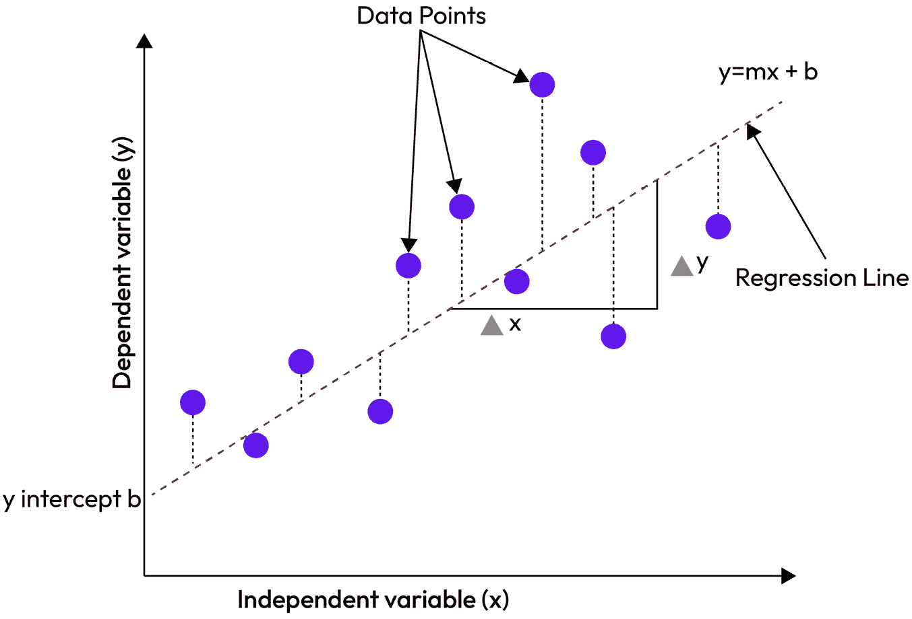

图 3.1 – 展示简单线性回归的图表

在 *图 3.1* 中，直线被称为回归线（最佳拟合线），它是最优地建模 `X` 与 `y` 之间关系的直线。因此，我们可以利用它根据图表中某一点上自变量的当前值来确定因变量。线性回归的目标是找到 `w` 和 `b` 的最佳值，它们能够建模 `X` 和 `y` 之间的潜在关系。预测值越接近真实值，误差就越小。

反之，当我们有多个输入变量来预测输出值时，就出现了*多重线性回归*的情况，我们可以用方程 *y = b0 + b1X1 + b2X2 + .... + bnXn* 来表示，其中 `y` 是目标变量，*X1*、*X2*、... *Xn* 是输入变量，*b0* 是偏差项，*b1*、*b2*、... *bn* 是特征权重。

简单线性回归和多重线性回归有很多实际应用，因为它们易于实现且计算成本低。因此，它们可以很容易地应用于大规模数据集。然而，当我们试图建立 `X` 和 `y` 之间的非线性关系模型，或者输入数据中包含大量无关特征时，线性回归可能会失效。

线性回归广泛应用于解决各个领域的实际问题。例如，我们可以应用线性回归预测房屋价格，考虑因素如房屋大小、卧室数量、位置以及距离社会设施的远近。同样，在**人力资源**（**HR**）领域，我们可以利用线性回归预测新员工的薪资，考虑因素包括候选人的工作经验年限和教育水平。这些都是使用线性回归可以实现的一些例子。接下来，让我们看看如何评估线性回归模型。

# 评估回归模型

在我们来自 *第二章* 的 *hello world* 示例中，*TensorFlow 简介*，我们尝试预测学生在学期内学习了 38 小时后，考试成绩是多少。我们的模型得出了 81.07 分，而真实值是 81 分。因此，我们很接近，但并不完全正确。当我们减去模型预测值和真实值之间的差异时，我们得到了一个残差 0.07。残差值可以是正数也可以是负数，具体取决于我们的模型是高估还是低估了预测结果。当我们取残差的绝对值时，就消除了任何负号；因此，绝对误差总是一个正值，无论残差是正还是负。

绝对误差的公式如下：

绝对误差 = |Y pred − Y true|

其中 Y pred = 预测值，Y true = 真实值。

**平均绝对误差**（**MAE**）是模型的所有数据点的绝对误差的平均值。MAE 衡量的是残差的平均值，可以通过以下公式表示：

MAE = 1 _ n ∑ i=1 n |Y pred − Y true|

其中：

+   `n` = 所考虑的数据点数量

+   ∑ = 所有观测值的绝对误差之和

+   |Y pred − Y true| = 绝对值

如果 MAE = 0，这意味着 Y_pred = Y_true。这意味着模型的预测完全准确；尽管这是一个理想的情况，但极不可能发生。相反，如果 MAE = ∞，则表示模型完全失败，因为它未能捕捉到输入与输出变量之间的任何关系。误差越大，MAE 的值也越大。在性能评估中，我们希望 MAE 的值较低，但由于 MAE 是一个相对度量，其值取决于所处理数据的规模，因此很难在不同数据集之间比较 MAE 的结果。

另一个重要的评估指标是**均方误差**（**MSE**）。与 MAE 不同，MSE 对残差进行了平方处理，从而去除了残差中的负值。MSE 用以下公式表示：

MSE = 1 _ N ∑ i=1 N ( Y pred − Y true) 2

与 MAE 类似，当没有残差时，我们有一个完美的模型。因此，MSE 值越低，模型性能越好。与 MAE 不同，MAE 中的大误差或小误差对结果有相同比例的影响，而 MSE 会对较大的误差进行惩罚，相较于小误差，它具有更高的单位阶数，因为我们在此情况下对残差进行了平方。

回归建模中另一个有用的指标是**均方根误差**（**RMSE**）。顾名思义，它是 MSE 的平方根，如下所示的公式所示：

MSE = 1 _ N ∑ i=1 N ( Y pred − Y true) 2

RMSE = √_ MSE = √ ________________ 1 _ N ∑ i=1 N ( Y pred − Y true) 2

最后，让我们看一下**决定系数**（**R 平方**）。R²衡量回归建模任务中，因变量在多大程度上可以由自变量解释。我们可以通过以下公式计算 R²：

R 2 = 1 − R res _ R tot

其中 Rres 是残差平方和，Rtot 是总平方和。R²值越接近 1，模型越准确；R²值越接近 0，模型越差。此外，R²值也可能是负数。这发生在模型未能遵循数据趋势的情况下——此时，Rres 大于 Rtot。负的 R²是模型性能差的标志，说明我们的模型需要显著改进。

我们已经看过了一些回归评估指标。好消息是，我们不需要手动计算它们；我们将利用 TensorFlow 中的`tf.keras.metrics`模块来帮助我们完成这些繁重的计算。我们已经从高层次快速浏览了理论。接下来，让我们通过一个多元线性回归的案例研究，帮助我们理解构建 TensorFlow 模型所需的各个部分，同时了解如何评估、保存、加载并使用训练好的模型来对新数据进行预测。让我们继续进行案例研究。

# 使用 TensorFlow 进行薪资预测

在这个案例研究中，你将假设自己是 Tensor Limited（一个快速增长的初创公司，拥有 200 多名员工）的新晋机器学习工程师。目前，公司希望招聘 7 名新员工，人力资源部门难以根据不同的资质、工作经验、申请职位以及每个潜在新员工的培训水平来确定理想的薪资。你的任务是与人力资源部门合作，为这些潜在新员工确定最优薪资。

幸运的是，我们已经在*第一章*《机器学习简介》中讲解了机器学习生命周期，*第二章*《TensorFlow 简介》里也构建了我们的 Hello World 案例研究，并且在本章中已经涵盖了回归建模所需的一些关键评估指标。因此，从理论上讲，你已经充分准备好执行这个任务。你已经与人力资源经理进行了富有成效的讨论，现在对任务和要求有了更清晰的理解。你将任务定义为一个监督学习任务（回归）。同时，人力资源部门允许你下载员工记录和相应的薪资数据来完成这个任务。现在你已经拥有数据集，让我们继续将数据加载到笔记本中。

## 加载数据

执行以下步骤以加载数据集：

1.  打开名为`Linear_Regression_with_TensorFlow.ipynb`的笔记本。我们将从导入所有必要的库开始：

    ```py
    # import tensorflow
    
    import tensorflow as tf
    
    from tensorflow import keras
    
    from tensorflow.keras import Sequential
    
    from tensorflow.keras.layers import Dense
    
    print(tf.__version__)
    ```

我们将运行这段代码块。如果一切顺利，我们将看到我们正在使用的 TensorFlow 版本：

```py
2.12.0
```

1.  接下来，我们将导入一些额外的库，这些库将帮助我们简化工作流程：

    ```py
    import numpy as np
    
    import pandas as pd
    
    import matplotlib.pyplot as plt
    
    import seaborn as sns
    
    from sklearn.model_selection import train_test_split
    
    from sklearn.preprocessing import MinMaxScaler
    ```

我们将运行这个单元格，应该一切正常。NumPy 是一个 Python 中的科学计算库，用于对数组执行数学运算，而 pandas 是 Python 内置的用于数据分析和处理的库。Matplotlib 和 Seaborn 用于数据可视化，我们将使用 sklearn 进行数据预处理和数据拆分。在这个案例研究中，我们将应用这些库，你将了解它们的作用，并且能够在考试中以及之后的工作中应用它们。

1.  现在，我们将继续加载数据集，这个数据集是我们从人力资源团队获取的，用于这个项目：

    ```py
    #Loading from the course GitHub account
    
    df=pd.read_csv('https://raw.githubusercontent.com/oluwole-packt/datasets/main/salary_dataset.csv')
    
    df.head()
    ```

我们将使用 pandas 生成一个 DataFrame，以表格格式保存记录，并将使用`df.head()`打印数据中的前五个条目：

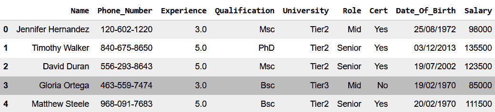

图 3.2 – 显示数据集快照的 DataFrame

根据每一列捕捉的细节，我们现在对收集的数据有了初步了解。接下来，我们将继续探索数据，看看我们能学到什么，并且如何有效地开发一个解决方案来实现业务目标。让我们通过查看数据预处理部分继续。

## 数据预处理

为了能够对数据进行建模，我们需要确保数据是正确的格式（即数值型数据）。此外，我们还需要处理缺失值并去除无关的特征。在实际应用中，数据预处理通常需要很长时间。你会反复听到这一点，且这是真的。如果数据没有正确地整理，我们就无法进行建模。让我们深入了解一下，看看如何为当前任务做这些操作。从 DataFrame 中，我们可以立即看到一些无关的列，它们包含员工的个人身份信息。因此，我们将删除这些列，并告知人力资源部门：

```py
#drop irrelevant columns
df =df.drop(columns =['Name', 'Phone_Number',
    'Date_Of_Birth'])
df.head()
```

我们将使用 pandas 中的`drop`函数删除姓名、电话号码和出生日期列。接下来，我们将再次使用`df.head()`显示 DataFrame，展示数据的前五行：

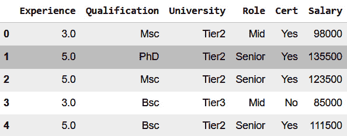

图 3.3 – 删除列后的 DataFrame 前五行

我们已成功删除了无关的列，现在可以继续使用 pandas 中的`isnull()`函数检查数据集中的缺失值：

```py
#check the data for any missing values
df.isnull().sum()
```

当我们运行这个代码块时，可以看到`University`和`Salary`列没有缺失值。然而，`Role`、`Cert`、`Qualification`和`Experience`列存在缺失值：

```py
Experience       2
Qualification    1
University       0
Role             3
Cert             2
Salary           0
dtype: int64
```

处理缺失值有多种方法——从简单地要求 HR 修复遗漏，到使用均值、中位数或众数进行简单的填补或替换。在这个案例研究中，我们将删除含有缺失值的行，因为它是我们数据的一个小子集：

```py
#drop the null values
df=df.dropna()
```

我们使用`dropna`函数删除数据集中的所有缺失值，然后将新的数据集保存为`df`。

注意

如果你想了解更多关于如何处理缺失值的内容，可以查看 Data Scholar 的这个播放列表：[`www.youtube.com/playlist?list=PLB9iiBW-oO9eMF45oEMB5pvC7fsqgQv7u`](https://www.youtube.com/playlist?list=PLB9iiBW-oO9eMF45oEMB5pvC7fsqgQv7u)。

现在，我们需要检查确保没有更多的缺失值，使用`isnull()`函数：

```py
#check for null values
df.isnull().sum()
```

运行代码，看看是否还有缺失值：

```py
Experience       0
Qualification    0
University       0
Role             0
Cert             0
Salary           0
dtype: int64
```

我们可以看到数据集中不再有缺失值。我们的模型要求输入数值型数据，才能对数据进行建模并预测目标变量，因此让我们来看看数据类型：

```py
df.dtypes
```

当我们运行代码时，我们会得到一个输出，显示不同的列及其数据类型：

```py
Experience       float64
Qualification     object
University        object
Role              object
Cert              object
Salary             int64
dtype: object
```

从输出中，我们可以看到`experience`和`salary`是数值型数据，因为它们分别是`float`和`int`类型，而`Qualification`、`University`、`Role`和`Cert`是分类数据。这意味着我们还不能训练模型；我们必须找到一种方法将分类数据转换为数值数据。幸运的是，这可以通过一个叫做独热编码（one-hot encoding）的过程来实现。我们可以使用 pandas 中的`get_dummies`函数来完成这一任务：

```py
#Converting categorical variables to numeric values
df = pd.get_dummies(df, drop_first=True)
df.head()
```

当我们运行代码时，我们将得到一个类似于*图 3.4*中显示的 DataFrame。我们使用`drop_first`参数来删除第一类。

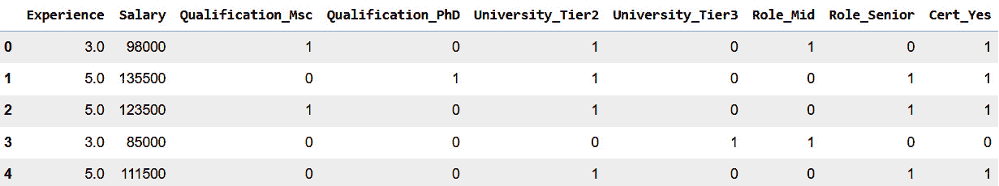

图 3.4 – 显示数值的 DataFrame

如果你不理解为什么我们删除了其中一个分类列，让我们来看一下`Cert`列，它由“是”或“否”值组成。如果我们进行了独热编码，但没有删除任何列，那么我们将有两个`Cert`列，如*图 3.5*所示。在`Cert_No`列中，如果员工有相关证书，该列的值为`0`，如果员工没有相关证书，该列的值为`1`。查看`Cert_Yes`列，我们可以看到，当员工有证书时，该列的值为`1`；否则，该列的值为`0`。

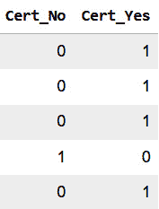

图 3.5 – 来自 Cert 列的虚拟变量

从*图 3.5*中，我们可以看到两列都可以用来显示员工是否有证书。使用从证书列生成的两个虚拟列会导致*虚拟变量陷阱*。当我们的独热编码列之间存在强相关性时，就会发生这种情况，其中一列可以有效地解释另一列。因此，我们说这两列是多重共线性的，而*多重共线性*可能导致模型过拟合。我们将在*第五章*中讨论更多关于过拟合的内容，标题为“使用神经网络进行图像分类”。

目前，我们知道过拟合是指我们的模型在训练数据上表现非常好，但在测试数据上表现不佳的情况。为了避免虚拟变量陷阱，我们将删除*图 3.5*中的一列。如果有三类，我们只需要两列就能捕捉到所有三类；如果有四类，我们只需要三列来捕捉所有四类，依此类推。因此，我们可以删除所有其他分类列的多余列。

现在，我们将使用`corr()`函数来获取我们精炼数据集的相关性：

```py
df.corr()
```

我们可以看到，薪资与工作经验年数之间存在强相关性。同时，`Role_Senior`与`Salary`之间也有较强的相关性，如*图 3.6*所示。

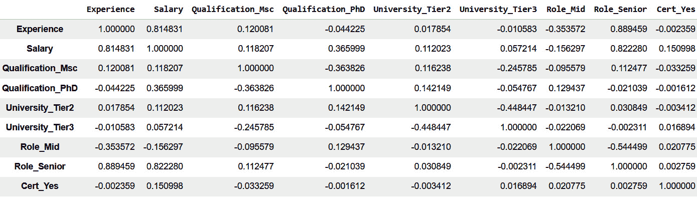

图 3.6 – 我们数据的相关性值

我们已经完成了任务的预处理阶段，至少目前是这样。我们已移除所有不相关的列；还通过删除缺失值的行来去除缺失值，最后使用独热编码将分类值转换为数值。需要注意的是，我们在这里跳过了一些**探索性数据分析**（**EDA**）步骤，例如可视化数据；虽然这些步骤很重要，但我们在考试中的核心重点是使用 TensorFlow 构建模型。在我们的 Colab 笔记本中，你会找到一些额外的 EDA 步骤；虽然它们与考试内容无关，但它们将帮助你更好地理解数据，并帮助你检测异常值。

现在，让我们进入建模阶段。

## 模型构建

要构建模型，我们必须将数据分为特征（`X`）和目标（`y`）。为此，我们将运行以下代码块：

```py
# We split the attributes and labels into X and y variables
X = df.drop("Salary", axis=1)
y = df["Salary"]
```

我们将使用`drop()`函数从`X`变量中删除`Salary`列，同时将`y`变量设为仅包含`Salary`列，因为这就是我们的目标变量。

在特征和目标变量定义清楚后，我们可以继续将数据分割为训练集和测试集。这一步很重要，因为它使我们的模型能够从数据中学习模式，从而有效地预测员工的薪资。为了实现这一点，我们使用训练集训练模型，然后在留出的测试集上评估模型的效果。我们在*第一章*《机器学习导论》中讨论过这一点，介绍了机器学习的生命周期。这是一个非常重要的过程，因为我们将使用测试集来评估模型的泛化能力，然后再将其部署到实际应用中。为了将数据分割为训练集和测试集，我们将使用`sklearn`库：

```py
X_train, X_test, y_train, y_test = train_test_split(X, y,
    test_size=0.2, random_state=10)
```

使用`sklearn`库中的`train_test_split`函数，我们将数据分割为训练集和测试集，测试集大小为`0.2`。我们设置`random_state = 10`以确保可重复性，这样每次使用相同的`random_state`值时，即使多次运行代码，也能得到相同的分割。例如，在我们的代码中，我们将`random_state`设置为`10`，这意味着每次运行代码时，我们都会得到相同的分割。如果我们将这个值从`10`改为`50`，那么我们的训练集和测试集就会得到不同的随机分割。在将数据分割为训练集和测试集时，设置`random_state`参数非常有用，因为它可以确保我们有效地比较不同的模型，因为我们在所有实验模型中使用的是相同的训练集和测试集。

在机器学习中建模数据时，通常使用 80%的数据来训练模型，剩下的 20%用来测试模型的泛化能力。这就是为什么我们将`test_size`设置为`0.2`来处理我们的数据集。现在我们已经准备就绪，我们将认真开始建模过程。当涉及使用 TensorFlow 构建模型时，有三个关键步骤，如*图 3**.7*所示 – 构建模型、编译模型和将其适应我们的数据。

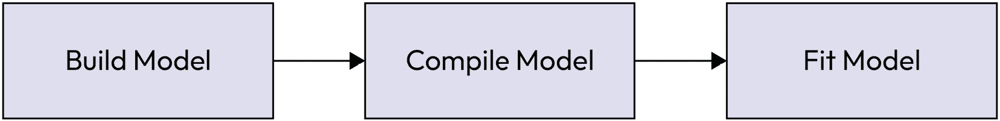

图 3.7 – 三步建模过程

让我们看看如何使用这种三步方法来构建我们的薪资预测模型。我们将从构建我们的模型开始：

```py
#create a model using the Keras API
Model_1 = Sequential([Dense(units=1, activation='linear',
    input_shape=[len(X_train.columns)])])
```

在*图 3**.8*中，我们可以看到我们模型的第一行代码。在这里，我们使用`Sequential`类作为数组生成单个层。`Sequential`类用于定义层。`Dense`函数用于生成一个全连接神经元层。在这种情况下，我们只有一个单元。在这里，我们使用线性激活函数作为激活函数。激活函数用于根据给定的输入或一组输入确定神经元的输出。在线性激活函数中，输出与输入直接相关。接下来，我们传入我们数据的输入形状，在这种情况下是 8，表示`X_train`中的数据特征（列）。

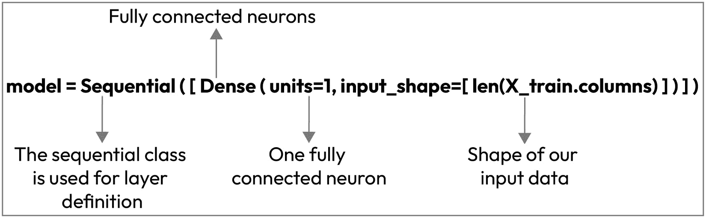

图 3.8 – 在 TensorFlow 中构建模型

在我们三步骤过程的第一步中，我们设计了模型结构。现在，我们将进入模型编译步骤。这一步同样重要，因为它决定了模型的学习方式。在这里，我们指定参数，如损失函数、优化器以及我们想要用来评估模型的指标。

优化器决定了我们的模型将如何根据损失函数和数据更新其内部参数。损失函数的作用是衡量模型在训练数据上的表现。然后，我们使用指标来监测模型在训练步骤和测试步骤上的性能。在这里，我们使用**随机梯度下降** (**SGD**) 作为我们的优化器，MAE 作为我们的损失和评估指标：

```py
#compile the model
Model_1.compile(loss=tf.keras.losses.mae,
    optimizer=tf.keras.optimizers.SGD(), metrics = ['mae'])
```

现在，我们只需用训练数据和相应的标签来喂养我们的模型，我们的模型就能学会智能地预测目标数值，这在我们的情况下是预期的薪水。每次模型进行预测时，损失函数都会比较模型预测与实际值之间的差异。这些信息传递给优化器，优化器利用信息进行改进预测，直到模型能够制定正确的数学方程以准确预测我们员工的薪水。

现在，让我们适应我们的训练模型：

```py
#Fit the model
model_1.fit(X_train, y_train, epochs =50)
```

我们使用`model_1.fit`来拟合我们的训练数据和标签，并将尝试的次数（代数）设置为`50`。只需几行代码，我们就生成了一个可以随着时间训练的迷你大脑，从而做出合理的预测。让我们运行代码，看看输出是什么样子的：

```py
Epoch 46/50
6/6 [==============================] - 0s 9ms/step - loss: 97378.0391 - mae: 97378.0391
Epoch 47/50
6/6 [==============================] - 0s 4ms/step - loss: 97377.2500 - mae: 97377.2500
Epoch 48/50
6/6 [==============================] - 0s 4ms/step - loss: 97376.4609 - mae: 97376.4609
Epoch 49/50
6/6 [==============================] - 0s 3ms/step - loss: 97375.6484 - mae: 97375.6484
Epoch 50/50
6/6 [==============================] - 0s 3ms/step - loss: 97374.8516 - mae: 97374.8516
```

我们展示了最后五次尝试（`46`–`50`代）。误差逐渐下降；然而，在`50`代后，我们仍然得到了一个非常大的误差。或许我们可以像在*第二章**《TensorFlow 简介》*中那样训练更多代数的模型，为什么不呢？

```py
#create a model using the Keras API
model_2 = Sequential([Dense(units=1, activation='linear',
    input_shape=[len(X_train.columns)])])
#compile the model
model_2.compile(loss=tf.keras.losses.mae,
    optimizer=tf.keras.optimizers.SGD(), metrics = ['mae'])
#Fit the model
history=model_2.fit(X_train, y_train, epochs =500)
```

现在，我们只需将代数改为`500`，使用我们的单层模型。激活函数、损失函数和优化器与我们的初始模型相同：

```py
Epoch 496/500
6/6 [==============================] - 0s 3ms/step - loss: 97014.8516 - mae: 97014.8516
Epoch 497/500
6/6 [==============================] - 0s 2ms/step - loss: 97014.0391 - mae: 97014.0391
Epoch 498/500
6/6 [==============================] - 0s 3ms/step - loss: 97013.2500 - mae: 97013.2500
Epoch 499/500
6/6 [==============================] - 0s 3ms/step - loss: 97012.4453 - mae: 97012.4453
Epoch 500/500
6/6 [==============================] - 0s 3ms/step - loss: 97011.6484 - mae: 97011.6484
```

从我们输出的最后五行中，我们可以看到在`500`代后，损失仍然相当高。你可以尝试让模型训练更长时间，看看它会有什么表现。可视化模型的损失曲线也是一个好主意，这样你可以看到它的表现。较低的损失意味着模型表现更好。考虑到这一点，让我们来探讨`model_2`的损失曲线：

```py
def visualize_model(history, ymin=None, ymax=None):
    # Lets visualize our model
    print(history.history.keys())
    # Lets plot the loss
    plt.plot(history.history['loss'])
    plt.title('Model loss')
    plt.ylabel('Loss')
    plt.xlabel('Number of epochs')
    plt.ylim([ymin,ymax]) # To zoom in on the y-axis
    plt.legend(['loss plot'], loc='upper right')
    plt.show()
```

我们将生成一个实用的绘图函数`visualize_model`，并在我们的实验中使用它来绘制模型在训练过程中随时间变化的损失。在这段代码中，我们生成一个图形来绘制存储在`history`对象中的损失值。`history`对象是我们三步建模过程中`fit`函数的输出，它包含了每个代结束时的损失和度量值。

为了绘制`model_2`，我们只需调用函数来可视化图表，并传入`history_2`：

```py
visualize_model(history_2)
```

当我们运行代码时，得到的图形如*图 3.9*所示：

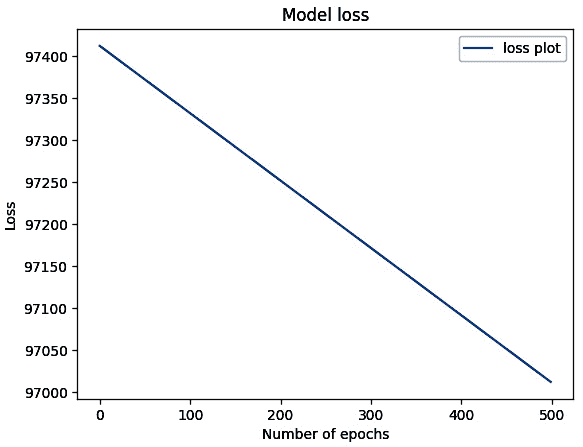

图 3.9 – 500 代的模型损失

从*图 3.9*中，我们可以看到损失在下降，但下降的速度太慢，因为它从大约**97400**下降到**97000**需要**500**代。在你有空时，可以尝试将模型训练 2000 代或更多。它将无法很好地泛化，因为这个模型太简单，无法处理我们数据的复杂性。在机器学习术语中，我们说这个模型是*欠拟合*的。

注：

使用 TensorFlow 构建模型主要有两种方式——顺序 API 和函数式 API。顺序 API 通过使用一系列层来构建模型，数据单向流动，从输入层到输出层，这是一种简单的方式。相反，TensorFlow 的函数式 API 允许我们构建更复杂的模型——这包括具有多个输入或输出的模型以及具有共享层的模型。在这里，我们使用的是顺序 API。有关使用顺序 API 构建模型的更多信息，请查看文档：[`www.tensorflow.org/guide/keras/sequential_model`](https://www.tensorflow.org/guide/keras/sequential_model)。

因此，让我们尝试构建一个更复杂的模型，看看能否比我们的初始模型更快地降低损失值：

```py
#Set random set
tf.random.set_seed(10)
#create a model
model_3 =Sequential([
    Dense(units=64, activation='relu',
    input_shape=[len(X_train.columns)]),
    Dense(units=1)
    ])
#compile the model
model_3.compile(loss="mae", optimizer="SGD",
    metrics = ['mae'])
#Fit the model
history_3 =model_3.fit(X_train, y_train, epochs=500)
```

在这里，我们生成了一个新模型。我们在单一神经元层上方堆叠了一个 64 神经元的层。我们还为这一层使用了**整流线性单元**（**ReLU**）激活函数；它的作用是帮助我们的模型学习数据中的更复杂模式，并提高计算效率。第二层是输出层，由一个神经元组成，因为我们在做回归任务（预测连续值）。让我们运行 500 个 epoch，看看是否会有所不同：

```py
Epoch 496/500
6/6 [==============================] - 0s 3ms/step - loss: 3651.6785 - mae: 3651.6785
Epoch 497/500
6/6 [==============================] - 0s 3ms/step - loss: 3647.4753 - mae: 3647.4753
Epoch 498/500
6/6 [==============================] - 0s 3ms/step - loss: 3722.4863 - mae: 3722.4863
Epoch 499/500
6/6 [==============================] - 0s 3ms/step - loss: 3570.9023 - mae: 3570.9023
Epoch 500/500
6/6 [==============================] - 0s 3ms/step - loss: 3686.0293 - mae: 3686.0293
```

从输出的最后五行来看，我们可以看到损失值显著下降，降到了大约`3686`。我们也来绘制一下损失曲线，以便更直观地理解。

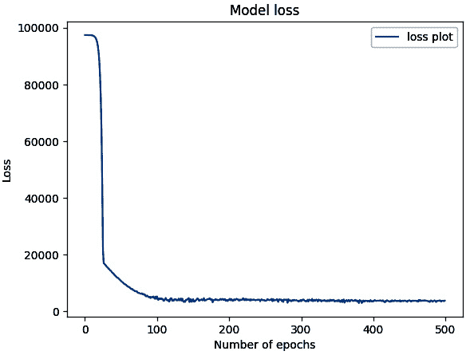

图 3.10 – 500 个 epoch 后的模型损失

在*图 3**.10*中，我们可以看到，模型的损失已经降到了我们记录的最低损失值以下。这与我们之前的模型相比，取得了巨大的进步。然而，这并不是理想的结果，也看起来不像我们希望呈现给 HR 团队的结果。这是因为，使用这个模型，如果某个员工的年薪是$50,000，模型可能会预测出大约$46,300 的薪水，这会让员工不高兴；或者预测出$53,700 的薪水，这样 HR 团队也不会高兴。所以，我们需要想办法改进我们的结果。

让我们放大图表，更好地理解我们的模型发生了什么。

```py
visualize_model(history_3, ymin=0, ymax=10000)
```

当我们运行代码时，它返回了*图 3**.11*所示的图表。

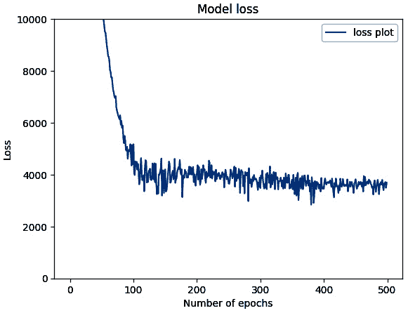

图 3.11 – 当我们放大图表时，500 个 epoch 后的模型损失

从*图 3**.11*中的图表，我们可以看到，损失值急剧下降并在第 100 个 epoch 左右稳定下来，之后似乎没有显著变化。因此，像我们之前的模型那样将模型训练得更长时间可能并不是最优的解决方案。那么，我们该如何改进我们的模型呢？

也许我们可以再添加一层？让我们试试，看看结果如何。正如我们最初指出的，我们的工作需要大量的实验；只有这样，我们才能学会如何做得更好、更快：

```py
#Set random set
tf.random.set_seed(10)
#create a model
model_4 =Sequential([
    Dense(units=64, activation='relu',
        input_shape=[len(X_train.columns)]),
    Dense(units=64, activation='relu'),
        Dense(units=1)
    ])
#compile the model
model_4.compile(loss="mae", optimizer="SGD",
    metrics = "mae")
#fit the model
history_4 =model_4.fit(X_train, y_train, epochs=500)
```

在这里，我们添加了一个`64`神经元的密集层。请注意，我们在这里也使用了 ReLU 作为激活函数：

```py
Epoch 496/500
6/6 [==============================] - 0s 3ms/step - loss: 97384.4141 - mae: 97384.4141
Epoch 497/500
6/6 [==============================] - 0s 3ms/step - loss: 97384.3516 - mae: 97384.3516
Epoch 498/500
6/6 [==============================] - 0s 3ms/step - loss: 97384.3047 - mae: 97384.3047
Epoch 499/500
6/6 [==============================] - 0s 3ms/step - loss: 97384.2422 - mae: 97384.2422
Epoch 500/500
6/6 [==============================] - 0s 3ms/step - loss: 97384.1797 - mae: 97384.1797
```

我们只展示最后五个训练周期，可以看到损失大约为`97384`，这比`model_3`中的结果要差。那么，我们如何知道在建模过程中使用多少层呢？答案是通过实验。我们通过试验和错误，并结合对结果的理解，来决定是否需要添加更多层，就像最初模型欠拟合时我们所做的那样。如果模型变得过于复杂，能够很好地掌握训练数据，但在我们的测试（留出）数据上无法很好地泛化，那么在机器学习术语中，它就被称为*过拟合*。

现在，我们已经尝试了更小和更大的模型，但仍然无法说我们已经达到了合适的结果，而人力资源经理也来询问我们在预测建模任务上取得了什么进展。到目前为止，我们做了一些研究，正如所有的机器学习工程师所做的那样，发现了一个非常重要的步骤，我们可以尝试。是什么步骤呢？让我们看看。

### 标准化

**标准化**是一种应用于输入特征的技术，确保它们具有一致的尺度，通常是在 0 和 1 之间。这个过程有助于我们的模型更快且更准确地收敛。值得注意的是，我们应该在完成其他数据预处理步骤后，如处理缺失值，才应用标准化。

了解改进模型输出的效果往往也强烈依赖于数据准备过程是一个很好的做法。因此，让我们在这里应用这一点。我们将暂时跳出模型构建的步骤，来看看在将所有列转换为数值后我们的特征数据：

```py
X.describe()
```

我们将使用 `describe` 函数来获取数据的关键信息。该信息显示，大多数列的最小值为 0，最大值为 1，但`Experience` 列的尺度不同，正如*图 3.12*所示：

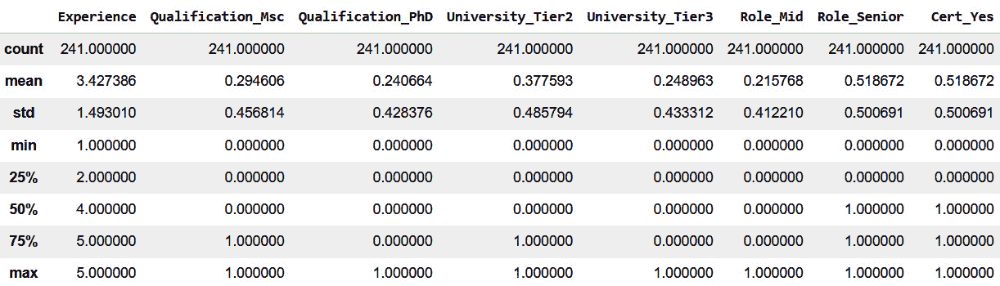

图 3.12 – 数据集的统计摘要（标准化前）

你可能会问，为什么这很重要？当我们数据的尺度不同，模型会不合理地给予数值较大的列更多的权重，这可能影响模型正确预测目标的能力。为了解决这个问题，我们将使用标准化方法，将数据缩放到 0 到 1 之间，从而使所有特征具有相同的尺度，给每个特征在模型学习它们与目标(`y`)之间关系时相等的机会。

为了标准化我们的数据，我们将使用以下公式进行缩放：

X norm = X − X min _ X max − X min

其中 `X` 是我们的数据，X min 是 `X` 的最小值，X max 是 `X` 的最大值。在我们的案例中，`Experience` 列的 `X` 最小值为 1，最大值为 7。好消息是，我们可以使用 `sklearn` 库中的 `MinMaxScaler` 函数轻松实现这一步骤。接下来，让我们看看如何缩放我们的数据：

```py
# create a scaler object
scaler = MinMaxScaler()
# fit and transform the data
X_norm = pd.DataFrame(scaler.fit_transform(X),
    columns=X.columns)
X_norm.describe()
```

让我们使用`describe()`函数再次查看关键统计数据，如*图 3.13*所示。

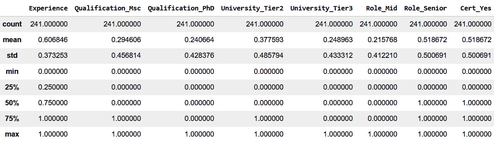

图 3.13 – 数据集的统计摘要（标准化后）

现在，我们所有的数据都具有相同的尺度。因此，我们通过几行代码成功地对数据进行了标准化。

现在，我们将数据分为训练集和测试集，但这次我们在代码中使用了标准化后的`X`（`X_norm`）：

```py
# Create training and test sets with the normalized data (X_norm)
X_train, X_test, y_train, y_test = train_test_split(X_norm,
    y,  test_size=0.2, random_state=10)
```

现在，我们使用从初始实验中获得的最佳模型（`model_3`）。让我们看看标准化后模型的表现：

```py
#create a model
model_5 =Sequential([
    Dense(units=64, activation='relu',
        input_shape=[len(X_train.columns)]),
    Dense(units=64, activation ="relu"),
        Dense(units=1)
    ])
#compile the model
model_5.compile(loss="mae",
    optimizer=tf.keras.optimizers.SGD(), metrics = ['mae'])
history_5 =model_5.fit(X_train, y_train, epochs=1000)
```

输出如下：

```py
Epoch 996/1000
6/6 [==============================] - 0s 4ms/step - loss: 1459.2953 - mae: 1459.2953
Epoch 997/1000
6/6 [==============================] - 0s 4ms/step - loss: 1437.8248 - mae: 1437.8248
Epoch 998/1000
6/6 [==============================] - 0s 3ms/step - loss: 1469.3732 - mae: 1469.3732
Epoch 999/1000
6/6 [==============================] - 0s 4ms/step - loss: 1433.6071 - mae: 1433.6071
Epoch 1000/1000
6/6 [==============================] - 0s 3ms/step - loss: 1432.2891 - mae: 1432.2891
```

从结果中，我们可以看到与未应用标准化时的结果相比，MAE 减少了一半以上。

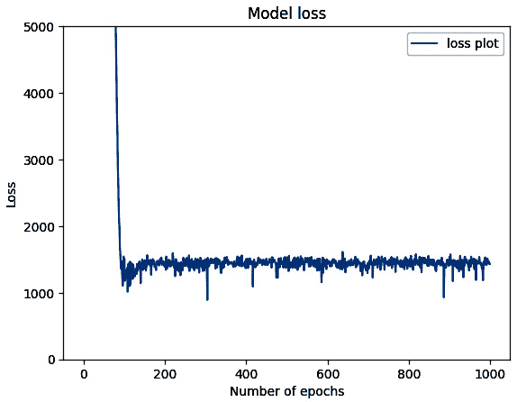

图 3.14 – model_5 的放大损失曲线

此外，如果你查看`model_5`在*图 3.14*中的损失曲线，你会发现损失在大约第 100 个 epoch 之后没有显著下降。与其猜测训练模型的理想 epoch 数，不如设置一个规则，当模型无法改进其性能时就停止训练。而且我们可以看到，`model_5`没有给出我们想要的结果；也许现在是尝试更大模型的好时机，我们可以训练更长时间，并设置一个规则，当模型无法改进其在训练数据上的性能时就停止训练：

```py
#create a model
model_6 =Sequential([
    Dense(units=64, activation='relu',
        input_shape=[len(X_train.columns)]),
        Dense(units=64, activation ="relu"), Dense(units=1)
    ])
#compile the model
model_6.compile(loss="mae",
    optimizer=tf.keras.optimizers.SGD(), metrics = ['mae'])
#fit the model
early_stop=keras.callbacks.EarlyStopping(monitor='loss',
    patience=10)
history_6 =model_6.fit(
    X_train, y_train, epochs=1000, callbacks=[early_stop])
```

在这里，我们使用了一个三层模型，前两层由 64 个神经元组成，输出层只有一个神经元。为了设置停止训练的规则，我们使用了*early stopping*；这个附加参数是在我们将模型拟合到数据时应用的，用来在模型损失在 10 个 epoch 后没有改善时停止训练。这是通过指定监控损失的度量并将`patience`设置为`10`来实现的。Early stopping 也是一种防止过拟合的好技术，因为它在模型无法改进时停止训练；我们将在*第六章*《改进模型》中进一步讨论这个问题。现在让我们看看结果：

```py
Epoch 25/1000
6/6 [==============================] - 0s 3ms/step - loss: 84910.6953 - mae: 84910.6953
Epoch 26/1000
6/6 [==============================] - 0s 3ms/step - loss: 81037.8516 - mae: 81037.8516
Epoch 27/1000
6/6 [==============================] - 0s 3ms/step - loss: 72761.0078 - mae: 72761.0078
Epoch 28/1000
6/6 [==============================] - 0s 3ms/step - loss: 81160.6562 - mae: 81160.6562
Epoch 29/1000
6/6 [==============================] - 0s 3ms/step - loss: 70687.3125 - mae: 70687.3125
```

尽管我们将训练设置为`1000`个 epoch，但由于`Earlystopping`回调在第 29 个 epoch 时停止了训练，因为它没有观察到损失值的显著下降。虽然这里的结果不是很好，但我们使用了`EarlyStopping`来节省了大量的计算资源和时间。也许现在是尝试不同优化器的好时机。对于下一个实验，我们使用 Adam 优化器。Adam 是深度学习中另一种流行的优化器，因为它能够自适应地控制模型中每个参数的学习率，从而加速模型的收敛：

```py
#create a model
model_7 =Sequential([
    Dense(units=64, activation='relu',
        input_shape=[len(X_train.columns)]),
    Dense(units=64, activation ="relu"),
    Dense(units=1)
    ])
#compile the model
model_7.compile(loss="mae", optimizer="Adam",
    metrics ="mae")
#fit the model
early_stop=keras.callbacks.EarlyStopping(monitor='loss',
    patience=10)
history_7 =model_7.fit(
    X_train, y_train, epochs=1000, callbacks=[early_stop])
```

注意，我们在编译步骤中只更改了优化器为 Adam。让我们看看这个优化器变化的结果：

```py
Epoch 897/1000
6/6 [==============================] - 0s 4ms/step - loss: 30.4748 - mae: 30.4748
Epoch 898/1000
6/6 [==============================] - 0s 4ms/step - loss: 19.4643 - mae: 19.4643
Epoch 899/1000
6/6 [==============================] - 0s 3ms/step - loss: 17.0965 - mae: 17.0965
Epoch 900/1000
6/6 [==============================] - 0s 3ms/step - loss: 18.5009 - mae: 18.5009
Epoch 901/1000
6/6 [==============================] - 0s 3ms/step - loss: 15.5516 - mae: 15.5516
```

仅通过更换优化器，我们记录到了损失值的惊人下降。同时，注意我们并未使用全部`1000`个 epoch，因为训练在`901`个 epoch 时就结束了。让我们再添加一层，或许会看到更好的表现：

```py
#create a model
model_8 =Sequential([
    Dense(units=64, activation='relu',
        input_shape=[len(X_train.columns)]),
    Dense(units=64, activation ="relu"),
    Dense(units=64, activation ="relu"),
    Dense(units=1)
    ])
#compile the model
model_8.compile(loss="mae", optimizer="Adam",
    metrics ="mae")
#fit the model
early_stop=keras.callbacks.EarlyStopping(monitor='loss',
    patience=10)
history_8 =model_8.fit(
    X_train, y_train, epochs=1000, callbacks=[early_stop])
```

在这里，我们添加了一个额外的层，包含`64`个神经元，并使用 ReLU 作为激活函数。其他部分保持不变：

```py
Epoch 266/1000
6/6 [==============================] - 0s 4ms/step - loss: 73.3237 - mae: 73.3237
Epoch 267/1000
6/6 [==============================] - 0s 4ms/step - loss: 113.9100 - mae: 113.9100
Epoch 268/1000
6/6 [==============================] - 0s 4ms/step - loss: 257.4851 - mae: 257.4851
Epoch 269/1000
6/6 [==============================] - 0s 4ms/step - loss: 149.9819 - mae: 149.9819
Epoch 270/1000
6/6 [==============================] - 0s 4ms/step - loss: 179.7796 - mae: 179.7796
```

训练在 270 个 epoch 后停止；尽管我们的模型更复杂，但在训练中它并未表现得比`model_7`更好。在实验过程中，我们尝试了不同的思路，现在让我们在测试集上尝试所有八个模型并进行评估。

## 模型评估

为了评估我们的模型，我们将编写一个函数，将`evaluate`指标应用于所有八个模型：

```py
def eval_testing(model):
    return model.evaluate(X_test, y_test)
models = [model_1, model_2, model_3, model_4, model_5,
    model_6, model_7, model_8]
for x in models:
    eval_testing(x)
```

我们将生成一个`eval_testing(model)`函数，该函数以模型作为参数，并使用`evaluate`方法来评估模型在我们的测试数据集上的表现。遍历模型列表时，代码将返回所有八个模型在测试数据上的损失和 MAE 值：

```py
2/2 [==============================] - 0s 8ms/step - loss: 100682.4609 - mae: 100682.4609
2/2 [==============================] - 0s 8ms/step - loss: 100567.9453 - mae: 100567.9453
2/2 [==============================] - 0s 10ms/step - loss: 17986.0801 - mae: 17986.0801
2/2 [==============================] - 0s 9ms/step - loss: 100664.0781 - mae: 100664.0781
2/2 [==============================] - 0s 6ms/step - loss: 1971.4187 - mae: 1971.4187
2/2 [==============================] - 0s 11ms/step - loss: 5831.1250 - mae: 5831.1250
2/2 [==============================] - 0s 7ms/step - loss: 5.0099 - mae: 5.0099
2/2 [==============================] - 0s 26ms/step - loss: 70.2970 - mae: 70.2970
```

在评估完模型后，我们可以看到`model_7`的损失最小。让我们看看它在测试集上的表现，使用它来进行预测。

## 进行预测

现在，我们完成了实验并评估了模型，让我们使用`model_7`来预测我们的测试集薪资，并查看它与真实值的对比。为此，我们将使用`predict()`函数：

```py
#Let's make predictions on our test data
y_preds=model_7.predict(X_test).flatten()
y_preds
```

运行完这段代码后，我们会得到如下所示的数组输出：

```py
2/2 [==============================] - 0s 9ms/step
array([ 64498.64 , 131504.89 , 116491.73 ,  72500.13 , 102983.836,
        60504.645,  84503.36 , 119501.664, 112497.734,  63501.168,
        77994.87 ,  84497.16 , 112497.734,  90980.625,  87499.88 ,
       100502.234, 135498.88 , 112491.53 , 119501.664, 131504.89 ,
       108990.31 , 117506.63 ,  80503.16 , 123495.66 , 112497.734,
       117506.63 , 111994.03 ,  78985.125, 135498.88 , 129502.125,
       117506.64 , 119501.664, 100502.234, 113506.43 , 101987.38 ,
       113506.43 ,  93990.555,  65496.2  ,  61494.906, 107506.17 ,
       105993.77 , 106502.5  ,  72493.94 , 135498.88 ,  67501.37 ,
       107506.17 , 117506.63 ,  70505.1  ,  57500.906], dtype=float32)
```

为了清晰起见，我们将构建一个包含模型预测值和真实值的 DataFrame。当你看到我们的模型变得如此优秀时，这应该会非常有趣，甚至有些神奇：

```py
#Let's make a DataFrame to compare our prediction with the ground truth
df_predictions = pd.DataFrame({'Ground_Truth': y_test, 
    'Model_prediction': y_preds}, columns=['Ground_Truth', 
    'Model_prediction']) df_predictions[
    'Model_prediction']= df_predictions[
    'Model_prediction'].astype(int)
```

在这里，我们生成了两列，并将模型的预测值从`float`转换为`int`，以便与真实值对齐。准备好查看结果了吗？

我们将使用`head`函数打印出测试集的前 10 个值：

```py
#Let's look at the top 10 data points in the test set
df_predictions.sample(10)
```

然后我们会看到如下所示的结果，如*图 3.15*所示：

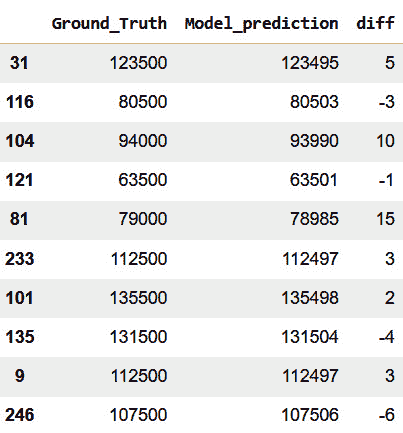

图 3.15 – 一个显示实际值、模型预测值和剩余值的 DataFrame

我们的模型取得了令人印象深刻的成果；它与测试数据中的初始薪资非常接近。现在，你可以向人力资源经理展示你的惊人成果了。我们必须保存模型，以便随时加载并进行预测。接下来，我们将学习如何做到这一点。

## 保存和加载模型

TensorFlow 的魅力在于我们能够轻松完成复杂的任务。要保存模型，我们只需要一行代码：

```py
#Saving the model in one line of code
Model7.save('salarypredictor.h5')
#Alternate method is
#model7.save('salarypredictor')
```

你可以将它保存为`your_model.h5`或`your_model`，两者都可以。TensorFlow 推荐使用`SavedModel`格式，因为它是语言无关的，这使得它可以轻松部署到各种平台上。在这种格式下，我们可以保存模型及其各个组件，如权重和变量。相反，HDF5 格式将完整的模型结构、权重和训练配置保存为一个文件。这种方法给我们提供了更大的灵活性来共享和分发模型；然而，在部署方面，它不是首选方法。当我们运行代码时，我们可以在 Colab 笔记本的左侧面板中看到保存的模型，如*图 3.16*所示。

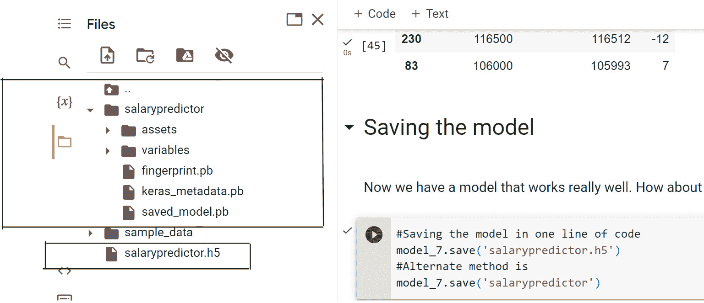

图 3.16 – 我们保存的模型快照

既然我们已经保存了模型，最好通过重新加载它并进行测试来验证它。我们来做一下这个操作。而且，加载模型只需要一行代码：

```py
#loading the model
saved_model =tf.keras.models.load_model("/content/salarypredictor.h5")
```

让我们试试我们的`saved_model`，看看它是否能像`model_7`一样有效。我们将重新生成`y_pred`并生成一个数据框，使用`y_test`和`y_pred`，就像我们之前做的那样，首先检查我们测试数据中的 10 个随机样本：

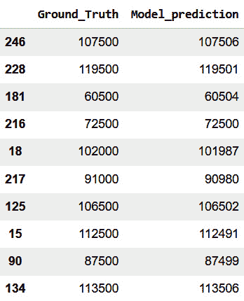

图 3.17 – 显示实际值和保存的模型预测值的数据框

从*图 3.17*的结果中，我们可以看到我们保存的模型表现得非常好。现在，你可以将结果交给人力资源经理，他们应该会对你的结果感到兴奋。假设人力资源经理希望你使用你的模型来预测新员工的薪资，我们接下来就来做这个：

```py
#Putting everything into a function for our big task
def salary_predictor(df):
    df_hires= df.drop(columns=['Name', 'Phone_Number',
        'Date_Of_Birth' ])
    df_hires = pd.get_dummies(df_hires, drop_first=True)
    X_norm = pd.DataFrame(scaler.fit_transform(df_hires),
        columns=df.columns)
    y_preds=saved_model.predict(X_norm).flatten()
    df_predictions = pd.DataFrame({ 'Model_prediction':
        y_preds}, columns=[ 'Model_prediction'])
    df_predictions['Model_prediction']= df_predictions[
        'Model_prediction'].astype(int)
    df['Salary']=df_predictions['Model_prediction']
    return df
```

我们使用保存的模型生成一个函数。我们只需将到目前为止所覆盖的所有步骤封装到这个函数中，然后返回一个数据框。现在，让我们读取新员工的数据：

```py
#Load the data
df_new=pd.read_csv('https://raw.githubusercontent.com/oluwole-packt/datasets/main/new_hires.csv')
df_new
```

当我们运行代码块时，我们可以看到它们的数据框，如*图 3.18*所示。


图 3.18 – 显示新员工的数据框

现在，我们将数据传入我们生成的函数，获取新员工的预测薪资：

```py
#Lets see how much
salary_predictor(df_new)
```

我们将`df_new`传入薪资预测函数，然后得到一个新的数据框，如*图 3.19*所示：


图 3.19 – 显示新员工及其预测薪资的数据框

最终，我们达成了目标。人力资源部门很高兴，新员工也很高兴，公司里的每个人都觉得你是个魔术师。也许加薪提案会摆上桌面，但就在你陶醉于第一次成功的喜悦时，经理带着另一个任务回来。这次是一个分类任务，我们将在下一章讨论这个任务。现在，干得好！

# 总结

在本章中，我们深入研究了监督学习，重点是回归建模。在这里，我们讨论了简单线性回归和多重线性回归的区别，并了解了一些重要的回归建模评估指标。接着，我们在案例研究中动手帮助公司构建了一个有效的回归模型，用于预测新员工的薪资。我们进行了数据预处理，并认识到在建模过程中标准化的重要性。

在案例研究的最后，我们成功构建了一个薪资预测模型，并在测试集上评估了该模型，掌握了如何保存和加载模型以供后续使用。现在，您可以自信地使用 TensorFlow 构建回归模型。

在下一章，我们将探讨分类建模。

# 问题

让我们测试一下本章所学的内容。

1.  什么是线性回归？

1.  简单线性回归和多重线性回归有什么区别？

1.  哪个评估指标会惩罚回归模型中的大误差？

1.  使用薪资数据集预测薪资。

# 进一步阅读

若要了解更多，您可以查看以下资源：

+   Amr, T., 2020\. *使用 scikit-learn 和科学 Python 工具包进行实践机器学习*。[S.l.]：Packt 出版社。

+   Raschka, S. 和 Mirjalili, V., 2019\. *Python 机器学习*。 第 3 版。Packt 出版社。

+   *TensorFlow* *文档*：[`www.TensorFlow.org/guide`](https://www.TensorFlow.org/guide)。
