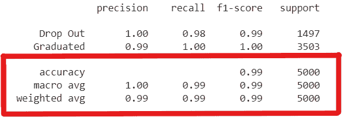

# 第四章：使用 TensorFlow 进行分类

在上一章中，我们讲解了 TensorFlow 中的线性回归，其中我们讨论了简单线性回归和多元线性回归；同时我们还探索了评估回归模型的各种指标。我们以一个实际用例结束了这一章，其中我们构建了一个薪资预测模型，并使用该模型根据一组特征预测新员工的薪资。在本章中，我们将继续使用 TensorFlow 进行建模——这一次，我们将探索使用 TensorFlow 进行分类问题的处理。

我们将从分类建模的概念开始，然后探讨分类建模的各种评估指标，以及如何将它们应用于不同的用例。我们将讨论二分类、多分类和多标签分类建模。最后，我们将通过一个案例研究，实践我们所学的知识，构建一个二分类模型来预测学生是否会辍学。

到本章结束时，你应该清楚地理解机器学习中的分类建模是什么，并且能够区分二分类、多分类和多标签分类问题。你将熟悉如何构建、编译、训练、预测和评估分类模型。

在本章中，我们将讨论以下主题：

+   使用 TensorFlow 进行分类

+   学生辍学预测

# 技术要求

在本章中，我们将使用 Google Colab 来运行编码练习，你需要安装 Python >= 3.8.0，并安装以下包，使用 `pip` `install` 命令进行安装：

+   `tensorflow >=` `2.7.0`

+   `tensorflow-datasets ==` `4.4.0`

+   `Pillow ==` `8.4.0`

+   `pandas ==` `1.3.4`

+   `numpy ==` `1.21.4`

+   `scipy ==` `1.7.3`

本书的代码包可通过以下 GitHub 链接获取：[`github.com/PacktPublishing/TensorFlow-Developer-Certificate`](https://github.com/PacktPublishing/TensorFlow-Developer-Certificate)。所有练习的解决方案也可以在该链接中找到。

# 使用 TensorFlow 进行分类

在*第一章*，*机器学习简介*中，我们讨论了监督学习，并简要介绍了分类建模。分类建模涉及预测目标变量中的类别。当我们试图预测的类别是二分类时（例如，预测宠物是狗还是猫，邮件是否为垃圾邮件，或病人是否患有癌症），这种分类场景被称为**二分类**。

另一方面，我们可能面临这样的问题，我们想要构建一个机器学习模型来预测不同品种的狗。在这种情况下，我们有多个类别，因此这种类型的分类被称为**多类分类**。就像二元分类问题一样，在多类分类中，我们的目标变量只能属于多个类别中的一个 – 我们的模型将选择斗牛犬、德国牧羊犬或斗牛犬。在这里，类别是*互斥的*。

想象一下，你正在构建一个电影分类器，你想要分类一部如*复仇者联盟：终局之战*这样的大片。这部电影属于动作、冒险、超级英雄、史诗、奇幻和科幻类别。从电影的标签中，我们可以看到我们的目标变量属于多个流派；因此，这种类型的分类被称为**多标签分类**，其中输出类别有多个目标标签。

不像多类分类，每个例子只能属于一个类别，而在多标签分类中，每个例子可以属于多个标签。

不像二元和多类分类，每个例子只能属于一个类别，在多标签分类中，每个例子可以属于多个类别，就像*复仇者联盟*电影一样。现在我们已经看过三种主要的分类问题类型，下一个问题是，我们如何评估分类模型？我们需要关注哪些关键指标？现在让我们来看一下并理解它们的含义以及如何最好地应用它们到各种分类问题中。

## 评估分类模型

与回归问题不同，在回归模型中，我们的目标变量是数值型的，而在分类建模中，我们已经确定输出是类别。因此，我们不能使用用于评估回归模型的相同指标在*第三章*，*TensorFlow 中的线性回归*中使用，因为我们的输出不是连续的数值，而是类别。对于分类问题，比如我们建立一个垃圾邮件过滤系统来分类客户的电子邮件。客户有 250 封非垃圾邮件和另外 250 封垃圾邮件。使用我们的垃圾邮件过滤模型，我们能够正确标记 230 封垃圾邮件并且正确识别 220 封非垃圾邮件。

当我们的垃圾邮件过滤器正确将一个垃圾邮件标记为垃圾邮件（这正是我们想要的），我们称之为**真正例**；当模型错误地将一个垃圾邮件误分类为非垃圾邮件时，这被称为**假负例**。在模型正确将非垃圾邮件识别为非垃圾邮件的情况下，这称为**真负例**；然而，我们偶尔会在我们的垃圾邮件文件夹中找到重要的邮件，这些邮件在被错误地归类为垃圾邮件时并不是垃圾。这种情况被称为**假正例**。现在我们可以使用这些细节来评估我们的垃圾邮件过滤模型的性能。

让我们列出我们现在知道的重要细节：

+   **垃圾邮件总数**：250 个样本

+   **正确预测的垃圾邮件（真正例）**：230 个样本

+   **错误预测的垃圾邮件（假阴性或类型 2 错误）**：20 个样本

+   **非垃圾邮件总数**：250 个样本

+   **正确预测的非垃圾邮件（真负例）**：220 个样本

+   **错误预测的垃圾邮件（假阳性或类型 1 错误）**：30 个样本

现在我们已经收集了关键细节，接下来让我们使用这些信息来学习如何评估分类模型。为此，我们接下来将讨论混淆矩阵。

## 混淆矩阵

**混淆矩阵**是一个错误矩阵，它以表格形式展示分类模型的表现，包含真实值和预测值，如*图 4.1*所示。


图 4.1 – 混淆矩阵

使用混淆矩阵，我们可以计算各种分类评估指标，如准确率、精确度、召回率和 F1 分数。在混淆矩阵中，我们可以看到预测类别位于顶部，第一列显示预测为垃圾邮件的邮件，第二列显示预测为非垃圾邮件的邮件，而行则展示真实值。在这里，我们可以看到第一行显示的是真实的垃圾邮件类别和真实的非垃圾邮件类别。当我们将所有这些信息整合在一起时，我们可以以表格的形式看到真实值和错误预测，这为我们提供了模型及其在两类之间的表现的快速视图。让我们使用这些细节来计算模型的关键性能指标。

**准确率**是非常直观的，它是正确预测标签的总和与可用数据总数之比。我们可以用以下方程式表示：

准确率 =  TP + TN  _______________  (TP + FP + TN + FN)

让我们添加我们的数值，看看我们的准确率是多少：

准确率 =  230 + 220   ________________  (230 + 30 + 220 + 20)  = 0.90

我们得到了 90%的准确率。这可能令人兴奋，但让我们用更现实的数据来看待它。当涉及到垃圾邮件时，我们的邮箱中可能会收到更多合法邮件，而不是垃圾邮件。

假设我们有另一个客户 B，拥有 500 封邮件，具体细节如下：

+   **垃圾邮件总数**：40 个样本

+   **正确预测的垃圾邮件（真正例）**：20 个样本

+   **错误预测的垃圾邮件（假阴性或类型 2 错误）**：20 个样本

+   **非垃圾邮件总数**：460 个样本

+   **正确预测的非垃圾邮件（真负例）**：430 个样本

+   **错误预测的垃圾邮件（假阳性或类型 1 错误）**：30 个样本

如果我们计算客户 B 的准确率，结果为：

准确率 =  20 + 430   ______________  20 + 30 + 430 + 20  = 0.90

再次计算，我们得到了 90%的准确率，但模型只能将 50%的垃圾邮件正确预测为垃圾邮件。这表明，准确率可能并不是最佳的衡量标准，尤其是在处理像电子邮件分类、欺诈检测或疾病检测这类不平衡数据的使用案例时。

为了更好地了解我们的模型表现，我们现在将关注精确度和召回率。回顾*图 4.2*，实际正类与正类的比例被称为*敏感性*或*召回率*，在机器学习术语中也称为*真实正例率*，它通过以下公式表示：

召回率 =  TP _ (TP + FN)

*精确度*是模型预测的正类与实际正类的比例，我们也可以用一个公式表示它：

精确度 =  TP _ (TP + FP)

使用客户 B，我们来计算模型的精确度和召回率：

案例研究 2 的精确度 =  20 _ (20 + 30)  = 0.4

案例研究 2 的召回率 =  20 _ (20 + 20)  = 0.5

现在，我们可以看到尽管模型在整体数据上的准确率较高，但其表现却不尽如人意。另一个我们会遇到的重要指标是 F1 分数。*F1 分数*结合了召回率和精确度，我们通过计算精确度和召回率的调和均值来得到它：

F1 分数 = 2 *  精确度 * 召回率  _____________  (精确度 + 召回率)

我们来计算第二个案例研究的 F1 分数：

F1 分数 = 2 *  0.4 * 0.5 _ (0.4 + 0.5)  = 0.44

通过使用我们的垃圾邮件过滤模型评估客户 B 的电子邮件，我们现在知道需要构建一个更有效的模型，一个对目标类别具有更高精确度和召回率的模型。然而，达到高精确度和召回率并非总是可能的。在这种情况下，我们面临一个权衡，这就是所谓的*精确度/召回率权衡*。在检测垃圾邮件的情况下，我们知道如果一些垃圾邮件进入收件箱，客户不太可能换用其他服务提供商；然而，如果他们未能在收件箱中找到重要邮件，他们会感到不满。在这种情况下，我们将致力于实现更高的召回率。相反，假设我们构建了一个早期癌症检测系统，重点将放在提高精确度，以减少假阳性。需要注意的是，精确度和召回率并非互斥的，在许多情况下，我们可以通过调优模型来同时实现高精确度和高召回率。

我们现在已经涵盖了一些重要的分类指标。接下来，我们来看一个案例研究（学生辍学预测），在其中我们将使用 TensorFlow 和 scikit-learn 的不同模块来构建和评估分类模型。让我们开始吧。

# 学生辍学预测

在*第三章*《使用 TensorFlow 进行线性回归》中，你开始使用 TensorFlow 构建薪资预测模型的旅程。你的老板印象深刻，现在你已经完全融入数据团队，经理希望你为一个新客户工作。你的任务是帮助他们构建一个模型，预测学生是否会辍学，这将帮助他们支持这些学生，从而防止他们辍学。经理已经授权你，并且这个任务现在属于你。为了完成这个任务，客户向你提供了历史数据。就像在*第三章*《使用 TensorFlow 进行线性回归》中一样，你与客户进行了富有成效的交流，并将任务识别为一个二分类问题。让我们打开 GitHub 仓库中标记为`Classification with TensorFlow`的笔记本，开始吧。

## 加载数据

让我们从加载客户提供的历史数据开始：

1.  我们将首先导入用于执行任务的 TensorFlow 库：

    ```py
    # import tensorflow
    
    import tensorflow as tf
    
    from tensorflow import keras
    
    from tensorflow.keras import Sequential
    
    from tensorflow.keras.layers import Dense
    
    print(tf.__version__)
    ```

运行代码后，我们可以看到将使用的 TensorFlow 版本。在我写这篇文章时，它是 2.8.0。你很可能会有一个更新的版本，但它应该同样可以正常工作：

```py
2.8.0
```

1.  然后，我们将导入一些额外的库，帮助我们简化工作流程。

    ```py
    #import additional libraries
    
    import numpy as np
    
    import pandas as pd
    
    # For visualizations
    
    import matplotlib.pyplot as plt
    
    import seaborn as sns
    
    #for splitting the data into training and test set
    
    from sklearn.model_selection import train_test_split
    
    # For Normalization
    
    from sklearn.preprocessing import MinMaxScaler
    
    # Confusion matrix
    
    from sklearn.metrics import confusion_matrix, classification_report
    ```

我们之前讨论过大部分将在这里使用的库，除了代码块的最后一行，它将用来从 scikit-learn 库中导入混淆矩阵和分类报告。我们将使用这些函数来评估模型的性能。如果你不清楚其他库的用法，可以参考*第三章*《使用 TensorFlow 进行线性回归》来了解，之后再继续本案例的学习。

1.  现在我们已经加载了所有必要的库，让我们创建一个 DataFrame 以便于处理：

    ```py
    #Loading data from the course GitHub repository
    
    df=pd.read_csv('https://raw.githubusercontent.com/PacktPublishing/TensorFlow-Developer-Certificate/main/Chapter%204/Students-Dropout-Prediction.csv', index_col=0)
    
    df.head()
    ```

当我们运行代码时，如果一切正常，应该会显示数据集的前五行。


图 4.2 – 显示数据集前五行的 DataFrame

从输出中，我们可以看到数据由数值型和类别型列组成。每一行代表一个学生。经过检查，我们发现有 12 列，分别是：`学生 ID`、`学生姓名`、`图书馆`、`资源`、`财务`、`奖学金`、`学习时间`、`学习小组`、`GPA`、`测试`、`作业`、`毕业`。为了高效地建模我们的数据，我们需要进行一些数据准备工作，因此让我们开始一些探索性数据分析，看看能发现什么。

## 探索性数据分析

执行以下步骤以探索和分析数据：

1.  我们将使用`df.info()`函数开始探索性数据分析过程，以检查数据集中的`NULL`值以及数据类型，如*图 4.3*所示。


图 4.3 – 我们数据集的信息

好消息是，我们的数据集没有缺失值，是的，我们将处理一个比回归任务中更大的数据集。在这里，我们有 25,000 个数据点，代表从大学收集的学生数据。

1.  下一步是删除无关的列。通过检查可用的列，我们删除了`学生 ID`和`学生姓名`列，因为这些列对学生是否毕业没有影响。我们在这里使用 pandas 的`drop`函数来完成这一操作：

    ```py
    df = df.drop(['Student ID', 'Student Name'], axis=1)
    ```

1.  接下来，让我们使用`describe`函数生成数据集的关键统计信息，因为这将帮助我们了解数据集的情况，如*图 4.4*所示。


图 4.4 – 数值列的摘要统计

从*图 4.4*中，我们可以看到平均 GPA 为`3.00`，最低 GPA 为`1.00`，最高 GPA 为`5.00`。`测试`和`作业`列的最低分为 5，最高分为 15。然而，我们对目标列的分布没有明确的了解，因为它是一个分类列；我们稍后会解决这个问题。

1.  现在，让我们为分类目标变量绘制一个直方图：

    ```py
    plt.hist(df['Graduated'])
    
    plt.show()
    ```

运行这段代码会生成*图 4.5*所示的图表。在这里，我们使用`matplotlib`绘制`毕业`列，结果显示大约有 17,500 名成功毕业的学生，而大约有 7,500 名未能毕业的学生。当然，合理的预期是更多的学生会毕业。从机器学习的角度来看，我们处理的是一个不平衡的数据集。然而，幸运的是，我们仍然拥有足够的样本来训练来自少数类的模型。无论如何，不要只听我的话；稍后，我们将在完成数据准备步骤后训练我们的模型。


图 4.5 – 数值列的摘要统计

1.  我们的笔记本中还有更多图表可以探索，但我们会保持简洁，因为本书的主要目标是专注于使用 TensorFlow 构建模型。不过，让我们看一下一个非常重要的图表：

    ```py
    sns.set(style="darkgrid")
    
    tdc =sns.scatterplot(x ='Library', y ='GPA',
    
        data = df, hue ='Graduated')
    
    tdc.legend(loc='center left',
    
        bbox_to_anchor=(1.0, 0.5), ncol=1)
    ```

在这里，我们使用`seaborn`绘制一个散点图，显示`图书馆`列在`x`轴上，`GPA`在`y`轴上，并使用`毕业`列来为数据点着色，如*图 4.6*所示。


图 4.6 – 图书馆与 GPA

从这个图表中，我们可以看到有相当一部分 GPA 高于 3.50 的学生已经毕业。然而，不要认为在`平均`、`良好`和`优秀`列中，所有 GPA 高于 3.50 的学生都已经毕业。事实上，让我们来验证一下：

```py
#To get the number of students with gpa equal to or greater than 3.5 and did not graduate
len(df[(df['GPA']>=3.50)&(df['Graduated']=="Drop out")])
```

当我们运行这段代码时，它返回了 GPA 在 3.50 及以上且辍学的学生总数。总共有 76 名辍学学生。记住，我们的图表覆盖了 25,000 个数据点，所以如果你在*图 4.6*的图中没有找到这些数据点，不要惊讶。

现在，让我们继续准备数据进行建模。

## 数据预处理

在*第三章*，《使用 TensorFlow 的线性回归》中，我们强调了将数据放入正确形式、处理缺失数据、删除不相关特征、将分类值转换为数值型等的必要性。我们将在这里继续沿着这个思路进行：

1.  让我们从将标签转换为数值型开始：

    ```py
    #Replace the classes in the graduate column
    
    df['Graduated'] = df['Graduated'].replace(
    
        ['Graduated', 'Drop out'],[1,0])
    ```

在这里，我们将值为`1`赋给毕业的学生，将值为`0`赋给辍学的学生。

1.  现在，让我们使用`corr()`函数检查我们的数值数据与目标变量之间的相关性：

    ```py
    df.corr()
    ```

当我们运行代码时，我们会得到*图 4.7*所示的相关性表。


图 4.7 – 我们数据集的相关性表

从高亮的列中，我们可以看到`GPA`与`Graduated`列的相关性最强。

1.  现在，让我们将分类变量转换为数值型变量。我们将继续使用虚拟变量（dummy variables）对分类变量进行独热编码（one-hot encoding）：

    ```py
    #Converting categorical variables to numeric values
    
    df = pd.get_dummies(df, drop_first=True)
    
    df.head()
    ```

在这里，我们删除了第一列，以避免虚拟变量陷阱。当我们运行代码时，我们会得到一个新的 DataFrame，如*图 4.8*所示。


图 4.8 – 独热编码后的 DataFrame

1.  现在，我们已经将特征转化为数值形式，接下来让我们看看它们与目标变量的相关性：

    ```py
    tagret_corr= df.corr()
    
    tagret_corr
    
    tagret_corr['Graduated'].sort_values(ascending=False)
    ```

一旦运行代码，它会返回所有列与目标变量的相关性，如*图 4.9*所示。我们的初始数值变量仍然是相关性最高的变量。


图 4.9 – 特征与目标列的相关性

1.  我们已经成功将数据转换为数值型变量，接下来我们将数据拆分为特征（`X`）和目标变量（`y`）：

    ```py
    # We split the attributes and labels into X and y variables
    
    X = df.drop("Graduated", axis=1)
    
    y = df["Graduated"]
    ```

1.  别忘了，我们需要对数据进行归一化处理。因此，我们将所有特征缩放到相同的尺度，以便于建模过程：

    ```py
    # create a scaler object
    
    scaler = MinMaxScaler()
    
    # fit and transform the data
    
    X_norm = pd.DataFrame(scaler.fit_transform(X),
    
        columns=X.columns)
    
    X_norm.head()
    ```

同样，我们使用来自 scikit-learn 库的`MinMaxScaler`，然后将数据分为训练集和测试集。在训练中，我们使用 80% 的数据，保留 20% 作为测试数据，以测试模型的泛化能力。我们设置随机种子为 10，以确保能够复现相同的数据划分：

```py
# Create training and test sets
#We set the random state to ensure reproducibility
X_train, X_test, y_train, y_test =   train_test_split(
    X_norm, test_size=0.2, random_state=10)
```

数据准备工作已经完成，让我们继续用 TensorFlow 构建模型。

## 模型构建

为了构建我们的模型，我们将首先创建一个神经网络架构；在这里，我们将使用顺序 API 来定义我们希望顺序连接的层数。如*图 4.10*所示，我们只有输入层和输出层。与在*第三章*《使用 TensorFlow 进行线性回归》中预测数值不同，我们的输出层只有一个神经元，因为我们正在处理一个二分类问题。对于输出层，所使用的激活函数取决于当前的任务。当我们处理二分类任务时，通常使用*sigmoid 激活函数*；对于多分类问题，我们通常使用*softmax 激活函数*；而在处理多标签分类问题时，我们通常使用 sigmoid 作为激活函数。


图 4.10 – 在 TensorFlow 中创建分类模型

让我们继续编译我们的模型。当我们处理二分类问题时，我们将使用*二元交叉熵*作为损失函数，而处理多分类问题时，我们将使用*类别交叉熵*或*稀疏类别交叉熵*。在*第五章*《使用神经网络进行图像分类》中，我们将深入讨论激活函数等内容，随着我们继续构建对神经网络的理解和应用：

```py
#compile the model
model1.compile(loss='binary_crossentropy',
    optimizer='adam', metrics='accuracy')
```

接下来，让我们编译我们的模型。在这里，我们将使用准确率作为评估指标。我们还将查看其他分类指标，这些指标我们在之前讨论过，当我们开始评估模型在测试数据上的表现时会用到。编译模型后，下一步是拟合我们的模型。在*第一章*《机器学习简介》中，我们谈到了训练、验证和测试数据的划分。由于我们将处理一个更大的数据集，接下来我们将使用验证集来评估模型在每个周期结束时的表现，这样我们可以在对保留的测试集进行测试之前，监控模型在未见数据上的表现。我们将`validation_split`参数设置为`0.2`；这意味着我们将在训练过程中使用 20%的训练数据作为验证数据，总共进行 40 个周期：

```py
#fit the model
history1= model1.fit(X_train, y_train, epochs=40,
    validation_split=0.2)
```

在*图 4.11*中，我们可以看到模型输出的最后五个周期：


图 4.11 – 模型训练（最后五个周期）

该模型达到了 99.35%的训练准确率和 99.33%的验证准确率。仅用了两层和三个简单的步骤，在不到五分钟的时间里，我们就在训练和验证数据上达到了接近 100%的准确率。这些结果确实令人印象深刻；然而，需要知道的是，这并不总是如此，特别是当我们处理更复杂的数据集时。它们可能需要更复杂的架构和更长的训练时间才能取得良好的结果。在本书的*第二部分*中，我们将处理图像数据。继续评估我们的模型之前，让我们通过`summary`函数查看一下模型的架构：

```py
model1.summary()
```

当我们运行这行代码时，我们生成了模型的架构：

```py
Model: "sequential"
___________________________________________________________
 Layer (type)             Output Shape              Param #
===========================================================
 dense (Dense)            (None, 16)                256
 dense_1 (Dense)          (None, 1)                 17
===========================================================
Total params: 273
Trainable params: 273
Non-trainable params: 0
___________________________________________________________
```

输出形状告诉我们，第一层`dense`层（输入层）有 16 个神经元和 256 个参数，因为我们传入了 16 个属性（16 列 x 16 个神经元 = 256 个参数），而`dense_1`层（输出层）有 1 个神经元和 17 个参数（17 列 x 1 个神经元 = 17 个参数）。总参数数为 273，且所有参数都是可训练的，所以这里的参数为 273，这意味着没有非训练参数。现在我们完成了模型构建，让我们将注意力转向评估模型。它在测试数据上表现如何？

## 分类性能评估

为了在 TensorFlow 中评估我们的模型，我们只需要一行代码——使用`evaluate`函数来评估我们的模型：

```py
# Evaluate the Classication model
eval_model=model1.evaluate(X_test, y_test)
eval_model
```

然后我们在保留数据上生成模型的性能：

```py
157/157 [==============================] - 1s 4ms/step - loss: 0.0592 - accuracy: 0.9944
[0.05915425345301628, 0.9944000244140625]
```

我们在测试数据上得到了 99.44%的准确率。这是不错的结果；然而，让我们看看本章早些时候提到的其他分类指标：

```py
y_pred=model1.predict(X_test).flatten()
y_pred = np.round(y_pred).astype('int')
df_predictions = pd.DataFrame(
    {'Ground_Truth': y_test, 'Model_prediction': y_pred},
    columns=[ 'Ground_Truth', 'Model_prediction'])
len(df_predictions[(df_predictions[
    'Ground_Truth']!=df_predictions['Model_prediction'])])
```

我们在测试数据上生成模型的预测结果。然后，我们使用`np.round()`函数将概率值进行四舍五入，并将数据类型转换为整数。接着，我们创建一个 pandas DataFrame，然后生成 DataFrame 中被误分类的标签数量。在我们的案例中，模型错误地分类了测试集中 5,000 个数据点中的 28 个。现在，我们将生成一个混淆矩阵和分类报告来评估我们的模型：

```py
#Generating the confusion matrix
eval = confusion_matrix(y_test, y_pred)
print(eval)
```

运行这段代码将生成*图 4.12*所示的混淆矩阵。


图 4.12 – 我们学生退学模型的混淆矩阵

水平箭头指向真实值的方向，而垂直箭头指向预测标签的方向。我们的真实情况是有(5 + 3,498) = 3,503 名学生毕业，而模型预测的毕业生人数是(3,498 + 23) = 3,521。同时，在退学类别中，模型预测了(5 + 1,474) = 1,479 名学生退学，而真实情况是(1,474 + 23) = 1,497。从*图 4.14*中我们可以看到，模型错误地预测了 23 名退学的学生是毕业生，以及 5 名毕业生是退学生。

接下来，让我们打印出我们的分类报告：

```py
class_names = [ 'Drop Out', 'Graduated']
print(classification_report(y_test, y_pred,
    target_names=class_names))
```

现在，我们已经打印出了我们的分类报告，如*图 4.15*所示，我们可以看到模型在数据集中的两个类别中的精确率、召回率和 F1 分数，以及宏观和加权平均值。



图 4.13 – 分类报告

从*图 4.13*中的突出细节，我们可以看到模型的精确率、召回率和 F1 分数。我们已经走了很长一段路；这是一个不错的结果。如果我们希望改进结果，可以尝试更多实验。此外，错误分析非常有助于帮助我们理解错误分类的数据。我们可以深入分析误分类的学生，尝试理解模型未能正确预测的案例中的模式或共同特征。这可以带来进一步的见解，或帮助我们识别与数据质量相关的问题，等等。然而，我们在这里不会深入探讨错误分析。你已经做得很好，在两个类别中都取得了不错的结果。

现在，让我们使用 `save` 函数保存模型并展示给经理：

```py
#saving our model
model1.save('classification_model.h5')
```

我们已经完成了任务，并且得到了一个近乎完美的模型。

现在，你应该能够使用 TensorFlow 为结构化数据问题构建一个实际的分类器，并运用本章案例研究中学到的知识。

# 小结

在本章中，我们讨论了分类建模，并了解了主要的分类问题类型。我们还讨论了评估分类模型的主要指标类型，以及如何将它们最佳地应用于实际使用案例。然后，我们看了一个实际使用案例，在该案例中，我们学习了如何使用 TensorFlow 构建、编译和训练一个用于二分类问题的分类模型。

最后，我们通过实践学习了如何评估我们的分类模型。现在，我们已经完成了本书的第一部分。准备好迎接接下来的章节，在那里我们将看到 TensorFlow 在处理非结构化数据（图像和文本数据）时的强大功能。

# 问题

让我们测试一下本章所学的内容。

1.  什么是分类建模？

1.  多分类和多标签分类问题之间有什么区别？

1.  你在一家提供有趣儿童内容的流媒体公司工作。在精确率和召回率之间，你会重点改进哪个指标，为什么？

1.  你的公司正在构建一个贷款预测系统，用来为客户提供贷款。在精确率和召回率之间，你会重点改进哪个指标，为什么？

# 进一步阅读

若要了解更多内容，可以查看以下资源：

+   Amr, T., 2020\. *使用 scikit-learn 和科学 Python 工具包进行机器学习实战*。[S.l.]: Packt 出版社。

+   Beger, A., 2016\. *精确率-召回率曲线*。*SSRN* *电子期刊*。

+   Raschka, S. 和 Mirjalili, V., 2019\. *Python 机器学习 – 第三版*。Packt 出版社。

+   *TensorFlow* *指南*：[`www.TensorFlow.org/guide`](https://www.TensorFlow.org/guide)。

# 第二部分 – 使用 TensorFlow 进行图像分类

在这部分内容中，您将学习使用**卷积神经网络**（**CNNs**）构建二元和多类图像分类器，了解如何通过调整超参数来提高模型性能，以及如何处理过拟合问题。到最后，您将能够使用迁移学习构建真实世界的图像分类器。

本节包括以下章节：

+   *第五章*，*使用神经网络进行图像分类*

+   *第六章*，*改进模型*

+   *第七章*，*使用卷积神经网络进行图像分类*

+   *第八章*，*处理过拟合*

+   *第九章*，*迁移学习*
