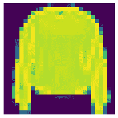

# 第五章：使用神经网络进行图像分类

到目前为止，我们已经成功地构建了用于解决结构化数据的回归和分类问题的模型。接下来的问题是：我们能否构建能够区分狗和猫，或者汽车和飞机的模型？如今，在**TensorFlow**和**PyTorch**等框架的帮助下，开发人员可以仅用几行代码构建这样的机器学习解决方案。

在本章中，我们将探索**神经网络**的构造，并学习如何将它们应用于计算机视觉问题的模型构建。我们将首先了解什么是神经网络，以及多层神经网络的架构。我们还将探讨一些重要的概念，如前向传播、反向传播、优化器、损失函数、学习率和激活函数，以及它们在网络中的作用和位置。

在我们扎实掌握核心基础后，我们将使用 TensorFlow 中的自定义数据集构建图像分类器。在这里，我们将通过 TensorFlow 数据集的端到端过程来构建模型。使用这些自定义数据集的好处是，大部分预处理步骤已经完成，我们可以毫无障碍地对数据进行建模。因此，我们将使用这个数据集，在 TensorFlow 的**Keras** API 下通过几行代码构建一个神经网络，使我们的模型能够区分包和衬衫，鞋子和外套。

在本章中，我们将涵盖以下主题：

+   神经网络的构造

+   使用神经网络构建图像分类器

# 技术要求

我们将使用`python >= 3.8.0`，并配合以下可以通过`pip install`命令安装的包：

+   `tensorflow>=2.7.0`

+   `tensorflow-datasets==4.4.0`

+   `pillow==8.4.0`

+   `pandas==1.3.4`

+   `numpy==1.21.4`

+   `matplotlib >=3.4.0`

本章的代码可以在[`github.com/PacktPublishing/TensorFlow-Developer-Certificate-Guide/tree/main/Chapter%205`](https://github.com/PacktPublishing/TensorFlow-Developer-Certificate-Guide/tree/main/Chapter%205)找到。此外，所有练习的解答也可以在 GitHub 仓库中找到。

# 神经网络的构造

在本书的第一部分，我们讨论了模型。我们所讲解和使用的这些模型是神经网络。神经网络是一种深度学习算法，受到人脑功能的启发，但它并不完全像人脑那样运作。它通过分层的方法学习输入数据的有用表示，如*图 5.1*所示：


图 5.1 – 神经网络

神经网络非常适合解决复杂问题，因为它们能够识别数据中非常复杂的模式。这使得它们特别适合围绕文本和图像数据（非结构化数据）构建解决方案，而这些是传统机器学习算法难以处理的任务。神经网络通过分层表示，开发规则将输入数据映射到目标或标签。当我们用标记数据训练它们时，它们学习模式，并利用这些知识将新的输入数据映射到相应的标签。

在*图 5.1*中，我们看到输入层的所有神经元都与第一隐藏层的神经元相连接，第一隐藏层的所有神经元都与第二隐藏层的神经元相连接。从第二隐藏层到外层也同样如此。这种每一层的神经元都与下一层的神经元完全连接的网络，被称为**全连接神经网络**。拥有两个以上隐藏层的神经网络被称为**深度神经网络**（**DNN**），网络的深度由其层数决定。

让我们深入探讨神经网络架构中的各个层：

+   **输入层**：这是我们将输入数据（文本、图像、表格数据）输入网络的层。在这里，我们必须指定正确的输入形状，之前在我们的回归案例研究中，*第三章**，TensorFlow 线性回归*，以及在我们的分类案例研究中，*第四章**，TensorFlow 分类*中都已经做过这种操作。需要注意的是，输入数据将以数字格式呈现给我们的神经网络。在这一层，不会进行任何计算。这更像是一个将数据传递到隐藏层的通道层。

+   **隐藏层**：这是下一个层，位于输入层和输出层之间。之所以称为隐藏层，是因为它对外部系统不可见。在这里，进行大量计算以从输入数据中提取模式。我们在隐藏层中添加的层数越多，我们的模型就会变得越复杂，处理数据所需的时间也越长。

+   **输出层**：该层生成神经网络的输出。输出层神经元的数量由当前任务决定。如果我们有一个二分类任务，我们将使用一个输出神经元；而对于多类分类任务，例如我们的案例研究中有 10 个不同的标签，我们将有 10 个神经元，每个标签对应一个神经元。

我们现在知道神经网络的各层，但关键问题是：神经网络是如何工作的，它是如何在机器学习中占据特殊地位的？

神经网络通过前向传播和反向传播的结合解决复杂任务。我们先从前向传播开始。

## 前向传播

假设我们希望训练神经网络有效地识别*图 5.2*中的图像。我们将传递大量我们希望神经网络识别的图像代表性样本。这里的想法是，我们的神经网络将从这些样本中学习，并利用所学知识识别样本空间中的新项。比如，假设我们希望模型识别衬衫，我们将传递不同颜色和大小的衬衫。我们的模型将学习衬衫的定义，而不论其颜色、尺寸或样式如何。模型所学到的衬衫核心属性的表示将用于识别新衬衫。


图 5.2 – 来自 Fashion MNIST 数据集的示例图像

让我们看一下幕后发生了什么。在我们的训练数据中，我们将图像（*X*）传入模型 f(x) . . → ˆ y，其中 ˆ y 是模型的预测输出。这里，神经网络随机初始化权重，用于预测输出（ˆ y）。这个过程被称为**前向传播**或**前向传递**，如*图 5.3*所示。

注意

权重是可训练的参数，会在训练过程中进行更新。训练完成后，模型的权重会根据其训练数据集进行优化。如果我们在训练过程中适当地调整权重，就能开发出一个表现良好的模型。

当输入数据流经网络时，数据会受到节点的权重和偏置的影响而发生变换，如*图 5.3*所示，从而产生一组新的信息，这些信息将通过*激活函数*。如果希望得到新的学习信息，激活函数将触发一个输出信号，作为下一个层的输入。这一过程持续进行，直到在输出层生成输出：


图 5.3 – 神经网络的前向传播

让我们再谈谈激活函数及其在神经网络中的作用。

## 激活函数

想象一下，你需要从一篮苹果中挑选出好苹果。通过检查这些苹果，你可以挑出好苹果并丢掉坏苹果。这就像激活函数的作用——它充当了一个分隔器，定义了哪些信息会通过，在我们的例子中，这就是它学到的有用表示，并丢弃不必要的数据。从本质上讲，它帮助提取有用信息，就像挑选出好苹果一样，丢弃无用的数据，而在我们的场景中，坏苹果就是无用的数据。现在，激活函数决定了下一层哪个连接的神经元将被激活。它通过数学运算判断一个学习到的表示是否足够有用，能够供下一层使用。

激活函数可以为我们的神经网络添加非线性，这是神经网络学习复杂模式所必需的特性。激活函数有多种选择；对于输出层，激活函数的选择取决于手头任务的类型：

+   对于二分类问题，我们通常使用 sigmoid 函数，因为它将输入映射到介于 0 和 1 之间的输出值，表示属于某个特定类别的概率。我们通常将阈值设置为 0.5，因此大于此点的值设置为 1，小于此点的值设置为 0。

+   对于多分类问题，我们使用 **Softmax** **激活** 作为输出层的激活函数。假设我们想要构建一个图像分类器，将四种水果（苹果、葡萄、芒果和橙子）进行分类，如图 *5.4* 所示。每种水果在输出层分配一个神经元，并且我们会应用 Softmax 激活函数来生成输出属于我们希望预测的水果之一的概率。当我们将苹果、葡萄、芒果和橙子的概率加起来时，结果为 1。对于分类任务，我们选择概率最大的水果类别作为从 Softmax 激活函数生成的概率中的输出标签。在这种情况下，概率最大的输出是橙子：


图 5.4 – SoftMax 激活函数的应用

对于隐藏层，我们将使用 **修正线性单元**（**ReLU**）激活函数。这个激活函数去除了负值（无用的表示），同时保留了大于 0 的学习表示。ReLU 在隐藏层表现出色，因为它收敛快速并且支持反向传播，这是我们接下来将要讨论的概念。

注意

在二分类问题中，使用 sigmoid 函数更加高效，这时我们只有一个输出神经元，而使用 Softmax 时会有两个输出神经元。此外，当我们阅读代码时，更容易理解我们处理的是二分类问题。

## 反向传播

当我们开始训练模型时，权重最初是随机的，这使得模型更容易错误地猜测图 *5.4* 中的水果是橙子。此时神经网络的智能就体现出来了；它会自动修正自己，如图 *5.5* 所示：


图 5.5 – 神经网络的前向传播与反向传播

在这里，神经网络衡量预测输出（ˆy）与真实值（*y*）的比较结果的准确性。这个损失是通过**损失函数**计算的，损失函数也可以称为**代价函数**。这些信息会传递给**优化器**，其任务是更新神经网络中各层的权重，目的是在接下来的迭代中减少损失，从而使我们的预测更接近真实值。这个过程会持续，直到我们实现**收敛**。收敛发生在模型训练过程中，损失达到了最小值。

损失函数的应用依赖于当前任务。当我们处理二分类任务时，我们使用**二元交叉熵**；对于多分类任务，如果目标标签是整数值（例如，0 到 9），我们使用**稀疏分类交叉熵**，而如果我们决定对目标标签进行独热编码，则使用**分类交叉熵**。与损失函数类似，我们也有不同类型的优化器；然而，我们将尝试使用**随机梯度下降法**（**SGD**）和**Adam 优化器**，它是 SGD 的改进版。因此，我们将使用它作为我们的默认优化器。

## 学习率

我们现在知道权重是随机初始化的，而优化器的目的是利用关于损失函数的信息来更新权重，从而实现收敛。神经网络使用优化器迭代更新权重，直到损失函数达到最小值，如*图 5.6*所示。优化器允许你设置一个重要的超参数——**学习率**，它控制收敛的速度，并且是我们模型学习的方式。为了到达斜率的底部，我们必须朝着底部迈出步伐（见*图 5.6*）：


图 5.6 – 梯度下降

我们采取的步伐大小将决定我们到达底部的速度。如果我们走得步伐太小，将需要很长时间才能到达底部，且会导致收敛变慢，甚至存在优化过程可能在到达最小值的过程中卡住的风险。反之，如果步伐太大，则可能会错过最小值，并出现不稳定和异常的训练行为。正确的步伐大小将帮助我们及时到达斜率的底部而不会错过最小点。这里提到的步伐大小就是学习率。

我们现在已经高层次地了解了神经网络的直觉。接下来，让我们进行案例研究，直接应用我们刚刚学到的内容。

# 用神经网络构建图像分类器

我们回到了虚构的公司，现在我们希望利用神经网络的直觉来构建一个图像分类器。在这里，我们要教计算机识别服装。幸运的是，我们不需要在野外寻找数据；我们有 TensorFlow 数据集，其中包括时尚数据集。在我们的案例研究中，我们的目标是将一个由 28 x 28 灰度图像组成的时尚数据集分类为 10 类（从 0 到 9），每个像素值介于 0 到 255 之间，使用一个广为人知的数据集——*Fashion MNIST 数据集*。该数据集由 60,000 张训练图像和 10,000 张测试图像组成。我们的数据集中的所有图像都是相同的形状，因此我们几乎不需要做什么预处理。这里的想法是，我们可以快速构建一个神经网络，而不需要复杂的预处理。

为了训练神经网络，我们将传递训练图像，假设我们的神经网络将学习将图像（*X*）映射到它们相应的标签（*y*）。在完成训练过程后，我们将使用测试集对模型在新图像上的表现进行评估。同样，目的是让模型根据它在训练过程中学到的知识，正确识别测试图像。让我们开始吧。

## 加载数据

在这里，我们将首先学习如何使用 TensorFlow 数据集处理图像。在 *第七章**，**卷积神经网络进行图像分类*，我们将处理需要更多建模工作以使用的真实世界图像；不过，它将基于我们在这里学到的内容。话虽如此，让我们看看如何从 TensorFlow 加载自定义数据集：

1.  在加载数据之前，我们需要加载必要的库。我们在这里做这件事：

    ```py
    import tensorflow as tf
    ```

    ```py
    from tensorflow import keras
    ```

    ```py
    import pandas as pd
    ```

    ```py
    import random
    ```

    ```py
    import numpy as np
    ```

    ```py
    import matplotlib.pyplot as plt #helper libraries
    ```

    ```py
    from tensorflow.keras.utils import plot_model
    ```

1.  接下来，我们从 TensorFlow 导入 `fashion_mnist` 数据集，并使用 `load_data()` 方法创建我们的训练集和测试集：

    ```py
    #Lets import the fashion mnist
    ```

    ```py
    fashion_data = keras.datasets.fashion_mnist
    ```

    ```py
    #Lets create of numpy array of training and testing data
    ```

    ```py
    (train_images, train_labels), (test_images,
    ```

    ```py
        test_labels) = fashion_data.load_data()
    ```

    如果一切按计划进行，我们应该会得到如 *图 5.7* 所示的输出：


图 5.7 – 从 TensorFlow 数据集中导入数据

1.  现在，我们不再使用数字标签，而是创建与数据匹配的标签，这样我们可以把一件衣服叫做“衣服”，而不是叫它编号 3。我们将通过创建一个标签列表，并将其映射到相应的数字值来实现这一点：

    ```py
    #We create a list of the categories
    ```

    ```py
    class_names=['Top', 'Trouser','Pullover', 'Dress', 'Coat', 
    ```

    ```py
        'Sandal', 'Shirt', 'Sneaker', 'Bag', 'Ankleboot']
    ```

现在我们有了数据，让我们探索数据，看看能发现什么。与其盲目接受所说的每一件事，不如探索数据以验证大小、形状和数据分布。

## 执行探索性数据分析

加载完数据后，下一步是检查数据，了解数据的基本情况。当然，在这个实例中，我们已经从 TensorFlow 获得了一些关于数据分布的基本信息。同时，我们的数据已经以训练集和测试集的形式准备好了。然而，让我们通过代码确认所有细节，并查看我们目标标签的类别分布：

1.  我们将使用`matplotlib`库生成索引为`i`的图像样本，其中`i`在 60,000 个训练样本中：

    ```py
    # Display a sample image from the training data (index 7)
    ```

    ```py
    plt.imshow(train_images[7])
    ```

    ```py
    plt.grid(False)
    ```

    ```py
    plt.axis('off')
    ```

    ```py
    plt.show()
    ```

    我们使用索引`7`运行代码，返回了如*图 5.7*所示的上衣：



图 5.8 – Fashion MNIST 数据集索引为 7 的一件套头衫照片

我们可以切换索引值，查看数据集中其他的服装；不过，这并不是我们这里的目标。所以，让我们继续进行探索性数据分析。

1.  让我们来看一下我们数据的样本：

    ```py
    #Lets check the shape of our training images and testing images
    ```

    ```py
    train_images.shape, test_images.shape
    ```

    如预期的那样，我们可以看到训练图像由 60,000 张 28 x 28 的图像组成，而测试图像有 10,000 张，分辨率为 28 x 28：

    ```py
    ((60000, 28, 28), (10000, 28, 28))
    ```

1.  接下来，让我们检查数据的分布情况。最好先了解数据的分布情况，以确保每个我们希望训练模型的服装类别都有足够的样本。让我们在这里进行检查：

    ```py
    df=pd.DataFrame(np.unique(train_labels,
    ```

    ```py
        return_counts=True)).T
    ```

    ```py
    dict = {0: ‹Label›,1: ‹Count›}
    ```

    ```py
    df.rename(columns=dict,
    ```

    ```py
        inplace=True)
    ```

    ```py
    df
    ```

    这将返回如*图 5.9*所示的`DataFrame`。我们可以看到所有标签的样本数是相同的：


图 5.9 – 显示标签及其计数的 DataFrame

当然，这种类型的数据更可能出现在受控环境下，比如学术界。

1.  让我们在这里可视化一些训练数据中的样本图像。让我们来看 16 个来自训练数据的样本：

    ```py
    plt.figure(figsize=(9,9))
    ```

    ```py
    for i in range(16):
    ```

    ```py
        plt.subplot(4,4,i+1)
    ```

    ```py
        plt.xticks([])
    ```

    ```py
        plt.yticks([])
    ```

    ```py
        plt.grid(False)
    ```

    ```py
        plt.imshow(train_images[i])
    ```

    ```py
        plt.title(class_names[train_labels[i]])
    ```

    ```py
    plt.show()
    ```

1.  当我们运行代码时，我们得到了*图 5.10*中的图像：


图 5.10 – 从 Fashion MNIST 数据集中随机选取的 16 张图像

现在我们已经确认了数据大小、数据分布和形状，并查看了一些样本图像和标签。在我们开始构建和训练图像分类器之前，回顾一下我们的数据由灰度图像组成，值范围从 0 到 255。为了对数据进行归一化并提升模型在训练过程中的表现，我们需要对数据进行归一化处理。我们可以通过简单地将训练数据和测试数据除以 255 来实现这一点：

```py
#it's important that the training and testing set are preprocessed in the same way.
train_images=train_images/255.0
test_images=test_images/255.0
```

现在我们已经对数据进行了归一化处理，接下来就可以进行建模了。让我们继续构建图像分类器。

## 构建模型

让我们将到目前为止在本章中学到的所有知识付诸实践：

```py
#Step 1:  Model configuration
model=keras.Sequential([
    keras.layers.Flatten(input_shape=(28,28)),
    keras.layers.Dense(64, activation="relu"),
    keras.layers.Dense(10,activation="softMax")
])
#Here we flatten the data
```

我们用来构建模型的代码与本书*第一部分*中使用的代码类似。我们首先使用 Sequential API 创建一个顺序模型，以定义我们想要按顺序连接的层数。如果你是一个细心的观察者，你会注意到我们的第一层是一个展平层。这个层用于将图像数据展平为一个 1D 数组，然后传递给隐藏层。输入层没有神经元，它充当数据预处理层，将数据展平为 1D 数组后传递给隐藏层。

接下来，我们有一个 64 个神经元的隐藏层，并对该隐藏层应用 ReLU 激活函数。最后，我们有一个包含 10 个神经元的输出层——每个输出一个神经元。由于我们处理的是多类分类问题，因此使用 softmax 函数。Softmax 返回的是所有类别的概率结果。如果你还记得*激活函数*部分，输出概率的总和为 1，概率值最大的输出就是预测标签。

现在，我们完成了模型构建，接下来继续编译模型。

## 编译模型

下一步是编译模型。我们将使用`compile`方法来完成这个操作。在这里，我们传入我们希望使用的优化器；在这种情况下，我们使用**Adam**，它是我们的默认优化器。我们还指定了损失函数和评估指标。由于我们的标签是数字值，因此我们使用稀疏分类交叉熵作为损失函数。对于评估指标，我们使用准确率，因为我们的数据集是平衡的。准确率指标将真实反映我们模型的性能：

```py
#Step 2: Compiling the model, we add the loss, optimizer and evaluation metrics here
model.compile(optimizer='adam',
    loss=›sparse_categorical_crossentropy',
    metrics=[‹accuracy›])
```

在我们开始拟合模型之前，先来看一下几种可视化模型及其参数的方法。

## 模型可视化

为了可视化我们的模型，我们使用`summary()`方法。这将为我们提供一个详细的视觉表示，展示模型的架构、各层、参数数量（可训练和不可训练）以及输出形状：

```py
model.summary()
```

当我们运行代码时，它将返回模型的详细信息，如*图 5.11*所示：


图 5.11 – 模型摘要

从*图 5.11*中，我们可以看到输入层没有参数，但输出形状为 784，这是将 28 × 28 的图像展平为一维数组的结果。要计算全连接层的参数数量，它是 784 × 64 + 64 = 50240（回想一下，*X*是输入数据，*w*是权重，*b*是偏置）。输出层（`dense_1`）的形状为 10，其中每个神经元代表一个类别，共有 650 个参数。回想一下，一个层的输出作为下一个层的输入。因此，64 × 10 + 10 = 650，其中 64 是隐藏层的输出形状，也是输出层的输入形状。

另一方面，我们还可以通过以下代码将模型显示为流程图，如*图 5.12*所示：

```py
plot_model(model, to_file='model_plot.png', show_shapes=True, 
    show_layer_names=True)
```


图 5.12 – 模型流程图

这也让我们对模型的结构有了一个大致了解。我们生成的图表将保存为文件名`model_plot.png`。在这里，我们将`show_shapes`设置为`true`；这将在图中显示每一层的输出形状。我们还将`show_layer_name`设置为`true`，以在图中显示各层的名称，正如*图 5.12*所示。

接下来，让我们将模型拟合到训练数据中。

## 模型拟合

到现在为止，你应该已经熟悉这个过程。通过一行代码，我们可以使用`fit`方法来拟合我们的训练图像(*X*)和训练标签(*y*)：

```py
#Step 3: We fit our data to the model
 history= model.fit(train_images, train_labels, epochs=5)
```

在这里，我们将数据训练了五个 epoch。我们的模型返回了损失和准确率：

```py
1875/1875 [==============================] – 4s 2ms/step – loss: 0.5206 – accuracy: 0.8183
Epoch 2/5
1875/1875 [==============================] – 4s 2ms/step – loss: 0.3937 – accuracy: 0.8586
Epoch 3/5
1875/1875 [==============================] – 4s 2ms/step – loss: 0.3540 – accuracy: 0.8722
Epoch 4/5
1875/1875 [==============================] – 4s 2ms/step – loss: 0.3301 – accuracy: 0.8790
Epoch 5/5
1875/1875 [==============================] – 4s 2ms/step – loss: 0.3131 – accuracy: 0.8850
```

我们可以看到，在仅仅五个 epoch 后，我们的模型达到了`0.8850`的准确率。考虑到我们只训练了非常少的 epoch，这是一个不错的开始。接下来，让我们通过绘制损失和准确率图来观察模型在训练过程中的表现。

## 训练监控

我们在拟合训练数据时返回一个`history`对象。在这里，我们使用`history`对象来创建损失和准确率曲线。以下是绘制图表的代码：

```py
# Plot history for accuracy
plt.plot(history.history['accuracy'])
plt.title('model accuracy')
plt.ylabel('accuracy')
plt.xlabel('epoch')
plt.legend(['Train'], loc='lower right')
plt.show()
# Plot history for loss
plt.plot(history.history['loss'])
plt.title('model loss')
plt.ylabel('loss')
plt.xlabel('epoch')
plt.legend(['Train'], loc='upper right')
plt.show()
```

当我们运行代码时，我们得到两个图表，如*图 5.13*所示。我们可以看到，在第五个 epoch 结束时，训练准确率仍在上升，而损失仍在下降，尽管随着接近 0，下降的速度不再那么快：


图 5.13 – 准确率和损失图

或许如果我们训练更长时间，可能会看到更好的表现。在下一章中，我们将探讨如果我们延长训练时间会发生什么，并且还会查看其他提高模型表现的方法。在这里，目标是理解图表的含义，并获取足够的信息来指导我们接下来的行动。让我们在测试集上评估我们的模型。

## 评估模型

我们在测试集上评估我们模型的整体表现如下：

```py
test_loss,test_acc =model.evaluate(test_images,test_labels)
print('Test Accuracy: ', test_acc)
```

我们在测试集上得到了`0.8567`的准确率。训练准确率和测试准确率之间的差异是机器学习中常见的问题，我们称之为**过拟合**。过拟合是机器学习中的一个关键问题，我们将在*第八章*中探讨过拟合及其处理方法，*过拟合处理*。

接下来，让我们用我们训练过的神经网络做一些预测。

## 模型预测

要对模型进行预测，我们在测试集的未见数据上使用`model.predict()`方法。让我们看看模型在测试数据的第一个实例上的预测：

```py
predictions=model.predict(test_images)
predictions[0].round(2)
```

当我们运行代码时，我们得到一个概率数组：

```py
array([0.  , 0.  , 0.  , 0.  , 0.  ,
    0.13, 0.  , 0.16, 0.  , 0.7 ],
    dtype=float32)
```

如果我们检查概率，会发现在第九个元素的概率最高。因此，这个标签的概率为 70%。我们将使用`np.argmax`来提取标签，并将其与索引为`0`的测试标签进行比较：

```py
np.argmax(predictions[0]),test_labels[0]
```

我们看到预测标签和测试标签的值都是`9`。我们的模型正确预测了这一点。接下来，让我们绘制 16 张随机图片，并将预测结果与真实标签进行比较。这次，我们不会返回标签的数值，而是返回标签本身，以便更清晰地展示：

```py
# Let us plot 16 random images and compare the labels with the model's prediction
figure = plt.figure(figsize=(9, 9))
for i, index in enumerate(np.random.choice(test_images.shape[0],
size=16, replace=False)):
    ax = figure.add_subplot(4,4,i + 1,xticks=[], yticks=[])
    # Display each image
    ax.imshow(np.squeeze(test_images[index]))
    predict_index = np.argmax(predictions[index])
    true_index = test_labels[index]
    # Set the title for each image
    ax.set_title(f»{class_names[predict_index]} (
    {class_names[true_index]})",color=(
        "green" if predict_index == true_index else «red»))
```

结果如*图 5.14*所示。尽管模型能够正确分类 10 个项目，但它在一个样本上失败了，将一件衬衫误分类为套头衫：


图 5.14 – 可视化模型在测试数据上的预测

仅用几行代码，我们就训练了一个图像分类器。在五个训练周期内，我们在训练数据上的准确率达到了 88.50%，在测试数据上的准确率为 85.67%。需要注意的是，这是一个用于学习的玩具数据集，尽管它非常适合学习，但实际世界中的图像更为复杂，训练将需要更长时间，且在许多情况下，需要更复杂的模型架构。

在这一章中，我们介绍了许多新概念，这些概念在后续章节以及考试中都会非常有用。

# 总结

在这一章中，我们讨论了图像分类建模。现在，你应该能够解释什么是神经网络，以及前向传播和反向传播的原理。你应该了解损失函数、激活函数和优化器在神经网络中的作用。此外，你应该能够熟练加载 TensorFlow 数据集中的数据。最后，你应该了解如何构建、编译、拟合和训练一个用于图像分类的神经网络，并评估模型，绘制损失和准确率曲线，解读这些可视化结果。

在下一章中，我们将探讨几种方法，用于提高我们模型的性能。

# 问题

让我们来测试一下我们在这一章中学到的内容：

1.  激活函数的作用是什么？

1.  反向传播是如何工作的？

1.  输入层、隐藏层和输出层的作用是什么？

1.  使用 TensorFlow 数据集，加载一个手写数字数据集，然后你将构建、编译、训练并评估一个图像分类器。这与我们的案例研究类似。加油！

# 进一步阅读

若要了解更多信息，你可以查看以下资源：

+   Amr, T., 2020\. *深入学习与 scikit-learn 和科学 Python 工具包的实践*。 [S.l.]: Packt Publishing.

+   Vasilev, I., 2019\. *Python 深度学习进阶*。第 1 版。Packt Publishing.

+   Raschka, S. 和 Mirjalili, V., 2019\. *Python 机器学习*。第 3 版。Packt Publishing.

+   Gulli, A., Kapoor, A. 和 Pal, S., 2019\. *使用 TensorFlow 2 和 Keras 的深度学习*。伯明翰：Packt Publishing.

+   *TensorFlow* *指南* [`www.TensorFlow.org/guide`](https://www.TensorFlow.org/guide)
