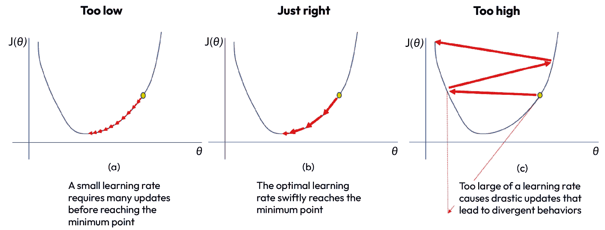
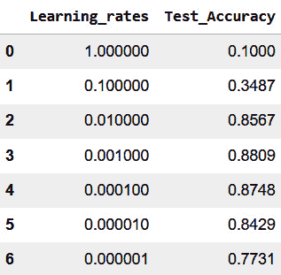

# 第六章：改进模型

机器学习中建模的目标是确保我们的模型能在未见过的数据上良好泛化。在我们作为数据专业人员构建神经网络模型的过程中，可能会遇到两个主要问题：欠拟合和过拟合。**欠拟合**是指我们的模型缺乏足够的复杂性，无法捕捉数据中的潜在模式，而**过拟合**则是在模型过于复杂时，模型不仅学习到模式，还会拾取到训练数据中的噪声和异常值。在这种情况下，我们的模型在训练数据上表现非常好，但在未见过的数据上无法良好泛化。*第五章*，*使用神经网络进行图像分类*，探讨了神经网络背后的科学原理。在本章中，我们将探索调整神经网络的艺术，以构建在图像分类中表现最优的模型。我们将通过动手实践来探索各种网络设置，了解这些设置（超参数）对模型性能的影响。

除了探索超参数调整的艺术，我们还将探索多种改善数据质量的方法，如数据标准化、数据增强和使用合成数据来提高模型的泛化能力。过去，人们非常注重构建复杂的网络。然而，近年来，越来越多的人开始关注使用以数据为中心的策略来提升神经网络的表现。使用这些以数据为中心的策略并不会削弱精心设计模型的必要性；相反，我们可以将它们看作是互为补充的策略，协同工作以达成目标，从而增强我们构建具有良好泛化能力的最优模型的能力。

在本章中，我们将涵盖以下主题：

+   数据至关重要

+   调整神经网络的超参数

到本章结束时，你将能够有效应对过拟合和欠拟合所带来的挑战，通过结合以模型为中心和以数据为中心的思路，构建神经网络模型。

# 技术要求

我们将使用`python >= 3.8.0`，并安装以下可以通过`pip` `install`命令安装的包：

+   `tensorflow>=2.7.0`

+   `tensorflow-datasets==4.4.0`

+   `pandas==1.3.4`

+   `numpy==1.21.4`

# 数据至关重要

在提升神经网络或任何其他机器学习模型的性能时，良好的数据准备工作至关重要，不能过分强调。在*第三章*，*使用 TensorFlow 进行线性回归*中，我们看到了标准化数据对模型表现的影响。除了数据标准化之外，还有其他数据准备技巧可以在建模过程中产生影响。

如你现在应该已经意识到的，机器学习需要根据手头的问题进行调查、实验和应用不同的技术。为了确保我们拥有最佳性能的模型，我们的旅程应从彻底审视数据开始。我们是否拥有每个目标类别的足够代表性样本？我们的数据是否平衡？我们是否确保了标签的正确性？我们的数据类型是否正确？我们如何处理缺失数据？这些问题是我们在建模阶段之前必须提问并处理的。

提高我们数据的质量是一项多方面的工作，涉及通过应用数据预处理技术（如数据归一化）从现有数据中工程化新特征。当我们处理不平衡数据集时，尤其是当我们缺乏少数类的代表性样本时，合理的做法是收集更多少数类数据；然而，这在所有情况下并不实际。在这种情况下，合成数据可能是一个有效的替代方案。一些初创公司，如**Anyverse.ai**和**Datagen.tech**，专注于合成数据的开发，从而可以缓解数据不平衡和数据稀缺的问题。然而，合成数据可能会很昂贵，因此在选择这条路线之前，我们需要做一个成本效益分析。

我们可能面临的另一个问题是，当我们收集的样本不足以代表模型正确运行时。例如，你训练模型识别人脸。你收集了成千上万的人脸图像，并将数据分成训练集和测试集。你训练了模型，并且在测试集上预测得非常完美。然而，当你将这个模型作为产品推向市场时，你得到的结果可能像*图 6.1*所示：


图 6.1 – 数据增强的必要性

令人惊讶，对吧？即使你在成千上万的图像上训练了模型，如果轴被垂直或水平翻转，或者以其他方式改变，模型也未能学会识别面孔。为了解决这种问题，我们采用了一种叫做数据增强的技术。数据增强是一种通过某种方式改变现有数据来创建新训练数据的技术，例如随机裁剪、缩放或旋转、翻转初始图像。数据增强背后的基本思想是使我们的模型即使在不可预测的条件下（例如我们在*图 6.1* 中看到的情况），也能识别图像中的物体。

数据增强在我们希望从有限的训练集获得更多数据样本时非常有用；我们可以使用数据增强来有效地增加数据集的大小，从而为我们的模型提供更多的数据进行学习。此外，由于我们可以模拟各种场景，模型在学习数据中的潜在模式时不太可能发生过拟合，而不是学习数据中的噪声，因为我们的模型通过多种方式学习数据。数据增强的另一个重要好处是它是一种节省成本的技术，可以避免昂贵且有时耗时的数据收集过程。在*第八章*《处理过拟合》中，我们将应用数据增强技术，在实际的图像分类问题中进行实践。此外，如果将来你需要处理图像或文本数据，数据增强将是一个非常实用的技术。

除了解决数据不平衡和数据多样性问题外，我们可能还希望进一步优化我们的模型，使其足够复杂，以便识别数据中的模式，并且我们希望做到这一点而不导致模型过拟合。在这里，目标是通过调整一个或多个设置来提高模型的质量，例如增加隐藏层的数量、为每层添加更多神经元、改变优化器或使用更复杂的激活函数。这些设置可以通过实验进行调优，直到获得最优的模型。

我们已经讨论了若干提高神经网络性能的思路。现在，让我们看看如何提高在*第五章*《使用神经网络进行图像分类》中，在 Fashion MNIST 数据集上取得的结果。

# 神经网络的超参数微调

在进行机器学习改进之前，建立一个**基线模型**非常重要。基线模型是一个简单的模型，我们可以用它来评估更复杂模型的表现。在*第五章*，《使用神经网络进行图像分类》中，我们在仅五个训练周期内，训练数据的准确率为 88.50%，测试数据的准确率为 85.67%。为了进一步提高我们模型的表现，我们将继续按照三步流程（**构建**、**编译**、和**训练**）来构建神经网络，使用**TensorFlow**。在构建神经网络的每个步骤中，都有一些需要在训练前配置的设置，这些设置称为**超参数**。超参数决定了网络如何学习和表现，掌握调整超参数的技巧是构建成功深度学习模型的关键步骤。常见的超参数包括每层神经元的数量、隐藏层的数量、学习率、激活函数以及训练周期数。通过不断尝试这些超参数，我们可以找到最适合我们使用场景的最佳设置。

在构建现实世界的模型时，特别是处理特定领域问题时，专家知识可能会非常有助于定位任务的最佳超参数值。让我们回到笔记本，尝试不同的超参数，看看通过调整一个或多个超参数是否能够超越我们的基线模型。

## 增加训练周期数

想象一下，你正在教一个孩子乘法表；你与孩子每次的学习互动可以比作机器学习中的一个训练周期。如果你与孩子的学习次数很少，那么他们很可能无法完全理解乘法的概念。因此，孩子将无法尝试基本的乘法问题。在机器学习中，这种情况叫做欠拟合，指的是模型由于训练不足，未能捕捉到数据中的潜在模式。

另一方面，假设你花了很多时间教孩子记住乘法表的某些方面，比如 2 的倍数、3 的倍数和 4 的倍数。孩子在背诵这些乘法表时变得熟练；然而，当遇到类似 10 x 8 这样的乘法题时，孩子却感到困难。这是因为，孩子并没有理解乘法的原理，以至于能够在处理其他数字时应用这个基本的思想，而只是单纯地记住了学习过程中遇到的例子。在机器学习中，这种情况就像过拟合的概念，我们的模型在训练数据上表现良好，但在新情况中无法很好地泛化。在机器学习中，当我们训练模型时，需要找到一个平衡，使得模型足够好地学习数据中的潜在模式，而不是仅仅记住训练数据。

让我们看看延长训练时间对结果的影响。这次，我们选择 40 个训练轮次，观察会发生什么：

```py
#Step 1:  Model configuration
model=keras.Sequential([
    keras.layers.Flatten(input_shape=(28,28)),
    keras.layers.Dense(100, activation=»relu»),
    keras.layers.Dense(10,activation=»softmax»)
])
#Step 2: Compiling the model, we add the loss, optimizer and evaluation metrics here
model.compile(optimizer='adam',
    loss=›sparse_categorical_crossentropy›,
    metrics=[‹accuracy›])
#Step 3: We fit our data to the model
history= model.fit(train_images, train_labels, epochs=40)
```

在这里，我们将`步骤 3`中的训练轮次从`5`改为`40`，同时保持我们基础模型的其他超参数不变。输出的最后五轮结果如下：

```py
Epoch 36/40
1875/1875 [==============================] - 5s 2ms/step - loss: 0.1356 - accuracy: 0.9493
Epoch 37/40
1875/1875 [==============================] - 5s 2ms/step - loss: 0.1334 - accuracy: 0.9503
Epoch 38/40
1875/1875 [==============================] - 4s 2ms/step - loss: 0.1305 - accuracy: 0.9502
Epoch 39/40
1875/1875 [==============================] - 4s 2ms/step - loss: 0.1296 - accuracy: 0.9512
Epoch 40/40
1875/1875 [==============================] - 4s 2ms/step - loss: 0.1284 - accuracy: 0.9524
```

请注意，当我们增加训练轮次时，训练模型所需的时间会显著增加。所以，当训练轮次很大时，计算成本可能会变得很高。经过 40 个训练轮次后，我们发现模型的训练准确率达到了`0.9524`，看起来你可能认为已经找到了解决问题的灵丹妙药。然而，我们的目标是确保模型的泛化能力；因此，检验模型的关键是看它在未见过的数据上表现如何。让我们看看在测试数据上的结果如何：

```py
test_loss, test_acc=model.evaluate(test_images,test_labels)
print('Test Accuracy: ', test_acc)
```

当我们运行代码时，我们在测试数据上的准确率为`0.8692`。可以看到，随着模型训练时间的增加，模型在训练数据上的准确率逐渐提高。然而，如果我们训练得太久，模型的效果会出现收益递减的现象，这在比较训练集和测试集准确度的表现差异时尤为明显。找到一个合适的训练轮次非常重要，以确保模型能够学习和提高，但又不会过度拟合训练数据。一种实用的方法是从较少的训练轮次开始，根据需要逐步增加训练轮次。虽然这种方法有效，但也可能比较耗时，因为需要进行多次实验来找到最优的训练轮次。

那么，如果我们能够设定一个规则，在收益递减前停止训练呢？是的，这是可能的。接下来我们来研究这个想法，看看它对结果会有什么影响。

## 使用回调函数进行早停

**早停**是一种正则化技术，可以用来防止神经网络在训练时出现过拟合。当我们将训练周期数硬编码到模型中时，我们无法在达到期望的度量标准时停止训练，或者当训练开始退化或不再改进时停止训练。我们在增加训练周期数时遇到了这个问题。然而，为了应对这种情况，TensorFlow 为我们提供了早停回调，使我们可以使用内置的回调函数，或者设计自定义的回调函数。我们可以实时监控实验，并且拥有更多的控制权，从而在模型开始过拟合、训练停止学习，或者符合其他定义的标准时，提前停止训练。早停可以在训练的不同阶段调用，可以在训练开始时、结束时或基于达到特定度量时应用。

### 使用内置回调实现早停

让我们一起探索 TensorFlow 中内置的早停回调：

1.  我们将从 TensorFlow 导入早停功能：

    ```py
    from tensorflow.keras.callbacks import EarlyStopping
    ```

1.  接下来，我们初始化早停。TensorFlow 允许我们传入一些参数，我们利用这些参数来创建一个`callbacks`对象：

    ```py
    callbacks = EarlyStopping(monitor='val_loss',
    ```

    ```py
        patience=5, verbose=1, restore_best_weights=True)
    ```

让我们解读一下我们在早停函数中使用的一些参数：

+   `monitor`可以用来跟踪我们想要关注的指标；在我们的情况下，我们希望跟踪验证损失。我们也可以切换为跟踪验证准确率。建议在验证集上监控实验，因此我们将`callbacks`设置为监控验证损失。

+   `patience`参数设置为`5`。这意味着，如果在五个周期后验证损失没有任何进展，训练将结束。

+   我们添加了`restore_best_weight`参数并将其设置为`True`。这使得回调可以监控整个过程，并恢复训练过程中找到的最佳训练周期的权重。如果我们将`restore_best_weight`设置为`False`，则使用最后一步训练的模型权重。

+   当我们将`verbose`设置为`1`时，这确保了我们在回调操作发生时得到通知。如果我们将`verbose`设置为`0`，训练将停止，但我们不会收到任何输出消息。

这里还有一些其他参数可以使用，但这些参数在应用早停时对许多情况来说已经足够有效。

1.  我们将继续采用我们的三步法：构建、编译和拟合模型：

    ```py
    #Step 1:  Model configuration
    ```

    ```py
    model=keras.Sequential([
    ```

    ```py
        keras.layers.Flatten(input_shape=(28,28)),
    ```

    ```py
        keras.layers.Dense(100, activation=»relu»),
    ```

    ```py
        keras.layers.Dense(10,activation=»softmax»)
    ```

    ```py
    ])
    ```

    ```py
    #Step 2: Compiling the model, we add the loss, optimizer and evaluation metrics here
    ```

    ```py
    model.compile(optimizer='adam',
    ```

    ```py
        loss=›sparse_categorical_crossentropy›,
    ```

    ```py
        metrics=[‹accuracy›])
    ```

    ```py
    #Step 3: We fit our data to the model
    ```

    ```py
    history= model.fit(train_images, train_labels,
    ```

    ```py
        epochs=100, callbacks=[callbacks],
    ```

    ```py
        validation_split=0.2)
    ```

`第 1 步`和`第 2 步`是我们之前实现的相同步骤。在构建模型时，我们进行了更长时间的训练周期。然而，在`第 3 步`中，我们做了一些调整，以适应我们的验证集拆分和回调。我们将 20%的训练数据用于验证，并将`callbacks`对象传递给`model.fit()`。这确保了我们的早停回调在验证损失停止下降时中断训练。输出如下：

```py
Epoch 14/100
1500/1500 [==============================] - 4s 2ms/step - loss: 0.2197 - accuracy: 0.9172 - val_loss: 0.3194 - val_accuracy: 0.8903
Epoch 15/100
1500/1500 [==============================] - 4s 2ms/step - loss: 0.2133 - accuracy: 0.9204 - val_loss: 0.3301 - val_accuracy: 0.8860
Epoch 16/100
1500/1500 [==============================] - 4s 2ms/step - loss: 0.2064 - accuracy: 0.9225 - val_loss: 0.3267 - val_accuracy: 0.8895
Epoch 17/100
1500/1500 [==============================] - 3s 2ms/step - loss: 0.2018 - accuracy: 0.9246 - val_loss: 0.3475 - val_accuracy: 0.8844
Epoch 18/100
1500/1500 [==============================] - 4s 2ms/step - loss: 0.1959 - accuracy: 0.9273 - val_loss: 0.3203 - val_accuracy: 0.8913
Epoch 19/100
1484/1500 [============================>.] - ETA: 0s - loss: 0.1925 - accuracy: 0.9282 Restoring model weights from the end of the best epoch: 14.
1500/1500 [==============================] - 4s 2ms/step - loss: 0.1928 - accuracy: 0.9281 - val_loss: 0.3347 - val_accuracy: 0.8912
Epoch 19: early stopping
```

因为我们将`verbose`设置为`1`，所以可以看到我们的实验在第 19 个 epoch 结束。现在，与其担心我们需要多少个 epoch 才能有效训练，我们可以简单地选择一个较大的 epoch 数并实现早停。接下来，我们还可以看到，因为我们实现了`restore_best_weights`，最佳权重出现在第 14 个 epoch，此时我们记录了最低的验证损失（`0.3194`）。通过早停，我们节省了计算时间，并采取了具体措施防止过拟合。

1.  让我们看看我们的测试准确率如何：

    ```py
    test_loss, test_acc = model.evaluate(test_images,
    ```

    ```py
        test_labels)
    ```

    ```py
    print('Test Accuracy: ', test_acc)
    ```

在这里，我们达到了`0.8847`的测试准确率。

现在，让我们看看如何编写自定义回调来实现早停。

### 使用自定义回调实现早停

我们可以通过编写自己的自定义回调来扩展回调的功能，从而实现早停。这为回调增加了灵活性，使我们能够在训练过程中实现一些期望的逻辑。TensorFlow 文档提供了几种实现方法。让我们实现一个简单的回调来跟踪我们的验证准确率：

```py
class EarlyStop(tf.keras.callbacks.Callback):
    def on_epoch_end(self, epoch, logs={}):
        if(logs.get('val_accuracy') > 0.85):
            print("\n\n85% validation accuracy has been reached.")
            self.model.stop_training = True
callback = EarlyStop()
```

例如，如果我们希望在模型在验证集上超过 85%的准确率时停止训练，我们可以通过编写自己的自定义回调`EarlyStop`来实现，该回调接受`tf.keras.callbacks.Callback`参数。然后我们定义一个名为`on_epoch_end`的函数，该函数返回每个 epoch 的日志。我们设置`self.model.stop_training = True`，一旦准确率超过 85%，训练结束并显示类似于我们在使用内置回调时将`verbose`设置为`1`时所得到的消息。现在，我们可以像使用内置回调一样，将`callback`传入`model.fit()`中。然后我们使用我们三步法训练模型：

```py
Epoch 1/100
1490/1500 [============================>.] - ETA: 0s - loss: 0.5325 - accuracy: 0.8134/n/n 85% validation accuracy has been reached
1500/1500 [==============================] - 4s 3ms/step - loss: 0.5318 - accuracy: 0.8138 - val_loss: 0.4190 - val_accuracy: 0.8538
```

这一次，在第一个 epoch 结束时，我们的验证准确率已经超过了 85%。再次强调，这是通过最小化计算资源的使用来实现期望指标的智能方法。

现在我们已经掌握了如何选择 epoch 并应用早停，让我们把目光转向其他超参数，看看通过调整一个或多个超参数，我们是否能提高 88%的测试准确率。也许我们可以从尝试一个更复杂的模型开始。

让我们看看如果我们向隐藏层添加更多神经元会发生什么。

## 增加隐藏层的神经元

隐藏层负责神经网络中的重负载，就像我们在讨论神经网络的结构时提到的那样，参见*第五章*，《使用神经网络进行图像分类》。让我们尝试不同数量的隐藏层神经元。我们将定义一个名为`train_model`的函数，允许我们尝试不同数量的神经元。`train_model`函数接受一个名为`hidden_neurons`的参数，表示模型中隐藏层神经元的数量。此外，该函数还接受训练图像、标签、回调、验证分割和 epoch 数。该函数使用这些参数构建、编译并拟合模型：

```py
def train_model(hidden_neurons, train_images, train_labels, callbacks=None, validation_split=0.2, epochs=100):
    model = keras.Sequential([
        keras.layers.Flatten(input_shape=(28, 28)),
        keras.layers.Dense(hidden_neurons, activation=»relu»),
        keras.layers.Dense(10, activation=»softmax»)
    ])
    model.compile(optimizer=›adam›,
        loss=›sparse_categorical_crossentropy›,
        metrics=[‹accuracy›])
    history = model.fit(train_images, train_labels,
        epochs=epochs, callbacks=[callbacks] if callbacks else None,
        validation_split=validation_split)
    return model, history
```

为了尝试一组神经元，我们创建了一个`for`循环来遍历名为`neuron_values`的神经元列表。然后它应用`train_model`函数为列表中每个神经元构建并训练一个模型：

```py
neuron_values = [1, 500]
for neuron in neuron_values:
    model, history = train_model(neurons, train_images,
        train_labels, callbacks=callbacks)
    print(f»Trained model with {neurons} neurons in the hidden layer»)
```

`print`语句返回一条消息，指示模型已分别使用 1 个和 500 个神经元进行了训练。让我们检查运行该函数时的结果，从只有一个神经元的隐藏层开始：

```py
Epoch 36/40
1500/1500 [==============================] - 3s 2ms/step - loss: 1.2382 - accuracy: 0.4581 - val_loss: 1.2705 - val_accuracy: 0.4419
Epoch 37/40
1500/1500 [==============================] - 2s 1ms/step - loss: 1.2360 - accuracy: 0.4578 - val_loss: 1.2562 - val_accuracy: 0.4564
Epoch 38/40
1500/1500 [==============================] - 2s 1ms/step - loss: 1.2340 - accuracy: 0.4559 - val_loss: 1.2531 - val_accuracy: 0.4507
Epoch 39/40
1500/1500 [==============================] - 2s 1ms/step - loss: 1.2317 - accuracy: 0.4552 - val_loss: 1.2553 - val_accuracy: 0.4371
Epoch 40/40
1500/1500 [==============================] - 2s 1ms/step - loss: 1.2292 - accuracy: 0.4552 - val_loss: 1.2523 - val_accuracy: 0.4401
end of experiment with 1 neuron
```

从我们的结果来看，隐藏层只有一个神经元的模型不足够复杂，无法识别数据中的模式。这个模型的表现远低于 50%，这是典型的欠拟合案例。接下来，让我们看看使用 500 个神经元的模型结果：

```py
Epoch 11/40
1500/1500 [==============================] - 6s 4ms/step - loss: 0.2141 - accuracy: 0.9186 - val_loss: 0.3278 - val_accuracy: 0.8878
Epoch 12/40
1500/1500 [==============================] - 6s 4ms/step - loss: 0.2057 - accuracy: 0.9220 - val_loss: 0.3169 - val_accuracy: 0.8913
Epoch 13/40
1500/1500 [==============================] - 6s 4ms/step - loss: 0.1976 - accuracy: 0.9258 - val_loss: 0.3355 - val_accuracy: 0.8860
Epoch 14/40
1500/1500 [==============================] - 6s 4ms/step - loss: 0.1893 - accuracy: 0.9288 - val_loss: 0.3216 - val_accuracy: 0.8909
Epoch 15/40
1499/1500 [============================>.] - ETA: 0s - loss: 0.1825 - accuracy: 0.9303Restoring model weights from the end of the best epoch: 10.
1500/1500 [==============================] - 6s 4ms/step - loss: 0.1826 - accuracy: 0.9303 - val_loss: 0.3408 - val_accuracy: 0.8838
Epoch 15: early stopping
end of experiment with 500 neurons
```

我们可以看到模型在使用更多神经元时出现了过拟合。模型在训练集上的准确率为`0.9303`，但在测试集上的准确率为`0.8838`。通常来说，更大的隐藏层能够学习更复杂的模式；然而，它会需要更多的计算资源，并且更容易发生过拟合。在选择隐藏层神经元数量时，考虑训练数据的大小非常重要。如果我们有大量的训练样本，我们可以选择更大的神经元数量。但当训练样本较小时，可能需要考虑使用较少的神经元。正如我们在实验中看到的，更多的神经元可能导致过拟合，而这种架构的表现可能会比拥有较少神经元的模型还要差。

另一个需要考虑的因素是我们所使用的数据类型。当我们处理线性数据时，少量的隐藏层可能就足够了。然而，对于非线性数据，我们需要更复杂的模型来学习数据中的复杂性。最后，我们还必须牢记，拥有更多神经元的模型需要更长的训练时间。重要的是要考虑性能和泛化能力之间的权衡。通常的做法是，从少量神经元开始训练模型。这样训练速度更快，并能避免过拟合。

或者，我们可以通过识别对网络性能影响较小或没有影响的神经元，来优化隐藏层中的神经元数量。这种方法称为**剪枝**。这超出了考试的范围，所以我们到此为止。

让我们看看向基准架构中添加更多层的影响。到目前为止，我们已经考虑过使模型更加复杂并训练更长时间。那我们试试改变优化器呢？让我们稍微变换一下，看看会发生什么。

## 更改优化器

我们使用**Adam 优化器**作为默认优化器；然而，还有其他一些知名的优化器，它们各有优缺点。在本书中，以及为了你的考试，我们将重点讲解 Adam、**随机梯度下降**（**SGD**）和**均方根传播**（**RMSprop**）。RMSprop 具有较低的内存需求，并提供自适应学习率；但与 Adam 和 SGD 相比，它的收敛时间要长得多。RMSprop 在训练非常深的网络时表现良好，比如**递归神经网络**（**RNN**），这将在本书后面讨论。

另一方面，SGD 是另一种流行的优化器；它简单易实现，并且当数据稀疏时效率较高。然而，它收敛较慢，并且需要仔细调整学习率。如果学习率过高，SGD 会发散；如果学习率过低，SGD 会收敛得非常慢。SGD 在各种问题上表现良好，并且在大数据集上比其他优化器收敛得更快，但在训练非常大的神经网络时，有时会收敛得较慢。

Adam 是 SGD 的改进版；它具有较低的内存需求，提供自适应学习率，是一种非常高效的优化器，并且可以比 SGD 或 RMSprop 在更少的迭代次数下收敛到一个良好的解。Adam 也非常适合训练大型神经网络。

让我们试试这三种优化器，看看哪一种在我们的数据集上效果最好。我们已经将优化器从 Adam 更改为 RMSprop 和 SGD，并使用相同的架构和内建回调。我们可以在*图 6.2*中看到结果：

|  | **Adam** | **RMSProp** | **SGD** |
| --- | --- | --- | --- |
| 早停前的训练轮数 | 13 | 9 | 39 |
| 验证准确率 | 0.8867 | 0.8788 | 0.8836 |
| 测试准确率 | 0.8787 | 0.8749 | 0.8749 |

图 6.2 – 不同优化器的性能

尽管 Adam 需要更多的训练轮次，但其结果略微优于其他优化器。当然，任何一种优化器都可以用于此问题。在后续章节中，我们将处理更复杂的真实世界图像，并会再次讨论这些优化器。

在我们结束本章之前，让我们来看一下学习率及其对模型性能的影响。

## 更改学习率

**学习率**是一个重要的超参数，它控制着我们的模型在训练过程中学习和改进的效果。一个合适的学习率将确保模型快速且准确地收敛，而一个选择不当的学习率则可能导致各种问题，如收敛缓慢、欠拟合、过拟合或网络不稳定。

要理解学习率的影响，我们需要了解它如何影响模型的训练过程。学习率是达到损失函数最小值所采取的步长。在 *图 6**.3(a)* 中，我们看到选择较低学习率时，模型需要太多步骤才能达到最小点。另一方面，当学习率过高时，模型可能会学习得太快，采取较大步长，并可能超过最小点，就像 *图 6**.3(c)* 中所示。高学习率可能导致不稳定性和过拟合。然而，当我们像 *图 6**.3(b)* 中找到理想学习率时，模型很可能会快速收敛并具有良好的泛化能力：



图 6.3 – 展示低、理想和高学习率的绘图

提出的问题是：我们如何找到最佳的学习率？一种方法是尝试不同的学习率，并根据在验证集上评估模型的表现来确定有效的学习率。另一种方法是使用学习率调度器。这允许我们在训练过程中动态调整学习率。我们将在本书的后面章节探讨这种方法。在这里，让我们尝试几个不同的学习率，看看它们对我们的网络的影响。

让我们编写一个函数，该函数将接受一组不同的学习率。在这个实验中，我们将尝试六种不同的学习率（1、0.1、0.01、0.001、0.0001、0.00001 和 0.000001）。首先，让我们创建一个函数来创建我们的模型：

```py
def learning_rate_test(learning_rate):
    #Step 1:  Model configuration
    model=keras.Sequential([
        keras.layers.Flatten(input_shape=(28,28)),
        keras.layers.Dense(64, activation=»relu»),
        keras.layers.Dense(10,activation=»softmax»)
])
    #Step 2: Compiling the model, we add the loss,
         #optimizer and evaluation metrics here
    model.compile(optimizer=tf.keras.optimizers.Adam(
        learning_rate=learning_rate),
        loss='sparse_categorical_crossentropy',
        metrics=[‹accuracy›])
    #Step 3: We fit our data to the model
    callbacks = EarlyStopping(monitor='val_loss',
        patience=5, verbose=1, restore_best_weights=True)
    history=model.fit(train_images, train_labels,
        epochs=50, validation_split=0.2,
        callbacks=[callbacks])
    score=model.evaluate(test_images, test_labels)
    return score[1]
```

我们将使用该函数来构建、编译和拟合模型。它还将学习率作为一个变量传递到我们的函数中，并将测试准确率作为结果返回：

```py
# Try out different learning rates
learning_rates = [1, 0.1, 0.01, 0.001, 0.0001, 0.00001,
    0.000001]
# Create an empty list to store the accuracies
accuracies = []
# Loop through the different learning rates
for learning_rate in learning_rates:
    # Get the accuracy for the current learning rate
    accuracy = learning_rate_test(learning_rate)
    # Append the accuracy to the list
    accuracies.append(accuracy)
```

我们现在已经概述了不同的学习率。在这里，我们想要尝试不同的学习率，从非常高到非常低的学习率。我们创建了一个空列表，并附加了我们的测试集准确率。接下来，让我们以表格形式查看数值。我们使用 `pandas` 生成一个包含学习率和准确率的 DataFrame：

```py
df = pd.DataFrame(list(zip(learning_rates, accuracies)),
    columns =[‹Learning_rates›, ‹Test_Accuracy›])
df
```

下面是输出的 DataFrame 截图：



图 6.4 – 不同学习率及其测试准确率

从结果中我们可以看到，当使用非常高的学习率（1.0）时，模型表现很差。随着学习率值的降低，我们看到模型的准确性开始提高；当学习率变得太小时，模型收敛所需时间太长。在选择问题的理想学习率时，并没有银弹。这取决于诸多因素，如模型架构、数据以及应用的优化技术类型。

现在我们已经看到了各种调整模型以提高其性能的方法，本章也已经结束。我们尝试了调整不同的超参数来改善模型的性能；然而，我们的测试准确率停滞在 88%。或许现在是尝试其他方法的好时机，接下来我们将在下一章中进行尝试。休息一下，当你准备好时，让我们看看如何改善这个结果，并尝试使用真实世界的图像。

# 总结

在本章中，我们讨论了如何提高神经网络的性能。尽管我们使用的是一个轻量级的数据集，但我们已经学到了关于提高模型性能的一些重要概念——这些概念在考试和工作中都会派上用场。你现在知道，数据质量和模型复杂性是机器学习中的两个方面。如果你有高质量的数据，糟糕的模型也会产生不理想的结果；反之，即使是最先进的模型，如果数据不好，也会产生次优的结果。

到目前为止，你应该对微调神经网络有了深入的理解和实践经验。像一个经验丰富的专家一样，你应该能够理解微调超参数的艺术，并将其应用到不同的机器学习问题中，而不仅仅是图像分类。此外，你已经看到，构建模型需要大量实验。没有银弹，但了解各个环节和各种技巧，以及如何和为什么应用它们，这正是明星与普通人之间的区别。

在下一章中，我们将探讨卷积神经网络。我们将看到它们在图像分类任务中为何处于最先进的水平。我们将了解卷积的强大功能，并通过动手操作，深入了解它们与我们迄今为止使用的简单神经网络有何不同。

# 问题

让我们使用 CIFAR-10 笔记本测试我们在本章中学到的内容：

1.  使用我们三步法构建神经网络。

1.  将隐藏层中的神经元数量从 5 增加到 100。

1.  使用自定义回调函数，当训练准确率达到 90%时停止训练。

1.  尝试以下学习率：5、0.5、0.01、0.001。你观察到了什么？

# 进一步阅读

若要了解更多信息，可以查看以下资源：

+   Amr, T., 2020. *动手实践机器学习：使用 scikit-learn 和科学 Python 工具包*，Packt 出版。

+   Gulli, A., Kapoor, A. 和 Pal, S., 2019. *使用 TensorFlow 2 和 Keras 的深度学习*，Packt 出版。

+   *如何编写自定义 TensorFlow 回调函数——简易方法*：[`towardsdatascience.com/how-to-write-custom-tensorflow-callbacks-the-easy-way-c7c4b0e31c1c`](https://towardsdatascience.com/how-to-write-custom-tensorflow-callbacks-the-easy-way-c7c4b0e31c1c)

+   [`medium.com/geekculture/introduction-to-neural-network-2f8b8221fbd3`](https://medium.com/geekculture/introduction-to-neural-network-2f8b8221fbd3)

+   [`www.tensorflow.org/api_docs/python/tf/keras/callbacks/EarlyStopping`](https://medium.com/geekculture/introduction-to-neural-network-2f8b8221fbd3)
