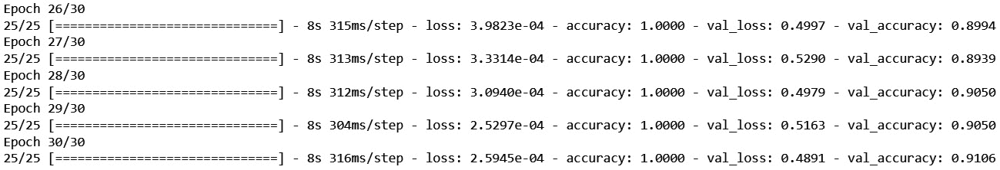
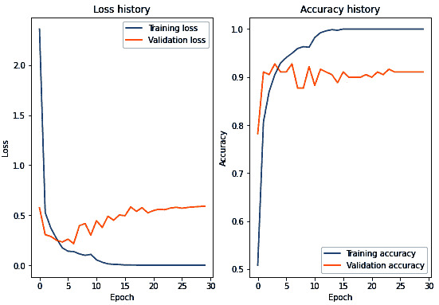
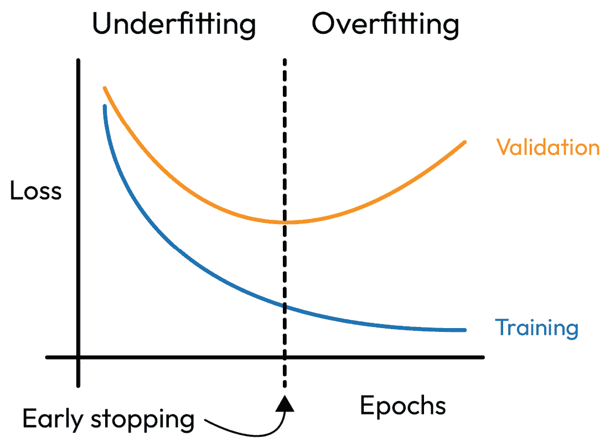
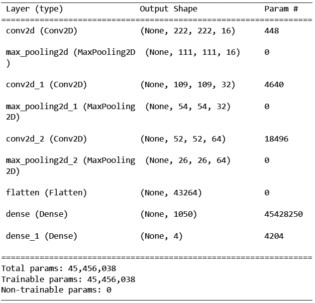
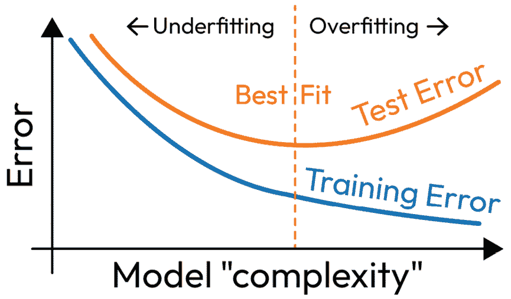
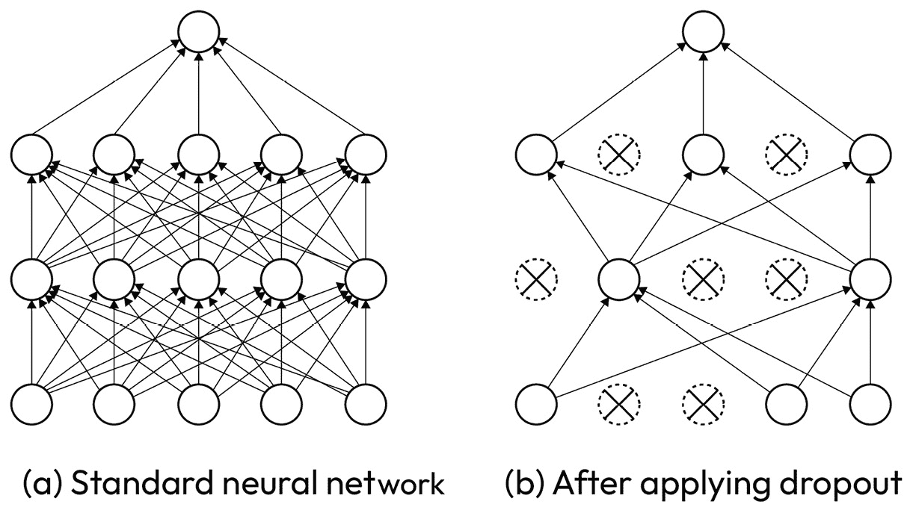
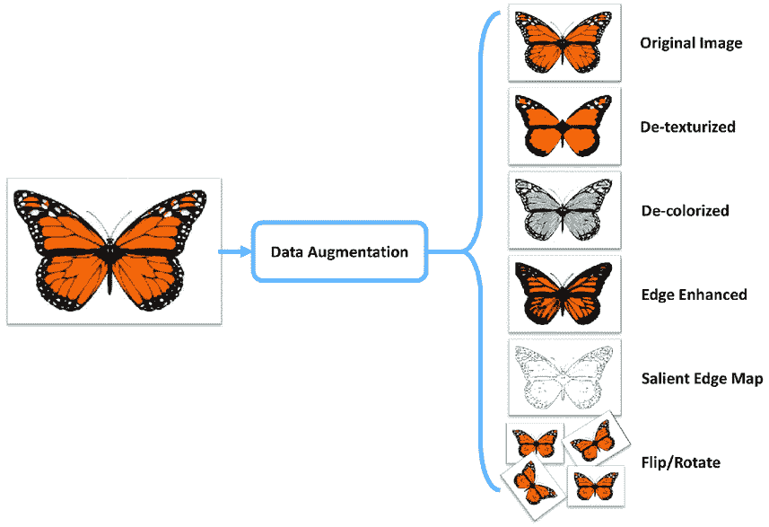
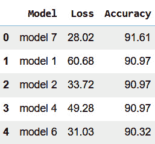

# 第八章：处理过拟合

机器学习（**ML**）中的一个主要挑战是过拟合。**过拟合**发生在模型对训练数据的拟合过好，但在未见过的数据上表现不佳，导致性能差。在*第六章*中，*改进模型*，我们亲眼见证了过度训练如何将我们的模型推入过拟合的陷阱。在本章中，我们将进一步探讨过拟合的细微差别，努力揭示其警告信号及其潜在原因。同时，我们还将探索可以应用的各种策略，以减轻过拟合对现实世界机器学习应用的危害。通过 TensorFlow，我们将以实践的方式应用这些思想，克服在实际案例中遇到的过拟合问题。通过本章学习结束后，你应该对过拟合的概念以及如何在现实世界的图像分类任务中减少过拟合有一个扎实的理解。

在本章中，我们将讨论以下主题：

+   机器学习中的过拟合

+   提前停止

+   更改模型架构

+   L1 和 L2 正则化

+   Dropout 正则化

+   数据增强

# 技术要求

我们将使用 Google Colab 来运行需要 `python >= 3.8.0` 的编码练习，并且需要安装以下包，可以通过 `pip install` 命令进行安装：

+   `tensorflow>=2.7.0`

+   `os`

+   `pillow==8.4.0`

+   `pandas==1.3.4`

+   `numpy==1.21.4`

+   `matplotlib >=3.4.0`

本书的代码包可以通过以下 GitHub 链接访问：[`github.com/PacktPublishing/TensorFlow-Developer-Certificate`](https://github.com/PacktPublishing/TensorFlow-Developer-Certificate)。此外，所有练习的解答也可以在 GitHub 仓库中找到。

# 机器学习中的过拟合

从前面的章节中，我们已经知道了什么是过拟合，以及它在未见过的数据上使用时的负面影响。接下来，我们将进一步探讨过拟合的根本原因，如何在构建模型时识别过拟合，以及可以应用的一些重要策略来抑制过拟合。当我们理解了这些内容后，就可以继续构建有效且强大的机器学习模型。

## 触发过拟合的原因

在*第六章*，*改进模型*中，我们看到通过向隐藏层添加更多神经元，我们的模型变得过于复杂。这使得模型不仅捕捉到了数据中的模式，还捕捉到了数据中的噪声，从而导致了过拟合。另一个导致过拟合的根本原因是数据量不足。如果我们的数据无法真正捕捉到模型在部署后将面临的所有变化，当我们在这样的数据集上训练模型时，它会变得过于专门化，并且在实际应用中无法进行有效的泛化。

除了数据量之外，我们还可能面临另一个问题——噪声数据。与处理经过筛选或静态的数据不同，在构建实际应用时，我们可能会发现数据存在噪声或错误。如果我们使用这些数据开发模型，可能会导致在实际使用时出现过拟合的情况。我们已经讨论了关于过拟合可能发生的一些原因；接下来我们可能想要问的问题是，我们如何检测过拟合？让我们在接下来的子章节中讨论这个问题。

## 检测过拟合

检测过拟合的一种方法是比较模型在训练数据和验证/测试数据上的准确度。当模型在训练数据上表现出高准确度，而在测试数据上表现不佳时，这种差异表明模型已经记住了训练样本，因此在未见过的数据上的泛化能力较差。另一种有效的发现过拟合的方法是检查训练误差与验证误差。当训练误差随着时间的推移逐渐减小，而验证误差却增加时，这可能表明我们的模型过拟合了，因为模型在验证数据上的表现变差。当模型的验证准确度恶化，而训练准确度却不断提升时，应该引起警觉，可能存在过拟合的风险。

让我们回顾一下来自*第七章*的案例研究，*卷积神经网络的图像分类*，以及 WeatherBIG 的天气数据集，并探讨在模型训练过程中如何通过使用验证数据集来监控过拟合。通过使用验证数据集，我们可以准确地追踪模型的表现，防止过拟合。首先，我们将创建一个基准模型。

# 基准模型

按照构建、编译和拟合的标准三步法，我们将构建一个**卷积神经网络**（**CNN**）模型，该模型包括两个 Conv2D 和池化层，并配有一个具有 1,050 个神经元的全连接层。输出层由四个神经元组成，表示我们数据集中的四个类别。然后，我们使用训练数据将模型编译并拟合 20 个周期：

```py
#Build
model_1 = tf.keras.models.Sequential([
    tf.keras.layers.Conv2D(filters=16,
        kernel_size=3, # can also be (3, 3)
        activation="relu",
        input_shape=(224, 224, 3)),
        #(height, width, colour channels)
    tf.keras.layers.MaxPool2D(2,2),
    tf.keras.layers.Conv2D(32, 3, activation="relu"),
    tf.keras.layers.MaxPool2D(2,2),
    tf.keras.layers.Conv2D(64, 3, activation="relu"),
    tf.keras.layers.MaxPool2D(2,2),
    tf.keras.layers.Flatten(),
    tf.keras.layers.Dense(1050, activation="relu"),
    tf.keras.layers.Dense(4, activation="softmax")
])
# Compile the model
model_1.compile(loss="CategoricalCrossentropy",
    optimizer=tf.keras.optimizers.Adam(),
    metrics=["accuracy"])
#fit
history_1 = model_1.fit(train_data,
    epochs=20,
    validation_data=valid_data
)
```

我们将`validation_data`参数设置为`valid_data`。这确保了当我们运行代码时，在每个周期结束后，模型会在验证数据上评估其性能，如*图 8.1*所示。



图 8.1 – 最后的五个训练周期

这是一种直观的方法，可以比较训练集和验证集之间的损失值。我们可以看到模型能够准确地预测训练集中的每个样本，达到了 100%的准确率。然而，在验证集上，它的准确率为 91%，这表明模型可能存在过拟合问题。观察过拟合的另一种有效方法是使用学习曲线，绘制训练集和验证集的损失和准确度值——如*图 8.2*所示，两个图之间存在较大的差距，表明模型存在过拟合。



图 8.2 – 显示训练和测试数据的损失和准确度的学习曲线

在实验开始时，训练损失和验证损失之间的差异较小；然而，进入第四轮时，验证损失开始增加，而训练损失继续下降。类似地，训练和验证的准确度开始时较为接近，但在大约第四轮时，验证准确率达到了 90%左右并保持在该水平，而训练准确率达到了 100%。

构建图像分类器的最终目标是将其应用于现实世界的数据。在完成训练过程后，我们使用保留数据集评估模型。如果在测试中获得的结果与训练过程中取得的结果有显著差异，这可能表明模型存在过拟合。

幸运的是，有几种策略可以用来克服过拟合问题。一些主要的应对过拟合的技术侧重于改进模型本身，以提高其泛化能力。另一方面，检查数据本身同样重要，观察模型在训练和评估过程中忽视的部分。通过可视化错误分类的图像，我们可以洞察模型的不足之处。我们从*第七章*《卷积神经网络图像分类》开始，首先重新创建我们的基线模型。这次我们将其训练 20 轮，以便观察过拟合问题，如*图 8.2*所示。接下来，让我们看看如何通过多种策略来抑制过拟合，首先是应用早停法。

# 早停法

在*第六章*《改进模型》中，我们介绍了早停法的概念，这是一种有效的防止过拟合的方法。它通过在模型性能未能在定义的若干轮次内改善时停止训练，如*图 8.3*所示，从而避免了过拟合的发生。



图 8.3 – 显示早停法的学习曲线

让我们重新创建相同的基准模型，但这次我们将应用一个内置回调，在验证精度未能提高时停止训练。我们将使用与第一个模型相同的构建和编译步骤，然后在拟合模型时添加回调：

```py
#Fit the model
# Add an early stopping callback
callbacks = [tf.keras.callbacks.EarlyStopping(
    monitor="val_accuracy", patience=3,
    restore_best_weights=True)]
history_2 = model_2.fit(train_data,
    epochs=20,
    validation_data=valid_data,
    callbacks=[callbacks])
```

在这里，我们将周期数指定为`20`，并添加了验证集来监控模型在训练过程中的表现。之后，我们使用`callbacks`参数指定了一个回调函数来实现早停。我们使用了一个早停回调，在验证集的精度未能提高时，训练将在三轮后停止。通过将`patience`参数设置为`3`来实现这一点。这意味着如果验证精度连续三轮没有进展，早停回调将停止训练。我们还将`restore_best_weights`参数设置为`True`；这将在训练结束时恢复训练过程中最好的模型权重。`fit`函数的信息存储在`history_2`变量中：

```py
Epoch 8/20
25/25 [==============================] - 8s 318ms/step - loss: 0.0685 - accuracy: 0.9810 - val_loss: 0.3937 - val_accuracy: 0.8827
Epoch 9/20
25/25 [==============================] - 8s 325ms/step - loss: 0.0368 - accuracy: 0.9912 - val_loss: 0.3338 - val_accuracy: 0.9218
Epoch 10/20
25/25 [==============================] - 8s 316ms/step - loss: 0.0169 - accuracy: 0.9987 - val_loss: 0.4322 - val_accuracy: 0.8994
Epoch 11/20
25/25 [==============================] - 8s 297ms/step - loss: 0.0342 - accuracy: 0.9912 - val_loss: 0.2994 - val_accuracy: 0.8994
Epoch 12/20
25/25 [==============================] - 8s 318ms/step - loss: 0.1352 - accuracy: 0.9570 - val_loss: 0.4503 - val_accuracy: 0.8939
```

从训练过程来看，我们可以看到模型在第九个周期达到了`0.9218`的最高验证精度，之后训练继续进行了三轮才停止。由于验证精度没有进一步提升，训练被停止，并保存了最佳权重。现在，让我们在测试数据上评估`model_2`：

```py
model_2.evaluate(test_data)
```

当我们运行代码时，我们看到模型达到了`0.9355`的精度。在这里，测试集的表现与验证集的表现一致，并且高于我们的基准模型，后者的精度为`0.9097`。这是我们创建更好模型的第一步。



图 8.4 – 模型总结快照

当我们检查模型总结时，我们可以看到我们的模型有超过 4500 万个参数，这可能导致模型容易在训练数据中拾取噪声，因为模型高度参数化。为了解决这个问题，我们可以通过减少参数数量来简化模型，使得我们的模型对于数据集来说不会过于复杂。接下来，我们将讨论模型简化。

## 模型简化

为了应对过拟合，你可以考虑重新评估模型的架构。简化模型的架构可能是应对过拟合的有效策略，特别是在模型高度参数化时。然而，重要的是要知道，这种方法并不总能在每种情况下保证更好的表现；事实上，你必须警惕模型过于简化，这可能导致欠拟合的陷阱。因此，重要的是在模型复杂性和简化之间找到合适的平衡，以实现最佳性能，如*图 8.5*所示，因为模型复杂性与过拟合之间的关系不是线性的。



图 8.5 – 机器学习中的过拟合和欠拟合

模型简化可以通过多种方式实现——例如，我们可以用更小的滤波器替换大量的滤波器，或者我们还可以减少第一个 `Dense` 层中的神经元数量。在我们的架构中，你可以看到第一个全连接层有 `1050` 个神经元。作为模型简化实验的初步步骤，让我们将神经元数量减少到 `500`：

```py
    tf.keras.layers.Flatten(),
    tf.keras.layers.Dense(500, activation="relu"),
    tf.keras.layers.Dense(4, activation="softmax")
])
```

当我们编译并拟合模型时，我们的模型在验证集上达到了 `0.9162` 的最高准确率：

```py
Epoch 5/50
25/25 [==============================] - 8s 300ms/step - loss: 0.1284 - accuracy: 0.9482 - val_loss: 0.4489 - val_accuracy: 0.8771
Epoch 6/50
25/25 [==============================] - 8s 315ms/step - loss: 0.1122 - accuracy: 0.9659 - val_loss: 0.2414 - val_accuracy: 0.9162
Epoch 7/50
25/25 [==============================] - 8s 327ms/step - loss: 0.0814 - accuracy: 0.9735 - val_loss: 0.2976 - val_accuracy: 0.9050
Epoch 8/50
25/25 [==============================] - 11s 441ms/step - loss: 0.0541 - accuracy: 0.9785 - val_loss: 0.2215 - val_accuracy: 0.9050
Epoch 9/50
25/25 [==============================] - 8s 313ms/step - loss: 0.1279 - accuracy: 0.9621 - val_loss: 0.2848 - val_accuracy: 0.8994
```

由于我们的验证准确率并没有更好，或许现在是时候尝试一些著名的想法来解决过拟合问题了。让我们在接下来的小节中看一下 L1 和 L2 正则化。我们将讨论它们如何工作，并将其应用到我们的案例研究中。

注意

模型简化的目标不是为了得到更小的模型，而是为了设计出一个能很好地泛化的模型。我们可能只需要减少不必要的层，或者通过改变激活函数，或者重新组织模型层的顺序和排列，以改善信息流动，从而简化模型。

## L1 和 L2 正则化

正则化是一组通过向损失函数应用惩罚项来减少模型复杂性，从而防止过拟合的技术。正则化技术使模型对训练数据中的噪声更加抗干扰，从而提高了它对未见数据的泛化能力。正则化技术有多种类型，分别是 L1 和 L2 正则化。**L1 和 L2 正则化**是两种广为人知的正则化技术；L1 也可以称为 **套索回归**。在选择 L1 和 L2 时，重要的是要考虑我们所处理数据的类型。

当处理具有大量无关特征的数据时，L1 正则化非常有用。L1 中的惩罚项会导致一些系数变为零，从而减少在建模过程中使用的特征数量；这反过来减少了过拟合的风险，因为模型将基于较少的噪声数据进行训练。相反，当目标是创建具有小权重和良好泛化能力的模型时，L2 是一个非常好的选择。L2 中的惩罚项减少了系数的大小，防止它们变得过大，从而导致过拟合：

```py
    tf.keras.layers.Flatten(),
    tf.keras.layers.Dense(1050, activation="relu",
        kernel_regularizer=regularizers.l2(0.01)),
    tf.keras.layers.Dense(4, activation="softmax")
    # binary activation output
])
```

当我们运行这个实验时，准确率大约为 92%，并没有比其他实验表现得更好。为了尝试 L1 正则化，我们只是将正则化方法从 L2 改为 L1。然而，在这种情况下，我们的结果并不好。因此，让我们尝试另一种叫做 dropout 正则化的正则化方法。

## Dropout 正则化

神经网络的一个关键问题是共依赖性。**共依赖性**是神经网络中一种现象，当一组神经元，特别是同一层中的神经元，变得高度相关，以至于它们过度依赖彼此时，就会发生共依赖性。这可能导致它们放大某些特征，同时无法捕捉到数据中的其他重要特征。由于这些神经元同步工作，我们的模型更容易发生过拟合。为了减轻这一风险，我们可以应用一种称为 **dropout** 的技术。与 L1 和 L2 正则化不同，dropout 不会添加惩罚项，但顾名思义，在训练过程中我们会随机“丢弃”一部分神经元，如 *图 8.6* 所示，这有助于减少神经元之间的共依赖性，从而有助于防止过拟合。



图 8.6 – 应用了 dropout 的神经网络

当我们应用 dropout 技术时，模型被迫学习更鲁棒的特征，因为我们打破了神经元之间的共依赖性。然而，值得注意的是，当我们应用 dropout 时，训练过程可能需要更多的迭代才能达到收敛。让我们将 dropout 应用到我们的基础模型上，观察它的效果：

```py
    tf.keras.layers.Flatten(),
    tf.keras.layers.Dense(1050, activation="relu"),
    tf.keras.layers.Dropout(0.6), # added dropout layer
    tf.keras.layers.Dense(4, activation="softmax")])
```

要在代码中实现 dropout，我们使用 `tf.keras.layers.Dropout(0.6)` 函数来指定 dropout 层。这会创建一个 dropout 层，dropout 率为 `0.6` —— 即在训练过程中我们会关闭 60% 的神经元。值得注意的是，我们可以将 dropout 值设置在 0 和 1 之间：

```py
25/25 [==============================] - 8s 333ms/step - loss: 0.3069 - accuracy: 0.8913 - val_loss: 0.2227 - val_accuracy: 0.9330
Epoch 6/10
25/25 [==============================] - 8s 317ms/step - loss: 0.3206 - accuracy: 0.8824 - val_loss: 0.1797 - val_accuracy: 0.9441
Epoch 7/10
25/25 [==============================] - 8s 322ms/step - loss: 0.2557 - accuracy: 0.9166 - val_loss: 0.2503 - val_accuracy: 0.8994
Epoch 8/10
25/25 [==============================] - 9s 339ms/step - loss: 0.1474 - accuracy: 0.9469 - val_loss: 0.2282 - val_accuracy: 0.9274
Epoch 9/10
25/25 [==============================] - 8s 326ms/step - loss: 0.2321 - accuracy: 0.9241 - val_loss: 0.3958 - val_accuracy: 0.8659
```

在这个实验中，我们的模型在验证集上达到了 `0.9441` 的最佳性能，提升了基础模型的表现。接下来，让我们看看调整学习率的效果。

## 调整学习率

在 *第六章*《*提高模型*》中，我们讨论了学习率以及寻找最优学习率的重要性。在这个实验中，我们使用 `0.0001` 的学习率，这是通过尝试不同的学习率得到的一个良好结果，类似于我们在 *第六章*《*提高模型*》中做的实验。在 *第十三章*《*使用 TensorFlow 进行时间序列、序列和预测*》中，我们将研究如何应用自定义和内建的学习率调度器。这里，我们还应用了早停回调，以确保当模型无法再提高时，训练能够终止。让我们编译我们的模型：

```py
# Compile the model
model_7.compile(loss="CategoricalCrossentropy",
    optimizer=tf.keras.optimizers.Adam(learning_rate=0.0001),
    metrics=["accuracy"])
```

我们将拟合模型并运行它。在七个 epoch 后，我们的模型训练停止，达到了验证集上的最佳性能 `0.9274`：

```py
Epoch 3/10
25/25 [==============================] - 8s 321ms/step - loss: 0.4608 - accuracy: 0.8508 - val_loss: 0.2776 - val_accuracy: 0.8994
Epoch 4/10
25/25 [==============================] - 8s 305ms/step - loss: 0.3677 - accuracy: 0.8824 - val_loss: 0.2512 - val_accuracy: 0.9274
Epoch 5/10
25/25 [==============================] - 8s 316ms/step - loss: 0.3143 - accuracy: 0.8925 - val_loss: 0.4450 - val_accuracy: 0.8324
Epoch 6/10
25/25 [==============================] - 8s 317ms/step - loss: 0.2749 - accuracy: 0.9052 - val_loss: 0.3427 - val_accuracy: 0.8603
Epoch 7/10
25/25 [==============================] - 8s 322ms/step - loss: 0.2241 - accuracy: 0.9279 - val_loss: 0.2996 - val_accuracy: 0.8659
```

我们已经探索了各种方法来改善我们的模型并克服过拟合问题。现在，让我们将焦点转向数据集本身，看看错误分析如何发挥作用。

## 错误分析

根据我们目前的结果，我们可以看到模型未能正确地将某些标签分类。为了进一步提高模型的泛化能力，最好检查模型所犯的错误，其背后的思想是揭示误分类数据中的模式，以便我们从查看误分类标签中获得的洞察可以用于改善模型的泛化能力。这种技术称为**错误分析**。进行错误分析时，我们首先通过识别验证/测试集中的误分类标签开始。接下来，我们将这些错误分组——例如，我们可以将模糊图像或光照条件差的图像归为一组。

基于从收集到的错误中获得的洞察，我们可能需要调整我们的模型架构或调整超参数，特别是当模型未能捕捉到某些特征时。此外，我们的错误分析步骤也可能会指出需要改善数据的大小和质量。解决这一问题的有效方法之一是应用数据增强，这是一种众所周知的技术，用于丰富我们的数据量和质量。接下来，让我们讨论数据增强并将其应用于我们的案例研究。

## 数据增强

图像**数据增强**是一种通过应用各种变换（例如旋转、翻转、裁剪和缩放）来增加我们训练集的大小和多样性的技术，从而创建新的合成数据，如*图 8.7*所示。对于许多实际应用来说，数据收集可能是一个非常昂贵且耗时的过程；因此，数据增强非常有用。数据增强帮助模型学习更具鲁棒性的特征，而不是让模型记住特征，从而提高模型的泛化能力。



图 8.7 – 应用于蝴蝶图像的各种数据增强技术（来源：https://medium.com/secure-and-private-ai-writing-challenge/data-augmentation-increases-accuracy-of-your-model-but-how-aa1913468722）

数据增强的另一个重要用途是为了在训练数据集中创建不同类别之间的平衡。如果训练集包含不平衡的数据，我们可以使用数据增强技术来创建少数类的变体，从而构建一个更加平衡的数据集，降低过拟合的可能性。在实施数据增强时，重要的是要牢记可能影响结果的各种因素。例如，使用哪种类型的数据增强取决于我们所处理的数据类型。

在图像分类任务中，诸如随机旋转、平移、翻转和缩放等技术可能会证明是有用的。然而，在处理数字数据集时，对数字应用旋转可能会导致意想不到的结果，比如将数字 6 旋转成 9。再者，翻转字母表中的字母，比如“b”和“d”，也可能带来不良影响。当我们对训练集应用图像增强时，考虑增强的幅度及其对训练数据质量的影响至关重要。过度增强可能导致图像严重失真，从而导致模型性能不佳。为防止这种情况的发生，监控模型的训练过程并使用验证集同样重要。

让我们对案例研究应用数据增强，看看我们的结果会是什么样子。

要实现数据增强，您可以使用 `tf.keras.preprocessing.image` 模块中的 `ImageDataGenerator` 类。这个类允许您指定一系列的变换，这些变换只应应用于训练集中的图像，并且它会在训练过程中实时生成合成图像。例如，您可以使用 `ImageDataGenerator` 类对训练图像应用旋转、翻转和缩放变换，方法如下：

```py
train_datagen = ImageDataGenerator(rescale=1./255,
    rotation_range=25, zoom_range=0.3)
valid_datagen = ImageDataGenerator(rescale=1./255)
# Set up the train, validation, and test directories
train_dir = "/content/drive/MyDrive/weather dataset/train/"
val_dir = "/content/drive/MyDrive/weather dataset/validation/"
test_dir = "/content/drive/MyDrive/weather dataset/test/"
# Import data from directories and turn it into batches
train_data = train_datagen.flow_from_directory(
    train_dir,
    target_size=(224,224), # convert all images to be 224 x 224
    class_mode="categorical")
valid_data = valid_datagen.flow_from_directory(
    val_dir,
    target_size=(224,224),
    class_mode="categorical")
test_data = valid_datagen.flow_from_directory(
    test_dir,
    target_size=(224,224),
    class_mode="categorical",)
```

使用图像数据增强非常简单；我们为训练集、验证集和测试集创建了 `keras.preprocessing.image` 模块中的 `ImageDataGenerator` 类的三个实例。一个关键的区别是，我们在 `train_datagen` 对象中添加了 `rotation_range=25` 和 `zoom_range=0.3` 参数。这样，在训练过程中，图像将随机旋转 25 度并缩放 0.3 倍，其他所有设置保持不变。

接下来，我们将构建、编译并拟合我们的基准模型，并应用早停技术，在增强数据上进行训练：

```py
Epoch 4/20
25/25 [==============================] - 8s 308ms/step - loss: 0.2888 - accuracy: 0.9014 - val_loss: 0.3256 - val_accuracy: 0.8715
Epoch 5/20
25/25 [==============================] - 8s 312ms/step - loss: 0.2339 - accuracy: 0.9115 - val_loss: 0.2172 - val_accuracy: 0.9330
Epoch 6/20
25/25 [==============================] - 8s 320ms/step - loss: 0.1444 - accuracy: 0.9507 - val_loss: 0.2379 - val_accuracy: 0.9106
Epoch 7/20
25/25 [==============================] - 8s 315ms/step - loss: 0.1190 - accuracy: 0.9545 - val_loss: 0.2828 - val_accuracy: 0.9162
Epoch 8/20
25/25 [==============================] - 8s 317ms/step - loss: 0.0760 - accuracy: 0.9785 - val_loss: 0.3220 - val_accuracy: 0.8883
```

在八个训练周期后，我们的训练结束了。这次，我们在验证集上的得分达到了 `0.9330`。到目前为止，我们已经运行了七个不同的实验。接下来，让我们在测试集上测试这些模型，看看结果如何。为此，我们将编写一个辅助函数，创建一个 DataFrame，显示前五个模型、每个模型的名称，以及每个模型的损失和准确度，如 *图 8.8* 所示。



图 8.8 – 显示前五个模型的损失和准确度的 DataFrame

在我们的测试数据中，表现最好的模型是**模型 7**，它调整了学习率。我们已经讨论了一些在现实世界中用于解决图像分类过拟合问题的想法；然而，结合这些技术可以构建一个更简单但更强大的模型，从而减少过拟合的风险。通常来说，将多种技术结合起来遏制过拟合是一个好主意，因为这可能有助于生成一个更强大且更具泛化能力的模型。然而，重要的是要记住，没有一刀切的解决方案，最好的方法组合将取决于具体的数据和任务，并可能需要多次实验。

# 总结

在本章中，我们讨论了图像分类中的过拟合问题，并探索了克服它的不同技术。我们首先探讨了什么是过拟合以及为什么会发生过拟合，接着讨论了如何应用不同的技术，如提前停止、模型简化、L1 和 L2 正则化、dropout 以及数据增强来缓解图像分类任务中的过拟合问题。此外，我们还在天气数据集的案例研究中应用了这些技术，并通过实际操作观察了这些技术在案例中的效果。我们还探讨了将这些技术结合起来，以构建一个最优模型的过程。到目前为止，你应该已经对过拟合以及如何在自己的图像分类项目中减轻过拟合有了深入的了解。

在下一章中，我们将深入探讨迁移学习，这是一种强大的技术，能够让你利用预训练的模型来完成特定的图像分类任务，从而节省时间和资源，同时取得令人印象深刻的结果。

# 问题

让我们来测试一下本章学到的内容：

1.  图像分类任务中的过拟合是什么？

1.  过拟合是如何发生的？

1.  可以使用哪些技术来防止过拟合？

1.  什么是数据增强，如何利用它来防止过拟合？

1.  如何通过数据预处理、数据多样性和数据平衡来缓解过拟合？

# 深入阅读

如需了解更多内容，您可以查看以下资源：

+   Garbin, C., Zhu, X., & Marques, O. (2020). *Dropout 与 Batch Normalization 的对比：它们对深度学习的影响的实证研究*。arXiv 预印本 arXiv:1911.12677：[`par.nsf.gov/servlets/purl/10166570`](https://par.nsf.gov/servlets/purl/10166570)。

+   Kandel, I., & Castelli, M. (2020). *批量大小对卷积神经网络在组织病理学数据集上泛化能力的影响*。arXiv 预印本 arXiv:2003.00204。

+   *Effect_batch_size_generalizability_convolutional_neural_networks_histopathology_dataset.pdf (unl.pt)*。Kapoor, A., Gulli, A. 和 Pal, S. (2020): [`research.unl.pt/ws/portalfiles/portal/18415506/Effect_batch_size_generalizability_convolutional_neural_networks_histopathology_dataset.pdf`](https://research.unl.pt/ws/portalfiles/portal/18415506/Effect_batch_size_generalizability_convolutional_neural_networks_histopathology_dataset.pdf)。

+   *TensorFlow 与 Keras 深度学习（第三版），Amita Kapoor，Antonio Gulli，Sujit Pal*，Packt Publishing Ltd.

+   Nitish Srivastava, Geoffrey Hinton, Alex Krizhevsky, Ilya Sutskever, 和 Ruslan Salakhutdinov. 2014\. *Dropout: 一种简单的防止神经网络过拟合的方法*。J. Mach. Learn. Res. 15, 1 (2014), 1,929–1,958 [`jmlr.org/papers/volume15/srivastava14a/srivastava14a.pdf`](https://jmlr.org/papers/volume15/srivastava14a/srivastava14a.pdf).

+   Zhang, Z., Ma, H., Fu, H., & Zha, C. (2016). *无场景的单图像多类别天气分类*。IEEE Access, 8, 146,038–146,049\. doi:10.1109: [`web.cse.ohio-state.edu/~zhang.7804/Cheng_NC2016.pdf`](https://web.cse.ohio-state.edu/~zhang.7804/Cheng_NC2016.pdf).
