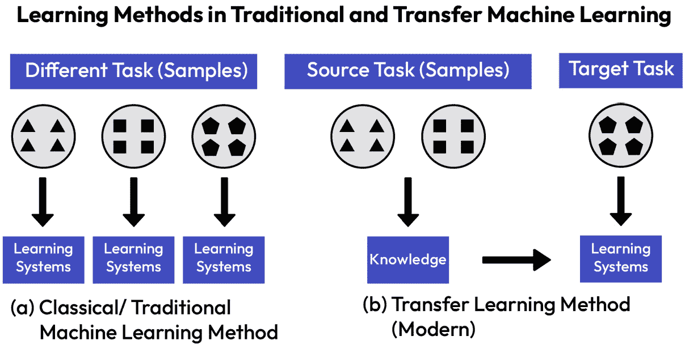
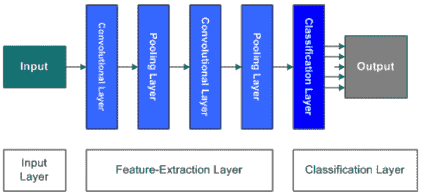
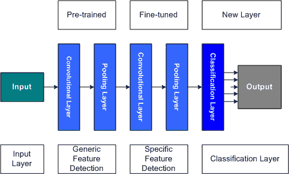
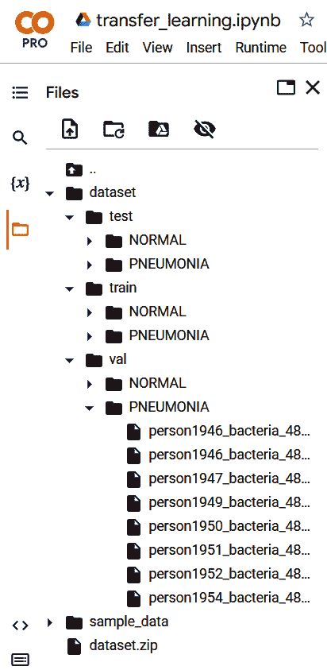
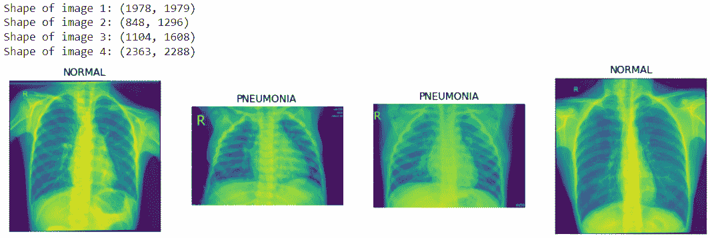
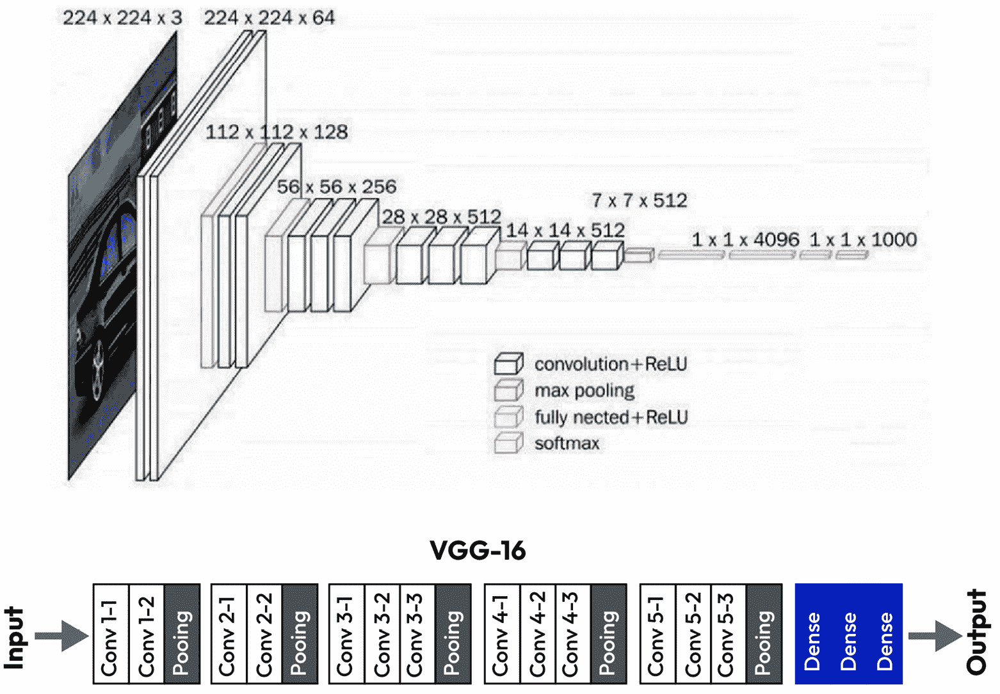
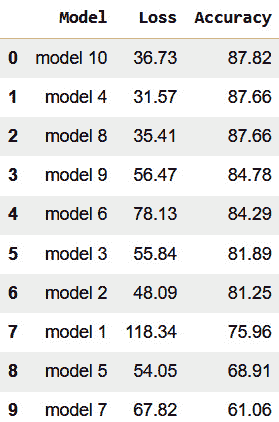

# 第九章：转移学习

过去十年在**机器学习**（**ML**）领域最重要的进展之一是**转移学习**的概念，这一点当之无愧。转移学习是将从源任务中获得的知识应用到目标任务中的过程，目标任务与源任务不同但相关。这种方法不仅在节省训练深度神经网络所需的计算资源方面非常有效，而且在目标数据集较小的情况下也表现出色。转移学习通过重用从预训练模型中学到的特征，使我们能够构建性能更好的模型，并更快地达到收敛。由于其众多的优势，转移学习已经成为一个广泛研究的领域，许多研究探讨了转移学习在不同领域中的应用，如图像分类、目标检测、自然语言处理和语音识别等。

在本章中，我们将介绍转移学习的概念，探讨它是如何工作的，以及转移学习在不同应用场景中的一些最佳实践。我们将借助知名的预训练模型，在现实世界的应用中应用转移学习的概念。我们将看到如何将这些预训练模型作为特征提取器进行应用，并学习如何微调它们以实现最佳结果。在本章结束时，你将对转移学习有一个扎实的理解，并能有效地将其应用于构建现实世界的图像分类器。

在本章中，我们将涵盖以下主题：

+   转移学习简介

+   转移学习的类型

+   使用转移学习构建现实世界的图像分类器

# 技术要求

我们将使用 Google Colab 进行编码练习，这需要 `python >= 3.8.0`，并且需要以下软件包，可以通过 `pip` `install` 命令进行安装：

+   `tensorflow>=2.7.0`

+   `os`

+   `matplotlib >=3.4.0`

+   `pathlib`

本书的代码包可以通过以下 GitHub 链接获取：[`github.com/PacktPublishing/TensorFlow-Developer-Certificate`](https://github.com/PacktPublishing/TensorFlow-Developer-Certificate)。所有习题的解答也可以在该 GitHub 仓库中找到。

# 转移学习简介

作为人类，我们很容易将从一个任务或活动中获得的知识转移到另一个任务中。例如，如果你精通 Python（编程语言，不是蛇），并且决定学习 Rust，凭借你在 Python 上的背景知识，你会发现学习 Rust 比没有任何编程语言基础的人要容易得多。这是因为一些概念，如面向对象编程，在不同的编程语言中有相似之处。转移学习遵循相同的原理。

迁移学习是一种技术，我们利用在*任务 A*上预训练的模型来解决一个不同但相关的*任务 B*。例如，我们使用在一个任务上训练的神经网络，并将获得的知识转移到多个相关任务中。在图像分类中，我们通常使用已经在非常大的数据集上训练的深度学习模型，比如 ImageNet，它由超过 1,000,000 张图像组成，涵盖 1,000 个类别。这些预训练模型获得的知识可以应用于许多不同的任务，例如在照片中分类不同品种的狗。就像我们因为懂得 Python 而能更快地学习 Rust 一样，迁移学习也适用——预训练的模型可以利用从源任务中获得的信息，并将其应用于目标任务，从而减少训练时间和对大量注释数据的需求，而这些数据可能在目标任务中不可得或难以收集。

迁移学习不仅限于图像分类任务；它还可以应用于其他深度学习任务，例如自然语言处理、语音识别和目标检测。在*第十一章*《使用 TensorFlow 进行 NLP》中，我们将把迁移学习应用于文本分类。在那里，我们将看到如何对在大规模文本语料库上训练的预训练模型（我们将从 TensorFlow Hub 获取）进行微调，从而进行文本分类。

在经典机器学习中，如在*图 9.1(a)*所示，我们为每个任务从头开始训练模型，正如我们在本书中迄今为止所做的那样。这种方法需要大量的资源和数据。



图 9.1 – 传统机器学习与迁移学习

然而，研究人员发现，模型可以通过学习视觉特征，从一个庞大的数据集（如 ImageNet）中学习低级特征，并将这些特征应用于一个新的、相关的任务，如*图 9.1(b)*所示——例如，在我们在*第八章*《处理过拟合》中使用的天气数据集的分类中。通过应用迁移学习，我们可以利用模型在大数据集上训练过程中获得的知识，并有效地将其适应于解决不同但相关的任务。这种方法被证明是有用的，因为它不仅节省了训练时间和资源，还学会了提高性能，即使在目标任务可用数据有限的情况下。

# 迁移学习的类型

我们可以在卷积神经网络（CNN）中通过两种主要方式应用迁移学习。首先，我们可以将预训练模型作为特征提取器。在这种情况下，我们冻结卷积层的权重，以保留源任务中获得的知识，并添加一个新的分类器，该分类器用于第二任务的分类。这是可行的，因为卷积层是可重用的，它们只学习了低级特征，如边缘、角落和纹理，这些是通用的并且适用于不同的图像，如*图 9**.2*所示，而全连接层则用于学习高级细节，这些细节用于在照片中分类不同的物体。



图 9.2 – 迁移学习作为特征提取器

迁移学习的第二种应用方法是解冻预训练模型的部分层，并添加一个分类器模型来识别高级特征，如*图 9**.3*所示。在这里，我们同时训练解冻的层和新的分类器。预训练模型作为新任务的起点，解冻层的权重与分类层一起微调，以使模型适应新任务。



图 9.3 – 迁移学习作为微调模型

预训练模型是已经在大数据集上训练过的深度网络。通过利用这些模型已经获得的知识和权重，我们可以将它们用作特征提取器，或通过较小的数据集和更少的训练时间对它们进行微调以适应我们的使用场景。迁移学习为机器学习实践者提供了访问最先进模型的途径，这些模型可以通过 TensorFlow 中的 API 快速、轻松地访问。这意味着我们不必总是从头开始训练我们的模型，从而节省时间和计算资源，因为微调模型比从头开始训练要快。

我们可以将预训练模型应用于相关的使用场景，从而可能提高准确性并加快收敛速度。然而，如果源领域和目标领域不相关，迁移学习可能不仅失败，还可能由于学习到的特征不相关，反而损害目标任务的性能，这种情况称为负迁移。让我们将迁移学习应用于一个真实世界的图像分类任务。我们将探索一些表现最好的预训练模型，如 VGG、Inception、MobileNetV2 和 EfficientNet。这些模型已经为图像分类任务进行了预训练。让我们看看它们在给定任务中的表现如何。

# 使用迁移学习构建一个真实世界的图像分类器

在这个案例研究中，你的公司获得了一个医疗项目，你被指派负责为 GETWELLAI 构建一个肺炎分类器。你已经获得了超过 5000 张 X 射线 JPEG 图像，包含两类（肺炎和正常）。数据集由专业医生标注，低质量的图像已被移除。让我们看看如何使用我们迄今为止讨论的两种迁移学习技术来解决这个问题。

## 加载数据

执行以下步骤以加载数据：

1.  和往常一样，我们首先加载我们项目所需的必要库：

    ```py
    #Import necessary libraries
    
    import os
    
    import pathlib
    
    import matplotlib.pyplot as plt
    
    import matplotlib.image as mpimg
    
    import random
    
    import numpy as np
    
    from PIL import Image
    
    import pandas as pd
    
    import tensorflow as tf
    
    from tensorflow import keras
    
    from tensorflow.keras.preprocessing.image import ImageDataGenerator
    
    from tensorflow.keras.callbacks import EarlyStopping
    
    from tensorflow.keras import regularizer
    ```

1.  接下来，让我们加载 X 射线数据集。为此，我们将使用 `wget` 命令从指定的 URL 下载文件：

    ```py
    !wget https://storage.googleapis.com/x_ray_dataset/dataset.zip
    ```

1.  下载的文件作为 ZIP 文件保存在我们 Colab 实例的当前工作目录中，文件中包含 X 射线图像的数据集。

1.  接下来，我们将通过运行以下代码来提取 `zip` 文件夹的内容：

    ```py
    !unzip dataset.zip
    ```

当我们运行代码时，我们将提取一个名为 `dataset` 的文件夹，其中包含 `test`、`val` 和 `train` 子目录，每个子目录中都有正常和肺炎 X 射线图像的数据，如 *图 9.4* 所示：



图 9.4 – 当前工作目录的快照，包含已提取的 ZIP 文件

1.  我们将使用以下代码块来提取子目录及其中文件的数量。我们在 *第八章**,* *处理过拟合* 中也看到了这段代码块：

    ```py
    root_dir = "/content/dataset"
    
    for dirpath, dirnames, filenames in os.walk(root_dir):
    
        print(f"Directory: {dirpath}")
    
        print(f"Number of images: {len(filenames)}")
    
        print()
    ```

它为我们提供了每个文件夹中数据的快照，并让我们对数据的分布有一个大致了解。

1.  接下来，我们将使用 `view_random_images` 函数从 `train` 目录显示一些随机图像及其形状：

    ```py
    view_random_images(
    
        target_dir="/content/dataset/train",num_images=4)
    ```

当我们运行代码时，结果将类似于 *图 9.5*。



图 9.5 – 从 X 射线数据集的训练样本中随机显示的图像

1.  我们将为训练数据和验证数据创建一个 `ImageDataGenerator` 类的实例。我们将添加 `rescale` 参数来重新调整图像的大小，确保所有像素值都在 0 到 1 之间。这样做是为了提高稳定性，并增强训练过程中的收敛性。生成的 `train_datagen` 和 `valid_datagen` 对象分别用于生成训练数据和验证数据的批次：

    ```py
    train_datagen = ImageDataGenerator(rescale=1./255)
    
    valid_datagen = ImageDataGenerator(rescale=1./255)
    ```

1.  接下来，我们设置 `train`、`validation` 和 `test` 目录。

    ```py
    # Set up the train and test directories
    
    train_dir = "/content/dataset/train/"
    
    val_dir = "/content/dataset/val"
    
    test_dir = "/content/dataset/test"
    ```

1.  我们使用`flow_from_directory()`方法从训练目录加载图像。`target_size`参数用于将所有图像调整为 224 x 224 像素。与我们在*第八章**，过拟合处理*中使用的代码相比，一个关键的不同是`class_mode`参数设置为`binary`，因为我们处理的是二分类问题（即正常和肺炎）：

    ```py
    train_data=train_datagen.flow_from_directory(
    
        train_dir,target_size=(224,224),
    
    # convert all images to be 224 x 224
    
        class_mode="binary")
    
    valid_data=valid_datagen.flow_from_directory(val_dir,
    
        target_size=(224,224),
    
        class_mode="binary",
    
        shuffle=False)
    
    test_data=valid_datagen.flow_from_directory(test_dir,
    
        target_size=(224,224),
    
        class_mode="binary",
    
        shuffle=False)
    ```

`valid_data`和`test_data`生成器与`train_data`生成器非常相似，因为它们的目标大小也设置为 224 x 224；关键区别在于它们将`shuffle`设置为`false`，这意味着图像不会被打乱。如果我们将其设置为`true`，图像将会被打乱。

## 建模

我们将从使用在*第八章**，过拟合处理*中应用的相同模型开始。为了避免重复，我们将专注于全连接层，在该层中，输出层有一个神经元，因为这是一个二分类任务。我们将与使用迁移学习的结果进行比较：

```py
    tf.keras.layers.Flatten(),
    tf.keras.layers.Dense(1050, activation="relu"),
    tf.keras.layers.Dense(1, activation="sigmoid")
])
# Compile the model
model_1.compile(loss="binary_crossentropy",
    optimizer=tf.keras.optimizers.Adam(),
    metrics=["accuracy"])
#Fit the model
# Add an early stopping callback
callbacks = [tf.keras.callbacks.EarlyStopping(
    monitor="val_accuracy", patience=3,
    restore_best_weights=True)]
history_1 = model_1.fit(train_data,epochs=20,
    validation_data=valid_data,
    callbacks=[callbacks]
```

在这种情况下，输出层有一个神经元，并且我们将激活函数更改为 sigmoid 函数，因为我们正在构建一个二分类器。在编译步骤中，我们还将损失函数更改为二元交叉熵；其他部分保持不变。然后，我们进行模型拟合。

训练在第 7 个周期结束，因为验证损失未能进一步下降：

```py
Epoch 4/20
163/163 [==============================] – 53s 324ms/step – loss: 0.0632 – accuracy: 0.9774 – val_loss: 0.0803 – val_accuracy: 1.0000
Epoch 5/20
163/163 [==============================] – 53s 324ms/step – loss: 0.0556 – accuracy: 0.9797 – val_loss: 0.0501 – val_accuracy: 1.0000
Epoch 6/20
163/163 [==============================] – 53s 323ms/step – loss: 0.0412 – accuracy: 0.9854 – val_loss: 0.1392 – val_accuracy: 0.8750
Epoch 7/20
163/163 [==============================] – 54s 334ms/step – loss: 0.0314 – accuracy: 0.9875 – val_loss: 0.2450 – val_accuracy: 0.8750
```

在第五个周期，模型达到了 100%的验证准确率，看起来很有希望。让我们评估一下模型：

```py
model_1.evaluate(test_data)
```

当我们在测试数据上评估模型时，我们记录的准确率只有 0.7580。这表明模型可能存在过拟合的迹象。当然，我们可以尝试结合在*第八章**，过拟合处理*中学到的想法来提高模型的性能，并且鼓励你这么做。然而，让我们学习如何使用预训练模型，看看是否能够将这些模型获得的知识迁移到我们的应用场景中，并且如果可能的话，取得更好的结果。接下来我们就来做这个。

## 迁移学习建模

在本节中，我们将使用三种广泛应用的预训练 CNN 进行图像分类——VGG16、InceptionV3 和 MobileNet。我们将展示如何通过这些模型作为特征提取器应用迁移学习，接着添加一个全连接层进行标签分类。我们还将学习如何通过解冻部分层来微调预训练模型。在使用这些模型之前，我们需要导入它们。我们可以通过一行代码来实现：

```py
from tensorflow.keras.applications import InceptionV3,
    MobileNet, VGG16, ResNet50
```

现在我们已经有了模型并准备好开始，让我们从 VGG16 开始。

### VGG16

VGG16 是由牛津大学视觉几何组开发的 CNN 架构。它是在 ImageNet 数据集上训练的。VGG16 架构在 2014 年 ImageNet 挑战赛的图像分类类别中获得了第二名。VGG16 由 13 个（3 x 3 卷积核）卷积层，5 个（2x2）最大池化层和 3 个全连接层组成，如*图 9.6*所示。这使我们得到了 16 层可学习参数；请记住，最大池化层用于降维，它们没有权重。该模型接收 224 x 224 RGB 图像的输入张量。



图 9.6 – VGG16 模型架构（来源：https://medium.com/analytics-vidhya/car-brand-classification-using-vgg16-transfer-learning-f219a0f09765）

让我们开始从 Keras 加载 VGG16。我们想加载该模型并使用从 ImageNet 数据集获得的预训练权重。为此，我们将`weights`参数设置为`imagenet`；我们还将`include_top`参数设置为`false`。这样做是因为我们想将该模型用作特征提取器。通过这种方式，我们可以添加自定义的全连接层用于分类。我们将输入大小设置为(224,224,3)，因为这是 VGG16 期望的输入图像大小：

```py
# Instantiate the VGG16 model
vgg16 = VGG16(weights='imagenet', include_top=False,
    input_shape=(224, 224, 3))
```

下一步使我们能够冻结模型的权重，因为我们想要使用 VGG16 作为特征提取器。当我们冻结所有层时，这使它们变为不可训练，这意味着它们的权重在训练过程中不会更新：

```py
# Freeze all layers in the VGG16 model
for layer in vgg16.layers:
    layer.trainable = False
```

下一个代码块创建了一个新的顺序模型，使用 VGG 作为其顶层，然后我们添加一个由 1,024 个神经元的密集层、一个 Dropout 层和一个输出层（包含一个神经元）组成的全连接层，并将激活函数设置为 sigmoid，以进行二分类：

```py
# Create a new model on top of VGG16
model_4 = tf.keras.models.Sequential()
model_4.add(vgg16)
model_4.add(tf.keras.layers.Flatten())
model_4.add(tf.keras.layers.Dense(1024, activation='relu'))
model_4.add(tf.keras.layers.Dropout(0.5))
model_4.add(tf.keras.layers.Dense(1, activation='sigmoid'))
```

我们编译并将模型拟合到数据上：

```py
# Compile the model
model_4.compile(optimizer='adam',
    loss='binary_crossentropy', metrics=['accuracy'])
# Fit the model
callbacks = [tf.keras.callbacks.EarlyStopping(
    monitor='val_accuracy', patience=3,
    restore_best_weights=True)]
history_4 = model_4.fit(train_data,
    epochs=20,
    validation_data=valid_data,
    callbacks=[callbacks]
    )
```

在四个时期后，我们的模型停止了训练。它达到了 0.9810 的训练准确率，但在验证集上，我们得到了 0.875 的准确率：

```py
Epoch 1/20
163/163 [==============================] - 63s 360ms/step - loss: 0.2737 - accuracy: 0.9375 - val_loss: 0.2021 - val_accuracy: 0.8750
Epoch 2/20
163/163 [==============================] - 57s 347ms/step - loss: 0.0818 - accuracy: 0.9699 - val_loss: 0.4443 - val_accuracy: 0.8750
Epoch 3/20
163/163 [==============================] - 56s 346ms/step - loss: 0.0595 - accuracy: 0.9774 - val_loss: 0.1896 - val_accuracy: 0.8750
Epoch 4/20
163/163 [==============================] - 58s 354ms/step - loss: 0.0556 - accuracy: 0.9810 - val_loss: 0.4209 - val_accuracy: 0.8750
```

当我们评估模型时，达到了 84.29 的准确率。现在，让我们使用另一个预训练模型作为特征提取器。

### MobileNet

MobileNet 是由谷歌的工程师开发的轻量级 CNN 模型。该模型轻巧高效，是开发移动和嵌入式视觉应用的首选模型。与 VGG16 类似，MobileNet 也在 ImageNet 数据集上进行了训练，并能够取得最先进的结果。MobileNet 采用了一种简化的架构，利用了深度可分离卷积。其基本理念是在保持准确率的同时，减少训练所需的参数数量。

为了将 MobileNet 作为特征提取器，步骤与我们刚才使用 VGG16 时类似；因此，让我们来看一下代码块。我们将加载模型，冻结层，并像之前一样添加一个全连接层：

```py
# Instantiate the MobileNet model
mobilenet = MobileNet(weights='imagenet',
    include_top=False, input_shape=(224, 224, 3))
# Freeze all layers in the MobileNet model
for layer in mobilenet.layers:
    layer.trainable = False
# Create a new model on top of MobileNet
model_10 = tf.keras.models.Sequential()
model_10.add(mobilenet)
model_10.add(tf.keras.layers.Flatten())
model_10.add(tf.keras.layers.Dense(1024,activation='relu'))
model_10.add(tf.keras.layers.Dropout(0.5))
model_10.add(tf.keras.layers.Dense(1,activation='sigmoid'))
```

接下来，我们编译并拟合模型：

```py
# Compile the model
model_10.compile(optimizer='adam',
    loss='binary_crossentropy', metrics=['accuracy'])
# Fit the model
callbacks = [tf.keras.callbacks.EarlyStopping(
    monitor='val_accuracy', patience=3,
    restore_best_weights=True)]
history_10 = model_10.fit(train_data,
    epochs=20,
    validation_data=valid_data,
    callbacks=[callbacks])
```

仅经过四个周期，模型达到了 87.50%的验证准确率：

```py
Epoch 1/20
163/163 [==============================] - 55s 321ms/step - loss: 3.1179 - accuracy: 0.9402 - val_loss: 1.8479 - val_accuracy: 0.8750
Epoch 2/20
163/163 [==============================] - 51s 313ms/step - loss: 0.3896 - accuracy: 0.9737 - val_loss: 1.1031 - val_accuracy: 0.8750
Epoch 3/20
163/163 [==============================] - 52s 320ms/step - loss: 0.0795 - accuracy: 0.9896 - val_loss: 0.8590 - val_accuracy: 0.8750
Epoch 4/20
163/163 [==============================] - 52s 318ms/step - loss: 0.0764 - accuracy: 0.9877 - val_loss: 1.1536 - val_accuracy: 0.8750
```

接下来，让我们亲自尝试微调一个预训练模型。

## 将转移学习作为微调模型

InceptionV3 是 Google 开发的另一种 CNN 架构。它结合了 1x1 和 3x3 的滤波器，以捕捉图像的不同方面。让我们解冻一些层，这样我们就可以训练这些解冻的层以及全连接层。

首先，我们将加载 InceptionV3 模型。我们设置`include_top=False`以去除 InceptionV3 的分类层，并使用来自 ImageNet 的权重。我们通过将这些层的`trainable`设置为`true`来解冻最后 50 层。这使得我们能够在 X 光数据集上训练这些层：

```py
# Load the InceptionV3 model
inception = InceptionV3(weights='imagenet',
    include_top=False, input_shape=(224, 224, 3))
# Unfreeze the last 50 layers of the InceptionV3 model
for layer in inception.layers[-50:]:
    layer.trainable = True
```

注意：

在小数据集上解冻和微调过多的层并不是一个好策略，因为这可能导致过拟合。

我们将像之前那样创建、拟合和编译模型，并且新模型在第五个周期达到了 100%的验证准确率：

```py
Epoch 5/10
163/163 [==============================] - 120s 736ms/step - loss: 0.1168 - accuracy: 0.9584 - val_loss: 0.1150 - val_accuracy: 1.0000
Epoch 6/10
163/163 [==============================] - 117s 716ms/step - loss: 0.1098 - accuracy: 0.9624 - val_loss: 0.2713 - val_accuracy: 0.8125
Epoch 7/10
163/163 [==============================] - 123s 754ms/step - loss: 0.1011 - accuracy: 0.9613 - val_loss: 0.2765 - val_accuracy: 0.7500
Epoch 8/10
163/163 [==============================] - 120s 733ms/step - loss: 0.0913 - accuracy: 0.9668 - val_loss: 0.2711 - val_accuracy: 0.8125
```

接下来，让我们使用`evaluate_models`辅助函数评估这些模型：



图 9.7 – 我们实验的评估结果

从*图 9.7*的结果来看，MobileNet、VGG16 和 InceptionV3 表现最佳。我们可以看到这些模型的表现远远超过了我们的基准模型（**模型 1**）。我们还报告了来自笔记本的其他一些模型的结果。我们能观察到过拟合的迹象；因此，你可以结合我们在*第八章*中讨论的*处理过拟合*的部分来改进结果。

# 总结

转移学习在深度学习社区中获得了广泛关注，因为它在构建深度学习模型时提高了性能、速度和准确度。我们讨论了转移学习的原理，并探索了将转移学习作为特征提取器和微调模型。我们使用表现最好的预训练模型构建了一些解决方案，并看到它们在应用于 X 光数据集时超越了我们的基准模型。

到目前为止，你应该已经对转移学习及其应用有了扎实的理解。掌握了这些知识后，你应该能够在为各种任务构建现实世界的深度学习解决方案时，将转移学习应用于特征提取器或微调模型。

到此，我们已结束本章及本书的这一部分。在下一章中，我们将讨论**自然语言处理**（**NLP**），届时我们将使用 TensorFlow 构建令人兴奋的 NLP 应用。

# 问题

让我们测试一下本章所学内容：

1.  使用测试笔记本，加载猫狗数据集。

1.  使用图像数据生成器对图像数据进行预处理。

1.  使用 VGG16 模型作为特征提取器，并构建一个新的 CNN 模型。

1.  解冻 InceptionV3 模型的 40 层，并构建一个新的 CNN 模型。

1.  评估 VGG16 和 InceptionV3 模型。

# 进一步阅读

要了解更多内容，您可以查看以下资源：

+   Kapoor, A., Gulli, A. 和 Pal, S. (2020) *与 TensorFlow 和 Keras 的深度学习第三版：构建和部署监督学习、无监督学习、深度学习和强化学习模型*。Packt Publishing Ltd.

+   *将深度卷积神经网络适应于迁移学习：一项比较研究*，由 C. M. B. Al-Rfou、G. Alain 和 Y. Bengio 编写，发表于 arXiv 预印本 arXiv:1511。

+   *非常深的卷积神经网络用于大规模图像识别*，由 K. Simonyan 和 A. Zisserman 编写，发表于 2014 年 arXiv 预印本 arXiv:1409.1556。

+   *EfficientNet：重新思考卷积神经网络模型缩放*，由 M. Tan 和 Q. Le 编写，发表于 2019 年*国际机器学习大会*。

+   *MobileNetV2：反向残差和线性瓶颈*，由 M. Sandler、A. Howard、M. Zhu、A. Zhmoginov 和 L. Chen 编写，发表于 2018 年 arXiv 预印本 arXiv:1801.04381。

+   *DeCAF：一种用于通用视觉识别的深度卷积激活特征*，由 Donahue, J., Jia, Y., Vinyals, O., Hoffman, J., Zhang, N., Tzeng, E. 和 Darrell, T.（2014）编写。

+   *利用迁移学习的力量进行医学图像分类*，作者：Ryan Burke，*Towards Data* *Science*。 [`towardsdatascience.com/harnessing-the-power-of-transfer-learning-for-medical-image-classification-fd772054fdc7`](https://towardsdatascience.com/harnessing-the-power-of-transfer-learning-for-medical-image-classification-fd772054fdc7)

# 第三部分 – 使用 TensorFlow 进行自然语言处理

在本部分中，您将学习如何使用 TensorFlow 构建**自然语言处理**（**NLP**）应用程序。您将了解如何进行文本处理，并构建文本分类模型。在本部分中，您还将学习如何使用 LSTM 生成文本。

本节包括以下章节：

+   *第十章*，*自然语言处理简介*

+   *第十一章*，*使用 TensorFlow 进行 NLP*
