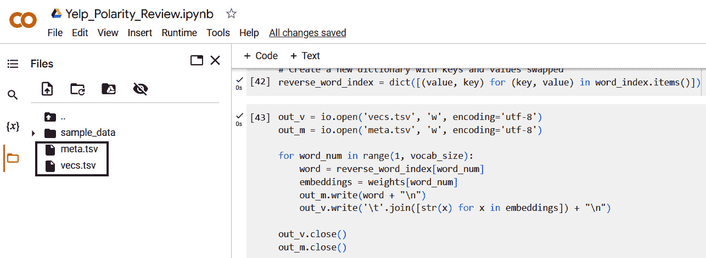

# 第十章：自然语言处理简介

今天，我们面临着来自各个方向的大量文本数据，无论是社交媒体平台上的内容、电子邮件通讯、短信，还是在线评论。文本数据的指数级增长，推动了基于文本的应用程序的快速发展，这些应用程序采用先进的深度学习技术，从文本数据中提取有价值的见解。我们正处在一个变革时代的黎明，这一进程得到了像谷歌、微软这样的科技巨头，以及 OpenAI、Anthropic 这样的革命性初创公司的推动。这些先驱者正在带领我们构建强大的解决方案，能够解决各种基于文本的挑战，例如总结大量文档、提取社交平台上的情感信息以及为博客文章生成文本——这类应用的清单几乎是无穷无尽的。

现实世界中的文本数据可能会很混乱；它可能充斥着不必要的信息，例如标点符号、特殊字符和一些常见词汇，这些词汇可能对文本的实际含义没有显著贡献。因此，我们将从一些基本的文本预处理步骤开始，帮助将文本数据转化为更易处理的形式，为建模做好准备。再次提问，你可能会想，这些机器是如何学习理解文本的？它们是如何理解单词和句子，甚至是掌握单词的语义含义或使用的上下文？在本章中，我们将探讨**自然语言处理**（**NLP**）的基础知识。我们将探讨一些概念，比如分词，它是处理如何将文本分割成单个单词或术语（词元）。我们还将探讨词嵌入的概念——在这里，我们将看到它们如何帮助模型捕捉单词之间的含义、上下文和关系。

然后，我们将把本章中学到的所有知识结合起来，构建一个情感分析模型，使用 Yelp Polarity 数据集对客户评论进行分类。作为一项互动活动，我们将探讨如何在 TensorFlow 中可视化词嵌入；这有助于快速了解模型如何理解和表示不同的单词。我们还将探讨各种技术来提高情感分析分类器的性能。通过本章的学习，你将对如何预处理和建模文本数据有一个良好的基础理解，并掌握解决实际 NLP 问题所需的技能。

在本章中，我们将覆盖以下主题：

+   文本预处理

+   构建情感分类器

+   嵌入可视化

+   模型改进

# 文本预处理

自然语言处理（NLP）是一个激动人心且不断发展的领域，位于计算机科学和语言学的交汇点。它赋予计算机理解、分析、解释和生成文本数据的能力。然而，处理文本数据提出了独特的挑战，这与我们在本书早期章节中处理的表格数据和图像数据有所不同。*图 10.1*为我们提供了文本数据所面临的一些固有挑战的高层次概览。让我们深入探讨这些问题，看看它们在构建文本数据的深度学习模型时如何成为问题。


图 10.1 – 文本数据所面临的挑战

文本数据以其自然形态是非结构化的，这只是我们将在本章中处理的这一有趣数据类型独特性的开始。通过对比这两句话——“*我们家旁边的房子很美丽*”和“*我们邻居的房子是这个地区每个人都赞赏的*”，我们可以说明一些问题。两者传达的情感相似，但它们的结构不同，长度也各异。对于人类来说，这种缺乏结构和长度变化并不成问题，但当我们使用深度学习模型时，这可能会成为一个挑战。为了解决这些挑战，我们可以考虑像标记化这样的思想，它指的是将文本数据拆分成更小的单元，称为标记。我们可以用这些标记表示单词、子单词或个别字符。为了处理文本数据长度的变化以便建模，我们将重用一个在处理图像数据时使用的老方法——填充。通过填充句子，我们可以确保数据（如句子或段落）的长度一致。这种一致性使得数据对我们的模型更易于消化。

再次，我们可能会遇到具有多重含义的单词，解码这些单词的含义在很大程度上取决于它们使用的上下文。例如，如果我们看到一句话是“*我会在银行待着*”，没有额外的上下文，很难判断*银行*是指金融银行还是河岸。像这样的词语增加了在建模文本数据时的复杂性。为了解决这个问题，我们需要应用能够捕捉单词及其周围单词本质的技术。一个很好的例子就是词嵌入。词嵌入是强大的向量表示，用于捕捉单词的语义含义，使得具有相似意义或上下文的单词具有相似的表示形式。

我们在处理文本数据时可能会遇到的问题包括拼写错误、拼写变异和噪音。为了解决这些问题，我们可以使用噪音过滤技术，在收集在线数据时过滤掉网址、特殊字符和其他无关的实体。假设我们有一个示例句子——“*Max 喜欢在伦敦乡村俱乐部打棋，而且他是我们街上最棒的高尔夫球手*。”当我们检查这个句子时，会发现它包含了一些常见的词语，如*and*、*is*和*the*。尽管这些词语对语言的连贯性是必要的，但在某些情况下，它们可能并不增加语义价值。如果是这种情况，我们可能会希望去除这些词语，以降低数据的维度。

现在我们已经涵盖了一些关于文本数据挑战的基础知识，让我们来看看如何预处理文本数据，了解如何从维基百科中提取和清洗机器学习的文本数据。在这里，我们将看到如何应用 TensorFlow 执行诸如分词、填充以及使用词嵌入等技术，从文本中提取意义。要访问示例数据，可以使用这个链接：[`en.wikipedia.org/wiki/Machine_learning`](https://en.wikipedia.org/wiki/Machine_learning)。让我们开始吧：

1.  我们将首先导入必要的库：

    ```py
    import requests
    
    from bs4 import BeautifulSoup
    
    import re
    
    from tensorflow.keras.preprocessing.text import Tokenizer
    ```

    我们使用这些库来有效地获取、预处理和分词网络数据，为神经网络建模做准备。当我们想要访问互联网上的数据时，`requests`库可以证明是一个有用的工具，它使我们能够通过向网络服务器发出请求并获取网页数据，简化从网页获取信息的过程。收集到的数据通常是 HTML 格式的，这种格式并不适合我们直接输入到模型中。这时，`BeautifulSoup`（一个直观的 HTML 和 XML 解析工具）就派上用场了，它帮助我们轻松浏览和访问所需的内容。为了执行字符串操作、文本清洗或提取模式，我们可以使用`re`模块。我们还从 TensorFlow 的 Keras API 中导入了`Tokenizer`类，它使我们能够执行分词操作，从而将数据转换为适合模型的格式。

1.  然后，我们将我们的变量分配给我们想要抓取的网页；在这种情况下，我们感兴趣的是抓取维基百科关于机器学习的页面数据：

    ```py
    # Define the URL of the page
    
    url = "https://en.wikipedia.org/wiki/Machine_learning"
    
    # Send a GET request to the webpage
    
    response = requests.get(url)
    ```

    我们使用`GET`方法从网络服务器获取数据。服务器回复一个状态码，告诉我们请求是成功还是失败。它还会返回其他元数据以及网页的 HTML 内容——在我们这个例子中，是维基百科页面。我们将服务器对`GET`请求的响应保存在`response`对象中。

1.  我们使用`BeautifulSoup`类来完成解析 HTML 内容的繁重工作，我们通过`response.content`来访问这些内容：

    ```py
    # Parse the HTML content of the page with BeautifulSoup
    
    soup = BeautifulSoup(response.content, 'html.parser')
    ```

    在这里，我们将`response.content`中包含的原始 HTML 内容转换为可消化的格式，指定`html.parser`，并将结果存储在`soup`变量中。

1.  现在，让我们提取段落中的所有文本内容：

    ```py
    # Extract the text from all paragraph tags on the page
    
    passage = " ".join([
    
        p.text for p in soup.find_all('p')])
    ```

    我们使用 `soup.find_all('p')` 提取存储在 `soup` 变量中的所有段落。然后，我们应用 `join` 方法将它们合并成一段文本，每个段落之间用空格分隔，最后将这段文本存储在 `passage` 变量中。

1.  下一步是从数据中删除停用词。停用词是指在某些使用场景下可能不包含有用信息的常见单词。因此，我们可能希望删除它们，以帮助减少数据的维度，特别是在这些高频词对任务贡献较小的情况下，比如信息检索或文档聚类。在这里，删除停用词有助于加速收敛并产生更好的分类结果。停用词的例子包括“and”、“the”、“in”和“is”：

    ```py
    # Define a simple list of stopwords
    
    stopwords = ["i", "me", "my", "myself", "we", "our",
    
        "ours", "ourselves", "you", "your",
    
        "yours", "yourself", "yourselves", "he",
    
        "him", "his", "himself", "she", "her",
    
        "hers", "herself", "it", "its", "itself",
    
        "they", "them", "their", "theirs",
    
        "themselves", "what", "which", "who",
    
        "whom", "this", "that", "these", "those",
    
        "am", "is", "are", "was", "were", "be",
    
        "been", "being", "have", "has", "had",
    
        "having", "do", "does", "did", "doing",
    
        "a", "an", "the", "and", "but", "if",
    
        "or", "because", "as", "until", "while",
    
        "of", "at", "by", "for", "with", "about",
    
        "against", "between", "into", "through",
    
        "during", "before", "after", "above",
    
        "below", "to", "from", "up", "down",
    
        "in", "out", "on", "off", "over",
    
        "under", "again", "further", "then",
    
        "once", "here", "there", "when", "where",
    
        "why", "how", "all", "any", "both",
    
        "each", "few", "more", "most", "other",
    
        "some", "such", "no", "nor", "not",
    
        "only", "own", "same", "so", "than",
    
        "too", "very", "s", "t", "can", "will",
    
        "just", "don", "should", "now"]
    ```

    我们已经定义了一个停用词列表。这样，我们就可以灵活地将自己选择的单词添加到这个列表中。当处理领域特定的项目时，这种方法非常有用，因为你可能需要扩展停用词列表。

注意

这一步骤可能并不总是有益的。在一些自然语言处理任务中，停用词可能包含有用的信息。例如，在文本生成或机器翻译中，模型需要生成/翻译停用词，以便产生连贯的句子。

1.  让我们将整段文字转换为小写字母。这样做是为了确保语义相同的单词不会有不同的表示——例如，“DOG”和“dog”。通过确保我们的数据都是小写字母，我们为数据集引入了一致性，避免了同一单词重复表示的可能性。为了将我们的文本转换为小写字母，我们使用以下代码：

    ```py
    passage = passage.lower()
    ```

    当我们运行代码时，它会将所有的文本数据转换为小写字母。

注意

将一段文字转换为小写字母并不总是最好的解决方案。实际上，在一些使用场景中，例如情感分析，将文字转换为小写字母可能会导致信息丢失，因为大写字母通常用来表达强烈的情感。

1.  接下来，让我们从我们从 Wikipedia 收集到的段落中删除 HTML 标签、特殊字符和停用词。为此，我们将使用以下代码：

    ```py
    # Remove HTML tags using regex
    
    passage = re.sub(r'<[^>]+>', '', passage)
    
    # Remove unwanted special characters
    
    passage = re.sub('[^a-zA-Z\s]', '', passage)
    
    # Remove stopwords
    
    passage = ' '.join(word for word in passage.split() if word not in stopwords)
    
    # Print the cleaned passage
    
    print(passage[:500])  # print only first 500 characters for brevity
    ```

    在第一行代码中，我们删除了 HTML 标签，接着删除数据中不需要的特殊字符。然后，我们通过停用词过滤器检查并删除停用词列表中的单词，之后将剩余的单词组合成一段文字，单词之间用空格隔开。我们打印前 500 个字符，以便了解我们处理过的文本是什么样的。

1.  让我们打印前 500 个字符，并与*图 10.2*中的网页进行比较：

    ```py
    machine learning ml field devoted understanding building methods let machines learn methods leverage data improve computer performance set tasks machine learning algorithms build model based sample data known training data order make predictions decisions without explicitly programmed machine learning algorithms used wide variety applications medicine email filtering speech recognition agriculture computer vision difficult unfeasible develop conventional algorithms perform needed tasks subset ma
    ```

    当我们将输出与网页进行比较时，我们可以看到我们的文本都是小写字母，并且所有的停用词、特殊字符和 HTML 标签都已被删除。


图 10.2 – 机器学习的维基百科页面截图

在这里，我们探索了使用神经网络建模时准备文本数据的一些简单步骤。现在，让我们通过探索分词来扩展我们的学习。

## 分词

我们已经了解了一些关于如何预处理现实世界文本数据的重要概念。接下来的步骤是制定准备文本模型的策略。为此，让我们从分词的概念入手，分词意味着将句子拆分成更小的单位，称为“词元（tokens）”。分词可以在字符、子词、词语，甚至是句子层面进行。常见的是使用基于词的分词器；然而，选择哪种分词器主要取决于具体的使用场景。

让我们看看如何应用分词到句子上。假设我们有这样一句话 – “*I like playing chess in my leisure time*。”应用基于词的分词会得到如下输出：`["i", "like", "playing", "chess", "in", "my", "leisure", "time"]`，而如果我们决定使用字符级分词，输出会是：`['I', ' ', 'l', 'i', 'k', 'e', ' ', 'p', 'l', 'a', 'y', 'i', 'n', 'g', ' ', 'c', 'h', 'e', 's', 's', ' ', 'i', 'n', ' ', 'm', 'y', ' ', 'l', 'e', 'i', 's', 'u', 'r', 'e', ' ', 't', 'i', 'm', 'e']`。在基于词的分词中，我们按单词拆分，而在字符级分词中，我们按字符拆分。你还可以看到，在字符级分词中，句子中的空格也被包括在内。对于子词和句子级的分词，我们分别按子词和句子进行拆分。现在，让我们用 TensorFlow 来实现基于词和字符的分词。

### 基于词的分词

让我们看看如何使用 TensorFlow 执行基于词的分词：

1.  我们将从导入`Tokenizer`类开始：

    ```py
    from tensorflow.keras.preprocessing.text import Tokenizer
    ```

1.  接着，我们创建一个变量`text`来存储我们的示例句子（`"Machine learning is fascinating. It is a field full of challenges!"`）。我们创建`Tokenizer`类的实例来处理我们示例句子的分词：

    ```py
    text = "Machine learning is fascinating. It is a field full of challenges!"
    
    # Define the tokenizer and fit it on the text
    
    tokenizer = Tokenizer()
    
    tokenizer.fit_on_texts([text])
    ```

    我们可以根据使用场景向`tokenizer`类传递多个参数。例如，我们可以使用`num_words`来设置希望保留的最大词数。此外，我们可能希望将整个文本转换为小写字母；这可以通过`tokenizer`类来实现。然而，如果不指定这些参数，TensorFlow 会应用默认参数。接着，我们使用`fit_on_text`方法来拟合我们的文本数据。`fit_on_text`方法会遍历输入文本，并创建一个由唯一单词组成的词汇表，同时计算每个单词在输入文本中的出现次数。

1.  要查看单词到整数值的映射，我们使用`tokenizer`对象的`word_index`属性：

    ```py
    # Print out the word index to see how words are tokenized
    
    print(tokenizer.word_index)
    ```

    当我们打印结果时，我们可以看到 `word_index` 返回一个键值对字典，其中每个键值对对应一个唯一单词及其在标记器词汇表中的整数索引：

    ```py
    {'is': 1, 'machine': 2, 'learning': 3, 'fascinating': 4, 'it': 5, 'a': 6, 'field': 7, 'full': 8, 'of': 9, 'challenges': 10}
    ```

你可以看到我们示例句子中的感叹号已经消失，且单词 `'is'` 只列出了一次。此外，你可以看到我们的索引是从 `1` 开始的，而不是从 `0`，因为 `0` 被保留为一个特殊标记，我们稍后会遇到它。现在，让我们来看看如何进行字符级别的标记化。

### 字符级别标记化

在字符级别标记化中，我们根据每个字符拆分示例文本。为了使用 TensorFlow 完成此操作，我们稍微修改了用于单词级别标记化的代码：

```py
# Define the tokenizer and fit it on the text
tokenizer = Tokenizer(char_level=True)
tokenizer.fit_on_texts([text])
# Print out the character index to see how characters are tokenized
print(tokenizer.word_index)
```

在这里，当我们创建 `tokenizer` 实例时，我们将 `char_level` 参数设置为 `True`。这样，我们可以看到文本中的唯一字符将被作为独立标记处理：

```py
{' ': 1, 'i': 2, 'a': 3, 'n': 4, 'l': 5, 'e': 6, 's': 7,
    'f': 8, 'c': 9, 'g': 10, 'h': 11, 't': 12, 'm': 13,
    'r': 14, '.': 15, 'd': 16, 'u': 17, 'o': 18, '!': 19}
```

请注意，在这种情况下，每个唯一字符都会被表示，包括空格（`' '`），它的标记值是 `1`，句号（`'.'`）的标记值是 `15`，以及感叹号（`'!'`）的标记值是 `19`。

我们讨论的另一种标记化方式是子词标记化。子词标记化涉及将单词分解为常见字符组合，例如，“unhappiness” 可能被标记为 [“un”, “happiness”]。一旦文本被标记化，每个标记可以使用我们将在本章讨论的编码方法之一转换为数值表示。现在，让我们看看另一个叫做序列化的概念。

## 序列化

单词在句子中的使用顺序对于理解它们所传达的意义至关重要；序列化是将句子或一组单词或标记转换为它们的数值表示的过程，在使用神经网络构建自然语言处理应用时，能够保留单词的顺序。在 TensorFlow 中，我们可以使用 `texts_to_sequences` 函数将我们标记化的文本转换为整数序列。从我们单词级别标记化步骤的输出中，我们现在知道我们的示例句子（`"机器学习很迷人。它是一个充满挑战的领域！"）可以通过一系列标记来表示：

```py
# Convert the text to sequences
sequence = tokenizer.texts_to_sequences([text])
print(sequence)
```

通过将文本转换为序列，我们将人类可读的文本转换为机器可读的格式，同时保留单词出现的顺序。当我们打印结果时，我们会得到如下输出：

```py
[[2, 3, 1, 4, 5, 1, 6, 7, 8, 9, 10]]
```

打印出的结果是表示原始文本的整数序列。在许多现实世界的场景中，我们需要处理不同长度的句子。虽然人类可以理解不同长度的句子，但神经网络要求我们将数据以特定类型的输入格式提供。在本书的图像分类部分，我们在传递图像数据作为输入时使用了固定的宽度和高度；对于文本数据，我们必须确保所有的句子长度相同。为了实现这一点，让我们回到我们在*第七章*，《卷积神经网络的图像分类》中讨论过的一个概念——填充，并看看如何利用它来解决句子长度不一致的问题。

## 填充

在*第七章*，《卷积神经网络的图像分类》中，我们在讨论 CNN 时介绍了填充的概念。在 NLP 的背景下，填充是向序列中添加元素以确保它达到所需长度的过程。为了在 TensorFlow 中实现这一点，我们使用`keras`预处理模块中的`pad_sequences`函数。让我们通过一个示例来解释如何将填充应用于文本数据：

1.  假设我们有以下四个句子：

    ```py
    sentences = [
    
        "I love reading books.",
    
        "The cat sat on the mat.",
    
        "It's a beautiful day outside!",
    
        "Have you done your homework?"
    
    ]
    ```

    当我们执行词级标记化和序列化时，输出将如下所示：

    ```py
    [[2, 3, 4, 5], [1, 6, 7, 8, 1, 9],
    
        [10, 11, 12, 13, 14], [15, 16, 17, 18, 19]]
    ```

    我们可以看到，返回的序列长度各不相同，第二个句子比其他句子长。接下来，让我们通过填充来解决这个问题。

1.  我们从 TensorFlow Keras 预处理模块中导入`pad_sequences`：

    ```py
    from tensorflow.keras.preprocessing.sequence import pad_sequences
    ```

    `pad_sequences`函数接受多个参数——在这里，我们将讨论一些重要的参数，如`sequences`、`maxlen`、`truncating`和`padding`。

1.  让我们开始仅传递序列作为参数，并观察结果是什么样的：

    ```py
    padded = pad_sequences(sequences)
    
    print(padded)
    ```

    当我们使用`pad_sequences`函数时，它会确保所有的句子与我们最长的句子长度相同。为了实现这一点，使用一个特殊的符号（`0`）来填充较短的句子，直到它们与最长句子的长度相同。这个特殊符号（`0`）没有任何意义，模型会在训练和推理过程中忽略它们：

    ```py
    [[ 0  0  2  3  4  5]
    
     [ 1  6  7  8  1  9]
    
     [ 0 10 11 12 13 14]
    
     [ 0 15 16 17 18 19]]
    ```

    从输出中，我们看到每隔一个句子就会在其前面添加零，直到它的长度与我们最长的句子（第二个句子）相同，而第二个句子有最长的序列。请注意，所有的零都是在每个句子的开头添加的。这个场景被称为`padding=post`参数：

    ```py
    # post padding
    
    padded_sequences = pad_sequences(sequences,
    
        padding='post')
    
    print(padded_sequences)
    ```

    当我们打印结果时，我们得到以下输出：

    ```py
    [[ 2  3  4  5  0  0]
    
     [ 1  6  7  8  1  9]
    
     [10 11 12 13 14  0]
    
     [15 16 17 18 19  0]]
    ```

    在这种情况下，我们可以看到零被添加到较短句子的末尾。

1.  另一个有用的参数是`maxlen`。它用于指定我们希望保留的所有序列的最大长度。在这种情况下，任何超过指定`maxlen`的序列都会被截断。为了看看`maxlen`如何工作，让我们给我们的句子列表添加另一个句子：

    ```py
    Sentences = [
    
        "I love reading books.",
    
        "The cat sat on the mat.",
    
        "It's a beautiful day outside!",
    
        "Have you done your homework?",
    
        "Machine Learning is a very interesting subject that enables 
    
         you build amazing solutions beyond your imagination."
    
    ]
    ```

1.  我们拿到新的句子列表，并对它们进行标记化和序列化处理。然后，我们填充数值表示，确保输入数据的长度一致，并确保我们的特殊标记（`0`）出现在句子的末尾，我们将`padding`设置为`post`。当我们实施这些步骤时，输出结果如下：

    ```py
    [[ 5  6  7  8  0  0  0  0  0  0  0  0  0  0  0  0]
    
     [ 1  9 10 11  1 12  0  0  0  0  0  0  0  0  0  0]
    
     [13  2 14 15 16  0  0  0  0  0  0  0  0  0  0  0]
    
     [17  3 18  4 19  0  0  0  0  0  0  0  0  0  0  0]
    
     [20 21 22  2 23 24 25 26 27  3 28 29 30 31  4 32]]
    ```

    从输出结果可以看到，其中一句话相当长，而其他句子大多由许多零组成的数字表示。在这种情况下，很明显我们的最长句子是一个异常值，因为其他句子都要短得多。这可能会扭曲我们模型的学习过程，并且还会增加对计算资源的需求，尤其是在处理大数据集或有限计算资源时。为了解决这个问题，我们应用了`maxlen`参数。使用合适的`max_length`值非常重要，否则，我们可能会因截断而丢失数据中的重要信息。最好将最大长度设置得足够长，以捕捉有用信息，同时不增加太多噪声。

1.  让我们看看如何在示例中应用`maxlen`。我们首先将`max_length`变量设置为`10`。这意味着它最多只会使用 10 个标记。我们传递`maxlen`参数并打印我们的填充序列：

    ```py
    # Define the max length
    
    max_length = 10
    
    # Pad the sequences
    
    padded = pad_sequences(sequences, padding='post',
    
        maxlen=max_length)
    
    print(padded))
    ```

    我们的结果生成了一个更短的序列：

    ```py
    [[ 5  6  7  8  0  0  0  0  0  0]
    
     [ 1  9 10 11  1 12  0  0  0  0]
    
     [13  2 14 15 16  0  0  0  0  0]
    
     [17  3 18  4 19  0  0  0  0  0]
    
     [25 26 27  3 28 29 30 31  4 32]]
    ```

    请注意，我们的最长句子已经在序列的开头被截断。如果我们想将句子截断在结尾呢？我们该如何实现呢？为此，我们引入了另一个参数，叫做`truncating`，并将其设置为`post`：

    ```py
    # Pad the sequences
    
    padded = pad_sequences(sequences, padding='post',
    
        truncating='post', maxlen=max_length)
    
    print(padded)
    ```

    我们的结果将如下所示：

    ```py
    [[ 5  6  7  8  0  0  0  0  0  0]
    
     [ 1  9 10 11  1 12  0  0  0  0]
    
     [13  2 14 15 16  0  0  0  0  0]
    
     [17  3 18  4 19  0  0  0  0  0]
    
     [20 21 22  2 23 24 25 26 27  3]]
    ```

现在，我们已经完成了所有序列的填充和在句子末尾进行的截断。那么，如果我们训练模型来使用这五个句子进行文本分类，并且我们想对一个新的句子（“*I love playing chess*”）进行预测呢？记住，在训练句子中，我们的模型将有标记表示“I”和“love”。然而，它没有办法知道或表示“playing”和“Chess”。这给我们带来了另一个问题。让我们看看如何解决这个问题。

## 词汇表外

到目前为止，我们已经看到如何准备数据，从构成句子的文本数据序列转换为数值表示，来训练我们的模型。现在，假设我们构建一个文本分类模型，使用我们句子列表中的五个句子进行训练。当然，这只是一个假设的情况，即使我们用大量文本数据进行训练，最终也会遇到模型在训练时未见过的单词，正如我们在这个示例测试句子（“*I love playing chess*”）中看到的那样。这意味着我们必须准备好让模型处理那些不在我们预定义词汇表中的单词。为了解决这个问题，我们在标记化过程中使用了`oov_token="<OOV>"`参数：

```py
# Define the tokenizer with an OOV token
tokenizer = Tokenizer(oov_token="<OOV>")
# Fit the tokenizer on the texts
tokenizer.fit_on_texts(sentences)
# Convert the texts to sequences
sequences = tokenizer.texts_to_sequences(sentences)
# Let's look at the word index
print(tokenizer.word_index)
```

在这之后，我们在训练句子上拟合分词器，将句子转换为整数序列，然后我们打印出单词索引：

```py
{'<OOV>': 1, 'the': 2, 'a': 3, 'you': 4, 'your': 5, 'i': 6, 'love': 7, 'reading': 8, 'books': 9, 'cat': 10, 'sat': 11, 'on': 12, 'mat': 13, "it's": 14, 'beautiful': 15, 'day': 16, 'outside': 17, 'have': 18, 'done': 19, 'homework': 20, 'machine': 21, 'learning': 22, 'is': 23, 'very': 24, 'interesting': 25, 'subject': 26, 'that': 27, 'enables': 28, 'build': 29, 'amazing': 30, 'solutions': 31, 'beyond': 32, 'imagination': 33}
```

现在，我们可以看到`"<OOV>"`字符串被选中来表示这些 OOV 单词，并且它的值为`1`。这个标记将处理模型遇到的任何未知单词。让我们用我们的示例测试句子来看看实际效果：

```py
# Now let's convert a sentence with some OOV words
test_sentence = "I love playing chess"
test_sequence = tokenizer.texts_to_sequences(
    [test_sentence])
print(test_sequence)
```

我们传入我们的测试句子（`"I love playing chess"`），其中包含了模型之前未见过的单词，然后使用`texts_to_sequences`方法将测试句子转换为一个序列。由于我们在训练句子上拟合了分词器，它会用单词索引中相应的数字表示来替换测试句子中的每个单词。然而，像“playing”和“chess”这样在我们的训练句子中未出现过的单词，将会被替换为特殊 OOV 标记的索引；因此，`print`语句返回如下内容：

```py
[[6, 7, 1, 1]]
```

在这里，`1`的标记值被用于`playing`和`chess`这两个单词。使用 OOV 标记是自然语言处理（NLP）中处理训练数据中未出现但可能出现在测试数据或现实世界数据中的单词的常见做法。

现在，我们的文本数据已经转化为数值表示。同时，我们也保留了单词出现的顺序；然而，我们需要找到一种方法来捕捉单词的语义意义及其相互之间的关系。为此，我们使用词嵌入。接下来我们将讨论词嵌入。

## 词嵌入

在 NLP 领域，一个重要的里程碑就是词嵌入的使用。通过词嵌入，我们能够解决许多复杂的现代文本问题。**词嵌入**是一种单词表示方式，使得具有相似意义的单词能够有相似的表示，并且能够捕捉到单词使用的上下文。除了上下文，词嵌入还能够捕捉单词之间的语义和句法相似性，以及单词与其他单词之间的关系。这使得机器学习模型在使用词嵌入时，能够比将单词作为独立输入时更好地进行泛化。

像独热编码（one-hot encoding）这样的策略被证明是低效的，因为它会构建一个稀疏的单词表示，主要由零组成。这是因为我们词汇量越大，应用独热编码时生成的向量中零的数量就会越多。相反，词嵌入是一种密集的向量表示，它处在一个连续的空间中，能够使用稠密且低维的向量捕捉单词的意义、上下文及其之间的关系。

让我们来看一下以下几个示例句子，看看词嵌入是如何工作的：

1.  她喜欢阅读书籍。

1.  他喜欢阅读报纸。

1.  他们在吃葡萄。

我们首先对每个句子进行分词，并应用序列化，将每个句子转换成一个整数序列：

1.  [1, 2, 3, 4]

1.  [5, 6, 3, 7]

1.  [8, 9, 10, 11]

请注意，通过我们返回的序列，我们成功地捕捉到了构成每个句子的单词出现的顺序。然而，这种方法未能考虑单词的含义或单词之间的关系。例如，“enjoy”和“likes”这两个词在句子 1 和句子 2 中都表现出积极的情感，同时两个句子都有“reading”作为共同的动作。当我们设计深度学习模型时，我们希望它们能意识到“books”和“newspapers”之间的关系更为紧密，而与“grapes”和“eating”等词有很大不同，如*图 10.3*所示。


图 10.3 – 词嵌入

词嵌入使我们的模型能够捕捉单词之间的关系，从而增强了我们构建高性能模型的能力。我们已经探讨了一些关于文本预处理和数据准备的基础概念，将文本数据从单词转换为数值表示，同时捕捉语言中单词的顺序和潜在关系。现在，让我们将所学的知识整合起来，使用 Yelp 极性数据集构建一个情感分析模型。我们将从头开始训练自己的词嵌入，之后再将预训练的词嵌入应用到我们的应用案例中。

# Yelp 极性数据集

在这个实验中，我们将使用 Yelp 极性数据集。该数据集由 56 万条训练评论和 3.8 万条测试评论组成，每条评论包含一个基于文本的评论和一个标签（正面 – 1 和负面 – 0）。这些数据来自于顾客对餐厅、美发店、锁匠等的评价。该数据集面临一些实际挑战——例如，评论的文本长度各异，从简短评论到非常长的评论都有。此外，数据中还包含了俚语和不同的方言。该数据集可以通过以下链接获取：[`www.tensorflow.org/datasets/catalog/yelp_polarity_reviews`](https://www.tensorflow.org/datasets/catalog/yelp_polarity_reviews)。

让我们开始构建我们的模型：

1.  我们将从加载所需的库开始：

    ```py
    import tensorflow as tf
    
    import tensorflow_datasets as tfds
    
    from tensorflow.keras.preprocessing.text import Tokenizer
    
    from tensorflow.keras.preprocessing.sequence import pad_sequences
    
    from sklearn.model_selection import train_test_split
    
    import numpy as np
    
    import io
    ```

    我们导入必要的库来加载、拆分、预处理和可视化词嵌入，并使用 TensorFlow 对数据集进行建模，以便进行情感分析的应用。

1.  然后，我们加载数据集：

    ```py
    # Load the Yelp Polarity Reviews dataset
    
    (train_dataset, test_dataset),
    
        dataset_info = tfds.load('yelp_polarity_reviews',
    
            split=['train', 'test'], shuffle_files=True,
    
            with_info=True, as_supervised=True)
    ```

    我们使用`tf.load`函数从 TensorFlow 数据集中获取数据集。在这里，我们指定了我们的数据集，即 Yelp 极性评论数据集。我们还将数据拆分为训练集和测试集。通过将 shuffle 设置为`True`，我们对数据进行了洗牌，并设置`with_info=True`以确保能够检索数据集的元数据，这些信息可以通过`dataset_info`变量访问。我们还设置了`as_supervised=True`；当我们这样做时，它返回由输入和目标组成的元组，而不是字典。这样，我们就可以直接使用数据集与`fit`方法来训练我们的模型。现在，我们的训练数据集是`train_dataset`，测试集是`test_dataset`；这两个数据集都是`tf.data.Dataset`对象。在构建情感分析模型并在测试数据上评估之前，让我们先进行一些快速的数据探索。

1.  让我们编写一些函数，以便探索我们的数据集：

    ```py
    def get_reviews(dataset, num_samples=5):
    
        reviews = []
    
        for text, label in dataset.take(num_samples):
    
            reviews.append((text.numpy().decode('utf-8'), 
    
                label.numpy()))
    
        return reviews
    
    def dataset_insights(dataset, num_samples=2000):
    
        total_reviews = 0
    
        total_positive = 0
    
        total_negative = 0
    
        total_length = 0
    
        min_length = float('inf')
    
        max_length = 0
    
        for text, label in dataset.take(num_samples):
    
            total_reviews += 1
    
            review_length = len(text.numpy().decode(
    
                'utf-8').split())
    
            total_length += review_length
    
            if review_length < min_length:
    
                min_length = review_length
    
            if review_length > max_length:
    
                max_length = review_length
    
            if label.numpy() == 1:
    
                total_positive += 1
    
            else:
    
                total_negative += 1
    
        avg_length = total_length / total_reviews
    
        return min_length, max_length, avg_length,
    
            total_positive, total_negative
    
    def plot_reviews(positive, negative):
    
        labels = ['Positive', 'Negative']
    
        counts = [positive, negative]
    
        plt.bar(labels, counts, color=['blue', 'red'])
    
        plt.xlabel('Review Type')
    
        plt.ylabel('Count')
    
        plt.title('Distribution of Reviews')
    
        plt.show()
    ```

    我们使用`get_reviews`函数来查看训练集或测试集中的评论。此函数显示指定数量的评论及其相应的标签；默认情况下，它会显示前五个评论。然而，我们可以将该参数设置为任何我们想要的数字。第二个函数是`dataset_insight`函数——该函数执行多个分析操作，比如提取评论的最短、最长和平均长度。它还生成数据集中正面和负面评论的总数。由于我们处理的是一个大数据集，我们将`dataset_insight`设置为探索前 2,000 个样本。如果你增加样本数量，分析数据将需要更长的时间。我们将评论的正面和负面总数传递给`plot_reviews`函数，以便生成数据的图形分布。

1.  让我们查看训练数据中的前七条评论：

    ```py
    # Check out some reviews
    
    print("Training Set Reviews:")
    
    train_reviews = get_reviews(train_dataset, 7)
    
    for review, label in train_reviews:
    
        print(f"Label: {label}, Review: {review[:100]}")
    ```

    当我们运行代码时，它返回前七条评论。此外，为了简洁起见，我们只返回每条评论的前 100 个字符：

    ```py
    Training Set Reviews:
    
    Label: 1, Review: The Groovy P. and I ventured to his old stomping grounds for lunch today.  The '5 and Diner' on 16th...
    
    Label: 0, Review: Mediocre burgers - if you are in the area and want a fast food burger, Fatburger is  a better bet th...
    
    Label: 0, Review: Not at all impressed...our server was not very happy to be there...food was very sub-par and it was ...
    
    Label: 0, Review: I wish I would have read Megan P's review before I decided to cancel my dinner reservations because ...
    
    Label: 1, Review: A large selection of food from all over the world. Great atmosphere and ambiance.  Quality of food i...
    
    Label: 1, Review: I know, I know a review for Subway, come on.  But I have to say that the service at this subway is t...
    
    Label: 1, Review: We came in for a pre-bachelor party madness meal and I have to say it was one of the best dining exp...
    ```

1.  让我们检查一下关于训练数据的一些重要统计信息：

    ```py
    min_length, max_length, avg_length, total_positive, 
    
        total_negative = dataset_insights(train_dataset)
    
    # Display the results
    
    print(f"Shortest Review Length: {min_length}")
    
    print(f"Longest Review Length: {max_length}")
    
    print(f"Average Review Length: {avg_length:.2f}")
    
    print(f"Total Positive Reviews: {total_positive}")
    
    print(f"Total Negative Reviews: {total_negative}")
    ```

    当我们运行代码时，它返回以下内容：

    ```py
    Shortest Review Length: 1
    
    Longest Review Length: 942
    
    Average Review Length: 131.53
    
    Total Positive Reviews: 1030
    
    Total Negative Reviews: 970
    ```

1.  让我们绘制采样训练数据的分布图：

    ```py
    plot_reviews(total_positive, total_negative)
    ```

    在这里，我们调用`plot_reviews`函数，并传入我们采样的训练数据中的正面和负面评论的总数。当我们运行代码时，我们会得到图中所示的*图 10.4*。


图 10.4 – 我们采样的训练数据中的评论分布

从采样的训练数据集中，我们可以看到评论分布非常均衡。因此，我们可以继续在此数据集上训练我们的模型。现在就让我们开始吧。

1.  我们定义了标记化、序列化和训练过程中的关键参数：

    ```py
    # Define parameters
    
    vocab_size = 10000
    
    embedding_dim = 16
    
    max_length = 132
    
    trunc_type='post'
    
    padding_type='post'
    
    oov_tok = "<OOV>"
    
    num_epochs = 10
    
    # Build the Tokenizer
    
    tokenizer = Tokenizer(num_words=vocab_size,
    
        oov_token=oov_tok)
    ```

    我们将词汇表的大小设置为 10,000。这意味着分词器将集中处理数据集中排名前 10,000 的单词。在选择词汇表大小时，需要在计算效率和捕捉数据集中存在的单词多样性之间找到平衡。如果增加词汇表的大小，我们可能会捕捉到更多细微的语言差异，从而丰富模型的理解，但这将需要更多的计算资源进行训练。此外，如果减少词汇表大小，训练将会更快；然而，我们将只能捕捉到数据集中语言变化的一小部分。

    接下来，我们将嵌入维度设置为 16。这意味着每个单词将由一个 16 维的向量表示。嵌入维度的选择通常基于经验测试。在这里，我们选择 16 作为嵌入维度，主要是考虑到计算效率。如果我们使用更高的维度，比如 64 或 128，我们可能会捕捉到单词之间更加细微的关系；然而，这也需要更多的计算资源进行训练。在处理大规模数据集时，您可能希望使用更高的维度来提高性能。

    我们将最大长度设置为 132 个单词；这个长度是基于我们在探索数据集中前 2,000 条评论时得到的平均单词长度来选择的。超过 132 个单词的评论将被截断，只保留前 132 个单词。我们选择这个最大长度，是为了在计算效率和捕捉数据集中大部分评论的最重要内容之间找到一个合理的平衡。我们将截断和 `padding` 设置为 `post`；这确保了较长的句子会在序列的末尾被截断，而较短的句子则会在序列的末尾用零进行填充。这里的关键假设是，大多数客户评论中的重要信息可能会出现在评论的开头部分。

    接下来，我们将 OOV（Out Of Vocabulary）标记设置为处理在测试集上可能出现但在训练期间模型未见过的 OOV 单词。设置这个参数可以防止模型在处理未见过的单词时发生错误。我们还将模型训练的 epoch 数量设置为 10。虽然我们使用 10 进行模型测试，但你可能希望训练更多的轮次，并且可以使用回调来在训练过程中监控模型在验证集上的表现。

    在定义了所有参数之后，我们现在可以实例化我们的 `Tokenizer` 类，并将 `num_words` 和 `oov_token` 作为参数传递进去。

1.  为了减少处理时间，我们将使用 20,000 个样本进行训练：

    ```py
    # Fetch and decode the training data
    
    train_text = []
    
    train_label = []
    
    for example in train_dataset.take(20000):
    
        text, label = example
    
        train_text.append(text.numpy().decode('utf-8'))
    
        train_label.append(label.numpy())
    
    # Convert labels to numpy array
    
    train_labels = np.array(train_label)
    
    # Fit the tokenizer on the training texts
    
    tokenizer.fit_on_texts(train_text)
    
    # Get the word index from the tokenizer
    
    word_index = tokenizer.word_index
    
    # Convert texts to sequences
    
    train_sequences = tokenizer.texts_to_sequences(
    
        train_text)
    ```

    在这里，我们用 Yelp Polarity 训练数据集中的前 20,000 个样本来训练模型。我们收集这些评论及其对应的标签，并且由于数据是以字节的形式存在，我们使用 UTF-8 编码来解码字符串，然后将文本及其标签分别添加到相应的列表中。我们使用 NumPy 将标签列表转换为便于操作的形式。之后，我们对所选训练数据进行分词，并将文本转换为序列。

1.  为了测试，我们选择 8,000 个样本。我们在这里执行的步骤与训练集上的步骤非常相似；然而，我们并不对测试集中的文本进行拟合。此步骤仅用于训练目的，帮助神经网络学习训练集中的词到索引的映射：

    ```py
    # Fetch and decode the test data
    
    test_text = []
    
    test_label = []
    
    for example in test_dataset.take(8000):
    
        text, label = example
    
        test_text.append(text.numpy().decode('utf-8'))
    
        test_label.append(label.numpy())
    
    # Convert labels to numpy array
    
    test_labels = np.array(test_label)
    
    # Convert texts to sequences
    
    test_sequences = tokenizer.texts_to_sequences(
    
        test_text)
    ```

    我们从测试数据集中取出前 8,000 个样本。重要的是要使用与训练数据拟合时相同的分词器。这确保了分词器在训练过程中学到的词汇索引映射被应用到测试集上，并且训练集中未学习到的单词会被替换为 OOV（Out-Of-Vocabulary）标记。

1.  下一步是对表示训练集和测试集中文本的整数序列进行填充和截断，确保它们具有相同的长度：

    ```py
    # Pad the sequences
    
    train_padded = pad_sequences(train_sequences,
    
        maxlen=max_length, padding=padding_type,
    
        truncating=trunc_type)
    
    test_padded = pad_sequences(test_sequences,
    
        maxlen=max_length, padding=padding_type,
    
        truncating=trunc_type)
    ```

    返回的输出 `train_padded` 和 `test_padded` 是形状为（`num_sequences` 和 `maxlen`）的 NumPy 数组。现在，这些数组中的每个序列都具有相同的长度。

1.  我们想要设置一个验证集，这将帮助我们跟踪模型训练过程的进展。为此，我们可以使用来自 scikit-learn 的 `train_test_split` 函数：

    ```py
    # Split the data into training and validation sets
    
    train_padded, val_padded, train_labels,
    
        val_labels = train_test_split(train_padded,
    
            train_labels, test_size=0.2, random_state=42)
    ```

    在这里，我们将数据划分为训练集和验证集，其中 20% 用作验证集。

1.  让我们继续构建我们的情感分析模型：

    ```py
    # Define the model
    
    model = tf.keras.Sequential([
    
        tf.keras.layers.Embedding(vocab_size,
    
            embedding_dim, input_length=max_length),
    
        tf.keras.layers.GlobalAveragePooling1D(),
    
        tf.keras.layers.Dense(24, activation='relu'),
    
        tf.keras.layers.Dense(1, activation='sigmoid')
    
    # because it's binary classification
    
    ])
    ```

    我们使用 TensorFlow 的 Keras API 构建我们的模型。请注意，我们有一个新的层——嵌入层，它用于在密集的向量空间中表示单词。此层接受词汇大小、嵌入维度和最大长度作为参数。在这个实验中，我们将词嵌入作为模型的一部分进行训练。我们也可以独立训练这一层，用于学习词嵌入。这在我们打算在多个模型之间共享相同词嵌入时非常有用。在 *第十一章* *使用 TensorFlow 进行自然语言处理* 中，我们将看到如何应用来自 TensorFlow Hub 的预训练嵌入层。

    当我们传入一个形状为(`batch_size`, `input_length`)的二维张量，其中每个样本是一个整数序列时，嵌入层会返回一个形状为(`batch_size`, `input_length`, `embedding_dim`)的三维张量。在训练开始时，嵌入向量是随机初始化的。随着模型的训练，这些向量会不断调整，确保具有相似上下文的单词在嵌入空间中被紧密地聚集在一起。与使用离散值不同，词嵌入使用的是连续值，我们的模型可以利用这些值来辨别模式并模拟数据之间复杂的关系。

    `GlobalAveragePooling1D`层用于降低数据的维度；它执行平均池化操作。例如，如果我们对一个单词序列应用`GlobalAveragePooling1D`，它将返回一个总结后的单一向量，该向量可以输入到我们的全连接层进行分类。由于我们正在执行二分类任务，我们的输出层使用一个神经元，并将 sigmoid 作为激活函数。

1.  现在，我们将编译并训练我们的模型。在编译步骤中，我们传入`binary_crossentropy`作为损失函数。我们使用 Adam 优化器，并将准确率作为我们的分类评估指标：

    ```py
    # Compile the model
    
    model.compile(loss='binary_crossentropy',
    
        optimizer='adam', metrics=['accuracy'])
    ```

1.  我们使用训练数据（`train_padded`）和标签（`train_labels`）对模型进行了 10 个 epoch 的训练，并使用验证数据来跟踪实验进展：

    ```py
    # Train the model
    
    history = model.fit(train_padded, train_labels,
    
        epochs=num_epochs, validation_data=(val_padded,
    
            val_labels))
    ```

    我们报告最后 5 个 epoch 的结果：

    ```py
    Epoch 6/10
    
    625/625 [==============================] - 4s 7ms/step - loss: 0.1293 - accuracy: 0.9551 - val_loss: 0.3149 - val_accuracy: 0.8875
    
    Epoch 7/10
    
    625/625 [==============================] - 4s 6ms/step - loss: 0.1116 - accuracy: 0.9638 - val_loss: 0.3330 - val_accuracy: 0.8880
    
    Epoch 8/10
    
    625/625 [==============================] - 5s 9ms/step - loss: 0.0960 - accuracy: 0.9697 - val_loss: 0.3703 - val_accuracy: 0.8813
    
    Epoch 9/10
    
    625/625 [==============================] - 4s 6ms/step - loss: 0.0828 - accuracy: 0.9751 - val_loss: 0.3885 - val_accuracy: 0.8796
    
    Epoch 10/10
    
    625/625 [==============================] - 4s 6ms/step - loss: 0.0727 - accuracy: 0.9786 - val_loss: 0.4258 - val_accuracy: 0.8783
    ```

    模型在训练集上的准确率达到了 0.9786，验证集上的准确率为 0.8783。这告诉我们模型存在过拟合现象。接下来，我们看看模型在未见过的数据上的表现。为此，我们将使用测试数据评估模型。

1.  我们使用`evaluate`函数来评估训练好的模型：

    ```py
    # Evaluate the model on the test set
    
    results = model.evaluate(test_padded, test_labels)
    
    print("Test Loss: ", results[0])
    
    print("Test Accuracy: ", results[1])
    ```

    我们传入测试数据（`test_padded`）和测试标签（`test_labels`），并输出损失和准确率。模型在测试集上的准确率为 0.8783。

1.  在训练和验证过程中绘制损失和准确率曲线是一个好习惯，因为它能为我们提供关于模型学习过程和性能的宝贵见解。为了实现这一点，我们将构建一个名为`plot_history`的函数：

    ```py
    def plot_history(history):
    
        plt.figure(figsize=(12, 4))
    
        # Plot training & validation accuracy values
    
        plt.subplot(1, 2, 1)
    
        plt.plot(history.history['accuracy'])
    
        plt.plot(history.history['val_accuracy'])
    
        plt.title('Model accuracy')
    
        plt.ylabel('Accuracy')
    
        plt.xlabel('Epoch')
    
        plt.legend(['Train', 'Validation'],
    
            loc='upper left')
    
        # Plot training & validation loss values
    
        plt.subplot(1, 2, 2)
    
        plt.plot(history.history['loss'])
    
        plt.plot(history.history['val_loss'])
    
        plt.title('Model loss')
    
        plt.ylabel('Loss')
    
        plt.xlabel('Epoch')
    
        plt.legend(['Train', 'Validation'],
    
            loc='upper right')
    
        plt.tight_layout()
    
        plt.show()
    ```

    这个函数接收`history`对象，并返回损失和准确率曲线。`plot_history`函数将创建一个包含两个子图的图形——左侧子图显示每个 epoch 的训练和验证准确率，右侧子图显示每个 epoch 的训练和验证损失。


图 10.5 – 损失和准确率曲线

从*图 10.5*中的图表可以看出，模型在训练中的准确率每个 epoch 都在提高；然而，验证准确率在第一个 epoch 结束时开始略微下降。训练损失也在每个 epoch 中稳步下降，而验证损失则在每个 epoch 中稳步上升，这表明模型存在过拟合现象。

1.  在我们探索如何解决过拟合问题之前，让我们先尝试四个新的句子，看看我们的模型如何处理它们：

    ```py
    # New sentences
    
    new_sentences = ["The restaurant was absolutely fantastic. The staff were kind and the food was delicious.",  # positive
    
        "I've had an incredible day at the beach, the weather was beautiful.",  # positive
    
        "The movie was a big disappointment. I wouldn't recommend it to anyone.",  # negative
    
        "I bought a new phone and it stopped working after a week. Terrible product."]  # negative
    ```

1.  在此示例中，我们给出了每个句子的情感供参考。让我们看看我们训练的模型在这些新句子上的表现如何：

    ```py
    # Preprocess the sentences in the same way as the training data
    
    new_sequences = tokenizer.texts_to_sequences(
    
        new_sentences)
    
    new_padded = pad_sequences(new_sequences,
    
        maxlen=max_length, padding=padding_type,
    
        truncating=trunc_type)
    
    # Use the model to predict the sentiment of the new sentences
    
    predictions = model.predict(new_padded)
    
    # Print out the sequences and the corresponding predictions
    
    for i in range(len(new_sentences)):
    
        print("Sequence:", new_sequences[i])
    
        print("Predicted sentiment (
    
            probability):", predictions[i])
    
        if predictions[i] > 0.5:
    
            print("Interpretation: Positive sentiment")
    
        else:
    
            print("Interpretation: Negative sentiment")
    
        print("\n")
    ```

1.  让我们打印出每个句子对应的序列，并显示模型预测的情感：

    ```py
    1/1 [==============================] - 0s 21ms/step
    
    Sequence: [2, 107, 7, 487, 533, 2, 123, 27, 290, 3, 2, 31, 7, 182]
    
    Predicted sentiment (probability): [0.9689689]
    
    Interpretation: Positive sentiment
    
    Sequence: [112, 25, 60, 1251, 151, 26, 2, 3177, 2, 2079, 7, 634]
    
    Predicted sentiment (probability): [0.9956489]
    
    Interpretation: Positive sentiment
    
    Sequence: [2, 1050, 7, 6, 221, 1174, 4, 454, 234, 9, 5, 528]
    
    Predicted sentiment (probability): [0.43672907]
    
    Interpretation: Negative sentiment
    
    Sequence: [4, 764, 6, 161, 483, 3, 9, 695, 524, 83, 6, 393, 464, 1341]
    
    Predicted sentiment (probability): [0.36306405]
    
    Interpretation: Negative sentiment
    ```

我们的情感分析模型能够有效地预测正确的结果。如果我们想要可视化嵌入呢？TensorFlow 提供了一个嵌入投影仪，可以通过[`projector.tensorflow.org`](https://projector.tensorflow.org)访问。

## 嵌入可视化

如果我们希望可视化来自训练模型的词嵌入，我们需要从嵌入层提取学习到的嵌入，并将其加载到 TensorBoard 提供的嵌入投影仪中。让我们看看如何操作：

1.  提取嵌入层权重：

    ```py
    weights = model.get_layer(
    
        'embedding').get_weights()[0]
    
    vocab = tokenizer.word_index
    
    print(weights.shape)
    
    # shape: (vocab_size, embedding_dim)
    ```

    第一步是从嵌入层中提取训练后的学习权重。接下来，我们获取在分词过程中生成的词汇映射。如果我们应用`print`语句，我们可以看到词汇大小和嵌入维度。

1.  然后，将权重和词汇保存到磁盘。TensorFlow 投影仪读取这些文件类型，并使用它们在 3D 空间中绘制向量，从而使我们能够可视化它们：

    ```py
    out_v = io.open('vectors.tsv', 'w', encoding='utf-8')
    
    out_m = io.open('metadata.tsv', 'w', encoding='utf-8')
    
    for word, index in vocab.items():
    
        if index < vocab_size:
    
            vec = weights[index]
    
            out_v.write('\t'.join([str(x) for x in vec]) + "\n")
    
            out_m.write(word + "\n")
    
    out_v.close()
    
    out_m.close()
    ```

1.  下一步是将嵌入向量和词汇（单词）分别保存为两个独立的`vecs.tsv`和`meta.tsv`文件。当我们运行此代码块时，我们会看到在 Google Colab 笔记本中有两个新文件，如*图 10.6*所示。



图 10.6 – 显示元数据和向量文件的截图

1.  将文件下载到本地：

    ```py
    try:
    
        from google.colab import files
    
        files.download('vectors.tsv')
    
        files.download('metadata.tsv')
    
    except Exception:
    
        pass
    ```

    要将所需文件从 Google Colab 下载到本地计算机，请运行此代码块。请注意，如果您在云环境中工作，需要将这些文件从服务器转移到本地计算机。

1.  [可视化嵌入。打开](https://projector.tensorflow.org/)嵌入投影仪，使用此链接：[`projector.tensorflow.org/`](https://projector.tensorflow.org/)。然后，您需要点击加载按钮，将下载到本地计算机的`vectors.tsv`和`metadata.tsv`文件加载进去。一旦成功上传文件，词嵌入将以 3D 形式显示，如*图 10.7*所示。


图 10.7 – 词嵌入的快照[查看详细](https://www.tensorflow.org/text/guide/word_embeddings?hl=en)

[要了解更多关于嵌入可视化的信息，请参阅文档](https://www.tensorflow.org/text/guide/word_embeddings?hl=en)：[`www.tensorflow.org/text/guide/word_embeddings?hl=en`](https://www.tensorflow.org/text/guide/word_embeddings?hl=en)。我们现在已经看到了如何可视化词嵌入。接下来，让我们尝试提高模型的性能。

# 提高模型性能

之前，我们讨论了在本章中设计情感分析基线架构时需要考虑的一些因素。此外，在*第八章*中，*处理过拟合*部分，我们探讨了一些基本概念，以减轻过拟合问题。在那里，我们看到了早停（early stopping）和丢弃正则化（dropout regularization）等思想。为了遏制过拟合，让我们从调整模型的一些超参数开始。为此，我们将构建一个名为`sentiment_model`的函数。这个函数需要三个参数——`vocab_size`、`embedding_dim`和训练集的大小。

## 增加词汇表的大小

我们可能考虑调整的一个超参数是词汇表的大小。增加词汇表的大小使得模型能够从我们的数据集中学习到更多独特的单词。让我们看看这会如何影响基线模型的性能。在这里，我们将`vocab_size`从`10000`调整为`20000`，同时保持其他超参数不变：

```py
# Increasing the vocab_size
vocab_size = 10000 #Change from 10000 to 20000
embedding_dim = 16
training_size = 20000
num_epochs=10
model_1, history_1 = sentiment_model(vocab_size,
    embedding_dim, training_size, num_epochs)
```

该模型的测试准确率为 0.8749，而基线模型的准确率为 0.8783。在这里，增加`vocab_size`对模型性能没有带来正面的影响。

当我们使用更大的词汇表时，模型将学习到更多独特的单词，这可能是个好主意，具体取决于数据集和使用场景。但另一方面，更多的参数和计算资源要求意味着我们需要更高效地训练模型。同时，过拟合的风险也会更大。

鉴于这些问题，确保我们拥有足够大的`vocab_size`以捕捉数据中的细微差别，同时避免引入过拟合的风险，是至关重要的。一个策略是设置最小频率阈值，从而排除可能导致过拟合的稀有单词。我们还可以尝试调整嵌入维度。接下来我们来讨论这个。

## 调整嵌入维度

嵌入维度是指表示单词的向量空间的大小。高维度的嵌入能够捕捉到单词之间更为细致的关系。然而，它也增加了模型的复杂度，可能导致过拟合，尤其是在处理小数据集时。让我们将`embedding_dim`从`16`调整为`32`，同时保持其他参数不变，看看这对我们的实验有什么影响：

```py
vocab_size = 10000
embedding_dim = 32 #Change from 16 to 32
train_size = 20000
num_epochs=10
model_2, history_2 = sentiment_model(vocab_size,
    embedding_dim, train_size, num_epochs)
```

经过 10 轮训练，使用较大嵌入维度的新模型在测试集上达到了 0.8720 的准确率。这个结果低于我们基准模型的表现。在这里，我们亲眼看到了嵌入维度的增加并不总是能保证模型性能的提升。当嵌入维度过小时，可能无法捕捉到数据中的重要关系。相反，嵌入维度过大会导致计算需求增加，并增加过拟合的风险。值得注意的是，对于简单任务或小型数据集，小的嵌入维度就足够了，而对于大型数据集，更大的嵌入维度则是一个更好的选择。一种务实的方法是从较小的嵌入维度开始，并在每次迭代时逐渐增加其大小，同时密切关注模型的表现。通常，性能会有所提升，但在某个点之后，收益递减现象会显现出来。到时，我们就停止训练。现在，我们可以收集更多数据，增加样本量，看看结果如何。

## 收集更多数据

在*第八章*《处理过拟合》中，我们探讨了在处理过拟合时的这一选项。收集更多的数据样本能够为我们提供更多样化的例子，供我们的模型学习。然而，这个过程可能会非常耗时。而且，当数据噪声大或不相关时，更多的数据可能并不会有所帮助。对于我们的案例研究，让我们将训练数据量从 20,000 个样本增加到 40,000 个样本：

```py
vocab_size = 10000
embedding_dim = 16
train_size = 40000
model_3, history_3 = sentiment_model(vocab_size,
    embedding_dim, train_size)
```

经过 10 轮训练后，我们看到模型在测试集上的性能提升至 0.8726。收集更多的数据可能是一个不错的策略，因为它可以为我们的模型提供更多样化的数据集；然而，这次并未奏效。那么，让我们尝试其他的想法；这次，我们来尝试 dropout 正则化。

## Dropout 正则化

在*第八章*《处理过拟合》中，我们讨论了 dropout 正则化方法，在训练过程中我们随机丢弃一部分神经元，以打破神经元之间的共依赖关系。由于我们正在处理过拟合的情况，试试这个技巧吧。为了在我们的模型中实现 dropout，我们可以添加一个 dropout 层，示例如下：

```py
model_4  = tf.keras.Sequential([
    tf.keras.layers.Embedding(vocab_size, embedding_dim, 
    input_length=max_length),
    tf.keras.layers.GlobalAveragePooling1D(),
    tf.keras.layers.Dense(24, activation='relu'),
    tf.keras.layers.Dropout(0.5),
# Dropout layer with 50% dropout rate
    tf.keras.layers.Dense(1, activation='sigmoid')
])
# Compile the model
model_4.compile(loss='binary_crossentropy',
    optimizer='adam',metrics=['accuracy'])
```

在这里，我们将我们的丢弃率设定为 50％，这意味着在训练期间关闭了一半的神经元。我们的新模型达到了 0.8830 的准确率，略优于基线模型。丢弃可以通过防止神经元之间的相互依赖来增强模型的稳健性。然而，我们必须谨慎应用丢弃。如果我们丢弃了太多的神经元，我们的模型会变得过于简单，开始欠拟合，因为它无法捕捉数据中的潜在模式。此外，如果我们将低丢弃值应用于模型，可能无法实现我们希望的正则化效果。尝试不同的丢弃值以找到模型复杂性和泛化之间的最佳平衡是一个好主意。现在，让我们尝试不同的优化器。

## 尝试不同的优化器

虽然 Adam 是一个很好的通用优化器，但您可能会发现，对于您的特定任务，不同的优化器（如 SGD 或 RMSprop）效果更好。根据手头的任务，不同的优化器可能效果更好。让我们尝试使用 RMSprop 来处理我们的用例，看看它的表现如何：

```py
# Initialize the optimizer
optimizer = tf.keras.optimizers.RMSprop(learning_rate=0.001)
# Compile the model
model_7.compile(loss='binary_crossentropy',
    optimizer=optimizer, metrics=['accuracy'])
# Train the model
history_7 = model_7.fit(train_padded, train_labels,
    epochs=num_epochs, validation_data=(val_padded,
        val_labels))
```

我们使用 RMSprop 作为优化器，在超过基线模型的情况下，实现了 0.8920 的测试准确率。在选择适当的优化器时，评估您的用例的关键属性至关重要。例如，在处理大型数据集时，SGD 比批量梯度下降更合适，因为 SGD 使用小批量减少了计算成本。在使用有限计算资源时，这一特性非常有用。值得注意的是，如果我们在使用 SGD 时有太多小批量，可能会导致嘈杂的更新；另一方面，非常大的批量大小可能会增加计算成本。

Adam 是许多深度学习用例的优秀默认优化器，因为它结合了 RMSprop 和动量的优点；然而，当处理简单的凸问题（如线性回归）时，SGD 在这些情景中表现更佳，因为 Adam 在这些情况下会过度补偿。至此，我们结束了本章。

# 概要

在本章中，我们探讨了 NLP 的基础知识。我们首先看了如何处理现实世界的文本数据，探索了一些预处理思路，使用了 Beautiful Soup、requests 和正则表达式等工具。然后，我们展开了各种想法，如分词、序列化和使用词嵌入将文本数据转换为向量表示，这不仅保留了文本数据的顺序，还捕捉了单词之间的关系。我们进一步迈出了一步，利用来自 TensorFlow 数据集的 Yelp 极性数据集构建了情感分析分类器。最后，我们进行了一系列实验，使用不同的超参数来改进我们基础模型的性能并克服过拟合问题。

在下一章中，我们将介绍**递归神经网络**（**RNNs**），并看看它们与本章中使用的 DNN 有何不同。我们将通过构建一个新的分类器来测试 RNNs。我们还将通过实验使用预训练的嵌入，将事情推进到一个新层次，最后，我们将在一个有趣的练习中生成文本，使用的是儿童故事数据集。到时见。

# 问题

让我们测试一下本章所学的内容。

1.  使用测试笔记本，从 TFDS 加载 IMDB 数据集。

1.  使用不同的嵌入维度，并在测试集上评估模型。

1.  使用不同的词汇大小，并在测试集上评估模型。

1.  添加更多层并在测试集上评估模型。

1.  使用你最好的模型对给定的样本句子进行预测。

# 深入阅读

要了解更多信息，可以查看以下资源：

+   Kapoor, A., Gulli, A. 和 Pal, S.（2020 年） *《使用 TensorFlow 和 Keras 的深度学习（第三版）》*，Packt Publishing Ltd.

+   *Twitter 情感分类使用远程监督*，由 Go 等人（2009 年）提出。

+   *嵌入投影器：嵌入的互动可视化和解释*，由 Smilkov 等人（2016 年）提出。

+   *卷积神经网络在句子分类中的敏感性分析（及实务指南）*，由 Zhang 等人（2016 年）提出。
