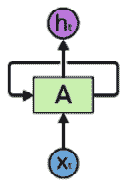
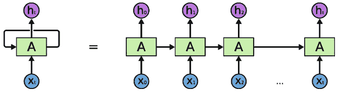
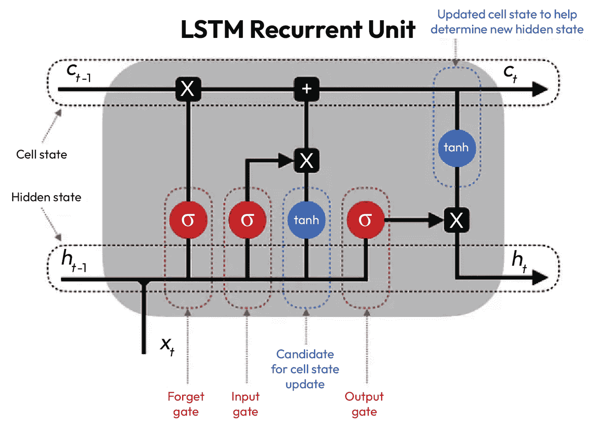
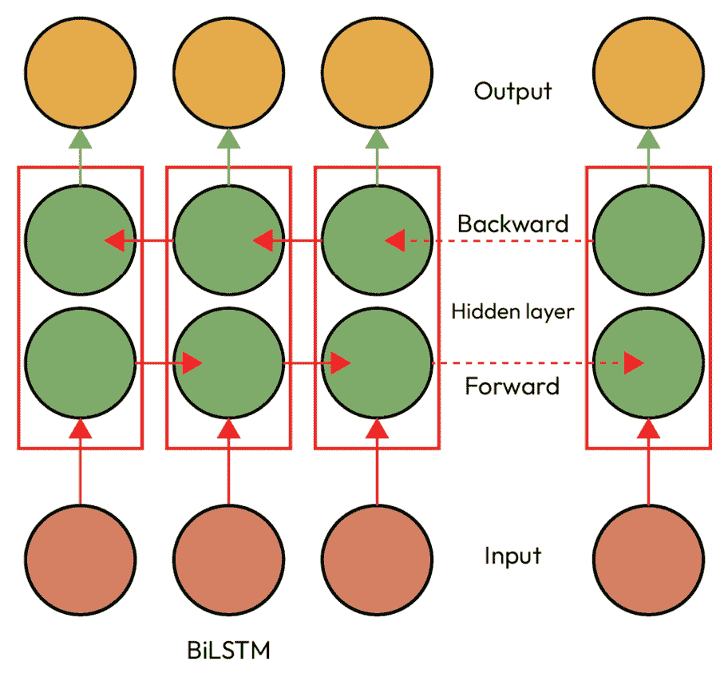
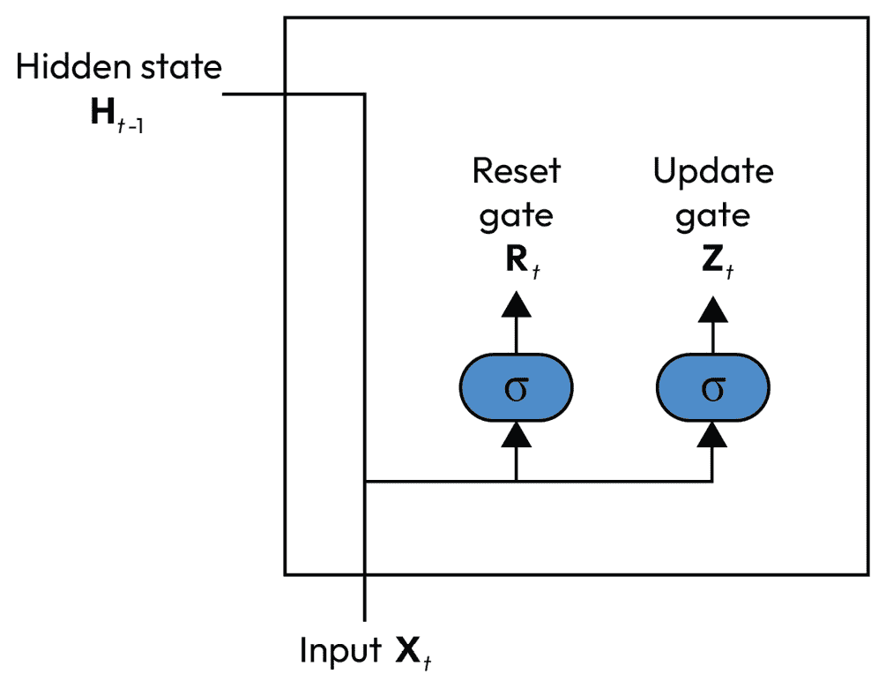
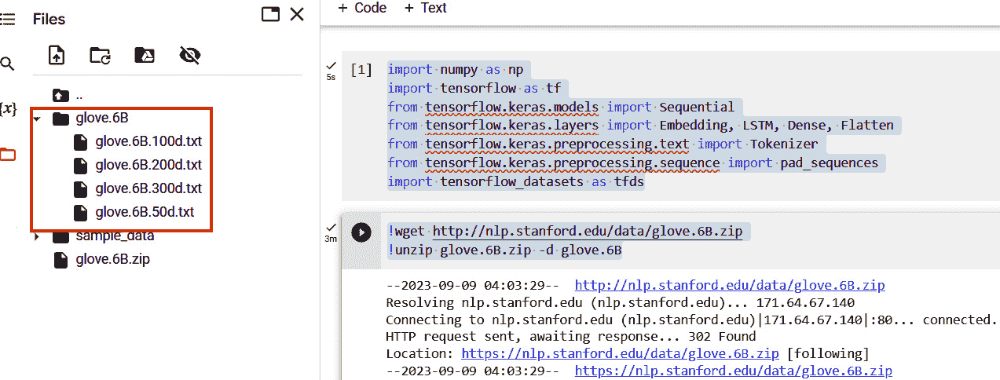

# 第十一章：使用 TensorFlow 进行自然语言处理

文本数据本质上是顺序性的，由单词出现的顺序定义。单词相互衔接，建立在前一个思想的基础上，并塑造接下来的思想。人类理解单词的顺序以及它们所应用的上下文非常直接。然而，这对前馈网络（如**卷积神经网络**（**CNNs**））和传统的**深度神经网络**（**DNNs**）构成了巨大挑战。这些模型将文本数据视为独立的输入，因此它们忽略了语言的内在联系和流动性。例如，考虑这句话：“*The cat, which is a mammal, likes to chase mice*。”人类会立即识别出猫与老鼠之间的关系，因为我们将整句话作为一个整体来处理，而不是单个单位。

**递归神经网络**（**RNN**）是一种旨在处理顺序数据（如文本和时间序列数据）的神经网络类型。处理文本数据时，RNN 的记忆能力使它能够回忆起序列中的早期部分，帮助它理解单词在文本中使用的上下文。例如，考虑这样一句话：“*作为一名考古学家，约翰喜欢发现古代文物*”，在这种情况下，RNN 能推断出考古学家会对古代文物感兴趣，而且这句话中的考古学家是约翰。

本章中，我们将开始探索 RNN 的世界，并深入研究其内部机制，了解 RNN 如何协同工作以保持一种记忆形式。我们将探讨在处理文本数据时，RNN 的优缺点，然后我们将转向研究它的变体，如**长短期记忆**（**LSTM**）和**门控递归单元**（**GRU**）。接下来，我们将运用所学知识构建一个多类文本分类器。然后，我们将探索迁移学习在**自然语言处理**（**NLP**）领域的强大能力。在这一部分，我们将看到如何将预训练的词嵌入应用到我们的工作流中。为了结束本章，我们将使用 RNN 构建一个儿童故事生成器；在这里，我们将看到 RNN 如何在生成文本数据时发挥作用。

在本章中，我们将涵盖以下主题：

+   RNN 的结构

+   使用 RNN 进行文本分类

+   使用迁移学习进行自然语言处理

+   文本生成

# 理解顺序数据处理——从传统神经网络到 RNN 和 LSTM

在传统神经网络中，正如我们在本书前面所讨论的那样，网络中排列着密集连接的神经元，并且没有任何形式的记忆。当我们将一串数据输入这些网络时，这是一种“全有或全无”的处理方式——整个序列一次性被处理并转换为一个单一的向量表示。这种方法与人类处理和理解文本数据的方式大不相同。当我们阅读时，我们自然而然地按单词逐一分析文本，并理解重要的单词——那些能够改变整个句子含义的单词——可以出现在句子的任何位置。例如，考虑句子“*我喜欢这部电影，尽管一些评论家不喜欢*”。在这里，单词“*尽管*”至关重要，改变了句子中情感表达的方向。

RNN 不仅通过嵌入考虑单个单词的值，它们还会考虑这些单词的顺序或相对位置。单词的顺序赋予它们意义，并使得人类能够有效地进行交流。RNN 的独特之处在于它们能够从一个时间点（或在句子的情况下，从一个单词）到下一个时间点保持上下文，从而保持输入的顺序一致性。例如，在句子“*我去年访问了罗马，我觉得斗兽场非常迷人*”中，RNN 会理解“*斗兽场*”与“*罗马*”的关系，这是因为单词的顺序。然而，有一个问题——在更长的句子中，当相关单词之间的距离增大时，这种上下文保持可能会失败。

这正是门控变种 RNN，如 LSTM 网络的作用所在。LSTM 通过一种特殊的“单元状态”架构设计，使其能够在更长的序列中管理和保留信息。因此，即使是像“*我去年访问了罗马，体验了丰富的文化，享受了美味的食物，结识了很棒的人，我觉得斗兽场非常迷人*”这样的长句，LSTM 仍然能够将“*斗兽场*”与“*罗马*”联系起来，理解句子尽管长度和复杂性较大，但它们之间的广泛联系。我们仅仅是触及了表面。接下来，我们将检查这些强大网络的结构。我们将从 RNN 开始。

# RNN 的结构

在上一节中，我们讨论了 RNN 处理序列数据的能力；现在让我们深入了解 RNN 是如何做到这一点的。RNN 和前馈神经网络的关键区别在于它们的内部记忆，如*图 11.1*所示，这使得 RNN 能够处理输入序列的同时保留来自前一步的信息。这一特性使得 RNN 能够充分利用序列中如文本数据的时间依赖性。



图 11.1 – RNN 的结构

*图 11.2* 显示了一个更清晰的 RNN 图和它的内部工作原理。在这里，我们可以看到一系列相互连接的单元，数据以顺序的方式逐个元素流动。当每个单元处理输入数据时，它将输出发送到下一个单元，类似于前馈网络的工作方式。关键的不同之处在于反馈回路，它使 RNN 拥有了之前输入的记忆，从而使它们能够理解整个序列。



图 11.2 – 展示 RNN 在多个时间步中的操作的扩展视图

假设我们正在处理句子，并且希望我们的 RNN 学习句子的语法。句子中的每个单词代表一个时间步长，在每个时间步，RNN 会考虑当前单词以及来自前一个单词（或步骤）的“上下文”。让我们看一个示例句子。假设我们有一个包含五个单词的句子——“*巴塞罗那是一个美丽的城市*。”这个句子有五个时间步，每个单词对应一个时间步。在时间步 1，我们将单词“*巴塞罗那*”输入到 RNN 中。网络学习到有关这个单词的一些信息（实际上，它会从该单词的向量表示中学习），然后生成一个输出，同时也会生成一个隐藏状态，捕捉它所学到的内容，如 *图 11.2* 所示。现在，我们将 RNN 展开到时间步 2。我们将下一个单词“*是*”输入到网络中，同时也将时间步 1 的隐藏状态输入。这一隐藏状态代表了网络的“记忆”，使得网络能够考虑它迄今为止所看到的内容。网络生成一个新的输出和一个新的隐藏状态。

这一过程继续进行，RNN 会根据句子中的每个单词进一步展开。在每个时间步，网络会将当前的单词和来自上一时间步的隐藏状态作为输入，生成输出和新的隐藏状态。当你以这种方式“展开”一个 RNN 时，它看起来可能像是一个具有共享权重的深度前馈网络（因为每个时间步都使用相同的 RNN 单元进行操作），但更准确地说，它是一个应用于每个时间步的单一网络，随着传递隐藏状态而进行计算。RNN 具有学习和记住任意长度序列的能力；然而，它们也有自己的局限性。RNN 的一个关键问题是，由于梯度消失问题，它难以捕捉长期依赖关系。出现这种问题是因为在反向传播过程中，时间步对未来时间步的影响可能会随着长序列的增长而减弱，导致梯度变得非常小，从而更难进行学习。为了解决这个问题，我们将应用 RNN 的更高级版本，如 LSTM 和 GRU 网络。这些架构通过应用门控机制来控制网络中信息的流动，使得模型更容易学习长期依赖关系。接下来我们来看看这些 RNN 的变种。

## RNN 的变种 — LSTM 和 GRU

假设我们正在进行一项电影评论分类项目，在检查我们的数据集时，我们发现一条类似这样的句子：“*这部电影开始时很无聊且节奏缓慢，但到最后真的是越来越好，高潮部分令人惊叹。*”通过分析这个句子，我们看到评论者最初使用的词汇呈现出负面情感，如“缓慢”和“无聊”，但情感在后面发生了转变，变得更加积极，词组如“越来越好”和“高潮部分令人惊叹”都在传达更为正面的情感。如果我们使用简单的 RNN 来处理这个任务，由于它本身无法很好地保留长序列的信息，它可能会因为过分强调评论中最初的负面情绪而误分类这个句子。

相反，LSTM 和 GRU 被设计用来处理长期依赖关系，这使得它们不仅能有效捕捉情感变化，还能在其他自然语言处理任务中表现出色，例如机器翻译、文本摘要和问答系统，在这些任务中，它们优于其更简单的对手。

### LSTM（长短期记忆网络）

LSTM 是一种专门设计用来解决梯度消失问题的 RNN 类型，使得 LSTM 能够有效处理序列数据中的长期依赖。为了解决这个问题，LSTM 引入了一种称为记忆单元的新结构，它本质上作为信息载体，并具有在延长期间内保留信息的能力。与标准的 RNN 不同，后者将信息从一个步骤传递到下一个步骤，并随时间逐渐丢失，LSTM 借助其记忆单元可以从输入序列的任何点存储和检索信息。让我们来看看 LSTM 是如何决定存储在其记忆单元中的信息的。如图 *Figure 10**.3* 所示，一个 LSTM 由四个主要组件组成：



10.3 – LSTM 架构

这些组件使得 LSTM 能够在长序列中存储和访问信息。让我们来看看每个组件：

+   **输入门**：输入门决定将存储在记忆单元中的新信息。它由 Sigmoid 和 tanh 层组成。Sigmoid 层产生介于零和一之间的输出值，表示输入中每个值的重要性水平，其中零意味着“一点也不重要”，而一表示“非常重要”。tanh 层生成一组候选值，这些值可以添加到状态中，基本上建议应该将哪些新信息存储在记忆单元中。这两个层的输出通过逐元素乘法进行合并。这种逐元素操作生成一个输入调制门，有效地过滤新的候选值，通过决定哪些信息足够重要以存储在记忆单元中。

+   **遗忘门**：这个门决定哪些信息将被保留，哪些信息将被丢弃。它使用 Sigmoid 层返回介于零和一之间的输出值。如果遗忘门中的单元返回接近零的输出值，LSTM 将从细胞状态的相应单元中删除信息。

+   **输出门**：输出门决定下一个隐藏状态应该是什么。像其他门一样，它也使用 S 型函数来决定哪些细胞状态的部分将成为输出。

+   **细胞状态**：细胞状态是 LSTM 细胞的“记忆”。它基于遗忘门和输入门的输出进行更新。它可以记住信息以供后续序列使用。

门机制至关重要，因为它们允许 LSTM 自动学习适合上下文的读取、写入和重置记忆单元的方式。这些能力使得 LSTM 能够处理更长的序列，特别适用于许多复杂的顺序任务，标准 RNN 由于无法处理长期依赖而不足，如机器翻译、文本生成、时间序列预测和视频分析。

### 双向长短期记忆（BiLSTM）

**双向长短时记忆网络**（**BiLSTM**）是传统 LSTM 网络的扩展。然而，与按顺序从开始到结束处理信息的 LSTM 不同，BiLSTM 同时运行两个 LSTM ——一个从开始处理序列数据到结束，另一个从结束到开始处理，如*图 11.4*所示。



图 11.4 – BiLSTM 中的信息流

通过这种方式，BiLSTM 能够捕捉序列中每个数据点的过去和未来上下文。由于 BiLSTM 能够从数据序列的两个方向理解上下文，因此它们非常适合执行文本生成、文本分类、情感分析和机器翻译等任务。现在，让我们来看看 GRU。

### GRU

2014 年，*Cho 等人*提出了 **GRU** 架构，作为 LSTM 的一种可行替代方案。GRU 旨在实现两个主要目标——一个是克服困扰传统 RNN 的梯度消失问题，另一个是简化 LSTM 架构，以提高计算效率，同时保持建模长期依赖的能力。从结构上看，GRU 有两个主要门，如*图 11.5*所示。



图 11.5 – GRU 的架构

GRU 和 LSTM 之间的一个关键区别是 GRU 中没有独立的细胞状态；相反，它们使用隐状态来传递和操作信息，并简化其计算需求。

GRU 有两个主要的门，更新门和重置门。让我们来看看它们：

+   **更新门**：更新门将 LSTM 中的输入门和遗忘门进行了简化。它决定了多少过去的信息需要传递到当前状态，以及哪些信息需要被丢弃。

+   **重置门**：此门定义了应忘记多少过去的信息。它帮助模型评估新输入与过去记忆之间的相对重要性。

除了这两个主要门，GRU 还引入了“候选隐状态”。此候选隐状态结合了新输入和先前的隐状态，通过这种方式，它为当前时间步开发了隐状态的初步版本。然后，这个候选隐状态在决定最终隐状态时发挥重要作用，确保 GRU 保留来自过去的相关上下文，同时接纳新信息。在决定选择 LSTM 还是 GRU 时，选择往往取决于特定的应用场景和可用的计算资源。对于某些应用，GRU 提供的计算效率更具吸引力。例如，在实时处理（如文本转语音）中，或者在处理短序列任务（如推文的情感分析）时，GRU 相较于 LSTM 可能是一个更好的选择。

我们已经提供了关于 RNN 及其变种的高层次讨论。现在，让我们开始将这些新架构应用于实际的使用案例。它们会比标准的 DNN 或 CNN 表现更好吗？让我们在文本分类案例研究中一探究竟。

# 使用 AG News 数据集进行文本分类——一个比较研究

AG News 数据集是一个包含超过 100 万篇新闻文章的集合，数据来自一个名为 ComeToMyHead 的新闻搜索引擎，覆盖了 2000 多个新闻来源。该数据集分为四个类别——即世界、体育、商业、科技——并且可通过**TensorFlow Datasets**（**TFDS**）获取。数据集包括 120,000 个训练样本（每个类别 30,000 个），测试集包含 7,600 个样本。

注意

由于数据集的大小和模型数量，此实验可能需要大约一个小时才能完成，因此确保你的笔记本支持 GPU 是很重要的。你也可以选择一个较小的子集，以确保实验能够更快地运行。

让我们开始构建我们的模型：

1.  我们将首先加载本次实验所需的库：

    ```py
    import pandas as pd
    ```

    ```py
    import tensorflow_datasets as tfds
    ```

    ```py
    import tensorflow as tf
    ```

    ```py
    from tensorflow.keras.preprocessing.text import Tokenizer
    ```

    ```py
    from tensorflow.keras.preprocessing.sequence import pad_sequences
    ```

    ```py
    from tensorflow.keras.utils import to_categorical
    ```

    ```py
    import tensorflow_hub as hub
    ```

    ```py
    from sklearn.model_selection import train_test_split
    ```

    ```py
    from tensorflow.keras.models import Sequential
    ```

    ```py
    from tensorflow.keras.layers import Embedding, SimpleRNN, Conv1D, GlobalMaxPooling1D, LSTM, GRU, Bidirectional, Dense, Flatten
    ```

这些导入形成了构建模块，使我们能够解决这个文本分类问题。

1.  然后，我们从 TFDS 加载 AG News 数据集：

    ```py
    # Load the dataset
    ```

    ```py
    dataset, info = tfds.load('ag_news_subset',
    ```

    ```py
        with_info=True, as_supervised=True)
    ```

    ```py
    train_dataset, test_dataset = dataset['train'],
    ```

    ```py
        dataset['test']
    ```

我们使用此代码从 TFDS 加载我们的数据集——`tfds.load`函数会获取并加载 AG News 数据集。我们将`with_info`参数设置为`True`；这确保了我们数据集的元数据，如样本总数和版本，也会被收集。此元数据信息存储在`info`变量中。我们还将`as_supervised`设置为`True`；我们这样做是为了确保数据以输入和标签对的形式加载，其中输入是新闻文章，标签是对应的类别。然后，我们将数据划分为训练集和测试集。

1.  现在，我们需要为建模准备数据：

    ```py
    # Tokenize and pad the sequences
    ```

    ```py
    tokenizer = Tokenizer(num_words=20000,
    ```

    ```py
        oov_token="<OOV>")
    ```

    ```py
    train_texts = [x[0].numpy().decode(
    ```

    ```py
        'utf-8') for x in train_dataset]
    ```

    ```py
    tokenizer.fit_on_texts(train_texts)
    ```

    ```py
    sequences = tokenizer.texts_to_sequences(train_texts)
    ```

    ```py
    sequences = pad_sequences(sequences, padding='post')
    ```

在这里，我们执行数据预处理步骤，如分词、序列化和填充，使用 TensorFlow 的 Keras API。我们初始化了分词器，用于将我们的数据从文本转换为整数序列。我们将`num_words`参数设置为`20000`。这意味着我们只会考虑数据集中出现频率最高的 20,000 个单词进行分词；低于此频率的词汇将被忽略。我们将`oov_token="<OOV>"`参数设置为确保我们能处理在模型推理过程中可能遇到的未见过的单词。

然后，我们提取训练数据并将其存储在 `train_texts` 变量中。我们通过使用 `fit_on_texts` 和 `texts_to_sequences()` 方法分别将数据标记化并转化为整数序列。我们对每个序列应用填充，以确保输入模型的数据具有一致的形状。我们将 `padding` 设置为 `post`；这将确保填充在序列的末尾应用。现在，我们的数据已经以良好的结构化格式准备好，稍后我们将其输入深度学习模型进行文本分类。

1.  在开始建模之前，我们需要将数据分为训练集和验证集。我们通过将训练集拆分为 80% 的训练数据和 20% 的验证数据来实现：

    ```py
    # Convert labels to one-hot encoding
    ```

    ```py
    train_labels = [label.numpy() for _, label in train_dataset]
    ```

    ```py
    train_labels = to_categorical(train_labels,
    ```

    ```py
        num_classes=4)4  # assuming 4 classes
    ```

    ```py
    # Split the training set into training and validation sets
    ```

    ```py
    train_sequences, val_sequences, train_labels,
    ```

    ```py
        val_labels = train_test_split(sequences,
    ```

    ```py
            train_labels, test_size=0.2)
    ```

我们将标签转换为 one-hot 编码向量，然后使用 scikit-learn 的 `train_test_split` 函数将训练数据拆分。我们将 `test_size` 设置为 `0.2`；这意味着我们将 80% 的数据用于训练，其余 20% 用于验证目的。

1.  让我们设置 `vocab_size`、`embedding_dim` 和 `max_length` 参数：

    ```py
    vocab_size=20000
    ```

    ```py
    embedding_dim =64
    ```

    ```py
    max_length=sequences.shape[1]
    ```

我们将 `vocab_size` 和 `embedding_dim` 分别设置为 `20000` 和 `64`。在选择 `vocab_size` 时，重要的是在计算效率、模型复杂度和捕捉语言细微差别的能力之间找到良好的平衡，而我们使用嵌入维度通过 64 维向量表示词汇表中的每个单词。`max_length` 参数设置为与数据中最长的标记化和填充序列匹配。

1.  我们开始构建模型，从 DNN 开始：

    ```py
    # Define the DNN model
    ```

    ```py
    model_dnn = Sequential([
    ```

    ```py
        Embedding(vocab_size, embedding_dim,
    ```

    ```py
            input_length=max_length),
    ```

    ```py
        Flatten(),
    ```

    ```py
        tf.keras.layers.Dense(64, activation='relu'),
    ```

    ```py
        Dense(16, activation='relu'),
    ```

    ```py
        Dense(4, activation='softmax')
    ```

    ```py
    ])
    ```

使用 TensorFlow 的 `Sequential` API，我们构建了一个 DNN，包含一个嵌入层、一个展平层、两个隐藏层和一个用于多类别分类的输出层。

1.  然后，我们构建一个 CNN 架构：

    ```py
    # Define the CNN model
    ```

    ```py
    model_cnn = Sequential([
    ```

    ```py
        Embedding(vocab_size, embedding_dim,
    ```

    ```py
            input_length=max_length),
    ```

    ```py
        Conv1D(128, 5, activation='relu'),
    ```

    ```py
        GlobalMaxPooling1D(),
    ```

    ```py
        tf.keras.layers.Dense(64, activation='relu'),
    ```

    ```py
        Dense(4, activation='softmax')
    ```

    ```py
    ])
    ```

我们使用一个由 128 个滤波器（特征检测器）和 `5` 的卷积核大小组成的 `Conv1D` 层；这意味着它会同时考虑五个单词。我们的架构使用 `GlobalMaxPooling1D` 对卷积层的输出进行下采样，提取最重要的特征。我们将池化层的输出输入到一个全连接层进行分类。

1.  然后，我们构建一个 LSTM 模型：

    ```py
    # Define the LSTM model
    ```

    ```py
    model_lstm = Sequential([
    ```

    ```py
        Embedding(vocab_size, embedding_dim,
    ```

    ```py
            input_length=max_length),
    ```

    ```py
        LSTM(32, return_sequences=True),
    ```

    ```py
        LSTM(32),
    ```

    ```py
        tf.keras.layers.Dense(64, activation='relu'),
    ```

    ```py
        Dense(4, activation='softmax')
    ```

    ```py
    ])
    ```

我们的 LSTM 架构由两个 LSTM 层组成，每个层有 32 个单元。在第一个 LSTM 层中，我们将 `return_sequences` 设置为 `True`；这允许第一个 LSTM 层将它收到的完整序列作为输出传递给下一个 LSTM 层。这里的目的是让第二个 LSTM 层能够访问整个序列的上下文；这使它能够更好地理解并捕捉整个序列中的依赖关系。然后，我们将第二个 LSTM 层的输出输入到全连接层进行分类。

1.  对于我们的最终模型，我们使用一个双向 LSTM：

    ```py
    # Define the BiLSTM model
    ```

    ```py
    model_BiLSTM = Sequential([
    ```

    ```py
        Embedding(vocab_size, embedding_dim,
    ```

    ```py
            input_length=max_length),
    ```

    ```py
        Bidirectional(LSTM(32, return_sequences=True)),
    ```

    ```py
        Bidirectional(LSTM(16)),
    ```

    ```py
        tf.keras.layers.Dense(64, activation='relu'),
    ```

    ```py
        Dense(4, activation='softmax')])
    ```

在这里，我们没有使用 LSTM 层，而是增加了两层双向 LSTM。请注意，第一层也设置了`return_sequences=True`，以将完整的输出传递给下一层。使用双向包装器可以让每个 LSTM 层在处理输入序列中的每个元素时同时访问过去和未来的上下文，与单向 LSTM 相比，提供了更多的上下文信息。

堆叠 BiLSTM 层可以帮助我们构建更高层次的完整序列表示。第一层 BiLSTM 通过从两个方向查看文本来提取特征，同时保持整个序列的完整性。第二层 BiLSTM 则可以在这些特征的基础上进一步处理它们。最终的分类是由全连接层中的输出层完成的。我们的实验模型现在都已设置好，接下来让我们继续编译并拟合它们。

1.  让我们编译并拟合我们目前为止构建的所有模型：

    ```py
    models = [model_cnn, model_dnn, model_lstm,
    ```

    ```py
        model_BiLSTM]
    ```

    ```py
    for model in models:
    ```

    ```py
        model.compile(loss='categorical_crossentropy',
    ```

    ```py
            optimizer='adam', metrics=['accuracy'])
    ```

    ```py
        model.fit(train_sequences, train_labels,epochs=10,
    ```

    ```py
            validation_data=(val_sequences, val_labels),
    ```

    ```py
            verbose=False
    ```

我们使用`for`循环编译并拟合所有四个模型。我们将`verbose`设置为`False`；这样，我们就不会打印训练信息。我们训练 10 个周期。请预期这个步骤需要一些时间，因为我们有一个庞大的数据集，并且正在尝试四个模型。

1.  让我们在未见过的数据上评估我们的模型：

    ```py
    # Evaluate the model
    ```

    ```py
    test_texts = [x[0].numpy().decode(
    ```

    ```py
        'utf-8') for x in test_dataset]
    ```

    ```py
    test_sequences = tokenizer.texts_to_sequences(
    ```

    ```py
        test_texts)
    ```

    ```py
    test_sequences = pad_sequences(test_sequences,
    ```

    ```py
        padding='post', maxlen=sequences.shape[1])
    ```

    ```py
    test_labels = [label.numpy() for _, label in test_dataset]
    ```

    ```py
    test_labels = to_categorical(test_labels,
    ```

    ```py
        num_classes=4)
    ```

    ```py
    model_names = ["Model_CNN", "Model_DNN", "Model_LSTM",
    ```

    ```py
        "Model_BiLSTM"]
    ```

    ```py
    for i, model in enumerate(models):
    ```

    ```py
        loss, accuracy = model.evaluate(test_sequences,
    ```

    ```py
            test_labels)
    ```

    ```py
        print("Model Evaluation -", model_names[i])
    ```

    ```py
        print("Loss:", loss)
    ```

    ```py
        print("Accuracy:", accuracy)
    ```

    ```py
        print()
    ```

为了评估我们的模型，我们需要以正确的方式准备我们的测试数据。我们首先从`test_dataset`中提取文本数据，然后使用我们训练过程中得到的分词器对文本进行分词。分词后的文本会被转换为整数序列，并应用填充，以确保所有序列的长度与训练数据中最长的序列相同。就像我们在训练过程中所做的那样，我们还对测试标签进行独热编码，然后应用`for`循环迭代每个单独的模型，生成所有模型的测试损失和准确率。输出如下：

```py
238/238 [==============================] - 1s 4ms/step - loss: 0.7756 - accuracy: 0.8989
Model Evaluation - Model_CNN
Loss: 0.7755934000015259
Accuracy: 0.8989473581314087
238/238 [==============================] - 1s 2ms/step - loss: 0.7091 - accuracy: 0.8896
Model Evaluation - Model_DNN
Loss: 0.7091193199157715
Accuracy: 0.8896052837371826
238/238 [==============================] - 2s 7ms/step - loss: 0.3211 - accuracy: 0.9008
Model Evaluation - Model_LSTM
Loss: 0.32113003730773926
Accuracy: 0.9007894992828369
238/238 [==============================] - 4s 10ms/step - loss: 0.5618 - accuracy: 0.8916
Model Evaluation - Model_BiLSTM
Loss: 0.5618014335632324
Accuracy: 0.8915789723396301
```

从我们的返回结果来看，我们可以看到 LSTM 模型达到了最高的准确率（90.08%）；其他模型的表现也相当不错。我们可以把这个表现作为一个良好的起点；我们也可以将我们在*第八章*《处理过拟合》和*第十章*《自然语言处理导论》中使用的一些方法应用到这里，以进一步改善我们的结果。

在*第十章*《自然语言处理导论》中，我们讨论了预训练的嵌入。这些嵌入是在大量文本数据上训练的。让我们看看如何利用它们；也许它们能帮助我们在这种情况下取得更好的结果。

# 使用预训练的嵌入

在*第九章*《迁移学习》中，我们探讨了迁移学习的概念。在这里，我们将重新审视这一概念，并与词嵌入相关联。在迄今为止构建的所有模型中，我们都是从零开始训练我们的词嵌入。现在，我们将探讨如何利用已经在大量文本数据上训练好的预训练嵌入，例如 Word2Vec、GloVe 和 FastText。使用这些嵌入有两个主要优点：

+   首先，它们已经在大量且多样化的数据集上进行了训练，因此它们对语言有着深刻的理解。

+   其次，训练过程更快，因为我们跳过了从头开始训练自己词嵌入的步骤。相反，我们可以在这些嵌入中所包含的信息基础上构建模型，专注于当前任务。

需要注意的是，使用预训练嵌入并不总是正确的选择。例如，如果你处理的是专业领域的文本数据，如医学或法律数据，包含大量特定领域术语的行业可能没有得到充分的表示。当我们盲目使用预训练的嵌入来处理这些用例时，可能会导致表现不佳。在这些情况下，你可以选择训练自己的嵌入，尽管这会增加计算成本，或者采用更平衡的方式，在你的数据上微调预训练的嵌入。让我们来看一下如何在工作流中应用预训练嵌入。

## 使用预训练嵌入进行文本分类

为了进行这个实验，你需要使用本章 GitHub 仓库中的第二个笔记本，名为 `modelling with pretrained embeddings`。我们将继续使用相同的数据集。这一次，我们将重点使用我们最好的模型与 GloVe 预训练嵌入。我们将使用在初步实验中得到的最佳模型（LSTM）。让我们开始吧：

1.  我们将从导入本实验所需的库开始：

    ```py
    import numpy as np
    ```

    ```py
    import tensorflow as tf
    ```

    ```py
    from tensorflow.keras.models import Sequential
    ```

    ```py
    from tensorflow.keras.layers import Embedding, LSTM, Dense, Flatten
    ```

    ```py
    from tensorflow.keras.preprocessing.text import Tokenizer
    ```

    ```py
    from tensorflow.keras.preprocessing.sequence import pad_sequences
    ```

    ```py
    import tensorflow_datasets as tfds
    ```

一旦我们导入了库，就可以下载预训练的嵌入。

1.  运行以下命令来下载预训练的嵌入：

    ```py
    !wget http://nlp.stanford.edu/data/glove.6B.zip
    ```

    ```py
    !unzip glove.6B.zip -d glove.6B
    ```

我们将通过 `wget` 命令从斯坦福 NLP 网站下载 GloVe 6B 嵌入文件到我们的 Colab 笔记本中，然后解压这些压缩文件。我们可以看到，这些文件包含了不同的预训练嵌入，如*图 11.6*所示：



图 11.6 – 显示 GloVe 6B 嵌入文件的目录

GloVe 6B 嵌入由 60 亿词元的词向量组成，由斯坦福大学的研究人员训练，并公开提供给我们使用。出于计算考虑，我们将使用 50 维的向量。你也许希望尝试更高维度的嵌入，以获得更丰富的表示，尤其是在处理需要捕捉更复杂语义关系的任务时，但也需要注意所需的计算资源。

1.  然后，我们加载 AG News 数据集：

    ```py
    dataset, info = tfds.load('ag_news_subset',
    ```

    ```py
        with_info=True, as_supervised=True)
    ```

    ```py
    train_dataset, test_dataset = dataset['train'],
    ```

    ```py
        dataset['test']
    ```

我们加载数据集并将其拆分为训练集和测试集。

1.  然后，我们对训练集进行分词和序列化：

    ```py
    tokenizer = Tokenizer(num_words=20000,
    ```

    ```py
        oov_token="<OOV>")
    ```

    ```py
    train_texts = [x[0].numpy().decode(
    ```

    ```py
        'utf-8') for x in train_dataset]
    ```

    ```py
    tokenizer.fit_on_texts(train_texts)
    ```

    ```py
    train_sequences = tokenizer.texts_to_sequences(
    ```

    ```py
        train_texts)
    ```

    ```py
    train_sequences = pad_sequences(train_sequences,
    ```

    ```py
        padding='post')
    ```

    ```py
    max_length = train_sequences.shape[1]
    ```

我们像上次实验一样准备数据进行建模。我们将词汇表大小设置为 2,000 个单词，并使用`OOV`来表示词汇表外的单词。然后，我们对数据进行分词和填充，以确保数据长度的一致性。

1.  然后，我们处理测试数据：

    ```py
    test_texts = [x[0].numpy().decode(
    ```

    ```py
        'utf-8') for x in test_dataset]
    ```

    ```py
    test_sequences = tokenizer.texts_to_sequences(
    ```

    ```py
        test_texts)
    ```

    ```py
    test_sequences = pad_sequences(test_sequences,
    ```

    ```py
        padding='post', maxlen=max_length)
    ```

我们以类似训练数据的方式处理测试数据。然而，值得注意的是，我们不会对测试集应用`fit_on_texts`，以确保分词器与训练集相同。

1.  然后，我们设置嵌入参数：

    ```py
    vocab_size = len(tokenizer.word_index) + 1
    ```

    ```py
    embedding_dim = 50
    ```

我们定义了词汇表的大小，并将词向量的维度设置为`50`。我们使用这个设置是因为我们正在使用 50 维的预训练词向量。

1.  应用预训练的词向量：

    ```py
    # Download GloVe embeddings and prepare embedding matrix
    ```

    ```py
    with open('/content/glove.6B/glove.6B.50d.txt', 'r', encoding='utf-8') as f:
    ```

    ```py
        for line in f:
    ```

    ```py
            values = line.split()
    ```

    ```py
            word = values[0]
    ```

    ```py
            if word in tokenizer.word_index:
    ```

    ```py
                idx = tokenizer.word_index[word]
    ```

    ```py
                embedding_matrix[idx] = np.array(
    ```

    ```py
                    values[1:], dtype=np.float32)
    ```

我们访问`glove.6B.50d.txt`文件，并逐行读取。每一行包含一个单词及其对应的词向量。我们将 GloVe 文件中的单词与我们自己用 Keras 分词器构建的词汇表中的单词进行交叉匹配。如果匹配成功，我们从自己的词汇表中获取对应的单词索引，并将该索引位置的初始为零的嵌入矩阵更新为 GloVe 词向量。相反，未匹配的单词将在矩阵中保持为零向量。我们将使用这个嵌入矩阵来初始化我们的嵌入层权重。我们使用 50 维词向量文件的路径，如*图 11.6*所示。你可以通过右键点击指定文件并复制文件路径来实现。

1.  接下来，我们构建、编译并训练我们的 LSTM 模型：

    ```py
    model_lstm = Sequential([
    ```

    ```py
        Embedding(vocab_size, embedding_dim,
    ```

    ```py
            input_length=max_length,
    ```

    ```py
            weights=[embedding_matrix], trainable=False),
    ```

    ```py
        LSTM(32, return_sequences=True),
    ```

    ```py
        LSTM(32),
    ```

    ```py
        Dense(64, activation='relu'),
    ```

    ```py
        Dense(4, activation='softmax')
    ```

    ```py
    ])
    ```

    ```py
    model_lstm.compile(optimizer='adam',
    ```

    ```py
        loss='categorical_crossentropy',
    ```

    ```py
        metrics=['accuracy'])
    ```

    ```py
    # Convert labels to one-hot encoding
    ```

    ```py
    train_labels = tf.keras.utils.to_categorical(
    ```

    ```py
        [label.numpy() for _, label in train_dataset])
    ```

    ```py
    test_labels = tf.keras.utils.to_categorical(
    ```

    ```py
        [label.numpy() for _, label in test_dataset])
    ```

    ```py
    model_lstm.fit(train_sequences, train_labels,
    ```

    ```py
        epochs=10, validation_split=0.2)
    ```

在构建模型时，与我们之前的实验的主要区别是嵌入层的初始化。在这里，我们利用预训练的嵌入矩阵，并为了确保权重保持不变，我们将可训练参数设置为`false`。模型架构中的其他部分保持不变。然后，我们编译并训练模型 10 个 epoch。

1.  最后，我们评估我们的模型：

    ```py
    loss, accuracy = model_lstm.evaluate(test_sequences,
    ```

    ```py
        test_labels)
    ```

    ```py
    print("Loss:", loss)
    ```

    ```py
    print("Accuracy:", accuracy)
    ```

我们在测试集上的准确率达到了 89%，尽管当我们没有应用预训练词向量时，并没有超越我们最好的模型。也许你可以尝试使用`glove6B`中的更大维度的词向量，或者其他的词嵌入来提升我们的结果。那将是一个很好的练习，并且非常值得鼓励。

现在，是时候进入另一个激动人心的话题——使用 LSTM 生成文本。

# 使用 LSTM 生成文本

我们已经探索了 LSTM 在文本分类中的应用。现在，我们将看看如何生成小说、博客文章或儿童故事书中可能出现的文本，确保这些文本连贯且符合我们对这些类型文本的预期。LSTM 在这里非常有用，因为它能够捕捉和记住长序列中复杂的模式。当我们用大量文本数据训练 LSTM 时，我们让它学习语言结构、风格和细微差别。它可以利用这些知识生成与训练集风格和方法一致的新句子。

假设我们正在和朋友玩一个词汇预测游戏。目标是创造一个故事，每个朋友都提供一个单词来继续这个故事。为了开始，我们有一组单词，我们称之为种子词，以设定故事的基调。从种子句子开始，每个朋友都会贡献下一个单词，直到故事完成。我们也可以将这个想法应用到 LSTM 中——我们将一个种子句子输入到模型中，然后让它预测下一个单词，就像我们玩词汇预测游戏一样。然而，这次游戏只有 LSTM 在进行，而我们只需要指定它会生成的单词数。每轮游戏的结果将作为下一轮输入，直到我们达到指定的单词数。

脑海中出现的问题是，LSTM 是如何知道接下来预测哪个单词的呢？这就是**滑动窗口**概念发挥作用的地方。假设我们有一个样本句子，比如“*我曾经有一只狗叫做杰克*”。当我们对这个句子应用大小为四的滑动窗口时，我们将得到以下结果：

+   “*我曾经* *有一只*”

+   “*曾经有* *一只狗*”

+   “*曾经有* *一只狗叫做*”

+   “*一只狗* *叫做杰克*”

我们现在可以将这些句子拆分为输入-输出对。例如，在第一个句子中，输入是“*曾经有*”，输出是“*一只*”。我们将对所有其他句子应用相同的方法，得到以下输入-输出对：

+   ([“*我*”, “*曾经*”, “*有*”], “*一只*”)

+   ([“*曾经*”, “*有*”, “*一只*”], “*狗*”)

+   ([“*有*”, “*一只*”, “*狗*”], “*叫做*”)

+   ([“*一只*”, “*狗*”, “*叫做*”], “*杰克*”)

通过使用滑动窗口，我们的 LSTM 专注于最最近的词汇集，这些词汇通常包含最相关的信息，用于预测下一个单词。而且，当我们处理较小的固定长度序列时，它能简化我们的训练过程，并优化内存使用。接下来，让我们看看如何将这一思想应用到下一个案例研究中。

## 使用 LSTM 进行故事生成

在这个案例研究中，假设你是一个新加入伦敦初创公司 Readrly 的 NLP 工程师。你的工作是为公司构建一个 AI 讲故事系统。你收到了一个名为`stories.txt`的训练数据集，其中包含 30 个示例故事。你的任务是训练一个 LSTM 来生成有趣的儿童故事。让我们回到我们的笔记本，看看如何实现这一目标：

1.  如同我们之前做的那样，我们将从导入所有任务所需的库开始：

    ```py
    import tensorflow as tf
    ```

    ```py
    from tensorflow.keras.preprocessing.text import Tokenizer
    ```

    ```py
    from tensorflow.keras.preprocessing.sequence import pad_sequences
    ```

    ```py
    from tensorflow.keras.models import Sequential
    ```

    ```py
    from tensorflow.keras.layers import Embedding, LSTM, Dense, Bidirectional
    ```

    ```py
    import numpy as np
    ```

1.  然后，我们加载`stories.txt`数据集：

    ```py
    text = open('stories.txt').read().lower()
    ```

我们读取故事文件，并将所有内容转换为小写，以确保数据的一致性，避免由于大写和小写版本的同一单词而生成重复的标记。

注意

这一步有助于通过删除由大小写带来的语义差异来减少词汇量。然而，这一步应该谨慎操作，因为它可能产生负面影响——例如，当我们使用“*march*”这个词时。如果将其转为小写，它将表示某种形式的行走，而大写的 M 则指代月份。

1.  对文本进行分词：

    ```py
    tokenizer = Tokenizer()
    ```

    ```py
    tokenizer.fit_on_texts([text])
    ```

    ```py
    total_words = len(tokenizer.word_index) + 1
    ```

我们计算词汇表中唯一单词的总数。我们加 1 以考虑词汇表外的单词。

1.  然后，我们将文本转换为序列：

    ```py
    input_sequences = []
    ```

    ```py
    for line in text.split('\n'):
    ```

    ```py
        token_list = tokenizer.texts_to_sequences(
    ```

    ```py
            [line])[0]
    ```

    ```py
        for i in range(1, len(token_list)):
    ```

    ```py
            n_gram_sequence = token_list[:i+1]
    ```

    ```py
            input_sequences.append(n_gram_sequence)
    ```

在这一步中，我们开发一个由*n*元组序列组成的数据集，其中“输入序列”中的每个条目都是在文本中出现的单词序列（即，单词编号）。对于每个*n*个单词的序列，*n*-1 个单词将作为输入特征，*n*-th 个单词是我们模型尝试预测的标签。

注意

一个 n-gram 是从给定文本中提取的 n 个单词的序列。

例如，假设我们有一句示例句子：“*The dog played with the cat.*” 使用 2 元组（bigram）模型对这句话进行分割，将其分成以下的大写二元组：

(“*The*”, “*dog*”), (“*dog*”, “*played*”), (“*played*”, “*with*”), (“*with*”, “*the*”), (“*the*”, “*cat*”)

或者，如果我们使用 3 元组（trigram）模型，它会将句子分割成三元组：

(“*The*”, “*dog*”, “*played*”), (“*dog*”, “*played*”, “*with*”), (“*played*”, “*with*”, “*the*”), (“*with*”, “*the*”, “*cat*”)

*N*-gram 模型在自然语言处理（NLP）中广泛应用于文本预测、拼写纠正、语言建模和特征提取。

1.  然后，我们对序列进行填充：

    ```py
    max_sequence_len = max([len(x) for x in input_sequences])
    ```

    ```py
    input_sequences = np.array(pad_sequences(
    ```

    ```py
        input_sequences, maxlen=max_sequence_len,
    ```

    ```py
        padding='pre'))
    ```

我们使用填充来确保输入数据格式的一致性。我们将`padding`设置为`pre`，以确保我们的 LSTM 在每个序列的末尾捕捉到最新的单词；这些单词对于预测序列中的下一个单词是相关的。

1.  现在，我们将序列拆分为特征和标签：

    ```py
    predictors, label = input_sequences[:,:-1],
    ```

    ```py
        input_sequences[:,-1]
    ```

    ```py
    label = tf.keras.utils.to_categorical(label,
    ```

    ```py
        num_classes=total_words)
    ```

在这里，我们通过将标签进行一热编码（one-hot encoding）来表示它们为向量。然后，我们构建我们的模型。

1.  创建模型：

    ```py
    model = Sequential([
    ```

    ```py
        Embedding(total_words, 200,
    ```

    ```py
            input_length=max_sequence_len-1),
    ```

    ```py
        Bidirectional(LSTM(200)),
    ```

    ```py
        Dense(total_words, activation='softmax')
    ```

    ```py
    ])
    ```

    ```py
    model.compile(loss='categorical_crossentropy',
    ```

    ```py
        optimizer='adam', metrics=['accuracy'])
    ```

    ```py
    history = model.fit(predictors, label, epochs=300,
    ```

    ```py
        verbose=0)
    ```

我们使用双向 LSTM 构建一个文本生成模型，因为它能够捕捉过去和未来的数据点。我们的嵌入层将每个单词的数字表示转换为一个密集的向量，每个向量的维度为 200。接下来是具有 200 个单元的双向 LSTM 层，之后我们将输出数据传递给全连接层。然后，我们编译并训练模型 300 个周期。

1.  创建一个函数来进行预测：

    ```py
    def generate_text(seed_text, next_words, model, max_sequence_len):
    ```

    ```py
        for _ in range(next_words):
    ```

    ```py
            token_list = tokenizer.texts_to_sequences(
    ```

    ```py
                [seed_text])[0]
    ```

    ```py
            token_list = pad_sequences([token_list],
    ```

    ```py
                maxlen=max_sequence_len-1, padding='pre')
    ```

    ```py
            # Get the predictions
    ```

    ```py
            predictions = model.predict(token_list)
    ```

    ```py
            # Get the index with the maximum prediction value
    ```

    ```py
            predicted = np.argmax(predictions)
    ```

    ```py
            output_word = ""
    ```

    ```py
            for word,index in tokenizer.word_index.items():
    ```

    ```py
                if index == predicted:
    ```

    ```py
                    output_word = word
    ```

    ```py
                    break
    ```

    ```py
            seed_text += " " + output_word
    ```

    ```py
        return seed_text
    ```

我们构建了 `story_generator` 函数。我们从种子文本开始，用它来提示模型为我们的儿童故事生成更多的文本。种子文本被转换为标记化形式，然后在开头进行填充，以匹配输入序列的预期长度 `max_sequence_len-1`。为了预测下一个词的标记，我们使用 `predict` 方法并应用 `np.argmax` 来选择最可能的下一个词。预测的标记随后被映射回对应的词，并附加到现有的种子文本上。这个过程会重复，直到生成所需数量的词（`next_words`），函数返回完整生成的文本（`seed_text + next_words`）。

1.  让我们生成文本：

    ```py
    input_text= "In the hustle and bustle of ipoti"
    ```

    ```py
    print(generate_text(input_text, 50, model,
    ```

    ```py
        max_sequence_len))
    ```

我们定义了种子文本，这里是 `input_text` 变量。我们希望模型生成的下一个词的数量是 `50`，并传入已训练的模型以及 `max_sequence_len`。当我们运行代码时，它返回以下输出：

```py
In the hustle and bustle of ipoti the city the friends also learned about the wider context of the ancient world including the people who had lived and worshipped in the area they explored nearby archaeological sites and museums uncovering artifacts and stories that shed light on the lives and beliefs of those who had come before
```

生成的文本示例确实像你可能在儿童故事书中看到的内容。它连贯且富有创意地继续了初始提示。虽然这个例子展示了 LSTM 作为文本生成器的强大功能，但在这个时代，我们利用 **大语言模型**（**LLM**）来实现这样的应用。这些模型在庞大的数据集上训练，并且具有更为复杂的语言理解能力，因此，当我们适当提示或微调它们时，它们可以生成更具吸引力的故事。

现在我们已经进入了本章关于自然语言处理（NLP）的最后部分。你现在应该掌握了构建自己的 NLP 项目所需的基础知识，使用 TensorFlow 来实现。你在这里学到的所有内容，也将帮助你有效地应对 TensorFlow 开发者证书考试中的 NLP 部分。你已经走了很长一段路，应该为自己鼓掌。我们还有一章内容。让我们在继续时间序列章节之前，回顾一下本章学到的内容。

# 总结

在本章中，我们踏上了探索 RNN 世界的旅程。我们首先了解了 RNN 及其变体的结构，然后通过不同的模型架构探索了新闻文章分类任务。我们进一步应用了预训练的词嵌入，提升了我们最优模型的性能。在此过程中，我们学会了如何在工作流中应用预训练词嵌入。作为最后的挑战，我们进行了构建文本生成器的任务，用来生成儿童故事。

在下一章中，我们将探讨时间序列，了解它的独特特点，并揭示构建预测模型的各种方法。我们将解决一个时间序列问题，在其中掌握如何准备、训练和评估时间序列数据。

# 问题

让我们测试本章所学：

1.  从 TensorFlow 加载 IMDB 电影评论数据集并进行预处理。

1.  构建一个 CNN 电影分类器。

1.  构建一个 LSTM 电影分类器。

1.  使用 GloVe 6B 嵌入将预训练的词嵌入应用到 LSTM 架构中。

1.  评估所有模型，并保存表现最好的那个。

# 进一步阅读

若要了解更多信息，您可以查看以下资源：

+   Cho, K., 等. (2014). *使用 RNN 编码器-解码器学习短语表示用于统计机器翻译*。arXiv 预印本 arXiv:1406.1078。

+   Hochreiter, S., & Schmidhuber, J. (1997). *长短期记忆*。神经计算，9(8)，1735–1780。

+   Mikolov, T., Chen, K., Corrado, G., & Dean, J. (2013). *高效估计词向量表示方法*。arXiv 预印本 arXiv:1301.3781。

+   *递归神经网络的非理性有效性*：[`karpathy.github.io/2015/05/21/rnn-effectiveness/`](http://karpathy.github.io/2015/05/21/rnn-effectiveness/)。

# 第四部分 – 使用 TensorFlow 处理时间序列

在这一部分，你将学习如何使用 TensorFlow 构建时间序列预测应用程序。你将了解如何对时间序列数据进行预处理并构建模型。在这一部分，你还将学习如何生成时间序列的预测。

本部分包括以下章节：

+   *第十二章*，*时间序列、序列和预测简介*

+   *第十三章*，*使用 TensorFlow 进行时间序列、序列和预测*
