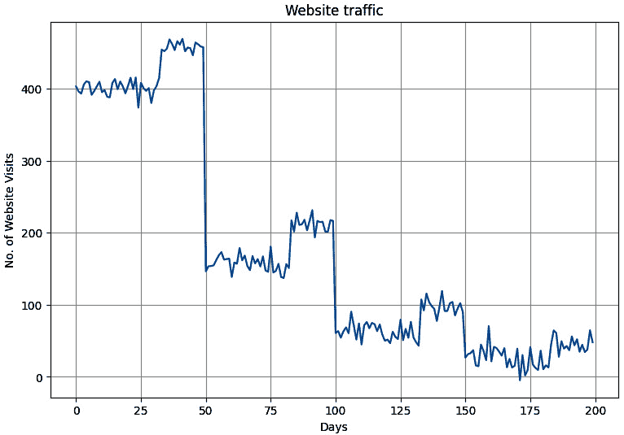
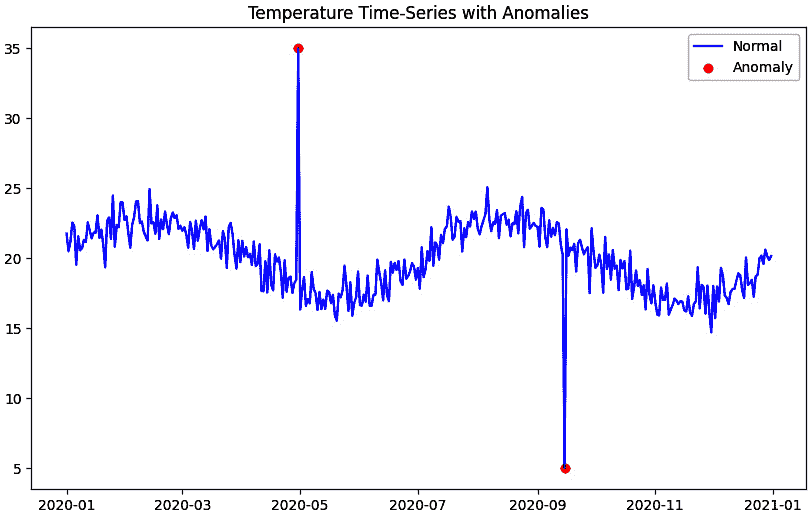
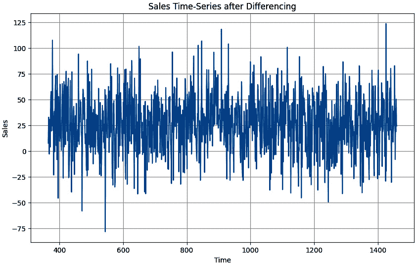

# 第十二章：时间序列、序列与预测概述

**时间序列**横跨各行各业，涉及我们生活的方方面面。金融、医疗、社会科学、物理学——你说得出，时间序列数据就存在。它出现在监测我们环境的传感器中，社交媒体平台追踪我们的数字足迹，在线交易记录我们的财务行为，等等。这种按时间顺序排列的数据代表着随时间变化的动态过程，随着我们逐步数字化地球，这类数据的量和其重要性将呈指数级增长。

时间序列遵循时间顺序，捕捉事件的发生。时间序列的这种时间特性赋予了它与横截面数据的独特区别。当我们聚焦于时间序列数据时，可以观察到如趋势、季节性、噪声、周期性和自相关等特征。这些独特的特性使得时间序列数据蕴含丰富的信息，但也为我们带来了一系列独特的挑战，我们必须克服这些挑战，以充分利用这种数据类型的潜力。借助**TensorFlow**等框架，我们可以利用过去的模式做出关于未来的明智决策。

本章将涵盖以下内容：

+   时间序列分析——特征、应用与预测技术

+   时间序列预测的统计学技术

+   使用神经网络为预测准备数据

+   使用神经网络进行销售预测

本章结束时，你将获得理论上的见解和实际操作经验，学习如何使用统计学和深度学习技术构建、训练和评估时间序列预测模型。

# 时间序列分析——特征、应用与预测技术

我们知道，时间序列数据是由数据点在时间序列中的顺序定义的。想象我们正在预测伦敦的能耗模式。多年来，由于城市化，能源消耗逐年增加——这表示一个正向上升的趋势。每年冬天，我们预期能源消耗会增加，因为更多的人需要为保持温暖而加热家中和办公室的空间。季节性的天气变化也导致了能源利用的季节性波动。此外，我们还可能因为一次重大体育赛事，看到能源消耗的异常激增，这可能是因为赛事期间大量客人的涌入。这种情况会在数据中产生噪声，因为这些事件通常是一次性的或不规律发生的。

在接下来的章节中，让我们一起探索时间序列的特征、类型、应用以及建模时间序列数据的技术。

## 时间序列的特征

为了有效地构建高效的预测模型，我们需要清楚地理解时间序列数据的基本性质。我们可能会遇到具有正向上升趋势、月度季节性、噪声和自相关性的时间序列数据，而下一个我们处理的时间序列可能具有年度季节性和噪声，但数据中没有明显的自相关性或趋势。

了解时间序列数据的这些数据特性，使我们能够具备必要的细节来做出明智的预处理决策。例如，如果我们处理的数据集波动性较大，我们对这一点的了解可能会促使我们在预处理步骤中应用平滑技术。在本章后面，我们将构建用于预测时间序列的统计学和深度学习模型，我们将看到对时间序列数据特性的理解如何指导我们在新特征工程、选择最优超参数值以及模型选择决策方面的判断。让我们来审视时间序列的特点：

+   **趋势**：趋势是指时间序列在长期内所呈现的总体方向。我们可以将趋势视为时间序列数据的整体大局。趋势可以是线性的，如*图 12**.1*所示，或者是非线性的（如二次型和指数型）；它们也可以是正向（上升）或负向（下降）的：


图 12.1 – 显示股票价格随时间变化的正向趋势的图表

趋势分析使数据专业人员、企业和决策者能够做出关于未来的明智决策。

+   **季节性**：季节性是指在特定周期内（如日、周、月或年）定期发生的重复性周期。这些变化通常是季节性波动的副产品；例如，位于居民区的零售商店可能在周末的销售量比工作日更高（每周季节性）。同一家商店在 12 月的假期季节可能会见证销售激增，并在节庆过后不久出现销售下降（年度季节性），如*图 12**.2*所示：


图 12.2 – 显示零售商店的年度季节性的图表

+   **周期性**：周期性指的是在较长时间内，时间序列中发生的不规则周期性波动。与季节性不同，这些周期具有长期性质，其持续时间和幅度不规律，因此相比季节性，它们更难预测。经济周期是周期性的一个典型例子。这些周期受到通货膨胀、利率和政府政策等多种因素的影响。由于周期性的不规则性，预测周期的时机、持续时间和幅度是相当具有挑战性的。通常需要先进的统计学和机器学习模型来准确建模和预测周期模式。

+   **自相关**：自相关是一个统计概念，指的是时间序列与其滞后版本之间的相关性，如*图 12.3*所示。



图 12.3 – 显示自相关的图表

它通常被称为序列相关，衡量数据点与其过去值之间的关联程度。自相关可以是正相关或负相关，值的范围从 -1 到 1。

+   **噪声**：噪声是任何现实世界数据中的固有部分。它指的是数据中无法通过模型解释的随机波动，也无法通过任何已知的潜在因素、模式或结构性影响解释。这些波动可能来自各种来源，如测量误差或意外事件。例如，在金融市场中，政治公告等未预测到的事件可能会产生噪声，导致股价偏离其潜在趋势。噪声呈现出随机性和无法解释的变化，预测时间序列数据时可能需要平滑这些波动。

我们已经讨论了一些可能单独或共同出现在时间序列数据中的重要特征。接下来，让我们看看时间序列数据的类型。

## 时间序列数据的类型

时间序列可以分为以下几类：

+   平稳与非平稳

+   单变量和多变量

### 平稳与非平稳时间序列

平稳时间序列是指其统计特性（均值、方差和自相关）随时间保持恒定的时间序列。这种序列展示出周期性的模式和行为，未来很可能会重复出现。非平稳时间序列则相反。它不是平稳的，我们通常在许多现实场景中发现这类时间序列，其中序列可能会展示趋势或季节性。例如，我们可以预期滑雪度假村的月度销售在冬季达到峰值，而在淡季下滑。这个季节性成分会影响序列的统计特性。

### 单变量和多变量时间序列

单变量时间序列是一种只跟踪单一指标随时间变化的时间序列。例如，我们可以使用智能手表来跟踪我们每天步数的变化。另一方面，当我们跟踪多个指标随时间变化时，就会有多变量时间序列，如*图 12.4*所示。在这张图表中，我们看到通货膨胀和工资增长之间的相互关系。随着时间的推移，我们可以看到通货膨胀持续超过工资增长，使得普通人的实际收入和购买力下降：


图 12.4 – 多变量时间序列展示通货膨胀与工资增长的关系

多变量时间序列分析可以帮助我们考虑多个变量之间随时间变化的依赖关系和相互作用。接下来，让我们深入了解时间序列数据的重要性及其各种应用。

## 时间序列的应用

我们已经讨论了时间序列数据的类型和属性。通过应用机器学习技术，我们可以利用这些数据类型中蕴含的大量信息。接下来，让我们来看一些机器学习在时间序列中的重要应用：

+   **预测**：我们可以应用机器学习模型来预测时间序列；例如，我们可能希望预测零售商店未来的销售情况，从而指导库存决策。如果我们分析商店的销售记录，可能会发现一些规律，比如在假期季节销售增加，或者在特定月份销售下降。我们可以利用这些规律来训练模型，从而做出关于商店未来销售的预测，帮助相关利益方有效规划预期需求。

+   **插补数据**：缺失值在分析或预测时间序列数据时可能会带来重大挑战。一个有效的解决方案是应用插补方法，允许我们使用替代值填补缺失的数据点。例如，在*图 12.5 (a)*中，我们看到了一张展示一年温度值的图。我们很快注意到一些温度记录缺失了。在插补方法的帮助下，我们可以利用相邻天的数据来估算这些缺失值，如*图 12.5 (b)*所示：


图 12.5 – 展示随时间变化的温度图（a）有缺失值（b）没有缺失值

通过填补缺失值，我们现在拥有了一个完整的数据集，可以更好地用于分析和预测。

+   **异常检测**：异常是指显著偏离常规的数据点。我们可以应用时间序列分析来检测异常并潜在地识别出重要问题。例如，在信用卡交易中，如*图 12.6*所示，一笔异常大的交易可能表示欺诈活动：



图 12.6 – 交易金额激增的图示

通过使用时间序列分析来识别这些异常，银行可以迅速采取措施，减少潜在损失。

+   **趋势分析**：了解趋势可以为潜在现象提供宝贵的洞察。例如，国际能源机构显示，2022 年所有新售汽车中有 14%是电动汽车。这个趋势可能表明人们正在转向更加可持续的交通方式（见[`www.iea.org/reports/global-ev-outlook-2023/executive-summary`](https://www.iea.org/reports/global-ev-outlook-2023/executive-summary)）。

+   **季节性分析**：时间序列的另一个有用应用是季节性分析。这对于指导能源消耗规划和基础设施扩展需求可能非常有用。

我们现在已经了解了一些时间序列数据的重要应用。接下来，让我们看看一些重要的时间序列预测技术。

## 时间序列预测技术

在本书中，我们将探讨两种主要的时间序列预测技术：统计方法和机器学习方法。统计方法通过使用数学模型来捕捉时间序列数据的趋势、季节性和其他组成部分，常见的模型包括**自回归综合滑动平均**（**ARIMA**）和**季节性与趋势分解使用 LOESS**（**STL**）。然而，这些方法超出了本书的范围。在这里，我们将使用更简单的统计方法，如**朴素预测**和**移动平均**来建立我们的基准，然后再应用不同的机器学习方法。在本章中，我们将重点使用**深度神经网络**（**DNNs**），而在下一章中，我们将应用**递归神经网络**（**RNNs**）和**长短期记忆网络**（**LSTMs**）。

每种方法都有其优缺点，最佳的时间序列预测方法在很大程度上取决于数据的具体特征和当前的问题。值得强调的是，时间序列预测是一个广泛的领域，仍有其他方法超出了本书的范围，您可以在以后的阶段进行探索。在我们开始建模时间序列问题之前，让我们先看看如何评估这种数据。

## 评估时间序列预测技术

为了有效评估时间序列预测模型，我们必须使用适当的指标来衡量其表现。在*第三章*《使用 TensorFlow 的线性回归》中，我们探讨了几种回归指标，如 MAE、MSE、RMSE 和 MAPE。我们可以使用这些指标来评估时间序列预测模型。然而，在本章中，我们将重点应用 MAE 和 MSE，以符合考试要求。我们使用 MAE 计算预测值与真实值之间绝对差异的平均值。通过这种方式，我们可以了解预测结果有多偏差。较小的 MAE 表示模型拟合较好。想象你是一名股票市场分析师，试图预测某只特定股票的未来价格。使用 MAE 作为评估指标，你可以清楚地了解你的预测与实际股票价格之间的平均差异。这些信息可以帮助你调整模型，做出更准确的预测，降低潜在的财务风险。

另一方面，MSE 计算的是预测值与实际值之间差异的平方平均值。通过对误差进行平方处理，MSE 比 MAE 对较大误差更加敏感，因此在误差较大的情况不利时，MSE 更为有用。例如，在处理电网时，精确的负荷预测至关重要，因此 MSE 尤为重要。考虑到这一点，现在让我们转向一个销售的使用案例，并应用我们的学习来预测未来的销售额。

# 零售店预测

想象一下，你作为一名机器学习工程师，刚刚接到一个新项目。佛罗里达州的一家快速增长的大型超市请求你的帮助。他们希望预测未来的评论，这将为他们扩展商店并满足预期需求提供指导。你负责根据 Tensor 超市提供的历史数据构建一个预测模型。让我们一起看看你如何解决这个问题，因为公司正指望你。我们开始吧！

1.  我们首先导入项目所需的库：

    ```py
    import pandas as pd
    
    import numpy as np
    
    import matplotlib.pyplot as plt
    ```

    在这里，我们导入`numpy`和`matplotlib`用于数值分析和可视化，`pandas`用于数据转换。

1.  接下来，我们加载时间序列数据：

    ```py
    df = pd.read_csv('/content/sales_data.csv')
    
    df.head()
    ```

    在这里，我们加载数据并使用`head`函数查看数据的前五行。当我们运行代码时，看到给定数据中的销售第一天是`2013-01-01`。接下来，让我们查看一些统计信息，以便了解我们手头的数据。

1.  使用以下代码检查数据类型和汇总统计信息：

    ```py
    # Check data types
    
    print(df.dtypes)
    
    # Summary statistics
    
    print(df.describe())
    ```

    当我们运行代码时，它返回的数据类型为`float64`，并显示我们销售数据的关键汇总统计信息。使用`describe`函数，我们得到了 3,653 个数据点的计数。这指示了一个 10 年的每日数据周期。我们还看到每日的平均销售额大约为 75 美元，这给了我们一个关于数据集中趋势的直观感受。每日销售额有着相当的波动，标准差为`20.2`。最小值和最大值显示销售额的范围从 22 美元到 128 美元，表明存在显著的波动。第 25 和第 75 百分位数分别为`60.27`和`89.18`，显示低销售量的日子销售额大约为 60 美元，而高销售量的日子销售额则大约为 90 美元。接下来，我们通过绘图进一步探索数据。

1.  让我们可视化数据：

    ```py
    #Sales data plot
    
    df.set_index('Date').plot()
    
    plt.ylabel('Sales')
    
    plt.title('Sales Over Time')
    
    plt.xticks(rotation=90)
    
    plt.show()
    ```

    代码返回了如*图 12.7*所示的图表，表示公司在 10 年期间的销售情况：


图 12.7 – 显示销售随时间变化的图表

从*图 12.7*中的图表中，我们可以观察到一个整体的积极上升趋势，这可能表明经济增长或成功的商业策略，如新产品发布和有效的市场营销。一个明显的年度季节性波动也浮现出来；这可能表明公司销售的是季节性商品，且有着每年波动的需求。同时，我们也观察到存在一些噪声。这可能是由于天气变化、随机事件或竞争对手的进入所导致。数据中的上升趋势显示了销售额随着时间的推移表现出良好的增长。然而，季节性效应和噪声因素揭示了总体趋势下更为复杂的动态。接下来，让我们探索如何对数据进行分区。

## 数据分区

在时间序列预测中，我们通常将数据集分成不同的部分：用于训练机器学习模型的训练期、用于模型调优和评估的验证期，以及用于评估未见数据性能的测试期。这个过程被称为固定分区。另一种方法是滚动前进分区，我们将在接下来的部分讨论这一方法。

我们的销售数据展示了季节性波动，因此，我们必须将数据按方式划分，以确保每个分区都包含完整的季节周期。我们这样做是为了确保不会遗漏一个或多个分区中的重要季节性模式。虽然这种方法与典型的数据分区方法有所不同，但我们看到在处理其他机器学习问题时，通常是通过随机抽样来形成训练集、验证集和测试集，基本目标保持一致。我们在训练数据上训练模型，使用验证数据进行调优，并在测试数据上评估模型。然后，我们可以将验证数据合并到训练数据中，以便利用最新的信息来预测未来的数据。

通常，确保训练集足够大以捕捉数据中所有相关模式是一个好主意，包括数据的季节性行为。在设置验证集的大小时，必须找到平衡点。虽然更大的验证集能够提供更可靠的模型性能估计，但它也会减少训练集的大小。你还应该记得在做出最终预测之前，使用整个数据集（将训练集和验证集合并）重新训练最终模型。这种策略最大化了模型从数据中学习的量，可能提高其对未来未见数据的预测性能。同样，避免在分割数据之前打乱数据，因为这会破坏时间顺序，导致误导性结果。在固定划分中，我们通常使用按时间顺序划分的方法，训练数据应该来自最早的时间戳，接着是验证集，最后是包含最新时间戳的测试集。让我们将销售数据分为训练集和验证集：

```py
# Split data into training and validation sets
split_time = int(len(df) * 0.8)
train_df = df.iloc[:split_time]
valid_df = df.iloc[split_time:]
```

在这里，我们将数据分为训练集和验证集。我们取 80%的数据（`len(df) * 0.8`），在这个例子中是 8 年的数据用于训练，最后 2 年的数据用于验证。我们使用`int`函数确保分割时间是整数，以便进行索引操作。我们设置了训练集和验证集，使用分割时间之前的所有数据作为训练集，分割时间之后的所有数据作为验证集。

接下来，让我们绘制训练集和验证集的数据：

```py
plt.figure(figsize=(12, 9))
# Plotting the training data in green
plt.plot(train_df['Date'], train_df['Sales'], 'green',
    label = 'Training Data')
plt.plot(valid_df['Date'], valid_df['Sales'], 'blue',
    label = 'Validation Data')
plt.title('Fixed Partitioning')
plt.xlabel('Date')
plt.ylabel('Sales')
all_dates = np.concatenate([train_df['Date'],
    valid_df['Date']])
plt.xticks(all_dates[::180], rotation=90)
plt.legend()
plt.tight_layout()
plt.show()
```

这段代码展示了销售数据的划分，将训练集和验证集分别用绿色和蓝色标记，*x*轴表示日期，*y*轴表示销售额。为了提高可读性，我们将*x*轴的刻度设置为每 180 天一次：


图 12.8 – 显示固定划分的图表

在*图 12.8*中，我们将销售数据划分为 8 年的训练数据和 2 年的验证数据。在这种情况下，我们的测试集将是来自未来的数据。这是为了确保模型在时间序列的最早部分进行训练，在最近的过去进行验证，并在未来进行测试。另一种划分时间序列数据的方法被称为滚动前移划分或“前行”验证。在这种方法中，我们从一个较短的训练期开始，并逐渐增加训练期的长度。对于每个训练期，接下来的时间段作为验证集。这种方法模拟了现实生活中的情况，我们会随着新数据的到来不断重新训练模型，并利用它来预测下一时期。让我们讨论一下我们的第一种预测方法，叫做天真预测。

## 天真预测

朴素预测是时间序列分析中最简单的方法之一。朴素预测的原理是将所有预测值设为最后一个观察点的值。这就是为什么它被称为“朴素”的原因。它是一种假设未来值可能与当前值相同的方法。尽管其简单，但朴素预测通常可以作为时间序列预测的一个良好基准；然而，它的表现可能会根据时间序列的特征有所不同。

让我们看看如何在代码中实现这个：

1.  让我们实现朴素预测：

    ```py
    # Apply naive forecast
    
    df['Naive_Forecast'] = df['Sales'].shift(1)
    
    df.head()
    ```

    为了实现朴素预测方法，每个预测值仅设置为前一个时间步的实际观察值，通过将`Sales`列向前移动一个单位来实现。我们使用`df.head()`来显示 DataFrame 的前五行，以快速概览销售数据和朴素预测：


图 12.9 – 显示销售和朴素预测的 DataFrame 快照

从*图 12.9*中的表格来看，我们看到第一个预测值是不可用的。这是因为该方法仅仅取从验证数据前一步开始，直到序列倒数第二个值的所有值。这实际上将时间序列向未来移动了一个时间步长。

1.  我们创建一个用于绘图的函数：

    ```py
    def plot_forecast(validation_df, forecast_df,
    
        start_date=None, end_date=None,
    
        plot_title='Naive Forecasting',
    
        forecast_label='Naive Forecast'):
    
            if start_date:
    
                validation_df = validation_df[
    
                    validation_df['Date'] >= start_date]
    
                forecast_df = forecast_df[forecast_df[
    
                    'Date'] >= start_date]
    
            if end_date:
    
                validation_df = validation_df[
    
                    validation_df['Date'] <= end_date]
    
                forecast_df = forecast_df[forecast_df[
    
                    'Date'] <= end_date]
    
        # Extract the dates in the selected range
    
        all_dates = validation_df['Date']
    
        plt.figure(figsize=(12, 9))
    
        plt.plot(validation_df['Date'],
    
            validation_df['Sales'],
    
            label='Validation Data')
    
        plt.plot(forecast_df['Date'],
    
            forecast_df['Naive_Forecast'],
    
            label=forecast_label)
    
        plt.legend(loc='best')
    
        plt.title(plot_title)
    
        plt.xlabel('Date')
    
        plt.ylabel('Sales')
    
        # Set x-ticks to every 90th date in the selected range
    
        plt.xticks(all_dates[::90], rotation=90)
    
        plt.legend()
    
        plt.tight_layout()
    
        plt.show()
    ```

    我们构建一个实用的图表来生成真实和预测验证值的图形。该函数接受我们的验证数据的预测值和真实值，并包括开始日期、结束日期、图表标题和标签。该函数为我们提供了灵活性，可以深入探讨图表中的不同兴趣区域。

1.  接下来，让我们绘制朴素预测：

    ```py
    plot_forecast(valid_df, valid_df,
    
        plot_title='Naive Forecasting',
    
        forecast_label='Naive Forecast')
    ```

    我们传入所需的参数并运行代码，生成以下图表：


图 12.10 – 使用朴素方法的时间序列预测

*图 12.10*中的图表显示了预测值和验证数据的真实值。由于值接近，图表看起来有点密集，因此让我们放大，以帮助我们在视觉上检查预测的效果。

1.  让我们看一下特定的时间范围：

    ```py
    plot_forecast(valid_df, valid_df,
    
        start_date='2022-01-01', end_date='2022-06-30')
    ```

    我们将开始日期和结束日期参数设置为`2022-01-01`和`2022-06-30`，得到的图表如下：


图 12.11 – 使用朴素方法的放大时间序列预测

从*图 12.11*中的图表可以看出，预测开始得晚了一步，因为朴素预测向未来移动了一个时间步。

1.  接下来，让我们评估朴素方法的表现：

    ```py
    # Compute and print mean squared error
    
    mse = tf.keras.metrics.mean_squared_error(
    
        valid_df['Sales'], valid_df
    
            ['Naive_Forecast']).numpy()
    
    print('Mean Squared Error:', mse)
    
    # Compute and print mean absolute error
    
    mae = tf.keras.metrics.mean_absolute_error(
    
        valid_df['Sales'],
    
        valid_df['Naive_Forecast']).numpy()
    
    print('Mean Absolute Error:', mae)
    ```

    我们使用`.numpy()`提供的`metrics`函数，将 TensorFlow 张量的结果转换为 NumPy 数组。当我们运行代码时，得到朴素预测的均方误差（MSE）为`45.22`，朴素预测的平均绝对误差（MAE）为`5.43`。回想一下，对于 MSE 和 MAE 值，较低的值总是更好。

在我们探索其他预测技术时，记住这一点。朴素预测可以作为基准，用于比较更复杂模型的表现。接下来，我们将研究另一种统计方法，称为移动平均。

## 移动平均

移动平均是一种通过将每个数据点替换为邻近数据点的平均值来平滑时间序列数据的技术。在此过程中，我们生成一个新的序列，其中的数据点是原始数据序列中的数据点的平均值。此方法中的关键参数是**窗口宽度**，它决定了计算平均值时包括的连续原始数据点的数量。

“移动”一词指的是沿时间序列滑动窗口来计算平均值，从而生成一个新的序列。

### 移动平均的类型

时间序列分析中常用的两种主要移动平均类型是中心移动平均和滞后移动平均：

+   **中心移动平均**：中心移动平均围绕中心点（*t*）计算平均值。它使用兴趣时间点前后的数据进行可视化，如*图 12.12*所示。中心移动平均能够提供数据趋势的均衡视图，但由于它需要未来数据，因此不适用于预测，因为在进行预测时我们无法获得未来的值。中心移动平均适用于可视化和时间序列分析。


图 12.12 – 显示中心移动平均的图形

中心移动平均能够提供数据趋势的均衡视图，但由于它需要未来数据，因此不适用于预测，因为在进行预测时我们无法获得未来的值。中心移动平均适用于可视化和时间序列分析。

+   **滞后移动平均**：滞后移动平均，也称为滚动平均或运行平均，通过使用最近的*n*个数据点来计算平均值。此方法仅需要过去的数据点，如*图 12.13*所示，非常适合用于预测。


图 12.13 – 显示滞后移动平均的图形

计算滞后移动平均的第一步是选择窗口宽度 (*W*)。这个选择可以依赖于各种因素，例如序列的模式和你希望实现的平滑程度。较小的窗口宽度能够更紧密地跟踪快速变化，但这也可能会带来更多噪音。另一方面，较大的窗口宽度能够提供更平滑的曲线，但可能会错过一些短期波动。

让我们看看如何实现移动平均：

```py
# Calculate moving average over a 30-day window
window =30
df['Moving_Average_Forecast'] = df['Sales'].rolling(
    window=window).mean().shift(1)
```

代码使用 pandas 的`rolling`函数来计算 `Sales` 数据的 30 天窗口移动平均，然后将结果向前移动一步，以模拟下一时间步的预测，并将结果存储在新的 `Moving_Average_Forecast` 列中。你可以将其视为使用 30 天的销售数据来预测第 31 天的销售。

我们调用 `plot_forecast` 函数来绘制验证数据和移动平均预测数据。我们可以在*图 12.14*中看到结果图：


图 12.14 – 使用移动平均法进行时间序列预测

在*图 12.14*中，移动平均预测是使用过去 30 天的销售数据计算出来的。较小的窗口大小，例如 7 天的窗口，将比 30 天的移动平均更加贴近实际销售，但也可能会捕捉到数据中的更多噪音。

下一步逻辑就是再次使用`metric`函数评估我们的模型。这次，我们将移动平均预测与真实的验证值进行对比：

```py
# Compute and print mean squared error
mse = tf.keras.metrics.mean_squared_error(
    valid_df['Sales'],
    df.loc[valid_df.index,
    'Moving_Average_Forecast']).numpy()
print('Mean Squared Error:', mse)
# Compute and print mean absolute error
mae = tf.keras.metrics.mean_absolute_error(
    valid_df['Sales'],
    df.loc[valid_df.index,
    'Moving_Average_Forecast']).numpy()
print('Mean Absolute Error:', mae)
print('Mean Squared Error for moving average forecast:',
    mse)
```

当我们运行代码时，移动平均预测的 MSE 为 `55.55`，MAE 为 `6.05`。这两个值比我们的基准结果要差得多。如果你将窗口大小改为 7 天，我们最终得到的 MSE 和 MAE 分别为 `48.57` 和 `5.61`，这是一个更好的结果，但比我们天真的方法稍差。你可以尝试更小的窗口大小，看看结果是否能够超过基准值。

然而，我们需要注意的是，使用移动平均法的前提假设是平稳性。我们知道我们的时间序列同时包含趋势和季节性，那么我们该如何在这些数据上实现平稳性呢？这是否能帮助我们实现更低的 MAE？为了实现平稳性，我们使用一个叫做**差分**的概念。接下来让我们讨论差分，并看看如何应用它，以及它是否能帮助我们实现更低的 MAE 和 MSE。

## 差分

差分是用于实现时间序列平稳性的一种方法。它通过计算连续观测值之间的差异来工作。其逻辑是，尽管原始序列可能存在趋势并且非平稳，但序列值之间的差异可能是平稳的。通过对数据进行差分，我们可以去除趋势和季节性，从而使序列平稳，并使其适合用于移动平均预测模型。这可以显著提高模型的准确性，从而提高预测的可靠性。让我们在以下代码中查看这一点：

```py
# Perform seasonal differencing
df['Differenced_Sales'] = df['Sales'].diff(365)
# Plotting the differenced sales data
plt.figure(figsize=(12, 9))
# Plotting the differenced data
plt.plot(df['Date'], df['Differenced_Sales'],
    label = 'Differenced Sales')
plt.title('Seasonally Differenced Sales Data')
plt.xlabel('Date')
plt.ylabel('Differenced Sales')
# Select dates to be displayed on x-axis
all_dates = df['Date']
plt.xticks(all_dates[::90], rotation=90)
plt.legend()
plt.tight_layout()
plt.show()
```

上述代码块对我们的时间序列数据应用了差分。我们首先生成一个新序列，其中每个值与 365 天前的值之间存在差异。我们这样做是因为我们知道数据具有年度季节性。接下来，我们绘制我们的数据：



图 12.15 – 显示差分后销售时间序列的图表

我们可以看到，*图 12.15* 中的图表没有趋势或季节性。因此，我们已经实现了使用移动平均法时所需的平稳性假设。

现在让我们恢复趋势和季节性：

```py
window=7
# Restore trend and seasonality
df['Restored_Sales'] = df['Sales'].shift(
    365) + df['Differenced_Sales']
# Compute moving average on the restored data
df['Restored_Moving_Average_Forecast'] = df[
    'Restored_Sales'].rolling(
    window=window).mean().shift(1)
# Split into training and validation again
train_df = df.iloc[:split_time]
valid_df = df.iloc[split_time:]
# Get forecast and true values on validation set
forecast = valid_df['Restored_Moving_Average_Forecast']
true_values = valid_df['Sales']
```

在这里，我们将季节性重新融入到经过差分的时间序列数据中，然后对这个恢复的数据应用移动平均预测。我们使用一个 7 天窗口进行移动平均计算。通过将平移后的销售数据添加到差分后的销售数据中恢复趋势和季节性后，我们计算这些恢复的销售数据在所选窗口大小上的移动平均值，然后将结果序列向前移动一步进行预测。然后，我们再次将数据拆分为训练集和验证集。使用相同的拆分时间，以确保与之前的拆分一致。这对于确保我们正确评估模型至关重要。最后，我们通过从验证集中提取`Restored_Moving_Average_Forecast`和`Sales`值，准备进行预测值和真实销售值的评估：


图 12.16 – 恢复季节性和趋势后的销售预测

在*图 12.16*中的图表中，橙色线表示我们将过去的值重新加入以恢复趋势和季节性后的预测结果。回想一下，我们使用了一个大小为`7`的窗口，这使得我们得到了更低的 MAE 和 MSE 值。现在，我们本质上是利用差分序列的预测来预测从一年到下一年的变化，然后将这些变化加到一年前的值上，从而得到最终的预测值。

当我们计算恢复季节性和趋势的预测的 MSE 时，结果是 `48.57`，而恢复季节性和趋势的 MAE 为 `5.61`，这两个值明显低于未使用差分时的结果。我们还可以尝试平滑数据中的噪声，以提高 MAE 和 MSE 的得分。接下来，让我们看看如何使用机器学习，特别是使用 TensorFlow 的神经网络进行预测。

# 使用机器学习进行时间序列预测

到目前为止，我们已经使用统计方法取得了相当不错的结果。接下来，我们将使用深度学习技术对时间序列数据进行建模。我们将从掌握如何设置窗口数据集开始。我们还将讨论一些概念，如洗牌和批处理，并看看如何构建和训练一个神经网络来解决我们的销售预测问题。让我们首先掌握如何使用 TensorFlow 工具准备时间序列数据，以便使用窗口数据集方法进行建模：

1.  我们从导入所需的库开始：

    ```py
    import tensorflow as tf
    
    import numpy as np
    ```

    在这里，我们将使用 NumPy 和 TensorFlow 准备并处理我们的数据，使其符合建模所需的结构。

1.  让我们创建一个简单的数据集。这里我们假设数据由两周的温度值组成：

    ```py
    # Create an array of temperatures for 2 weeks
    
    temperature = np.arange(1, 15)
    
    print(temperature)
    ```

    当我们打印温度数据时，得到以下内容：

    ```py
    [ 1  2  3  4  5  6  7  8  9 10 11 12 13 14]
    ```

    我们得到一个从 1 到 14 的数值数组，其中我们假设温度从第一天的 1 上升到第 14 天的 14。虽然有些奇怪，但我们就假设是这样。

1.  让我们创建窗口化数据。现在我们有了数据，接下来需要创建一个数据点的“窗口”：

    ```py
    window_size = 3
    
    batch_size = 2
    
    shuffle_buffer = 10
    ```

    `window_size` 参数指的是正在考虑的数据窗口。如果我们将窗口大小设置为 `3`，这意味着我们将使用连续 3 天的温度值来预测下一天的温度。批量大小决定了在每次训练迭代中处理的样本数量，而 `shuffle_buffer` 指定了在洗牌数据时，TensorFlow 从多少个元素中随机采样。我们洗牌是为了避免顺序偏差；我们将在下一章进一步讨论这一点。

1.  创建数据集的过程如下：

    ```py
    dataset = tf.data.Dataset.from_tensor_slices(temperature)
    
    for element in dataset:
    
        print(element.numpy())
    ```

    这行代码用于从我们的温度数据创建一个 TensorFlow `Dataset` 对象。这个 `Dataset` API 是一个高层次的 TensorFlow API，用于读取数据并将其转换为机器学习模型可以使用的形式。接下来，我们遍历数据集并打印每个元素。我们使用 `numpy()` 将 TensorFlow 对象转换为 NumPy 数组。当我们运行代码时，我们得到数字 1-14；然而，现在它们已经准备好进行窗口化处理了。

1.  接下来，让我们将温度数据转换成一个“窗口化”的数据集：

    ```py
    dataset = dataset.window(window_size + 1, shift=1, 
    
        drop_remainder=True)
    
    for window in dataset:
    
        window_data = ' '.join([str(
    
            element.numpy()) for element in window])
    
        print(window_data)
    ```

    我们使用`window`方法来创建一个窗口数据集，其中每个窗口本身也是一个数据集。`window_size + 1`参数意味着我们将`window_size`个元素作为输入，接下来的一个元素作为标签。`shift=1`参数表示窗口每次移动一步。`drop_remainder=True`参数表示如果最后几个元素无法形成完整窗口，我们将丢弃它们。

    当我们打印出我们的`window_data`时，得到如下输出：

    ```py
    After window:
    
    1 2 3 4
    
    2 3 4 5
    
    3 4 5 6
    
    4 5 6 7
    
    5 6 7 8
    
    6 7 8 9
    
    7 8 9 10
    
    8 9 10 11
    
    9 10 11 12
    
    10 11 12 13
    
    11 12 13 14
    ```

    我们看到现在窗口大小被设置为 3，`+1`部分将作为标签。由于我们将`shift`值设置为`1`，下一个窗口将从序列中的第二个值开始，在这个例子中是`2`。接下来，窗口将继续移动一步，直到我们处理完所有窗口数据。

1.  展平数据的过程如下：

    ```py
    dataset = dataset.flat_map(
    
        lambda window: window.batch(window_size + 1))
    
    for element in dataset:
    
        print(element.numpy())
    ```

    很容易将上一阶段创建的每个窗口视为一个单独的数据集。通过这段代码，我们将数据展平，使得每个窗口的数据作为主数据集中的一个单独批次打包。我们使用`flat_map`将其展平回张量数据集，并使用`window.batch(window_size + 1)`将每个窗口数据集转换为批次张量。当我们运行代码时，得到如下结果：

    ```py
    After flat_map:
    
    [1 2 3 4]
    
    [2 3 4 5]
    
    [3 4 5 6]
    
    [4 5 6 7]
    
    [5 6 7 8]
    
    [6 7 8 9]
    
    [ 7  8  9 10]
    
    [ 8  9 10 11]
    
    [ 9 10 11 12]
    
    [10 11 12 13]
    
    [11 12 13 14]
    ```

    我们可以看到，窗口数据现在已被放入批次张量中。

1.  打乱数据的过程如下：

    ```py
    dataset = dataset.shuffle(shuffle_buffer)
    
    print("\nAfter shuffle:")
    
    for element in dataset:
    
        print(element.numpy())
    ```

    在这段代码中，我们对数据进行了打乱。这是一个重要步骤，因为打乱用于确保模型在训练过程中不会错误地学习到数据呈现顺序中的模式。当我们运行代码时，得到如下结果：

    ```py
    After shuffle:
    
    [5 6 7 8]
    
    [4 5 6 7]
    
    [1 2 3 4]
    
    [11 12 13 14]
    
    [ 7  8  9 10]
    
    [ 8  9 10 11]
    
    [10 11 12 13]
    
    [ 9 10 11 12]
    
    [6 7 8 9]
    
    [2 3 4 5]
    
    [3 4 5 6]
    ```

    我们可以看到主数据集中的小型数据集已被打乱。但是，请注意，打乱后的数据集中，特征（窗口）和标签保持不变。

1.  特征和标签映射的过程如下：

    ```py
    dataset = dataset.map(lambda window: (window[:-1],
    
        window[-1]))
    
    print("\nAfter map:")
    
    for x,y in dataset:
    
        print("x =", x.numpy(), "y =", y.numpy())
    ```

    `map`方法对数据集的每个元素应用一个函数。在这里，我们将每个窗口分割成特征和标签。特征是窗口中的所有元素（除了最后一个元素，`window[:-1]`），标签是窗口中的最后一个元素，`window[-1]`。当我们运行代码时，看到如下结果：

    ```py
    After map:
    
    features = [3 4 5] label = 6
    
    features = [1 2 3] label = 4
    
    features = [10 11 12] label = 13
    
    features = [ 8  9 10] label = 11
    
    features = [4 5 6] label = 7
    
    features = [7 8 9] label = 10
    
    features = [11 12 13] label = 14
    
    features = [5 6 7] label = 8
    
    features = [2 3 4] label = 5
    
    features = [6 7 8] label = 9
    
    features = [ 9 10 11] label = 12
    ```

    从打印结果来看，我们可以看到特征由三次观察值组成，并且下一个值是我们的标签。

1.  批次处理和预取数据的过程如下：

    ```py
    dataset = dataset.batch(batch_size).prefetch(1)
    
    print("\nAfter batch and prefetch:")
    
    for batch in dataset:
    
        print(batch)
    ```

    `batch()`函数将数据集分成大小为`batch_size`的批次。在这里，我们创建了大小为`2`的批次。`prefetch(1)`性能优化函数确保 TensorFlow 在处理当前批次时，总是有一个批次已准备好。在进行这些转换后，数据集准备好用于训练机器学习模型。让我们打印出批次数据：

    ```py
    After batch and prefetch:
    
    (<tf.Tensor: shape=(2, 3), dtype=int64,
    
        numpy=array([[10, 11, 12],
    
            [ 3,  4,  5]])>, <tf.Tensor: shape=(2,),
    
            dtype=int64, numpy=array([13,  6])>)
    
    (<tf.Tensor: shape=(2, 3), dtype=int64,
    
        numpy=array([[ 9, 10, 11],
    
            [11, 12, 13]])>, <tf.Tensor: shape=(2,),
    
            dtype=int64, numpy=array([12, 14])>)
    
    (<tf.Tensor: shape=(2, 3), dtype=int64,
    
        numpy=array([[6, 7, 8],
    
            [7, 8, 9]])>, <tf.Tensor: shape=(2,),
    
            dtype=int64, numpy=array([ 9, 10])>)
    
    (<tf.Tensor: shape=(2, 3), dtype=int64,
    
        numpy=array([[1, 2, 3],
    
            [4, 5, 6]])>, <tf.Tensor: shape=(2,),
    
            dtype=int64, numpy=array([4, 7])>)
    
    (<tf.Tensor: shape=(2, 3), dtype=int64,
    
        numpy=array([[2, 3, 4],
    
            [5, 6, 7]])>, <tf.Tensor: shape=(2,),
    
            dtype=int64, numpy=array([5, 8])>)
    
    (<tf.Tensor: shape=(1, 3), dtype=int64, numpy=array(
    
        [[ 8,  9, 10]])>, <tf.Tensor: shape=(1,),
    
        dtype=int64, numpy=array([11])>)
    ```

我们看到数据集中的每个元素是一个特征和标签对的批次，其中特征是原始序列中`window_size`个值的数组，而标签是我们想要预测的下一个值。我们已经看到如何准备我们的时间序列数据进行建模；我们已经将其切片、窗口化、批处理、打乱，并将其拆分成特征和标签以供使用。

接下来，我们将利用在合成销售数据上学到的内容，来预测未来的销售值。

## 使用神经网络进行销售预测

让我们回到我们创建的销售数据，用于通过天真方法和移动平均方法预测销售。现在我们使用一个神经网络；在这里，我们将使用一个 DNN：

1.  提取数据的过程如下：

    ```py
    time = pd.to_datetime(df['Date'])
    
    sales = df['Sales'].values
    ```

    在这段代码中，我们从`Sales`数据框中提取`Date`和`Sales`数据。`Date`被转换为日期时间格式，`Sales`被转换为 NumPy 数组。

1.  数据拆分的过程如下：

    ```py
    split_time = int(len(df) * 0.8)
    
    time_train = time[:split_time]
    
    x_train = sales[:split_time]
    
    time_valid = time[split_time:]
    
    x_valid = sales[split_time:]
    ```

    为了统一性，我们使用 80%的`split_time`将数据分为训练集和验证集，采用相同的 80:20 分割方式。

1.  创建窗口化数据集的过程如下：

    ```py
    def windowed_dataset(
    
        series, window_size, batch_size, shuffle_buffer):
    
            dataset = tf.data.Dataset.from_tensor_slices(
    
                series)
    
            dataset = dataset.window(window_size + 1,
    
                shift=1, drop_remainder=True)
    
            dataset = dataset.flat_map(lambda window:
    
                window.batch(window_size + 1))
    
            dataset = dataset.shuffle(shuffle_buffer).map(
    
                lambda window: (window[:-1], window[-1]))
    
            dataset = dataset.batch(
    
                batch_size).prefetch(1)
    
        return dataset
    
    dataset = windowed_dataset(x_train, window_size,
    
        batch_size, shuffle_buffer_size)
    ```

    我们创建了`windowed_dataset`函数；该函数接收一个序列、一个窗口大小、一个批量大小和一个随机缓冲区。它为训练创建数据窗口，每个窗口包含`window_size + 1`个数据点。这些窗口随后被打乱并映射到特征和标签，其中特征是窗口中的所有数据点（除了最后一个），标签是最后一个数据点。然后，这些窗口被批处理并预取，以提高数据加载效率。

1.  构建模型的过程如下：

    ```py
    model = tf.keras.models.Sequential([
    
        tf.keras.layers.Dense(10,
    
            input_shape=[window_size], activation="relu"),
    
        tf.keras.layers.Dense(10, activation="relu"),
    
        tf.keras.layers.Dense(1)
    
        ])
    
    model.compile(loss="mse",
    
        optimizer=tf.keras.optimizers.SGD(
    
            learning_rate=1e-6, momentum=0.9))
    ```

    接下来，我们使用一个简单的**前馈神经网络**（**FFN**）进行建模。该模型包含两个具有 ReLU 激活函数的全连接层，随后是一个具有单个神经元的全连接输出层。模型使用 MSE 损失函数，并以**随机梯度下降**（**SGD**）作为优化器进行编译。

1.  训练模型的过程如下：

    ```py
    model.fit(dataset, epochs=100, verbose=0)
    ```

    模型在窗口化的数据集上训练 100 个周期。

1.  生成预测的过程如下：

    ```py
    input_batches = [sales[time:time + window_size][
    
        np.newaxis] for time in range(len(
    
            sales) - window_size)]
    
    inputs = np.concatenate(input_batches, axis=0)
    
    forecast = model.predict(inputs)
    
    results = forecast[split_time-window_size:, 0]
    ```

    在这里，我们批量生成预测结果以提高计算效率。只保留验证期的预测结果。

1.  评估模型的过程如下：

    ```py
    print(tf.keras.metrics.mean_squared_error(x_valid,
    
        results).numpy())
    
    print(tf.keras.metrics.mean_absolute_error(x_valid,
    
        results).numpy())
    ```

    计算真实验证数据和预测数据之间的 MSE 和 MAE。在这里，我们得到了 MSE 为`34.51`，MAE 为`4.72`，这超越了我们所有的简单统计方法。

1.  可视化结果的过程如下。将真实验证数据和预测数据随时间绘制，以可视化模型的表现：


图 12.17 – 使用简单 FFN 的时间序列预测

从*图 12.17*中的图表来看，我们可以看到我们的预测值与验证集上的真实值高度吻合，只有少量噪声波动。我们的 FFN 在这次实验中表现出了显著的成就。与传统的统计方法相比，我们的模型在性能上有了显著的提升。你可以调整超参数并实现回调来提高性能。但我们的工作在这里已经完成。

我们在最后一章见面，那时我们将预测应用股票价格。到时候见。

# 总结

在本章中，我们探讨了时间序列的概念，研究了时间序列的核心特征和类型，并了解了时间序列在机器学习中的一些著名应用。我们还介绍了如滞后窗口和居中窗口等概念，并研究了如何借助 TensorFlow 的工具准备时间序列数据，以便用于神经网络建模。在我们的案例研究中，我们结合统计学方法和深度学习技术，为一家虚拟公司构建了一个销售预测模型。

在下一章中，我们将使用更复杂的架构，如 RNN、CNN 和 CNN-LSTM 架构，来扩展我们的建模，进行时间序列数据预测。同时，我们还将探索学习率调度器和 Lambda 层等概念。为了结束本书的最后一章，我们将构建一个苹果公司收盘股票价格的预测模型。

# 问题

1.  使用提供的练习笔记本，将天真预测原理应用于“*航空乘客*”数据集。

1.  在同一数据集上实现移动平均技术，并通过计算 MAE 和 MSE 值来评估其性能。

1.  接下来，将差分方法引入到你的移动平均模型中。再次，通过确定 MAE 和 MSE 值来评估你的预测准确性。

1.  手头有样本温度数据集，演示如何从这些数据中创建有意义的特征和标签。

1.  最后，在数据集上尝试简单的 FFN 模型，并观察其性能。
