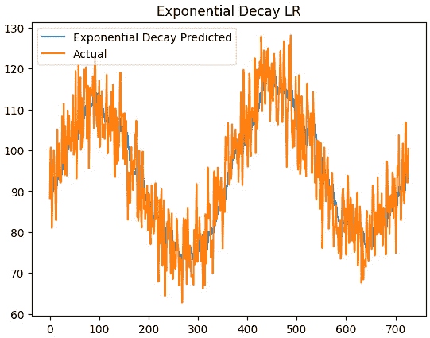
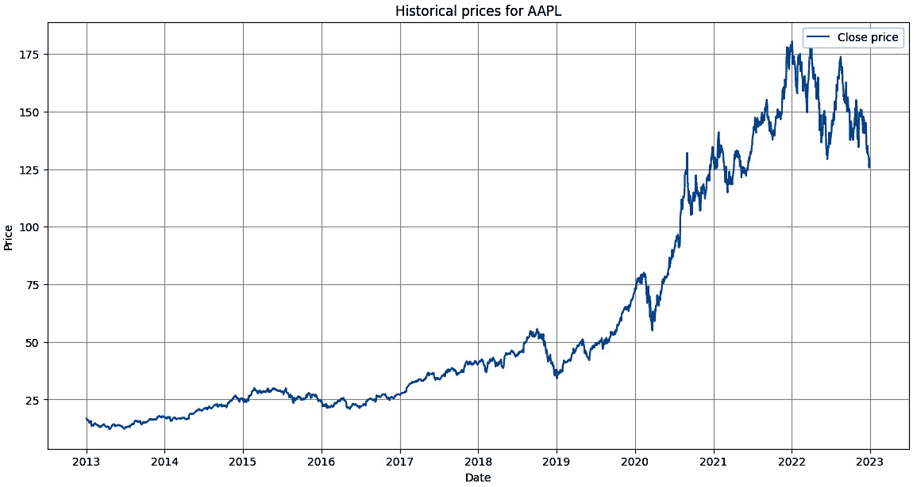

# 第十三章：使用 TensorFlow 进行时间序列、序列和预测

欢迎来到我们与 TensorFlow 旅程的最后一章。在上一章中，我们通过应用神经网络（如 DNN）有效地预测时间序列数据，达到了一个高潮。本章中，我们将探索一系列高级概念，例如将学习率调度器集成到我们的工作流中，以动态调整学习率，加速模型训练过程。在前几章中，我们强调了找到最佳学习率的必要性和重要性。在构建带有学习率调度器的模型时，我们可以使用 TensorFlow 中内置的学习率调度器，或者通过制作自定义学习率调度器，以动态方式实现这一目标。

接下来，我们将讨论 Lambda 层，以及如何将这些任意层应用到我们的模型架构中，以增强快速实验的能力，使我们能够无缝地将自定义函数嵌入到模型架构中，尤其是在处理 LSTM 和 RNN 时。我们将从使用 DNN 构建时间序列模型转向更复杂的架构，如 CNN、RNN、LSTM 和 CNN-LSTM 网络。我们将把这些网络应用到我们的销售数据集案例研究中。最后，我们将从 Yahoo Finance 提取苹果股票的收盘价数据，并应用这些模型构建预测模型，预测未来的股价。

本章我们将涵盖以下主题：

+   理解并应用学习率调度器

+   在 TensorFlow 中使用 Lambda 层

+   使用 RNN、LSTM 和 CNN 进行时间序列预测

+   使用神经网络进行苹果股价预测

到本章结束时，你将对使用 TensorFlow 进行时间序列预测有更深入的理解，并拥有将不同技术应用于构建时间序列预测模型的实践经验，适用于真实世界的项目。让我们开始吧。

# 理解并应用学习率调度器

在*第十二章*，《时间序列、序列和预测简介》中，我们构建了一个 DNN，成功使用了 TensorFlow 中的 `LearningRateScheduler` 回调函数，我们可以通过一些内置技术在训练过程中动态调整学习率。让我们来看看一些内置的学习率调度器：

+   `ExponentialDecay`：从指定的学习率开始，在经过一定步数后以指数方式下降。

+   `PiecewiseConstantDecay`：提供分段常数学习率，你可以指定边界和学习率，将训练过程划分为多个阶段，每个阶段使用不同的学习率。

+   `PolynomialDecay`：该学习率是调度中迭代次数的函数。它从初始学习率开始，根据指定的多项式函数，将学习率逐渐降低至最终学习率。

让我们为*第十二章*《时间序列、序列和预测导论》中使用的前馈神经网络添加一个学习率调度器。我们使用相同的销售数据，但这次我们将应用不同的学习率调度器来提高模型的性能。让我们开始吧：

1.  我们从导入该项目所需的库开始：

    ```py
    import numpy as np
    
    import matplotlib.pyplot as plt
    
    import tensorflow as tf
    
    from tensorflow import keras
    ```

1.  接下来，让我们加载我们的数据集：

    ```py
    #CSV sales data
    
    url = 'https://raw.githubusercontent.com/oluwole-packt/datasets/main/sales_data.csv'
    
    # Load the CSV data into a pandas DataFrame
    
    df = pd.read_csv(url)
    ```

    我们从本书的 GitHub 仓库加载销售数据，并将 CSV 数据放入 DataFrame 中。

1.  现在，我们将`Date`列转换为日期时间格式并将其设置为索引：

    ```py
    df['Date'] = pd.to_datetime(df['Date'])
    
    df.set_index('Date', inplace=True)
    ```

    第一行代码将日期列转换为日期时间格式。我们这样做是为了方便进行时间序列操作。接下来，我们将日期列设置为 DataFrame 的索引，这使得使用日期切片和处理数据变得更容易。

1.  让我们从 DataFrame 中提取销售值：

    ```py
    data = df['Sales'].values
    ```

    在这里，我们从销售 DataFrame 中提取销售值并将其转换为 NumPy 数组。我们将使用这个 NumPy 数组来创建我们的滑动窗口数据。

1.  接下来，我们将创建一个滑动窗口：

    ```py
    window_size = 20
    
    X, y = [], []
    
    for i in range(window_size, len(data)):
    
        X.append(data[i-window_size:i])
    
        y.append(data[i])
    ```

    正如我们在*第十二章*《时间序列、序列和预测导论》中所做的那样，我们使用滑动窗口技术将时间序列转换为包含特征和标签的监督学习问题。在这里，大小为 20 的窗口作为我们的`X`特征，包含 20 个连续的销售值，而我们的`y`是这 20 个销售值之后的下一个即时值。这里，我们使用前 20 个值来预测下一个值。

1.  现在，让我们将数据拆分为训练集和验证集：

    ```py
    X = np.array(X)
    
    y = np.array(y)
    
    train_size = int(len(X) * 0.8)
    
    X_train, X_val = X[:train_size], X[train_size:]
    
    y_train, y_val = y[:train_size], y[train_size:]
    ```

    我们将数据转换为 NumPy 数组，并将数据拆分为训练集和验证集。我们使用 80%的数据用于训练，20%的数据用于验证集，我们将用它来评估我们的模型。

1.  我们的下一个目标是构建一个 TensorFlow 数据集，这是训练 TensorFlow 模型时更高效的格式：

    ```py
    batch_size = 128
    
    buffer_size = 10000
    
    train_data = tf.data.Dataset.from_tensor_slices(
    
        (X_train, y_train))
    
    train_data = train_data.cache().shuffle(
    
        buffer_size).batch(batch_size).prefetch(
    
        tf.data.experimental.AUTOTUNE)
    ```

    我们应用`from_tensor_slices()`方法从 NumPy 数组创建数据集。之后，我们使用`cache()`方法通过将数据集缓存到内存中来加速训练。接着，我们使用`shuffle(buffer_size)`方法随机打乱训练数据，以防止诸如顺序偏差等问题。然后，我们使用`batch(batch_size)`方法将数据拆分成指定大小的批次；在这个例子中，训练过程中每次将 128 个样本输入到模型中。接下来，我们使用`prefetch`方法确保 GPU/CPU 始终有数据准备好进行处理，从而减少一个批次处理完与下一个批次之间的等待时间。我们传入`tf.data.experimental.AUTOTUNE`参数，告诉 TensorFlow 自动确定预取的最佳批次数量。这使得我们的训练过程更加顺畅和快速。

我们的数据现在已经准备好进行建模。接下来，我们将使用 TensorFlow 内置的学习率调度器探索这个数据，然后我们将探讨如何使用自定义学习率调度器找到最佳学习率。

## 内置学习率调度器

我们将使用与 *第十二章** 《时间序列、序列与预测入门》 中相同的模型。让我们定义模型并探索内置的学习率调度器：

1.  我们将从模型定义开始：

    ```py
    # Model
    
    model = Sequential()
    
    model.add(Dense(10, activation='relu',
    
        input_shape=(window_size,)))
    
    model.add(Dense(10, activation='relu'))
    
    model.add(Dense(1))
    ```

    在这里，我们使用了三个密集层。

1.  接下来，我们将使用指数衰减学习率调度器：

    ```py
    # ExponentialDecay
    
    lr_exp = tf.keras.optimizers.schedules.ExponentialDecay(
    
        initial_learning_rate=0.1,
    
        decay_steps=100, decay_rate=0.96)
    
    optimizer = tf.keras.optimizers.Adam(
    
        learning_rate=lr_exp)
    
    model.compile(optimizer=optimizer, loss='mse')
    
    history_exp = model.fit(X_train, y_train, epochs=100)
    ```

    指数衰减学习率调度器设置了一个学习率，该学习率随着时间的推移按指数方式衰减。在此实验中，初始学习率设置为`0.1`。这个学习率将在每 100 步时按 0.96 的衰减速率进行指数衰减，这是由`decay_steps`参数定义的。接下来，我们将我们的指数学习率分配给优化器并编译模型。之后，我们将模型拟合 100 个 epochs。

1.  接下来，我们将使用 MAE 和 **均方误差** (**MSE**) 评估模型的性能，并将验证预测与真实值进行比较：

    ```py
    # Evaluation
    
    forecast_exp = model.predict(X_val)
    
    mae_exp = mean_absolute_error(y_val, forecast_exp)
    
    mse_exp = mean_squared_error(y_val, forecast_exp)
    
    # Plot
    
    plt.plot(forecast_exp,
    
        label='Exponential Decay Predicted')
    
    plt.plot(y_val, label='Actual')
    
    plt.title('Exponential Decay LR')
    
    plt.legend()
    
    plt.show()
    ```

    这将生成以下输出：



图 13.1 – 使用指数衰减的真实预测与验证预测（放大版）

当我们运行代码块时，得到的 MAE 约为 5.31，MSE 为 43.18，并且从*图 13.1* 中的放大图可以看到，我们的模型紧密跟踪实际的销售验证数据。然而，结果并没有比我们在 *第十二章** 《时间序列、序列与预测入门》中取得的更好。接下来，我们将尝试使用 `PiecewiseConstantDecay`。

1.  让我们使用 `PiecewiseConstantDecay` 学习率调度器：

    ```py
    # PiecewiseConstantDecay
    
    lr_piecewise = tf.keras.optimizers.schedules.PiecewiseConstantDecay(
    
        [30, 60], [0.1, 0.01, 0.001])
    
    optimizer = tf.keras.optimizers.Adam(
    
        learning_rate=lr_piecewise)
    
    model.compile(optimizer=optimizer, loss='mse')
    
    history_piecewise = model.fit(X_train, y_train,
    
        epochs=100)
    ```

    `PiecewiseConstantDecay` 学习率调度器允许我们在训练过程中为不同的时期定义特定的学习率。在我们的例子中，我们将 30 和 60 步设为边界；这意味着在前 30 步中，我们应用学习率 `0.1`，从第 30 步到第 60 步，我们应用学习率 `0.01`，从第 61 步到训练结束，我们应用学习率 `0.001`。对于 `PiecewiseConstantDecay`，学习率的数量应该比应用的边界数多一个。例如，在我们的例子中，我们有两个边界（`[30, 60]`）和三个学习率（`[0.1, 0.01, 0.001]`）。设置好调度器后，我们使用相同的优化器，并像使用指数衰减学习率调度器一样编译和拟合模型。然后，我们评估模型的性能并生成以下验证图：


图 13.2 – 使用指数衰减的真实预测与验证预测

在这次实验中，我们实现了 4.87 的 MAE 和 36.97 的 MSE。这是一次改进的表现。再次，*图 13.2*中的预测很好地跟随了真实值。为了清晰起见，我们放大了一些。


图 13.3 – 我们前两个实验的放大图

从*图 13.3*中可以看到，我们在应用多项式衰减时，将视图放大到前 200 天，相较于使用指数衰减学习率调度器时，预测图更好地与真实值匹配。

1.  现在让我们应用`PolynomialDecay`：

    ```py
    # PolynomialDecay
    
    lr_poly = tf.keras.optimizers.schedules.PolynomialDecay(
    
    initial_learning_rate=0.1,
    
        decay_steps=100,
    
        end_learning_rate=0.01,
    
        power=1.0)
    ```

    在这个实验中，我们将`initial_learning_rate`设置为`0.1`，它作为我们的初始学习率。我们将`decay_steps`参数设置为`100`，表示学习率将在这 100 步中衰减。接下来，我们将`end_learning_rate`设置为`0.01`，这意味着在`decay_steps`结束时，学习率将降到此值。`power`参数控制步长衰减的指数。在本实验中，我们将`power`值设置为`1.0`，实现线性衰减。

    当我们评估模型的表现时，我们发现目前为止我们取得了最佳结果，MAE 为 4.72，MSE 为 34.49。从*图 13.4*中可以看到，预测结果与数据非常接近，比我们使用`PiecewiseConstantDecay`时更为准确。


图 13.4 – 使用 PolynomialDecay 的真实预测与验证预测（放大）

现在，你已经大致了解了如何应用这些学习率调度器，接下来可以调整值，看看是否能实现更低的 MAE 和 MSE。当你完成后，我们来看看一个自定义学习率调度器。

通过简单地调整学习率，我们可以看到我们的`PiecewiseConstantDecay`学习率调度器在这场竞争中获胜了，不仅超越了其他学习率，还优于我们在*第十二章*《时间序列、序列和预测导论》中使用的相同架构的简单 DNN 模型。你可以通过文档[`www.tensorflow.org/api_docs/python/tf/keras/callbacks/LearningRateScheduler`](https://www.tensorflow.org/api_docs/python/tf/keras/callbacks/LearningRateScheduler)或 Moklesur Rahman 在 Medium 上的这篇优质文章[`rmoklesur.medium.com/learning-rate-scheduler-in-keras-cc83d2f022a6`](https://rmoklesur.medium.com/learning-rate-scheduler-in-keras-cc83d2f022a6)了解更多关于学习率调度器的内容。

## 自定义学习率调度器

除了使用内置的学习率调度器外，TensorFlow 还提供了一种简便的方法来构建自定义学习率调度器，帮助我们找到最佳学习率。接下来我们来实现这一点：

1.  让我们从定义自定义学习率调度器开始：

    ```py
    # Define learning rate schedule
    
    lr_schedule = tf.keras.callbacks.LearningRateScheduler(
    
        lambda epoch: 1e-7 * 10**(epoch / 10))
    ```

    在这里，我们从一个较小的学习率（1×10−7）开始，并随着每个 epoch 的增加，学习率呈指数增长。我们使用 `10**(epoch / 10)` 来确定学习率增长的速度。

1.  我们使用初始学习率定义优化器：

    ```py
    # Define optimizer with initial learning rate
    
    optimizer = tf.keras.optimizers.SGD(
    
        learning_rate=1e-7, momentum=0.9)
    ```

    这里，我们使用了一个学习率为 1×10−7 的 SGD 优化器，并设置动量为 `0.9`。动量帮助加速优化器朝正确的方向前进，同时也减少震荡。

1.  接下来，我们用定义好的优化器编译模型，并将损失设置为 MSE：

    ```py
    model.compile(optimizer=optimizer, loss='mse')
    ```

1.  现在，我们开始训练模型：

    ```py
    history = model.fit(train_data, epochs=200,
    
        callbacks=[lr_schedule], verbose=0)
    ```

    我们训练模型 200 个 epoch，然后将学习率调度器作为回调传入。这样，学习率将根据定义的自定义学习率调度器进行调整。我们还设置了 `verbose=0`，以避免打印训练过程。

1.  计算每个 epoch 的学习率：

    ```py
    lrs = 1e-7 * (10 ** (np.arange(200) / 10))
    ```

    我们使用这段代码来计算每个 epoch 的学习率，并且它会给我们一个学习率数组。

1.  我们绘制模型损失与学习率的关系图：

    ```py
    plt.semilogx(lrs, history.history["loss"])
    
    plt.axis([1e-7, 1e-3, 0, 300])
    
    plt.xlabel('Learning Rate')
    
    plt.ylabel('Loss')
    
    plt.title('Learning Rate vs Loss')
    
    plt.show()
    ```

    这个图是选择最佳学习率的有效方法。


图 13.5 – 学习率损失曲线

为了找到最佳的学习率，我们需要找出损失最迅速下降的地方，在其开始再次上升之前。从图中可以看到，学习率下降并在大约 3x10-5 附近稳定，然后开始再次上升。因此，我们将选择这个值作为本次实验的理想学习率。接下来，我们将使用这个新的学习率作为固定学习率来重新训练模型。当我们运行代码时，我们得到 MAE 为 5.96，MSE 为 55.08。

我们现在已经看到如何使用内置的学习率调度器和自定义调度器。接下来，让我们将注意力转向使用 CNN 进行时间序列预测。

# 用于时间序列预测的 CNN

CNN 在图像分类任务中取得了显著的成功，因为它们能够检测网格状数据结构中的局部模式。这一思想同样可以应用于时间序列预测。通过将时间序列视为一系列时间间隔，CNN 可以提取和识别有助于预测未来趋势的模式。CNN 的另一个重要优势是它们的平移不变性。这意味着，一旦它们在一个片段中学习到某个模式，网络就能在序列中出现该模式的任何地方进行识别。这对于在时间步长之间检测重复模式非常有用。

CNN 的设置还通过池化层的帮助，自动减少输入数据的维度。因此，CNN 中的卷积和池化操作将输入序列转化为一种简化的形式，捕捉核心特征，同时确保计算效率。与图像不同，在这里我们使用 1D 卷积滤波器，因为时间序列数据的特性（单一维度）。这个滤波器沿着时间维度滑动，观察作为输入的局部值窗口。它通过在每个元素上的乘法和加和操作，检测这些区间中的有用模式。

多个滤波器被用来提取多样的预测信号——趋势、季节性波动、周期等。类似于图像中的模式，卷积神经网络（CNN）能够识别这些时间序列中的变换版本。当我们应用连续的卷积层和池化层时，网络将这些低级特征组合成更高级的表示，逐步将序列浓缩成其最显著的组成部分。最终，完全连接层利用这些学习到的特征进行预测。

让我们回到笔记本，并在我们的销售数据建模中应用 1D CNN。我们已经有了训练数据和测试数据。现在，为了使用 CNN 建模我们的数据，我们需要进行一个额外的步骤，即调整数据形状以满足 CNN 所期望的输入形状。在*第七章**,* *使用卷积神经网络进行图像分类*中，我们看到 CNN 需要 3D 数据，而我们使用 DNN 建模时则使用 2D 数据；这里也是同样的情况。

CNN 需要一个批量大小、一个窗口大小和特征数量。批量大小是输入形状的第一维，它表示我们输入 CNN 的序列数量。我们将窗口大小设置为`20`，特征数量指的是每个时间步的独立特征数。对于单变量时间序列，这个值是`1`；对于多变量时间序列，这个值将是`2`或更多。

由于我们在案例研究中处理的是单变量时间序列，因此我们的输入形状需要类似于（`128,` `20, 1`）：

1.  让我们准备数据以适应 CNN 模型的正确形状：

    ```py
    # Create sequences
    
    window_size = 20
    
    X = []
    
    y = []
    
    for i in range(window_size, len(data)):
    
        X.append(data[i-window_size:i])
    
        y.append(data[i])
    
    X = np.array(X)
    
    y = np.array(y)
    
    # Train/val split
    
    split = int(0.8 * len(X))
    
    X_train, X_val = X[:split], X[split:]
    
    y_train, y_val = y[:split], y[split:]
    
    # Reshape data
    
    X_train = X_train.reshape(-1, window_size, 1)
    
    X_val = X_val.reshape(-1, window_size, 1)
    
    # Set batch size and shuffle buffer
    
    batch_size = 128
    
    shuffle_buffer = 1000
    
    train_data = tf.data.Dataset.from_tensor_slices(
    
        (X_train, y_train))
    
    train_data = train_data.shuffle(
    
        shuffle_buffer).batch(batch_size)
    ```

    这段代码中的大部分内容是相同的。这里的关键步骤是`reshape`步骤，我们用它来实现 CNN 建模所需的输入形状。

1.  让我们构建我们的模型：

    ```py
    # Build model
    
    model = Sequential()
    
    model.add(Conv1D(filters=64, kernel_size=3,
    
        strides=1,
    
        padding='causal',
    
        activation='relu',
    
        input_shape=(window_size, 1)))
    
    model.add(MaxPooling1D(pool_size=2))
    
    model.add(Conv1D(filters=32, kernel_size=3,
    
        strides=1,
    
        padding='causal',
    
        activation='relu'))
    
    model.add(MaxPooling1D(pool_size=2))
    
    model.add(Flatten())
    
    model.add(Dense(16, activation='relu'))
    
    model.add(Dense(1))
    ```

    在我们的模型中，由于时间序列数据是单维的，我们采用了 1D 卷积层，而不是像用于图像分类的 2D 卷积神经网络（CNN），因为图像具有二维结构。我们模型由两个 1D 卷积层组成，每个卷积层后跟一个最大池化层。在我们的第一个卷积层中，我们使用了 64 个滤波器来学习各种数据模式，滤波器大小为`3`，这使得它能够识别跨越三个时间步的模式。我们使用了步幅`1`，这意味着我们的滤波器每次遍历数据时只跨一步，为了确保非线性，我们使用了 ReLU 作为激活函数。请注意，我们使用了一种新的填充方式，称为因果填充。这种选择是有战略意义的，因为因果填充确保模型在某个时间步的输出仅受该时间步及其前置时间步的影响，永远不会受到未来数据的影响。通过在序列的开头添加填充，因果填充尊重了我们数据的自然时间序列。这对于防止模型“不经意地提前预测”至关重要，确保预测仅依赖于过去和当前的信息。

    我们之前提到，我们需要 3D 形状的输入数据来馈送到由批量大小、窗口大小和特征数量组成的 CNN 模型中。在这里，我们使用了`input_shape=(window_size, 1)`。我们没有在输入形状定义中说明批量大小。这意味着模型可以接受不同大小的批量，因为我们没有硬编码任何批量大小。另外，由于我们处理的是单变量时间序列，所以我们只有一个特征，这就是为什么在输入形状中指定了`1`以及窗口大小的原因。最大池化层减少了我们数据的维度。接下来，我们进入第二个卷积层，这次我们使用了 32 个滤波器，核大小为`3`，依然使用因果填充和 ReLU 作为激活函数。然后，最大池化层再次对数据进行采样。之后，数据被展平并输入到全连接层中，根据我们从销售数据中学到的模式进行预测。

1.  让我们编译并训练模型 100 个周期：

    ```py
    model.compile(loss='mse', optimizer='adam')
    
    # Train model
    
    model.fit(train_data, epochs=100)
    ```

1.  最后，让我们评估一下我们模型的性能：

    ```py
    # Make predictions
    
    preds = model.predict(X_val)
    
    # Calculate metrics
    
    mae = mean_absolute_error(y_val, preds)
    
    mse = mean_squared_error(y_val, preds)
    
    # Print metrics
    
    print('MAE: ', mae)
    
    print('MSE: ', mse)
    ```

    我们通过生成 MAE 和 MSE 在验证集上评估模型。当我们运行代码时，获得了 5.37 的 MAE 和 44.28 的 MSE。在这里，你有机会通过调整滤波器数量、滤波器的大小等来看看是否能够获得更低的 MAE。

接下来，让我们看看如何使用 RNN 系列模型来进行时间序列数据预测。

# 时间序列预测中的 RNN

时间序列预测在机器学习领域提出了一个独特的挑战，它涉及基于先前观察到的顺序数据预测未来的值。一种直观的思考方式是考虑一系列过去的数据点。问题就变成了，给定这个序列，我们如何预测下一个数据点或数据点序列？这正是 RNN 展示其有效性的地方。RNN 是一种专门为处理序列数据而开发的神经网络。它们保持一个内部状态或“记忆”，存储迄今为止观察到的序列元素的信息。这个内部状态会在序列的每个步骤中更新，将新的输入信息与之前的状态合并。例如，在预测销售时，RNN 可能会保留有关前几个月销售趋势、过去一年的总体趋势以及季节性效应等数据。

然而，标准的 RNN 存在一个显著的局限性：“梯度消失”问题。这个问题导致在序列中很难保持和利用来自早期步骤的信息，特别是当序列长度增加时。为了解决这个问题，深度学习社区引入了先进的架构。LSTM 和 GRU 是专门设计用来解决梯度消失问题的 RNN 变种。由于它们内置的门控机制，这些类型的 RNN 能够学习长期依赖关系，控制信息在记忆状态中进出的流动。

因此，RNN、LSTM 和 GRU 可以是强大的时间序列预测工具，因为它们本身就包含了问题的时间动态。例如，在预测销售时，这些模型可以通过保持对先前销售时期的记忆来考虑季节性模式、假期、周末等因素，从而提供更准确的预测。

让我们在这里运行一个简单的 RNN，看看它在我们的数据集上的表现如何：

1.  让我们从准备数据开始：

    ```py
    # Create sequences
    
    seq_len = 20
    
    X = []
    
    y = []
    
    for i in range(seq_len, len(data)):
    
        X.append(data[i-seq_len:i])
    
        y.append(data[i])
    
    X = np.array(X)
    
    y = np.array(y)
    
    # Train/val split
    
    split = int(0.8*len(X))
    
    X_train, X_val = X[:split], X[split:]
    
    y_train, y_val = y[:split], y[split:]
    
    # Create dataset
    
    batch_size = 128
    
    dataset = tf.data.Dataset.from_tensor_slices(
    
        (X_train, y_train))
    
    dataset = dataset.shuffle(buffer_size=1024).batch(batch_size)
    ```

    在这里，你会看到我们准备数据的方式与使用 DNN 时相同，并且我们没有像在 CNN 模型中那样重新塑形数据。接下来会有一个简单的技巧，帮助你在我们的模型架构中实现这一点。

1.  让我们定义我们的模型架构：

    ```py
    model = tf.keras.models.Sequential([
    
        tf.keras.layers.Lambda(lambda x: tf.expand_dims(
    
            x, axis=-1),
    
            input_shape=[None]),
    
        tf.keras.layers.SimpleRNN(40,
    
            return_sequences=True),
    
        tf.keras.layers.SimpleRNN(40),
    
        tf.keras.layers.Dense(1),
    
        tf.keras.layers.Lambda(lambda x: x * 100.0)
    
    ])
    ```

    在使用 RNN 建模时，就像我们在使用 CNN 时所看到的那样，我们需要将数据重新塑形，因为我们的模型也需要 3D 形状的输入数据。然而，在你希望保持原始输入形状不变，以便进行不同模型的各种实验时，我们可以采用一个简单而有效的解决方案——Lambda 层。这个层是我们工具箱中的一个强大工具，允许我们对输入数据执行简单的任意函数，使其成为快速实验的绝佳工具。

    使用 Lambda 层，我们可以执行逐元素的数学操作，例如归一化、线性缩放和简单的算术运算。例如，在我们的案例中，我们使用 Lambda 层将 2D 输入数据的维度扩展，以符合 RNN 的 3D 输入要求（`batch_size`、`time_steps` 和 `features`）。在 TensorFlow 中，您可以利用 Keras API 的 `tf.keras.layers.Lambda` 来创建 Lambda 层。Lambda 层作为适配器，允许我们对数据进行微小调整，确保其格式适合我们的模型，同时保持原始数据不变，供其他用途。接下来，我们遇到两个每个有 40 个单元的简单 RNN 层。需要注意的是，在第一个 RNN 中，我们设置了 `return_sequence=True`。我们在 RNN 和 LSTM 中使用此设置，当一个 RNN 或 LSTM 层的输出需要输入到另一个 RNN 或 LSTM 层时。我们设置此参数，以确保第一个 RNN 层会为序列中的每个输入返回一个输出。然后将输出传递到第二个 RNN 层，该层仅返回最终步骤的输出，然后将其传递到密集层，密集层输出每个序列的预测值。接下来，我们遇到了另一个 Lambda 层，它将输出乘以 100。我们使用这个操作来扩展输出值。

1.  让我们编译并拟合我们的模型：

    ```py
    model.compile(optimizer=tf.keras.optimizers.Adam(
    
        learning_rate=8e-4), loss='mse')
    
    # Train model
    
    model.fit(dataset, epochs=100)momentum=0.9))
    ```

在这里，我们在验证集上获得了 4.84 的 MAE 和 35.65 的 MSE。这个结果稍微比我们使用 `PolynomialDecay` 学习率调度器时的结果要差一些。也许在这里，您有机会尝试不同的学习率调度器，以实现更低的 MAE。

接下来，让我们探索 LSTM。

# 时间序列预测中的 LSTM

在 NLP 部分，我们讨论了 LSTM 的能力及其相对于 RNN 的改进，解决了如梯度消失问题等问题，使得模型能够学习更长的序列。在时间序列预测的背景下，LSTM 网络可以非常强大。让我们看看如何将 LSTM 应用于我们的销售数据集：

1.  让我们首先准备我们的数据：

    ```py
    # Create sequences
    
    seq_len = 20
    
    X = []
    
    y = []
    
    for i in range(seq_len, len(data)):
    
        X.append(data[i-seq_len:i])
    
        y.append(data[i])
    
    X = np.array(X)
    
    X = X.reshape(X.shape[0], X.shape[1], 1)
    
    y = np.array(y)
    
    # Train/val split
    
    split = int(0.8*len(X))
    
    X_train, X_val = X[:split], X[split:]
    
    y_train, y_val = y[:split], y[split:]
    
    # Set batch size and buffer size
    
    batch_size = 64
    
    buffer_size = 1000
    
    # Create dataset
    
    dataset = tf.data.Dataset.from_tensor_slices(
    
        (X_train, y_train))
    
    dataset = dataset.shuffle(
    
        buffer_size).batch(batch_size)
    ```

    注意，由于我们不使用 Lambda 层，因此我们在这里使用 `reshape` 步骤，以避免重复此代码块。请注意，我们将在此次实验和下一次使用 CNN-LSTM 架构的实验中使用它。

1.  接下来，让我们定义我们的模型：

    ```py
    model_lstm = tf.keras.models.Sequential([
    
        tf.keras.layers.LSTM(50, return_sequences=True,
    
            input_shape=[None, 1]),
    
        tf.keras.layers.LSTM(50),
    
        tf.keras.layers.Dense(1)
    
    ])
    ```

    我们在这里使用的架构是一个使用 LSTM 单元的 RNN 结构——第一层是一个具有 50 个神经元的 LSTM 层，它的 `return_sequence` 参数设置为 `True`，以确保返回的输出是完整的序列，这些输出会传递到最终的 LSTM 层。在这里，我们还使用了 `[None, 1]` 的输入形状。下一层也有 50 个神经元，并且输出一个单一的值，因为我们没有在此处设置 `return_sequence` 参数为 `True`，该输出将传递到密集层进行预测。

1.  下一步是编译模型。我们像以前一样编译并拟合我们的模型，然后对其进行评估。在这里，我们获得了 4.56 的 MAE 和 32.42 的 MSE，这是迄今为止最好的结果。


图 13.6 – 使用 LSTM 的真实预测与验证预测（放大显示）

从图中我们可以看到，预测值和真实值比我们迄今为止进行的任何其他实验都更加一致。让我们看看是否可以使用 CNN-LSTM 架构来改进我们的结果，进行下一个实验。

# 用于时间序列预测的 CNN-LSTM 架构

深度学习为时间序列预测提供了引人注目的解决方案，而这一领域中的一个显著架构是 CNN-LSTM 模型。该模型利用了 CNN 和 LSTM 网络的优势，为处理时间序列数据的独特特性提供了有效的框架。CNN 因其在图像处理任务中的表现而闻名，主要得益于其在图像中学习空间模式的能力，而在顺序数据中，它们能够学习局部模式。网络中的卷积层通过一系列滤波器对数据进行处理，学习并提取显著的局部和全局时间模式及趋势。这些特征作为原始数据的压缩表示，保留了关键信息，同时减少了维度。维度的减少导致更高效的表示，能够捕捉到相关模式。

一旦通过卷积层提取了显著特征，这些特征将作为网络 LSTM 层的输入。CNN-LSTM 模型在端到端学习能力上具有优势。在这种架构中，CNN 和 LSTM 各自扮演着互补的角色。CNN 层捕捉局部模式，而 LSTM 层从这些模式中学习时间关系。与独立架构相比，这种联合优化是 CNN-LSTM 模型性能提升的关键。让我们看看如何将这种架构应用到我们的销售数据中。由于我们之前已经多次查看过数据准备步骤，因此这里直接进入模型架构：

1.  让我们使用卷积层来构建我们的模型：

    ```py
       # Build the Model
    
    model = tf.keras.models.Sequential([
    
        tf.keras.layers.Conv1D(filters=64, kernel_size=3,
    
        strides=1,
    
        activation="relu",
    
        padding='causal',
    
        input_shape=[window_size, 1]),
    ```

    我们使用 1D 卷积层从值序列中检测模式，就像我们在 CNN 预测实验中做的那样。记得将`padding`设置为`causal`，以确保输出大小与输入保持一致。我们将输入形状设置为`[window_size, 1]`。这里，`window_size`代表每个输入样本中的时间步长数量。`1`表示我们正在处理单变量时间序列。例如，如果我们将`window_size`设置为`7`，这意味着我们使用一周的数据进行预测。

1.  接下来，我们的数据进入 LSTM 层，由 2 个 LSTM 层组成，每个 LSTM 层包含 64 个神经元：

    ```py
        tf.keras.layers.LSTM(64, return_sequences=True),
    
        tf.keras.layers.LSTM(64),
    ```

1.  然后，我们有密集层：

    ```py
        tf.keras.layers.Dense(30, activation="relu"),
    
        tf.keras.layers.Dense(10, activation="relu"),
    
        tf.keras.layers.Dense(1),
    ```

    LSTM 层为 CNN 层提取的特征添加了时间上下文，而全连接层则生成最终的预测值。在这里，我们使用了三层全连接层，并输出最终的预测结果。通过这种架构，我们实现了 4.98 的 MAE 和 40.71 的 MSE。效果不错，但不如单独使用 LSTM 模型的结果。

调整超参数以优化模型性能在这里是个好主意。通过调整学习率、批处理大小或优化器等参数，我们可能能够提升模型的能力。我们不会在这里详细讨论，因为你已经具备了处理这些的能力。接下来让我们继续探讨苹果股票价格数据，并运用我们所学的知识，创建一系列实验，预测苹果股票的未来价格，看看哪种架构最终会脱颖而出。

# 预测苹果股票价格数据

现在我们已经涵盖了 TensorFlow 开发者证书考试中关于时间序列的所有内容。让我们用一个实际的时间序列用例来结束这一章和本书。在这个练习中，我们将使用一个真实世界的数据集（苹果股票的收盘日价格）。接下来让我们看看如何进行操作。这个练习的 Jupyter notebook 可以在这里找到：[`github.com/PacktPublishing/TensorFlow-Developer-Certificate-Guide`](https://github.com/PacktPublishing/TensorFlow-Developer-Certificate-Guide)。让我们开始：

1.  我们首先导入所需的库：

    ```py
    import numpy as np
    
    import matplotlib.pyplot as plt
    
    import tensorflow as tf
    
    from tensorflow import keras
    
    import yfinance as yf
    ```

    这里我们使用了一个新的库 `yfinance`。它让我们能够访问苹果股票数据，用于我们的案例分析。

注意

如果导入失败，你可能需要运行`pip install yfinance`来让其正常工作。

1.  创建一个 DataFrame：

    ```py
    df_apple = yf.Ticker(tickerSymbol)
    
    df_apple = df_apple.history(period='1d',
    
        start='2013-01-01', end='2023-01-01')
    ```

    我们通过使用 `AAPL` 股票代码来创建一个 DataFrame，`AAPL`代表苹果公司（Apple）在股票市场中的代号。为此，我们使用来自 `yfinance` 库的 `yf.Ticker` 函数来访问苹果的历史数据，该数据来自 Yahoo Finance。我们将 `history` 方法应用到我们的 `Ticker` 对象上，以访问苹果的历史市场数据。在这里，我们将 `period` 设置为 `1d`，意味着获取的是每日数据。同时，我们也设置了 `start` 和 `end` 参数，定义了我们想要访问的日期范围；在此案例中，我们收集了从 2013 年 1 月 1 日到 2023 年 1 月 31 日的 10 年数据。

1.  接下来，我们使用 `df.head()` 来查看我们 DataFrame 的快照。可以看到数据集由七列组成（`Open`，`High`，`Low`，`Close`，`Volume`，`Dividends`，和 `Stock Splits`），如下图所示。


图 13.7 – 苹果股票数据快照

让我们来理解这些列的含义：

+   `Open`表示交易日的开盘价格。

+   `High`表示交易日内股票交易的最高价格。

+   `Low`表示交易日内股票交易的最低价格。

+   `Close`表示交易日的收盘价格。

+   `交易量`表示在交易日内成交的股票数量。这可以作为市场强度的一个指标。

+   `股息`表示公司如何将其收益分配给股东。

+   `股票分割`可以看作是公司通过拆分每一股股票，从而增加公司流通股本的一种行为。

1.  让我们绘制每日收盘价：

    ```py
    plt.figure(figsize=(14,7))
    
    plt.plot(df_apple.index, df_apple['Close'],
    
        label='Close price')
    
    plt.title('Historical prices for AAPL')
    
    plt.xlabel('Date')
    
    plt.ylabel('Price')
    
    plt.grid(True)
    
    plt.legend()
    
    plt.show()
    ```

    当我们运行代码时，我们得到以下图表：



图 13.8 – 显示 2013 年 1 月到 2023 年 1 月期间苹果股票收盘价的图表

从*图 13.8*的图表中，我们可以看到股票呈现出正向上升的趋势，偶尔会有下跌。

1.  将数据转换为 NumPy 数组：

    ```py
    Series = df_apple['Close'].values
    ```

    在这个练习中，我们将预测每日的股票收盘价。因此，我们取收盘价列并将其转换为 NumPy 数组。这样，我们为实验创建了一个单变量时间序列。

1.  准备窗口数据集：

    ```py
    # Sliding window
    
    window_size = 20
    
    X, y = [], []
    
    for i in range(window_size, len(data)):
    
        X.append(data[i-window_size:i])
    
        y.append(data[i])
    
    X = np.array(X)
    
    y = np.array(y)
    
    # Train/val split
    
    train_size = int(len(X) * 0.8)
    
    X_train, X_val = X[:train_size], X[train_size:]
    
    y_train, y_val = y[:train_size], y[train_size:]
    
    # Dataset using tf.data
    
    batch_size = 128
    
    buffer_size = 10000
    
    train_data = tf.data.Dataset.from_tensor_slices(
    
        (X_train, y_train))
    
    train_data = train_data.cache().shuffle(
    
        buffer_size).batch(batch_size).prefetch(
    
        tf.data.experimental.AUTOTUNE)
    ```

    我们现在已经熟悉了这个代码块，它用于准备数据以进行建模。接下来，我们将使用相同的架构进行苹果股票数据集的实验。结果如下：

| **模型** | **MAE** |
| --- | --- |
| DNN | 4.56 |
| RNN | 2.24 |
| LSTM | 3.02 |
| CNN-LSTM | 18.75 |

图 13.9 – 显示各种模型的 MAE 表格

从我们的结果来看，我们使用 RNN 架构取得了最佳表现的模型，MAE 为 2.24。现在你可以保存你最好的模型，它可以用来预测未来的股票价值，或应用于其他预测问题。你也可以进一步调整超参数，看看是否能达到更低的 MAE。

注释

该模型展示了利用神经网络进行预测的可能性。然而，我们必须意识到它的局限性。请不要使用此模型做出金融决策，因为现实世界的股市预测涉及复杂的关系，如经济指标、市场情绪以及其他相互依赖性，而我们的基础模型并未考虑这些因素。

这样，我们就来到了本章和整本书的结尾。

总结

在本章的最后，我们探讨了一些使用 TensorFlow 进行时间序列预测的高级概念。我们了解了如何使用内建的学习率调度器，也学习了如何设计定制的调度器来满足我们的需求。接着，我们使用了更专业的模型，如 RNN、LSTM 网络，以及 CNN 和 LSTM 的组合。我们还学习了如何应用 Lambda 层来实现自定义操作并为我们的网络架构增加灵活性。

本章总结时，我们进行了苹果股票收盘价的预测。到本章结束时，你应该已经充分理解如何应用学习率调度器、Lambda 层等概念，并且能够使用不同架构有效地构建时间序列预测模型，为你的考试做好准备。祝你好运！

# 作者的话

看到你从机器学习的基础知识到使用 TensorFlow 构建各种项目，我感到非常高兴。你现在已经探索了如何使用不同的神经网络架构来构建模型。你已经拥有了坚实的基础，可以并且应该在此基础上，作为一名认证的 TensorFlow 开发者，构建一个令人惊叹的职业生涯。你只有通过构建解决方案，才能成为顶尖开发者。

本书中涵盖的所有内容将帮助你在最终准备 TensorFlow 开发者证书考试以及更远的未来中取得成功。我想祝贺你没有放弃，成功完成了本书中的所有概念、项目和练习。我鼓励你继续学习、实验，并保持对机器学习领域最新发展的关注。祝你考试顺利，并在未来的职业生涯中取得成功。

# 问题

1.  从 Yahoo Finance 加载 2015-01-01 到 2020-01-01 的 Google 股票数据。

1.  创建训练、预测和绘图函数。

1.  准备数据以进行训练。

1.  构建 DNN、CNN、LSTM 和 CNN-LSTM 模型来建模数据。

1.  使用 MAE 和 MSE 评估模型。

# 参考文献

+   Shi, X., Chen, Z., Wang, H., Yeung, D. Y., Wong, W. K., & Woo, W. C. (2015). *卷积 LSTM 网络：一种用于降水短期预测的机器学习方法*。在神经信息处理系统的进展（第 802–810 页）[`papers.nips.cc/paper/2015/hash/07563a3fe3bbe7e3ba84431ad9d055af-Abstract.xhtml`](https://papers.nips.cc/paper/2015/hash/07563a3fe3bbe7e3ba84431ad9d055af-Abstract.xhtml%0D)

+   Karim, F., Majumdar, S., Darabi, H., & Harford, S. (2019). *用于时间序列分类的 LSTM 全卷积网络*。IEEE Access, 7, 1662-1669

+   Siami-Namini, S., Tavakoli, N., & Siami Namin, A. (2019). *LSTM 和 BiLSTM 在时间序列预测中的表现*。2019 IEEE 大数据国际会议

+   TensorFlow 学习率调度器：[`www.tensorflow.org/api_docs/python/tf/keras/callbacks/LearningRateScheduler`](https://www.tensorflow.org/api_docs/python/tf/keras/callbacks/LearningRateScheduler%0D)

+   *Lambda* *层*：[`keras.io/api/layers/core_layers/lambda/`](https://keras.io/api/layers/core_layers/lambda/)

+   *时间序列* *预测*：[`www.tensorflow.org/tutorials/structured_data/time_series`](https://www.tensorflow.org/tutorials/structured_data/time_series%0D)

+   *tf.data：构建 TensorFlow 输入* *管道*。[`www.tensorflow.org/guide/data`](https://www.tensorflow.org/guide/data%0D)

+   *时间序列的窗口数据集*：[`www.tensorflow.org/tutorials/structured_data/time_series#data_windowing`](https://www.tensorflow.org/tutorials/structured_data/time_series#data_windowing%0D)
