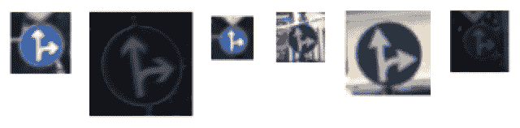

# 第一章：使用卷积神经网络（ConvNets）识别交通标志

作为本书的第一个项目，我们将尝试构建一个简单的模型，在深度学习表现非常好的领域：交通标志识别。简而言之，给定一张交通标志的彩色图像，模型应能识别出它是哪种标志。我们将探讨以下几个方面：

+   数据集的组成方式

+   使用哪个深度网络

+   如何预处理数据集中的图像

+   如何训练并关注性能进行预测

# 数据集

由于我们将尝试通过图像预测一些交通标志，因此我们将使用一个为此目的而创建的数据集。幸运的是，德国神经信息学研究所的研究人员创建了一个包含近 40,000 张图像的数据集，所有图像都不同，且与 43 个交通标志相关。我们将使用的数据集是名为 **德国交通标志识别基准**（**GTSRB**）的一部分，该基准旨在对多个模型的表现进行评分，目标都是相同的。这个数据集已经相当旧了——2011 年！但看起来它是一个很不错且组织良好的数据集，适合我们从中启动项目。

本项目使用的数据集可以在 [`benchmark.ini.rub.de/Dataset/GTSRB_Final_Training_Images.zip`](http://benchmark.ini.rub.de/Dataset/GTSRB_Final_Training_Images.zip) 免费获取。

在你开始运行代码之前，请先下载文件并将其解压到与代码相同的目录下。解压完压缩包后，你将得到一个名为 GTSRB 的新文件夹，里面包含了数据集。

本书的作者感谢那些参与数据集制作并使其开源的人们。

另外，可以参考 [`cs231n.github.io/convolutional-networks/`](http://cs231n.github.io/convolutional-networks/) 了解更多关于 CNN 的信息。

现在让我们来看一些示例：

“限速 20 公里/小时”：


“直行或右转”：



“环形交叉口”：


如你所见，这些信号的亮度不统一（有些非常暗，有些则非常亮），它们的大小不同，透视不同，背景不同，而且可能包含其他交通标志的部分图像。

数据集的组织方式是这样的：同一标签的所有图像都在同一个文件夹内。例如，在路径 `GTSRB/Final_Training/Images/00040/` 中，所有的图像都有相同的标签 `40`。如果图像的标签是另一个标签 `5`，请打开文件夹 `GTSRB/Final_Training/Images/00005/`。还要注意，所有图像都是 PPM 格式，这是一种无损压缩格式，适用于图像，并且有许多开源解码器/编码器可以使用。

# 卷积神经网络（CNN）

对于我们的项目，我们将使用一个非常简单的网络，具有以下架构：


在这个架构中，我们仍然有以下选择：

+   2D 卷积中的滤波器数量和核大小

+   最大池化中的核大小

+   全连接层中的单元数

+   批处理大小、优化算法、学习步长（最终其衰减率）、每层的激活函数以及训练的轮数

# 图像预处理

模型的第一个操作是读取图像并进行标准化。事实上，我们无法处理大小不一的图像；因此，在这第一步中，我们将加载图像并将其调整为预定义的大小（32x32）。此外，我们将对标签进行独热编码，以便生成一个 43 维的数组，其中只有一个元素被激活（即值为 1），同时我们会将图像的颜色空间从 RGB 转换为灰度图像。从图像中可以明显看出，我们需要的信息不在信号的颜色中，而是在其形状和设计中。

现在，让我们打开一个 Jupyter Notebook，并编写一些代码来完成这项工作。首先，我们创建一些包含类别数量（43）和调整大小后图像大小的最终变量：

```py
N_CLASSES = 43
RESIZED_IMAGE = (32, 32)
```

接下来，我们将编写一个函数，读取指定路径中的所有图像，将其调整为预定义的形状，转换为灰度图像，并进行独热编码标签。为此，我们将使用一个名为 `dataset` 的命名元组：

```py
import matplotlib.pyplot as plt
import glob
from skimage.color import rgb2lab
from skimage.transform import resize
from collections import namedtuple
import numpy as np
np.random.seed(101)
%matplotlib inline
Dataset = namedtuple('Dataset', ['X', 'y'])
def to_tf_format(imgs):
   return np.stack([img[:, :, np.newaxis] for img in imgs], axis=0).astype(np.float32)
def read_dataset_ppm(rootpath, n_labels, resize_to):
images = []
labels = []
for c in range(n_labels):
   full_path = rootpath + '/' + format(c, '05d') + '/'
   for img_name in glob.glob(full_path + "*.ppm"):

     img = plt.imread(img_name).astype(np.float32)
     img = rgb2lab(img / 255.0)[:,:,0]
     if resize_to:
       img = resize(img, resize_to, mode='reflect')

     label = np.zeros((n_labels, ), dtype=np.float32)
     label[c] = 1.0
    images.append(img.astype(np.float32))
     labels.append(label)
return Dataset(X = to_tf_format(images).astype(np.float32),
                 y = np.matrix(labels).astype(np.float32))
dataset = read_dataset_ppm('GTSRB/Final_Training/Images', N_CLASSES, RESIZED_IMAGE)
print(dataset.X.shape)
print(dataset.y.shape)
```

得益于 skimage 模块，读取、转换和调整大小的操作变得非常简单。在我们的实现中，我们决定将原始的颜色空间（RGB）转换为 lab，然后仅保留亮度成分。请注意，另一个好的转换是 YUV，其中应该保留“Y”分量作为灰度图像。

运行上面的单元格会得到以下结果：

```py
(39209, 32, 32, 1)
(39209, 43)
```

关于输出格式的一个说明：观察矩阵*X*的形状有四个维度。第一个维度是观察值的索引（在这种情况下，我们有大约 40,000 个样本）；其他三个维度包含图像（其大小为 32 像素 × 32 像素的灰度图像，也就是一维的）。这是在 TensorFlow 中处理图像时的默认形状（参见代码中的 `_tf_format` 函数）。

至于标签矩阵，行是观察的索引，列是标签的独热编码。

为了更好地理解观察矩阵，让我们打印第一个样本的特征向量以及它的标签：

```py
plt.imshow(dataset.X[0, :, :, :].reshape(RESIZED_IMAGE)) #sample
print(dataset.y[0, :]) #label
```


```py
[[1\. 0\. 0\. 0\. 0\. 0\. 0\. 0\. 0\. 0\. 0\. 0\. 0\. 0\. 0\. 0\. 0\. 0\. 0\. 0\. 0\. 0\. 0\. 0.
0\. 0\. 0\. 0\. 0\. 0\. 0\. 0\. 0\. 0\. 0\. 0\. 0\. 0\. 0\. 0\. 0\. 0.]]
```

你可以看到图像，也就是特征向量，是 32x32 的。标签仅在第一个位置包含一个 `1`。

现在，让我们打印最后一个样本：

```py
plt.imshow(dataset.X[-1, :, :, :].reshape(RESIZED_IMAGE)) #sample
print(dataset.y[-1, :]) #label
```


```py
[[0\. 0\. 0\. 0\. 0\. 0\. 0\. 0\. 0\. 0\. 0\. 0\. 0\. 0\. 0\. 0\. 0\. 0\. 0\. 0\. 0\. 0\. 0\. 0.
0\. 0\. 0\. 0\. 0\. 0\. 0\. 0\. 0\. 0\. 0\. 0\. 0\. 0\. 0\. 0\. 0\. 1.]]
```

特征向量的大小相同（32x32），而标签向量在最后一个位置包含一个 `1`。

这些是我们需要创建模型的两项信息。请特别注意形状，因为它们在深度学习中处理图像时至关重要；与经典机器学习中的观察矩阵不同，这里的*X*有四个维度！

我们预处理的最后一步是训练/测试集拆分。我们希望在数据集的一个子集上训练我们的模型，然后在剩余的样本上衡量模型的表现，即测试集。为此，让我们使用`sklearn`提供的函数：

```py
from sklearn.model_selection import train_test_split
idx_train, idx_test = train_test_split(range(dataset.X.shape[0]), test_size=0.25, random_state=101)
X_train = dataset.X[idx_train, :, :, :]
X_test = dataset.X[idx_test, :, :, :]
y_train = dataset.y[idx_train, :]
y_test = dataset.y[idx_test, :]
print(X_train.shape)
print(y_train.shape)
print(X_test.shape)
print(y_test.shape)
```

在这个示例中，我们将使用数据集中 75%的样本用于训练，剩下的 25%用于测试。事实上，下面是前一个代码的输出：

```py
(29406, 32, 32, 1)
(29406, 43)
(9803, 32, 32, 1)
(9803, 43)
```

# 训练模型并进行预测

首先需要一个函数来创建训练数据的小批量。事实上，在每次训练迭代时，我们都需要插入从训练集中提取的小批量样本。在这里，我们将构建一个函数，该函数以观察值、标签和批量大小作为参数，并返回一个小批量生成器。此外，为了在训练数据中引入一些变异性，让我们向函数中添加另一个参数，即可以选择是否打乱数据，从而为每个生成器提供不同的小批量数据。每个生成器中不同的小批量数据将迫使模型学习输入输出连接，而不是记住序列：

```py
def minibatcher(X, y, batch_size, shuffle):
assert X.shape[0] == y.shape[0]
n_samples = X.shape[0]
if shuffle:
   idx = np.random.permutation(n_samples)
else:
   idx = list(range(n_samples))
for k in range(int(np.ceil(n_samples/batch_size))):
   from_idx = k*batch_size
   to_idx = (k+1)*batch_size
   yield X[idx[from_idx:to_idx], :, :, :], y[idx[from_idx:to_idx], :]
```

为了测试这个函数，让我们打印出小批量的形状，同时设置`batch_size=10000`：

```py
for mb in minibatcher(X_train, y_train, 10000, True):
print(mb[0].shape, mb[1].shape)
```

这将打印出以下内容：

```py
(10000, 32, 32, 1) (10000, 43)
(10000, 32, 32, 1) (10000, 43)
(9406, 32, 32, 1) (9406, 43)
```

不出所料，训练集中的 29,406 个样本被分成两个小批量，每个小批量包含 10,000 个元素，最后一个小批量包含`9406`个元素。当然，标签矩阵中也有相同数量的元素。

现在终于到了构建模型的时候！让我们首先构建组成网络的各个模块。我们可以从创建一个带有可变数量单元的全连接层开始（这是一个参数），并且没有激活函数。我们决定使用 Xavier 初始化来初始化系数（权重），并使用 0 初始化来初始化偏置，以便使得该层居中并正确缩放。输出只是输入张量与权重的乘积，加上偏置。请注意，权重的维度是动态定义的，因此可以在网络中的任何位置使用：

```py
import tensorflow as tf
def fc_no_activation_layer(in_tensors, n_units):
w = tf.get_variable('fc_W',
   [in_tensors.get_shape()[1], n_units],
   tf.float32,
   tf.contrib.layers.xavier_initializer())
b = tf.get_variable('fc_B',
   [n_units, ],
   tf.float32,
   tf.constant_initializer(0.0))
return tf.matmul(in_tensors, w) + b
```

现在，让我们创建一个带有激活函数的全连接层；具体来说，我们将使用泄漏 ReLU。正如你所看到的，我们可以使用之前的函数来构建这个功能：

```py
def fc_layer(in_tensors, n_units):
return tf.nn.leaky_relu(fc_no_activation_layer(in_tensors, n_units))
```

最后，让我们创建一个卷积层，接受输入数据、卷积核大小和滤波器数量（或单元）作为参数。我们将使用与全连接层相同的激活函数。在这种情况下，输出将通过一个泄漏 ReLU 激活：

```py
def conv_layer(in_tensors, kernel_size, n_units):
w = tf.get_variable('conv_W',
   [kernel_size, kernel_size, in_tensors.get_shape()[3], n_units],
   tf.float32,
   tf.contrib.layers.xavier_initializer())
b = tf.get_variable('conv_B',
   [n_units, ],
   tf.float32,
   tf.constant_initializer(0.0))
return tf.nn.leaky_relu(tf.nn.conv2d(in_tensors, w, [1, 1, 1, 1], 'SAME') + b)
```

现在，是时候创建一个`maxpool_layer`了。在这里，窗口大小和步幅都是正方形的（矩阵）：

```py
def maxpool_layer(in_tensors, sampling):
return tf.nn.max_pool(in_tensors, [1, sampling, sampling, 1], [1, sampling, sampling, 1], 'SAME')
```

最后需要定义的是 dropout，用于正则化网络。创建起来相当简单，但请记住，dropout 只应在训练网络时使用，而不应在预测输出时使用；因此，我们需要使用条件操作符来定义是否应用 dropout：

```py
def dropout(in_tensors, keep_proba, is_training):
return tf.cond(is_training, lambda: tf.nn.dropout(in_tensors, keep_proba), lambda: in_tensors)
```

最后，是时候将所有内容整合起来，按照之前定义的创建模型。我们将创建一个由以下层组成的模型：

1.  2D 卷积，5x5，32 个过滤器

1.  2D 卷积，5x5，64 个过滤器

1.  展平器

1.  全连接层，1,024 个单元

1.  Dropout 40%

1.  全连接层，无激活函数

1.  Softmax 输出

这是代码：

```py
def model(in_tensors, is_training):
# First layer: 5x5 2d-conv, 32 filters, 2x maxpool, 20% drouput
with tf.variable_scope('l1'):
   l1 = maxpool_layer(conv_layer(in_tensors, 5, 32), 2)
   l1_out = dropout(l1, 0.8, is_training)
# Second layer: 5x5 2d-conv, 64 filters, 2x maxpool, 20% drouput
with tf.variable_scope('l2'):
   l2 = maxpool_layer(conv_layer(l1_out, 5, 64), 2)
   l2_out = dropout(l2, 0.8, is_training)
with tf.variable_scope('flatten'):
   l2_out_flat = tf.layers.flatten(l2_out)
# Fully collected layer, 1024 neurons, 40% dropout
with tf.variable_scope('l3'):
   l3 = fc_layer(l2_out_flat, 1024)
   l3_out = dropout(l3, 0.6, is_training)
# Output
with tf.variable_scope('out'):
   out_tensors = fc_no_activation_layer(l3_out, N_CLASSES)
return out_tensors
```

接下来，让我们编写一个函数，在训练集上训练模型并测试测试集上的表现。请注意，以下所有代码都属于 `train_model` 函数；它被拆解为几个部分，以便于解释。

该函数的参数包括（除了训练集、测试集及其标签）学习率、周期数和批次大小，也就是每个训练批次的图像数量。首先，定义了一些 TensorFlow 占位符：一个用于图像的迷你批次，一个用于标签的迷你批次，最后一个用于选择是否进行训练（这主要由 dropout 层使用）：

```py
from sklearn.metrics import classification_report, confusion_matrix
def train_model(X_train, y_train, X_test, y_test, learning_rate, max_epochs, batch_size):
in_X_tensors_batch = tf.placeholder(tf.float32, shape = (None, RESIZED_IMAGE[0], RESIZED_IMAGE[1], 1))
in_y_tensors_batch = tf.placeholder(tf.float32, shape = (None, N_CLASSES))
is_training = tf.placeholder(tf.bool)
```

现在，让我们定义输出、度量分数和优化器。在这里，我们决定使用 `AdamOptimizer` 和交叉熵损失函数与 `softmax(logits)`：

```py
logits = model(in_X_tensors_batch, is_training)
out_y_pred = tf.nn.softmax(logits)
loss_score = tf.nn.softmax_cross_entropy_with_logits(logits=logits, labels=in_y_tensors_batch)
loss = tf.reduce_mean(loss_score)
optimizer = tf.train.AdamOptimizer(learning_rate).minimize(loss)
```

最后，这里是使用迷你批次训练模型的代码：

```py
with tf.Session() as session:
   session.run(tf.global_variables_initializer())
   for epoch in range(max_epochs):
    print("Epoch=", epoch)
     tf_score = []
     for mb in minibatcher(X_train, y_train, batch_size, shuffle = True):
       tf_output = session.run([optimizer, loss],
                               feed_dict = {in_X_tensors_batch : mb[0],
                                            in_y_tensors_batch : 
b[1],
                                             is_training : True})
       tf_score.append(tf_output[1])
     print(" train_loss_score=", np.mean(tf_score))
```

训练完成后，接下来就是在测试集上测试模型。这里，我们将使用整个测试集，而不是发送迷你批次。注意！`is_training` 应该设置为 `False`，因为我们不想使用 dropout：

```py
   print("TEST SET PERFORMANCE")
   y_test_pred, test_loss = session.run([out_y_pred, loss],
                                         feed_dict = {in_X_tensors_batch : X_test,                                                       in_y_tensors_batch : y_test,                                                       is_training : False})
```

最后一步，打印分类报告并绘制混淆矩阵（及其 `log2` 版本），查看误分类情况：

```py
   print(" test_loss_score=", test_loss)
   y_test_pred_classified = np.argmax(y_test_pred, axis=1).astype(np.int32)
   y_test_true_classified = np.argmax(y_test, axis=1).astype(np.int32)
   print(classification_report(y_test_true_classified, y_test_pred_classified))
   cm = confusion_matrix(y_test_true_classified, y_test_pred_classified)
   plt.imshow(cm, interpolation='nearest', cmap=plt.cm.Blues)
   plt.colorbar()
   plt.tight_layout()
   plt.show()
   # And the log2 version, to enphasize the misclassifications
   plt.imshow(np.log2(cm + 1), interpolation='nearest', cmap=plt.get_cmap("tab20"))
   plt.colorbar()
   plt.tight_layout()
   plt.show()
tf.reset_default_graph()
```

最后，让我们用一些参数运行这个函数。在这里，我们将使用学习步长为 0.001，单次批次 256 个样本，以及 10 个周期来运行模型：

```py
train_model(X_train, y_train, X_test, y_test, 0.001, 10, 256)
```

这是输出结果：

```py
Epoch= 0
train_loss_score= 3.4909246
Epoch= 1
train_loss_score= 0.5096467
Epoch= 2
train_loss_score= 0.26641673
Epoch= 3
train_loss_score= 0.1706828
Epoch= 4
train_loss_score= 0.12737551
Epoch= 5
train_loss_score= 0.09745725
Epoch= 6
train_loss_score= 0.07730477
Epoch= 7
train_loss_score= 0.06734192
Epoch= 8
train_loss_score= 0.06815668
Epoch= 9
train_loss_score= 0.060291935
TEST SET PERFORMANCE
test_loss_score= 0.04581982
```

接下来是每个类别的分类报告：

```py
 precision   recall f1-score   support
 0       1.00     0.96     0.98       67
 1       0.99     0.99      0.99       539
 2       0.99     1.00     0.99       558
 3       0.99     0.98     0.98       364
 4       0.99     0.99     0.99       487
 5       0.98     0.98     0.98       479
 6       1.00    0.99     1.00       105
 7       1.00     0.98     0.99       364
 8       0.99     0.99     0.99       340
 9       0.99     0.99     0.99       384
 10       0.99     1.00     1.00       513
 11     0.99     0.98     0.99       334
 12       0.99     1.00     1.00       545
 13       1.00     1.00     1.00       537
 14       1.00     1.00     1.00       213
 15       0.98     0.99     0.98       164
 16       1.00     0.99     0.99       98
 17       0.99     0.99     0.99       281
 18       1.00     0.98     0.99       286
 19       1.00     1.00     1.00       56
 20       0.99     0.97     0.98       78
 21       0.97     1.00     0.98       95
 22       1.00     1.00     1.00       97
 23       1.00     0.97     0.98       123
 24       1.00     0.96     0.98       77
 25       0.99     1.00     0.99      401
 26       0.98     0.96     0.97       135
 27       0.94     0.98     0.96       60
 28       1.00     0.97     0.98       123
 29       1.00     0.97     0.99       69
 30       0.88     0.99    0.93       115
 31       1.00     1.00     1.00       178
 32       0.98     0.96     0.97       55
 33       0.99     1.00     1.00       177
 34       0.99     0.99     0.99       103
 35       1.00      1.00     1.00       277
 36       0.99     1.00     0.99       78
 37       0.98     1.00     0.99       63
 38       1.00     1.00     1.00       540
 39       1.00     1.00     1.00       60
 40      1.00     0.98     0.99       85
 41       1.00     1.00     1.00       47
 42       0.98     1.00     0.99       53
avg / total       0.99     0.99     0.99     9803
```

如你所见，我们成功在测试集上达到了 `0.99` 的准确率；同时，召回率和 F1 分数也达到了相同的分数。模型看起来很稳定，因为测试集中的损失值与最后一次迭代报告的损失值相似；因此，我们既没有过拟合也没有欠拟合。

以及混淆矩阵：


以下是前述截图的 `log2` 版本：


# 后续问题

+   尝试添加/移除一些 CNN 层和/或全连接层。性能如何变化？

+   这个简单的项目证明了 dropout 对于正则化是必要的。改变 dropout 百分比，并检查输出中的过拟合与欠拟合情况。

+   现在，拍一张你所在城市的多个交通标志的照片，并在现实生活中测试训练好的模型！

# 总结

在本章中，我们学习了如何使用卷积神经网络（CNN）识别交通标志。在下一章中，我们将看到 CNN 可以做的一些更复杂的事情。
