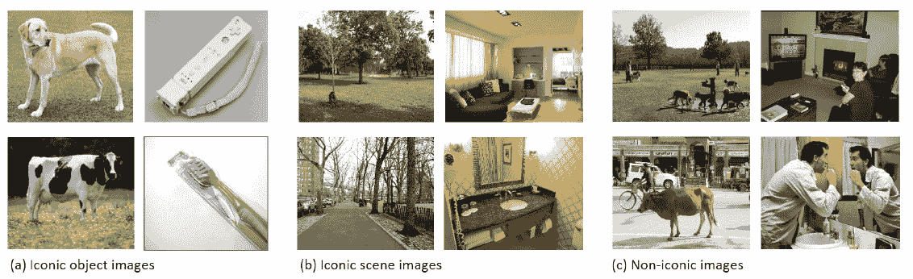
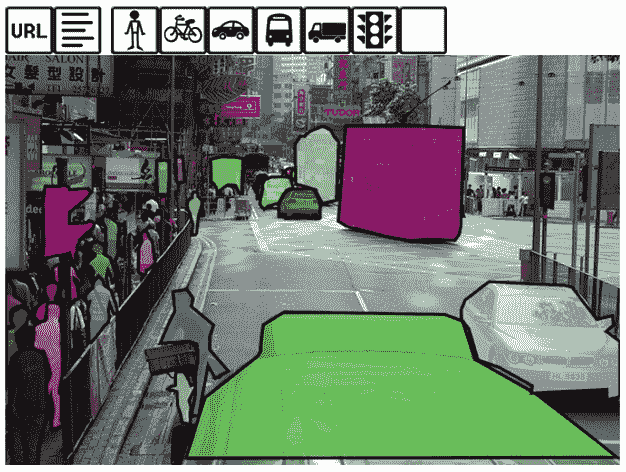
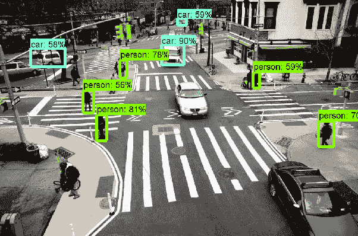

# 第二章：使用物体检测 API 注释图像

近年来，计算机视觉因深度学习取得了重大进展，从而赋予计算机更高的理解视觉场景的能力。深度学习在视觉任务中的潜力巨大：让计算机能够视觉感知和理解其周围环境是开启新型人工智能应用的大门，这些应用包括移动领域（例如，自动驾驶汽车能够从车载摄像头检测出障碍物是行人、动物还是其他车辆，并决定正确的行动路线）以及日常生活中的人机交互（例如，让机器人感知周围物体并成功与之互动）。

在第一章介绍了卷积神经网络（ConvNets）及其操作原理后，我们现在打算创建一个快速、简单的项目，帮助您使用计算机理解来自相机和手机拍摄的图像，图像可以来自互联网或直接来自计算机的摄像头。该项目的目标是找出图像中物体的准确位置和类型。

为了实现这种分类和定位，我们将利用新的 TensorFlow 物体检测 API，这是一个谷歌项目，属于更大的 TensorFlow 模型项目的一部分，该项目为您提供一系列预训练的神经网络，您可以将其直接用于您的自定义应用程序中。

在这一章中，我们将展示以下内容：

+   使用正确数据对您的项目的优势

+   TensorFlow 物体检测 API 简介

+   如何注释存储的图像以供进一步使用

+   如何使用 `moviepy` 对视频进行视觉注释

+   如何通过注释来自网络摄像头的图像实现实时操作

# 微软常见物体语境数据集

深度学习在计算机视觉中的应用进展通常高度集中在可以通过诸如 ImageNet（但也包括 PASCAL VOC - [`host.robots.ox.ac.uk/pascal/VOC/voc2012/`](http://host.robots.ox.ac.uk/pascal/VOC/voc2012/)）等挑战进行总结的分类问题上，以及适合解决这些问题的卷积神经网络（如 Xception、VGG16、VGG19、ResNet50、InceptionV3 和 MobileNet，仅举出在知名包 `Keras` 中提供的几种： [`keras.io/applications/`](https://keras.io/applications/)）。

尽管基于 ImageNet 数据的深度学习网络是当前的技术前沿，但这些网络在面对实际应用时可能会遇到困难。实际上，在实际应用中，我们必须处理的图像与 ImageNet 提供的示例有很大不同。在 ImageNet 中，待分类的元素通常是图像中唯一清晰可见的元素，理想情况下位于照片的中心，且无遮挡。然而，在实际拍摄的图像中，物体往往分散在不同位置，并且数量众多。所有这些物体之间的差异也很大，导致有时会出现混乱的场景。此外，物体往往会被其他潜在有趣的物体遮挡，使得它们无法被清晰直接地感知。

请参考以下提到的参考文献中的图示：

图 1：来自 ImageNet 的图像示例：它们按层次结构排列，既可以处理一般类别，也可以处理更具体的类别。

来源：DENG, Jia 等. ImageNet：一个大规模层次化图像数据库。载于：计算机视觉与模式识别，2009。CVPR 2009。IEEE 会议。IEEE，2009 年，248-255 页。

真实图像包含多个物体，这些物体有时很难与嘈杂的背景区分开。通常，单纯通过标记图像并用一个标签告诉你物体被识别出的置信度最高，你实际上无法创造出有趣的项目。

在实际应用中，你真的需要能够做到以下几点：

+   单个和多个实例的物体分类，通常是同一类别的不同物体

+   图像定位，即理解物体在图像中的位置

+   图像分割，通过为图像中的每个像素打上标签：标明物体类型或背景，以便能够从背景中切割出有趣的部分。

为了实现前述目标之一或全部目标，需要训练一个 ConvNet，这促成了**微软常见物体上下文（MS COCO）**数据集的创建，具体描述见论文：LIN, Tsung-Yi 等。Microsoft coco：常见物体的上下文。载于：*欧洲计算机视觉会议*。Springer，Cham，2014 年，740-755 页。（你可以通过以下链接阅读原文：[`arxiv.org/abs/1405.0312`](https://arxiv.org/abs/1405.0312)。）该数据集由 91 个常见物体类别组成，按层次结构排列，其中 82 个类别具有超过 5,000 个标记实例。该数据集总计包含 2,500,000 个标记物体，分布在 328,000 张图像中。

以下是 MS COCO 数据集中可以识别的类别：

```py
{1: 'person', 2: 'bicycle', 3: 'car', 4: 'motorcycle', 5: 'airplane', 6: 'bus', 7: 'train', 8: 'truck', 9: 'boat', 10: 'traffic light', 11: 'fire hydrant', 13: 'stop sign', 14: 'parking meter', 15: 'bench', 16: 'bird', 17: 'cat', 18: 'dog', 19: 'horse', 20: 'sheep', 21: 'cow', 22: 'elephant', 23: 'bear', 24: 'zebra', 25: 'giraffe', 27: 'backpack', 28: 'umbrella', 31: 'handbag', 32: 'tie', 33: 'suitcase', 34: 'frisbee', 35: 'skis', 36: 'snowboard', 37: 'sports ball', 38: 'kite', 39: 'baseball bat', 40: 'baseball glove', 41: 'skateboard', 42: 'surfboard', 43: 'tennis racket', 44: 'bottle', 46: 'wine glass', 47: 'cup', 48: 'fork', 49: 'knife', 50: 'spoon', 51: 'bowl', 52: 'banana', 53: 'apple', 54: 'sandwich', 55: 'orange', 56: 'broccoli', 57: 'carrot', 58: 'hot dog', 59: 'pizza', 60: 'donut', 61: 'cake', 62: 'chair', 63: 'couch', 64: 'potted plant', 65: 'bed', 67: 'dining table', 70: 'toilet', 72: 'tv', 73: 'laptop', 74: 'mouse', 75: 'remote', 76: 'keyboard', 77: 'cell phone', 78: 'microwave', 79: 'oven', 80: 'toaster', 81: 'sink', 82: 'refrigerator', 84: 'book', 85: 'clock', 86: 'vase', 87: 'scissors', 88: 'teddy bear', 89: 'hair drier', 90: 'toothbrush'}
```

尽管`ImageNet`数据集可以展示 1,000 个物体类别（如[`gist.github.com/yrevar/942d3a0ac09ec9e5eb3a`](https://gist.github.com/yrevar/942d3a0ac09ec9e5eb3a)所述），并且分布在 14,197,122 张图像中，MS COCO 则提供了一个独特的特点：多个物体分布在较少的图像中（该数据集是通过亚马逊 Mechanical Turk 收集的，这种方法相对更为昂贵，但也被 ImageNet 采用）。基于这一前提，MS COCO 的图像可以被视为*上下文关系和非图标物体视图*的极好示例，因为物体被安排在现实的场景和位置中。从下文中可以验证这一点，这是从上述提到的 MS COCO 论文中提取的比较示例：



图 2：图标和非图标图像的示例。来源：<q>LIN, Tsung-Yi, 等. Microsoft coco: common objects in context. 在：欧洲计算机视觉会议。Springer, Cham, 2014。p. 740-755。</q>

此外，MS COCO 的图像注释特别丰富，提供了图像中物体轮廓的坐标。这些轮廓可以轻松转换为边界框，即限定物体所在图像部分的框。这是一种比用于训练 MS COCO 本身的原始方法（基于像素分割）更粗略的物体定位方式。

在下图中，一排拥挤的物体被仔细分割，通过定义图像中的显著区域并创建这些区域的文本描述。在机器学习的术语中，这相当于为图像中的每个像素分配一个标签，并尝试预测分割类别（对应于文本描述）。历史上，这一任务一直通过图像处理完成，直到 2012 年 ImageNet 的出现，深度学习证明是一种更高效的解决方案。

2012 年是计算机视觉的一个里程碑，因为深度学习解决方案首次提供了比任何之前使用的技术都要优越的结果：<q>KRIZHEVSKY, Alex; SUTSKEVER, Ilya; HINTON, Geoffrey E. 使用深度卷积神经网络进行 ImageNet 分类。 在：神经信息处理系统的进展。2012 年。p. 1097-1105</q> ([`papers.nips.cc/paper/4824-imagenet-classification-with-deep-convolutional-neural-networks.pdf`](https://papers.nips.cc/paper/4824-imagenet-classification-with-deep-convolutional-neural-networks.pdf))。

图像分割对于多种任务特别有用，例如：

+   在图像中突出显示重要物体，例如在医学应用中检测患病区域

+   在图像中定位物体，以便机器人能够拾取或操作它们

+   帮助自动驾驶汽车或无人机理解道路场景以进行导航

+   通过自动提取图像的一部分或去除背景来编辑图像

这种标注非常昂贵（因此 MS COCO 中的样本数量较少），因为它必须完全手动完成，且需要细心和精确。有一些工具可以帮助通过图像分割来进行标注。你可以在[`stackoverflow.com/questions/8317787/image-labelling-and-annotation-tool`](https://stackoverflow.com/questions/8317787/image-labelling-and-annotation-tool)找到一个完整的工具列表。然而，如果你想自己通过分割图像进行标注，我们可以推荐以下两款工具：

+   LabelImg [`github.com/tzutalin/labelImg`](https://github.com/tzutalin/labelImg)

+   FastAnnotationTool [`github.com/christopher5106/FastAnnotationTool`](https://github.com/christopher5106/FastAnnotationTool)

所有这些工具也可以用于通过边界框进行更简单的标注，如果你想使用自己定义的类别重新训练一个基于 MS COCO 的模型，它们确实会派上用场。（我们将在本章最后再次提到这一点）：



在 MS COCO 训练阶段使用的图像像素分割

# TensorFlow 目标检测 API

作为提升研究社区能力的一种方式，Google 的研究科学家和软件工程师通常会开发最先进的模型，并将其公开，而不是保留为专有技术。正如 Google 研究博客中所描述的， [`research.googleblog.com/2017/06/supercharge-your-computer-vision-models.html`](https://research.googleblog.com/2017/06/supercharge-your-computer-vision-models.html)，在 2016 年 10 月，Google 内部的目标检测系统在 COCO 检测挑战赛中获得第一名，该挑战赛专注于在图像中找到物体（估算物体在该位置的可能性）及其边界框（你可以在[`arxiv.org/abs/1611.10012`](https://arxiv.org/abs/1611.10012)阅读他们解决方案的技术细节）。

Google 的解决方案不仅为很多论文做出了贡献，并且已被应用到一些 Google 产品中（Nest Cam - [`nest.com/cameras/nest-aware/`](https://nest.com/cameras/nest-aware/)，图片搜索 - [`www.blog.google/products/search/now-image-search-can-jump-start-your-search-style/`](https://www.blog.google/products/search/now-image-search-can-jump-start-your-search-style/)，街景 - [`research.googleblog.com/2017/05/updating-google-maps-with-deep-learning.html`](https://research.googleblog.com/2017/05/updating-google-maps-with-deep-learning.html)），同时也作为一个开源框架发布给更广泛的公众，建立在 TensorFlow 之上。

该框架提供了一些有用的功能以及这五个预训练的不同模型（构成了所谓的预训练模型库）：

+   基于 MobileNets 的单次检测多框（SSD）

+   基于 Inception V2 的 SSD

+   基于 Resnet 101 的区域卷积神经网络（R-FCN）

+   基于 Resnet 101 的 Faster R-CNN

+   使用 Inception Resnet v2 的 Faster R-CNN

这些模型按照检测精度的逐渐提高以及检测过程执行速度的逐渐减慢排序。MobileNets、Inception 和 Resnet 指的是不同类型的卷积神经网络（CNN）架构（MobileNets，顾名思义，是为手机优化的架构，体积小、执行速度快）。我们在上一章已经讨论过 CNN 架构，您可以参考那里以获取更多关于这些架构的深入信息。如果您需要复习，Joice Xu 撰写的这篇博客文章可以帮助您以一种简便的方式复习该主题：[`towardsdatascience.com/an-intuitive-guide-to-deep-network-architectures-65fdc477db41`](https://towardsdatascience.com/an-intuitive-guide-to-deep-network-architectures-65fdc477db41)。

**单次多框检测器**（**SSD**）、**基于区域的全卷积网络**（**R-FCN**）和 **更快的基于区域的卷积神经网络**（**Faster R-CNN**）是用于检测图像中多个物体的不同模型。在接下来的段落中，我们将解释这些模型如何有效工作。

根据你的应用，你可以选择最适合你的模型（你需要进行一些实验），或者将多个模型的结果汇总，以获得更好的效果（正如 Google 的研究人员在 COCO 竞赛中所做的那样）。

# 掌握 R-CNN、R-FCN 和 SSD 模型的基础知识

即使你已经清楚地知道 CNN 如何管理图像分类，理解神经网络如何通过定义物体的边界框（围绕物体的矩形边界）来定位图像中的多个物体，可能仍然不那么显而易见。你可能想象的第一个也是最简单的解决方案是使用滑动窗口，并在每个窗口上应用 CNN，但对于大多数现实世界的应用来说，这可能非常耗费计算资源（如果你为自动驾驶汽车提供视觉系统，你肯定希望它在撞到障碍物之前就能识别并停下来）。

你可以在 Adrian Rosebrock 撰写的这篇博客文章中找到更多关于物体检测的滑动窗口方法：[`www.pyimagesearch.com/2015/03/23/sliding-windows-for-object-detection-with-python-and-opencv/`](https://www.pyimagesearch.com/2015/03/23/sliding-windows-for-object-detection-with-python-and-opencv/)，该文章通过将其与图像金字塔配对，提供了一个有效的示例。

尽管滑动窗口方法在一定程度上直观，但由于其复杂性和计算上的笨重（需要进行大量计算并处理不同图像尺度），滑动窗口有许多局限性，因此很快就找到了一个优选的解决方案——*区域提议*算法。这些算法使用图像分割（即基于区域之间主要颜色差异将图像划分为多个区域）来创建图像中可能的边界框的初步枚举。你可以在 Satya Mallik 的这篇文章中找到详细的算法工作原理：[`www.learnopencv.com/selective-search-for-object-detection-cpp-python/`](https://www.learnopencv.com/selective-search-for-object-detection-cpp-python/)。关键是，区域提议算法建议一个有限数量的框进行评估，远远少于滑动窗口算法提议的数量。这使得它们能够应用于第一个 R-CNN——基于区域的卷积神经网络，工作原理为：

1.  得益于区域提议算法，找到图像中的几百个或几千个感兴趣区域。

1.  通过 CNN 处理每个感兴趣区域，以便为每个区域创建特征。

1.  使用特征通过支持向量机分类区域，并通过线性回归计算更精确的边界框。

R-CNN 的直接演化是 Fast R-CNN，它使得处理速度更快，因为：

1.  它一次性处理整张图像，通过 CNN 进行转换，并将区域提议应用于该转换。这将 CNN 处理的次数从几千次减少到一次。

1.  它不是使用 SVM 进行分类，而是使用 soft-max 层和线性分类器，从而简单地扩展了 CNN，而不是将数据传递给不同的模型。

本质上，通过使用 Fast R-CNN，我们再次得到了一个单一的分类网络，该网络具有一个基于非神经网络算法的特殊过滤和选择层，即区域提议层。Faster R-CNN 甚至改变了这个层，将其替换为区域提议神经网络。这使得模型变得更加复杂，但比任何以前的方法更有效且更快速。

不过，R-FCN 比 Faster R-CNN 还要快，因为它们是完全卷积网络，在卷积层之后不使用任何全连接层。它们是端到端的网络：从输入到输出，都是通过卷积完成。这使得它们更加快速（它们的权重数量远少于使用全连接层的 CNN）。但它们的速度是有代价的，它们不再具备图像不变性（CNN 能够识别物体的类别，无论物体如何旋转）。Faster R-CNN 通过位置敏感的得分图来弥补这一缺陷，这是一种检查 FCN 处理的原始图像的部分是否与待分类的类别部分对应的方法。简而言之，它们并不直接对比类别，而是对比类别的部分。例如，它们不会识别一只狗，而是识别狗的左上部分、右下部分，依此类推。这种方法能够帮助识别图像的某部分是否包含狗，不管它的方向如何。显然，这种更快速的方法以牺牲精度为代价，因为位置敏感得分图无法完全补充 CNN 的所有特征。

最后，我们来谈谈 SSD（单次检测器）。这里的速度更快，因为网络在处理图像的同时同时预测边界框的位置及其类别。SSD 通过直接跳过区域提议阶段来计算大量的边界框。它只是减少了高度重叠的框，但相比之前提到的所有模型，它处理的边界框数量最大。它的速度是因为每次限定一个边界框时，它也会对其进行分类：通过一举完成所有任务，它拥有最快的速度，尽管其表现与其他模型相当。

Joice Xu 的另一篇简短文章可以为你提供更多我们之前讨论的检测模型的细节：[`towardsdatascience.com/deep-learning-for-object-detection-a-comprehensive-review-73930816d8d9`](https://towardsdatascience.com/deep-learning-for-object-detection-a-comprehensive-review-73930816d8d9)

总结所有讨论内容，在选择网络时，你需要考虑的是，你正在将不同的 CNN 架构与分类能力和网络复杂性结合在一起，并与不同的检测模型结合。正是它们的综合效应决定了网络在识别物体、正确分类物体以及及时完成这些任务的能力。

如果您希望获得更多关于我们简要说明的模型的速度和精度参考，可以参考：*现代卷积物体检测器的速度/精度权衡*。黄俊，Rathod V，孙成，朱敏，Korattikara A，Fathi A，Fischer I，Wojna Z，宋阳，Guadarrama S，Murphy K，CVPR 2017：[`openaccess.thecvf.com/content_cvpr_2017/papers/Huang_SpeedAccuracy_Trade-Offs_for_CVPR_2017_paper.pdf`](http://openaccess.thecvf.com/content_cvpr_2017/papers/Huang_SpeedAccuracy_Trade-Offs_for_CVPR_2017_paper.pdf) 但我们还是建议您在实践中测试这些模型，以评估它们是否足够适合您的任务，并且是否能在合理的时间内执行。然后，您只需根据您的应用做出最佳的速度/精度权衡。

# 展示我们的项目计划

由于 TensorFlow 提供了如此强大的工具，我们的计划是通过创建一个类来利用它的 API，您可以使用该类对图像进行视觉和外部文件标注。这里所说的标注包括以下内容：

+   指出图像中的物体（由在 MS COCO 上训练的模型识别）

+   报告物体识别的置信度（我们只考虑置信度超过最低概率阈值的物体，该阈值设为 0.25，基于之前提到的*现代卷积物体检测器的速度/精度权衡*论文中的讨论）

+   输出每张图像的边界框两个对角顶点的坐标

+   将所有这些信息以 JSON 格式保存在文本文件中

+   如有需要，在原始图像上可视化表示边界框

为了实现这些目标，我们需要：

1.  下载一个预训练模型（以`.pb`格式提供 - [protobuf](https://developers.google.com/protocol-buffers/)），并将其作为 TensorFlow 会话加载到内存中。

1.  重新构建 TensorFlow 提供的辅助代码，使得通过一个可以轻松导入脚本的类，加载标签、类别和可视化工具变得更加容易。

1.  准备一个简单的脚本，演示如何使用单张图像、视频和从网络摄像头捕获的视频。

我们首先通过设置适合项目的环境来开始。

# 为项目设置适当的环境

您不需要任何专业环境来运行该项目，尽管我们强烈建议安装 Anaconda `conda`并为项目创建一个独立环境。如果您的系统中已有`conda`，则按照以下说明运行：

```py
conda create -n TensorFlow_api python=3.5 numpy pillow
activate TensorFlow_api
```

启动环境后，您可以安装其他一些包，使用`pip install`命令或`conda install`命令指向其他仓库（如`menpo`，`conda-forge`）：

```py
pip install TensorFlow-gpu
conda install -c menpo opencv
conda install -c conda-forge imageio
pip install tqdm, moviepy
```

如果您倾向于另一种运行该项目的方式，请确保您已安装`numpy`，`pillow`，`TensorFlow`，`opencv`，`imageio`，`tqdm`和`moviepy`，以便顺利运行。

为了确保一切顺利运行，你还需要为你的项目创建一个目录，并将 TensorFlow 目标检测 API 项目的`object_detection`目录保存到其中（[`github.com/tensorflow/models/tree/master/research/object_detection`](https://github.com/tensorflow/models/tree/master/research/object_detection)）。

你可以通过在整个 TensorFlow 模型项目中使用`git`命令并选择性地拉取该目录来轻松获取。这在你的 Git 版本为 1.7.0（2012 年 2 月）或以上时是可行的：

```py
mkdir api_project
cd api_project
git init
git remote add -f origin https://github.com/tensorflow/models.git
```

这些命令将获取 TensorFlow 模型项目中的所有对象，但它不会检出它们。通过执行这些前面的命令后：

```py
git config core.sparseCheckout true
echo "research/object_detection/*" >> .git/info/sparse-checkout
git pull origin master
```

现在你只会在文件系统中看到`object_detection`目录及其内容，并且没有其他目录或文件。

只需记住，该项目需要访问`object_detection`目录，因此你必须将项目脚本保存在与`object_detection`目录相同的目录中。如果要在该目录外使用脚本，你需要使用完整路径访问它。

# Protobuf 编译

TensorFlow 目标检测 API 使用 *protobufs*（协议缓冲区）——Google 的数据交换格式（[`github.com/google/protobuf`](https://github.com/google/protobuf)），用于配置模型及其训练参数。在框架使用之前，必须编译 protobuf 库，如果你使用的是 Unix（Linux 或 Mac）或 Windows 操作系统环境，步骤会有所不同。

# Windows 安装

首先，解压[protoc-3.2.0-win32.zip](https://github.com/google/protobuf/releases/download/v3.2.0/protoc-3.2.0-win32.zip)，它可以在[`github.com/google/protobuf/releases`](https://github.com/google/protobuf/releases)找到，将其解压到项目文件夹中。现在你应该会看到一个新的`protoc-3.4.0-win32`目录，其中包含一个`readme.txt`文件和两个目录：`bin`和`include`。这些文件夹包含了协议缓冲区编译器（*protoc*）的预编译二进制版本。你需要做的就是将`protoc-3.4.0-win32`目录添加到系统路径中。

将其添加到系统路径后，你可以执行以下命令：

```py
protoc-3.4.0-win32/bin/protoc.exe object_detection/protos/*.proto --python_out=.
```

这应该足够让 TensorFlow 目标检测 API 在你的计算机上运行。

# Unix 安装

对于 Unix 环境，安装过程可以通过 shell 命令完成，只需按照[`github.com/tensorflow/models/blob/master/research/object_detection/g3doc/installation.md`](https://github.com/tensorflow/models/blob/master/research/object_detection/g3doc/installation.md)上的说明进行操作。

# 项目代码的配置

我们开始在文件`tensorflow_detection.py`中编写脚本，通过加载必要的包：

```py
import os
import numpy as np
import tensorflow as tf
import six.moves.urllib as urllib
import tarfile
from PIL import Image
from tqdm import tqdm
from time import gmtime, strftime
import json
import cv2
```

为了能够处理视频，除了 OpenCV 3，我们还需要`moviepy`包。`moviepy`包是一个可以在[`zulko.github.io/moviepy/`](http://zulko.github.io/moviepy/)找到并自由使用的项目，因为它是以 MIT 许可证分发的。正如其主页所描述的，`moviepy`是一个用于视频编辑（如剪辑、拼接、标题插入）、视频合成（非线性编辑）、视频处理或创建高级效果的工具。

该包支持最常见的视频格式，包括 GIF 格式。为了正确操作，它需要`FFmpeg`转换器（[`www.ffmpeg.org/`](https://www.ffmpeg.org/)），因此在首次使用时，它将无法启动并会通过`imageio`插件下载`FFmpeg`：

```py
try:
    from moviepy.editor import VideoFileClip
except:
    # If FFmpeg (https://www.ffmpeg.org/) is not found 
    # on the computer, it will be downloaded from Internet 
    # (an Internet connect is needed)
    import imageio
    imageio.plugins.ffmpeg.download()
    from moviepy.editor import VideoFileClip
```

最后，我们需要 TensorFlow API 项目中`object_detection`目录下的两个有用函数：

```py
from object_detection.utils import label_map_util
from object_detection.utils import visualization_utils as vis_util
```

我们定义了`DetectionObj`类及其`init`过程。初始化只需要一个参数和模型名称（默认设置为性能较差，但速度较快且更轻量级的模型，SSD MobileNet），但一些内部参数可以根据你的使用情况进行更改：

+   `self.TARGET_PATH`指向你希望保存处理后注释的目录。

+   `self.THRESHOLD`设置了注释过程要注意的概率阈值。事实上，套件中的任何模型都会在每张图片中输出许多低概率的检测。概率太低的对象通常是误报，因此你需要设置阈值，忽略那些极不可能的检测。根据经验，0.25 是一个不错的阈值，用于识别由于几乎完全遮挡或视觉杂乱而不确定的对象。

```py
class DetectionObj(object):
    """
    DetectionObj is a class suitable to leverage 
    Google Tensorflow detection API for image annotation from   
    different sources: files, images acquired by own's webcam,
    videos.
    """

    def __init__(self, model='ssd_mobilenet_v1_coco_11_06_2017'):
        """
        The instructions to be run when the class is instantiated
        """

        # Path where the Python script is being run
        self.CURRENT_PATH = os.getcwd()

        # Path where to save the annotations (it can be modified)
        self.TARGET_PATH = self.CURRENT_PATH

        # Selection of pre-trained detection models
        # from the Tensorflow Model Zoo
        self.MODELS = ["ssd_mobilenet_v1_coco_11_06_2017",
                       "ssd_inception_v2_coco_11_06_2017",
                       "rfcn_resnet101_coco_11_06_2017",
                       "faster_rcnn_resnet101_coco_11_06_2017",
                       "faster_rcnn_inception_resnet_v2_atrous_\
                        coco_11_06_2017"]

        # Setting a threshold for detecting an object by the models
        self.THRESHOLD = 0.25 # Most used threshold in practice

        # Checking if the desired pre-trained detection model is available
        if model in self.MODELS:
            self.MODEL_NAME = model
        else:
            # Otherwise revert to a default model
            print("Model not available, reverted to default", self.MODELS[0])
            self.MODEL_NAME = self.MODELS[0]

        # The file name of the Tensorflow frozen model
        self.CKPT_FILE = os.path.join(self.CURRENT_PATH, 'object_detection',
                                      self.MODEL_NAME,  
                                      'frozen_inference_graph.pb')

        # Attempting loading the detection model, 
        # if not available on disk, it will be 
        # downloaded from Internet
        # (an Internet connection is required)
        try:
            self.DETECTION_GRAPH = self.load_frozen_model()
        except:
            print ('Couldn\'t find', self.MODEL_NAME)
            self.download_frozen_model()
            self.DETECTION_GRAPH = self.load_frozen_model()

        # Loading the labels of the classes recognized by the detection model
        self.NUM_CLASSES = 90
        path_to_labels = os.path.join(self.CURRENT_PATH,
                                    'object_detection', 'data',
                                       'mscoco_label_map.pbtxt')
        label_mapping = \ 
                    label_map_util.load_labelmap(path_to_labels)
        extracted_categories = \
                 label_map_util.convert_label_map_to_categories(
                 label_mapping, max_num_classes=self.NUM_CLASSES,                                              
                                           use_display_name=True)
        self.LABELS = {item['id']: item['name'] \
                       for item in extracted_categories}
        self.CATEGORY_INDEX = label_map_util.create_category_index\
(extracted_categories)

        # Starting the tensorflow session
        self.TF_SESSION = tf.Session(graph=self.DETECTION_GRAPH)
```

作为一个方便的变量，你可以访问`self.LABELS`，它包含一个将类别数字代码与文本表示相对应的字典。此外，`init`过程将加载、打开并准备好使用`TensorFlow`会话，位于`self.TF_SESSION`。

`load_frozen_model`和`download_frozen_model`函数将帮助`init`过程从磁盘加载所选的冻结模型，如果模型不可用，它们将帮助从互联网下载该模型作为 TAR 文件，并将其解压到正确的目录（即`object_detection`）：

```py
def load_frozen_model(self):
    """
    Loading frozen detection model in ckpt 
    file from disk to memory
    """

    detection_graph = tf.Graph()
    with detection_graph.as_default():
        od_graph_def = tf.GraphDef()
        with tf.gfile.GFile(self.CKPT_FILE, 'rb') as fid:
             serialized_graph = fid.read()
             od_graph_def.ParseFromString(serialized_graph)
             tf.import_graph_def(od_graph_def, name='')

    return detection_graph
```

`download_frozen_model`函数利用`tqdm`包来可视化其下载新模型时的进度。某些模型相当大（超过 600MB），可能需要很长时间。提供进度和预计完成时间的可视化反馈将使用户对操作的进展更加有信心：

```py
def download_frozen_model(self):
    """
    Downloading frozen detection model from Internet
    when not available on disk
    """
    def my_hook(t):
        """
        Wrapping tqdm instance in order to monitor URLopener 
        """
        last_b = [0]

        def inner(b=1, bsize=1, tsize=None):
            if tsize is not None:
                t.total = tsize
            t.update((b - last_b[0]) * bsize)
            last_b[0] = b
        return inner

    # Opening the url where to find the model
    model_filename = self.MODEL_NAME + '.tar.gz'
    download_url = \
        'http://download.tensorflow.org/models/object_detection/'
    opener = urllib.request.URLopener()

    # Downloading the model with tqdm estimations of completion
    print('Downloading ...')
    with tqdm() as t:
        opener.retrieve(download_url + model_filename,
                        model_filename, reporthook=my_hook(t))

    # Extracting the model from the downloaded tar file
    print ('Extracting ...')
    tar_file = tarfile.open(model_filename)
    for file in tar_file.getmembers():
            file_name = os.path.basename(file.name)
            if 'frozen_inference_graph.pb' in file_name:
                tar_file.extract(file,
                     os.path.join(self.CURRENT_PATH,  
                                  'object_detection'))
```

以下两个函数，`load_image_from_disk`和`load_image_into_numpy_array`，是从磁盘中选择图像并将其转换为适合本项目中任何 TensorFlow 模型处理的 Numpy 数组所必需的：

```py
    def load_image_from_disk(self, image_path):

        return Image.open(image_path)

    def load_image_into_numpy_array(self, image):

        try:
            (im_width, im_height) = image.size
            return np.array(image.getdata()).reshape(
                (im_height, im_width, 3)).astype(np.uint8)
        except:
            # If the previous procedure fails, we expect the
            # image is already a Numpy ndarray
            return image
```

`detect`函数则是该类分类功能的核心。该函数仅期望处理图像列表。一个布尔标志`annotate_on_image`仅告诉脚本在提供的图像上直接可视化边界框和注释。

这样的函数能够依次处理不同尺寸的图像，但需要逐个图像进行处理。因此，它会将每个图像扩展数组的维度，增加一个额外的维度。这是必要的，因为模型期望数组的尺寸为：图像数量 * 高度 * 宽度 * 深度。

注意，我们可以将所有批次的图像打包成一个矩阵进行预测。这是可行的，并且如果所有图像的高度和宽度相同，它会更快，但我们的项目并未做出这一假设，因此采用了逐个图像处理的方法。

然后，我们通过名称从模型中提取几个张量（`detection_boxes`、`detection_scores`、`detection_classes`、`num_detections`），这些正是我们期望从模型中得到的输出，我们将所有内容输入到`image_tensor`张量中，它会将图像标准化成适合模型层处理的形式。

结果被汇总成一个列表，图像经过检测框处理并在需要时呈现：

```py
def detect(self, images, annotate_on_image=True):
        """
        Processing a list of images, feeding it 
        into the detection model and getting from it scores,  
        bounding boxes and predicted classes present 
        in the images
        """
        if type(images) is not list:
            images = [images]
        results = list()
        for image in images:
            # the array based representation of the image will 
            # be used later in order to prepare the resulting
            # image with boxes and labels on it.
            image_np = self.load_image_into_numpy_array(image)

            # Expand dimensions since the model expects images
            # to have shape: [1, None, None, 3]
            image_np_expanded = np.expand_dims(image_np, axis=0)
            image_tensor = \ 
                  self.DETECTION_GRAPH.get_tensor_by_name(  
                                               'image_tensor:0')

            # Each box represents a part of the image where a 
            # particular object was detected.
            boxes = self.DETECTION_GRAPH.get_tensor_by_name(
                                            'detection_boxes:0')

            # Each score represent how level of confidence 
            # for each of the objects. Score could be shown 
            # on the result image, together with the class label.
            scores = self.DETECTION_GRAPH.get_tensor_by_name(
                                           'detection_scores:0')
            classes = self.DETECTION_GRAPH.get_tensor_by_name(
                                          'detection_classes:0')
            num_detections = \
                     self.DETECTION_GRAPH.get_tensor_by_name(
                                             'num_detections:0')

         # Actual detection happens here
         (boxes, scores, classes, num_detections) = \
                     self.TF_SESSION.run(
                     [boxes, scores, classes, num_detections],
                     feed_dict={image_tensor: image_np_expanded})

        if annotate_on_image:
            new_image = self.detection_on_image(
                            image_np, boxes, scores, classes)
            results.append((new_image, boxes, 
                            scores, classes, num_detections))
        else:
            results.append((image_np, boxes, 
                            scores, classes, num_detections))
        return results
```

`detection_on_image`函数仅处理来自`detect`函数的结果，并返回一张新图像，这张图像通过边界框进行丰富，边界框将在屏幕上通过`visualize_image`函数呈现（你可以调整延迟参数，该参数定义了图像在屏幕上停留的秒数，脚本会在此后处理下一个图像）。

```py
    def detection_on_image(self, image_np, boxes, scores,  
                           classes):
        """
        Put detection boxes on the images over 
        the detected classes
        """
        vis_util.visualize_boxes_and_labels_on_image_array(
            image_np,
            np.squeeze(boxes),
            np.squeeze(classes).astype(np.int32),
            np.squeeze(scores),
            self.CATEGORY_INDEX,
            use_normalized_coordinates=True,
            line_thickness=8)
        return image_np
```

`visualize_image`函数提供了一些可以修改的参数，以满足你在本项目中的需求。首先，`image_size`提供了图像在屏幕上显示的期望大小。因此，较大或较小的图像会被修改，以部分符合这个规定的尺寸。`latency`参数则定义了每张图像在屏幕上显示的时间（秒），即在转向处理下一张图像之前，锁定目标检测过程。最后，`bluish_correction`是当图像以**BGR**格式提供时应用的修正（在这种格式中，颜色通道按：**蓝色-绿色-红色**的顺序排列，这是 OpenCV 库的标准：[`stackoverflow.com/questions/14556545/why-opencv-using-bgr-colour-space-instead-of-rgb`](https://stackoverflow.com/questions/14556545/why-opencv-using-bgr-colour-space-instead-of-rgb)），而不是模型预期的**RGB**（**红色-绿色-蓝色**）图像格式。

```py
    def visualize_image(self, image_np, image_size=(400, 300), 
                        latency=3, bluish_correction=True):

        height, width, depth = image_np.shape
        reshaper = height / float(image_size[0])
        width = int(width / reshaper)
        height = int(height / reshaper)
        id_img = 'preview_' + str(np.sum(image_np))
        cv2.startWindowThread()
        cv2.namedWindow(id_img, cv2.WINDOW_NORMAL)
        cv2.resizeWindow(id_img, width, height)
        if bluish_correction:
            RGB_img = cv2.cvtColor(image_np, cv2.COLOR_BGR2RGB)
            cv2.imshow(id_img, RGB_img)
        else:
            cv2.imshow(id_img, image_np)
        cv2.waitKey(latency*1000)
```

注释由`serialize_annotations`函数准备并写入磁盘，该函数会为每个图像创建单独的 JSON 文件，包含关于检测到的类别、边界框的顶点以及检测置信度的数据。例如，这是在狗的照片上进行检测的结果：

```py
"{"scores": [0.9092628359794617], "classes": ["dog"], "boxes": [[0.025611668825149536, 0.22220897674560547, 0.9930437803268433, 0.7734537720680237]]}"
```

JSON 文件指出检测到的类别（单一的狗）、置信度（大约 0.91 的置信度），以及边界框的顶点，并以百分比表示图像的高度和宽度（因此它们是相对的，而不是绝对像素点）：

```py
    def serialize_annotations(self, boxes, scores, classes,                                       filename='data.json'):
        """
        Saving annotations to disk, to a JSON file
        """

        threshold = self.THRESHOLD
        valid = [position for position, score in enumerate(
                                              scores[0]) if score > threshold]
        if len(valid) > 0:
            valid_scores = scores[0][valid].tolist()
            valid_boxes  = boxes[0][valid].tolist()
            valid_class = [self.LABELS[int(
                                   a_class)] for a_class in classes[0][valid]]
            with open(filename, 'w') as outfile:
                json_data = {'classes': valid_class,
                    'boxes':valid_boxes, 'scores': valid_scores})
                json.dump(json_data, outfile)
```

`get_time`函数方便地将当前时间转换为可以用于文件名的字符串：

```py
    def get_time(self):
        """
        Returning a string reporting the actual date and time
        """
        return strftime("%Y-%m-%d_%Hh%Mm%Ss", gmtime())
```

最后，我们准备了三条检测管道，分别用于图像、视频和网络摄像头。图像的管道将每个图像加载到一个列表中。视频的管道允许`moviepy`的`VideoFileClip`模块进行所有繁重的处理，只需将`detect`函数适当地包装在`annotate_photogram`函数中。最后，网络摄像头捕获的管道依赖于一个简单的`capture_webcam`函数，它基于 OpenCV 的 VideoCapture，从网络摄像头记录多个快照，只返回最后一张（该操作考虑了网络摄像头在适应环境光照水平前所需的时间）：

```py
    def annotate_photogram(self, photogram):
        """
        Annotating a video's photogram with bounding boxes
        over detected classes
        """
        new_photogram, boxes, scores, classes, num_detections =  
                                                      self.detect(photogram)[0]
        return new_photogram
```

`capture_webcam`函数将使用`cv2.VideoCapture`功能从你的网络摄像头获取图像（[`docs.opencv.org/3.0-beta/modules/videoio/doc/reading_and_writing_video.html`](http://docs.opencv.org/3.0-beta/modules/videoio/doc/reading_and_writing_video.html)）。由于网络摄像头首先需要调整光照条件以适应拍照环境，因此该过程会丢弃一些初始快照，之后再拍摄用于目标检测的图像。通过这种方式，网络摄像头有足够时间调整光照设置：

```py
    def capture_webcam(self):
        """
        Capturing an image from the integrated webcam
        """

        def get_image(device):
            """
            Internal function to capture a single image  
            from the camera and return it in PIL format
            """

            retval, im = device.read()
            return im

        # Setting the integrated webcam
        camera_port = 0

        # Number of frames to discard as the camera 
        # adjusts to the surrounding lights
        ramp_frames = 30

        # Initializing the webcam by cv2.VideoCapture
        camera = cv2.VideoCapture(camera_port)

        # Ramping the camera - all these frames will be 
        # discarded as the camera adjust to the right light levels
        print("Setting the webcam")
        for i in range(ramp_frames):
            _ = get_image(camera)

        # Taking the snapshot
        print("Now taking a snapshot ... ", end='')
        camera_capture = get_image(camera)
        print('Done')

        # releasing the camera and making it reusable
        del (camera)
        return camera_capture
```

`file_pipeline`包括加载图像并可视化/注释它们所需的所有步骤：

1.  从磁盘加载图像。

1.  对加载的图像应用目标检测。

1.  将每个图像的注释写入一个 JSON 文件。

1.  如果布尔参数`visualize`需要，代表带有边界框的图像并显示在计算机屏幕上：

```py
    def file_pipeline(self, images, visualize=True):
        """
        A pipeline for processing and annotating lists of
        images to load from disk
        """
        if type(images) is not list:
            images = [images]
        for filename in images:
            single_image = self.load_image_from_disk(filename)
            for new_image, boxes, scores, classes, num_detections in  
                                                     self.detect(single_image):
                self.serialize_annotations(boxes, scores, classes,
                                           filename=filename + ".json")
                if visualize:
                    self.visualize_image(new_image)
```

`video_pipeline`简单地安排了注释视频所需的所有步骤，并在完成操作后将其保存到磁盘：

```py
    def video_pipeline(self, video, audio=False):
        """
        A pipeline to process a video on disk and annotating it
        by bounding box. The output is a new annotated video.
        """
        clip = VideoFileClip(video)
        new_video = video.split('/')
        new_video[-1] = "annotated_" + new_video[-1]
        new_video = '/'.join(new_video)
        print("Saving annotated video to", new_video)
        video_annotation = clip.fl_image(self.annotate_photogram)
        video_annotation.write_videofile(new_video, audio=audio)
```

`webcam_pipeline`是当你想要注释来自网络摄像头的图像时，安排所有步骤的函数：

1.  从网络摄像头捕获图像。

1.  将捕获的图像保存到磁盘（使用`cv2.imwrite`，其优势是根据目标文件名写入不同的图像格式，详见：[`docs.opencv.org/3.0-beta/modules/imgcodecs/doc/reading_and_writing_images.html`](http://docs.opencv.org/3.0-beta/modules/imgcodecs/doc/reading_and_writing_images.html)）

1.  对图像应用目标检测。

1.  保存注释的 JSON 文件。

1.  直观表示带有边界框的图像：

```py
    def webcam_pipeline(self):
        """
        A pipeline to process an image acquired by the internal webcam
        and annotate it, saving a JSON file to disk
        """
        webcam_image = self.capture_webcam()
        filename = "webcam_" + self.get_time()
        saving_path = os.path.join(self.CURRENT_PATH, filename + ".jpg")
        cv2.imwrite(saving_path, webcam_image)
        new_image, boxes, scores, classes, num_detections =  
                                            self.detect(webcam_image)[0]
        json_obj = {'classes': classes, 'boxes':boxes, 'scores':scores}
        self.serialize_annotations(boxes, scores, classes,                                   filename=filename+".json")
        self.visualize_image(new_image, bluish_correction=False)
```

# 一些简单的应用

作为代码提供部分的结尾，我们展示了三个简单的脚本，利用了我们项目中的三种不同数据来源：文件、视频和摄像头。

我们的第一个测试脚本旨在注释和可视化三张图像，前提是从本地目录导入类`DetectionObj`（如果你在其他目录下操作，除非你将项目目录添加到 Python 路径中，否则导入将无法工作）。

为了在脚本中将目录添加到 Python 路径中，你只需在需要访问该目录的脚本部分之前放置`sys.path.insert`命令：

`import sys`

`sys.path.insert(0,'/path/to/directory')`

然后我们激活该类，使用 SSD MobileNet v1 模型进行声明。接着，我们需要将每个图像的路径放入一个列表中，并传递给`file_pipeline`方法：

```py
from TensorFlow_detection import DetectionObj
if __name__ == "__main__":
    detection = DetectionObj(model='ssd_mobilenet_v1_coco_11_06_2017')
    images = ["./sample_images/intersection.jpg",
              "./sample_images/busy_street.jpg", "./sample_images/doge.jpg"]
    detection.file_pipeline(images)
```

我们在检测类应用到交叉口图像后收到的输出，将返回另一个图像，图像中包含了足够置信度的边界框，框住了识别出的物体：



在交叉口照片上进行 SSD MobileNet v1 物体检测

运行脚本后，所有三张图像将带有注释在屏幕上显示（每张显示三秒钟），并且一个新的 JSON 文件将被写入磁盘（写入目标目录，如果你没有通过修改类变量`TARGET_CLASS`来特别指定它，该目录将默认为本地目录）。

在可视化中，你将看到所有与物体相关的边界框，前提是预测置信度高于 0.5。无论如何，你会注意到，在这种交叉口图像的注释案例中（如前图所示），并不是所有的汽车和行人都被模型识别到。

查看 JSON 文件后，你会发现模型还定位了许多其他汽车和行人，尽管置信度较低。在该文件中，你会找到所有置信度至少为 0.25 的物体，这一阈值在许多物体检测研究中是常见的标准（但你可以通过修改类变量`THRESHOLD`来更改它）。

在这里，你可以看到 JSON 文件中生成的分数。只有八个检测到的物体的分数高于可视化阈值 0.5，而其他 16 个物体的分数较低：

```py
"scores": [0.9099398255348206, 0.8124723434448242, 0.7853631973266602, 0.709653913974762, 0.5999227166175842, 0.5942907929420471, 0.5858771800994873, 0.5656214952468872, 0.49047672748565674, 0.4781857430934906, 0.4467884600162506, 0.4043623208999634, 0.40048354864120483, 0.38961756229400635, 0.35605812072753906, 0.3488095998764038, 0.3194449841976166, 0.3000411093235016, 0.294520765542984, 0.2912806570529938, 0.2889115810394287, 0.2781482934951782, 0.2767323851585388, 0.2747304439544678]
```

在这里你可以找到被检测物体的相关类别。许多汽车被以较低的置信度检测到。它们可能确实是图像中的汽车，也可能是错误的识别。根据你对检测 API 的应用，你可能想要调整阈值，或者使用另一种模型，只有当物体被不同模型重复检测，并且置信度超过阈值时，才估计它是一个有效的物体：

```py
"classes": ["car", "person", "person", "person", "person", "car", "car", "person", "person", "person", "person", "person", "person", "person", "car", "car", "person", "person", "car", "car", "person", "car", "car", "car"]
```

将检测应用于视频使用相同的脚本方法。这一次，您只需指向适当的方法`video_pipeline`，提供视频路径，并设置结果视频是否应包含音频（默认情况下音频会被过滤掉）。脚本将自动完成所有操作，在与原始视频相同的目录路径下保存一个经过修改和注释的视频（您可以通过文件名看到它，因为它与原始视频文件名相同，只是在前面加上`annotated_`）：

```py
from TensorFlow_detection import DetectionObj
if __name__ == "__main__":
    detection = DetectionObj(model='ssd_mobilenet_v1_coco_11_06_2017')
    detection.video_pipeline(video="./sample_videos/ducks.mp4", audio=False)
```

最后，您还可以采用完全相同的方法来处理摄像头获取的图像。这次您将使用方法`webcam_pipeline`：

```py
from TensorFlow_detection import DetectionObj
if __name__ == "__main__":
    detection = DetectionObj(model='ssd_mobilenet_v1_coco_11_06_2017')
    detection.webcam_pipeline()
```

该脚本将激活摄像头，调整光线，拍摄快照，将生成的快照及其注释 JSON 文件保存在当前目录，并最终在您的屏幕上展示带有检测物体边界框的快照。

# 实时摄像头检测

之前的`webcam_pipeline`并不是一个实时检测系统，因为它只拍摄快照并对单个图像进行检测。这是一个必要的限制，因为处理摄像头流需要大量的 I/O 数据交换。特别地，问题出在来自摄像头的图像队列，它会锁住 Python，直到传输完成。Adrian Rosebrock 在他的网站 pyimagesearch 上提出了一种基于线程的简单解决方案，您可以在此网址查看：[`www.pyimagesearch.com/2015/12/21/increasing-webcam-fps-with-python-and-opencv/`](http://www.pyimagesearch.com/2015/12/21/increasing-webcam-fps-with-python-and-opencv/)。

这个想法非常简单。在 Python 中，由于**全局解释器锁**（**GIL**），一次只能执行一个线程。如果某个 I/O 操作阻塞了线程（例如下载文件或从摄像头获取图像），那么所有剩余的命令都会被延迟，直到该操作完成，从而导致程序执行非常缓慢。此时，将阻塞的 I/O 操作移到另一个线程是一个好的解决方案。由于线程共享相同的内存，程序线程可以继续执行指令，并不时地向 I/O 线程询问是否完成了操作。因此，如果将图像从摄像头移动到程序内存是一个阻塞操作，让另一个线程处理 I/O 操作可能就是解决方案。主程序将只是查询 I/O 线程，从缓冲区中提取最新接收到的图像并在屏幕上绘制。

```py
from tensorflow_detection import DetectionObj
from threading import Thread
import cv2

def resize(image, new_width=None, new_height=None):
    """
    Resize an image based on a new width or new height
    keeping the original ratio
    """
    height, width, depth = image.shape
    if new_width:
        new_height = int((new_width / float(width)) * height)
    elif new_height:
        new_width = int((new_height / float(height)) * width)
    else:
        return image
    return cv2.resize(image, (new_width, new_height), \
                      interpolation=cv2.INTER_AREA)

class webcamStream:
    def __init__(self):
        # Initialize webcam
        self.stream = cv2.VideoCapture(0)
        # Starting TensorFlow API with SSD Mobilenet
        self.detection = DetectionObj(model=\
                        'ssd_mobilenet_v1_coco_11_06_2017')
        # Start capturing video so the Webca, will tune itself
        _, self.frame = self.stream.read()
        # Set the stop flag to False
        self.stop = False
        #
        Thread(target=self.refresh, args=()).start()

    def refresh(self):
        # Looping until an explicit stop is sent 
        # from outside the function
        while True:
            if self.stop:
                return
            _, self.frame = self.stream.read()

    def get(self):
        # returning the annotated image
        return self.detection.annotate_photogram(self.frame)

    def halt(self):
        # setting the halt flag
        self.stop = True

if __name__ == "__main__":
    stream = webcamStream()
    while True:
        # Grabbing the frame from the threaded video stream 
        # and resize it to have a maximum width of 400 pixels
        frame = resize(stream.get(), new_width=400)
        cv2.imshow("webcam", frame)
        # If the space bar is hit, the program will stop
        if cv2.waitKey(1) & 0xFF == ord(" "):
            # First stopping the streaming thread
            stream.halt()
            # Then halting the while loop
            break
```

上述代码使用了一个`webcamStream`类来实现这个解决方案，该类实例化一个用于网络摄像头 I/O 的线程，使主 Python 程序始终拥有最新接收到的图像，并通过 TensorFlow API（使用`ssd_mobilenet_v1_coco_11_06_2017`）对其进行处理。处理后的图像通过 OpenCV 函数流畅地绘制在屏幕上，监听空格键以终止程序。

# 致谢

与该项目相关的一切都始于以下论文：*Speed/accuracy trade-offs for modern convolutional object detectors*（[`arxiv.org/abs/1611.10012`](https://arxiv.org/abs/1611.10012)）由黄健、拉索德维克、孙晨、朱梦龙、科拉提卡拉阿努普、法蒂阿利瑞扎、费舍尔伊恩、沃纳兹比格涅夫、宋阳、瓜达拉玛谢尔吉奥、墨菲凯文、CVPR 2017\. 结束这一章，我们必须感谢所有贡献者 TensorFlow 目标检测 API 的伟大工作，他们编程了这个 API 并使其开源，因此任何人都可以免费访问：乔纳森·黄、维韦克·拉索德、德里克·周、陈孙、孟龙·朱、马修·唐、阿努普·科拉提卡拉、阿利瑞扎·法蒂、伊恩·费舍尔、兹比格涅夫·沃纳、杨嵩、塞尔吉奥·瓜达拉玛、贾斯珀·乌吉林斯、维亚切斯拉夫·科瓦列夫斯基、凯文·墨菲。我们也不能忘记感谢 Dat Tran，在他的 Medium 上发布了两个 MIT 许可证项目的启发性文章，介绍如何实时使用 TensorFlow 目标检测 API 进行识别，甚至是在自定义情况下（[`towardsdatascience.com/building-a-real-time-object-recognition-app-with-tensorflow-and-opencv-b7a2b4ebdc32`](https://towardsdatascience.com/building-a-real-time-object-recognition-app-with-tensorflow-and-opencv-b7a2b4ebdc32) 和 [`towardsdatascience.com/how-to-train-your-own-object-detector-with-tensorflows-object-detector-api-bec72ecfe1d9`](https://towardsdatascience.com/how-to-train-your-own-object-detector-with-tensorflows-object-detector-api-bec72ecfe1d9)）

# 总结

这个项目帮助您立即开始自信地对图像中的对象进行分类，而无需太多麻烦。它帮助您了解 ConvNet 对您的问题可以做些什么，更专注于您心中的总结（可能是一个更大的应用），并注释许多图像以训练更多使用选定类别新图像的 ConvNets。

在项目期间，您学到了许多有用的技术细节，可以在处理图像的许多项目中重复使用。首先，您现在知道如何处理来自图像、视频和网络摄像头捕获的不同类型的视觉输入。您还知道如何加载冻结模型并使其运行，以及如何使用类来访问 TensorFlow 模型。

另一方面，很明显，这个项目存在一些局限性，你迟早会遇到这些问题，这也许会激发你将代码整合起来，使它更加出色。首先，我们讨论的模型很快会被更新的、更高效的模型所超越（你可以在这里查看新发布的模型：[`github.com/tensorflow/models/blob/master/object_detection/g3doc/detection_model_zoo.md`](https://github.com/tensorflow/models/blob/master/object_detection/g3doc/detection_model_zoo.md)），你需要将它们纳入到你的项目中，或者创建你自己的架构（[`github.com/tensorflow/models/blob/master/object_detection/g3doc/defining_your_own_model.md`](https://github.com/tensorflow/models/blob/master/object_detection/g3doc/defining_your_own_model.md)）。接着，你可能需要将不同的模型进行结合，以实现项目所需的准确度（论文*Speed/accuracy trade-offs for modern convolutional object detectors*揭示了谷歌研究人员是如何做到的）。最后，你可能需要调整一个卷积神经网络（ConvNet）来识别新的类别（你可以在这里阅读如何做，但请注意，这是一个漫长的过程，且本身就是一个项目：[`github.com/tensorflow/models/blob/master/object_detection/g3doc/using_your_own_dataset.md`](https://github.com/tensorflow/models/blob/master/object_detection/g3doc/using_your_own_dataset.md)）。

在下一章中，我们将研究图像中的最先进的目标检测技术，并设计一个项目，帮助你生成完整的描述性标题，描述提交的图像，而不仅仅是简单的标签和边界框。
