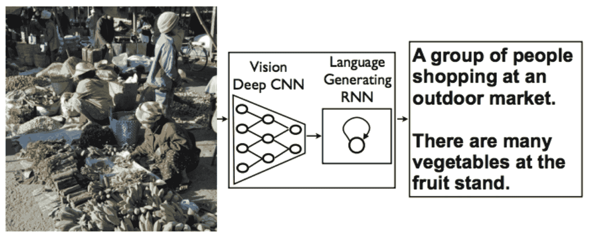

# 第三章：图像的描述生成

图像描述生成是深度学习领域最重要的应用之一，近年来获得了相当大的关注。图像描述模型结合了视觉信息和自然语言处理。

本章我们将学习：

+   图像描述生成领域的最新进展

+   图像描述生成的工作原理

+   图像描述生成模型的实现

# 什么是图像描述生成？

图像描述生成是用自然语言描述图像的任务。以前，描述生成模型是基于物体检测模型与模板的组合，这些模板用于为检测到的物体生成文本。随着深度学习的进步，这些模型已经被卷积神经网络和循环神经网络的组合所取代。

以下是一个示例：



来源：[`arxiv.org/pdf/1609.06647.pdf`](https://arxiv.org/pdf/1609.06647.pdf)

有多个数据集帮助我们创建图像描述模型。

# 探索图像描述数据集

有多个数据集可用于图像描述任务。这些数据集通常通过向几个人展示一张图片，并要求他们分别写出一段关于该图片的描述来准备。通过这种方法，同一张图片会生成多个描述。拥有多个描述选项有助于更好的泛化能力。难点在于模型性能的排序。每次生成后，最好由人类来评估描述。对于这个任务，自动评估是困难的。让我们来探索一下`Flickr8`数据集。

# 下载数据集

`Flickr8`数据集来自 Flickr，禁止用于商业用途。你可以从[`forms.illinois.edu/sec/1713398`](https://forms.illinois.edu/sec/1713398)下载`Flickr8`数据集。描述可以在[`nlp.cs.illinois.edu/HockenmaierGroup/8k-pictures.html`](http://nlp.cs.illinois.edu/HockenmaierGroup/8k-pictures.html)找到。请分别下载文本和图片。通过填写页面上的表格，你可以获取访问权限：


下载链接将通过电子邮件发送。下载并解压后，文件应该是这样的：

```py
Flickr8k_text
CrowdFlowerAnnotations.txt
Flickr_8k.devImages.txt
ExpertAnnotations.txt
Flickr_8k.testImages.txt
Flickr8k.lemma.token.txt
Flickr_8k.trainImages.txt
Flickr8k.token.txt readme.txt
```

以下是数据集中给出的几个示例：


上图显示了以下组件：

+   一名穿着街头赛车盔甲的男子正在检查另一名赛车手的摩托车轮胎

+   两名赛车手骑着白色自行车沿着道路行驶

+   两名摩托车手正骑着一辆设计奇特且颜色鲜艳的车辆

+   两个人在小型赛车中驾驶，驶过绿色的山丘

+   两名穿着赛车服的人员在街车中

以下是第二个示例：


上图显示了以下组件：

+   一名穿着黑色连帽衫和牛仔裤的男子在扶手上滑板

+   一名男子正在滑板沿着一根陡峭的栏杆下滑，旁边有一些台阶

+   一个人正在用滑雪板滑下一个砖制栏杆

+   一个人正走下靠近台阶的砖制栏杆

+   一名滑雪者正在没有雪的栏杆上滑行

如你所见，对于一张图像提供了不同的标题。这些标题展示了图像标题生成任务的难度。

# 将单词转化为嵌入

英文单词必须转换为嵌入才能生成标题。嵌入其实就是单词或图像的向量或数值表示。如果将单词转换为向量形式，则可以使用向量进行运算。

这种嵌入可以通过两种方法进行学习，如下图所示：


**CBOW**方法通过预测给定上下文单词来学习嵌入。**Skip-gram**方法则是给定一个单词，预测其上下文单词，是**CBOW**的逆过程。基于历史数据，可以训练目标单词，如下图所示：


一旦训练完成，嵌入可以如下所示进行可视化：


单词的可视化

这种类型的嵌入可以用来执行单词的向量运算。单词嵌入的概念在本章中将会非常有帮助。

# 图像标题生成方法

有几种方法可以进行图像标题生成。早期的方法是基于图像中的物体和属性来构建句子。后来，**循环神经网络**（**RNN**）被用来生成句子。最准确的方法是使用注意力机制。让我们在本节中详细探讨这些技术和结果。

# 条件随机场

最初尝试了一种方法，使用**条件随机场**（**CRF**）通过图像中检测到的物体和属性构建句子。此过程的步骤如下所示：


示例图像的系统流程（来源：[`www.tamaraberg.com/papers/generation_cvpr11.pdf`](http://www.tamaraberg.com/papers/generation_cvpr11.pdf)）

**CRF** 在生成连贯句子方面的能力有限。生成的句子的质量不高，如以下截图所示：


尽管已经正确地获取了物体和属性，但这里展示的句子仍然过于结构化。

Kulkarni 等人在论文 [`www.tamaraberg.com/papers/generation_cvpr11.pdf`](http://www.tamaraberg.com/papers/generation_cvpr11.pdf) 中提出了一种方法，通过从图像中找到物体和属性，利用**条件随机场**（**CRF**）生成文本。

# 卷积神经网络上的循环神经网络

可以将循环神经网络与卷积神经网络特征结合起来生成新的句子。这使得模型能够进行端到端训练。以下是该模型的架构：


LSTM 模型（来源：[`arxiv.org/pdf/1411.4555.pdf`](https://arxiv.org/pdf/1411.4555.pdf)）

使用了多个**LSTM**层来生成期望的结果。以下是该模型生成的一些结果截图：


来源：[`arxiv.org/pdf/1411.4555.pdf`](https://arxiv.org/pdf/1411.4555.pdf)

这些结果优于 CRF 生成的结果。这展示了 LSTM 在生成句子方面的强大能力。

参考：Vinyals 等人在论文中提出了[`arxiv.org/pdf/1411.4555.pdf`](https://arxiv.org/pdf/1411.4555.pdf)，提出了一种端到端可训练的深度学习图像标注方法，其中 CNN 和 RNN 堆叠在一起。

# 标题排序

标题排序是一种从一组标题中选择一个标题的有趣方法。首先，根据图像的特征对其进行排序，并选择相应的标题，如下图所示：


来源：[`papers.nips.cc/paper/4470-im2text-describing-images-using-1-million-captioned-photographs.pdf`](http://papers.nips.cc/paper/4470-im2text-describing-images-using-1-million-captioned-photographs.pdf)

通过使用不同的属性集合，顶部图像可以重新排序。通过获取更多的图像，质量可以大幅提高，正如以下截图所示：


来源：[`papers.nips.cc/paper/4470-im2text-describing-images-using-1-million-captioned-photographs.pdf`](http://papers.nips.cc/paper/4470-im2text-describing-images-using-1-million-captioned-photographs.pdf)

随着数据集中文件数量的增加，结果得到了改善。

要了解更多关于标题排序的信息，请参考：[`papers.nips.cc/paper/4470-im2text-describing-images-using-1-million-captioned-photographs.pdf`](http://papers.nips.cc/paper/4470-im2text-describing-images-using-1-million-captioned-photographs.pdf)

# 密集标注

密集标注是一个问题，即单张图像上有多个标题。以下是该问题的架构：


来源：[`www.cv-foundation.org/openaccess/content_cvpr_2016/papers/Johnson_DenseCap_Fully_Convolutional_CVPR_2016_paper.pdf`](https://www.cv-foundation.org/openaccess/content_cvpr_2016/papers/Johnson_DenseCap_Fully_Convolutional_CVPR_2016_paper.pdf)

该架构产生了良好的结果。

要了解更多，请参考：Johnson 等人在论文中提出了[`www.cv-foundation.org/openaccess/content_cvpr_2016/papers/Johnson_DenseCap_Fully_Convolutional_CVPR_2016_paper.pdf`](https://www.cv-foundation.org/openaccess/content_cvpr_2016/papers/Johnson_DenseCap_Fully_Convolutional_CVPR_2016_paper.pdf)，提出了一种密集标注方法。

# RNN 标注

可将视觉特征与序列学习结合，形成输出。


这是一个生成标题的架构。

详情请参考：Donahue 等人在论文中，[`arxiv.org/pdf/1411.4389.pdf`](https://arxiv.org/pdf/1411.4389.pdf) 提出了**长时记忆卷积神经网络**（**LRCN**）用于图像标题生成任务。

# 多模态标题生成

图像和文本都可以映射到同一个嵌入空间，以生成标题。


需要一个解码器来生成标题。

# 基于注意力的标题生成

对于详细学习，参考：Xu 等人在论文中，[`arxiv.org/pdf/1502.03044.pdf`](https://arxiv.org/pdf/1502.03044.pdf) 提出了使用**注意力机制**的图像标题生成方法。

基于注意力的标题生成最近变得流行，因为它提供了更好的准确度：


这种方法按标题的顺序训练一个注意力模型，从而产生更好的结果：


这是一个带有注意力生成标题的**LSTM**图示：


这里展示了几个示例，并且通过时间序列方式非常好地可视化了对象的展开：


以时间序列方式展开对象

结果非常出色！

# 实现一个标题生成模型

首先，读取数据集并按需要进行转换。导入`os`库并声明数据集所在的目录，如以下代码所示：

```py
import os
annotation_dir = 'Flickr8k_text'

```

接下来，定义一个函数来打开文件并返回文件中的行作为列表：

```py
def read_file(file_name):
    with open(os.path.join(annotation_dir, file_name), 'rb') as file_handle:
        file_lines = file_handle.read().splitlines()
    return file_lines
```

读取训练和测试数据集的图片路径，并加载标题文件：

```py
train_image_paths = read_file('Flickr_8k.trainImages.txt')
test_image_paths = read_file('Flickr_8k.testImages.txt')
captions = read_file('Flickr8k.token.txt')

print(len(train_image_paths))
print(len(test_image_paths))
print(len(captions))
```

这应该打印出以下内容：

```py
6000
1000
40460
```

接下来，需要生成图像到标题的映射。这将帮助训练中更方便地查找标题。此外，标题数据集中独特的词汇有助于创建词汇表：

```py
image_caption_map = {}
unique_words = set()
max_words = 0
for caption in captions:
    image_name = caption.split('#')[0]
    image_caption = caption.split('#')[1].split('\t')[1]
    if image_name not in image_caption_map.keys():
        image_caption_map[image_name] = [image_caption]
    else:
        image_caption_map[image_name].append(image_caption)
    caption_words = image_caption.split()
    max_words = max(max_words, len(caption_words))
    [unique_words.add(caption_word) for caption_word in caption_words]
```

现在，需要生成两个映射。一个是词到索引，另一个是索引到词的映射：

```py
unique_words = list(unique_words)
word_to_index_map = {}
index_to_word_map = {}
for index, unique_word in enumerate(unique_words):
    word_to_index_map[unique_word] = index
    index_to_word_map[index] = unique_word
print(max_words)
```

标题中出现的最大词数为 38，这将有助于定义架构。接下来，导入所需的库：

```py
from data_preparation import train_image_paths, test_image_paths
from keras.applications.vgg16 import VGG16
from keras.preprocessing import image
from keras.applications.vgg16 import preprocess_input
import numpy as np
from keras.models import Model
import pickle
import os
```

现在创建`ImageModel`类来加载带有权重的 VGG 模型：

```py
class ImageModel:
    def __init__(self):
        vgg_model = VGG16(weights='imagenet', include_top=True)
        self.model = Model(input=vgg_model.input,
                           output=vgg_model.get_layer('fc2').output)
```

权重已下载并存储。第一次尝试时可能需要一些时间。接下来，创建一个单独的模型，以便预测第二个全连接层。以下是从路径读取图像并进行预处理的方法：

```py
    @staticmethod
    def load_preprocess_image(image_path):
        image_array = image.load_img(image_path, target_size=(224, 224))
        image_array = image.img_to_array(image_array)
        image_array = np.expand_dims(image_array, axis=0)
        image_array = preprocess_input(image_array)
        return image_array
```

接下来，定义一个方法来加载图像并进行预测。预测的第二个全连接层可以重新调整为`4096`：

```py
    def extract_feature_from_imagfe_path(self, image_path):
        image_array = self.load_preprocess_image(image_path)
        features = self.model.predict(image_array)
        return features.reshape((4096, 1))
```

遍历图片路径列表并创建特征列表：

```py
    def extract_feature_from_image_paths(self, work_dir, image_names):
        features = []
        for image_name in image_names:
            image_path = os.path.join(work_dir, image_name)
            feature = self.extract_feature_from_image_path(image_path)
            features.append(feature)
        return features
```

接下来，将提取的特征存储为 pickle 文件：

```py
    def extract_features_and_save(self, work_dir, image_names, file_name):
        features = self.extract_feature_from_image_paths(work_dir, image_names)
        with open(file_name, 'wb') as p:
            pickle.dump(features, p)
```

接下来，初始化类并提取训练和测试图片特征：

```py
I = ImageModel()
I.extract_features_and_save(b'Flicker8k_Dataset',train_image_paths, 'train_image_features.p')
I.extract_features_and_save(b'Flicker8k_Dataset',test_image_paths, 'test_image_features.p')
```

导入构建模型所需的层：

```py
from data_preparation import get_vocab
from keras.models import Sequential
from keras.layers import LSTM, Embedding, TimeDistributed, Dense, RepeatVector, Merge, Activation, Flatten
from keras.preprocessing import image, sequence
```

获取所需的词汇表：

```py
image_caption_map, max_words, unique_words, \
word_to_index_map, index_to_word_map = get_vocab()
vocabulary_size = len(unique_words)
```

对于最终的标题生成模型：

```py
image_model = Sequential()
image_model.add(Dense(128, input_dim=4096, activation='relu'))
image_model.add(RepeatVector(max_words))
```

对于语言，创建一个模型：

```py
lang_model = Sequential()
lang_model.add(Embedding(vocabulary_size, 256, input_length=max_words))
lang_model.add(LSTM(256, return_sequences=True))
lang_model.add(TimeDistributed(Dense(128)))
```

两种不同的模型被合并以形成最终模型：

```py
model = Sequential()
model.add(Merge([image_model, lang_model], mode='concat'))
model.add(LSTM(1000, return_sequences=False))
model.add(Dense(vocabulary_size))
model.add(Activation('softmax'))
model.compile(loss='categorical_crossentropy', optimizer='rmsprop', metrics=['accuracy'])
batch_size = 32
epochs = 10
total_samples = 9
model.fit_generator(data_generator(batch_size=batch_size), steps_per_epoch=total_samples / batch_size,
                    epochs=epochs, verbose=2)

```

这个模型可以被训练生成描述。

# 概述

在本章中，我们学习了图像描述技术。首先，我们理解了词向量的嵌入空间。然后，我们学习了几种图像描述的方法。接着，开始了图像描述模型的实现。

在下一章，我们将探讨**生成对抗网络**（**GAN**）的概念。GAN 非常有趣，并且在生成各种用途的图像方面非常有用。
