# 第四章：构建用于条件图像生成的 GAN

Facebook AI 的总监 Yann LeCun 最近表示：“*生成对抗网络是过去十年机器学习领域最有趣的想法*”，这一观点无疑得到了学术界对这一深度学习解决方案日益关注的验证。如果你查看最近的深度学习论文（同时也可以看看 LinkedIn 或 Medium 上关于该话题的领先趋势），你会发现 GAN 的变种已经被大量生产出来。

你可以通过浏览 Hindu Puravinash 不断更新的参考表格，来了解 GAN 世界已经变成了一个什么样的*动物园*，该表格可以在[`github.com/hindupuravinash/the-gan-zoo/blob/master/gans.tsv`](https://github.com/hindupuravinash/the-gan-zoo/blob/master/gans.tsv)找到，或者通过研究 Zheng Liu 准备的 GAN 时间线，时间线可以在[`github.com/dongb5/GAN-Timeline`](https://github.com/dongb5/GAN-Timeline)找到，帮助你将一切放入时间框架中。

GAN 具备激发想象力的能力，因为它们不仅能展示 AI 的计算能力，还能展现 AI 的创造力。在本章中，我们将：

+   通过提供所有必要的概念来揭开 GAN 的神秘面纱，帮助你理解 GAN 是什么、它们目前能做什么以及未来能做什么

+   展示如何基于示例图像的初始分布生成图像（即所谓的无监督 GAN）

+   解释如何为 GAN 设置条件，以便它们生成你期望的图像类型

+   设置一个基本但完整的项目，可以处理不同的数据集，例如手写字符和图标

+   提供基本指导，教你如何在云端（特别是在 Amazon AWS 上）训练你的 GAN

GAN 的成功除了取决于你所使用的特定神经网络架构外，还与它们面临的问题以及你提供的数据密切相关。我们为本章选择的数据集应该能够提供令人满意的结果。我们希望你能享受并从 GAN 的创造力中获得灵感！

# 介绍 GAN

我们将从一些相当近期的历史开始，因为 GAN 是你在 AI 和深度学习领域找到的最新想法之一。

一切始于 2014 年，当时 Ian Goodfellow 和他的同事们（包括 Yoshua Bengio 也在贡献者名单上）在蒙特利尔大学的*计算机科学与运筹学系*发表了关于**生成对抗网络**（**GANs**）的论文，这是一种能够基于一组初始示例生成新数据的框架：

*GOODFELLOW*，Ian 等。生成对抗网络。在：*神经信息处理系统的进展*，2014 年，第 2672-2680 页：[`arxiv.org/abs/1406.2661`](https://arxiv.org/abs/1406.2661)。

这些网络生成的初始图像令人惊讶，考虑到之前使用马尔可夫链的尝试远未达到可信的程度。在图像中，你可以看到论文中提出的一些例子，展示了从 MNIST、**多伦多面部数据集**（**TFD**）——一个非公开数据集以及 CIFAR-10 数据集中复制的示例：

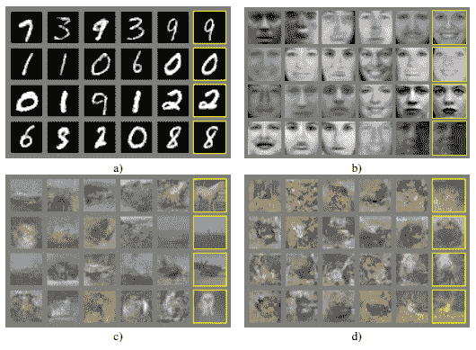

图 1：第一篇关于 GAN 的论文中，使用不同数据集生成新图像的样本：a) MNIST b) TFD c) 和 d) CIFAR-10

来源：*GOODFELLOW*，Ian 等。生成对抗网络。在：*神经信息处理系统进展*。2014 年，第 2672-2680 页

这篇论文被认为相当创新，因为它将深度神经网络和博弈论结合在一个非常聪明的架构中，而这个架构并不需要太多除了常规的反向传播来进行训练。GANs 是生成模型，这些模型能够生成数据，因为它们已经学习到并刻画了一个模型分布（例如它们已经学习了这个分布）。因此，当它们生成某些东西时，就像是从这个分布中进行采样一样。

# 关键在于对抗性方法

理解 GANs 为什么能成为如此成功的生成模型的关键就在于“对抗”一词。实际上，GANs 的架构由两个独立的网络组成，这两个网络通过各自错误的聚合来优化，这个过程被称为**对抗过程**。

你从一个真实的数据集开始，假设它叫做 R，包含你的图像或其他类型的数据（尽管 GANs 主要应用于图像，但它们并不限于图像）。然后你设置一个生成器网络 G，它尝试生成看起来像真实数据的假数据，并设置一个判别器 D，其作用是将 G 生成的数据与真实数据 R 混合，比较并判断哪个是原始数据，哪个是伪造的。

Goodfellow 用伪造艺术家的隐喻来描述这个过程，其中生成器是伪造者，判别器是侦探（或艺术评论家），必须揭露伪造行为。伪造者和侦探之间存在一种挑战，因为伪造者必须变得更加熟练，以避免被侦探发现，而侦探则必须提高识别伪造品的能力。一切都变成了伪造者和侦探之间的无休止斗争，直到伪造的物品与原物完全相似。当 GANs 过拟合时，实际上它们只是复制了原始数据。这似乎是在解释一个竞争性市场，实际上也是如此，因为这个概念来源于竞争博弈理论。

在 GAN 中，生成器的目标是生成让判别器无法判断真伪的图像。生成器的一种显而易见的解决方案是简单地复制某些训练图像，或者选择一些看似能成功欺骗判别器的图像。一个解决方案是*单边标签平滑*，这是我们在项目中将应用的技术。该技术在 SALIMANS, Tim 等人所著的《训练 GAN 的改进技术》中进行了描述。书中出现在<q>Advances in Neural Information Processing Systems</q><q>，2016 年，2234-2242 页</q>： [`arxiv.org/abs/1606.03498`](https://arxiv.org/abs/1606.03498)。

让我们更详细地讨论一下实际是如何工作的。最初，生成器*G*毫无头绪，生成完全随机的数据（实际上它从未见过任何原始数据），因此它会受到判别器*D*的惩罚——*D*非常容易区分真假数据。*G*承担了全部责任，开始尝试不同的方法，以获得来自*D*的更好反馈。这个过程是完全随机的，因为生成器看到的唯一数据是一个随机输入*Z*，它从未接触过真实数据。经过多次试错后，在判别器的提示下，生成器最终弄明白该做什么，并开始生成可信的输出。最终，随着时间的推移，生成器将完美复制所有原始数据，甚至从未见过任何一个原始样本：

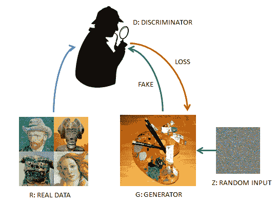

图 2：展示了一个简单的 GAN 架构如何工作

# 一次寒武纪大爆发

正如前面提到的，每个月都会有关于 GAN 的新论文发布（你可以查看我们在本章开头提到的 Hindu Puravinash 制作的参考表）。

无论如何，除了 Goodfellow 及其同事最初论文中描述的基础实现外，最值得注意的实现是**深度卷积生成对抗网络（DCGANs）**和**条件生成对抗网络（CGANs）**。

+   DCGAN 是基于 CNN 架构的 GAN（<q>RADFORD, Alec; METZ, Luke; CHINTALA, Soumith. 使用深度卷积生成对抗网络进行无监督表示学习. arXiv 预印本 arXiv:1511.06434</q><q>, 2015</q>: [`arxiv.org/abs/1511.06434`](https://arxiv.org/abs/1511.06434)）。

+   CGAN 是条件化的 DCGAN，依赖于某些输入标签，因此可以生成具有特定所需特征的图像（<q>MIRZA, Mehdi; OSINDERO, Simon. 条件生成对抗网络. arXiv 预印本 arXiv:1411.1784</q><q>, 2014</q>: [`arxiv.org/abs/1411.1784`](https://arxiv.org/abs/1411.1784)）。我们的项目将编写一个`CGAN`类，并在不同数据集上训练它，以验证其功能。

但也有其他有趣的例子（这些并未包含在我们的项目中），它们提供了与图像创建或改善相关的实际解决方案：

+   CycleGAN 将一张图像转换为另一张图像（经典例子是马变成斑马：<q>ZHU, Jun-Yan, et al. Unpaired image-to-image translation using cycle-consistent adversarial networks. arXiv 预印本 arXiv:1703.10593</q><q>, 2017</q>: [`arxiv.org/abs/1703.10593`](https://arxiv.org/abs/1703.10593)）

+   StackGAN 通过描述图像的文本生成逼真的图像（<q>ZHANG, Han, et al. Stackgan: Text to photo-realistic image synthesis with stacked generative adversarial networks. arXiv 预印本 arXiv:1612.03242</q><q>, 2016</q>: [`arxiv.org/abs/1612.03242`](https://arxiv.org/abs/1612.03242)）

+   Discovery GAN（DiscoGAN）将一种图像的风格元素转移到另一张图像上，从而将纹理和装饰从一种时尚物品（例如包包）转移到另一种时尚物品（例如鞋子）上（<q>KIM, Taeksoo, et al. Learning to discover cross-domain relations with generative adversarial networks. arXiv 预印本 arXiv:1703.05192</q><q>, 2017</q>: [`arxiv.org/abs/1703.05192`](https://arxiv.org/abs/1703.05192)）

+   SRGAN 能够将低质量图像转换为高分辨率图像（<q>LEDIG, Christian, et al. Photo-realistic single image super-resolution using a generative adversarial network. arXiv 预印本 arXiv:1609.04802</q><q>, 2016</q>: [`arxiv.org/abs/1609.04802`](https://arxiv.org/abs/1609.04802)）

# DCGAN

DCGAN 是 GAN 架构的首次相关改进。DCGAN 始终能够成功完成训练阶段，并且在足够的训练周期和示例下，通常能够生成令人满意的输出。这使得它们很快成为了 GAN 的基准，并帮助产生了一些令人惊叹的成就，比如从已知的宝可梦生成新的宝可梦：[`www.youtube.com/watch?v=rs3aI7bACGc`](https://www.youtube.com/watch?v=rs3aI7bACGc)，或者创造出实际上从未存在过但极其真实的名人面孔（毫无诡异感），正如 NVIDIA 所做的：[`youtu.be/XOxxPcy5Gr4`](https://youtu.be/XOxxPcy5Gr4)，使用一种新的训练方法叫做**逐步生长**：[`research.nvidia.com/sites/default/files/publications/karras2017gan-paper.pdf`](http://research.nvidia.com/sites/default/files/publications/karras2017gan-paper.pdf)。它们的根基在于使用深度学习监督网络中用于图像分类的相同卷积操作，并且它们使用了一些聪明的技巧：

+   两个网络中都使用批量归一化

+   无完全隐藏连接层

+   无池化，仅使用步幅卷积

+   ReLU 激活函数

# 条件 GAN

在**条件 GANs**（**CGANs**）中，添加特征向量可以控制输出，并为生成器提供更好的指导，帮助其弄清楚该做什么。这样的特征向量可以编码图像应来源于哪个类别（如果我们试图创建虚构演员的面部图像，可以是女性或男性的图像），甚至可以是我们期望图像具备的一组特定特征（对于虚构演员，可能是发型、眼睛或肤色等）。这一技巧是通过将信息融入到需要学习的图像和*Z*输入中实现的，而*Z*输入不再是完全随机的。判别器的评估不仅仅是基于假数据与真实数据的相似度，还会基于假数据图像与其输入标签（或特征）的一致性进行评估。

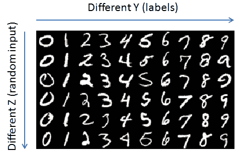

图 3：将 Z 输入与 Y 输入（标签特征向量）结合，允许生成受控图像

# 项目

导入正确的库是我们的起点。除了`tensorflow`，我们还将使用`numpy`和 math 进行计算，`scipy`、`matplolib`用于图像和图形处理，`warnings`、`random`和`distutils`则为特定操作提供支持：

```py
import numpy as np
import tensorflow as tf
import math
import warnings
import matplotlib.pyplot as plt
from scipy.misc import imresize
from random import shuffle
from distutils.version import LooseVersion
```

# 数据集类

我们的第一步是提供数据。我们将依赖已预处理的数据集，但读者可以使用不同类型的图像进行他们自己的 GAN 实现。我们的想法是保持一个独立的`Dataset`类，该类负责为我们稍后构建的 GAN 类提供规范化和重塑后的图像批次。

在初始化时，我们将处理图像及其标签（如果有的话）。首先，图像会被重塑（如果其形状与实例化类时定义的形状不同），然后进行打乱。打乱有助于 GANs 更好地学习，如果数据集一开始就按某种顺序（例如按类别）排列，打乱会更有效——这实际上对任何基于随机梯度下降的机器学习算法都是成立的：<q>BOTTOU, Léon. 随机梯度下降技巧. 在: Neural networks: Tricks of the trade</q><q>。Springer，柏林，海德堡，2012 年，第 421-436 页</q>: [`www.microsoft.com/en-us/research/wp-content/uploads/2012/01/tricks-2012.pdf`](https://www.microsoft.com/en-us/research/wp-content/uploads/2012/01/tricks-2012.pdf)。标签则使用独热编码进行编码，即为每个类别创建一个二进制变量，该变量被设置为 1（而其他变量为 0），以向量的形式表示标签。

例如，如果我们的类别是`{dog:0, cat:1}`，我们将使用这两个独热编码向量来表示它们：`{dog:[1, 0], cat:[0, 1]}`。

这样，我们可以轻松地将向量添加到我们的图像中，作为一个额外的通道，并在其中铭刻某种视觉特征，供我们的 GAN 复制。此外，我们还可以排列这些向量，以便铭刻更复杂的类别，并赋予其特殊特征。例如，我们可以指定一个我们希望生成的类别的代码，也可以指定一些它的特征：

```py
class Dataset(object):
    def __init__(self, data, labels=None, width=28, height=28, 
                                    max_value=255, channels=3):
        # Record image specs
        self.IMAGE_WIDTH = width
        self.IMAGE_HEIGHT = height
        self.IMAGE_MAX_VALUE = float(max_value)
        self.CHANNELS = channels
        self.shape = len(data), self.IMAGE_WIDTH, 
                                self.IMAGE_HEIGHT, self.CHANNELS
        if self.CHANNELS == 3:
            self.image_mode = 'RGB'
            self.cmap = None
        elif self.CHANNELS == 1:
            self.image_mode = 'L'
            self.cmap = 'gray'

        # Resize if images are of different size
        if data.shape[1] != self.IMAGE_HEIGHT or \
                            data.shape[2] != self.IMAGE_WIDTH:
            data = self.image_resize(data, 
                   self.IMAGE_HEIGHT, self.IMAGE_WIDTH)

        # Store away shuffled data
        index = list(range(len(data)))
        shuffle(index)
        self.data = data[index]

        if len(labels) > 0:
            # Store away shuffled labels
            self.labels = labels[index]
            # Enumerate unique classes
            self.classes = np.unique(labels)
            # Create a one hot encoding for each class
            # based on position in self.classes
            one_hot = dict()
            no_classes = len(self.classes)
            for j, i in enumerate(self.classes):
                one_hot[i] = np.zeros(no_classes)
                one_hot[i][j] = 1.0
            self.one_hot = one_hot
        else:
            # Just keep label variables as placeholders
            self.labels = None
            self.classes = None
            self.one_hot = None

    def image_resize(self, dataset, newHeight, newWidth):
        """Resizing an image if necessary"""
        channels = dataset.shape[3]
        images_resized = np.zeros([0, newHeight, 
                         newWidth, channels], dtype=np.uint8)
        for image in range(dataset.shape[0]):
            if channels == 1:
                temp = imresize(dataset[image][:, :, 0],
                               [newHeight, newWidth], 'nearest')
                temp = np.expand_dims(temp, axis=2)
            else:
                temp = imresize(dataset[image], 
                               [newHeight, newWidth], 'nearest')
            images_resized = np.append(images_resized, 
                            np.expand_dims(temp, axis=0), axis=0)
        return images_resized
```

`get_batches` 方法将只释放数据集的一个批次子集，并通过将像素值除以最大值（256）并减去 -0.5 来规范化数据。结果图像的浮动值将在区间 [-0.5, +0.5] 内：

```py
def get_batches(self, batch_size):
    """Pulling batches of images and their labels"""
    current_index = 0
    # Checking there are still batches to deliver
    while current_index < self.shape[0]:
        if current_index + batch_size > self.shape[0]:
            batch_size = self.shape[0] - current_index
        data_batch = self.data[current_index:current_index \
                               + batch_size]
        if len(self.labels) > 0:
            y_batch = np.array([self.one_hot[k] for k in \
            self.labels[current_index:current_index +\
            batch_size]])
        else:
            y_batch = np.array([])
        current_index += batch_size
        yield (data_batch / self.IMAGE_MAX_VALUE) - 0.5, y_batch
```

# CGAN 类

`CGAN` 类包含了运行基于 `CGAN` 模型的条件 GAN 所需的所有函数。深度卷积生成对抗网络已被证明能够生成接近照片质量的输出。我们之前已经介绍了 CGAN，因此提醒大家，它们的参考论文是：

RADFORD, Alec; METZ, Luke; CHINTALA, Soumith. 无监督表示学习与深度卷积生成对抗网络。arXiv 预印本 arXiv:1511.06434, 2015，链接：[`arxiv.org/abs/1511.06434`](https://arxiv.org/abs/1511.06434)。

在我们的项目中，我们将添加条件形式的 `CGAN`，它使用标签信息，就像在监督学习任务中一样。使用标签并将其与图像整合（这就是技巧）将生成更好的图像，并且可以决定生成图像的特征。

条件 GAN 的参考论文是：

MIRZA, Mehdi; OSINDERO, Simon. *条件生成对抗网络*。arXiv 预印本 arXiv:1411.1784, 2014，链接：[`arxiv.org/abs/1411.1784`](https://arxiv.org/abs/1411.1784)。

我们的 `CGAN` 类需要作为输入的一个数据集类对象、训练的 epoch 数量、图像 `batch_size`、用于生成器的随机输入维度 (`z_dim`)，以及一个 GAN 的名称（用于保存）。它还可以使用不同的 alpha 和 smooth 值进行初始化。我们稍后会讨论这两个参数如何影响 GAN 网络。

实例化设置了所有内部变量，并对系统进行性能检查，如果未检测到 GPU，则会发出警告：

```py
class CGan(object):
    def __init__(self, dataset, epochs=1, batch_size=32, 
                 z_dim=96, generator_name='generator',
                 alpha=0.2, smooth=0.1, 
                 learning_rate=0.001, beta1=0.35):

        # As a first step, checking if the 
        # system is performing for GANs
        self.check_system()

        # Setting up key parameters
        self.generator_name = generator_name
        self.dataset = dataset
        self.cmap = self.dataset.cmap
        self.image_mode = self.dataset.image_mode
        self.epochs = epochs
        self.batch_size = batch_size
        self.z_dim = z_dim
        self.alpha = alpha
        self.smooth = smooth
        self.learning_rate = learning_rate
        self.beta1 = beta1
        self.g_vars = list()
        self.trained = False

    def check_system(self):
        """
        Checking system suitability for the project
        """
        # Checking TensorFlow version >=1.2
        version = tf.__version__
        print('TensorFlow Version: %s' % version)

        assert LooseVersion(version) >= LooseVersion('1.2'),\
        ('You are using %s, please use TensorFlow version 1.2 \
                                         or newer.' % version)

        # Checking for a GPU
        if not tf.test.gpu_device_name():
            warnings.warn('No GPU found installed on the system.\
                           It is advised to train your GAN using\
                           a GPU or on AWS')
        else:
            print('Default GPU Device: %s' % tf.test.gpu_device_name())
```

`instantiate_inputs` 函数为输入（包括真实和随机输入）创建 TensorFlow 占位符。它还提供标签（作为与原图像形状相同但通道深度等于类别数量的图像进行处理），以及训练过程的学习率：

```py
    def instantiate_inputs(self, image_width, image_height,
                           image_channels, z_dim, classes):
        """
        Instantiating inputs and parameters placeholders:
        real input, z input for generation, 
        real input labels, learning rate
        """
        inputs_real = tf.placeholder(tf.float32, 
                       (None, image_width, image_height,
                        image_channels), name='input_real')
        inputs_z = tf.placeholder(tf.float32, 
                       (None, z_dim + classes), name='input_z')
        labels = tf.placeholder(tf.float32, 
                        (None, image_width, image_height,
                         classes), name='labels')
        learning_rate = tf.placeholder(tf.float32, None)
        return inputs_real, inputs_z, labels, learning_rate
```

接下来，我们开始着手网络架构的工作，定义一些基本函数，如 `leaky_ReLU_activation` 函数（我们将在生成器和判别器中都使用它，这与原始深度卷积 GAN 论文中所规定的相反）：

```py
 def leaky_ReLU_activation(self, x, alpha=0.2):
     return tf.maximum(alpha * x, x)

 def dropout(self, x, keep_prob=0.9):
     return tf.nn.dropout(x, keep_prob)
```

我们接下来的函数表示一个判别器层。它使用 Xavier 初始化创建卷积，对结果进行批量归一化，设置一个`leaky_ReLU_activation`，最后应用`dropout`进行正则化：

```py
    def d_conv(self, x, filters, kernel_size, strides,
               padding='same', alpha=0.2, keep_prob=0.5,
               train=True):
        """
        Discriminant layer architecture
        Creating a convolution, applying batch normalization,     
        leaky rely activation and dropout
        """
        x = tf.layers.conv2d(x, filters, kernel_size, 
                          strides, padding, kernel_initializer=\
                          tf.contrib.layers.xavier_initializer())
        x = tf.layers.batch_normalization(x, training=train)
        x = self.leaky_ReLU_activation(x, alpha)
        x = self.dropout(x, keep_prob)
        return x
```

Xavier 初始化确保卷积的初始权重既不太小，也不太大，以便从初期阶段开始，信号可以更好地在网络中传输。

Xavier 初始化提供了一个均值为零的高斯分布，其方差由 1.0 除以输入层神经元的数量给出。正是由于这种初始化方式，深度学习摆脱了以前用于设定初始权重的预训练技术，这些技术能够即使在存在许多层的情况下，也能传递反向传播。你可以在这篇文章中了解更多内容，关于 Glorot 和 Bengio 的初始化变体：[`andyljones.tumblr.com/post/110998971763/an-explanation-of-xavier-initialization.`](http://andyljones.tumblr.com/post/110998971763/an-explanation-of-xavier-initialization)

批量归一化在这篇论文中有所描述：

IOFFE, Sergey; SZEGEDY, Christian. 批量归一化：通过减少内部协变量偏移加速深度网络训练。来源：*国际机器学习会议*，2015 年，p. 448-456。

正如作者所指出的，批量归一化算法用于归一化，它处理协变量偏移（[`sifaka.cs.uiuc.edu/jiang4/domain_adaptation/survey/node8.html`](http://sifaka.cs.uiuc.edu/jiang4/domain_adaptation/survey/node8.html)），即输入数据的分布变化，可能导致之前学习到的权重无法正常工作。事实上，由于分布最初是在第一个输入层中学习的，它们会传递到所有后续层，而后续层的分布如果发生了变化（例如，最初你有更多的猫的照片而不是狗的照片，现在正好相反），则可能会很棘手，除非你已经将学习率设置得非常低。

批量归一化解决了输入数据分布变化的问题，因为它通过均值和方差（使用批量统计量）对每个批次进行归一化，正如论文中所示 <q>IOFFE, Sergey; SZEGEDY, Christian</q>。批量归一化：通过减少内部协变量偏移加速深度网络训练。<q>来源：国际机器学习会议，2015 年，p. 448-456</q>（可以通过[`arxiv.org/abs/1502.03167`](https://arxiv.org/abs/1502.03167)在网上找到）。

``g_reshaping `和` g_conv_transpose``是生成器的一部分。它们通过调整输入的形状来操作，无论输入是平坦层还是卷积层。实际上，它们只是反转卷积所做的工作，将卷积生成的特征恢复成原始特征：

```py
    def g_reshaping(self, x, shape, alpha=0.2, 
                    keep_prob=0.5, train=True):
        """
        Generator layer architecture
        Reshaping layer, applying batch normalization, 
        leaky rely activation and dropout
        """
        x = tf.reshape(x, shape)
        x = tf.layers.batch_normalization(x, training=train)
        x = self.leaky_ReLU_activation(x, alpha)
        x = self.dropout(x, keep_prob)
        return x

    def g_conv_transpose(self, x, filters, kernel_size, 
                         strides, padding='same', alpha=0.2, 
                         keep_prob=0.5, train=True):
        """
        Generator layer architecture
        Transposing convolution to a new size, 
        applying batch normalization,
        leaky rely activation and dropout
        """
        x = tf.layers.conv2d_transpose(x, filters, kernel_size,
                                       strides, padding)
        x = tf.layers.batch_normalization(x, training=train)
        x = self.leaky_ReLU_activation(x, alpha)
        x = self.dropout(x, keep_prob)
        return x
```

判别器架构的工作原理是通过将图像作为输入，并通过各种卷积操作将其转换，直到结果被展平并转化为对数值和概率（使用 sigmoid 函数）。实际上，所有操作与常规卷积中的操作相同：

```py
 def discriminator(self, images, labels, reuse=False):
     with tf.variable_scope('discriminator', reuse=reuse):
         # Input layer is 28x28x3 --> concatenating input
         x = tf.concat([images, labels], 3)

         # d_conv --> expected size is 14x14x32
         x = self.d_conv(x, filters=32, kernel_size=5,
                         strides=2, padding='same',
                         alpha=0.2, keep_prob=0.5)

         # d_conv --> expected size is 7x7x64
         x = self.d_conv(x, filters=64, kernel_size=5,
                         strides=2, padding='same',
                         alpha=0.2, keep_prob=0.5)

         # d_conv --> expected size is 7x7x128
         x = self.d_conv(x, filters=128, kernel_size=5,
                         strides=1, padding='same',
                         alpha=0.2, keep_prob=0.5)

         # Flattening to a layer --> expected size is 4096
         x = tf.reshape(x, (-1, 7 * 7 * 128))

         # Calculating logits and sigmoids
         logits = tf.layers.dense(x, 1)
         sigmoids = tf.sigmoid(logits)

         return sigmoids, logits
```

至于生成器，其架构与判别器完全相反。从输入向量`z`开始，首先创建一个密集层，然后通过一系列转置操作重建判别器中的卷积逆过程，最终得到一个与输入图像形状相同的张量，接着通过`tanh`激活函数进行进一步的转换：

```py
    def generator(self, z, out_channel_dim, is_train=True):

        with tf.variable_scope('generator', 
                                reuse=(not is_train)):
            # First fully connected layer
            x = tf.layers.dense(z, 7 * 7 * 512)

            # Reshape it to start the convolutional stack
            x = self.g_reshaping(x, shape=(-1, 7, 7, 512),
                                 alpha=0.2, keep_prob=0.5,
                                 train=is_train)

            # g_conv_transpose --> 7x7x128 now
            x = self.g_conv_transpose(x, filters=256,
                                      kernel_size=5,
                                      strides=2, padding='same',
                                      alpha=0.2, keep_prob=0.5,  
                                      train=is_train)

            # g_conv_transpose --> 14x14x64 now
            x = self.g_conv_transpose(x, filters=128,
                                      kernel_size=5, strides=2,
                                      padding='same', alpha=0.2,
                                      keep_prob=0.5,
                                      train=is_train)

            # Calculating logits and Output layer --> 28x28x5 now
            logits = tf.layers.conv2d_transpose(x,  
                                         filters=out_channel_dim, 
                                         kernel_size=5, 
                                         strides=1, 
                                         padding='same')
            output = tf.tanh(logits)

            return output
```

该架构与 CGAN 论文中介绍的架构非常相似，展示了如何从一个大小为 100 的向量的初始输入重建一个 64 x 64 x 3 的图像：

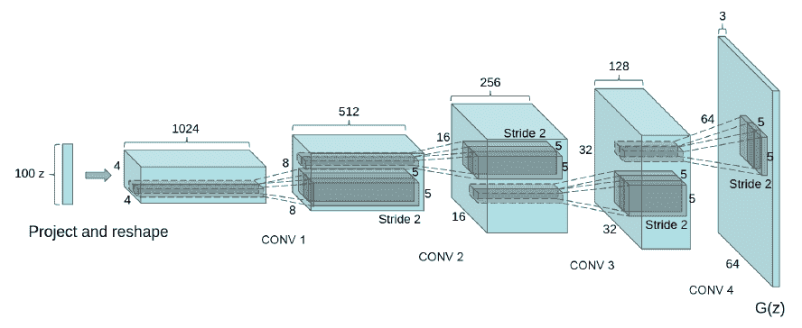

图 4：生成器的 DCGAN 架构。

来源：arXiv, 1511.06434, 2015

在定义了架构之后，损失函数是下一个需要定义的重要元素。它使用两个输出，一个是来自生成器的输出，经过管道传递给判别器并输出对数值，另一个是来自真实图像的输出，直接传递给判别器。对于这两者，都需要计算损失度量。这里，平滑参数非常有用，因为它有助于将真实图像的概率平滑成不是 1.0 的值，从而使 GAN 网络能够更好、更具概率性地学习（如果完全惩罚，假图像可能更难有机会与真实图像竞争）。

最终的判别器损失是简单地将对假图像和真实图像计算的损失相加。假图像的损失通过比较估计的对数值与零的概率来计算。真实图像的损失通过将估计的对数值与平滑后的概率（在我们的例子中是 0.9）进行比较来计算，目的是防止过拟合，并避免判别器仅仅因为记住了真实图像而学习识别它们。生成器的损失则是根据判别器对假图像估计的对数值与 1.0 的概率进行计算的。通过这种方式，生成器应该努力生成被判别器估计为最可能为真的假图像（因此使用较高的概率）。因此，损失从判别器对假图像的评估传递到生成器，形成一个反馈循环：

```py
    def loss(self, input_real, input_z, labels, out_channel_dim):

        # Generating output
        g_output = self.generator(input_z, out_channel_dim)
        # Classifying real input
        d_output_real, d_logits_real = self.discriminator(input_real, labels, reuse=False)
        # Classifying generated output
        d_output_fake, d_logits_fake = self.discriminator(g_output, labels, reuse=True)
        # Calculating loss of real input classification
        real_input_labels = tf.ones_like(d_output_real) * (1 - self.smooth) # smoothed ones
        d_loss_real = tf.reduce_mean(
            tf.nn.sigmoid_cross_entropy_with_logits(logits=d_logits_real,
                                                    labels=real_input_labels))
        # Calculating loss of generated output classification
        fake_input_labels = tf.zeros_like(d_output_fake) # just zeros
        d_loss_fake = tf.reduce_mean(
            tf.nn.sigmoid_cross_entropy_with_logits(logits=d_logits_fake,
                                                    labels=fake_input_labels))
        # Summing the real input and generated output classification losses
        d_loss = d_loss_real + d_loss_fake # Total loss for discriminator
        # Calculating loss for generator: all generated images should have been
        # classified as true by the discriminator
        target_fake_input_labels = tf.ones_like(d_output_fake) # all ones
        g_loss = tf.reduce_mean(
            tf.nn.sigmoid_cross_entropy_with_logits(logits=d_logits_fake,
                                                    labels=target_fake_input_labels))

        return d_loss, g_loss
```

由于 GAN 的工作是视觉性的，因此有一些函数用于可视化生成器当前生成的样本，以及一组特定的图像：

```py
    def rescale_images(self, image_array):
        """
        Scaling images in the range 0-255
        """
        new_array = image_array.copy().astype(float)
        min_value = new_array.min()
        range_value = new_array.max() - min_value
        new_array = ((new_array - min_value) / range_value) * 255
        return new_array.astype(np.uint8)

    def images_grid(self, images, n_cols):
        """
        Arranging images in a grid suitable for plotting
        """
        # Getting sizes of images and defining the grid shape
        n_images, height, width, depth = images.shape
        n_rows = n_images // n_cols
        projected_images = n_rows * n_cols
        # Scaling images to range 0-255
        images = self.rescale_images(images)
        # Fixing if projected images are less
        if projected_images < n_images:
            images = images[:projected_images]
        # Placing images in a square arrangement
        square_grid = images.reshape(n_rows, n_cols, 
                                     height, width, depth)
        square_grid = square_grid.swapaxes(1, 2)
        # Returning a image of the grid
        if depth >= 3:
            return square_grid.reshape(height * n_rows, 
                                       width * n_cols, depth)
        else:
            return square_grid.reshape(height * n_rows, 
                                       width * n_cols)

    def plotting_images_grid(self, n_images, samples):
        """
        Representing the images in a grid
        """
        n_cols = math.floor(math.sqrt(n_images))
        images_grid = self.images_grid(samples, n_cols)
        plt.imshow(images_grid, cmap=self.cmap)
        plt.show()

    def show_generator_output(self, sess, n_images, input_z, 
                              labels, out_channel_dim,
                              image_mode):
        """
        Representing a sample of the 
        actual generator capabilities
        """
        # Generating z input for examples
        z_dim = input_z.get_shape().as_list()[-1]
        example_z = np.random.uniform(-1, 1, size=[n_images, \
                                       z_dim - labels.shape[1]])
        example_z = np.concatenate((example_z, labels), axis=1)
        # Running the generator
        sample = sess.run(
            self.generator(input_z, out_channel_dim, False),
            feed_dict={input_z: example_z})
        # Plotting the sample
        self.plotting_images_grid(n_images, sample)

    def show_original_images(self, n_images):
        """
        Representing a sample of original images
        """
        # Sampling from available images
        index = np.random.randint(self.dataset.shape[0], 
                                  size=(n_images))
        sample = self.dataset.data[index]
        # Plotting the sample
        self.plotting_images_grid(n_images, sample)
```

使用 Adam 优化器，判别器损失和生成器损失都会被减少，首先从判别器开始（建立生成器的输出与真实图像的对比），然后将反馈传递给生成器，基于生成器所生成的假图像对判别器的影响进行评估：

```py
    def optimization(self):
        """
        GAN optimization procedure
        """
        # Initialize the input and parameters placeholders
        cases, image_width, image_height,\
        out_channel_dim = self.dataset.shape
        input_real, input_z, labels, learn_rate = \    
                        self.instantiate_inputs(image_width,
                                               image_height,
                                            out_channel_dim, 
                                                 self.z_dim, 
                                  len(self.dataset.classes))

        # Define the network and compute the loss
        d_loss, g_loss = self.loss(input_real, input_z, 
                                    labels, out_channel_dim)

        # Enumerate the trainable_variables, split into G and D parts
        d_vars = [v for v in tf.trainable_variables() \
                    if v.name.startswith('discriminator')]
        g_vars = [v for v in tf.trainable_variables() \
                    if v.name.startswith('generator')]
        self.g_vars = g_vars

        # Optimize firt the discriminator, then the generatvor
        with tf.control_dependencies(\
                     tf.get_collection(tf.GraphKeys.UPDATE_OPS)):
            d_train_opt = tf.train.AdamOptimizer(               
                                             self.learning_rate,
                   self.beta1).minimize(d_loss, var_list=d_vars)
            g_train_opt = tf.train.AdamOptimizer(
                                             self.learning_rate,
                   self.beta1).minimize(g_loss, var_list=g_vars)

        return input_real, input_z, labels, learn_rate, 
               d_loss, g_loss, d_train_opt, g_train_opt
```

最后，我们完成了整个训练阶段。在训练过程中，有两个部分需要特别注意：

+   优化是如何通过两个步骤进行的：

    1.  运行判别器优化

    1.  在生成器部分工作

+   如何通过将随机输入和真实图像与标签混合的方式预处理图像，从而创建包含图像标签的独热编码信息的额外图层

通过这种方式，类被整合进图像中，既作为输入也作为输出，迫使生成器在生成时也要考虑这些信息，因为如果它生成不真实的图像，即没有正确标签的图像，就会受到惩罚。比如说我们的生成器生成了一只猫的图像，但给它加上了狗的标签。在这种情况下，判别器会惩罚它，因为判别器会注意到生成的猫和真实的猫在标签上有差异：

```py
def train(self, save_every_n=1000):
    losses = []
    step = 0
    epoch_count = self.epochs
    batch_size = self.batch_size
    z_dim = self.z_dim
    learning_rate = self.learning_rate
    get_batches = self.dataset.get_batches
    classes = len(self.dataset.classes)
    data_image_mode = self.dataset.image_mode

    cases, image_width, image_height,\
    out_channel_dim = self.dataset.shape
    input_real, input_z, labels, learn_rate, d_loss,\ 
    g_loss, d_train_opt, g_train_opt = self.optimization()

    # Allowing saving the trained GAN
    saver = tf.train.Saver(var_list=self.g_vars)

    # Preparing mask for plotting progression
    rows, cols = min(5, classes), 5
    target = np.array([self.dataset.one_hot[i] \
             for j in range(cols) for i in range(rows)])

    with tf.Session() as sess:
       sess.run(tf.global_variables_initializer())
       for epoch_i in range(epoch_count):
           for batch_images, batch_labels \
                     in get_batches(batch_size):
                # Counting the steps
                step += 1
                # Defining Z
                batch_z = np.random.uniform(-1, 1, size=\
                                      (len(batch_images), z_dim))
                batch_z = np.concatenate((batch_z,\
                                           batch_labels), axis=1)
                # Reshaping labels for generator
                batch_labels = batch_labels.reshape(batch_size, 1, 1, classes)
                batch_labels = batch_labels * np.ones((batch_size, image_width, image_height, classes))
                # Sampling random noise for G
                batch_images = batch_images * 2
                # Running optimizers
                _ = sess.run(d_train_opt, feed_dict={input_real: batch_images, input_z: batch_z,
                                                         labels: batch_labels, learn_rate: learning_rate})
                _ = sess.run(g_train_opt, feed_dict={input_z: batch_z, input_real: batch_images,
                                                         labels: batch_labels, learn_rate: learning_rate})

                # Cyclic reporting on fitting and generator output
                if step % (save_every_n//10) == 0:
                    train_loss_d = sess.run(d_loss,
                                                {input_z: batch_z, input_real: batch_images, labels: batch_labels})
                    train_loss_g = g_loss.eval({input_z: batch_z, labels: batch_labels})
                    print("Epoch %i/%i step %i..." % (epoch_i + 1, epoch_count, step),
                              "Discriminator Loss: %0.3f..." % train_loss_d,
                              "Generator Loss: %0.3f" % train_loss_g)
                if step % save_every_n == 0:
                    rows = min(5, classes)
                    cols = 5
                    target = np.array([self.dataset.one_hot[i] for j in range(cols) for i in range(rows)])
                    self.show_generator_output(sess, rows * cols, input_z, target, out_channel_dim, data_image_mode)
                    saver.save(sess, './'+self.generator_name+'/generator.ckpt')

            # At the end of each epoch, get the losses and print them out
            try:
                train_loss_d = sess.run(d_loss, {input_z: batch_z, input_real: batch_images, labels: batch_labels})
                train_loss_g = g_loss.eval({input_z: batch_z, labels: batch_labels})
                print("Epoch %i/%i step %i..." % (epoch_i + 1, epoch_count, step),
                         "Discriminator Loss: %0.3f..." % train_loss_d,
                          "Generator Loss: %0.3f" % train_loss_g)
            except:
                train_loss_d, train_loss_g = -1, -1

            # Saving losses to be reported after training
            losses.append([train_loss_d, train_loss_g])

        # Final generator output
        self.show_generator_output(sess, rows * cols, input_z, target, out_channel_dim, data_image_mode)
        saver.save(sess, './' + self.generator_name + '/generator.ckpt')

    return np.array(losses)
```

在训练过程中，网络会不断保存到磁盘上。当需要生成新图像时，你无需重新训练，只需加载网络并指定你希望 GAN 生成的标签即可：

```py
def generate_new(self, target_class=-1, rows=5, cols=5, plot=True):
        """
        Generating a new sample
        """
        # Fixing minimum rows and cols values
        rows, cols = max(1, rows), max(1, cols)
        n_images = rows * cols

        # Checking if we already have a TensorFlow graph
        if not self.trained:
            # Operate a complete restore of the TensorFlow graph
            tf.reset_default_graph()
            self._session = tf.Session()
            self._classes = len(self.dataset.classes)
            self._input_z = tf.placeholder(tf.float32, (None, self.z_dim + self._classes), name='input_z')
            out_channel_dim = self.dataset.shape[3]
            # Restoring the generator graph
            self._generator = self.generator(self._input_z, out_channel_dim)
            g_vars = [v for v in tf.trainable_variables() if v.name.startswith('generator')]
            saver = tf.train.Saver(var_list=g_vars)
            print('Restoring generator graph')
            saver.restore(self._session, tf.train.latest_checkpoint(self.generator_name))
            # Setting trained flag as True
            self.trained = True

        # Continuing the session
        sess = self._session
        # Building an array of examples examples
        target = np.zeros((n_images, self._classes))
        for j in range(cols):
            for i in range(rows):
                if target_class == -1:
                    target[j * cols + i, j] = 1.0
                else:
                    target[j * cols + i] = self.dataset.one_hot[target_class].tolist()
        # Generating the random input
        z_dim = self._input_z.get_shape().as_list()[-1]
        example_z = np.random.uniform(-1, 1, 
                    size=[n_images, z_dim - target.shape[1]])
        example_z = np.concatenate((example_z, target), axis=1)
        # Generating the images
        sample = sess.run(
            self._generator,
            feed_dict={self._input_z: example_z})
        # Plotting
        if plot:
            if rows * cols==1:
                if sample.shape[3] <= 1:
                    images_grid = sample[0,:,:,0]
                else:
                    images_grid = sample[0]
            else:
                images_grid = self.images_grid(sample, cols)
            plt.imshow(images_grid, cmap=self.cmap)
            plt.show()
        # Returning the sample for later usage 
        # (and not closing the session)
        return sample
```

这个类通过`fit`方法完成，该方法接受学习率参数和 beta1（一个 Adam 优化器参数，根据平均一阶矩调整参数的学习率，即均值），并在训练完成后绘制判别器和生成器的损失曲线：

```py
    def fit(self, learning_rate=0.0002, beta1=0.35):
        """
        Fit procedure, starting training and result storage
        """
        # Setting training parameters
        self.learning_rate = learning_rate
        self.beta1 = beta1
        # Training generator and discriminator
        with tf.Graph().as_default():
            train_loss = self.train()
        # Plotting training fitting
        plt.plot(train_loss[:, 0], label='Discriminator')
        plt.plot(train_loss[:, 1], label='Generator')
        plt.title("Training fitting")
        plt.legend()
```

# 将 CGAN 应用于一些示例

现在`CGAN`类已经完成，让我们通过一些示例来提供新的思路，帮助你更好地使用这个项目。首先，我们需要准备好所有必要的资源，包括下载所需的数据和训练我们的 GAN。我们从导入常用库开始：

```py
import numpy as np
import urllib.request
import tarfile
import os
import zipfile
import gzip
import os
from glob import glob
from tqdm import tqdm
```

然后我们加载之前准备好的数据集和`CGAN`类：

```py
from cGAN import Dataset, CGAN
```

`TqdmUpTo`类只是一个`Tqdm`的封装器，它使得进度条显示器也可以用于下载。这个类是直接从项目页面[`github.com/tqdm/tqdm`](https://github.com/tqdm/tqdm)中提取的：

```py
class TqdmUpTo(tqdm):
    """
    Provides `update_to(n)` which uses `tqdm.update(delta_n)`.
    Inspired by https://github.com/pypa/twine/pull/242
    https://github.com/pypa/twine/commit/42e55e06
    """

    def update_to(self, b=1, bsize=1, tsize=None):
        """
        Total size (in tqdm units). 
        If [default: None] remains unchanged.
        """
        if tsize is not None:
            self.total = tsize
        # will also set self.n = b * bsize
        self.update(b * bsize - self.n)
```

最后，如果我们使用的是 Jupyter Notebook（强烈建议在本次展示中使用），你需要启用图像的内联显示：

```py
%matplotlib inline
```

现在我们准备好继续进行第一个示例了。

# MNIST

`MNIST`手写数字数据库由 Yann LeCun 在纽约大学 Courant 研究所时提供，并由 Corinna Cortes（谷歌实验室）和 Christopher J.C. Burges（微软研究院）共同提供。它被认为是从现实世界图像数据中学习的标准数据库，且在预处理和格式化方面所需的努力最小。该数据库包含手写数字，提供了 60,000 个训练样本和 10,000 个测试样本。它实际上是从 NIST 的一个更大数据集中提取的子集。所有数字都已经大小归一化并居中在固定尺寸的图像中：

[`yann.lecun.com/exdb/mnist/`](http://yann.lecun.com/exdb/mnist/)

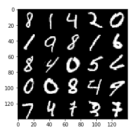

图 5：原始 MNIST 样本有助于理解 CGAN 重建图像的质量。

首先，我们从互联网上上传数据集并将其保存在本地：

```py
labels_filename = 'train-labels-idx1-ubyte.gz'
images_filename = 'train-images-idx3-ubyte.gz'

url = "http://yann.lecun.com/exdb/mnist/"
with TqdmUpTo() as t: # all optional kwargs
    urllib.request.urlretrieve(url+images_filename,  
                               'MNIST_'+images_filename, 
                               reporthook=t.update_to, data=None)
with TqdmUpTo() as t: # all optional kwargs
    urllib.request.urlretrieve(url+labels_filename, 
                               'MNIST_'+labels_filename, 
                               reporthook=t.update_to, data=None)
```

为了学习这一组手写数字，我们应用了 32 张图像的批量，学习率为`0.0002`，`beta1`为`0.35`，`z_dim`为`96`，并进行了`15`轮训练：

```py
labels_path = './MNIST_train-labels-idx1-ubyte.gz'
images_path = './MNIST_train-images-idx3-ubyte.gz'

with gzip.open(labels_path, 'rb') as lbpath:
        labels = np.frombuffer(lbpath.read(), 
                               dtype=np.uint8, offset=8)

with gzip.open(images_path, 'rb') as imgpath:
        images = np.frombuffer(imgpath.read(), dtype=np.uint8,
        offset=16).reshape(len(labels), 28, 28, 1)

batch_size = 32
z_dim = 96
epochs = 16

dataset = Dataset(images, labels, channels=1)
gan = CGAN(dataset, epochs, batch_size, z_dim, generator_name='mnist')

gan.show_original_images(25)
gan.fit(learning_rate = 0.0002, beta1 = 0.35)
```

以下图像展示了 GAN 在第二轮和最后一轮生成的数字样本：

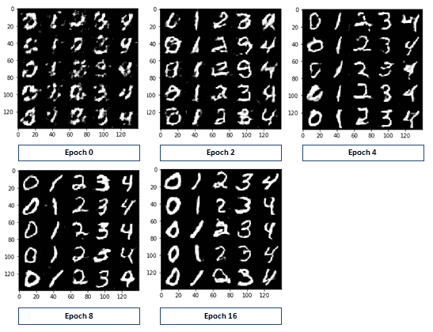

图 6：GAN 的结果随着训练轮次的变化

经过 16 轮训练后，数字看起来已经形成良好，准备使用。然后我们提取了按行排列的所有类别样本。

评估 GAN 的性能通常依赖于人工评估其某些结果，通过观察图像的整体外观或细节来判断图像是否可能是伪造的（像判别器一样）。GAN 缺乏一个客观函数来帮助评估和比较它们，尽管有一些计算技术可以作为评估指标，例如*对数似然*，如<q>THEIS, Lucas; OORD, Aäron van den; BETHGE, Matthias. 关于生成模型评估的笔记. arXiv 预印本 arXiv:1511.01844</q><q>, 2015</q>: [`arxiv.org/abs/1511.01844`](https://arxiv.org/abs/1511.01844)所描述。

我们将保持评价方法简单且经验性，因此我们将使用由训练过的 GAN 生成的图像样本来评估网络的表现，同时尝试检查生成器和判别器的训练损失，以便发现任何特殊趋势：

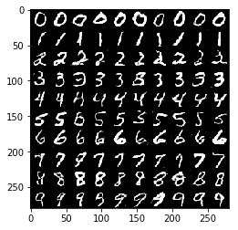

图 7：在 MNIST 上训练后的最终结果样本显示，GAN 网络能够完成这一任务

观察训练拟合图（下图所示），我们可以看到生成器在训练完成时达到了最低误差。判别器在经历了一个先前的峰值后，正在努力恢复到之前的性能值，这表明生成器可能有了突破。我们可以预期，更多的训练周期可能会提高该 GAN 网络的性能，但随着输出质量的提升，所需时间可能会呈指数增长。通常，GAN 收敛的良好指标是生成器和判别器的损失值都呈下降趋势，这一点可以通过对两个损失向量拟合一条线性回归线来推测：


图 8：16 个训练周期内的拟合情况

训练一个出色的 GAN 网络可能需要很长时间和大量的计算资源。通过阅读《纽约时报》近期发布的文章，[`www.nytimes.com/interactive/2018/01/02/technology/ai-generated-photos.html`](https://www.nytimes.com/interactive/2018/01/02/technology/ai-generated-photos.html)，你可以看到来自 NVIDIA 的图表，展示了一个渐进式 GAN 学习名人照片的训练进度。虽然获得一个不错的结果可能只需要几天时间，但要达到惊人的效果至少需要两周。同样地，即使是我们的例子，投入更多的训练周期，结果也会变得更好。

# Zalando MNIST

Fashion `MNIST` 是 Zalando 文章图像的数据集，由 60,000 个训练样本和 10,000 个测试样本组成。与 `MNIST` 类似，每个样本都是一个 28x28 的灰度图像，带有 10 个类别中的一个标签。Zalando Research 的作者们意图将其作为原始 MNIST 数据集的替代品，以更好地评估机器学习算法，因为它比 MNIST 更具挑战性，并且更能代表现实任务中的深度学习（[`twitter.com/fchollet/status/852594987527045120`](https://twitter.com/fchollet/status/852594987527045120)）。

[`github.com/zalandoresearch/fashion-mnist`](https://github.com/zalandoresearch/fashion-mnist)

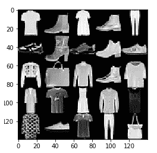

图 9：原始 Zalando 数据集的一个样本

我们分别下载图像和它们的标签：

```py
url = "http://fashion-mnist.s3-website.eu-central-\
       1.amazonaws.com/train-images-idx3-ubyte.gz"
filename = "train-images-idx3-ubyte.gz"
with TqdmUpTo() as t: # all optional kwargs
    urllib.request.urlretrieve(url, filename, 
                               reporthook=t.update_to, data=None)
url = "http://fashion-mnist.s3-website.eu-central-\
       1.amazonaws.com/train-labels-idx1-ubyte.gz"
filename = "train-labels-idx1-ubyte.gz"
_ = urllib.request.urlretrieve(url, filename)
```

为了学习这组图像，我们应用了一个包含 32 张图像的批次，学习率为`0.0002`，`beta1`为`0.35`，`z_dim`为`96`，并进行了`10`个周期的训练：

```py
labels_path = './train-labels-idx1-ubyte.gz'
images_path = './train-images-idx3-ubyte.gz'
label_names = ['t_shirt_top', 'trouser', 'pullover', 
               'dress', 'coat', 'sandal', 'shirt', 
               'sneaker', 'bag', 'ankle_boots']

with gzip.open(labels_path, 'rb') as lbpath:
        labels = np.frombuffer(lbpath.read(), 
                               dtype=np.uint8,
                               offset=8)

with gzip.open(images_path, 'rb') as imgpath:
        images = np.frombuffer(imgpath.read(), dtype=np.uint8,
        offset=16).reshape(len(labels), 28, 28, 1)

batch_size = 32
z_dim = 96
epochs = 64

dataset = Dataset(images, labels, channels=1)
gan = CGAN(dataset, epochs, batch_size, z_dim, generator_name='zalando')

gan.show_original_images(25)
gan.fit(learning_rate = 0.0002, beta1 = 0.35)
```

训练需要很长时间才能完成所有周期，但质量似乎很快会稳定下来，尽管有些问题需要更多周期才能消失（例如衬衫上的孔洞）：

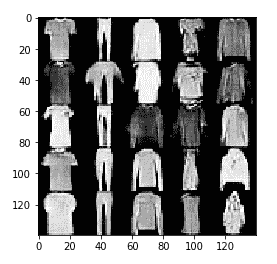

图 10：CGAN 训练过程随周期的演变

这是 64 个 epoch 后的结果：

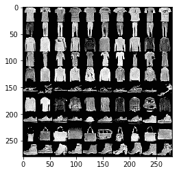

图 11：在 Zalando 数据集上进行 64 个 epoch 后的结果概览

结果完全令人满意，尤其是衣服和男鞋。然而，女鞋似乎更难学习，因为它们比其他图像更小且更精细。

# EMNIST

`EMNIST` 数据集是一组手写字符数字，源自 `NIST` 特别数据库，并转换为 28 x 28 像素的图像格式和数据集结构，直接匹配 `MNIST` 数据集。我们将使用 `EMNIST` Balanced，它是一个每个类别样本数相等的字符集，包含 131,600 个字符，分布在 47 个平衡类别中。你可以在以下位置找到所有与该数据集相关的参考文献：

Cohen, G., Afshar, S., Tapson, J., & van Schaik, A. (2017)。EMNIST：MNIST 的手写字母扩展。检索自 [`arxiv.org/abs/1702.05373`](http://arxiv.org/abs/1702.05373)。

你还可以通过浏览数据集的官方网站，探索关于`EMNIST`的完整信息：[`www.nist.gov/itl/iad/image-group/emnist-dataset`](https://www.nist.gov/itl/iad/image-group/emnist-dataset)。以下是 EMNIST Balanced 中可以找到的字符类型的提取：

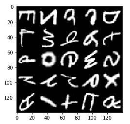

图 11：原始 EMNIST 数据集的示例

```py
url = "http://biometrics.nist.gov/cs_links/EMNIST/gzip.zip"
filename = "gzip.zip"
with TqdmUpTo() as t: # all optional kwargs
    urllib.request.urlretrieve(url, filename,  
                               reporthook=t.update_to, 
                               data=None)
```

从 NIST 网站下载后，我们解压了下载的包：

```py
zip_ref = zipfile.ZipFile(filename, 'r')
zip_ref.extractall('.')
zip_ref.close()
```

在确认解压成功后，我们删除未使用的 ZIP 文件：

```py
if os.path.isfile(filename):
    os.remove(filename)
```

为了学习这组手写数字，我们应用了一个包含 32 张图像的批次，学习率为 `0.0002`，`beta1` 为 `0.35`，`z_dim` 为 `96`，并进行了 10 个 epoch 的训练：

```py
labels_path = './gzip/emnist-balanced-train-labels-idx1-ubyte.gz'
images_path = './gzip/emnist-balanced-train-images-idx3-ubyte.gz'
label_names = []

with gzip.open(labels_path, 'rb') as lbpath:
        labels = np.frombuffer(lbpath.read(), dtype=np.uint8,
         offset=8)

with gzip.open(images_path, 'rb') as imgpath:
        images = np.frombuffer(imgpath.read(), dtype=np.uint8,
                  offset=16).reshape(len(labels), 28, 28, 1)

batch_size = 32
z_dim = 96
epochs = 32

dataset = Dataset(images, labels, channels=1)
gan = CGAN(dataset, epochs, batch_size, z_dim,  
           generator_name='emnist')

gan.show_original_images(25)
gan.fit(learning_rate = 0.0002, beta1 = 0.35)
```

以下是完成 32 个 epoch 训练后的部分手写字母示例：


图 12：在 EMNIST 数据集上训练 CGAN 后的结果概览

对于 MNIST，GAN 可以在合理的时间内学习以准确、可信的方式复制手写字母。

# 重用训练好的 CGAN

训练好一个 CGAN 后，你可能会发现将生成的图像用于其他应用非常有用。方法 `generate_new` 可以用来提取单张图像或一组图像（以便检查特定图像类别的结果质量）。它作用于先前训练好的 `CGan` 类，因此你只需要先将其保存，然后在需要时恢复。

当训练完成后，你可以使用 `pickle` 保存你的 `CGan` 类，命令如下所示：

```py
import pickle
pickle.dump(gan, open('mnist.pkl', 'wb'))
```

在这种情况下，我们已保存了在 MNIST 数据集上训练的 `CGAN`。

在重新启动 Python 会话并清理内存中的任何变量后，你可以再次 `import` 所有类，并恢复已保存的 `CGan`：

```py
from CGan import Dataset, CGan
import pickle
gan = pickle.load(open('mnist.pkl', 'rb'))
```

完成后，设置你希望`CGan`生成的目标类别（在本例中我们要求打印数字`8`），你可以请求生成单个示例、一个 5 x 5 的网格或一个更大的 10 x 10 网格：

```py
nclass = 8
_ = gan.generate_new(target_class=nclass, 
                     rows=1, cols=1, plot=True)
_ = gan.generate_new(target_class=nclass, 
                     rows=5, cols=5, plot=True)
images = gan.generate_new(target_class=nclass,
                     rows=10, cols=10, plot=True)
print(images.shape)
```

如果你只是想获得所有类别的概览，只需将参数`target_class`设置为-1。

在设置目标类别之后，`generate_new`方法被调用三次，最后返回的值存储在`images`变量中，该变量的大小为(100, 28, 28, 1)，包含生成的图像的 Numpy 数组，可以用于我们的目的。每次调用该方法时，都会绘制一个结果网格，如下图所示：

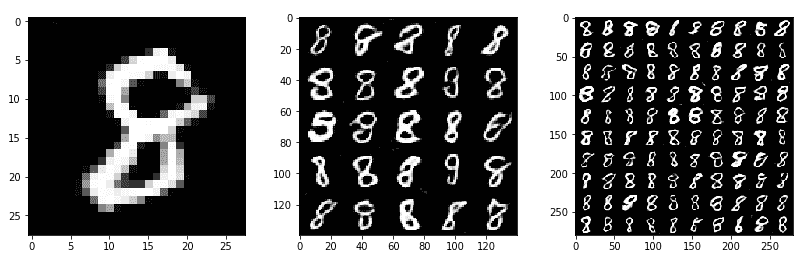

图 13：绘制的网格是生成图像的组合，实际上是一个图像。从左到右，图像的绘制过程是

请求 1 x 1、5 x 5、10 x 10 结果网格。方法返回的真实图像可以重复使用。

如果你不需要`generate_new`来绘制结果，只需将`plot`参数设置为 False：`images = gan.generate_new(target_class=nclass, rows=10, cols=10, plot=False)`。

# 使用 Amazon Web Service

如前所述，强烈建议你使用 GPU 来训练本章中提出的示例。仅使用 CPU 在合理的时间内获得结果几乎是不可能的，甚至使用 GPU 也可能需要长时间等待计算机完成训练。一个需要支付费用的解决方案是使用 Amazon Elastic Compute Cloud，也就是 Amazon EC2 ([`aws.amazon.com/it/ec2/`](https://aws.amazon.com/it/ec2/))，它是**Amazon Web Services**（**AWS**）的一部分。在 EC2 上，你可以启动虚拟服务器，并通过互联网连接从你的计算机进行控制。你可以在 EC2 上要求强大的 GPU 服务器，使得 TensorFlow 项目的工作变得更加轻松。

Amazon EC2 并不是唯一的云服务提供商。我们推荐这个服务，因为它是我们在本书中测试代码时使用的。实际上，也有其他替代服务，比如 Google Cloud Compute ([cloud.google.com](http://cloud.google.com))、Microsoft Azure（azure.microsoft.com）以及许多其他服务。

在 EC2 上运行本章的代码需要在 AWS 中拥有一个账户。如果你还没有账户，第一步是注册到[aws.amazon.com](https://aws.amazon.com/)，填写所有必要的表格，并开始使用免费的基础支持计划。

在你注册 AWS 之后，只需登录并访问 EC2 页面([`aws.amazon.com/ec2`](https://aws.amazon.com/ec2))，在该页面你将会：

1.  选择一个既便宜又靠近你的区域，并且该区域支持我们需要的 GPU 实例，包括欧盟（爱尔兰）、亚太地区（东京）、美国东部（北弗吉尼亚）和美国西部（俄勒冈）。

1.  在以下网址升级你的 EC2 服务限制报告：[`console.aws.amazon.com/ec2/v2/home?#Limits`](https://console.aws.amazon.com/ec2/v2/home?#Limits)。你将需要访问**p3.2xlarge**实例。因此，如果你当前的限制为零，至少应该通过*请求增加配额*表格将其提高到一个（这可能需要最多 24 小时，完成之前你无法访问这种类型的实例）。

1.  获取一些 AWS 积分（例如提供你的信用卡信息）。

设置好你的区域，并确保有足够的信用和请求配额增加后，你可以启动一个**p3.2xlarge**服务器（用于深度学习应用的 GPU 计算服务器），该服务器配有已经包含所有必要软件的操作系统（感谢 Amazon 提供的 AMI，预先准备好的镜像）：

1.  进入 EC2 管理控制台，点击**启动实例**按钮。

1.  点击 AWS Marketplace，搜索**Deep Learning AMI with Source Code v2.0 (ami-bcce6ac4)** AMI。这个 AMI 已经预安装了所有必要的东西：CUDA、cuDNN（[`developer.nvidia.com/cudnn`](https://developer.nvidia.com/cudnn)）、Tensorflow。

1.  选择*GPU*计算**p3.2xlarge**实例。这个实例配备了强大的 NVIDIA Tesla V100 GPU。

1.  配置一个安全组（你可以称之为**Jupyter**），通过添加**自定义 TCP 规则**，使用 TCP 协议，指定`port 8888`，并允许任何地方访问。这将允许你在机器上运行 Jupyter 服务器，并且从任何连接到互联网的计算机上查看界面。

1.  创建一个**认证密钥对**。你可以将其命名为 `deeplearning_jupyter.pem` 例如。将其保存在一个你容易访问的目录中。

1.  启动实例。记住，从此刻开始，你将开始付费，除非你在 AWS 菜单中选择**停止**它——这样你仍然会产生一些费用，但这些费用较小，并且你可以随时使用该实例，所有数据都在；或者你可以选择**终止**它，这样将不再产生任何费用。

一切启动后，你可以通过 ssh 从你的计算机访问服务器。

+   注意机器的 IP 地址。假设它是 `xx.xx.xxx.xxx`，作为示例。

+   在指向 `.pem` 文件所在目录的 shell 中，输入：

    `ssh -i deeplearning_jupyter.pem ubuntu@ xx.xx.xxx.xxx`

+   访问到服务器机器后，通过输入以下命令来配置 Jupyter 服务器：

    `jupyter notebook --generate-config`

    `sed -ie "s/#c.NotebookApp.ip = 'localhost'/#c.NotebookApp.ip = '*'/g" ~/.jupyter/jupyter_notebook_config.py`

+   在服务器上操作，复制代码（例如通过 git 克隆代码库）并安装任何你可能需要的库。例如，你可以为这个特定项目安装以下包：

    `sudo pip3 install tqdm`

    `sudo pip3 install conda`

+   运行命令启动 Jupyter 服务器：

    `jupyter notebook --ip=0.0.0.0 --no-browser`

+   此时，服务器将运行，并且您的 ssh shell 将提示您查看 Jupyter 的日志。在日志中，请注意 token（类似于一串数字和字母的序列）。

+   打开您的浏览器并在地址栏中输入：

    `http:// xx.xx.xxx.xxx:8888/`

当需要时输入 token，您就可以像在本地计算机上一样使用 Jupyter 笔记本，但实际上它是在服务器上运行。此时，您将拥有一个强大的带有 GPU 的服务器，用于运行所有与 GAN 相关的实验。

# 致谢

在结束本章时，我们要感谢 Udacity 和 Mat Leonard 的 DCGAN 教程，根据 MIT 许可证（[`github.com/udacity/deep-learning/blob/master/LICENSE`](https://github.com/udacity/deep-learning/blob/master/LICENSE)）提供了这个项目的良好起点和基准。

# 总结

在本章中，我们详细讨论了生成对抗网络的主题，它们的工作原理以及如何训练和用于不同目的。作为一个项目，我们创建了一个条件 GAN，它可以根据您的输入生成不同类型的图像，并且我们学习了如何处理一些示例数据集并训练它们，以便拥有一个可随需求生成新图像的可选类。
