# 第五章：基于 LSTM 的股票价格预测

在本章中，您将学习如何预测由真实值组成的时间序列。具体来说，我们将根据历史表现预测一家在纽约证券交易所上市的大型公司的股票价格。

在本章中，我们将探讨：

+   如何收集历史股票价格信息

+   如何为时间序列预测任务格式化数据集

+   如何使用回归预测股票的未来价格

+   长短期记忆（LSTM）101

+   LSTM 如何提升预测性能

+   如何在 Tensorboard 上可视化性能

每个要点都是本章的一个部分。此外，为了让本章在视觉和直观上更易理解，我们将首先在一个简单的信号上应用每个技术：一个余弦波。余弦波比股票价格更具确定性，有助于理解算法的潜力。

注意：我们想指出，这个项目只是一个实验，使用的是我们可以获得的简单数据。请不要在实际场景中使用这段代码或相同的模型，因为它可能无法达到同样的效果。记住：您的资金存在风险，且没有任何保证您总是能够获利。

# 输入数据集 – 余弦波与股票价格

正如我们之前所述，我们将使用两个一维信号作为实验中的时间序列。第一个是带有一定均匀噪声的余弦波。

这是生成余弦信号的函数，给定（作为参数）数据点的数量、信号的频率以及均匀生成器的绝对强度噪声。此外，在函数体内，我们确保设置了随机种子，以便让我们的实验可复制：

```py
def fetch_cosine_values(seq_len, frequency=0.01, noise=0.1): 
    np.random.seed(101)
    x = np.arange(0.0, seq_len, 1.0)
    return np.cos(2 * np.pi * frequency * x) + np.random.uniform(low=-noise, high=noise, size=seq_len)
```

要打印 10 个数据点，一个完整的余弦波振荡（因此 `frequency` 为 `0.1`），并加上 0.1 强度的噪声，请运行：

```py
print(fetch_cosine_values(10, frequency=0.1))
```

输出为：

```py
[ 1.00327973 0.82315051 0.21471184 -0.37471266 -0.7719616 -0.93322063
-0.84762375 -0.23029438 0.35332577 0.74700479]
```

在我们的分析中，我们将假设这是一只股票的价格，其中每个时间序列的点都是一个一维特征，代表该股票在当天的价格。

第二个信号来自真实的金融世界。金融数据可能很昂贵且难以提取，这就是为什么在这个实验中我们使用 Python 库 `quandl` 来获取这些信息。选择这个库是因为它易于使用、便宜（每天有 XX 次免费查询）且非常适合本次练习，我们只预测股票的收盘价。如果你对自动化交易感兴趣，可以进一步了解该库的付费版本，或者查看其他库或数据源。

Quandl 是一个 API，Python 库是对该 API 的封装。要查看返回的内容，在命令行中运行以下命令：

```py
$> curl "https://www.quandl.com/api/v3/datasets/WIKI/FB/data.csv"
Date,Open,High,Low,Close,Volume,Ex-Dividend,Split Ratio,Adj. Open,Adj. High,Adj. Low,Adj. Close,Adj. Volume
2017-08-18,166.84,168.67,166.21,167.41,14933261.0,0.0,1.0,166.84,168.67,166.21,167.41,14933261.0
2017-08-17,169.34,169.86,166.85,166.91,16791591.0,0.0,1.0,169.34,169.86,166.85,166.91,16791591.0
2017-08-16,171.25,171.38,169.24,170.0,15580549.0,0.0,1.0,171.25,171.38,169.24,170.0,15580549.0
2017-08-15,171.49,171.5,170.01,171.0,8621787.0,0.0,1.0,171.49,171.5,170.01,171.0,8621787.0
...
```

格式是 CSV，每一行包含日期、开盘价、当天的最高价和最低价、收盘价、调整后的收盘价以及一些成交量数据。行按照从最近到最远的顺序排序。我们关心的列是`Adj. Close`，即调整后的收盘价。

调整后的收盘价是指在包含任何股息、拆股或合并的修改后，股票的收盘价格。

请记住，许多在线服务显示的是未调整价格或开盘价，因此数字可能不完全匹配。

现在，让我们构建一个 Python 函数，通过 Python API 提取调整后的价格。API 的完整文档可以在[`docs.quandl.com/v1.0/docs`](https://docs.quandl.com/v1.0/docs)查看，但我们这里只使用`quandl.get`函数。请注意，默认排序是升序的，也就是说，从最旧的价格到最新的价格。

我们要找的函数应该能够缓存调用并指定初始和最终时间戳，以获取符号之外的历史数据。以下是实现此功能的代码：

```py
def date_obj_to_str(date_obj):
    return date_obj.strftime('%Y-%m-%d')

def save_pickle(something, path):
    if not os.path.exists(os.path.dirname(path)):
        os.makedirs(os.path.dirname(path))
    with open(path, 'wb') as fh:
        pickle.dump(something, fh, pickle.DEFAULT_PROTOCOL)

def load_pickle(path):
    with open(path, 'rb') as fh:
    return pickle.load(fh)

def fetch_stock_price(symbol,
                      from_date,
                      to_date,
                      cache_path="./tmp/prices/"):
    assert(from_date <= to_date)
    filename = "{}_{}_{}.pk".format(symbol, str(from_date), str(to_date))
    price_filepath = os.path.join(cache_path, filename)
    try:
        prices = load_pickle(price_filepath)
        print("loaded from", price_filepath)
    except IOError:
        historic = quandl.get("WIKI/" + symbol,
        start_date=date_obj_to_str(from_date),
        end_date=date_obj_to_str(to_date))
        prices = historic["Adj. Close"].tolist()
        save_pickle(prices, price_filepath)
        print("saved into", price_filepath)
    return prices
```

函数`fetch_stock_price`返回的对象是一个一维数组，包含所请求符号的股票价格，按`from_date`到`to_date`的顺序排列。缓存操作是在函数内部完成的，也就是说，如果发生缓存缺失，则调用`quandl` API。`date_obj_to_str`函数只是一个帮助函数，用于将`datetime.date`转换为 API 所需的正确字符串格式。

让我们打印出 Google 股票在 2017 年 1 月的调整后价格（其符号是 GOOG）：

```py
import datetime
print(fetch_stock_price("GOOG",
      datetime.date(2017, 1, 1),
      datetime.date(2017, 1, 31)))
```

输出结果为：

```py
[786.14, 786.9, 794.02, 806.15, 806.65, 804.79, 807.91, 806.36, 807.88, 804.61, 806.07, 802.175, 805.02, 819.31, 823.87, 835.67, 832.15, 823.31, 802.32, 796.79]
```

为了让所有前面的函数在所有脚本中都可用，我们建议将它们放在一个 Python 文件中，例如，在本书中分发的代码里，它们位于`tools.py`文件中。

# 格式化数据集

经典的机器学习算法需要多个观测值，每个观测值都有一个预定义的大小（即特征大小）。在处理时间序列时，我们没有预定义的长度：我们想要创建一个既能适用于回溯 10 天的数据，也能适用于回溯三年的数据。那么如何做到这一点呢？

这非常简单，我们不会改变特征数量，而是改变观测值的数量，保持特征大小不变。每个观测值代表时间序列的一个时间窗口，通过将窗口向右滑动一位，我们就创建了另一个观测值。代码如下：

```py
def format_dataset(values, temporal_features):
    feat_splits = [values[i:i + temporal_features] for i in range(len(values) - temporal_features)]
    feats = np.vstack(feat_splits)
    labels = np.array(values[temporal_features:])
    return feats, labels
```

给定时间序列和特征大小，该函数创建一个滑动窗口，扫描时间序列，生成特征和标签（即，在每次迭代时，滑动窗口结束后的值）。最后，所有观测值和标签都会垂直堆叠起来。结果是一个具有定义列数的观测值，以及一个标签向量。

我们建议将这个函数放在`tools.py`文件中，这样以后可以方便访问。

从图形上来看，下面是操作的结果。从余弦信号开始，首先我们在另一个 Python 脚本中绘制几个波动（在示例中，它被命名为`1_visualization_data.py`）：

```py
import datetime
import matplotlib.pyplot as plt
import numpy as np
import seaborn
from tools import fetch_cosine_values, fetch_stock_price, format_dataset
np.set_printoptions(precision=2)

cos_values = fetch_cosine_values(20, frequency=0.1)
seaborn.tsplot(cos_values)
plt.xlabel("Days since start of the experiment")
plt.ylabel("Value of the cosine function")
plt.title("Cosine time series over time")
plt.show()
```

代码非常简单；在导入了一些库之后，我们绘制了一个周期为 10（即频率为 0.01）的 20 点余弦时间序列：

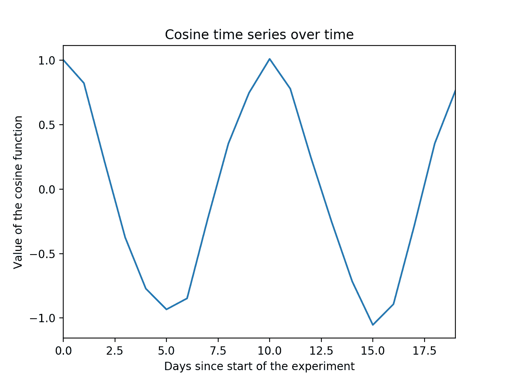

现在让我们将时间序列格式化，以便机器学习算法可以处理，创建一个包含五列的观察矩阵：

```py
features_size = 5
minibatch_cos_X, minibatch_cos_y = format_dataset(cos_values, features_size)
print("minibatch_cos_X.shape=", minibatch_cos_X.shape)
print("minibatch_cos_y.shape=", minibatch_cos_y.shape)
```

从一个包含 20 个数据点的时间序列开始，输出将是一个大小为*15x5*的观察矩阵，而标签向量将有 15 个元素。当然，通过改变特征大小，行数也会发生变化。

现在让我们可视化这个操作，使其更容易理解。例如，绘制观察矩阵的前五个观察值。我们还将打印每个特征的标签（用红色标记）：

```py
samples_to_plot = 5
f, axarr = plt.subplots(samples_to_plot, sharex=True)
for i in range(samples_to_plot):
    feats = minibatch_cos_X[i, :]
    label = minibatch_cos_y[i]
    print("Observation {}: X={} y={}".format(i, feats, label))
    plt.subplot(samples_to_plot, 1, i+1)
    axarr[i].plot(range(i, features_size + i), feats, '--o')
    axarr[i].plot([features_size + i], label, 'rx')
    axarr[i].set_ylim([-1.1, 1.1])
plt.xlabel("Days since start of the experiment")
axarr[2].set_ylabel("Value of the cosine function")
axarr[0].set_title("Visualization of some observations: Features (blue) and Labels (red)")
plt.show()
```

下面是图示：

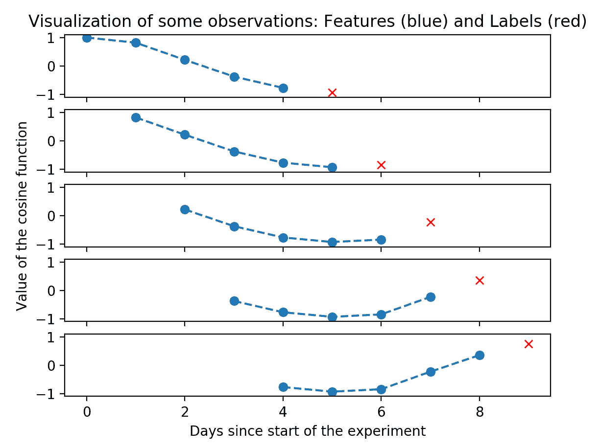

如你所见，时间序列变成了一个观察向量，每个向量的大小为五。

到目前为止，我们还没有展示股票价格的样子，因此我们在这里将其作为时间序列打印出来。我们选择了（精心挑选）一些美国最著名的公司；你也可以随意添加自己喜欢的公司，查看过去一年的趋势。在这个图示中，我们将只限于两年：2015 年和 2016 年。我们将在本章中使用完全相同的数据，因此接下来的运行将会缓存时间序列：

```py
symbols = ["MSFT", "KO", "AAL", "MMM", "AXP", "GE", "GM", "JPM", "UPS"]
ax = plt.subplot(1,1,1)
for sym in symbols:
    prices = fetch_stock_price(
    sym, datetime.date(2015, 1, 1), datetime.date(2016, 12, 31))
    ax.plot(range(len(prices)), prices, label=sym)

handles, labels = ax.get_legend_handles_labels()
ax.legend(handles, labels)
plt.xlabel("Trading days since 2015-1-1")
plt.ylabel("Stock price [$]")
plt.title("Prices of some American stocks in trading days of 2015 and 2016")
plt.show()
```

这是价格的图示：

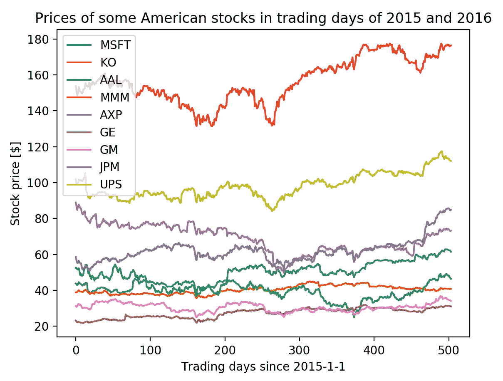

每一条线代表一个时间序列，正如我们对余弦信号所做的那样，在本章中它将被转化为一个观察矩阵（使用`format_dataset`函数）。

你兴奋吗？数据已经准备好，现在我们可以进入项目中有趣的数据科学部分了。

# 使用回归预测股票的未来价格

给定观察矩阵和一个实际值标签，我们最初会倾向于将问题视为回归问题。在这种情况下，回归非常简单：从一个数值向量出发，我们希望预测一个数值。这并不是最理想的做法。将问题作为回归问题处理，我们迫使算法认为每个特征是独立的，但实际上它们是相关的，因为它们都是同一个时间序列的窗口。无论如何，我们先从这个简单的假设（每个特征是独立的）开始，在下一章中我们将展示如何通过利用时间相关性提高性能。

为了评估模型，我们现在创建一个函数，给定观测矩阵、真实标签和预测标签，它将输出预测的度量（以**均方误差**（**MSE**）和**平均绝对误差**（**MAE**）的形式）。它还会将训练、测试和预测的时间序列绘制在一起，以便直观地检查性能。为了比较结果，我们还包括了在没有使用任何模型时的度量，即我们简单地将第二天的值预测为当前的值（在股票市场中，这意味着我们将预测明天的价格为今天的股票价格）。

在此之前，我们需要一个辅助函数，将矩阵重塑为一维（1D）数组。请将此函数保留在`tools.py`文件中，因为多个脚本都会使用它：

```py
def matrix_to_array(m):
    return np.asarray(m).reshape(-1)
```

现在，是时候编写评估函数了。我们决定将这个函数放入`evaluate_ts.py`文件中，这样其他脚本可以访问它：

```py
import numpy as np
from matplotlib import pylab as plt
from tools import matrix_to_array

def evaluate_ts(features, y_true, y_pred):
    print("Evaluation of the predictions:")
    print("MSE:", np.mean(np.square(y_true - y_pred)))
    print("mae:", np.mean(np.abs(y_true - y_pred)))

    print("Benchmark: if prediction == last feature")
    print("MSE:", np.mean(np.square(features[:, -1] - y_true)))
    print("mae:", np.mean(np.abs(features[:, -1] - y_true)))

    plt.plot(matrix_to_array(y_true), 'b')
    plt.plot(matrix_to_array(y_pred), 'r--')
    plt.xlabel("Days")
    plt.ylabel("Predicted and true values")
    plt.title("Predicted (Red) VS Real (Blue)")
    plt.show()

    error = np.abs(matrix_to_array(y_pred) - matrix_to_array(y_true))
    plt.plot(error, 'r')
    fit = np.polyfit(range(len(error)), error, deg=1)
    plt.plot(fit[0] * range(len(error)) + fit[1], '--')
    plt.xlabel("Days")
    plt.ylabel("Prediction error L1 norm")
    plt.title("Prediction error (absolute) and trendline")
    plt.show()
```

现在，是时候进入建模阶段了。

如之前所述，我们先从余弦信号开始，然后转到股票价格预测。

我们还建议将以下代码放在另一个文件中，例如`2_regression_cosine.py`（你可以在代码包中找到这个文件名对应的代码）。

首先导入一些库，并设置`numpy`和`tensorflow`的种子：

```py
import matplotlib.pyplot as plt
import numpy as np
import tensorflow as tf
from evaluate_ts import evaluate_ts
from tensorflow.contrib import rnn
from tools import fetch_cosine_values, format_dataset

tf.reset_default_graph()
tf.set_random_seed(101)
```

然后，是时候创建余弦信号并将其转化为观测矩阵。在这个例子中，我们将使用 20 作为特征大小，因为它大致相当于一个月的工作日数量。回归问题现在被设定为：给定过去 20 个余弦值，预测下一天的值。

在训练和测试时，我们将使用每个`250`观测的数据集，以相当于一年的数据（一年大约包含`250`个工作日）。在这个例子中，我们将只生成一个余弦信号，然后将其拆分成两部分：前一半包含训练数据，后一半包含测试数据。你可以自由更改这些，观察当这些参数变化时，性能如何变化：

```py
feat_dimension = 20
train_size = 250
test_size = 250
```

1.  现在，在脚本的这一部分，我们将定义一些 Tensorflow 的参数。更具体地说：学习率、优化器类型和`epoch`数量（即训练操作中训练数据集进入学习器的次数）。这些值并不是最佳的，你可以自由更改它们，以预测更好的结果：

```py
learning_rate = 0.01
optimizer = tf.train.AdamOptimizer
n_epochs = 10
```

1.  最后，是时候准备训练和测试的观测矩阵了。请记住，为了加速 Tensorflow 分析，我们将使用`float32`（4 字节长）进行分析：

```py
cos_values = fetch_cosine_values(train_size + test_size + feat_dimension)
minibatch_cos_X, minibatch_cos_y = format_dataset(cos_values, feat_dimension)
train_X = minibatch_cos_X[:train_size, :].astype(np.float32)
train_y = minibatch_cos_y[:train_size].reshape((-1, 1)).astype(np.float32)
test_X = minibatch_cos_X[train_size:, :].astype(np.float32)
test_y = minibatch_cos_y[train_size:].reshape((-1, 1)).astype(np.float32)
```

给定数据集后，我们现在定义观测矩阵和标签的占位符。由于我们正在构建一个通用脚本，我们只设置特征数量，而不设置观测数量：

```py
X_tf = tf.placeholder("float", shape=(None, feat_dimension), name="X")
y_tf = tf.placeholder("float", shape=(None, 1), name="y")
```

这是我们项目的核心：在 Tensorflow 中实现的回归算法。

1.  我们选择了最经典的实现方式，即将观测矩阵与权重数组相乘再加上偏置。输出的结果（也是该函数的返回值）是包含所有观测值预测结果的数组，针对`x`中的所有观测：

```py
def regression_ANN(x, weights, biases):
    return tf.add(biases, tf.matmul(x, weights))
```

1.  现在，让我们定义回归器的可训练参数，即`tensorflow`变量。权重是一个与特征大小相等的值的向量，而偏置则只是一个标量。

请注意，我们使用截断正态分布初始化权重，以使其接近零，但不会过于极端（因为普通正态分布可能会输出极端值）；偏置则设置为零。

再次，您可以自由地更改初始化方式，以查看性能变化：

```py
weights = tf.Variable(tf.truncated_normal([feat_dimension, 1], mean=0.0, stddev=1.0), name="weights")
biases = tf.Variable(tf.zeros([1, 1]), name="bias")
```

1.  在`tensorflow`图中，我们需要定义的最后一项是如何计算预测值（在我们的例子中，它只是定义模型的函数的输出），代价（在此示例中我们使用的是 MSE），以及训练操作符（我们希望最小化 MSE，使用之前设置的学习率优化器）：

```py
y_pred = regression_ANN(X_tf, weights, biases)
cost = tf.reduce_mean(tf.square(y_tf - y_pred))
train_op = optimizer(learning_rate).minimize(cost)
```

现在，我们准备打开`tensorflow`会话，开始训练模型。

1.  我们将首先初始化变量，然后在一个循环中将`training`数据集输入到`tensorflow`图中（使用占位符）。每次迭代时，我们将打印训练 MSE：

```py
with tf.Session() as sess:
   sess.run(tf.global_variables_initializer())
   # For each epoch, the whole training set is feeded into the tensorflow graph

   for i in range(n_epochs):
       train_cost, _ = sess.run([cost, train_op], feed_dict={X_tf: train_X, y_tf: train_y})
       print("Training iteration", i, "MSE", train_cost)

   # After the training, let's check the performance on the test set
   test_cost, y_pr = sess.run([cost, y_pred], feed_dict={X_tf: test_X, y_tf: test_y})
   print("Test dataset:", test_cost)

   # Evaluate the results
   evaluate_ts(test_X, test_y, y_pr)

   # How does the predicted look like?
   plt.plot(range(len(cos_values)), cos_values, 'b')
   plt.plot(range(len(cos_values)-test_size, len(cos_values)), y_pr, 'r--')
   plt.xlabel("Days")
   plt.ylabel("Predicted and true values")
   plt.title("Predicted (Red) VS Real (Blue)")
   plt.show()
```

训练后，我们评估了测试数据集上的 MSE，最后，我们打印并绘制了模型的性能。

使用我们在脚本中提供的默认值时，性能比没有模型的性能更差。通过一些调整，结果有所改善。例如，将学习率设置为 0.1，训练的 epoch 数设置为*1000*，脚本的输出将类似于以下内容：

```py
Training iteration 0 MSE 4.39424
Training iteration 1 MSE 1.34261
Training iteration 2 MSE 1.28591
Training iteration 3 MSE 1.84253
Training iteration 4 MSE 1.66169
Training iteration 5 MSE 0.993168
...
...
Training iteration 998 MSE 0.00363447
Training iteration 999 MSE 0.00363426
Test dataset: 0.00454513
Evaluation of the predictions:
MSE: 0.00454513
mae: 0.0568501
Benchmark: if prediction == last feature
MSE: 0.964302
mae: 0.793475
```

训练性能和测试性能非常相似（因此我们没有对模型进行过拟合），MSE 和 MAE 都比没有建模的预测要好。

这就是每个时间点的误差情况。看起来它被控制在+/-0.15 之间，并且随着时间的推移没有任何趋势。请记住，我们用余弦函数人为引入的噪声大小为+/-0.1，且呈均匀分布：

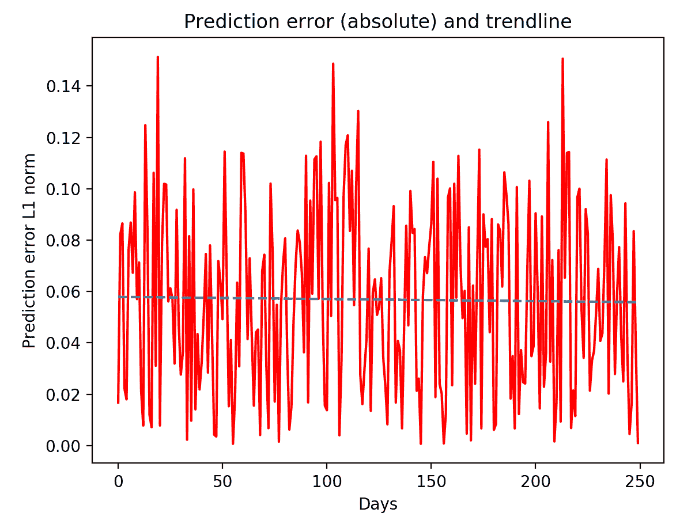

最后，最后一张图显示了训练时间序列与预测时间序列的重叠情况。对于一个简单的线性回归模型来说，不错吧？

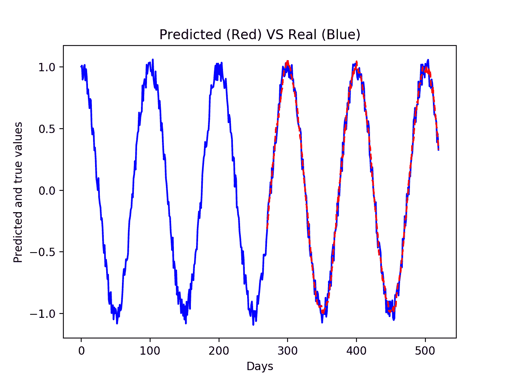

现在，让我们将相同的模型应用于股价预测。我们建议您将当前文件的内容复制到一个新文件中，命名为`3_regression_stock_price.py`。在这里，我们将只更改数据导入部分，其他保持不变。

在本例中，我们使用微软股票价格，符号为 `"MSFT"`。加载此符号的 2015/16 年股票价格并将其格式化为观察矩阵非常简单。下面是代码，包含了将数据转换为 float32 类型和训练/测试集的划分。在这个例子中，我们使用了一年的训练数据（2015 年），并将其用于预测整个 2016 年的股票价格：

```py
symbol = "MSFT"
feat_dimension = 20
train_size = 252
test_size = 252 - feat_dimension

# Settings for tensorflow
learning_rate = 0.05
optimizer = tf.train.AdamOptimizer
n_epochs = 1000

# Fetch the values, and prepare the train/test split
stock_values = fetch_stock_price(symbol, datetime.date(2015, 1, 1), datetime.date(2016, 12, 31))
minibatch_cos_X, minibatch_cos_y = format_dataset(stock_values, feat_dimension)
train_X = minibatch_cos_X[:train_size, :].astype(np.float32)
train_y = minibatch_cos_y[:train_size].reshape((-1, 1)).astype(np.float32)
test_X = minibatch_cos_X[train_size:, :].astype(np.float32)
test_y = minibatch_cos_y[train_size:].reshape((-1, 1)).astype(np.float32)
```

在这个脚本中，我们发现最佳表现是在以下设置下得到的：

```py
learning_rate = 0.5
n_epochs = 20000
optimizer = tf.train.AdamOptimizer
```

脚本的输出应该是这样的：

```py
Training iteration 0 MSE 15136.7
Training iteration 1 MSE 106385.0
Training iteration 2 MSE 14307.3
Training iteration 3 MSE 15565.6
...
...
Training iteration 19998 MSE 0.577189
Training iteration 19999 MSE 0.57704
Test dataset: 0.539493
Evaluation of the predictions:
MSE: 0.539493
mae: 0.518984
Benchmark: if prediction == last feature
MSE: 33.7714
mae: 4.6968
```

即便在这种情况下，我们也没有发生过拟合，简单的回归模型比没有模型时的表现要好（我们都敢打赌）。一开始，误差确实很高，但经过一次又一次的迭代，它越来越接近零。此外，在这种情况下，`mae`（平均绝对误差）分数很容易解释，它是美元！如果使用学习算法，我们的预测结果平均距离真实价格仅半美元，而没有任何学习算法时，误差是九倍。

现在让我们通过视觉评估模型的表现，令人印象深刻，不是吗？

这是预测值：

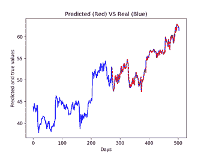

这是绝对误差，带有趋势线（虚线）：

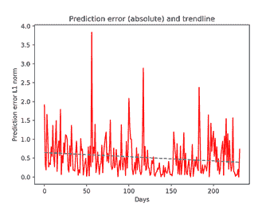

最后，训练集中的真实值与预测值：

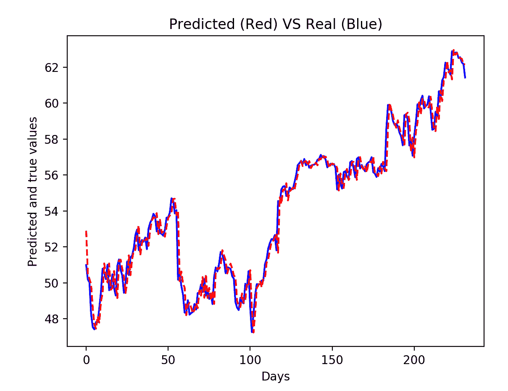

请记住，这些是一个简单回归算法的表现，没有利用特征之间的时间相关性。我们如何利用这一点来提升表现呢？

# 长短期记忆 – LSTM 101

**长短期记忆**（**LSTM**）模型是 RNN（递归神经网络）的一种特殊情况。它们的完整且严谨的描述超出了本书的范围；在本节中，我们将仅提供它们的核心内容。

你可以查看由 Packt 出版的以下书籍：

[`www.packtpub.com/big-data-and-business-intelligence/neural-network-programming-tensorflow`](https://www.packtpub.com/big-data-and-business-intelligence/neural-network-programming-tensorflow) 另外，你还可以查看这个：[`www.packtpub.com/big-data-and-business-intelligence/neural-networks-r`](https://www.packtpub.com/big-data-and-business-intelligence/neural-networks-r)

简单来说，RNN（递归神经网络）处理的是序列：它们接受多维信号作为输入，并输出多维信号。下图展示了一个 RNN 能够处理五个时间步的时间序列（每个时间步一个输入）。输入位于 RNN 的下部，输出位于上部。记住，每个输入/输出都是一个 N 维特征：

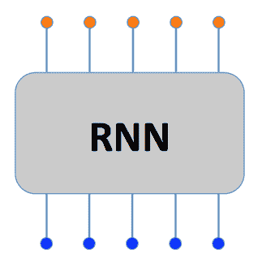

在内部，RNN 具有多个阶段；每个阶段都连接到自己的输入/输出以及前一阶段的输出。得益于这种配置，每个输出不仅仅是当前阶段输入的函数，还依赖于前一阶段的输出（这个输出本身又是前一阶段输入和输出的函数）。这种配置确保了每个输入都影响所有后续输出，或者换句话说，一个输出是所有前一个和当前阶段输入的函数。

请注意，并非所有的输出总是都会被使用。以情感分析任务为例，在这种情况下，给定一句话（即时间序列输入信号），我们只希望得到一个类别（正面/负面）；因此，只有最后一个输出被视为输出，其他所有输出虽然存在，但并未被使用。记住，我们只使用最后一个，因为它对整个句子拥有完整的可见性。

LSTM 模型是 RNN 的进化版本：在长 RNN 中，训练阶段可能导致非常小或者巨大的梯度在网络中反向传播，进而导致权重变为零或无限大：这是一个通常表现为梯度消失/爆炸的问题。为了缓解这个问题，LSTM 在每个阶段都有两个输出：一个是模型的实际输出，另一个是内存状态，即该阶段的内部状态。

两个输出会被送入下一阶段，从而降低梯度消失或爆炸的可能性。当然，这也有代价：模型的复杂性（需要调整的权重数）和内存占用更大，这就是为什么我们强烈建议在训练 RNN 时使用 GPU 设备，时间上的加速非常显著！

与回归不同，RNN 需要一个三维的信号作为输入。Tensorflow 指定的格式是：

+   样本

+   时间步

+   特性

在前面的示例中，情感分析的训练张量会将句子放在`x`轴上，组成句子的单词放在`y`轴上，单词袋与字典放在`z`轴上。例如，对于一个包含 100 万条英文语料库（大约 20,000 个不同单词），且句子最长可达 50 个单词的情感分类任务，张量的维度是 100 万 x 50 x 20K。

# 使用 LSTM 进行股票价格预测

多亏了 LSTM，我们可以利用信号中包含的时间冗余。通过上一节的内容，我们了解到观察矩阵应该被重新格式化为一个三维张量，具有三个轴：

1.  第一个包含样本。

1.  第二个包含时间序列。

1.  第三个包含输入特征。

由于我们处理的只是单一维度的信号，LSTM 的输入张量应具有大小为(None, `time_dimension`, 1)，其中`time_dimension`是时间窗口的长度。现在我们开始编写代码，从余弦信号开始。建议将文件命名为`4_rnn_cosine.py`。

1.  首先，一些导入：

```py
import matplotlib.pyplot as plt
import numpy as np
import tensorflow as tf
from evaluate_ts import evaluate_ts
from tensorflow.contrib import rnn
from tools import fetch_cosine_values, format_dataset
tf.reset_default_graph()
tf.set_random_seed(101)
```

1.  然后，我们设置窗口大小以对信号进行分块。这个操作类似于观察矩阵的创建。

```py
time_dimension = 20
train_size = 250
test_size = 250
```

1.  接下来，为 Tensorflow 设置一些配置。此时，我们先从默认值开始：

```py
learning_rate = 0.01
optimizer = tf.train.AdagradOptimizer
n_epochs = 100
n_embeddings = 64
```

1.  现在，是时候提取嘈杂的余弦波，并将其重塑为一个 3D 张量形状（None, `time_dimension`, 1）。这是在这里完成的：

```py
cos_values = fetch_cosine_values(train_size + test_size + time_dimension)
minibatch_cos_X, minibatch_cos_y = format_dataset(cos_values, time_dimension)
train_X = minibatch_cos_X[:train_size, :].astype(np.float32)
train_y = minibatch_cos_y[:train_size].reshape((-1, 1)).astype(np.float32)
test_X = minibatch_cos_X[train_size:, :].astype(np.float32)
test_y = minibatch_cos_y[train_size:].reshape((-1, 1)).astype(np.float32)
train_X_ts = train_X[:, :, np.newaxis]
test_X_ts = test_X[:, :, np.newaxis]
```

1.  就像在之前的脚本中一样，我们定义 Tensorflow 的占位符：

```py
X_tf = tf.placeholder("float", shape=(None, time_dimension, 1), name="X")
y_tf = tf.placeholder("float", shape=(None, 1), name="y")
```

1.  在这里，我们定义模型。我们将使用一个 LSTM，并且使用一个可变数量的嵌入层。此外，正如上一章所述，我们将只考虑通过线性回归（全连接层）得到的最后输出作为预测：

```py
def RNN(x, weights, biases):
    x_ = tf.unstack(x, time_dimension, 1)
    lstm_cell = rnn.BasicLSTMCell(n_embeddings)
    outputs, _ = rnn.static_rnn(lstm_cell, x_, dtype=tf.float32)
    return tf.add(biases, tf.matmul(outputs[-1], weights))
```

1.  我们像之前一样设置 `trainable` 变量（`weights`），`cost` 函数和训练操作符：

```py
weights = tf.Variable(tf.truncated_normal([n_embeddings, 1], mean=0.0, stddev=1.0), name="weights")
biases = tf.Variable(tf.zeros([1]), name="bias")
y_pred = RNN(X_tf, weights, biases)
cost = tf.reduce_mean(tf.square(y_tf - y_pred))
train_op = optimizer(learning_rate).minimize(cost)

# Exactly as before, this is the main loop.
with tf.Session() as sess:
    sess.run(tf.global_variables_initializer())

    # For each epoch, the whole training set is feeded into the tensorflow graph
    for i in range(n_epochs):
        train_cost, _ = sess.run([cost, train_op], feed_dict={X_tf: train_X_ts, y_tf: train_y})
        if i%100 == 0:
            print("Training iteration", i, "MSE", train_cost)

    # After the training, let's check the performance on the test set
    test_cost, y_pr = sess.run([cost, y_pred], feed_dict={X_tf: test_X_ts, y_tf: test_y})
    print("Test dataset:", test_cost)

    # Evaluate the results
    evaluate_ts(test_X, test_y, y_pr)

    # How does the predicted look like?
    plt.plot(range(len(cos_values)), cos_values, 'b')
    plt.plot(range(len(cos_values)-test_size, len(cos_values)), y_pr, 'r--')
    plt.xlabel("Days")
    plt.ylabel("Predicted and true values")
    plt.title("Predicted (Red) VS Real (Blue)")
    plt.show()
```

经过超参数优化后的输出如下：

```py
Training iteration 0 MSE 0.0603129
Training iteration 100 MSE 0.0054377
Training iteration 200 MSE 0.00502512
Training iteration 300 MSE 0.00483701
...
Training iteration 9700 MSE 0.0032881
Training iteration 9800 MSE 0.00327899
Training iteration 9900 MSE 0.00327195
Test dataset: 0.00416444
Evaluation of the predictions:
MSE: 0.00416444
mae: 0.0545878
```

性能与我们通过简单线性回归得到的结果非常相似。我们来看看是否可以通过使用一个像股票价格这样不太可预测的信号来获得更好的性能。我们将使用上一章中使用的相同时间序列，以便比较性能。

修改之前的程序，将股票价格时间序列代替余弦波。修改几行代码以加载股票价格数据：

```py
stock_values = fetch_stock_price(symbol, datetime.date(2015, 1, 1), datetime.date(2016, 12, 31))
minibatch_cos_X, minibatch_cos_y = format_dataset(stock_values, time_dimension)
train_X = minibatch_cos_X[:train_size, :].astype(np.float32)
train_y = minibatch_cos_y[:train_size].reshape((-1, 1)).astype(np.float32)
test_X = minibatch_cos_X[train_size:, :].astype(np.float32)
test_y = minibatch_cos_y[train_size:].reshape((-1, 1)).astype(np.float32)
train_X_ts = train_X[:, :, np.newaxis]
test_X_ts = test_X[:, :, np.newaxis]
```

由于这个信号的动态范围更广，我们还需要修改用于提取初始权重的分布。我们建议将其设置为：

```py
weights = tf.Variable(tf.truncated_normal([n_embeddings, 1], mean=0.0, stddev=10.0), name="weights")
```

经过几次测试，我们发现使用这些参数时达到了最佳性能：

```py
learning_rate = 0.1
n_epochs = 5000
n_embeddings = 256
```

使用这些参数的输出是：

```py
Training iteration 200 MSE 2.39028
Training iteration 300 MSE 1.39495
Training iteration 400 MSE 1.00994
...
Training iteration 4800 MSE 0.593951
Training iteration 4900 MSE 0.593773
Test dataset: 0.497867
Evaluation of the predictions:
MSE: 0.497867
mae: 0.494975
```

这个比之前的模型（测试 MSE）提高了 8%。记住，它也有代价！更多的参数需要训练，意味着训练时间比之前的示例要长得多（在笔记本电脑上，几分钟，使用 GPU）。

最后，让我们检查 Tensorboard。为了写入日志，我们应该添加以下代码：

1.  在文件的开头，在导入模块之后：

```py
import os
tf_logdir = "./logs/tf/stock_price_lstm"
os.makedirs(tf_logdir, exist_ok=1)
```

1.  此外，`RNN` 函数的整个主体应该放在命名范围 LSTM 内，即：

```py
def RNN(x, weights, biases):
    with tf.name_scope("LSTM"):
        x_ = tf.unstack(x, time_dimension, 1)
        lstm_cell = rnn.BasicLSTMCell(n_embeddings)
        outputs, _ = rnn.static_rnn(lstm_cell, x_, dtype=tf.float32)
        return tf.add(biases, tf.matmul(outputs[-1], weights))
```

1.  类似地，`cost` 函数应被包装在 Tensorflow 的作用域内。同时，我们会将 `mae` 的计算也加入到 `tensorflow` 图中：

```py
y_pred = RNN(X_tf, weights, biases)
with tf.name_scope("cost"):
    cost = tf.reduce_mean(tf.square(y_tf - y_pred))
    train_op = optimizer(learning_rate).minimize(cost)
    tf.summary.scalar("MSE", cost)
        with tf.name_scope("mae"):
        mae_cost = tf.reduce_mean(tf.abs(y_tf - y_pred))
        tf.summary.scalar("mae", mae_cost)
```

1.  最后，主函数应该是这样的：

```py
with tf.Session() as sess:
    writer = tf.summary.FileWriter(tf_logdir, sess.graph)
    merged = tf.summary.merge_all()
    sess.run(tf.global_variables_initializer())

    # For each epoch, the whole training set is feeded into the tensorflow graph
    for i in range(n_epochs):
        summary, train_cost, _ = sess.run([merged, cost, train_op], feed_dict={X_tf: 
                                                  train_X_ts, y_tf: train_y})
        writer.add_summary(summary, i)
        if i%100 == 0:
            print("Training iteration", i, "MSE", train_cost)
    # After the training, let's check the performance on the test set
    test_cost, y_pr = sess.run([cost, y_pred], feed_dict={X_tf: test_X_ts, y_tf: 
           test_y})
    print("Test dataset:", test_cost)
```

这样，我们将每个模块的作用域分开，并为训练的变量写一个总结报告。

现在，让我们启动 `tensorboard`：

```py
$> tensorboard --logdir=./logs/tf/stock_price_lstm
```

打开浏览器并访问 `localhost:6006` 后，在第一个标签页中，我们可以观察到 MSE 和 MAE 的表现：

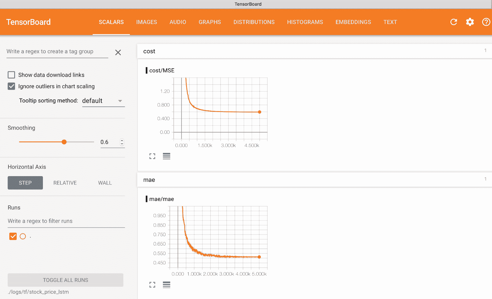

趋势看起来很不错，下降直到达到平稳期。另外，我们还可以检查 `tensorflow` 图（在 GRAPH 标签页中）。在这里，我们可以看到各个部分是如何连接在一起的，以及操作符如何相互影响。你还可以放大以精确查看 Tensorflow 中如何构建 LSTM：

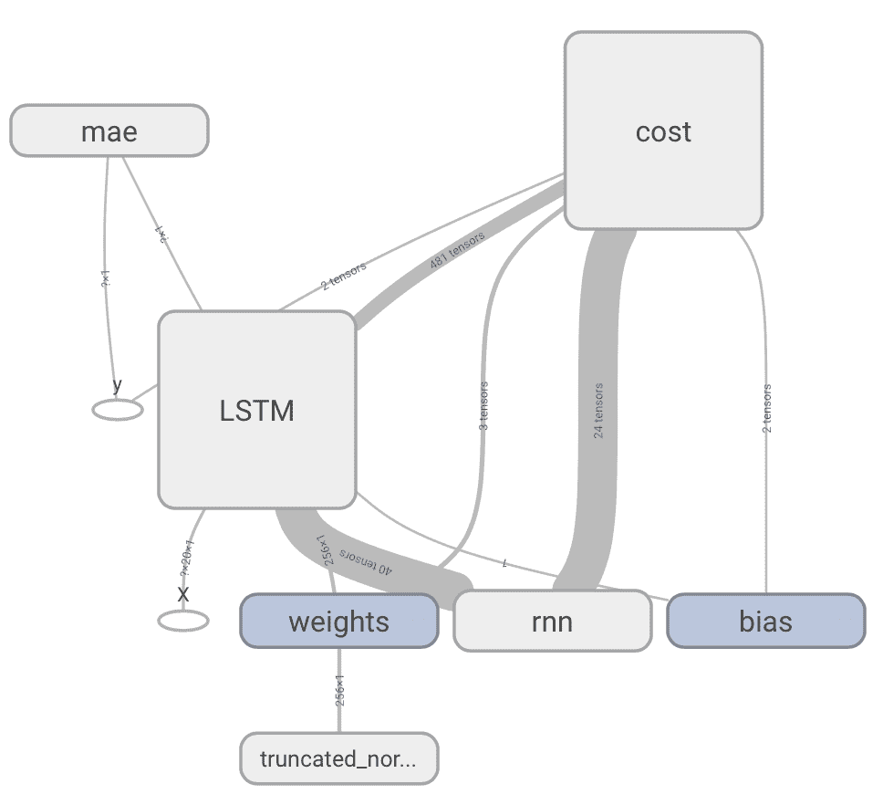

这就是项目的结束。

# 可能的后续问题

+   用 RNN 替换 LSTM，然后再用 GRU。哪个表现最好？

+   除了预测收盘价，还可以尝试预测第二天的最高价/最低价。为此，你可以在训练模型时使用相同的特征（或者你也可以仅使用收盘价作为输入）。

+   为其他股票优化模型：使用一个适用于所有股票的通用模型，还是为每只股票建立一个特定的模型更好？

+   调整再训练。在这个例子中，我们使用模型预测了一整年的数据。如果你每月/每周/每天训练一次模型，你能发现任何改进吗？

+   如果你有一些金融经验，试着构建一个简单的交易模拟器，并将预测结果输入其中。从$100 开始进行模拟，经过一年后，你是赚了还是亏了？

# 总结

在这一章中，我们展示了如何进行时间序列预测：具体来说，我们观察了 RNN 在实际数据集（如股票价格）上的表现。在下一章，我们将看到 RNN 的另一个应用，例如，如何进行自动机器翻译，将一句话翻译成另一种语言。
