# 第八章：检测 Quora 重复问题

Quora ([www.quora.com](http://www.quora.com)) 是一个由社区驱动的问答网站，用户可以匿名或公开提问和回答问题。2017 年 1 月，Quora 首次发布了一个公共数据集，其中包含了问答对，可能是重复的，也可能不是。重复的问答对在语义上相似；换句话说，两道重复的问题表示相同的意思，尽管它们使用不同的措辞来表达相同的意图。对于 Quora 来说，为每个不同的问题提供单独的页面是至关重要的，这样可以为用户提供更好的服务，避免他们在查找答案时需要寻找其他来源。版主可以帮助避免网站上的重复内容，但随着每天回答问题的数量增加以及历史数据仓库的不断扩展，这种方法很难扩大规模。在这种情况下，基于**自然语言处理**（**NLP**）和深度学习的自动化项目可能是解决问题的最佳方案。

本章将介绍如何基于 TensorFlow 构建一个项目，使用 Quora 数据集来阐明句子之间的语义相似性。本章基于 Abhishek Thakur 的工作（[`www.linkedin.com/pulse/duplicate-quora-question-abhishek-thakur/`](https://www.linkedin.com/pulse/duplicate-quora-question-abhishek-thakur/)），他最初基于 Keras 包开发了一个解决方案。所展示的技术同样可以轻松应用于处理语义相似性问题的其他任务。在这个项目中，我们将涵盖以下内容：

+   文本数据的特征工程

+   TF-IDF 和 SVD

+   基于 Word2vec 和 GloVe 的特征

+   传统机器学习模型，如逻辑回归和使用 `xgboost` 的梯度提升

+   包括 LSTM、GRU 和 1D-CNN 的深度学习模型

到本章结束时，您将能够训练自己的深度学习模型来解决类似的问题。首先，让我们快速浏览一下 Quora 数据集。

# 数据集展示

该数据集为非商业用途提供（[`www.quora.com/about/tos`](https://www.quora.com/about/tos)），并在 Kaggle 比赛中发布（[`www.kaggle.com/c/quora-question-pairs`](https://www.kaggle.com/c/quora-question-pairs)）以及 Quora 的博客上发布（[`data.quora.com/First-Quora-Dataset-Release-Question-Pairs`](https://data.quora.com/First-Quora-Dataset-Release-Question-Pairs)），包含 404,351 对问题，其中 255,045 个为负样本（非重复问题），149,306 个为正样本（重复问题）。正样本约占 40%，这种轻微的不平衡无需特别修正。实际上，正如 Quora 博客所述，根据他们的原始抽样策略，数据集中的重复样本数量远高于非重复样本。为了建立一个更平衡的数据集，负样本通过使用相关问题对进行过上采样，即关于相同主题的、实际上不相似的问题。

在开始进行这个项目之前，你可以直接从其 Amazon S3 存储库下载大约 55 MB 的数据，下载链接为：[`qim.ec.quoracdn.net/quora_duplicate_questions.tsv`](http://qim.ec.quoracdn.net/quora_duplicate_questions.tsv)，并将其放入我们的工作目录中。

加载后，我们可以通过选择一些示例行并检查它们，直接开始深入数据。以下图表显示了数据集中前几行的实际快照：

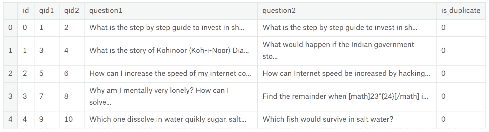

Quora 数据集的前几行

进一步探索数据，我们可以找到一些意思相同的问答对，即重复问题，如下所示：

| Quora 如何快速标记问题为需要改进？ | 为什么 Quora 标记我的问题为需要改进/澄清？ |

在我有时间详细说明之前？

字面意思上，几秒钟内…… |

| 为什么特朗普赢得了总统选举？ | 唐纳德·特朗普是如何赢得 2016 年总统选举的？ |
| --- | --- |
| 希格斯玻色子的发现可能带来哪些实际应用？ | 希格斯玻色子的发现有什么实际的好处？ |

初看，重复问题有很多共同的词语，但它们的长度可能非常不同。

另一方面，以下是一些非重复问题的示例：

| 如果我申请像 Mozilla 这样的公司，我应该将求职信寄给谁？ | 从安全角度来看，哪款车更好？Swift 还是 Grand i10？我的首要考虑是安全性。 |
| --- | --- |
| 《黑客军团》（电视剧）：《黑客军团》是否真实地表现了现实生活中的黑客和黑客文化？黑客社会的描绘是否现实？ | 《黑客军团》中描绘的黑客与现实生活中的网络安全漏洞或普通技术使用相比，存在哪些错误？ |
| 如何启动一个在线购物（电子商务）网站？ | 哪种网络技术最适合构建大型电子商务网站？ |

这些例子中的一些问题显然没有重复，并且只有少量相同的词汇，但其他一些则更难以识别为不相关。例如，第二对问题可能对某些人来说具有吸引力，甚至让人类评判者也感到不确定。这两个问题可能意味着不同的事情：*为什么*和*如何*，或者它们可能在表面上看起来是相同的。深入分析，我们甚至可能会发现更多可疑的例子，甚至一些明显的数据错误；我们肯定在数据集中存在一些异常（正如数据集上的 Quora 帖子所警告的那样），但鉴于这些数据源自现实世界问题，我们无法做任何事情，只能应对这种不完美并努力找到一个有效的解决方案。

到此为止，我们的探索变得更加定量而非定性，这里提供了一些关于问题对的统计数据：

| 问题 1 中字符的平均数 | 59.57 |
| --- | --- |
| 问题 1 中字符的最小数 | 1 |
| 问题 1 中字符的最大数 | 623 |
| 问题 2 中字符的平均数 | 60.14 |
| 问题 2 中字符的最小数 | 1 |
| 问题 2 中字符的最大数 | 1169 |

问题 1 和问题 2 的平均字符数大致相同，尽管问题 2 有更多的极端值。数据中肯定也有一些垃圾数据，因为我们无法理解由单个字符组成的问题。

我们甚至可以通过将数据绘制成词云，突出显示数据集中最常见的词汇，从而获得完全不同的数据视角：


图 1：由在 Quora 数据集中最常见的词汇构成的词云

词序列如“希拉里·克林顿”和“唐纳德·特朗普”的出现提醒我们，数据是在某个历史时刻收集的，我们可以在其中找到的许多问题显然是短暂的，仅在数据集收集时才是合理的。其他主题，如编程语言、世界大战或赚取金钱，可能会持续更长时间，无论是从兴趣的角度还是从提供的答案的有效性上来看。

在稍微探索了一下数据后，现在是时候决定我们在项目中要优化的目标指标是什么了。在本章中，我们将使用准确度作为评估模型性能的指标。准确度作为衡量标准，单纯关注预测的有效性，可能会忽视一些替代模型之间的重要差异，例如辨别能力（模型是否更能识别重复项？）或概率分数的准确性（是否存在重复与非重复之间的明显差距？）。我们选择了准确度，基于这样一个事实：这是 Quora 的工程团队为该数据集创建基准时决定采用的指标（正如他们在这篇博客文章中所述：[`engineering.quora.com/Semantic-Question-Matching-with-Deep-Learning`](https://engineering.quora.com/Semantic-Question-Matching-with-Deep-Learning)）。使用准确度作为指标可以让我们更容易评估和比较我们的模型与 Quora 工程团队的模型，也可以与其他几篇研究论文进行比较。此外，在实际应用中，我们的工作可能仅根据其正确与错误的次数进行评估，而无需考虑其他因素。

我们现在可以继续在项目中进行一些非常基础的特征工程，作为起点。

# 从基础特征工程开始

在开始编写代码之前，我们需要在 Python 中加载数据集，并为我们的项目提供所有必需的包。我们需要在系统上安装这些包（最新版本应该足够，不需要特定版本的包）：

+   `Numpy`

+   `pandas`

+   `fuzzywuzzy`

+   `python-Levenshtein`

+   `scikit-learn`

+   `gensim`

+   `pyemd`

+   `NLTK`

由于我们将在项目中使用这些包中的每一个，因此我们将提供安装它们的具体说明和提示。

对于所有的数据集操作，我们将使用 pandas（Numpy 也会派上用场）。要安装 `numpy` 和 `pandas`：

```py
pip install numpy
pip install pandas
```

数据集可以通过 pandas 和一种专用的数据结构——pandas 数据框，轻松加载到内存中（我们期望数据集与您的脚本或 Jupyter notebook 在同一目录下）：

```py
import pandas as pd
import numpy as np

data = pd.read_csv('quora_duplicate_questions.tsv', sep='\t')
data = data.drop(['id', 'qid1', 'qid2'], axis=1)
```

在本章中，我们将使用名为 `data` 的 pandas 数据框，并且当我们使用 TensorFlow 模型并为其提供输入时，也会使用它。

我们现在可以开始创建一些非常基础的特征。这些基础特征包括基于长度的特征和基于字符串的特征：

1.  question1 的长度

1.  question2 的长度

1.  两个长度之间的差异

1.  不含空格的 question1 字符长度

1.  不含空格的 question2 字符长度

1.  question1 中的单词数

1.  question2 中的单词数

1.  question1 和 question2 中的共同单词数

这些特征通过单行代码处理，使用 pandas 包中的 `apply` 方法转换原始输入：

```py
# length based features
data['len_q1'] = data.question1.apply(lambda x: len(str(x)))
data['len_q2'] = data.question2.apply(lambda x: len(str(x)))

# difference in lengths of two questions
data['diff_len'] = data.len_q1 - data.len_q2

# character length based features
data['len_char_q1'] = data.question1.apply(lambda x: 
                  len(''.join(set(str(x).replace(' ', '')))))
data['len_char_q2'] = data.question2.apply(lambda x: 
                  len(''.join(set(str(x).replace(' ', '')))))

# word length based features
data['len_word_q1'] = data.question1.apply(lambda x: 
                                         len(str(x).split()))
data['len_word_q2'] = data.question2.apply(lambda x: 
                                         len(str(x).split()))

# common words in the two questions
data['common_words'] = data.apply(lambda x: 
                        len(set(str(x['question1'])
                        .lower().split())
                        .intersection(set(str(x['question2'])
                        .lower().split()))), axis=1)
```

供日后参考，我们将这组特征标记为特征集-1 或 `fs_1`：

```py
fs_1 = ['len_q1', 'len_q2', 'diff_len', 'len_char_q1', 
        'len_char_q2', 'len_word_q1', 'len_word_q2',     
        'common_words']
```

这种简单的方法将帮助你轻松回忆并结合我们将在构建的机器学习模型中的不同特征集，从而使得比较不同特征集运行的不同模型变得轻而易举。

# 创建模糊特征

下一组特征基于模糊字符串匹配。模糊字符串匹配也称为近似字符串匹配，是寻找与给定模式大致匹配的字符串的过程。匹配的接近度由将字符串转换为完全匹配所需的原始操作数量来定义。这些原始操作包括插入（在给定位置插入一个字符）、删除（删除一个特定字符）和替代（将字符替换为新字符）。

模糊字符串匹配通常用于拼写检查、抄袭检测、DNA 序列匹配、垃圾邮件过滤等，它是编辑距离更大范畴的一部分，编辑距离的思想是一个字符串可以转换成另一个字符串。它在自然语言处理和其他应用中经常被用来确定两个字符字符串之间的差异程度。

它也被称为 Levenshtein 距离，得名于俄罗斯科学家弗拉基米尔·列文斯坦，他于 1965 年提出了这一概念。

这些特征是使用`fuzzywuzzy`包创建的，该包可以在 Python 中使用（[`pypi.python.org/pypi/fuzzywuzzy`](https://pypi.python.org/pypi/fuzzywuzzy)）。该包使用 Levenshtein 距离来计算两个序列之间的差异，在我们的例子中是问题对。

`fuzzywuzzy`包可以通过 pip3 进行安装：

```py
pip install fuzzywuzzy
```

作为一个重要的依赖，`fuzzywuzzy`需要`Python-Levenshtein`包（[`github.com/ztane/python-Levenshtein/`](https://github.com/ztane/python-Levenshtein/)），这是一个由编译的 C 代码驱动的经典算法的极其快速实现。为了使用`fuzzywuzzy`使计算变得更快，我们还需要安装`Python-Levenshtein`包：

```py
pip install python-Levenshtein
```

`fuzzywuzzy`包提供了多种不同类型的比率，但我们将只使用以下几种：

1.  QRatio

1.  WRatio

1.  部分比率

1.  部分令牌集比率

1.  部分令牌排序比率

1.  令牌集比率

1.  令牌排序比率

`fuzzywuzzy`在 Quora 数据上的特征示例：

```py
from fuzzywuzzy import fuzz

fuzz.QRatio("Why did Trump win the Presidency?", 
"How did Donald Trump win the 2016 Presidential Election")
```

这段代码将返回 67 的值：

```py
fuzz.QRatio("How can I start an online shopping (e-commerce) website?", "Which web technology is best suitable for building a big E-Commerce website?")
```

在这个比较中，返回的值将是 60。根据这些示例，我们注意到尽管`QRatio`的值彼此接近，但来自数据集中相似问题对的值要高于没有相似性的对。让我们来看一下`fuzzywuzzy`为这些相同问题对提供的另一个特征：

```py
fuzz.partial_ratio("Why did Trump win the Presidency?", 
"How did Donald Trump win the 2016 Presidential Election")
```

在这种情况下，返回的值为 73：

```py
fuzz.partial_ratio("How can I start an online shopping (e-commerce) website?", "Which web technology is best suitable for building a big E-Commerce website?")
```

现在返回的值是 57。

使用`partial_ratio`方法，我们可以观察到这两对问题的得分差异明显增大，从而使得区分是否为重复对更加容易。我们假设这些特征可能会为我们的模型增加价值。

通过使用 pandas 和 Python 中的`fuzzywuzzy`包，我们可以再次将这些特征作为简单的一行代码来应用：

```py
data['fuzz_qratio'] = data.apply(lambda x: fuzz.QRatio(
    str(x['question1']), str(x['question2'])), axis=1)

data['fuzz_WRatio'] = data.apply(lambda x: fuzz.WRatio(
    str(x['question1']), str(x['question2'])), axis=1)

data['fuzz_partial_ratio'] = data.apply(lambda x: 
                    fuzz.partial_ratio(str(x['question1']), 
                    str(x['question2'])), axis=1)

data['fuzz_partial_token_set_ratio'] = data.apply(lambda x:
          fuzz.partial_token_set_ratio(str(x['question1']), 
          str(x['question2'])), axis=1)

data['fuzz_partial_token_sort_ratio'] = data.apply(lambda x: 
          fuzz.partial_token_sort_ratio(str(x['question1']), 
          str(x['question2'])), axis=1)

data['fuzz_token_set_ratio'] = data.apply(lambda x: 
                   fuzz.token_set_ratio(str(x['question1']), 
                   str(x['question2'])), axis=1)

data['fuzz_token_sort_ratio'] = data.apply(lambda x: 
                   fuzz.token_sort_ratio(str(x['question1']), 
                   str(x['question2'])), axis=1)
```

这一组特征从此被称为特征集-2 或`fs_2`：

```py
fs_2 = ['fuzz_qratio', 'fuzz_WRatio', 'fuzz_partial_ratio', 
       'fuzz_partial_token_set_ratio', 'fuzz_partial_token_sort_ratio',
       'fuzz_token_set_ratio', 'fuzz_token_sort_ratio']
```

再次，我们将存储我们的工作，并在建模时保存以备后用。

# 借助 TF-IDF 和 SVD 特征

接下来几组特征基于 TF-IDF 和 SVD。**词频-逆文档频率** (**TF-IDF**) 是信息检索的基础算法之一。这里，使用一个公式来解释该算法：

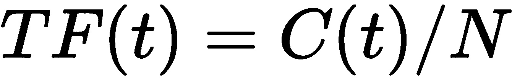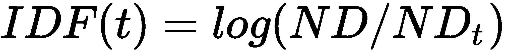

你可以通过这个符号来理解公式：*C(t)*是术语*t*在文档中出现的次数，*N*是文档中的总词数，这就得出了**词频**（**TF**）。ND 是文档的总数，*ND[t]*是包含术语*t*的文档数，这提供了**逆文档频率**（**IDF**）。术语*t*的 TF-IDF 是词频和逆文档频率的乘积：

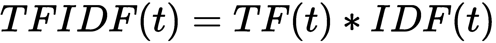

在没有任何先验知识的情况下，除了文档本身的信息，这种得分将突出所有可能轻松区分一个文档与其他文档的术语，降低那些不会提供太多信息的常见词的权重，比如常见的词类（例如冠词）。

如果你需要更实际的 TFIDF 解释，这篇很棒的在线教程将帮助你尝试自己编写算法并在一些文本数据上进行测试：[`stevenloria.com/tf-idf/`](https://stevenloria.com/tf-idf/)

为了方便和加快执行速度，我们使用了`scikit-learn`的 TFIDF 实现。如果你尚未安装`scikit-learn`，可以通过 pip 进行安装：

```py
pip install -U scikit-learn
```

我们分别为问题 1 和问题 2 创建 TFIDF 特征（为了减少输入量，我们直接深拷贝问题 1 的`TfidfVectorizer`）：

```py
from sklearn.feature_extraction.text import TfidfVectorizer
from copy import deepcopy

tfv_q1 = TfidfVectorizer(min_df=3, 
                         max_features=None, 
                         strip_accents='unicode', 
                         analyzer='word', 
                         token_pattern=r'\w{1,}',
                         ngram_range=(1, 2), 
                         use_idf=1, 
                         smooth_idf=1, 
                         sublinear_tf=1,
                         stop_words='english')

tfv_q2 = deepcopy(tfv_q1)
```

必须注意，这里显示的参数是在经过大量实验后选择的。这些参数通常能很好地应用于所有其他自然语言处理相关问题，特别是文本分类。可能需要根据所处理语言的不同来修改停用词列表。

我们现在可以分别获取问题 1 和问题 2 的 TFIDF 矩阵：

```py
q1_tfidf = tfv_q1.fit_transform(data.question1.fillna(""))
q2_tfidf = tfv_q2.fit_transform(data.question2.fillna(""))
```

在我们的 TFIDF 处理过程中，我们基于所有可用数据计算了 TFIDF 矩阵（我们使用了`fit_transform`方法）。这在 Kaggle 竞赛中是一种常见方法，因为它有助于在排行榜上获得更高的分数。然而，如果你在实际环境中工作，你可能希望将一部分数据作为训练集或验证集，以确保你的 TFIDF 处理有助于你的模型在新的、未见过的数据集上进行泛化。

在获得 TFIDF 特征后，我们进入 SVD 特征的处理。SVD 是一种特征分解方法，全称是奇异值分解（Singular Value Decomposition）。它在自然语言处理（NLP）中广泛应用，因为有一种叫做潜在语义分析（LSA）的方法。

对 SVD 和 LSA 的详细讨论超出了本章的范围，但你可以通过尝试以下两个简明易懂的在线教程，了解它们的工作原理：[`alyssaq.github.io/2015/singular-value-decomposition-visualisation/`](https://alyssaq.github.io/2015/singular-value-decomposition-visualisation/) 和 [`technowiki.wordpress.com/2011/08/27/latent-semantic-analysis-lsa-tutorial/`](https://technowiki.wordpress.com/2011/08/27/latent-semantic-analysis-lsa-tutorial/)

为了创建 SVD 特征，我们再次使用`scikit-learn`的实现。这种实现是传统 SVD 的变种，称为`TruncatedSVD`。

`TruncatedSVD`是一种近似的 SVD 方法，可以为你提供可靠且计算速度较快的 SVD 矩阵分解。你可以通过查阅以下网页，了解更多关于该技术的工作原理以及如何应用：[`langvillea.people.cofc.edu/DISSECTION-LAB/Emmie'sLSI-SVDModule/p5module.html`](http://langvillea.people.cofc.edu/DISSECTION-LAB/Emmie'sLSI-SVDModule/p5module.html)

```py
from sklearn.decomposition import TruncatedSVD
svd_q1 = TruncatedSVD(n_components=180)
svd_q2 = TruncatedSVD(n_components=180)
```

我们选择了 180 个 SVD 分解组件，这些特征是基于 TF-IDF 矩阵计算的：

```py
question1_vectors = svd_q1.fit_transform(q1_tfidf)
question2_vectors = svd_q2.fit_transform(q2_tfidf)
```

特征集-3 是通过将这些 TF-IDF 和 SVD 特征组合而来的。例如，我们可以仅使用两个问题的 TF-IDF 特征单独输入模型，或者将两个问题的 TF-IDF 与其上的 SVD 结合起来，再输入模型，依此类推。以下是这些特征的详细说明。

特征集-3(1)或`fs3_1`是通过对两个问题使用不同的 TF-IDF 计算得到的，随后将它们水平堆叠并传递给机器学习模型：

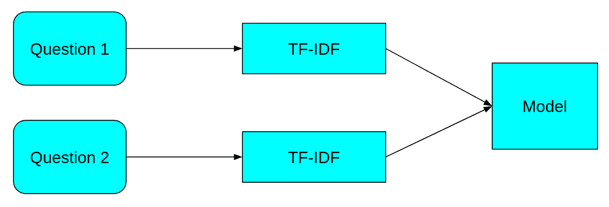

这可以按如下方式编写代码：

```py
from scipy import sparse

# obtain features by stacking the sparse matrices together
fs3_1 = sparse.hstack((q1_tfidf, q2_tfidf))
```

特征集-3(2)或`fs3_2`是通过将两个问题合并并使用单一的 TF-IDF 来创建的：

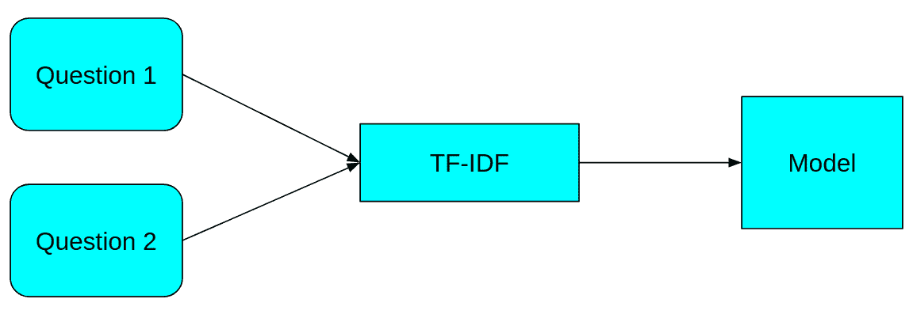

```py
tfv = TfidfVectorizer(min_df=3, 
                      max_features=None, 
                      strip_accents='unicode', 
                      analyzer='word', 
                      token_pattern=r'\w{1,}',
                      ngram_range=(1, 2), 
                      use_idf=1, 
                      smooth_idf=1, 
                      sublinear_tf=1,
                      stop_words='english')

# combine questions and calculate tf-idf
q1q2 = data.question1.fillna("") 
q1q2 += " " + data.question2.fillna("")
fs3_2 = tfv.fit_transform(q1q2)

```

该特征集中的下一个特征子集，特征集-3(3)或`fs3_3`，包含两个问题分别计算的 TF-IDF 和 SVD：

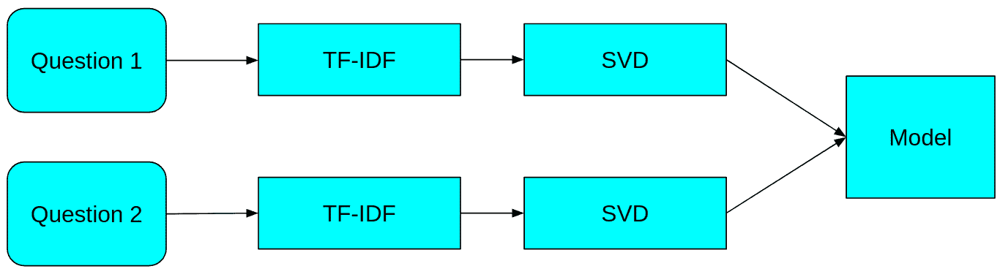

这可以按如下方式编写代码：

```py
# obtain features by stacking the matrices together
fs3_3 = np.hstack((question1_vectors, question2_vectors))
```

我们可以通过类似的方式，使用 TF-IDF 和 SVD 创建几个组合，并分别称之为 `fs3-4` 和 `fs3-5`。这些组合在以下图示中有所展示，但代码部分留给读者作为练习。

特征集-3(4) 或 `fs3-4`：

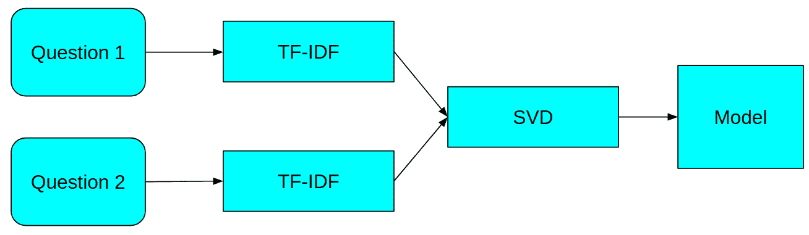

特征集-3(5) 或 `fs3-5`：

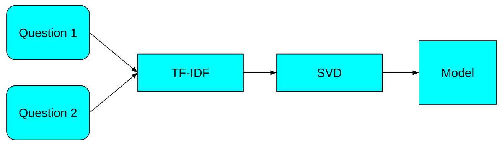

在基本特征集以及一些 TF-IDF 和 SVD 特征之后，我们现在可以转向更复杂的特征，然后再深入到机器学习和深度学习模型中。

# 使用 Word2vec 嵌入进行映射

从广义上讲，Word2vec 模型是两层神经网络，它们将文本语料库作为输入，并为语料库中的每个单词输出一个向量。训练完成后，意义相似的单词的向量会相互接近，也就是说，它们之间的距离比意义差异很大的单词向量之间的距离要小。

目前，Word2vec 已成为自然语言处理问题中的标准，并且它通常能为信息检索任务提供非常有用的见解。对于这个特定问题，我们将使用 Google 新闻向量。这是一个在 Google 新闻语料库上训练的预训练 Word2vec 模型。

每个单词，当通过其 Word2vec 向量表示时，会在空间中获得一个位置，如下图所示：

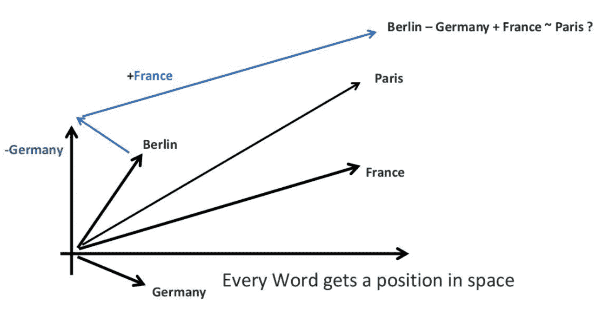

这个示例中的所有单词，例如德国、柏林、法国和巴黎，如果我们使用来自 Google 新闻语料库的预训练向量，它们都可以用一个 300 维的向量来表示。当我们使用 Word2vec 表示这些单词时，若我们从柏林的向量中减去德国的向量，再加上法国的向量，我们将得到一个与巴黎向量非常相似的向量。因此，Word2vec 模型通过向量携带单词的含义。这些向量携带的信息构成了我们任务中非常有用的特征。

为了提供一个更为用户友好且更深入的解释和描述 Word2vec 可能的应用，我们建议阅读 [`www.distilled.net/resources/a-beginners-guide-to-Word2vec-aka-whats-the-opposite-of-canada/`](https://www.distilled.net/resources/a-beginners-guide-to-word2vec-aka-whats-the-opposite-of-canada/)，或者如果你需要一个更具数学定义的解释，建议阅读这篇论文：[`www.1-4-5.net/~dmm/ml/how_does_Word2vec_work.pdf`](http://www.1-4-5.net/~dmm/ml/how_does_word2vec_work.pdf)

为了加载 Word2vec 特征，我们将使用 Gensim。如果你还没有安装 Gensim，可以通过 pip 轻松安装。在此时，建议你同时安装 pyemd 包，这个包将被 WMD 距离函数使用，这个函数将帮助我们关联两个 Word2vec 向量：

```py
pip install gensim
pip install pyemd
```

为了加载 Word2vec 模型，我们下载 `GoogleNews-vectors-negative300.bin.gz` 二进制文件，并使用 Gensim 的 `load_Word2vec_format` 函数将其加载到内存中。您可以使用 `wget` 命令从 Shell 中轻松下载该二进制文件，来自一个 Amazon AWS 的仓库：

```py
wget -c "https://s3.amazonaws.com/dl4j-distribution/GoogleNews-vectors-negative300.bin.gz"
```

下载并解压文件后，您可以使用 Gensim 的 `KeyedVectors` 函数进行操作：

```py
import gensim

model = gensim.models.KeyedVectors.load_word2vec_format(
        'GoogleNews-vectors-negative300.bin.gz', binary=True)
```

现在，我们可以通过调用 `model[word]` 来轻松获得单词的向量。然而，当我们处理句子而非单个单词时，就会出现一个问题。在我们的案例中，我们需要问题 1 和问题 2 的所有向量，以便进行某种比较。为此，我们可以使用以下代码片段。该代码片段基本上是将句子中所有在 Google 新闻向量中存在的单词的向量相加，最后给出一个归一化的向量。我们可以称其为句子向量（Sent2Vec）。

在运行前，请确保已安装**自然语言工具包**（**NLTK**）：

```py
$ pip install nltk
```

还建议您下载 `punkt` 和 `stopwords` 包，因为它们是 NLTK 的一部分：

```py
import nltk
nltk.download('punkt')
nltk.download('stopwords')
```

如果 NLTK 不可用，您只需运行以下代码片段并定义 `sent2vec` 函数：

```py
from nltk.corpus import stopwords
from nltk import word_tokenize

stop_words = set(stopwords.words('english'))

def sent2vec(s, model):  
    M = []
    words = word_tokenize(str(s).lower())
    for word in words:
        #It shouldn't be a stopword
        if word not in stop_words:
            #nor contain numbers
            if word.isalpha():
                #and be part of word2vec
                if word in model:
                    M.append(model[word])
    M = np.array(M)
    if len(M) > 0:
        v = M.sum(axis=0)
        return v / np.sqrt((v ** 2).sum())
    else:
        return np.zeros(300)
```

当短语为空时，我们任意决定返回一个标准的零值向量。

为了计算问题之间的相似性，我们创建的另一个特征是词移动距离（word mover's distance）。词移动距离使用 Word2vec 嵌入，并基于类似地球移动距离（earth mover's distance）的原理，为两个文本文件之间提供距离。简而言之，词移动距离提供了将一个文档中的所有单词移动到另一个文档所需的最小距离。

该论文引入了 WMD：<q>KUSNER, Matt, 等. 从词嵌入到文档距离. 在：国际机器学习会议. 2015 年，p. 957-966</q>，可以在[`proceedings.mlr.press/v37/kusnerb15.pdf`](http://proceedings.mlr.press/v37/kusnerb15.pdf)找到。关于该距离的实操教程，您还可以参考基于 Gensim 实现的教程：[`markroxor.github.io/gensim/static/notebooks/WMD_tutorial.html`](https://markroxor.github.io/gensim/static/notebooks/WMD_tutorial.html)

最终的**Word2vec**（**w2v**）特征还包括其他距离，如更常见的欧几里得距离或余弦距离。我们通过一些测量来补充这两个文档向量的分布特征：

1.  词移动距离

1.  归一化的词移动距离

1.  问题 1 和问题 2 向量之间的余弦距离

1.  问题 1 和问题 2 向量之间的曼哈顿距离

1.  问题 1 和问题 2 向量之间的 Jaccard 相似度

1.  问题 1 和问题 2 向量之间的 Canberra 距离

1.  问题 1 和问题 2 向量之间的欧几里得距离

1.  问题 1 和问题 2 向量之间的闵可夫斯基距离

1.  问题 1 和问题 2 向量之间的 Braycurtis 距离

1.  问题 1 向量的偏度

1.  问题 2 向量的偏度

1.  问题 1 向量的峰度

1.  问题 2 向量的峰度

所有的 Word2vec 特征都用 **fs4** 表示。

一个单独的 w2v 特征集由 Word2vec 向量矩阵组成：

1.  问题 1 的 Word2vec 向量

1.  问题 2 的 Word2vec 向量

这些将通过 **fs5** 表示：

```py
w2v_q1 = np.array([sent2vec(q, model) 
                   for q in data.question1])
w2v_q2 = np.array([sent2vec(q, model) 
                   for q in data.question2])
```

为了便于实现 Quora 问题的 Word2vec 嵌入向量之间的各种距离度量，我们使用了 `scipy.spatial.distance module` 中的实现：

```py
from scipy.spatial.distance import cosine, cityblock, 
          jaccard, canberra, euclidean, minkowski, braycurtis

data['cosine_distance'] = [cosine(x,y) 
                           for (x,y) in zip(w2v_q1, w2v_q2)]
data['cityblock_distance'] = [cityblock(x,y) 
                           for (x,y) in zip(w2v_q1, w2v_q2)]
data['jaccard_distance'] = [jaccard(x,y) 
                           for (x,y) in zip(w2v_q1, w2v_q2)]
data['canberra_distance'] = [canberra(x,y) 
                           for (x,y) in zip(w2v_q1, w2v_q2)]
data['euclidean_distance'] = [euclidean(x,y) 
                           for (x,y) in zip(w2v_q1, w2v_q2)]
data['minkowski_distance'] = [minkowski(x,y,3) 
                           for (x,y) in zip(w2v_q1, w2v_q2)]
data['braycurtis_distance'] = [braycurtis(x,y) 
                           for (x,y) in zip(w2v_q1, w2v_q2)]
```

与距离相关的所有特征名称都集中在 `fs4_1` 列表中：

```py
fs4_1 = ['cosine_distance', 'cityblock_distance', 
         'jaccard_distance', 'canberra_distance', 
         'euclidean_distance', 'minkowski_distance',
         'braycurtis_distance']
```

这两个问题的 Word2vec 矩阵会水平堆叠，并存储在 `w2v` 变量中，以便稍后使用：

```py
w2v = np.hstack((w2v_q1, w2v_q2))
```

Word Mover's Distance 是通过一个函数实现的，该函数返回两个问题之间的距离，先将它们转换为小写并去除所有停用词。此外，我们还计算了距离的归一化版本，方法是将所有 Word2vec 向量转化为 L2 归一化向量（即将每个向量转换为单位范数，即如果我们将向量中的每个元素平方并求和，结果应为一），这一过程通过 `init_sims` 方法完成：

```py
def wmd(s1, s2, model):
    s1 = str(s1).lower().split()
    s2 = str(s2).lower().split()
    stop_words = stopwords.words('english')
    s1 = [w for w in s1 if w not in stop_words]
    s2 = [w for w in s2 if w not in stop_words]
    return model.wmdistance(s1, s2)

data['wmd'] = data.apply(lambda x: wmd(x['question1'],     
                            x['question2'], model), axis=1)
model.init_sims(replace=True) 
data['norm_wmd'] = data.apply(lambda x: wmd(x['question1'], 
                            x['question2'], model), axis=1)
fs4_2 = ['wmd', 'norm_wmd']
```

在这些最后的计算之后，我们现在拥有了大多数创建基本机器学习模型所需的重要特征，这些模型将作为我们深度学习模型的基准。下表展示了可用特征的快照：

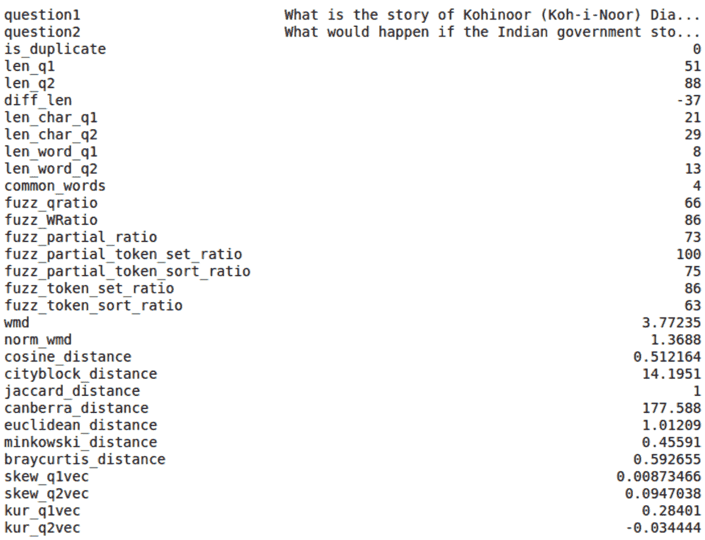

让我们在这些和其他基于 Word2vec 的特征上训练一些机器学习模型。

# 测试机器学习模型

在继续之前，根据你的系统，你可能需要清理一些内存，并释放空间以便为机器学习模型腾出地方，可以通过 `gc.collect` 来完成，先删除任何不再需要的变量，然后通过 `psutil.virtualmemory` 函数来检查可用内存：

```py
import gc
import psutil
del([tfv_q1, tfv_q2, tfv, q1q2, 
     question1_vectors, question2_vectors, svd_q1, 
     svd_q2, q1_tfidf, q2_tfidf])
del([w2v_q1, w2v_q2])
del([model])
gc.collect()
psutil.virtual_memory()
```

到目前为止，我们简要回顾了到目前为止创建的不同特征，以及它们在生成特征方面的含义：

+   `fs_1`: 基本特征列表

+   `fs_2`: 模糊特征列表

+   `fs3_1`: 分离问题的 TFIDF 稀疏数据矩阵

+   `fs3_2`: 组合问题的 TFIDF 稀疏数据矩阵

+   `fs3_3`: SVD 的稀疏数据矩阵

+   `fs3_4`: SVD 统计信息列表

+   `fs4_1`: W2vec 距离列表

+   `fs4_2`: WMD 距离列表

+   `w2v`: 通过 `Sent2Vec` 函数转化的短语的 Word2vec 向量矩阵

我们评估了两种基本且非常流行的机器学习模型，即逻辑回归和使用 `xgboost` 包的梯度提升算法。下表提供了逻辑回归和 `xgboost` 算法在先前创建的不同特征集上的表现，这些结果是在 Kaggle 竞赛中获得的：

| **特征集** | **逻辑回归准确率** | **xgboost 准确率** |
| --- | --- | --- |
| 基本特征 (fs1) | 0.658 | 0.721 |
| 基本特征 + 模糊特征 (fs1 + fs2) | 0.660 | 0.738 |
| 基本特征 + 模糊特征 + w2v 特征 (fs1 + fs2 + fs4) | 0.676 | 0.766 |
| W2v 向量特征 (fs5) | * | 0.78 |
| 基本特征 + 模糊特征 + w2v 特征 + w2v 向量特征 (fs1 + fs2 + fs4 + fs5) | * | **0.814** |
| TFIDF-SVD 特征 (`fs3-1`) | 0.777 | 0.749 |
| TFIDF-SVD 特征 (`fs3-2`) | 0.804 | 0.748 |
| TFIDF-SVD 特征 (`fs3-3`) | 0.706 | 0.763 |
| TFIDF-SVD 特征 (`fs3-4`) | 0.700 | 0.753 |
| TFIDF-SVD 特征 (`fs3-5`) | 0.714 | 0.759 |

* = 由于高内存要求，这些模型未经过训练。

我们可以将这些表现作为基准或起始值，作为开始深度学习模型之前的参考，但我们不会仅限于此，我们还将尝试复制其中的一些。

我们将从导入所有必要的包开始。至于逻辑回归，我们将使用 scikit-learn 的实现。

xgboost 是一个可扩展、便携和分布式的梯度提升库（一个树集成机器学习算法）。最初由华盛顿大学的陈天奇创建，后来由 Bing Xu 添加了 Python 包装器，并由 Tong He 提供了 R 接口（你可以通过 [homes.cs.washington.edu/~tqchen/2016/03/10/story-and-lessons-behind-the-evolution-of-xgboost.html](http://homes.cs.washington.edu/~tqchen/2016/03/10/story-and-lessons-behind-the-evolution-of-xgboost.html) 直接阅读关于 xgboost 的故事）。xgboost 支持 Python、R、Java、Scala、Julia 和 C++，它可以在单机（利用多线程）以及 Hadoop 和 Spark 集群中运行。

详细的 xgboost 安装说明可以在此页面找到：[github.com/dmlc/xgboost/blob/master/doc/build.md](https://github.com/dmlc/xgboost/blob/master/doc/build.md)

在 Linux 和 macOS 上安装 xgboost 比较简单，而对于 Windows 用户来说稍微复杂一些。

因此，我们提供了在 Windows 上安装 xgboost 的特定步骤：

1.  首先，下载并安装 Git for Windows ([git-for-windows.github.io](https://git-for-windows.github.io/))

1.  然后，你需要在系统上安装 MINGW 编译器。你可以根据系统特点从 [www.mingw.org](http://www.mingw.org/) 下载它

1.  从命令行执行：

    `$> git clone --recursive [`github.com/dmlc/xgboost`](https://github.com/dmlc/xgboost)`

    `$> cd xgboost`

    `$> git submodule init`

    `$> git submodule update`

1.  然后，总是从命令行中，你可以将 64 字节系统的配置复制为默认配置：

    `$> copy make\mingw64.mk config.mk`

    或者，你可以直接复制 32 字节版本：

    `$> copy make\mingw.mk config.mk`

1.  复制配置文件后，你可以运行编译器，设置为使用四个线程，以加速编译过程：

    `$> mingw32-make -j4`

1.  在 MinGW 中，`make` 命令的名称为 `mingw32-make`；如果你使用的是其他编译器，之前的命令可能无法运行，但你可以简单地尝试：

    `$> make -j4`

1.  最后，如果编译器工作没有错误，你可以使用以下命令在 Python 中安装该软件包：

    `$> cd python-package`

    `$> python setup.py install`

如果 xgboost 已正确安装在你的系统上，你可以继续导入这两种机器学习算法：

```py
from sklearn import linear_model
from sklearn.preprocessing import StandardScaler
import xgboost as xgb
```

由于我们将使用一个对特征尺度敏感的逻辑回归求解器（它是来自 [`github.com/EpistasisLab/tpot/issues/292`](https://github.com/EpistasisLab/tpot/issues/292) 的 `sag` 求解器，要求计算时间与数据大小呈线性关系），因此我们将首先使用 scikit-learn 中的 `scaler` 函数对数据进行标准化：

```py
scaler = StandardScaler()
y = data.is_duplicate.values
y = y.astype('float32').reshape(-1, 1)
X = data[fs_1+fs_2+fs3_4+fs4_1+fs4_2]
X = X.replace([np.inf, -np.inf], np.nan).fillna(0).values
X = scaler.fit_transform(X)
X = np.hstack((X, fs3_3))
```

我们还通过首先过滤 `fs_1`、`fs_2`、`fs3_4`、`fs4_1` 和 `fs4_2` 变量集的数据，然后堆叠 `fs3_3` 稀疏 SVD 数据矩阵，来选择用于训练的数据。我们还提供了一个随机划分，将数据的 1/10 分配给验证集（以便有效评估创建的模型的质量）：

```py
np.random.seed(42)
n_all, _ = y.shape
idx = np.arange(n_all)
np.random.shuffle(idx)
n_split = n_all // 10
idx_val = idx[:n_split]
idx_train = idx[n_split:]
x_train = X[idx_train]
y_train = np.ravel(y[idx_train])
x_val = X[idx_val]
y_val = np.ravel(y[idx_val])
```

作为第一个模型，我们尝试逻辑回归，将正则化 l2 参数 C 设置为 0.1（适度的正则化）。模型准备好后，我们在验证集上测试其有效性（`x_val` 为训练矩阵，`y_val` 为正确答案）。结果通过准确度进行评估，即验证集中正确猜测的比例：

```py
logres = linear_model.LogisticRegression(C=0.1, 
                                 solver='sag', max_iter=1000)
logres.fit(x_train, y_train)
lr_preds = logres.predict(x_val)
log_res_accuracy = np.sum(lr_preds == y_val) / len(y_val)
print("Logistic regr accuracy: %0.3f" % log_res_accuracy)
```

过了一会儿（求解器最多会有 1,000 次迭代，若未能收敛则放弃），验证集上的最终准确率为 0.743，这将成为我们的起始基准。

现在，我们尝试使用 `xgboost` 算法进行预测。作为一个梯度提升算法，这种学习算法具有更高的方差（能够拟合复杂的预测函数，但也容易过拟合），而简单的逻辑回归则偏向更大的偏差（最终是系数的加和），因此我们期望能得到更好的结果。我们将其决策树的最大深度固定为 4（一个较浅的深度，应该可以防止过拟合），并使用 0.02 的 eta（学习较慢，需要生长更多的树）。我们还设置了一个监控列表，监控验证集的情况，如果验证集的预期误差在 50 步之后没有下降，则提前停止。

在同一数据集上（在我们这里是验证集）提前停止并不是最佳实践。理想情况下，在实际应用中，我们应该为调优操作（如提前停止）设置一个验证集，并为报告在泛化到新数据时的预期结果设置一个测试集。

设置好这些之后，我们运行算法。这一次，我们需要等待的时间将比运行逻辑回归时更长：

```py
params = dict()
params['objective'] = 'binary:logistic'
params['eval_metric'] = ['logloss', 'error']
params['eta'] = 0.02
params['max_depth'] = 4
d_train = xgb.DMatrix(x_train, label=y_train)
d_valid = xgb.DMatrix(x_val, label=y_val)
watchlist = [(d_train, 'train'), (d_valid, 'valid')]
bst = xgb.train(params, d_train, 5000, watchlist, 
                early_stopping_rounds=50, verbose_eval=100)
xgb_preds = (bst.predict(d_valid) >= 0.5).astype(int)
xgb_accuracy = np.sum(xgb_preds == y_val) / len(y_val)
print("Xgb accuracy: %0.3f" % xgb_accuracy)
```

`xgboost`报告的最终结果是验证集上的`0.803`准确率。

# 构建一个 TensorFlow 模型

本章中的深度学习模型是使用 TensorFlow 构建的，基于 Abhishek Thakur 使用 Keras 编写的原始脚本（你可以在[`github.com/abhishekkrthakur/is_that_a_duplicate_quora_question`](https://github.com/abhishekkrthakur/is_that_a_duplicate_quora_question)阅读原始代码）。Keras 是一个 Python 库，提供了 TensorFlow 的简易接口。TensorFlow 官方支持 Keras，使用 Keras 训练的模型可以轻松转换为 TensorFlow 模型。Keras 使得深度学习模型的快速原型设计和测试成为可能。在我们的项目中，我们无论如何都从头开始完全用 TensorFlow 重写了解决方案。

首先，让我们导入必要的库，特别是 TensorFlow，并通过打印它来检查其版本：

```py
import zipfile
from tqdm import tqdm_notebook as tqdm
import tensorflow as tf
print("TensorFlow version %s" % tf.__version__)
```

在这一点上，我们简单地将数据加载到`df` pandas 数据框中，或者从磁盘加载它。我们用空字符串替换缺失值，并设置包含目标答案的`y`变量，目标答案编码为 1（重复）或 0（未重复）：

```py
try:
    df = data[['question1', 'question2', 'is_duplicate']]
except:
    df = pd.read_csv('data/quora_duplicate_questions.tsv',                                                  
                                                    sep='\t')
    df = df.drop(['id', 'qid1', 'qid2'], axis=1)

df = df.fillna('')
y = df.is_duplicate.values
y = y.astype('float32').reshape(-1, 1)
```

现在我们可以深入研究这个数据集的深度神经网络模型了。

# 深度神经网络之前的处理

在将数据输入到任何神经网络之前，我们必须首先对数据进行分词处理，然后将数据转换为序列。为此，我们使用 TensorFlow 中提供的 Keras `Tokenizer`，并设置最大单词数限制为 200,000，最大序列长度为 40。任何超过 40 个单词的句子都会被截断至前 40 个单词：

```py
Tokenizer = tf.keras.preprocessing.text.Tokenizer pad_sequences = tf.keras.preprocessing.sequence.pad_sequences

tk = Tokenizer(num_words=200000) max_len = 40

```

在设置了`Tokenizer`（`tk`）后，我们将其应用于拼接的第一和第二个问题列表，从而学习学习语料库中所有可能的词汇：

```py
tk.fit_on_texts(list(df.question1) + list(df.question2))
x1 = tk.texts_to_sequences(df.question1)
x1 = pad_sequences(x1, maxlen=max_len)
x2 = tk.texts_to_sequences(df.question2)
x2 = pad_sequences(x2, maxlen=max_len) 
word_index = tk.word_index
```

为了跟踪分词器的工作，`word_index`是一个字典，包含所有已分词的单词及其分配的索引。

使用 GloVe 嵌入时，我们必须将其加载到内存中，如之前讨论如何获取 Word2vec 嵌入时所见。

可以通过以下命令从 Shell 中轻松恢复 GloVe 嵌入：

```py
wget http://nlp.stanford.edu/data/glove.840B.300d.zip
```

GloVe 嵌入向量与 Word2vec 相似，都是基于共现关系将单词编码到一个复杂的多维空间中。然而，正如论文[`clic.cimec.unitn.it/marco/publications/acl2014/baroni-etal-countpredict-acl2014.pdf`](http://clic.cimec.unitn.it/marco/publications/acl2014/baroni-etal-countpredict-acl2014.pdf)中所解释的那样——<q>BARONI, Marco; DINU, Georgiana; KRUSZEWSKI, Germán. 不要计数，预测！上下文计数与上下文预测语义向量的系统比较。载于：第 52 届计算语言学协会年会论文集（第 1 卷：长篇论文）</q><q>。2014 年，第 238-247 页。</q>

GloVe 并不像 Word2vec 那样来源于一个神经网络优化过程，该过程旨在从上下文预测单词。相反，GloVe 是从一个**共现计数矩阵**生成的（在这个矩阵中，我们统计一行中的单词与列中的单词共同出现的次数），该矩阵经过了降维处理（就像我们之前准备数据时提到的奇异值分解 SVD）。

为什么我们现在使用 GloVe 而不是 Word2vec？实际上，两者的主要区别归结为一个经验事实：GloVe 嵌入向量在某些问题上效果更好，而 Word2vec 嵌入向量在其他问题上表现更佳。经过实验后，我们发现 GloVe 嵌入向量在深度学习算法中表现更好。你可以通过斯坦福大学的官方网站查看更多关于 GloVe 及其应用的信息：[`nlp.stanford.edu/projects/glove/`](https://nlp.stanford.edu/projects/glove/)

在获取了 GloVe 嵌入向量后，我们可以继续通过填充`embedding_matrix`数组的行，将从 GloVe 文件中提取的嵌入向量（每个包含 300 个元素）填入该数组，来创建一个`embedding_matrix`。

以下代码读取 GloVe 嵌入文件并将其存储到我们的嵌入矩阵中，最终将包含数据集中所有分词单词及其相应的向量：

```py
embedding_matrix = np.zeros((len(word_index) + 1, 300), dtype='float32')

glove_zip = zipfile.ZipFile('data/glove.840B.300d.zip')
glove_file = glove_zip.filelist[0]

f_in = glove_zip.open(glove_file)
for line in tqdm(f_in):
    values = line.split(b' ')
    word = values[0].decode()
    if word not in word_index:
        continue
    i = word_index[word]
    coefs = np.asarray(values[1:], dtype='float32')
    embedding_matrix[i, :] = coefs

f_in.close()
glove_zip.close()
```

从一个空的`embedding_matrix`开始，每个行向量会被放置在矩阵中对应的行号位置，这个位置应该代表其相应的单词。单词与行号之间的这种对应关系是由分词器完成的编码过程之前定义的，现在可以在`word_index`字典中查阅。

在`embedding_matrix`加载完嵌入向量后，接下来就可以开始构建深度学习模型了。

# 深度神经网络构建模块

在本节中，我们将介绍一些关键功能，这些功能将使我们的深度学习项目得以运行。从批量数据输入（向深度神经网络提供学习数据块）开始，我们将为一个复杂的 LSTM 架构准备基础构件。

LSTM 架构在第七章中以一种实践性和详细的方式介绍，*使用 LSTM 进行股价预测*，位于*长短期记忆 - LSTM 101*部分。

我们开始处理的第一个函数是`prepare_batches`函数。该函数接受问题序列，并根据步长值（即批量大小），返回一个列表的列表，其中内部的列表是需要学习的序列批次：

```py
def prepare_batches(seq, step):
    n = len(seq)
    res = []
    for i in range(0, n, step):
        res.append(seq[i:i+step])
    return res

```

dense 函数将根据提供的大小创建一个密集层的神经元，并用随机正态分布的数字激活和初始化，这些数字的均值为零，标准差为 2 除以输入特征的数量的平方根。

合理的初始化有助于将输入的导数通过反向传播深入网络。事实上：

+   如果你将网络中的权重初始化得太小，那么导数在通过每一层时会逐渐缩小，直到它变得太微弱，无法触发激活函数。

+   如果网络中的权重初始化过大，那么当它穿越每一层时，导数会简单地增长（即所谓的爆炸梯度问题），导致网络无法收敛到一个合适的解，并且由于处理过大的数字，它会崩溃。

初始化过程确保权重适中，通过设定一个合理的起点，使导数可以通过许多层进行传播。深度学习网络有许多初始化方法，例如 Glorot 和 Bengio 提出的 Xavier（Xavier 是 Glorot 的名字），以及由 He、Rang、Zhen 和 Sun 提出的、基于 Glorot 和 Bengio 方法的 He 初始化方法。

权重初始化是构建神经网络架构的一个技术性方面，但它非常重要。如果你想了解更多，可以从阅读这篇文章开始，它还深入探讨了这个话题的更多数学解释：[`deepdish.io/2015/02/24/network-initialization/`](http://deepdish.io/2015/02/24/network-initialization/)

在这个项目中，我们选择了 He 初始化方法，因为它对于整流单元（ReLU）非常有效。整流单元，或者称为 ReLU，是深度学习的核心，因为它们允许信号传播并避免爆炸或消失的梯度问题。然而，从实际角度看，通过 ReLU 激活的神经元大多数时间实际上只是输出零值。保持足够大的方差，以确保输入和输出梯度在层间传递时具有恒定的方差，确实有助于这种激活方式的最佳效果，正如这篇论文中所解释的：<q>HE, Kaiming, et al. 深入探讨整流器：超越人类水平的 imagenet 分类性能。在：IEEE 国际计算机视觉会议论文集。</q> 2015 年，p. 1026-1034，详细内容可以在[`arxiv.org/abs/1502.01852`](https://arxiv.org/abs/1502.01852)找到并阅读：

```py
def dense(X, size, activation=None):
    he_std = np.sqrt(2 / int(X.shape[1]))
    out = tf.layers.dense(X, units=size, 
                activation=activation,
                kernel_initializer=\
                tf.random_normal_initializer(stddev=he_std))
    return out
```

接下来，我们将处理另一种层，时间分布式密集层。

这种层通常用于递归神经网络（RNN），以保持输入和输出之间的“一对一”关系。一个 RNN（具有一定数量的单元提供通道输出），由标准的密集层馈送，接收的矩阵维度是行（示例）× 列（序列），它输出一个矩阵，矩阵的维度是行数 × 通道数（单元数）。如果通过时间分布式密集层馈送它，输出的维度将是行×列×通道的形状。实际上，密集神经网络会应用于时间戳（每列）。

时间分布式密集层通常用于当你有一个输入序列并且你想为每个输入标记时，考虑到到达的序列。这是标注任务的常见场景，如多标签分类或词性标注。在我们的项目中，我们将在 GloVe 嵌入之后使用它，以处理每个 GloVe 向量在问题序列中从一个词到另一个词的变化。

举个例子，假设你有一个包含两个案例（几个问题示例）的序列，每个案例有三个序列（一些词），每个序列由四个元素（它们的嵌入向量）组成。如果我们有这样一个数据集通过具有五个隐藏单元的时间分布式密集层，那么我们将得到一个形状为(2, 3, 5)的张量。实际上，经过时间分布式层，每个示例保留了序列，但嵌入向量被五个隐藏单元的结果所替代。将它们通过 1 轴上的归约操作，我们将得到一个形状为(2, 5)的张量，也就是每个示例的结果向量。

如果你想复制之前的示例：

`print("Tensor's shape:", X.shape)`

`tensor = tf.convert_to_tensor(X, dtype=tf.float32)`

`dense_size = 5 i = time_distributed_dense(tensor, dense_size)`

`print("Shape of time distributed output:", i)`

`j = tf.reduce_sum(i, axis=1)`

`print("Shape of reduced output:", j)`

时间分布式密集层的概念可能比其他层更难理解，网上对此有很多讨论。你也可以阅读这个 Keras 问题讨论线程，以获取更多关于这个主题的见解：[`github.com/keras-team/keras/issues/1029`](https://github.com/keras-team/keras/issues/1029)

```py
def time_distributed_dense(X, dense_size):
    shape = X.shape.as_list()
    assert len(shape) == 3
    _, w, d = shape
    X_reshaped = tf.reshape(X, [-1, d])
    H = dense(X_reshaped, dense_size, 
                              tf.nn.relu)
    return tf.reshape(H, [-1, w, dense_size])
```

`conv1d` 和 `maxpool1d_global` 函数最终是 TensorFlow 函数 `tf.layers.conv1d`（[`www.tensorflow.org/api_docs/python/tf/layers/conv1d`](https://www.tensorflow.org/api_docs/python/tf/layers/conv1d)）和 `tf.reduce_max`（[`www.tensorflow.org/api_docs/python/tf/reduce_max`](https://www.tensorflow.org/api_docs/python/tf/reduce_max)）的封装，前者是卷积层，后者计算输入张量维度上的元素的最大值。在自然语言处理领域，这种池化方式（称为全局最大池化）比计算机视觉深度学习应用中常见的标准最大池化更为常见。正如跨验证中的一个问答所解释的那样（[`stats.stackexchange.com/a/257325/49130`](https://stats.stackexchange.com/a/257325/49130)），全局最大池化只是取输入向量的最大值，而标准最大池化则根据给定的池大小，从输入向量的不同池中返回最大值构成的新向量。

```py
def conv1d(inputs, num_filters, filter_size, padding='same'):
    he_std = np.sqrt(2 / (filter_size * num_filters))
    out = tf.layers.conv1d(
        inputs=inputs, filters=num_filters, padding=padding,
        kernel_size=filter_size,
        activation=tf.nn.relu,
        kernel_initializer=tf.random_normal_initializer(
                                                 stddev=he_std))
    return out

def maxpool1d_global(X):
    out = tf.reduce_max(X, axis=1)
    return out
```

我们的核心 `lstm` 函数在每次运行时都由一个不同的范围初始化，使用的是由 He 初始化方法（如前所示）生成的随机整数，并且它是 TensorFlow `tf.contrib.rnn.BasicLSTMCell` 的封装，用于基本 LSTM 循环网络单元层（[`www.tensorflow.org/api_docs/python/tf/contrib/rnn/BasicLSTMCell`](https://www.tensorflow.org/api_docs/python/tf/contrib/rnn/BasicLSTMCell)），以及 `tf.contrib.rnn.static_rnn` 用于创建由单元层指定的循环神经网络（[`www.tensorflow.org/versions/r1.1/api_docs/python/tf/contrib/rnn/static_rnn`](https://www.tensorflow.org/versions/r1.1/api_docs/python/tf/contrib/rnn/static_rnn)）。

基本 LSTM 循环网络单元的实现基于论文 <q>ZAREMBA, Wojciech; SUTSKEVER, Ilya; VINYALS, Oriol. Recurrent neural network regularization. arXiv 预印本 arXiv</q>:1409.2329，2014，链接可见于 [`arxiv.org/abs/1409.2329`](https://arxiv.org/abs/1409.2329)。

```py
def lstm(X, size_hidden, size_out):
    with tf.variable_scope('lstm_%d' 
                            % np.random.randint(0, 100)):
        he_std = np.sqrt(2 / (size_hidden * size_out))
        W = tf.Variable(tf.random_normal([size_hidden, size_out], 
                                                  stddev=he_std))
        b = tf.Variable(tf.zeros([size_out]))
        size_time = int(X.shape[1])
        X = tf.unstack(X, size_time, axis=1)
        lstm_cell = tf.contrib.rnn.BasicLSTMCell(size_hidden, 
                                                 forget_bias=1.0)
        outputs, states = tf.contrib.rnn.static_rnn(lstm_cell, X, 
                                                 dtype='float32')
        out = tf.matmul(outputs[-1], W) + b
        return out
```

在我们项目的这个阶段，我们已经收集了所有必要的构建模块，用于定义将学习区分重复问题的神经网络架构。

# 设计学习架构

我们通过固定一些参数来定义架构，例如 GloVe 嵌入考虑的特征数量、过滤器的数量和长度、最大池化的长度以及学习率：

```py
max_features = 200000
filter_length = 5
nb_filter = 64
pool_length = 4
learning_rate = 0.001
```

抓住少量或大量不同短语之间不同语义含义的能力，以便识别可能的重复问题，确实是一个困难的任务，需要复杂的架构。为此，在经过多次实验后，我们创建了一个由 LSTM、时间分布的密集层和 1D-CNN 组成的更深模型。这样的模型有六个头部，通过连接合并为一个。连接后，架构通过五个密集层和一个带有 sigmoid 激活的输出层完成。

完整的模型如下面的图所示：

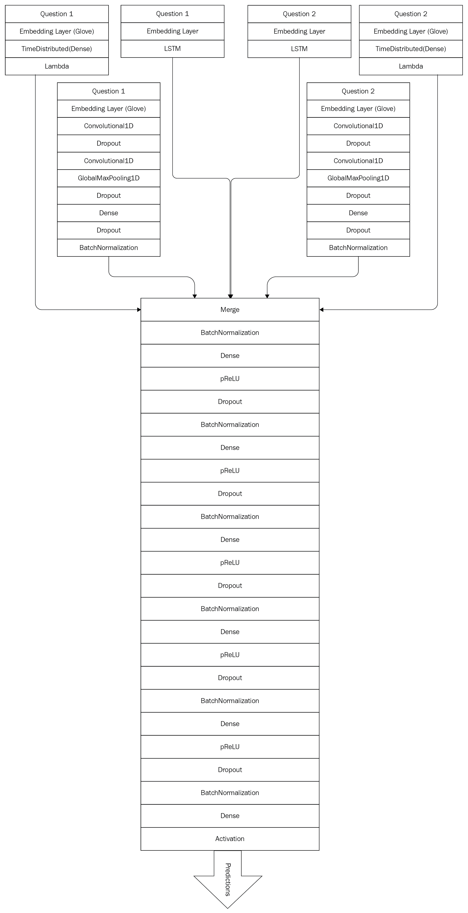

第一个头部由一个由 GloVe 嵌入初始化的嵌入层组成，后面跟着一个时间分布的密集层。第二个头部由 1D 卷积层组成，作用于由 GloVe 模型初始化的嵌入，第三个头部则是一个基于从零开始学习的嵌入的 LSTM 模型。其余三个头部遵循相同的模式，处理问题对中的另一个问题。

我们开始定义六个模型并将它们连接起来。最终，这些模型通过连接合并，即将六个模型的向量水平堆叠在一起。

即使以下代码块相当长，跟随它也很简单。一切从三个输入占位符`place_q1`、`place_q2`和`place_y`开始，分别将第一个问题、第二个问题和目标响应输入六个模型中。问题使用 GloVe（`q1_glove_lookup`和`q2_glove_lookup`）和随机均匀嵌入进行嵌入。两种嵌入都有 300 个维度。

前两个模型，`model_1`和`model_2`，获取 GloVe 嵌入，并应用时间分布的密集层。

以下两个模型，`model_3`和`model_4`，获取 GloVe 嵌入并通过一系列卷积、丢弃和最大池化进行处理。最终输出向量会进行批量归一化，以保持生成批次之间的方差稳定。

如果你想了解批量归一化的细节，Abhishek Shivkumar 在 Quora 上的回答清楚地提供了你需要了解的关于批量归一化是什么、它的作用以及它在神经网络架构中为何有效的所有关键信息：[`www.quora.com/In-layman%E2%80%99s-terms-what-is-batch-normalisation-what-does-it-do-and-why-does-it-work-so-well/answer/Abhishek-Shivkumar`](https://www.quora.com/In-layman%E2%80%99s-terms-what-is-batch-normalisation-what-does-it-do-and-why-does-it-work-so-well/answer/Abhishek-Shivkumar)

最后，`model_5`和`model_6`获取均匀随机嵌入，并用 LSTM 进行处理。所有六个模型的结果将合并在一起并进行批量归一化：

```py
graph = tf.Graph()
graph.seed = 1

with graph.as_default():
    place_q1 = tf.placeholder(tf.int32, shape=(None, max_len))
    place_q2 = tf.placeholder(tf.int32, shape=(None, max_len))
    place_y = tf.placeholder(tf.float32, shape=(None, 1))
    place_training = tf.placeholder(tf.bool, shape=())

    glove = tf.Variable(embedding_matrix, trainable=False)
    q1_glove_lookup = tf.nn.embedding_lookup(glove, place_q1)
    q2_glove_lookup = tf.nn.embedding_lookup(glove, place_q2)

    emb_size = len(word_index) + 1
    emb_dim = 300
    emb_std = np.sqrt(2 / emb_dim)
    emb = tf.Variable(tf.random_uniform([emb_size, emb_dim],
                                             -emb_std, emb_std))
    q1_emb_lookup = tf.nn.embedding_lookup(emb, place_q1)
    q2_emb_lookup = tf.nn.embedding_lookup(emb, place_q2)

    model1 = q1_glove_lookup
    model1 = time_distributed_dense(model1, 300)
    model1 = tf.reduce_sum(model1, axis=1)

    model2 = q2_glove_lookup
    model2 = time_distributed_dense(model2, 300)
    model2 = tf.reduce_sum(model2, axis=1)

    model3 = q1_glove_lookup
    model3 = conv1d(model3, nb_filter, filter_length, 
                                       padding='valid')
    model3 = tf.layers.dropout(model3, rate=0.2,                                                               training=place_training)
    model3 = conv1d(model3, nb_filter, filter_length,                                                                               padding='valid')
    model3 = maxpool1d_global(model3)
    model3 = tf.layers.dropout(model3, rate=0.2,                                                               training=place_training)
    model3 = dense(model3, 300)
    model3 = tf.layers.dropout(model3, rate=0.2,                                                                training=place_training)
    model3 = tf.layers.batch_normalization(model3,                                                                training=place_training)

    model4 = q2_glove_lookup
    model4 = conv1d(model4, nb_filter, filter_length,                                                                                padding='valid')
    model4 = tf.layers.dropout(model4, rate=0.2,                                                                training=place_training)
    model4 = conv1d(model4, nb_filter, filter_length,                                                                                padding='valid')
    model4 = maxpool1d_global(model4)
    model4 = tf.layers.dropout(model4, rate=0.2,                                                                training=place_training)
    model4 = dense(model4, 300)
    model4 = tf.layers.dropout(model4, rate=0.2,                                                                training=place_training)
    model4 = tf.layers.batch_normalization(model4,                                                                training=place_training)

    model5 = q1_emb_lookup
    model5 = tf.layers.dropout(model5, rate=0.2,                                                                 training=place_training)
    model5 = lstm(model5, size_hidden=300, size_out=300)

    model6 = q2_emb_lookup
    model6 = tf.layers.dropout(model6, rate=0.2,                                                                 training=place_training)
    model6 = lstm(model6, size_hidden=300, size_out=300)

    merged = tf.concat([model1, model2, model3, model4, model5,                                                                         model6], axis=1)

    merged = tf.layers.batch_normalization(merged,                                                                         training=place_training)
```

然后，我们通过添加五个带丢弃和批量归一化的密集层来完成架构。接着，是一个带有 sigmoid 激活的输出层。该模型使用基于对数损失的`AdamOptimizer`进行优化：

```py
    for i in range(5):
        merged = dense(merged, 300, activation=tf.nn.relu)
        merged = tf.layers.dropout(merged, rate=0.2,                                                                     training=place_training)
        merged = tf.layers.batch_normalization(merged,                                                                     training=place_training)

    merged = dense(merged, 1, activation=tf.nn.sigmoid)
    loss = tf.losses.log_loss(place_y, merged)
    prediction = tf.round(merged)
    accuracy = tf.reduce_mean(tf.cast(tf.equal(place_y,                                                                      prediction), 'float32'))
    opt = tf.train.AdamOptimizer(learning_rate=learning_rate)

    # for batchnorm
    extra_update_ops = tf.get_collection(tf.GraphKeys.UPDATE_OPS)
    with tf.control_dependencies(extra_update_ops):
        step = opt.minimize(loss)

    init = tf.global_variables_initializer()

session = tf.Session(config=None, graph=graph)
session.run(init)
```

定义架构后，我们初始化会话并准备开始学习。作为一个好的实践，我们将可用数据分为训练部分（9/10）和测试部分（1/10）。固定随机种子可以保证结果的可复制性：

```py
np.random.seed(1)

n_all, _ = y.shape
idx = np.arange(n_all)
np.random.shuffle(idx)

n_split = n_all // 10
idx_val = idx[:n_split]
idx_train = idx[n_split:]

x1_train = x1[idx_train]
x2_train = x2[idx_train]
y_train = y[idx_train]

x1_val = x1[idx_val]
x2_val = x2[idx_val]
y_val = y[idx_val] 
```

如果你运行以下代码片段，训练将开始，你会注意到随着纪元数的增加，模型的准确率也在提高。然而，模型的训练需要花费大量时间，具体取决于你决定遍历的批次数。在 NVIDIA Titan X 上，模型每个纪元的训练时间超过 300 秒。作为精度与训练时间之间的良好平衡，我们选择运行 10 个纪元：

```py
val_idx = np.arange(y_val.shape[0])
val_batches = prepare_batches(val_idx, 5000)

no_epochs = 10

# see https://github.com/tqdm/tqdm/issues/481
tqdm.monitor_interval = 0

for i in range(no_epochs):
    np.random.seed(i)
    train_idx_shuffle = np.arange(y_train.shape[0])
    np.random.shuffle(train_idx_shuffle)
    batches = prepare_batches(train_idx_shuffle, 384)

    progress = tqdm(total=len(batches))
    for idx in batches:
        feed_dict = {
            place_q1: x1_train[idx],
            place_q2: x2_train[idx],
            place_y: y_train[idx],
            place_training: True,
        }
        _, acc, l = session.run([step, accuracy, loss],                                              feed_dict)
        progress.update(1)
        progress.set_description('%.3f / %.3f' % (acc, l))

    y_pred = np.zeros_like(y_val)
    for idx in val_batches:
        feed_dict = {
            place_q1: x1_val[idx],
            place_q2: x2_val[idx],
            place_y: y_val[idx],
            place_training: False,
        }
        y_pred[idx, :] = session.run(prediction, feed_dict)

    print('batch %02d, accuracy: %0.3f' % (i, 
                                 np.mean(y_val == y_pred))) 
```

训练了 10 个纪元后，该模型的准确率为 82.5%。这比我们之前的基准要高得多。当然，通过使用更好的预处理和分词方法，模型的性能还可以进一步提高。更多的纪元（最多 200 个）也可能有助于进一步提升准确性。词干提取和词形还原也肯定能帮助模型接近 Quora 博客报告的 88%的先进准确率。

完成训练后，我们可以使用内存中的会话来测试一些问题评估。我们尝试用关于 Quora 上重复问题的两个问题进行测试，但该过程适用于任何你希望测试算法的问题对。

和许多机器学习算法一样，该算法依赖于它所学习到的分布。与训练数据完全不同的问题可能会让算法难以猜测。

```py
def convert_text(txt, tokenizer, padder):
    x = tokenizer.texts_to_sequences(txt)
    x = padder(x, maxlen=max_len)
    return x  

def evaluate_questions(a, b, tokenizer, padder, pred):
    feed_dict = {
            place_q1: convert_text([a], tk, pad_sequences),
            place_q2: convert_text([b], tk, pad_sequences),
            place_y: np.zeros((1,1)),
            place_training: False,
        }
    return session.run(pred, feed_dict)

isduplicated = lambda a, b: evaluate_questions(a, b, tk, pad_sequences, prediction)

a = "Why are there so many duplicated questions on Quora?"
b = "Why do people ask similar questions on Quora multiple times?"

print("Answer: %0.2f" % isduplicated(a, b))
```

运行代码后，答案应该揭示出这些问题是重复的（答案：1.0）。

# 总结

在本章中，我们借助 TensorFlow 构建了一个非常深的神经网络，以便从 Quora 数据集中检测重复问题。这个项目让我们讨论、修订并实践了许多在其他章节中曾见过的不同主题：TF-IDF、SVD、经典机器学习算法、Word2vec 和 GloVe 嵌入，以及 LSTM 模型。

最终，我们得到了一个模型，其准确率约为 82.5%，这一数字高于传统的机器学习方法，也接近 Quora 博客报告的其他先进深度学习解决方案。

还应注意，本章讨论的模型和方法可以轻松应用于任何语义匹配问题。
