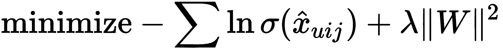
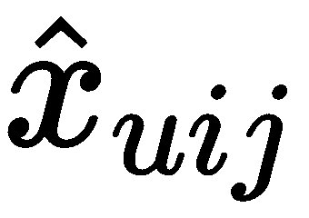

# 第九章：构建一个 TensorFlow 推荐系统

推荐系统是一种基于用户与软件的过去交互，向用户提供个性化建议的算法。最著名的例子就是亚马逊和其他电子商务网站上那种“购买了 X 的用户也购买了 Y”的推荐。

在过去几年中，推荐系统变得越来越重要：在线企业已明确认识到，网站上提供的推荐越好，赚的钱就越多。这也是为什么今天几乎每个网站都有一个个性化推荐的模块。

在本章中，我们将看到如何使用 TensorFlow 来构建自己的推荐系统。

我们将特别涵盖以下主题：

+   推荐系统基础

+   推荐系统中的矩阵分解

+   贝叶斯个性化排序

+   基于循环神经网络的高级推荐系统

在本章结束时，你将知道如何准备数据以训练推荐系统，如何使用 TensorFlow 构建自己的模型，并如何对这些模型的质量进行简单评估。

# 推荐系统

**推荐系统**的任务是根据特定用户的偏好，从所有可能的项目中排名，并生成个性化的排名列表，通常被称为**推荐**。

例如，一个购物网站可能会有一个推荐部分，用户可以看到他们可能感兴趣的商品，并可能决定购买。销售演唱会门票的网站可能会推荐有趣的演出，在线音乐播放器可能会推荐用户可能喜欢的歌曲。或者，像[Coursera.org](http://Coursera.org)这样的在线课程网站，可能会推荐与用户已经完成的课程类似的课程：


网站上的课程推荐

推荐通常基于历史数据：用户的过去交易历史、访问记录和点击行为。因此，推荐系统是一个利用历史数据，通过机器学习提取用户行为模式，并根据这些模式提供最佳推荐的系统。

公司非常关注如何使推荐尽可能好：这通常通过改善用户体验来增加用户参与度，从而带动收入增长。当我们推荐一个用户本来不会注意到的商品，而用户最终购买了它时，不仅使用户感到满意，而且我们还卖出了本来不会卖出去的商品。

本章项目将实现多个推荐系统算法，使用 TensorFlow。我们将从经典的经过时间考验的算法开始，然后深入探讨并尝试基于 RNN 和 LSTM 的更复杂模型。对于本章中的每个模型，我们将首先简要介绍，然后在 TensorFlow 中实现该模型。

为了说明这些概念，我们使用 UCI 机器学习库中的在线零售数据集。这个数据集可以从 [`archive.ics.uci.edu/ml/datasets/online+retail`](http://archive.ics.uci.edu/ml/datasets/online+retail) 下载。

数据集本身是一个包含以下特征的 Excel 文件：

+   `InvoiceNo`：发票号，用于唯一标识每一笔交易

+   `StockCode`：购买商品的代码

+   `Description`：产品名称

+   `Quantity`：交易中购买商品的数量

+   `UnitPrice`：每件商品的价格

+   `CustomerID`：客户的 ID

+   `Country`：客户所在国家的名称

它包含 25,900 个交易，每个交易大约有 20 件商品，总计约 540,000 件商品。记录的交易来自 4,300 名用户，交易时间从 2010 年 12 月开始，到 2011 年 12 月结束。

要下载数据集，我们可以使用浏览器保存文件，或者使用`wget`：

```py
wget http://archive.ics.uci.edu/ml/machine-learning-databases/00352/Online%20Retail.xlsx
```

对于这个项目，我们将使用以下 Python 包：

+   `pandas` 用于读取数据

+   `numpy` 和 `scipy` 用于数值数据操作

+   `tensorflow` 用于创建模型

+   `implicit` 用于基准解决方案

+   [可选] `tqdm` 用于监控进度

+   [可选] `numba` 用于加速计算

如果你使用 Anaconda，那么你应该已经安装了`numba`，但如果没有，简单地运行`pip install numba`就可以安装这个包。要安装`implicit`，我们再次使用`pip`：

```py
pip install implicit
```

一旦数据集下载完成并且包安装好，我们就可以开始了。在接下来的部分，我们将回顾矩阵分解技术，然后准备数据集，最后在 TensorFlow 中实现其中的一些。

# 推荐系统中的矩阵分解

在本节中，我们将介绍传统的推荐系统技术。正如我们将看到的，这些技术在 TensorFlow 中实现非常简单，生成的代码非常灵活，容易进行修改和改进。

对于这一部分，我们将使用在线零售数据集。我们首先定义我们想要解决的问题，并建立一些基准。然后我们实现经典的矩阵分解算法，以及基于贝叶斯个性化排序的修改版。

# 数据集准备和基准

现在我们准备开始构建推荐系统了。

首先，声明导入：

```py
import tensorflow as tf
import pandas as pd
import numpy as np
import scipy.sparse as sp
from tqdm import tqdm
```

让我们读取数据集：

```py
df = pd.read_excel('Online Retail.xlsx')
```

读取 `xlsx` 文件可能需要一些时间。为了节省时间，在下次读取该文件时，我们可以将加载的副本保存到 `pickle` 文件中：

```py
import pickle
with open('df_retail.bin', 'wb') as f_out:
    pickle.dump(df, f_out)
```

这个文件读取起来更快，因此在加载时我们应该使用 pickle 版本：

```py
with open('df_retail.bin', 'rb') as f_in:
    df = pickle.load(f_in)
```

一旦数据加载完成，我们可以查看数据。我们可以通过调用 `head` 函数来做到这一点：

```py
df.head()
```

然后我们看到以下表格：


如果我们仔细查看数据，可以发现以下问题：

+   列名是大写的，这有点不常见，所以我们可以将其转换为小写。

+   一些交易是退货：它们对我们不重要，因此我们应该将其过滤掉。

+   最后，一些交易属于未知用户。我们可以为这些用户分配一个通用 ID，例如`-1`。同时，未知用户被编码为`NaN`，这就是为什么`CustomerID`列被编码为浮动类型——因此我们需要将其转换为整数。

这些问题可以通过以下代码修复：

```py
df.columns = df.columns.str.lower()
df = df[~df.invoiceno.astype('str').str.startswith('C')].reset_index(drop=True)
df.customerid = df.customerid.fillna(-1).astype('int32')
```

接下来，我们应该用整数编码所有商品 ID（`stockcode`）。一种方法是为每个代码构建一个与唯一索引号的映射：

```py
stockcode_values = df.stockcode.astype('str')

stockcodes = sorted(set(stockcode_values))
stockcodes = {c: i for (i, c) in enumerate(stockcodes)}

df.stockcode = stockcode_values.map(stockcodes).astype('int32')
```

现在我们已经对商品进行编码，可以将数据集划分为训练集、验证集和测试集。由于我们有电商交易数据，最合理的划分方式是按时间划分。所以我们将使用：

+   **训练集**：2011 年 10 月 9 日之前（大约 10 个月的数据，大约 378,500 行）

+   **验证集**：2011 年 10 月 9 日到 2011 年 11 月 9 日之间（一个月的数据，大约 64,500 行）

+   **测试集**：2011 年 11 月 9 日之后（同样是一个月的数据，大约 89,000 行）

为此，我们只需过滤数据框：

```py
df_train = df[df.invoicedate < '2011-10-09']
df_val = df[(df.invoicedate >= '2011-10-09') & 
            (df.invoicedate <= '2011-11-09') ]
df_test = df[df.invoicedate >= '2011-11-09']
```

在本节中，我们将考虑以下（非常简化的）推荐场景：

1.  用户访问网站。

1.  我们提供五个推荐。

1.  用户查看列表，可能从中购买一些商品，然后像往常一样继续购物。

所以我们需要为第二步构建一个模型。为此，我们使用训练数据，然后利用验证集模拟第二步和第三步。为了评估我们的推荐是否有效，我们计算用户实际购买的推荐商品数量。

我们的评估指标是成功推荐的数量（即用户实际购买的商品）与我们做出的总推荐数量的比值。这叫做**精准度**——这是评估机器学习模型性能的常用指标。

对于这个项目，我们使用精准度。 当然，这是一个相当简化的评估性能的方法，实际上有不同的评估方式。你可能想使用的其他指标包括**MAP**（**平均精准度**），**NDCG**（**标准化折扣累积增益**）等。不过为了简化，我们在本章中并未使用它们。

在我们开始使用机器学习算法处理此任务之前，先建立一个基本的基准。比如，我们可以计算每个商品的购买次数，然后选出购买次数最多的五个商品，推荐给所有用户。

使用 pandas 很容易做到：

```py
top = df_train.stockcode.value_counts().head(5).index.values
```

这将给我们一个整数数组——`stockcode`代码：

```py
array([3527, 3506, 1347, 2730,  180])
```

现在我们使用这个数组推荐给所有用户。所以我们将`top`数组重复与验证数据集中交易的数量相同的次数，然后使用这些作为推荐，并计算精准度指标来评估质量。

对于重复项，我们使用 numpy 的`tile`函数：

```py
num_groups = len(df_val.invoiceno.drop_duplicates())
baseline = np.tile(top, num_groups).reshape(-1, 5)
```

`tile`函数接受一个数组并将其重复`num_group`次。经过重塑后，它会给我们以下数组：

```py
array([[3527, 3506, 1347, 2730,  180],
       [3527, 3506, 1347, 2730,  180],
       [3527, 3506, 1347, 2730,  180],
       ...,
       [3527, 3506, 1347, 2730,  180],
       [3527, 3506, 1347, 2730,  180],
       [3527, 3506, 1347, 2730,  180]])
```

现在我们准备好计算这个推荐系统的精度了。

然而，这里有一个复杂的问题：由于项目存储的方式，使得计算每个组内正确分类元素的数量变得困难。使用 pandas 的`groupby`是解决这个问题的一种方法：

+   按照`invoiceno`（即我们的交易 ID）分组

+   为每个交易做出推荐

+   记录每个组的正确预测数量

+   计算总体精度

然而，这种方式通常非常慢且低效。对于这个特定项目可能没问题，但对于稍微大的数据集，它就成为了一个问题。

它慢的原因在于 pandas 中`groupby`的实现方式：它在内部执行排序，而我们并不需要这样做。然而，我们可以通过利用数据存储的方式来提高速度：我们知道数据框中的元素总是有序的。也就是说，如果一个交易从某个行号`i`开始，那么它将在行号`i + k`结束，其中`k`是该交易中的项目数。换句话说，`i`和`i + k`之间的所有行都属于同一个`invoiceid`。

所以我们需要知道每个交易的开始和结束位置。为此，我们保持一个长度为`n + 1`的特殊数组，其中`n`是数据集中组（交易）的数量。

我们称这个数组为`indptr`。对于每个交易`t`：

+   `indptr[t]`返回交易开始的行号

+   `indptr[t + 1]`返回交易结束的行号

这种表示不同长度组的方式灵感来自于 CSR 算法——压缩行存储（有时称为压缩稀疏行）。它用于在内存中表示稀疏矩阵。你可以在 Netlib 文档中阅读更多内容——[`netlib.org/linalg/html_templates/node91.html`](http://netlib.org/linalg/html_templates/node91.html)。你也许在 scipy 中也会认出这个名字——它是`scipy.sparse`包中表示矩阵的几种方式之一：[`docs.scipy.org/doc/scipy-0.14.0/reference/generated/scipy.sparse.csr_matrix.html`](https://docs.scipy.org/doc/scipy-0.14.0/reference/generated/scipy.sparse.csr_matrix.html)。

在 Python 中创建这样的数组并不困难：我们只需要查看当前交易的结束位置和下一个交易的开始位置。所以，在每一行索引处，我们可以将当前索引与前一个索引进行比较，如果不同，就记录该索引。这可以通过使用 pandas 的`shift`方法高效完成：

```py
def group_indptr(df):
    indptr, = np.where(df.invoiceno != df.invoiceno.shift())
    indptr = np.append(indptr, len(df)).astype('int32')
    return indptr
```

这样我们就得到了验证集的指针数组：

```py
val_indptr = group_indptr(df_val)
```

现在我们可以在`precision`函数中使用它：

```py
from numba import njit

@njit
def precision(group_indptr, true_items, predicted_items):
    tp = 0

    n, m = predicted_items.shape

    for i in range(n):
        group_start = group_indptr[i]
        group_end = group_indptr[i + 1]
        group_true_items = true_items[group_start:group_end]

        for item in group_true_items:
            for j in range(m):
                if item == predicted_items[i, j]:
                    tp = tp + 1
                    continue

    return tp / (n * m)
```

这里的逻辑很简单：对于每一个交易，我们检查我们预测正确的物品数量。所有预测正确的物品总数存储在`tp`中。最后，我们将`tp`除以预测的总数，即预测矩阵的大小，也就是在我们的例子中，交易次数乘以五。

注意 numba 的 `@njit` 装饰器。这个装饰器告诉 numba 代码应该被优化。当我们首次调用这个函数时，numba 会分析代码并使用 **即时编译（JIT）** 编译器将函数转换为本地代码。当函数被编译后，它的执行速度比原来快了几个数量级——接近于用 C 编写的本地代码。

Numba 的 `@jit` 和 `@njit` 装饰器提供了一种非常简便的方式来提高代码的运行速度。通常，只需将 `@jit` 装饰器应用于函数，就能显著加速代码。如果一个函数计算耗时，numba 是提高性能的一个好方法。

现在我们可以检查这个基准的精度：

```py
val_items = df_val.stockcode.values
precision(val_indptr, val_items, baseline)
```

执行此代码应得到 0.064。也就是说，在 6.4% 的情况下，我们做出了正确的推荐。这意味着用户仅在 6.4% 的情况下购买了推荐的物品。

现在当我们初步查看数据并建立一个简单的基准后，我们可以继续使用更复杂的技术，如矩阵分解。

# 矩阵分解

2006 年，DVD 租赁公司 Netflix 举办了著名的 Netflix 竞赛。竞赛的目标是改善他们的推荐系统。为此，公司发布了一个大规模的电影评分数据集。这个竞赛有几个显著特点。首先，奖金池为一百万美元，这是它成名的主要原因之一。其次，由于奖金以及数据集本身，许多研究人员投入了大量时间来解决这个问题，这大大推动了推荐系统领域的技术进步。

正是 Netflix 竞赛展示了基于矩阵分解的推荐系统非常强大，能够扩展到大量的训练样本，而且实现和部署并不难。

Koren 等人（2009）在论文《矩阵分解技术用于推荐系统》中很好地总结了关键发现，我们将在本章中呈现这些内容。

假设我们有电影  的评分 ，由用户  评分。我们可以通过以下方式来建模这个评分：

。

我们将评分分解为四个因素：

+    是全局偏差

+    是物品  的偏差（在 Netflix 的情况下——电影）

+    是用户的偏差 

+    是用户向量 和物品向量 之间的内积

最后的因子——用户和物品向量之间的内积——就是为什么这种技术被称为**矩阵因式分解**的原因。

让我们将所有的用户向量  放入一个矩阵  中作为行。然后我们将得到一个  矩阵，其中  是用户的数量，  是向量的维度。同样地，我们可以将物品向量  放入一个矩阵  中作为行。这个矩阵的大小为 ，其中  是物品的数量，  再次是向量的维度。维度  是模型的一个参数，它允许我们控制压缩信息的程度。维度  越小，从原始评分矩阵中保留的信息就越少。

最后，我们将所有已知的评分放入一个矩阵 ——这个矩阵的大小为 。然后，这个矩阵可以被因式分解为

。

没有偏差部分时，这正是我们在前面公式中计算 时得到的。

为了使预测的评分  尽可能接近观测到的评分 ，我们最小化它们之间的平方误差。也就是说，我们的训练目标是以下内容：


这种对评分矩阵的因式分解有时被称为**SVD**，因为它的灵感来自经典的奇异值分解方法——它同样优化了平方误差的和。然而，经典的 SVD 往往容易对训练数据进行过拟合，这就是为什么在这里我们在目标函数中加入了正则化项。

在定义了优化问题之后，论文接着讨论了两种解决方法：

+   **随机梯度下降** (**SGD**)

+   **交替最小二乘法** (**ALS**)

在本章的后面，我们将使用 TensorFlow 来实现 SGD 方法，并将其与 `implicit` 库中的 ALS 方法的结果进行比较。

然而，我们在这个项目中使用的数据集与 Netflix 竞赛数据集有一个非常重要的区别——我们并不知道用户不喜欢什么。我们只能观察到他们喜欢什么。这也是为什么接下来我们将讨论如何处理这种情况的方法。

# 隐式反馈数据集

在 Netflix 竞赛中，那里使用的数据依赖于用户提供的显式反馈。用户会访问网站并明确告诉他们自己有多喜欢某部电影，评分范围从 1 到 5。

通常来说，让用户做这件事是相当困难的。然而，仅仅通过访问网站并与其互动，用户已经生成了大量有用的信息，这些信息可以用来推断他们的兴趣。所有的点击、页面访问和过去的购买行为都能告诉我们用户的偏好。这种数据被称为**隐式反馈**——用户并没有明确告诉我们他们喜欢什么，而是通过使用系统间接地传达了这一信息。通过收集这些互动信息，我们得到了隐式反馈数据集。

我们在这个项目中使用的在线零售数据集正是这种数据集。它告诉我们用户之前购买了什么，但并没有告诉我们用户不喜欢什么。我们无法得知用户未购买某个商品，是因为他们不喜欢它，还是因为他们根本不知道这个商品的存在。

幸运的是，经过少许修改，我们仍然可以将矩阵分解技术应用于隐式数据集。与显式评分不同，矩阵中的值取 1 或 0——取决于是否与某个商品发生了互动。此外，还可以表示值为 1 或 0 的正确性置信度，这通常通过统计用户与商品的互动次数来实现。用户与商品互动的次数越多，我们的置信度就越大。

因此，在我们的案例中，用户购买过的所有值在矩阵中都赋值为 1，其他所有值为 0。由此我们可以看到这是一个二元分类问题，并在 TensorFlow 中实现基于 SGD 的模型来学习用户和商品矩阵。

但在此之前，我们将建立另一个比之前更强的基准。我们将使用 `implicit` 库，该库使用的是 ALS 方法。

*隐式反馈数据集的协同过滤*（Collaborative Filtering for Implicit Feedback Datasets）由 Hu 等人（2008 年）撰写，提供了隐式反馈数据集 ALS 方法的良好介绍。本章并不专注于 ALS，但如果你想了解如何在诸如 `implicit` 这样的库中实现 ALS，这篇论文无疑是一个很好的资源。在撰写本文时，该论文可以通过 [`yifanhu.net/PUB/cf.pdf`](http://yifanhu.net/PUB/cf.pdf) 访问。

首先，我们需要将数据准备为 `implicit` 所期望的格式——为此，我们需要构建用户-物品矩阵 *X*。为了做到这一点，我们需要将用户和物品都转换为 ID，这样我们就可以将每个用户映射到 *X* 的一行，将每个物品映射到 *X* 的一列。

我们已经将物品（列 `stockcode`）转换为整数。现在我们需要对用户 ID（列 `customerid`）执行相同的操作：

```py
df_train_user = df_train[df_train.customerid != -1].reset_index(drop=True)

customers = sorted(set(df_train_user.customerid))
customers = {c: i for (i, c) in enumerate(customers)}

df_train_user.customerid = df_train_user.customerid.map(customers)
```

注意，在第一行我们执行了过滤操作，只保留了已知用户——这些用户将用于后续的模型训练。然后我们对验证集中的用户应用相同的程序：

```py
df_val.customerid = df_val.customerid.apply(lambda c: customers.get(c, -1))
```

接下来，我们使用这些整数代码来构建矩阵 *X*：

```py
uid = df_train_user.customerid.values.astype('int32')
iid = df_train_user.stockcode.values.astype('int32')
ones = np.ones_like(uid, dtype='uint8')

X_train = sp.csr_matrix((ones, (uid, iid)))
```

`sp.csr_matrix` 是 `scipy.sparse` 包中的一个函数。它接受行和列的索引以及每对索引的对应值，并以压缩行存储格式构建矩阵。

使用稀疏矩阵是减少数据矩阵空间消耗的好方法。在推荐系统中，用户和物品的数量都很多。当我们构建矩阵时，我们会将所有用户未互动的物品填充为零。保留所有这些零是浪费，因此稀疏矩阵提供了一种只存储非零条目的方法。你可以在 `scipy.sparse` 包的文档中阅读更多内容：[`docs.scipy.org/doc/scipy/reference/sparse.html`](https://docs.scipy.org/doc/scipy/reference/sparse.html)。

现在让我们使用 `implicit` 来对矩阵 *X* 进行分解，并学习用户和物品向量：

```py
from implicit.als import AlternatingLeastSquares

item_user = X_train.T.tocsr()
als = AlternatingLeastSquares(factors=128, regularization=0.000001)
als.fit(item_user)
```

使用 ALS 时，我们使用 `AlternatingLeastSquares` 类。它需要两个参数：

+   `factors`：这是用户和物品向量的维度，之前我们称之为 k

+   `regularization`：L2 正则化参数，用于避免过拟合

然后我们调用 `fit` 函数来学习向量。一旦训练完成，这些向量就可以轻松获取：

```py
als_U = als.user_factors
als_I = als.item_factors
```

在得到 *U* 和 *I* 矩阵后，我们可以用它们向用户推荐内容，方法是计算每个矩阵行之间的内积。我们很快会看到如何做到这一点。

矩阵分解方法有一个问题：它们无法处理新用户。为了解决这个问题，我们可以简单地将它与基准方法结合：使用基准方法向新用户和未知用户推荐内容，但对已知用户应用矩阵分解。

所以，首先我们在验证集里选择已知用户的 ID：

```py
uid_val = df_val.drop_duplicates(subset='invoiceno').customerid.values
known_mask = uid_val != -1
uid_val = uid_val[known_mask] 
```

我们将只向这些用户推荐内容。然后，我们复制基准解决方案，并通过 ALS 的值替换已知用户的预测：

```py
imp_baseline = baseline.copy()

pred_all = als_U[uid_val].dot(als_I.T)
top_val = (-pred_all).argsort(axis=1)[:, :5]
imp_baseline[known_mask] = top_val

prevision(val_indptr, val_items, imp_baseline)
```

在这里，我们获取验证集中每个用户 ID 的向量，并将其与所有物品向量相乘。接下来，对于每个用户，我们根据得分选择排名前五的物品。

这会输出 13.9%。这个基准比我们之前的 6% 强很多。这个基准应该更难超越，但接下来，我们还是尝试去做。

# 基于 SGD 的矩阵分解

现在我们终于准备好在 TensorFlow 中实现矩阵分解模型了。让我们来实现它，看看我们是否能通过 `implicit` 来改善基准模型。用 TensorFlow 实现 ALS 并非易事：它更适合基于梯度的方法，如 SGD。这就是为什么我们要采用这种方法，并将 ALS 留给专业的实现。

在这里，我们实现了前面章节中的公式：

。

回想一下，之前的目标函数是如下的：


注意，在这个目标函数中我们仍然使用了平方误差，但对我们来说，情况已经不同，因为我们将其建模为一个二分类问题。对于 TensorFlow 来说，实际上并不重要，优化损失可以很容易地更改。

在我们的模型中，我们将使用对数损失，它比平方误差更适合于二分类问题。

*p* 和 *q* 向量分别构成 *U* 和 *I* 矩阵。我们需要做的是学习这些 *U* 和 *I* 矩阵。我们可以将完整的 *U* 和 *I* 矩阵存储为 TensorFlow 的 `Variable`，然后使用嵌入层来查找适当的 *p* 和 *q* 向量。

让我们定义一个辅助函数来声明嵌入层：

```py
def embed(inputs, size, dim, name=None):
    std = np.sqrt(2 / dim)
    emb = tf.Variable(tf.random_uniform([size, dim], -std, std), name=name)
    lookup = tf.nn.embedding_lookup(emb, inputs)
    return lookup
```

这个函数创建一个指定维度的矩阵，用随机值初始化，并最终使用查找层将用户或物品的索引转换为向量。

我们将这个函数作为模型图的一部分来使用：

```py
# parameters of the model
num_users = uid.max() + 1
num_items = iid.max() + 1

num_factors = 128
lambda_user = 0.0000001
lambda_item = 0.0000001
K = 5
lr = 0.005

graph = tf.Graph()
graph.seed = 1

with graph.as_default():
    # this is the input to the model
    place_user = tf.placeholder(tf.int32, shape=(None, 1))
    place_item = tf.placeholder(tf.int32, shape=(None, 1))
    place_y = tf.placeholder(tf.float32, shape=(None, 1))

    # user features
    user_factors = embed(place_user, num_users, num_factors, 
        "user_factors")
    user_bias = embed(place_user, num_users, 1, "user_bias")
    user_bias = tf.reshape(user_bias, [-1, 1])

    # item features
    item_factors = embed(place_item, num_items, num_factors, 
        "item_factors")
    item_bias = embed(place_item, num_items, 1, "item_bias")
    item_bias = tf.reshape(item_bias, [-1, 1])

    global_bias = tf.Variable(0.0, name='global_bias')

    # prediction is dot product followed by a sigmoid
    pred = tf.reduce_sum(user_factors * item_factors, axis=2)
    pred = tf.sigmoid(global_bias + user_bias + item_bias + pred)

    reg = lambda_user * tf.reduce_sum(user_factors * user_factors) + \
          lambda_item * tf.reduce_sum(item_factors * item_factors)

    # we have a classification model, so minimize logloss
    loss = tf.losses.log_loss(place_y, pred)
    loss_total = loss + reg

    opt = tf.train.AdamOptimizer(learning_rate=lr)
    step = opt.minimize(loss_total)

    init = tf.global_variables_initializer()
```

该模型接收三个输入：

+   `place_user`：用户 ID

+   `place_item`：物品的 ID

+   `place_y`：每个（用户，物品）对的标签

然后我们定义：

+   `user_factors`：用户矩阵 

+   `user_bias`：每个用户的偏置项 

+   `item_factors`：物品矩阵 

+   `item_bias`：每个物品的偏置项 

+   `global_bias`：全局偏置项 

然后，我们将所有的偏置项组合在一起，并计算用户和物品因子之间的点积。这就是我们的预测结果，然后我们将其传递通过 sigmoid 函数以获得概率。

最后，我们将目标函数定义为数据损失和正则化损失的和，并使用 Adam 来最小化该目标。

模型具有以下参数：

+   `num_users` 和 `num_items`：用户（物品）的数量。它们分别指定 *U* 和 *I* 矩阵中的行数。

+   `num_factors`：用户和物品的潜在特征数量。它指定了 *U* 和 *I* 中的列数。

+   `lambda_user` 和 `lambda_item`：正则化参数。

+   `lr`：优化器的学习率。

+   `K`：每个正样本要采样的负样本数量（见下一节的解释）。

现在让我们来训练模型。为此，我们需要将输入切分成小批次。我们可以使用一个辅助函数来实现：

```py
def prepare_batches(seq, step):
    n = len(seq)
    res = []
    for i in range(0, n, step):
        res.append(seq[i:i+step])
    return res
```

这将把一个数组转换为指定大小的数组列表。

请记住，我们的数据集是基于隐式反馈的，正例的数量——即发生的交互——与负例的数量——即未发生的交互——相比非常少。我们该如何处理它呢？解决方案很简单：我们使用**负采样**。其背后的思想是仅采样一小部分负例。通常，对于每个正例，我们会采样`K`个负例，而`K`是一个可调的参数。这正是我们在这里所做的。

那么让我们来训练这个模型：

```py
session = tf.Session(config=None, graph=graph)
session.run(init)

np.random.seed(0)

for i in range(10):
    train_idx_shuffle = np.arange(uid.shape[0])
    np.random.shuffle(train_idx_shuffle)
    batches = prepare_batches(train_idx_shuffle, 5000)

    progress = tqdm(total=len(batches))
    for idx in batches:
        pos_samples = len(idx)
        neg_samples = pos_samples * K 

        label = np.concatenate([
                    np.ones(pos_samples, dtype='float32'), 
                    np.zeros(neg_samples, dtype='float32')
                ]).reshape(-1, 1)

        # negative sampling
        neg_users = np.random.randint(low=0, high=num_users, 
                                      size=neg_samples, dtype='int32')
        neg_items = np.random.randint(low=0, high=num_items,
                                      size=neg_samples, dtype='int32')

        batch_uid = np.concatenate([uid[idx], neg_users]).reshape(-1, 1)
        batch_iid = np.concatenate([iid[idx], neg_items]).reshape(-1, 1)

        feed_dict = {
            place_user: batch_uid,
            place_item: batch_iid,
            place_y: label,
        }
        _, l = session.run([step, loss], feed_dict)

        progress.update(1)
        progress.set_description('%.3f' % l)
    progress.close()

    val_precision = calculate_validation_precision(graph, session, uid_val)
    print('epoch %02d: precision: %.3f' % (i+1, val_precision))
```

我们运行模型 10 个周期（epoch），然后在每个周期内，我们随机打乱数据并将其切分为 5000 个正例的批次。接着，对于每个批次，我们生成*K* * 5000 个负例（在我们这里，*K* = 5）并将正负例放在同一个数组中。最后，我们运行模型，并在每次更新步骤时，使用`tqdm`监控训练损失。tqdm 库提供了一种非常好的方式来监控训练进度。

这是我们使用 tqdm jupyter notebook 小部件时生成的输出：


在每个周期结束时，我们计算精度—以监控模型在我们定义的推荐场景中的表现。`calculate_validation_precision`函数就是用来完成这一工作的。它的实现方式与我们之前在隐式反馈中做的类似：

+   我们首先提取矩阵和偏差。

+   然后将它们组合在一起，得到每个（用户，项目）对的评分。

+   最后，我们对这些对进行排序，保留前五个。

对于这个特定的情况，我们不需要全局偏差以及用户偏差：加入它们不会改变每个用户的项目排序。这个函数可以这样实现：

```py
def get_variable(graph, session, name):
    v = graph.get_operation_by_name(name)
    v = v.values()[0]
    v = v.eval(session=session)
    return v

def calculate_validation_precision(graph, session, uid):
    U = get_variable(graph, session, 'user_factors')
    I = get_variable(graph, session, 'item_factors')
    bi = get_variable(graph, session, 'item_bias').reshape(-1)

    pred_all = U[uid_val].dot(I.T) + bi
    top_val = (-pred_all).argsort(axis=1)[:, :5]

    imp_baseline = baseline.copy()
    imp_baseline[known_mask] = top_val

    return precision(val_indptr, val_items, imp_baseline)
```

这是我们得到的输出：

```py
epoch 01: precision: 0.064
epoch 02: precision: 0.086
epoch 03: precision: 0.106
epoch 04: precision: 0.127
epoch 05: precision: 0.138
epoch 06: precision: 0.145
epoch 07: precision: 0.150
epoch 08: precision: 0.149
epoch 09: precision: 0.151
epoch 10: precision: 0.152
```

到第六个周期时，它超过了之前的基线，而到了第十个周期时，达到了 15.2%。

矩阵分解技术通常会为推荐系统提供一个非常强的基线解决方案。但只需做一些小的调整，相同的技术可以产生更好的结果。我们可以不优化二分类的损失，而是使用一种专门为排序问题设计的损失。在下一部分，我们将了解这种损失，并看到如何进行这种调整。

# 贝叶斯个性化排序

我们使用矩阵分解方法为每个用户制作个性化的项目排序。然而，为了解决这个问题，我们使用了一个二分类优化标准——对数损失。这种损失表现良好，优化它通常会产生很好的排序模型。如果我们能使用一个专门为训练排序函数设计的损失会怎样呢？

当然，可以使用直接优化排名的目标函数。在 Rendle 等人（2012 年）的论文《BPR: 基于隐式反馈的贝叶斯个性化排名》中，作者提出了一种优化准则，称为 **BPR-Opt**。

之前，我们把每个物品独立来看待，即我们尝试预测某个物品的评分，或者预测物品 *i* 对用户 *u* 是否感兴趣的概率。这类排名模型通常被称为“点对点”（point-wise）：它们使用传统的监督学习方法，如回归或分类，来学习评分，然后根据该评分对物品进行排名。这正是我们在上一节中所做的。

BPR-Opt 不同。相反，它关注的是物品对。如果我们知道用户 *u* 已经购买了物品 *i*，但从未购买过物品 *j*，那么很可能 *u* 对 *i* 的兴趣大于对 *j* 的兴趣。因此，当我们训练一个模型时，它为 *i* 产生的评分  应该高于为 *j* 产生的评分 。换句话说，对于评分模型，我们希望 。

因此，训练该算法时，我们需要三元组（用户，正向物品，负向物品）。对于这样的三元组 *(u, i, j)*，我们定义评分的成对差异为：


其中  和  分别是 *(u, i)* 和 *(u, j)* 的评分。

在训练过程中，我们调整模型的参数，使得最终物品 *i* 的排名高于物品 *j*。我们通过优化以下目标来实现这一点：



其中  是差异，  是 sigmoid 函数，  是模型的所有参数。

我们可以很简单地修改之前的代码来优化这个损失函数。我们计算 (*u, i*) 和 (*u, j*) 的评分方式不变：我们使用偏置和用户与物品向量的内积。然后，我们计算评分之间的差异，并将差异输入到新的目标函数中。

实现中的差异也不大：

+   对于 BPR-Opt，我们没有 `place_y`，而是会分别为正向物品和负向物品使用 `place_item_pos` 和 `place_item_neg`。

+   我们不再需要用户偏置和全局偏置：当我们计算差异时，这些偏置会相互抵消。而且，它们对排名来说并不重要——我们在先前计算验证数据的预测时就注意到了这一点。

另一个实现上的小差异是，由于我们现在有两个输入项，并且这些项必须共享嵌入，我们需要稍微不同地定义和创建嵌入。为此，我们修改了`embed`辅助函数，并且将变量创建和查找层分开。

```py
def init_variable(size, dim, name=None):
    std = np.sqrt(2 / dim)
    return tf.Variable(tf.random_uniform([size, dim], -std, std), name=name)

def embed(inputs, size, dim, name=None):
    emb = init_variable(size, dim, name)
    return tf.nn.embedding_lookup(emb, inputs)
```

最后，让我们看看代码中的实现：

```py
num_factors = 128
lambda_user = 0.0000001
lambda_item = 0.0000001
lambda_bias = 0.0000001
lr = 0.0005

graph = tf.Graph()
graph.seed = 1

with graph.as_default():
    place_user = tf.placeholder(tf.int32, shape=(None, 1))
    place_item_pos = tf.placeholder(tf.int32, shape=(None, 1))
    place_item_neg = tf.placeholder(tf.int32, shape=(None, 1))
    # no place_y

    user_factors = embed(place_user, num_users, num_factors,
        "user_factors")
    # no user bias anymore as well as no global bias

    item_factors = init_variable(num_items, num_factors, 
        "item_factors")
    item_factors_pos = tf.nn.embedding_lookup(item_factors, place_item_pos)
    item_factors_neg = tf.nn.embedding_lookup(item_factors, place_item_neg)

    item_bias = init_variable(num_items, 1, "item_bias")
    item_bias_pos = tf.nn.embedding_lookup(item_bias, place_item_pos)
    item_bias_pos = tf.reshape(item_bias_pos, [-1, 1])
    item_bias_neg = tf.nn.embedding_lookup(item_bias, place_item_neg)
    item_bias_neg = tf.reshape(item_bias_neg, [-1, 1])

    # predictions for each item are same as previously
    # but no user bias and global bias
    pred_pos = item_bias_pos + \
        tf.reduce_sum(user_factors * item_factors_pos, axis=2)
    pred_neg = item_bias_neg + \
        tf.reduce_sum(user_factors * item_factors_neg, axis=2)

    pred_diff = pred_pos—pred_neg

    loss_bpr =—tf.reduce_mean(tf.log(tf.sigmoid(pred_diff)))
    loss_reg = lambda_user * tf.reduce_sum(user_factors * user_factors) +\
        lambda_item * tf.reduce_sum(item_factors_pos * item_factors_pos)+\
        lambda_item * tf.reduce_sum(item_factors_neg * item_factors_neg)+\
        lambda_bias * tf.reduce_sum(item_bias_pos) + \
        lambda_bias * tf.reduce_sum(item_bias_neg)

    loss_total = loss_bpr + loss_reg

    opt = tf.train.AdamOptimizer(learning_rate=lr)
    step = opt.minimize(loss_total)

    init = tf.global_variables_initializer()
```

训练这个模型的方法也略有不同。BPR-Opt 论文的作者建议使用自助采样（bootstrap sampling），而不是通常的全数据遍历，也就是说，在每个训练步骤中，我们从训练数据集中均匀地采样三元组（用户、正向项、负向项）。

幸运的是，这比全数据遍历实现起来要简单得多：

```py
session = tf.Session(config=None, graph=graph)
session.run(init)

size_total = uid.shape[0]
size_sample = 15000

np.random.seed(0)

for i in range(75):
    for k in range(30):
        idx = np.random.randint(low=0, high=size_total, size=size_sample)

        batch_uid = uid[idx].reshape(-1, 1)
        batch_iid_pos = iid[idx].reshape(-1, 1)
        batch_iid_neg = np.random.randint(
            low=0, high=num_items, size=(size_sample, 1), dtype='int32')

        feed_dict = {
            place_user: batch_uid,
            place_item_pos: batch_iid_pos,
            place_item_neg: batch_iid_neg,
        }
        _, l = session.run([step, loss_bpr], feed_dict)

    val_precision = calculate_validation_precision(graph, session, uid_val)
    print('epoch %02d: precision: %.3f' % (i+1, val_precision))
```

大约经过 70 次迭代后，它的精度达到了约 15.4%。尽管与之前的模型（精度为 15.2%）差别不大，但它为直接优化排名提供了很多可能性。更重要的是，我们展示了调整现有方法的难易程度，使其不再优化逐点损失，而是优化成对目标。

在下一节中，我们将更深入地探讨循环神经网络如何将用户行为建模为序列，并且我们将看看如何将它们用作推荐系统。

# 用于推荐系统的 RNN

**循环神经网络**（**RNN**）是一种特殊的神经网络，用于建模序列，并且在多个应用中都取得了相当成功。其中一个应用是序列生成。在《*循环神经网络的非理性有效性*》一文中，Andrej Karpathy 写到多个 RNN 取得非常令人印象深刻的结果的例子，包括生成莎士比亚作品、维基百科文章、XML、Latex，甚至是 C 代码！

既然 RNN 已经在一些应用中证明了其有效性，那么一个自然的问题是：我们能否将 RNN 应用到其他领域呢？比如推荐系统？这是《基于循环神经网络的子版块推荐系统》报告的作者们所提出的问题（请见[`cole-maclean.github.io/blog/RNN-Based-Subreddit-Recommender-System/`](https://cole-maclean.github.io/blog/RNN-Based-Subreddit-Recommender-System/)）。答案是肯定的，我们也可以将 RNN 应用于这个领域！

在本节中，我们也将尝试回答这个问题。对于这一部分，我们考虑一个与之前略有不同的推荐场景：

1.  用户进入网站。

1.  我们提供了五个推荐。

1.  每次购买后，我们更新推荐列表。

这个场景需要一种不同的结果评估方式。每当用户购买某个商品时，我们可以检查该商品是否在推荐列表中。如果在，则我们的推荐被视为成功。因此，我们可以计算出我们做了多少次成功的推荐。这种评估性能的方式叫做 Top-5 准确度，它通常用于评估具有大量目标类别的分类模型。

历史上，RNN（循环神经网络）用于语言模型，即预测给定句子中下一个最可能出现的单词。当然，TensorFlow 模型库中已经有一个实现了这样的语言模型，位于[`github.com/tensorflow/models`](https://github.com/tensorflow/models)（在[`tutorials/rnn/ptb/`](https://github.com/tensorflow/models/tree/master/tutorials/rnn/ptb)文件夹中）。本章剩下的一些代码示例深受这个例子的启发。

让我们开始吧。

# 数据准备和基准

像之前一样，我们需要将项目和用户表示为整数。然而，这次我们需要为未知用户设置一个特殊的占位符值。此外，我们还需要为项目设置一个特殊的占位符，表示每个交易开始时的“无项目”。我们稍后会详细讨论这一点，但目前，我们需要实现编码，以便`0`索引保留用于特殊用途。

之前我们使用的是字典，但这次我们为此目的实现了一个特殊的类`LabelEncoder`：

```py
class LabelEncoder:
    def fit(self, seq):
        self.vocab = sorted(set(seq))
        self.idx = {c: i + 1 for i, c in enumerate(self.vocab)}

    def transform(self, seq):
        n = len(seq)
        result = np.zeros(n, dtype='int32')

        for i in range(n):
            result[i] = self.idx.get(seq[i], 0)

        return result

    def fit_transform(self, seq):
        self.fit(seq)
        return self.transform(seq)

    def vocab_size(self):
        return len(self.vocab) + 1
```

实现非常简单，基本上重复了我们之前使用的代码，但这次它被封装在一个类中，并且保留了`0`索引用于特殊需求——例如，用于训练数据中缺失的元素。

让我们使用这个编码器将项目转换为整数：

```py
item_enc = LabelEncoder()
df.stockcode = item_enc.fit_transform(df.stockcode.astype('str'))
df.stockcode = df.stockcode.astype('int32')
```

然后我们执行相同的训练-验证-测试划分：前 10 个月用于训练，一个月用于验证，最后一个月用于测试。

接下来，我们对用户 ID 进行编码：

```py
user_enc = LabelEncoder()
user_enc.fit(df_train[df_train.customerid != -1].customerid)

df_train.customerid = user_enc.transfrom(df_train.customerid)
df_val.customerid = user_enc.transfrom(df_val.customerid)
```

像之前一样，我们使用最常购买的项目作为基准。然而，这次情况有所不同，因此我们稍微调整了基准。具体而言，如果用户购买了某个推荐项目，我们会将其从未来的推荐中移除。

下面是我们如何实现它的：

```py
from collections import Counter

top_train = Counter(df_train.stockcode)

def baseline(uid, indptr, items, top, k=5):
    n_groups = len(uid)
    n_items = len(items)

    pred_all = np.zeros((n_items, k), dtype=np.int32)

    for g in range(n_groups):
        t = top.copy()

        start = indptr[g]
        end = indptr[g+1]

        for i in range(start, end):
            pred = [k for (k, c) in t.most_common(5)]
            pred_all[i] = pred

            actual = items[i]
            if actual in t:
                del t[actual]

    return pred_all
```

在前面的代码中，`indptr`是指针数组——它与我们之前用于实现`precision`函数的数组相同。

现在我们将其应用到验证数据并生成结果：

```py
iid_val = df_val.stockcode.values
pred_baseline = baseline(uid_val, indptr_val, iid_val, top_train, k=5)
```

基准模型如下所示：

```py
array([[3528, 3507, 1348, 2731,  181],
       [3528, 3507, 1348, 2731,  181],
       [3528, 3507, 1348, 2731,  181],
       ...,
       [1348, 2731,  181,  454, 1314],
       [1348, 2731,  181,  454, 1314],
       [1348, 2731,  181,  454, 1314]], dtype=int32
```

现在我们来实现 top-k 准确率指标。我们再次使用来自 numba 的`@njit`装饰器来加速这个函数：

```py
@njit
def accuracy_k(y_true, y_pred):
    n, k = y_pred.shape

    acc = 0
    for i in range(n):
        for j in range(k):
            if y_pred[i, j] == y_true[i]:
                acc = acc + 1
                break

    return acc / n
```

要评估基准模型的性能，只需调用真实标签和预测结果：

```py
accuracy_k(iid_val, pred_baseline)
```

它打印出`0.012`，即我们只有在 1.2%的情况下能够成功推荐。这看起来有很大的改进空间！

下一步是将长数组拆分为单独的交易。我们可以再次重用指针数组，它告诉我们每个交易的开始和结束位置：

```py
def pack_items(users, items_indptr, items_vals):
    n = len(items_indptr)—1

    result = []
    for i in range(n):
        start = items_indptr[i]
        end = items_indptr[i+1]
        result.append(items_vals[start:end])

    return result
```

现在我们可以解包交易并将它们放入一个单独的数据框中：

```py
train_items = pack_items(indptr_train, indptr_train, df_train.stockcode.values)

df_train_wrap = pd.DataFrame()
df_train_wrap['customerid'] = uid_train
df_train_wrap['items'] = train_items
```

要查看最终结果，使用`head`函数：

```py
df_train_wrap.head()
```

这显示了以下内容：


这些序列的长度各不相同，这对 RNN 来说是一个问题。因此，我们需要将它们转换为固定长度的序列，这样我们以后就可以轻松地将其输入到模型中。

如果原始序列太短，我们需要用零填充它。如果序列太长，我们需要将其切割或分割成多个序列。

最后，我们还需要表示用户已进入网站但尚未购买任何商品的状态。我们可以通过插入虚拟零项来实现——这是一项具有索引 `0` 的商品，专门为特殊用途保留，就像这个一样。此外，我们还可以利用这个虚拟项来填充那些过小的序列。

我们还需要为 RNN 准备标签。假设我们有以下序列：


我们希望生成一个固定长度为 5 的序列。通过在开头填充，训练用的序列将如下所示：


在这里，我们在原始序列的开始处用零填充，并且不包括最后一个元素——最后一个元素只会包含在目标序列中。因此，目标序列——我们要预测的输出——应该如下所示：


一开始可能看起来有些困惑，但这个想法很简单。我们希望构造序列，使得对于 *X* 中的第 *i* 个位置，*Y* 中的第 *i* 个位置包含我们想要预测的元素。对于前面的例子，我们想要学习以下规则：

+    - 都位于 *X* 和 *Y* 的位置 `0`。

+    — 都位于 *X* 和 *Y* 的位置 `1`。

+   以此类推

现在假设我们有一个较小的长度为 2 的序列，我们需要将其填充到长度为 5 的序列：


在这种情况下，我们再次在输入序列的开头填充 `0`，并且在末尾也加上了一些零：

。

我们类似地转换目标序列 Y：

。

如果输入太长，例如 ，我们可以将其切分为多个序列：


为了执行这样的转换，我们编写了一个函数 `pad_seq`。它会在序列的开始和结束处添加所需数量的零。然后，我们在另一个函数中调用 `pad_seq` —— `prepare_training_data` —— 该函数会为每个序列创建 *X* 和 *Y* 的矩阵：

```py
def pad_seq(data, num_steps):
    data = np.pad(data, pad_width=(1, 0), mode='constant')

    n = len(data)

    if n <= num_steps:
        pad_right = num_steps—n + 1
        data = np.pad(data, pad_width=(0, pad_right), mode='constant')

    return data

def prepare_train_data(data, num_steps):
    data = pad_seq(data, num_steps)

    X = []
    Y = []

    for i in range(num_steps, len(data)):
        start = i—num_steps
        X.append(data[start:i])
        Y.append(data[start+1:i+1])

    return X, Y
```

剩下的就是为每个训练历史中的序列调用 `prepare_training_data` 函数，然后将结果合并到 `X_train` 和 `Y_train` 矩阵中：

```py
train_items = df_train_wrap['items']

X_train = []
Y_train = []

for i in range(len(train_items)):
    X, Y = prepare_train_data(train_items[i], 5)
    X_train.extend(X)
    Y_train.extend(Y)

X_train = np.array(X_train, dtype='int32')
Y_train = np.array(Y_train, dtype='int32')
```

到此为止，我们已经完成了数据准备。现在，我们准备好创建一个可以处理这些数据的 RNN 模型。

# TensorFlow 中的 RNN 推荐系统

数据准备工作已经完成，现在我们使用生成的矩阵 `X_train` 和 `Y_train` 来训练模型。但当然，我们需要先创建模型。在本章中，我们将使用带有 LSTM 单元（长短期记忆）的循环神经网络。LSTM 单元比普通 RNN 单元更好，因为它们能够更好地捕捉长期依赖关系。

了解更多关于 LSTM 的知识，可以参考 Christopher Olah 的博客文章《理解 LSTM 网络》，可以在 [`colah.github.io/posts/2015-08-Understanding-LSTMs/`](https://colah.github.io/posts/2015-08-Understanding-LSTMs/) 找到。在本章中，我们不会深入探讨 LSTM 和 RNN 的理论细节，只关注如何在 TensorFlow 中使用它们。

让我们从定义一个特殊的配置类开始，它包含所有重要的训练参数：

```py
class Config:
    num_steps = 5

    num_items = item_enc.vocab_size()
    num_users = user_enc.vocab_size()

    init_scale = 0.1
    learning_rate = 1.0
    max_grad_norm = 5
    num_layers = 2
    hidden_size = 200
    embedding_size = 200
    batch_size = 20    

config = Config()
```

这里的 `Config` 类定义了以下参数：

+   `num_steps`—这是固定长度序列的大小

+   `num_items`—我们训练数据中项目的数量（+1 代表虚拟的 `0` 项）

+   `num_users`—用户数量（同样 +1 代表虚拟的 `0` 用户）

+   `init_scale`—权重参数的缩放因子，初始化时需要

+   `learning_rate`—我们更新权重的速率

+   `max_grad_norm`—梯度的最大允许范数，如果梯度超过此值，我们将进行裁剪

+   `num_layers`—网络中 LSTM 层的数量

+   `hidden_size`—将 LSTM 输出转换为输出概率的隐藏密集层的大小

+   `embedding_size`—项目嵌入的维度

+   `batch_size`—我们在单次训练步骤中输入到网络的序列数

现在我们终于实现模型。我们首先定义了两个有用的辅助函数——我们将用它们来将 RNN 部分添加到我们的模型中：

```py
def lstm_cell(hidden_size, is_training):
    return rnn.BasicLSTMCell(hidden_size, forget_bias=0.0, 
                 state_is_tuple=True, reuse=not is_training)

def rnn_model(inputs, hidden_size, num_layers, batch_size, num_steps,
              is_training):
    cells = [lstm_cell(hidden_size, is_training) for 
                                     i in range(num_layers)]
    cell = rnn.MultiRNNCell(cells, state_is_tuple=True)

    initial_state = cell.zero_state(batch_size, tf.float32)
    inputs = tf.unstack(inputs, num=num_steps, axis=1)
    outputs, final_state = rnn.static_rnn(cell, inputs,
                                  initial_state=initial_state)
    output = tf.reshape(tf.concat(outputs, 1), [-1, hidden_size])

    return output, initial_state, final_state
```

现在我们可以使用 `rnn_model` 函数来创建我们的模型：

```py
def model(config, is_training):
    batch_size = config.batch_size
    num_steps = config.num_steps
    embedding_size = config.embedding_size
    hidden_size = config.hidden_size
    num_items = config.num_items

    place_x = tf.placeholder(shape=[batch_size, num_steps], dtype=tf.int32)
    place_y = tf.placeholder(shape=[batch_size, num_steps], dtype=tf.int32)

    embedding = tf.get_variable("items", [num_items, embedding_size],
                   dtype=tf.float32)
    inputs = tf.nn.embedding_lookup(embedding, place_x)

    output, initial_state, final_state = \
        rnn_model(inputs, hidden_size, config.num_layers, batch_size,
                  num_steps, is_training)

    W = tf.get_variable("W", [hidden_size, num_items], dtype=tf.float32)
    b = tf.get_variable("b", [num_items], dtype=tf.float32)
    logits = tf.nn.xw_plus_b(output, W, b)
    logits = tf.reshape(logits, [batch_size, num_steps, num_items])

    loss = tf.losses.sparse_softmax_cross_entropy(place_y, logits)
    total_loss = tf.reduce_mean(loss)

    tvars = tf.trainable_variables()
    gradient = tf.gradients(total_loss, tvars)
    clipped, _ = tf.clip_by_global_norm(gradient, config.max_grad_norm)
    optimizer = tf.train.GradientDescentOptimizer(config.learning_rate)

    global_step = tf.train.get_or_create_global_step()
    train_op = optimizer.apply_gradients(zip(clipped, tvars),
                  global_step=global_step)

    out = {}
    out['place_x'] = place_x
    out['place_y'] = place_y

    out['logits'] = logits
    out['initial_state'] = initial_state
    out['final_state'] = final_state

    out['total_loss'] = total_loss
    out['train_op'] = train_op

    return out
```

在这个模型中有多个部分，具体如下：

1.  首先，我们指定输入。和之前一样，这些是 ID，稍后我们通过嵌入层将它们转换为向量。

1.  第二，我们添加 RNN 层，接着是一个密集层。LSTM 层学习购买行为中的时间模式，密集层将这些信息转换为所有可能项目的概率分布。

1.  第三，由于我们的模型是多类分类模型，我们优化分类交叉熵损失。

1.  最后，LSTM 被认为有梯度爆炸的问题，这就是为什么我们在进行优化时会执行梯度裁剪。

该函数返回一个包含所有重要变量的字典——所以稍后我们将能够在训练和验证结果时使用它们。

这次我们创建一个函数，而不是像之前那样仅使用全局变量，原因是我们希望在训练和测试阶段之间能够改变参数。在训练过程中，`batch_size` 和 `num_steps` 变量可以取任何值，实际上它们是模型的可调参数。相反，在测试过程中，这些参数只能取一个值：`1`。原因是当用户购买物品时，总是一次购买一个项目，而不是多个，所以 `num_steps` 为 1。`batch_size` 也因为同样的原因为 1。

因此，我们创建了两个配置：一个用于训练，一个用于验证：

```py
config = Config()
config_val = Config()
config_val.batch_size = 1
config_val.num_steps = 1
```

现在让我们定义模型的计算图。由于我们希望在训练过程中学习参数，但在测试过程中使用具有不同参数的独立模型，因此我们需要使学习到的参数可共享。这些参数包括嵌入、LSTM 和密集层的权重。为了使两个模型共享这些参数，我们使用一个变量作用域并设置`reuse=True`：

```py

graph = tf.Graph()
graph.seed = 1

with graph.as_default():
    initializer = tf.random_uniform_initializer(-config.init_scale,
                config.init_scale)

    with tf.name_scope("Train"):
        with tf.variable_scope("Model", reuse=None, 
                       initializer=initializer):
            train_model = model(config, is_training=True)

    with tf.name_scope("Valid"):
        with tf.variable_scope("Model", reuse=True, 
                       initializer=initializer):
            val_model = model(config_val, is_training=False)

    init = tf.global_variables_initializer()
```

计算图准备好了。现在我们可以训练模型，为此我们创建一个 `run_epoch` 辅助函数：

```py
def run_epoch(session, model, X, Y, batch_size):
    fetches = {
        "total_loss": model['total_loss'],
        "final_state": model['final_state'],
        "eval_op": model['train_op']
    }

    num_steps = X.shape[1]
    all_idx = np.arange(X.shape[0])
    np.random.shuffle(all_idx)
    batches = prepare_batches(all_idx, batch_size)

    initial_state = session.run(model['initial_state'])
    current_state = initial_state

    progress = tqdm(total=len(batches))
    for idx in batches:
        if len(idx) < batch_size:
            continue

        feed_dict = {}
        for i, (c, h) in enumerate(model['initial_state']):
            feed_dict[c] = current_state[i].c
            feed_dict[h] = current_state[i].h

        feed_dict[model['place_x']] = X[idx]
        feed_dict[model['place_y']] = Y[idx]

        vals = session.run(fetches, feed_dict)
        loss = vals["total_loss"]
        current_state = vals["final_state"]

        progress.update(1)
        progress.set_description('%.3f' % loss)
    progress.close()
```

函数的初始部分应该对我们来说已经很熟悉：它首先创建一个我们感兴趣的变量字典，并且打乱数据集。

然而，下一部分有所不同：由于这次我们使用的是 RNN 模型（准确来说是 LSTM 单元），我们需要在多次运行中保持其状态。为此，我们首先获取初始状态——它应该全为零——然后确保模型确切地获得这些值。每完成一步，我们记录 LSTM 的最终状态并将其重新输入到模型中。通过这种方式，模型可以学习典型的行为模式。

再次像之前一样，我们使用 `tqdm` 来监控进度，并展示我们在一个周期中已经进行的步骤数量和当前的训练损失。

让我们训练这个模型一个周期：

```py
session = tf.Session(config=None, graph=graph) 
session.run(init)

np.random.seed(0)
run_epoch(session, train_model, X_train, Y_train, batch_size=config.batch_size)
```

一个周期已经足够让模型学习一些模式，所以现在我们可以查看它是否真的能够做到这一点。为此，我们首先编写另一个辅助函数，模拟我们的推荐场景：

```py
def generate_prediction(uid, indptr, items, model, k):
    n_groups = len(uid)
    n_items = len(items)

    pred_all = np.zeros((n_items, k), dtype=np.int32)
    initial_state = session.run(model['initial_state'])

    fetches = {
        "logits": model['logits'],
        "final_state": model['final_state'],
    }

    for g in tqdm(range(n_groups)):    
        start = indptr[g]
        end = indptr[g+1]

        current_state = initial_state

        feed_dict = {}

        for i, (c, h) in enumerate(model['initial_state']):
            feed_dict[c] = current_state[i].c
            feed_dict[h] = current_state[i].h

        prev = np.array([[0]], dtype=np.int32)

        for i in range(start, end):
            feed_dict[model['place_x']] = prev

            actual = items[i]
            prev[0, 0] = actual

            values = session.run(fetches, feed_dict)
            current_state = values["final_state"]

            logits = values['logits'].reshape(-1)
            pred = np.argpartition(-logits, k)[:k]
            pred_all[i] = pred

    return pred_all
```

我们在这里做的事情是：

1.  首先，我们初始化预测矩阵，其大小与基准模型相同，为验证集中的项目数量与推荐数量的乘积。

1.  然后我们对数据集中的每个事务运行模型。

1.  每次我们从虚拟的零项和空的零 LSTM 状态开始。

1.  然后我们逐个预测下一个可能的项目，并将用户实际购买的项目作为前一个项目——我们将在下一步将其输入到模型中。

1.  最后，我们取密集层的输出并获取前 k 个最可能的预测，作为我们在这一特定步骤的推荐。

让我们执行这个函数并观察它的性能：

```py
pred_lstm = generate_prediction(uid_val, indptr_val, iid_val, val_model, k=5)
accuracy_k(iid_val, pred_lstm)
```

我们看到输出为 7.1%，是基准模型的七倍。

这是一个非常基础的模型，肯定还有很大的改进空间：我们可以调整学习率，并且逐渐减少学习率的训练几个时期。我们可以改变`batch_size`，`num_steps`，以及所有其他参数。我们也没有使用任何正则化——既不是权重衰减也不是 dropout。添加它应该会有所帮助。

但最重要的是，我们在这里没有使用任何用户信息：推荐仅基于物品的模式。通过包含用户上下文，我们应该能够获得额外的改进。毕竟，推荐系统应该是个性化的，即针对特定用户量身定制。

现在我们的`X_train`矩阵只包含物品。我们应该包括另一个输入，例如`U_train`，其中包含用户 ID：

```py
X_train = []
U_train = []
Y_train = []

for t in df_train_wrap.itertuples():
    X, Y = prepare_train_data(t.items, config.num_steps)
    U_train.extend([t.customerid] * len(X))
    X_train.extend(X)
    Y_train.extend(Y)

X_train = np.array(X_train, dtype='int32')
Y_train = np.array(Y_train, dtype='int32')
U_train = np.array(U_train, dtype='int32')
```

现在让我们改变模型。将用户特征合并到物品向量中并将堆叠矩阵放入 LSTM 是最简单的方法。实现起来非常容易，我们只需要修改几行代码：

```py
def user_model(config, is_training):
    batch_size = config.batch_size
    num_steps = config.num_steps
    embedding_size = config.embedding_size
    hidden_size = config.hidden_size
    num_items = config.num_items
    num_users = config.num_users

    place_x = tf.placeholder(shape=[batch_size, num_steps], dtype=tf.int32)
    place_u = tf.placeholder(shape=[batch_size, 1], dtype=tf.int32)
    place_y = tf.placeholder(shape=[batch_size, num_steps], dtype=tf.int32)

    item_embedding = tf.get_variable("items", [num_items, embedding_size], dtype=tf.float32)
    item_inputs = tf.nn.embedding_lookup(item_embedding, place_x)

    user_embedding = tf.get_variable("users", [num_items, embedding_size], dtype=tf.float32)
    u_repeat = tf.tile(place_u, [1, num_steps])
    user_inputs = tf.nn.embedding_lookup(user_embedding, u_repeat)

    inputs = tf.concat([user_inputs, item_inputs], axis=2)

    output, initial_state, final_state = \
        rnn_model(inputs, hidden_size, config.num_layers, batch_size, num_steps, is_training)

    W = tf.get_variable("W", [hidden_size, num_items], dtype=tf.float32)
    b = tf.get_variable("b", [num_items], dtype=tf.float32)

    logits = tf.nn.xw_plus_b(output, W, b)
    logits = tf.reshape(logits, [batch_size, num_steps, num_items])

    loss = tf.losses.sparse_softmax_cross_entropy(place_y, logits)
    total_loss = tf.reduce_mean(loss)

    tvars = tf.trainable_variables()
    gradient = tf.gradients(total_loss, tvars)
    clipped, _ = tf.clip_by_global_norm(gradient, config.max_grad_norm)
    optimizer = tf.train.GradientDescentOptimizer(config.learning_rate)

    global_step = tf.train.get_or_create_global_step()
    train_op = optimizer.apply_gradients(zip(clipped, tvars),
                 global_step=global_step)

    out = {}
    out['place_x'] = place_x
    out['place_u'] = place_u
    out['place_y'] = place_y

    out['logits'] = logits
    out['initial_state'] = initial_state
    out['final_state'] = final_state

    out['total_loss'] = total_loss
    out['train_op'] = train_op

    return out
```

新实现与之前模型之间的变化用**粗体**显示。特别是，差异如下：

+   我们添加`place_u`——作为输入接受用户 ID 的占位符

+   将`embeddings`重命名为`item_embeddings`——以免与我们在其后添加的`user_embeddings`混淆几行

+   最后，我们将用户特征与物品特征串联起来。

模型其余的代码保持不变！

初始化类似于前一个模型：

```py
graph = tf.Graph()
graph.seed = 1

with graph.as_default():
    initializer = tf.random_uniform_initializer(-config.init_scale, config.init_scale)

    with tf.name_scope("Train"):
        with tf.variable_scope("Model", reuse=None, initializer=initializer):
            train_model = user_model(config, is_training=True)

    with tf.name_scope("Valid"):
        with tf.variable_scope("Model", reuse=True, initializer=initializer):
            val_model = user_model(config_val, is_training=False)

    init = tf.global_variables_initializer()

session = tf.Session(config=None, graph=graph) 
session.run(init)
```

唯一的区别是，我们在创建模型时调用不同的函数。模型训练一个时期的代码与以前非常相似。我们改变的唯一事物是函数的额外参数，我们将它们添加到`feed_dict`中：

```py
def user_model_epoch(session, model, X, U, Y, batch_size):
    fetches = {
        "total_loss": model['total_loss'],
        "final_state": model['final_state'],
        "eval_op": model['train_op']
    }

    num_steps = X.shape[1]
    all_idx = np.arange(X.shape[0])
    np.random.shuffle(all_idx)
    batches = prepare_batches(all_idx, batch_size)

    initial_state = session.run(model['initial_state'])
    current_state = initial_state

    progress = tqdm(total=len(batches))
    for idx in batches:
        if len(idx) < batch_size:
            continue

        feed_dict = {}
        for i, (c, h) in enumerate(model['initial_state']):
            feed_dict[c] = current_state[i].c
            feed_dict[h] = current_state[i].h

        feed_dict[model['place_x']] = X[idx]
        feed_dict[model['place_y']] = Y[idx]
        feed_dict[model['place_u']] = U[idx].reshape(-1, 1)

        vals = session.run(fetches, feed_dict)
        loss = vals["total_loss"]
        current_state = vals["final_state"]

        progress.update(1)
        progress.set_description('%.3f' % loss)
    progress.close()
```

现在让我们为这个新模型训练一个时期：

```py
session = tf.Session(config=None, graph=graph) 
session.run(init)

np.random.seed(0)

user_model_epoch(session, train_model, X_train, U_train, Y_train, batch_size=config.batch_size)
```

我们使用模型的方式与之前几乎相同：

```py
def generate_prediction_user_model(uid, indptr, items, model, k):
    n_groups = len(uid)
    n_items = len(items)

    pred_all = np.zeros((n_items, k), dtype=np.int32)
    initial_state = session.run(model['initial_state'])

    fetches = {
        "logits": model['logits'],
        "final_state": model['final_state'],
    }

    for g in tqdm(range(n_groups)):    
        start = indptr[g]
        end = indptr[g+1]
        u = uid[g]

        current_state = initial_state

        feed_dict = {}
        feed_dict[model['place_u']] = np.array([[u]], dtype=np.int32)

        for i, (c, h) in enumerate(model['initial_state']):
            feed_dict[c] = current_state[i].c
            feed_dict[h] = current_state[i].h

        prev = np.array([[0]], dtype=np.int32)

        for i in range(start, end):
            feed_dict[model['place_x']] = prev

            actual = items[i]
            prev[0, 0] = actual

            values = session.run(fetches, feed_dict)
            current_state = values["final_state"]

            logits = values['logits'].reshape(-1)
            pred = np.argpartition(-logits, k)[:k]
            pred_all[i] = pred

    return pred_all
```

最后，我们运行此函数为验证集生成预测，并计算这些推荐的准确性：

```py
pred_lstm = generate_prediction_user_model(uid_val, indptr_val, iid_val, val_model, k=5)
accuracy_k(iid_val, pred_lstm)
```

我们看到的输出是 0.252，即 25%。我们自然期望它更好，但改进非常显著：几乎比上一个模型好了四倍，并且比朴素基线好了 25 个百分点。在保留测试集上跳过模型检查，但您可以（并且通常应该）自行执行以确保模型不会过拟合。

# 总结

在本章中，我们涵盖了推荐系统。我们首先介绍了一些背景理论，用 TensorFlow 实现了简单的方法，然后讨论了一些改进，例如应用 BPR-Opt 到推荐中。了解这些模型并在实际推荐系统中实现它们非常重要和有用。

在第二部分，我们尝试应用基于递归神经网络（RNN）和长短期记忆网络（LSTM）构建推荐系统的创新技术。我们将用户的购买历史视为一个序列，并能够利用序列模型进行成功的推荐。

在下一章，我们将讨论强化学习。这是深度学习最近的进展显著改变了技术前沿的领域之一：现在的模型在许多游戏中能够击败人类。我们将研究导致这一变化的先进模型，并学习如何使用 TensorFlow 实现真正的人工智能。
