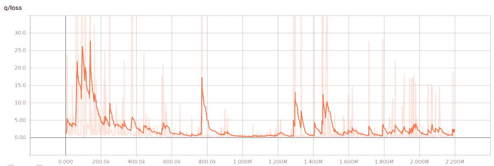

# 第十章：强化学习与视频游戏

与监督学习不同，监督学习要求算法将输入与输出关联起来，而强化学习则是另一种最大化任务。在强化学习中，你会被给定一个环境（即一个情境），并需要找到一个解决方案，进行行动（这可能需要与环境进行交互，甚至改变环境本身），其明确目标是最大化最终的奖励。因此，强化学习算法没有明确的目标，而是致力于获得最终可能的最大结果。它们可以通过反复试验和错误的方式自由地找到实现结果的路径。这类似于幼儿在新环境中自由实验并分析反馈，以便找出如何从经验中获得最佳效果的过程。它也类似于我们玩新视频游戏时的体验：首先，我们寻找最佳的获胜策略；尝试许多不同的方式，然后决定如何在游戏中行动。

目前，没有任何强化学习算法具有人类的通用学习能力。人类能从多种输入中更快速地学习，并且能够在非常复杂、多变、有结构、无结构和多重环境中学习如何行为。然而，强化学习算法已经证明能够在非常具体的任务中达到超越人类的能力（是的，它们可以比人类做得更好）。如果强化学习算法专注于某个特定游戏，并且有足够的时间进行学习，它们可以取得出色的成果（例如 AlphaGo [`deepmind.com/research/alphago/`](https://deepmind.com/research/alphago/) —— 第一个击败围棋世界冠军的计算机程序，围棋是一项复杂的游戏，需要长期的策略和直觉）。

在本章中，我们将为你提供一个具有挑战性的项目，要求你让强化学习算法学习如何成功地控制 Atari 游戏《月球着陆者》的指令，该算法由深度学习提供支持。《月球着陆者》是这个项目的理想游戏，因为强化学习算法可以成功地在其中工作，游戏命令较少，并且仅通过查看描述游戏情境的几个数值，就能成功完成游戏（实际上，甚至不需要看屏幕来理解该怎么做，事实上，游戏的第一个版本可以追溯到 1960 年代，它是文字版的）。

神经网络和强化学习彼此并不陌生；在 1990 年代初期，IBM 的 Gerry Tesauro 编程了著名的 TD-Gammon，将前馈神经网络与时间差学习（蒙特卡洛方法和动态规划的结合）结合，训练 TD-Gammon 玩世界级的西洋双陆棋（一种使用骰子的两人棋盘游戏）。如果你对这款游戏感兴趣，可以通过美国双陆棋协会阅读规则：[`usbgf.org/learn-backgammon/backgammon-rules-and-terms/rules-of-backgammon/`](http://usbgf.org/learn-backgammon/backgammon-rules-and-terms/rules-of-backgammon/)。当时，这种方法在西洋双陆棋中效果很好，因为骰子在游戏中起着非确定性作用。然而，它在其他更具确定性的问题游戏中却失败了。近年来，感谢谷歌深度学习团队的研究人员证明，神经网络可以帮助解决除西洋双陆棋外的其他问题，而且问题解决可以在任何人的计算机上实现。现在，强化学习已成为深度学习和机器学习领域的下一个重要趋势，正如你可以从谷歌大脑的 AI 研究科学家 Ian Goodfellow 的文章中看到，他把它列为首要事项：[`www.forbes.com/sites/quora/2017/07/21/whats-next-for-deep-learning/#6a8f8cd81002`](https://www.forbes.com/sites/quora/2017/07/21/whats-next-for-deep-learning/#6a8f8cd81002)。

# 游戏的遗产

《月球着陆者》是由 Atari 公司开发的一款街机游戏，首次出现在大约 1979 年的电子游戏街机中。该游戏采用黑白矢量图形开发，并通过特制的机柜分发，展示了一个从侧面视角看到的月球着陆舱接近月球的场景，月球上有专门的着陆区域。由于周围地形的原因，着陆区域的宽度和可达性有所不同，因此着陆时会给玩家不同的分数。玩家会得到关于高度、速度、剩余燃料、得分和至今用时的信息。由于重力的作用将着陆舱吸引到地面，玩家可以旋转或推动着陆舱（同时需要考虑惯性力），以消耗部分燃料。燃料是游戏的关键。

游戏在着陆舱用尽燃料后触碰到月球时结束。直到燃料耗尽，你一直在玩游戏，即使你发生了碰撞。玩家可以使用的指令只有四个按钮：两个用于向左和向右旋转；一个用于从着陆舱底部推力，推动模块朝着其朝向的方向；最后一个按钮用于中止着陆，通过将着陆舱旋转至竖直状态并使用强力（且耗费燃料的）推力，以防止着陆舱坠毁。

这个游戏的有趣之处在于，尽管存在明显的成本和奖励，但有些是立刻显现的（比如你在尝试过程中消耗的燃料量），而其他则是直到着陆舱触碰到地面时才会出现（只有当着陆舱完全停止后，你才能知道着陆是否成功）。为了着陆而进行的操控消耗燃料，因此需要一种经济的游戏策略，尽量避免浪费过多燃料。着陆会提供一个分数，着陆越困难且越安全，分数就越高。

# OpenAI 版本

正如其官网上的文档所述（[`gym.openai.com/`](https://gym.openai.com/)），OpenAI Gym 是一个用于开发和比较强化学习算法的工具包。这个工具包实际上是一个 Python 包，支持 Python 2 和 Python 3 运行，还有网站 API，可以上传你自己算法的性能结果，并与其他结果进行比较（这个工具包的一个方面我们并不会探讨）。

这个工具包体现了强化学习的基本原理，其中包括一个环境和一个代理：代理可以在环境中执行动作或不动作，环境会返回一个新的状态（表示环境中的情况）和奖励，奖励是一个分数，用来告诉代理它是否做得好。Gym 工具包提供了环境的一切，因此你需要编写代理的算法，帮助代理应对环境。环境通过 `env` 类来处理，这个类包含强化学习方法，实例化后可用于特定游戏，通过命令 `gym.make('environment')` 创建。让我们来看一个来自官方文档的示例：

```py
import gym
env = gym.make('CartPole-v0')
for i_episode in range(20):
      observation = env.reset()
      for t in range(100):
                  env.render()
                  print(observation)
                  # taking a random action
                  action = env.action_space.sample()
                  observation, reward, done, info = \   
                                             env.step(action)
                  If done:
                     print("Episode finished after %i \
                           timesteps" % (t+1))
                     break
```

在这个示例中，运行环境是 `CartPole-v0`。主要是一个控制问题，在 `CartPole-v0` 游戏中，一个摆锤被固定在一个沿无摩擦轨道移动的小车上。游戏的目的是通过对小车施加前进或后退的力量，使摆锤尽可能保持直立。你可以通过观看这个 YouTube 视频，了解游戏的动态，该视频是 IIT Madras 动力学与控制实验室的一项实际实验的一部分，并基于“类似神经元的自适应元素能够解决困难的控制问题”：[`www.youtube.com/watch?v=qMlcsc43-lg`](https://www.youtube.com/watch?v=qMlcsc43-lg)。

Cartpole 问题在*类似神经元的自适应元素能够解决困难的学习控制问题*（[`ieeexplore.ieee.org/document/6313077/`](http://ieeexplore.ieee.org/document/6313077/)）一文中由 BARTO, Andrew G.; SUTTON, Richard S.; ANDERSON, Charles W. 在 IEEE Transactions on Systems, Man, and Cybernetics 中描述。

以下是应用于示例中的 env 方法的简要说明：

+   `reset()`：这将重置环境的状态为初始默认条件。实际上，它返回起始观察值。

+   `step(action)`：这将使环境按单个时间步移动。它返回一个由四个值组成的向量：`observations`、`reward`、`done`和`info`。观察值是环境状态的表示，并且在每个游戏中由不同的数值向量表示。例如，在涉及物理的游戏（如`CartPole-v0`）中，返回的向量包括小车的位置、小车的速度、杆的角度和杆的速度。奖励是上一个动作获得的分数（你需要累计奖励，以便计算每一时刻的总得分）。变量`done`是一个布尔标志，告诉你是否已到达游戏的终止状态（游戏结束）。`info`将提供诊断信息，尽管这些信息在算法中不应使用，但可以用于调试。

+   `render( mode='human', close=False)`：这将渲染环境的一个时间帧。默认模式将执行一些人性化的操作，例如弹出一个窗口。传递`close`标志会指示渲染引擎关闭任何此类窗口。

命令的最终效果如下：

+   设置`CartPole-v0`环境

+   运行 1,000 步

+   随机选择是否对小车施加正向或负向的力

+   可视化结果

这种方法的有趣之处在于，你可以轻松地更改游戏，只需提供不同的字符串给`gym.make`方法（例如尝试`MsPacman-v0`或`Breakout-v0`，或者从通过`gym.print(envs.registry.all())`获得的列表中选择任何一个）即可，在不改变代码的情况下测试你解决不同环境的方案。OpenAI Gym 通过为所有环境提供通用接口，使得测试你算法在不同问题上的泛化能力变得容易。此外，它为你提供了一个框架，帮助你根据该模式推理、理解和解决智能体与环境的问题。在时刻*t-1*，状态和奖励被传送给智能体，智能体做出反应并执行一个动作，在时刻`t`产生一个新的状态和奖励：


图 1：环境和智能体通过状态、动作和奖励进行交互的方式

在 OpenAI Gym 中的每个不同游戏中，动作空间（智能体响应的命令）和`observation_space`（状态的表示）都会发生变化。你可以通过使用一些`print`命令，在设置环境之后查看它们的变化：

```py
print(env.action_space)
print(env.observation_space)
print(env.observation_space.high)
print(env.observation_space.low)
```

# 在 Linux（Ubuntu 14.04 或 16.04）上安装 OpenAI

我们建议在 Ubuntu 系统上安装此环境。OpenGym AI 是为 Linux 系统创建的，对 Windows 的支持较少。根据你系统之前的设置，可能需要先安装一些额外的组件：

```py
apt-get install -y python3-dev python-dev python-numpy libcupti-dev libjpeg-turbo8-dev make golang tmux htop chromium-browser git cmake zlib1g-dev libjpeg-dev xvfb libav-tools xorg-dev python-opengl libboost-all-dev libsdl2-dev swig
```

我们建议使用 Anaconda，所以也安装 Anaconda 3。你可以在[`www.anaconda.com/download/`](https://www.anaconda.com/download/)找到关于安装这个 Python 发行版的所有信息。

设置系统要求后，安装 OpenGym AI 及其所有模块非常简单：

```py
git clone https://github.com/openai/gym
cd gym
pip install -e .[all]
```

对于这个项目，我们实际上是想使用 Box2D 模块，它是一个 2D 物理引擎，提供在 2D 环境中模拟真实世界物理的渲染效果，通常在伪现实的电子游戏中能看到。你可以通过在 Python 中运行这些命令来测试 Box2D 模块是否正常工作：

```py
import gym
env = gym.make('LunarLander-v2')
env.reset()
env.render()
```

如果提供的代码运行没有问题，你可以继续进行项目。在某些情况下，Box2D 可能变得难以运行，例如可能会遇到[`github.com/cbfinn/gps/issues/34`](https://github.com/cbfinn/gps/issues/34)中报告的问题，虽然周围还有许多其他类似的例子。我们发现，将 Gym 安装在基于 Python 3.4 的 `conda` 环境中会使事情变得更加简单：

```py
conda create --name gym python=3.4 anaconda gcc=4.8.5
source activate gym
conda install pip six libgcc swig
conda install -c conda-forge opencv
pip install --upgrade tensorflow-gpu
git clone https://github.com/openai/gym
cd gym
pip install -e .
conda install -c https://conda.anaconda.org/kne pybox2d
```

这个安装顺序应该能让你创建一个适合本章我们要介绍的项目的 `conda` 环境。

# OpenAI Gym 中的 Lunar Lander

LunarLander-v2 是由 OpenAI 工程师 Oleg Klimov 开发的一个场景，灵感来源于原始的 Atari Lunar Lander ([`github.com/olegklimov`](https://github.com/olegklimov))。在实现中，你需要将着陆舱带到一个始终位于坐标 *x=0* 和 *y=0* 的月球平台。此外，你的实际 `x` 和 `y` 位置是已知的，因为它们的值存储在状态向量的前两个元素中，状态向量包含所有信息，供强化学习算法在某一时刻决定采取最佳行动。

这使得任务更加可接近，因为你不需要处理与目标位置相关的模糊或不确定的位置定位问题（这是机器人技术中的常见问题）。


图 2：LunarLander-v2 的运行情况

每一刻，着陆舱都有四个可能的行动可供选择：

+   什么也不做

+   向左旋转

+   向右旋转

+   推力

然后有一个复杂的奖励系统来使事情变得有趣：

+   从屏幕顶部移动到着陆平台并达到零速度的奖励范围从 100 到 140 分（着陆在着陆平台外是可能的）

+   如果着陆舱在没有停下来的情况下离开着陆平台，它会失去一些之前的奖励

+   每一回合（指游戏会话的术语）会在着陆舱坠毁或停下来时结束，分别提供额外的 -100 或 +100 分

+   与地面接触的每条腿加 10 分

+   启动主引擎每帧扣除 -0.3 分（但燃料是无限的）

+   解决这一回合会获得 200 分

这个游戏非常适合离散命令（它们实际上是二进制的：全推力或无推力），因为正如模拟的作者所说，根据庞特里亚金最大值原理，最优的做法是以全推力开火引擎或完全关闭引擎。

这个游戏也可以通过一些简单的启发式方法解决，这些方法基于与目标的距离，并使用**比例积分微分**（**PID**）控制器来管理下降的速度和角度。PID 是用于控制系统的工程解决方案，在这些系统中你有反馈。你可以通过以下网址获取更详细的解释：[`www.csimn.com/CSI_pages/PIDforDummies.html`](https://www.csimn.com/CSI_pages/PIDforDummies.html)。

# 通过深度学习探索强化学习

在这个项目中，我们并不打算开发启发式方法（虽然它仍然是解决许多人工智能问题的有效方法）或构建一个有效的 PID 控制器。相反，我们打算使用深度学习为智能体提供必要的智能，以成功操作月球着陆器视频游戏。

强化学习理论提供了一些框架来解决此类问题：

+   **基于值的学习**：通过计算处于某个状态时的奖励或结果来工作。通过比较不同可能状态的奖励，选择导致最佳状态的动作。Q-learning 就是这种方法的一个例子。

+   **基于策略的学习**：不同的控制策略基于来自环境的奖励进行评估，并决定哪种策略能够获得最佳结果。

+   **基于模型的学习**：这里的理念是复制一个环境模型到智能体中，从而允许智能体模拟不同的动作及其相应的奖励。

在我们的项目中，我们将使用基于值的学习框架；具体而言，我们将采用现在在强化学习中已经成为经典的 Q-learning 方法，这个方法成功地应用于控制游戏，其中一个智能体需要决定一系列动作，最终导致游戏后期的延迟奖励。这个方法由 C.J.C.H. Watkins 在 1989 年在他的博士论文中提出，也被称为**Q-learning**，它基于这样的理念：智能体在一个环境中操作，考虑当前状态，以定义一系列动作，最终获得奖励：


在上述公式中，描述了一个状态`s`在经过一个动作`a`后，如何导致奖励`r`和一个新状态*s'*。从游戏的初始状态开始，该公式应用一系列动作，依次转化每个后续状态，直到游戏结束。你可以将游戏想象成通过一系列动作连接起来的状态链。你还可以解读上述公式，如何通过一系列动作`a`将初始状态`s`转变为最终状态*s'*和最终奖励`r`。

在强化学习中，**策略**是如何选择最佳的动作序列，`a`。策略可以通过一个函数来逼近，称为`Q`，它以当前状态`s`和可能的动作`a`为输入，提供最大奖励`r`的估计，该奖励将从这个动作中得到：


这种方法显然是贪心的，意味着我们仅仅选择在某个精确状态下的最佳动作，因为我们预期始终选择最佳动作将导致最佳结果。因此，在贪心方法中，我们并不考虑可能的动作链条，而只是关注下一个动作`a`。然而，可以很容易证明，只要满足以下条件，我们就可以自信地采用贪心方法，并通过这种策略获得最大奖励：

+   我们找到了完美的策略预言机，`Q`

+   我们操作的环境信息是完备的（即我们可以知道环境的所有信息）

+   环境遵循**马尔科夫原理**（见提示框）

马尔科夫原理指出，未来（状态、奖励）仅依赖于当前状态，而与过去无关，因此我们可以通过仅查看当前状态并忽略过去的发生来推导出应该做什么。

事实上，如果我们将`Q`函数构建为递归函数，我们只需要使用广度优先搜索方法，探索当前状态下我们测试的动作的影响，递归函数将返回可能的最大奖励。

这种方法在计算机模拟中效果很好，但在现实世界中意义不大：

+   环境大多是概率性的。即使你执行了某个动作，也不能确定精确的奖励。

+   环境与过去紧密相关，单独的当前状态无法描述未来的可能性，因为过去可能会带来隐性或长期的后果。

+   环境并不完全可预测，因此你无法预先知道某个动作的奖励，但你可以在事后知道它们（这被称为**后验**条件）。

+   环境非常复杂。你无法在合理的时间内弄清楚一个动作可能带来的所有后果，因此你无法确定某个动作产生的最大奖励。

解决方案是采用近似的`Q`函数，它能够考虑概率性结果，并且不需要通过预测来探索所有未来状态。显然，这应该是一个真正的逼近函数，因为在复杂环境中构建值的查找表是不切实际的（一些状态空间可能是连续值，使得可能的组合数是无限的）。此外，函数可以离线学习，这意味着可以利用智能体的经验（记忆能力变得非常重要）。

之前曾有尝试通过神经网络来逼近`Q`函数，但唯一成功的应用是`TD_Gammon`，一个仅通过多层感知器的强化学习来学习玩跳棋的程序。`TD_Gammon`达到了超人类的水平，但当时它的成功无法在其他游戏中复制，比如国际象棋或围棋。

这导致人们认为神经网络不适合计算`Q`函数，除非游戏本身是随机的（例如你必须在跳棋中掷骰子）。然而，2013 年，Volodymyr Minh 等人发表了一篇关于深度强化学习的论文，*Playing Atari with deep reinforcement learning*（[`www.cs.toronto.edu/~vmnih/docs/dqn.pdf`](https://www.cs.toronto.edu/~vmnih/docs/dqn.pdf)），证明了相反的观点。

这篇论文展示了如何使用神经网络学习一个`Q`函数，以便通过处理视频输入（通过以 60Hz 的频率从 210 x 160 RGB 视频中采样帧）并输出摇杆和开火按钮命令，来玩一系列的 Atari 街机游戏（如 Beam Rider、Breakout、Enduro、Pong、Q*bert、Seaquest 和 Space Invaders）。论文将这种方法命名为**深度 Q 网络**（**DQN**），并且它还介绍了经验重放和探索与利用的概念，我们将在下一节讨论这些概念。这些概念有助于克服在将深度学习应用于强化学习时的一些关键问题：

+   缺乏足够的例子供学习——这是强化学习所必须的，特别是在使用深度学习时更加不可或缺。

+   动作与有效奖励之间的延迟较长，这需要处理进一步行动的序列，这些序列长度不定，直到获得奖励为止。

+   一系列高度相关的行动序列（因为一个动作通常会影响后续的动作），这可能导致任何随机梯度下降算法过拟合最近的例子，或者根本没有以最优方式收敛（随机梯度下降期望的是随机样本，而不是相关样本）。

论文*Human-level control through deep reinforcement learning*（[`www.davidqiu.com:8888/research/nature14236.pdf`](http://www.davidqiu.com:8888/research/nature14236.pdf)）由 Mnih 和其他研究人员撰写，进一步确认了 DQN 的有效性，使用该方法探索了更多的游戏，并将 DQN 的表现与人类玩家及经典强化学习算法进行了比较。

在许多游戏中，DQN 表现得比人类更优秀，尽管长期策略仍然是该算法的一个问题。在某些游戏中，例如*Breakout*，代理发现了巧妙的策略，如通过墙壁挖隧道，将球送过墙壁并轻松摧毁它。在其他游戏中，如*Montezuma's Revenge*，代理依然一无所知。

在论文中，作者详细讨论了智能体如何理解赢得 Breakout 游戏的关键技巧，并提供了一张 DQN 函数响应的图表，展示了如何将较高的奖励分配给那些首先在墙上挖一个洞，然后让球通过它的行为。

# 深度 Q 学习的技巧与窍门

通过神经网络获得的 Q 学习被认为是不稳定的，直到一些技巧使其变得可行和切实可行。尽管最近已经开发出算法的其他变体来解决原始解决方案中的性能和收敛问题，但深度 Q 学习有两个关键动力源。我们项目中没有讨论这些新变体：双 Q 学习、延迟 Q 学习、贪婪 GQ 和快速 Q 学习。我们将要探讨的两个主要的 DQN 动力源是 **经验回放** 和 **探索与利用之间的逐渐权衡**。

通过经验回放，我们只需将游戏中观察到的状态存储在一个固定大小的队列中，因为当队列满时，我们会丢弃较早的序列。存储的数据中，我们预计包含多个元组，每个元组由当前状态、所采取的动作、由此得到的状态以及获得的奖励组成。如果我们考虑一个更简单的元组，只包含当前状态和动作，那么我们就得到了智能体在环境中操作的观察，这可以被视为后续状态和奖励的根本原因。现在，我们可以将这个元组（当前状态和动作）视为我们对于奖励的预测器（`x` 向量）。因此，我们可以直接使用与动作相关的奖励，以及在游戏结束时将会获得的奖励。

给定这些存储的数据（我们可以把它看作是智能体的记忆），我们从中随机抽取一些，以创建一个批次并用来训练我们的神经网络。然而，在将数据传递给网络之前，我们需要定义我们的目标变量，即我们的 `y` 向量。由于抽取的状态大多数不会是最终状态，我们可能会得到零奖励或仅是部分奖励，用来与已知的输入（当前状态和所选动作）进行匹配。部分奖励的意义不大，因为它只是告诉我们故事的一部分。我们的目标实际上是知道在游戏结束时我们将获得的总奖励，在评估当前状态下所采取的动作后（即我们的 `x` 值）。

在这种情况下，由于我们没有这样的信息，我们只需尝试通过使用现有的 `Q` 函数来近似值，以估计将会是（状态，动作）元组最大结果的剩余奖励。获得这个值后，我们使用贝尔曼方程对其进行折扣。

你可以在这篇由 Google 的软件工程师 Dr. Sal Candido 编写的优秀教程中阅读关于这一经典强化学习方法的解释：[`robotics.ai.uiuc.edu/~scandido/?Developing_Reinforcement_Learning_from_the_Bellman_Equation`](http://robotics.ai.uiuc.edu/~scandido/?Developing_Reinforcement_Learning_from_the_Bellman_Equation)，其中当前奖励被加上折扣后的未来奖励。

使用一个较小的折扣值（接近零）使得`Q`函数更倾向于短期奖励，而使用较高的折扣值（接近一）则使`Q`函数更注重未来收益。

第二个非常有效的技巧是使用一个系数来在探索和利用之间进行权衡。在探索中，智能体会尝试不同的动作，以便在给定某个状态时找到最佳的行动方案。在利用中，智能体则利用之前探索中学到的内容，直接选择它认为在该情境下最好的行动。

在探索与利用之间找到一个良好的平衡，与我们之前讨论的经验重放的使用紧密相关。在 DQN 算法优化的开始阶段，我们只能依赖一组随机的网络参数。这就像在本章的简单入门示例中我们做的那样，随机选择动作。在这种情况下，智能体会探索不同的状态和动作，帮助塑造初始的`Q`函数。对于像*Lunar Lander*这样复杂的游戏，单纯依靠随机选择无法带领智能体走得很远，甚至在长期看来可能变得低效，因为它会阻止智能体学习那些只能在智能体做出正确行为后才能访问的状态-动作组合的预期奖励。实际上，在这种情况下，DQN 算法会很难弄清楚如何恰当地为一个动作分配正确的奖励，因为它从未见过一个完整的游戏。由于游戏本身很复杂，通过随机动作序列解决问题是不太可能的。

正确的方法是平衡通过随机性学习和利用已学知识推动智能体向前发展，直到进入尚未解决的问题区域。这类似于通过一系列逐步逼近找到解决方案，每次都将智能体带得更接近正确的行动序列，以实现安全且成功的着陆。因此，智能体应该首先通过随机方式学习，在某些情境下找到最佳的行动方案，然后应用学到的内容，进入新的情境，在这些情境中，智能体会通过随机选择继续解决问题、学习并逐步应用。

这是通过使用一个递减的值作为阈值，帮助智能体决定在游戏的某个时刻是选择随机行动看看会发生什么，还是利用迄今为止学到的知识，结合其实际能力来做出最佳的可能行动。通过从均匀分布中选择一个随机数字[`0`,`1`]，智能体将其与一个 epsilon 值进行比较，如果随机数字大于 epsilon，它将使用近似的神经网络`Q`函数。否则，它将从可选动作中随机选择一个。之后，epsilon 值会减小。最初，epsilon 设置为最大值*1.0*，但根据衰减因子，它会随着时间推移以不同的速度减小，最终达到一个最小值，且永远不为零（避免完全没有随机动作的机会），以确保总有可能通过意外的方式学习到新的、不期而遇的东西（最小的开放性因素）。

# 理解深度 Q 学习的局限性

即便是深度 Q 学习，也存在一些限制，无论你是通过从视觉图像还是其他环境观察来近似你的`Q`函数：

+   近似过程需要很长时间才能收敛，有时甚至不能平稳收敛：你可能会看到神经网络的学习指标在许多回合中变得更差，而不是变得更好。

+   由于基于贪婪方法，Q 学习提供的方法与启发式方法类似：它指明了最佳方向，但无法提供详细的规划。当面对长期目标或需要分解成子目标的目标时，Q 学习表现不佳。

+   Q 学习的另一个后果是，它并不从整体的角度理解游戏动态，而是从特定的角度理解（它复制了在训练过程中有效的经验）。因此，游戏中任何新引入的内容（在训练过程中从未实际经历过）都可能导致算法崩溃，使其完全无效。同样，当引入一个新游戏到算法时，它根本无法表现出应有的效果。

# 开始项目

在经历了关于强化学习和 DQN 方法的长时间绕行后，我们终于准备好开始编码，已经具备了如何操作 OpenAI Gym 环境以及如何设置`Q`函数的 DQN 近似的基本理解。我们只需导入所有必要的包：

```py
import gym
from gym import wrappers
import numpy as np
import random, tempfile, os
from collections import deque
import tensorflow as tf
```

`tempfile`模块生成临时文件和目录，可以作为数据文件的临时存储区。`deque`命令来自`collections`模块，用于创建一个双端队列，实际上是一个可以在开始或结束处添加项的列表。有趣的是，它可以设置为预定义的大小。队列满时，较旧的项会被丢弃，以腾出位置给新项。

我们将通过一系列类来构建这个项目，表示代理、代理的大脑（我们的 DQN）、代理的记忆和环境，环境由 OpenAI Gym 提供，但需要正确地与代理连接。需要为此编写一个类。

# 定义 AI 大脑

项目的第一步是创建一个`Brain`类，其中包含所有的神经网络代码，以便计算 Q 值近似值。该类将包含必要的初始化代码，用于创建适当的 TensorFlow 图，构建一个简单的神经网络（不是复杂的深度学习架构，而是一个适用于我们项目的简单、可运行的网络——你可以将其替换为更复杂的架构），最后，还包括拟合和预测操作的方法。

我们从初始化开始。作为输入，首先，我们确实需要知道与游戏中接收到的信息相关的状态输入的大小（`nS`），以及与我们可以按下的按钮对应的动作输出的大小（`nA`）。可以选择性地（但强烈推荐）设置作用域。为了定义作用域，我们需要一个字符串来帮助我们区分为不同目的创建的网络，在我们的项目中，我们有两个，一个用于处理下一个奖励，另一个用于猜测最终奖励。

然后，我们需要为优化器定义学习率，优化器使用的是 Adam。

Adam 优化器在以下论文中有描述：[`arxiv.org/abs/1412.6980.`](https://arxiv.org/abs/1412.6980)它是一种非常高效的基于梯度的优化方法，只需要很少的调节即可正常工作。Adam 优化是一个随机梯度下降算法，类似于带动量的 RMSprop。来自 UC Berkeley 计算机视觉评论信函的这篇文章，[`theberkeleyview.wordpress.com/2015/11/19/berkeleyview-for-adam-a-method-for-stochastic-optimization/`](https://theberkeleyview.wordpress.com/2015/11/19/berkeleyview-for-adam-a-method-for-stochastic-optimization/)，提供了更多信息。根据我们的经验，它是训练深度学习算法时最有效的解决方案之一，并且需要对学习率进行一些调优。

最后，我们还提供：

+   神经网络架构（如果我们希望更改类中提供的基础架构）

+   输入`global_step`，这是一个全局变量，用于追踪到目前为止已经喂入 DQN 网络的训练批次数量。

+   存储 TensorBoard 日志的目录，这是 TensorFlow 的标准可视化工具。

```py
class Brain:
    """
    A Q-Value approximation obtained using a neural network.
    This network is used for both the Q-Network and the Target Network.
    """
    def __init__(self, nS, nA, scope="estimator",
                 learning_rate=0.0001,
                 neural_architecture=None,
                 global_step=None, summaries_dir=None):
        self.nS = nS
        self.nA = nA
        self.global_step = global_step
        self.scope = scope
        self.learning_rate = learning_rate
        if not neural_architecture:
            neural_architecture = self.two_layers_network
        # Writes Tensorboard summaries to disk
        with tf.variable_scope(scope):
            # Build the graph
            self.create_network(network=neural_architecture,              
                                learning_rate=self.learning_rate)
            if summaries_dir:
                summary_dir = os.path.join(summaries_dir, 
                                          "summaries_%s" % scope)
                if not os.path.exists(summary_dir):
                    os.makedirs(summary_dir)
                self.summary_writer = \
                               tf.summary.FileWriter(summary_dir)
            else:
                self.summary_writer = None
```

命令`tf.summary.FileWriter`在目标目录（`summary_dir`）中初始化一个事件文件，用于存储学习过程中的关键度量。该句柄保存在`self.summary_writer`中，我们稍后将使用它来存储我们希望在训练过程中以及训练后用于监控和调试学习情况的度量。

接下来定义的方法是我们将在此项目中使用的默认神经网络。作为输入，它接受输入层以及我们将使用的隐藏层的相应大小。输入层由我们使用的状态定义，状态可以是测量值的向量（如我们案例中的情况），或者是图像（如原始 DQN 论文中的情况）。

这样的层是通过 TensorFlow 的`Layers`模块提供的高级操作来定义的（[`www.tensorflow.org/api_guides/python/contrib.layers`](https://www.tensorflow.org/api_guides/python/contrib.layers)）。我们选择了基础的`fully_connected`层，使用`ReLU`（修正线性）激活函数用于两个隐藏层，输出层使用线性激活函数。

预定义的 32 的大小对于我们的目的来说是完全合适的，但如果你愿意，可以增加它。此外，网络中没有使用 dropout。显然，这里问题不在于过拟合，而是学习的质量，只有通过提供有用的、不相关的状态序列，并对最终的奖励做出良好的估计，才能改善学习质量。在有用的状态序列中，尤其是在探索与利用的权衡下，避免网络过拟合的关键所在。强化学习问题中，如果你陷入以下两种情况之一，就说明你的网络已经过拟合：

+   次优性：算法会建议次优的解决方案，也就是说，我们的着陆器学会了一种粗略的着陆方式，并坚持使用这种方式，因为至少它能成功着陆。

+   无助性：算法已经陷入了学到的无助状态，也就是说，它没有找到正确着陆的方法，因此它只是接受最不坏的方式去“撞击”。

这两种情况对于强化学习算法（如 DQN）来说，可能非常难以克服，除非该算法在游戏过程中能够有机会探索替代解决方案。偶尔采取随机动作，并非单纯的“搞乱事情”策略，正如你最初可能会认为的那样，而是一种避免陷阱的策略。

然而，对于比这个更大的网络，你可能会遇到“神经元死亡”问题，这时需要使用不同的激活函数，如`tf.nn.leaky_relu`（[`www.tensorflow.org/api_docs/python/tf/nn/leaky_relu`](https://www.tensorflow.org/api_docs/python/tf/nn/leaky_relu)），以便获得一个正常工作的网络。

死亡的`ReLU`最终总是输出相同的值，通常是零，并且它对反向传播更新变得抗拒。

激活函数 `leaky_relu` 从 TensorFlow 1.4 开始可用。如果你使用的是 TensorFlow 的较早版本，可以创建一个 `ad hoc` 函数，用于自定义网络：

`def leaky_relu(x, alpha=0.2):       return tf.nn.relu(x) - alpha * tf.nn.relu(-x)`

现在我们继续编写 `Brain` 类的代码，为它添加一些更多的功能：

```py
def two_layers_network(self, x, layer_1_nodes=32, 
                                layer_2_nodes=32):

    layer_1 = tf.contrib.layers.fully_connected(x, layer_1_nodes, 
                                        activation_fn=tf.nn.relu)
    layer_2 = tf.contrib.layers.fully_connected(layer_1, 
                                          layer_2_nodes, 
                               activation_fn=tf.nn.relu)
    return tf.contrib.layers.fully_connected(layer_2, self.nA, 
                                           activation_fn=None)
```

`create_network` 方法结合了输入、神经网络、损失和优化。损失通过计算原始奖励与估计结果之间的差异，平方并计算批次中所有示例的平均值来创建。损失使用 Adam 优化器进行最小化。

此外，还记录了一些总结供 TensorBoard 使用：

+   批次的平均损失，用于跟踪训练过程中的拟合情况

+   批次中的最大预测奖励，用于跟踪极端的正向预测，指出最好的胜利动作

+   批次中的平均预测奖励，用于跟踪预测好动作的整体趋势

以下是 `create_network` 的代码，这是我们项目的 TensorFlow 引擎：

```py
    def create_network(self, network, learning_rate=0.0001):

        # Placeholders for states input
        self.X = tf.placeholder(shape=[None, self.nS], 
                                 dtype=tf.float32, name="X")
        # The r target value
        self.y = tf.placeholder(shape=[None, self.nA], 
                                 dtype=tf.float32, name="y")
        # Applying the choosen network
        self.predictions = network(self.X)
        # Calculating the loss
        sq_diff = tf.squared_difference(self.y, self.predictions)
        self.loss = tf.reduce_mean(sq_diff)
        # Optimizing parameters using the Adam optimizer
        self.train_op = tf.contrib.layers.optimize_loss(self.loss, 
                        global_step=tf.train.get_global_step(),                                      
                        learning_rate=learning_rate, 
                        optimizer='Adam')
        # Recording summaries for Tensorboard
        self.summaries = tf.summary.merge([
            tf.summary.scalar("loss", self.loss),
            tf.summary.scalar("max_q_value", 
                             tf.reduce_max(self.predictions)),
            tf.summary.scalar("mean_q_value", 
                             tf.reduce_mean(self.predictions))])
```

该类通过 `predict` 和 `fit` 方法完成。`fit` 方法将状态矩阵 `s` 作为输入批次，将奖励向量 `r` 作为输出结果。它还考虑了训练的轮次数量（在原始论文中建议每个批次仅使用一个 epoch，以避免过拟合每个批次的观察数据）。然后，在当前会话中，输入会根据结果和总结（我们创建网络时已定义）进行拟合。

```py
    def predict(self, sess, s):
        """
        Predicting q values for actions
        """
        return sess.run(self.predictions, {self.X: s})

    def fit(self, sess, s, r, epochs=1):
        """
        Updating the Q* function estimator
        """
        feed_dict = {self.X: s, self.y: r}
        for epoch in range(epochs):
            res = sess.run([self.summaries, self.train_op, 
                            self.loss, 
                            self.predictions,
                            tf.train.get_global_step()], 
                            feed_dict)
            summaries, train_op, loss, predictions, 
                                       self.global_step = res

        if self.summary_writer:
            self.summary_writer.add_summary(summaries,
self.global_step)
```

结果返回 `global step`，它是一个计数器，帮助跟踪到目前为止在训练中使用的示例数量，并记录以备后续使用。

# 为经验回放创建内存

在定义大脑（TensorFlow 神经网络）后，下一步是定义内存，这是存储数据的地方，这些数据将驱动 DQN 网络的学习过程。在每次训练的回合中，每一步（由一个状态和一个动作组成）都会被记录下来，并附上相应的状态和回合的最终奖励（这个奖励只有在回合结束时才能知道）。

添加一个标志，标明该观察是否为终止状态，完成了所记录信息的集合。这个想法是将某些动作与不仅是即时奖励（可能为零或适中），而是结束奖励相关联，从而将每个动作与该回合的最终奖励联系起来。

类 memory 只是一个固定大小的队列，然后用以前游戏经验的信息填充，且可以轻松从中进行采样和提取。由于其大小是固定的，因此很重要的一点是要将较旧的示例从队列中推除出去，从而确保可用示例始终是最近的那些。

该类包含一个初始化过程，其中数据结构起源并且其大小是固定的，`len`方法（以便我们知道内存是否已满，这在某些情况下非常有用，例如等待训练，至少等到我们有足够的数据进行更好的随机化和多样化学习），`add_memory`用于记录到队列中，以及`recall_memory`用于以列表格式从队列中恢复所有数据：

```py
class Memory:
    """
    A memory class based on deque, a list-like container with 
    fast appends and pops on either end (from the collections 
    package)
    """
    def __init__(self, memory_size=5000):
        self.memory = deque(maxlen=memory_size)

    def __len__(self):
        return len(self.memory)

    def add_memory(self, s, a, r, s_, status):
        """
        Memorizing the tuple (s a r s_) plus the Boolean flag status,
        reminding if we are at a terminal move or not
        """
        self.memory.append((s, a, r, s_, status))

    def recall_memories(self):
        """
        Returning all the memorized data at once
        """
        return list(self.memory)
```

# 创建代理

下一个类是代理，负责初始化和维护大脑（提供*Q 值*函数近似）和记忆。代理还会在环境中执行动作。它的初始化设置了一系列参数，这些参数大部分是固定的，根据我们在优化《Lunar Lander》游戏学习中的经验得出的。不过，在代理首次初始化时，这些参数是可以显式更改的：

+   `epsilon = 1.0` 是探索-利用参数的初始值。`1.0`的值强制代理完全依赖于探索，即随机移动。

+   `epsilon_min = 0.01` 设置探索-利用参数的最小值：`0.01`的值意味着着陆舱有 1%的几率会随机移动，而不是基于`Q`函数的反馈。这始终提供了一个最小的机会来找到完成游戏的另一种最优方式，而不会影响游戏的进行。

+   `epsilon_decay = 0.9994` 是调节`epsilon`向最小值衰减速度的衰减因子。在此设置中，它被调整为大约在 5,000 个回合后达到最小值，这样平均应能为算法提供至少 200 万次学习的样本。

+   `gamma = 0.99` 是奖励折扣因子，通过它，Q 值估计将未来奖励相对于当前奖励的权重进行调整，从而使算法根据所玩的游戏类型可以短视或长视（在《Lunar Lander》中，最好是长视，因为实际的奖励只有在着陆舱成功着陆月球时才能体验）。

+   `learning_rate = 0.0001` 是 Adam 优化器用于学习批量样本的学习率。

+   `epochs = 1` 是神经网络用来拟合批量样本集的训练轮次。

+   `batch_size = 32` 是批量样本的大小。

+   `memory = Memory(memory_size=250000)` 是记忆队列的大小。

使用预设的参数，您可以确保当前项目能够正常运行。对于不同的 OpenAI 环境，您可能需要找到不同的最优参数。

初始化还将提供定义 TensorBoard 日志存放位置的命令（默认情况下为`experiment`目录），用于学习如何估算下一个即时奖励的模型，以及另一个用于存储最终奖励权重的模型。此外，还将初始化一个 saver（`tf.train.Saver`），允许将整个会话序列化到磁盘，以便稍后恢复并用于实际游戏的播放，而不仅仅是学习如何玩游戏。

这两个提到的模型在同一会话中初始化，使用不同的作用域名称（一个是`q`，用于监控 TensorBoard 的下一个奖励模型；另一个是`target_q`）。使用两个不同的作用域名称将方便神经元系数的处理，使得可以通过类中其他方法交换它们：

```py
class Agent:
    def __init__(self, nS, nA, experiment_dir):
        # Initializing
        self.nS = nS
        self.nA = nA
        self.epsilon = 1.0  # exploration-exploitation ratio
        self.epsilon_min = 0.01
        self.epsilon_decay = 0.9994
        self.gamma = 0.99  # reward decay
        self.learning_rate = 0.0001
        self.epochs = 1  # training epochs
        self.batch_size = 32
        self.memory = Memory(memory_size=250000)

        # Creating estimators
        self.experiment_dir =os.path.abspath\    
                      ("./experiments/{}".format(experiment_dir))
        self.global_step = tf.Variable(0, name='global_step', 
                                                trainable=False)
        self.model = Brain(nS=self.nS, nA=self.nA, scope="q",
                           learning_rate=self.learning_rate,
                           global_step=self.global_step,
                           summaries_dir=self.experiment_dir)
        self.target_model = Brain(nS=self.nS, nA=self.nA, 
                                             scope="target_q",
                             learning_rate=self.learning_rate,
                                 global_step=self.global_step)

        # Adding an op to initialize the variables.
        init_op = tf.global_variables_initializer()
        # Adding ops to save and restore all the variables.
        self.saver = tf.train.Saver()

        # Setting up the session
        self.sess = tf.Session()
        self.sess.run(init_op)
```

`epsilon`涉及用于探索新解决方案的时间比例与利用网络知识的时间比例，并通过`epsilon_update`方法不断更新，该方法通过将当前`epsilon`乘以`epsilon_decay`来修改`epsilon`，除非它已经达到了允许的最小值：

```py
def epsilon_update(self, t):
    if self.epsilon > self.epsilon_min:
        self.epsilon *= self.epsilon_decay
```

`save_weights`和`load_weights`方法仅允许会话保存：

```py
    def save_weights(self, filename):
        """
        Saving the weights of a model
        """
        save_path = self.saver.save(self.sess, 
                                    "%s.ckpt" % filename)
        print("Model saved in file: %s" % save_path)
def load_weights(self, filename):
    """
    Restoring the weights of a model
    """
    self.saver.restore(self.sess, "%s.ckpt" % filename)
    print("Model restored from file")
```

`set_weights`和`target_model_update`方法协同工作，用于通过 Q 网络的权重更新目标 Q 网络（`set_weights`是一个通用的、可重用的函数，您也可以在自己的解决方案中使用）。由于我们给这两个作用域命名不同，所以很容易从可训练变量的列表中列出每个网络的变量。一旦列出，变量会被组合并通过运行中的会话执行赋值操作：

```py
    def set_weights(self, model_1, model_2):
        """
        Replicates the model parameters of one 
        estimator to another.
        model_1: Estimator to copy the parameters from
        model_2: Estimator to copy the parameters to
        """
        # Enumerating and sorting the parameters 
        # of the two models
        model_1_params = [t for t in tf.trainable_variables() \
                          if t.name.startswith(model_1.scope)]
        model_2_params = [t for t in tf.trainable_variables() \
                         if t.name.startswith(model_2.scope)]
        model_1_params = sorted(model_1_params, 
                                key=lambda x: x.name)
        model_2_params = sorted(model_2_params, 
                                key=lambda x: x.name)
        # Enumerating the operations to be done
        operations = [coef_2.assign(coef_1) for coef_1, coef_2 \
                      in zip(model_1_params, model_2_params)]
        # Executing the operations to be done
        self.sess.run(operations)
    def target_model_update(self):
        """
        Setting the model weights to the target model's ones
        """
        self.set_weights(self.model, self.target_model)
```

`act`方法是策略实现的核心，因为它会根据`epsilon`的值决定是采取随机动作还是选择最佳可能的动作。如果选择最佳动作，它会请求训练好的 Q 网络为每个可能的下一个动作（在 Lunar Lander 游戏中通过按下四个按钮之一以二进制方式表示）提供奖励估计，并返回具有最大预测奖励的动作（这是一种贪婪方法）：

```py
    def act(self, s):
        """
        Having the agent act based on learned Q* function
        or by random choice (based on epsilon)
        """
        # Based on epsilon predicting or randomly 
        # choosing the next action
        if np.random.rand() <= self.epsilon:
            return np.random.choice(self.nA)
        else:
            # Estimating q for all possible actions
            q = self.model.predict(self.sess, s)[0]
            # Returning the best action
            best_action = np.argmax(q)
            return best_action
```

`replay`方法完成了该类。它是一个关键方法，因为它使得 DQN 算法的学习成为可能。因此，我们将详细讨论它的工作原理。`replay`方法做的第一件事是从之前游戏回合的记忆中采样一个批次（批次大小在初始化时定义）（这些记忆变量包含状态、动作、奖励、下一个状态以及一个标志变量，表示观察是否为最终状态）。随机采样使得模型能够通过批量调整网络权重，一步步地学习 `Q` 函数。

然后，该方法会检查采样回调的状态是否为终止状态。非终止奖励需要更新，以表示游戏结束时获得的奖励。这是通过使用目标网络来完成的，目标网络表示在上次学习结束时固定的`Q`函数网络的快照。目标网络输入以下状态，结果奖励在经过折扣因子 gamma 调整后，与当前奖励相加。

使用当前的`Q`函数可能会导致学习过程中的不稳定，并且可能无法得到令人满意的`Q`函数网络。

```py
    def replay(self):
        # Picking up a random batch from memory
        batch = np.array(random.sample(\
                self.memory.recall_memories(), self.batch_size))
        # Retrieving the sequence of present states
        s = np.vstack(batch[:, 0])
        # Recalling the sequence of actions
        a = np.array(batch[:, 1], dtype=int)
        # Recalling the rewards
        r = np.copy(batch[:, 2])
        # Recalling the sequence of resulting states
        s_p = np.vstack(batch[:, 3])
        # Checking if the reward is relative to 
        # a not terminal state
        status = np.where(batch[:, 4] == False)
        # We use the model to predict the rewards by 
        # our model and the target model
        next_reward = self.model.predict(self.sess, s_p)
        final_reward = self.target_model.predict(self.sess, s_p)

        if len(status[0]) > 0:
            # Non-terminal update rule using the target model
            # If a reward is not from a terminal state, 
            # the reward is just a partial one (r0)
            # We should add the remaining and obtain a 
            # final reward using target predictions
            best_next_action = np.argmax(\
                             next_reward[status, :][0], axis=1)
            # adding the discounted final reward
            r[status] += np.multiply(self.gamma,
                     final_reward[status, best_next_action][0])

        # We replace the expected rewards for actions 
        # when dealing with observed actions and rewards
        expected_reward = self.model.predict(self.sess, s)
        expected_reward[range(self.batch_size), a] = r

        # We re-fit status against predicted/observed rewards
        self.model.fit(self.sess, s, expected_reward,
                       epochs=self.epochs)
```

当非终止状态的奖励更新完成后，批量数据被输入到神经网络中进行训练。

# 指定环境

最后一个需要实现的类是`Environment`类。实际上，环境是由`gym`命令提供的，尽管你需要为它构建一个良好的包装器，以便它能与之前的`agent`类一起工作。这正是这个类所做的事情。在初始化时，它启动了月球着陆器游戏，并设置了关键变量，如`nS`、`nA`（状态和动作的维度）、`agent`以及累计奖励（用于通过提供过去 100 集的平均值来测试解决方案）：

```py
class Environment:
    def __init__(self, game="LunarLander-v2"):
        # Initializing
        np.set_printoptions(precision=2)
        self.env = gym.make(game)
        self.env = wrappers.Monitor(self.env, tempfile.mkdtemp(), 
                               force=True, video_callable=False)
        self.nS = self.env.observation_space.shape[0]
        self.nA = self.env.action_space.n
        self.agent = Agent(self.nS, self.nA, self.env.spec.id)

        # Cumulative reward
        self.reward_avg = deque(maxlen=100)
```

然后，我们为`test`、`train`和`incremental`（增量训练）方法准备代码，这些方法被定义为综合`learning`方法的包装器。

使用增量训练有点棘手，如果你不想破坏到目前为止通过训练获得的结果，它需要一些关注。问题在于，当我们重新启动时，大脑有预训练的系数，但记忆实际上是空的（我们可以称之为冷启动）。由于代理的记忆为空，它无法支持良好的学习，因为示例太少且有限。因此，传入的示例质量实际上并不完美，学习的效果不好（这些示例大多是相互关联的，并且非常特定于那些新体验过的少数几集）。可以通过使用非常低的`epsilon`来降低破坏训练的风险（我们建议设置为最低值`0.01`）：这样，网络大部分时间将仅仅重新学习自己的权重，因为它会为每个状态建议它已经知道的动作，并且它的表现不会恶化，而是以稳定的方式振荡，直到记忆中有足够的示例，网络才会开始再次改进。

以下是发出正确训练和测试方法的代码：

```py
    def test(self):
        self.learn(epsilon=0.0, episodes=100, 
                        trainable=False, incremental=False)

    def train(self, epsilon=1.0, episodes=1000):
        self.learn(epsilon=epsilon, episodes=episodes, 
                        trainable=True, incremental=False)

    def incremental(self, epsilon=0.01, episodes=100):
        self.learn(epsilon=epsilon, episodes=episodes, 
                        trainable=True, incremental=True)
```

最终方法是`learn`，它安排了代理与环境交互并从中学习的所有步骤。该方法接受`epsilon`值（因此会覆盖代理之前的`epsilon`值）、在环境中运行的集数、是否进行训练（布尔标志）以及训练是否从之前模型的训练继续（另一个布尔标志）。

在第一块代码中，方法加载了网络之前训练的权重，以进行 Q 值近似（如果我们需要的话）。

1.  测试网络并查看其如何工作；

1.  使用更多的示例继续进行之前的训练。

然后，方法深入到一个嵌套迭代中。外部迭代运行所需的回合数（每个回合一个 Lunar Lander 游戏的结束）。而内部迭代则是运行一个最多 1,000 步构成的回合。

在每个时间步的迭代中，神经网络会被询问下一步的动作。如果处于测试模式，它将始终简单地提供关于下一个最佳动作的答案。如果处于训练模式，根据`epsilon`的值，可能有一定的概率它不会推荐最佳动作，而是建议进行随机动作。

```py
    def learn(self, epsilon=None, episodes=1000, 
              trainable=True, incremental=False):
        """
        Representing the interaction between the enviroment 
        and the learning agent
        """
        # Restoring weights if required
        if not trainable or (trainable and incremental):
            try:
                print("Loading weights")
                self.agent.load_weights('./weights.h5')
            except:
                print("Exception")
                trainable = True
                incremental = False
                epsilon = 1.0

        # Setting epsilon
        self.agent.epsilon = epsilon
        # Iterating through episodes
        for episode in range(episodes):
            # Initializing a new episode
            episode_reward = 0
            s = self.env.reset()
            # s is put at default values
            s = np.reshape(s, [1, self.nS])

            # Iterating through time frames
            for time_frame in range(1000):
                if not trainable:
                    # If not learning, representing 
                    # the agent on video
                    self.env.render()
                # Deciding on the next action to take
                a = self.agent.act(s)
                # Performing the action and getting feedback
                s_p, r, status, info = self.env.step(a)
                s_p = np.reshape(s_p, [1, self.nS])

                # Adding the reward to the cumulative reward
                episode_reward += r

                # Adding the overall experience to memory
                if trainable:
                    self.agent.memory.add_memory(s, a, r, s_p,
                                                 status)

                # Setting the new state as the current one
                s = s_p

                # Performing experience replay if memory length 
                # is greater than the batch length
                if trainable:
                    if len(self.agent.memory) > \
                           self.agent.batch_size:
                        self.agent.replay()

                # When the episode is completed, 
                # exiting this loop
                if status:
                    if trainable:
                       self.agent.target_model_update()
                    break

            # Exploration vs exploitation
            self.agent.epsilon_update(episode)

            # Running an average of the past 100 episodes
            self.reward_avg.append(episode_reward)
            print("episode: %i score: %.2f avg_score: %.2f"
                  "actions %i epsilon %.2f" % (episode,
                                        episode_reward,
                           np.average(self.reward_avg),
                                            time_frame,
                                               epsilon)
        self.env.close()

        if trainable:
            # Saving the weights for the future
            self.agent.save_weights('./weights.h5')
```

移动后，所有信息（初始状态、选择的动作、获得的奖励和后续状态）都会被收集并保存到内存中。在这个时间框架内，如果内存足够大以创建一个用于神经网络近似`Q`函数的批次，那么将执行训练过程。当本次回合的所有时间框架都已经消耗完毕，DQN 的权重会被存储到另一个网络中，作为稳定的参考，以便 DQN 网络在学习新一轮回合时使用。

# 运行强化学习过程

最后，在完成关于强化学习和 DQN 的所有讨论，并编写完整的项目代码后，你可以通过脚本或 Jupyter Notebook 运行它，利用将所有代码功能结合在一起的`Environment`类：

```py
lunar_lander = Environment(game="LunarLander-v2")
```

在实例化之后，你只需运行`train`，从`epsilon=1.0`开始，并将目标设定为`5000`回合（相当于约 220 万个状态、动作和奖励的链变量示例）。我们提供的实际代码已经设定为成功完成一个完全训练的 DQN 模型，尽管这可能需要一些时间，具体取决于你的 GPU 的可用性和计算能力：

```py
    lunar_lander.train(epsilon=1.0, episodes=5000)
```

最终，类将完成所需的训练，并将保存的模型保存在磁盘上（可以随时运行或重新启动）。你甚至可以使用一个简单的命令来检查 TensorBoard，该命令可以从 shell 运行：

```py
tensorboard --logdir=./experiments --port 6006
```

图表将出现在浏览器中，可以在本地地址`localhost:6006`进行查看：



图 4：训练中的损失趋势，峰值代表学习中的瓶颈，例如在 80 万示例时。

当它成功安全着陆时。

损失图表将显示，尽管与其他项目不同，优化过程仍然表现为损失逐渐减少，但在过程中会出现许多峰值和问题：

这里表示的图表是运行项目一次的结果。由于过程中的随机成分，你在自己计算机上运行项目时可能会得到略有不同的图表。


图 5：在批量学习会话中获得的最大 q 值趋势

最大预测的`q`值和平均预测的`q`值讲述了同样的故事。网络在最后有所改善，尽管它可能会略微回溯并在平台上停留较长时间：


图 6：在批量学习会话中获得的平均 q 值趋势

只有在你计算最后 100 个最终奖励的平均值时，才能看到一个渐进的路径，暗示 DQN 网络持续稳定的改进：


图 7：每次学习结束时实际获得的分数趋势，更清晰地描绘了 DQN 能力的增长

使用相同的信息，从输出中，而不是从 TensorBoard 中，你也会发现，所需的动作数量平均取决于`epsilon`值。一开始，完成一集所需的动作数不到 200。突然，当`epsilon`为`0.5`时，所需的平均动作数稳定增长，并在约 750 时达到峰值（着陆舱学会了通过使用火箭来对抗重力）。

最终，网络发现这是一种次优策略，当`epsilon`下降到`0.3`以下时，完成一集所需的平均动作数也有所下降。在这个阶段，DQN 正在发现如何以更高效的方式成功地着陆舱：


图 8：epsilon（探索/利用率）与 DQN 网络效率之间的关系

以完成一集所使用的移动次数表示

如果由于某种原因，你认为网络需要更多的示例和学习，你可以通过增量`method`重新开始学习，记住在这种情况下`epsilon`应该非常低：

```py
lunar_lander.incremental(episodes=25, epsilon=0.01)
```

训练结束后，如果你需要查看结果并了解 DQN 在每 100 集中的平均得分（理想目标是`score >=200`），你只需运行以下命令：

```py
 lunar_lander.test()
```

# 致谢

在这个项目的结尾，我们确实要感谢 Peter Skvarenina，他的项目“Lunar Lander II”([`www.youtube.com/watch?v=yiAmrZuBaYU`](https://www.youtube.com/watch?v=yiAmrZuBaYU))是我们自己项目的主要灵感来源，并感谢他在制作我们自己版本的深度 Q 网络时提供的所有建议和提示。

# 总结

在这个项目中，我们探讨了强化学习算法在 OpenAI 环境中能够实现的目标，并且我们编写了一个 TensorFlow 图，能够学习如何估算一个由代理、状态、动作和相应奖励所构成的环境中的最终奖励。这个方法叫做 DQN，旨在通过神经网络方法来近似贝尔曼方程的结果。最终的结果是一个“月球着陆者”游戏，软件在训练结束后能够成功地通过读取游戏状态并随时决定采取正确的行动来玩这个游戏。
