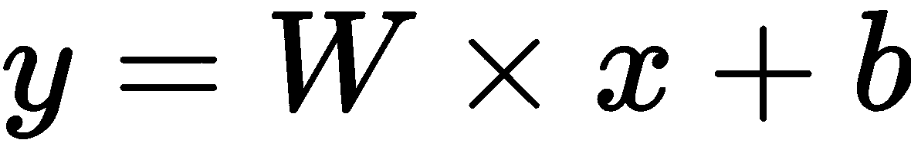
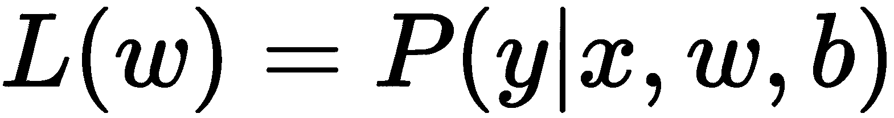

# 第一章：TensorFlow 和机器学习概述

TensorFlow 是一个流行的库，用于实现基于机器学习的解决方案。它包括一个低级 API，称为 TensorFlow 核心，以及许多高级 API，其中两个最受欢迎的 API 被称为 TensorFlow Estimators 和 Keras。在本章中，我们将学习 TensorFlow 的基础知识，并使用逻辑回归构建一个机器学习模型，以手写数字分类为例。

本章将涵盖以下内容：

+   TensorFlow 核心：

    +   TensorFlow 核心中的张量

    +   常量

    +   占位符

    +   操作

    +   来自 Python 对象的张量

    +   变量

    +   来自库函数的张量

+   计算图：

    +   延迟加载和执行顺序

    +   多设备上的图 – CPU 和 GPGPU

    +   使用多个图

+   机器学习、分类和逻辑回归

+   TensorFlow 中的逻辑回归示例

+   Keras 中的逻辑回归示例

你可以通过使用名为 `ch-01_Overview_of_TensorFlow_and_Machine_Learning.ipynb` 的 Jupyter Notebook 来跟随本章中的代码示例，该 Notebook 已包含在代码包中。

# 什么是 TensorFlow？

**TensorFlow** 是一个流行的开源库，广泛用于实现机器学习和深度学习。它最初在 Google 内部构建，后来于 2015 年 11 月 9 日公开发布。从那时起，TensorFlow 被广泛用于开发多个业务领域的机器学习和深度学习模型。

要在我们的项目中使用 TensorFlow，我们需要学习如何使用 TensorFlow API 编程。TensorFlow 有多个 API 可供与库进行交互。TensorFlow 的 API 分为两级：

+   **低级 API**：称为 TensorFlow 核心的 API 提供了细粒度的低级功能。因此，这个低级 API 在使用模型时提供了完全控制。我们将在本章中讨论 TensorFlow 核心。

+   **高级 API**：这些 API 提供了建立在 TensorFlow 核心上的高级功能，比较容易学习和实现。一些高级 API 包括 Estimators、Keras、TFLearn、TFSlim 和 Sonnet。本章中我们也将讨论 Keras。

# TensorFlow 核心

**TensorFlow 核心** 是构建更高层 TensorFlow 模块的低级 API。在本节中，我们将简要回顾 TensorFlow 核心，并了解 TensorFlow 的基本元素。

# 张量

**张量** 是 TensorFlow 中的基本组件。张量是一个多维数据元素集合。它通常由形状、类型和秩来标识。**秩** 指的是张量的维度数，而 **形状** 指的是每个维度的大小。你可能之前见过一些张量的例子，比如零维集合（也称为标量）、一维集合（也称为向量）和二维集合（也称为矩阵）。

标量值是一个秩为 0 且形状为[]的张量。向量或一维数组是一个秩为 1 且形状为[`列数`]或[`行数`]的张量。矩阵或二维数组是一个秩为 2 且形状为[`行数`, `列数`]的张量。三维数组是一个秩为 3 的张量。以此类推，n 维数组是一个秩为 n 的张量。

一个张量可以在其所有维度中存储相同类型的数据，且张量的数据类型与其元素的数据类型相同。

可以在 TensorFlow 库中找到的数据类型在以下链接中有所描述：[`www.tensorflow.org/api_docs/python/tf/DType`](https://www.tensorflow.org/api_docs/python/tf/DType)。

以下是 TensorFlow 中最常用的数据类型：

| **TensorFlow Python API 数据类型** | **描述** |
| --- | --- |
| `tf.float16` | 16 位浮点数（半精度） |
| `tf.float32` | 32 位浮点数（单精度） |
| `tf.float64` | 64 位浮点数（双精度） |
| `tf.int8` | 8 位整数（有符号） |
| `tf.int16` | 16 位整数（有符号） |
| `tf.int32` | 32 位整数（有符号） |
| `tf.int64` | 64 位整数（有符号） |

使用 TensorFlow 数据类型来定义张量，而不是使用 Python 原生数据类型或 NumPy 的数据类型。

张量可以通过以下几种方式创建：

+   通过定义常量、操作和变量，并将值传递给它们的构造函数

+   通过定义占位符并将值传递给`session.run()` 

+   通过将 Python 对象（如标量值、列表、NumPy 数组和 pandas DataFrame）转换为张量，使用`tf.convert_to_tensor()`函数

让我们探索不同的创建张量的方式。

# 常量

常量值张量是通过`tf.constant()`函数创建的，具有以下定义：

```py
tf.constant(
  value,
  dtype=None,
  shape=None,
  name='const_name',
  verify_shape=False
  )
```

让我们用以下代码创建一些常量：

```py
const1=tf.constant(34,name='x1')
const2=tf.constant(59.0,name='y1')
const3=tf.constant(32.0,dtype=tf.float16,name='z1')
```

让我们详细看看前面的代码：

+   第一行代码定义了一个常量张量`const1`，存储值`34`，并命名为`x1`。

+   第二行代码定义了一个常量张量`const2`，存储了值`59.0`，并命名为`y1`。

+   第三行代码为`const3`定义了数据类型`tf.float16`。使用`dtype`参数或将数据类型作为第二个参数来指定数据类型。

让我们打印常量`const1`、`const2`和`const3`：

```py
print('const1 (x): ',const1)
print('const2 (y): ',const2)
print('const3 (z): ',const3)
```

当我们打印这些常量时，我们将得到以下输出：

```py
const1 (x):  Tensor("x:0", shape=(), dtype=int32)
const2 (y):  Tensor("y:0", shape=(), dtype=float32)
const3 (z):  Tensor("z:0", shape=(), dtype=float16)
```

打印之前定义的张量时，我们可以看到`const1`和`const2`的数据类型由 TensorFlow 自动推断。

要打印这些常量的值，我们可以在 TensorFlow 会话中执行它们，使用`tfs.run()`命令：

```py
print('run([const1,const2,c3]) : ',tfs.run([const1,const2,const3]))
```

我们将看到以下输出：

```py
run([const1,const2,const3]) : [34, 59.0, 32.0]
```

# 操作

TensorFlow 库包含几个内置的操作，可以应用于张量。操作节点可以通过传递输入值并将输出保存在另一个张量中来定义。为了更好地理解这一点，我们来定义两个操作，`op1`和`op2`：

```py
op1 = tf.add(const2, const3)
op2 = tf.multiply(const2, const3)
```

让我们打印 `op1` 和 `op2`：

```py
print('op1 : ', op1)
print('op2 : ', op2)
```

输出如下，显示 `op1` 和 `op2` 被定义为张量：

```py
op1 :  Tensor("Add:0", shape=(), dtype=float32)
op2 :  Tensor("Mul:0", shape=(), dtype=float32)
```

要打印执行这些操作后的输出，必须在 TensorFlow 会话中执行 `op1` 和 `op2` 张量：

```py
print('run(op1) : ', tfs.run(op1))
print('run(op2) : ', tfs.run(op2))
```

输出如下：

```py
run(op1) :  91.0
run(op2) :  1888.0
```

TensorFlow 的一些内置操作包括算术运算、数学函数和复数运算。

# 占位符

虽然常量在定义张量时存储值，占位符允许你创建空张量，以便在运行时提供值。TensorFlow 库提供了一个名为 `tf.placeholder()` 的函数，以下是它的签名，用于创建占位符：

```py
tf.placeholder(
  dtype,
  shape=None,
  name=None
  )
```

作为一个示例，我们来创建两个占位符并打印它们：

```py
p1 = tf.placeholder(tf.float32)
p2 = tf.placeholder(tf.float32)
print('p1 : ', p1)
print('p2 : ', p2)
```

以下输出显示每个占位符已被创建为一个张量：

```py
p1 :  Tensor("Placeholder:0", dtype=float32)
p2 :  Tensor("Placeholder_1:0", dtype=float32)
```

让我们使用这些占位符定义一个操作：

```py
mult_op = p1 * p2
```

在 TensorFlow 中，可以使用简写符号进行各种操作。在前面的代码中，`p1 * p2` 是 `tf.multiply(p1, p2)` 的简写：

```py
print('run(mult_op,{p1:13.4, p2:61.7}) : ',tfs.run(mult_op,{p1:13.4, p2:61.7}))
```

上述命令在 TensorFlow 会话中运行 `mult_op`，并通过值字典（`run()` 操作的第二个参数）为 `p1` 和 `p2` 提供值。

输出如下：

```py
run(mult_op,{p1:13.4, p2:61.7}) :  826.77997
```

我们还可以通过在 `run()` 操作中使用 `feed_dict` 参数来指定值字典：

```py
feed_dict={p1: 15.4, p2: 19.5}
print('run(mult_op,feed_dict = {p1:15.4, p2:19.5}) : ',
      tfs.run(mult_op, feed_dict=feed_dict))
```

输出如下：

```py
run(mult_op,feed_dict = {p1:15.4, p2:19.5}) :  300.3
```

让我们看一个最终的示例，展示一个向量被传递到同一个操作中的情况：

```py
feed_dict={p1: [2.0, 3.0, 4.0], p2: [3.0, 4.0, 5.0]}
print('run(mult_op,feed_dict={p1:[2.0,3.0,4.0], p2:[3.0,4.0,5.0]}):',
      tfs.run(mult_op, feed_dict=feed_dict))
```

输出如下：

```py
run(mult_op,feed_dict={p1:[2.0,3.0,4.0],p2:[3.0,4.0,5.0]}):[  6\.  12\.  20.]
```

两个输入向量的元素按元素逐一相乘。

# 从 Python 对象创建张量

张量可以通过 Python 对象（如列表、NumPy 数组和 pandas DataFrame）创建。要从 Python 对象创建张量，请使用 `tf.convert_to_tensor()` 函数，以下是它的定义：

```py
tf.convert_to_tensor(
  value,
  dtype=None,
  name=None,
  preferred_dtype=None
  )
```

让我们通过创建一些张量并打印它们的定义和值来进行练习：

1.  定义一个零维张量：

```py
tf_t=tf.convert_to_tensor(5.0,dtype=tf.float64)

print('tf_t : ',tf_t)
print('run(tf_t) : ',tfs.run(tf_t))
```

输出如下：

```py
tf_t : Tensor("Const_1:0", shape=(), dtype=float64)
run(tf_t) : 5.0
```

1.  定义一个一维张量：

```py
a1dim = np.array([1,2,3,4,5.99])
print("a1dim Shape : ",a1dim.shape)

tf_t=tf.convert_to_tensor(a1dim,dtype=tf.float64)

print('tf_t : ',tf_t)
print('tf_t[0] : ',tf_t[0])
print('tf_t[0] : ',tf_t[2])
print('run(tf_t) : \n',tfs.run(tf_t))
```

输出如下：

```py
a1dim Shape :  (5,)
tf_t :  Tensor("Const_2:0", shape=(5,), dtype=float64)
tf_t[0] :  Tensor("strided_slice:0", shape=(), dtype=float64)
tf_t[0] :  Tensor("strided_slice_1:0", shape=(), dtype=float64)
run(tf_t) : 
 [ 1\.    2\.    3\.    4\.    5.99]
```

1.  定义一个二维张量：

```py
a2dim = np.array([(1,2,3,4,5.99),
                  (2,3,4,5,6.99),
                  (3,4,5,6,7.99)
                 ])
print("a2dim Shape : ",a2dim.shape)

tf_t=tf.convert_to_tensor(a2dim,dtype=tf.float64)

print('tf_t : ',tf_t)
print('tf_t[0][0] : ',tf_t[0][0])
print('tf_t[1][2] : ',tf_t[1][2])
print('run(tf_t) : \n',tfs.run(tf_t))
```

输出如下：

```py
a2dim Shape :  (3, 5)
tf_t :  Tensor("Const_3:0", shape=(3, 5), dtype=float64)
tf_t[0][0] :  Tensor("strided_slice_3:0", shape=(), dtype=float64)
tf_t[1][2] :  Tensor("strided_slice_5:0", shape=(), dtype=float64)
run(tf_t) : 
 [[ 1\.    2\.    3\.    4\.    5.99]
  [ 2\.    3\.    4\.    5\.    6.99]
  [ 3\.    4\.    5\.    6\.    7.99]]
```

1.  定义一个三维张量：

```py
a3dim = np.array([[[1,2],[3,4]],
                  [[5,6],[7,8]]
                 ])
print("a3dim Shape : ",a3dim.shape)

tf_t=tf.convert_to_tensor(a3dim,dtype=tf.float64)

print('tf_t : ',tf_t)
print('tf_t[0][0][0] : ',tf_t[0][0][0])
print('tf_t[1][1][1] : ',tf_t[1][1][1])
print('run(tf_t) : \n',tfs.run(tf_t))
```

输出如下：

```py
a3dim Shape :  (2, 2, 2)
tf_t :  Tensor("Const_4:0", shape=(2, 2, 2), dtype=float64)
tf_t[0][0][0] :  Tensor("strided_slice_8:0", shape=(), dtype=float64)
tf_t[1][1][1] :  Tensor("strided_slice_11:0", shape=(), dtype=float64)
run(tf_t) : 
 [[[ 1\.  2.][ 3\.  4.]]
  [[ 5\.  6.][ 7\.  8.]]]
```

# 变量

在前面的章节中，我们学习了如何定义不同类型的张量对象，例如常量、操作和占位符。在使用 TensorFlow 构建和训练模型时，参数的值需要保存在可更新的内存位置。这些用于张量的可更新内存位置在 TensorFlow 中被称为变量。

总结一下，TensorFlow 变量是张量对象，因为它们的值可以在程序执行过程中被修改。

虽然 `tf.Variable` 看起来与 `tf.placeholder` 相似，但它们之间有一些差异。以下表格列出了这些差异：

| `tf.placeholder` | `tf.Variable` |
| --- | --- |
| `tf.placeholder` 定义了不随时间更新的输入数据 | `tf.Variable` 定义了随时间更新的值 |
| `tf.placeholder` 在定义时不需要提供初始值 | `tf.Variable` 在定义时需要提供初始值 |

在 TensorFlow 中，变量可以通过 API 函数`tf.Variable()`创建。让我们看一个使用占位符和变量的例子，并在 TensorFlow 中创建以下模型：



1.  将模型参数`w`和`b`定义为变量，初始值分别为`[.3]`和`[-0.3]`：

```py
w = tf.Variable([.3], tf.float32)
b = tf.Variable([-.3], tf.float32)
```

1.  定义输入占位符`x`和输出操作节点`y`：

```py
x = tf.placeholder(tf.float32)
y = w * x + b
```

1.  打印变量和占位符`w`、`v`、`x`和`y`：

```py
print("w:",w)
print("x:",x)
print("b:",b)
print("y:",y)
```

输出描绘了节点的类型，如`Variable`、`Placeholder`或操作节点，如下所示：

```py
w: <tf.Variable 'Variable:0' shape=(1,) dtype=float32_ref>
x: Tensor("Placeholder_2:0", dtype=float32)
b: <tf.Variable 'Variable_1:0' shape=(1,) dtype=float32_ref>
y: Tensor("add:0", dtype=float32)
```

上述输出表明，`x`是一个`Placeholder`张量，`y`是一个操作张量，`w`和`b`是具有形状`(1,)`和数据类型`float32`的变量。

在 TensorFlow 会话中，变量必须在使用之前进行初始化。我们可以通过运行其初始化操作来初始化单个变量，也可以初始化所有或一组变量。

例如，要初始化`w`变量，可以使用以下代码：

```py
tfs.run(w.initializer)
```

TensorFlow 提供了一个方便的函数，可以初始化所有变量：

```py
tfs.run(tf.global_variables_initializer())
```

TensorFlow 还提供了`tf.variables_initializer()`函数，可以初始化一组特定的变量。

初始化这些变量的全局便利函数可以以另一种方式执行。与在会话对象的`run()`函数内部执行不同，可以直接执行由初始化函数返回的对象的运行函数：

```py
tf.global_variables_initializer().run()
```

在变量初始化后，执行模型以获取输入值`x = [1,2,3,4]`的输出：

```py
print('run(y,{x:[1,2,3,4]}) : ',tfs.run(y,{x:[1,2,3,4]}))
```

输出如下：

```py
run(y,{x:[1,2,3,4]}) :  [ 0\.          0.30000001  0.60000002  0.90000004]
```

# 从库函数生成的张量

TensorFlow 提供了各种函数来生成具有预填充值的张量。这些函数生成的值可以存储在常量或变量张量中，这些生成的值也可以在初始化时提供给张量构造函数。

作为示例，生成一个预先填充了`100`个零的 1 维张量：

```py
a=tf.zeros((100,))
print(tfs.run(a))
```

TensorFlow 库中的一些函数会在定义时用不同的值填充这些张量，列举如下：

+   用相同的值填充张量的所有元素：`tf.ones_like()`、`tf.ones()`、`tf.fill()`、`tf.zeros()`和`tf.zeros_like()`

+   用序列填充张量：`tf.range()`和`tf.lin_space()`

+   用概率分布填充张量：`tf.random_uniform()`、`tf.random_normal()`、`tf.random_gamma()`和`tf.truncated_normal()`

# 使用`tf.get_variable()`获取变量

如果一个变量的名称已被另一个变量使用，则 TensorFlow 会抛出异常。`tf.get_variable()`函数提供了一种方便且安全的方式来创建变量，取代使用`tf.Variable()`函数。`tf.get_variable()`函数返回一个已定义的变量，如果给定名称的变量不存在，则会使用指定的初始化器和形状创建该变量。

请考虑以下示例：

```py
w = tf.get_variable(name='w',shape=[1],dtype=tf.float32,initializer=[.3])
b = tf.get_variable(name='b',shape=[1],dtype=tf.float32,initializer=[-.3])
```

初始化器可以是值的列表或另一个张量。初始化器还可以是内置初始化器之一，部分初始化器如下：

+   `tf.ones_initializer`

+   `tf.constant_initializer`

+   `tf.zeros_initializer`

+   `tf.truncated_normal_initializer`

+   `tf.random_normal_initializer`

+   `tf.random_uniform_initializer`

+   `tf.uniform_unit_scaling_initializer`

+   `tf.orthogonal_initializer`

`tf.get_variable()`函数仅在跨多个机器运行的分布式 TensorFlow 中返回全局变量。可以通过`tf.get_local_variable()`函数来检索本地变量。

**共享或重用变量**：获取已经定义的变量可以促进重用。然而，如果没有通过`tf.variable_scope.reuse_variable()`或`tf.variable.scope(reuse=True)`设置重用标志，系统将抛出异常。

现在我们已经学习了如何定义张量、常量、操作、占位符和变量，接下来让我们学习 TensorFlow 中的更高级别的抽象，它将这些基本元素组合在一起形成计算的基本单元：计算图。

# 计算图

**计算图**是 TensorFlow 中计算的基本单元。计算图由节点和边组成。每个节点表示一个`tf.Operation`的实例，而每条边代表一个`tf.Tensor`的实例，数据在节点之间传输。

TensorFlow 中的模型包含计算图。首先，您必须创建包含表示变量、常量、占位符和操作的节点的图，然后将该图提供给 TensorFlow 执行引擎。TensorFlow 执行引擎会找到它可以执行的第一组节点。执行这些节点会启动后续节点的执行，遵循计算图的顺序。

因此，基于 TensorFlow 的程序由在计算图上执行的两种活动组成：

+   定义计算图

+   执行计算图

一个 TensorFlow 程序在默认图中开始执行。除非显式指定另一个图，否则新节点会隐式地添加到默认图中。可以使用以下命令显式访问默认图：

```py
graph = tf.get_default_graph()
```

例如，以下计算图表示将三个输入相加以产生输出，即 ：


在 TensorFlow 中，前面示意图中的加法操作节点对应的代码是 `y = tf.add( x1 + x2 + x3 )`。

变量、常量和占位符在创建时会被添加到图中。定义计算图后，会话对象被实例化，它会*执行*操作对象并*评估*张量对象。

让我们定义并执行一个计算图来计算 ，就像我们在前面的示例中看到的那样：

```py
# Linear Model y = w * x + b
# Define the model parameters
w = tf.Variable([.3], tf.float32)
b = tf.Variable([-.3], tf.float32)
# Define model input and output
x = tf.placeholder(tf.float32)
y = w * x + b
output = 0

with tf.Session() as tfs:
   # initialize and print the variable y
   tf.global_variables_initializer().run()
   output = tfs.run(y,{x:[1,2,3,4]})
print('output : ',output)
```

在 `with` 块中创建并使用会话可以确保在块执行完成后会话自动关闭。否则，必须通过 `tfs.close()` 命令显式关闭会话，其中 `tfs` 是会话名称。

# 执行顺序与懒加载

计算图中的节点按照依赖关系的顺序执行。如果节点 *x* 依赖于节点 *y*，那么在请求执行 *y* 时，*x* 会在 *y* 之前执行。只有当节点本身或依赖于它的其他节点被调用执行时，节点才会被执行。这种执行哲学被称为懒加载。顾名思义，节点对象只有在实际需要时才会实例化和初始化。

通常，需要控制计算图中节点的执行顺序。这可以通过 `tf.Graph.control_dependencies()` 函数来完成。例如，如果图中有节点 `l`、`m`、`n` 和 `o`，并且我们希望在执行 `l` 和 `m` 之前执行 `n` 和 `o`，那么我们可以使用以下代码：

```py
with graph_variable.control_dependencies([n,o]):
  # other statements here
```

这确保了在前面的 `with` 块中，任何节点都会在节点 `n` 和 `o` 执行之后执行。

# 跨计算设备执行图 – CPU 和 GPGPU

图可以被划分为几个部分，每个部分可以在不同的设备上进行放置和执行，例如 CPU 或 GPU。所有可用于图执行的设备可以通过以下命令列出：

```py
from tensorflow.python.client import device_lib
print(device_lib.list_local_devices())
```

输出如下所示（由于依赖于您系统中可用的计算设备，您的机器输出将有所不同）：

```py
[name: "/device:CPU:0"
device_type: "CPU"
memory_limit: 268435456
locality {
}
incarnation: 12900903776306102093
, name: "/device:GPU:0"
device_type: "GPU"
memory_limit: 611319808
locality {
  bus_id: 1
}
incarnation: 2202031001192109390
physical_device_desc: "device: 0, name: Quadro P5000, pci bus id: 0000:01:00.0, compute capability: 6.1"
]
```

TensorFlow 中的设备通过字符串 `/device:<device_type>:<device_idx>` 来标识。在最后的输出中，`CPU` 和 `GPU` 表示设备类型，`0` 表示设备索引。

关于最后一个输出需要注意的一点是，它只显示了一个 CPU，而我们的计算机有 8 个 CPU。原因在于 TensorFlow 会隐式地将代码分配到 CPU 单元，因此默认情况下，`CPU:0`表示所有可用的 CPU。当 TensorFlow 开始执行图时，它会在每个图的独立路径中运行在不同线程上，每个线程运行在不同的 CPU 上。我们可以通过更改`inter_op_parallelism_threads`来限制用于此目的的线程数。类似地，如果在独立路径中某个操作能够在多个线程上运行，TensorFlow 会在多个线程上启动该操作。这个线程池中的线程数可以通过设置`intra_op_parallelism_threads`来更改。

# 将图节点放置在特定的计算设备上

通过定义一个配置对象来启用变量放置的日志记录，将`log_device_placement`属性设置为`true`，然后将这个`config`对象传递给会话，如下所示：

```py
tf.reset_default_graph()

# Define model parameters
w = tf.Variable([.3], tf.float32)
b = tf.Variable([-.3], tf.float32)
# Define model input and output
x = tf.placeholder(tf.float32)
y = w * x + b

config = tf.ConfigProto()
config.log_device_placement=True

with tf.Session(config=config) as tfs:
   # initialize and print the variable y
   tfs.run(global_variables_initializer())
   print('output',tfs.run(y,{x:[1,2,3,4]}))
```

Jupyter Notebook 控制台窗口的输出如下所示：

```py
b: (VariableV2): /job:localhost/replica:0/task:0/device:GPU:0
b/read: (Identity): /job:localhost/replica:0/task:0/device:GPU:0
b/Assign: (Assign): /job:localhost/replica:0/task:0/device:GPU:0
w: (VariableV2): /job:localhost/replica:0/task:0/device:GPU:0
w/read: (Identity): /job:localhost/replica:0/task:0/device:GPU:0
mul: (Mul): /job:localhost/replica:0/task:0/device:GPU:0
add: (Add): /job:localhost/replica:0/task:0/device:GPU:0
w/Assign: (Assign): /job:localhost/replica:0/task:0/device:GPU:0
init: (NoOp): /job:localhost/replica:0/task:0/device:GPU:0
x: (Placeholder): /job:localhost/replica:0/task:0/device:GPU:0
b/initial_value: (Const): /job:localhost/replica:0/task:0/device:GPU:0
Const_1: (Const): /job:localhost/replica:0/task:0/device:GPU:0
w/initial_value: (Const): /job:localhost/replica:0/task:0/device:GPU:0
Const: (Const): /job:localhost/replica:0/task:0/device:GPU:0
```

因此，默认情况下，TensorFlow 会在一个设备上创建变量和操作节点，以便获得最高的性能。这些变量和操作可以通过使用`tf.device()`函数将其放置在特定设备上。我们来将图放置在 CPU 上：

```py
tf.reset_default_graph()

with tf.device('/device:CPU:0'):
    # Define model parameters
    w = tf.get_variable(name='w',initializer=[.3], dtype=tf.float32)
    b = tf.get_variable(name='b',initializer=[-.3], dtype=tf.float32)
    # Define model input and output
    x = tf.placeholder(name='x',dtype=tf.float32)
    y = w * x + b

config = tf.ConfigProto()
config.log_device_placement=True

with tf.Session(config=config) as tfs:
   # initialize and print the variable y
   tfs.run(tf.global_variables_initializer())
   print('output',tfs.run(y,{x:[1,2,3,4]}))
```

在 Jupyter 控制台中，我们可以看到变量已被放置在 CPU 上，并且执行也发生在 CPU 上：

```py
b: (VariableV2): /job:localhost/replica:0/task:0/device:CPU:0
b/read: (Identity): /job:localhost/replica:0/task:0/device:CPU:0
b/Assign: (Assign): /job:localhost/replica:0/task:0/device:CPU:0
w: (VariableV2): /job:localhost/replica:0/task:0/device:CPU:0
w/read: (Identity): /job:localhost/replica:0/task:0/device:CPU:0
mul: (Mul): /job:localhost/replica:0/task:0/device:CPU:0
add: (Add): /job:localhost/replica:0/task:0/device:CPU:0
w/Assign: (Assign): /job:localhost/replica:0/task:0/device:CPU:0
init: (NoOp): /job:localhost/replica:0/task:0/device:CPU:0
x: (Placeholder): /job:localhost/replica:0/task:0/device:CPU:0
b/initial_value: (Const): /job:localhost/replica:0/task:0/device:CPU:0
Const_1: (Const): /job:localhost/replica:0/task:0/device:CPU:0
w/initial_value: (Const): /job:localhost/replica:0/task:0/device:CPU:0
Const: (Const): /job:localhost/replica:0/task:0/device:CPU:0
```

# 简单放置

TensorFlow 遵循以下规则来将变量放置在设备上：

```py
If the graph was previously run, 
    then the node is left on the device where it was placed earlier
Else If the tf.device() block is used,
    then the node is placed on the specified device
Else If the GPU is present
    then the node is placed on the first available GPU
Else If the GPU is not present
    then the node is placed on the CPU
```

# 动态放置

`tf.device()`函数可以通过提供函数名称来替代设备字符串。如果提供了函数名称，则该函数必须返回设备字符串。通过自定义函数提供设备字符串的方式，可以使用复杂的算法来将变量放置在不同的设备上。例如，TensorFlow 提供了一个轮询设备设置函数`tf.train.replica_device_setter()`。

# 软放置

如果一个 TensorFlow 操作被放置在 GPU 上，那么执行引擎必须具有该操作的 GPU 实现，这被称为**内核**。如果内核不存在，那么放置将导致运行时错误。此外，如果请求的 GPU 设备不存在，则会引发运行时错误。处理此类错误的最佳方法是允许操作在 GPU 设备请求失败时放置到 CPU 上。这可以通过设置以下`config`值来实现：

```py
config.allow_soft_placement = True
```

# GPU 内存处理

在 TensorFlow 会话开始时，默认情况下，会话会占用所有的 GPU 内存，即使操作和变量仅放置在多 GPU 系统中的一个 GPU 上。如果另一个会话同时开始执行，它将遇到内存不足错误。这个问题可以通过多种方式解决：

+   对于多 GPU 系统，设置环境变量`CUDA_VISIBLE_DEVICES=<device idx 列表>`：

```py
os.environ['CUDA_VISIBLE_DEVICES']='0'
```

在此设置之后执行的代码将能够获取所有可见 GPU 的内存。

+   要让会话只抓取 GPU 的一部分内存，请使用配置选项`per_process_gpu_memory_fraction`来分配内存的百分比：

```py
config.gpu_options.per_process_gpu_memory_fraction = 0.5
```

这将分配 50%的内存到所有 GPU 设备上。

+   通过结合前面两种策略，您可以让进程只看到 GPU 的一定百分比和部分 GPU。

+   限制 TensorFlow 进程仅抓取启动时所需的最小内存。随着进程的进一步执行，可以设置配置选项，允许内存逐步增长：

```py
config.gpu_options.allow_growth = True
```

这个选项仅允许已分配的内存增长，因此内存永远不会被释放回去。

若想了解更多关于分布式计算技术的学习方法，请参考我们的书籍《*Mastering TensorFlow*》。

# 多图

我们可以创建自己的图，这些图与默认图分开，并在会话中执行它们。然而，创建和执行多个图并不推荐，因为有以下缺点：

+   在同一程序中创建和使用多个图需要多个 TensorFlow 会话，每个会话都会消耗大量资源

+   数据不能直接在图之间传递

因此，推荐的方法是在一个图中使用多个子图。如果我们希望使用自己的图而不是默认图，可以使用`tf.graph()`命令来实现。在下面的示例中，我们创建了自己的图`g`，并将其作为默认图执行：

```py
g = tf.Graph()
output = 0

# Assume Linear Model y = w * x + b

with g.as_default():
 # Define model parameters
 w = tf.Variable([.3], tf.float32)
 b = tf.Variable([-.3], tf.float32)
 # Define model input and output
 x = tf.placeholder(tf.float32)
 y = w * x + b

with tf.Session(graph=g) as tfs:
 # initialize and print the variable y
 tf.global_variables_initializer().run()
 output = tfs.run(y,{x:[1,2,3,4]})

print('output : ',output)
```

现在，让我们将所学的知识付诸实践，使用 TensorFlow 实现手写数字图像的分类。

# 机器学习、分类和逻辑回归

现在让我们学习机器学习、分类以及逻辑回归。

# 机器学习

机器学习指的是通过算法使计算机从数据中学习。计算机学习到的模型用于进行预测和预报。机器学习已经在多个领域取得了成功应用，例如自然语言处理、自动驾驶、图像与语音识别、聊天机器人以及计算机视觉。

机器学习算法大致可以分为三类：

+   **监督学习**：在监督学习中，机器通过由特征和标签组成的训练数据集来学习模型。监督学习问题通常有两种类型：*回归*和*分类*。回归是指基于模型预测未来的数值，而分类是指预测输入值的类别。

+   **无监督学习**：在无监督学习中，机器从仅包含特征的训练数据集中学习模型。最常见的无监督学习类型之一称为**聚类**。聚类是指将输入数据分成多个组，从而产生聚类或分段。

+   **强化学习**：在强化学习中，代理从初始模型开始，并根据来自环境的反馈持续学习模型。强化学习代理通过应用监督或无监督学习技术来学习或更新模型，作为强化学习算法的一部分。

这些机器学习问题在某种形式上被抽象为以下方程：


在这里，*y*表示*目标*，*x*表示*特征*。如果*x*是特征的集合，则也称为特征向量，并用*X*表示。模型是函数*f*，它将特征映射到目标。一旦计算机学习了*f*，它就可以使用新的*x*值来预测*y*的值。

在机器学习线性模型的上下文中，可以将前述简单方程重写如下：


在这里，*w*被称为权重，*b*被称为偏置。因此，机器学习问题现在可以陈述为从当前的*X*值中找到*w*和*b*的问题，以便可以用这个方程来预测*y*的值。

回归分析或回归建模指的是用于估计变量之间关系的方法和技术。用作回归模型输入的变量称为独立变量、预测变量或特征，而从回归模型得出的输出变量称为因变量或目标。回归模型定义如下：


这里，*Y*是目标变量，*X*是特征向量，*β*是参数向量（前述方程中的*w*、*b*）。

# 分类

分类是机器学习中的经典问题之一。考虑的数据可能属于一类或另一类，例如，如果所提供的图像是数据，则它们可能是猫或狗的图片。因此，在这种情况下，类别就是猫和狗。分类意味着识别正在考虑的对象的标签或类别。分类属于监督机器学习的范畴。在分类问题中，提供了一个训练数据集，其中包含特征或输入及其相应的输出或标签。使用这个训练数据集，训练一个模型；换句话说，计算模型的参数。然后，训练好的模型被用于新数据，以找到其正确的标签。

分类问题可以分为两种类型：**二分类** 或 **多分类**。二分类意味着数据要被分类成两个不同且离散的标签；例如，病人是否患癌症，或者图像是猫还是狗，等等。多分类意味着数据要在多个类别之间分类，例如，电子邮件分类问题会将电子邮件分为社交媒体邮件、工作相关邮件、个人邮件、家庭相关邮件、垃圾邮件、购物优惠邮件等。另一个例子是数字图像；每张图像的标签可以是 0 到 9 之间的任意数字，取决于该图像表示的是哪个数字。本章将会展示这两种分类问题的示例。

最流行的分类方法是逻辑回归。逻辑回归是一种概率性且线性的分类器。输入特征向量属于某一特定类别的概率可以通过以下数学方程来描述：


在上述方程中，以下内容适用：

+   *Y* 代表输出

+   *i* 代表类别之一

+   *x* 代表输入

+   *w* 代表权重

+   *b* 代表偏差

+   *z* 代表回归方程 

+   *ϕ* 代表平滑函数（或者在我们案例中的模型）

*ϕ(z)* 函数表示在给定 *w* 和 *b* 时，*x* 属于类别 *i* 的概率。因此，模型必须经过训练，以最大化此概率的值。

# 二分类的逻辑回归

对于二分类，模型函数 *ϕ(z)* 定义为 sigmoid 函数，其表达式如下：


Sigmoid 函数将 *y* 值转换为在 [0,1] 范围内。因此，*y=ϕ(z)* 的值可用于预测类别：如果 *y* > 0.5，则该对象属于 1，否则该对象属于 0。

模型训练是指寻找能最小化损失函数的参数，这些参数可以是平方误差的总和或均方误差的总和。对于逻辑回归，似然函数的最大化如下：



然而，由于最大化对数似然较为容易，我们使用对数似然 (*l(w)*) 作为成本函数。损失函数 (*J(w)*) 写作 *-l(w)*，可以通过使用诸如梯度下降之类的优化算法进行最小化。

二分类逻辑回归的损失函数在数学上写作如下：


这里，*ϕ(z)* 是 sigmoid 函数。

# 多分类的逻辑回归

当涉及到多于两个类别时，逻辑回归被称为多项逻辑回归。在多项逻辑回归中，使用 softmax 函数代替 sigmoid 函数，该函数可以通过以下数学方式描述：


softmax 函数为每个类别生成概率，使得概率向量的和为 *1*。在推理时，具有最高 softmax 值的类别成为输出或预测的类别。正如我们之前讨论的，损失函数是负对数似然函数，*-l(w)*，可以通过优化器（如梯度下降）进行最小化。

多项逻辑回归的损失函数正式写作如下：


这里，*ϕ(z)* 是 softmax 函数。

我们将在下一节中实现这个损失函数。在接下来的部分，我们将深入探讨如何使用 TensorFlow 进行多类分类的逻辑回归示例。

# 使用 TensorFlow 进行逻辑回归

关于多类分类的最流行示例之一是标记手写数字图像。在这个示例中，类别或标签是 *{0,1,2,3,4,5,6,7,8,9}*。我们将使用的数据集通常被称为 MNIST，可以通过以下链接获取：[`yann.lecun.com/exdb/mnist/`](http://yann.lecun.com/exdb/mnist/)。MNIST 数据集有 60,000 张用于训练的图像和 10,000 张用于测试的图像。数据集中的图像如下所示：


1.  首先，我们必须导入 `datasetslib`，这是我们编写的一个库，用来帮助书中的示例（可以作为本书 GitHub 仓库的子模块获取）：

```py
DSLIB_HOME = '../datasetslib'
import sys
if not DSLIB_HOME in sys.path:
    sys.path.append(DSLIB_HOME)
%reload_ext autoreload
%autoreload 2
import datasetslib as dslib

from datasetslib.utils import imutil
from datasetslib.utils import nputil
from datasetslib.mnist import MNIST
```

1.  设置我们主目录中 `datasets` 文件夹的路径，这是我们希望存储所有 `datasets` 的地方：

```py
import os
datasets_root = os.path.join(os.path.expanduser('~'),'datasets')
```

1.  使用我们的 `datasetslib` 获取 MNIST 数据，并打印数据形状以确保数据已正确加载：

```py
mnist=MNIST()

x_train,y_train,x_test,y_test=mnist.load_data()

mnist.y_onehot = True
mnist.x_layout = imutil.LAYOUT_NP
x_test = mnist.load_images(x_test)
y_test = nputil.onehot(y_test)

print('Loaded x and y')
print('Train: x:{}, y:{}'.format(len(x_train),y_train.shape))
print('Test: x:{}, y:{}'.format(x_test.shape,y_test.shape))
```

1.  定义训练模型的超参数：

```py
learning_rate = 0.001
n_epochs = 5
mnist.batch_size = 100
```

1.  为我们的简单模型定义占位符和参数：

```py
# define input images
x = tf.placeholder(dtype=tf.float32, shape=[None, mnist.n_features])
# define output labels
y = tf.placeholder(dtype=tf.float32, shape=[None, mnist.n_classes])

# model parameters
w = tf.Variable(tf.zeros([mnist.n_features, mnist.n_classes]))
b = tf.Variable(tf.zeros([mnist.n_classes]))
```

1.  使用 `logits` 和 `y_hat` 来定义模型：

```py
logits = tf.add(tf.matmul(x, w), b)
y_hat = tf.nn.softmax(logits)
```

1.  定义 `loss` 函数：

```py
epsilon = tf.keras.backend.epsilon()
y_hat_clipped = tf.clip_by_value(y_hat, epsilon, 1 - epsilon)
y_hat_log = tf.log(y_hat_clipped)
cross_entropy = -tf.reduce_sum(y * y_hat_log, axis=1)
loss_f = tf.reduce_mean(cross_entropy)
```

1.  定义 `optimizer` 函数：

```py
optimizer = tf.train.GradientDescentOptimizer
optimizer_f = optimizer(learning_rate=learning_rate).minimize(loss_f)
```

1.  定义一个函数来检查训练模型的准确率：

```py
predictions_check = tf.equal(tf.argmax(y_hat, 1), tf.argmax(y, 1))
accuracy_f = tf.reduce_mean(tf.cast(predictions_check, tf.float32))
```

1.  在 TensorFlow 会话中为每个 epoch 运行 `training` 循环：

```py
n_batches = int(60000/mnist.batch_size)

with tf.Session() as tfs:
    tf.global_variables_initializer().run()
    for epoch in range(n_epochs):
        mnist.reset_index()
        for batch in range(n_batches):
            x_batch, y_batch = mnist.next_batch()
            feed_dict={x: x_batch, y: y_batch}
            batch_loss,_ = tfs.run([loss_f, optimizer_f],feed_dict=feed_dict )
            #print('Batch loss:{}'.format(batch_loss))

```

1.  在之前创建的 TensorFlow 会话中，针对每个 epoch 使用测试数据运行评估函数：

```py
feed_dict = {x: x_test, y: y_test}
accuracy_score = tfs.run(accuracy_f, feed_dict=feed_dict)
print('epoch {0:04d}  accuracy={1:.8f}'
      .format(epoch, accuracy_score))
```

我们得到以下输出：

```py
epoch 0000 accuracy=0.73280001 epoch 0001 accuracy=0.72869998 epoch 0002 accuracy=0.74550003 epoch 0003 accuracy=0.75260001 epoch 0004 accuracy=0.74299997
```

就这样。我们刚刚使用 TensorFlow 训练了我们的第一个逻辑回归模型，用于对手写数字图像进行分类，并且得到了 74.3% 的准确率。

现在，让我们看看在 Keras 中编写相同模型是如何让这个过程变得更简单的。

# 使用 Keras 进行逻辑回归

**Keras** 是一个高级库，它作为 TensorFlow 的一部分提供。在这一节中，我们将用 Keras 重建我们之前用 TensorFlow 核心构建的相同模型：

1.  Keras 以不同的格式接收数据，因此我们必须首先使用 `datasetslib` 重新格式化数据：

```py
x_train_im = mnist.load_images(x_train)

x_train_im, x_test_im = x_train_im / 255.0, x_test / 255.0
```

在前面的代码中，我们在训练和测试图像被缩放之前将训练图像加载到内存中，我们通过将其除以 `255` 来实现缩放。

1.  然后，我们构建模型：

```py
model = tf.keras.models.Sequential([
    tf.keras.layers.Flatten(),
    tf.keras.layers.Dense(10, activation=tf.nn.softmax)
])
```

1.  使用 `sgd` 优化器编译模型。将分类熵作为 `loss` 函数，准确率作为测试模型的指标：

```py
model.compile(optimizer='sgd',
              loss='sparse_categorical_crossentropy',
              metrics=['accuracy'])
```

1.  使用训练集图像和标签训练模型 `5` 个周期：

```py
model.fit(x_train_im, y_train, epochs=5)

Epoch 1/5
60000/60000 [==============================] - 3s 45us/step - loss: 0.7874 - acc: 0.8095
Epoch 2/5
60000/60000 [==============================] - 3s 42us/step - loss: 0.4585 - acc: 0.8792
Epoch 3/5
60000/60000 [==============================] - 2s 42us/step - loss: 0.4049 - acc: 0.8909
Epoch 4/5
60000/60000 [==============================] - 3s 42us/step - loss: 0.3780 - acc: 0.8965
Epoch 5/5
60000/60000 [==============================] - 3s 42us/step - loss: 0.3610 - acc: 0.9012
10000/10000 [==============================] - 0s 24us/step
```

1.  使用测试数据评估模型：

```py
model.evaluate(x_test_im, nputil.argmax(y_test))
```

我们得到以下评估分数作为输出：

```py
[0.33530342621803283, 0.9097]
```

哇！使用 Keras，我们可以实现更高的准确性。我们达到了大约 90% 的准确率。这是因为 Keras 在内部为我们设置了许多最优值，使我们能够快速开始构建模型。

要了解更多关于 Keras 的信息并查看更多示例，请参考 Packt 出版社的书籍 *精通 TensorFlow*。

# 总结

在本章中，我们简要介绍了 TensorFlow 库。我们介绍了 TensorFlow 数据模型元素，如常量、变量和占位符，以及如何使用它们构建 TensorFlow 计算图。我们学习了如何从 Python 对象创建张量。张量对象还可以作为特定值、序列或从各种 TensorFlow 库函数生成的随机值分布来生成。

我们介绍了 TensorFlow 编程模型，包括定义和执行计算图。这些计算图包含节点和边。节点代表操作，边代表在节点之间传输数据的张量。我们讲解了如何创建和执行图、执行顺序以及如何在多个计算设备上执行图，如 CPU 和 GPU。

我们还了解了机器学习，并实现了一个分类算法来识别手写数字数据集。我们实现的算法被称为多项式逻辑回归。我们使用了 TensorFlow 核心和 Keras 来实现逻辑回归算法。

从下一章开始，我们将查看许多使用 TensorFlow 和 Keras 实现的项目。

# 问题

通过练习以下问题来加深理解：

1.  修改本章中给出的逻辑回归模型，以便使用不同的训练率，并观察其对训练的影响。

1.  使用不同的优化器函数，观察不同函数对训练时间和准确度的影响。

# 进一步阅读

我们建议读者通过阅读以下材料来进一步学习：

+   *精通 TensorFlow* 由 Armando Fandango 编写。

+   TensorFlow 教程请参见 [`www.tensorflow.org/tutorials/`](https://www.tensorflow.org/tutorials/)。

+   *TensorFlow 1.x 深度学习实用宝典* 由 Antonio Gulli 和 Amita Kapoor 编写。
