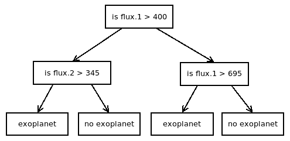
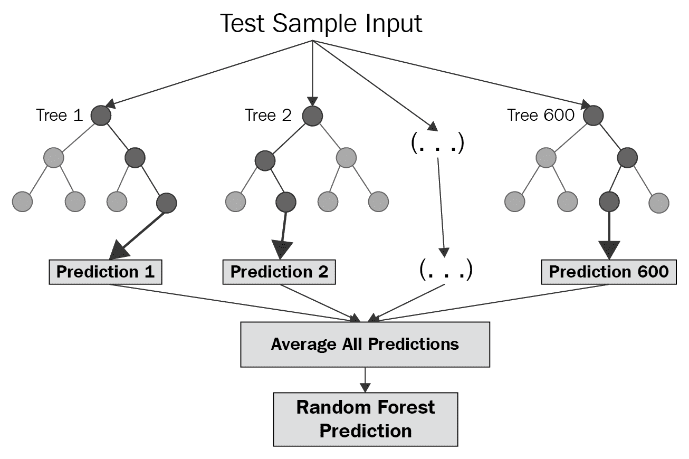
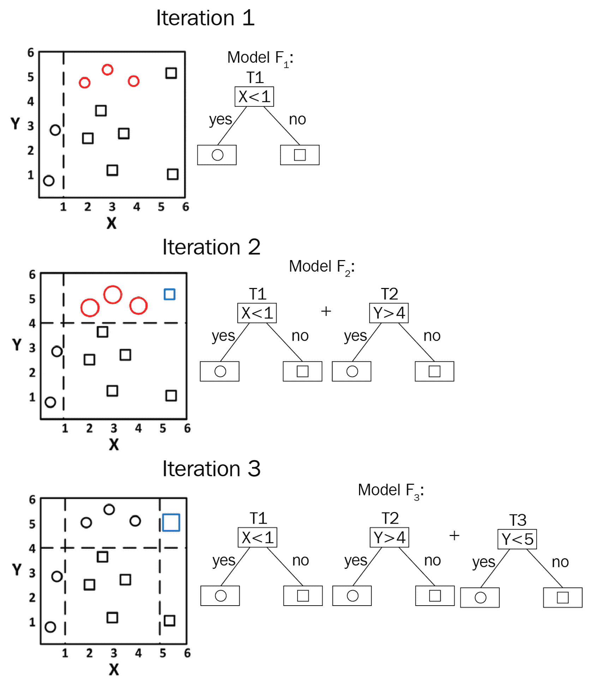
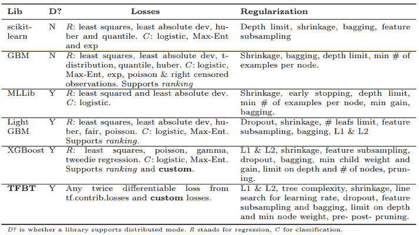

# 第二章：使用机器学习检测外星行星

在本章中，我们将学习如何使用基于决策树的集成方法来检测外星行星。

决策树是一类非参数的监督学习方法。在决策树算法中，数据通过使用一个简单规则被分为两个部分。这个规则被一遍遍应用，继续将数据划分，从而形成一棵决策树。

集成方法将多个学习算法的学习成果结合起来，以提高预测准确性并减少误差。这些集成方法根据它们使用的学习器种类以及如何在集成中结构化这些学习器而有所不同。

基于决策树的两种最流行的集成方法分别是梯度提升树和随机森林。

本章将涵盖以下主题：

+   什么是决策树？

+   为什么我们需要集成方法？

+   基于决策树的集成方法

    +   随机森林

    +   梯度提升

+   基于决策树的集成方法在 TensorFlow 中的应用

+   构建一个用于外星行星检测的 TensorFlow 提升树模型

本章的代码可在 Jupyter Notebook 中找到，文件名为 `ch-02_Detecting_Exoplanets_in_Outer_Space.ipynb`，包含在代码包中。

# 什么是决策树？

决策树是一类非参数的监督学习方法。在决策树算法中，我们从完整的数据集开始，并根据一个简单规则将其分为两部分。这个划分会持续进行，直到满足指定的标准为止。做出划分的节点称为内部节点，最终的端点称为终端节点或叶节点。

作为示例，我们来看以下这棵树：



在这里，我们假设外星行星数据只有两个特征：**flux.1** 和 **flux.2**。首先，我们根据条件 **flux.1 > 400** 做出决策，然后将数据分为两个部分。接着，我们基于 **flux.2** 特征再次划分数据，这个划分决定了该行星是否为外星行星。我们是如何决定 **flux.1 > 400** 这个条件的呢？我们并没有。这只是用来演示决策树。在训练阶段，模型学习到的就是这些划分数据的条件参数。

对于分类问题，决策树的叶节点展示结果作为数据的离散分类；对于回归问题，叶节点展示结果作为预测的数值。因此，决策树也被广泛称为**分类与回归树**（**CART**）。

# 为什么我们需要集成方法？

决策树容易对训练数据过拟合，并且受到高方差的影响，因此，无法对新的未见数据做出良好的预测。然而，使用决策树集成可以缓解单一决策树模型的不足。在集成中，多个弱学习器联合起来形成一个强大的学习器。

在我们可以将决策树组合成集成的多种方式中，由于在预测建模中的表现，以下两种方法是最受欢迎的：

+   梯度提升（也称为梯度树提升）

+   随机决策树（也称为随机森林）

# 基于决策树的集成方法

在这一部分，我们简要探讨两种决策树集成方法：随机森林和梯度提升。

# 随机森林

随机森林是一种技术，其中你构建多棵树，然后使用这些树来学习分类和回归模型，但结果是通过聚合这些树的输出得出的，最终产生一个结果。



随机森林是由一组随机、无关且完全生长的决策树组成的集成模型。随机森林模型中使用的决策树是完全生长的，因此具有低偏差和高方差。这些树本质上是无关的，从而导致方差的最大减少。这里所说的无关，意味着随机森林中的每棵决策树都被分配到一个随机选择的特征子集，并且从该特征子集中随机选择一个数据子集。

描述随机森林的原始论文可以通过以下链接获取：[`www.stat.berkeley.edu/~breiman/randomforest2001.pdf`](https://www.stat.berkeley.edu/~breiman/randomforest2001.pdf)。

随机森林技术并不会减少偏差，因此与集成中的单棵决策树相比，具有稍高的偏差。

随机森林是由 Leo Breiman 发明的，并且已由 Leo Breiman 和 Adele Cutler 注册商标。更多信息请访问以下链接：[`www.stat.berkeley.edu/~breiman/RandomForests`](https://www.stat.berkeley.edu/~breiman/RandomForests)。

直观地说，在随机森林模型中，大量的决策树在不同的数据样本上进行训练，这些样本可能会拟合或过拟合。通过对个别决策树的结果取平均，过拟合会被消除。

随机森林看起来与装袋（Bagging）类似，即自助聚合，但它们是不同的。在装袋中，每棵树的训练数据都是通过有放回的随机抽样来选择的，且树是基于所有特征进行训练的。在随机森林中，特征也是随机采样的，并且在每次候选分裂时，使用特征的子集来训练模型。

在回归问题中，随机森林模型通过对个别决策树的预测结果取平均来进行值的预测。在分类问题中，随机森林模型通过对个别决策树的结果进行多数投票来进行类的预测。

随机森林的有趣解释可以通过以下链接查看：[`machinelearning-blog.com/2018/02/06/the-random-forest-algorithm/`](https://machinelearning-blog.com/2018/02/06/the-random-forest-algorithm/)

# 梯度提升

梯度提升树是浅层决策树（或弱学习器）的集成。浅层决策树可以小到只有两片叶子的树（也叫做决策桩）。提升方法主要帮助减少偏差，同时也能稍微减少方差。

Breiman 和 Friedman 的原始论文，提出了梯度提升的理念，可以通过以下链接查看：

+   *Prediction Games and Arcing Algorithms* 由 Breiman, L 撰写，链接：[`www.stat.berkeley.edu/~breiman/games.pdf`](https://www.stat.berkeley.edu/~breiman/games.pdf)

+   *Arcing The Edge* 由 Breiman, L 撰写，链接：[`statistics.berkeley.edu/sites/default/files/tech-reports/486.pdf`](http://statistics.berkeley.edu/sites/default/files/tech-reports/486.pdf)

+   *Greedy Function Approximation: A Gradient Boosting Machine* 由 Friedman, J. H.撰写，链接：[`statweb.stanford.edu/~jhf/ftp/trebst.pdf`](http://statweb.stanford.edu/~jhf/ftp/trebst.pdf)

+   *Stochastic Gradient Boosting* 由 Friedman, J. H.撰写，链接：[`statweb.stanford.edu/~jhf/ftp/stobst.pdf`](https://statweb.stanford.edu/~jhf/ftp/stobst.pdf)

直观地说，在梯度提升模型中，集成中的决策树经过多次迭代训练，如下图所示。每次迭代都会增加一棵新的决策树。每一棵额外的决策树都是为了改进之前迭代中训练的集成模型。这与随机森林模型不同，后者中的每棵决策树都是独立训练的，不受其他决策树的影响。



与随机森林模型相比，梯度提升模型的树木数量较少，但最终会有大量需要调优的超参数，以获得一个合格的梯度提升模型。

关于梯度提升的一个有趣解释，可以通过以下链接找到：[`blog.kaggle.com/2017/01/23/a-kaggle-master-explains-gradient-boosting/`](http://blog.kaggle.com/2017/01/23/a-kaggle-master-explains-gradient-boosting/)。

# 基于决策树的集成在 TensorFlow 中的实现

在本章中，我们将使用由 Google TensorFlow 团队提供的预先构建的梯度提升树和随机森林实现作为估算器。接下来的章节中我们将学习它们的实现细节。

# TensorForest 估算器

TensorForest 是一个高度可扩展的随机森林实现，它通过结合各种在线 HoeffdingTree 算法与极度随机化方法构建而成。

Google 在以下论文中发布了 TensorForest 实现的详细信息：*TensorForest：在 TensorFlow 上可扩展的随机森林*，由 Thomas Colthurst、D. Sculley、Gibert Hendry、Zack Nado 撰写，并在 2016 年神经信息处理系统会议（**NIPS**）的机器学习系统研讨会上发布。该论文可以通过以下链接访问：[`docs.google.com/viewer?a=v&pid=sites&srcid=ZGVmYXVsdGRvbWFpbnxtbHN5c25pcHMyMDE2fGd4OjFlNTRiOWU2OGM2YzA4MjE`](https://docs.google.com/viewer?a=v&pid=sites&srcid=ZGVmYXVsdGRvbWFpbnxtbHN5c25pcHMyMDE2fGd4OjFlNTRiOWU2OGM2YzA4MjE)。

TensorForest 估算器用于实现以下算法：

```py
Initialize the variables and sets
    Tree = [root]
    Fertile = {root}
    Stats(root) = 0
    Splits[root] = []

Divide training data into batches.
For each batch of training data:
    Compute leaf assignment  for each feature vector
    Update the leaf stats in Stats()
    For each  in Fertile set:
        if |Splits()| < max_splits
            then add the split on a randomly selected feature to Splits()
        else if  is fertile and |Splits()| = max_splits
            then update the split stats for 
    Calculate the fertile leaves that are finished. 
    For every non-stale finished leaf:
        turn the leaf into an internal node with its best scoring split 
        remove the leaf from Fertile
        add the leaf's two children to Tree as leaves
    If |Fertile| < max_fertile
        Then add the max_fertile − |Fertile| leaves with 
        the highest weighted leaf scores to Fertile and 
        initialize their Splits and split statistics. 
Until |Tree| = max_nodes or |Tree| stays the same for max_batches_to_grow batches 
```

有关该算法实现的更多细节，请参考《TensorForest》论文。

# TensorFlow 增强树估算器

**TensorFlow 增强树**（**TFBT**）是建立在通用梯度提升树之上的一种改进的可扩展集成模型。

Google 在以下论文中发布了 TensorFlow 增强树实现的详细信息：*一种可扩展的基于 TensorFlow 的梯度提升框架*，由 Natalia Ponomareva、Soroush Radpour、Gilbert Hendry、Salem Haykal、Thomas Colthurst、Petr Mitrichev、Alexander Grushetsky 撰写，并在 2017 年欧洲机器学习与数据库知识发现原理与实践会议（ECML PKDD）上发布。该论文可以通过以下链接访问：[`ecmlpkdd2017.ijs.si/papers/paperID705.pdf`](http://ecmlpkdd2017.ijs.si/papers/paperID705.pdf)。

梯度提升算法由 `sklearn`、`MLLib` 和 `XGBoost` 等各种库实现。TensorFlow 的实现与这些实现有所不同，具体内容可参考以下从 TFBT 研究论文中提取的表格：



Google 的 TFBT 研究论文

TFBT 模型可以通过在 TensorFlow 中编写自定义损失函数进行扩展。TensorFlow 会自动提供这些自定义损失函数的求导。

# 检测外太空中的系外行星

对于本章中解释的项目，我们使用来自 Kaggle 的 *Kepler 标记时间序列数据*：[`www.kaggle.com/keplersmachines/kepler-labelled-time-series-data/home`](https://www.kaggle.com/keplersmachines/kepler-labelled-time-series-data/home)。该数据集主要来源于 NASA 的 Kepler 太空望远镜对任务 3 期的观测数据。

在数据集中，第 1 列的值为标签，第 2 至 3198 列的值为随时间变化的通量值。训练集包含 5087 个数据点，其中 37 个为已确认的系外行星，5050 个为非系外行星的恒星。测试集包含 570 个数据点，其中 5 个为已确认的系外行星，565 个为非系外行星的恒星。

我们将执行以下步骤来下载数据，并对数据进行预处理，以创建训练集和测试集：

1.  使用 Kaggle API 下载数据集。以下代码将用于实现这一目的：

```py
armando@librenix:~/datasets/kaggle-kepler$ kaggle datasets download -d keplersmachines/kepler-labelled-time-series-data

Downloading kepler-labelled-time-series-data.zip to /mnt/disk1tb/datasets/kaggle-kepler
100%|██████████████████████████████████████| 57.4M/57.4M [00:03<00:00, 18.3MB/s]
```

文件夹中包含以下两个文件：

```py
exoTest.csv
exoTrain.csv
```

1.  将文件夹`datasets`链接到我们的主文件夹，这样我们就可以通过`~/datasets/kaggle-kepler`路径访问它，然后在 Notebook 中定义文件夹路径并列出文件夹内容，以确认是否可以通过 Notebook 访问数据文件：

```py
dsroot = os.path.join(os.path.expanduser('~'),'datasets','kaggle-kepler')
os.listdir(dsroot)
```

我们获得了如下输出：

```py
['exoTest.csv', 'kepler-labelled-time-series-data.zip', 'exoTrain.csv']
```

ZIP 文件只是下载过程中的残留文件，因为 Kaggle API 首先下载 ZIP 文件，然后在同一文件夹中解压内容。

1.  然后我们将读取两个`.csv`数据文件，分别存储在名为`train`和`test`的`pandas`数据框中：

```py
import pandas as pd
train = pd.read_csv(os.path.join(dsroot,'exoTrain.csv'))
test = pd.read_csv(os.path.join(dsroot,'exoTest.csv'))
print('Training data\n',train.head())
print('Test data\n',test.head())
```

`training`和`test data`的前五行大致如下：

```py
Training data
    LABEL   FLUX.1   FLUX.2   FLUX.3  \
0      2    93.85    83.81    20.10     
1      2   -38.88   -33.83   -58.54   
2      2   532.64   535.92   513.73    
3      2   326.52   347.39   302.35    
4      2 -1107.21 -1112.59 -1118.95 
     FLUX.4   FLUX.5   FLUX.6  FLUX.7  \
0    -26.98   -39.56  -124.71 -135.18   
1    -40.09   -79.31   -72.81  -86.55   
2    496.92   456.45   466.00  464.50   
3    298.13   317.74   312.70  322.33   
4  -1095.10 -1057.55 -1034.48 -998.34   

    FLUX.8  FLUX.9    ...      FLUX.3188  \
0   -96.27  -79.89    ...         -78.07      
1   -85.33  -83.97    ...          -3.28   
2   486.39  436.56    ...         -71.69  
3   311.31  312.42    ...           5.71      
4 -1022.71 -989.57    ...        -594.37    

    FLUX.3189  FLUX.3190  FLUX.3191  \
0     -102.15    -102.15      25.13   
1      -32.21     -32.21     -24.89   
2       13.31      13.31     -29.89   
3       -3.73      -3.73      30.05   
4     -401.66    -401.66    -357.24  

   FLUX.3192  FLUX.3193  FLUX.3194  
0      48.57      92.54      39.32  
1      -4.86       0.76     -11.70     
2     -20.88       5.06     -11.80    
3      20.03     -12.67      -8.77      
4    -443.76    -438.54    -399.71   

   FLUX.3195  FLUX.3196  FLUX.3197  
0      61.42       5.08     -39.54  
1       6.46      16.00      19.93  
2     -28.91     -70.02     -96.67  
3     -17.31     -17.35      13.98  
4    -384.65    -411.79    -510.54  

[5 rows x 3198 columns]

Test data

    LABEL   FLUX.1   FLUX.2   FLUX.3   \
0      2   119.88   100.21    86.46      
1      2  5736.59  5699.98  5717.16    
2      2   844.48   817.49   770.07    
3      2  -826.00  -827.31  -846.12    
4      2   -39.57   -15.88    -9.16      

       FLUX.4   FLUX.5   FLUX.6   FLUX.7  \
0       48.68    46.12    39.39    18.57   
1     5692.73  5663.83  5631.16  5626.39   
2      675.01   605.52   499.45   440.77   
3     -836.03  -745.50  -784.69  -791.22   
4       -6.37   -16.13   -24.05    -0.90   

    FLUX.8   FLUX.9    ...      FLUX.3188  \
0     6.98     6.63    ...          14.52       
1  5569.47  5550.44    ...        -581.91    
2   362.95   207.27    ...          17.82     
3  -746.50  -709.53    ...         122.34       
4   -45.20    -5.04    ...         -37.87     
    FLUX.3189  FLUX.3190  FLUX.3191  \
0       19.29      14.44      -1.62   
1     -984.09   -1230.89   -1600.45   
2      -51.66     -48.29     -59.99   
3       93.03      93.03      68.81   
4      -61.85     -27.15     -21.18     

   FLUX.3192  FLUX.3193  FLUX.3194  \  
0      13.33      45.50      31.93    
1   -1824.53   -2061.17   -2265.98     
2     -82.10    -174.54     -95.23      
3       9.81      20.75      20.25    
4     -33.76     -85.34     -81.46    

   FLUX.3195  FLUX.3196  FLUX.3197  
0      35.78     269.43      57.72  
1   -2366.19   -2294.86   -2034.72  
2    -162.68     -36.79      30.63  
3    -120.81    -257.56    -215.41  
4     -61.98     -69.34     -17.84  

[5 rows x 3198 columns]
```

训练和测试数据集的标签位于第一列，接下来的列中有 3197 个特征。现在，我们使用以下代码将训练和测试数据拆分为标签和特征：

```py
x_train = train.drop('LABEL', axis=1)
y_train = train.LABEL-1 #subtract one because of TGBT
x_test = test.drop('LABEL', axis=1)
y_test = test.LABEL-1
```

在上述代码中，我们从标签中减去`1`，因为 TFBT 估算器假设标签从数字零开始，而数据集中的特征是数字 1 和 2。

现在我们已经有了训练和测试数据的标签和特征向量，让我们来构建增强树模型。

# 构建一个用于外星行星探测的 TFBT 模型

在本节中，我们将构建用于检测外星行星的梯度增强树模型，使用 Kepler 数据集。让我们按照以下步骤在 Jupyter Notebook 中构建并训练外星行星探测模型：

1.  我们将使用以下代码将所有特征的名称保存到一个向量中：

```py
numeric_column_headers = x_train.columns.values.tolist()
```

1.  然后，我们将特征列根据均值分成两个桶，因为 TFBT 估算器只接受桶化后的特征，代码如下：

```py
bc_fn = tf.feature_column.bucketized_column
nc_fn = tf.feature_column.numeric_column
bucketized_features = [bc_fn(source_column=nc_fn(key=column),
                             boundaries=[x_train[column].mean()])
                       for column in numeric_column_headers]
```

1.  由于我们只有数值型桶化特征，没有其他类型的特征，我们将它们存储在`all_features`变量中，代码如下：

```py
all_features = bucketized_features
```

1.  然后我们将定义批次大小，并创建一个函数，用于提供从训练数据中创建的标签和特征向量的输入。为创建这个函数，我们使用 TensorFlow 提供的便利函数`tf.estimator.inputs.pandas_input_fn()`，代码如下：

```py
batch_size = 32
pi_fn = tf.estimator.inputs.pandas_input_fn
train_input_fn = pi_fn(x = x_train,
                       y = y_train,
                       batch_size = batch_size,
                       shuffle = True,
                       num_epochs = None)
```

1.  类似地，我们将创建另一个数据输入函数，用于从测试特征和标签向量评估模型，并命名为`eval_input_fn`，使用以下代码：

```py
eval_input_fn = pi_fn(x = x_test,
                      y = y_test,
                      batch_size = batch_size,
                      shuffle = False,
                      num_epochs = 1)
```

1.  我们将定义要创建的树的数量为`100`，并将用于训练的步骤数定义为`100`。我们还将`BoostedTreeClassifier`定义为`estimator`，使用以下代码：

```py
n_trees = 100
n_steps = 100

m_fn = tf.estimator.BoostedTreesClassifier
model = m_fn(feature_columns=all_features,
             n_trees = n_trees,
             n_batches_per_layer = batch_size,
             model_dir='./tfbtmodel')
```

由于我们正在进行分类，因此使用`BoostedTreesClassifier`，对于需要预测值的回归问题，TensorFlow 还有一个名为`BoostedTreesRegressor`的`estimator`。

提供给`estimator`函数的参数之一是`model_dir`，它定义了训练后的模型存储位置。估计器的构建方式使得在后续调用时，它们会在该文件夹中查找模型，以便用于推理和预测。我们将文件夹命名为`tfbtmodel`来保存模型。

我们使用了最少数量的模型来定义`BoostedTreesClassifier`。请查阅 TensorFlow API 文档中该估计器的定义，了解可以提供的其他参数，以进一步自定义该估计器。

Jupyter Notebook 中的以下输出描述了分类器估计器及其各种设置：

```py
INFO:tensorflow:Using default config.
INFO:tensorflow:Using config: {'_model_dir': './tfbtmodel', '_tf_random_seed': None, '_save_summary_steps': 100, '_save_checkpoints_steps': None, '_save_checkpoints_secs': 600, '_session_config': None, '_keep_checkpoint_max': 5, '_keep_checkpoint_every_n_hours': 10000, '_log_step_count_steps': 100, '_train_distribute': None, '_device_fn': None, '_service': None, '_cluster_spec': <tensorflow.python.training.server_lib.ClusterSpec object at 0x7fdd48c93b38>, '_task_type': 'worker', '_task_id': 0, '_global_id_in_cluster': 0, '_master': '', '_evaluation_master': '', '_is_chief': True, '_num_ps_replicas': 0, '_num_worker_replicas': 1}
```

1.  接下来，我们将使用`train_input_fn`函数训练模型，使用 100 步的输入数据进行外行星数据的训练，代码如下：

```py
model.train(input_fn=train_input_fn, steps=n_steps)
```

Jupyter Notebook 显示以下输出，表示训练正在进行：

```py
INFO:tensorflow:Calling model_fn.
INFO:tensorflow:Done calling model_fn.
INFO:tensorflow:Create CheckpointSaverHook.
WARNING:tensorflow:Issue encountered when serializing resources.
Type is unsupported, or the types of the items don't match field type in CollectionDef. Note this is a warning and probably safe to ignore.
'_Resource' object has no attribute 'name'
INFO:tensorflow:Graph was finalized.
INFO:tensorflow:Restoring parameters from ./tfbtmodel/model.ckpt-19201
INFO:tensorflow:Running local_init_op.
INFO:tensorflow:Done running local_init_op.
WARNING:tensorflow:Issue encountered when serializing resources.
Type is unsupported, or the types of the items don't match field type in CollectionDef. Note this is a warning and probably safe to ignore.
'_Resource' object has no attribute 'name'
INFO:tensorflow:Saving checkpoints for 19201 into ./tfbtmodel/model.ckpt.
WARNING:tensorflow:Issue encountered when serializing resources.
Type is unsupported, or the types of the items don't match field type in CollectionDef. Note this is a warning and probably safe to ignore.
'_Resource' object has no attribute 'name'
INFO:tensorflow:loss = 1.0475121e-05, step = 19201
INFO:tensorflow:Saving checkpoints for 19202 into ./tfbtmodel/model.ckpt.
WARNING:tensorflow:Issue encountered when serializing resources.
Type is unsupported, or the types of the items don't match field type in CollectionDef. Note this is a warning and probably safe to ignore.
'_Resource' object has no attribute 'name'
INFO:tensorflow:Loss for final step: 1.0475121e-05.
```

1.  使用`eval_input_fn`，它提供来自`test`数据集的批次数据，以通过以下代码评估模型：

```py
results = model.evaluate(input_fn=eval_input_fn)
```

Jupyter Notebook 显示以下输出，表示评估的进展：

```py
INFO:tensorflow:Calling model_fn.
WARNING:tensorflow:Trapezoidal rule is known to produce incorrect PR-AUCs; please switch to "careful_interpolation" instead.
WARNING:tensorflow:Trapezoidal rule is known to produce incorrect PR-AUCs; please switch to "careful_interpolation" instead.
INFO:tensorflow:Done calling model_fn.
INFO:tensorflow:Starting evaluation at 2018-09-07-04:23:31
INFO:tensorflow:Graph was finalized.
INFO:tensorflow:Restoring parameters from ./tfbtmodel/model.ckpt-19203
INFO:tensorflow:Running local_init_op.
INFO:tensorflow:Done running local_init_op.
INFO:tensorflow:Finished evaluation at 2018-09-07-04:23:50
INFO:tensorflow:Saving dict for global step 19203: accuracy = 0.99122804, accuracy_baseline = 0.99122804, auc = 0.49911517, auc_precision_recall = 0.004386465, average_loss = 0.09851996, global_step = 19203, label/mean = 0.00877193, loss = 0.09749381, precision = 0.0, prediction/mean = 4.402521e-05, recall = 0.0
WARNING:tensorflow:Issue encountered when serializing resources.
Type is unsupported, or the types of the items don't match field type in CollectionDef. Note this is a warning and probably safe to ignore.
'_Resource' object has no attribute 'name'
INFO:tensorflow:Saving 'checkpoint_path' summary for global step 19203: ./tfbtmodel/model.ckpt-19203
```

注意，在评估过程中，估计器会加载保存在检查点文件中的参数：

```py
INFO:tensorflow:Restoring parameters from ./tfbtmodel/model.ckpt-19203
```

1.  评估结果存储在`results`集合中。我们可以使用以下代码中的`for`循环打印`results`集合中的每一项：

```py
for key,value in sorted(results.items()):
    print('{}: {}'.format(key, value))
```

Notebook 显示以下结果：

```py
accuracy: 0.9912280440330505
accuracy_baseline: 0.9912280440330505
auc: 0.4991151690483093
auc_precision_recall: 0.004386465065181255
average_loss: 0.0985199585556984
global_step: 19203
label/mean: 0.008771929889917374
loss: 0.09749381244182587
precision: 0.0
prediction/mean: 4.4025211536791176e-05
recall: 0.0
```

观察到，我们在第一个模型中就达到了近 99%的准确率。这是因为估计器已预先写入了多个优化选项，我们无需自己设置超参数的各个值。对于某些数据集，估计器中的默认超参数值可以直接使用，但对于其他数据集，您需要调整估计器的各种输入值。

# 总结

本章中，我们了解了什么是决策树，以及从决策树创建集成方法的两大类。我们关注的集成方法是随机森林和梯度提升树。

我们还了解了 Kaggle 竞赛中的开普勒数据集。我们使用开普勒数据集构建了一个外行星检测模型，使用 TensorFlow 预构建的梯度提升树估计器`BoostedTreesClassifier`。`BoostedTreesClassifier`估计器是 TensorFlow 团队最近发布的机器学习工具包的一部分。目前，TensorFlow 团队正在开发基于**支持向量机**（**SVM**）和极端随机森林的预构建估计器，并作为`tf.estimators` API 的一部分发布。

在下一章中，我们将学习如何使用浏览器中的`TensorFlow.js` API 进行情感分析。

# 问题

+   梯度提升与随机森林有何不同？

+   如何提高随机森林的性能？

+   如何提高梯度提升树的性能？

+   如何确保梯度提升树和随机森林不会过拟合？

+   修改本章中的模型，使用不同的参数，如树的数量、批处理大小、训练周期数和步数，并观察它们对训练时间和不同准确度水平的影响。

# 进一步阅读

+   [`www.tensorflow.org/tutorials/`](https://www.tensorflow.org/tutorials/)

+   [`www.stat.berkeley.edu/~breiman/RandomForests`](https://www.stat.berkeley.edu/~breiman/RandomForests)

+   [`www.stat.berkeley.edu/~breiman/randomforest2001.pdf`](https://www.stat.berkeley.edu/~breiman/randomforest2001.pdf)

+   [`machinelearning-blog.com/2018/02/06/the-random-forest-algorithm/`](https://machinelearning-blog.com/2018/02/06/the-random-forest-algorithm/)

+   [`blog.kaggle.com/2017/01/23/a-kaggle-master-explains-gradient-boosting/`](http://blog.kaggle.com/2017/01/23/a-kaggle-master-explains-gradient-boosting/)

+   [`www.stat.berkeley.edu/~breiman/games.pdf`](https://www.stat.berkeley.edu/~breiman/games.pdf)

+   [`statistics.berkeley.edu/sites/default/files/tech-reports/486.pdf`](http://statistics.berkeley.edu/sites/default/files/tech-reports/486.pdf)

+   [`statweb.stanford.edu/~jhf/ftp/trebst.pdf`](http://statweb.stanford.edu/~jhf/ftp/trebst.pdf)

+   [`statweb.stanford.edu/~jhf/ftp/stobst.pdf`](https://statweb.stanford.edu/~jhf/ftp/stobst.pdf)

+   [`docs.google.com/viewer?a=v&pid=sites&srcid=ZGVmYXVsdGRvbWFpbnxtbHN5c25pcHMyMDE2fGd4OjFlNTRiOWU2OGM2YzA4MjE`](https://docs.google.com/viewer?a=v&pid=sites&srcid=ZGVmYXVsdGRvbWFpbnxtbHN5c25pcHMyMDE2fGd4OjFlNTRiOWU2OGM2YzA4MjE)

+   [`ecmlpkdd2017.ijs.si/papers/paperID705.pdf`](http://ecmlpkdd2017.ijs.si/papers/paperID705.pdf)
