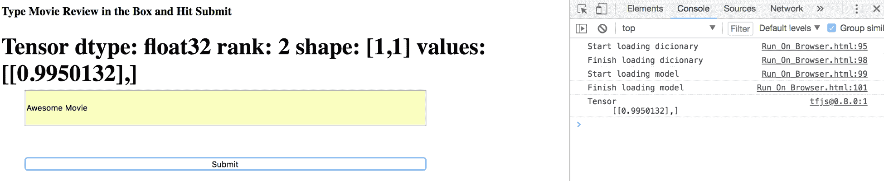

# 第三章：在浏览器中使用 TensorFlow.js 进行情感分析

情感分析是机器学习中的一个热门问题。人们不断尝试理解产品或电影评论的情感。目前，对于情感分析，我们从客户端/浏览器提取文本，将其传递给运行机器学习模型的服务器来预测文本的情感，服务器然后将结果返回给客户端。

如果我们不关心系统的延迟，这样做是完全可以接受的。然而，很多应用场景（如股票交易、客户支持对话）中，预测文本的情感低延迟可能会非常有帮助。减少延迟的一个明显瓶颈就是服务器调用。

如果情感分析能够在浏览器/客户端本身完成，我们就可以摆脱服务器调用，并且可以实时预测情感。谷歌最近发布了 TensorFlow.js，它使我们能够在浏览器/客户端上进行模型训练和推理。

此外，在客户端训练模型也打开了一个全新的机会。以下是这样做的所有优势的简要总结：

+   **隐私**：由于数据永远不会离开客户端，我们能够提供机器学习的神奇体验而不妥协于数据隐私

+   **无烦恼的机器学习**：由于代码在浏览器中运行，用户不需要安装任何库或依赖项

+   **低延迟**：由于不需要将数据传输到服务器进行训练/预测，我们可以为低延迟应用部署机器学习模型

+   **设备无关性**：一个网页可以在任何设备（笔记本、手机等）上打开，因此 TensorFlow.js 可以利用任何硬件（GPU）或设备传感器，如手机中的加速度计，来训练机器学习模型

让我们通过以下主题来学习如何使用 TensorFlow.js 在浏览器中整合情感分析：

+   理解 TensorFlow.js

+   理解 Adam 优化算法

+   理解类别交叉熵损失

+   理解词嵌入

+   在 Python 中设置情感分析问题并构建模型

+   使用 TensorFlow.js 在浏览器中部署模型

在本章中查找代码，并且安装说明也在此项目的 **README** 文件中。

# 理解 TensorFlow.js

TensorFlow 最近开源了 TensorFlow.js。这是一个开源库，帮助我们完全在浏览器中使用 JavaScript 定义和训练深度学习模型，同时提供高级分层 API。我们可以利用它在客户端完全训练深度学习模型，不需要服务器 GPU 来训练这些模型。

下图展示了 TensorFlow.js 的 API 概览：


这由 **WebGL** 提供支持。它还提供了一个高级分层 API，并且支持 **Eager** 执行。你可以使用 TensorFlow.js 实现以下三项功能：

+   在浏览器中加载现有的 TensorFlow/Keras 模型以进行预测

+   使用客户数据重新训练现有模型

+   在**浏览器**上定义和训练深度学习模型

# 理解 Adam 优化

在我们研究 Adam 优化之前，让我们先试着理解梯度下降的概念。

梯度下降是一种迭代优化算法，用于寻找函数的最小值。类比的例子可以是：假设我们被困在山的中部某处，我们想以最快的方式到达地面。作为第一步，我们会观察周围所有方向山的坡度，并决定沿最陡的坡度方向向下前进。

每走一步后，我们重新评估我们的方向选择。此外，我们步行的距离也取决于下坡的陡峭程度。如果坡度很陡，我们会迈更大的步伐，因为这有助于我们更快地到达地面。这样，在经过几步或大量步骤后，我们可以安全地到达地面。类似地，在机器学习中，我们希望通过更新算法的权重来最小化某些错误/成本函数。为了使用梯度找到成本函数的最小值，我们根据最陡下降的方向中的梯度更新算法的权重。在神经网络文献中，这个比例常数也被称为学习率。

然而，在大规模机器学习中，进行梯度下降优化是相当昂贵的，因为我们在整个训练数据集通过后只能进行一步。因此，如果我们要花费几千步来收敛到成本函数的最小值，那么收敛时间将会非常长。

解决这个问题的一个解决方案是随机梯度下降（SGD），这是一种在每个训练示例后更新算法权重的方法，而不是等待整个训练数据集通过算法进行更新。我们使用术语“随机”来表示梯度的近似性，因为它仅在每个训练示例后计算。然而，文献中表明，经过许多迭代，SGD 几乎肯定会收敛到函数的真实局部/全局最小值。一般来说，在深度学习算法中，我们观察到我们倾向于使用小批量 SGD，在每个小批量后更新权重，而不是在每个训练示例后更新。

Adam 优化是 SGD 的一个变体，我们在每个参数（权重）上维护学习率，并根据该参数之前梯度的均值和方差进行更新。已经证明 Adam 对许多深度学习问题非常高效和快速。有关 Adam 优化的更多细节，请参阅原始论文（[`arxiv.org/abs/1412.6980`](https://arxiv.org/abs/1412.6980)）。

# 理解分类交叉熵损失

交叉熵损失，或称对数损失，衡量分类模型的性能，该模型的输出是介于 0 和 1 之间的概率。当预测概率与实际值偏离时，交叉熵增加。因此，当实际标签值为 1 时，如果预测概率为 0.05，交叉熵损失就会增加。

数学上，对于二分类设置，交叉熵定义为以下方程：


这里，`yᵢ` 是一个二进制指示符（0 或 1），表示样本`i`的类别，而`pᵢ`表示该样本的预测概率，范围是 0 到 1。

另一种情况是，如果类别数超过两个，我们定义一个新的术语，称为类别交叉熵。它是通过对每个类别标签在每个观察值上的单独损失求和来计算的。从数学上讲，它由以下方程给出：


这里，`M`表示类别的数量，`y[i,c]`是一个二进制指示符（0 或 1），表示 `c` 是否是该观察的正确类别，`i`，以及`p[i,c]` 表示该观察属于类别 `c` 的概率。

在本章中，由于我们对评论进行二分类，因此我们只会使用二进制交叉熵作为分类损失。

# 理解词嵌入

词嵌入是指**自然语言处理**（**NLP**）中用于生成单词、句子或文档的实数值向量表示的特征学习技术类别。

现在许多机器学习任务都涉及文本。例如，谷歌的语言翻译或 Gmail 中的垃圾邮件检测都将文本作为输入，使用模型执行翻译和垃圾邮件检测任务。然而，现代计算机只能接受实值数字作为输入，无法理解字符串或文本，除非我们将其编码为数字或向量。

举个例子，假设我们有一句话 "*I like Football*"，我们希望获取所有单词的表示。生成三词 "`I`"、*"like*" 和 *"Football"* 的嵌入的粗暴方法是通过单词的独热表示来实现的。在这种情况下，嵌入结果如下：

+   "I" = [1,0,0]

+   "like" = [0,1,0]

+   "Football" = [0,0,1]

这个方法的思路是创建一个向量，其维度等于句子中唯一单词的数量，并且在单词出现的地方赋值为 1，在其他地方为 0。这个方法存在两个问题：

+   向量维度的数量随着语料库中单词数量的增加而增加。假设我们有 100,000 个独特的单词在文档中。因此，我们用一个维度为 100,000 的向量来表示每个单词。这增加了表示单词所需的内存，使我们的系统变得低效。

+   像这种独热编码表示无法捕捉到单词之间的相似性。例如，在句子中有两个单词，*“like”* 和 *“love”*。我们知道*“like”*比*“love”*更接近，而比*“Football”*要相似。然而，在当前的独热编码表示中，任何两个向量的点积都是零。数学上，*“like”*和*“Football”*的点积如下表示：

*"like" * "Football" = 转置([0,1,0]) *[0,0,1] = 0*0 + 1*0 + 0*1 = 0*

这是因为我们为每个单词在向量中分配了一个独立的位置，并且该位置只有一个 1。

对于垃圾邮件检测和语言翻译问题，理解单词之间的相似性非常重要。为此，有几种方法（包括监督学习和无监督学习）可以让我们学习词嵌入。

你可以通过这个[官方教程](https://www.tensorflow.org/tutorials/representation/word2vec)了解如何使用 TensorFlow 的词嵌入。

本项目使用 Keras 的嵌入层将我们的电影评论中的单词映射到实际值的向量表示中。在这个项目中，我们通过监督学习的方式来学习单词的向量表示。基本上，我们随机初始化词嵌入，然后通过神经网络中的反向传播来更新嵌入，以最小化总的网络损失。以监督的方式训练它们有助于生成任务特定的嵌入。例如，我们期望*Awesome*和*Great*这样的单词具有相似的表示，因为它们都表示积极的情感。一旦我们对电影评论中的单词进行了编码，就可以将它们作为输入传递到神经网络层中。

# 构建情感分析模型

在这一部分，我们将学习如何使用 Keras 从头开始构建情感分析模型。为了进行情感分析，我们将使用来自密歇根大学的情感分析数据，数据可以在[`www.kaggle.com/c/si650winter11/data`](https://www.kaggle.com/c/si650winter11/data)找到。这个数据集包含了 7,086 条带标签的电影评论。标签`1`表示积极情感，而`0`表示消极情感。在这个代码库中，数据集保存在名为`sentiment.txt`的文件中。

# 数据预处理

一旦你安装了运行此项目并读取数据所需的包（可以在`requirements.txt`文件中找到），下一步就是对数据进行预处理：

1.  第一步是从评论中获取词元/单词列表。去除任何标点符号，并确保所有词元都是小写字母：

```py
def get_processed_tokens(text):
'''
Gets Token List from a Review
'''
filtered_text = re.sub(r'[^a-zA-Z0-9\s]', '', text) #Removing Punctuations
filtered_text = filtered_text.split()
filtered_text = [token.lower() for token in filtered_text]
return filtered_text
```

例如，如果我们输入`This is a GREAT movie!!!!`，那么输出应该是`this is a great movie`。

1.  创建一个`token_idx`字典，将词汇映射到整数，以创建嵌入。请注意，字典中可能包含非常多的独特词汇（tokens），因此我们必须过滤掉在训练集中出现次数少于阈值的词汇（代码中默认值为`5`）。这是因为学习电影情感和在数据集中出现频率较低的词汇之间的关系非常困难：

```py
def tokenize_text(data_text, min_frequency =5):
    '''
    Tokenizes the reviews in the dataset. Filters non frequent tokens
    '''
    review_tokens = [get_processed_tokens(review) for review in   
                     data_text] # Tokenize the sentences
    token_list = [token for review in review_tokens for token in review]         
    #Convert to single list
    token_freq_dict = {token:token_list.count(token) for token in     
    set(token_list)} # Get the frequency count of tokens
    most_freq_tokens = [tokens for tokens in token_freq_dict if 
    token_freq_dict[tokens] >= min_frequency]
    idx = range(len(most_freq_tokens))
    token_idx = dict(zip(most_freq_tokens, idx))
    return token_idx,len(most_freq_tokens)
```

1.  将数据集中的每个评论映射到一个整数序列（基于我们在上一步创建的`token_idx`字典）。但是，在执行此操作之前，首先找到具有最多词汇的评论：

```py
def get_max(data):
    '''
    Get max length of the token
    '''
    tokens_per_review = [len(txt.split()) for txt in data]
    return max(tokens_per_review)
```

1.  为了创建输入模型学习嵌入的序列，我们必须为数据集中的每个评论创建一个固定长度的`(max_tokens)`序列。如果评论的长度小于最大长度，我们将用零进行前填充，以确保所有序列的长度一致。与后填充相比，前填充被认为能帮助获得更准确的结果：

```py

def create_sequences(data_text,token_idx,max_tokens):
    '''
    Create sequences appropriate for GRU input
    Input: reviews data, token dict, max_tokens
    Output: padded_sequences of shape (len(data_text), max_tokens)
    '''
    review_tokens = [get_processed_tokens(review) for review in  
                   data_text] # Tokenize the sentences 
    #Covert the tokens to their indexes 
    review_token_idx = map( lambda review: [token_idx[k] for k in review 
                           if k in token_idx.keys() ], review_tokens)
    padded_sequences = pad_sequences(review_token_idx,maxlen=max_tokens)
    return np.array(padded_sequences)
```

# 构建模型

该模型将包括一个嵌入层，接着是三层 GRU 和一个带有 sigmoid 激活函数的全连接层。对于优化和准确度评估，我们将分别使用`Adam`优化器和`binary_crossentropy`损失函数：

1.  模型使用以下参数定义：

```py
def define_model(num_tokens,max_tokens):
    '''
    Defines the model definition based on input parameters
    '''
    model = Sequential()
    model.add(Embedding(input_dim=num_tokens,
                    output_dim=EMBEDDING_SIZE,
                    input_length=max_tokens,
                    name='layer_embedding'))

    model.add(GRU(units=16, name = "gru_1",return_sequences=True))
    model.add(GRU(units=8, name = "gru_2",return_sequences=True))
    model.add(GRU(units=4, name= "gru_3"))
    model.add(Dense(1, activation='sigmoid',name="dense_1"))
    optimizer = Adam(lr=1e-3)
    model.compile(loss='binary_crossentropy',
                  optimizer=optimizer,
                  metrics=['accuracy'])
    print model.summary()
    return model
```

1.  使用以下参数训练模型：

    +   训练轮次 = 15

    +   验证分割 = 0.05

    +   批量大小 = 32

    +   嵌入大小 = 8

```py
def train_model(model,input_sequences,y_train):
    '''
    Train the model based on input parameters
    '''

    model.fit(input_sequences, y_train,
          validation_split=VAL_SPLIT, epochs=EPOCHS, 
          batch_size=BATCH_SIZE)
    return model
```

1.  测试在一些随机评论句子上训练的模型，以验证其性能：

| **文本** | **预测得分** |
| --- | --- |
| 很棒的电影 | 0.9957 |
| 糟糕的电影 | 0.0023 |
| 那部电影真糟糕 | 0.0021 |
| 我喜欢那部电影 | 0.9469 |

预测得分对于正面句子接近 1，对于负面句子接近 0。这验证了我们对模型性能的随机检查。

请注意，如果你在不同的硬件上训练模型，实际得分可能会略有不同。

# 在浏览器中使用 TensorFlow.js 运行模型

在这一部分，我们将把模型部署到浏览器上。

以下步骤演示了如何保存模型：

1.  安装 TensorFlow.js，它将帮助我们按照浏览器可使用的格式来转换训练好的模型：

```py
pip install tensorflowjs
```

1.  将模型保存为 TensorFlow.js 格式：

```py
import tensorflowjs as tfjs 
tfjs.converters.save_keras_model(model, OUTPUT_DIR)
```

这将创建一个名为`model.json`的 json 文件，该文件将包含元变量和一些其他文件，例如`group1-shard1of1`。

做得好！不过，将模型部署到 HTML 文件中稍微有点复杂：

若要运行库中提到的代码，请仔细遵循`README.md`文档中的说明（如有必要，请注意故障排除部分），确保在运行`Run_On_Browser.html`文件之前正确设置。

1.  通过脚本标签将 TensorFlow.js 集成到你的 JavaScript 中：

```py
<script src="img/tfjs@0.8.0"></script>
```

1.  加载模型和我们的`token_idx`字典。这将帮助我们在处理任何来自浏览器的评论之前，加载相关数据：

```py
async function createModel()
{
const model = await
tf.loadModel('http://127.0.0.1:8000/model.json')
return model
}
async function loadDict()
{
 await $.ajax({
 url: 'http://127.0.0.1:8000/token_index.csv',
 dataType: 'text',
 crossDomain : true}).done(success);
}
function success(data)
{
    var wd_idx = new Object();
    lst = data.split(/\r?\n|\r/)
    for(var i = 0 ; i < lst.length ;i++){
        key = (lst[i]).split(',')[0]
        value = (lst[i]).split(',')[1]

        if(key == "")
            continue
        wd_idx[key] = parseInt(value) 
    }

    word_index = wd_idx
}

async function init()
{
 word_index = undefined
 console.log('Start loading dictionary')
 await loadDict()
 //console.log(word_index)
 console.log('Finish loading dictionary')
 console.log('Start loading model') 
 model = await createModel()
 console.log('Finish loading model') 
}
```

1.  添加一些辅助函数来处理浏览器中的评论输入。这包括处理文本、将单词映射到`token_idx`，并为模型预测创建序列：

```py
function process(txt)
{
 out = txt.replace(/[^a-zA-Z0-9\s]/, '')
 out = out.trim().split(/\s+/)
 for (var i = 0 ; i < out.length ; i++)
 out[i] = out[i].toLowerCase()
 return out
}

function create_sequences(txt)
{
 max_tokens = 40 
 tokens = []
 words = process(txt)
 seq = Array.from(Array(max_tokens), () => 0) 
 start = max_tokens-words.length
 for(var i= 0 ; i< words.length ; i++)
 {
     if (Object.keys(word_index).includes(words[i])){
         seq[i+start] = word_index[words[i]]
     } 
 }
 return seq
}
```

1.  集成预测函数，处理输入句子并使用模型的预测函数返回一个包含预测得分的张量，正如上一节所示：

```py
async function predict()
{
 txt = document.getElementById("userInput").value
 alert(txt);
 seq = create_sequences(txt) 
 input = tf.tensor(seq)
 input = input.expandDims(0)
 pred = model.predict(input)
 document.getElementById("Sentiment").innerHTML = pred;

 pred.print()
}
```

1.  为了从用户的角度说明整个过程，打开`Run_on_Browser.html`文件。你会看到类似下面截图中的内容：


截图的左侧表示网站的布局，而右侧显示了控制台和输出内容。

请注意，我们可以提前加载字典和模型，以加速预测。

1.  在提供的框中输入评论并点击提交按钮，以查看模型的预测得分。尝试用`Awesome Movie`文本运行应用程序：



预测得分相当高，表明情感是积极的。你可以尝试不同的文本来看结果。

请注意，这主要是为了演示目的，如果你愿意，你可以通过 JavaScript 改进用户界面。

# 总结

本章简要介绍了如何构建一个端到端系统，使用 Keras 训练情感分析模型并通过 TensorFlow.js 将其部署到 JavaScript 中。将模型部署到生产环境中的过程非常顺畅。

接下来的一个潜在步骤是修改 JavaScript，以便在输入单词时立即预测情感。正如我们之前提到的，通过使用 TensorFlow.js 部署模型，你可以启用低延迟应用，如实时情感预测，而无需与服务器交互。

最后，我们在 Python 中构建了一个神经网络并将其部署在 JavaScript 中。不过，你也可以尝试使用 TensorFlow.js 在 JavaScript 中构建整个模型。

在下一章，我们将了解谷歌的新库——TensorFlow Lite。

# 问题

1.  如果使用 LSTM 代替 GRU，你能评估模型的准确性吗？

1.  如果你增加了嵌入大小（Embedding Size），会对准确性和训练时间产生什么影响？

1.  你能在模型中加入更多层吗？训练时间会发生什么变化？

1.  你能修改代码，以便在浏览器内训练模型，而不是加载已训练的模型吗？
