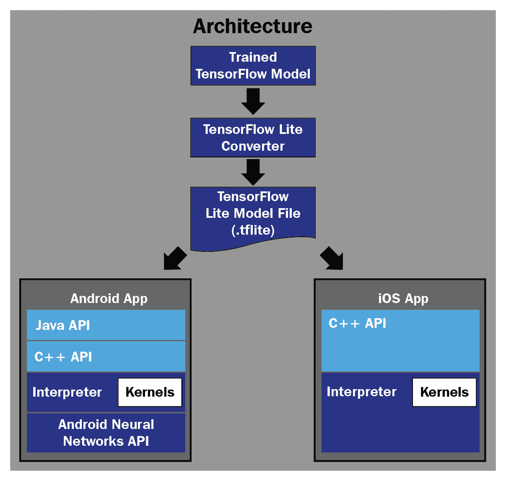
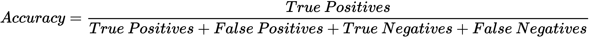
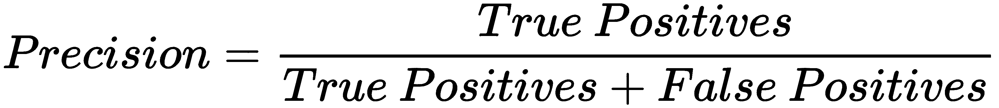
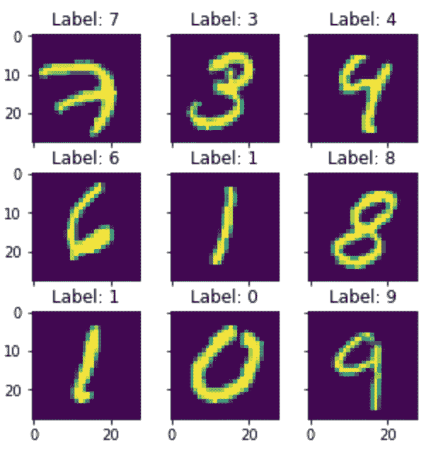
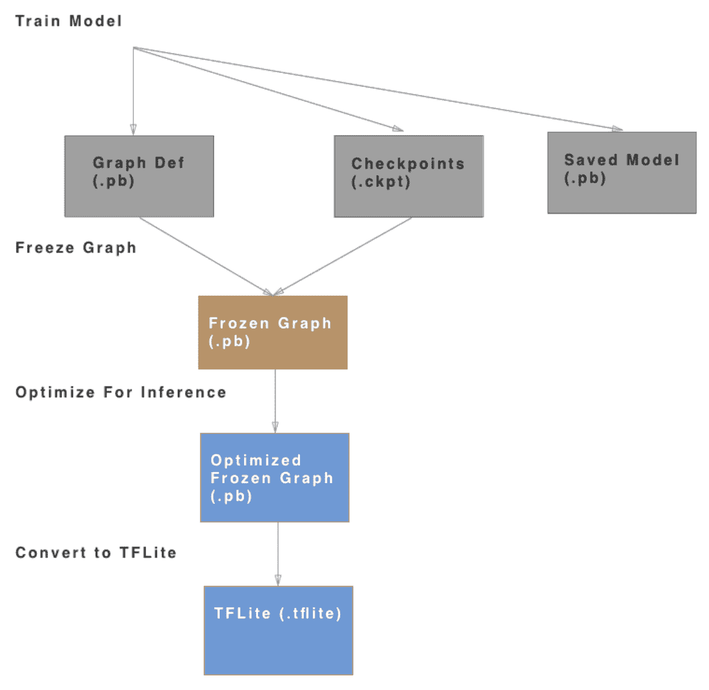
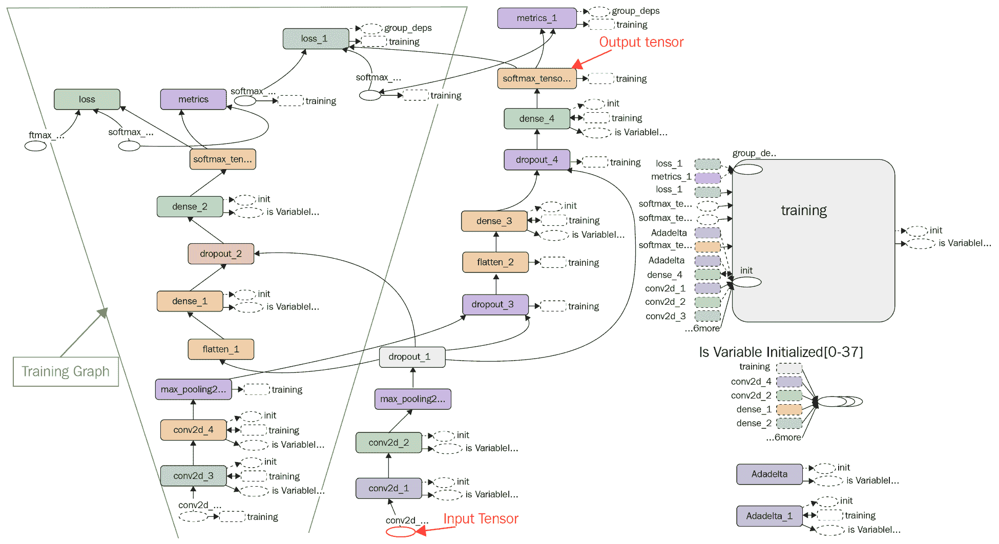
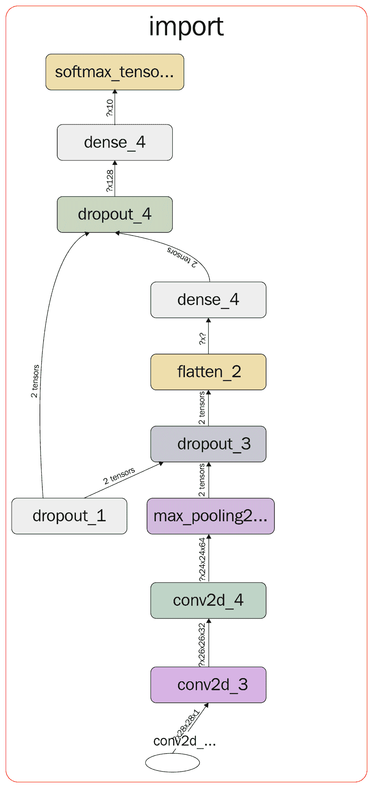
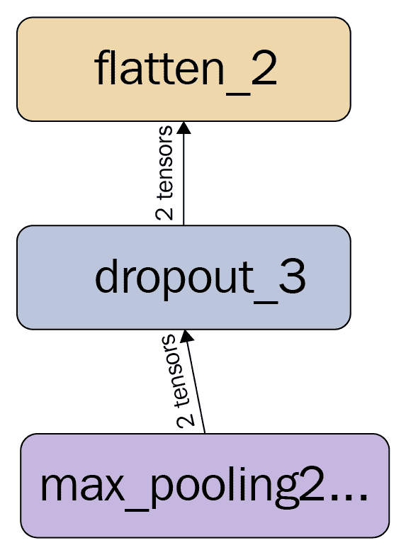
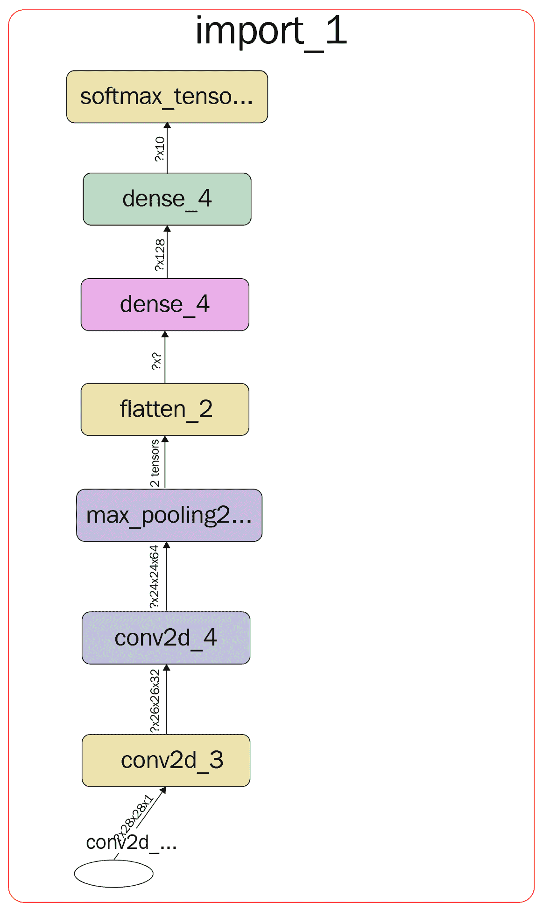

# 第四章：使用 TensorFlow Lite 进行数字分类

过去五年，**机器学习**（**ML**）领域取得了很大进展。如今，许多 ML 应用已经进入我们的日常生活，而我们往往没有意识到。由于 ML 已成为焦点，如果我们能在移动设备上运行深度模型，那将非常有帮助，而移动设备正是我们日常生活中最常使用的设备之一。

移动硬件的创新，加上用于在移动设备上部署 ML 模型的新软件框架，正在成为开发基于 ML 的移动应用或其他边缘设备（如平板电脑）应用的主要推动力之一。

在本章中，我们将学习谷歌的新库 TensorFlow Lite，该库可以用于在移动设备上部署 ML 模型。我们将使用 MNIST 数字数据集训练一个深度学习模型，并通过理解以下概念来了解如何将该模型转换为适合移动设备的格式：

+   TensorFlow Lite 及其架构简介

+   分类模型评估指标简介

+   在 MNIST 数据集上开发深度学习模型

+   使用 TensorFlow Lite 将训练好的模型转换为适合移动设备的格式

请注意，本章不会讨论如何构建 Android 应用来部署这些模型，因为这一内容在谷歌的 TensorFlow 教程中已有广泛文档记录（[`www.tensorflow.org/lite/`](https://www.tensorflow.org/lite/)）。

# 什么是 TensorFlow Lite？

在深入探讨 TensorFlow Lite 之前，让我们先了解在边缘设备（如手机、平板电脑等）上进行 ML 的优势。

+   **隐私**：如果 ML 模型的推理可以在设备上进行，用户数据就不需要离开设备，从而有助于保护用户隐私。

+   **离线预测**：设备无需连接网络即可对 ML 模型进行预测。这为像印度这样的开发中国家提供了大量应用场景，因为这些地区的网络连接状况并不理想。

+   **智能设备**：这也可以促进智能家居设备的发展，如带有设备智能的微波炉和恒温器。

+   **节能**：设备上的 ML 推理可以更节能，因为无需将数据来回传输到服务器。

+   **传感器数据利用**：ML 模型可以利用丰富的传感器数据，因为它在移动设备上易于获取。

然而，移动设备与我们的桌面和笔记本电脑不同。在将模型部署到移动或嵌入式设备时，需要考虑不同的因素，比如：

+   **模型大小**：如我们所知，移动设备的内存有限，我们不能在设备上存储占用大量内存的模型。处理这个问题有两种方式：

    +   我们可以对模型的权重进行四舍五入或量化，使其所需的浮点表示更少。这与我们的理解一致，即整数存储所需的内存通常少于浮点数。

    +   由于我们仅在设备上进行推断或预测，因此可以去除 Tensorflow 图中所有对进行预测无用的训练操作。

+   **速度**：在移动设备上部署模型的重要因素之一是我们能够运行推断的速度，以获得更好的用户体验。必须优化模型，以确保它们不会超出手机的延迟预算，同时又保持快速。

+   **部署简便性**：我们需要高效的框架/库，以便在移动设备上部署非常简单。

考虑到这些因素，Google 开发了 TensorFlow Lite，这是原始 TensorFlow 的轻量级版本，用于在移动和嵌入式设备上部署深度学习模型。

要了解 TensorFlow Lite，请查看以下显示其高级架构的图表：



这种架构清楚地表明，我们需要将训练好的 TF 模型转换为`.tflite`格式。这种格式与通常的 TF 模型不同，因为它经过优化，可用于设备上的推断。我们将在本章后面详细学习转换过程。

现在，让我们试着了解使用 TF Lite 格式的主要特点：

+   模型被序列化并转换为 Flatbuffer 格式([`google.github.io/flatbuffers/`](https://google.github.io/flatbuffers/))。Flatbuffers 的优点在于数据可以直接访问，无需解析/解包包含权重的大文件。

+   模型的权重和偏差已预先融合到 TF Lite 格式中。

TF Lite 跨平台，可部署在 Android、iOS、Linux 和硬件设备（如 Raspberry Pi）上。

它包括一个在设备上优化为更快执行的解释器。所有支持的操作的核心解释器大小约为 400 KB，不支持操作时为 75 KB。这意味着模型在设备上占用的空间很小。总体而言，理念是保留仅对推断至关重要的模型部分，并剥离所有其他部分。

利用硬件创新，许多公司还在开发专为神经网络推断优化的 GPU 和数字信号处理器（DSP）。TF Lite 提供了 Android 神经网络 API，可以在这些设备上进行硬件加速。

# 分类模型评估指标

仅仅构建模型是不够的；我们需要确保我们的模型功能良好，并为我们提供良好和准确的输出。为此，我们需要了解一些分类指标，这些指标将用于全书中评估模型。

让我们从定义一些用于评估分类模型的度量标准开始。为此，取一个简单的垃圾邮件检测示例作为参考，任何在线邮箱都可以进行这样的检测。垃圾邮件将被视为正类，正常邮件则视为负类。我们可以将这个垃圾邮件检测模型总结为四类，如下矩阵所示：

| **真正类** (**TP**) | **假正类** (**FP**) |
| --- | --- |
| 现实：邮件是垃圾邮件 | 现实：邮件不是垃圾邮件 |
| 模型预测：邮件是垃圾邮件 | 模型预测：邮件是垃圾邮件 |
| **假负类** (**FN**) | **真负类** (**TN**) |
| 现实：邮件是垃圾邮件 | 现实：邮件不是垃圾邮件 |
| 模型预测：邮件不是垃圾邮件 | 模型预测：邮件不是垃圾邮件 |

这个矩阵通常也被称为 **混淆矩阵**。

我们将用来定义分类器质量的三大主要度量标准，主要针对不平衡数据集，分别如下：

+   **准确度：**准确度是用于分类问题的最基本度量标准。其定义如下：



+   **精确度：**精确度试图衡量模型预测出的所有正类中真正的正类数量。如果你的 Gmail 没有将很多来自朋友（或正常邮件）的邮件错误分类到垃圾邮件中，那么它的精确度就非常高。其数学表示如下：



+   **召回率：**召回率试图衡量数据集中所有真实正类中被分类为正类的数量。简单来说，如果你的 Gmail 没有将很多垃圾邮件误分类为正常邮件并将其发送到收件箱，那么它的召回率就非常高：


理想情况下，我们希望模型具有高精确度和高召回率。然而，在机器学习中，精确度和召回率之间总是存在权衡。

# 使用 TensorFlow Lite 分类数字

为了完成这个项目，我们将使用 MNIST 手写数字数据集，该数据集可在 TensorFlow 数据集库中找到（[`www.tensorflow.org/guide/datasets`](https://www.tensorflow.org/guide/datasets)）。它包含了从 0 到 9 的手写数字图像。训练数据集有 60,000 张图像，测试集有 10,000 张图像。数据集中的一些图像如下所示：



如果我们查看 TensorFlow Lite 教程，会发现重点是使用预训练模型，如 Mobilenet 或重新训练现有的模型。然而，这些教程中没有谈到构建新模型，而这正是我们在这里要做的事情。

请注意，我们特别选择了一个简单的模型，因为在撰写本书时，TensorFlow Lite 对所有复杂模型的支持不足。

我们将使用类别交叉熵作为这个分类问题的损失函数。类别交叉熵在本书的第三章《使用 TensorFlow.js 在浏览器中进行情感分析》中有详细说明。在本章中，我们的数据集包含 10 个不同的数字，因此我们将使用类别交叉熵，分类数为 10。

# 数据预处理与模型定义

我们需要对数据进行预处理，以使其准备好输入到模型中，定义我们的模型，并创建一个评估指标：

1.  通过确保图像的形状为 28x28x1，并将像素转换为浮动类型变量来进行数据预处理，以供训练使用。同时，这里我们定义 NUM_CLASSES = 10，因为图像中有 10 个不同的数字。

```py
x_train = x_train.reshape(x_train.shape[0], IMAGE_SIZE, IMAGE_SIZE, 1)
x_test = x_test.reshape(x_test.shape[0], IMAGE_SIZE, IMAGE_SIZE, 1)
x_train = x_train.astype('float32')
x_test = x_test.astype('float32')
Next, we normalize the image pixels by 255 as follows:
x_train /= 255
x_test /= 255
And finally, we convert the class labels to one hot for training as follows:
y_train = keras.utils.to_categorical(y_train, NUM_CLASSES)
y_test = keras.utils.to_categorical(y_test, NUM_CLASSES)

```

1.  定义模型为具有两个卷积层（使用相同的过滤器大小）、两个全连接层、两个丢弃层（丢弃概率分别为 0.25 和 0.5）、每个全连接层或卷积层后都有一个修正线性单元（ReLU，除最后一层外），以及一个最大池化层。此外，我们还添加了 Softmax 激活函数，将模型的输出转化为每个数字的概率。请注意，我们使用此模型是因为它能产生良好的结果。你可以通过添加更多层或尝试不同形状的现有层来改进该模型。

```py
model = Sequential()
model.add(Conv2D(32, kernel_size=(3, 3),
activation='relu',
input_shape=INPUT_SHAPE))
model.add(Conv2D(64, (3, 3), activation='relu'))
model.add(MaxPooling2D(pool_size=(2, 2)))
model.add(Dropout(0.25))
model.add(Flatten())
model.add(Dense(128, activation='relu'))
model.add(Dropout(0.5))
model.add(Dense(NUM_CLASSES))model.add(Activation('softmax', name = 'softmax_tensor'))
```

注意，我们将输出张量命名为 `softmax_tensor`，这将在我们尝试将此模型转换为 TensorFlow Lite 格式时非常有用。

1.  进一步为模型定义以下参数：

    +   损失 = 类别交叉熵

    +   优化器 = AdaDelta。Adam 优化器在第三章《使用 TensorFlow.js 在浏览器中进行情感分析》中有介绍，它是 AdaDelta 的扩展。我们使用 AdaDelta，因为它在这个模型上能够获得良好的结果。你可以在原始论文中找到更多关于 AdaDelta 的细节 ([`arxiv.org/abs/1212.5701`](https://arxiv.org/abs/1212.5701))。

    +   评估指标 = 分类准确度

定义这些内容的代码如下：

```py
model.compile(loss=keras.losses.categorical_crossentropy,

optimizer=keras.optimizers.Adadelta(),

metrics=['accuracy'])
```

1.  启用 TensorBoard 日志记录，以可视化模型图和训练进度。代码定义如下：

```py
tensorboard = TensorBoard(log_dir=MODEL_DIR)
```

1.  使用以下参数训练模型：

    +   训练周期 = 12

    +   批量大小 = 128：

```py
self.model.fit(self.x_train, self.y_train,
batch_size=BATCH_SIZE,

epochs=EPOCHS,

verbose=1,

validation_data=(self.x_test, self.y_test),

callbacks = [self.tensorboard])

score = self.model.evaluate(self.x_test, self.y_test, verbose=0)
```

我们在测试数据集上仅用 12 个训练周期达到了 **99.24%** 的准确率。

注意，我们使用 `callbacks` 参数来记录 TensorBoard 上的训练进度。

# 将 TensorFlow 模型转换为 TensorFlow Lite

既然我们已经按照常规方法训练了模型，接下来我们来看看如何将该模型转换为 TensorFlow Lite 格式。

转换的通用流程如下面的图示所示：



该过程很简单：我们获取一个已训练的模型，冻结图形，优化它以进行推理/预测，并将其转换为 `.tflite` 格式。在继续之前，让我们先了解一下“冻结图形”和“优化推理”的含义：

+   **冻结图：**冻结图操作通过将所有 TF 变量转换为常量，从而有效地冻结了模型的权重。正如你所想的，将所有权重作为常量可以节省空间，相比保持它们作为变量。在移动设备上我们只进行推理（而不是训练），所以我们不需要修改模型权重。

+   **优化推理：**一旦图被冻结，我们会移除图中所有对推理无用的操作。例如，Dropout 操作用于训练模型，以防过拟合。然而，在移动设备上的预测过程中，这个操作完全没有用处。

在本节的剩余部分，我们将大量使用 TensorBoard 可视化（[`www.TensorFlow.org/guide/summaries_and_tensorboard`](https://www.tensorflow.org/guide/summaries_and_tensorboard)）来进行图形可视化。

1.  一旦你训练了模型，你的模型文件夹中必须有一个以`events.out.tfevents.`为前缀的文件。进入`logs`文件夹并在终端中输入以下命令：

```py
tensorboard --logdir <model_folder>
```

默认情况下，TensorBoard 将启动在`6006`端口。通过进入浏览器并在地址栏中输入`localhost:6006`启动它。一旦打开 TensorBoard，如果你导航到顶部的 Graph 标签，你将能够看到你模型的 Tensorflow 图。在以下示意图中，我们展示了主图，并标注了输入张量、输出张量以及图中的训练部分。正如我们所看到的，我们不应该保留任何用于训练图的内容，因为它们对在移动设备上进行推理/预测没有任何用处。



1.  接下来实现一个名为`freeze_sesssion`的函数，该函数接受 TF 会话作为输入，将所有变量转换为常量，并返回冻结的图。执行此函数后，你将在`<model_folder>/logs/freeze`文件夹中获得一个名为`MNIST_model.pb`的冻结图文件。

```py
from TensorFlow.python.framework.graph_util import convert_variables_to_constants

def freeze_session(session, keep_var_names=None, output_names=None, clear_devices=True):

graph = session.graph

with graph.as_default():

freeze_var_names = list(set(v.op.name for v in tf.global_variables()).difference(keep_var_names or []))

output_names = output_names or []

output_names += [v.op.name for v in tf.global_variables()]

input_graph_def = graph.as_graph_def()

if clear_devices:

for node in input_graph_def.node:

node.device = ""

frozen_graph = convert_variables_to_constants(session, input_graph_def,

output_names, freeze_var_names)

return frozen_graph

```

1.  现在，事情变得有些奇怪：你不能通过 TensorBoard 直接可视化`MNIST_model.pb`文件。你需要将图写成 TensorBoard 能够识别的格式。执行下面提到的`pb_to_tensorboard`函数，你将会在`<model_folder>/logs/freeze`文件夹中看到一个以`events.out.tfevents`为前缀的文件。

```py

def pb_to_tensorboard(input_graph_dir,graph_type ="freeze"):

  file_name = ""

  if graph_type == "freeze":

      file_name = FREEZE_FILE_NAME

  elif graph_type == "optimize":

      file_name = OPTIMIZE_FILE_NAME

  with tf.Session() as sess:

      model_filename = input_graph_dir + "/" + file_name

      with gfile.FastGFile(model_filename, 'rb') as f:

           graph_def = tf.GraphDef()

           graph_def.ParseFromString(f.read())

  train_writer = tf.summary.FileWriter(input_graph_dir)

  train_writer.add_graph(sess.graph)

```

1.  接下来，使用`<model_folder>/logs/freeze`作为`logdir`重新启动 TensorBoard，并可视化冻结的图。你会看到，图中大多数变量已经被去除。以下示意图展示了你将获得的冻结图：



1.  下一步是进一步优化图形以便推理。如前所述，我们将从图中移除 Dropout 变量，因为它们对移动设备上的推理没有用。然而，根据现有的 TensorFlow 函数/程序，没有完美的方法来移除这些操作。TensorFlow Lite 的新改进并不适用于本示例，这表明它们仍在开发中。相反，您必须手动指定要移除的操作，并将 Dropout 操作的输入连接到图中它们之后的操作。例如，在冻结的图中，假设我们要移除`dropout_3`操作。下图显示了冻结图的放大版：



在这种情况下，您需要将`max_pooling2`操作直接连接到`flatten_2`操作，从而跳过图中的`dropout_3`操作。

执行下文提到的`optimize_graph`函数，以去除图中的所有 Dropout 操作。它会手动将所有 Dropout 操作从图中清除。这将导致在`<model_folder>/logs/optimized`文件夹下生成一个名为`MNIST_optimized.pb`的新文件。

```py
def optimize_graph(input_dir, output_dir):
input_graph = os.path.join(input_dir, FREEZE_FILE_NAME)
output_graph = os.path.join(output_dir, OPTIMIZE_FILE_NAME)
input_graph_def = tf.GraphDef()
with tf.gfile.FastGFile(input_graph, "rb") as f:
input_graph_def.ParseFromString(f.read())
output_graph_def = strip(input_graph_def, u'dropout_1', u'conv2d_2/bias', u'dense_1/kernel', u'training')
output_graph_def = strip(output_graph_def, u'dropout_3', u'max_pooling2d_2/MaxPool', u'flatten_2/Shape',
u'training')
output_graph_def = strip(output_graph_def, u'dropout_4', u'dense_3/Relu', u'dense_4/kernel', u'training')
output_graph_def = strip(output_graph_def, u'Adadelta_1', u'softmax_tensor_1/Softmax',
u'training/Adadelta/Variable', u'training')
output_graph_def = strip(output_graph_def, u'training', u'softmax_tensor_1/Softmax',
u'_', u'training')
with tf.gfile.GFile(output_graph, "wb") as f:
f.write(output_graph_def.SerializeToString())
```

1.  同样，为了在 TensorBoard 中可视化图形，您需要使用步骤 3 中定义的函数`pb_to_tensorboar`进行转换，以使其适应 TensorBoard，并在同一文件夹中获得一个以`events.out.tfevents`为前缀的新文件。下图展示了去除 Dropout 操作后您将获得的图形。



请注意，从图中去除 Dropout 不会影响测试集的准确性，因为 Dropout 并未用于推理。

1.  获取移动友好格式的模型的最后一步是将其转换为 `.tflite` 文件。对于此步骤，您将使用`toco`命令，该命令代表 TensorFlow Lite 优化转换器（[`www.tensorflow.org/lite/convert/`](https://www.tensorflow.org/lite/convert/)）。以下是提供的代码：

```py
toco \
--input_file=<model_folder>/logs/optimized/MNIST_optimized.pb\
--input_format=TensorFlow_GRAPHDEF \
--output_format=TFLITE \
--inference_type=FLOAT \
--input_type=FLOAT \
--input_arrays=conv2d_1_input \
--output_arrays=softmax_tensor_1/Softmax \
--input_shapes=1,28,28,1 \
--output_file=<model_folder>//mnist.tflite
```

这将生成一个名为`mnist.tflite`的文件，保存在`<model_folder>`中。实质上，此步骤是将优化后的图形转换为 Flatbuffer，以便于高效的设备端推理。

我们不会涵盖将我们的项目部署到移动设备上的内容，因为该部分开发超出了本书的范围。然而，您可以查看 TensorFlow Lite 的教程，了解如何将 TF Lite 模型部署到 Android（[`www.tensorflow.org/lite/demo_android`](https://www.tensorflow.org/lite/demo_android)）或 iOS（[`www.tensorflow.org/lite/demo_ios`](https://www.tensorflow.org/lite/demo_ios)）。

# 总结

机器学习正处于下一波发展的前沿，我们正在努力将机器学习普及到日常生活中。它具有诸多优势，例如离线访问、数据隐私等。

在本章中，我们介绍了来自谷歌的一个新库——TensorFlow Lite，它已针对在移动设备和嵌入式设备上部署机器学习模型进行了优化。我们了解了 TensorFlow Lite 的架构，它将训练好的 TensorFlow 模型转换为 `.tflite` 格式。这是为在设备上进行快速推理和低内存占用而设计的。TensorFlow Lite 还支持多个平台，如 Android、iOS、Linux 和 Raspberry Pi。

接下来，我们使用了 MNIST 手写数字数据集来训练一个深度学习模型。随后，我们按照必要的步骤将训练好的模型转换为 `.tflite` 格式。步骤如下：

1.  将图冻结，将变量转换为常量

1.  通过移除未使用的操作（如 Dropout），优化了推理图

1.  使用 **TensorFlow 优化转换工具** (**toco**) 将优化后的模型转换为 `.tflite` 格式

在每一步，我们都使用 TensorBoard 来可视化图的状态。

这是一个非常激动人心的领域，正在不断发展，无论是在硬件还是软件方面。一旦这项技术成熟，它将在全球范围内开辟新的使用场景和商业模式。

在下一章中，我们将创建一个项目，帮助我们将文本转换为语音。

# 问题

以下是一些问题：

1.  TensorFlow Lite 与常规 TensorFlow 有什么不同？

1.  你能尝试在第三章中使用电影评论数据集构建模型吗？*在浏览器中使用 TensorFlow.js 进行情感分析*？如果是这样，你在使用 TensorFlow Lite 时遇到什么问题了吗？

1.  你能尝试使用 Adam 优化器，看看它是否能提升模型的性能吗？

1.  你能想到除了 Dropout 之外，也不重要于移动端推理的操作吗？
