# 第六章：使用高斯过程回归预测股市价格

在本章中，我们将学习一种新的预测模型，叫做**高斯过程**，通常简称为**GPs**，它在预测应用中非常流行，尤其是在我们希望通过少量数据点建模非线性函数并量化预测的不确定性时。

我们将使用高斯过程来预测三只主要股票的股价，即谷歌、Netflix 和**通用电气**（GE）公司。

本章其余部分分为以下几节：

+   理解贝叶斯定理

+   贝叶斯推断

+   引入高斯过程

+   理解股市数据集

+   应用高斯过程预测股市价格

# 理解贝叶斯定理

在开始我们的项目之前，我们先回顾一下贝叶斯定理及其相关术语。

贝叶斯定理用于描述一个事件的概率，基于与该事件可能相关的条件的先验知识。例如，假设我们想预测一个人是否患有糖尿病。如果我们知道初步的医学检查结果，我们就能比不知道检查结果时得到更准确的预测。让我们通过一些数字来从数学角度理解这个问题：

+   1%的人口患有糖尿病（因此 99%的人没有）。

+   初步测试在糖尿病存在时 80%的概率能检测出来（因此 20%的时间我们需要进行更高级的测试）

+   初步检查在糖尿病不存在时有 10%的时间会误判为糖尿病（因此 90%的时间能给出正确结果）：

|  | **糖尿病（1%）** | **无糖尿病（99%）** |
| --- | --- | --- |
| **检测阳性** | 80% | 10% |
| **检测阴性** | 20% | 90% |

所以，如果一个人患有糖尿病，我们将查看第一列，他有 80%的机会被检测出糖尿病。而如果一个人没有糖尿病，我们将查看第二列，他有 10%的机会在初步测试中被误诊为糖尿病阳性。

假设一个人在初步检测中被诊断为糖尿病阳性。那么他实际上患糖尿病的几率有多大？

事实证明，著名科学家托马斯·贝叶斯（171-1761 年）提供了一个数学框架，用于在上述情况下计算概率。他的数学公式可以表示为：

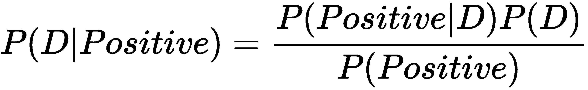

其中：

+   `P(D)`表示随机选中一个人患糖尿病的概率，这里是 1%。`P(D)`也被称为贝叶斯术语中的**先验**，它表示我们在没有任何额外信息时对一个事件的信念。

+   `P(D|positive)`表示在初步测试中，假设某人被检测出阳性结果后，该人患有糖尿病的概率。在贝叶斯术语中，这也称为**后验概率**，它表示在获得附加信息后，事件的更新概率。

+   `P(positive|D)`表示在初步测试中，假设某人患有糖尿病的情况下，获得阳性结果的概率。在此情况下为 80%。

+   `P(positive)`表示在初步测试中，随机一个人被检测为阳性的概率。这也可以写作：

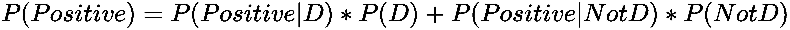

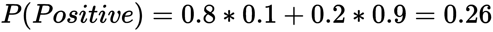

贝叶斯法则在量化机器学习系统的预测不确定性中被广泛使用。

# 介绍贝叶斯推断

既然我们已经了解了贝叶斯法则的基础知识，接下来让我们尝试理解贝叶斯推断或建模的概念。

如我们所知，现实世界的环境始终是动态的、嘈杂的、观测代价高昂且时间敏感的。当商业决策基于这些环境中的预测时，我们不仅希望产生更好的预测结果，还希望量化这些预测结果中的不确定性。因此，贝叶斯推断理论在这种情况下非常有用，因为它提供了一个有原则的解决方法。

对于典型的时间序列模型，我们在给定`x`变量时，实际上是基于`y`进行曲线拟合。这有助于根据过去的观测数据拟合曲线。让我们尝试理解其局限性。考虑以下城市温度的例子：

| **日期** | **温度** |
| --- | --- |
| 5 月 1 日 10 AM | 10.5 摄氏度 |
| 5 月 15 日 10 AM | 17.5 摄氏度 |
| 5 月 30 日 10 AM | 25 摄氏度 |

使用曲线拟合，我们得到以下模型：

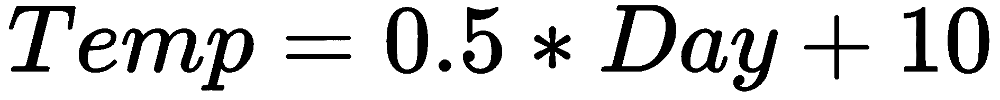

然而，这意味着温度函数是线性的，在第十天时，我们预计温度为 15 摄氏度。常识告诉我们，城市的温度在一天中波动较大，而且它依赖于我们何时进行测量。曲线拟合定义了在给定的一组读数下的某一函数。

这个例子使我们得出结论，存在一组曲线可以建模给定的观测数据。建模这些观测数据的曲线分布的概念是贝叶斯推断或建模的核心。现在的问题是：我们应该如何从这一组函数中选择一个？或者，事实上，我们是否应该选择一个？

缩小函数族范围的一种方法是基于我们对问题的先验知识，筛选出其中的一个子集。例如，我们知道在五月份，我们不期望气温降到零摄氏度以下。我们可以利用这个知识，排除所有包含零度以下点的函数。另一种常见的思路是基于我们的先验知识在函数空间上定义一个分布。此外，在这种情况下，建模的任务就是根据观察到的数据点，细化可能函数的分布。由于这些模型没有定义的参数，因此它们通常被称为**贝叶斯非参数模型**。

# 引入高斯过程

高斯过程（GP）可以被看作是一种替代的贝叶斯回归方法。它们也被称为无限维高斯分布。GP 定义了函数的先验分布，一旦我们观察到一些数据点，就可以将其转化为后验分布。尽管看起来无法对函数定义分布，但实际上我们只需要在观察到的数据点上定义函数值的分布。

形式上，假设我们在 n 个值 `x[1], x[2], ..., x[n]`上观察到一个函数 `f`，并且在这些点上获得了 `f(x[1]), f(x[2]), ..., f(x[n])`的值。该函数是一个高斯过程（GP），如果所有值 `f(x[1]), f(x[2]), ..., f(x[n])`是联合高斯分布，其均值为`μ[x]`，协方差为 `σ[x]`，由 `Sigma[ij] = k(x[i], x[j])`给出。在这里，`k`函数定义了两个变量之间的关系。我们将在本节后面讨论不同类型的核函数。多个高斯变量的联合高斯分布也被称为多元高斯分布。

从前面的温度示例中，我们可以想象多种函数可以拟合给定的温度观测值。有些函数比其他函数更加平滑。捕捉平滑度的一种方法是使用协方差矩阵。协方差矩阵确保输入空间中相近的两个值（`x[i], x[j]`）在输出空间中产生相近的值（`f(x[i]), f(x[j])`）。

本质上，我们试图通过 GP 解决的问题是：给定一组输入值  及其对应的值 ，我们试图估计新一组输入值 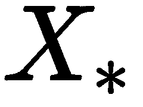 的输出值分布 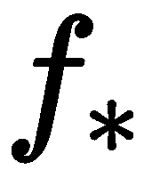。从数学角度看，我们试图估计的量可以表示为：

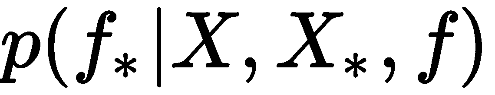

为了得到这个结果，我们将  建模为 GP，这样我们就知道  和  都来自一个具有以下均值和协方差函数的多元高斯分布：

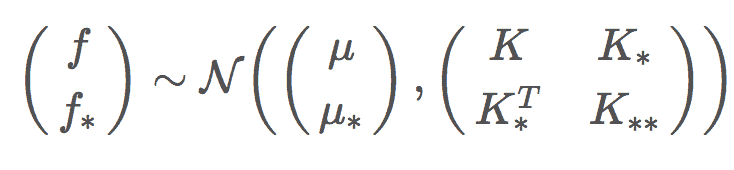

其中， 和 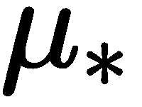 分别表示  的先验均值，以及观察和未观察到的函数值上  的先验均值，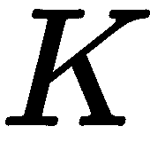 表示应用核函数于每个观察值后得到的矩阵，。

核函数尝试将输入空间中两个数据点之间的相似性映射到输出空间。假设有两个数据点 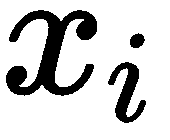 和 ，其对应的函数值分别为 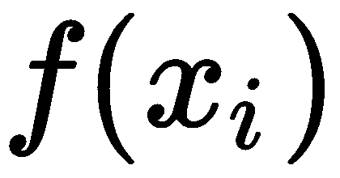 和 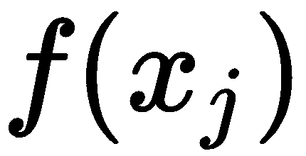。核函数测量输入空间中两个点  和  之间的接近度是如何映射到它们的函数值  和  之间的相似性或相关性的。

我们将这个核函数应用于数据集中所有观测值对，从而创建一个被称为核/协方差矩阵 (`K`) 的相似度矩阵。假设有 10 个输入数据点，核函数将应用于每一对数据点，生成一个 10x10 的核矩阵 (`K`)。如果两个数据点  和  的函数值预计相似，那么在矩阵的 *(i,j)* 位置，核值预计会很高。在下一节中，我们将详细讨论 GP 中的不同核函数。

在这个方程中，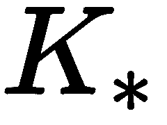 代表通过对训练集和测试集中的值应用相同的核函数得到的矩阵，而 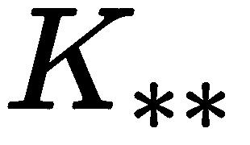 是通过测量测试集中的输入值之间的相似性得到的矩阵。

此时，我们假设有一些线性代数魔法可以帮助我们从联合分布中获得条件分布 ，并得到以下结果：

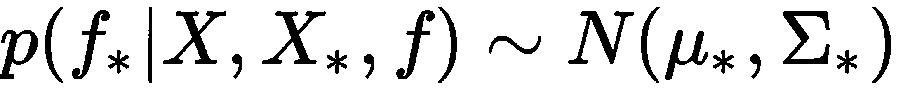

我们将跳过推导过程，但如果你想了解更多，可以访问 Rasmussen 和 Williams 的资料([`www.gaussianprocess.org/gpml/chapters/RW.pdf`](http://www.gaussianprocess.org/gpml/chapters/RW.pdf))。

有了这个解析结果，我们可以访问整个测试数据集上的函数值分布。将预测建模为分布也有助于量化预测的不确定性，这在许多时间序列应用中非常重要。

# 在高斯过程（GPs）中选择核函数

在许多应用中，我们发现先验均值通常设置为零，因为它简单、方便且在许多应用中效果良好。然而，为任务选择合适的核函数并不总是直观的。如前所述，核函数实际上试图将输入数据点之间的相似性映射到输出（函数）空间。核函数（）的唯一要求是，它应该将任何两个输入值  和 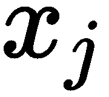 映射到一个标量，使得核矩阵（）是正定/半正定的，从而使其成为有效的协方差函数。

为了简洁起见，我们省略了协方差矩阵的基本概念及其如何始终是半正定矩阵的解释。我们鼓励读者参考[MIT](https://ocw.mit.edu/courses/electrical-engineering-and-computer-science/6-436j-fundamentals-of-probability-fall-2008/lecture-notes/MIT6_436JF08_lec15.pdf)的讲义。

尽管对所有类型的核函数的完整讨论超出了本章的范围，但我们将讨论用于构建该项目的两种核函数：

+   **白噪声核：**顾名思义，白噪声核将白噪声（方差）添加到现有的协方差矩阵中。从数学上讲，它可以表示为：

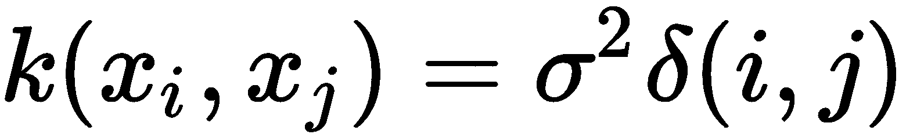

如果有很多设置，数据点不准确并且被一些随机噪声污染。输入数据中的噪声可以通过将白噪声核添加到协方差矩阵中来建模。

+   **平方指数（SE）核：** 给定两个标量，  和 ，平方指数核由以下公式给出：

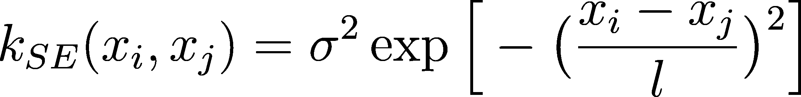

这里，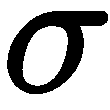是一个缩放因子，而是平滑参数，它决定了核函数的平滑度。这个核函数非常流行，因为通过这个核得到的高斯过程函数是无限可微的，这使得它适用于许多应用。

这里是从具有 SE 核的高斯过程抽取的一些样本，固定为 1：

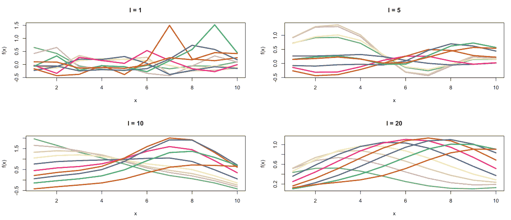

我们可以观察到，随着的增加，函数变得更加平滑。有关不同类型核函数的更多信息，请参阅*The Kernel Cookbook* ([`www.cs.toronto.edu/~duvenaud/cookbook/`](https://www.cs.toronto.edu/~duvenaud/cookbook/))

# 选择核函数的超参数

到目前为止，我们已经定义了具有不同参数的核函数。例如，在平方指数核中，我们有参数和。我们将任何核函数的参数集表示为。现在的问题是，如何估计？

如前所述，我们将函数的输出分布建模为从多元高斯分布中随机抽取的样本。这样，观察数据点的边际似然是一个条件化于输入点和参数的多元高斯分布。因此，我们可以通过最大化观察数据点在此假设下的似然来选择。

现在我们已经理解了高斯过程是如何进行预测的，让我们看看如何利用高斯过程在股票市场进行预测，并可能赚取一些钱。

# 将高斯过程应用于股票市场预测

在这个项目中，我们将尝试预测市场中三只主要股票的价格。该练习的数据集可以从 Yahoo Finance 下载([`finance.yahoo.com`](https://finance.yahoo.com))。我们下载了三家公司完整的股票历史数据：

+   Google ([`finance.yahoo.com/quote/GOOG`](https://finance.yahoo.com/quote/GOOG))

+   Netflix ([`finance.yahoo.com/quote/NFLX`](https://finance.yahoo.com/quote/NFLX))

+   通用电气公司 ([`finance.yahoo.com/quote/GE`](https://finance.yahoo.com/quote/GE))

我们选择了三个数据集来比较不同股票的高斯过程性能。欢迎尝试更多的股票。

所有这些数据集都存在于 GitHub 仓库中。因此，运行代码时无需再次下载它们。

数据集中的 CSV 文件包含多个列，内容如下：

+   **Date:** 股票价格测量的日历日期。

+   **Open:** 当天的开盘价。

+   **High:** 当天的最高价。

+   **Low:** 当天的最低价。

+   **Close:** 当天的收盘价。

+   **Adj Close:** 调整后的收盘价是股票的收盘价，在下一个交易日开盘前，已被修正以包含任何股息或其他公司行动。这是我们的目标变量或数据集中的 Y。

+   **Volume:** 交易量表示当天交易的股票数量。

为了开始我们的项目，我们将考虑每个股票数据集的两个预测问题：

+   在第一个问题中，我们将使用 2008-2016 年的价格进行训练，并预测 2017 年的所有价格。

+   在第二个问题中，我们将使用 2008-2018 年（至第三季度）的价格进行训练，并预测 2018 年第四季度的价格。

对于股票价格预测，我们不需要像许多经典方法（例如回归）那样将股票的整个时间序列建模为一个单一的时间序列。对于高斯过程（GP），每只股票的时间序列会被分割成多个时间序列（每年一个时间序列）。直观地讲，这是合理的，因为每只股票都遵循一个年度周期。

每年股票的时间序列作为输入，作为独立的时间序列输入到模型中。因此，预测问题变成了：给定多个年度时间序列（每个历史年份一个），预测股票的未来价格。由于高斯过程模型是函数的分布，我们希望预测未来每个数据点的均值和不确定性。

在建模之前，我们需要将价格标准化为零均值和单位标准差。这是高斯过程的要求，原因如下：

+   我们假设输出分布的先验为零均值，因此需要进行标准化以匹配我们的假设。

+   许多协方差矩阵的核函数中有尺度参数。标准化输入有助于我们更好地估计核函数参数。

+   要获得高斯过程中的后验分布，我们必须反转协方差矩阵。标准化有助于避免此过程中出现任何数值问题。请注意，在本章中我们没有详细讨论获取后验的线性代数。

一旦数据被标准化，我们就可以训练我们的模型并使用高斯过程预测价格。对于建模，我们使用来自 GPflow 库的插件和即插即用功能（[`github.com/GPflow/GPflow`](https://github.com/GPflow/GPflow)），它是一个基于 TensorFlow 的高斯过程封装库。

预测问题中的自变量（X）由两个因素组成：

+   每年

+   每年的日期

问题中的因变量（Y）是每年每天的标准化调整后收盘价，如前所述。

在训练模型之前，我们需要为高斯过程定义先验和核函数。对于这个问题，我们使用标准的零均值先验。我们使用一个核函数来生成协方差矩阵，该矩阵是两个核函数的和，定义如下：

+   平方指数（或 RBF，如在 GPflow 包中所提到）核函数，`lengthscale` = `1` 和 `variance` = 63。

+   白噪声的初始`variance`非常低，如*1e-10*。

选择平方指数核函数的思路是它是无限可微的，并且是最容易理解的。白噪声用于考虑我们在目标变量中可能观察到的任何系统性噪声。虽然它可能不是最好的核函数选择，但它有助于理解。您可以自由尝试其他核函数，看看它们是否效果良好。

# 创建股票价格预测模型

我们将通过处理数据集中的数据开始我们的项目：

1.  创建一个数据框，其中包含每只股票的年度时间序列。每年的股票价格在数据框中由单独的列表示。将数据框中的行数限制为 252 行，这大约是每年的交易日数。还要为每行数据添加与之相关的财务季度，作为一个单独的列。

```py
def get_prices_by_year(self):
   df = self.modify_first_year_data()
   for i in range(1, len(self.num_years)):
       df = pd.concat([df, pd.DataFrame(self.get_year_data(year=self.num_years[i], normalized=True))], axis=1)
   df = df[:self.num_days]
   quarter_col = []
   num_days_in_quarter = self.num_days // 4
   for j in range(0, len(self.quarter_names)):
       quarter_col.extend([self.quarter_names[j]]*num_days_in_quarter)
   quarter_col = pd.DataFrame(quarter_col)
   df = pd.concat([df, quarter_col], axis=1)
   df.columns = self.num_years + ['Quarter']
   df.index.name = 'Day'
   df = self.fill_nans_with_mean(df)
   return df
```

请注意，一年中大约有 252 个交易日，因为股市在周末休市。

1.  即使某一年的交易日数更多（例如闰年），也将数据限制为 252 天，以确保各年份之间的一致性。如果某一年份的交易日数少于 252 天，则通过对缺失的天数进行填补（使用该年的均值价格）来外推数据以达到 252 天。请使用以下代码来实现此功能：

```py
def fill_nans_with_mean(self, df):
   years = self.num_years[:-1]
   df_wo_last_year = df.loc[:,years]
   df_wo_last_year = df_wo_last_year.fillna(df_wo_last_year.mean())
   df_wo_last_year[self.num_years[-1]] = df[self.num_years[-1]]
   df= df_wo_last_year

   return df
```

1.  对每一年进行价格归一化，将年度数据转化为零均值和单位标准差。同时，从该年所有数据点中减去第一天的价格。这基本上强制每年的时间序列从零开始，从而避免了前一年价格对其的影响。

```py
def normalized_data_col(self, df):
   price_normalized = pd.DataFrame()
   date_list = list(df.Date)
   self.num_years = sorted(list(set([date_list[i].year for i in range(0, len(date_list))])))
   for i in range(0, len(self.num_years)):
       prices_data = self.get_year_data(year=self.num_years[i], normalized=False)
       prices_data = [(prices_data[i] - np.mean(prices_data)) / np.std(prices_data) for i in range(0, len(prices_data))]
       prices_data = [(prices_data[i] - prices_data[0]) for i in range(0, len(prices_data))]
       price_normalized = price_normalized.append(prices_data, ignore_index=True)
   return price_normalized
```

在执行代码之前，请确保按照**README**文件中的说明安装本章的相关库。

1.  如前节所述，生成协方差矩阵作为两个核函数的和：

```py
kernel = gpflow.kernels.RBF(2, lengthscales=1, variance=63) + gpflow.kernels.White(2, variance=1e-10)
```

我们使用 GPflow 包中的 SciPy 优化器，通过最大似然估计来优化超参数。SciPy 是 Python 库中的标准优化器。如果您不熟悉 SciPy 优化器，请参考官方页面（[`docs.scipy.org/doc/scipy/reference/generated/scipy.optimize.minimize.html`](https://docs.scipy.org/doc/scipy/reference/generated/scipy.optimize.minimize.html)）。

1.  实现最终的包装函数`make_gp_predictions`来训练高斯过程模型并进行未来价格预测。该函数实现的步骤如下：

    1.  输入训练数据、训练周期的开始和结束日期以及预测年份和季度。

    1.  使用训练周期的起始年份数据构建 2 个独立的系列，一个用于自变量（X），一个用于目标变量（Y）。系列（X）中的每个元素代表年份中的每一天，并由两个自变量组成：年份和该年的第几天。例如，对于起始年份 2008 年，X 的形式为[[2008,1], [2008,2], [2008,3], ...... [2008,252]]。

    1.  将每个后续年份的自变量和目标变量分别附加到列表 X 和 Y 中。

    1.  如果输入`pred_quarters`不为 None，则根据指定的季度进行预测，而不是整个年份。例如，如果`pred_quarters`为[4]且`pred_year`为 2018 年，则该函数会使用 2018 年第三季度之前的所有数据来预测 2018 年第四季度的股价。

    1.  定义如前所述的核函数，并使用 Scipy 优化器训练 GP 模型。

    1.  对预测期内的股票价格进行预测。

```py
def make_gp_predictions(self, start_year, end_year, pred_year, pred_quarters = []):
   start_year, end_year, pred_year= int(start_year),int(end_year), int(pred_year)
   years_quarters = list(range(start_year, end_year + 1)) + ['Quarter']
   years_in_train = years_quarters[:-2]
   price_df = self.preprocessed_data.prices_by_year[self.preprocessed_data.prices_by_year.columns.intersection(years_quarters)]
   num_days_in_train = list(price_df.index.values)
   #Generating X and Y for Training
   first_year_prices = price_df[start_year]
   if start_year == self.preprocessed_data.num_years[0]:
       first_year_prices = (first_year_prices[first_year_prices.iloc[:] != 0])
       first_year_prices = (pd.Series([0.0], index=[first_year_prices.index[0]-1])).append(first_year_prices)
   first_year_days = list(first_year_prices.index.values)
   first_year_X = np.array([[start_year, day] for day in first_year_days])
   X = first_year_X
   Target = np.array(first_year_prices)
   for year in years_in_train[1:]:
       current_year_prices = list(price_df.loc[:, year])
       current_year_X = np.array([[year, day] for day in num_days_in_train])
       X = np.append(X, current_year_X, axis=0)
       Target = np.append(Target, current_year_prices)
   final_year_prices = price_df[end_year]
   final_year_prices = final_year_prices[final_year_prices.iloc[:].notnull()]
   final_year_days = list(final_year_prices.index.values)
   if pred_quarters is not None:
       length = 63 * (pred_quarters[0] - 1)
       final_year_days = final_year_days[:length]
       final_year_prices = final_year_prices[:length]
   final_year_X = np.array([[end_year, day] for day in final_year_days])
   X = np.append(X, final_year_X, axis=0)
   Target = np.append(Target, final_year_prices)
   if pred_quarters is not None:
       days_for_prediction = [day for day in
                              range(63 * (pred_quarters[0]-1), 63 * pred_quarters[int(len(pred_quarters) != 1)])]
   else:
       days_for_prediction = list(range(0, self.preprocessed_data.num_days))
   x_mesh = np.linspace(days_for_prediction[0], days_for_prediction[-1]
                        , 2000)
   x_pred = ([[pred_year, x_mesh[i]] for i in range(len(x_mesh))])
   X = X.astype(np.float64)
   Target = np.expand_dims(Target, axis=1)
   kernel = gpflow.kernels.RBF(2, lengthscales=1, variance=63) + gpflow.kernels.White(2, variance=1e-10)
   self.gp_model = gpflow.models.GPR(X, Target, kern=kernel)
   gpflow.train.ScipyOptimizer().minimize(self.gp_model)
   y_mean, y_var = self.gp_model.predict_y(x_pred)
   return x_mesh, y_mean, y_var
```

# 理解所得结果

让我们尝试了解我们对每只股票的预测效果如何：

+   **Netflix (NFLX)**：以下图表展示了**2002**年到**2018**年期间 Netflix 股票的价格：

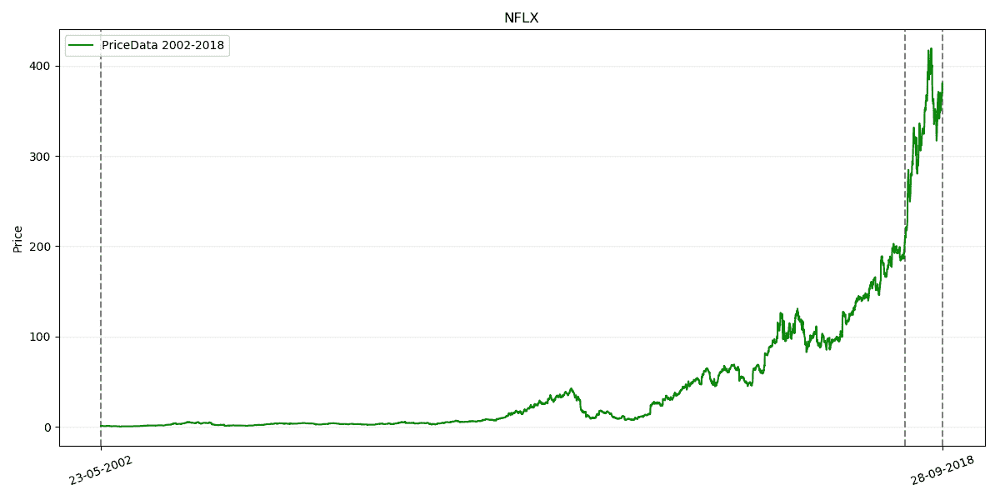

**2018**年的价格通过两条垂直线定义，显示了整个年度股票价格的增长情况。

根据第一个问题案例，我们考虑**2008-2016**年间的数据进行训练：

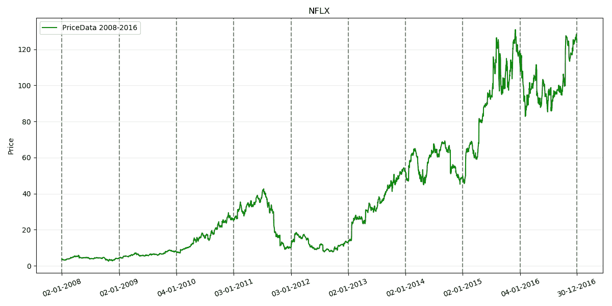

对每年的价格进行标准化建模，得到以下图表：

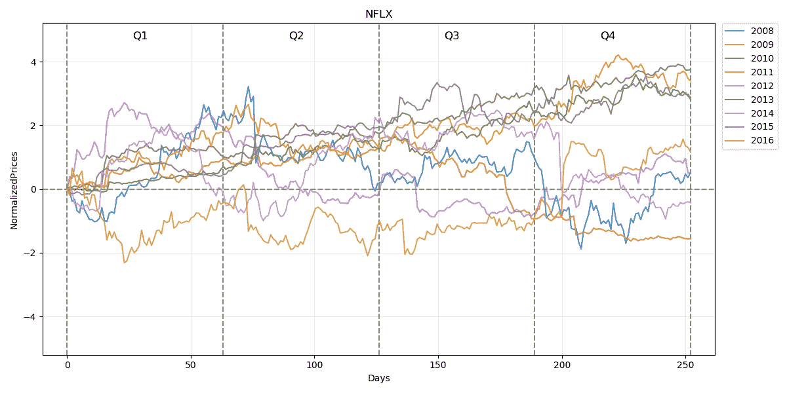

对**2017**年整个年度股票价格进行预测，并给出**95%置信区间**的结果，得到以下图表：

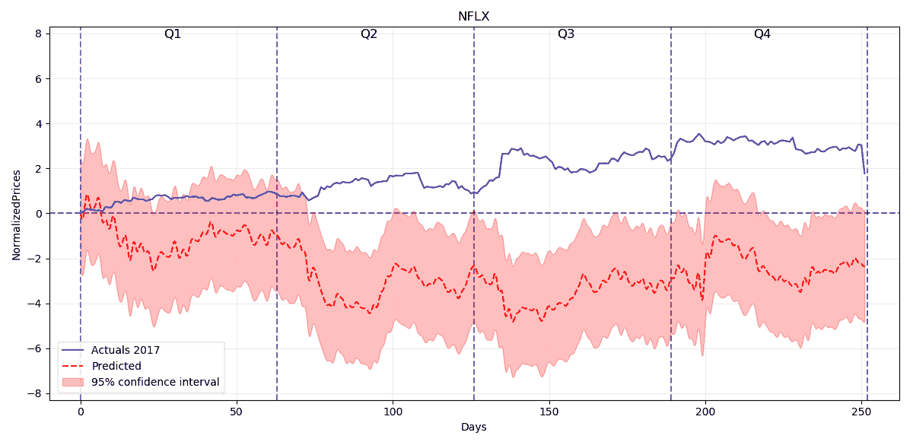

将生成的值与实际值进行比较，可以看出该模型预测的值低于实际值。然而，造成这种情况的原因可能是**2016**年 Netflix 股票价格的波动。这些波动没有通过该项目中使用的基础核函数捕捉到。

对于第二个问题案例，我们考虑**2008-2018**年的训练周期，包括前三个季度。此期间 Netflix 股票价格的图表如下：

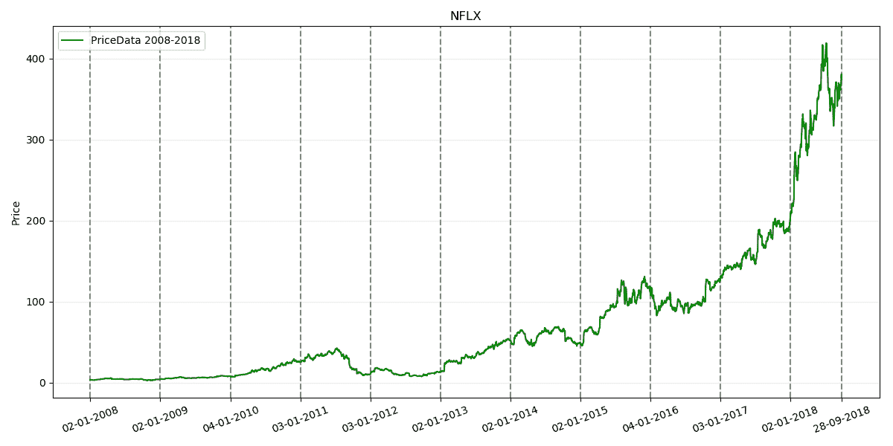

使用标准化值，我们得到以下图表：

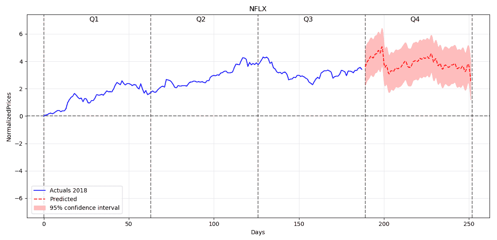

正如我们所见，这一预测很好地捕捉了趋势，同时也体现了不确定性。

+   **通用电气公司**（**GE**）：为了理解实际价格与预测价格之间的差异，有必要绘制包含实际值的图表。以下是展示 GE 股票历史价格的图表：

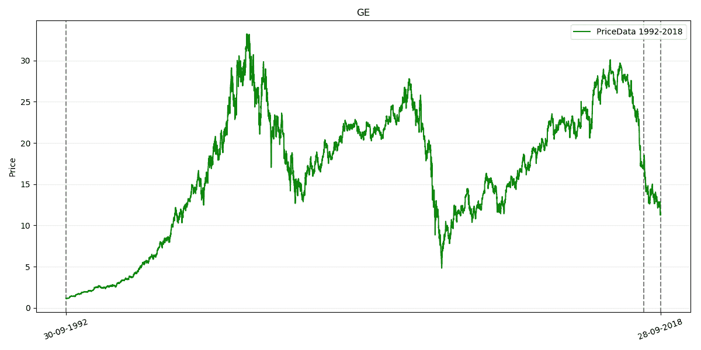

如前所述，虚线垂直线表示**2018**年的股价。

根据我们的第一个问题案例，我们考虑了**2008-2016**年期间的训练数据。该期间的图表如下：

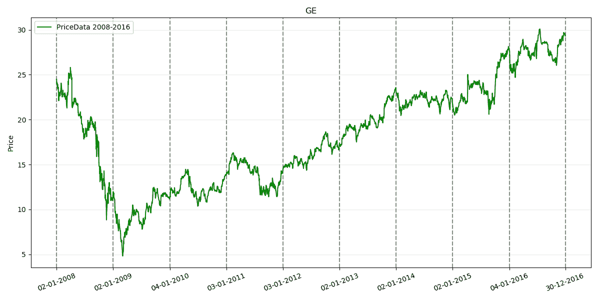

**2009**年出现了一个巨大的跌幅，但从那时起，股票价格一直在稳步增长。

由于我们在建模时使用了每年标准化价格，让我们来看一下模型的输入数据：

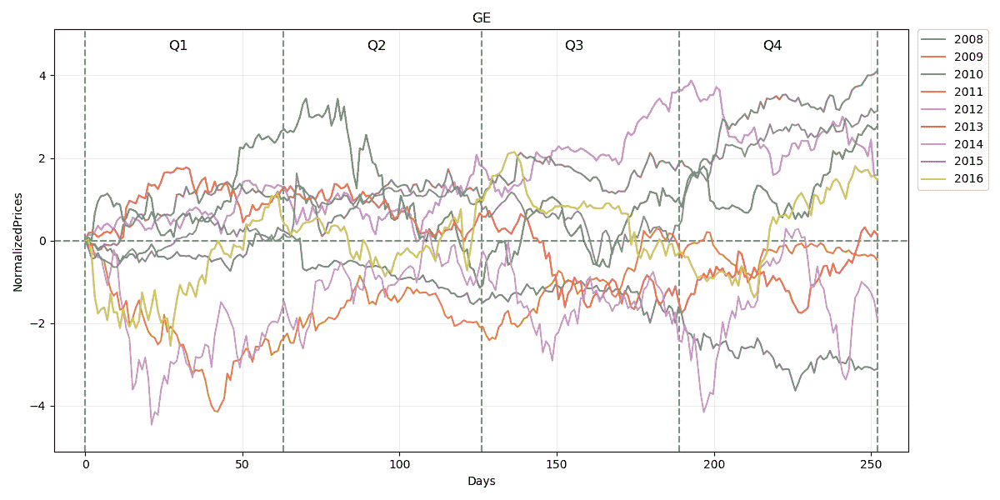

对于**2017**年的标准化价格预测，**95%置信区间**的结果如下：

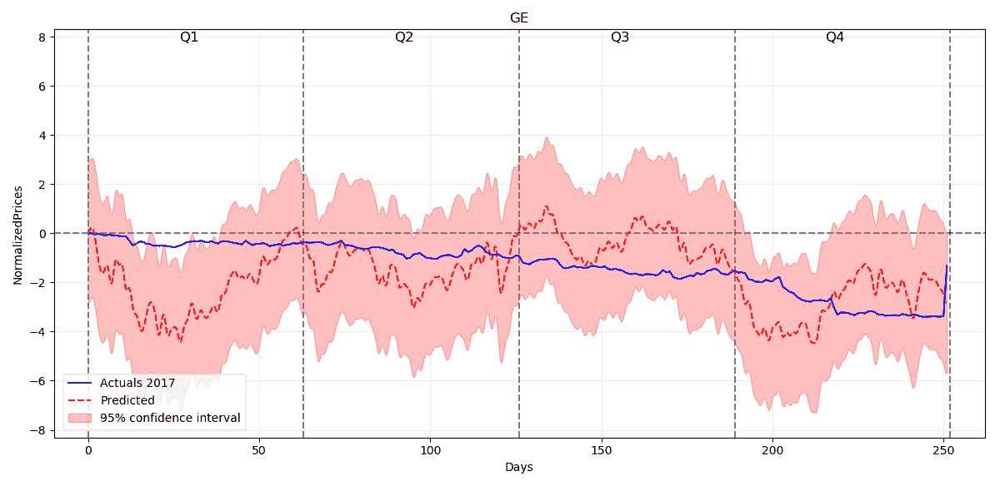

如我们所见，模型准确地捕捉到了股票的趋势。

对于第二次预测，我们考虑了**2008-2018**年期间的训练数据，包括**2018**年前三个季度。在此期间，GE 股票的价格图如下：

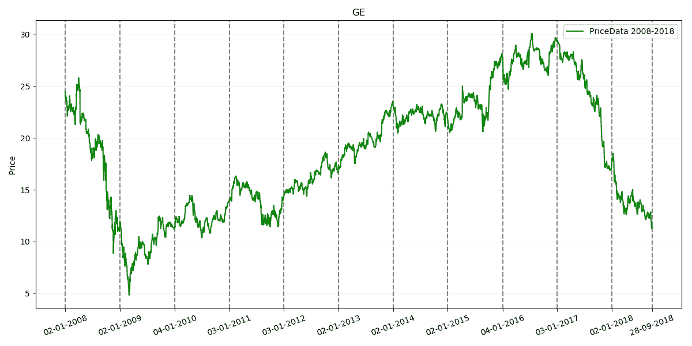

该期间的预测价格，**95%置信区间**为：

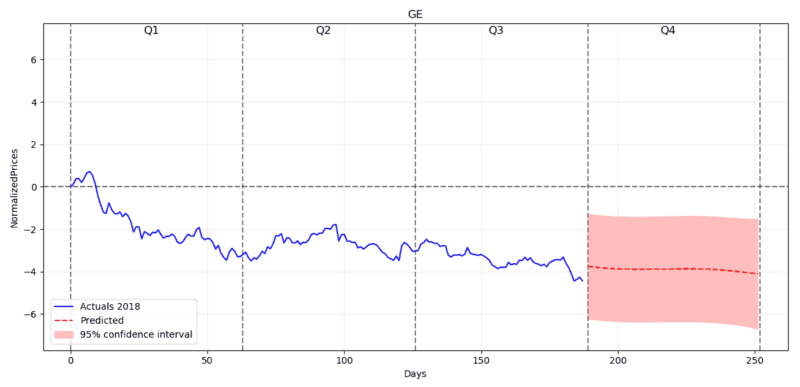

+   **Google**（**GOOG**）：以下图表展示了谷歌股票的历史价格：

**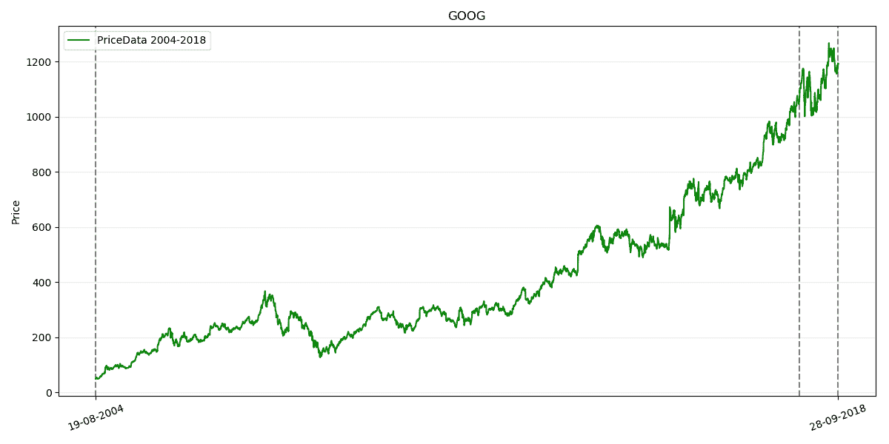**

如前所述，虚线垂直线代表的是**2018**年的价格。

根据第一个问题案例，**2008-2016**年期间对于训练至关重要，让我们来看一下这个期间的图表：

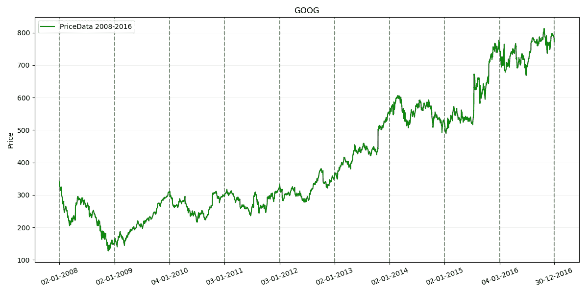

**2009**年出现了巨大的跌幅，之后股票价格稳步上涨，除非在**2015**年。

由于我们在建模时使用了按年标准化的价格，让我们来看一下模型的输入数据：

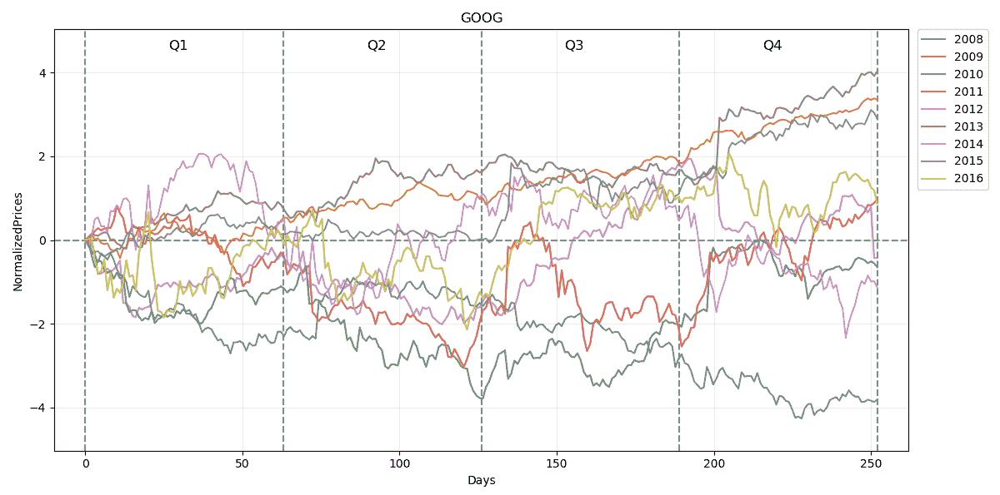

对于整年**2017**的预测（标准化价格），**95%置信区间**的结果如下：

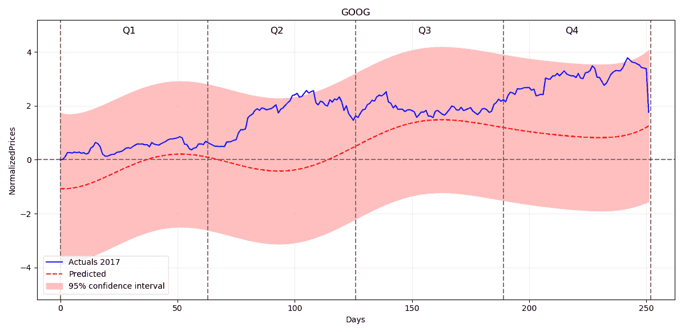

我们能够捕捉到价格的整体上升趋势，但置信区间非常宽。

对于下一个预测，我们考虑了**2008-2018**年的训练期，包括前三个季度。在此期间的谷歌股票价格图如下：

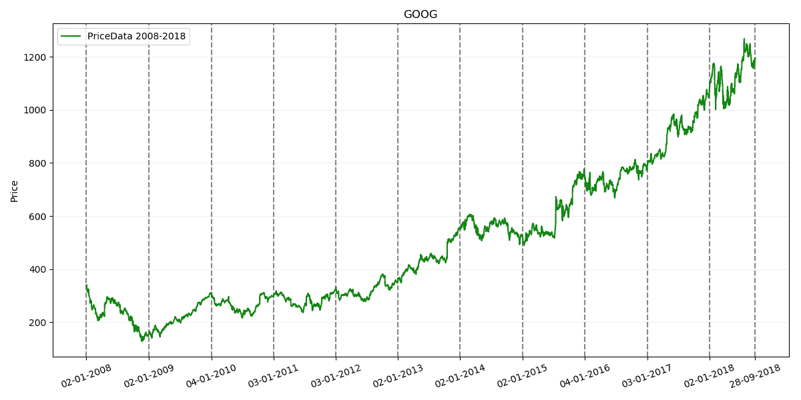

该期间的预测价格，**95%置信区间**为：

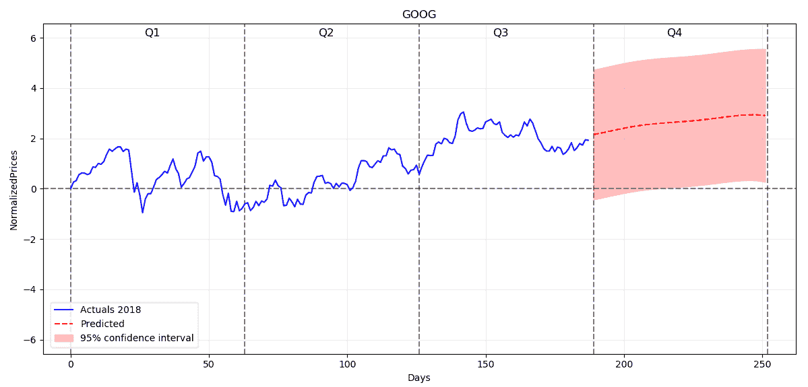

2018 年，整体趋势得到了更好的捕捉。

# 总结

在这一章中，我们了解了一种非常流行的贝叶斯预测模型——高斯过程，并使用它来预测股票价格。

在本章的第一部分，我们通过从多变量高斯分布中采样一个合适的函数来研究预测问题，而不是使用单点预测。我们研究了一种特殊的非参数贝叶斯模型，称为高斯过程。

随后，我们使用高斯过程（GP）预测了三只股票——即谷歌、奈飞和 GE——在 2017 年和 2018 年第四季度的价格。我们观察到，预测结果大多数落在 95%的置信区间内，但仍远非完美。

高斯过程广泛应用于需要在数据点非常少的情况下建模带有不确定性的非线性函数的场景。然而，在面对维度极高的问题时，它们有时会失效，而其他深度学习算法，如 LSTM，可能表现得更好。

在下一章，我们将深入探讨一种无监督的方法，通过自动编码器检测信用卡欺诈行为。

# 问题

1.  什么是高斯过程？

1.  你能通过尝试不同的核函数来改善预测结果吗？

1.  你能将高斯过程模型应用于标准普尔 500 指数中的其他股票，并与这里提到的股票表现进行比较吗？
