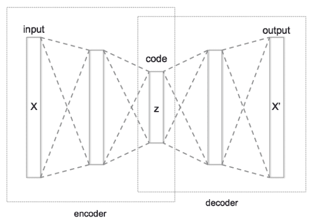
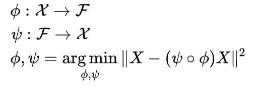
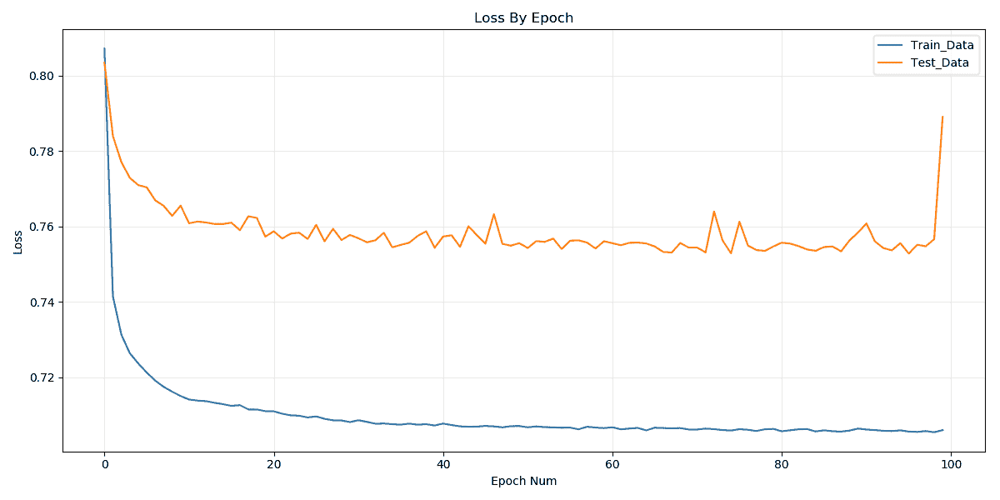
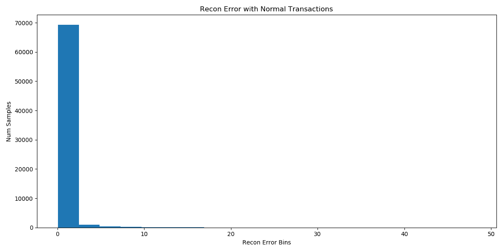
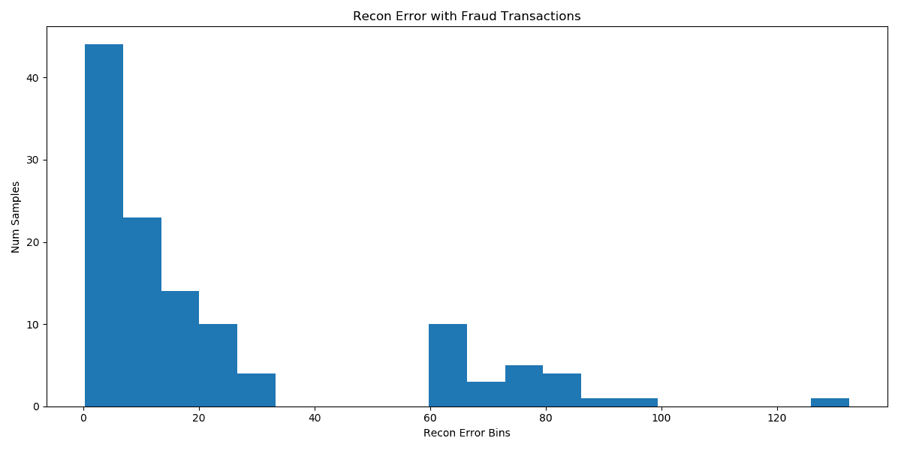
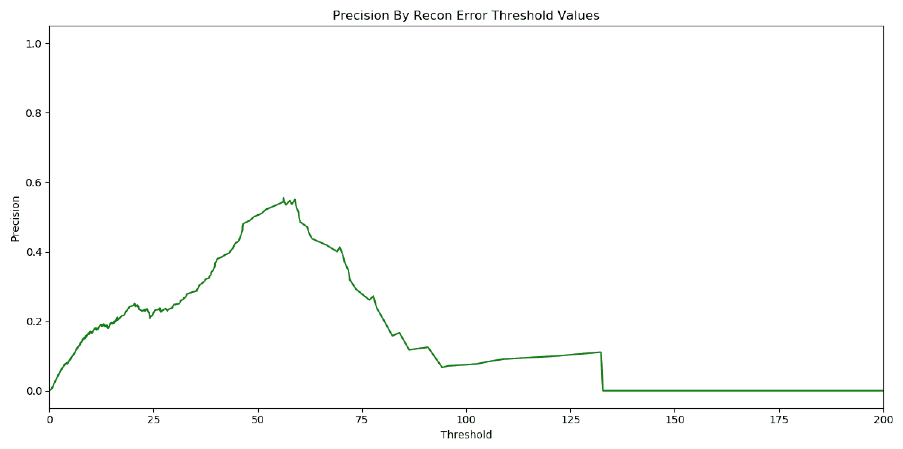
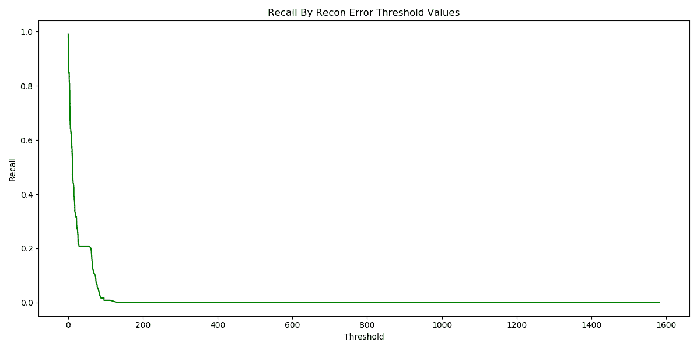
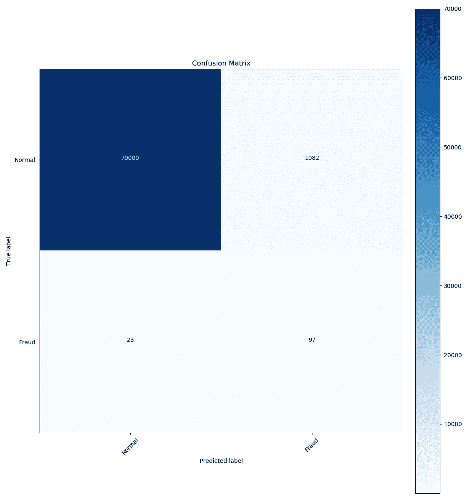

# 第七章：使用自编码器进行信用卡欺诈检测

数字世界正在快速发展。我们习惯于在网上完成许多日常任务，如预订出租车、在电子商务网站购物，甚至为手机充值。对于这些任务的大多数，我们习惯使用信用卡支付。然而，信用卡可能会被盗用，这可能导致欺诈交易。Nilson 报告估计，每花费 100 美元，就有 7 美分被盗取。它估计信用卡欺诈市场总额约为 300 亿美元。

检测交易是否欺诈是一个非常具有影响力的数据科学问题。每家发行信用卡的银行都在投资技术以检测欺诈并立即采取适当的行动。有很多标准的监督学习技术，如逻辑回归、随机森林等，用于欺诈分类。

在本章中，我们将更详细地了解使用自编码器检测信用卡欺诈的无监督方法，并探讨以下主题：

+   了解自编码器

+   定义和训练欺诈检测模型

+   测试欺诈检测模型

# 了解自编码器

自编码器是一种人工神经网络，其任务是使用无监督学习学习输入数据的低维表示。当涉及到输入数据的降维和生成模型时，它们非常受欢迎。

本质上，自编码器学习将数据压缩成低维表示，然后将该表示重建为与原始数据匹配的内容。这样，低维表示忽略了噪声，这些噪声在重建原始数据时没有帮助。

如前所述，它们在生成模型，特别是图像方面也很有用。例如，如果我们输入*狗*和*飞行*的表示，它可能会尝试生成一个*飞行的猫*图像，尽管它以前未见过这样的图像。

从结构上看，自编码器由两个部分组成，编码器和解码器。编码器生成输入的低维表示，解码器帮助从表示中重新生成输入。通常，编码器和解码器是具有一个或多个隐藏层的前馈神经网络。

以下图示说明了典型自编码器的配置：



要定义编码器（）和解码器（），自编码器可以通过以下数学公式表示：



如公式所示，编码器和解码器的参数通过一种优化方式进行调整，以最小化一种特殊类型的错误，称为**重建误差**。重建误差是重建输入与原始输入之间的误差。

# 构建欺诈检测模型

对于这个项目，我们将使用 Kaggle 上的信用卡数据集（[`www.kaggle.com/mlg-ulb/creditcardfraud`](https://www.kaggle.com/mlg-ulb/creditcardfraud)），Andrea Dal Pozzolo，Olivier Caelen，Reid A. Johnson 和 Gianluca Bontempi 的论文《Calibrating Probability with Undersampling for Unbalanced Classification》，发表于 2015 年计算智能与数据挖掘研讨会（CIDM），IEEE。该数据集包含来自欧洲持卡人的两天信用卡交易数据，数据严重不平衡，共约 28.4 万条交易数据，其中有 492 个欺诈实例（占总数的 0.172%）。

数据集中有 31 个数值型列，其中两个是时间和金额。**Time**表示从每笔交易到数据集中第一次交易所经过的时间（单位：秒）。**Amount**表示交易的总金额。对于我们的模型，我们将去除时间列，因为它对模型的准确性没有帮助。其余的特征（V1, V2 ... V28）是通过主成分分析（[`ocw.mit.edu/courses/mathematics/18-650-statistics-for-applications-fall-2016/lecture-videos/lecture-19-video/`](https://ocw.mit.edu/courses/mathematics/18-650-statistics-for-applications-fall-2016/lecture-videos/lecture-19-video/)）从原始特征中提取的，出于保密原因。**Class**是目标变量，表示交易是否为欺诈交易。

数据预处理的工作并不多，主要是因为大部分数据已经清理过。

通常，在经典的机器学习模型中，如逻辑回归，我们会将负类和正类的数据点都输入到算法中。然而，由于我们使用的是自动编码器，我们将采用不同的建模方式。

本质上，我们的训练集将仅包含非欺诈交易数据。我们的思路是，每当我们将一笔欺诈交易输入到已训练的模型中时，模型应将其检测为异常。我们将这个问题定义为异常检测问题，而不是分类问题。

该模型将由两个全连接的编码器层组成，分别有 14 个和 7 个神经元。解码器部分将有两个层，分别有 7 个和 29 个神经元。此外，我们将在训练过程中使用 L1 正则化。

最后，为了定义模型，我们将使用 Keras，并以 Tensorflow 作为后端来训练自动编码器。

正则化是机器学习中的一种技术，用于减少过拟合。过拟合发生在模型不仅学习到训练数据中的信号，还学习到了噪音，从而无法很好地泛化到未见过的数据集。虽然有很多方法可以避免过拟合，比如交叉验证、采样等，但正则化特别是通过对模型的权重添加惩罚，防止我们学习到过于复杂的模型。L1 正则化对模型的所有权重添加 L1 范数惩罚。这样，任何不贡献于准确度的权重都会被压缩到零。

# 定义并训练欺诈检测模型

以下是定义和训练模型的步骤：

1.  通过去除均值并将其缩放到单位方差，转换`'Amount'`：

```py
def preprocess_data(data):
data = data.drop(['Time'], axis=1)
data['Amount'] = StandardScaler().fit_transform(data['Amount'].values.reshape(-1, 1))
return
 data
```

请注意，我们使用的是来自 scikit-learn 的`StandardScaler`工具来实现此目的。

1.  为了构建我们的数据集，将其分为训练数据和测试数据，训练数据仅包含非欺诈交易，测试数据包含欺诈和非欺诈交易：

```py
def get_train_and_test_data(processed_data):
X_train, X_test = train_test_split(processed_data, test_size=0.25, random_state=RANDOM_SEED)
X_train = X_train[X_train.Class == 0]
X_train = X_train.drop(['Class'], axis=1)
y_test = X_test['Class']
X_test = X_test.drop(['Class'], axis=1)
X_train = X_train.values
X_test = X_test.values
return X_train, X_test,y_test
```

1.  使用以下代码定义模型：

```py
def define_model(self):
dim_input = self.train_data.shape[1]
layer_input = Input(shape=(dim_input,))
layer_encoder = Dense(DIM_ENCODER, activation="tanh",
activity_regularizer=regularizers.l1(10e-5))(layer_input)
layer_encoder = Dense(int(DIM_ENCODER / 2), activation="relu")(layer_encoder)
layer_decoder = Dense(int(DIM_ENCODER / 2), activation='tanh')(layer_encoder)
layer_decoder = Dense(dim_input, activation='relu')(layer_decoder)
autoencoder = Model(inputs=layer_input, outputs=layer_decoder)
return autoencoder
```

1.  一旦模型定义完成，使用 Keras 训练模型：

```py
def train_model(self):
self.model.compile(optimizer=OPTIMIZER,
loss=LOSS,
metrics=[EVAL_METRIC])
checkpoint = ModelCheckpoint(filepath=os.path.join(MODEL_SAVE_DIR, "trained_model.h5"),
verbose=0,
save_best_only=True)
log_tensorboard = TensorBoard(log_dir='./logs',
histogram_freq=0,
write_graph=True,
write_images=True)
history = self.model.fit(self.train_data, self.train_data,
epochs=EPOCHS,
batch_size=BATCH_SIZE,
shuffle=True,
validation_data=(self.test_data, self.test_data),
verbose=1,
callbacks=[checkpoint, log_tensorboard]).history
self.history = history
print("Training Done. Plotting Loss Curves")
self.plot_loss_curves()
```

1.  使用以下参数查找模型的输出：

+   +   EPOCHS = 100。

    +   BATCH_SIZE = 32。

    +   OPTIMIZER = 'Adam'。

    +   LOSS = 重建输入与原始输入之间的均方误差。

    +   EVAL_METRIC = 'Accuracy'。这是通常的二分类准确率。

1.  存储一个`TensorBoard`文件，以可视化图形或其他变量。同时，通过 Keras 提供的检查点存储表现最佳的模型。生成训练和测试数据的损失曲线：

```py
def plot_loss_curves(self):
fig = plt.figure(num="Loss Curves")
fig.set_size_inches(12, 6)
plt.plot(self.history['loss'])
plt.plot(self.history['val_loss'])
plt.title('Loss By Epoch')
plt.ylabel('Loss')
plt.xlabel('Epoch Num')
plt.legend(['Train_Data', 'Test_Data'], loc='upper right');
plt.grid(True, alpha=.25)
plt.tight_layout()
image_name = 'Loss_Curves.png'
fig.savefig(os.path.join(PLOTS_DIR,image_name), dpi=fig.dpi)
plt.clf()
```

1.  以下图示展示了在训练 100 个 epochs 时生成的损失曲线：



我们可以观察到，对于训练集，损失或重建误差在训练初期下降，并在结束时饱和。此饱和意味着模型已经完成了权重的学习。

保存测试集中损失最小的模型。

# 测试欺诈检测模型

一旦训练过程完成，通过欺诈交易和非欺诈（正常）交易区分测试集中的重建误差。生成不同类别交易的重建误差：

```py
def plot_reconstruction_error_by_class(self):
self.get_test_predictions()
mse = np.mean(np.power(self.test_data - self.test_predictions, 2), axis=1)
self.recon_error = pd.DataFrame({'recon_error': mse,
'true_class': self.y_test})
## Plotting the errors by class
# Normal Transactions
fig = plt.figure(num = "Recon Error with Normal Transactions")
fig.set_size_inches(12, 6)
ax = fig.add_subplot(111)
normal_error_df = self.recon_error[(self.recon_error['true_class'] == 0) & (self.recon_error['recon_error'] < 50)]
_ = ax.hist(normal_error_df.recon_error.values, bins=20)
plt.xlabel("Recon Error Bins")
plt.ylabel("Num Samples")
plt.title("Recon Error with Normal Transactions")
plt.tight_layout()
image_name = "Recon_Error_with_Normal_Transactions.png"
fig.savefig(os.path.join(PLOTS_DIR, image_name), dpi=fig.dpi)
plt.clf()
```

以下图示展示了测试集中欺诈和正常交易的重建误差分布：



下一个图示为欺诈交易：



如我们所见，大多数正常交易的重建误差接近零。然而，欺诈交易的重建误差分布较广，大部分仍接近零。

这表明重建误差的阈值可以作为正常交易与欺诈交易的分类阈值。

为了评估模型，我们将使用在第四章《*使用 TensorFlow Lite 进行数字分类*》中定义的精确度和召回率度量。首先，让我们来看一下在不同重构误差阈值下的精确度和召回率：

```py
def get_precision_recall_curves(self):
precision, recall, threshold = precision_recall_curve(self.recon_error.true_class, self.recon_error.recon_error)
# Plotting the precision curve
fig = plt.figure(num ="Precision Curve")
fig.set_size_inches(12, 6)
plt.plot(threshold, precision[1:], 'g', label='Precision curve')
plt.title('Precision By Recon Error Threshold Values')
plt.xlabel('Threshold')
plt.ylabel('Precision')
plt.tight_layout()
image_name = 'Precision_Threshold_Curve.png'
fig.savefig(os.path.join(PLOTS_DIR, image_name), dpi=fig.dpi)
plt.clf()
plt.plot(threshold, recall[1:], 'g', label='Recall curve')
plt.title('Recall By Recon Error Threshold Values')
plt.xlabel('Threshold')
plt.ylabel('Recall')
plt.tight_layout()
image_name = 'Recall_Threshold_Curve.png'
fig.savefig(os.path.join(PLOTS_DIR, image_name), dpi=fig.dpi)
plt.clf()
```

精确度和召回率的重构误差阈值如以下图所示：



该图表示召回率的误差阈值：



如我们所见，当重构误差增加时，召回率下降，精确度则相反。由于数据集的原因，图中存在一些波动。

还有一件事我们需要记住。正如前面所提到的，在机器学习中，高精度与高召回率之间总是存在权衡。我们需要为我们的特定模型选择其中一个。

通常，企业更倾向于选择高精度或高召回率的模型。对于欺诈检测，我们希望有一个高召回率的模型。这一点非常重要，因为我们可以将大多数欺诈交易分类为欺诈。应对精确度损失的一种方法是对被分类为欺诈的交易进行人工验证，确定它们是否真的属于欺诈交易。这样有助于确保最终用户的良好体验。

这是生成混淆矩阵的代码，`min_recall`设置为 80%：

```py
def get_confusion_matrix(self, min_recall = 0.8):
# Get the confusion matrix with min desired recall on the testing dataset used.
precision, recall, threshold = precision_recall_curve(self.recon_error.true_class, self.recon_error.recon_error)
idx = filter(lambda x: x[1] > min_recall, enumerate(recall[1:]))[-1][0]
th = threshold[idx]
print ("Min recall is : %f, Threshold for recon error is: %f " %(recall[idx+1], th))
# Get the confusion matrix
predicted_class = [1 if e > th else 0 for e in self.recon_error.recon_error.values]
cnf_matrix = confusion_matrix(self.recon_error.true_class, predicted_class)
classes = ['Normal','Fraud']
fig = plt.figure(figsize=(12, 12))
plt.imshow(cnf_matrix, interpolation='nearest', cmap=plt.cm.Blues)
plt.title("Confusion Matrix")
plt.colorbar()
tick_marks = np.arange(len(classes))
plt.xticks(tick_marks, classes, rotation=45)
plt.yticks(tick_marks, classes)
fmt = 'd'
thresh = cnf_matrix.max() / 2.
for i, j in itertools.product(range(cnf_matrix.shape[0]), range(cnf_matrix.shape[1])):
plt.text(j, i, format(cnf_matrix[i, j], fmt),
horizontalalignment="center",
color="white" if cnf_matrix[i, j] > thresh else "black")
plt.ylabel('True label')
plt.xlabel('Predicted label')
plt.tight_layout()
image_name = 'Confusion_Matrix_with_threshold_{}.png'.format(th)
fig.savefig(os.path.join(PLOTS_DIR, image_name), dpi=fig.dpi)
plt.clf()
```

从前面的代码得到的混淆矩阵如下图所示：



我们可以观察到，在 120 笔欺诈交易中，97 笔被正确分类。然而，我们还错误地将 1,082 笔正常交易分类为欺诈交易，这些交易将需要经过人工验证，以确保最终用户的良好体验。

作为一个警告，我们不应假设自编码器在所有二分类任务中都能有所帮助，并且能够超越最先进的分类模型。这个项目的目的是展示一种不同的使用自编码器进行分类任务的方法。

请注意，在本章中，为了说明问题，我们使用了相同的验证集和测试集。理想情况下，一旦我们定义了重构误差的阈值，应该在一些未见过的数据集上测试模型，以便更好地评估其性能。

# 总结

信用卡欺诈在本质上是普遍存在的。如今，每家公司都在使用机器学习来打击平台上的支付欺诈。在本章中，我们探讨了如何使用 Kaggle 的信用卡数据集来进行欺诈分类。

我们学习了自编码器作为一种降维技术。我们理解到，自编码器架构由两个组件组成：编码器和解码器。我们使用重构损失来建模一个全连接网络的参数。

此后，我们通过异常检测问题的视角来审视欺诈分类问题。我们使用正常交易训练了自动编码器模型。然后，我们查看了自动编码器在正常交易和欺诈交易中的重构误差，并观察到欺诈交易的重构误差分布较广。接着，我们在重构误差上定义了一个阈值来对模型进行分类，并生成了混淆矩阵。

在下一章中，我们将探讨贝叶斯神经网络的概念，它将深度学习和贝叶斯学习的概念结合起来，以在深度神经网络的预测中建模不确定性。

# 问题

以下是问题：

+   什么是自动编码器？

+   自动编码器的不同组件是什么？

+   什么是重构损失？

+   什么是精确度和召回率？
