# 第八章：使用贝叶斯神经网络生成交通标志分类器的不确定性

作为人类，我们喜欢预测中的不确定性。例如，在我们离开家之前，我们总是想知道下雨的几率。然而，传统的深度学习只给出一个点预测，而没有不确定性的概念。这些网络的预测被假设为准确的，但事实并非总是如此。理想情况下，我们希望在做出决策之前，能够了解神经网络预测的置信度。

例如，在模型中引入不确定性本可能避免以下灾难性后果：

+   2016 年 5 月，特斯拉 Model S 在佛罗里达州北部发生了撞车事故，撞上了一辆正在左转的卡车。根据特斯拉官方博客的描述（[`www.tesla.com/en_GB/blog/tragic-loss`](https://www.tesla.com/en_GB/blog/tragic-loss)），*自动驾驶系统和驾驶员都没有注意到卡车拖车在明亮的天空下呈现的白色侧面，因此没有踩刹车*。

+   2015 年 7 月，谷歌的图像分类器将两位非裔美国人错误地分类为大猩猩，引发了种族歧视的担忧。这里是新闻发布稿（[`www.usatoday.com/story/tech/2015/07/01/google-apologizes-after-photos-identify-black-people-as-gorillas/29567465/`](https://www.usatoday.com/story/tech/2015/07/01/google-apologizes-after-photos-identify-black-people-as-gorillas/29567465/)）。

从这些例子中可以看出，量化预测中的不确定性本可以避免这些灾难。现在的问题是：如果这这么显而易见，为什么特斯拉或谷歌一开始没有实施呢？

贝叶斯算法（如高斯过程）能够量化不确定性，但无法扩展到像图像和视频这样的庞大数据集，而深度学习能够提供更好的准确性——只是它缺乏不确定性的概念。

本章将探索贝叶斯神经网络的概念，结合深度学习和贝叶斯学习的概念，以及深度神经网络预测中的模型不确定性。我们将涵盖以下主题：

+   贝叶斯深度学习简介

+   贝叶斯神经网络是什么？

+   使用德国交通标志图像数据集构建贝叶斯神经网络

# 理解贝叶斯深度学习

我们都已经理解了贝叶斯规则的基础知识，如第六章所解释的，*使用高斯过程回归预测股价*。

对于贝叶斯机器学习，我们使用与贝叶斯规则相同的公式来从给定数据中学习模型参数（`w`），`X`。因此，公式如下所示：

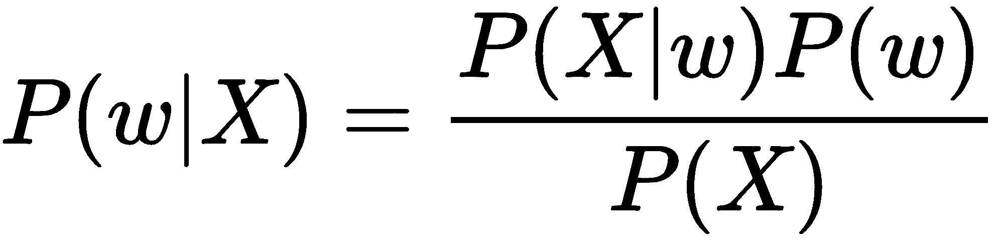

在这里，`P(X)`或者观测数据的概率也叫做证据。这通常很难计算。一种暴力方法是将`P(X|w)` 对所有模型参数值进行积分，但显然这在计算上代价太高。`P(w)`是参数的先验，在大多数情况下它只是参数的随机初始化值。通常，我们不在乎先验设置得是否完美，因为我们期望推断过程能够收敛到正确的参数值。

`P(X|w)`  被称为给定建模参数下的数据似然性。实际上，它显示了在给定模型参数时，获得数据中给定观察值的可能性。我们使用似然性作为评估不同模型的标准。似然性越高，模型越好。
`P(w|X)`，后验，是我们想要计算的内容。它是基于给定数据得到的模型参数的概率分布。一旦我们获得了模型参数的不确定性，我们就可以用它们来量化模型预测的不确定性。

通常，在机器学习中，我们使用**最大似然估计**（**MLE**）([`ocw.mit.edu/courses/mathematics/18-05-introduction-to-probability-and-statistics-spring-2014/readings/MIT18_05S14_Reading10b.pdf`](https://ocw.mit.edu/courses/mathematics/18-05-introduction-to-probability-and-statistics-spring-2014/readings/MIT18_05S14_Reading10b.pdf)) 来获得模型参数的估计。然而，在贝叶斯深度学习的情况下，我们从先验和该过程估计后验，这一过程被称为**最大后验估计**（**MAP**）([`ocw.mit.edu/courses/sloan-school-of-management/15-097-prediction-machine-learning-and-statistics-spring-2012/lecture-notes/MIT15_097S12_lec15.pdf`](https://ocw.mit.edu/courses/sloan-school-of-management/15-097-prediction-machine-learning-and-statistics-spring-2012/lecture-notes/MIT15_097S12_lec15.pdf))。

# 神经网络中的贝叶斯法则

传统上，神经网络通过优化权重和偏差来产生一个点估计，从而最小化损失函数，例如回归问题中的均方误差。正如前面所提到的，这类似于使用最大似然估计准则来寻找参数：

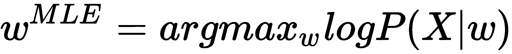

通常，我们通过神经网络中的反向传播获得最佳参数。为了避免过拟合，我们引入了对权重的正则化，即！[](img/9346cd9b-1b59-4039-aa0f-1d75ac2bada1.png)范数。如果你不熟悉正则化，请参考以下 Andrew Ng 的视频：[`openclassroom.stanford.edu/MainFolder/CoursePage.php?course=MachineLearning`](http://openclassroom.stanford.edu/MainFolder/CoursePage.php?course=MachineLearning)。研究表明，！[](img/16aa6075-3e33-4e93-a7f5-6c6beeb2117c.png)归一化相当于对权重！[](img/b2ee0746-0cee-44a6-8dbc-fc6269a8f8f7.png)施加了一个正态先验。在权重上有先验的情况下，MLE 估计问题可以被框架化为 MAP 估计：

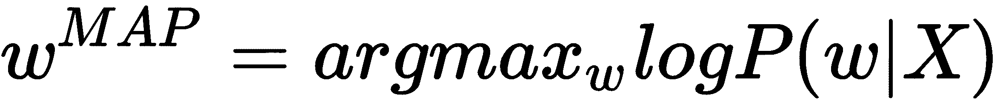

使用贝叶斯定理，前面的方程可以写成如下形式：

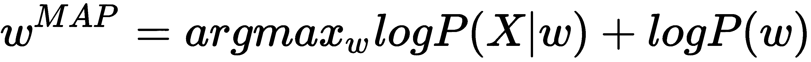

正则化与贝叶斯框架等价的精确证明超出了本章的范围。如果你感兴趣，可以阅读以下 MIT 讲座，了解更多信息：[`www.mit.edu/~9.520/spring09/Classes/class15-bayes.pdf`](http://www.mit.edu/~9.520/spring09/Classes/class15-bayes.pdf)。

从中我们可以观察到，带正则化的传统神经网络可以被框架化为使用贝叶斯定理的推理问题。贝叶斯神经网络的目标是使用蒙特卡洛方法或变分推理技术来确定后验分布。在本章的其余部分，我们将看看如何使用 TensorFlow Probability 构建贝叶斯神经网络。

# 理解 TensorFlow 概率、变分推理和蒙特卡洛方法

**TensorFlow Probability**（在代码中为**tfp** – [`www.tensorflow.org/probability/overview#layer_2_model_building`](https://www.tensorflow.org/probability/overview#layer_2_model_building)）是谷歌最近发布的一个工具，用于以可扩展的方式执行概率推理。它提供了定义分布、构建带权重先验的神经网络以及执行概率推理任务（如蒙特卡洛方法或变分推理）所需的工具和功能。

让我们看一下在构建模型时将会使用的一些函数/工具：

+   **Tfp.distributions.categorical**：这是一个标准的类别分布，其特点是对 K 个类别的概率或对数概率。在这个项目中，我们有来自 43 种不同交通标志的交通标志图像。我们将在本项目中定义一个覆盖 43 个类别的类别分布。

+   **概率层**：构建在 TensorFlow 层实现之上，概率层将它们所表示的函数中的不确定性融入其中。实际上，它们将不确定性融入神经网络的权重中。它们具有通过从权重分布的后验进行采样，前向传播输入的功能（`P(w|X)`）。具体来说，我们将使用 Convolutional2DFlipout 层（[`www.tensorflow.org/probability/api_docs/python/tfp/layers/Convolution2DFlipout`](https://www.tensorflow.org/probability/api_docs/python/tfp/layers/Convolution2DFlipout)），它能够通过从模型权重参数的后验进行采样，计算前向传播。

+   **Kullback-Leibler (KL) 散度**：如果我们想要衡量两个数字之间的差异，只需将它们相减。那么，如果我们想要衡量两个概率分布之间的差异呢？在这种情况下，相减的等价物是什么？在概率和统计的情况下，我们通常会用一个更简单的近似分布来替代观察数据或复杂的分布。KL 散度帮助我们衡量在选择近似时丢失了多少信息。从本质上讲，它是衡量一个概率分布与其他分布之间差异的度量。KL 散度为 0 表示两个分布是相同的。如果你想了解更多关于 KL 散度的数学原理，请参考 MIT 开放课程中的精彩解释，链接为 [`ocw.mit.edu/courses/sloan-school-of-management/15-097-prediction-machine-learning-and-statistics-spring-2012/lecture-notes/MIT15_097S12_lec15.pdf`](https://ocw.mit.edu/courses/sloan-school-of-management/15-097-prediction-machine-learning-and-statistics-spring-2012/lecture-notes/MIT15_097S12_lec15.pdf)。

+   **变分推断**：变分推断是一种机器学习方法，用于通过优化在贝叶斯学习中近似复杂、难以求解的积分。

正如我们所知，我们在贝叶斯学习中的目标是计算后验概率！[](img/13cfd9ef-c6bd-486c-b10f-32f04f36f217.png)，给定先验！[](img/580456b9-ca75-4a74-8ff2-2d7062f886e1.png) 和数据！[](img/f1181935-aeb9-47fc-95b9-606593c46334.png)。计算后验的前提是计算！[](img/eafed642-dc26-40cf-b555-99b5c617f851.png)（数据）的分布，以便获得！[](img/f0ce5197-f81a-4652-95e4-f2a4f361b607.png)，或称为 *证据*。如前所述，X 的分布是难以处理的，因为使用暴力计算方法计算其分布代价过高。为了解决这个问题，我们将使用一种叫做变分推断（VI）的方法。在 VI 中，我们定义一个由！[](img/787fd8b6-1a02-4263-a9b9-4cb5b05afa8f.png) 参数化的分布族！[](img/8f23cfcf-a85c-4cc1-b76c-7261bd3f8d4f.png)。核心思想是优化！[](img/740b2ea1-bf88-4e90-a83a-406a68d690f4.png)，使得近似分布尽可能接近真实的后验分布。我们通过 KL 散度来衡量两个分布之间的差异。事实证明，最小化 KL 散度并不容易。我们可以通过以下数学公式向你展示，这个 KL 散度总是为正，并且它包含两个部分：

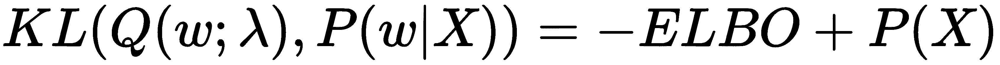

在这里，**ELBO** 是 **证据下界**（[`www.cs.princeton.edu/courses/archive/fall11/cos597C/lectures/variational-inference-i.pdf`](https://www.cs.princeton.edu/courses/archive/fall11/cos597C/lectures/variational-inference-i.pdf)）。

+   **蒙特卡洛方法：**蒙特卡洛方法是一种计算方法，通过反复随机抽样来获取某些现象（行为）的统计特性。它们通常用于模拟不确定性或生成商业场景的假设情况。

假设你每天都乘火车上下班。你在考虑是否改乘公司的班车去办公室。现在，公交车的乘坐过程涉及许多随机变量，如到达时间、交通、上车的乘客数量等等。

我们可以通过计算这些随机变量的平均值并计算到达时间来分析这种假设场景。然而，这种方法太过简单，因为它没有考虑到这些变量的方差。另一种方法是从这些随机变量中进行采样（如果你能够做到的话！），并生成假设场景以预测到达办公室的情况。

为了做出决策，你需要一个可接受的标准。例如，如果你观察到在 80% 的假设场景中你能准时到达办公室，那么你可以继续前进。这种方法也称为蒙特卡洛模拟。

在这个项目中，我们将把神经网络的权重建模为随机变量。为了确定最终的预测，我们将反复从这些权重的分布中进行采样，以获得预测的分布。

请注意，我们省略了一些数学细节。如果有兴趣，可以阅读更多关于变分推理的内容（[`www.cs.princeton.edu/courses/archive/fall11/cos597C/lectures/variational-inference-i.pdf`](https://www.cs.princeton.edu/courses/archive/fall11/cos597C/lectures/variational-inference-i.pdf)）。

# 构建贝叶斯神经网络

对于这个项目，我们将使用德国交通标志数据集（[`benchmark.ini.rub.de/?section=gtsrb&amp;subsection=dataset`](http://benchmark.ini.rub.de/?section=gtsrb&subsection=dataset)）来构建贝叶斯神经网络。训练数据集包含 43 个类别的 26,640 张图像。类似地，测试数据集包含 12,630 张图像。

在执行代码之前，请阅读本书仓库中的`README.md`文件，安装相应的依赖项并了解如何运行代码。

以下是该数据集中存在的一张图像：

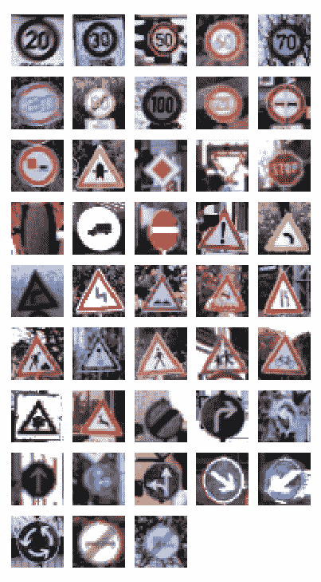

你可以看到数据集中有不同类别的交通标志。

我们首先对数据集进行预处理，使其符合学习算法的要求。通过直方图均衡化来调整图像的统一大小，这种方法用于增强对比度，然后将图像裁剪，专注于图像中的交通标志。此外，我们将图像转换为灰度图像，因为交通标志是通过形状而非颜色来识别的。

对于建模，我们定义了一个标准的 Lenet 模型（[`yann.lecun.com/exdb/lenet/`](http://yann.lecun.com/exdb/lenet/)），它是由 Yann Lecun 开发的。Lenet 是最早设计的卷积神经网络之一。它既小巧易懂，又足够大，能提供有趣的结果。

标准 Lenet 模型具有以下特点：

+   三个卷积层，滤波器大小逐渐增加

+   四个全连接层

+   没有丢弃层

+   每个全连接层或卷积层后使用**线性整流函数**（**ReLU**）

+   每个卷积层后进行最大池化

我们训练该模型以最小化 ELBO 损失的负值，ELBO 损失在本章的*理解 TensorFlow 概率、变分推理和蒙特卡洛方法*一节中进行了定义。具体来说，我们将 ELBO 损失定义为两个项的组合：

+   期望的对数似然或交叉熵，可以通过蒙特卡洛方法估计

+   KL 散度

模型训练完成后，我们将在保留数据集上评估预测。贝叶斯神经网络评估的一个主要区别是，我们无法从训练中获得一组固定的参数（模型的权重）。相反，我们获得所有参数的分布。在评估时，我们需要从每个参数的分布中采样值，以获得测试集的准确性。我们将多次采样模型的参数，以获得预测的置信区间。

最后，我们将在测试数据集中的一些样本图像中展示我们预测的不确定性，并绘制我们获得的权重参数的分布。

# 定义、训练和测试模型

从[`benchmark.ini.rub.de/?section=gtsrb&amp;subsection=dataset`](http://benchmark.ini.rub.de/?section=gtsrb&subsection=dataset)下载训练和测试数据集。下载数据集后，接下来我们来看一下构建项目的步骤：

1.  首先，通过直方图均衡化对数据集中存在的图像进行转换。这一步很重要，因为数据集中的每张图像可能具有不同的光照强度。从以下两张图片中可以看到，同样的交通标志在不同的光照下有很大的差异。直方图均衡化有助于标准化这些差异，使训练数据更加一致：

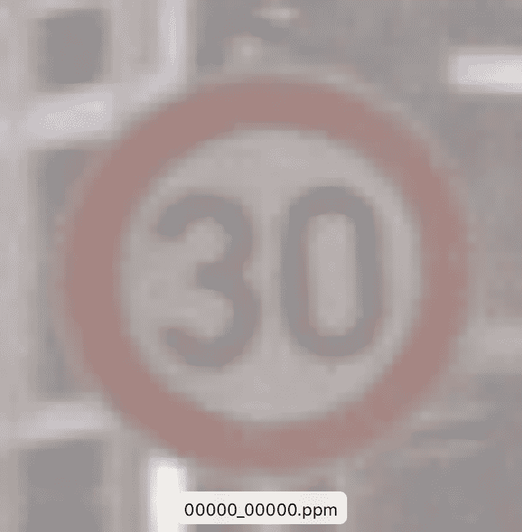


一旦完成均衡化操作，裁剪图像以仅聚焦于标志，并将图像大小调整为 32 x 32，以符合我们的学习算法要求：

请注意，我们使用 32 x 32 作为训练图像的形状，因为它足够大，可以保留图像的细微差别用于检测，同时又足够小，可以更快地训练模型。

```py
def normalize_and_reshape_img(img):
# Histogram normalization in v channel
hsv = color.rgb2hsv(img)
hsv[:, :, 2] = exposure.equalize_hist(hsv[:, :, 2])
img = color.hsv2rgb(hsv)
# Crop of the centre
min_side = min(img.shape[:-1])
centre = img.shape[0] // 2, img.shape[1] // 2
img = img[centre[0] - min_side // 2:centre[0] + min_side // 2,
centre[1] - min_side // 2:centre[1] + min_side // 2,
:]
# Rescale to the desired size
img = transform.resize(img, (IMG_SIZE, IMG_SIZE))
return
 img
```

1.  创建包含标签和图像信息的字典，并将其存储为 pickle 文件，这样我们就不必每次运行模型时都重新执行预处理代码。这意味着我们实际上是在预处理已转换的数据，以创建训练和测试数据集：

```py
def preprocess_and_save_data(data_type ='train'):
'''
Preprocesses image data and saves the image features and labels as pickle files to be used for the model
:param data_type: data_type is 'train' or 'test'
:return: None
'''
if data_type =='train':
root_dir = os.path.join(DATA_DIR, 'GTSRB/Final_Training/Images/')
imgs = []
labels = []
all_img_paths = glob.glob(os.path.join(root_dir, '*/*.ppm'))
np.random.shuffle(all_img_paths)
for img_path in all_img_paths:
img = normalize_and_reshape_img(io.imread(img_path))
label = get_class(img_path)
imgs.append(img)
labels.append(label)
X_train = np.array(imgs, dtype='float32')
# Make one hot targets
Y_train = np.array(labels, dtype = 'uint8')
train_data = {"features": X_train, "labels": Y_train}
if not os.path.exists(os.path.join(DATA_DIR,"Preprocessed_Data")):
os.makedirs(os.path.join(DATA_DIR,"Preprocessed_Data"))
pickle.dump(train_data,open(os.path.join(DATA_DIR,"Preprocessed_Data","preprocessed_train.p"),"wb"))
return train_data
elif data_type == 'test':
# Reading the test file
test = pd.read_csv(os.path.join(DATA_DIR, "GTSRB", 'GT-final_test.csv'), sep=';')
X_test = []
y_test = []
i = 0
for file_name, class_id in zip(list(test['Filename']), list(test['ClassId'])):
img_path = os.path.join(DATA_DIR, 'GTSRB/Final_Test/Images/', file_name)
X_test.append(normalize_and_reshape_img(io.imread(img_path)))
y_test.append(class_id)
test_data = {"features": np.array(X_test,dtype ='float32'), "labels": np.array(y_test,dtype = 'uint8')}
if not os.path.exists(os.path.join(DATA_DIR,"Preprocessed_Data")):
os.makedirs(os.path.join(DATA_DIR,"Preprocessed_Data"))
pickle.dump(test_data,open(os.path.join(DATA_DIR,"Preprocessed_Data","preprocessed_test.p"),"wb"))
return test_data
```

在本项目中，我们将使用灰度图像，因为我们整个项目的任务是将交通标志图像分类为 43 个类别之一，并提供分类的不确定性度量。我们不关心图像的颜色。

1.  使用 Keras 中的 LeNet 架构定义模型。最后，我们将 LeNet 模型输出的 43 维向量分配给 TensorFlow 概率中的分类分布函数（`tfd.categorical`）。这将帮助我们在后续生成预测的不确定性：

```py
with tf.name_scope("BNN", values=[images]):
model = tf.keras.Sequential([
tfp.layers.Convolution2DFlipout(10,
kernel_size=5,
padding="VALID",
activation=tf.nn.relu),
tf.keras.layers.MaxPooling2D(pool_size=[3, 3],
strides=[1, 1],
padding="VALID"),
tfp.layers.Convolution2DFlipout(15,
kernel_size=3,
padding="VALID",
activation=tf.nn.relu),
tf.keras.layers.MaxPooling2D(pool_size=[2, 2],
strides=[2, 2],
padding="VALID"),
tfp.layers.Convolution2DFlipout(30,
kernel_size=3,
padding="VALID",
activation=tf.nn.relu),
tf.keras.layers.MaxPooling2D(pool_size=[2, 2],
strides=[2, 2],
padding="VALID"),
tf.keras.layers.Flatten(),
tfp.layers.DenseFlipout(400, activation=tf.nn.relu),
tfp.layers.DenseFlipout(120, activation = tf.nn.relu),
tfp.layers.DenseFlipout(84, activation=tf.nn.relu),
tfp.layers.DenseFlipout(43) ])
logits = model(images)
targets_distribution = tfd.Categorical(logits=logits)
```

1.  我们定义损失以最小化 KL 散度直至 ELBO。计算本章《理解 TensorFlow 概率、变分推理和蒙特卡洛方法》部分中定义的 ELBO 损失。如您所见，我们使用`model.losses`属性来计算 KL 散度。这是因为 TensorFlow Keras Layer 的`losses`属性表示诸如正则化惩罚之类的副作用计算。与特定 TensorFlow 变量上的正则化惩罚不同，`losses`在这里表示 KL 散度的计算：

```py
# Compute the -ELBO as the loss, averaged over the batch size.
neg_log_likelihood = -
  tf.reduce_mean(targets_distribution.log_prob(targets))
kl = sum(model.losses) / X_train.shape[0]
   elbo_loss = neg_log_likelihood + kl
```

1.  使用 Adam 优化器，如第三章《使用 TensorFlow.js 在浏览器中进行情感分析》中所定义的，来优化 ELBO 损失：

```py
with tf.name_scope("train"):
optimizer = tf.train.AdamOptimizer(learning_rate=LEARNING_RATE)
train_op = optimizer.minimize(elbo_loss)
```

请注意，我们使用 Adam 优化器，因为它通常在默认参数下比其他优化器表现更好。

1.  使用以下参数训练模型：

    +   训练轮次 = 1,000

    +   批次大小 = 128

    +   学习率 = 0.001：

```py
with tf.Session() as sess:
sess.run(init_op)
# Run the training loop.
train_handle = sess.run(train_iterator.string_handle())
test_handle = sess.run(test_iterator.string_handle())
for step in range(EPOCHS):
_ = sess.run([train_op, accuracy_update_op],
feed_dict={iter_handle: train_handle})
if step % 5== 0:
loss_value, accuracy_value = sess.run(
     [elbo_loss, accuracy], feed_dict={iter_handle: train_handle})
print("Epoch: {:>3d} Loss: {:.3f} Accuracy: {:.3f}".format(
step, loss_value, accuracy_value))
```

1.  一旦模型训练完成，贝叶斯神经网络中的每个权重将具有分布而不是固定值。对每个权重进行多次采样（代码中为 50 次），并为每个样本获得不同的预测。尽管采样有用，但代价高昂。因此，我们应该仅在需要对预测结果的不确定性进行某种衡量时，才使用贝叶斯神经网络。以下是蒙特卡洛采样的代码：

```py
#Sampling from the posterior and obtaining mean probability for held out dataset
probs = np.asarray([sess.run((targets_distribution.probs),
        feed_dict={iter_handle: test_handle})
for _ in range(NUM_MONTE_CARLO)])
```

1.  一旦获得样本，计算每个测试数据集图像的平均概率，并像通常的机器学习分类器一样计算平均准确度。

    我们为这个数据集获得的平均准确度约为 ~ 89%（在 1,000 个训练轮次后）。您可以进一步调整参数或创建更深的模型来获得更好的准确度。

    下面是获取平均准确度的代码：

```py
mean_probs = np.mean(probs, axis=0)
# Get the average accuracy
Y_pred = np.argmax(mean_probs, axis=1)
print("Overall Accuracy in predicting the test data = percent", round((Y_pred == y_test).mean() * 100,2))
```

1.  下一步是计算每个测试图像的每个蒙特卡洛样本的准确度分布。为此，计算预测类别并与测试标签进行比较。预测类别可以通过将标签分配给具有最大概率的类别来获得，这基于给定网络参数的样本。这样，您可以获得准确度范围，并且还可以将这些准确度绘制在直方图上。以下是获取准确度并生成直方图的代码：

```py
test_acc_dist = []
for prob in probs:
y_test_pred = np.argmax(prob, axis=1).astype(np.float32)
accuracy = (y_test_pred == y_test).mean() * 100
test_acc_dist.append(accuracy)
plt.hist(test_acc_dist)
plt.title("Histogram of prediction accuracies on test dataset")
plt.xlabel("Accuracy")
plt.ylabel("Frequency")
save_dir = os.path.join(DATA_DIR, "..", "Plots")
plt.savefig(os.path.join(save_dir, "Test_Dataset_Prediction_Accuracy.png"))
```

生成的直方图将类似于以下内容：

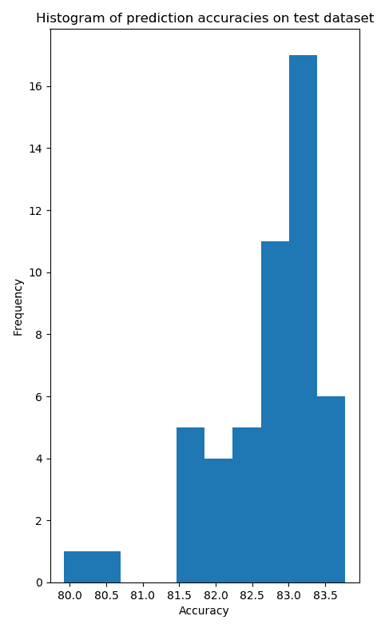

如您所见，我们有一个准确度的分布。这个分布可以帮助我们获得模型在测试数据集上的置信区间。

请注意，当您运行代码时，图形可能会有所不同，因为它是通过随机采样获得的。

1.  从测试数据集中选取一些图像，并查看它们在蒙特卡洛方法中的不同样本预测。使用以下函数`plot_heldout_prediction`来生成来自不同样本的预测直方图：

```py
def plot_heldout_prediction(input_vals, probs , fname, title=""):
save_dir = os.path.join(DATA_DIR, "..", "Plots")
fig = figure.Figure(figsize=(1, 1))
canvas = backend_agg.FigureCanvasAgg(fig)
ax = fig.add_subplot(1,1,1)
ax.imshow(input_vals.reshape((IMG_SIZE,IMG_SIZE)), interpolation="None")
canvas.print_figure(os.path.join(save_dir, fname + "_image.png"), format="png")
fig = figure.Figure(figsize=(10, 5))
canvas = backend_agg.FigureCanvasAgg(fig)
ax = fig.add_subplot(1,1,1)
#Predictions
y_pred_list = list(np.argmax(probs,axis=1).astype(np.int32))
bin_range = [x for x in range(43)]
ax.hist(y_pred_list,bins = bin_range)
ax.set_xticks(bin_range)
ax.set_title("Histogram of predicted class: " + title)
ax.set_xlabel("Class")
ax.set_ylabel("Frequency")
fig.tight_layout()
save_dir = os.path.join(DATA_DIR, "..", "Plots")
canvas.print_figure(os.path.join(save_dir, fname + "_predicted_class.png"), format="png")
print("saved {}".format(fname))
```

让我们看看一些图像及其预测结果：

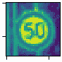

对于前面的图像，所有的预测都属于正确的类别 02，如下图所示：

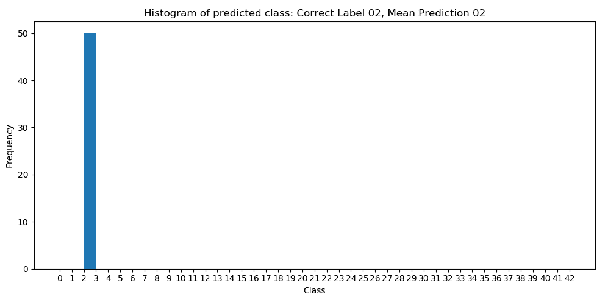

在以下两个案例中，尽管我们的平均预测是正确的，但在蒙特卡罗中，一些样本预测了错误的类别。你可以想象，在这样的情况下量化不确定性如何帮助自动驾驶汽车做出更好的道路决策。

**案例 1：**

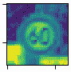

在前面的图像中，一些蒙特卡罗的预测属于错误的类别，如下图所示：

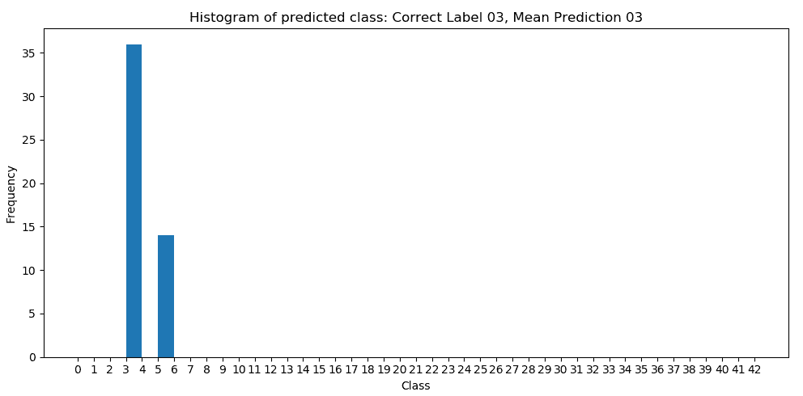

**案例 2：**

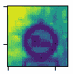

在前面的图像中，一些蒙特卡罗的预测属于错误的类别，如下图所示：

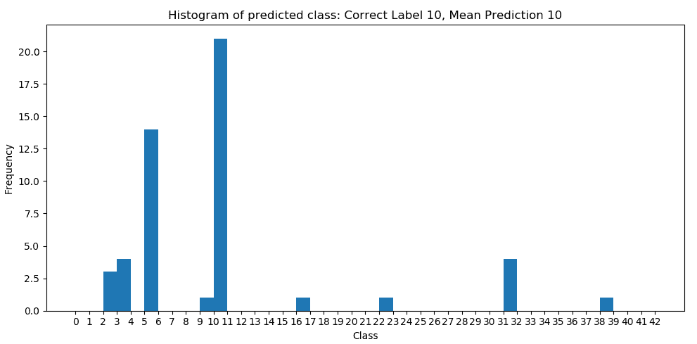

**案例 3：**

在以下情况下，平均预测是错误的，但一些样本是正确预测的：

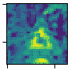

对于前面的图像，我们得到了以下的直方图：

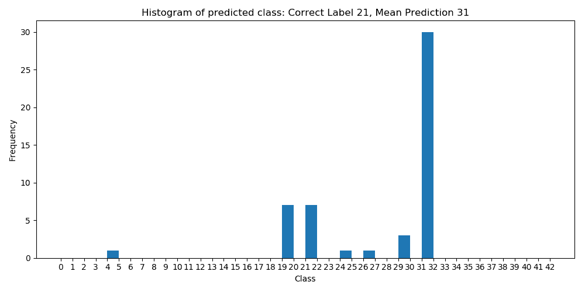

**案例 4：**

显然，我们会遇到一些情况下预测不准确的样本：

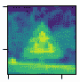

对于此图像，我们得到了以下的直方图：

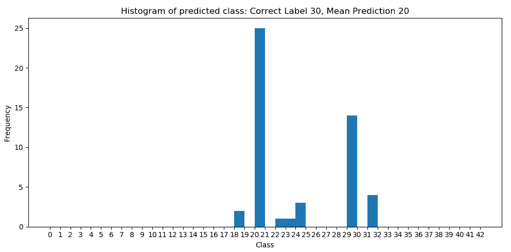

1.  最后，直观地显示网络中权重的后验分布。在以下图表中，我们展示了网络中不同权重的后验均值和标准差：

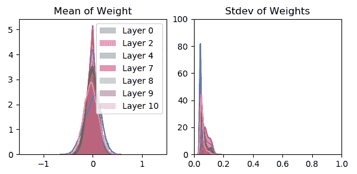

对权重进行分布建模使我们能够为相同的图像开发预测，这在为预测构建置信区间时极为有用。

# 总结

正如我们所知道的，神经网络非常适合点预测，但无法帮助我们识别预测中的不确定性。另一方面，贝叶斯学习非常适合量化不确定性，但在多维度问题或大规模非结构化数据集（如图像）中扩展性较差。

在本章中，我们研究了如何通过贝叶斯神经网络将神经网络与贝叶斯学习结合起来。

我们使用了德国交通标志数据集，利用 Google 最近发布的工具 TensorFlow 概率，开发了一个贝叶斯神经网络分类器。TF 概率提供了高层次的 API 和函数来执行贝叶斯建模和推理。

我们在数据集上训练了 Lenet 模型。最后，我们使用蒙特卡罗方法从网络参数的后验分布中进行采样，以获得每个测试数据集样本的预测值，从而量化不确定性。

然而，我们仅仅触及了贝叶斯神经网络复杂性的表面。如果我们想要开发安全的人工智能，那么理解我们预测中的不确定性至关重要。

在下一章，我们将学习一个在机器学习中新的概念——自编码器。我们将探讨如何利用它们来检测信用卡欺诈。

# 问题

1.  什么是 TensorFlow 概率？

1.  变分推断是什么，为什么它很重要？

1.  什么是 KL 散度？

1.  神经网络的权重上的先验和后验是什么意思？
