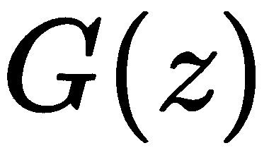

# 第九章：使用 DiscoGAN 从鞋图像生成匹配的鞋包

人类在理解不同领域之间的关系方面相当聪明。例如，我们可以轻松理解西班牙语句子及其英文翻译之间的关系。我们甚至能猜出穿什么颜色的领带来搭配某种西装。虽然这对人类来说似乎很简单，但对机器来说却不是一个直接的过程。

跨领域的风格迁移任务可以被框定为一个条件图像生成问题。给定一个来自某个领域的图像，我们能否学会将其映射到来自另一个领域的图像？

尽管有许多方法尝试使用来自两个不同领域的成对标注数据来实现这一目标，但这些方法充满了问题。这些方法的主要问题在于获取成对标注数据，这既是一个昂贵又耗时的过程。

在本章中，我们将学习一种无需明确提供成对标注数据给算法的风格迁移方法。这种方法被称为 DiscoGAN，最近由 Kim 等人在论文《*利用生成对抗网络学习发现跨域关系*》中提出 ([`arxiv.org/pdf/1703.05192.pdf`](https://arxiv.org/pdf/1703.05192.pdf))。具体来说，我们将尝试从鞋包图像中生成匹配的鞋子。

本章的剩余部分组织结构如下：

+   **生成对抗网络（GANs）** 介绍

+   什么是 DiscoGAN？

+   如何从鞋包图像生成匹配的鞋子，反之亦然

# 理解生成模型

一种无监督学习模型，它学习训练集的基础数据分布并生成可能具有或不具有变化的新数据，通常被称为**生成模型**。知道真实的基础分布可能并不总是可行，因此神经网络会训练一个尽可能接近真实分布的函数。

训练生成模型最常用的方法如下：

+   **变分自编码器（VAE）：** 一个高维输入图像通过自编码器编码，创建一个低维的表示。在这个过程中，最重要的是保持数据的基础分布。这个编码器只能通过解码器来映射输入图像，不能引入任何变异来生成相似的图像。VAE 通过生成受约束的潜在向量来引入变异，这些向量仍然遵循基础分布。尽管 VAE 有助于创建概率图模型，但生成的图像往往会略显模糊。

+   **PixelRNN/PixelCNN：**这些自回归模型用于训练能够建模条件分布的网络，给定从左上角开始的前几个像素，预测下一个像素。RNNs 可以在图像中横向和纵向移动。PixelRNN 的训练过程稳定且简单，相较于其他模型，它具有更好的对数似然值，但训练时间较长且效率较低。

+   **生成对抗网络：**生成对抗网络最早由 *Goodfellow 等人* 在 2014 年的论文中提出 ([`arxiv.org/abs/1406.2661`](https://arxiv.org/abs/1406.2661))。它们可以被看作是一个竞争框架，包含两个对立的部分：生成器和判别器。这两个部分实际上是两个可微分的神经网络函数。生成器接受一个随机生成的输入，称为潜在样本，并生成一张图像。生成器的整体目标是生成一张尽可能接近真实输入图像（如 MNIST 数字）的图像，并将其作为输入提供给判别器。

判别器本质上是一个分类器，经过训练后用于区分真实图像（原始的 MNIST 数字）和伪造图像（生成器的输出）。理想情况下，经过训练后，生成器应当调整其参数，捕捉潜在的训练数据分布，并让判别器误认为输入是一个真实图像。

让我们考虑一个来自现实世界的类比。想象 GAN 的工作方式就像伪造者制造伪钞和警察识别并销毁这些伪钞之间的关系。伪造者的目的是试图将伪钞当作真钱在市场上流通。这就类似于生成器的工作。警察会检查每一张钞票，接受真实的钞票，销毁伪钞。警察了解真实钞票的特征，并将其与待检验钞票的属性进行比较，以判断其真伪。如果匹配，钞票会被保留，否则就会被销毁。这与判别器的工作原理类似。

# 训练 GAN

下图展示了 GAN 的基本架构：


使用随机输入来生成数据样本。例如，生成器 *G(z)* 使用先验分布 *p(z)* 来生成输入 *z*，然后使用 *z* 生成一些数据。这个输出作为输入被传递到判别器神经网络 *D(x)*。它从  中获取输入 *x*，其中  是我们的真实数据分布。然后，*D(x)* 使用 `sigmoid` 函数解决一个二分类问题，输出结果在 0 到 1 之间。

GANs 的训练是生成器和判别器之间的竞争过程。目标函数可以通过以下数学形式表示：


在此，以下适用：

+    表示判别器的参数

+    表示生成器的参数

+    表示训练数据的基础分布

+    表示判别器对输入图像 *x* 的操作

+    表示生成器在潜在样本 *z* 上的操作

+    表示生成的假数据的判别器输出 

在目标函数中，左边的第一个项表示判别器输出来自真实分布的交叉熵（）。左边的第二个项是随机分布（）与判别器对生成器输出的预测（该输出是使用来自  的随机样本 z 生成的）的交叉熵。判别器试图最大化这两个项，分别将图像分类为真实和假的。另一方面，生成器则试图通过最小化此目标来欺骗判别器。

为了训练 GAN，使用基于梯度的优化算法，例如随机梯度下降。算法流程如下：

1.  首先，采样 *m* 个噪声样本和 *m* 个真实数据样本。

1.  冻结生成器，即将训练设置为 false，以便生成器网络仅进行前向传播而不进行反向传播。然后对这些数据训练判别器。

1.  对不同的 *m* 噪声样本进行采样。

1.  冻结判别器，并在这些数据上训练生成器。

1.  重复执行前述步骤。

正式来说，伪代码如下所示。

在这个示例中，我们正在对生成对抗网络进行小批量随机梯度下降训练。应用于判别器的步数 *k* 是一个超参数。我们在实验中使用了 *k=1*，这是最不昂贵的选项：


GAN 训练的伪代码。对于 k=1，这等价于依次训练 D 和 G。改编自 Goodfellow 等人，2014 年

基于梯度的更新可以使用任何标准的梯度学习规则。我们在实验中使用了动量。

# 应用

GANs 的一些应用包括将单色或黑白图像转换为彩色图像、在图像中填充附加细节，如将物体插入到部分图像或仅包含边缘的图像中，以及构建一个人的老年形象，基于其当前的图像。

# 挑战

尽管 GANs 能够从给定的输入数据生成非常清晰的图像，但由于训练动态的不稳定，其优化是很难实现的。它们还面临其他挑战，如模式崩溃和初始化问题。模式崩溃是指当数据是多模态时，生成器从未被激励去覆盖所有模式，导致生成样本的变化性较低，从而降低了 GANs 的实用性。如果所有生成的样本开始变得相同，就会导致完全崩溃。在大多数样本表现出一些共性时，模型会出现部分崩溃。在这一过程中，GANs 通过一个旨在实现最小最大优化的目标函数进行工作，但如果初始参数无效，就会变成一个无真正优化的振荡过程。此外，还有像 GANs 无法区分在某个位置应该出现的特定物体数量等问题。例如，GANs 无法理解不能有超过两个眼睛，并且可能生成带有三个眼睛的人脸图像。还有 GANs 无法适应三维视角的问题，比如前视图和后视图。这会导致产生平面 2D 图像，而不是三维物体的深度效果。

不同的 GAN 变体随着时间的推移不断发展。以下是其中的一些：

+   **深度卷积生成对抗网络** (**DCGANs**) 是 GAN 架构的一次重要改进。它由卷积层组成，避免了最大池化或全连接层的使用。该架构主要使用卷积步幅和反卷积来进行下采样和上采样。它还在生成器中使用 ReLU 激活函数，在判别器中使用 LeakyReLU。

+   **InfoGANs** 是另一种 GAN 变体，它尝试将图像的有意义特征（例如旋转）编码到噪声向量 z 的部分中。

+   **条件生成对抗网络** (**cGANs**) 使用额外的条件信息，描述数据的某些方面，作为输入提供给生成器和判别器。例如，如果我们处理的是车辆，条件信息可能描述四轮或两轮等属性。这有助于生成更好的样本和附加特征。在本章中，我们将主要关注 DiscoGAN，它将在接下来的部分中进行描述。

# 了解 DiscoGANs

在本节中，我们将重点深入了解 Discovery GANs，它们通常被称为**DiscoGANs**。

在深入研究之前，让我们先尝试理解机器学习中的重构损失，因为这是本章主要依赖的概念之一。当我们学习无结构数据类型（如图像/文本）的表示时，我们希望模型以一种方式对数据进行编码，使得当它被解码时，可以恢复出底层的图像/文本。为了在模型中显式地加入这个条件，我们在训练模型时使用重构损失（本质上是重构图像与原始图像之间的欧几里得距离）。

风格迁移一直是 GAN 最显著的应用之一。风格迁移基本上是指在给定一个领域中的图片/数据的情况下，是否可以成功生成另一个领域中的图片/数据。这个问题在许多研究人员中变得非常著名。

你可以从 Jing 等人的论文《神经风格迁移：综述》（[`arxiv.org/abs/1705.04058`](https://arxiv.org/abs/1705.04058)）中了解更多关于风格迁移问题的内容。然而，大多数工作都是通过使用一个由人工或其他算法生成的显式配对数据集来完成的。这给这些方法带来了限制，因为配对数据很少能够获得，而且生成配对数据的成本太高。

另一方面，DiscoGAN 提出了一种学习跨领域关系的方法，无需显式的配对数据集。该方法从一个领域中获取一张图片，并生成另一个领域中的对应图片。假设我们正尝试将 Domain A 中的图片迁移到 Domain B。在学习过程中，我们通过重构损失强制生成的图像成为 Domain A 图像的图像表示，并通过 GAN 损失使其尽可能接近 Domain B 中的图像，如前所述。本质上，这种方法倾向于在两个领域之间生成一个双射（一对一）映射，而不是多对一或一对多的映射。

# DiscoGAN 的基本单元

如前所述，普通的 GAN 包含生成器和判别器。我们来尝试理解 DiscoGAN 的构建块，然后再继续理解如何将它们结合起来，从而学习跨领域关系。具体包括以下内容：

+   **生成器：** 在原始 GAN 中，生成器会从一个输入向量*z*（例如，随机从高斯分布中采样）生成伪造的图像。然而，在这种情况下，由于我们希望将图像从一个领域转移到另一个领域，我们将输入向量*z*替换为一张图片。以下是生成器函数的参数：

| **参数** | **值** |
| --- | --- |
| 输入图片尺寸 | 64x64x3 |
| 输出图片尺寸 | 64x64x3 |
| # 卷积层 | 4 |
| # 卷积转置/反卷积层 | 4 |
| 归一化函数 | 批量归一化 |
| 激活函数 | LeakyReLU |

在指定每个特定层的结构之前，让我们先尝试理解一下在参数中提到的几个术语。

+   **转置卷积：**正如我们之前提到的，生成器用于从输入向量生成图像。在我们的案例中，输入图像首先通过 4 层卷积层进行卷积，生成一个嵌入。通过上采样将低分辨率图像转换为高分辨率图像，从嵌入中生成图像。

常见的上采样方法包括手动特征工程，通过插值来处理低维度图像。一种更好的方法是采用转置卷积，也称为**分数步幅卷积**/**反卷积**。它不使用任何预定义的插值方法。假设我们有一个 4x4 矩阵，它与一个 3x3 的滤波器进行卷积（步幅为 1，且不做填充）；这将得到一个 2x2 的矩阵。如你所见，我们将原始图像从 4x4 降采样到 2x2。从 2x2 恢复到 4x4 的过程可以通过转置卷积实现。

从实现角度来看，TensorFlow 中用于定义卷积层的内置函数可以直接与`num_outputs`值一起使用，`num_outputs`可以进行更改以执行上采样。

+   **批量归一化：** 这种方法用于对抗深度神经网络中发生的内部协方差偏移。

协方差偏移可以定义为当模型能够预测输入分布变化时。例如，假设我们训练一个模型来检测黑白狗的图像。在推理阶段，如果我们向模型提供彩色狗的图像，模型的表现将不佳。这是因为模型根据黑白图像学习了参数，而这些参数不适用于预测彩色图像。

深度神经网络会经历所谓的内部协方差偏移，因为内部层参数的变化会改变下一层输入的分布。为了解决这个问题，我们通过使用每个批次的均值和方差来规范化输出，并将均值和方差的加权组合传递给下一层。由于加权组合，批量归一化在每一层的神经网络中添加了两个额外的参数。

批量归一化有助于加速训练，并因其正则化效果而倾向于减少过拟合。

在这个模型中，我们在所有卷积层和卷积转置层中使用批量归一化，除了第一层和最后一层。

+   **Leaky ReLU: ** **ReLU**（或称**修正线性单元**）在深度学习领域作为激活函数非常流行。深度神经网络中的 ReLU 单元有时会变得脆弱，因为它们可能导致神经元死亡或在任何数据点上都无法再次激活。下图展示了 ReLU 函数：


使用 Leaky ReLU 来尝试解决这个问题。对于负输入值，它们具有小的负值，而不是零。这避免了神经元死掉的问题。以下图示展示了一个 Leaky ReLU 函数的示例：


+   **判别器：** 在我们之前描述的 GAN 中，生成器从一个随机采样的输入向量（比如高斯分布）生成假图像。然而，在这里，由于我们希望将图像从一个领域转移到另一个领域，我们将输入向量替换为一张图像。

从架构角度来看，判别器的参数如下：

+   +   **层：** 判别器由 5 个卷积层组成，每个卷积层堆叠在一起，然后是两个全连接层。

    +   **激活函数：** 所有层使用 Leaky ReLU 激活，除了最后一层全连接层。最后一层使用`sigmoid`来预测样本的概率。

    +   **归一化器：** 该操作执行批量归一化，但不包括网络的第一层和最后一层。

    +   **步幅：** 所有卷积层的步幅长度为 2。

# DiscoGAN 建模

对于每个映射，也就是**手袋**（用**b**表示）到**鞋子**（用**s**表示），或者反过来，我们加入两个生成器。假设，对于映射**b**到**s**，第一个生成器将输入图像从**b**领域映射到**s**领域，而第二个生成器将图像从**s**领域重建到**b**领域。直观上，我们需要第二个生成器来实现我们在前面章节中提到的一一映射目标。数学上，可以表示如下：


在建模时，由于这是一个非常难以满足的约束，我们加入了重建损失。重建损失如下所示：


现在，生成假图像的常见 GAN 损失如下所示：


对于每个映射，生成器接收两个损失：

+   重建损失，旨在查看我们如何能够将生成的图像映射到其原始领域

+   通常的 GAN 损失用于欺骗判别器的任务

在这种情况下，判别器是常见的判别器，使用我们在*训练 GAN*部分提到的损失。我们用 表示它。

生成器和判别器的总损失如下所示：


# 构建一个 DiscoGAN 模型

本问题中的基本数据集来自`edges2handbags`([`people.eecs.berkeley.edu/~tinghuiz/projects/pix2pix/datasets/edges2handbags.tar.gz`](https://people.eecs.berkeley.edu/~tinghuiz/projects/pix2pix/datasets/edges2handbags.tar.gz))和`edges2shoes`([`people.eecs.berkeley.edu/~tinghuiz/projects/pix2pix/datasets/edges2shoes.tar.gz`](https://people.eecs.berkeley.edu/~tinghuiz/projects/pix2pix/datasets/edges2shoes.tar.gz))数据集。这些数据集中的每张图像都包含两个子图像。一个是物体的彩色图像，另一个是对应彩色图像的边缘图像。

按照以下步骤构建 DiscoGAN 模型：

1.  首先，调整和裁剪此数据集中的图像，以获取手袋和鞋子图像：

```py
def extract_files(*data_dir*,*type* = 'bags'):
   '''
 :param data_dir: Input directory
 :param type: bags or shoes
   :return: saves the cropped files to the bags to shoes directory
   '''

   input_file_dir = os.path.join(os.getcwd(),*data_dir*, "train")
   result_dir = os.path.join(os.getcwd(),*type*)
   *if not* os.path.exists(result_dir):
       os.makedirs(result_dir)

   file_names= os.listdir(input_file_dir)
   *for* file *in* file_names:
       input_image = Image.open(os.path.join(input_file_dir,file))
       input_image = input_image.resize([128, 64])
       input_image = input_image.crop([64, 0, 128, 64])  # Cropping only the colored image. Excluding the edge image
       input_image.save(os.path.join(result_dir,file))
```

1.  将图像保存在`bags`和`shoes`的相应文件夹中。一些示例图像如下所示：

|  |  |  |  |
| --- | --- | --- | --- |
| 鞋子 |  | 包包 |  |

1.  实现`generator`函数，包含 4 个卷积层，后跟 4 个卷积转置（或反卷积）层。该场景中使用的卷积核大小为 4，而卷积层和反卷积层的`stride`分别为`2`和`1`。所有层的激活函数均使用 Leaky Relu。该函数的代码如下：

```py
def generator(x, initializer, s*cope_name* = 'generator',*reuse*=*False*):
   *with* tf.variable_scope(*scope_name*) *as* scope:
       *if* *reuse*:
           scope.reuse_variables()
       conv1 = tf.contrib.layers.conv2d(inputs=*x*, num_outputs=32, kernel_size=4, stride=2, padding="SAME",reuse=*reuse*, activation_fn=tf.nn.leaky_relu, weights_initializer=*initializer*,
                                        scope="disc_conv1")  # 32 x 32 x 32
       conv2 = tf.contrib.layers.conv2d(inputs=conv1, num_outputs=64, kernel_size=4, stride=2, padding="SAME",
                                        reuse=*reuse*, activation_fn=tf.nn.leaky_relu, normalizer_fn=tf.contrib.layers.batch_norm,
                                        weights_initializer=*initializer*, scope="disc_conv2")  # 16 x 16 x 64
       conv3 = tf.contrib.layers.conv2d(inputs=conv2, num_outputs=128, kernel_size=4, stride=2, padding="SAME",
                                        reuse=*reuse*, activation_fn=tf.nn.leaky_relu, normalizer_fn=tf.contrib.layers.batch_norm,
                                        weights_initializer=*initializer*, scope="disc_conv3")  # 8 x 8 x 128
       conv4 = tf.contrib.layers.conv2d(inputs=conv3, num_outputs=256, kernel_size=4, stride=2, padding="SAME",
                                        reuse=*reuse*, activation_fn=tf.nn.leaky_relu, normalizer_fn=tf.contrib.layers.batch_norm,
                                        weights_initializer=*initializer*, scope="disc_conv4")  # 4 x 4 x 256

       deconv1 = tf.contrib.layers.conv2d(conv4, num_outputs=4 * 128, kernel_size=4, stride=1, padding="SAME",
                                              activation_fn=tf.nn.relu, normalizer_fn=tf.contrib.layers.batch_norm,
                                              weights_initializer=*initializer*, scope="gen_conv1")
       deconv1 = tf.reshape(deconv1, shape=[tf.shape(*x*)[0], 8, 8, 128])

       deconv2 = tf.contrib.layers.conv2d(deconv1, num_outputs=4 * 64, kernel_size=4, stride=1, padding="SAME",
                                              activation_fn=tf.nn.relu, normalizer_fn=tf.contrib.layers.batch_norm,
                                              weights_initializer=*initializer*, scope="gen_conv2")
       deconv2 = tf.reshape(deconv2, shape=[tf.shape(*x*)[0], 16, 16, 64])

       deconv3 = tf.contrib.layers.conv2d(deconv2, num_outputs=4 * 32, kernel_size=4, stride=1, padding="SAME",
                                              activation_fn=tf.nn.relu, normalizer_fn=tf.contrib.layers.batch_norm,
                                              weights_initializer=*initializer*, scope="gen_conv3")
       deconv3 = tf.reshape(deconv3, shape=[tf.shape(*x*)[0], 32, 32, 32])

       deconv4 = tf.contrib.layers.conv2d(deconv3, num_outputs=4 * 16, kernel_size=4, stride=1, padding="SAME",
                                              activation_fn=tf.nn.relu, normalizer_fn=tf.contrib.layers.batch_norm,
                                              weights_initializer=*initializer*, scope="gen_conv4")
       deconv4 = tf.reshape(deconv4, shape=[tf.shape(*x*)[0], 64, 64, 16])

       recon = tf.contrib.layers.conv2d(deconv4, num_outputs=3, kernel_size=4, stride=1, padding="SAME", \
                                            activation_fn=tf.nn.relu, scope="gen_conv5")

       return recon

```

1.  使用我们在*DiscoGAN 的基本单元*部分之前提到的参数定义判别器：

```py
def discriminator(*x*,*initializer*, *scope_name* ='discriminator',  *reuse*=*False*):
   *with* tf.variable_scope(*scope_name*) *as* scope:
       *if* *reuse*:
           scope.reuse_variables()
       conv1 = tf.contrib.layers.conv2d(inputs=*x*, num_outputs=32, kernel_size=4, stride=2, padding="SAME",
                                        reuse=*reuse*, activation_fn=tf.nn.leaky_relu, weights_initializer=*initializer*,
                                        scope="disc_conv1")  # 32 x 32 x 32
       conv2 = tf.contrib.layers.conv2d(inputs=conv1, num_outputs=64, kernel_size=4, stride=2, padding="SAME",
                                        reuse=*reuse*, activation_fn=tf.nn.leaky_relu, normalizer_fn=tf.contrib.layers.batch_norm,
                                        weights_initializer=*initializer*, scope="disc_conv2")  # 16 x 16 x 64
       conv3 = tf.contrib.layers.conv2d(inputs=conv2, num_outputs=128, kernel_size=4, stride=2, padding="SAME",
                                        reuse=*reuse*, activation_fn=tf.nn.leaky_relu, normalizer_fn=tf.contrib.layers.batch_norm,
                                        weights_initializer=*initializer*, scope="disc_conv3")  # 8 x 8 x 128
       conv4 = tf.contrib.layers.conv2d(inputs=conv3, num_outputs=256, kernel_size=4, stride=2, padding="SAME",
                                        reuse=*reuse*, activation_fn=tf.nn.leaky_relu, normalizer_fn=tf.contrib.layers.batch_norm,
                                        weights_initializer=*initializer*, scope="disc_conv4")  # 4 x 4 x 256
       conv5 = tf.contrib.layers.conv2d(inputs=conv4, num_outputs=512, kernel_size=4, stride=2, padding="SAME",
                                        reuse=*reuse*, activation_fn=tf.nn.leaky_relu, normalizer_fn=tf.contrib.layers.batch_norm,
                                        weights_initializer=*initializer*, scope="disc_conv5")  # 2 x 2 x 512
       fc1 = tf.reshape(conv5, shape=[tf.shape(*x*)[0], 2 * 2 * 512])
       fc1 = tf.contrib.layers.fully_connected(inputs=fc1, num_outputs=512, reuse=*reuse*, activation_fn=tf.nn.leaky_relu,
                                               normalizer_fn=tf.contrib.layers.batch_norm,
                                               weights_initializer=*initializer*, scope="disc_fc1")
       fc2 = tf.contrib.layers.fully_connected(inputs=fc1, num_outputs=1, reuse=*reuse*, activation_fn=tf.nn.sigmoid,
                                               weights_initializer=*initializer*, scope="disc_fc2")
       return fc2
```

1.  使用以下`define_network`函数，该函数为每个领域定义了两个生成器和两个判别器。在该函数中，`generator`和`discriminator`的定义与我们在前一步使用函数时定义的一样。然而，对于 DiscoGAN，函数定义了一个`generator`，它生成另一个领域的假图像，一个`generator`负责重建。另外，`discriminators`为每个领域中的真实图像和假图像定义。该函数的代码如下：

```py
def define_network(self):
   # generators
   # This one is used to generate fake data
   self.gen_b_fake = generator(self.X_shoes, self.initializer,scope_name="generator_sb")
   self.gen_s_fake =   generator(self.X_bags, self.initializer,scope_name="generator_bs")
   # Reconstruction generators
   # Note that parameters are being used from previous layers
   self.gen_recon_s = generator(self.gen_b_fake, self.initializer,scope_name="generator_sb",  reuse=*True*)
   self.gen_recon_b = generator(self.gen_s_fake,  self.initializer, scope_name="generator_bs", reuse=*True*)
   # discriminator for Shoes
   self.disc_s_real = discriminator(self.X_shoes,self.initializer, scope_name="discriminator_s")
   self.disc_s_fake = discriminator(self.gen_s_fake,self.initializer, scope_name="discriminator_s", reuse=*True*)
   # discriminator for Bags
   self.disc_b_real = discriminator(self.X_bags,self.initializer,scope_name="discriminator_b")
   self.disc_b_fake = discriminator(self.gen_b_fake, self.initializer, reuse=*True*,scope_name="discriminator_b")
```

1.  让我们定义我们在*DiscoGAN 建模*部分之前定义的`loss`函数。以下`define_loss`函数定义了基于重建图像和原始图像之间欧几里得距离的重建损失。为了生成 GAN 和判别器损失，该函数使用交叉熵函数：

```py
def define_loss(self):
   # Reconstruction loss for generators
   self.const_loss_s = tf.reduce_mean(tf.losses.mean_squared_error(self.gen_recon_s, self.X_shoes))
   self.const_loss_b = tf.reduce_mean(tf.losses.mean_squared_error(self.gen_recon_b, self.X_bags))
   # generator loss for GANs
   self.gen_s_loss = tf.reduce_mean(
       tf.nn.sigmoid_cross_entropy_with_logits(logits=self.disc_s_fake, labels=tf.ones_like(self.disc_s_fake)))
   self.gen_b_loss = tf.reduce_mean(
       tf.nn.sigmoid_cross_entropy_with_logits(logits=self.disc_b_fake, labels=tf.ones_like(self.disc_b_fake)))
   # Total generator Loss
   self.gen_loss =  (self.const_loss_b + self.const_loss_s)  + self.gen_s_loss + self.gen_b_loss
   # Cross Entropy loss for discriminators for shoes and bags
   # Shoes
   self.disc_s_real_loss = tf.reduce_mean(
       tf.nn.sigmoid_cross_entropy_with_logits(logits=self.disc_s_real, labels=tf.ones_like(self.disc_s_real)))
   self.disc_s_fake_loss = tf.reduce_mean(
       tf.nn.sigmoid_cross_entropy_with_logits(logits=self.disc_s_fake, labels=tf.zeros_like(self.disc_s_fake)))
   self.disc_s_loss = self.disc_s_real_loss + self.disc_s_fake_loss  # Combined
   # Bags
   self.disc_b_real_loss = tf.reduce_mean(
       tf.nn.sigmoid_cross_entropy_with_logits(logits=self.disc_b_real, labels=tf.ones_like(self.disc_b_real)))
   self.disc_b_fake_loss = tf.reduce_mean(
       tf.nn.sigmoid_cross_entropy_with_logits(logits=self.disc_b_fake, labels=tf.zeros_like(self.disc_b_fake)))
   self.disc_b_loss = self.disc_b_real_loss + self.disc_b_fake_loss
   # Total discriminator Loss
   self.disc_loss = self.disc_b_loss + self.disc_s_loss
```

1.  使用在第三章《使用 TensorFlow.js 在浏览器中进行情感分析》中定义的`AdamOptimizer`，并实现以下`define_optimizer`函数：

```py
*def* define_optimizer(self):
   self.disc_optimizer = tf.train.AdamOptimizer(LEARNING_RATE).minimize(self.disc_loss, var_list=self.disc_params)
   self.gen_optimizer = tf.train.AdamOptimizer(LEARNING_RATE).minimize(self.gen_loss, var_list=self.gen_params)
```

1.  为了调试，将摘要写入日志文件。虽然你可以在摘要中添加任何内容，但下面的`summary_`函数仅添加所有的损失，以便观察各种损失随时间变化的曲线。该函数的代码如下：

```py
*def* summary_(self):
   # Store the losses
   tf.summary.scalar("gen_loss", self.gen_loss)
   tf.summary.scalar("gen_s_loss", self.gen_s_loss)
   tf.summary.scalar("gen_b_loss", self.gen_b_loss)
   tf.summary.scalar("const_loss_s", self.const_loss_s)
   tf.summary.scalar("const_loss_b", self.const_loss_b)
   tf.summary.scalar("disc_loss", self.disc_loss)
   tf.summary.scalar("disc_b_loss", self.disc_b_loss)
   tf.summary.scalar("disc_s_loss", self.disc_s_loss)

   # Histograms for all vars
   *for* var *in* tf.trainable_variables():
       tf.summary.histogram(var.name, var)

   self.summary_ = tf.summary.merge_all()
```

1.  为训练模型定义以下参数：

+   +   批量大小：256

    +   学习率：0.0002

    +   Epochs = 100,000（如果没有得到期望的结果，可以使用更多的 epoch）

1.  使用以下代码训练模型。这里是它的简要说明：

    1.  对于每个 Epoch，代码会获取鞋子和包的小批量图像。它将小批量图像传递给模型，首先更新判别器损失。

    1.  再次为鞋子和包进行小批量采样，并在保持判别器参数固定的情况下更新生成器损失。

    1.  每 10 个 epoch，它会将总结写入 Tensorboard。

    1.  每 1000 个 epoch，它会随机从包和鞋子数据集中采样 1 张图像，并保存重建图像和伪造图像，以便可视化。

    1.  此外，每 1000 个 epoch，它会保存模型，这对于你想在某个时刻恢复训练非常有用。

```py
print ("Starting Training")
*for* global_step *in* range(start_epoch,EPOCHS):
   shoe_batch = get_next_batch(BATCH_SIZE,"shoes")
   bag_batch = get_next_batch(BATCH_SIZE,"bags")
   feed_dict_batch = {*model*.X_bags: bag_batch, *model*.X_shoes: shoe_batch}
   op_list = [*model*.disc_optimizer, *model*.gen_optimizer, *model*.disc_loss, *model*.gen_loss, *model*.summary_]
   _, _, disc_loss, gen_loss, summary_ = sess.run(op_list, feed_dict=feed_dict_batch)
   shoe_batch = get_next_batch(BATCH_SIZE, "shoes")
   bag_batch = get_next_batch(BATCH_SIZE, "bags")
   feed_dict_batch = {*model*.X_bags: bag_batch, *model*.X_shoes: shoe_batch}
   _, gen_loss = sess.run([*model*.gen_optimizer, *model*.gen_loss], feed_dict=feed_dict_batch)
   *if* global_step%10 ==0:
       train_writer.add_summary(summary_,global_step)
   *if* global_step%100 == 0:
       print("EPOCH:" + str(global_step) + "\tgenerator Loss: " + str(gen_loss) + "\tdiscriminator Loss: " + str(disc_loss))
   *if* global_step % 1000 == 0:
       shoe_sample = get_next_batch(1, "shoes")
       bag_sample = get_next_batch(1, "bags")
       ops = [*model*.gen_s_fake, *model*.gen_b_fake, *model*.gen_recon_s, *model*.gen_recon_b]
       gen_s_fake, gen_b_fake, gen_recon_s, gen_recon_b = sess.run(ops, feed_dict={*model*.X_shoes: shoe_sample, *model*.X_bags: bag_sample})
       save_image(global_step, gen_s_fake, str("gen_s_fake_") + str(global_step))
       save_image(global_step,gen_b_fake, str("gen_b_fake_") + str(global_step))
       save_image(global_step, gen_recon_s, str("gen_recon_s_") + str(global_step))
       save_image(global_step, gen_recon_b, str("gen_recon_b_") + str(global_step))
   *if* global_step % 1000 == 0:
       *if not* os.path.exists("./model"):
           os.makedirs("./model")
       saver.save(sess, "./model" + '/model-' + str(global_step) + '.ckpt')
       print("Saved Model")
print ("Starting Training")
*for* global_step *in* range(start_epoch,EPOCHS):
   shoe_batch = get_next_batch(BATCH_SIZE,"shoes")
   bag_batch = get_next_batch(BATCH_SIZE,"bags")
   feed_dict_batch = {*model*.X_bags: bag_batch, *model*.X_shoes: shoe_batch}
   op_list = [*model*.disc_optimizer, *model*.gen_optimizer, *model*.disc_loss, *model*.gen_loss, *model*.summary_]
   _, _, disc_loss, gen_loss, summary_ = sess.run(op_list, feed_dict=feed_dict_batch)
   shoe_batch = get_next_batch(BATCH_SIZE, "shoes")
   bag_batch = get_next_batch(BATCH_SIZE, "bags")
   feed_dict_batch = {*model*.X_bags: bag_batch, *model*.X_shoes: shoe_batch}
   _, gen_loss = sess.run([*model*.gen_optimizer, *model*.gen_loss], feed_dict=feed_dict_batch)
   *if* global_step%10 ==0:
       train_writer.add_summary(summary_,global_step)
   *if* global_step%100 == 0:
       print("EPOCH:" + str(global_step) + "\tgenerator Loss: " + str(gen_loss) + "\tdiscriminator Loss: " + str(disc_loss))
   *if* global_step % 1000 == 0:
       shoe_sample = get_next_batch(1, "shoes")
       bag_sample = get_next_batch(1, "bags")
       ops = [*model*.gen_s_fake, *model*.gen_b_fake, *model*.gen_recon_s, *model*.gen_recon_b]
       gen_s_fake, gen_b_fake, gen_recon_s, gen_recon_b = sess.run(ops, feed_dict={*model*.X_shoes: shoe_sample, *model*.X_bags: bag_sample})
       save_image(global_step, gen_s_fake, str("gen_s_fake_") + str(global_step))
       save_image(global_step,gen_b_fake, str("gen_b_fake_") + str(global_step))
       save_image(global_step, gen_recon_s, str("gen_recon_s_") + str(global_step))
       save_image(global_step, gen_recon_b, str("gen_recon_b_") + str(global_step))
   *if* global_step % 1000 == 0:
       *if not* os.path.exists("./model"):
           os.makedirs("./model")
       saver.save(sess, "./model" + '/model-' + str(global_step) + '.ckpt')

       print("Saved Model")

```

我们在一块 GTX 1080 显卡上进行了训练，花费了大量时间。如果可能，强烈建议使用处理能力更强的 GPU。

# 总结

在本章中，我们首先了解了 GAN 是什么。它们是一种新的生成模型，帮助我们生成新的图像。

我们还提到了其他类型的生成模型，如变分自编码器（Variational Auto-encoders）和 PixelRNN，以概览不同种类的生成模型。我们还讨论了不同种类的 GAN，回顾了自 2014 年 GAN 第一篇论文发布以来该领域的进展。

接下来，我们了解了 DiscoGAN，这是一种新的 GAN 类型，可以帮助我们了解跨领域的关系。具体来说，在本章中，我们的重点是构建一个模型，从鞋子生成手袋图像，反之亦然。

最后，我们了解了 DiscoGAN 的架构以及它们与常规 GAN 的不同之处。

在下一章中，我们将学习如何在 Fashion MNIST 数据集上实现胶囊网络。

# 问题

+   你能改变训练参数，如学习率、批量大小，并观察重建图像和伪造图像的质量变化吗？

+   你能在 Tensorboard 中可视化存储的总结，以便理解学习过程吗？

+   你能想到其他可以用于风格迁移的数据集吗？
