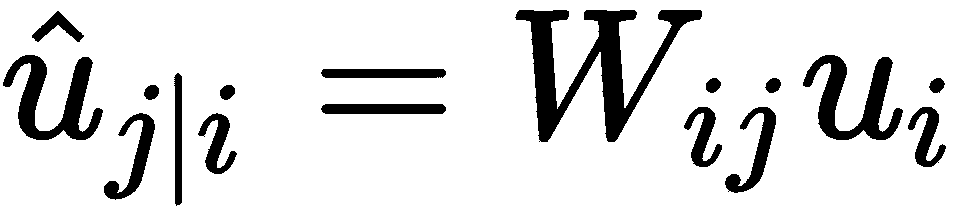
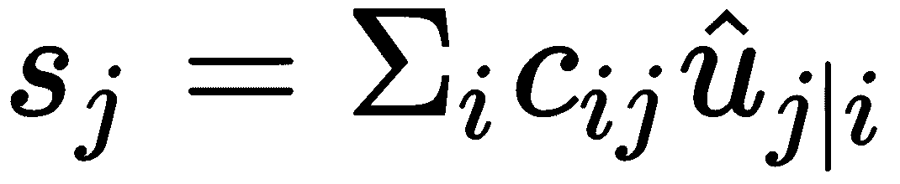

# 第十章：使用胶囊网络分类服装图像

在本章中，我们将学习如何在 Fashion MNIST 数据集上实现胶囊网络。本章将涵盖胶囊网络的内部工作原理，并解释如何在 TensorFlow 中实现它们。你还将学习如何评估和优化模型。

我们选择胶囊网络是因为它们具有保留图像空间关系的能力。胶囊网络由 Geoff Hinton 等人提出。他们在 2017 年发表了一篇论文，可以在[`arxiv.org/abs/1710.09829`](https://arxiv.org/abs/1710.09829)找到。胶囊网络作为一种新的神经网络类型，在深度学习社区中获得了极大的关注。

到本章结束时，我们将能够通过以下内容使用胶囊网络进行服装分类：

+   理解胶囊网络的重要性

+   对胶囊的简要理解

+   通过协议路由算法

+   实现 CapsNet 架构来分类 Fashion-MNIST 图像

+   胶囊网络的局限性

# 理解胶囊网络的重要性

**卷积神经网络**（**CNNs**）构成了当前所有图像检测重大突破的基础。CNN 通过检测网络低层中存在的基本特征，然后继续检测网络高层中存在的更高级特征来工作。这种设置没有包含低级特征之间的姿势（平移和旋转）关系，而这些低级特征构成了任何复杂物体。

想象一下试图识别一张面孔。在这种情况下，仅仅有眼睛、鼻子和耳朵在图像中，可能会导致 CNN 认为它是面孔，而不关心相关物体的相对方向。为了进一步解释这一点，如果图像中鼻子在眼睛上方，CNN 仍然可以检测出它是图像。CNN 通过使用*最大池化*来解决这个问题，帮助提高更高层的*视野范围*。然而，这个操作并不是完美的解决方案，因为我们使用它时，往往会丢失图像中的有价值信息。

事实上，Hinton 本人这样说：

“卷积神经网络中使用的池化操作是一个大错误，然而它之所以能如此有效，正是一个灾难。”

在论文中，Hinton 试图通过逆图形方法提供解决该问题的直觉。对于计算机图形学，图像是通过使用图像中物体的内部表示来构建的。这是通过数组和矩阵来完成的。这种内部表示有助于保留形状、方向和物体之间的相对位置，与图像中的所有其他物体进行比较。软件采用这种内部表示，并通过称为**渲染**的过程将图像发布到屏幕上。

休·辛顿指出，人脑进行了一种逆向图形处理。我们通过眼睛看到图像，然后大脑会分析这些图像，并构建出图像中不同对象的层次化表示，随后将其与我们曾经见过的模式进行匹配。一个有趣的观察是，人类可以识别图像中的对象，而不论它们的视角如何。

他接着提出，为了进行分类，必须保留图像中不同对象的相对方向和位置（这有助于模拟我们之前讨论过的人类能力）。直观地讲，一旦我们在模型中构建了这些关系，模型就能非常容易地检测到从不同角度看到的对象。让我们设想一下观看泰姬陵（印度的著名建筑）的情况。我们的眼睛可以从不同角度识别泰姬陵。然而，如果你把相同的图像输入到 CNN 中，它可能无法从不同视角识别泰姬陵。这是因为 CNN 不像我们的大脑那样理解 3D 空间。这也是胶囊网络理论如此重要的原因。

这里的一个主要问题是：*我们如何将这些层级关系纳入深度神经网络中？* 图像中不同对象之间的关系通过一种叫做**姿势（pose）**的方式来建模，基本上是旋转和平移的结合。这是计算机图形学中的特定概念。在接下来的章节中，我们将讨论这些关系如何在胶囊网络中被建模。

# 理解胶囊网络

在传统的卷积神经网络（CNN）中，我们定义了不同的滤波器，它们会遍历整个图像。每个滤波器生成的 2D 矩阵会堆叠在一起，形成卷积层的输出。接着，我们执行最大池化操作，以找到活动的变换不变性。这里的变换不变性意味着输出对输入的小变化具有鲁棒性，因为最大池化操作总是选择最大活动。正如前面所提到的，最大池化会导致有价值的信息丢失，并且无法表示图像中不同对象之间的相对方向。

另一方面，胶囊网络以向量形式编码它们检测到的对象的所有信息，而不是通过神经元的标量输出。这些向量具有以下属性：

+   向量的长度表示图像中对象的概率。

+   向量的不同元素编码了对象的不同属性。这些属性包括各种实例化参数，如姿势（位置、大小、方向）、色调、厚度等。

通过这种表示方式，如果图像中的物体发生了移动，向量的长度将保持不变。然而，向量表示中不同元素的方向或数值将发生变化。我们再来看之前的泰姬陵的例子。即使我们在图像中移动（或改变方向）泰姬陵，胶囊表示应该仍能在图像中检测到这个物体。

# 胶囊是如何工作的？

在了解胶囊如何工作的之前，让我们先回顾一下神经元是如何工作的。一个神经元从前一层的神经元接收标量输入，将它们与相应的权重相乘，并将输出求和。这个求和后的输出通过某种非线性函数（如 ReLU）进行处理，输出一个新的标量，然后传递给下一层的神经元。

与此相反，胶囊以向量作为输入，同时也输出一个向量。以下图示展示了计算胶囊输出的过程：


让我们详细看看每一步：

1.  **胶囊 j**（在更高层）接收来自下层的向量输入，如`u`[`1`]、`u`[`2`]、`u`[`3`]，依此类推。如前所述，每个输入向量编码了在下层检测到的物体的概率以及其方向参数。这些输入向量与权重矩阵*`W[ij]`*相乘，后者试图建模下层物体和高层物体之间的关系。在检测泰姬陵的情况下，可以将其视为下层检测到的边缘与上层泰姬陵柱子之间的关系。这个乘法运算的结果是基于下层检测到的物体来预测高层物体（在此为柱子）的向量。因此，`^u[i]`表示基于检测到的垂直边缘，泰姬陵柱子的位置，`^u[2]`则可以表示基于检测到的水平边缘的柱子位置，依此类推。直观地说，如果所有预测的向量都指向同一个物体且具有相似的方向，那么该物体必定存在于图像中：



1.  接下来，这些预测向量将与标量权重（*`cᵢ`*s）相乘，这有助于将预测向量路由到上层正确的胶囊。然后，我们将通过此乘法得到的加权向量求和。这一步与传统神经网络中的操作很相似，后者会将标量输入与权重相乘，再将它们提供给更高层次的神经元。在这些情况下，权重是通过反向传播算法来确定的。然而，在胶囊网络中，权重是通过动态路由算法来确定的，我们将在下一节中详细讨论。公式如下：



1.  在前面的公式中，我们提到了一个新词，叫做**压缩**。这是胶囊网络中使用的非线性函数。你可以把它看作是传统神经网络中使用的非线性的对应物。从本质上讲，压缩试图将向量缩小到小于单位范数的值，以便将向量的长度解释为概率：


这里，*`v[j]`*是`j`层胶囊的输出。

压缩函数在代码中的实现如下：

```py
def squash(vectors, name=None):
 """
 Squashing Function as implemented in the paper
 :parameter vectors: vector input that needs to be squashed
 :parameter name: Name of the tensor on the graph
 :return: a tensor with same shape as vectors but squashed as mentioned in the paper
 """
 with tf.name_scope(name, default_name="squash_op"):
 s_squared_norm = tf.reduce_sum(tf.square(vectors), axis=-2, keepdims=True)
 scale = s_squared_norm / (1\. + s_squared_norm) / tf.sqrt(s_squared_norm + tf.keras.backend.epsilon())
 return scale*vectors
```

# 动态路由算法

如前所述，下层胶囊需要决定如何将其输出发送到上层胶囊。这是通过动态路由算法这一新颖的概念来实现的，该算法在论文中被提出（[`arxiv.org/pdf/1710.09829.pdf`](https://arxiv.org/pdf/1710.09829.pdf)）。该算法的关键思想是，下层胶囊将其输出发送到与输入*匹配*的上层胶囊。

这是通过上一部分提到的权重（*`c[ij]`*）实现的。这些权重在将来自下层胶囊`i`的输出作为输入传递给上层胶囊`j`之前，会先将它们相乘。以下是这些权重的一些特性：

+   *`c[ij]`*是非负的，并且由动态路由算法决定

+   下层胶囊中的权重数量等于上层胶囊的数量

+   每个下层胶囊`i`的权重之和为 1

使用以下代码实现迭代路由算法：

```py
def routing(u):
    """
    This function performs the routing algorithm as mentioned in the paper
    :parameter u: Input tensor with [batch_size, num_caps_input_layer=1152, 1, caps_dim_input_layer=8, 1] shape.
                NCAPS_CAPS1: num capsules in the PrimaryCaps layer l
                CAPS_DIM_CAPS2: dimensions of output vectors of Primary caps layer l

    :return: "v_j" vector (tensor) in Digitcaps Layer
             Shape:[batch_size, NCAPS_CAPS1=10, CAPS_DIM_CAPS2=16, 1]
    """
    #local variable b_ij: [batch_size, num_caps_input_layer=1152,
                           num_caps_output_layer=10, 1, 1]
    #num_caps_output_layer: number of capsules in Digicaps layer l+1
    b_ij = tf.zeros([BATCH_SIZE, NCAPS_CAPS1, NCAPS_CAPS2, 1, 1], dtype=np.float32, name="b_ij")

    # Preparing the input Tensor for total number of DigitCaps capsule for multiplication with W
    u = tf.tile(u, [1, 1, b_ij.shape[2].value, 1, 1])   # u => [batch_size, 1152, 10, 8, 1]

    # W: [num_caps_input_layer, num_caps_output_layer, len_u_i, len_v_j] as mentioned in the paper
    W = tf.get_variable('W', shape=(1, u.shape[1].value, b_ij.shape[2].value,    
        u.shape[3].value, CAPS_DIM_CAPS2),dtype=tf.float32,
        initializer=tf.random_normal_initializer(stddev=STDEV))
    W = tf.tile(W, [BATCH_SIZE, 1, 1, 1, 1]) # W => [batch_size, 1152, 10, 8, 16]

    #Computing u_hat (as mentioned in the paper)
    u_hat = tf.matmul(W, u, transpose_a=True)  # [batch_size, 1152, 10, 16, 1]

    # In forward, u_hat_stopped = u_hat;
    # In backward pass, no gradient pass from  u_hat_stopped to u_hat
    u_hat_stopped = tf.stop_gradient(u_hat, name='gradient_stop')

```

请注意，在前面的代码中，我们将实际的路由函数分成了两部分，以便我们能够专注于动态路由算法部分。该函数的第一部分接收来自下层胶囊的向量`u`作为输入。首先，它使用权重向量`W`生成向量 。此外，注意我们定义了一个名为 的临时变量，初始值为零，直到训练开始时。 的值将在算法中更新，并最终存储在*`c[ij]`*中。该函数的第二部分实现了实际的迭代路由算法，具体如下：

```py
# Routing Algorithm Begins here
for r in range(ROUTING_ITERATIONS):
    with tf.variable_scope('iterations_' + str(r)):
        c_ij = tf.nn.softmax(b_ij, axis=2) # [batch_size, 1152, 10, 1, 1]

        # At last iteration, use `u_hat` in order to back propagate gradient
        if r == ROUTING_ITERATIONS - 1:
            s_j = tf.multiply(c_ij, u_hat) # [batch_size, 1152, 10, 16, 1]
            # then sum as per paper
            s_j = tf.reduce_sum(s_j, axis=1, keep_dims=True) # [batch_size, 1, 10, 16, 1]

            v_j = squash(s_j) # [batch_size, 1, 10, 16, 1]

        elif r < ROUTING_ITERATIONS - 1:  # No backpropagation in these iterations
            s_j = tf.multiply(c_ij, u_hat_stopped)
            s_j = tf.reduce_sum(s_j, axis=1, keepdims=True)
            v_j = squash(s_j)
            v_j = tf.tile(v_j, [1, u.shape[1].value, 1, 1, 1]) # [batch_size, 1152, 10, 16, 1]

            # Multiplying in last two dimensions: [16, 1]ᐪ x [16, 1] yields [1, 1]
            u_hat_dot_v = tf.matmul(u_hat_stopped, v_j, transpose_a=True) # [batch_size, 1152, 10, 1, 1]

            b_ij = tf.add(b_ij,u_hat_dot_v)
return tf.squeeze(v_j, axis=1) # [batch_size, 10, 16, 1]
```

首先，我们定义一个`ROUTING_ITERATIONS`的循环。这个参数由用户定义。Hinton 在他的论文中提到，典型的值`3`应该足够了。

接下来，我们对  进行 softmax 操作，以计算*`c[ij]`*的初始值。请注意，*`c[ij]`*不包含在反向传播中，因为这些值只能通过迭代算法获得。因此，在最后一次迭代之前的所有路由迭代都将在  上进行（这有助于停止梯度，正如之前定义的那样）。

对于每次路由迭代，我们对每个上层胶囊`j`执行以下操作：


我们已经解释了前两个方程。现在让我们试着理解第三个方程。

第三个方程是迭代路由算法的核心。它更新权重 。公式表示新权重值是旧权重的和：来自下层胶囊的预测向量和来自上层胶囊的输出。点积本质上是尝试捕捉输入向量和胶囊输出向量之间的相似性。通过这种方式，来自下层胶囊`i`的输出只会发送给与其输入一致的上层胶囊`j`。点积实现了这种一致性。这个算法会重复执行与代码中的`ROUTING_ITERATIONS`参数相等的次数。

这就是我们对创新性路由算法及其应用的讨论的结束。

# CapsNet 用于分类 Fashion MNIST 图像

现在让我们来看一下 CapsNet 在 Fashion MNIST 图像分类中的实现。**Zalando**，这家电子商务公司，最近发布了一个新的 MNIST 数据集替代品，名为**Fashion MNIST**（[`github.com/zalandoresearch/fashion-mnist`](https://github.com/zalandoresearch/fashion-mnist)）。Fashion MNIST 数据集包含 10 类 28 x 28 灰度图像：

| **类别名称** | **标签（数据集中的值）** |
| --- | --- |
| T-shirt/top | 0 |
| Trouser | 1 |
| Pullover | 2 |
| Dress | 3 |
| Coat | 4 |
| Sandal | 5 |
| Shirt | 6 |
| Sneaker | 7 |
| Bag | 8 |
| Ankle boot | 9 |

以下是数据集中的一些示例图片：


训练集包含 60K 个示例，测试集包含 10K 个示例。

# CapsNet 实现

CapsNet 架构由两部分组成，每部分包含三层。前三层是编码器，接下来的三层是解码器：

| **层编号** | **层名称** | **层类型** |
| --- | --- | --- |
| 1 | 卷积层 | 编码器 |
| 2 | 初级胶囊层 | 编码器 |
| 3 | 数字胶囊层 | 编码器 |
| 4 | 全连接层 1 | 解码器 |
| 5 | 全连接层 2 | 解码器 |
| 6 | 全连接层 3 | 解码器 |

让我们尝试详细理解这些层。

# 理解编码器

以下图展示了用于建模的编码器结构。请注意，它显示的是 MNIST 数字图像作为输入，但我们使用的是 Fashion-MNIST 数据集作为模型的输入：


编码器本质上接受一个 28x28 的图像输入，并生成该图像的 16 维表示。如前所述，16 维向量的长度表示图像中是否存在某个物体的概率。向量的各个组成部分表示不同的实例化参数。

专门用于编码器的三层如下：

+   **层 1-卷积层**：层 1 是一个标准的卷积层。该层的输入是一个 28x28 的灰度图像，输出是一个 20x20x256 的张量。该层的其他参数如下：

| 参数名称 | 值 |
| --- | --- |
| 过滤器 | 256 |
| 卷积核大小 | 9 |
| Activation | ReLU |
| Strides | 1 |

+   **层 2-初级胶囊层**：层 2 是第一个包含胶囊的层。该层的主要目的是利用第一层卷积层的输出生成更高层次的特征。它有 32 个初级胶囊。它也接受一个 20 x 20 x 256 的张量作为输入。该层中的每个胶囊都将卷积核应用于输入，生成一个 6 x 6 x 8 的张量输出。通过 32 个胶囊，输出现在是一个 6 x 6 x 8 x 32 的张量。

本层中所有胶囊共享的卷积参数如下所示：

| **参数名称** | **值** |
| --- | --- |
| 过滤器 | 256 |
| Kernel Size | 9 |
| 激活函数 | ReLU |
| Strides | 2 |

请注意，我们还会对该层的输出进行`squash`处理。

+   **层 3-DigitCaps 层**：此层有 10 个胶囊——每个类标签对应一个胶囊。每个胶囊是一个 16 维的向量。此层的输入是 6x6x32 的 8 维向量（`u`，如前所述）。每个向量都有自己的权重矩阵，！[](img/bb7634a1-9cfe-4935-975a-c356f2a634f4.png)，它产生！[](img/dc96a72e-28a1-4c91-a972-aac9c5e4142c.png)。这些！[](img/dedba9da-b209-4ec0-b93b-9eb5d7672693.png)然后在我们之前描述的路由协议中由一致性算法使用。

请注意，原始论文将此层命名为 DigitCaps 层，因为它使用了 MNIST 数据集。我们继续使用相同的名称来适应 Fashion MNIST 数据集，因为这与原始论文更容易对应。

# 理解解码器

解码器的结构如下面的图所示：


解码器本质上尝试从每个图像的正确 DigitCaps 胶囊中重建图像。你可以将其视为一个正则化步骤，*损失*是预测输出与原始标签之间的欧几里得距离。你可以争辩说，在这个应用中不需要重建，因为你只是进行分类。然而，Hinton 在他的原始论文中明确指出，添加重建损失确实提高了模型的准确性。

解码器的结构非常简单，只由三个全连接层组成。三个层的输入和输出形状如下：

| **层** | **输入形状** | **输出形状** |
| --- | --- | --- |
| 全连接层 4 | 16 x 10 | 512 |
| 全连接层 5 | 512 | 1,024 |
| 全连接层 6 | 1,024 | 784 |

然而，在将输入传递给三个全连接层之前，在训练过程中，我们会掩蔽除正确数字胶囊的活动向量外的所有向量。由于在测试过程中我们没有正确的标签，我们会将活动向量的最大范数传递给全连接层。

# 定义损失函数

胶囊网络的损失函数由两部分组成：

+   **边距损失**：边距损失与**支持向量机**（**SVM**）中使用的完全相同。实际上，我们希望数字胶囊对类`k`有一个实例化向量，但前提是标签是类`k`。对于所有其他类别，我们不需要任何实例化参数。对于每个数字胶囊 k，我们定义单独的损失为！[](img/b555a2b5-ab4e-461a-822d-582948acdf34.png)：

    

如果图像属于类 k，则！[](img/4bc5e47a-3971-4d9d-9e54-6ba9e79ea6a4.png)，否则为 0。！[](img/4ffb1d5c-d0ef-4d06-8d7a-10b3a6e0d1a7.png)是其他两个参数。！[](img/cf48ef4f-6a62-46d3-9e1b-614c7f7d1cf3.png)在模型初始学习时用于稳定性。总的边距损失是所有数字胶囊损失的总和。

简单来说，对于数字胶囊`k`（即真实标签），如果我们以大于 0.9 的概率预测出正确的标签，则损失为零；否则，损失为非零。对于所有其他数字胶囊，如果我们预测所有这些类别的概率都小于 0.1，则损失为零；否则，损失为非零。

+   **重建损失**：重建损失主要用作模型的正则化器，以便我们能集中精力学习图像的表示，并重现图像。直观地说，这也有助于简化模型实例化参数的学习。它通过计算重建图像和输入图像像素之间的欧几里得距离来生成。模型的总损失如下所示：

*总损失 = 边距损失 + 0.0005 重建损失*

请注意，重建损失被大大加权，以确保它在训练过程中不会主导边距损失。

# 训练和测试模型

以下是训练和测试模型的步骤：

1.  第一步是读取训练和测试数据集。以下是我们必须执行的数据读取步骤：

    +   首先，我们从下载的**Fashion MNIST**数据集中加载训练/测试图像和标签数据（[`github.com/zalandoresearch/fashion-mnist`](https://github.com/zalandoresearch/fashion-mnist)）。

    +   然后，我们将图像数据重塑为 28 x 28 x 1 的形状，以供我们的模型使用，并通过 255 进行归一化，保持模型输入在 0 和 1 之间。

    +   我们将训练数据分割为训练集和验证集，每个集分别包含 55,000 张和 5000 张图像。

    +   我们将训练和测试数据集中的目标数组`y`进行转换，以便我们能获得数据集中 10 个类别的独热表示，这些数据将被输入到模型中。

确保选择大约 10%的数据作为验证集。在这个项目中，我们选择了 5000 张随机图像（占总图像的 8%）作为验证数据集。

前述步骤的代码如下：

```py
def load_data(load_type='train'):
    '''

    :param load_type: train or test depending on the use case
    :return: x (images), y(labels)
    '''
    data_dir = os.path.join('data','fashion-mnist')
    if load_type == 'train':
        image_file = open(os.path.join(data_dir,'train-images-idx3-ubyte'))
        image_data = np.fromfile(file=image_file, dtype=np.uint8)
        x = image_data[16:].reshape((60000, 28, 28, 1)).astype(np.float32)

        label_file = open(os.path.join(data_dir, 'train-labels-idx1-ubyte'))
        label_data = np.fromfile(file=label_file, dtype=np.uint8)
        y = label_data[8:].reshape(60000).astype(np.int32)

        x_train = x[:55000] / 255.
        y_train = y[:55000]
        y_train = (np.arange(N_CLASSES) == y_train[:, None]).astype(np.float32)

        x_valid = x[55000:, ] / 255.
        y_valid = y[55000:]
        y_valid = (np.arange(N_CLASSES) == y_valid[:, None]).astype(np.float32)
        return x_train, y_train, x_valid, y_valid
    elif load_type == 'test':
        image_file = open(os.path.join(data_dir, 't10k-images-idx3-ubyte'))
        image_data = np.fromfile(file=image_file, dtype=np.uint8)
        x_test = image_data[16:].reshape((10000, 28, 28, 1)).astype(np.float)

        label_file = open(os.path.join(data_dir, 't10k-labels-idx1-ubyte'))
        label_data = np.fromfile(file=label_file, dtype=np.uint8)
        y_test = label_data[8:].reshape(10000).astype(np.int32)
        y_test = (np.arange(N_CLASSES) == y_test[:, None]).astype(np.float32)
 return x_test / 255., y_test
```

请注意，在加载数据集后，我们通过`255`对图像像素进行归一化，以确保训练的稳定性和更快的收敛。

1.  通过创建在*理解编码器*部分中定义的三个神经网络层，来实现编码器：

```py
with tf.variable_scope('Conv1_layer'):
    conv1_layer = tf.layers.conv2d(self.X, name="conv1_layer", **CONV1_LAYER_PARAMS) # [batch_size, 20, 20, 256]

with tf.variable_scope('PrimaryCaps_layer'):
    conv2_layer = tf.layers.conv2d(conv1_layer, name="conv2_layer", **CONV2_LAYER_PARAMS) # [batch_size, 6, 6, 256]

    primary_caps = tf.reshape(conv2_layer, (BATCH_SIZE, NCAPS_CAPS1, CAPS_DIM_CAPS1, 1), name="primary_caps") # [batch_size, 1152, 8, 1]
    primary_caps_output = squash(primary_caps, name="caps1_output")
    # [batch_size, 1152, 8, 1]

# DigitCaps layer, return [batch_size, 10, 16, 1]
with tf.variable_scope('DigitCaps_layer'):
    digitcaps_input = tf.reshape(primary_caps_output, shape=(BATCH_SIZE, NCAPS_CAPS1, 1, CAPS_DIM_CAPS1, 1)) # [batch_size, 1152, 1, 8, 1]
    # [batch_size, 1152, 10, 1, 1]
    self.digitcaps_output = routing(digitcaps_input) # [batch_size, 10, 16, 1]
```

1.  接下来，实现解码器层以重建图像，如*理解解码器*部分所述。以下是参考的重要步骤：

+   +   首先，我们计算数字胶囊输出中每个活动向量的范数，用于遮盖目的。我们还会为稳定性添加一个 epsilon 到范数中。

    +   在训练时，我们会遮盖掉数字胶囊输出中的所有活动向量，除了具有正确标签的那个。另一方面，在测试时，我们会遮盖掉数字胶囊输出中的所有活动向量，除了具有最高范数（或预测标签）的那个。我们在解码器中使用**tf.cond**实现这一分支机制，它在 TensorFlow 图中定义了一个控制流操作。

    +   最后，我们将来自数字胶囊的掩蔽输出展平，并将其展平成一个一维向量，以便可以输入到全连接层。

要了解`tf.cond`，请参阅[`www.tensorflow.org/api_docs/python/tf/cond`](https://www.tensorflow.org/api_docs/python/tf/cond)。

上述步骤的代码如下：

```py
# Decoder
with tf.variable_scope('Masking'):
    self.v_norm = tf.sqrt(tf.reduce_sum(tf.square(self.digitcaps_output), axis=2, keep_dims=True) + tf.keras.backend.epsilon())

    predicted_class = tf.to_int32(tf.argmax(self.v_norm, axis=1)) #[batch_size, 10,1,1]
    self.y_predicted = tf.reshape(predicted_class, shape=(BATCH_SIZE,))  #[batch_size]
    y_predicted_one_hot = tf.one_hot(self.y_predicted, depth=NCAPS_CAPS2)  #[batch_size,10]  One hot operation

    reconstruction_targets = tf.cond(self.mask_with_labels,  # condition
                              lambda: self.Y,  # if True (Training)
                              lambda: y_predicted_one_hot,  # if False (Test)
                              name="reconstruction_targets")

    digitcaps_output_masked = tf.multiply(tf.squeeze(self.digitcaps_output), tf.expand_dims(reconstruction_targets, -1)) # [batch_size, 10, 16]

    #Flattening as suggested by the paper
    decoder_input = tf.reshape(digitcaps_output_masked, [BATCH_SIZE, -1]) # [batch_size, 160]

with tf.variable_scope('Decoder'):
    fc1 = tf.layers.dense(decoder_input, layer1_size, activation=tf.nn.relu, name="FC1") # [batch_size, 512]
    fc2 = tf.layers.dense(fc1, layer2_size, activation=tf.nn.relu, name="FC2") # [batch_size, 1024]
    self.decoder_output = tf.layers.dense(fc2, output_size, activation=tf.nn.sigmoid, name="FC3") # [batch_size, 784]
```

1.  使用*定义损失函数*部分中提到的公式实现边缘损失，如下所示：

```py
with tf.variable_scope('Margin_Loss'):
    # max(0, m_plus-||v_c||)²
    positive_error = tf.square(tf.maximum(0., 0.9 - self.v_norm)) # [batch_size, 10, 1, 1]
    # max(0, ||v_c||-m_minus)²
    negative_error = tf.square(tf.maximum(0., self.v_norm - 0.1)) # [batch_size, 10, 1, 1]
    # reshape: [batch_size, 10, 1, 1] => [batch_size, 10]
    positive_error = tf.reshape(positive_error, shape=(BATCH_SIZE, -1))
    negative_error = tf.reshape(negative_error, shape=(BATCH_SIZE, -1))

    Loss_vec = self.Y * positive_error + 0.5 * (1- self.Y) * negative_error # [batch_size, 10]
    self.margin_loss = tf.reduce_mean(tf.reduce_sum(Loss_vec, axis=1), name="margin_loss")

```

1.  使用*定义损失函数*部分中提到的公式实现重建损失：

```py
with tf.variable_scope('Reconstruction_Loss'):
    ground_truth = tf.reshape(self.X, shape=(BATCH_SIZE, -1))
    self.reconstruction_loss = tf.reduce_mean(tf.square(self.decoder_output - ground_truth))
```

1.  定义优化器为 Adam 优化器，使用默认参数和准确性度量作为常规分类准确率。这些需要在 CapsNet 类中使用以下代码实现：

```py
def define_accuracy(self):
    with tf.variable_scope('Accuracy'):
        correct_predictions = tf.equal(tf.to_int32(tf.argmax(self.Y, axis=1)), self.y_predicted)
        self.accuracy = tf.reduce_mean(tf.cast(correct_predictions, tf.float32))

def define_optimizer(self):
    with tf.variable_scope('Optimizer'):
        optimizer = tf.train.AdamOptimizer()
        self.train_optimizer = optimizer.minimize(self.combined_loss, name="training_optimizer")
```

要了解更多关于 Adam 优化器的信息，请参阅[`www.tensorflow.org/api_docs/python/tf/train/AdamOptimizer`](https://www.tensorflow.org/api_docs/python/tf/train/AdamOptimizer)。

1.  实现对检查点和恢复模型的支持。根据验证集准确率选择最佳模型；我们只在验证集准确率下降的时期进行模型检查点操作，最后，将摘要输出记录到 TensorBoard 进行可视化。我们将模型训练 10 个周期，每个周期的批次大小为 128。记住，你可以调整这些参数来提高模型的准确性：

```py
def train(model):
    global fd_train
    x_train, y_train, x_valid, y_valid = load_data(load_type='train')
    print('Data set Loaded')
    num_batches = int(y_train.shape[0] / BATCH_SIZE)
    if not os.path.exists(CHECKPOINT_PATH_DIR):
        os.makedirs(CHECKPOINT_PATH_DIR)

    with tf.Session() as sess:
        if RESTORE_TRAINING:
            saver = tf.train.Saver()
            ckpt = tf.train.get_checkpoint_state(CHECKPOINT_PATH_DIR)
            saver.restore(sess, ckpt.model_checkpoint_path)
            print('Model Loaded')
            start_epoch = int(str(ckpt.model_checkpoint_path).split('-')[-1])
            train_file, val_file, best_loss_val = load_existing_details()
        else:
            saver = tf.train.Saver(tf.global_variables())
            tf.global_variables_initializer().run()
            print('All variables initialized')
            train_file, val_file = write_progress('train')
            start_epoch = 0
            best_loss_val = np.infty
        print('Training Starts')
        acc_batch_all = loss_batch_all = np.array([])
        train_writer = tf.summary.FileWriter(LOG_DIR, sess.graph)
        for epoch in range(start_epoch, EPOCHS):
            # Shuffle the input data
            x_train, y_train = shuffle_data(x_train, y_train)
            for step in range(num_batches):
                start = step * BATCH_SIZE
                end = (step + 1) * BATCH_SIZE
                global_step = epoch * num_batches + step
                x_batch, y_batch = x_train[start:end], y_train[start:end]
                feed_dict_batch = {model.X: x_batch, model.Y: y_batch, model.mask_with_labels: True}
                if not (step % 100):
                    _, acc_batch, loss_batch, summary_ = sess.run([model.train_optimizer, model.accuracy,
                                                                     model.combined_loss, model.summary_],
                                                                    feed_dict=feed_dict_batch)
                    train_writer.add_summary(summary_, global_step)
                    acc_batch_all = np.append(acc_batch_all, acc_batch)
                    loss_batch_all = np.append(loss_batch_all, loss_batch)
                    mean_acc,mean_loss = np.mean(acc_batch_all),np.mean(loss_batch_all)
                    summary_ = tf.Summary(value=[tf.Summary.Value(tag='Accuracy', simple_value=mean_acc)])
                    train_writer.add_summary(summary_, global_step)
                    summary_ = tf.Summary(value=[tf.Summary.Value(tag='Loss/combined_loss', simple_value=mean_loss)])
                    train_writer.add_summary(summary_, global_step)

                    train_file.write(str(global_step) + ',' + str(mean_acc) + ',' + str(mean_loss) + "\n")
                    train_file.flush()
                    print("  Batch #{0}, Epoch: #{1}, Mean Training loss: {2:.4f}, Mean Training accuracy: {3:.01%}".format(
                        step, (epoch+1), mean_loss, mean_acc))
                    acc_batch_all = loss_batch_all = np.array([])
                else:
                    _, acc_batch, loss_batch = sess.run([model.train_optimizer, model.accuracy, model.combined_loss],
                                                        feed_dict=feed_dict_batch)
                    acc_batch_all = np.append(acc_batch_all, acc_batch)
                    loss_batch_all = np.append(loss_batch_all, loss_batch)

            # Validation metrics after each EPOCH
            acc_val, loss_val = eval_performance(sess, model, x_valid, y_valid)
            val_file.write(str(epoch + 1) + ',' + str(acc_val) + ',' + str(loss_val) + '\n')
            val_file.flush()
            print("\rEpoch: {}  Mean Train Accuracy: {:.4f}% ,Mean Val accuracy: {:.4f}%  Loss: {:.6f}{}".format(
                epoch + 1, mean_acc * 100, acc_val * 100, loss_val,
                " (improved)" if loss_val < best_loss_val else ""))

            # Saving the improved model
            if loss_val < best_loss_val:
                saver.save(sess, CHECKPOINT_PATH_DIR + '/model.tfmodel', global_step=epoch + 1)
                best_loss_val = loss_val
        train_file.close()
        val_file.close()
```

该模型在验证集和测试集上经过`10`个周期后达到了几乎`99%`的准确率，表现相当不错。

# 重建样本图像

我们还将重建一些样本图像，以查看模型的表现。我们将使用以下图像作为输入：


重建上述图像的代码如下：

```py
def reconstruct_sample(model, n_samples=5):
    x_test, y_test = load_data(load_type='test')
    sample_images, sample_labels = x_test[:BATCH_SIZE], y_test[:BATCH_SIZE]
    saver = tf.train.Saver()
    ckpt = tf.train.get_checkpoint_state(CHECKPOINT_PATH_DIR)
    with tf.Session() as sess:
        saver.restore(sess, ckpt.model_checkpoint_path)
        feed_dict_samples = {model.X: sample_images, model.Y: sample_labels}
        decoder_out, y_predicted = sess.run([model.decoder_output, model.y_predicted],
                                       feed_dict=feed_dict_samples)
    reconstruction(sample_images, sample_labels, decoder_out, y_predicted, n_samples)
```

用于绘制图像并保存的重建函数如下所示：

```py
def reconstruction(x, y, decoder_output, y_pred, n_samples):
    '''
    This function is used to reconstruct sample images for analysis
    :param x: Images
    :param y: Labels
    :param decoder_output: output from decoder
    :param y_pred: predictions from the model
    :param n_samples: num images
    :return: saves the reconstructed images
    '''

    sample_images = x.reshape(-1, IMG_WIDTH, IMG_HEIGHT)
    decoded_image = decoder_output.reshape([-1, IMG_WIDTH, IMG_WIDTH])

    fig = plt.figure(figsize=(n_samples * 2, 3))
    for i in range(n_samples):
        plt.subplot(1, n_samples, i+ 1)
        plt.imshow(sample_images[i], cmap="binary")
        plt.title("Label:" + IMAGE_LABELS[np.argmax(y[i])])
        plt.axis("off")
    fig.savefig(RESULTS_DIR + '/' + 'input_images.png')
    plt.show()

    fig = plt.figure(figsize=(n_samples * 2, 3))
    for i in range(n_samples):
        plt.subplot(1, n_samples, i + 1)
        plt.imshow(decoded_image[i], cmap="binary")
        plt.title("Prediction:" + IMAGE_LABELS[y_pred[i]])
        plt.axis("off")
    fig.savefig(RESULTS_DIR + '/' + 'decoder_images.png')
    plt.show()
```

现在，重建的图像如下所示：


如我们所见，标签是完美的，而重建图像虽然不完美，但非常相似。通过更多的超参数调优，我们可以生成更好的重建图像。

# 胶囊网络的局限性

虽然胶囊网络很棒，并且解决了卷积神经网络的核心问题，但它们仍然有很长的路要走。胶囊网络的一些局限性如下：

+   该网络尚未在像 ImageNet 这样的超大数据集上进行测试。这对其在大数据集上的表现提出了疑问。

+   算法运行较慢，主要由于动态路由算法的内部循环。对于大数据集，迭代次数可能相当大。

+   与 CNN 相比，胶囊网络在实现上确实具有更高的复杂性。

看到深度学习社区如何解决胶囊网络的局限性将会很有趣。

# 总结

在本章中，我们看到了由 Geoff Hinton（深度学习的奠基人之一）提出的非常流行的神经网络架构 CapsNet。

我们首先理解了卷积神经网络（CNN）在当前形式下的局限性。它们使用最大池化作为一种依赖工具来实现活动的不变性。最大池化有信息丢失的倾向，而且它无法建模图像中不同物体之间的关系。接着，我们讨论了人脑如何检测物体并且具有视角不变性。我们通过类比计算机图形学，理解了如何可能在神经网络中加入姿态信息。

随后，我们了解了胶囊网络的基本构建块——胶囊。我们理解了胶囊与传统神经元的区别，它们接受向量作为输入，并输出一个向量。我们还了解了胶囊中的一种特殊非线性函数——`squash`函数。

在下一节中，我们了解了一种新颖的**动态路由算法**，它有助于将低层胶囊的输出路由到高层胶囊。系数  通过多次迭代的路由算法进行学习。算法的关键步骤是通过使用预测向量  和高层胶囊输出向量  的点积来更新系数 。

此外，我们为 Fashion MNIST 数据集实现了 CapsNet。我们使用了卷积层，接着是 PrimaryCaps 层和 DigitCaps 层。我们了解了编码器架构，以及如何获取图像的向量表示。然后我们学习了解码器架构，以便从学习到的表示中重建图像。该架构中的损失函数是边际损失（如同支持向量机中的损失）和加权重构损失的组合。为了让模型在训练时能更多地关注边际损失，重构损失被加权降低。

然后我们将模型训练了 10 个周期，批量大小为 128，并在验证集和测试集上达到了超过 99%的准确率。我们重建了一些示例图像以可视化输出，并发现重建结果相当准确。

总结来说，在本章中，我们能够理解并从头开始实现胶囊网络，使用 TensorFlow 并在 Fashion MNIST 数据集上进行训练。

现在，您已经构建了基本的胶囊网络，您可以尝试通过加入多个胶囊层来扩展这个模型，并查看它的表现；您还可以在其他图像数据集上使用这个模型，并观察该算法是否具有可扩展性；或者在没有重构损失的情况下运行，看看是否还能重建输入图像。通过这样做，您将能够对该算法形成较好的直觉。

在下一章中，我们将介绍使用 TensorFlow 进行人脸检测的项目。
