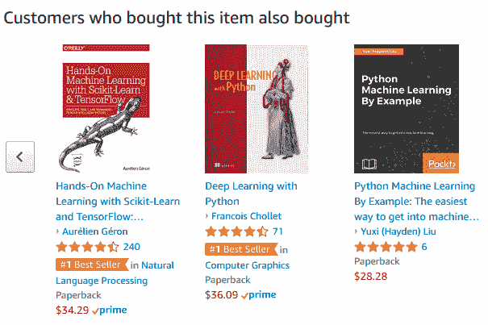
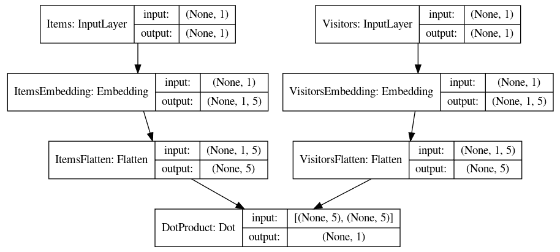
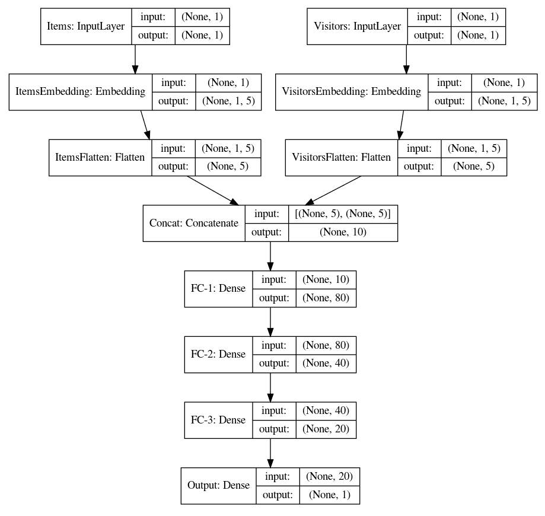

# 第十一章：使用 TensorFlow 进行高质量产品推荐

当你访问亚马逊、Netflix 或其他你喜欢的网站，或使用 Spotify、Pandora 等现代应用时，你会注意到它们会向你推荐不同的商品。这些推荐是通过推荐系统算法生成的。在基于机器学习的推荐系统之前，推荐是通过基于规则的系统生成的。然而，随着机器学习和神经网络的出现，推荐变得更加准确。

在本章中，我们将学习推荐系统。我们将使用 Retailrocket 数据集，通过两种不同的方式实现推荐系统，分别使用 TensorFlow 和 Keras。

本章将涉及以下主题：

+   推荐系统

+   基于内容的过滤

+   协同过滤

+   混合系统

+   矩阵分解

+   介绍 Retailrocket 数据集

+   探索 Retailrocket 数据集

+   数据预处理

+   Retailrocket 推荐系统的矩阵分解模型

+   Retailrocket 推荐系统的神经网络模型

# 推荐系统

机器学习系统的最常见应用之一是向用户推荐他们可能感兴趣的内容。你有没有注意到 Spotify 和 Pandora 如何推荐某种类型的音乐，或者特定的歌曲或电台？你可能也观察到 Netflix 向你推荐电影，如以下截图所示：


亚马逊如何根据你当前浏览的书籍推荐其他书籍，参考以下截图：



这样的系统被称为推荐系统。

推荐系统是学习用户可能感兴趣的项目，然后推荐这些项目供购买、租赁、收听、观看等使用的系统。推荐系统大致可以分为两类：基于内容的过滤和协同过滤。

# 基于内容的过滤

基于内容的过滤是通过创建内容的详细模型来进行推荐的，这些内容可能是书籍的文本、电影的属性或音乐的信息。内容模型通常表示为向量空间模型。一些常见的将内容转化为向量空间模型的方法包括 TFIDF、*词袋模型*、Word2Vec、GloVe 和 Item2Vec。

除了内容模型，还通过用户信息创建了用户档案。根据匹配用户档案和内容模型来推荐内容。

# 基于内容的过滤算法的优点

以下是基于内容的过滤算法的优点：

+   **消除了新物品的冷启动问题：** 如果我们拥有足够的用户信息以及新内容的详细信息，那么协同过滤算法中的冷启动问题就不会影响基于内容的算法。推荐可以基于用户档案和内容信息进行。

+   **推荐结果是可解释和透明的：** 使用内容表示模型，我们能够解释为什么某些物品被选择作为推荐项。

# 基于内容的过滤算法的缺点

以下是基于内容的过滤算法的缺点：

+   基于内容的过滤算法需要详细的物品和内容信息，而这些信息有时并不可用

+   基于内容的过滤算法容易导致过度专业化

# 协同过滤

协同过滤算法不需要关于用户或物品的详细信息。它们根据用户与物品的互动（如听过的歌曲、查看的物品、点击的链接、购买的物品或观看的视频）构建模型。通过用户与物品的互动生成的信息可以分为两类：隐式反馈和显式反馈：

+   显式反馈信息是指用户明确地为物品打分，例如对物品进行 1 到 5 的评分。

+   隐式反馈信息是通过用户与物品之间的不同互动收集的，例如在 Retailrocket 数据集中，我们将使用的查看、点击、购买等互动。

进一步的协同过滤算法可以分为基于用户和基于物品的两种类型。在基于用户的算法中，重点关注用户之间的互动，以识别相似的用户。然后，系统会推荐其他相似用户购买或查看的物品。在基于物品的算法中，首先根据物品-用户的互动识别相似的物品，然后推荐与当前物品相似的物品。

# 混合系统

混合系统通过结合两种方法，利用基于内容和协同过滤的优势。混合系统有许多实现方式，例如：

+   创建基于内容和协同过滤算法的集成，并结合两种算法的推荐结果

+   通过内容细节和用户信息增强协同过滤

+   向基于内容的过滤算法添加用户-物品互动模型

鼓励读者进一步探索三种推荐系统。我们将在接下来的章节中，使用 Retailrocket 数据集的示例，探讨如何通过矩阵分解和神经网络构建推荐系统。

# 矩阵分解

矩阵分解是一种实现推荐系统的流行算法，属于协同过滤算法类别。在此算法中，用户-物品交互被分解为两个低维矩阵。例如，假设我们数据集中的所有访客-物品交互是一个 M x N 的矩阵，记作 A。矩阵分解将矩阵 A 分解成两个分别为 M x k 和 k x N 维度的矩阵，使得这两个矩阵的点积可以逼近矩阵 A。用于寻找低维矩阵的更流行的算法之一是基于**奇异值分解**（**SVD**）。在下面的示例中，我们将使用 TensorFlow 和 Keras 库来实现矩阵分解。

# 介绍 Retailrocket 数据集

在本章中，我们将展示如何使用 Retailrocket 数据集实现推荐系统算法。

Retailrocket 数据集可以从 Kaggle 网站下载，网址为[`www.kaggle.com/retailrocket/ecommerce-dataset`](https://www.kaggle.com/retailrocket/ecommerce-dataset)。

我们使用以下命令下载数据集：

```py
kaggle datasets download -d retailrocket/ecommerce-dataset
```

下载的文件已移动到`~/datasets/kaggle-retailrocket`文件夹。你可以根据自己的需要保存在任何文件夹中。

Retailrocket 数据集包含三个文件：

+   `events.csv`：此文件包含访客-物品交互数据

+   `item_properties.csv`：此文件包含物品属性

+   `category_tree.csv`：此文件包含类别树

数据包含来自电商网站的数值，但已被匿名化以确保用户隐私。交互数据代表了 4.5 个月内的交互情况。

访客可以参与三种类别的事件：`view`、`addtocart`或`transaction`。该数据集包含总共 2,756,101 次交互，包括 2,664,312 次`view`事件、69,332 次`addtocart`事件和 22,457 次`transaction`事件。这些交互来自 1,407,580 个独特的访客。

由于数据包含的是用户-物品交互而不是用户对物品的明确排序，因此它属于隐式反馈信息类别。

# 探索 Retailrocket 数据集

让我们加载数据集并进行探索，了解更多关于数据的信息。

1.  设置我们下载数据的文件夹路径：

```py
dsroot = os.path.join(os.path.expanduser('~'),
                      'datasets',
                      'kaggle-retailrocket')
os.listdir(dsroot)
```

1.  将`events.csv`加载到一个 pandas DataFrame 中：

```py
events = pd.read_csv(os.path.join(dsroot,'events.csv'))
print('Event data\n',events.head())
```

事件数据包含`timestamp`、`visitorid`、`event`、`itemid`和`transactionid`五列，如下所示：

```py
Event data
        timestamp  visitorid event  itemid  transactionid
0  1433221332117     257597  view  355908            NaN
1  1433224214164     992329  view  248676            NaN
2  1433221999827     111016  view  318965            NaN
3  1433221955914     483717  view  253185            NaN
4  1433221337106     951259  view  367447            NaN
```

1.  打印唯一的物品、用户和交易：

```py
print('Unique counts:',events.nunique())
```

我们得到如下输出：

```py
Unique counts: timestamp        2750455
visitorid        1407580
event                  3
itemid            235061
transactionid      17672
dtype: int64
```

1.  验证我们之前提到的事件类型：

```py
print('Kind of events:',events.event.unique())
```

我们看到了之前描述的三种事件：

```py
Kind of events: ['view' 'addtocart' 'transaction']
```

# 数据预处理

`visitorid`和`itemid`字段已为数值型，但我们仍需要将事件转换为数值。

1.  我们通过以下代码将`view`事件转换为`1`，`addtocart`事件转换为`2`，`transaction`事件转换为`3`：

```py
events.event.replace(to_replace=dict(view=1, 
                                     addtocart=2, 
                                     transaction=3), 
                     inplace=True)
```

1.  删除我们不需要的`transactionid`和`timestamp`列：

```py
events.drop(['transactionid'],axis=1,inplace=True)
events.drop(['timestamp'],axis=1,inplace=True)
```

1.  对数据集进行打乱，以获得用于训练和测试的数据：

```py
events = events.reindex(np.random.permutation(events.index))
```

数据集也可以通过以下命令进行打乱：

```py
events = events.sample(frac=1).reset_index(drop=True)
```

1.  将数据分为 `train`、`valid` 和 `test` 集，如下所示：

```py
split_1 = int(0.8 * len(events))
split_2 = int(0.9 * len(events))
train = events[:split_1]
valid = events[split_1:split_2]
test = events[split_2:]
print(train.head())
print(valid.head())
print(test.head())
```

`train` 和 `test` 数据如下所示：

```py
             timestamp  visitorid  event  itemid
1621867  1431388649092     896963      1  264947
1060311  1440610461477    1102098      1  431592
114317   1433628249991    1241997      1  283584
1658382  1431543289648     198153      1   97879
2173151  1436211020113    1278262      1  218178
             timestamp  visitorid  event  itemid
1903213  1432567070061      85425      1  344338
1722815  1431708672912    1085328      1   59691
1388040  1442124865777    1366284      1  248032
2669880  1438030300131     478634      1  388940
1893864  1432416049191    1052918      1  328647
             timestamp  visitorid  event  itemid
1004940  1440383070554     193171      1   11565
642906   1438664048047     704648      1  262522
902126   1439869996568      10212      1   46971
569976   1435624889084     753933      1   29489
1517206  1430856529370     261457      1  154821
```

# 用于 Retailrocket 推荐的矩阵分解模型

现在让我们在 Keras 中创建一个矩阵分解模型：

1.  将访客和物品的数量存储在一个变量中，如下所示：

```py
n_visitors = events.visitorid.nunique()
n_items = events.itemid.nunique()
```

1.  将嵌入层的潜在因子数量设置为 `5`。你可能想尝试不同的值，以观察对模型训练的影响：

```py
n_latent_factors = 5
```

1.  从 Keras 库中导入 Input、Embedding 和 Flatten 层：

```py
from tensorflow.keras.layers import Input, Embedding, Flatten
```

1.  从物品开始—创建一个输入层，如下所示：

```py
item_input = Input(shape=[1],name='Items')
```

1.  创建一个嵌入表示层，然后将该嵌入层展平，以获得我们之前设置的潜在维度的输出：

```py
item_embed = Embedding(n_items + 1,
                           n_latent_factors, 
                           name='ItemsEmbedding')(item_input)
item_vec = Flatten(name='ItemsFlatten')(item_embed)
```

1.  类似地，创建访客的向量空间表示：

```py
visitor_input = Input(shape=[1],name='Visitors')
visitor_embed = Embedding(n_visitors + 1,
                          n_latent_factors,
                          name='VisitorsEmbedding')(visitor_input)
visitor_vec = Flatten(name='VisitorsFlatten')(visitor_embed)
```

1.  创建一个点积层，用于表示两个向量空间的点积：

```py
dot_prod = keras.layers.dot([item_vec, visitor_vec],axes=[1,1],
                             name='DotProduct') 
```

1.  从输入层构建 Keras 模型，并将点积层作为输出层，然后按如下方式编译：

```py
model = keras.Model([item_input, visitor_input], dot_prod)
model.compile('adam', 'mse')
model.summary()
```

模型总结如下：

```py
________________________
Layer (type)                    Output Shape         Param #     Connected to                     
================================================================================
Items (InputLayer)              (None, 1)            0                                            
________________________________________________________________________________
Visitors (InputLayer)           (None, 1)            0                                            
________________________________________________________________________________
ItemsEmbedding (Embedding)      (None, 1, 5)         1175310     Items[0][0]                      
________________________________________________________________________________
VisitorsEmbedding (Embedding)   (None, 1, 5)         7037905     Visitors[0][0]                   
________________________________________________________________________________
ItemsFlatten (Flatten)          (None, 5)            0           ItemsEmbedding[0][0]             
________________________________________________________________________________
VisitorsFlatten (Flatten)       (None, 5)            0           VisitorsEmbedding[0][0]          
________________________________________________________________________________
DotProduct (Dot)                (None, 1)            0           ItemsFlatten[0][0]               
                                                                 VisitorsFlatten[0][0]            
================================================================================
Total params: 8,213,215
Trainable params: 8,213,215
Non-trainable params: 0
________________________________________________________________________________
```

由于模型较为复杂，我们还可以使用以下命令将其图形化：

```py
keras.utils.plot_model(model, 
                       to_file='model.png', 
                       show_shapes=True, 
                       show_layer_names=True)
from IPython import display
display.display(display.Image('model.png'))
```

你可以通过这个绘制的可视化图清晰地看到各层及输出的大小：



现在让我们训练和评估模型：

```py
model.fit([train.visitorid, train.itemid], train.event, epochs=50)
score = model.evaluate([test.visitorid, test.itemid], test.event)
print('mean squared error:', score)
```

训练和评估的损失会非常高。我们可以通过使用矩阵分解的高级方法来改进这一点。

现在，让我们构建神经网络模型，以提供相同的推荐。

# 用于 Retailrocket 推荐的神经网络模型

在这个模型中，我们为用户和物品设置了两个不同的潜在因子变量，但都将它们设置为 `5`。读者可以尝试使用不同的潜在因子值进行实验：

```py
n_lf_visitor = 5
n_lf_item = 5
```

1.  按照我们之前的方法，构建物品和访客的嵌入表示和向量空间表示：

```py
item_input = Input(shape=[1],name='Items')
item_embed = Embedding(n_items + 1,
                           n_lf_visitor, 
                           name='ItemsEmbedding')(item_input)
item_vec = Flatten(name='ItemsFlatten')(item_embed)

visitor_input = Input(shape=[1],name='Visitors')
visitor_embed = Embedding(n_visitors + 1, 
                              n_lf_item,
                              name='VisitorsEmbedding')(visitor_input)
visitor_vec = Flatten(name='VisitorsFlatten')(visitor_embed)
```

1.  不再创建点积层，而是将用户和访客的表示进行连接，然后应用全连接层以获得推荐输出：

```py
concat = keras.layers.concatenate([item_vec, visitor_vec], name='Concat')
fc_1 = Dense(80,name='FC-1')(concat)
fc_2 = Dense(40,name='FC-2')(fc_1)
fc_3 = Dense(20,name='FC-3', activation='relu')(fc_2)

output = Dense(1, activation='relu',name='Output')(fc_3)
```

1.  按如下方式定义并编译模型：

```py
optimizer = keras.optimizers.Adam(lr=0.001)
model = keras.Model([item_input, visitor_input], output)
model.compile(optimizer=optimizer,loss= 'mse')
```

让我们看看这个模型的可视化效果：



1.  训练和评估模型：

```py
model.fit([train.visitorid, train.itemid], train.event, epochs=50)
score = model.evaluate([test.visitorid, test.itemid], test.event)
print('mean squared error:', score)
```

我们得到了一定准确度，并且误差率非常低：

```py
275611/275611 [==============================] - 4s 14us/step
mean squared error: 0.05709125054560985
```

就是这样。我们鼓励读者了解更多不同的推荐系统算法，并尝试使用 Retailrocket 或其他公开可用的数据集来实现它们。

# 总结

在这一章中，我们学习了推荐系统。我们了解了不同种类的推荐系统，如协同过滤、基于内容的过滤和混合系统。我们使用 Retailrocket 数据集创建了两种推荐系统模型，一种是矩阵分解，另一种是使用神经网络。我们看到神经网络模型的准确度相当不错。

在下一章中，我们将学习如何使用分布式 TensorFlow 进行大规模目标检测。

# 问题

通过练习以下问题来增强理解：

1.  实现基于文本内容的向量空间模型有哪些算法？

1.  协同过滤的各种高级算法有哪些？

1.  如何处理协同过滤模型中的过拟合问题？

1.  尝试除了本章实现的算法之外的其他算法。

1.  尝试不同的潜在因子值，分别用于访客和项目。

# 进一步阅读

你可以通过阅读以下材料来获得更多信息：

+   以下链接中有推荐系统的教程和文章：[`recommendation-systems.org`](http://recommender-systems.org)

+   *推荐系统手册 **第二版*** 由 Francesco Ricci、Lior Rokach 和 Bracha Shapira 编著，2015 年。

+   *推荐系统：教科书* 由 Charu C. Aggarwal 编著，2016 年。
