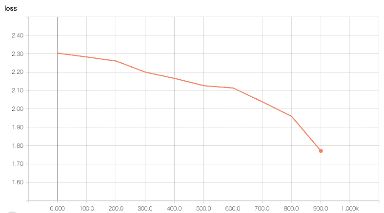

# 第十二章：使用 TensorFlow 进行大规模目标检测

**人工智能**（**AI**）领域的最新突破使深度学习成为焦点。如今，越来越多的组织正在采用深度学习技术分析其数据，而这些数据通常是庞大的。因此，将深度学习框架如 TensorFlow 与大数据平台和管道结合变得至关重要。

2017 年 Facebook 的论文讨论了如何使用 256 个 GPU 在 32 台服务器上训练 ImageNet，仅需一小时([`research.fb.com/wp-content/uploads/2017/06/imagenet1kin1h5.pdf`](https://research.fb.com/wp-content/uploads/2017/06/imagenet1kin1h5.pdf))，以及香港浸会大学最近的论文，他们使用 2,048 个 GPU 在四分钟内训练 ImageNet([`arxiv.org/pdf/1807.11205.pdf`](https://arxiv.org/pdf/1807.11205.pdf))，这些研究证明了分布式 AI 是一个可行的解决方案。

分布式 AI 的主要思想是将任务划分到不同的处理集群中。已经提出了大量的框架用于分布式 AI。我们可以使用分布式 TensorFlow 或 TensorFlowOnSpark，这两种都是流行的分布式 AI 选择。我们将在本章中了解它们各自的优缺点。

在大规模应用计算密集型深度学习时，可能面临巨大的挑战。使用 TensorFlowOnSpark，我们可以在集群中分布这些计算密集型过程，使我们能够在更大规模上进行计算。

在这一章中，我们将探索 Yahoo 的 TensorFlowOnSpark 框架，用于在 Spark 集群上进行分布式深度学习。然后，我们将在一个大规模图像数据集上应用 TensorFlowOnSpark，并训练网络以检测物体。在这一章中，我们将涵盖以下主题：

+   对分布式 AI 的需求

+   对于大数据平台 Apache Spark 的介绍

+   TensorFlowOnSpark – 一种在 Spark 集群上运行 TensorFlow 的 Python 框架

+   使用 TensorFlowOnSpark 和 Sparkdl API 执行目标检测

对于大数据，Spark 是事实上的首选，因此我们将从 Spark 的介绍开始。然后，我们将探索两种流行的选择：分布式 TensorFlow 和 TensorFlowOnSpark。

本章的代码可以在[`github.com/PacktPublishing/TensorFlow-Machine-Learning-Projects/tree/master/Chapter12`](https://github.com/PacktPublishing/TensorFlow-Machine-Learning-Projects/tree/master/Chapter12)找到。

# 介绍 Apache Spark

如果你曾经从事过大数据工作，可能已经知道 Apache Spark 是什么，可以跳过这一部分。但如果你不知道，别担心——我们会介绍基本概念。

Spark 是一个强大、快速、可扩展的实时数据分析引擎，用于大规模数据处理。它是一个开源框架，最初由加利福尼亚大学伯克利分校的 AMPLab 开发，约在 2009 年。到 2013 年，AMPLab 将 Spark 贡献给了 Apache 软件基金会，Apache Spark 社区在 2014 年发布了 Spark 1.0。

社区继续定期发布新版本并为项目带来新特性。在写本书时，我们有 Apache Spark 2.4.0 版本以及活跃的 GitHub 社区。它是一个实时数据分析引擎，允许你将程序分布式执行到多台机器上。

Spark 的美妙之处在于它是 **可扩展**的：它运行在集群管理器之上，允许你在最小修改的情况下使用用 Python（也可以是 Java 或 Scala）编写的脚本。Spark 由多个组件构成。核心部分是 Spark 核心，它负责分发数据处理以及大数据集的映射和归约。上面运行着一些库。以下是 Spark API 中的一些重要组件：

+   **弹性分布式数据集（RDD）**：RDD 是 Spark API 的基本元素。它是一个容错的元素集合，可以并行操作，这意味着 RDD 中的元素可以被集群中的工作节点同时访问和操作。

+   **转换和操作**：在 Spark 的 RDD 上，我们可以执行两种类型的操作，转换和操作。转换以 RDD 作为参数，并返回另一个 RDD。操作以 RDD 作为参数，并返回本地结果。Spark 中的所有转换都是懒加载的，这意味着结果不会立即计算，而是只有当操作需要返回结果时，才会进行计算。

+   **数据框（DataFrames）**：这些与 pandas 的数据框非常相似。像 pandas 一样，我们可以从多种文件格式（如 JSON、Parquet、Hive 等）中读取数据，并使用单个命令对整个数据框执行操作。它们在集群中分布式运行。Spark 使用一个叫做 Catalyst 的引擎来优化它们的使用。

Spark 使用主/从架构。它有一个主节点/进程和多个工作节点/进程。驱动程序 SparkContext 是 Spark 应用程序的核心。它是 Spark 应用程序的主要入口点和主控，它设置内部服务并与 Spark 执行环境建立连接。下图展示了 Spark 的架构：


到目前为止，我们已经介绍了 Apache Spark。这是一个庞大且广泛的话题，我们建议读者参考 Apache 文档获取更多信息：[`spark.apache.org/documentation.html`](https://spark.apache.org/documentation.html)。

# 理解分布式 TensorFlow

TensorFlow 还支持分布式计算，允许我们将图拆分并在不同进程上计算。分布式 TensorFlow 工作方式类似于客户端-服务器模型，或者更具体地说，是主节点-工作节点模型。在 TensorFlow 中，我们首先创建一个工作节点集群，其中一个节点是主节点。主节点负责协调任务分配到不同的工作节点。

当你需要在多台机器（或处理器）上工作时，首先要做的事情是定义它们的名称和工作类型，也就是构建一个机器（或处理器）集群。集群中的每台机器都会被分配一个唯一地址（例如，`worker0.example.com:2222`），并且它们会有一个特定的工作类型，比如`type: master`（参数服务器），或者是工作节点。稍后，TensorFlow 服务器会将特定的任务分配给每个工作节点。为了创建集群，我们首先需要定义集群规格。这是一个字典，用于映射工作进程和任务类型。以下代码创建了一个名为`work`的集群，并有两个工作进程：

```py
import tensorflow as tf
cluster = tf.train.ClusterSpec({
   "worker":["worker0.example.com:2222",
           "worker1.example.com:2222"]
})
```

接下来，我们可以使用`Server`类并指定任务和任务索引来启动进程。以下代码将在`worker1`上启动`worker`任务：

```py
server = tf.train.Server(cluster, job_name = "worker", task_index = 1)
```

我们需要为集群中的每个工作节点定义一个`Server`类。这将启动所有工作节点，使我们准备好进行分发。为了将 TensorFlow 操作分配到特定的任务上，我们将使用`tf.device`来指定哪些任务在哪个工作节点上运行。考虑以下代码，它将在两个工作节点之间分配任务：

```py
import tensorflow as tf

# define Clusters with two workers
cluster = tf.train.ClusterSpec({
    "worker": [
        "localhost:2222",
        "localhost:2223"
         ]})

# define Servers
worker0 = tf.train.Server(cluster, job_name="worker", task_index=0)
worker1 = tf.train.Server(cluster, job_name="worker", task_index=1)

with tf.device("/job:worker/task:1"):
    a = tf.constant(3.0, dtype=tf.float32)
    b = tf.constant(4.0) 
    add_node = tf.add(a,b)

with tf.device("/job:worker/task:0"):
    mul_node = a * b

with tf.Session("grpc://localhost:2222") as sess:
    result = sess.run([add_node, mul_node])
    print(result)
```

上述代码在同一台机器上创建了两个工作节点。在这种情况下，工作被通过`tf.device`函数在两个工作节点之间分配。变量在各自的工作节点上创建；TensorFlow 在任务/工作节点之间插入适当的数据传输。

这是通过创建一个`GrpcServer`来完成的，它通过目标`grpc://localhost:2222`来创建。这个服务器知道如何通过`GrpcChannels`与同一任务中的其他任务进行通信。在下面的截图中，你可以看到前述代码的输出：


本章的代码位于仓库中的`Chapter12/distributed.py`目录下。

这看起来很简单，对吧？但是如果我们想将其扩展到我们的深度学习流水线中呢？

# 通过分布式 TensorFlow 进行深度学习

任何深度学习算法的核心是随机梯度下降优化器。这使得模型能够学习，同时也让学习过程计算开销大。将计算分发到集群中的不同节点应该能减少训练时间。TensorFlow 允许我们拆分计算图，将模型描述到集群中的不同节点，最后合并结果。

这一点通过主节点、工作节点和参数节点在 TensorFlow 中实现。实际的计算由工作节点执行；计算出的参数由参数节点保存，并与工作节点共享。主节点负责在不同工作节点之间协调工作负载。分布式计算中有两种常用的方法：

+   **同步方法**：在这种方法中，工作节点之间分配了小批量数据。每个工作节点都有一个模型副本，并分别计算分配给它的小批量数据的梯度。稍后，梯度在主节点处合并，并同时应用于参数更新。

+   **异步方法**：在这种方法中，模型参数的更新是异步应用的。

这两种方法在下图中展示：


现在，让我们看看如何在深度学习管道中集成分布式 TensorFlow。以下代码基于 Medium 上的文章，[`medium.com/@ntenenz/distributed-tensorflow-2bf94f0205c3`](https://medium.com/@ntenenz/distributed-tensorflow-2bf94f0205c3)：

1.  导入必要的模块。在这里，我们仅导入了必要的模块，以演示将现有深度学习代码转换为分布式 TensorFlow 代码所需的更改：

```py
import sys
import tensorflow as tf
# Add other module libraries you may need
```

1.  定义集群。我们将其创建为一个主节点，地址为 `192.168.1.3`，并且两个工作节点。我们希望将主节点分配到的机器有一个分配给它的 IP 地址，即 `192.168.1.3`，并且我们指定端口为 `2222`。你可以根据你机器的地址修改这些设置：

```py
cluster = tf.train.ClusterSpec(
          {'ps':['192.168.1.3:2222'],
           'worker': ['192.168.1.4:2222',
                      '192.168.1.5:2222',
                      '192.168.1.6:2222',
                      '192.168.1.7:2222']
 })
```

1.  相同的代码会在每台机器上执行，因此我们需要解析命令行参数：

```py
job = sys.argv[1]
task_idx = sys.argv[2]
```

1.  为每个工作节点和主节点创建 TensorFlow 服务器，以便集群中的节点能够进行通信：

```py
server = tf.train.Server(cluster, job_name=job, task_index= int(task_idx))
```

1.  确保变量分配在相同的工作设备上。TensorFlow 的 `tf.train.replica_device_setter()` 函数帮助我们在构造 `Operation` 对象时自动分配设备。同时，我们希望参数服务器在服务器关闭之前等待。这是通过在参数服务器上使用 `server.join()` 方法实现的：

```py
if job == 'ps':  
    # Makes the parameter server wait 
    # until the Server shuts down
    server.join()
else:
    # Executes only on worker machines    
    with tf.device(tf.train.replica_device_setter(cluster=cluster, worker_device='/job:worker/task:'+task_idx)):
        #build your model here like you are working on a single machine

    with tf.Session(server.target):
        # Train the model 
```

你可以通过 GitHub 或 `Chapter12/tensorflow_distributed_dl.py` 目录访问此脚本。请记住，相同的脚本需要在集群中的每台机器上执行，但命令行参数不同。

相同的脚本现在需要在参数服务器和四个工作节点上执行：

使用以下代码在参数服务器（`192.168.1.3:2222`）上执行脚本：

```py
python tensorflow_distributed_dl.py ps 0
```

1.  使用以下代码在 `worker 0`（`192.168.1.4:2222`）上执行脚本：

```py
python tensorflow_distributed_dl.py worker 0
```

1.  使用以下代码在 `worker 1`（`192.168.1.5:2222`）上执行脚本：

```py
python tensorflow_distributed_dl.py worker 1
```

1.  使用以下代码在 `worker 2`（`192.168.1.6:2222`）上执行脚本：

```py
python tensorflow_distributed_dl.py worker 2
```

1.  使用以下代码在 `worker 3`（`192.168.1.6:2222`）上执行脚本：

```py
python tensorflow_distributed_dl.py worker 3
```

分布式 TensorFlow 的主要缺点是我们需要在启动时指定集群中所有节点的 IP 地址和端口。这限制了分布式 TensorFlow 的可扩展性。在下一部分中，您将了解由 Yahoo 构建的 TensorFlowOnSpark API。它提供了一个简化的 API，用于在分布式 Spark 平台上运行深度学习模型。

若要了解更多关于分布式 TensorFlow 的内容，建议您阅读 Google REsearch 团队的论文《*TensorFlow:* *Large Scale Machine Learning on Heterogeneous Distributed Systems*》（2012 年 NIPS）（[`download.tensorflow.org/paper/whitepaper2015.pdf`](http://download.tensorflow.org/paper/whitepaper2015.pdf)）。

# 了解 TensorFlowOnSpark

2016 年，Yahoo 开源了 TensorFlowOnSpark，这是一个用于在 Spark 集群上执行基于 TensorFlow 的分布式深度学习的 Python 框架。从那时起，它经历了很多开发变化，是分布式深度学习框架中最活跃的开源项目之一。

**TensorFlowOnSpark**（**TFoS**）框架允许您在 Spark 程序中运行分布式 TensorFlow 应用。它运行在现有的 Spark 和 Hadoop 集群上。它可以使用现有的 Spark 库，如 SparkSQL 或 MLlib（Spark 的机器学习库）。

TFoS 是自动化的，因此我们无需将节点定义为 PS 节点，也无需将相同的代码上传到集群中的所有节点。只需进行少量修改，我们就可以运行现有的 TensorFlow 代码。它使我们能够以最小的改动扩展现有的 TensorFlow 应用。它支持所有现有的 TensorFlow 功能，如同步/异步训练、数据并行和 TensorBoard。基本上，它是 TensorFlow 代码的 PySpark 封装。它通过 Spark 执行器启动分布式 TensorFlow 集群。为了支持 TensorFlow 的数据摄取，它添加了`feed_dict`和`queue_runner`，允许直接从 TensorFlow 访问 HDFS。

# 理解 TensorFlowOnSpark 的架构

以下图示展示了 TFoS 的架构。我们可以看到，TFoS 在张量通信中不涉及 Spark 驱动程序，提供与独立 TensorFlow 集群相同的可扩展性：


TFoS 提供了两种输入模式，用于训练和推理时获取数据：

+   **Spark RDD**：Spark RDD 数据被传递到每个 Spark 执行器。执行器将数据通过`feed_dict`传递给 TensorFlow 图。然而，在这种模式下，TensorFlow 工作节点的失败对 Spark 是隐藏的。

+   **TensorFlow QueueRunners**：在这里，TensorFlow 工作节点在前台运行。TFoS 利用 TensorFlow 的文件读取器和 QueueRunners，直接从 HDFS 文件读取数据。TensorFlow 工作节点的失败会被视为 Spark 任务，并通过检查点进行恢复。

# 深入探讨 TFoS API

使用 TFoS 可以分为三个基本步骤：

1.  启动 TensorFlow 集群。我们可以使用`TFCluster.run`来启动集群：

```py
cluster = TFCluster.run(sc, map_fn, args, num_executors, num_ps, tensorboard, input_mode)
```

1.  将数据输入 TensorFlow 应用程序。数据用于训练和推理。为了训练，我们使用`train`方法：

```py
cluster.train(dataRDD, num_epochs)
```

我们通过`cluster.inference(dataRDD)`来执行推理。

1.  最后，通过`cluster.shutdown()`关闭 TensorFlow 集群。

我们可以修改任何 TensorFlow 程序以与 TFoS 一起使用。在接下来的部分中，我们将介绍如何使用 TFoS 训练一个模型来识别手写数字。

# 使用 TFoS 进行手写数字识别

在本节中，我们将介绍如何将 TensorFlow 代码转换为在 TFoS 上运行。为此，首先，我们需要在 Amazon AWS 上构建一个 EC2 集群。一个简单的方法是使用 Flintrock，这是一个从本地机器启动 Apache Spark 集群的 CLI 工具。

以下是完成本节所需的先决条件：

+   Hadoop

+   PySpark

+   Flintrock

+   Python

+   TensorFlow

+   TensorFlowOnSpark

现在，让我们看看如何实现这一点。我们使用的是 MNIST 数据集（[`yann.lecun.com/exdb/mnist/`](http://yann.lecun.com/exdb/mnist/)）。以下代码来自 TensorFlowOnSpark 的 GitHub 仓库。该仓库包含文档链接和更多示例（[`github.com/yahoo/TensorFlowOnSpark`](https://github.com/yahoo/TensorFlowOnSpark)）：

1.  在`main(argv, ctx)`函数中定义模型架构和训练，其中`argv`参数包含命令行传递的参数，而`ctx`包含节点元数据，如`job`和`task_idx`。`cnn_model_fn`模型函数是定义的 CNN 模型：

```py
def main(args, ctx):
    # Load training and eval data
    mnist = tf.contrib.learn.datasets.mnist.read_data_sets(args.data_dir)
    train_data = mnist.train.images # Returns np.array
    train_labels = np.asarray(mnist.train.labels, dtype=np.int32)
    eval_data = mnist.test.images # Returns np.array
    eval_labels = np.asarray(mnist.test.labels, dtype=np.int32)

    # Create the Estimator
    mnist_classifier = tf.estimator.Estimator(model_fn=cnn_model_fn, model_dir=args.model)

    # Set up logging for predictions
    # Log the values in the "Softmax" tensor with label "probabilities"

    tensors_to_log = {"probabilities": "softmax_tensor"}
    logging_hook = tf.train.LoggingTensorHook( tensors=tensors_to_log, every_n_iter=50)

    # Train the model
    train_input_fn = tf.estimator.inputs.numpy_input_fn(
         x={"x": train_data}, y=train_labels, 
         batch_size=args.batch_size, num_epochs=None, 
         shuffle=True)

      eval_input_fn = tf.estimator.inputs.numpy_input_fn(
         x={"x": eval_data},
         y=eval_labels,
         num_epochs=1,
         shuffle=False)

    #Using tf.estimator.train_and_evaluate
    train_spec = tf.estimator.TrainSpec(
        input_fn=train_input_fn, 
        max_steps=args.steps, 
        hooks=[logging_hook])
    eval_spec = tf.estimator.EvalSpec(
        input_fn=eval_input_fn)
    tf.estimator.train_and_evaluate(
        mnist_classifier, train_spec, eval_spec)

```

1.  在`if __name__=="__main__"`块中，添加以下导入：

```py
from pyspark.context import SparkContext
from pyspark.conf import SparkConf
from tensorflowonspark import TFCluster
import argparse
```

1.  启动 Spark Driver 并初始化 TensorFlowOnSpark 集群：

```py
sc = SparkContext(conf=SparkConf()
        .setAppName("mnist_spark"))
executors = sc._conf.get("spark.executor.instances")
num_executors = int(executors) if executors is not None else 1
```

1.  解析参数：

```py
parser = argparse.ArgumentParser()
parser.add_argument("--batch_size", 
            help="number of records per batch", 
            type=int, default=100)
parser.add_argument("--cluster_size", 
            help="number of nodes in the cluster", 
            type=int, default=num_executors)
parser.add_argument("--data_dir", 
            help="path to MNIST data", 
            default="MNIST-data")
parser.add_argument("--model", 
            help="path to save model/checkpoint", 
            default="mnist_model")
parser.add_argument("--num_ps", 
            help="number of PS nodes in cluster", 
            type=int, default=1)
parser.add_argument("--steps", 
            help="maximum number of steps", 
            type=int, default=1000)
parser.add_argument("--tensorboard", 
            help="launch tensorboard process", 
            action="store_true")

args = parser.parse_args()
```

1.  使用`TFCluster.run`来管理集群：

```py
cluster = TFCluster.run(sc, main, args, 
        args.cluster_size, args.num_ps, 
        tensorboard=args.tensorboard, 
        input_mode=TFCluster.InputMode.TENSORFLOW, 
        log_dir=args.model, master_node='master')
```

1.  训练完成后，关闭集群：

```py
cluster.shutdown()
```

完整代码可以在 GitHub 仓库的`Chapter12/mnist_TFoS.py`目录中找到。

要在 EC2 集群上执行代码，您需要使用`spark-submit`将其提交到 Spark 集群：

```py
${SPARK_HOME}/bin/spark-submit \
--master ${MASTER} \
--conf spark.cores.max=${TOTAL_CORES} \
--conf spark.task.cpus=${CORES_PER_WORKER} \
--conf spark.task.maxFailures=1 \
--conf spark.executorEnv.JAVA_HOME="$JAVA_HOME" \
${TFoS_HOME}/examples/mnist/estimator/mnist_TFoS.py \
--cluster_size ${SPARK_WORKER_INSTANCES} \
--model ${TFoS_HOME}/mnist_model
```

该模型在 EC2 集群上用两台工作节点训练了 6.6 分钟：


我们可以使用 TensorBoard 来可视化模型架构。一旦代码成功运行，事件文件会被创建，并且可以在 TensorBoard 中查看。

当我们可视化损失时，可以看到随着网络学习，损失逐渐减少：



该模型在测试数据集上只用了 1,000 步就获得了 75%的准确率，且使用了一个非常基础的 CNN 模型。我们可以通过使用更好的模型架构和调整超参数进一步优化结果。

# 使用 TensorFlowOnSpark 和 Sparkdl 进行物体检测

Apache Spark 提供了一个高级 API Sparkdl，用于在 Python 中进行可扩展的深度学习。在本节中，我们将使用 Sparkdl API。在本节中，您将学习如何在预训练的 Inception v3 模型基础上构建一个模型，用于检测汽车和公交车。使用预训练模型的技术称为 **迁移学习**。

# 迁移学习

人类的学习是一个持续的过程——我们今天学到的知识是建立在过去学习的基础上的。例如，如果你会骑自行车，你可以将相同的知识扩展到骑摩托车或开汽车。驾驶规则是一样的——唯一不同的是控制面板和执行器。然而，在深度学习中，我们通常是从头开始。是否可以利用模型在一个领域解决问题时获得的知识，来解决另一个相关领域中的问题呢？

是的，确实可以，这就是迁移学习。虽然该领域仍在进行大量研究，但在计算机视觉领域，迁移学习的应用已取得了巨大的成功。这是因为对于计算机视觉任务，**卷积神经网络**（**CNNs**）被优先使用，因为它们擅长从图像中提取特征（例如，较低层次的特征如线条、圆圈和方块，以及较高层次的抽象特征如耳朵和鼻子）。因此，在学习一种类型的图像数据集时，卷积层提取的特征可以在其他相似领域的图像中重复使用。这有助于减少训练时间。

在本节中，我们将使用 Inception v3（[`arxiv.org/pdf/1512.00567v1.pdf`](https://arxiv.org/pdf/1512.00567v1.pdf)），一个经过训练的最先进的 CNN，使用的是 ImageNet 数据集。ImageNet（[`image-net.org/`](http://image-net.org/)）包含超过 1400 万张标注的高分辨率手工标注图像，这些图像被分类为 22,000 个类别。Inception v3 是在其子集上训练的，包含大约 130 万张图像和 1,000 个类别。

在迁移学习方法中，您保留特征提取的 CNN 层，但将分类器层替换为新的分类器。然后在新的图像上训练这个新的分类器。一般有两种方法：要么只训练新的分类器，要么微调整个网络。在第一种情况下，我们通过将新数据集输入 CNN 层来提取 **瓶颈特征**。然后将提取的瓶颈特征用于训练最终的分类器。在第二种情况下，我们在训练数据集上训练整个网络，原始的 CNN 以及新的分类器。

# 理解 Sparkdl 接口

要访问深度学习管道中的 Spark 功能，我们需要使用 Spark 驱动程序。自 Spark 2.0.0 起，我们有一个单一的入口点，使用 `SparkSession`。最简单的方法是使用 `builder`：

```py
SparkSession.builder().getOrCreate()
```

这样我们就可以获取现有的会话或创建一个新会话。在实例化时，我们可以使用 `.config()`、`.master()` 和 `.appName()` 方法来设置配置选项、设置 Spark 主节点和设置应用程序名称。

为了读取和处理图片，Sparkdl 提供了 `ImageSchema` 类。在其众多方法中，我们将使用 `readImages` 方法读取图片目录。它返回一个包含单个列 `image` 的 Spark DataFrame，其中存储了图片。

我们可以使用转换来添加或删除 Spark DataFrame 中的列/行。本节中的示例代码使用 `withColumn` 转换添加了一个名为 `label` 的列，并为我们的数据集分配了标签类。就像使用 pandas DataFrame 一样，我们可以通过 `show()` 方法查看 Spark DataFrame 的行。Spark DataFrame 还可以被拆分或组合在一起。

Sparkdl API 提供了方法来实现快速的迁移学习。它提供了 `DeepImageFeaturizer` 类，自动剥离预训练模型中的分类器层，并使用预训练 CNN 层的特征（瓶颈特征）作为新分类器的输入。

使用 Sparkdl 的一个优势是我们可以通过相同的 `SparkSession` 实例访问所有 Spark API，甚至包括其机器学习 API MLlib。通过 MLlib，我们可以轻松地将多个算法结合成一个管道。Spark 机器学习 API MLlib 还提供对各种分类和回归方法的支持。

# 构建一个物体检测模型

现在我们将使用 TFoS 和 Sparkdl 编写一些代码。数据集由从 Google 图片搜索中整理出来的公交车和汽车图片组成。目标是训练一个模型，使其能够区分汽车和公交车。以下是您需要的先决条件，以确保此代码能够运行：

+   PySpark

+   Python

+   TensorFlow

+   TensorFlowOnSpark

+   Pillow

+   Keras

+   TensorFrames

+   Wrapt

+   pandas

+   FindSpark

+   py4j

首先，让我们查看一下我们的数据集。Inception v3 在包含 1,000 类别的 ImageNet 数据上进行了训练，其中也包含了各种车辆的图片。我们有 49 张公交车的图片和 41 张汽车的图片。这里，您可以看到数据集中的一些示例图片：


现在，让我们构建代码：

1.  这次，我们不使用 `spark-submit`。相反，我们像运行任何标准的 Python 代码一样运行代码。因此，我们将在代码中定义 Spark 驱动程序的位置和 Spark 深度学习包，并使用 PySpark 的 `SparkSession` 构建器创建一个 Spark 会话。这里需要记住的一点是分配给堆的内存：Spark 执行器和 Spark 驱动程序。这个值应该基于您机器的规格：

```py
import findspark
findspark.init('/home/ubuntu/spark-2.4.0-bin-hadoop2.7')

import os
SUBMIT_ARGS = "--packages databricks:spark-deep-learning:1.3.0-spark2.4-s_2.11 pyspark-shell"
os.environ["PYSPARK_SUBMIT_ARGS"] = SUBMIT_ARGS

from pyspark.sql import SparkSession
spark = SparkSession.builder \
    .appName("ImageClassification") \
    .config("spark.executor.memory", "70g") \
    .config("spark.driver.memory", "50g") \
    .config("spark.memory.offHeap.enabled",True) \
    .config("spark.memory.offHeap.size","16g") \
    .getOrCreate()
```

1.  图片通过 PySpark 的 `ImageSchema` 类加载到 Spark DataFrame 中。公交车和汽车的图片分别加载到不同的 Spark DataFrame 中：

```py
import pyspark.sql.functions as f
import sparkdl as dl
from pyspark.ml.image import ImageSchema

dfbuses = ImageSchema.readImages('buses/').withColumn('label', f.lit(0))
dfcars = ImageSchema.readImages('cars/').withColumn('label', f.lit(1))
```

1.  你可以在这里看到 Spark DataFrame 的前五行：

```py
dfbuses.show(5)
dfcars.show(5)
```

前面代码的输出结果如下：


1.  我们将数据集划分为训练集和测试集，比例为 60%的训练集和 40%的测试集。请记住，这些值是随机的，你可以根据需要进行调整：

```py
trainDFbuses, testDFbuses = dfbuses.randomSplit([0.60,0.40], seed = 123)
trainDFcars, testDFcars = dfcars.randomSplit([0.60,0.40], seed = 122)
```

1.  公交车和汽车的训练数据集已合并。测试数据集也进行了相同的处理：

```py
trainDF = trainDFbuses.unionAll(trainDFcars)
testDF = testDFbuses.unionAll(testDFcars)
```

1.  我们使用 Sparkdl API 获取预训练的 Inception v3 模型，并在 Inception 的 CNN 层上添加了一个逻辑回归器。现在，我们将在我们的数据集上训练这个模型：

```py
from pyspark.ml.classification import LogisticRegression
from pyspark.ml import Pipeline
vectorizer = dl.DeepImageFeaturizer(inputCol="image",
         outputCol="features", 
        modelName="InceptionV3")

logreg = LogisticRegression(maxIter=30, labelCol="label")
pipeline = Pipeline(stages=[vectorizer, logreg])
pipeline_model = pipeline.fit(trainDF)
```

1.  让我们看看训练好的模型在测试数据集上的表现。我们使用完美的混淆矩阵来进行评估：

```py
predictDF = pipeline_model.transform(testDF)
predictDF.select('prediction', 'label').show(n = testDF.toPandas().shape[0], truncate=False)
predictDF.crosstab('prediction', 'label').show()
```

前面代码的输出结果如下：


1.  对于测试数据集，模型的准确率达到了 100%：

```py
from pyspark.ml.evaluation import MulticlassClassificationEvaluator
scoring = predictDF.select("prediction", "label")
accuracy_score = MulticlassClassificationEvaluator(metricName="accuracy")
rate = accuracy_score.evaluate(scoring)*100
print("accuracy: {}%" .format(round(rate,2)))
```

我们的模型表现如此出色，是因为我们作为迁移学习基础模型使用的 Inception v3 模型已经在大量的车辆图像上进行了训练。然而，需要提醒的是，100%的准确率并不意味着这是最好的模型，只是说明它在当前测试图像上表现良好。

Sparkdl 是由 DataBricks 开发的，属于深度学习管道的一部分。它提供了用于 Python 中基于 Apache Spark 的可扩展深度学习的高级 API。你可以在这里了解更多关于它的功能及如何使用：[`github.com/databricks/spark-deep-learning`](https://github.com/databricks/spark-deep-learning)。

# 总结

深度学习模型在训练数据集较大时（大数据）能提供更好的性能。训练大数据模型在计算上开销很大。这个问题可以通过分治法来解决：我们将大量的计算任务分配给集群中的多台机器，换句话说，就是分布式人工智能。

实现这一目标的一种方法是使用 Google 的分布式 TensorFlow，这是一个帮助将模型训练分配到集群中不同工作机器的 API。你需要指定每台工作机器和参数服务器的地址。这使得模型扩展变得困难且繁琐。

这个问题可以通过使用 TensorFlowOnSpark API 来解决。通过对已有的 TensorFlow 代码进行最小的修改，我们可以使其在集群上运行。Spark 框架处理执行器机器和主节点之间的分配，避免了用户关注细节，同时提供了更好的可扩展性。

在本章中，使用了 TensorFlowOnSpark API 来训练一个模型，以识别手写数字。这解决了可扩展性的问题，但我们仍然需要处理数据，以确保它以正确的格式提供给训练。除非你对 Spark 基础设施，尤其是 Hadoop，十分熟悉，否则这可能是一个困难的任务。

为了降低难度，我们可以利用另一个 API，Sparkdl，它提供了基于 Spark 的完整深度学习训练管道，使用 Spark DataFrames 进行训练。最后，本章使用了 Sparkdl API 进行目标检测。一个模型在预训练的 Inception v3 模型基础上构建，用于分类公共汽车和汽车的图像。

在下一章中，你将学习如何使用 RNN 生成书籍脚本。谁知道呢——它也许会赢得布克奖！
