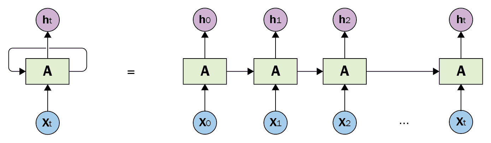

# 第十三章：使用 LSTM 生成书籍脚本

**自然语言生成**（**NLG**），作为人工智能的一个子领域，是从各种数据输入中生成可读的文本的自然语言处理任务。这是一个活跃的研究领域，近年来已获得广泛关注。

机器生成自然语言的能力可以有广泛的应用，包括手机中的文本自动补全功能、文档摘要生成，甚至是为喜剧创作新剧本。Google 的智能回复也使用了一种类似的技术来在你写电子邮件时提供回复建议。

在本章中，我们将研究一个 NLG 任务——从另一本名为《*Mastering PostgreSQL 10*》的 Packt 书籍中生成书籍脚本。我们从这本书中挑选了近 100 页，移除了所有图表、表格和 SQL 代码。数据量相当大，足以让神经网络学习数据集的细微差别。

我们将通过以下主题学习如何使用强化学习神经网络生成书籍脚本：

+   循环神经网络和 LSTM 简介

+   书籍脚本数据集的描述

+   使用 LSTM 建模并生成新的书籍脚本

# 理解循环神经网络

**循环神经网络**（**RNNs**）已成为任何涉及序列数据的任务中极为流行的选择。RNNs 的核心理念是利用数据中存在的序列信息。通常情况下，每个神经网络假设所有输入彼此独立。然而，如果我们要预测序列中的下一个词或时间序列中的下一个点，就必须使用基于之前使用的词或时间序列中的历史点的信息。

一种理解循环神经网络（RNNs）概念的方法是，它们具有一个内存，能够存储关于序列中历史数据的信息。理论上，RNNs 可以记住任意长序列的历史，但在实际应用中，它们在需要保留超过几个步骤的历史信息的任务中表现不佳。

RNN 的典型结构如下：



在前面的图示中，*Xt* 是不同时间步长的序列值。RNNs 被称为**循环**，因为它们对序列中的每个元素应用相同的操作，输出依赖于前一步的结果。可以清楚地观察到单元之间的连接，这些连接帮助将信息从前一步传递到下一步。

如前所述，RNNs 并不擅长捕捉长期依赖关系。RNNs 有不同的变种，其中一些如下：

+   **长短期记忆**（**LSTMs**）

+   **门控循环单元**（**GRU**）

+   盯孔 LSTM（Peephole LSTMs）

与传统的 RNN 相比，LSTM 在捕捉长期依赖方面表现更好。LSTM 在诸如单词/句子预测、图像字幕生成，甚至是需要长期依赖的时间序列数据预测等任务中变得非常流行。以下是使用 LSTM 的一些优点：

+   擅长建模涉及长期依赖的任务

+   不同时间步之间的权重共享大大减少了模型中的参数数量

+   比传统的 RNN 更少受到梯度消失和梯度爆炸问题的困扰

以下是使用 LSTM 的一些缺点：

+   LSTM 对数据有较高需求。通常需要大量的训练数据才能产生有意义的结果。

+   训练速度比传统神经网络慢。

+   存在计算效率更高的 RNN 变种，如 GRU，它们能实现与 LSTM 相似的性能。

本章讨论的内容不涉及其他类型的 RNN。如果您感兴趣，可以参考*《深度学习》*书中的序列建模章节([`www.deeplearningbook.org/contents/rnn.html`](https://www.deeplearningbook.org/contents/rnn.html))。

# 数据预处理

如前所述，本项目使用的数据集来自一本流行的 Packt 书籍，书名为*《Mastering PostgreSQL 10》*，作者是 Hans-Jürgen Schönig ([`www.cybertec-postgresql.com`](https://www.cybertec-postgresql.com))。我们考虑了书籍前 100 页的文本，排除了所有图形、表格和 SQL 代码。清理后的数据集与代码一起存储在一个文本文件中。数据集包含近 44,000 个单词，足以用来训练模型。以下是脚本中的几行：

*"PostgreSQL 概述*

*PostgreSQL 是世界上最先进的开源数据库系统之一，具有许多功能，广泛受到开发者和系统管理员的使用。从 PostgreSQL 10 开始，许多新功能已被添加到 PostgreSQL 中，这些新功能极大地促进了这一卓越开源产品的成功。在本书中，将详细讲解和讨论许多这些酷炫的功能。*

*在本章中，您将了解 PostgreSQL 以及 PostgreSQL 10.0 及更高版本中的一些酷炫的新功能。所有相关的新功能将详细讲解。鉴于代码修改的数量以及 PostgreSQL 项目的庞大规模，这个功能列表显然远非完整，因此我尝试专注于最重要、最相关的大多数人都会用到的方面。*

*本章中概述的功能将分为以下几个类别：数据库管理*

*与 SQL 和开发者相关的备份、恢复和复制、性能相关主题*

*PostgreSQL 10.0 中的新功能。*

*PostgreSQL 10.0 于 2017 年底发布，是第一个采用 PostgreSQL 社区引入的新编号方案的版本。从现在开始，主要版本的发布方式将发生变化，因此，PostgreSQL 之后的下一个主要版本*

*10.0 不会是 10.1，而是 PostgreSQL 11。版本 10.1 和 10.2 只是服务版本，只会包含错误修复。*

为了预处理数据并为 LSTM 模型做准备，请按照以下步骤进行：

1.  **标记化标点符号**：在预处理过程中，我们将拆分标准设定为使用空格分隔的单词。然而，在这种情况下，神经网络将难以区分像“Hello”和“Hello!”这样的词。由于这个限制，需要在数据集中对标点符号进行标记化。例如，`!` 将被映射为 `_Sym_Exclamation_`。在代码中，我们实现了一个名为 `define_tokens` 的函数。它用于创建一个字典，在这个字典中，每个标点符号是键，对应的标记是值。这个示例中，我们将为以下符号创建标记：

+   +   句号 ( . )

    +   逗号 ( , )

    +   引号 ( " )

    +   分号 ( ; )

    +   感叹号 ( ! )

    +   问号 ( ? )

    +   左括号 ( ( )

    +   右括号 ( ) )

    +   连字符 ( -- )

    +   返回 ( \n )

避免使用数据集中可能出现的词语。例如，`?` 被替换为 `_Sym_Question_`，这在数据集中不是一个单词。

1.  **转为小写并分割**：我们必须将文本中的所有大写字母转换为小写字母，以便神经网络能够学习到“Hello”和“hello”实际上是相同的两个词。由于神经网络的基本输入单元是单词，下一步就是将文本中的句子拆分为单词。

1.  **映射创建**：神经网络不能直接接受文本作为输入，因此我们需要将这些单词映射到索引/ID。为此，我们必须创建两个字典，如下所示：

+   +   `Vocab_to_int`：将文本中的每个单词映射到其唯一的 ID

    +   `Int_to_vocab`：反向字典，将 ID 映射到对应的单词

# 定义模型

在使用预处理数据训练模型之前，我们先了解一下这个问题的模型定义。在代码中，我们在 `model.py` 文件中定义了一个模型类。该类包含四个主要部分，具体如下：

+   **输入**：我们在模型中定义了 TensorFlow 的占位符，用于输入（X）和目标（Y）。

+   **网络定义**：该模型的网络有四个组件，具体如下：

    +   **初始化 LSTM 单元**：为此，我们首先将两层 LSTM 堆叠在一起。然后，我们将 LSTM 的大小设置为代码中定义的 `RNN_SIZE` 参数。接着，RNN 被初始化为零状态。

    +   **词嵌入**：我们使用词嵌入来对文本中的词进行编码，而不是使用 one-hot 编码。这样做的主要目的是减少训练集的维度，从而帮助神经网络更快地学习。我们从均匀分布中为词汇表中的每个词生成嵌入，并使用 TensorFlow 的`embedding_lookup`函数来获取输入数据的嵌入序列。

    +   **构建 LSTM**：为了获得 LSTM 的最终状态，我们使用 TensorFlow 的`tf.nn.dynamic_rnn`函数，并传入初始单元和输入数据的嵌入。

    +   **概率生成**：在获得 LSTM 的最终状态和输出后，我们将其通过一个全连接层生成预测的 logits。我们使用`softmax`函数将这些 logits 转换为概率估计。代码如下：

+   **序列损失**：我们必须定义损失函数，在这个情况下是序列损失。这实际上只是对一系列 logits 进行加权交叉熵损失计算。我们在批次和时间上对观测值进行等权重处理。

+   **优化器**：我们将使用 Adam 优化器，并保持其默认参数。我们还将裁剪梯度，确保其在-1 到 1 的范围内。梯度裁剪是递归神经网络中的常见现象。当梯度在时间上反向传播时，如果它们不断地与小于 1 的数相乘，梯度可能会消失；或者如果与大于 1 的数相乘，梯度可能会爆炸。梯度裁剪通过将梯度限制在-1 到 1 之间，帮助解决这两个问题。

# 训练模型

在理解训练循环的实现之前，让我们仔细看看如何生成数据批次。

众所周知，神经网络使用批次来加速模型训练，并减少内存消耗。批次是原始数据集的样本，用于网络的正向传播和反向传播。正向传播指的是将输入与网络中不同层的权重相乘并获得最终输出的过程。反向传播则是基于正向传播输出的损失，更新神经网络中的权重。

在这个模型中，由于我们是在根据一组前置词来预测下一个词组以生成电视脚本，目标基本上是原始训练数据集中下一个词（根据序列长度）的几个词。我们来看一个例子，假设训练数据集包含如下内容：

*The quick brown fox jumps over the lazy dog*

如果使用的序列长度（处理的词数）是 4，那么以下内容成立：

+   X 是每四个词的序列，例如，[*The quick brown fox*, *quick brown fox jumps* …..]。

+   Y 是每四个词的序列，跳过第一个词，例如，[*quick brown fox jumps*, *brown fox jumps over* …]。

# 定义并训练一个文本生成模型

1.  使用`load_data`函数加载保存的文本数据以进行预处理：

```py
 def load_data():
 """
 Loading Data
 """
 input_file = os.path.join(TEXT_SAVE_DIR)
 with open(input_file, "r") as f:
 data = f.read()

return data
```

1.  实现`define_tokens`，如本章*数据预处理*部分所定义。这将帮助我们创建一个关键字及其相应 tokens 的字典：

```py
 def define_tokens():
 """
 Generate a dict to turn punctuation into a token. Note that Sym before each text denotes Symbol
 :return: Tokenize dictionary where the key is the punctuation and the value is the token
 """
 dict = {'.':'_Sym_Period_',
 ',':'_Sym_Comma_',
 '"':'_Sym_Quote_',
 ';':'_Sym_Semicolon_',
 '!':'_Sym_Exclamation_',
 '?':'_Sym_Question_',
 '(':'_Sym_Left_Parentheses_',
 ')':'_Sym_Right_Parentheses_',
 '--':'_Sym_Dash_',
 '\n':'_Sym_Return_',
 }
 return dict
```

我们创建的字典将用于用相应的 tokens 和分隔符（此处为空格）替换数据集中的标点符号。例如，`Hello!`将被替换为`Hello _Sym_Exclamation_`。

注意，`Hello`和 token 之间有一个空格。这将帮助 LSTM 模型将每个标点符号当作独立的单词来处理。

1.  使用`Vocab_to_int`和`int_to_vocab`字典帮助将单词映射到索引/ID。我们这样做是因为神经网络不接受文本作为输入：

```py
 def create_map(input_text):
 """
 Map words in vocab to int and vice versa for easy lookup
 :param input_text: TV Script data split into words
 :return: A tuple of dicts (vocab_to_int, int_to_vocab)
 """
 vocab = set(input_text)
 vocab_to_int = {c: i for i, c in enumerate(vocab)}
 int_to_vocab = dict(enumerate(vocab))
 return vocab_to_int, int_to_vocab
```

1.  将前面所有步骤结合起来，创建一个函数来预处理我们可用的数据：

```py
def preprocess_and_save_data():
 """
 Preprocessing the TV Scripts Dataset
 """
 generate_text_data_from_csv()
 text = load_data()
 text= text[14:] # Ignoring the STARTraw_text part of the dataset
 token_dict = define_tokens()
 for key, token in token_dict.items():
 text = text.replace(key, ' {} '.format(token))

text = text.lower()
 text = text.split()

vocab_to_int, int_to_vocab = create_map(text)
 int_text = [vocab_to_int[word] for word in text]
 pickle.dump((int_text, vocab_to_int, int_to_vocab, token_dict), open('processed_text.p', 'wb'))
```

然后我们将为映射字典生成整数文本，并将预处理后的数据和相关字典存储到`pickle`文件中。

1.  为了定义我们的模型，我们将在`model.py`文件中创建一个模型类。我们将首先定义输入：

```py
 with tf.variable_scope('Input'):
 self.X = tf.placeholder(tf.int32, [None, None], name='input')
 self.Y = tf.placeholder(tf.int32, [None, None], name='target')
 self.input_shape = tf.shape(self.X)
```

我们必须将变量类型定义为整数，因为数据集中的单词已被转换为整数。

1.  通过定义 LSTM 单元、词嵌入、构建 LSTM 和概率生成来定义我们的模型网络。为了定义 LSTM 单元，堆叠两个 LSTM 层，并将 LSTM 的大小设置为`RNN_SIZE`参数。将 RNN 的值设置为 0：

```py
 lstm = tf.contrib.rnn.BasicLSTMCell(RNN_SIZE)
 cell = tf.contrib.rnn.MultiRNNCell([lstm] * 2) # Defining two LSTM layers for this case
 self.initial_state = cell.zero_state(self.input_shape[0], tf.float32)
 self.initial_state = tf.identity(self.initial_state, name="initial_state")
```

为了减少训练集的维度并提高神经网络的速度，使用以下代码生成并查找嵌入：

```py
embedding = tf.Variable(tf.random_uniform((self.vocab_size, RNN_SIZE), -1, 1))
embed = tf.nn.embedding_lookup(embedding, self.X)
```

运行`tf.nn.dynamic_rnn`函数以找到 LSTM 的最终状态：

```py
outputs, self.final_state = tf.nn.dynamic_rnn(cell, embed, initial_state=None, dtype=tf.float32)
self.final_state = tf.identity(self.final_state, name='final_state')
```

使用`softmax`函数将 LSTM 最终状态获得的 logits 转换为概率估计：

```py
self.final_state = tf.identity(self.final_state, name='final_state')
self.predictions = tf.contrib.layers.fully_connected(outputs, self.vocab_size, activation_fn=None)
# Probabilities for generating words
probs = tf.nn.softmax(self.predictions, name='probs')
```

1.  为 logits 序列定义加权交叉熵或序列损失，这有助于进一步微调我们的网络：

```py
 def define_loss(self):
 # Defining the sequence loss
 with tf.variable_scope('Sequence_Loss'):
 self.loss = seq2seq.sequence_loss(self.predictions, self.Y,
 tf.ones([self.input_shape[0], self.input_shape[1]]))
```

1.  使用默认参数实现 Adam 优化器，并将梯度裁剪到`-1`到`1`的范围内，以避免在反向传播过程中梯度消失：

```py
 def define_optimizer(self):
 with tf.variable_scope("Optimizer"):
 optimizer = tf.train.AdamOptimizer(LEARNING_RATE)
 # Gradient Clipping
 gradients = optimizer.compute_gradients(self.loss)
 capped_gradients = [(tf.clip_by_value(grad, -1., 1.), var) for grad, var in gradients]
 self.train_op = optimizer.apply_gradients(capped_gradients)
```

1.  使用`generate_batch_data`函数定义序列长度。这有助于生成神经网络训练所需的批次：

    +   该函数的输入将是编码为整数的文本数据、批次大小和序列长度。

    +   输出将是一个形状为[#批次，2，批次大小，序列长度]的 numpy 数组。每个批次包含两个部分，定义如下：

        +   X 的形状为[批次大小，序列长度]。

        +   Y 的形状为[批次大小，序列长度]：

```py
 def generate_batch_data(int_text):
 """
 Generate batch data of x (inputs) and y (targets)
 :param int_text: Text with the words replaced by their ids
 :return: Batches as a Numpy array
 """
 num_batches = len(int_text) // (BATCH_SIZE * SEQ_LENGTH)

x = np.array(int_text[:num_batches * (BATCH_SIZE * SEQ_LENGTH)])
y = np.array(int_text[1:num_batches * (BATCH_SIZE * SEQ_LENGTH) + 1])

x_batches = np.split(x.reshape(BATCH_SIZE, -1), num_batches, 1) y_batches = np.split(y.reshape(BATCH_SIZE, -1), num_batches, 1)
 batches = np.array(list(zip(x_batches, y_batches)))
 return batches
```

1.  使用以下参数训练模型：

+   +   训练轮次 = 500

    +   学习率 = 0.001

    +   批次大小 = 128

    +   RNN 大小 = 128

    +   序列长度 = 32：

```py
def train(model,int_text):
# Creating the checkpoint directory
 if not os.path.exists(CHECKPOINT_PATH_DIR):
 os.makedirs(CHECKPOINT_PATH_DIR)

batches = generate_batch_data(int_text)
with tf.Session() as sess:
 if RESTORE_TRAINING:
 saver = tf.train.Saver()
 ckpt = tf.train.get_checkpoint_state(CHECKPOINT_PATH_DIR)
 saver.restore(sess, ckpt.model_checkpoint_path)
 print('Model Loaded')
 start_epoch = int(str(ckpt.model_checkpoint_path).split('-')[-1])
 else:
 start_epoch = 0
 tf.global_variables_initializer().run()
 print('All variables initialized')

for epoch in range(start_epoch, NUM_EPOCHS):
 saver = tf.train.Saver()
 state = sess.run(model.initial_state, {model.X: batches[0][0]})

for batch, (x, y) in enumerate(batches):
 feed = {
 model.X: x,
 model.Y: y,
 model.initial_state: state}
 train_loss, state, _ = sess.run([model.loss, model.final_state, model.train_op], feed)

if (epoch * len(batches) + batch) % 200 == 0:
 print('Epoch {:>3} Batch {:>4}/{} train_loss = {:.3f}'.format(
 epoch,
 batch,
 len(batches),
 train_loss))
 # Save Checkpoint for restoring if required
 saver.save(sess, CHECKPOINT_PATH_DIR + '/model.tfmodel', global_step=epoch + 1)

# Save Model
 saver.save(sess, SAVE_DIR)
 print('Model Trained and Saved')
 save_params((SEQ_LENGTH, SAVE_DIR))

```

由于数据集不是很大，代码是在 CPU 上执行的。我们将保存输出图，因为它将对生成书籍脚本非常有用。

# 生成书籍脚本

现在模型已经训练好了，我们可以玩得更开心。在本节中，我们将看到如何使用模型生成书籍脚本。使用以下参数：

+   脚本长度 = 200 个单词

+   起始词 = `postgresql`

按照以下步骤生成模型：

1.  加载训练模型的图。

1.  提取四个张量，如下所示：

    +   输入/input:0

    +   网络/initial_state:0

    +   网络/final_state:0

    +   网络/probs:0

使用以下代码提取四个张量：

```py
 def extract_tensors(tf_graph):
 """
 Get input, initial state, final state, and probabilities tensor from the graph
 :param loaded_graph: TensorFlow graph loaded from file
 :return: Tuple (tensor_input,tensor_initial_state,tensor_final_state, tensor_probs)
 """
 tensor_input = tf_graph.get_tensor_by_name("Input/input:0")
 tensor_initial_state = tf_graph.get_tensor_by_name("Network/initial_state:0")
 tensor_final_state = tf_graph.get_tensor_by_name("Network/final_state:0")
 tensor_probs = tf_graph.get_tensor_by_name("Network/probs:0")
 return tensor_input, tensor_initial_state, tensor_final_state, tensor_probs
```

1.  定义起始词并从图中获得初始状态，稍后会使用这个初始状态：

```py
# Sentences generation setup
sentences = [first_word]
previous_state = sess.run(initial_state, {input_text: np.array([[1]])})
```

1.  给定一个起始词和初始状态，继续通过 for 循环迭代生成脚本中的下一个单词。在 for 循环的每次迭代中，使用之前生成的序列作为输入，从模型中生成概率，并使用`select_next_word`函数选择概率最大的单词：

```py
 def select_next_word(probs, int_to_vocab):
 """
 Select the next work for the generated text
 :param probs: list of probabilities of all the words in vocab which can be selected as next word
 :param int_to_vocab: Dictionary of word ids as the keys and words as the values
 :return: predicted next word
 """
 index = np.argmax(probs)
 word = int_to_vocab[index]
 return word
```

1.  创建一个循环来生成序列中的下一个单词：

```py
 for i in range(script_length):

 # Dynamic Input
 dynamic_input = [[vocab_to_int[word] for word in sentences[-seq_length:]]]
 dynamic_seq_length = len(dynamic_input[0])

# Get Prediction
 probabilities, previous_state = sess.run([probs, final_state], {input_text: dynamic_input, initial_state: previous_state})
 probabilities= np.squeeze(probabilities)

pred_word = select_next_word(probabilities[dynamic_seq_length - 1], int_to_vocab)
 sentences.append(pred_word)
```

1.  使用空格分隔符将句子中的所有单词连接起来，并将标点符号替换为实际符号。然后将获得的脚本保存在文本文件中，供以后参考：

```py
# Scraping out tokens from the words
book_script = ' '.join(sentences)
for key, token in token_dict.items():
    book_script = book_script.replace(' ' + token.lower(), key)
book_script = book_script.replace('\n ', '\n')
book_script = book_script.replace('( ', '(')
```

1.  以下是执行过程中生成的文本示例：

```py
 postgresql comparatively).
one transaction is important, you can be used

create index is seen a transaction will be provided this index.
an index scan is a lot of a index
the index is time.
to be an index.
you can see is to make expensive,
the following variable is an index

the table will index have to a transaction isolation level
the transaction isolation level will use a transaction will use the table of the following index creation.
the index is marked.
the following number is one of the following one lock is not a good source of a transaction will use the following strategies
in this is not, it will be a table
in postgresql.
the postgresql cost errors is not possible to use a transaction.
postgresql 10\. 0\. 0\. you can see that the data is not free into more than a transaction ids, the same time. the first scan is an example
the same number.
one index is not that the same time is needed in the following strategies

in the same will copy block numbers.
the same data is a table if you can not be a certain way, you can see, you will be able to create statistics.
postgresql will
```

有趣的是，模型学会了在句子后使用句号，在段落之间留空行，并遵循基本语法。模型通过自我学习掌握了这一切，我们无需提供任何指导或规则。尽管生成的脚本远未完美，但看到机器能够生成类似书籍的真实句子，实在令人惊讶。我们可以进一步调整模型的超参数，生成更有意义的文本。

# 总结

本章中，我们学习了如何使用 LSTM 生成书籍脚本。

我们从 RNN 的基础知识以及其流行变体——通常称为 LSTM 的模型开始学习。我们了解到，RNN 在预测涉及时间序列、自然语言处理任务中的下一个单词预测等顺序数据集方面非常成功。我们还了解了使用 LSTM 的优缺点。

本章帮助我们理解了如何对文本数据进行预处理，并将其准备好，以便可以输入到 LSTM 模型中。我们还了解了用于训练的模型结构。接下来，我们学习了如何通过创建数据批次来训练神经网络。

最终，我们理解了如何使用我们训练的 TensorFlow 模型生成书籍脚本。尽管生成的脚本并不完全有意义，但看到神经网络生成书籍的句子仍然令人惊叹。然后我们将生成的书籍脚本保存到文本文件中，供以后参考。

在下一章中，我们将使用深度强化学习玩吃豆人游戏。

# 问题

以下是问题：

1.  你能尝试使用另一本书来看看模型生成新文本的效果如何吗？

1.  如果你将批处理大小加倍并减小学习率，生成的文本会发生什么变化？

1.  你能在不使用梯度裁剪的情况下训练模型，看看结果是否有所改进吗？
