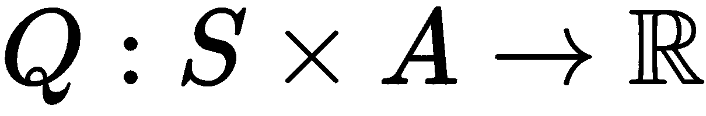

# 第十四章：使用深度强化学习玩吃豆人

强化学习是指一种范式，代理通过从环境反馈中学习，依据其所采取的动作获得观察结果和奖励。以下图展示了强化学习的基于反馈的学习循环：


尽管强化学习主要应用于学习如何玩游戏，但它也已成功应用于数字广告、股票交易、自动驾驶汽车和工业机器人等领域。

在本章中，我们将使用强化学习创建一个吃豆人游戏，并在这个过程中学习强化学习。我们将涵盖以下主题：

+   强化学习

+   强化学习与监督学习和无监督学习的区别

+   强化学习的组件

+   OpenAI Gym

+   OpenAI Gym 中的吃豆人游戏

+   深度强化学习中的 DQN：

    +   Q 学习

    +   深度 Q 网络

+   将 DQN 应用于吃豆人游戏

让我们开始吧！

# 强化学习

强化学习是一种机器学习方法，代理通过与环境的交互进行学习。代理采取行动，并根据这些行动，环境返回观察结果和奖励。通过这些观察结果和奖励，代理学习策略并采取进一步的行动，从而不断延续行动、观察和奖励的循环。在长期来看，代理必须学习一种策略，使其在依据策略采取行动时，能够最大化长期奖励。

# 强化学习与监督学习和无监督学习的区别

机器学习解决方案可以分为三种主要类型：监督学习、无监督学习和强化学习。那么强化学习与其他两种类型有何不同呢？

1.  **监督学习**：在监督学习中，代理从包含特征和标签的训练数据集中学习模型。监督学习的两种最常见问题是回归和分类。回归是指根据模型预测未来的值，分类是指预测输入值的类别。

1.  **无监督学习**：在无监督学习中，代理从仅包含特征的训练数据集中学习模型。无监督学习的两种最常见问题是降维和聚类。降维是指在不改变数据集自然分布的情况下，减少数据集中的特征或维度数量。聚类是指将输入数据划分为多个组，从而产生聚类或段。

1.  **强化学习**：在强化学习中，代理从初始模型开始，然后根据环境反馈不断学习该模型。强化学习代理通过对一系列动作、观察和奖励应用监督或无监督学习方法来更新模型。代理仅从奖励信号中学习，而不像其他机器学习方法那样从损失函数中学习。代理在采取动作后才会收到反馈，而在其他机器学习方法中，反馈在训练时就会通过损失或错误提供。数据不是独立同分布（i.i.d.），因为它依赖于先前采取的动作，而在其他机器学习方法中，数据是独立同分布的。

# 强化学习的组成部分

在任何强化学习的形式化中，我们使用**状态空间**和**动作空间**来讨论。动作空间是代理可以采取的有限数量的动作集合，用`A`表示。状态空间是环境可能处于的有限状态集合，用`S`表示。

代理的目标是学习一个策略，表示为 。**策略**可以是**确定性的**或**随机的**。策略基本上代表了模型，代理使用该模型来选择最优动作。因此，策略将来自环境的奖励和观察映射到动作。

当代理遵循某个策略时，会产生一个状态、动作、奖励、状态等的序列。这个序列被称为**轨迹**或**回合**。

强化学习形式化中的一个重要组成部分是**回报**。回报是对总长期奖励的估计。通常，回报可以用以下公式表示：


这里`γ`是一个折扣因子，值在`(0,1)`之间，`r[t]`是时间步长`t`时的奖励。折扣因子表示在未来的时间步长中，奖励的重要性。若 `γ` 为 0，则只考虑下一动作的奖励；若为 1，则未来的奖励与下一动作的奖励具有相同的权重。

然而，由于计算回报值非常困难，因此它是通过**状态值**或**动作值**函数来估计的。我们将在本章的 Q 学习部分进一步讨论动作值函数。

为了模拟我们将要玩吃豆人游戏的代理，我们将使用 OpenAI Gym。现在让我们了解一下 OpenAI Gym。

你可以在本书的代码包中的 Jupyter Notebook 文件`ch-14_Reinforcement_Learning`中跟随代码进行学习。

# OpenAI Gym

OpenAI Gym 是一个基于 Python 的工具包，用于开发强化学习算法。在撰写本书时，它提供了超过 700 个开源贡献的环境。还可以创建自定义的 OpenAI 环境。OpenAI Gym 提供了一个统一的接口，用于处理强化学习环境的工作，同时 OpenAI 的用户可以专注于设计和实现强化学习算法。

OpenAI Gym 的原始研究论文可以在以下链接找到：[`arxiv.org/abs/1606.01540`](http://arxiv.org/abs/1606.01540)。

让我们看一看以下步骤，学习如何安装和探索 OpenAI Gym：

1.  使用以下命令安装 OpenAI Gym：

```py
pip3 install gym
```

如果前述命令无法运行，请参考以下链接获取安装的进一步帮助：[`github.com/openai/gym#installation`](https://github.com/openai/gym#installation)。

1.  使用以下代码打印 OpenAI Gym 中可用的环境数量：

```py
all_env = list(gym.envs.registry.all())
print('Total Environments in Gym version {} : {}'
    .format(gym.__version__,len(all_env)))

```

前述代码生成了以下输出：

```py
Total Environments in Gym version 0.10.5 : 797
```

1.  打印所有环境的列表，如下代码所示：

```py
for e in list(all_env):
    print(e)
```

输出的部分列表如下：

```py
EnvSpec(Copy-v0) EnvSpec(RepeatCopy-v0) EnvSpec(ReversedAddition-v0) EnvSpec(ReversedAddition3-v0) EnvSpec(DuplicatedInput-v0) EnvSpec(Reverse-v0) EnvSpec(CartPole-v0) EnvSpec(CartPole-v1) EnvSpec(MountainCar-v0) EnvSpec(MountainCarContinuous-v0) EnvSpec(Pendulum-v0)
```

每个由 `env` 对象表示的环境都有一个标准化的接口：

+   可以使用 `env.make(<game-id-string>)` 函数通过传递 `id` 字符串来创建 `env` 对象。

+   每个 `env` 对象包含以下主要函数：

    +   函数 `step()` 接受一个动作对象作为参数，并返回四个对象：

        +   `observation`: 环境实现的对象，表示环境的观察。

        +   `reward`: 一个有符号浮点数，表示上一个动作的收益（或损失）。

        +   `done`: 一个布尔值，表示场景是否结束。

        +   `info`: 一个表示诊断信息的 Python 字典对象。

    +   函数 `render()` 创建环境的视觉表示。

    +   函数 `reset()` 将环境重置为原始状态。

+   每个 `env` 对象都带有明确定义的动作和观察，分别由 `action_space` 和 `observation_space` 表示。

# 在 OpenAI Gym 中创建 Pacman 游戏

在本章中，我们将以 **MsPacman-v0** 作为示例，探索这个游戏更深入一些：

1.  使用标准的 `make` 函数创建 `env` 对象，如下命令所示：

```py
env=gym.make('MsPacman-v0')
```

1.  让我们用以下代码打印游戏的动作空间：

```py
print(env.action_space)
```

前面的代码生成了以下输出：

```py
Discrete(9)
```

`Discrete 9` 指的是九种动作，如上、下、左、右。

1.  现在我们可以看到观察空间，如下例所示：

```py
print(env.observation_space)
```

前述代码生成了以下输出：

```py
Box(210, 160, 3)
```

因此，观察空间有三个颜色通道，大小为 210 x 160。观察空间的渲染如下截图所示：


1.  章节数是游戏次数的数量。我们现在将其设置为 1，表示我们只想玩一次游戏。由于每一轮游戏都是随机的，实际生产运行时，你会运行多轮游戏并计算奖励的平均值。让我们运行一次游戏，同时在游戏过程中随机选择一个动作，代码如下：

```py
import time

frame_time = 1.0 / 15 # seconds
n_episodes = 1

for i_episode in range(n_episodes):
    t=0
    score=0
    then = 0
    done = False
    env.reset()
    while not done:
        now = time.time()
        if frame_time < now - then:
            action = env.action_space.sample()
            observation, reward, done, info = env.step(action)
            score += reward
            env.render()
            then = now
            t=t+1
    print('Episode {} finished at t {} with score {}'.format(i_episode,
                                                             t,score))
```

我们随后得到以下输出：

```py
Episode 0 finished at t 551 with score 100.0
```

1.  现在，让我们运行游戏 `500` 次，看看我们得到的最大分数、最小分数和平均分数。这在以下示例中得以演示：

```py
import time
import numpy as np

frame_time = 1.0 / 15 # seconds
n_episodes = 500

scores = []
for i_episode in range(n_episodes):
    t=0
    score=0
    then = 0
    done = False
    env.reset()
    while not done:
        now = time.time()
        if frame_time < now - then:
            action = env.action_space.sample()
            observation, reward, done, info = env.step(action)
            score += reward
            env.render()
            then = now
            t=t+1
    scores.append(score)
    #print("Episode {} finished at t {} with score {}".format(i_episode,t,score))
print('Average score {}, max {}, min {}'.format(np.mean(scores),
                                          np.max(scores),
                                          np.min(scores)
                                         ))
```

上述代码生成了以下输出：

```py
Average 219.46, max 1070.0, min 70.0
```

随机选择一个动作并应用它可能不是最佳策略。为了让智能体通过玩游戏学习并应用最佳动作，有许多算法可以用来找到解决方案。在本章中，我们将应用深度 Q 网络来从游戏中学习。我们鼓励读者探索其他算法。

# DQN 用于深度强化学习

**深度 Q 网络**（**DQN**）是基于 Q-learning 的。在本节中，我们将在实现 DQN 来玩 PacMan 游戏之前，先解释这两者。

+   **Q-learning**：在 Q-learning 中，智能体学习动作值函数，也称为 Q 函数。`Q` 函数表示为 *q(s*,*a)*，用于估计当智能体处于状态 `s` 时采取动作 `a` 的长期价值。`Q` 函数将状态-动作对映射到长期价值的估计值，如下方程所示：



因此，在策略下，`q` 值函数可以写作如下：


`q` 函数可以递归地写作如下：


期望值可以展开如下：


一个最优的 `q` 函数是返回最大值的函数，而一个最优策略是应用最优 `q` 函数的策略。最优 `q` 函数可以写作如下：


这个方程表示**贝尔曼最优方程**。由于直接求解这个方程很困难，Q-learning 是一种用来逼近该函数值的方法。

因此，在 Q-learning 中，构建了一个模型，该模型能够预测给定状态和动作下的值。通常，这个模型以表格的形式存在，包含了所有可能的状态 `s` 和动作 `a` 的组合，以及该组合的期望值。然而，对于状态-动作组合数量较大的情况，这个表格就变得难以维护。DQN 有助于克服基于表格的 Q-learning 的这一缺点。

+   DQN：在 DQN 中，神经网络模型被用来从状态-动作-奖励-下一状态元组中学习，并根据提供的状态和动作预测近似的 q 值。由于状态-动作-奖励序列在时间上是相关的，深度学习面临挑战，因为深度学习中的输入样本需要是独立同分布（i.i.d.）。因此，在 DQN 算法中，**经验回放**被用来缓解这一问题。在经验回放中，之前的动作及其结果被随机采样，用于训练网络。

基本的深度 Q 学习算法如下：

1.  从初始状态开始游戏

1.  选择探索或利用

1.  如果你选择了利用，则通过神经网络预测动作并执行预测的动作

1.  如果你选择了探索，则随机选择一个动作

1.  记录之前的状态、动作、奖励和下一状态到经验缓存中

1.  使用 `bellman` 函数更新 `q_values`

1.  使用 `states`、`actions` 和 `q_values` 训练神经网络

1.  从*第 2 步*开始重复

为了提高性能并实现经验回放，你可以在*第 7 步*中随机选择训练数据。

# 将 DQN 应用到游戏中

到目前为止，我们已经随机选择了一个动作并将其应用于游戏。现在，让我们应用 DQN 来选择动作，以便玩吃豆人游戏。

1.  我们定义了 `q_nn` 策略函数，如下所示：

```py
def policy_q_nn(obs, env):
    # Exploration strategy - Select a random action
    if np.random.random() < explore_rate:
        action = env.action_space.sample()
    # Exploitation strategy - Select the action with the highest q
    else:
        action = np.argmax(q_nn.predict(np.array([obs])))
    return action
```

1.  接下来，我们修改 `episode` 函数，将 `q_values` 的计算和神经网络训练加入到采样的经验缓存中。代码如下所示：

```py
def episode(env, policy, r_max=0, t_max=0):

    # create the empty list to contain game memory
    #memory = deque(maxlen=1000)

    # observe initial state
    obs = env.reset()
    state_prev = obs
    #state_prev = np.ravel(obs) # replaced with keras reshape[-1]

    # initialize the variables
    episode_reward = 0
    done = False
    t = 0

    while not done:

        action = policy(state_prev, env)
        obs, reward, done, info = env.step(action)
        state_next = obs
        #state_next = np.ravel(obs) # replaced with keras reshape[-1]

        # add the state_prev, action, reward, state_new, done to memory
        memory.append([state_prev,action,reward,state_next,done])

        # Generate and update the q_values with 
        # maximum future rewards using bellman function:
        states = np.array([x[0] for x in memory])
        states_next = np.array([np.zeros(n_shape) if x[4] else x[3] for x in memory])

        q_values = q_nn.predict(states)
        q_values_next = q_nn.predict(states_next)

        for i in range(len(memory)):
            state_prev,action,reward,state_next,done = memory[i]
            if done:
                q_values[i,action] = reward
            else:
                best_q = np.amax(q_values_next[i])
                bellman_q = reward + discount_rate * best_q
                q_values[i,action] = bellman_q

        # train the q_nn with states and q_values, same as updating the q_table
        q_nn.fit(states,q_values,epochs=1,batch_size=50,verbose=0)

        state_prev = state_next

        episode_reward += reward
        if r_max > 0 and episode_reward > r_max:
            break
        t+=1
        if t_max > 0 and t == t_max:
            break
    return episode_reward
```

1.  定义一个 `experiment` 函数，该函数将在特定数量的回合中运行；每个回合运行直到游戏失败，即 `done` 为 `True` 时结束。我们使用 `rewards_max` 来表示何时退出循环，因为我们不希望实验永远运行，代码如下所示：

```py
# experiment collect observations and rewards for each episode
def experiment(env, policy, n_episodes,r_max=0, t_max=0):

    rewards=np.empty(shape=[n_episodes])
    for i in range(n_episodes):
        val = episode(env, policy, r_max, t_max)
        #print('episode:{}, reward {}'.format(i,val))
        rewards[i]=val

    print('Policy:{}, Min reward:{}, Max reward:{}, Average reward:{}'
        .format(policy.__name__,
              np.min(rewards),
              np.max(rewards),
              np.mean(rewards)))
```

1.  使用以下代码创建一个简单的 MLP 网络：

```py
from collections import deque 
from tensorflow.keras.models import Sequential
from tensorflow.keras.layers import Dense, Flatten

# build the Q-Network
model = Sequential()
model.add(Flatten(input_shape = n_shape))
model.add(Dense(512, activation='relu',name='hidden1'))
model.add(Dense(9, activation='softmax', name='output'))
model.compile(loss='categorical_crossentropy',optimizer='adam')
model.summary()
q_nn = model
```

上述代码生成了以下输出：

```py
_________________________________________________________________
Layer (type)                 Output Shape              Param #   
=================================================================
flatten_3 (Flatten)          (None, 100800)            0         
_________________________________________________________________
hidden1 (Dense)              (None, 8)                 806408    
_________________________________________________________________
output (Dense)               (None, 9)                 81        
=================================================================
Total params: 806,489
Trainable params: 806,489
Non-trainable params: 0
_________________________________________________________________
```

1.  创建一个空列表来保存游戏记忆，并定义其他超参数，运行一个回合的实验，如下所示：

```py
# Hyperparameters

discount_rate = 0.9
explore_rate = 0.2
n_episodes = 1

# create the empty list to contain game memory
memory = deque(maxlen=1000)

experiment(env, policy_q_nn, n_episodes)
```

我们得到的结果如下：

```py
Policy:policy_q_nn, Min reward:490.0, Max reward:490.0, Average reward:490.0
```

在我们的案例中，这无疑是一个改进，但在你的案例中可能会有所不同。在这种情况下，我们的游戏只从有限的记忆中学习，并且仅仅通过一次回合中的游戏回放进行学习。

1.  现在，运行 `100` 回合，如下所示：

```py
# Hyperparameters

discount_rate = 0.9
explore_rate = 0.2
n_episodes = 100

# create the empty list to contain game memory
memory = deque(maxlen=1000)

experiment(env, policy_q_nn, n_episodes)
```

我们得到以下结果：

```py
Policy:policy_q_nn, Min reward:70.0, Max reward:580.0, Average reward:270.5
```

因此，我们看到，尽管我们达到了高的最大奖励，平均结果并没有得到改善。调整网络架构、特征和超参数可能会产生更好的结果。我们鼓励你修改代码。例如，你可以用简单的单层卷积网络替代 MLP，如下所示：

```py
from collections import deque 
from tensorflow.keras.models import Sequential
from tensorflow.keras.layers import Dense, Flatten
from tensorflow.keras.layers import Conv2D, MaxPooling2D

# build the CNN Q-Network
model = Sequential()
model.add(Conv2D(16, kernel_size=(5, 5), 
                 strides=(1, 1),
                 activation='relu',
                 input_shape=n_shape))
model.add(MaxPooling2D(pool_size=(2, 2), strides=(2, 2)))
model.add(Flatten())
model.add(Dense(512, activation='relu',name='hidden1'))
model.add(Dense(9, activation='softmax', name='output'))
model.compile(loss='categorical_crossentropy',optimizer='adam')
model.summary()
q_nn = model

```

上述代码显示了网络摘要，如下所示：

```py
_________________________________________________________________
Layer (type)                 Output Shape              Param #   
=================================================================
conv2d_4 (Conv2D)            (None, 206, 156, 16)      1216      
_________________________________________________________________
max_pooling2d_4 (MaxPooling2 (None, 103, 78, 16)       0         
_________________________________________________________________
flatten_8 (Flatten)          (None, 128544)            0         
_________________________________________________________________
hidden1 (Dense)              (None, 512)               65815040  
_________________________________________________________________
output (Dense)               (None, 9)                 4617      
=================================================================
Total params: 65,820,873
Trainable params: 65,820,873
Non-trainable params: 0
```

# 总结

在这一章中，我们学习了什么是强化学习。强化学习是一种高级技术，你会发现它常用于解决复杂问题。我们了解了 OpenAI Gym，这个框架提供了一个环境来模拟许多流行的游戏，以便实现和实践强化学习算法。我们简要介绍了深度强化学习的概念，我们鼓励你去阅读一些专门写关于强化学习的书籍（在深入阅读中提到），以便深入了解其理论和概念。

我们学习了如何在 OpenAI Gym 中玩 PacMan 游戏。我们实现了 DQN，并使用它来学习玩 PacMan 游戏。为了简化，我们只使用了一个 MLP 网络，但对于复杂的示例，你可能最终会使用复杂的 CNN、RNN 或 Sequence-to-Sequence 模型。

在下一章中，我们将学习机器学习和 TensorFlow 领域的未来机会。

# 深入阅读

+   Maxim Lapan 的《深度强化学习实战》，Packt 出版社

+   Richard S. Sutton 和 Andrew G. Barto 的《强化学习：导论》

+   Masashi Sugiyama 的《统计强化学习：现代机器学习方法》

+   Csaba Szepesvari 的《强化学习算法》
