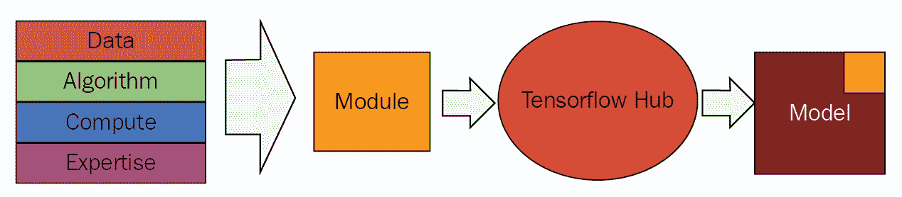
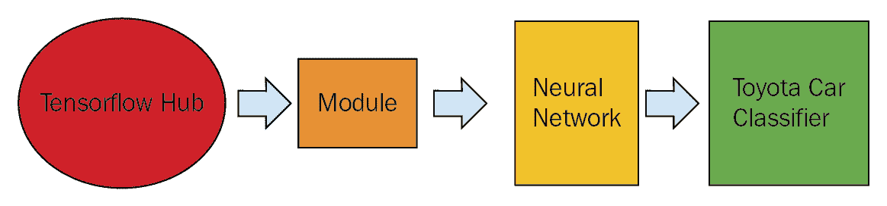
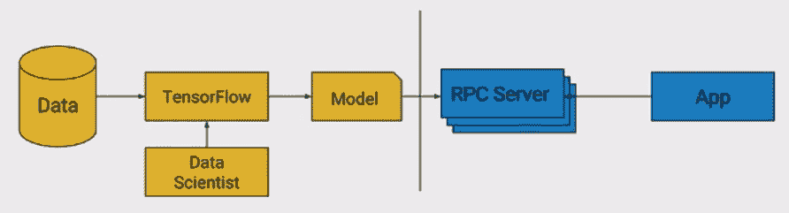
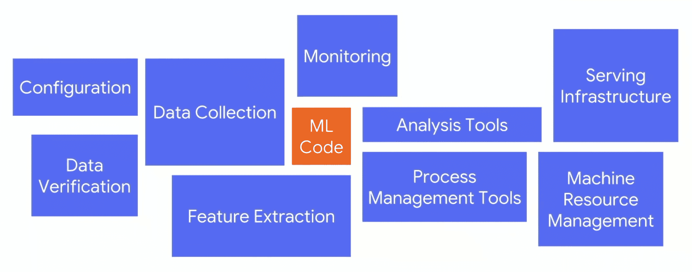
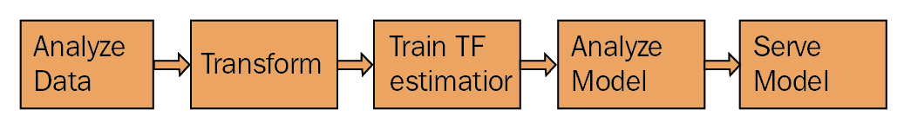

# 第十五章：接下来是什么？

恭喜你已经走到了这里。到目前为止，你已经学会了在 TensorFlow 中实现各种前沿的 AI 算法，并且在旁边做了一些很酷的项目。具体来说，我们已经构建了强化学习、贝叶斯神经网络、胶囊网络和**生成对抗网络**（**GANs**）等项目。我们还学习了 TensorFlow 的几个模块，包括 TensorFlow.js、TensorFlow Lite 和 TensorFlow Probability 等等。你应该为此感到自豪，并享受片刻的休息。

在我们出去玩之前，还有一些我们应该考虑阅读的内容，确保在将这些前沿技术投入生产环境时，我们已做好充分准备。正如我们在这一章中将会意识到的那样，部署机器学习模型到生产环境中，不仅仅是实现最新的人工智能研究论文。为了理解我的意思，让我们浏览以下主题：

+   部署模型到生产环境中的 TensorFlow 工具

+   构建 AI 应用程序的一般规则

+   深度学习的局限性

+   AI 在不同行业中的应用

+   人工智能中的伦理考虑

# 在生产环境中实现 TensorFlow

在软件工程中，我们看到了一些最佳实践，比如通过 GitHub 进行版本控制、可重用的库、持续集成等，这些实践提高了开发人员的生产力。机器学习作为一个新兴领域，确实需要一些工具来简化模型部署，并提升数据科学家的生产力。在这方面，TensorFlow 最近发布了许多工具。

# 了解 TensorFlow Hub

软件仓库在软件工程领域具有实际的好处，因为它们增强了代码的可重用性。这不仅有助于提高开发人员的生产力，还帮助不同的开发人员之间共享专业知识。而且，由于开发人员现在希望共享他们的代码，他们会以更清晰和模块化的方式开发代码，从而使整个社区受益。

Google 引入了 TensorFlow Hub，旨在实现机器学习中的可重用性。它的设计目的是让你可以创建、分享和重用机器学习模型的组件。在机器学习中，可重用性比在软件工程中更为重要，因为我们不仅使用算法/架构和专业知识——我们还使用了大量用于训练模型的计算资源和数据。

TF Hub 包含了多个由 Google 专家使用最先进的算法和海量数据训练的机器学习模型。每一个经过训练的模型在 TF Hub 中被称为**模块**。一个模块可以在**TensorFlow Hub**上分享，任何人都可以将其导入到自己的代码中。下图展示了经过训练的 TensorFlow 模型如何被其他应用程序/模型使用的流程：



**模块**在**TensorFlow Hub**中包含了模型的架构或**TensorFlow**图以及训练好的**模型**的权重。**模块**具有以下特点：

+   **可组合：**可组合意味着我们可以将模块作为构建块并在其上添加其他内容。

+   **可重用：**可重用意味着模块具有通用的签名，这样我们就可以交换不同的模块。这在我们迭代模型以获得最佳准确度时非常有用。

+   **可再训练：**模块带有预训练的权重，但它们足够灵活，可以在新数据集上进行再训练。这意味着我们可以通过反向传播调整模型，生成新的权重集。

让我们通过一个示例来理解这一点。假设我们有一个包含不同丰田汽车（如凯美瑞、卡罗拉等型号）的数据集。如果我们每个类别的图像不多，从头开始训练整个模型并不明智。

相反，我们可以做的是，利用一个已经在 TensorFlow Hub 上使用大量图像数据集训练的通用模型，提取该模型的可重用部分，如其架构和预训练权重。在预训练的模型基础上，我们可以添加一个分类器，将数据集中存在的图像进行适当分类。这个过程有时也被称为迁移学习。下图展示了这一过程：



如果你想了解更多关于迁移学习的内容，请参考斯坦福大学的课程笔记（[`cs231n.github.io/transfer-learning/`](http://cs231n.github.io/transfer-learning/)）

你可以访问 TensorFlow Hub（[`www.tensorflow.org/hub/`](https://www.tensorflow.org/hub/)）获取最先进的、以研究为导向的图像模型，并直接将其导入到你自定义的模型中。假设我们使用的是 NasNet（[`tfhub.dev/google/imagenet/nasnet_large/feature_vector/1`](https://tfhub.dev/google/imagenet/nasnet_large/feature_vector/1)），这是一个通过架构搜索训练的图像模块。在这里，我们将在代码中使用 NasNet 模块的 URL 来导入模块，如下所示：

```py
```

module = hub.Module(“https://tfhub.dev/google/imagenet/nasnet_large/feature_vect

            或/1”)

features = module(toyota_images)

logits = tf.layers.dense(features, NUM_CLASSES)

probabilities = tf.nn.softmax(logits)

```py
```

我们在模块上添加了一个带有 Softmax 非线性的全连接层。我们通过反向传播训练该层的权重，以便对丰田汽车图像进行分类。

请注意，我们不需要下载该模块，也不需要实例化它。

TensorFlow 处理所有这些底层细节，这使得该模块在真正意义上是可重用的。使用该模块的另一个好处是，您可以免费获得训练 NasNet 所需的数千小时计算资源。

假设我们确实有一个大数据集。在这种情况下，我们可以按以下方式训练模块的可重用部分：

```py
```

module = hub.Module(“https://tfhub.dev/google/imagenet/nasnet_large/feature_vector/1”, trainable=True, tags {“train”})features = module(toyota_images)

logits = tf.layers.dense(features, NUM_CLASSES)

probabilities = tf.nn.softmax(logits)

```py
```

TensorFlow Hub 提供了用于图像分类、词嵌入、句子嵌入和其他应用的预训练模型。让我们考虑一下来自本书第三章的电影情感分析项目，*使用 Tensorflow.js 在浏览器中进行情感分析*。我们本可以使用 TensorFlow Hub 提供的每个数据集项的预训练嵌入。这些跨领域的预训练模块的可用性将帮助许多开发人员在不必担心模型背后的数学原理的情况下构建新应用。

您可以在 TensorFlow Hub 的官方网站上找到更多详细信息（[`www.tensorflow.org/hub/`](https://www.tensorflow.org/hub/)）。

# TensorFlow Serving

**TensorFlow Serving** 是一个高度灵活的服务系统，用于在生产环境中部署机器学习模型。在详细介绍之前，我们先通过查看其架构来理解什么是服务：



我们有一些**数据**，并使用这些数据训练一个机器学习**模型**。一旦**模型**训练完成，它需要部署到网页或移动**应用程序**上，以服务最终用户。实现这一目标的一种方式是通过**远程过程调用**（**RPC**）服务器（[`www.ibm.com/support/knowledgecenter/en/ssw_aix_72/com.ibm.aix.progcomc/ch8_rpc.htm`](https://www.ibm.com/support/knowledgecenter/en/ssw_aix_72/com.ibm.aix.progcomc/ch8_rpc.htm)）。TensorFlow Serving 可以作为**RPC 服务器**和一组库使用，可以在应用程序或嵌入式设备中使用。

TensorFlow Serving 有三个支柱：

+   **C++ 库：** 低级 C++库主要包含了 TensorFlow 服务所需的函数和方法。这些库是 Google 用来生成应用程序使用的二进制文件的库，它们也是开源的。

+   **二进制文件：** 如果我们希望为我们的服务架构使用标准设置，可以使用预定义的二进制文件，这些文件包含了来自 Google 的所有最佳实践。Google 还提供了 Docker 容器（[`www.docker.com/`](https://www.docker.com/)）以便在 Kubernetes 上扩展这些二进制文件（[`kubernetes.io/`](https://kubernetes.io/)）。

+   **托管服务：** TensorFlow Serving 还在 Google Cloud ML 上提供托管服务，这使得使用和部署变得非常容易。

以下是 TensorFlow Serving 的一些优点：

+   **在线和低延迟：** 用户不希望在应用程序中等待预测结果。使用 TF Serving，预测不仅快速，而且始终如一地保持快速。

+   **单一进程中的多个模型：** TF Serving 允许在同一进程中加载多个模型。假设我们有一个模型，它为客户提供了很好的预测。但如果我们想进行实验，那么我们可能希望加载另一个模型，并与生产模型一起使用。

+   **自动加载和训练同一模型的版本：** TF Serving 支持在不中断服务的情况下自动加载新训练的模型，并从生产中的旧版本切换到新版本。

+   **可扩展性：** TF Serving 可以与 Cloud ML、Docker 和 Kubernetes 自动扩展。

如需了解如何使用 TF Serving 部署您的模型，请参考官方文档[这里](https://www.tensorflow.org/serving/)（[`www.tensorflow.org/serving/`](https://www.tensorflow.org/serving/)）。

# TensorFlow Extended

**TensorFlow Extended**（**TFX**）是 Google 构建的通用机器学习平台。其部分组件是开源的，并且最近在 KDD 会议上有一篇论文（[`www.kdd.org/kdd2017/papers/view/tfx-a-tensorflow-based-production-scale-machine-learning-platform`](https://www.kdd.org/kdd2017/papers/view/tfx-a-tensorflow-based-production-scale-machine-learning-platform)）展示了 TFX 的功能和愿景。

在本书中，我们主要理解了构建 TensorFlow 模型的语义。然而，当我们查看实际的生产中的机器学习应用时，还有许多其他组件。以下图示展示了这些组件：



如我们所见，机器学习代码是整个系统中非常小的组成部分。其他模块需要最大时间来构建，并且占用了最多的代码行数。TFX 提供了构建机器学习管道其他组件的库和工具。

让我们看一个机器学习过程的示例，以了解 TensorFlow Extended 的不同开源组件：



+   **数据分析：** 探索性数据分析是构建任何机器学习模型的必要条件。TFX 有一个名为 Facets 的工具（[`github.com/PAIR-code/facets`](https://github.com/PAIR-code/facets)），它让我们可视化每个变量的分布，识别缺失数据或异常值，或者通知他人数据可能需要的转换。

+   **转换：** TensorFlow 转换（[`www.tensorflow.org/tfx/transform/get_started`](https://www.tensorflow.org/tfx/transform/get_started)）提供开箱即用的功能，能够对基础数据进行完整的转换，使其适合用于训练模型。它与 TF 图本身紧密相关，确保在训练和服务过程中应用相同的转换。

+   **训练 TF 估算器**：在数据转换之后，我们可以使用 TF 估算器 ([`www.tensorflow.org/api_docs/python/tf/estimator/Estimator`](https://www.tensorflow.org/api_docs/python/tf/estimator/Estimator))，它提供了一个高层次的 API，可以快速定义、训练和导出模型。TF 估算器还允许你以不同的格式导出模型进行推理和服务。

+   **分析模型**：一旦模型构建完成，我们可以直接将其推送到生产环境，但这会是一个非常糟糕的主意。相反，我们应该分析模型的预测结果，并确保模型预测的是我们希望它预测的内容。TF 模型分析 ([`www.tensorflow.org/tfx/model_analysis/get_started`](https://www.tensorflow.org/tfx/model_analysis/get_started)) 使我们能够在大规模数据集上评估模型，并提供一个用户界面，可以根据不同的属性值切分预测结果。

+   **服务模型**：在分析我们的模型并对其预测结果感到满意后，我们希望将模型部署到生产环境中。实现这一目标的一种方式是使用 TensorFlow Serving，这在上一节中已有描述。

TensorFlow Extended 在 Google 内部广泛用于构建产品。它显然比开源的版本有更多功能。对于那些在初创公司或没有自己内部机器学习平台的公司工作的人来说，强烈推荐使用 TFX 来构建端到端的机器学习应用。

# 构建 AI 应用的建议

现在我们了解了一些来自 TensorFlow 的工具，这些工具能帮助我们在大规模下开发和部署模型，让我们尝试理解构建 AI 应用时的一些通用经验法则。

+   **工程优先于机器学习**：几乎所有问题的解决方案都始于工程。在构建任何机器学习模型之前，确保数据管道正确非常重要。

+   **保持简单**：通常，数据科学家有一种自然倾向，倾向于为问题构建最复杂的模型。然而，从简单且可解释的模型开始是非常好的——比如说，使用逻辑回归模型进行分类。这有助于更好地发现和调试数据或工程管道中的问题。只有当你对基础模型的结果不满意时，才应该使用像深度学习这样的高级技术。

+   **分布式处理**：在大数据时代，你几乎总会遇到无法将数据装入内存的问题。了解像 Spark 这样的分布式框架在处理和构建可扩展的机器学习应用时会大有帮助。

+   **自动化模型再训练**：一旦模型部署，它的性能可能会随着时间的推移而下降。保持检查模型的准确性非常重要，以便可以使用新数据启动自动训练。这将有助于维持产品的预测准确性。

+   **训练和测试管道**：对于独立的训练和测试管道，总是有可能导致训练和测试特征之间的偏差。尽量确保训练和测试管道之间有尽可能多的重叠。这可以帮助更轻松地调试模型预测。

+   **通过 A/B 测试推出新模型**：A/B 测试是一种比较两个版本模型/网页等的方法。它是一个统计实验，其中随机向用户展示两个不同版本。你可以在普渡大学的讲义中阅读更多相关内容（[`www.cs.purdue.edu/homes/ribeirob/courses/Fall2016/lectures/hyp_tests.pdf`](https://www.cs.purdue.edu/homes/ribeirob/courses/Fall2016/lectures/hyp_tests.pdf)）。

如果你构建的模型优于已经在生产环境中使用的模型，你会在测试数据集上看到准确度的提升。然而，由于各种问题（如相关性与因果关系、用户行为变化等），在生产环境中你可能不会看到与现有模型相同的提升。因此，在将新模型推出给所有用户之前，在生产环境中进行 A/B 测试是非常重要的。

+   **单一模型优于集成模型**：集成模型（多个单一模型的组合）可能会比单一模型提供更好的准确性。然而，如果增益不显著，始终建议使用单一模型。这是因为集成模型在生产系统中难以维护、调试和扩展。

# 深度学习的局限性

在这个项目中，几乎所有的项目都涉及某种深度学习。深度学习在推动过去几年大部分进展中起到了关键作用。然而，深度学习存在一些显而易见的局限性，我们在将其应用于现实世界场景之前应当理解这些限制。以下是其中一些：

+   **数据饥渴**：通常情况下，我们无法为每个需要使用机器学习解决的问题提供大规模的数据集。相反，深度学习算法只有在我们拥有庞大的数据集时才能发挥作用。

+   **计算密集型**：深度学习训练通常需要 GPU 支持和大量内存。然而，这使得在像手机、平板电脑等边缘设备上训练深度神经网络变得不可能。

+   **没有预测不确定性**：默认情况下，深度学习算法难以表现不确定性。深度神经网络可能会非常自信地错误地将一张猫的图片分类为狗的图片。

对于预测结果，没有置信区间或不确定性的概念。对于像自动驾驶汽车这样的应用，在做出任何决策之前考虑不确定性是非常重要的。在本书中，我们介绍了贝叶斯神经网络等概念，试图在深度神经网络中融入不确定性。

+   **不可解释的黑箱**：深度学习模型很难解释和信任。例如，银行的贷款部门基于个人的过去购买记录或信用历史，通过深度神经网络来决定是否向个人发放贷款。

如果模型拒绝贷款，银行必须向个人解释为何贷款被拒。然而，使用深度神经网络时，几乎不可能提供明确的理由解释为何贷款被拒。不可解释性是这些模型未能广泛应用于各个行业的主要原因。

# 行业内的 AI 应用

AI 是每个公司都在努力转型的全新范式。根据麦肯锡报告（[`www.mckinsey.com/featured-insights/artificial-intelligence/notes-from-the-ai-frontier-modeling-the-impact-of-ai-on-the-world-economy`](https://www.mckinsey.com/featured-insights/artificial-intelligence/notes-from-the-ai-frontier-modeling-the-impact-of-ai-on-the-world-economy)），到 2030 年，预计 70% 的公司将至少采用一种 AI 技术。让我们看看不同行业中的 AI 应用：

+   **零售业**：

    +   供应链优化

    +   通过微定位定制购物体验

    +   产品定价及节假日折扣计算

    +   在零售店中定制产品摆放以增加销售

+   **社交网络（Facebook, LinkedIn, Twitter）**：

    +   朋友/关注者推荐

    +   基于过去历史的主页推荐定制，以提高参与度

    +   假新闻/欺诈检测

+   **医疗健康**：

    +   新药发现

    +   自动化医学影像处理

    +   通过 Apple Watch 或其他设备存储的数据推荐锻炼/食物

+   **金融业**：

    +   股票市场预测

    +   信用卡欺诈检测

    +   贷款资格

    +   客户支持聊天机器人

+   **制造业**：

    +   预测性维护

    +   需求预测

    +   库存管理

+   **物流**：

    +   ETA 优化

    +   高峰定价

    +   共享出行/拼车

    +   定价

    +   自动驾驶汽车

# AI 的伦理考量

我们正见证人工智能及其应用的非凡崛起。然而，AI 应用的日益复杂化引发了关于偏见、公平、安全、透明度和问责制等一系列问题。这主要是因为 AI 模型没有良知，无法独立区分好坏。它们的效果取决于它们训练所用的数据。因此，如果数据在某些方面存在偏见，那么预测结果也会偏见。还有关于因自动化导致的失业增加、AI 被用于恐怖主义以及 AI 模型的种族歧视预测等问题。

好消息是，许多大学正在投入时间和资源，寻求如何使 AI 更加公平并去除偏见的解决方案。同时，监管机构也在努力制定新的规则，以确保 AI 应用对人类来说是安全和可靠的。

作为一名 AI 从业者，我们必须在将 AI 应用于自己的产品之前理解这些问题。我敦促你关注你产品中的伦理问题，并相应地加以纠正。

# 总结

在这一章中，我们看到了 TensorFlow 的各种扩展，旨在提高数据科学家的生产力，并使前沿模型在大规模生产环境中更易部署。

我们了解了 TensorFlow Hub，它类似于 GitHub 上来自各个领域（如计算机视觉、自然语言处理等）的训练深度学习模型的仓库。之后，我们理解了 TensorFlow Serving 如何提供工具和库来大规模部署深度学习模型。最后，我们学习了**TensorFlow Extended**（**TFX**）的开源组件，TFX 是谷歌的机器学习平台。TFX 帮助整个模型构建管道，从数据分析到模型部署。

接下来，我们了解了构建可扩展 AI 产品时的一些最佳实践。构建稳健的工程管道，在深度学习之前尝试简单的模型，并始终通过 A/B 测试发布新模型是其中的一些做法。

随后，我们通过了解深度神经网络的局限性，打破了关于深度学习的炒作。具体来说，我们了解到，它们需要大量的数据和计算能力来构建好的、准确的模型。此外，它们不可解释的特点使得它们在许多 AI 应用中无法使用。我们还了解了 AI 在各行各业中的应用，并学习了 AI 伦理的重要性。

最后，如果你已经看到这里并完成了项目，我感谢你，并祝贺你取得了非凡的成就。你已经掌握了使用强化学习、计算机视觉和自然语言处理等先进技术构建实用 AI 应用所需的技能。我希望你现在能将这些知识用于善事，让这个世界变得更美好。

我想以我最喜欢的名言结束本书：

未来不是我们要去的地方，而是我们在创造的地方。

- 约翰·H·斯卡尔
