# 第一章：强化学习入门

本书将涵盖深度**强化学习**（**RL**）中的有趣主题，包括更广泛使用的算法，并提供 TensorFlow 代码来解决许多使用深度 RL 算法的挑战性问题。具备一定的 RL 基础知识将有助于你掌握本书涵盖的高级主题，但本书将以简明易懂的语言讲解，便于机器学习从业人员理解。本书选择的编程语言是 Python，使用的深度学习框架是 TensorFlow，我们预计你对这两者有一定的了解。如果没有，也有许多 Packt 出版的书籍涉及这些主题。我们将介绍几种不同的 RL 算法，例如**深度 Q 网络**（**DQN**）、**深度确定性策略梯度**（**DDPG**）、**信任区域策略优化**（**TRPO**）和**近端策略优化**（**PPO**）等。让我们一起深入探索深度 RL。

在本章中，我们将深入探讨强化学习的基本概念。我们将学习 RL 术语的含义，它们之间的数学关系，以及如何在 RL 环境中使用这些概念来训练智能体。这些概念将为我们在后续章节中学习 RL 算法奠定基础，并展示如何应用这些算法来训练智能体。祝学习愉快！

本章将涉及的主要主题如下：

+   构建 RL 问题模型

+   理解什么是智能体（agent）和环境（environment）

+   定义贝尔曼方程

+   在线学习与离线学习

+   无模型训练与基于模型的训练

# 为什么选择强化学习（RL）？

强化学习（RL）是机器学习的一个子领域，其中学习是通过试错法进行的。这与其他机器学习策略不同，例如：

+   **监督学习**：目标是学习拟合一个模型分布，该分布能够捕捉给定标签数据分布

+   **无监督学习**：目标是在给定的数据集中找到内在的模式，例如聚类

强化学习（RL）是一种强大的学习方法，因为你不需要标签数据，前提是你能够掌握 RL 中采用的通过探索学习的方法。

尽管强化学习（RL）已经有三十多年的历史，但近年来随着深度学习在 RL 中成功应用于解决实际任务的演示，RL 领域经历了新的复兴。在这些任务中，深度神经网络用于做出决策。RL 与深度学习的结合通常被称为深度强化学习（deep RL），也是本书讨论的主要内容。

深度强化学习（Deep RL）已经成功地被研究人员应用于视频游戏、自动驾驶、工业机器人抓取物体、交易员进行投资组合下注、医疗保健领域等多个场景。最近，Google DeepMind 构建了 AlphaGo，一个基于强化学习（RL）系统，它能够玩围棋，并轻松击败围棋的冠军。OpenAI 也构建了另一个系统，在《Dota》视频游戏中战胜人类。这些例子展示了 RL 在现实世界中的应用。广泛认为，这一领域有着非常光明的未来，因为你可以训练神经网络进行预测，而无需提供标注数据。

现在，让我们深入探讨强化学习问题的表述。我们将比较强化学习与孩子学走路之间的相似性。

# 强化学习问题的表述

要解决的基本问题是训练一个模型，在没有任何标注数据的情况下对某些预定义任务进行预测。这是通过试错方法实现的，类似于婴儿第一次学走路的过程。婴儿由于好奇想探索周围的世界，首先会爬出婴儿床，不知道该去哪儿，也不知道该做什么。最初，他们迈出小步伐，犯错误，摔倒在地上并哭泣。但是，经过许多这样的尝试后，他们开始能够独立站立，令父母感到欣喜。然后，他们凭借一股信念迈出了稍长的步伐，慢慢而小心地走着。他们依然会犯错误，但比之前少得多。

经过更多次的尝试——和失败——他们变得更加自信，从而能够迈出更长的步伐。随着时间的推移，这些步伐变得越来越长、越来越快，直到最终他们开始奔跑。这就是他们成长为一个孩子的过程。是否给他们提供了任何标注数据供他们学习走路？没有。他们是通过试错学习的，沿途犯错，从中学习，并在每次尝试中取得微小的进步。这就是强化学习的工作原理，通过试错学习。

在前面的例子基础上，这里是另一种情况。假设你需要通过试错法来训练一个机器人，下面是具体做法。首先，让机器人在环境中随机游走。然后收集好的和不好的行为，并使用奖励函数对其进行量化，因此，在某个状态下执行好的行为会获得高奖励；另一方面，坏行为会受到惩罚。这可以作为机器人自我改进的学习信号。在经历了多次这样的试错过程后，机器人就会根据奖励学会在给定状态下执行最优的行为。这就是强化学习（RL）中的学习方式。但是在本书的其余部分，我们将不再讨论人的特征。之前描述的孩子是*代理*，而他们的周围环境是强化学习术语中的*环境*。代理与环境互动，在这个过程中，学习如何执行任务，环境会提供奖励。

# 代理与其环境之间的关系

从最基本的层面上讲，强化学习涉及一个代理和一个环境。代理是一个人工智能实体，拥有某些目标，必须时刻警惕可能阻碍这些目标的事物，并且必须同时追求有助于实现这些目标的事物。环境是代理可以与之互动的所有事物。让我通过一个涉及工业移动机器人的例子来进一步解释。

例如，在一个工业移动机器人在工厂内导航的情境中，机器人是代理，而工厂是环境。

机器人有一些预定义的目标，例如，要将货物从工厂的一边移动到另一边，并避免与墙壁和/或其他机器人等障碍物发生碰撞。环境是机器人可以导航的区域，包括机器人可以到达的所有地方，也包括可能撞到的障碍物。因此，机器人的主要任务，或者更准确地说，代理的主要任务，是探索环境，理解它所采取的行为如何影响奖励，意识到可能导致灾难性碰撞或失败的障碍物，然后掌握如何最大化目标并随着时间的推移提高其表现。

在这个过程中，代理不可避免地与环境互动，这对代理来说，在某些任务上可能是有益的，但在其他任务上可能是不利的。因此，代理必须学习环境如何响应它所采取的行动。这是一种试错学习方法，只有经过多次这样的尝试，代理才能学会环境如何响应其决策。

现在我们来了解一下代理的状态空间，以及代理执行的动作以探索环境。

# 定义代理的状态

在强化学习术语中，*状态*表示智能体的当前情况。例如，在前述的工业移动机器人智能体案例中，给定时刻的状态是机器人在工厂内的位置——即它所在的位置、朝向，或者更准确地说，是机器人的姿态。对于具有关节和效应器的机器人，状态还可以包括关节和效应器在三维空间中的精确位置。对于自动驾驶汽车，它的状态可以表示速度、在地图上的位置、与其他障碍物的距离、车轮上的扭矩、引擎的转速等等。

状态通常通过现实世界中的传感器推导出来；例如，来自里程计、激光雷达、雷达和摄像头的测量值。状态可以是一个一维的实数或整数向量，或者是二维的摄像头图像，甚至是更高维度的，例如三维体素。实际上，状态没有精确的限制，状态仅仅代表智能体当前的情况。

在强化学习文献中，状态通常表示为*`sₜ`*，其中下标 `t` 用于表示与该状态对应的时间瞬间。

# 定义智能体的动作

智能体执行动作以探索环境。获取这个动作向量是强化学习中的主要目标。理想情况下，你需要努力获得最优动作。

动作是智能体在某一状态 `sₜ` 下做出的决策。通常，它表示为 `aₜ`，其中，像之前一样，下标 `t` 表示对应的时间瞬间。智能体可用的动作取决于问题。例如，迷宫中的智能体可以决定朝北、南、东或西迈出一步。这些被称为**离散动作**，因为有固定的可能性数量。另一方面，对于自动驾驶汽车，动作可以是转向角度、油门值、刹车值等等，这些被称为**连续动作**，因为它们可以在有限范围内取实数值。例如，转向角度可以是从南北线偏离 40 度，油门可以是 60%的压下程度，等等。

因此，动作 `aₜ` 可以是离散的，也可以是连续的，这取决于具体问题。一些强化学习方法处理离散动作，而其他方法则适用于连续动作。

下图展示了**智能体**及其与**环境**的交互示意图：

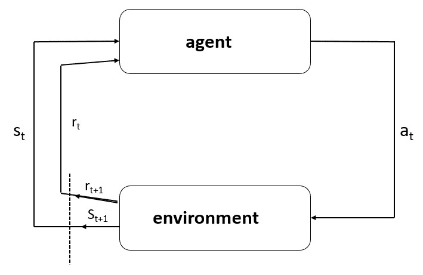

图 1：示意图，展示了智能体及其与环境的交互

现在我们知道了什么是**智能体**，接下来我们将探讨智能体学习的策略、什么是价值函数和优势函数，以及这些量如何在强化学习（RL）中使用。

# 理解策略、价值和优势函数

**策略** 定义了代理在给定状态下行为的指导方针。在数学术语中，策略是从代理的一个状态映射到在该状态下要采取的行动的映射。它类似于代理遵循的刺激-反应规则，当其学习探索环境时。在强化学习文献中，它通常表示为 *π(a**[t]|s[t]**) –*，即在给定状态 `s`*[t]* 下采取行动 `a`*[t]* 的条件概率分布。策略可以是确定性的，在这种情况下，`a`*[t]* 的确切值在 `s`*[t]* 处是已知的，也可以是随机的，其中 `a`*[t]* 从一个分布中采样 - 典型情况下为高斯分布，但也可以是任何其他概率分布。

在强化学习中，**价值函数** 用于定义代理状态的优劣程度。它们通常用 *V(s)* 表示在状态 `s` 处的预期长期平均奖励。*V(s)* 的表达式如下，其中 *E[.]* 是对样本的期望：

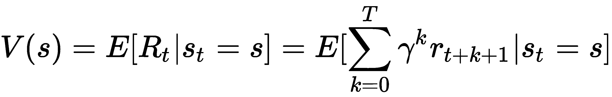

注意，*V(s)* 不关心代理在状态 `s` 下需要采取的最佳行动。相反，它衡量的是状态的好坏程度。那么，代理如何在给定时间点 `t` 中找出在状态 `sₜ` 下采取的最佳行动 `aₜ` 呢？为此，您还可以定义一个动作值函数，其表达式如下所示：

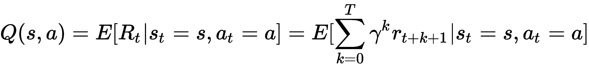

注意 *Q(s,a)* 表示在状态 `s` 中采取行动 `a` 并随后遵循相同策略的优劣程度。因此，*Q(s,a)* 与 *V(s)* 不同，后者衡量的是给定状态的优劣程度。在接下来的章节中，我们将看到如何使用价值函数来训练强化学习设置下的代理。

**优势函数** 定义如下：

*A(s,a) = Q(s,a) - V(s)*

这个优势函数被认为能够减少策略梯度的方差，这是后续章节将深入讨论的一个主题。

经典的强化学习教材是《强化学习导论》（*Reinforcement Lea**rning: An Introduction*），作者是 *Richard S Sutton* 和 *Andrew G Barto*，出版社是 *The MIT Press*，出版年份是 1998 年。

现在我们将定义什么是一个情节及其在强化学习环境中的重要性。

# 识别情节

我们之前提到，代理在能够最大化其目标之前需要在环境中进行多次试验和错误的探索。从开始到结束的每次这样的试验被称为一个 **情节**。起始位置可能并不总是相同。同样，情节的结束可以是愉快的或悲伤的结局。

一个愉快或良好的结局可以是代理实现其预定义目标的情况，这可能是移动机器人成功导航到最终目的地，或者工业机器人臂成功拾取和放置卡柄到孔中等等。情节也可能有悲伤的结局，例如代理撞到障碍物或被困在迷宫中，无法摆脱等等。

在许多强化学习问题中，通常会指定一个时间步骤的上限来终止一个回合，尽管在其他问题中没有这样的上限，回合可以持续很长时间，直到达成目标，或者撞到障碍物、跌下悬崖，或发生类似情况为止。旅行者号宇宙飞船是由 NASA 于 1977 年发射的，它已经飞出我们的太阳系——这是一个无限时间回合系统的例子。

接下来我们将了解什么是奖励函数以及为什么需要折扣未来奖励。这个奖励函数是关键，因为它是代理学习的信号。

# 确定奖励函数和折扣奖励的概念

强化学习中的奖励与现实世界中的奖励没有区别——我们因表现好而获得奖励，因表现差而受到惩罚（即惩罚）。奖励函数由环境提供，指导代理在探索环境时进行学习。具体来说，它衡量的是代理的表现好坏。

奖励函数定义了代理可能发生的好事和坏事。例如，一个达到目标的移动机器人会获得奖励，但如果撞到障碍物，则会受到惩罚。同样，一个工业机器人臂在将钉子放入孔中时会获得奖励，但如果它处于可能导致破裂或撞击的危险姿势，则会受到惩罚。奖励函数是代理获取关于什么是最优的、什么不是最优的信号。代理的长期目标是最大化奖励并最小化惩罚。

# 奖励

在强化学习文献中，时间点 `t` 的奖励通常表示为 `Rₜ`。因此，整个回合中获得的总奖励为 *R = r1 + r2 + ... + r[t]*，其中 `t` 是回合的长度（可以是有限的，也可以是无限的）。

在强化学习中使用了折扣的概念，其中使用了一个称为折扣因子的参数，通常表示为 *γ* 且 *0 ≤ γ ≤ 1*，它的幂次与 `rₜ` 相乘。*γ = 0* 使得代理变得短视，只关注即时奖励；*γ = 1* 使得代理变得过于远视，以至于拖延最终目标的实现。因此，使用 0 到 1 范围内（不包括 0 和 1）的 *γ* 值来确保代理既不会过于短视，也不会过于远视。*γ* 确保代理优先考虑其行动，最大化从时间点 `t` 开始的总折扣奖励 `Rₜ`，其计算公式如下：

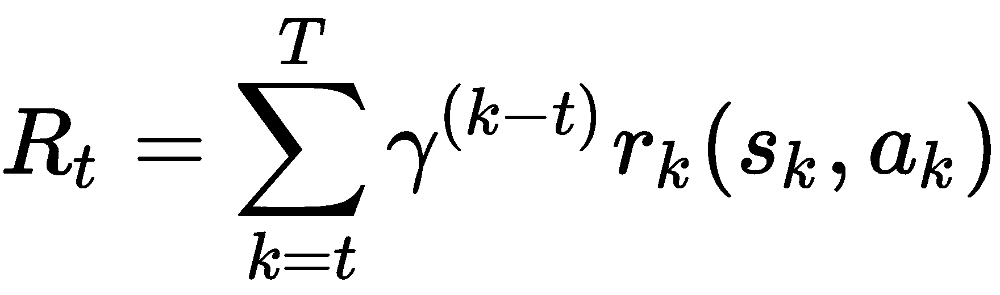

由于 *0 ≤ γ ≤ 1*，远期的奖励相比即时的奖励价值较低。这有助于代理不浪费时间，并优先考虑其行动。在实际应用中，*γ = 0.9-0.99* 通常用于大多数强化学习问题中。

# 学习马尔可夫决策过程

马尔可夫性质在强化学习中被广泛应用，表示环境在时间*t+1*时的反应仅依赖于时间`t`的状态和行动。换句话说，未来的即时状态只依赖于当前状态，而不依赖于过去的状态。这一特性大大简化了数学计算，并在强化学习和机器人学等多个领域得到广泛应用。

考虑一个系统，它通过采取行动`a[0]`从状态`s[0]`转移到状态`s[1]`并获得奖励`r[1]`，然后再从`s[1]`到`s[2]`，采取行动`a[1]`，如此类推，直到时间`t`。如果在时间*t+1*时，处于状态*s'*的概率可以通过以下函数在数学上表示，那么该系统就被认为遵循马尔可夫性质：

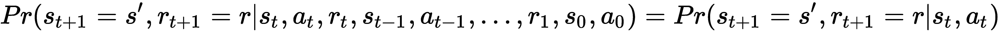

请注意，处于状态*s[t+1]*的概率仅取决于`sₜ`和`aₜ`，与过去无关。满足以下状态转移性质和奖励函数的环境被称为**马尔可夫决策过程**（**MDP**）：

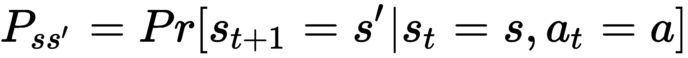

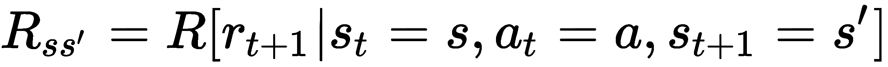

现在，让我们定义强化学习的基础：贝尔曼方程。这个方程将帮助我们提供一个迭代解法来获得价值函数。

# 定义贝尔曼方程

贝尔曼方程以伟大的计算机科学家和应用数学家理查德·E·贝尔曼的名字命名，是与动态规划相关的最优性条件。它在强化学习（RL）中被广泛用于更新智能体的策略。

让我们定义以下两个量：

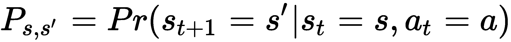

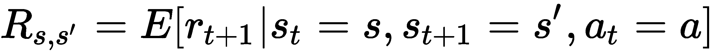

第一个量，*P[s,s']*，是从状态`s`到新状态*s'*的转移概率。第二个量，*R[s,s']*，是智能体从状态`s`出发，采取行动`a`，然后转移到新状态*s'*时所获得的期望奖励。请注意，我们假设了 MDP 的属性，即在时间*t+1*时的状态转移仅依赖于时间`t`的状态和行动。用这些术语表达时，贝尔曼方程是一个递归关系，并且对于价值函数和行动价值函数，分别给出如下方程：

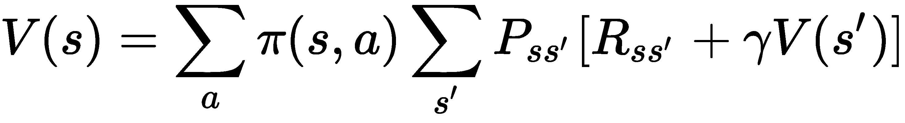

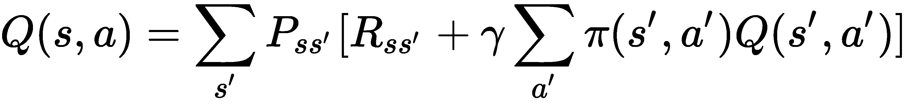

请注意，贝尔曼方程表示了状态下的价值函数`V`，并且是其他状态下价值函数的函数；行动价值函数`Q`也是如此。

# 在线学习与离线学习

强化学习算法可以分为在线学习和离线学习。接下来我们将了解这两种类型，并讨论如何将给定的强化学习算法区分为其中之一。

# 在线学习方法

策略方法使用与做出动作决策时相同的策略来进行评估。策略算法通常没有重放缓冲区；遇到的经验用于现场训练模型。从状态 `t` 到状态 *t+1* 期间，使用相同的策略来评估性能好坏。例如，如果一个机器人在给定状态下探索世界，它如果使用当前策略来判断其在当前状态下采取的行动是好是坏，那么它就是一个策略算法，因为当前策略也用于评估其行为。SARSA、A3C、TRPO 和 PPO 是我们将在本书中讨论的策略算法。

# 离策略方法

相反，离策略方法使用不同的策略来做出决策和评估性能。例如，许多离策略算法使用重放缓冲区来存储经验，并从该缓冲区中采样数据来训练模型。在训练步骤中，会随机采样一小批经验数据，并用于训练策略和价值函数。回到之前的机器人示例，在离策略设置下，机器人不会使用当前策略来评估其性能，而是使用不同的策略进行探索和评估。如果使用重放缓冲区来采样经验数据的小批量，然后训练代理，则这是离策略学习，因为机器人当前的策略（用于获取即时动作的策略）与用于获取小批量经验样本的策略不同（因为策略从数据收集时的早期时刻变更为当前时刻）。DQN、DDQN 和 DDPG 是我们将在本书后续章节中讨论的离策略算法。

# 无模型和基于模型的训练

不学习环境运作模型的 RL 算法称为无模型算法。相反，如果构建了环境模型，则该算法称为基于模型的算法。通常，如果使用价值（`V`）或动作价值（`Q`）函数来评估性能，则称其为**无模型**算法，因为没有使用环境的具体模型。另一方面，如果你建立了一个模型，描述环境如何从一个状态转移到另一个状态，或者通过模型决定代理将从环境中获得多少奖励，那么这些算法称为**基于模型**算法。

在无模型算法中，如前所述，我们并未构建环境的模型。因此，智能体必须在一个状态下采取行动，判断这是一个好的选择还是一个坏的选择。在基于模型的 RL 中，我们会学习一个环境的近似模型；该模型可以与策略共同学习，或是事先学习好。这个环境模型用于做决策，并且用于训练策略。我们将在后续章节中深入学习这两类 RL 算法。

# 本书涵盖的算法

在第二章，*时间差分法、SARSA 和 Q-学习*中，我们将探讨前两个强化学习（RL）算法：Q-学习和 SARSA。这两个算法都是基于表格的，不需要使用神经网络。因此，我们将用 Python 和 NumPy 进行编程。在第三章，*深度 Q 网络*中，我们将介绍 DQN，并使用 TensorFlow 为本书后续章节中的智能体进行编码。然后我们将训练它玩 Atari Breakout。在第四章，*双重 DQN、对抗网络架构和 Rainbow*中，我们将讨论双重 DQN、对抗网络架构以及 Rainbow DQN。在第五章，*深度确定性策略梯度*中，我们将探讨我们的第一个演员-评论员 RL 算法，称为 DDPG，学习策略梯度，并将其应用于连续动作问题。在第六章，*异步方法 – A3C 和 A2C*中，我们将研究 A3C，这是另一个使用主节点和多个工作节点的 RL 算法。在第七章，*信任区域策略优化和近端策略优化*中，我们将研究另外两种 RL 算法：TRPO 和 PPO。最后，在第八章，*深度强化学习在自动驾驶中的应用*中，我们将应用 DDPG 和 PPO 训练一个智能体，来实现自主驾驶。 从第三章，*深度 Q 网络*到第八章，*深度强化学习在自动驾驶中的应用*，我们将使用 TensorFlow 智能体。希望你在学习强化学习的过程中玩得愉快。

# 摘要

本章介绍了强化学习（RL）的基本概念。我们理解了智能体与环境之间的关系，也学习了马尔可夫决策过程（MDP）的设置。我们学习了奖励函数的概念和折扣奖励的使用，以及价值和优势函数的思想。此外，我们还了解了贝尔曼方程及其在 RL 中的应用。我们还学习了在策略型和非策略型 RL 算法之间的区别。此外，我们还考察了无模型和基于模型的 RL 算法之间的区别。所有这些为我们深入探讨 RL 算法以及如何利用它们训练智能体执行特定任务奠定了基础。

在下一章中，我们将探讨我们首两个 RL 算法：Q-learning 和 SARSA。请注意，在第二章，*时序差分、SARSA 和 Q-Learning* 中，我们将使用基于 Python 的代理，因为它们是表格学习方法。但从第三章，*深度 Q 网络* 开始，我们将使用 TensorFlow 来编写深度 RL 代理，因为我们将需要神经网络。

# 问题

1.  对于基于策略或非基于策略的 RL 算法，是否需要回放缓存？

1.  为什么我们要对奖励进行折扣？

1.  如果折扣因子是 *γ > 1* 会发生什么？

1.  由于我们拥有环境状态的模型，基于模型的 RL 代理是否总是比无模型的 RL 代理表现更好？

1.  RL 和深度 RL 有什么区别？

# 进一步阅读

+   *强化学习：导论*，*理查德·S·萨顿* 和 *安德鲁·G·巴托*，*MIT 出版社*，1998 年

+   *深度强化学习实战*，*马克西姆·拉潘*，*Packt 出版公司*，2018 年：[`www.packtpub.com/big-data-and-business-intelligence/deep-reinforcement-learning-hands`](https://www.packtpub.com/big-data-and-business-intelligence/deep-reinforcement-learning-hands)
