# 第二章：时间差、SARSA 和 Q-Learning

在上一章中，我们了解了强化学习的基础知识。在本章中，我们将介绍**时间差**（**TD**）学习、SARSA 和 Q-learning，这些都是深度强化学习（deep RL）普及之前广泛使用的算法。理解这些旧一代算法对你掌握该领域非常重要，并且为深入研究深度强化学习奠定基础。因此，我们将在本章中通过使用这些旧一代算法的示例来进行学习。另外，我们还会使用 Python 编写这些算法的代码。本章不会使用 TensorFlow，因为这些问题不涉及任何深度神经网络。然而，本章将为后续章节涉及的更高级主题奠定基础，并且是我们第一次亲手实现强化学习算法的编码实践。本章将是我们第一次深入探讨标准强化学习算法，并学习如何用它来训练智能体完成特定任务。它还将是我们第一次实践强化学习，包括理论与实践相结合。

本章将涵盖的部分主题如下：

+   理解 TD 学习

+   学习 SARSA

+   理解 Q-learning

+   使用 SARSA 和 Q-learning 进行悬崖行走

+   使用 SARSA 的网格世界

# 技术要求

以下知识将帮助你更好地理解本章所讲的概念：

+   Python（版本 2 或 3）

+   NumPy

+   TensorFlow（版本 1.4 或更高版本）

# 理解 TD 学习

我们首先将学习 TD 学习。这是强化学习中的一个非常基础的概念。在 TD 学习中，智能体的学习通过经验获得。智能体通过多次与环境的互动来进行试探，所获得的奖励用于更新值函数。具体来说，智能体会随着经验的积累，持续更新状态-动作值函数。贝尔曼方程被用来更新这一状态-动作值函数，目标是最小化 TD 错误。这本质上意味着智能体正在减少对给定状态下最优动作的不确定性；它通过降低 TD 错误来提高对最优动作的信心。

# 值函数与状态之间的关系

值函数是智能体对给定状态好坏的估计。例如，如果一个机器人靠近悬崖边缘，可能会掉下去，那么这个状态就是坏的，值应该很低。另一方面，如果机器人/智能体接近最终目标，那么这个状态就是一个好状态，因为它们很快会获得高奖励，因此该状态的值会较高。

值函数 `V` 在到达 `s[t]` 状态并从环境中获得 `r[t]` 奖励后会被更新。最简单的 TD 学习算法叫做 *TD(0)*，它使用以下方程进行更新，其中 *α* 是学习率，*0 ≤ α ≤ 1*：

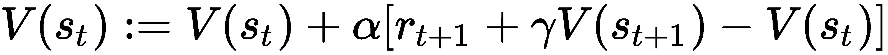

请注意，在某些参考论文或书籍中，上述公式可能会使用 `r[t]` 替代 *r[t+1]*。这只是约定上的差异，并不是错误；此处的 *r[t+1]* 表示从 `s[t]` 状态获得的奖励，并且过渡到 *s[t+1]*。

还有一种名为 *TD(λ)* 的 TD 学习变体，它使用可达性踪迹 *e(s)*，即访问状态的记录。更正式地说，我们按照以下方式执行 *TD(λ)* 更新：

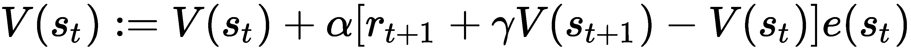

可达性踪迹由以下公式给出：

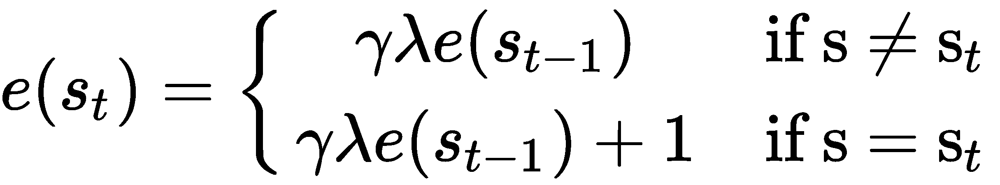

在这里，*e(s) = 0* 当 *t = 0*。对于代理所采取的每一步，可达性踪迹会对所有状态减少 *γλ*，并在当前时间步访问的状态上增加 `1`。这里，*0 ≤ λ ≤ 1*，它是一个决定奖励的影响程度分配给远程状态的参数。接下来，我们将探讨我们下两个 RL 算法（SARSA 和 Q-learning）的理论，这两个算法在 RL 社区中都非常流行。

# 理解 SARSA 和 Q-Learning

在本节中，我们将学习 SARSA 和 Q-Learning，并探讨如何使用 Python 编写它们。在深入了解之前，让我们先弄清楚什么是 SARSA 和 Q-Learning。SARSA 是一种使用状态-动作 Q 值进行更新的算法。这些概念源自计算机科学中的动态规划领域，而 Q-learning 是一种离政策算法，最早由 Christopher Watkins 在 1989 年提出，并且是广泛使用的强化学习算法。

# 学习 SARSA

**SARSA** 是另一种非常流行的在政策算法，特别是在 1990 年代。它是 TD-learning 的扩展，我们之前已经看到过，并且是一个在政策算法。SARSA 会更新状态-动作值函数，并且随着新经验的获得，这个状态-动作值函数会使用动态规划中的 Bellman 方程进行更新。我们将前述的 TD 算法扩展到状态-动作值函数 *Q(s[t],a[t])*，这个方法被称为 SARSA：

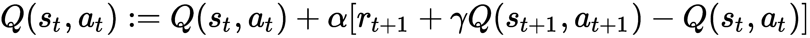

在这里，从给定的状态 `s[t]` 开始，我们采取行动 `a[t]`，获得奖励 *r[t+1]*，过渡到一个新的状态 *s[t+1]*，然后继续采取行动 *a[t+1]*，如此循环下去。这个五元组 (`s[t]`, `a[t]`, *r[t+1]*, *s[t+1]*, *a[t+1]*) 赋予了算法 SARSA 这个名字。SARSA 是一个在政策算法，因为它更新的是与估计 Q 时使用的相同策略。为了探索，你可以使用例如 *ε*-贪心策略。

# 理解 Q-learning

Q 学习是一种脱离策略的算法，最早由 Christopher Watkins 在 1989 年提出，是一种广泛使用的强化学习算法。与 SARSA 一样，Q 学习会保持每个状态-动作对的状态-动作值函数的更新，并使用动态编程的贝尔曼方程递归更新它，随着新经验的收集。请注意，它是一种脱离策略的算法，因为它使用的是评估过的状态-动作值函数，这个值将最大化。Q 学习适用于动作是离散的情况——例如，如果我们有向北、向南、向东、向西的动作，并且我们要在某个给定状态下决定最优的动作，那么 Q 学习在这种设置下是适用的。

在经典的 Q 学习方法中，更新方式如下，其中对动作执行 max 操作，即我们选择与状态*s[t+1]*对应的 Q 值最大值的动作 a：

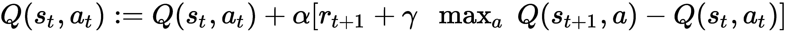

*α*是学习率，这是一个超参数，用户可以指定。

在我们用 Python 编写算法之前，让我们先了解一下将考虑哪些类型的问题。

# 悬崖行走和网格世界问题

让我们考虑悬崖行走和网格世界问题。首先，我们将介绍这些问题，然后进入编码部分。对于这两个问题，我们考虑一个具有`nrows`（行数）和`ncols`（列数）的矩形网格。我们从底部左侧单元格正下方的一个单元格开始，目标是到达底部右侧单元格正下方的目标单元格。

请注意，起点和终点单元格不属于`nrows` x `ncols`的网格单元格。在悬崖行走问题中，除了起点和终点单元格外，位于底部行单元格以南的单元格构成了悬崖，如果智能体进入这些单元格，剧集将以灾难性地掉入悬崖结束。同样，如果智能体试图离开网格单元格的左边、上边或右边边界，它将被放回到同一单元格，也就是说，它相当于没有采取任何行动。

对于网格世界问题，我们没有悬崖，但网格世界内有障碍物。如果智能体试图进入任何这些障碍物单元格，它将被弹回到它原本所在的单元格。在这两个问题中，目标是找到从起点到终点的最优路径。

那么，接下来我们深入研究吧！

# 使用 SARSA 进行悬崖行走

现在，我们将学习如何在 Python 中编码上述方程，并使用 SARSA 实现悬崖行走问题。首先，让我们导入 Python 中的`numpy`、`sys`和`matplotlib`包。如果你以前没有使用过这些包，市面上有几本关于这些主题的 Packt 书籍可以帮助你尽快掌握。请在 Linux 终端中输入以下命令来安装所需的包：

```py
sudo apt-get install python-numpy python-scipy python-matplotlib
```

现在我们将总结解决网格世界问题所涉及的代码。在终端中，使用你喜欢的编辑器（例如 gedit、emacs 或 vi）编写以下代码：

```py
import numpy as np 
import sys 
import matplotlib.pyplot as plt
```

我们将使用一个 3 x 12 的网格来解决悬崖行走问题，即有 `3` 行和 `12` 列。我们还有 `4` 个动作可以在每个单元格中执行。你可以向北、向东、向南或向西移动：

```py
nrows = 3
ncols = 12
nact = 4 
```

我们将考虑总共 `100000` 次回合。为了进行探索，我们将使用 ε-贪婪策略，*ε* 的值为 `0.1`。我们将考虑一个常数值的 *ε*，尽管有兴趣的读者可以考虑使用变化的 *ε* 值，并在回合过程中将其逐渐衰减至零。

学习率 *α* 选择为 `0.1`，折扣因子 *γ* 选择为 `0.95`，这些是解决该问题的典型值：

```py
nepisodes = 100000
epsilon = 0.1
alpha = 0.1
gamma = 0.95
```

接下来，我们将为奖励分配值。对于任何不掉入悬崖的正常动作，奖励是 `-1`；如果代理掉入悬崖，奖励是 `-100`；到达目的地的奖励也是 `-1`。稍后可以探索这些奖励的其他值，并研究其对最终 Q 值以及从起点到终点路径的影响：

```py
reward_normal = -1
reward_cliff = -100
reward_destination = -1
```

状态-动作对的 Q 值初始化为零。我们将使用一个 NumPy 数组来存储 Q 值，形状为 `nrows` x `ncols` x `nact`，即每个单元格有 `nact` 个条目，整个网格有 `nrows` x `ncols` 个单元格：

```py
Q = np.zeros((nrows,ncols,nact),dtype=np.float)
```

我们将定义一个函数，使代理回到起始位置，该位置的 (*x, y*) 坐标为（`x=0`，`y=nrows`）：

```py
def go_to_start():
    # start coordinates
    y = nrows
    x = 0
    return x, y
```

接下来，我们定义一个函数来执行随机动作，在该函数中我们定义 `a = 0` 表示向 `top/north` 移动，`a = 1` 表示向 `right/east` 移动，`a = 2` 表示向 `bottom/south` 移动，`a = 4` 表示向 `left/west` 移动。具体来说，我们将使用 NumPy 的 `random.randint()` 函数，如下所示：

```py
def random_action():
    # a = 0 : top/north
    # a = 1 : right/east
    # a = 2 : bottom/south
    # a = 3 : left/west
    a = np.random.randint(nact)
    return a
```

现在我们将定义 `move` 函数，该函数将接受代理的给定位置 (*x, y*) 和当前的动作 `a`，然后执行该动作。它将返回执行该动作后代理的新位置 (*x1, y1*) 以及代理的状态，我们定义 `state = 0` 表示代理在执行动作后 `OK`；`state = 1` 表示到达目的地；`state = 2` 表示掉入悬崖。如果代理通过左侧、顶部或右侧离开网格，它将被送回到同一网格（等同于没有执行任何动作）：

```py
def move(x,y,a):
    # state = 0: OK
    # state = 1: reached destination
    # state = 2: fell into cliff
    state = 0

   if (x == 0 and y == nrows and a == 0):
     # start location
     x1 = x
     y1 = y - 1
     return x1, y1, state
   elif (x == ncols-1 and y == nrows-1 and a == 2):
     # reached destination
     x1 = x
     y1 = y + 1
     state = 1
     return x1, y1, state
   else:
     # inside grid; perform action
     if (a == 0):
       x1 = x
       y1 = y - 1
     elif (a == 1):
       x1 = x + 1
       y1 = y
     elif (a == 2):
       x1 = x
       y1 = y + 1
     elif (a == 3):
       x1 = x - 1
       y1 = y

     # don't allow agent to leave boundary
     if (x1 < 0):
       x1 = 0
     if (x1 > ncols-1):
       x1 = ncols-1
     if (y1 < 0):
       y1 = 0
     if (y1 > nrows-1):
       state = 2

   return x1, y1, state
```

接下来，我们将定义 `exploit` 函数，该函数将接受代理的 (*x, y*) 位置，并根据 Q 值采取贪婪的动作，即选择在该 (*x, y*) 位置具有最高 Q 值的 `a` 动作。如果我们处于起始位置，我们将向北移动（`a = 0`）；如果我们距离目的地一步之遥，我们将向南移动（`a = 2`）：

```py
def exploit(x,y,Q):
   # start location
   if (x == 0 and y == nrows):
     a = 0
     return a

   # destination location
   if (x == ncols-1 and y == nrows-1):
     a = 2
     return a

   if (x == ncols-1 and y == nrows):
     print("exploit at destination not possible ")
     sys.exit()

   # interior location
   if (x < 0 or x > ncols-1 or y < 0 or y > nrows-1):
     print("error ", x, y)
     sys.exit()

   a = np.argmax(Q[y,x,:])
   return a
```

接下来，我们将使用以下 `bellman()` 函数执行贝尔曼更新：

```py
def bellman(x,y,a,reward,Qs1a1,Q):
  if (y == nrows and x == 0):
    # at start location; no Bellman update possible
    return Q

  if (y == nrows and x == ncols-1):
    # at destination location; no Bellman update possible
    return Q

  # perform the Bellman update 
  Q[y,x,a] = Q[y,x,a] + alpha*(reward + gamma*Qs1a1 - Q[y,x,a])
  return Q
```

接着我们将定义一个函数，根据随机数是否小于 *ε* 来选择探索或利用，这个参数是我们在 ε-贪心探索策略中使用的。为此，我们将使用 NumPy 的 `np.random.uniform()`，它将输出一个介于零和一之间的实数随机数：

```py
def explore_exploit(x,y,Q):
  # if we end up at the start location, then exploit
  if (x == 0 and y == nrows):
     a = 0
     return a

  # call a uniform random number
  r = np.random.uniform()

  if (r < epsilon):
    # explore
    a = random_action()
  else:
    # exploit
    a = exploit(x,y,Q)
  return a
```

现在我们已经具备了解决悬崖行走问题所需的所有函数。因此，我们将对回合进行循环，在每个回合中，我们从起始位置开始，接着进行探索或利用，然后根据动作移动智能体一步。以下是这部分的 Python 代码：

```py
for n in range(nepisodes+1):

  # print every 1000 episodes 
  if (n % 1000 == 0):
    print("episode #: ", n)

  # start
  x, y = go_to_start()

  # explore or exploit
  a = explore_exploit(x,y,Q)

  while(True):
   # move one step
   x1, y1, state = move(x,y,a)
```

我们根据所获得的奖励执行贝尔曼更新；请注意，这基于本章理论部分之前呈现的方程。如果我们到达目的地或掉下悬崖，我们就停止该回合；如果没有，我们继续进行一次探索或利用策略，然后继续下去。以下代码中的`state`变量取值为`1`表示到达目的地，取值为`2`表示掉下悬崖，否则为`0`：

```py
   # Bellman update
   if (state == 1):
      reward = reward_destination
      Qs1a1 = 0.0
      Q = bellman(x,y,a,reward,Qs1a1,Q)
      break
   elif (state == 2):
      reward = reward_cliff
      Qs1a1 = 0.0
      Q = bellman(x,y,a,reward,Qs1a1,Q)
      break
   elif (state == 0):
      reward = reward_normal
      # Sarsa
      a1 = explore_exploit(x1,y1,Q)
      if (x1 == 0 and y1 == nrows):
        # start location
        Qs1a1 = 0.0
      else:
        Qs1a1 = Q[y1,x1,a1]

      Q = bellman(x,y,a,reward,Qs1a1,Q)
      x = x1
      y = y1
      a = a1
```

上述代码将完成所有回合，现在我们已经得到了收敛的 Q 值。接下来，我们将使用 `matplotlib` 绘制每个动作的 Q 值：

```py
for i in range(nact):
  plt.subplot(nact,1,i+1)
  plt.imshow(Q[:,:,i])
  plt.axis('off')
  plt.colorbar()
  if (i == 0):
    plt.title('Q-north')
  elif (i == 1):
    plt.title('Q-east')
  elif (i == 2):
    plt.title('Q-south')
  elif (i == 3):
    plt.title('Q-west')
  plt.savefig('Q_sarsa.png')
  plt.clf()
  plt.close()
```

最后，我们将使用之前收敛的 Q 值进行路径规划。也就是说，我们将绘制出智能体从起点到终点的准确路径，使用最终收敛的 Q 值。为此，我们将创建一个名为`path`的变量，并为其存储追踪`路径`的值。然后，我们将使用 `matplotlib` 来绘制它，如下所示：

```py
path = np.zeros((nrows,ncols,nact),dtype=np.float)
x, y = go_to_start()
while(True):
 a = exploit(x,y,Q)
 print(x,y,a)
 x1, y1, state = move(x,y,a)
 if (state == 1 or state == 2):
 print("breaking ", state)
 break
 elif (state == 0):
 x = x1
 y = y1
 if (x >= 0 and x <= ncols-1 and y >= 0 and y <= nrows-1):
 path[y,x] = 100.0
plt.imshow(path)
plt.savefig('path_sarsa.png')
```

就这样。我们已经完成了使用 SARSA 解决悬崖行走问题所需的编码。现在我们来查看结果。在下面的屏幕截图中，我们展示了在网格中每个位置的每个动作（向北、向东、向南或向西）的 Q 值。如图例所示，黄色表示高 Q 值，紫色表示低 Q 值。

从 SARSA 的结果来看，它明显地通过选择不向南走来避免掉进悬崖，尤其是在智能体正好位于悬崖北侧时，南方动作的负 Q 值很大：

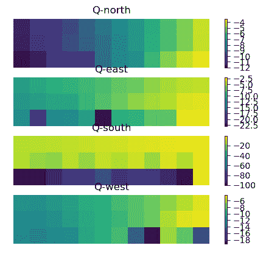

图 1：使用 SARSA 进行悬崖行走问题的 Q 值

接下来，我们将绘制智能体从起点到终点的路径，见下图：

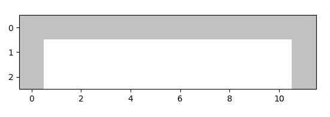

图 2：使用 SARSA 的智能体路径

现在我们将使用 Q-learning 来研究相同的悬崖行走问题。

# 使用 Q-learning 进行悬崖行走

我们现在将重复相同的悬崖行走问题，尽管这次我们使用 Q-learning 来代替 SARSA。大部分代码与 SARSA 相同，除了几个总结的差异。由于 Q-learning 使用贪心策略选择动作，我们将使用以下函数来计算给定位置的最大 Q 值。大部分代码与前一节相同，因此我们只指定需要更改的部分。

现在，让我们用 Q-learning 编写悬崖行走代码。

`max_Q()`函数定义如下：

```py
def max_Q(x,y,Q):
  a = np.argmax(Q[y,x,:]) 
  return Q[y,x,a]
```

我们将使用先前定义的`max_Q()`函数来计算新状态下的 Q 值：

```py
Qs1a1 = max_Q(x1,y1,Q)
```

此外，选择探索还是利用的动作是在`while`循环内完成的，因为在利用时我们会贪婪地选择动作：

```py
# explore or exploit
a = explore_exploit(x,y,Q)
```

这就是编写 Q-learning 代码的全部内容。我们将应用它来解决悬崖行走问题，并展示每个动作的 Q 值以及代理从起点到终点所走的路径，具体内容将在以下截图中显示：

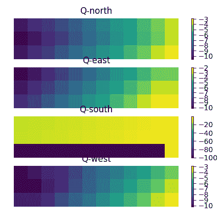

图 3：使用 Q-learning 进行悬崖行走问题的 Q 值

如图所示，对于 Q-learning 和 SARSA，路径有所不同。由于 Q-learning 是一种贪婪策略，代理现在选择接近悬崖的路径（见下图*图 4*），因为它是最短路径：

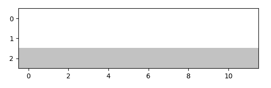

图 4：使用 Q-learning 解决悬崖行走问题时，代理所走的路径

另一方面，由于 SARSA 更具远见，因此它选择了安全但较长的路径，即位于顶部的单元格行（见*图 2*）。

我们的下一个问题是网格世界问题，我们必须在一个网格中进行导航。我们将在 SARSA 中实现这个问题。

# 使用 SARSA 的网格世界

我们接下来将考虑网格世界问题，并使用 SARSA 来解决它。我们将在悬崖位置引入障碍物。代理的目标是从起点导航到目标，同时避开障碍物。我们将在`obstacle_cells`列表中存储障碍物单元格的坐标，每个条目表示障碍物单元格的(*x, y*)坐标。

以下是此任务涉及的步骤总结：

1.  大部分代码与之前使用的相同，区别将在此总结

1.  在网格中放置障碍物

1.  `move()`函数还需要在网格中查找障碍物

1.  绘制 Q 值以及代理所走的路径

在这里，我们将开始用 Python 编写算法：

```py
import numpy as np
import sys
import matplotlib.pyplot as plt

nrows = 3
ncols = 12
nact = 4

nepisodes = 100000
epsilon = 0.1
alpha = 0.1
gamma = 0.95

reward_normal = -1
reward_destination = -1

# obstacles
obstacle_cells = [(4,1), (4,2), (8,0), (8,1)]
```

`move()`函数现在将发生变化，因为我们还需要检查障碍物。如果代理最终进入某个障碍物单元格，它将被推回到原来的位置，如以下代码片段所示：

```py
def move(x,y,a):
  # state = 0: OK
  # state = 1: reached destination
  state = 0 

  if (x == 0 and y == nrows and a == 0):
    # start location
    x1 = x
    y1 = y - 1 
    return x1, y1, state 
  elif (x == ncols-1 and y == nrows-1 and a == 2):
    # reached destination
    x1 = x
    y1 = y + 1
    state = 1
    return x1, y1, state
  else: 

    if (a == 0):
      x1 = x
      y1 = y - 1
    elif (a == 1):
      x1 = x + 1
      y1 = y
    elif (a == 2):
      x1 = x
      y1 = y + 1
    elif (a == 3):
      x1 = x - 1 
      y1 = y

    if (x1 < 0):
     x1 = 0
    if (x1 > ncols-1):
     x1 = ncols-1
    if (y1 < 0):
     y1 = 0
    if (y1 > nrows-1):
     y1 = nrows-1

    # check for obstacles; reset to original (x,y) if inside obstacle
    for i in range(len(obstacle_cells)):
      if (x1 == obstacle_cells[i][0] and y1 == obstacle_cells[i][1]):
         x1 = x
         y1 = y 

    return x1, y1, state 
```

这就是用 SARSA 编写网格世界代码的全部内容。Q 值和所走的路径将在以下图表中显示：

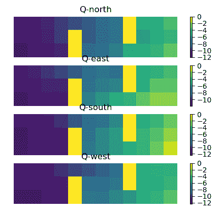

图 5：使用 SARSA 解决网格世界问题时，每个动作的 Q 值

如下图所示，代理绕过障碍物到达目的地：

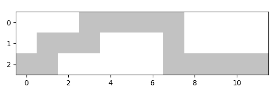

图 6：使用 SARSA 解决网格世界问题时代理所走的路径

使用 Q-learning 解决网格世界问题并非易事，因为采用的贪婪策略无法轻易避免代理在某一状态下重复执行相同动作。通常，收敛速度非常慢，因此暂时避免使用。

# 总结

本章中，我们探讨了时序差分（TD）概念。我们还学习了前两个 RL 算法：Q 学习和 SARSA。我们看到如何用 Python 编写这两个算法，并用它们解决悬崖行走和网格世界问题。这两个算法使我们对 RL 的基础有了良好的理解，并展示了如何从理论过渡到代码。这两个算法在 1990 年代和 2000 年代初期非常流行，在深度强化学习崭露头角之前。尽管如此，Q 学习和 SARSA 在 RL 社区中至今仍然被使用。

在下一章中，我们将探讨深度神经网络在强化学习（RL）中的应用，进而形成深度强化学习（deep RL）。我们将看到 Q 学习的一个变种，称为**深度 Q 网络**（**DQNs**），它将使用神经网络代替我们在本章中看到的表格型状态-动作值函数。请注意，只有状态和动作数量较少的问题才适合 Q 学习和 SARSA。当状态和/或动作数量较多时，我们会遇到所谓的“维度灾难”（Curse of Dimensionality），在这种情况下，由于过度的内存使用，表格方法变得不可行；在这些问题中，DQN 更为适用，并且将是下一章的核心内容。

# 进一步阅读

+   *强化学习：导论* 由 *理查德·萨顿 和 安德鲁·巴尔托* 编著，2018 年
