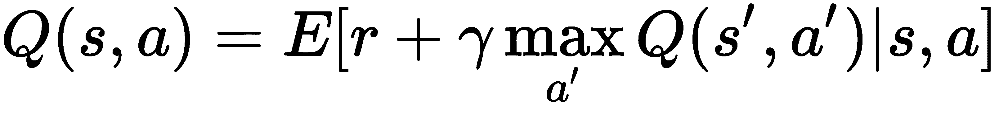
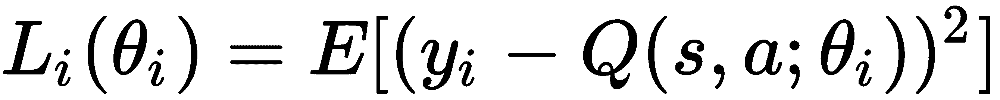
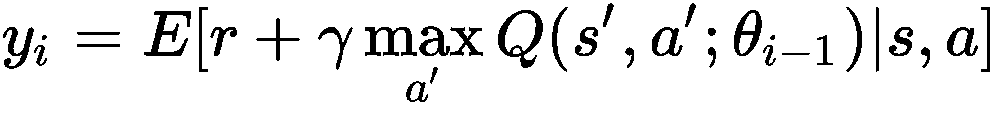
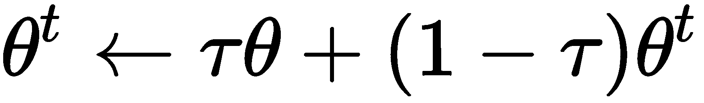
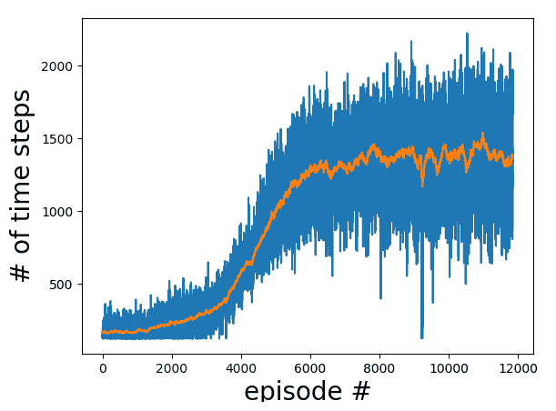
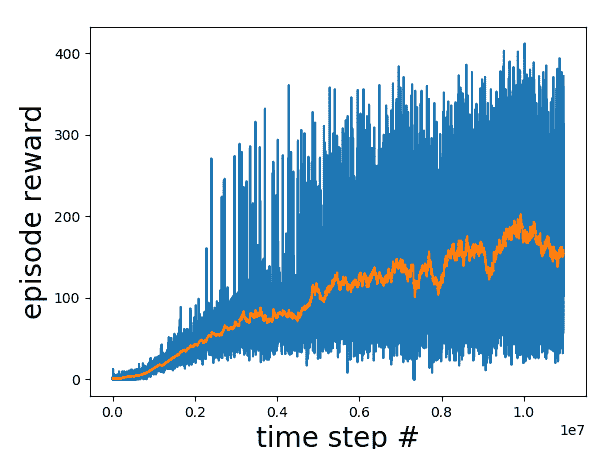

# 第三章：深度 Q 网络

**深度 Q 网络**（**DQN**）革新了**强化学习**（**RL**）领域。我相信你一定听说过 Google DeepMind，它曾是一个名为 DeepMind Technologies 的英国公司，直到 2014 年被 Google 收购。DeepMind 在 2013 年发布了一篇论文，标题为*Playing Atari with Deep RL*，在这篇论文中，他们在强化学习的背景下使用了**深度神经网络**（**DNN**），或者被称为 DQN——这是该领域的奠基性想法。这篇论文彻底革新了深度强化学习的领域，接下来的发展也成为了历史！后来，在 2015 年，他们又发布了第二篇论文，标题为*Human Level Control Through Deep RL*，发表于《自然》杂志，提出了一些更有趣的想法，进一步改进了前一篇论文。两篇论文一起引发了深度强化学习领域的“寒武纪大爆发”，出现了多个新算法，改善了使用神经网络训练智能体的效果，也推动了深度强化学习在实际问题中的应用。

在本章中，我们将研究 DQN，并使用 Python 和 TensorFlow 进行编码。这将是我们在强化学习中第一次使用深度神经网络。同时，这也是我们本书中第一次尝试通过深度强化学习解决实际的控制问题。

在本章中，将涉及以下主题：

+   学习 DQN 背后的理论

+   理解目标网络

+   了解回放缓冲区

+   介绍 Atari 环境

+   在 TensorFlow 中编写 DQN

+   评估 DQN 在 Atari Breakout 上的表现

# 技术要求

了解以下内容将有助于你更好地理解本章介绍的概念：

+   Python（2 及以上版本）

+   NumPy

+   TensorFlow（版本 1.4 或更高）

# 学习 DQN 背后的理论

在本节中，我们将探讨 DQN 背后的理论，包括其中的数学原理，并学习如何使用神经网络来评估`value`函数。

之前，我们讨论了 Q 学习，其中*Q(s,a)*被存储并作为一个多维数组进行评估，每个状态-动作对有一个条目。这在网格世界和悬崖行走问题中效果良好，因为这两个问题在状态和动作空间中都是低维的。那么，我们能将此方法应用于高维问题吗？答案是否定的，因为存在*维度灾难*，使得存储大量的状态和动作变得不可行。此外，在连续控制问题中，动作作为一个实数变化，虽然可能有无限多个实数值，这些值无法表示为表格型的`Q`数组。这就催生了强化学习中的函数逼近方法，尤其是使用深度神经网络（DNNs）的方法——也就是 DQN。在这里，*Q(s,a)*被表示为一个 DNN，输出的是`Q`的值。

以下是 DQN 涉及的步骤：

1.  使用 Bellman 方程更新状态-动作价值函数，其中(*s, a*)是某时刻的状态和动作，`t`、*s'*和*a'*分别是下一个时刻*t+1*的状态和动作，*γ*是折扣因子：



1.  然后我们在第`i`步定义一个损失函数来训练 Q 网络，如下所示：



上述参数是神经网络参数，用*θ*表示，因此 Q 值写作*Q(s, a; θ)*。

1.  *y[i]*是第`i`次迭代的目标，给定的方程如下：



1.  然后我们通过最小化损失函数*L(θ)*，使用优化算法如梯度下降、RMSprop 和 Adam 来训练 DQN 神经网络。

我们之前使用了最小二乘损失来计算 DQN 的损失函数，也叫做 L2 损失。你也可以考虑其他损失函数，如 Huber 损失，它结合了 L1 和 L2 损失，L2 损失在接近零的地方，而 L1 损失在远离零的区域。Huber 损失对异常值比 L2 损失更不敏感。

我们现在来看一下目标网络的使用。这是一个非常重要的概念，对于稳定训练是必不可少的。

# 理解目标网络

DQN 的一个有趣特点是在训练过程中使用第二个网络，称为目标网络。这个第二个网络用于生成目标-Q 值，这些值在训练过程中用于计算损失函数。为什么不只用一个网络进行两个估算，也就是说既用来选择行动`a`，又用来更新 Q 网络呢？问题在于，在训练的每一步，Q 网络的值都会发生变化。如果我们使用不断变化的值来更新网络，那么估算可能很容易变得不稳定——网络可能会在目标 Q 值和估算 Q 值之间进入反馈回路。为了减少这种不稳定性，目标网络的权重是固定的——即，慢慢地更新为主 Q 网络的值。这使得训练变得更加稳定和实际。

我们有第二个神经网络，我们称之为目标网络。它的架构与主 Q 网络相同，尽管神经网络的参数值不同。每经过`N`步，参数会从 Q 网络复制到目标网络。这会导致训练更加稳定。例如，可以使用`N` = 10,000 步。另一种选择是慢慢更新目标网络的权重（这里，*θ*是 Q 网络的权重，*θ^t*是目标网络的权重）：



这里，*τ*是一个小的数值，比如 0.001。使用指数移动平均的方法是本书推荐的选择。

现在让我们了解一下在离策略算法中回放缓冲区的使用。

# 了解回放缓冲区

我们需要元组（`s`，`a`，`r`，`s'`，`done`）来更新 DQN，其中`s`和`a`分别是时间`t`的状态和动作；`s'`是时间*t+1*的新状态；`done`是一个布尔值，根据回合是否结束，它是`True`或`False`，也就是文献中所称的终止值。这个布尔变量`done`或`terminal`用于在 Bellman 更新中正确处理回合的最后终止状态（因为我们无法对终止状态做`*r + γ max Q(s',a')*`）。DQNs 中的一个问题是，我们使用连续的（`s`，`a`，`r`，`s'`，`done`）元组样本，这些样本是相关的，因此训练可能会过拟合。

为了缓解这个问题，使用了回放缓冲区，其中元组（`s`，`a`，`r`，`s'`，`done`）从经验中存储，且从回放缓冲区中随机采样一个这样的经验小批量用于训练。这确保了每个小批量采样的样本是**独立同分布**（**IID**）的。通常使用较大的回放缓冲区，例如 500,000 到 100 万个样本。在训练开始时，回放缓冲区会填充到足够数量的样本，并且会随着新经验的到来而更新。一旦回放缓冲区填满到最大样本数量，旧样本会被一个一个地丢弃。这是因为旧样本是由劣质策略生成的，在后期训练时不再需要，因为智能体在学习过程中已经进步。

在最近的一篇论文中，DeepMind 提出了一种优先回放缓冲区，其中使用时间差分误差的绝对值来为缓冲区中的样本赋予重要性。因此，误差较大的样本具有更高的优先级，因此被采样的几率更大。这种优先回放缓冲区比普通的回放缓冲区学习更快。然而，它的编码稍微困难一些，因为它使用了 SumTree 数据结构，这是一个二叉树，其中每个父节点的值是其两个子节点值的总和。此优先经验回放将在此处不再深入讨论！

优先经验回放缓冲区基于这篇 DeepMind 论文：[`arxiv.org/abs/1511.05952`](https://arxiv.org/abs/1511.05952)

现在我们将研究 Atari 环境。如果你喜欢玩视频游戏，你一定会喜欢这一部分！

# 介绍 Atari 环境

Atari 2600 游戏套件最早于 1970 年代发布，并在当时非常火爆。它包括几个游戏，用户通过键盘输入动作进行游戏。这些游戏在当时非常受欢迎，激励了 1970 年代和 1980 年代的许多电脑游戏玩家，但按照今天视频游戏玩家的标准来看，它们显得过于原始。然而，它们今天在强化学习（RL）社区中仍然很受欢迎，因为它们是可以被 RL 智能体训练的游戏入口。

# Atari 游戏总结

这里是 Atari 部分精选游戏的总结（由于版权原因，我们不会展示游戏截图，但会提供链接）。

# Pong

我们的第一个例子是一个叫做 Pong 的乒乓球游戏，用户可以上下移动击打乒乓球，将其击打给对方，另一方是计算机。首先得到 21 分的人将赢得比赛。可以在[`gym.openai.com/envs/Pong-v0/`](https://gym.openai.com/envs/Pong-v0/)找到来自 Atari 的 Pong 游戏截图。 [](https://gym.openai.com/envs/Pong-v0/)

# Breakout

在另一个游戏中，叫做 Breakout，用户必须左右移动挡板来击打球，球随后会弹跳并撞击屏幕顶部的方块。击中方块的数量越多，玩家能够获得的积分或奖励就越高。每局游戏总共有五条生命，如果玩家未能击中球，就会失去一条生命。可以在[`gym.openai.com/envs/Breakout-v0/`](https://gym.openai.com/envs/Breakout-v0/)找到来自 Atari 的 Breakout 游戏截图。 [](https://gym.openai.com/envs/Breakout-v0/)

# Space Invaders

如果你喜欢射击外星人，那么 Space Invaders 就是你的游戏。在这个游戏中，一波接一波的外星人从顶部降下，目标是用激光束射击它们，获得积分。你可以在[`gym.openai.com/envs/SpaceInvaders-v0/`](https://gym.openai.com/envs/SpaceInvaders-v0/)找到该游戏的链接。

# LunarLander

或者，如果你对太空旅行感兴趣，那么 LunarLander 是关于将太空船（类似于阿波罗 11 号的“鹰”号）着陆在月球表面。在每个关卡中，着陆区的表面会发生变化，目标是引导太空船在两个旗帜之间的月球表面着陆。可以在[`gym.openai.com/envs/LunarLander-v2/`](https://gym.openai.com/envs/LunarLander-v2/)找到 LunarLander 的 Atari 截图。

# 经典街机学习环境

Atari 上有超过 50 款此类游戏，它们现在是**经典街机学习环境**（**ALE**）的一部分，ALE 是一个面向对象的框架，建立在 Atari 之上。如今，OpenAI 的 gym 被用于调用 Atari 游戏，以便训练强化学习（RL）代理来玩这些游戏。例如，你可以在 Python 中导入`gym`并按如下方式进行游戏。

`reset()`函数重置游戏环境，`render()`函数渲染游戏截图：

```py
import gym
env = gym.make('SpaceInvaders-v0')
env.reset()
env.render()
```

我们现在将使用 TensorFlow 和 Python 编写一个 DQN，来训练一个代理如何玩 Atari Breakout。

# 用 TensorFlow 编写 DQN

在这里，我们将使用 TensorFlow 编写一个 DQN 并玩 Atari Breakout。我们将使用三个 Python 文件：

+   `dqn.py`：这个文件将包含主循环，在这里我们将探索环境并调用更新函数。

+   `model.py`：这个文件将包含 DQN 代理的类，在这里我们将构建神经网络并实现训练所需的函数。

+   `funcs.py`：此文件将涉及一些工具函数——例如，用于处理图像帧或填充重放缓冲区

# 使用 model.py 文件

首先编写 `model.py` 文件。相关步骤如下：

1.  **导入所需的包**：

```py
import numpy as np
import sys
import os
import random
import tensorflow as tf
```

1.  **选择** **更大** **或** **更小** **的网络**：我们将使用两种神经网络架构，一种称为 `bigger`，另一种称为 `smaller`。暂时使用 `bigger` 网络，感兴趣的用户可以稍后将网络更改为 `smaller` 选项并比较性能：

```py
NET = 'bigger' # 'smaller'
```

1.  **选择** **损失** **函数（L2 损失或 Huber 损失）**：对于 Q-learning 的`loss`函数，我们可以选择 L2 损失或 Huber 损失。两者都会在代码中使用。我们暂时选择`huber`：

```py
LOSS = 'huber' # 'L2'
```

1.  **定义神经网络权重初始化**：接下来，我们将为神经网络的权重指定一个初始化器。`tf.variance_scaling_initializer(scale=2)` 用于 He 初始化。也可以使用 Xavier 初始化，并且已提供为注释。感兴趣的用户稍后可以比较 He 和 Xavier 初始化器的性能：

```py
init = tf.variance_scaling_initializer(scale=2) # tf.contrib.layers.xavier_initializer()
```

1.  **定义** **QNetwork()** **类**：然后我们将按如下方式定义 `QNetwork()` 类。它将包含一个 `__init__()` 构造函数，以及 `_build_model()`、`predict()` 和 `update()` 函数。`__init__` 构造函数如下所示：

```py
class QNetwork():
 def __init__(self, scope="QNet", VALID_ACTIONS=[0, 1, 2, 3]):
 self.scope = scope
 self.VALID_ACTIONS = VALID_ACTIONS
 with tf.variable_scope(scope):
 self._build_model()
```

1.  **完成** **_build_model()** **函数**：在 `_build_model()` 中，我们首先定义 TensorFlow 的 `tf_X`、`tf_Y` 和 `tf_actions` 占位符。请注意，图像帧在重放缓冲区中以 `uint8` 格式存储，以节省内存，因此它们通过转换为 `float` 并除以 `255.0` 来进行归一化，以将 `X` 输入值压缩到 0-1 范围内：

```py
def _build_model(self):
  # input placeholders; input is 4 frames of shape 84x84 
  self.tf_X = tf.placeholder(shape=[None, 84, 84, 4], dtype=tf.uint8, name="X")
  # TD
  self.tf_y = tf.placeholder(shape=[None], dtype=tf.float32, name="y")
  # action
  self.tf_actions = tf.placeholder(shape=[None], dtype=tf.int32, name="actions")
  # normalize input
  X = tf.to_float(self.tf_X) / 255.0
  batch_size = tf.shape(self.tf_X)[0]
```

1.  **定义卷积层**：如前所述，我们有两个神经网络选项，`bigger` 和 `smaller`。`bigger` 网络有三个卷积层，后面跟着一个全连接层。`smaller` 网络只有两个卷积层，后面跟着一个全连接层。我们可以使用 `tf.contrib.layers.conv2d()` 定义卷积层，使用 `tf.contrib.layers.fully_connected()` 定义全连接层。请注意，在最后一个卷积层之后，我们需要先将输出展平，然后再传递给全连接层，展平操作将使用 `tf.contrib.layers.flatten()`。我们使用之前定义的 `winit` 对象作为权重初始化器：

```py
if (NET == 'bigger'):
  # bigger net
  # 3 conv layers
  conv1 = tf.contrib.layers.conv2d(X, 32, 8, 4, padding='VALID', activation_fn=tf.nn.relu, weights_initializer=winit)
  conv2 = tf.contrib.layers.conv2d(conv1, 64, 4, 2, padding='VALID', activation_fn=tf.nn.relu, weights_initializer=winit)
  conv3 = tf.contrib.layers.conv2d(conv2, 64, 3, 1, padding='VALID', activation_fn=tf.nn.relu, weights_initializer=winit)
  # fully connected layers
  flattened = tf.contrib.layers.flatten(conv3)
  fc1 = tf.contrib.layers.fully_connected(flattened, 512, activation_fn=tf.nn.relu, weights_initializer=winit)

  elif (NET == 'smaller'): 

  # smaller net
  # 2 conv layers
  conv1 = tf.contrib.layers.conv2d(X, 16, 8, 4, padding='VALID', activation_fn=tf.nn.relu, weights_initializer=winit)
  conv2 = tf.contrib.layers.conv2d(conv1, 32, 4, 2, padding='VALID',activation_fn=tf.nn.relu, weights_initializer=winit)
  # fully connected layers
  flattened = tf.contrib.layers.flatten(conv2)
  fc1 = tf.contrib.layers.fully_connected(flattened, 256, activation_fn=tf.nn.relu, weights_initializer=winit) 
```

1.  **定义全连接层**：最后，我们有一个全连接层，其大小根据动作的数量来确定，使用`len(self.VALID_ACTIONS)`来指定。这个最后的全连接层的输出存储在`self.predictions`中，表示*Q(s,a)*，我们在之前的*学习 DQN 背后的理论*部分的方程中看到过。传递给这个函数的动作（`self.tf_actions`）需要转换为独热编码格式，我们使用`tf.one_hot()`。请注意，`one_hot`是一种表示动作编号的方式，它将所有动作的值设为零，除了某个动作外，该动作对应的值为`1.0`。然后，我们使用`self.predictions * action_one_hot`将预测与独热编码的动作相乘，最后使用`tf.reduce_sum()`对其求和；这被存储在`self.action_predictions`变量中：

```py
# Q(s,a)
  self.predictions = tf.contrib.layers.fully_connected(fc1, len(self.VALID_ACTIONS), activation_fn=None, weights_initializer=winit)
  action_one_hot = tf.one_hot(self.tf_actions, tf.shape(self.predictions)[1], 1.0, 0.0, name='action_one_hot')
  self.action_predictions = tf.reduce_sum(self.predictions * action_one_hot, reduction_indices=1, name='act_pred')
```

1.  **计算训练 Q 网络的损失**：我们通过使用 L2 损失或 Huber 损失来计算训练 Q 网络的损失，存储在`self.loss`中，损失的类型由`LOSS`变量决定。对于 L2 损失，我们使用`tf.squared_difference()`函数；对于 Huber 损失，我们使用`huber_loss()`，我们很快会定义它。损失会在多个样本上取平均，为此我们使用`tf.reduce_mean()`函数。请注意，我们将计算之前定义的`tf_y`占位符和前一步获得的`action_predictions`变量之间的损失：

```py
if (LOSS == 'L2'):
   # L2 loss
   self.loss = tf.reduce_mean(tf.squared_difference(self.tf_y, self.action_predictions), name='loss')
elif (LOSS == 'huber'):
   # Huber loss
   self.loss = tf.reduce_mean(huber_loss(self.tf_y-self.action_predictions), name='loss')
```

1.  **使用优化器**：我们使用 RMSprop 或 Adam 优化器，并将其存储在`self.optimizer`中。我们的学习目标是最小化`self.loss`，因此我们使用`self.optimizer.minimize()`。这被存储在`self.train_op`中：

```py
# optimizer 
  #self.optimizer = tf.train.RMSPropOptimizer(learning_rate=0.00025, momentum=0.95, epsilon=0.01)
  self.optimizer = tf.train.AdamOptimizer(learning_rate=2e-5)
  self.train_op=
        self.optimizer.minimize(self.loss,global_step=tf.contrib.framework.get_global_step())
```

1.  **为类定义** **predict()** **函数**：在`predict()`函数中，我们使用 TensorFlow 的`sess.run()`运行之前定义的`self.predictions`函数，其中`sess`是传递给此函数的`tf.Session()`对象。状态作为参数传递给此函数，存储在`s`变量中，之后传递给 TensorFlow 占位符`tf_X`：

```py
def predict(self, sess, s):
   return sess.run(self.predictions, { self.tf_X: s})
```

1.  **为类定义** **update()** **函数**：最后，在`update()`函数中，我们调用`train_op`和`loss`对象，并将字典`a`传递给参与执行这些操作的占位符，我们称之为`feed_dict`。状态存储在`s`中，动作存储在`a`中，目标存储在`y`中：

```py
def update(self, sess, s, a, y):
   feed_dict = { self.tf_X: s, self.tf_y: y, self.tf_actions: a }
   _, loss = sess.run([self.train_op, self.loss], feed_dict)
   return loss
```

1.  **在类外定义** **huber_loss()** **函数**：完成`model.py`的最后一项任务是定义 Huber 损失函数，它是 L1 和 L2 损失的结合。当输入小于`1.0`时，使用 L2 损失，其他情况使用 L1 损失：

```py
# huber loss
def huber_loss(x):
 condition = tf.abs(x) < 1.0
 output1 = 0.5 * tf.square(x)
 output2 = tf.abs(x) - 0.5
 return tf.where(condition, output1, output2)
```

# 使用`funcs.py`文件

接下来，我们将通过完成以下步骤来编写`funcs.py`：

1.  **导入包**：首先，我们导入所需的包：

```py
import numpy as np
import sys
import tensorflow as tf
```

1.  **完成** **ImageProcess()** **类**：接下来，将来自 Atari 模拟器的 210 x 160 x 3 RGB 图像转换为 84 x 84 的灰度图像。为此，我们创建了一个`ImageProcess()`类，并使用 TensorFlow 的实用函数，如`rgb_to_grayscale()`将 RGB 转换为灰度，`crop_to_bounding_box()`将图像裁剪到感兴趣的区域，`resize_images()`将图像调整为所需的 84 x 84 大小，以及`squeeze()`去除输入中的维度。该类的`process()`函数通过调用`self.output`上的` sess.run()`函数来执行这些操作；请注意，我们将`state`变量作为字典传递。

```py
# convert raw Atari RGB image of size 210x160x3 into 84x84 grayscale image
class ImageProcess():
  def __init__(self):
    with tf.variable_scope("state_processor"):
     self.input_state = tf.placeholder(shape=[210, 160, 3], dtype=tf.uint8)
     self.output = tf.image.rgb_to_grayscale(self.input_state)
     self.output = tf.image.crop_to_bounding_box(self.output, 34, 0, 160, 160)
     self.output = tf.image.resize_images(self.output, [84, 84], method=tf.image.ResizeMethod.NEAREST_NEIGHBOR)
     self.output = tf.squeeze(self.output)

  def process(self, sess, state):
    return sess.run(self.output, { self.input_state: state })
```

1.  **从一个网络复制模型参数到另一个网络**：下一步是编写一个名为`copy_model_parameters()`的函数，该函数将接受`tf.Session()`对象`sess`和两个网络（在本例中为 Q 网络和目标网络）作为参数。我们将它们命名为`qnet1`和`qnet2`。该函数将把`qnet1`的参数值复制到`qnet2`：

```py
# copy params from qnet1 to qnet2
def copy_model_parameters(sess, qnet1, qnet2):
    q1_params = [t for t in tf.trainable_variables() if t.name.startswith(qnet1.scope)]
    q1_params = sorted(q1_params, key=lambda v: v.name)
    q2_params = [t for t in tf.trainable_variables() if t.name.startswith(qnet2.scope)]
    q2_params = sorted(q2_params, key=lambda v: v.name)
    update_ops = []
    for q1_v, q2_v in zip(q1_params, q2_params):
        op = q2_v.assign(q1_v)
        update_ops.append(op)
    sess.run(update_ops)
```

1.  **编写一个使用 ε-贪婪策略进行探索或开发的函数**：我们将编写一个名为`epsilon_greedy_policy()`的函数，该函数将根据通过 NumPy 的`np.random.rand()`计算得到的随机实数是否小于`epsilon`（之前描述的ε-贪婪策略参数）来决定是进行探索还是开发。对于探索，所有的动作具有相等的概率，每个动作的概率为`1/(num_actions)`，其中`num_actions`是动作的数量（在 Breakout 游戏中为四个）。另一方面，对于开发，我们使用 Q 网络的`predict()`函数获取 Q 值，并通过 NumPy 的`np.argmax()`函数确定具有最高 Q 值的动作。该函数的输出是每个动作的概率，在开发的情况下，除了与最大 Q 值对应的那个动作，其他动作的概率都为`0`，对应的最大 Q 值动作的概率被赋为`1.0`：

```py
# epsilon-greedy
def epsilon_greedy_policy(qnet, num_actions):
    def policy_fn(sess, observation, epsilon):
        if (np.random.rand() < epsilon): 
          # explore: equal probabiities for all actions
          A = np.ones(num_actions, dtype=float) / float(num_actions)
        else:
          # exploit 
          q_values = qnet.predict(sess, np.expand_dims(observation, 0))[0]
          max_Q_action = np.argmax(q_values)
          A = np.zeros(num_actions, dtype=float)
          A[max_Q_action] = 1.0 
        return A
    return policy_fn
```

1.  **编写一个函数来填充回放记忆**：最后，我们将编写`populate_replay_mem`函数，用于将`replay_memory_init_size`数量的样本填充到回放缓冲区。首先，我们使用`env.reset()`重置环境。然后，我们处理从重置中获得的状态。每个状态需要四帧，因为代理否则无法判断球或挡板的运动方向、速度和/或加速度（在 Breakout 游戏中；对于其他游戏，如《太空侵略者》，类似的推理也适用于确定何时以及在哪里开火）。对于第一帧，我们堆叠四个副本。我们还计算`delta_epsilon`，即每个时间步长ε的减少量。回放记忆被初始化为空列表：

```py
# populate replay memory
def populate_replay_mem(sess, env, state_processor, replay_memory_init_size, policy, epsilon_start, epsilon_end, epsilon_decay_steps, VALID_ACTIONS, Transition):
    state = env.reset()
    state = state_processor.process(sess, state)
    state = np.stack([state] * 4, axis=2)

    delta_epsilon = (epsilon_start - epsilon_end)/float(epsilon_decay_steps)

    replay_memory = []
```

1.  **计算动作概率**：然后，我们将循环`replay_memory_init_size`四次，按`delta_epsilon`减少 epsilon，并使用传入的`policy()`计算动作概率，这些概率存储在`action_probs`变量中。通过使用 NumPy 的`np.random.choice`从`action_probs`变量中采样确定具体的动作。然后，`env.render()`渲染环境，接着将动作传递给`env.step()`，它输出下一个状态（存储在`next_state`中）、该转移的奖励，以及该回合是否结束，这些信息存储在布尔变量`done`中。

1.  **追加到重放缓冲区**：我们接着处理下一个状态，并将其追加到重放记忆中，格式为元组（`state`、`action`、`reward`、`next_state`、`done`）。如果回合结束，我们将重置环境，进入新一轮游戏，处理图像并像之前一样叠加四次。如果回合尚未结束，新的状态将成为下一个时间步的当前状态，我们将继续这样进行，直到循环结束：

```py
for i in range(replay_memory_init_size):
        epsilon = max(epsilon_start - float(i) * delta_epsilon, epsilon_end)
        action_probs = policy(sess, state, epsilon)
        action = np.random.choice(np.arange(len(action_probs)), p=action_probs)

        env.render() 
        next_state, reward, done, _ = env.step(VALID_ACTIONS[action])

        next_state = state_processor.process(sess, next_state)
        next_state = np.append(state[:,:,1:], np.expand_dims(next_state, 2), axis=2)
        replay_memory.append(Transition(state, action, reward, next_state, done))

        if done:
            state = env.reset()
            state = state_processor.process(sess, state)
            state = np.stack([state] * 4, axis=2)
        else:
            state = next_state
    return replay_memory
```

这完成了`funcs.py`。

# 使用 dqn.py 文件

我们将首先编写`dqn.py`文件。这需要以下步骤：

1.  **导入必要的包**：我们将按如下方式导入所需的包：

```py
import gym
import itertools
import numpy as np
import os
import random
import sys
import matplotlib.pyplot as plt
import tensorflow as tf
from collections import deque, namedtuple
from model import *
from funcs import *
```

1.  **设置游戏并选择有效的动作**：然后，我们将设置游戏。现在选择`BreakoutDeterministic-v4`游戏，它是 Breakout v0 的后续版本。该游戏有四个动作，编号从零到三，分别表示`0`：无操作（`noop`）、`1`：开火、`2`：向左移动、`3`：向右移动：

```py
GAME = "BreakoutDeterministic-v4" # "BreakoutDeterministic-v0"
# Atari Breakout actions: 0 (noop), 1 (fire), 2 (left) and 3 (right) 
VALID_ACTIONS = [0, 1, 2, 3]
```

1.  **设置模式（训练/测试）和初始迭代次数**：我们接下来将设置`train_or_test`变量中的模式。首先我们选择`train`开始（训练完成后，你可以将其设置为`test`来评估模型）。我们还将从`0`迭代开始训练：

```py
# set parameters for running
train_or_test = 'train' #'test' #'train'
train_from_scratch = True
start_iter = 0
start_episode = 0
epsilon_start = 1.0
```

1.  **创建环境**：我们将创建`env`环境对象，它将创建`GAME`游戏。`env.action_space.n`将打印该游戏中的动作数量。`env.reset()`将重置游戏并输出初始状态/观察（请注意，在强化学习术语中，状态和观察是相同的，可以互换）。`observation.shape`将打印状态空间的形状：

```py
env = gym.envs.make(GAME)
print("Action space size: {}".format(env.action_space.n))
observation = env.reset()
print("Observation space shape: {}".format(observation.shape)
```

1.  **创建存储检查点文件的路径和目录**：接下来，我们将创建存储检查点模型文件的路径并创建目录：

```py
# experiment dir
experiment_dir = os.path.abspath("./experiments/{}".format(env.spec.id))

# create ckpt directory 
checkpoint_dir = os.path.join(experiment_dir, "ckpt")
checkpoint_path = os.path.join(checkpoint_dir, "model")

```

```py
if not os.path.exists(checkpoint_dir):
 os.makedirs(checkpoint_dir)
```

1.  **定义** **deep_q_learning()** **函数**：接下来我们将创建`deep_q_learning()`函数，该函数将接受一个包含多个参数的长列表，涉及 TensorFlow 会话对象、环境、`Q`和目标网络对象等。要遵循的策略是`epsilon_greedy_policy()`：

```py
def deep_q_learning(sess, env, q_net, target_net, state_processor, num_episodes, train_or_test='train', train_from_scratch=True,start_iter=0, start_episode=0, replay_memory_size=250000, replay_memory_init_size=50000, update_target_net_every=10000, gamma=0.99, epsilon_start=1.0, epsilon_end=[0.1,0.01], epsilon_decay_steps=[1e6,1e6], batch_size=32):

    Transition = namedtuple("Transition", ["state", "action", "reward", "next_state", "done"])

    # policy 
    policy = epsilon_greedy_policy(q_net, len(VALID_ACTIONS))
```

1.  **用初始随机动作遇到的经验填充重放记忆**：然后，我们用初始样本填充重放记忆：

```py
# populate replay memory
 if (train_or_test == 'train'):
   print("populating replay memory")
   replay_memory = populate_replay_mem(sess, env, state_processor, replay_memory_init_size, policy, epsilon_start, epsilon_end[0], epsilon_decay_steps[0], VALID_ACTIONS, Transition)
```

1.  **设置 epsilon 值：** 接下来，我们将设置`epsilon`值。注意，我们有一个双线性函数，它将首先把`epsilon`的值从 1 减少到 0.1，然后从 0.1 减少到 0.01，步数由`epsilon_decay_steps`指定：

```py
# epsilon start
if (train_or_test == 'train'):
  delta_epsilon1 = (epsilon_start - epsilon_end[0])/float(epsilon_decay_steps[0]) 
  delta_epsilon2 = (epsilon_end[0] - epsilon_end[1])/float(epsilon_decay_steps[1]) 
  if (train_from_scratch == True):
    epsilon = epsilon_start
  else:
    if (start_iter <= epsilon_decay_steps[0]):
      epsilon = max(epsilon_start - float(start_iter) * delta_epsilon1, epsilon_end[0])
    elif (start_iter > epsilon_decay_steps[0] and start_iter < epsilon_decay_steps[0]+epsilon_decay_steps[1]):
      epsilon = max(epsilon_end[0] - float(start_iter) * delta_epsilon2, epsilon_end[1])
    else:
      epsilon = epsilon_end[1] 
elif (train_or_test == 'test'):
  epsilon = epsilon_end[1]
```

1.  然后，我们将设置总的时间步数：

```py
# total number of time steps 
total_t = start_iter
```

1.  然后，主循环从开始到总集数开始遍历每一集。我们重置集数，处理第一帧，并将其堆叠`4`次。接着，我们将`loss`、`time_steps`和`episode_rewards`初始化为`0`。对于 Breakout 游戏，每集的总生命数为`5`，因此我们在`ale_lives`变量中跟踪这一数据。该代理在这一生命阶段的总时间步数初始化为一个较大的数字：

```py
for ep in range(start_episode, num_episodes):

        # save ckpt
        saver.save(tf.get_default_session(), checkpoint_path)

        # env reset
        state = env.reset()
        state = state_processor.process(sess, state)
        state = np.stack([state] * 4, axis=2)

        loss = 0.0
        time_steps = 0
        episode_rewards = 0.0

        ale_lives = 5
        info_ale_lives = ale_lives
        steps_in_this_life = 1000000
        num_no_ops_this_life = 0
```

1.  **跟踪时间步数：** 我们将使用一个内部`while`循环来跟踪给定集中的时间步数（注意：外部`for`循环是针对集数的，而这个内部`while`循环是针对当前集中的时间步数的）。我们将根据`epsilon`的值是否处于 0.1 到 1 的范围内，或 0.01 到 0.1 的范围内，来相应地减少`epsilon`，两者有不同的`delta_epsilon`值：

```py
while True:

    if (train_or_test == 'train'):
        #epsilon = max(epsilon - delta_epsilon, epsilon_end) 
        if (total_t <= epsilon_decay_steps[0]):
            epsilon = max(epsilon - delta_epsilon1, epsilon_end[0]) 
        elif (total_t >= epsilon_decay_steps[0] and total_t <= epsilon_decay_steps[0]+epsilon_decay_steps[1]):
            epsilon = epsilon_end[0] - (epsilon_end[0]-epsilon_end[1]) / float(epsilon_decay_steps[1]) * float(total_t-epsilon_decay_steps[0]) 
            epsilon = max(epsilon, epsilon_end[1]) 
        else:
            epsilon = epsilon_end[1]
```

1.  **更新目标网络：** 如果迄今为止的总时间步数是`update_target_net_every`的倍数，我们将更新目标网络，这个值是一个用户定义的参数。这通过调用`copy_model_parameters()`函数来实现：

```py
 # update target net
 if total_t % update_target_net_every == 0:
    copy_model_parameters(sess, q_net, target_net)
    print("\n copied params from Q net to target net ")
```

1.  在每次代理的新生命开始时，我们进行一次无操作（对应动作概率[1, 0, 0, 0]），次数是零到七之间的随机数，以使得该集与过去的集不同，这样代理在探索和学习环境时能看到更多的变化。这在原始的 DeepMind 论文中也有采用，确保代理能够更好地学习，因为这种随机性确保了体验到更多的多样性。一旦我们脱离了这个初始的随机性循环，接下来的动作将按照`policy()`函数执行。

1.  注意，我们仍然需要在每次新生命开始时进行一次射击操作（对应的动作概率是[0, 1, 0, 0]），这对于启动代理是必需的。对于 ALE 框架来说，如果没有这一步，画面将会冻结。因此，生命周期的演变是：首先进行一次射击操作，然后进行一个随机次数（介于零到七之间）的无操作，再然后代理使用`policy`函数：

```py
time_to_fire = False
if (time_steps == 0 or ale_lives != info_ale_lives):
   # new game or new life 
   steps_in_this_life = 0
   num_no_ops_this_life = np.random.randint(low=0,high=7)
   action_probs = [0.0, 1.0, 0.0, 0.0] # fire
   time_to_fire = True
   if (ale_lives != info_ale_lives):
       ale_lives = info_ale_lives
else:
   action_probs = policy(sess, state, epsilon)

steps_in_this_life += 1 
if (steps_in_this_life < num_no_ops_this_life and not time_to_fire):
   # no-op
   action_probs = [1.0, 0.0, 0.0, 0.0] # no-op
```

1.  然后，我们将使用 NumPy 的`random.choice`根据`action_probs`的概率选择行动。接着，我们渲染环境并执行一步操作。`info['ale.lives']`将告知我们代理剩余的生命数，从而帮助我们确定代理是否在当前时间步丧失了生命。在 DeepMind 的论文中，奖励被设定为`+1`或`-1`，具体取决于奖励的符号，以便比较不同的游戏。这可以通过`np.sign(reward)`实现，但我们现在不使用它。然后，我们将处理`next_state_img`，将其转换为所需大小的灰度图像，接着将其追加到`next_state`向量中，该向量保持四帧连续的图像。获得的奖励将用于增加`episode_rewards`，同时我们也增加`time_steps`：

```py
action = np.random.choice(np.arange(len(action_probs)), p=action_probs)

env.render()
next_state_img, reward, done, info = env.step(VALID_ACTIONS[action]) 

info_ale_lives = int(info['ale.lives'])

# rewards = -1,0,+1 as done in the paper
#reward = np.sign(reward)

next_state_img = state_processor.process(sess, next_state_img)

# state is of size [84,84,4]; next_state_img is of size[84,84]
#next_state = np.append(state[:,:,1:], np.expand_dims(next_state, 2), axis=2)
next_state = np.zeros((84,84,4),dtype=np.uint8)
next_state[:,:,0] = state[:,:,1] 
next_state[:,:,1] = state[:,:,2]
next_state[:,:,2] = state[:,:,3]
next_state[:,:,3] = next_state_img 

episode_rewards += reward 
time_steps += 1
```

1.  **更新网络：** 接下来，如果我们处于训练模式，我们更新网络。首先，如果回放记忆的大小超过限制，我们弹出最旧的元素。然后，我们将最近的元组（`state`，`action`，`reward`，`next_state`，`done`）追加到回放记忆中。请注意，如果我们丧失了一条生命，我们会在最后一个时间步将`done = True`，这样代理可以学习避免丧失生命；否则，`done = True`仅在回合结束时才会被体验到，也就是当所有生命都丧失时。然而，我们也希望代理能够意识到生命的损失。

1.  **从回放缓冲区采样一个小批次：** 我们从回放缓冲区中采样一个小批次，大小为`batch_size`。我们使用目标网络计算下一个状态的`Q`值（`q_values_next`），并利用它计算贪婪的`Q`值，该值用于计算目标（公式中之前提到的`y`）。每四个时间步更新一次 Q 网络，使用`q_net.update()`；这种更新频率是每四次，因为已知这样更稳定：

```py
  if (train_or_test == 'train'):

     # if replay memory is full, pop the first element
     if len(replay_memory) == replay_memory_size:
         replay_memory.pop(0)

     # save transition to replay memory
     # done = True in replay memory for every loss of life 
     if (ale_lives == info_ale_lives):
         replay_memory.append(Transition(state, action, reward, next_state, done)) 
     else:
         #print('loss of life ')
         replay_memory.append(Transition(state, action, reward, next_state, True)) 

     # sample a minibatch from replay memory
     samples = random.sample(replay_memory, batch_size)
     states_batch, action_batch, reward_batch, next_states_batch, done_batch = map(np.array, zip(*samples))

     # calculate q values and targets 
     q_values_next = target_net.predict(sess, next_states_batch)
     greedy_q = np.amax(q_values_next, axis=1) 
     targets_batch = reward_batch + np.invert(done_batch).astype(np.float32) * gamma * greedy_q

     # update net 
     if (total_t % 4 == 0):
         states_batch = np.array(states_batch)
         loss = q_net.update(sess, states_batch, action_batch, targets_batch)
```

1.  如果`done = True`，我们将退出内部的`while`循环，否则，我们将继续到下一个时间步，此时状态将是来自上一时间步的`new_state`。我们还可以在屏幕上打印出回合号、该回合的时间步数、回合中获得的总奖励、当前的`epsilon`以及回放缓冲区的大小。这些值对于后续分析也很有用，因此我们将它们存储在名为`performance.txt`的文本文件中：

```py
if done:
    #print("done: ", done)
    break

state = next_state
total_t += 1

  if (train_or_test == 'train'): 
      print('\n Episode: ', ep, '| time steps: ', time_steps, '| total episode reward: ', episode_rewards, '| total_t: ', total_t, '| epsilon: ', epsilon, '| replay mem size: ', len(replay_memory))
  elif (train_or_test == 'test'):
      print('\n Episode: ', ep, '| time steps: ', time_steps, '| total episode reward: ', episode_rewards, '| total_t: ', total_t, '| epsilon: ', epsilon)

  if (train_or_test == 'train'):
      f = open("experiments/" + str(env.spec.id) + "/performance.txt", "a+")
      f.write(str(ep) + " " + str(time_steps) + " " + str(episode_rewards) + " " + str(total_t) + " " + str(epsilon) + '\n') 
      f.close()
```

1.  接下来的几行代码将完成`dqn.py`。首先，我们使用`tf.reset_default_graph()`重置 TensorFlow 图。然后，我们创建`QNetwork`类的两个实例，分别是`q_net`和`target_net`对象。我们还创建了一个`state_processor`对象，属于`ImageProcess`类，并创建了 TensorFlow 的`saver`对象：

```py
tf.reset_default_graph()

# Q and target networks 
q_net = QNetwork(scope="q",VALID_ACTIONS=VALID_ACTIONS)
target_net = QNetwork(scope="target_q", VALID_ACTIONS=VALID_ACTIONS)

# state processor
state_processor = ImageProcess()

# tf saver
saver = tf.train.Saver()
```

1.  接下来，我们将通过调用 `tf.Session()` 来执行 TensorFlow 图。如果我们是从头开始进行训练模式，则必须初始化变量，这可以通过调用 `sess.run()` 执行 `tf.global_variables_initializer()` 来完成。否则，如果我们处于测试模式，或者在训练模式下但不是从头开始，则通过调用 `saver.restore()` 来加载最新的检查点文件。

1.  `replay_memory_size` 参数的大小受限于可用的内存大小。本次模拟是在一台 16GB 内存的计算机上进行的，`replay_memory_size = 300000` 是该计算机的内存限制。如果读者有更大的内存，可以为此参数使用更大的值。供参考，DeepMind 使用了 1,000,000 的重放记忆大小。更大的重放记忆大小有助于提供更多的多样性，从而在采样迷你批次时有更好的训练效果：

```py
with tf.Session() as sess:

      # load model/ initialize model
      if ((train_or_test == 'train' and train_from_scratch == False) or train_or_test == 'test'):
                 latest_checkpoint = tf.train.latest_checkpoint(checkpoint_dir)
                 print("loading model ckpt {}...\n".format(latest_checkpoint))
                 saver.restore(sess, latest_checkpoint)
      elif (train_or_test == 'train' and train_from_scratch == True):
                 sess.run(tf.global_variables_initializer()) 

      # run
      deep_q_learning(sess, env, q_net=q_net, target_net=target_net, state_processor=state_processor, num_episodes=25000, train_or_test=train_or_test,train_from_scratch=train_from_scratch, start_iter=start_iter, start_episode=start_episode, replay_memory_size=300000, replay_memory_init_size=5000, update_target_net_every=10000, gamma=0.99, epsilon_start=epsilon_start, epsilon_end=[0.1,0.01], epsilon_decay_steps=[1e6,1e6], batch_size=32)
```

就是这样——这就完成了 `dqn.py`。

接下来，我们将评估 DQN 在 Atari Breakout 上的表现。

# 评估 DQN 在 Atari Breakout 上的表现

在这里，我们将使用之前在代码中编写的 `performance.txt` 文件，绘制 DQN 算法在 Breakout 上的表现。我们将使用 `matplotlib` 绘制如下两张图：

1.  每个回合的时间步数与回合数的关系

1.  总回合奖励与时间步数的关系

这其中涉及的步骤如下：

1.  **使用 DQN 绘制 Atari Breakout 的时间步数与回合数的关系图**：首先，我们在以下图表中绘制了每个训练回合中代理持续的时间步数。如图所示，经过大约 10,000 个回合后，代理已经学会在每个回合中生存 2,000 个时间步数（蓝色曲线）。我们还绘制了使用权重系数 *α* = 0.02 的指数加权移动平均（橙色曲线）。在训练结束时，平均每个回合持续的时间步数大约为 1,400：



图 1：使用 DQN 在 Atari Breakout 中每回合持续的时间步数

1.  **绘制回合奖励与时间步数的关系图**：在下图中，我们绘制了使用 DQN 算法的 Atari Breakout 中，总回合奖励与时间步数的关系。如图所示，回合奖励的峰值接近 400（蓝色曲线），并且在训练结束时，指数加权移动平均大约在 160 到 180 之间。我们使用的重放记忆大小为 300,000，由于内存限制，这个值相对较小。如果使用更大的重放记忆大小，可能会获得更高的平均回合奖励。这个可以留给读者进行实验：



图 2：使用 DQN 在 Atari Breakout 中的总回合奖励与时间步数的关系

本章内容至此结束，关于 DQN 的讨论完结。

# 总结

在本章中，我们研究了第一个深度强化学习算法——DQN，它可能是当今最流行的强化学习算法。我们了解了 DQN 背后的理论，也探讨了目标网络的概念及其在稳定训练中的应用。我们还介绍了 Atari 环境，这是目前最流行的强化学习环境套件。事实上，今天发布的许多强化学习论文都将其算法应用于 Atari 套件中的游戏，并报告其每回合的奖励，与使用其他算法的研究人员报告的相应值进行比较。因此，Atari 环境是训练强化学习智能体并与之比较、验证算法稳健性的自然游戏套件。我们还研究了回放缓冲区的使用，并了解了为什么它在脱离策略算法中很有用。

本章为我们深入研究深度强化学习奠定了基础（没有双关的意思！）。在下一章中，我们将研究其他 DQN 的扩展，如 DDQN、对抗网络结构和彩虹网络。

# 问题

1.  为什么在 DQN 中使用回放缓冲区？

1.  为什么我们要使用目标网络？

1.  为什么我们要将四帧图像堆叠成一个状态？仅使用一帧图像能否足以表示一个状态？

1.  为什么有时 Huber 损失比 L2 损失更受欢迎？

1.  我们将 RGB 输入图像转换为灰度图像。我们能否直接使用 RGB 图像作为网络的输入？使用 RGB 图像而不是灰度图像有什么优缺点？

# 进一步阅读

+   *通过深度强化学习玩 Atari*，作者为*Volodymyr Mnih、Koray Kavukcuoglu、David Silver、Alex Graves、Ioannis Antonoglou、Daan Wierstra 和 Martin Riedmiller*，*arXiv*:1312.5602: [`arxiv.org/abs/1312.5602`](https://arxiv.org/abs/1312.5602)

+   *通过深度强化学习实现人类水平的控制*，作者为*Volodymyr Mnih、Koray Kavukcuoglu、David Silver、Andrei A. Rusu、Joel Veness、Marc G. Bellemare、Alex Graves、Martin Riedmiller、Andreas K. Fidjeland、Georg Ostrovski、Stig Petersen、Charles Beattie、Amir Sadik、Ioannis Antonoglou、Helen King、Dharshan Kumaran、Daan Wierstra、Shane Legg 和 Demis Hassabis*，*Nature*，2015: [`www.nature.com/articles/nature14236`](https://www.nature.com/articles/nature14236)
