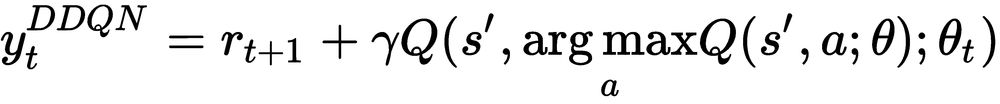

# 第四章：Double DQN、对抗架构和彩虹网络

在上一章中，我们讨论了**深度 Q 网络**（**DQN**）算法，使用 Python 和 TensorFlow 编写了它，并训练其玩 Atari Breakout。在 DQN 中，使用相同的 Q 网络来选择和评估动作。不幸的是，已知这种方法会高估 Q 值，从而导致值的过度乐观估计。为了缓解这个问题，DeepMind 发布了另一篇论文，提出了将动作选择与动作评估解耦。这就是 **Double DQN**（**DDQN**）架构的核心，我们将在本章中探讨这一点。

后来，DeepMind 发布了另一篇论文，提出了一种 Q 网络架构，具有两个输出值，一个表示值 *V(s)*，另一个表示在给定状态下采取某动作的优势 *A(s,a)*。DeepMind 然后将这两个值结合，计算 *Q(s,a)* 动作值，而不是像 DQN 和 DDQN 中那样直接确定。这些 Q 网络架构被称为 **对抗** 网络架构，因为神经网络现在有两个输出值 *V(s)* 和 *A(s,a)*，这些值随后结合得到 *Q(s,a)*。我们将在本章中进一步了解这些对抗网络。

另一个我们将在本章考虑的扩展是 **彩虹网络**，它是几种不同思想融合成一个算法的产物。

本章将涉及以下主题：

+   学习 DDQN 背后的理论

+   编写 DDQN 并训练其玩 Atari Breakout

+   评估 DDQN 在 Atari Breakout 上的表现

+   理解对抗网络架构

+   编写对抗网络架构并训练其玩 Atari Breakout

+   评估对抗架构在 Atari Breakout 上的表现

+   理解彩虹网络

+   在 Dopamine 上运行彩虹网络

# 技术要求

为了成功完成本章，以下知识将大有帮助：

+   Python（版本 2 或 3）

+   NumPy

+   Matplotlib

+   TensorFlow（版本 1.4 或更高）

+   Dopamine（我们稍后会详细讨论）

# 理解 Double DQN

DDQN 是 DQN 的扩展，在贝尔曼更新中我们使用目标网络。具体来说，在 DDQN 中，我们使用主网络的 Q 函数的贪心最大化动作来评估目标网络的 Q 函数。首先，我们将使用普通 DQN 目标进行贝尔曼方程更新步骤，然后，我们将扩展到 DDQN 进行相同的贝尔曼方程更新步骤；这就是 DDQN 算法的核心。接下来，我们将用 TensorFlow 编写 DDQN 来玩 Atari Breakout。最后，我们将比较 DQN 和 DDQN 两种算法。

# 更新贝尔曼方程

在普通 DQN 中，贝尔曼更新的目标是：


`y[t]`表示目标网络的模型参数。已知它会过度预测`Q`，因此在 DDQN 中的改动是将这个目标值`y[t]`替换为：



我们必须区分 Q 网络参数*θ*和目标网络模型参数`$1`。

# 编写 DDQN 并训练玩 Atari Breakout

我们现在将在 TensorFlow 中编写 DDQN 来玩 Atari Breakout。和之前一样，我们有三个 Python 文件：

+   `funcs.py`

+   `model.py`

+   `ddqn.py`

`funcs.py`和`model.py`与之前在第三章的 DQN 中使用的相同，*深度 Q 网络（DQN）*。`ddqn.py`文件是唯一需要修改的代码文件，以实现 DDQN。我们将使用上一章中的`dqn.py`文件，并对其进行修改以编写 DDQN。所以，首先将之前的`dqn.py`文件复制一份并将其重命名为`ddqn.py`。

我们将总结对`ddqn.py`所做的改动，这些改动其实非常小。我们仍然不会删除文件中与 DQN 相关的代码行，而是使用`if`语句在两种算法之间进行选择。这样有助于用一份代码同时处理两种算法，这是更好的编码方式。

首先，我们创建一个名为`ALGO`的变量，它将存储两个字符串之一：`DQN`或`DDQN`，这决定了我们要使用哪一个算法：

```py
ALGO = "DDQN" #"DQN" # DDQN
```

然后，在我们评估 mini-batch 的目标值的代码行中，我们使用`if`语句来决定使用 DQN 还是 DDQN 算法，并相应地计算目标，如下所示。请注意，在 DQN 中，`greedy_q`变量存储对应于贪婪动作的 Q 值，即目标网络中最大的 Q 值，这是通过`np.amax()`计算的，然后用于计算目标变量`targets_batch`。

而在 DDQN 中，我们计算与主 Q 网络中最大 Q 值对应的动作，这个值存储在`greedy_q`中，并通过`np.argmax()`进行评估。然后，我们在目标网络 Q 值中使用`greedy_q`（它现在表示一个动作）。注意，对于终止时间步骤，即`done = True`，我们不应考虑下一个状态；而对于非终止步骤，`done = False`，我们考虑下一个步骤。可以通过对`done_batch`使用`np.invert().astype(np.float32)`轻松实现。以下代码行展示了 DDQN：

```py
# calculate q values and targets 

if (ALGO == 'DQN'): 

   q_values_next = target_net.predict(sess, next_states_batch)
   greedy_q = np.amax(q_values_next, axis=1) 
   targets_batch = reward_batch + np.invert(done_batch).astype(np.float32) * gamma * greedy_q

elif (ALGO == 'DDQN'):

   q_values_next = q_net.predict(sess, next_states_batch)
   greedy_q = np.argmax(q_values_next, axis=1)
   q_values_next_target = target_net.predict(sess, next_states_batch)
   targets_batch = reward_batch + np.invert(done_batch).astype(np.float32) * gamma * q_values_next_target[np.arange(batch_size), greedy_q]
```

这就是`ddqn.py`的内容。我们现在将对其进行 Atari Breakout 的评估。

# 评估 DDQN 在 Atari Breakout 上的表现

我们现在将评估 DDQN 在 Atari Breakout 上的表现。在这里，我们将使用在代码中编写的`performance.txt`文件，绘制 DDQN 算法在 Atari Breakout 上的表现。我们将使用`matplotlib`绘制两张图，如下所述。

在下面的截图中，我们展示了在 Atari Breakout 上使用 DDQN 进行训练时，每集的时间步数及其指数加权移动平均值。如图所示，许多集的时间步数在训练结束时达到了大约 2,000 次，并且有一集的时间步数甚至超过了 3,000 次！移动平均值在训练结束时大约是 1,500 次：


图 1：使用 DDQN 在 Atari Breakout 中，每集的时间步数

在下图中，我们展示了每集获得的总奖励与全球时间步数的关系。峰值奖励超过 350，移动平均值接近 150。有趣的是，移动平均值（橙色曲线）在训练结束时仍在上升，这意味着你可以继续训练以获得更大的收益。对此有兴趣的读者可以进一步探究：


图 2：使用 DDQN 在 Atari Breakout 中，累计奖励与时间步长的关系

请注意，由于 RAM 限制（16 GB），我们仅使用了 300,000 的回放缓冲区大小。如果用户拥有更多的 RAM 资源，可以使用更大的回放缓冲区大小——例如 500,000 到 1,000,000，这可以获得更好的成绩。

如我们所见，DDQN 智能体正在学习如何玩 Atari Breakout。每集奖励的移动平均值在不断上升，这意味着你可以训练更长时间，以获得更高的奖励。这种奖励的上升趋势证明了 DDQN 算法在此类问题中的有效性。

# 理解对抗网络架构

现在我们来理解对抗网络架构的应用。在 DQN、DDQN 及其他文献中的 DQN 变体中，焦点主要集中在算法上，即如何高效稳定地更新价值函数神经网络。虽然这对于开发强健的强化学习算法至关重要，但推动该领域发展的另一个平行但互补的方向是创新并开发适合无模型强化学习的全新神经网络架构。这正是对抗网络架构的概念，另一个来自 DeepMind 的贡献。

对抗架构涉及的步骤如下：

1.  对抗网络架构图；与标准 DQN 进行比较

1.  计算 *Q(s,a)*

1.  从`优势`函数中减去优势的平均值

正如我们在上一章看到的，在 DQN 中，Q 网络的输出是*Q(s,a)*，即动作价值函数。在对抗网络中，Q 网络的输出改为两个值：`状态值`函数 *V(s)* 和`优势`函数 *A(s,a)*。然后，你可以将它们结合起来计算`状态-动作价值`函数 *Q(s,a)*。这样做的好处在于，网络不需要为每个状态下的每个动作学习`价值`函数。对于那些动作不影响环境的状态，这尤其有用。

例如，如果智能体是一辆在没有交通的直路上行驶的汽车，则无需采取任何行动，因此在这些状态下，仅*V(s)*就足够了。另一方面，如果道路突然弯曲或有其他车辆接近智能体，则智能体需要采取行动，因此在这些状态下，`advantage` 函数开始发挥作用，用于找出给定行动相对于`state value`函数能提供的增量回报。这就是通过使用两个不同的分支在同一网络中分离估计 *V(s)* 和 *A(s,a)* 的直觉，随后将它们合并。

请参考以下图表，展示标准 DQN 网络和对抗网络架构的对比：


图 3：标准 DQN 网络（上）和对抗网络架构（下）的示意图

你可以按如下方式计算 `action-value` 函数 *Q(s,a)*：


然而，这并不是唯一的，因为你可以在 *V(s)* 中过预测一个数量 *δ*，而在 *A(s,a)* 中预测同样数量的 *δ*。这会导致神经网络的预测不可辨识。为了绕过这个问题，对抗网络论文的作者建议以下方式来组合 *V(s)* 和 *A(s,a)*：


*|A|* 代表动作数量，*θ* 是在 *V(s)* 和 *A(s,a)* 流中共享的神经网络参数；此外，*α* 和 *β* 用于表示两个不同流中的神经网络参数，即分别在 *A(s,a)* 和 *V(s)* 流中。实际上，在上述方程中，我们从 `advantage` 函数中减去其平均值，并将其加到 `state value` 函数中，从而得到 *Q(s,a)*。

这是对抗网络架构论文的链接：[`arxiv.org/abs/1511.06581`](https://arxiv.org/abs/1511.06581)。

# 编写对抗网络架构并训练它来玩 Atari Breakout

我们现在将编写对抗网络架构，并训练它学习玩 Atari Breakout。对于对抗网络架构，我们需要以下代码：

+   `model.py`

+   `funcs.py`

+   `dueling.py`

我们将使用之前用于 DDQN 的 `funcs.py`，因此我们重用它。`dueling.py` 代码与 `ddqn.py` 完全相同（它之前已使用过，所以我们只是重命名并重用）。需要进行的唯一更改是在 `model.py` 中。我们从 DDQN 中复制相同的 `model.py` 文件，并在此总结对对抗网络架构所做的更改。涉及的步骤如下：

我们首先在 `model.py` 中创建一个名为 `DUELING` 的布尔变量，并在使用对抗网络架构时将其赋值为 `True`，否则赋值为 `False`：

```py
DUELING = True # False
```

我们将编写带有`if`循环的代码，以便在`DUELING`变量为`False`时使用我们在 DDQN 中使用的早期代码，而当其为`True`时使用对战网络。我们将使用`flattened`对象，它是卷积层输出的扁平化版本，用来创建两个子神经网络流。我们将`flattened`分别传入两个不同的完全连接层，每个层有`512`个神经元，使用`relu`激活函数和先前定义的`winit`权重初始化器；这些完全连接层的输出值分别称为`valuestream`和`advantagestream`：

```py
if (not DUELING):

     # Q(s,a)
     self.predictions = tf.contrib.layers.fully_connected(fc1, len(self.VALID_ACTIONS), activation_fn=None, weights_initializer=winit)

 else:

     # Deuling network
     # branch out into two streams using flattened (i.e., ignore fc1 for Dueling DQN)

     valuestream = tf.contrib.layers.fully_connected(flattened, 512, activation_fn=tf.nn.relu, weights_initializer=winit) 
     advantagestream = tf.contrib.layers.fully_connected(flattened, 512, activation_fn=tf.nn.relu, weights_initializer=winit) 
```

# 将 V 和 A 结合得到 Q

`advantagestream`对象被传入一个完全连接的层，该层的神经元数量等于动作数量，即`len(self.VALID_ACTIONS)`。同样，`valuestream`对象被传入一个只有一个神经元的完全连接层。请注意，我们在计算`advantage`和`state value`函数时不使用激活函数，因为它们可以是正数也可以是负数（`relu`会将所有负值设为零！）。最后，我们使用`tf.subtract()`将`advantage`和`advantage`函数的均值相减，从而将优势流和价值流结合起来。均值通过对`advantage`函数使用`tf.reduce_mean()`来计算：

```py
# A(s,a)
self.advantage = tf.contrib.layers.fully_connected(advantagestream, len(self.VALID_ACTIONS), activation_fn=None, weights_initializer=winit)

# V(s)
self.value = tf.contrib.layers.fully_connected(valuestream, 1, activation_fn=None, weights_initializer=winit)

# Q(s,a) = V(s) + (A(s,a) - 1/|A| * sum A(s,a'))
self.predictions = self.value + tf.subtract(self.advantage, tf.reduce_mean(self.advantage, axis=1, keep_dims=True))
```

这就是编码对战网络架构的全部内容。我们将使用对战网络架构训练一个智能体，并评估其在 Atari Breakout 上的表现。请注意，我们可以将对战架构与 DQN 或 DDQN 结合使用。也就是说，我们仅改变了神经网络架构，而没有更改实际的 Bellman 更新，因此对战架构适用于 DQN 和 DDQN。

# 评估对战架构在 Atari Breakout 上的表现

现在，我们将评估对战架构在 Atari Breakout 上的表现。在这里，我们将使用在训练智能体时写入的`performance.txt`文件，绘制我们在 Atari Breakout 上使用 DDQN 的对战网络架构的表现。我们将使用`matplotlib`绘制以下两张图：

在下图中，我们展示了在使用 DDQN 的 Atari Breakout 中每一回合的时间步数（蓝色）以及其指数加权移动平均（橙色）。如图所示，训练结束时许多回合的时间步数峰值约为 2,000，甚至有少数回合超过了 4,000 时间步！而在训练结束时，移动平均约为 1,500 时间步：


图 4：使用对战网络架构和 DDQN 在 Atari Breakout 中每回合的时间步数

在以下截图中，我们展示了每回合收到的总奖励与全局时间步长的时间关系。峰值回合奖励超过 400，移动平均值接近 220。我们还注意到，移动平均值（橙色线）在接近尾部时仍然在增加，这意味着你可以继续运行训练，以获得进一步的提升。总体而言，使用对抗网络架构的平均奖励高于非对抗架构，因此强烈推荐使用这些对抗网络架构：


图 5：使用对抗网络架构和 DDQN 进行 Atari Breakout 时，总回合奖励与全局时间步长的关系

请注意，由于 RAM 限制（16 GB），我们只使用了 300,000 的回放缓冲区大小。如果用户拥有更多的 RAM，可以使用更大的回放缓冲区大小——例如 500,000 到 1,000,000，这样可能会得到更好的得分。

# 理解 Rainbow 网络

现在我们将讨论**Rainbow 网络**，它是多个不同 DQN 改进的融合。从原始 DQN 论文开始，提出了几个不同的改进并取得了显著成功。这促使 DeepMind 将多个不同的改进结合到一个集成的智能体中，并称之为**Rainbow DQN**。具体来说，六个不同的 DQN 改进被集成到一个 Rainbow DQN 智能体中。这六个改进总结如下：

+   DDQN

+   对抗网络架构

+   优先经验回放

+   多步学习

+   分布式强化学习

+   噪声网络

# DQN 改进

我们已经看过了 DDQN 和对抗网络架构，并在 TensorFlow 中实现了它们。其余的改进将在接下来的章节中描述。

# 优先经验回放

我们使用了一个回放缓冲区，其中所有样本都有相等的被采样概率。然而，这种方法并不是很高效，因为某些样本比其他样本更为重要。这就是优先经验回放的动机，优先经验回放中，具有更高**时序差分**（**TD**）误差的样本将以更高的概率被采样。第一次将样本添加到回放缓冲区时，给它设置一个最大优先级值，以确保缓冲区中的所有样本至少会被采样一次。之后，TD 误差用于确定经验被采样的概率，我们的计算方式如下：


其中，前一个 `r` 是奖励，*θ* 是主 Q 网络模型参数，*θ^t* 是目标网络参数。*ω* 是一个正的超参数，用于确定分布的形状。

# 多步学习

在 Q 学习中，我们会累积单一奖励，并在下一个步骤使用贪婪动作。或者，你也可以使用多步目标，并从一个状态计算 `n` 步回报：


然后，`n`步回报，*r[t]^((n))*，在贝尔曼更新中使用，并且已知能够加速学习。

# 分布式强化学习

在**分布式强化学习**中，我们学习逼近回报的分布，而不是期望回报。这在数学上是复杂的，超出了本书的范围，因此不再进一步讨论。

# 嘈杂网络

在某些游戏中（如《蒙特祖马的复仇》），ε-贪婪策略表现不佳，因为需要执行许多动作才能获得第一个奖励。在这种设置下，推荐使用结合了确定性流和嘈杂流的嘈杂线性层，如下所示：


在这里，`x`是输入，`y`是输出，`b`和`W`分别是确定性流中的偏置和权重；*b^(noisy)*和*W^(noisy)*分别是嘈杂流中的偏置和权重；*ε^b*和*ε^W*是随机变量，并作为元素级的乘积应用于嘈杂流中的偏置和权重。网络可以选择在状态空间的某些区域忽略嘈杂流，也可以根据需要使用它们。这允许根据状态确定的探索策略。

我们不会编写完整的 Rainbow DQN 代码，因为它非常复杂。相反，我们将使用一个开源框架叫做 Dopamine 来训练 Rainbow DQN 智能体，具体内容将在下一节讨论。

# 在多巴胺上运行 Rainbow 网络

2018 年，谷歌的一些工程师发布了一个开源、轻量级、基于 TensorFlow 的强化学习训练框架，名为**Dopamine**。正如你可能已经知道的，多巴胺是大脑中一种重要的有机化学物质。我们将使用 Dopamine 来运行 Rainbow。

Dopamine 框架基于四个设计原则：

+   简单的实验

+   灵活的开发

+   紧凑且可靠

+   可重现性

要从 GitHub 下载 Dopamine，请在终端中输入以下命令：

```py
git clone https://github.com/google/dopamine.git
```

我们可以通过在终端中输入以下命令来测试 Dopamine 是否成功安装：

```py
cd dopamine
export PYTHONPATH=${PYTHONPATH}:.
python tests/atari_init_test.py
```

其输出将类似于以下内容：

```py
2018-10-27 23:08:17.810679: I tensorflow/core/platform/cpu_feature_guard.cc:141] Your CPU supports instructions that this TensorFlow binary was not compiled to use: SSE4.1 SSE4.2 AVX AVX2 FMA
2018-10-27 23:08:18.079916: I tensorflow/stream_executor/cuda/cuda_gpu_executor.cc:897] successful NUMA node read from SysFS had negative value (-1), but there must be at least one NUMA node, so returning NUMA node zero
2018-10-27 23:08:18.080741: I tensorflow/core/common_runtime/gpu/gpu_device.cc:1392] Found device 0 with properties: 
name: GeForce GTX 1060 with Max-Q Design major: 6 minor: 1 memoryClockRate(GHz): 1.48
pciBusID: 0000:01:00.0
totalMemory: 5.93GiB freeMemory: 5.54GiB
2018-10-27 23:08:18.080783: I tensorflow/core/common_runtime/gpu/gpu_device.cc:1471] Adding visible gpu devices: 0
2018-10-27 23:08:24.476173: I tensorflow/core/common_runtime/gpu/gpu_device.cc:952] Device interconnect StreamExecutor with strength 1 edge matrix:
2018-10-27 23:08:24.476247: I tensorflow/core/common_runtime/gpu/gpu_device.cc:958] 0 
2018-10-27 23:08:24.476273: I tensorflow/core/common_runtime/gpu/gpu_device.cc:971] 0: N 
2018-10-27 23:08:24.476881: I tensorflow/core/common_runtime/gpu/gpu_device.cc:1084] Created TensorFlow device (/job:localhost/replica:0/task:0/device:GPU:0 with 5316 MB memory) -> physical GPU (device: 0, name: GeForce GTX 1060 with Max-Q Design, pci bus id: 0000:01:00.0, compute capability: 6.1)
.
.
.
Ran 2 tests in 8.475s

OK
```

你应该在最后看到`OK`，以确认下载一切正常。

# 使用多巴胺的 Rainbow

要运行 Rainbow DQN，请在终端中输入以下命令：

```py
python -um dopamine.atari.train --agent_name=rainbow --base_dir=/tmp/dopamine --gin_files='dopamine/agents/rainbow/configs/rainbow.gin'
```

就这样。多巴胺将开始训练 Rainbow DQN，并在屏幕上打印训练统计信息，同时保存检查点文件。配置文件存储在以下路径：

```py
dopamine/dopamine/agents/rainbow/configs/rainbow.gin
```

代码如下所示。`game_name` 默认设置为 `Pong`；也可以尝试其他 Atari 游戏。训练的代理步骤数设置在`training_steps`中，评估步骤数设置在`evaluation_steps`中。此外，它通过使用粘性动作的概念引入了训练中的随机性，其中最近的动作以 0.25 的概率被重复多次。也就是说，如果均匀随机数（使用 NumPy 的`np.random.rand()`计算）< 0.25，则重复最近的动作；否则，从策略中采取新的动作。

粘性动作是一种引入学习随机性的新方法：

```py
# Hyperparameters follow Hessel et al. (2018), except for sticky_actions,
# which was False (not using sticky actions) in the original paper.
import dopamine.agents.rainbow.rainbow_agent
import dopamine.atari.run_experiment
import dopamine.replay_memory.prioritized_replay_buffer
import gin.tf.external_configurables

RainbowAgent.num_atoms = 51
RainbowAgent.vmax = 10.
RainbowAgent.gamma = 0.99
RainbowAgent.update_horizon = 3
RainbowAgent.min_replay_history = 20000 # agent steps
RainbowAgent.update_period = 4
RainbowAgent.target_update_period = 8000 # agent steps
RainbowAgent.epsilon_train = 0.01
RainbowAgent.epsilon_eval = 0.001
RainbowAgent.epsilon_decay_period = 250000 # agent steps
RainbowAgent.replay_scheme = 'prioritized'
RainbowAgent.tf_device = '/gpu:0' # use '/cpu:*' for non-GPU version
RainbowAgent.optimizer = @tf.train.AdamOptimizer()

# Note these parameters are different from C51's.
tf.train.AdamOptimizer.learning_rate = 0.0000625
tf.train.AdamOptimizer.epsilon = 0.00015

Runner.game_name = 'Pong'
# Sticky actions with probability 0.25, as suggested by (Machado et al., 2017).
Runner.sticky_actions = True
Runner.num_iterations = 200
Runner.training_steps = 250000 # agent steps
Runner.evaluation_steps = 125000 # agent steps
Runner.max_steps_per_episode = 27000 # agent steps

WrappedPrioritizedReplayBuffer.replay_capacity = 1000000
WrappedPrioritizedReplayBuffer.batch_size = 32
```

随意尝试不同的超参数，看看它们如何影响学习。这是检验不同超参数对强化学习代理学习敏感度的一个非常好的方法。

# 总结

在本章中，我们介绍了 DDQN、对战网络架构和彩虹 DQN。我们将之前的 DQN 代码扩展到 DDQN 和对战架构，并在 Atari Breakout 上进行了测试。我们可以清楚地看到，随着这些改进，平均每集奖励更高，因此这些改进自然成为使用的选择。接下来，我们还看到了谷歌的 Dopamine，并使用它来训练一个彩虹 DQN 代理。Dopamine 有几个其他强化学习算法，鼓励用户深入挖掘并尝试这些其他的强化学习算法。

本章深入探讨了 DQN 的变体，我们在强化学习算法的编码方面确实取得了很多进展。在下一章中，我们将学习下一种强化学习算法，叫做**深度确定性策略梯度**（**DDPG**），这是我们第一个演员-评论员（Actor-Critic）强化学习算法，也是我们第一个连续动作空间的强化学习算法。

# 问题

1.  为什么 DDQN 比 DQN 表现更好？

1.  对战斗网络架构如何帮助训练？

1.  为什么优先经验回放能加速训练？

1.  粘性动作如何帮助训练？

# 进一步阅读

+   DDQN 论文，*使用双重 Q 学习的深度强化学习*，由 Hado van Hasselt、Arthur Guez 和 David Silver 撰写，可以通过以下链接获取，建议有兴趣的读者阅读：[`arxiv.org/abs/1509.06461`](https://arxiv.org/abs/1509.06461)

+   *彩虹：结合深度强化学习中的改进*，Matteo Hessel，Joseph Modayil，Hado van Hasselt，Tom Schaul，Georg Ostrovski，Will Dabney，Dan Horgan，Bilal Piot，Mohammad Azar，David Silver，arXiv:1710.02298（彩虹 DQN）：[`arxiv.org/abs/1710.02298`](https://arxiv.org/abs/1710.02298)

+   *优先经验回放*，Tom Schaul，John Quan，Ioannis Antonoglou，David Silver，arXiv:1511.05952：[`arxiv.org/abs/1511.05952`](https://arxiv.org/abs/1511.05952)

+   *多步强化学习：一个统一的算法*，作者：Kristopher de Asis、J Fernando Hernandez-Garcia、G Zacharias Holland、Richard S Sutton: [`arxiv.org/pdf/1703.01327.pdf`](https://arxiv.org/pdf/1703.01327.pdf)

+   *噪声网络用于探索*，作者：Meire Fortunato、Mohammad Gheshlaghi Azar、Bilal Piot、Jacob Menick、Ian Osband、Alex Graves、Vlad Mnih、Remi Munos、Demis Hassabis、Olivier Pietquin、Charles Blundell 和 Shane Legg，arXiv:1706.10295: [`arxiv.org/abs/1706.10295`](https://arxiv.org/abs/1706.10295)
