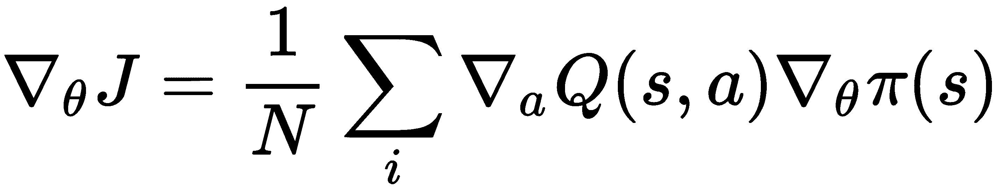
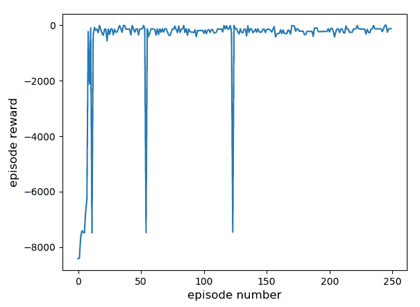

# 第五章：深度确定性策略梯度（Deep Deterministic Policy Gradient）

在之前的章节中，你已经看到如何使用**强化学习**（**RL**）来解决离散动作问题，如 Atari 游戏中的问题。现在我们将基于此，处理连续的、实值动作问题。连续控制问题非常普遍，例如，机器人手臂的电机扭矩；自动驾驶汽车的转向、加速和刹车；地形上的轮式机器人运动；以及无人机的俯仰、滚转和偏航控制。对于这些问题，我们在强化学习环境中训练神经网络以输出实值动作。

许多连续控制算法涉及两个神经网络——一个被称为**演员**（基于策略），另一个被称为**评论员**（基于价值）——因此，这类算法被称为**演员-评论员算法**。演员的角色是学习一个好的策略，能够根据给定状态预测出好的动作。评论员的角色是评估演员是否采取了一个好的动作，并提供反馈，作为演员学习的信号。这就像学生-老师或员工-老板的关系，其中学生或员工完成一项任务或工作，而老师或老板的角色是提供关于所执行动作质量的反馈。

连续控制强化学习的基础是通过所谓的**策略梯度**，它是一个估计值，用来表示神经网络的权重应该如何调整，以最大化长期累计折扣奖励。具体来说，它利用了**链式法则**，并且它是一个需要反向传播到演员网络中的梯度估计，以便改进策略。这个估计通过小批量样本的平均值来评估。我们将在本章中介绍这些话题，特别是，我们将介绍一个名为**深度确定性策略梯度**（**DDPG**）的算法，它是用于连续控制的最先进的强化学习算法。

连续控制在现实世界中有许多应用。例如，连续控制可以用于评估自动驾驶汽车的转向、加速和刹车。它还可以用于确定机器人执行器电机所需的扭矩。或者，它可以应用于生物医学领域，控制可能是确定类人运动的肌肉运动。因此，连续控制问题的应用非常广泛。

本章将涵盖以下主题：

+   演员-评论员算法和策略梯度

+   DDPG

+   在 Pendulum-v0 上训练和测试 DDPG

# 技术要求

为了成功完成本章，以下内容是必需的：

+   Python（2 及以上版本）

+   NumPy

+   Matplotlib

+   TensorFlow（版本 1.4 或更高）

+   一台至少拥有 8GB 内存的电脑（更高内存更佳！）

# 演员-评论员算法和策略梯度

在本节中，我们将介绍什么是演员-评论家（Actor-Critic）算法。你还将了解什么是策略梯度以及它们如何对演员-评论家算法有所帮助。

学生如何在学校学习呢？学生在学习过程中通常会犯很多错误。当他们在某个任务上表现良好时，老师会给予正面反馈。另一方面，如果学生在某个任务上表现不佳，老师会提供负面反馈。这些反馈作为学生改进任务的学习信号。这就是演员-评论家算法的核心。

以下是涉及的步骤概述：

+   我们将有两个神经网络，一个被称为演员，另一个被称为评论家。

+   演员就像我们之前描述的学生，在给定状态下采取行动。

+   评论家就像我们之前描述的老师，提供反馈给演员学习。

+   与学校中的老师不同，评论家网络也应该从头开始训练，这使得问题变得具有挑战性。

+   策略梯度用于训练演员

+   Bellman 更新的 L2 范数用于训练评论家

# 策略梯度

**策略梯度**定义如下：



*J* 是需要最大化的长期奖励函数，*θ* 是策略神经网络参数，*N* 是小批量的样本大小，*Q(s,a)* 是状态-动作值函数，*π* 是策略。换句话说，我们计算状态-动作值函数相对于动作的梯度，以及策略相对于网络参数的梯度，将它们相乘，并对来自小批量数据的 *N* 个样本取平均。然后，我们可以在梯度上升的设置中使用这个策略梯度来更新策略参数。请注意，本质上是利用微积分的链式法则来评估策略梯度。

# 深度确定性策略梯度（DDPG）

我们现在将深入探讨 DDPG 算法，它是一个用于连续控制的最先进的强化学习（RL）算法。它最早由 Google DeepMind 于 2016 年发布，并在社区中引起了广泛关注，随后提出了若干新变体。与 DQN 类似，DDPG 也使用目标网络以提高稳定性。它还使用回放缓冲区来重用过去的数据，因此，它是一个脱离策略的强化学习算法。

`ddpg.py` 文件是我们开始训练和测试的主要文件。它将调用存在于 `TrainOrTest.py` 中的训练或测试函数。`AandC.py` 文件包含演员和评论家网络的 TensorFlow 代码。最后，`replay_buffer.py` 通过使用双端队列（deque）数据结构将样本存储在回放缓冲区中。我们将训练 DDPG 来学习保持倒立摆竖直，使用 OpenAI Gym 的 Pendulum-v0，它有三个状态和一个连续动作，即施加的扭矩，用来保持倒立摆的竖直状态。

# 编码 ddpg.py

我们将首先编写 `ddpg.py` 文件。涉及的步骤如下：

现在，我们将总结 DDPG 代码：

1.  **导入所需的包**：我们将导入所需的包和其他 Python 文件：

```py
import tensorflow as tf
import numpy as np
import gym
from gym import wrappers

import argparse
import pprint as pp
import sys

from replay_buffer import ReplayBuffer
from AandC import *
from TrainOrTest import *
```

1.  **定义** **train()** **函数**：我们将定义 `train()` 函数。它接受参数解析器对象 `args`。我们创建一个 TensorFlow 会话作为 `sess`。环境的名称用于创建一个 Gym 环境并存储在 `env` 对象中。我们还设置了随机数种子和环境中每一剧集的最大步数。我们还在 `state_dim` 和 `action_dim` 中设置了状态和动作维度，对于 Pendulum-v0 问题，它们的值分别是 `3` 和 `1`。然后，我们创建演员和评论员对象，这些对象分别是 `ActorNetwork` 类和 `CriticNetwork` 类的实例，稍后将在 `AandC.py 文件` 中描述。接着，我们调用 `trainDDPG()` 函数，这将开始强化学习代理的训练。

最后，我们通过使用 `tf.train.Saver()` 和 `saver.save()` 保存 TensorFlow 模型：

```py
def train(args):

    with tf.Session() as sess:

        env = gym.make(args['env'])
        np.random.seed(int(args['random_seed']))
        tf.set_random_seed(int(args['random_seed']))
        env.seed(int(args['random_seed']))
        env._max_episode_steps = int(args['max_episode_len'])

        state_dim = env.observation_space.shape[0]
        action_dim = env.action_space.shape[0]
        action_bound = env.action_space.high

        actor = ActorNetwork(sess, state_dim, action_dim, action_bound,
                float(args['actor_lr']), float(args['tau']), int(args['minibatch_size']))

        critic = CriticNetwork(sess, state_dim, action_dim,
                 float(args['critic_lr']), float(args['tau']), float(args['gamma']), actor.get_num_trainable_vars())

        trainDDPG(sess, env, args, actor, critic)

        saver = tf.train.Saver()
        saver.save(sess, "ckpt/model")
        print("saved model ")
```

1.  **定义** **test()** **函数**：接下来定义 `test()` 函数。这将在我们完成训练后使用，用来测试我们的代理的表现如何。`test()` 函数的代码如下，与 `train()` 非常相似。我们将通过使用 `tf.train.Saver()` 和 `saver.restore()` 从 `train()` 恢复已保存的模型。然后我们调用 `testDDPG()` 函数来测试该模型：

```py
def test(args):

    with tf.Session() as sess:

        env = gym.make(args['env'])
        np.random.seed(int(args['random_seed']))
        tf.set_random_seed(int(args['random_seed']))
        env.seed(int(args['random_seed']))
        env._max_episode_steps = int(args['max_episode_len'])

        state_dim = env.observation_space.shape[0]
        action_dim = env.action_space.shape[0]
        action_bound = env.action_space.high

        actor = ActorNetwork(sess, state_dim, action_dim, action_bound,
                float(args['actor_lr']), float(args['tau']), int(args['minibatch_size']))

        critic = CriticNetwork(sess, state_dim, action_dim,
                 float(args['critic_lr']), float(args['tau']), float(args['gamma']), actor.get_num_trainable_vars())

        saver = tf.train.Saver()
        saver.restore(sess, "ckpt/model")

        testDDPG(sess, env, args, actor, critic)
```

1.  **定义** **主** **函数**：最后，`main` 函数如下所示。我们通过使用 Python 的 `argparse` 定义了一个参数解析器。为演员和评论员指定了学习率，包括折扣因子 `gamma` 和目标网络指数平均参数 `tau`。缓冲区大小、迷你批次大小和剧集数量也在参数解析器中指定。我们感兴趣的环境是 Pendulum-v0，且该环境在参数解析器中也被指定。

1.  **调用** **train()** **或** **test()** **函数，根据需要**：运行此代码的模式为 train 或 test，并且它会调用适当的同名函数，这是我们之前定义的：

```py
if __name__ == '__main__':
    parser = argparse.ArgumentParser(description='provide arguments for DDPG agent')

    # agent parameters
    parser.add_argument('--actor-lr', help='actor network learning rate', default=0.0001)
    parser.add_argument('--critic-lr', help='critic network learning rate', default=0.001)
    parser.add_argument('--gamma', help='discount factor for Bellman updates', default=0.99)
    parser.add_argument('--tau', help='target update parameter', default=0.001)
    parser.add_argument('--buffer-size', help='max size of the replay buffer', default=1000000)
    parser.add_argument('--minibatch-size', help='size of minibatch', default=64)

    # run parameters
    parser.add_argument('--env', help='gym env', default='Pendulum-v0')
    parser.add_argument('--random-seed', help='random seed', default=258)
    parser.add_argument('--max-episodes', help='max num of episodes', default=250)
    parser.add_argument('--max-episode-len', help='max length of each episode', default=1000)
    parser.add_argument('--render-env', help='render gym env', action='store_true')
    parser.add_argument('--mode', help='train/test', default='train')

    args = vars(parser.parse_args())

    pp.pprint(args)

    if (args['mode'] == 'train'):
      train(args)
    elif (args['mode'] == 'test'):
      test(args)
```

这就是 `ddpg.py` 的全部内容。

# 编写 AandC.py

我们将在 `AandC.py` 中指定 `ActorNetwork` 类和 `CriticNetwork` 类。涉及的步骤如下：

1.  **导入包**：首先，我们导入所需的包：

```py
import tensorflow as tf
import numpy as np
import gym
from gym import wrappers
import argparse
import pprint as pp
import sys

from replay_buffer import ReplayBuffer
```

1.  **定义权重和偏差的初始化器**：接下来，我们定义权重和偏差的初始化器：

```py
winit = tf.contrib.layers.xavier_initializer()
binit = tf.constant_initializer(0.01)
rand_unif = tf.keras.initializers.RandomUniform(minval=-3e-3,maxval=3e-3)
regularizer = tf.contrib.layers.l2_regularizer(scale=0.0)
```

1.  **定义** **ActorNetwork** **类**：`ActorNetwork`类定义如下。首先，它在`__init__`构造函数中接收参数。然后我们调用`create_actor_network()`，该函数将返回`inputs`、`out`和`scaled_out`对象。演员模型的参数通过调用 TensorFlow 的`tf.trainable_variables()`存储在`self.network_params`中。我们对演员的目标网络也做相同的操作。需要注意的是，目标网络是为了稳定性考虑而存在的；它的神经网络架构与演员网络相同，只是参数会逐渐变化。目标网络的参数通过再次调用`tf.trainable_variables()`被收集并存储在`self.target_network_params`中：

```py
class ActorNetwork(object):

    def __init__(self, sess, state_dim, action_dim, action_bound, learning_rate, tau, batch_size):
        self.sess = sess
        self.s_dim = state_dim
        self.a_dim = action_dim
        self.action_bound = action_bound
        self.learning_rate = learning_rate
        self.tau = tau
        self.batch_size = batch_size

        # actor 
        self.state, self.out, self.scaled_out = self.create_actor_network(scope='actor')

        # actor params
        self.network_params = tf.trainable_variables()

        # target network
        self.target_state, self.target_out, self.target_scaled_out = self.create_actor_network(scope='act_target')
        self.target_network_params = tf.trainable_variables()[len(self.network_params):]

```

1.  **定义** **self.update_target_network_params**：接下来，我们定义`self.update_target_network_params`，它会将当前的演员网络参数与`tau`相乘，将目标网络的参数与`1-tau`相乘，然后将它们加在一起，存储为一个 TensorFlow 操作。这样我们就逐步更新目标网络的模型参数。注意使用`tf.multiply()`来将权重与`tau`（或者根据情况是`1-tau`）相乘。然后，我们创建一个 TensorFlow 占位符，命名为`action_gradient`，用来存储与动作相关的*Q*的梯度，这个梯度由评论员提供。我们还使用`tf.gradients()`计算策略网络输出相对于网络参数的梯度。注意，接着我们会除以`batch_size`，以便对小批量数据的求和结果进行平均。这样，我们就得到了平均策略梯度，接下来可以用来更新演员网络参数：

```py
# update target using tau and 1-tau as weights
self.update_target_network_params = \
                                   [self.target_network_params[i].assign(tf.multiply(self.network_params[i], self.tau) + tf.multiply(self.target_network_params[i], 1\. - self.tau))
        for i in range(len(self.target_network_params))]

# gradient (this is provided by the critic)
self.action_gradient = tf.placeholder(tf.float32, [None, self.a_dim])

# actor gradients
self.unnormalized_actor_gradients = tf.gradients(
    self.scaled_out, self.network_params, -self.action_gradient)
self.actor_gradients = list(map(lambda x: tf.div(x, self.batch_size), self.unnormalized_actor_gradients))
```

1.  **使用 Adam 优化**：我们使用 Adam 优化算法来应用策略梯度，从而优化演员的策略：

```py
 # adam optimization 
        self.optimize = tf.train.AdamOptimizer(self.learning_rate).apply_gradients(zip(self.actor_gradients, self.network_params))

        # num trainable vars
        self.num_trainable_vars = len(self.network_params) + len(self.target_network_params)
```

1.  **定义** **create_actor_network()** **函数**：现在我们定义`create_actor_network()`函数。我们将使用一个包含两层神经元的神经网络，第一层有`400`个神经元，第二层有`300`个神经元。权重使用**Xavier 初始化**，偏置初始值为零。我们使用`relu`激活函数，并使用批归一化（batch normalization）以确保稳定性。最终的输出层的权重使用均匀分布初始化，并采用`tanh`激活函数，以保持输出值在一定范围内。对于 Pendulum-v0 问题，动作的范围是[*-2,2*]，而`tanh`的输出范围是[*-1,1*]，因此我们需要将输出乘以 2 来进行缩放；这可以通过`tf.multiply()`来实现，其中`action_bound = 2`表示倒立摆问题中的动作范围：

```py
def create_actor_network(self, scope):
      with tf.variable_scope(scope, reuse=tf.AUTO_REUSE):
        state = tf.placeholder(name='a_states', dtype=tf.float32, shape=[None, self.s_dim])

        net = tf.layers.dense(inputs=state, units=400, activation=None, kernel_initializer=winit, bias_initializer=binit, name='anet1') 
        net = tf.nn.relu(net)

        net = tf.layers.dense(inputs=net, units=300, activation=None, kernel_initializer=winit, bias_initializer=binit, name='anet2')
        net = tf.nn.relu(net)

        out = tf.layers.dense(inputs=net, units=self.a_dim, activation=None, kernel_initializer=rand_unif, bias_initializer=binit, name='anet_out')
        out = tf.nn.tanh(out)
        scaled_out = tf.multiply(out, self.action_bound)
        return state, out, scaled_out
```

1.  **定义演员函数**：最后，我们定义完成`ActorNetwork`类所需的剩余函数。我们将定义`train()`，它将运行`self.optimize`会话；`predict()`函数运行`self.scaled_out`会话，即`ActorNetwork`的输出；`predict_target()`函数将运行`self.target_scaled_out`会话，即演员目标网络的输出动作。接着，`update_target_network()`将运行`self.update_target_network_params`会话，执行网络参数的加权平均。

最后，`get_num_trainable_vars()`函数返回可训练变量的数量：

```py
def train(self, state, a_gradient):
        self.sess.run(self.optimize, feed_dict={self.state: state, self.action_gradient: a_gradient})

def predict(self, state):
        return self.sess.run(self.scaled_out, feed_dict={
            self.state: state})

def predict_target(self, state):
        return self.sess.run(self.target_scaled_out, feed_dict={
            self.target_state: state})

def update_target_network(self):
        self.sess.run(self.update_target_network_params)

def get_num_trainable_vars(self):
        return self.num_trainable_vars
```

1.  **定义** **CriticNetwork 类**：现在我们将定义`CriticNetwork`类。与`ActorNetwork`类似，我们将模型超参数作为参数传递。然后调用`create_critic_network()`函数，它将返回`inputs`、`action`和`out`。我们还通过再次调用`create_critic_network()`来创建评论者的目标网络：

```py
class CriticNetwork(object):

    def __init__(self, sess, state_dim, action_dim, learning_rate, tau, gamma, num_actor_vars):
        self.sess = sess
        self.s_dim = state_dim
        self.a_dim = action_dim
        self.learning_rate = learning_rate
        self.tau = tau
        self.gamma = gamma

        # critic
        self.state, self.action, self.out = self.create_critic_network(scope='critic')

        # critic params
        self.network_params = tf.trainable_variables()[num_actor_vars:]

        # target Network
        self.target_state, self.target_action, self.target_out = self.create_critic_network(scope='crit_target')

        # target network params 
        self.target_network_params = tf.trainable_variables()[(len(self.network_params) + num_actor_vars):]
```

1.  **评论者目标网络**：与演员的目标网络类似，评论者的目标网络也是通过加权平均进行更新。然后，我们创建一个名为`predicted_q_value`的 TensorFlow 占位符，它是目标值。接着，我们在`self.loss`中定义 L2 范数，它是贝尔曼残差的平方误差。请注意，`self.out`是我们之前看到的*Q(s,a)*，`predicted_q_value`是贝尔曼方程中的*r + γQ(s',a')*。我们再次使用 Adam 优化器来最小化这个 L2 损失函数。然后，通过调用`tf.gradients()`来评估*Q(s,a)*相对于动作的梯度，并将其存储在`self.action_grads`中。这个梯度稍后会在计算策略梯度时使用：

```py
# update target using tau and 1 - tau as weights
        self.update_target_network_params = \
            [self.target_network_params[i].assign(tf.multiply(self.network_params[i], self.tau) \
            + tf.multiply(self.target_network_params[i], 1\. - self.tau))
                for i in range(len(self.target_network_params))]

        # network target (y_i in the paper)
        self.predicted_q_value = tf.placeholder(tf.float32, [None, 1])

        # adam optimization; minimize L2 loss function
        self.loss = tf.reduce_mean(tf.square(self.predicted_q_value - self.out))
        self.optimize = tf.train.AdamOptimizer(self.learning_rate).minimize(self.loss)

        # gradient of Q w.r.t. action
        self.action_grads = tf.gradients(self.out, self.action)
```

1.  **定义 create_critic_network()**：接下来，我们将定义`create_critic_network()`函数。评论者网络的架构与演员相似，唯一不同的是它同时接受状态和动作作为输入。网络有两层隐藏层，分别有`400`和`300`个神经元。最后的输出层只有一个神经元，即*Q(s,a)*状态-动作值函数。请注意，最后一层没有激活函数，因为理论上`Q(s,a)`是无界的：

```py
def create_critic_network(self, scope):
        with tf.variable_scope(scope, reuse=tf.AUTO_REUSE):
           state = tf.placeholder(name='c_states', dtype=tf.float32, shape=[None, self.s_dim])
           action = tf.placeholder(name='c_action', dtype=tf.float32, shape=[None, self.a_dim]) 

           net = tf.concat([state, action],1) 

           net = tf.layers.dense(inputs=net, units=400, activation=None, kernel_initializer=winit, bias_initializer=binit, name='cnet1') 
           net = tf.nn.relu(net)

           net = tf.layers.dense(inputs=net, units=300, activation=None, kernel_initializer=winit, bias_initializer=binit, name='cnet2') 
           net = tf.nn.relu(net)

           out = tf.layers.dense(inputs=net, units=1, activation=None, kernel_initializer=rand_unif, bias_initializer=binit, name='cnet_out')
           return state, action, out
```

1.  最终，完成`CriticNetwork`所需的功能如下。这些与`ActorNetwork`类似，因此为了简洁起见，我们不再详细说明。不过有一个不同之处，即`action_gradients()`函数，它是*Q(s,a)*相对于动作的梯度，由评论者计算并提供给演员，以便用于策略梯度的评估：

```py
def train(self, state, action, predicted_q_value):
        return self.sess.run([self.out, self.optimize], feed_dict={self.state: state, self.action: action, self.predicted_q_value: predicted_q_value})

def predict(self, state, action):
        return self.sess.run(self.out, feed_dict={self.state: state, self.action: action})

def predict_target(self, state, action):
        return self.sess.run(self.target_out, feed_dict={self.target_state: state, self.target_action: action})

def action_gradients(self, state, actions):
        return self.sess.run(self.action_grads, feed_dict={self.state: state, self.action: actions})

    def update_target_network(self):
        self.sess.run(self.update_target_network_params)
```

这就是`AandC.py`的内容。

# Coding TrainOrTest.py

我们之前使用的`trainDDPG()`和`testDDPG()`函数将会在`TrainOrTest.py`中定义。涉及的步骤如下：

1.  **导入包和函数**：`TrainOrTest.py`文件首先导入了相关的包和其他 Python 文件：

```py
import tensorflow as tf
import numpy as np
import gym
from gym import wrappers

import argparse
import pprint as pp
import sys

from replay_buffer import ReplayBuffer
from AandC import *
```

1.  **定义 trainDDPG()函数**：接下来，我们定义`trainDDPG()`函数。首先，我们通过调用`sess.run()`和`tf.global_variables_initializer()`初始化所有网络。然后，我们初始化目标网络的权重和重放缓冲区。接着，我们开始训练回合的主循环。在这个循环内，我们重置环境（在我们的案例中是 Pendulum-v0），并开始每个回合内的时间步循环（回顾一下，每个回合有`max_episode_len`个时间步）。

演员的策略被采样以获得当前状态的动作。我们将这个动作输入`env.step()`，它执行该动作的一个时间步，并在此过程中移动到下一个状态，`s2`。环境还会给出这个动作的奖励`r`，并将是否终止的状态信息存储在布尔变量`terminal`中。我们将元组（`state`，`action`，`reward`，`terminal`，`new state`）添加到重放缓冲区，以便稍后采样和训练：

```py
def trainDDPG(sess, env, args, actor, critic):

    sess.run(tf.global_variables_initializer())

    # Initialize target networks
    actor.update_target_network()
    critic.update_target_network()

    # Initialize replay memory
    replay_buffer = ReplayBuffer(int(args['buffer_size']), int(args['random_seed']))

    # start training on episodes 
    for i in range(int(args['max_episodes'])):

        s = env.reset()

        ep_reward = 0
        ep_ave_max_q = 0

        for j in range(int(args['max_episode_len'])):

            if args['render_env']:
                env.render()

            a = actor.predict(np.reshape(s, (1, actor.s_dim))) 

            s2, r, terminal, info = env.step(a[0])

            replay_buffer.add(np.reshape(s, (actor.s_dim,)), np.reshape(a, (actor.a_dim,)), r,
                              terminal, np.reshape(s2, (actor.s_dim,)))
```

1.  **从重放缓冲区采样小批量数据**：一旦重放缓冲区中的样本数量超过小批量大小，我们就从缓冲区中采样一个小批量的数据。对于后续的状态`s2`，我们使用评论员的目标网络来计算目标*Q*值，并将其存储在`target_q`中。注意使用评论员的目标网络而不是评论员网络本身——这是出于稳定性的考虑。然后，我们使用贝尔曼方程来评估目标`y_i`，其计算为*r + γ Q*（对于非终止时间步）和*r*（对于终止时间步）：

```py
# sample from replay buffer
            if replay_buffer.size() > int(args['minibatch_size']):
                s_batch, a_batch, r_batch, t_batch, s2_batch = 
                replay_buffer.sample_batch(int(args['minibatch                   
                _size']))

                # Calculate target q
                target_q = critic.predict_target(s2_batch,  
                           actor.predict_target(s2_batch))

                y_i = []
                for k in range(int(args['minibatch_size'])):
                    if t_batch[k]:
                        y_i.append(r_batch[k])
                    else:
                        y_i.append(r_batch[k] + critic.gamma * 
                                                target_q[k])
```

1.  **使用前述内容训练演员和评论员**：然后，我们通过调用`critic.train()`在小批量数据上训练评论员一步。接着，我们通过调用`critic.action_gradients()`计算*Q*相对于动作的梯度，并将其存储在`grads`中；请注意，这个动作梯度将用于计算策略梯度，正如我们之前提到的。然后，我们通过调用`actor.train()`并将`grads`作为参数，以及从重放缓冲区采样的状态，训练演员一步。最后，我们通过调用演员和评论员对象的相应函数更新演员和评论员的目标网络：

```py
# Update critic
                predicted_q_value, _ = critic.train(s_batch, a_batch, np.reshape(y_i, (int(args['minibatch_size']), 1)))

                ep_ave_max_q += np.amax(predicted_q_value)

                # Update the actor policy using gradient
                a_outs = actor.predict(s_batch)
                grads = critic.action_gradients(s_batch, a_outs)
                actor.train(s_batch, grads[0])

                # update target networks
                actor.update_target_network()
                critic.update_target_network()
```

新状态`s2`被分配给当前状态`s`，我们继续到下一个时间步。如果回合已经结束，我们将回合的奖励和其他观测值打印到屏幕上，并将它们写入名为`pendulum.txt`的文本文件，以便后续分析。由于回合已经结束，我们还会跳出内部`for`循环：

```py
s = s2
ep_reward += r

if terminal:
    print('| Episode: {:d} | Reward: {:d} | Qmax: {:.4f}'.format(i,        
          int(ep_reward), (ep_ave_max_q / float(j))))
    f = open("pendulum.txt", "a+")
    f.write(str(i) + " " + str(int(ep_reward)) + " " +    
            str(ep_ave_max_q / float(j)) + '\n') 
    break
```

1.  **定义 testDDPG()**：这就完成了 `trainDDPG()` 函数。接下来，我们将展示 `testDDPG()` 函数，用于测试我们模型的表现。`testDDPG()` 函数与 `trainDDPG()` 函数基本相同，不同之处在于我们没有重放缓冲区，也不会训练神经网络。和之前一样，我们有两个 `for` 循环——外层循环控制回合数，内层循环遍历每个回合的时间步。我们通过 `actor.predict()` 从训练好的演员策略中采样动作，并使用 `env.step()` 让环境按照动作演化。最后，如果 `terminal == True`，我们终止当前回合：

```py
def testDDPG(sess, env, args, actor, critic):

    # test for max_episodes number of episodes
    for i in range(int(args['max_episodes'])):

        s = env.reset()

        ep_reward = 0
        ep_ave_max_q = 0

        for j in range(int(args['max_episode_len'])):

            if args['render_env']:
                env.render()

            a = actor.predict(np.reshape(s, (1, actor.s_dim))) 

            s2, r, terminal, info = env.step(a[0])

            s = s2
            ep_reward += r

            if terminal:
                print('| Episode: {:d} | Reward: {:d} |'.format(i, 
                      int(ep_reward)))
                break
```

这就是 `TrainOrTest.py` 的全部内容。

# 编写 replay_buffer.py

我们将使用 deque 数据结构来存储我们的重放缓冲区。涉及的步骤如下：

1.  **导入所需的包**：首先，我们导入所需的包。

1.  **定义 ReplayBuffer 类**：接着我们定义 `ReplayBuffer` 类，传递给 `__init__()` 构造函数的参数。`self.buffer = deque()` 函数是用来存储数据的队列实例：

```py
from collections import deque
import random
import numpy as np

class ReplayBuffer(object):

    def __init__(self, buffer_size, random_seed=258):
        self.buffer_size = buffer_size
        self.count = 0
        self.buffer = deque()
        random.seed(random_seed)
```

1.  **定义** **add** **和** **size** **函数**：接着我们定义 `add()` 函数，将经验作为元组（`state`，`action`，`reward`，`terminal`，`new state`）添加到缓冲区。`self.count` 函数用来记录重放缓冲区中样本的数量。如果样本数量小于重放缓冲区的大小（`self.buffer_size`），我们将当前经验添加到缓冲区，并递增计数。另一方面，如果计数等于（或大于）缓冲区大小，我们通过调用 `popleft()`（deque 的内置函数）丢弃缓冲区中的旧样本。然后，我们将新的经验添加到重放缓冲区；不需要增加计数，因为我们已经丢弃了一个旧的数据样本，并用新数据样本或经验替代了它，因此缓冲区中的样本总数保持不变。我们还定义了 `size()` 函数，用于获取当前重放缓冲区的大小：

```py
    def add(self, s, a, r, t, s2):
        experience = (s, a, r, t, s2)
        if self.count < self.buffer_size: 
            self.buffer.append(experience)
            self.count += 1
        else:
            self.buffer.popleft()
            self.buffer.append(experience)

    def size(self):
        return self.count
```

1.  **定义** **sample_batch** **和** **clear** **函数**：接下来，我们定义 `sample_batch()` 函数，从重放缓冲区中采样 `batch_size` 个样本。如果缓冲区中的样本数量小于 `batch_size`，我们就从缓冲区中采样所有样本的数量。否则，我们从重放缓冲区中采样 `batch_size` 个样本。然后，我们将这些样本转换为 `NumPy` 数组并返回。最后，`clear()` 函数用于完全清空重放缓冲区，使其变为空：

```py
   def sample_batch(self, batch_size):
        batch = []

        if self.count < batch_size:
            batch = random.sample(self.buffer, self.count)
        else:
            batch = random.sample(self.buffer, batch_size)

        s_batch = np.array([_[0] for _ in batch])
        a_batch = np.array([_[1] for _ in batch])
        r_batch = np.array([_[2] for _ in batch])
        t_batch = np.array([_[3] for _ in batch])
        s2_batch = np.array([_[4] for _ in batch])

        return s_batch, a_batch, r_batch, t_batch, s2_batch

    def clear(self):
        self.buffer.clear()
        self.count = 0

```

这就是 DDPG 代码的全部内容。我们现在开始测试它。

# 在 Pendulum-v0 上训练和测试 DDPG

我们现在将在 Pendulum-v0 上训练前面的 DDPG 代码。要训练 DDPG 代理，只需在与代码文件相同的目录下，在命令行中输入以下命令：

```py
python ddpg.py
```

这将开始训练：

```py

{'actor_lr': 0.0001,
 'buffer_size': 1000000,
 'critic_lr': 0.001,
 'env': 'Pendulum-v0',
 'gamma': 0.99,
 'max_episode_len': 1000,
 'max_episodes': 250,
 'minibatch_size': 64,
 'mode': 'train',
 'random_seed': 258,
 'render_env': False,
 'tau': 0.001}
.
.
.
2019-03-03 17:23:10.529725: I tensorflow/stream_executor/cuda/cuda_diagnostics.cc:300] kernel version seems to match DSO: 384.130.0
| Episode: 0 | Reward: -7981 | Qmax: -6.4859
| Episode: 1 | Reward: -7466 | Qmax: -10.1758
| Episode: 2 | Reward: -7497 | Qmax: -14.0578
```

一旦训练完成，你也可以测试训练好的 DDPG 智能体，如下所示：

```py
python ddpg.py --mode test
```

我们还可以通过以下代码绘制训练过程中的每个回合奖励：

```py
import numpy as np
import matplotlib.pyplot as plt

data = np.loadtxt('pendulum.txt')

plt.plot(data[:,0], data[:,1])
plt.xlabel('episode number', fontsize=12)
plt.ylabel('episode reward', fontsize=12)
#plt.show()
plt.savefig("ddpg_pendulum.png")
```

绘图如下所示：



图 1：在训练过程中，使用 DDPG 算法时 Pendulum-v0 问题的回报曲线

如你所见，DDPG 智能体已经非常好地学习了这个问题。最大奖励值略为负值，这对于这个问题来说是最好的结果。

# 总结

在本章中，我们介绍了第一个连续动作强化学习算法 DDPG，它恰好也是本书中的第一个演员-评论家算法。DDPG 是一个离策略算法，因为它使用了回放缓冲区。我们还讨论了使用策略梯度来更新演员，以及使用 L2 范数来更新评论家。因此，我们有两个不同的神经网络。演员学习策略，而评论家学习评估演员的策略，从而为演员提供学习信号。你学到了如何计算状态-动作值*Q(s,a)*相对于动作的梯度，以及策略的梯度，这两个梯度合并来评估策略梯度，然后用来更新演员。我们在倒立摆问题上训练了 DDPG，智能体学得非常好。

本章我们走了很长一段路。你已经了解了演员-评论家算法，并且学习了如何编写第一个连续控制强化学习算法。在下一章，你将学习**A3C 算法**，它是一种在策略的深度强化学习算法。

# 问题

1.  DDPG 是一个在策略算法还是离策略算法？

1.  我们为演员和评论家使用了相同的神经网络架构。这样做是必须的吗？还是我们可以为演员和评论家选择不同的神经网络架构？

1.  我们可以用 DDPG 来玩 Atari Breakout 吗？

1.  为什么神经网络的偏置初始化为小的正值？

1.  这是一个练习：你能修改本章中的代码来训练一个智能体，学习更具挑战性的 InvertedDoublePendulum-v2 问题吗？这个问题比本章中的 Pendulum-v0 要更具挑战性。

1.  这里有另一个练习：改变神经网络架构，检查智能体是否能学会 Pendulum-v0 问题。例如，可以逐步减少第一层隐藏层中神经元的数量，使用值 400、100、25、10、5 和 1，然后检查智能体在不同神经元数量下的表现。如果神经元数量太小，可能会导致信息瓶颈，即网络的输入没有得到充分表示；也就是说，随着网络的加深，信息会丢失。你观察到了这个效果吗？

# 进一步阅读

+   *深度强化学习中的连续控制*，作者：*Timothy P. Lillicrap*、*Jonathan J. Hunt*、*Alexander Pritzel*、*Nicolas Heess*、*Tom Erez*、*Yuval Tassa*、*David Silver* 和 *Daan Wierstra*，原始 DDPG 论文来自 *DeepMind*，arXiv:1509.02971：[`arxiv.org/abs/1509.02971`](https://arxiv.org/abs/1509.02971)
