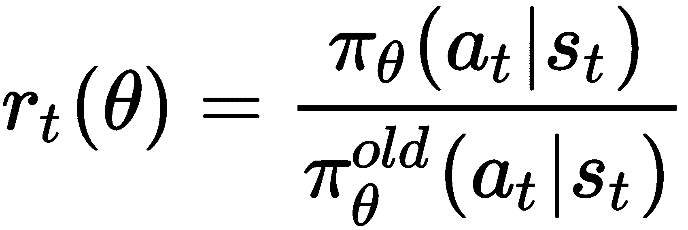
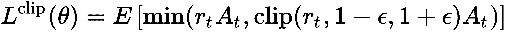
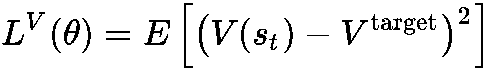
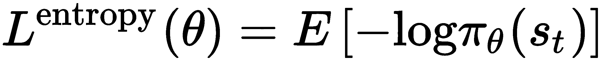
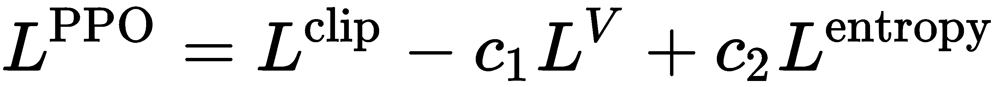

# 第七章：信任区域策略优化和近端策略优化

在上一章中，我们看到了 A3C 和 A2C 的使用，其中 A3C 是异步的，A2C 是同步的。在本章中，我们将看到另一种在线策略**强化学习**（**RL**）算法；具体来说是两种数学上非常相似的算法，尽管它们在求解方式上有所不同。我们将介绍名为**信任区域策略优化**（**TRPO**）的算法，这个算法由 OpenAI 和加利福尼亚大学伯克利分校的研究人员于 2015 年提出（顺便提一下，后者是我以前的雇主！）。然而，这个算法在数学上很难求解，因为它涉及共轭梯度算法，这是一种相对较难解决的方法；需要注意的是，像广为人知的 Adam 和**随机梯度下降**（**SGD**）等一阶优化方法无法用来求解 TRPO 方程。然后，我们将看到如何将策略优化方程的求解合并成一个，从而得到**近端策略优化**（**PPO**）算法，并且可以使用像 Adam 或 SGD 这样的第一阶优化算法。

本章将涵盖以下主题：

+   学习 TRPO

+   学习 PPO

+   使用 PPO 解决 MountainCar 问题

+   评估性能

# 技术要求

成功完成本章所需的软件：

+   Python（2 及以上版本）

+   NumPy

+   TensorFlow（版本 1.4 或更高）

# 学习 TRPO

TRPO 是 OpenAI 和加利福尼亚大学伯克利分校提出的一个非常流行的在线策略算法，首次提出于 2015 年。TRPO 有多种版本，但我们将学习论文*Trust Region Policy Optimization*中的基础版本，作者为*John Schulman, Sergey Levine, Philipp Moritz, Michael I. Jordan, 和 Pieter Abbeel*，*arXiv:1502.05477*：[`arxiv.org/abs/1502.05477`](https://arxiv.org/abs/1502.05477)。

TRPO 涉及求解一个策略优化方程，并附加一个关于策略更新大小的约束。我们现在将看到这些方程。

# TRPO 方程

TRPO 涉及最大化当前策略分布`Aₜ`与旧策略分布*π[θ]^(old)*（即在早期时间步的策略）之比的期望值，乘以优势函数`Aₜ`，并附加一个约束，即旧策略分布和新策略分布的**Kullback-Leibler**（**KL**）散度的期望值被限制在一个用户指定的值*δ*以内：


这里的第一个方程是策略目标，第二个方程是一个附加约束，确保策略更新是渐进的，不会进行大幅度的策略更新，从而避免将策略推向参数空间中非常远的区域。

由于我们有两个方程需要联合优化，基于一阶优化算法（如 Adam 和 SGD）的方法将无法工作。相反，这些方程使用共轭梯度算法来求解，对第一个方程进行线性近似，对第二个方程进行二次近似。然而，这在数学上较为复杂，因此我们在本书中不详细展示。我们将继续介绍 PPO 算法，它在编码上相对简单。

# 学习 PPO

PPO 是对 TRPO 的扩展，2017 年由 OpenAI 的研究人员提出。PPO 也是一种基于策略的算法，既可以应用于离散动作问题，也可以应用于连续动作。它使用与 TRPO 相同的策略分布比率，但不使用 KL 散度约束。具体来说，PPO 使用三种损失函数并将其合并为一个。接下来我们将看到这三种损失函数。

# PPO 损失函数

PPO 中涉及的三个损失函数中的第一个称为裁剪替代目标。令 *rt* 表示新旧策略概率分布的比率：



裁剪替代目标由以下方程给出，其中 `Aₜ` 是优势函数，*ε* 是超参数；通常，*ε* = 0.1 或 0.2 被使用：



`clip()` 函数将比率限制在 *1-ε* 和 *1+ε* 之间，从而保持比率在范围内。`min()` 函数是最小函数，确保最终目标是未裁剪目标的下界。

第二个损失函数是状态价值函数的 L2 范数：



第三个损失是策略分布的香农熵，它来源于信息理论：



现在我们将结合这三种损失函数。请注意，我们需要最大化 *L^(clip)* 和 *L^(entropy)*，但最小化 *L^V*。因此，我们将总的 PPO 损失函数定义为以下方程，其中 `c[1]` 和 `c[2]` 是用于缩放项的正数常量：



请注意，如果我们在策略网络和价值网络之间共享神经网络参数，那么前述的 *L^(PPO)* 损失函数可以单独最大化。另一方面，如果我们为策略和价值使用独立的神经网络，那么我们可以像以下方程所示那样，分别定义损失函数，其中 *L^(policy)* 被最大化，而 *L^(value)* 被最小化：


请注意，在这种情况下，`c[1]` 常数在策略和价值使用独立神经网络的设置中并不需要。神经网络参数会在多个迭代步骤中根据一批数据点进行更新，更新步骤的数量由用户作为超参数指定。

# 使用 PPO 解决 MountainCar 问题

我们将使用 PPO 解决 MountainCar 问题。MountainCar 问题涉及一辆被困在山谷中的汽车。它必须加速以克服重力，并尝试驶出山谷，爬上陡峭的山墙，最终到达山顶的旗帜点。你可以从 OpenAI Gym 中查看 MountainCar 问题的示意图：[`gym.openai.com/envs/MountainCar-v0/`](https://gym.openai.com/envs/MountainCar-v0/)。

这个问题非常具有挑战性，因为智能体不能仅仅从山脚下全力加速并尝试到达旗帜点，因为山墙非常陡峭，重力会阻止汽车获得足够的动能。最优的解决方案是汽车先向后驶，然后踩下油门，积累足够的动能来克服重力，成功地驶出山谷。我们将看到，RL 智能体实际上学会了这个技巧。

我们将编写以下两个文件来使用 PPO 解决 MountainCar 问题：

+   `class_ppo.py`

+   `train_test.py`

# 编写 class_ppo.py 文件

现在，我们将编写`class_ppo.py`文件：

1.  **导入包**：首先，我们将按照以下方式导入所需的包：

```py
import numpy as np
import gym
import sys
```

1.  **设置神经网络初始化器**：然后，我们将设置神经网络的参数（我们将使用两个隐藏层）以及权重和偏置的初始化器。正如我们在过去的章节中所做的那样，我们将使用 Xavier 初始化器来初始化权重，偏置的初始值则设置为一个小的正值：

```py
nhidden1 = 64 
nhidden2 = 64 

xavier = tf.contrib.layers.xavier_initializer()
bias_const = tf.constant_initializer(0.05)
rand_unif = tf.keras.initializers.RandomUniform(minval=-3e-3,maxval=3e-3)
regularizer = tf.contrib.layers.l2_regularizer(scale=0.0
```

1.  **定义 PPO** **类**：现在已经定义了`PPO()`类。首先，使用传递给类的参数定义`__init__()`构造函数。这里，`sess`是 TensorFlow 的`session`；`S_DIM`和`A_DIM`分别是状态和动作的维度；`A_LR`和`C_LR`分别是演员和评论员的学习率；`A_UPDATE_STEPS`和`C_UPDATE_STEPS`是演员和评论员的更新步骤数；`CLIP_METHOD`存储了 epsilon 值：

```py
class PPO(object):

    def __init__(self, sess, S_DIM, A_DIM, A_LR, C_LR, A_UPDATE_STEPS, C_UPDATE_STEPS, CLIP_METHOD):
        self.sess = sess
        self.S_DIM = S_DIM
        self.A_DIM = A_DIM
        self.A_LR = A_LR
        self.C_LR = C_LR
        self.A_UPDATE_STEPS = A_UPDATE_STEPS
        self.C_UPDATE_STEPS = C_UPDATE_STEPS
        self.CLIP_METHOD = CLIP_METHOD
```

1.  **定义 TensorFlow 占位符**：接下来，我们需要定义 TensorFlow 的占位符：`tfs`用于状态，`tfdc_r`用于折扣奖励，`tfa`用于动作，`tfadv`用于优势函数：

```py
# tf placeholders
self.tfs = tf.placeholder(tf.float32, [None, self.S_DIM], 'state')
self.tfdc_r = tf.placeholder(tf.float32, [None, 1], 'discounted_r')
self.tfa = tf.placeholder(tf.float32, [None, self.A_DIM], 'action')
self.tfadv = tf.placeholder(tf.float32, [None, 1], 'advantage')
```

1.  **定义评论员**：接下来定义评论员神经网络。我们使用状态(`sₜ`)占位符`self.tfs`作为神经网络的输入。使用两个隐藏层，分别由`nhidden1`和`nhidden2`个神经元组成，并使用`relu`激活函数（`nhidden1`和`nhidden2`的值之前都设定为`64`）。输出层有一个神经元，将输出状态价值函数*V(s[t])*，因此输出层不使用激活函数。接下来，我们计算优势函数，作为折扣累积奖励（存储在`self.tfdc_r`占位符中）与刚才计算的`self.v`输出之间的差异。评论员损失被计算为 L2 范数，并且评论员使用 Adam 优化器进行训练，目标是最小化该 L2 损失。

请注意，这个损失与本章理论部分之前提到的*L^(value)*相同：

```py
# critic
with tf.variable_scope('critic'):
    l1 = tf.layers.dense(self.tfs, nhidden1, activation=None, kernel_initializer=xavier, bias_initializer=bias_const, kernel_regularizer=regularizer)
    l1 = tf.nn.relu(l1)
    l2 = tf.layers.dense(l1, nhidden2, activation=None, kernel_initializer=xavier, bias_initializer=bias_const, kernel_regularizer=regularizer)
    l2 = tf.nn.relu(l2)

    self.v = tf.layers.dense(l2, 1, activation=None, kernel_initializer=rand_unif, bias_initializer=bias_const) 
    self.advantage = self.tfdc_r - self.v
    self.closs = tf.reduce_mean(tf.square(self.advantage))
    self.ctrain_op = tf.train.AdamOptimizer(self.C_LR).minimize(self.closs)
```

1.  **调用** **_build_anet** **函数**：我们通过一个即将指定的`_build_anet()`函数来定义 actor。具体来说，该函数输出策略分布和模型参数列表。我们为当前策略调用一次此函数，再为旧策略调用一次。可以通过调用`self.pi`的`mean()`和`stddev()`函数分别获得均值和标准差：

```py
# actor
self.pi, self.pi_params = self._build_anet('pi', trainable=True) 
self.oldpi, self.oldpi_params = self._build_anet('oldpi', trainable=False)

self.pi_mean = self.pi.mean()
self.pi_sigma = self.pi.stddev()
```

1.  **示例动作**：我们可以通过策略分布`self.pi`，使用`sample()`函数从 TensorFlow 的分布中采样动作：

```py
with tf.variable_scope('sample_action'):
    self.sample_op = tf.squeeze(self.pi.sample(1), axis=0) 
```

1.  **更新旧策略参数**：可以通过简单地将新策略的值赋给旧策略，使用 TensorFlow 的`assign()`函数来更新旧策略网络的参数。请注意，新策略已经过优化——旧策略仅仅是当前策略的一个副本，尽管是来自一次更新周期之前的。

```py
with tf.variable_scope('update_oldpi'):
    self.update_oldpi_op = [oldp.assign(p) for p, oldp in zip(self.pi_params, self.oldpi_params)]
```

1.  **计算策略分布比率**：策略分布比率在`self.tfa`动作处计算，并存储在`self.ratio`中。请注意，指数地，分布的对数差异等于分布的比率。然后将这个比率裁剪，限制在*1-ε*和*1+ε*之间，正如理论部分中所解释的：

```py
with tf.variable_scope('loss'):
    self.ratio = tf.exp(self.pi.log_prob(self.tfa) - self.oldpi.log_prob(self.tfa))
    self.clipped_ratio = tf.clip_by_value(self.ratio, 1.-self.CLIP_METHOD['epsilon'], 1.+self.CLIP_METHOD['epsilon'])
```

1.  **计算损失**：前面提到的策略总损失包含三个损失，当策略和价值神经网络共享权重时，这些损失会结合在一起。然而，由于我们考虑到本章前面理论中提到的另一种设置，其中策略和价值各自拥有独立的神经网络，因此策略优化将有两个损失。第一个是未剪切比率与优势函数及其剪切类比的乘积的最小值——这个值存储在`self.aloss`中。第二个损失是香农熵，它是策略分布与其对数的乘积，所有值相加，并带上负号。这个项通过超参数`c[1]` = 0.01 进行缩放，并从损失中减去。暂时将熵损失项设置为零，就像在 PPO 论文中一样。我们可以考虑稍后加入此熵损失项，看看它是否对策略的学习有任何影响。我们使用 Adam 优化器。请注意，我们需要最大化本章前面提到的原始策略损失，但 Adam 优化器具有`minimize()`函数，因此我们在`self.aloss`中加入了负号（参见下面代码的第一行），因为最大化一个损失等同于最小化它的负值：

```py
self.aloss = -tf.reduce_mean(tf.minimum(self.ratio*self.tfadv, self.clipped_ratio*self.tfadv))

# entropy 
entropy = -tf.reduce_sum(self.pi.prob(self.tfa) * tf.log(tf.clip_by_value(self.pi.prob(self.tfa),1e-10,1.0)),axis=1)
entropy = tf.reduce_mean(entropy,axis=0) 
self.aloss -= 0.0 #0.01 * entropy

with tf.variable_scope('atrain'):
    self.atrain_op = tf.train.AdamOptimizer(self.A_LR).minimize(self.aloss) 
```

1.  **定义** **更新** **函数**：接下来定义`update()`函数，它将`state`（状态）`a`（动作）和`r`（奖励）作为参数。该函数涉及通过调用 TensorFlow 的`self.update_oldpi_op`操作来更新旧策略网络的参数。然后计算优势，结合状态和动作，利用`A_UPDATE_STEPS`（演员迭代次数）进行更新。接着，利用`C_UPDATE_STEPS`（评论者迭代次数）对评论者进行更新，运行 TensorFlow 会话以执行评论者训练操作：

```py
def update(self, s, a, r):

    self.sess.run(self.update_oldpi_op)
    adv = self.sess.run(self.advantage, {self.tfs: s, self.tfdc_r: r})

    # update actor
    for _ in range(self.A_UPDATE_STEPS):
        self.sess.run(self.atrain_op, feed_dict={self.tfs: s, self.tfa: a, self.tfadv: adv})

    # update critic
    for _ in range(self.C_UPDATE_STEPS):
        self.sess.run(self.ctrain_op, {self.tfs: s, self.tfdc_r: r}) 
```

1.  **定义** **_build_anet** **函数**：接下来我们将定义之前使用过的`_build_anet()`函数。它将计算策略分布，该分布被视为高斯分布（即正态分布）。它以`self.tfs`状态占位符作为输入，具有两个隐藏层，分别包含`nhidden1`和`nhidden2`个神经元，并使用`relu`激活函数。然后，这个输出传递到两个输出层，这些层的输出数量是`A_DIM`动作维度，其中一个表示均值`mu`，另一个表示标准差`sigma`。

请注意，动作的均值是有限制的，因此使用`tanh`激活函数，并进行小幅裁剪以避免极值；对于标准差，使用`softplus`激活函数，并将其偏移`0.1`以避免出现零的标准差。一旦我们获得了动作的均值和标准差，TensorFlow 的`Normal`分布被用来将策略视为高斯分布。我们还可以调用`tf.get_collection()`来获取模型参数，`Normal`分布和模型参数将从函数中返回：

```py
    def _build_anet(self, name, trainable):
        with tf.variable_scope(name):
            l1 = tf.layers.dense(self.tfs, nhidden1, activation=None, trainable=trainable, kernel_initializer=xavier, bias_initializer=bias_const, kernel_regularizer=regularizer)
            l1 = tf.nn.relu(l1)
            l2 = tf.layers.dense(l1, nhidden2, activation=None, trainable=trainable, kernel_initializer=xavier, bias_initializer=bias_const, kernel_regularizer=regularizer)
            l2 = tf.nn.relu(l2)

            mu = tf.layers.dense(l2, self.A_DIM, activation=tf.nn.tanh, trainable=trainable, kernel_initializer=rand_unif, bias_initializer=bias_const)

            small = tf.constant(1e-6)
            mu = tf.clip_by_value(mu,-1.0+small,1.0-small) 

            sigma = tf.layers.dense(l2, self.A_DIM, activation=None, trainable=trainable, kernel_initializer=rand_unif, bias_initializer=bias_const)
            sigma = tf.nn.softplus(sigma) + 0.1 

            norm_dist = tf.distributions.Normal(loc=mu, scale=sigma)
        params = tf.get_collection(tf.GraphKeys.GLOBAL_VARIABLES, scope=name)
        return norm_dist, params
```

1.  **定义** **choose_action** **函数**：我们还定义了一个`choose_action()`函数，从策略中采样以获取动作：

```py
   def choose_action(self, s):
        s = s[np.newaxis, :]
        a = self.sess.run(self.sample_op, {self.tfs: s})
        return a[0]
```

1.  **定义** **get_v** **函数**：最后，我们还定义了一个`get_v()`函数，通过在`self.v`上运行 TensorFlow 会话来返回状态值：

```py
   def get_v(self, s):
        if s.ndim < 2: s = s[np.newaxis, :]
        vv = self.sess.run(self.v, {self.tfs: s})
        return vv[0,0]
```

`class_ppo.py`部分到此结束。接下来，我们将编写`train_test.py`。

# 编写`train_test.py`文件

现在我们将编写`train_test.py`文件。

1.  **导入包**：首先，我们导入所需的包：

```py
import tensorflow as tf
import numpy as np
import matplotlib.pyplot as plt
import gym
import sys
import time

from class_ppo import *
```

1.  **定义函数**：接着，我们定义了一个奖励塑造函数，该函数将根据良好或差劲的表现分别给予额外的奖励和惩罚。这样做是为了鼓励小车朝向位于山顶的旗帜一侧行驶，否则学习速度会变慢：

```py
def reward_shaping(s_):

     r = 0.0

     if s_[0] > -0.4:
          r += 5.0*(s_[0] + 0.4)
     if s_[0] > 0.1: 
          r += 100.0*s_[0]
     if s_[0] < -0.7:
          r += 5.0*(-0.7 - s_[0])
     if s_[0] < 0.3 and np.abs(s_[1]) > 0.02:
          r += 4000.0*(np.abs(s_[1]) - 0.02)

     return r
```

1.  接下来，我们选择`MountainCarContinuous`作为环境。我们将训练智能体的总集数设置为`EP_MAX`，并将其设置为`1000`。`GAMMA`折扣因子设置为`0.9`，学习率为`2e-4`。我们使用`32`的批量大小，并在每个周期执行`10`次更新步骤。状态和动作维度分别存储在`S_DIM`和`A_DIM`中。对于 PPO 的`clip`参数`epsilon`，我们使用`0.1`的值。`train_test`在训练时设置为`0`，在测试时设置为`1`：

```py
env = gym.make('MountainCarContinuous-v0')

EP_MAX = 1000
GAMMA = 0.9

A_LR = 2e-4
C_LR = 2e-4

BATCH = 32
A_UPDATE_STEPS = 10
C_UPDATE_STEPS = 10

S_DIM = env.observation_space.shape[0]
A_DIM = env.action_space.shape[0]

print("S_DIM: ", S_DIM, "| A_DIM: ", A_DIM)

CLIP_METHOD = dict(name='clip', epsilon=0.1)

# train_test = 0 for train; =1 for test
train_test = 0

# irestart = 0 for fresh restart; =1 for restart from ckpt file
irestart = 0

iter_num = 0

if (irestart == 0):
  iter_num = 0
```

1.  我们创建一个 TensorFlow 会话，并命名为`sess`。创建一个`PPO`类的实例，命名为`ppo`。我们还创建了一个 TensorFlow 的保存器。然后，如果我们是从头开始训练，我们通过调用`tf.global_variables_initializer()`初始化所有模型参数；如果我们是从保存的智能体继续训练或进行测试，则从`ckpt/model`路径恢复：

```py
sess = tf.Session()

ppo = PPO(sess, S_DIM, A_DIM, A_LR, C_LR, A_UPDATE_STEPS, C_UPDATE_STEPS, CLIP_METHOD)

saver = tf.train.Saver()

if (train_test == 0 and irestart == 0):
  sess.run(tf.global_variables_initializer())
else:
  saver.restore(sess, "ckpt/model") 
```

1.  然后定义了一个主要的`for loop`，用于遍历集数。在循环内部，我们重置环境，并将缓冲区设置为空列表。终止布尔值`done`和时间步骤数`t`也被初始化：

```py
for ep in range(iter_num, EP_MAX):

    print("-"*70)

    s = env.reset()

    buffer_s, buffer_a, buffer_r = [], [], []
    ep_r = 0

    max_pos = -1.0
    max_speed = 0.0
    done = False
    t = 0
```

在外部循环中，我们有一个内层的`while`循环来处理时间步。这个问题涉及较短的时间步，在这些时间步内，汽车可能没有显著移动，因此我们使用粘性动作，其中动作每`8`个时间步才从策略中采样一次。`PPO`类中的`choose_action()`函数会为给定的状态采样动作。为了进行探索，我们会在动作中加入小的高斯噪声，并将其限制在`-1.0`到`1.0`的范围内，这是`MountainCarContinuous`环境所要求的。然后，动作被输入到环境的`step()`函数中，后者将输出下一个`s_`状态、`r`奖励以及终止标志`done`。调用`reward_shaping()`函数来调整奖励。为了跟踪智能体推动极限的程度，我们还计算它在`max_pos`和`max_speed`中分别的最大位置和速度：

```py
    while not done: 

        env.render()

        # sticky actions
        #if (t == 0 or np.random.uniform() < 0.125): 
        if (t % 8 ==0):
          a = ppo.choose_action(s) 

        # small noise for exploration
        a += 0.1 * np.random.randn() 

        # clip
        a = np.clip(a, -1.0, 1.0)

        # take step 
        s_, r, done, _ = env.step(a)

        if s_[0] > 0.4:
            print("nearing flag: ", s_, a) 

        if s_[0] > 0.45:
          print("reached flag on mountain! ", s_, a) 
          if done == False:
             print("something wrong! ", s_, done, r, a)
             sys.exit() 

        # reward shaping 
        if train_test == 0:
          r += reward_shaping(s_)

        if s_[0] > max_pos:
           max_pos = s_[0]
        if s_[1] > max_speed:
           max_speed = s_[1]
```

1.  如果我们处于训练模式，状态、动作和奖励会被追加到缓冲区。新的状态会被设置为当前状态，如果回合尚未结束，我们将继续进行下一个时间步。`ep_r`回合总奖励和`t`时间步数也会被更新：

```py
if (train_test == 0):
    buffer_s.append(s)
    buffer_a.append(a)
    buffer_r.append(r) 

    s = s_
    ep_r += r
    t += 1
```

如果我们处于训练模式，当样本数量等于一个批次，或者回合已经结束时，我们将训练神经网络。为此，首先使用`ppo.get_v`获取新状态的状态值。然后，我们计算折扣奖励。缓冲区列表也会被转换为 NumPy 数组，并且缓冲区列表会被重置为空列表。接下来，这些`bs`、`ba`和`br` NumPy 数组将被用来更新`ppo`对象的演员和评论员网络：

```py
if (train_test == 0):
    if (t+1) % BATCH == 0 or done == True:
        v_s_ = ppo.get_v(s_)
        discounted_r = []
        for r in buffer_r[::-1]:
            v_s_ = r + GAMMA * v_s_
            discounted_r.append(v_s_)
            discounted_r.reverse()

        bs = np.array(np.vstack(buffer_s))
        ba = np.array(np.vstack(buffer_a)) 
        br = np.array(discounted_r)[:, np.newaxis]

        buffer_s, buffer_a, buffer_r = [], [], []

        ppo.update(bs, ba, br)
```

1.  如果我们处于测试模式，Python 会短暂暂停以便更好地进行可视化。如果回合已结束，`while`循环会通过`break`语句退出。然后，我们会在屏幕上打印最大的位置和速度值，并将它们以及回合奖励写入名为`performance.txt`的文件中。每 10 个回合，我们还会通过调用`saver.save`来保存模型：

```py
    if (train_test == 1):
        time.sleep(0.1)

    if (done == True):
        print("values at done: ", s_, a)
        break

    print("episode: ", ep, "| episode reward: ", round(ep_r,4), "| time steps: ", t)
    print("max_pos: ", max_pos, "| max_speed:", max_speed)

    if (train_test == 0):
      with open("performance.txt", "a") as myfile:
        myfile.write(str(ep) + " " + str(round(ep_r,4)) + " " + str(round(max_pos,4)) + " " + str(round(max_speed,4)) + "\n")

    if (train_test == 0 and ep%10 == 0):
      saver.save(sess, "ckpt/model")
```

这标志着 PPO 编码的结束。接下来我们将在 MountainCarContinuous 上评估其性能。

# 评估性能

PPO 智能体通过以下命令进行训练：

```py
python train_test.py
```

一旦训练完成，我们可以通过设置以下内容来测试智能体：

```py
train_test = 1
```

然后，我们会再次运行`python train_test.py`。通过可视化智能体，我们可以观察到汽车首先向后移动，攀爬左侧的山。接着，它全速前进，获得足够的动能，成功越过右侧山峰上方的陡峭坡道。因此，PPO 智能体已经学会成功驶出山谷。

# 全油门

请注意，我们必须先倒车，然后踩下油门，才能获得足够的动能逃脱重力并成功驶出山谷。如果我们一开始就踩下油门，汽车还能够逃脱吗？让我们通过编写并运行`mountaincar_full_throttle.py`来验证。

现在，我们将动作设置为`1.0`，即全油门：

```py
import sys
import numpy as np
import gym

env = gym.make('MountainCarContinuous-v0')

for _ in range(100):
  s = env.reset()
  done = False

  max_pos = -1.0
  max_speed = 0.0 
  ep_reward = 0.0

  while not done:
    env.render() 
    a = [1.0] # step on throttle
    s_, r, done, _ = env.step(a)

    if s_[0] > max_pos: max_pos = s_[0]
    if s_[1] > max_speed: max_speed = s_[1] 
    ep_reward += r

  print("ep_reward: ", ep_reward, "| max_pos: ", max_pos, "| max_speed: ", max_speed)
```

从训练过程中生成的视频可以看出，汽车无法逃脱重力的无情拉力，最终仍然被困在山谷的底部。

# 随机油门

如果我们尝试随机的油门值呢？我们将编写`mountaincar_random_throttle.py`，在`-1.0`到`1.0`的范围内进行随机操作：

```py
import sys
import numpy as np
import gym

env = gym.make('MountainCarContinuous-v0')

for _ in range(100):
  s = env.reset()
  done = False

  max_pos = -1.0
  max_speed = 0.0 
  ep_reward = 0.0

  while not done:
    env.render() 
    a = [-1.0 + 2.0*np.random.uniform()] 
    s_, r, done, _ = env.step(a)

    if s_[0] > max_pos: max_pos = s_[0]
    if s_[1] > max_speed: max_speed = s_[1] 
    ep_reward += r

  print("ep_reward: ", ep_reward, "| max_pos: ", max_pos, "| max_speed: ", max_speed)
```

在这种情况下，汽车仍然无法逃脱重力，依然被困在山谷的底部。所以，RL 智能体需要明白，最优策略是先向后行驶，然后踩下油门，逃脱重力并到达山顶的旗帜处。

这标志着我们的 PPO MountainCar 练习的结束。

# 总结

在这一章中，我们介绍了 TRPO 和 PPO 两种 RL 算法。TRPO 涉及两个需要求解的方程，第一个方程是策略目标，第二个方程是对更新幅度的约束。TRPO 需要二阶优化方法，例如共轭梯度。为了简化这一过程，PPO 算法应运而生，其中策略比例被限制在一个用户指定的范围内，从而保持更新的渐进性。此外，我们还看到了使用从经验中收集的数据样本来更新演员和评论家，通过多次迭代进行训练。我们在 MountainCar 问题上训练了 PPO 智能体，这是一个具有挑战性的问题，因为演员必须先将汽车倒退上左边的山，然后加速以获得足够的动能克服重力，最终到达右边山顶的旗帜处。我们还发现，全油门策略或随机策略无法帮助智能体达到目标。

本章中，我们回顾了几种强化学习（RL）算法。在下一章，我们将应用 DDPG 和 PPO 来训练一个智能体，使其能自动驾驶汽车。

# 问题

1.  我们可以在 TRPO 中应用 Adam 或 SGD 优化吗？

1.  策略优化中的熵项有什么作用？

1.  为什么我们要剪辑策略比例？如果剪辑参数 epsilon 较大，会发生什么？

1.  为什么我们使用`tanh`激活函数作为`mu`的激活函数，而使用`softplus`作为 sigma 的激活函数？我们能否为 sigma 使用`tanh`激活函数？

1.  奖励塑造在训练中总是有效吗？

1.  测试一个已经训练好的智能体时，我们需要奖励塑造吗？

# 进一步阅读

+   *信任域策略优化*，*约翰·舒尔曼*，*谢尔盖·莱文*，*菲利普·莫里茨*，*迈克尔·I·乔丹*，*皮特·阿贝尔*，arXiv:1502.05477 (TRPO 论文): [`arxiv.org/abs/1502.05477`](https://arxiv.org/abs/1502.05477)

+   *近端策略优化算法*，*约翰·舒尔曼*，*菲利普·沃尔斯基*，*普拉夫拉·达里瓦尔*，*亚历克·拉德福*，*奥列格·克里莫夫*，arXiv:1707.06347（PPO 论文）：[`arxiv.org/abs/1707.06347`](https://arxiv.org/abs/1707.06347)

+   *深度强化学习实战*，*马克西姆·拉潘*，*Packt 出版社*：[`www.packtpub.com/big-data-and-business-intelligence/deep-reinforcement-learning-hands`](https://www.packtpub.com/big-data-and-business-intelligence/deep-reinforcement-learning-hands)
