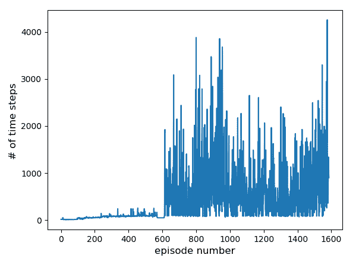

# 第八章：深度强化学习应用于自动驾驶

自动驾驶是目前正在开发的最热门的技术革命之一。它将极大地改变人类对交通的看法，显著降低旅行成本并提高安全性。自动驾驶汽车开发社区已经使用了若干前沿算法来实现这一目标。这些算法包括但不限于感知、定位、路径规划和控制。感知涉及识别自动驾驶汽车周围的环境——行人、汽车、自行车等。定位是指在预先计算好的环境地图中识别汽车的确切位置（或者更精确地说，姿态）。路径规划，顾名思义，是规划自动驾驶汽车路径的过程，包括长期路径（比如从`A`点到`B`点）以及短期路径（比如接下来的 5 秒）。控制则是实际执行所需路径的过程，包括避让操作。特别地，**强化学习**（**RL**）在自动驾驶的路径规划和控制中被广泛应用，适用于城市驾驶和高速公路驾驶。

在本章中，我们将使用**开放赛车模拟器**（**TORCS**）来训练 RL 智能体，学习如何在赛道上成功驾驶。尽管 CARLA 模拟器更强大且具有逼真的渲染效果，但 TORCS 更易于使用，因此是一个很好的入门选择。完成本书后，鼓励感兴趣的读者尝试在 CARLA 模拟器上训练 RL 智能体。

本章将涉及以下主题：

+   学习使用 TORCS

+   训练**深度确定性策略梯度**（**DDPG**）智能体来学习驾驶

+   训练**近端策略优化**（**PPO**）智能体

# 技术要求

本章的学习需要以下工具：

+   Python（版本 2 或 3）

+   NumPy

+   Matplotlib

+   TensorFlow（版本 1.4 或更高）

+   TORCS 赛车模拟器

# 汽车驾驶模拟器

在自动驾驶中应用强化学习（RL）需要使用强大的汽车驾驶模拟器，因为 RL 智能体不能直接在道路上进行训练。为此，研究社区开发了几款开源汽车驾驶模拟器，每款都有其优缺点。一些开源汽车驾驶模拟器包括：

+   CARLA

    +   [`vladlen.info/papers/carla.pdf`](http://vladlen.info/papers/carla.pdf)

    +   在英特尔实验室开发

    +   适用于城市驾驶

+   TORCS

    +   [`torcs.sourceforge.net/`](http://torcs.sourceforge.net/)

    +   赛车

+   DeepTraffic

    +   [`selfdrivingcars.mit.edu/deeptraffic/`](https://selfdrivingcars.mit.edu/deeptraffic/)

    +   在 MIT 开发

    +   适用于高速公路驾驶

# 学习使用 TORCS

我们将首先学习如何使用 TORCS 赛车模拟器，它是一个开源模拟器。你可以从 [`torcs.sourceforge.net/index.php?name=Sections&op=viewarticle&artid=3`](http://torcs.sourceforge.net/index.php?name=Sections&op=viewarticle&artid=3) 获取下载说明，但以下是 Linux 系统下的关键步骤总结：

1.  从 [`sourceforge.net/projects/torcs/files/all-in-one/1.3.7/torcs-1.3.7.tar.bz2/download`](https://sourceforge.net/projects/torcs/files/all-in-one/1.3.7/torcs-1.3.7.tar.bz2/download) 下载 `torcs-1.3.7.tar.bz2` 文件

1.  使用 `tar xfvj torcs-1.3.7.tar.bz2` 解包该包

1.  执行以下命令：

    +   `cd torcs-1.3.7`

    +   `./configure`

    +   `make`

    +   `make install`

    +   `make datainstall`

1.  默认安装目录为：

    +   `/usr/local/bin`：TORCS 命令（该目录应包含在你的 `PATH` 中）

    +   `/usr/local/lib/torcs`：TORCS 动态 `libs`（如果不使用 TORCS shell，目录必须包含在你的 `LD_LIBRARY_PATH` 中）

    +   `/usr/local/share/games/torcs`：TORCS 数据文件

通过运行 `torcs` 命令（默认位置是 `/usr/local/bin/torcs`），你现在可以看到 TORCS 模拟器开启。然后可以选择所需的设置，包括选择汽车、赛道等。模拟器也可以作为视频游戏来玩，但我们更感兴趣的是用它来训练 RL 智能体。

# 状态空间

接下来，我们将定义 TORCS 的状态空间。*表 2：可用传感器描述（第二部分）。范围与其单位（如果定义了单位）一起报告*，来自 *模拟汽车赛车锦标赛：竞赛软件手册* 文档，在 [`arxiv.org/pdf/1304.1672.pdf`](https://arxiv.org/pdf/1304.1672.pdf) 中提供了一个模拟器可用状态参数的总结。我们将使用以下条目作为我们的状态空间；方括号中的数字表示条目的大小：

+   `angle`：汽车方向与赛道之间的角度（1）

+   `track`：这将给我们每 10 度测量一次的赛道末端，从 -90 到 +90 度；它有 19 个实数值，包括端点值（19）

+   `trackPos`：汽车与赛道轴之间的距离（1）

+   `speedX`：汽车在纵向方向的速度（1）

+   `speedY`：汽车在横向方向的速度（1）

+   `speedZ`：汽车在 `Z` 方向的速度；其实我们并不需要这个，但现在先保留它（1）

+   `wheelSpinVel`：汽车四个轮子的旋转速度（4）

+   `rpm`：汽车引擎的转速（1）

请参考之前提到的文档以更好地理解前述变量，包括它们的允许范围。总结所有实数值条目的数量，我们注意到我们的状态空间是一个实数值向量，大小为 1+19+1+1+1+1+4+1 = 29。我们的动作空间大小为`3`：转向、加速和刹车。转向范围为 [*-1,1*]，加速范围为 [*0,1*]，刹车也是如此。

# 支持文件

开源社区还开发了两个 Python 文件，将 TORCS 与 Python 接口，以便我们能够从 Python 命令调用 TORCS。此外，为了自动启动 TORCS，我们需要另一个`sh`文件。这三个文件总结如下：

+   `gym_torcs.py`

+   `snakeoil3_gym.py`

+   `autostart.sh`

这些文件包含在本章的代码文件中（[`github.com/PacktPublishing/TensorFlow-Reinforcement-Learning-Quick-Start-Guide`](https://github.com/PacktPublishing/TensorFlow-Reinforcement-Learning-Quick-Start-Guide)），但也可以通过 Google 搜索获取。在`gym_torcs.py`的第~130-160 行中，设置了奖励函数。你可以看到以下行，这些行将原始的模拟器状态转换为 NumPy 数组：

```py
# Reward setting Here #######################################
# direction-dependent positive reward
track = np.array(obs['track'])
trackPos = np.array(obs['trackPos'])
sp = np.array(obs['speedX'])
damage = np.array(obs['damage'])
rpm = np.array(obs['rpm'])
```

然后，奖励函数被设置如下。请注意，我们根据沿轨道的纵向速度（角度项的余弦值）给予奖励，并惩罚横向速度（角度项的正弦值）。轨道位置也会被惩罚。理想情况下，如果这是零，我们将处于轨道的中心，而*+1*或*-1*的值表示我们在轨道的边缘，这是不希望发生的，因此会受到惩罚：

```py
progress = sp*np.cos(obs['angle']) - np.abs(sp*np.sin(obs['angle'])) - sp * np.abs(obs['trackPos'])
reward = progress
```

如果汽车偏离轨道或智能体的进度卡住，我们使用以下代码终止该回合：

```py
if (abs(track.any()) > 1 or abs(trackPos) > 1): # Episode is terminated if the car is out of track
    print("Out of track ")
    reward = -100 #-200
    episode_terminate = True
    client.R.d['meta'] = True

if self.terminal_judge_start < self.time_step: # Episode terminates if the progress of agent is small
    if progress < self.termination_limit_progress:
         print("No progress", progress)
         reward = -100 # KAUSHIK ADDED THIS
         episode_terminate = True
         client.R.d['meta'] = True
```

我们现在已经准备好训练一个 RL 智能体，让它在 TORCS 中成功驾驶。我们将首先使用 DDPG 智能体。

# 训练 DDPG 智能体学习驾驶

大部分 DDPG 代码与我们在第五章中看到的*深度确定性策略梯度（DDPG）*相同；这里只总结其中的差异。

# 编写 ddpg.py

我们的 TORCS 状态维度是`29`，动作维度是`3`；这些在`ddpg.py`中设置，如下所示：

```py
state_dim = 29
action_dim = 3
action_bound = 1.0
```

# 编写 AandC.py

actor 和 critic 文件`AandC.py`也需要进行修改。特别地，`ActorNetwork`类中的`create_actor_network`被修改为拥有两个隐藏层，分别包含`400`和`300`个神经元。此外，输出由三个动作组成：`steering`（转向）、`acceleration`（加速）和`brake`（刹车）。由于转向在[*-1,1*]范围内，因此使用`tanh`激活函数；加速和刹车在[*0,1*]范围内，因此使用`sigmoid`激活函数。然后，我们在轴维度`1`上将它们`concat`（连接），这就是我们 actor 策略的输出：

```py
   def create_actor_network(self, scope):
       with tf.variable_scope(scope, reuse=tf.AUTO_REUSE):
          state = tf.placeholder(name='a_states', dtype=tf.float32, shape=[None, self.s_dim])

          net = tf.layers.dense(inputs=state, units=400, activation=None, kernel_initializer=winit, bias_initializer=binit, name='anet1') 
          net = tf.nn.relu(net)

          net = tf.layers.dense(inputs=net, units=300, activation=None, kernel_initializer=winit, bias_initializer=binit, name='anet2')
          net = tf.nn.relu(net)

          steering = tf.layers.dense(inputs=net, units=1, activation=tf.nn.tanh, kernel_initializer=rand_unif, bias_initializer=binit, name='steer') 
          acceleration = tf.layers.dense(inputs=net, units=1, activation=tf.nn.sigmoid, kernel_initializer=rand_unif, bias_initializer=binit, name='acc') 
          brake = tf.layers.dense(inputs=net, units=1, activation=tf.nn.sigmoid, kernel_initializer=rand_unif, bias_initializer=binit, name='brake') 

          out = tf.concat([steering, acceleration, brake], axis=1) 

          return state, out
```

同样，`CriticNetwork`类的`create_critic_network()`函数被修改为拥有两个隐藏层，分别包含`400`和`300`个神经元。这在以下代码中显示：

```py
    def create_critic_network(self, scope):
        with tf.variable_scope(scope, reuse=tf.AUTO_REUSE):
           state = tf.placeholder(name='c_states', dtype=tf.float32, shape=[None, self.s_dim]) 
           action = tf.placeholder(name='c_action', dtype=tf.float32, shape=[None, self.a_dim]) 

           net = tf.concat([state, action],1) 

           net = tf.layers.dense(inputs=net, units=400, activation=None, kernel_initializer=winit, bias_initializer=binit, name='cnet1') 
           net = tf.nn.relu(net)

           net = tf.layers.dense(inputs=net, units=300, activation=None, kernel_initializer=winit, bias_initializer=binit, name='cnet2') 
           net = tf.nn.relu(net)

           out = tf.layers.dense(inputs=net, units=1, activation=None, kernel_initializer=rand_unif, bias_initializer=binit, name='cnet_out') 
           return state, action, out
```

需要进行的其他更改在`TrainOrTest.py`中，我们接下来将查看这些更改。

# 编写 TrainOrTest.py

从`gym_torcs`导入 TORCS 环境，以便我们能够在其上训练 RL 智能体：

1.  **导入 TORCS**：从`gym_torcs`导入 TORCS 环境，代码如下：

```py
from gym_torcs import TorcsEnv
```

1.  **`env`变量**：使用以下命令创建 TORCS 环境变量：

```py
    # Generate a Torcs environment
    env = TorcsEnv(vision=False, throttle=True, gear_change=False)
```

1.  **重新启动 TORCS**：由于 TORCS 已知存在内存泄漏错误，每`100`个回合后使用`relaunch=True`重新启动环境；否则，可以按如下方式在不带参数的情况下重置环境：

```py
if np.mod(i, 100) == 0:
    ob = env.reset(relaunch=True) #relaunch TORCS every N episodes  due to a memory leak error
else:
    ob = env.reset()
```

1.  **堆叠状态空间**：使用以下命令堆叠 29 维的状态空间：

```py
s = np.hstack((ob.angle, ob.track, ob.trackPos, ob.speedX, ob.speedY, ob.speedZ, ob.wheelSpinVel/100.0, ob.rpm))
```

1.  **每回合的时间步数**：选择每个回合运行的时间步数`msteps`。在前`100`个回合中，代理学习尚未深入，因此你可以选择每回合`100`个时间步；对于后续回合，我们将其线性增加，直到达到`max_steps`的上限。

这个步骤并不是关键，代理的学习并不依赖于我们为每个回合选择的步数。可以自由尝试设置`msteps`。

选择每回合的时间步数，如下所示：

```py
msteps = max_steps
if (i < 100):
    msteps = 100
elif (i >=100 and i < 200):
    msteps = 100 + (i-100)*9
else: 
    msteps = 1000 + (i-200)*5
    msteps = min(msteps, max_steps)
```

1.  **全速前进**：在前`10`个回合中，我们施加全速前进以预热神经网络参数。只有在此之后，我们才开始使用演员的策略。需要注意的是，TORCS 通常在大约 1,500 到 2,000 个回合后学习完成，所以前`10`个回合对后期的学习影响不大。通过以下方式应用全速前进来预热神经网络参数：

```py
# first few episodes step on gas! 
if (i < 10):
    a[0][0] = 0.0
    a[0][1] = 1.0
    a[0][2] = 0.0
```

这就是为了让 DDPG 代理在 TORCS 中玩的代码需要做的更改。其余的代码与第五章中讲解的*深度确定性策略梯度（DDPG）*相同。我们可以使用以下命令来训练代理：

```py
python ddpg.py
```

输入`1`进行训练；输入`0`是为了测试一个预训练的代理。训练可能需要 2 到 5 天，具体取决于使用的计算机速度。但这是一个有趣的问题，值得花费时间和精力。每个回合的步数以及奖励都会存储在`analysis_file.txt`文件中，我们可以用它来绘制图表。每个回合的时间步数如下图所示：



图 1：TORCS 每回合的时间步数（训练模式）

我们可以看到，经过大约 600 次训练后，汽车已经学会了合理地驾驶，而在大约 1500 次训练后，驾驶更加高效。大约 300 个时间步对应赛道的一圈。因此，代理在训练结束时能够驾驶七到八圈以上而不会中途终止。关于 DDPG 代理驾驶的精彩视频，请参考以下 YouTube 链接：[`www.youtube.com/watch?v=ajomz08hSIE`](https://www.youtube.com/watch?v=ajomz08hSIE)。

# 训练 PPO 代理

我们之前展示了如何训练一个 DDPG 智能体在 TORCS 中驾驶汽车。如何使用 PPO 智能体则留作有兴趣的读者的练习。这是一个不错的挑战。来自第七章的 PPO 代码，*信任区域策略优化与近端策略优化*，可以复用，只需对 TORCS 环境做必要的修改。TORCS 的 PPO 代码也已提供在代码库中（[`github.com/PacktPublishing/TensorFlow-Reinforcement-Learning-Quick-Start-Guide`](https://github.com/PacktPublishing/TensorFlow-Reinforcement-Learning-Quick-Start-Guide)），有兴趣的读者可以浏览它。TORCS 中 PPO 智能体驾驶汽车的酷炫视频可以在以下 YouTube 视频中查看：[`youtu.be/uE8QaJQ7zDI`](https://youtu.be/uE8QaJQ7zDI)

另一个挑战是对于有兴趣的读者来说，使用**信任区域策略优化**（**TRPO**）解决 TORCS 赛车问题。如果有兴趣，也可以尝试一下！这是掌握 RL 算法的一种方法。

# 总结

本章中，我们展示了如何应用强化学习（RL）算法训练一个智能体，使其学会自主驾驶汽车。我们安装了 TORCS 赛车模拟器，并学习了如何将其与 Python 接口，以便我们可以训练 RL 智能体。我们还深入探讨了 TORCS 的状态空间以及这些术语的含义。随后，使用 DDPG 算法训练一个智能体，成功学会在 TORCS 中驾驶。TORCS 中的视频渲染效果非常酷！训练后的智能体能够成功驾驶超过七到八圈。最后，我们也探索了使用 PPO 算法解决同样的自主驾驶问题，并将其作为练习留给有兴趣的读者；相关代码已提供在本书的代码库中。

这也就结束了本章以及本书的内容。可以随时在线阅读更多关于 RL 在自主驾驶和机器人学应用的材料。这是目前学术界和工业界研究的热门领域，并且得到了充分的资金支持，相关领域也有许多职位空缺。祝你一切顺利！

# 问题

1.  为什么不能使用 DQN 来解决 TORCS 问题？

1.  我们使用了 Xavier 权重初始化器来初始化神经网络的权重。你知道还有哪些其他的权重初始化方法？使用它们训练的智能体表现如何？

1.  为什么在奖励函数中使用`abs()`函数？为什么它用于最后两个项而不是第一个项？

1.  如何确保比视频中观察到的驾驶更平稳？

1.  为什么在 DDPG 中使用重放缓冲区而在 PPO 中不使用？

# 深入阅读

+   *使用深度强化学习进行连续控制*，Timothy P. Lillicrap, Jonathan J. Hunt, Alexander Pritzel, Nicolas Heess, Tom Erez, Yuval Tassa, David Silver, Daan Wierstra，arXiv:1509.02971（DDPG 论文）：[`arxiv.org/abs/1509.02971`](https://arxiv.org/abs/1509.02971)

+   *近端策略优化算法*，John Schulman，Filip Wolski，Prafulla Dhariwal，Alec Radford，Oleg Klimov，arXiv:1707.06347 (PPO 论文)：[`arxiv.org/abs/1707.06347`](https://arxiv.org/abs/1707.06347)

+   TORCS：[`torcs.sourceforge.net/`](http://torcs.sourceforge.net/)

+   *深度强化学习实战*，*Maxim Lapan* 著，*Packt Publishing* 出版：[`www.packtpub.com/big-data-and-business-intelligence/deep-reinforcement-learning-hands`](https://www.packtpub.com/big-data-and-business-intelligence/deep-reinforcement-learning-hands)
